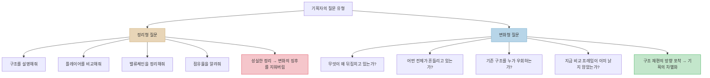
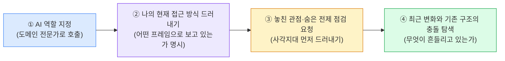
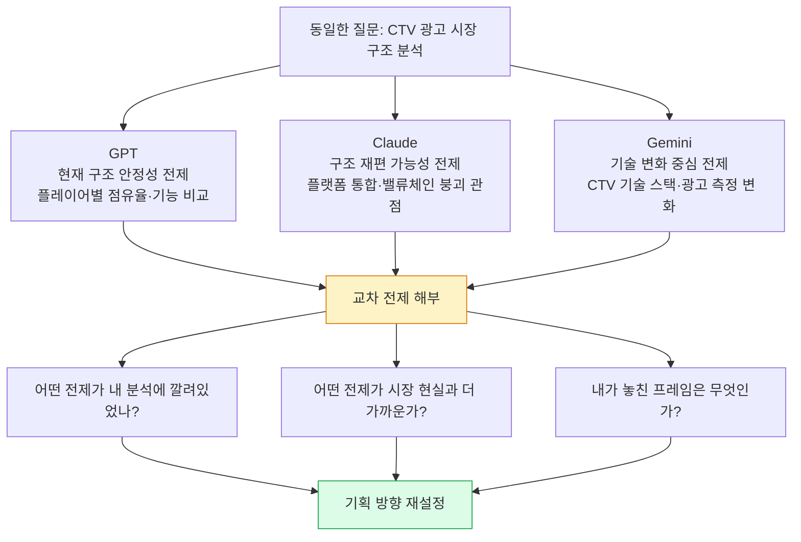
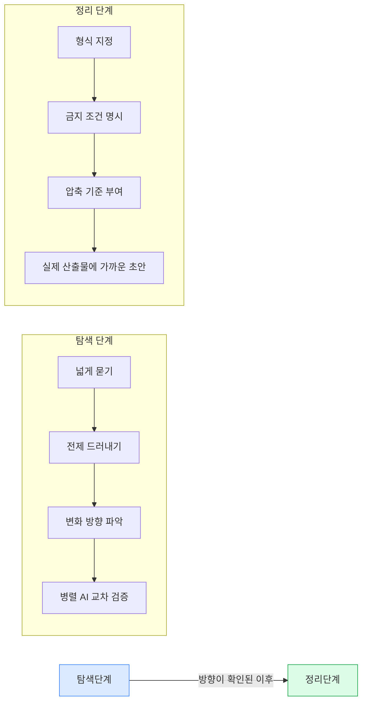
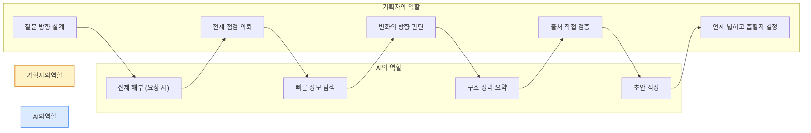

> 낯선 도메인에 던져진 서비스 기획자가 실무에서 배운 프롬프트 업그레이드
>
> 원문 출처: [요즘IT](https://yozm.wishket.com/magazine/detail/3737/) — 여행하는 기획자

---

## 개요

이 글은 서비스 기획자가 AI를 실무에서 활용할 때 품질이 쉽게 올라가지 않는 근본 원인을 파헤치고, 그 해결 방향으로서의 **질문 설계(프롬프트 재구성)** 전략을 다룬다. 단순히 "좋은 프롬프트 예시"를 나열하는 수준이 아니라, 기획자가 AI와 상호작용하는 방식 자체에 내재된 인식론적 오류를 지적하고, 실무 경험을 토대로 그 오류를 교정하는 구체적인 방법론을 제시한다.

핵심 명제는 하나다. **AI를 잘 쓰는 기획자는 더 좋은 답을 요구하는 사람이 아니라, 더 좋은 질문을 설계하는 사람이다.** 그리고 더 좋은 질문이란, 정보를 더 많이 가져오는 질문이 아니라 자신이 무엇을 당연하게 전제하고 있는지를 먼저 드러내는 질문이다.

---

## 1. 문제의 출발점 — AI를 많이 쓸수록 왜 일이 더 느려지는가?

### 1-1. 역설적인 경험

많은 기획자들이 AI 도구를 도입한 초기에 비슷한 경험을 한다. 처음에는 분명히 빨라진다. 검색 시간이 줄고, 초안 작성이 빨라지고, 자료 정리가 편해진다. 그런데 어느 순간부터 이상한 역설에 부딪힌다. AI가 내놓은 답을 고치고, 의심하고, 다시 검증하고, 다른 각도로 재질문하는 데 드는 시간이 원래 직접 작업하던 시간보다 오히려 더 길어지는 것이다.

이 역설의 원인을 많은 사람들은 AI의 성능 문제로 귀결시킨다. "이 모델은 아직 부족해", "할루시네이션이 심해", "도메인 지식이 얕아" 같은 평가들이다. 그러나 이 글의 저자는 여러 AI를 병렬로 돌려보면서 내린 결론이 전혀 달랐다고 말한다. **문제는 AI의 성능이 아니라, 자신이 처음 던진 질문의 전제에 있었다.**

### 1-2. 경력자일수록 더 위험한 이유

흥미로운 것은 이 문제가 AI 사용 경험이 적은 초보자보다 어느 정도 경력이 쌓인 기획자에게서 더 심하게 나타난다는 점이다. 경력자는 이미 특정 도메인에 대한 멘탈 모델이 형성되어 있다. 시장 구조에 대한 이해, 경쟁사 관계에 대한 선입견, 문제를 바라보는 특정 프레임 등이 이미 내면화되어 있다. 그 결과 AI에게 던지는 질문에는 자신도 모르는 전제들이 잔뜩 숨어들어간다.

정보를 모르는 것이 문제가 아니다. **무엇을 먼저 물어야 하는지를 잘못 잡는 것이 문제다.** AI는 질문을 받으면 매우 성실하게 답변한다. 질문이 잘못된 방향을 가리키고 있어도, AI는 그 방향으로 아주 정확하고 논리적으로 답을 내놓는다. 그리고 그 답변은 기획을 틀린 방향으로 더 빨리, 더 깊게 밀어붙이는 역할을 한다.

---

## 2. 실패 사례 분석 — CTV 광고 플랫폼 기획 투입기

### 2-1. 낯선 도메인에서의 전형적인 대응

저자는 광고 플랫폼 관련 업무에 갑작스럽게 투입되면서 이 교훈을 생생하게 배웠다. 데이터 시각화 분야에서 오랜 경험을 쌓았지만 광고 도메인은 처음이었다. C레벨 보고까지 준비해야 하는 상황에서 낯선 시장 구조를 빠르게 이해하고 경쟁 구도를 정리하고 차별화 포인트까지 도출해야 했다.

이 상황에서 저자가 선택한 것은 매우 전형적인 프롬프트 전략이었다.

```
"너는 10년 차 광고 플랫폼 기획자야.
CTV 광고 시장의 주요 플레이어를 경쟁사 관점에서 비교해줘.
Roku, Amazon, Google의 사업 구조와 점유율을 정리해주고,
밸류체인별 차이도 설명해줘."
```

이 프롬프트의 구조는 다음과 같다. 역할 부여 → 비교 대상 지정 → 정리 요청. 겉보기에는 꽤 구조적이고 명확한 프롬프트다. AI도 성실하게 답했다. 시장 구조는 깔끔하게 정리됐고, 플레이어 비교도 무난하게 나왔다. 저자는 그 내용을 바탕으로 보고서를 작성했고 초반 보고는 큰 문제 없이 마쳤다.

### 2-2. 균열의 발생 — 동료의 다른 프레임

문제는 이후에 터졌다. 다른 회의에서 동료의 발표를 들었는데, 저자가 정리한 방향과 전혀 다른 이야기가 나온 것이다. 저자가 기존 밸류체인을 정리하고 있었던 반면, 동료는 그 밸류체인 자체가 이미 흔들리고 있다고 말했다. 예컨대 Roku는 모든 영역을 자체적으로 통제하는 수직 통합 방향이 아니라, 파트너십 중심의 오픈 생태계 전략으로 이동하고 있다는 것이었다. 저자의 보고서에 담겼던 핵심 프레임과는 정반대 방향이었다.

그 순간의 깨달음이 이 글 전체의 핵심이다. **AI가 틀린 답을 준 게 아니었다. AI에게 시킨 일 자체가 이미 틀린 방향이었다.**

### 2-3. 숨어있던 두 개의 전제

저자는 그 실패 경험을 분석하면서 자신의 프롬프트에 숨어있던 두 가지 전제를 찾아냈다.

**전제 1.** 이 밸류체인은 지금도 유효하고 비교적 안정적이다.
**전제 2.** 내가 해야 할 일은 이 구조를 잘 이해하고 정리하는 것이다.

그러나 실제 시장은 그 구조 자체를 재편하는 중이었다. 저자가 봐야 했던 것은 "무엇이 무엇과 다른가"가 아니라 "무엇이 왜 뒤집히고 있는가"였다. 정리형 질문을 던졌고, AI는 아주 성실하게 정리형 답변을 내놓았다. 정확한 답이었지만, 방향이 틀렸다.

---

## 3. 핵심 개념 — 정리형 질문 vs. 변화형 질문

이 글에서 가장 중요한 개념적 구분이 여기에 있다. **정리형 질문과 변화형 질문의 차이.**



정리형 질문은 현재 상태를 이해하고 문서화하는 데 적합하다. 그러나 시장이 빠르게 변하거나 기존 구조가 재편되는 상황에서는 오히려 위험하다. 정리형 질문이 지배하면, AI는 현존하는 구조를 안정적인 것으로 전제한 채 깔끔하게 요약해버린다. 그 요약은 변화의 징후를 지워버리는 역할을 하게 된다.

변화형 질문은 이와 반대로 작동한다. 무엇이 흔들리고 있는지, 어떤 전제가 더 이상 유효하지 않은지, 누가 기존 구조를 우회하고 있는지를 묻는다. 이 질문들은 기획자가 지금 어떤 프레임 안에 갇혀 있는지를 먼저 드러낸다.

서비스 기획 실무에서 특히 이 차이가 치명적으로 작동하는 상황들이 있다. 낯선 시장을 처음 이해해야 할 때, 새로운 서비스의 방향을 정의해야 할 때, 경쟁사 분석 프레임을 재설정해야 할 때, 이해관계자들 사이의 다른 관점을 조율해야 할 때가 그렇다. 이 단계에서 초반 질문이 잘못되면, 이후의 모든 산출물이 그 방향을 따라가게 된다.

---

## 4. 해법 1 — 사각지대 먼저 묻기

### 4-1. 프롬프트의 전환

이 경험 이후 저자의 프롬프트 방식이 근본적으로 바뀌었다. 예전에는 "정리해줘, 비교해줘, 설명해줘"로 시작했다면, 지금은 먼저 이렇게 묻는다.

```
"네가 이 도메인을 맡은 서비스 기획자라면 지금 무엇부터 물어보겠어?
내가 지금 어떤 접근으로 이 문제를 보고 있는지 먼저 짚고,
그 접근에 깔린 전제가 무엇인지 말해줘.
그리고 최근 변화가 기존 구조를 어떻게 흔들고 있는지부터 설명해줘."
```

이 프롬프트와 앞서 실패한 프롬프트의 차이는 표면적으로는 크지 않아 보인다. 그러나 구조적으로는 완전히 다른 방향을 가리킨다.

실패한 프롬프트는 **답변을 요청**했다. 새 프롬프트는 **전제 점검을 요청**한다. 이 차이가 AI의 응답 방식 자체를 바꾼다.

### 4-2. AI가 돌려주는 질문들

이런 방식으로 묻자, AI는 다음과 같은 종류의 질문들을 되돌려주었다.

- "이 구조를 누가 우회하고 있는가?"
- "지금 비교 프레임이 이미 낡은 것은 아닌가?"
- "당신이 당연하다고 보는 질서가 실제로는 해체되는 중인 것은 아닌가?"
- "경쟁사 비교 중심 접근은 '누가 잘하나'를 보는 프레임인데, 지금 시장은 '누가 구조를 바꾸나'의 싸움이 아닌가?"

바로 이 지점에서 기획이 달라진다. AI가 정리해주는 결론을 받는 것이 아니라, 내가 어떤 순서로 질문을 세워야 하는지를 먼저 확인하게 되는 것이다.

### 4-3. 핵심 명제

이 경험으로부터 저자가 도달한 명제는 다음과 같다.

> **좋은 프롬프트는 정보를 더 많이 가져오는 프롬프트가 아니다.
> 내가 무엇을 당연하게 보고 있는지를 먼저 드러내는 프롬프트다.
> 서비스 기획자에게 AI는 답변 엔진이기 전에, 전제 점검 도구가 되어야 한다.**

---

## 5. 해법 2 — 4단계 프롬프트 구조

### 5-1. 구조의 구성

저자가 실무에서 정착시킨 프롬프트 구조는 네 가지 단계로 이루어진다.



이 구조를 채운 실제 템플릿은 다음과 같다.

```
"네가 [내 역할]을 맡은 서비스 기획자라면,
지금 이 문제에서 무엇부터 확인하겠어?
내가 현재 [내 접근 방식]으로 접근하고 있는데,
이 접근의 전제와 사각지대를 먼저 짚어줘.
특히 최근 [업계 변화/주요 사건]가 기존 [구조/관행]을
어떻게 흔들고 있는지 중심으로 정리해줘."
```

### 5-2. 이 구조의 작동 원리

이 프롬프트 구조의 핵심 강점은 AI가 결론을 내리기 전에 **질문 목록을 먼저 생성하게 만든다**는 데 있다. AI가 나 대신 답을 내려주는 게 아니라, 내가 어떤 순서로 생각해야 하는지를 보여주는 역할을 한다.

그 결과는 구체적이다. 회의 전에 준비해야 할 질문의 내용이 달라진다. 보고서 첫 장에 놓이는 문제 정의의 방향이 달라진다. "무엇을 정리할 것인가"보다 "무엇을 의심할 것인가"가 먼저 결정된다.

### 5-3. 이 구조가 특히 강하게 작동하는 상황

저자가 제시하는, 이 4단계 프롬프트 구조가 특히 효과적인 업무 상황은 다음과 같다.

- 처음 투입된 시장 구조를 파악해야 할 때
- 경쟁사 분석 프레임을 처음부터 설계해야 할 때
- 신규 서비스의 방향과 포지셔닝을 정의해야 할 때
- 특정 정책이나 기준을 새롭게 설계해야 할 때
- 이해관계자들 사이에 상충하는 관점을 조율해야 할 때

공통점이 있다. 모두 **초반 질문 방향이 이후 모든 산출물의 전제가 되는** 단계들이다. 이 단계에서의 오류는 나중에 문장을 아무리 잘 다듬어도 교정되지 않는다. 결국 엇나간 답안을 예쁘게 정리하는 데 그치게 된다.

---

## 6. 해법 3 — 병렬 AI 활용과 전제 해부

### 6-1. 여러 AI를 교차 검증 도구로 쓰기

저자가 제시하는 또 하나의 실전 방법론은 GPT, Gemini, Claude를 병렬로 활용하되, 단순한 결과 비교가 아니라 **한 모델의 답변을 다른 모델에게 넘겨 전제를 해부하게 하는** 방식이다.

```
"다음은 [다른 AI]가 정리한 분석이야.
이 분석의 전제 세 가지를 짚어줘.
그리고 그 전제들이 지금 시점에 흔들리고 있다면
결론이 어떻게 달라지는지 반박해줘."
```

### 6-2. 단순 팩트 체크를 넘어서

이 방법론의 핵심은 단순한 팩트 체크가 아니다. **프레임 차이를 드러내는 것**이다. 어떤 모델은 구조의 안정성을 전제하고 답한다. 다른 모델은 구조의 해체 가능성을 전제한다. 두 답을 나란히 놓고 보면, 자신이 어떤 질문 프레임 안에 갇혀 있었는지가 비로소 보이게 된다.



### 6-3. 정보량보다 질문의 각도

저자는 이 경험을 통해 실무에서의 차이를 이렇게 정리한다. 같은 시장 데이터, 같은 사례, 같은 키워드를 보고도 누군가는 정리만 하고 끝나고, 누군가는 변화의 방향까지 짚어낸다. 그 차이는 정보량에서 오지 않는다. **질문의 각도에서 온다.**

---

## 7. 해법 4 — 출처 검증의 방식 재정의

### 7-1. 링크를 받는 것으로는 부족하다

AI가 생성하는 답변을 검증하는 방식에 대해서도 저자는 중요한 전환점을 이야기한다. 많은 사람들이 AI 답변을 검증할 때 사실관계부터 확인하려 한다. 그러나 시장 구조나 전략 방향 같은 문제에서는 사실 여부만으로는 부족하다. **어떤 전제를 깔고 그 사실을 배열했는지를 봐야 한다.** 그래야 같은 정보로도 왜 다른 결론이 나오는지를 이해할 수 있다.

전략 변화, 시장 방향, 사업 구조에 관한 핵심 문장들은 반드시 공식 출처로 다시 확인해야 한다. 그러나 이전의 방식인 "출처를 알려줘"라는 요청은 AI가 그럴듯한 URL을 생성해버리는 문제가 있었다. 그래서 저자는 프롬프트를 이렇게 바꿨다.

```
"이 내용의 근거가 되는 공식 블로그 포스트, IR 자료,
컨퍼런스 발표의 제목과 발행일을 알려줘.
내가 직접 검색해서 실존 여부를 확인할 수 있어야 해."
```

### 7-2. 검증 방식의 전환

이렇게 하면 검증의 방법 자체가 달라진다. **링크를 믿는 것이 아니라, 제목과 날짜를 기준으로 직접 확인하는 방식**으로 전환된다. 이 과정은 번거로워 보이지만, 보고서 한 장을 잘못 작성하고 나중에 전면 수정해야 하는 비용과 비교하면 훨씬 효율적이다. 저자에게 이 확인 과정은 선택이 아닌 기본 루틴이 됐다.

---

## 8. 해법 5 — 탐색은 넓게, 정리는 좁게

### 8-1. 정리 단계의 역설

탐색 단계에서 AI를 넓게 사용하는 것과 동일하게 중요한 반대 원칙이 있다. **정리 단계에서는 반대로 AI를 좁게 써야 한다는 것이다.**

많은 조사를 마친 뒤 마지막에 "지금까지 내용을 정리해줘"라고 던지면, AI는 친절하게 답하지만 그 결과물은 기획서 초안으로 바로 활용하기 어렵다. 문장은 그럴듯한데 공허하고, 예쁘지만 추상적이며, 실제 산출물 형식과도 맞지 않는다. AI는 형식이 주어지지 않으면 빈칸을 채우려 하고, 금지 조건이 없으면 익숙하고 원론적인 표현으로 빠져나간다.

### 8-2. 제약을 거는 프롬프트

정리 단계에서는 질문을 열지 말고, 오히려 제약을 주어야 한다. **형식을 지정하고, 금지 조건을 명시한다.**

**사용자 시나리오 정리 예시:**
```
"사용자 시나리오 3개를 작성해줘.
각 시나리오는 상황 → 동기 → 행동 → 감정 변화 순서로 정리하고,
각 항목은 실제 사용 맥락이 드러나야 해.
각 시나리오는 3문장 이내로 압축해줘."
```

**UX 개선안 정리 예시:**
```
"스마트홈 앱의 UX 개선안을 제시해줘.
단, 원론적 해결책 금지,
기술 난이도를 무시한 아이디어 금지,
단순히 예쁘게 바꾸자는 디자인 제안 금지.
각 개선안은 '어떤 사용자의, 어떤 상황에서, 왜 필요한가'로 시작해줘."
```

### 8-3. 탐색·정리의 이중 구조



이 이중 구조가 작동할 때, AI는 "뭐라도 채우자" 모드에서 벗어나게 된다. 탐색 단계의 산출물이 변화의 방향을 포착하고, 정리 단계의 산출물이 실제 쓸 수 있는 초안으로 나온다. **AI를 잘 쓰는 기획자는 많이 묻는 사람이 아니라, 언제 넓히고 언제 좁힐지 아는 사람이다.**

---

## 9. AI 활용이 가져온 의외의 변화 — 동료의 말이 더 잘 들린다

저자가 공유하는 가장 의외의 변화는 AI를 많이 쓸수록 오히려 사람의 말을 더 잘 듣게 됐다는 점이다. 예전에는 동료의 발표를 들을 때 "어차피 나도 GPT, Gemini 쓰는데 서로 비슷한 자료를 찾았겠지"라는 생각이 많았다. 지금은 다르게 바라본다. **중요한 것은 정보 자체가 아니라, 그 사람이 어떤 질문에서 출발했는가다.**

"왜 나는 같은 AI를 쓰고도 저 관점을 못 봤을까?" "무엇을 먼저 물었기에 저 사람은 구조 변화부터 봤을까?" 회의에서 진짜 배워야 할 것은 종종 답이 아니라 **질문의 출발점**이다.

---

## 10. 기획자의 역할 재정의 — 질문 설계자로서의 기획자

### 10-1. AI 시대에 기획자 역할의 이동

저자는 서비스 기획자의 역할이 점점 질문 설계 쪽으로 이동하고 있다고 말한다. 정보는 넘치고, 답도 넘친다. 하지만 어떤 질문을 먼저 세울지는 여전히 사람의 몫이다. 특히 AI가 너무 매끄럽게 답할수록 더 주의가 필요하다. 매끄러운 답은 종종 틀린 방향을 가리키고, 성실한 정리는 변화의 징후를 지워버린다.

AI가 화려하고 논리적으로 답할수록, 기획자의 경쟁력은 그 답을 그대로 받아들이지 않는 데서 생긴다. **남들이 결론부터 쓰려 할 때, 변화의 방향을 의심하고 전제부터 점검하는 태도가 더 중요해진다.**

### 10-2. 기획자와 AI의 역할 분담



AI는 답변 엔진으로서 탁월하다. 그러나 그 답변의 품질은 질문의 방향에 의해 결정된다. 기획자가 AI에게 위임할 수 없는 것, 그것이 바로 질문 설계다. 어떤 전제를 검증해야 하는지, 어떤 변화의 방향을 먼저 봐야 하는지, 어떤 프레임을 의심해야 하는지는 기획자의 판단 영역에 남는다.

---

## 11. 실전 정리 — 사용 가능한 프롬프트 패턴 모음

### 11-1. 사각지대 탐색 프롬프트

**목적:** 초반 탐색 단계, 낯선 도메인 진입 시
```
"네가 [역할]을 맡은 서비스 기획자라면,
지금 이 문제에서 무엇부터 확인하겠어?
내가 현재 [나의 접근 방식]으로 접근하고 있는데,
이 접근의 전제와 사각지대를 먼저 짚어줘.
특히 최근 [업계 변화/사건]가 기존 [구조/관행]을
어떻게 흔들고 있는지 중심으로 정리해줘."
```

### 11-2. 교차 전제 해부 프롬프트

**목적:** 이미 확보한 AI 분석의 프레임 검증 시
```
"다음은 [다른 AI]가 정리한 분석이야.
[분석 내용 붙여넣기]

이 분석이 암묵적으로 깔고 있는 전제 3가지를 짚어줘.
그 전제들 중 지금 시장 변화 때문에 흔들리고 있는 것이 있다면 설명해줘.
[사례]에서 특히 다시 확인해야 할 주장 3개를 골라줘.
각 주장마다 공식 블로그, IR 자료, 컨퍼런스 발표 기준으로
어떤 종류의 출처를 확인해야 하는지 적어줘.
마지막에는 지금 상태에서 그대로 보고서에 쓰면 위험한 문장 2개를 써줘.

출력 형식: 숨은 전제 / 흔들리는 이유 / 재확인할 주장 / 확인할 출처 종류 / 위험한 문장"
```

### 11-3. 정리형 제약 프롬프트

**목적:** 조사 완료 후 실제 산출물 초안 생성 시
```
"지금까지 정리한 내용을 바탕으로 [산출물 유형]을 작성해줘.

단, 아래 조건을 반드시 지켜줘.
- 각 항목은 [형식 지정] 순서로 정리
- 각 항목은 [분량 제한] 이내로 압축
- [금지 조건 1] 금지
- [금지 조건 2] 금지
- 반드시 [필수 포함 요소]로 시작할 것

출력 형식: [구체적 형식 지정]"
```

### 11-4. 출처 검증 프롬프트

**목적:** 핵심 주장의 근거 확인 시
```
"이 내용의 근거가 되는 공식 블로그 포스트, IR 자료,
컨퍼런스 발표의 제목과 발행일을 알려줘.
내가 직접 검색해서 실존 여부를 확인할 수 있어야 해."
```

---

## 12. 이 글이 가진 한계와 비판적 보완점

이 글은 서비스 기획자의 실무 경험에서 나온 관찰과 통찰로서 상당히 유용하다. 그러나 몇 가지 측면에서 보완적 시각이 필요하다.

**첫째,** "전제 점검형 질문"이 항상 최선은 아니다. 이미 전제가 명확하고 구조가 안정적인 도메인에서는 정리형 질문이 더 효율적이다. 어떤 질문 유형이 적합한지의 판단 자체도 도메인 이해에서 나오며, 처음 접하는 분야에서 이 판단을 내리는 것 자체가 어렵다는 순환 문제가 있다.

**둘째,** 병렬 AI 교차 검증 방법론은 효과적이지만, 세 모델이 모두 동일한 학습 데이터 편향을 공유하는 경우 교차 검증의 효과가 제한될 수 있다. 모델 간 차이가 실제 세계의 다양한 관점을 반영하는 것인지, 아니면 학습 데이터 편향의 차이를 반영하는 것인지를 구분하는 것도 기획자의 판단이 필요한 영역이다.

**셋째,** 이 방법론은 질문 설계에 상당한 메타인지 능력을 전제한다. "내가 지금 어떤 전제를 갖고 있는가"를 스스로 인식하고 AI에게 명시할 수 있는 능력 자체가 상당한 경험의 산물이다. 이 방법론이 초보 기획자에게 얼마나 적용 가능한지는 별도의 고민이 필요하다.

---

## 13. 결론 — 프롬프트 하나가 기획의 방향을 바꾼다

이 글의 마지막 메시지는 간결하다. "정리해줘" 대신 "내가 놓친 전제를 먼저 짚어줘"로 프롬프트를 바꾸는 것. 이것은 단순히 표현을 다듬는 일이 아니다. 기획의 방향 자체를 바꾸는 일이다.

AI 시대에 기획자의 경쟁력은 더 이상 정보 수집 능력이나 문서 작성 속도에서 오지 않는다. 어떤 전제를 의심해야 하는지, 어떤 변화를 먼저 봐야 하는지, 어떤 질문을 처음에 세워야 하는지를 아는 능력에서 온다.

AI가 매끄럽게 답할수록, 그 답에 깔린 전제를 먼저 점검하는 기획자의 가치는 더 올라간다. 그것이 이 글이 전달하는 핵심이다.

---

*작성일: 2026년 5월 4일*
*원문: [AI를 잘 쓰는 기획자는 왜 질문부터 다를까? — 요즘IT](https://yozm.wishket.com/magazine/detail/3737/)*
