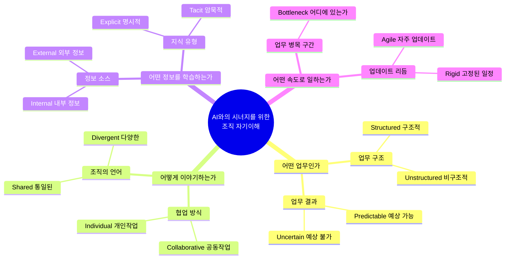
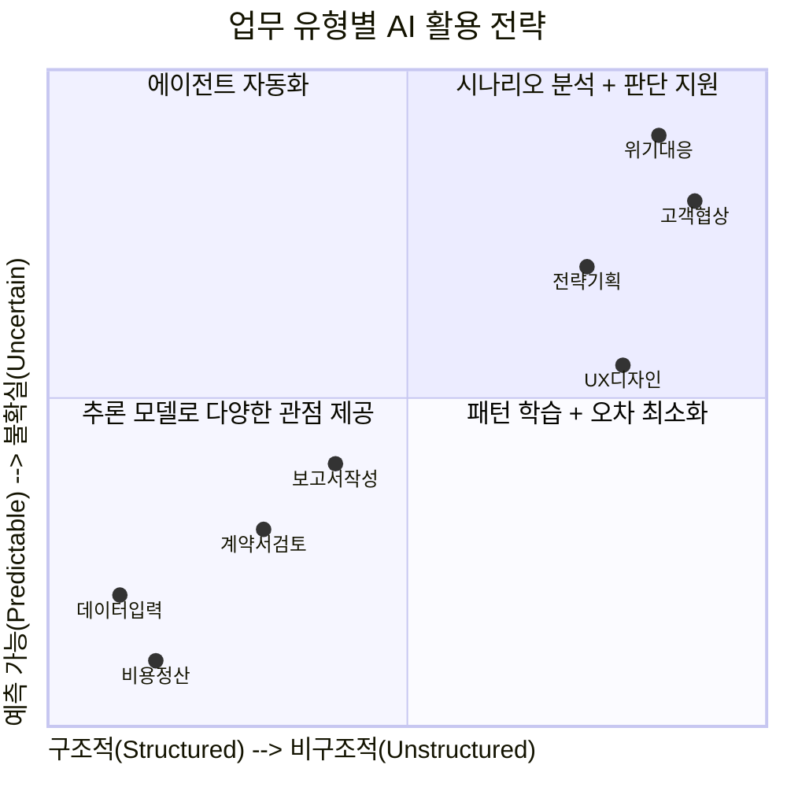
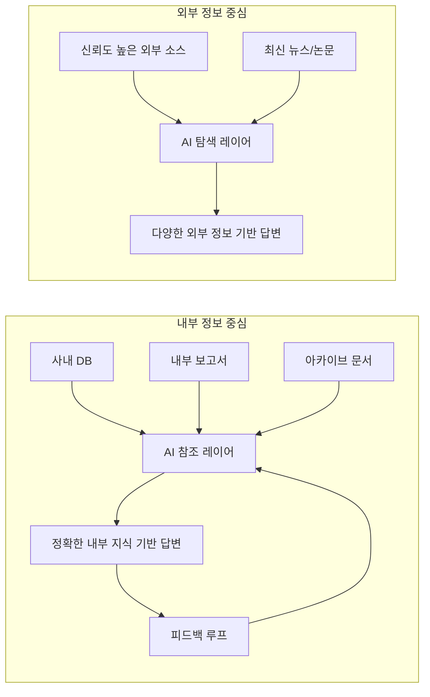
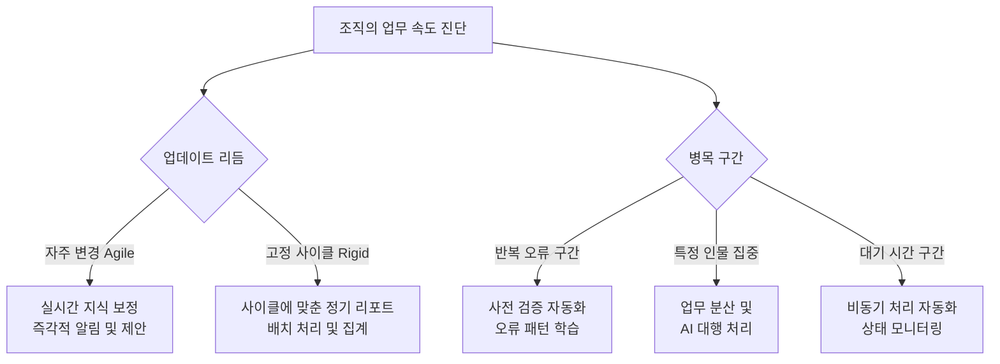
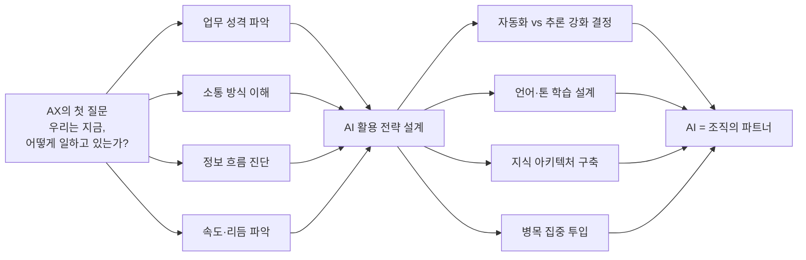

> **원문 출처:** pxd story (Seungyoon Lee, 2026.02.03)  
> **요약 게재:** 요즘IT (2026.05.02)  
> **원문 링크:** https://story.pxd.co.kr/1877 / https://yozm.wishket.com/magazine/detail/3738/

---

## 들어가며 — 왜 AI는 기대만큼 작동하지 않는가

AI가 조직에 도입된 지 꽤 됐는데, 실제 현장의 반응은 여전히 미지근하다. 성능 문제가 아니다. 모델의 정확도와 처리 속도는 충분히 올라왔다. 그런데도 구성원들은 "별로 쓸모가 없다"거나 "오히려 번거롭다"고 한다. 왜 이런 괴리가 생기는 걸까.

pxd의 Seungyoon Lee는 그 이유를 조직 자기인식의 부재에서 찾는다. 아무리 성분이 좋은 화장품이라도 내 피부 타입을 모르고 바르면 효과가 없거나 오히려 트러블이 생긴다. AI도 마찬가지다. 좋은 모델을 들여왔더라도, 우리 조직이 어떻게 일하는지를 AI에게 제대로 알려주지 않으면 그 AI는 '비싼 화장품'에 그치고 만다. 소크라테스의 "너 자신을 알라(Gnothi Seauton)"는 2,500년이 지난 지금, AI 전환(AX, AI Transformation)의 첫 번째 원칙이 된다.

이 글은 그 전제 위에서 출발한다. AI가 조직 구성원과 진정한 시너지를 내려면, AI에게 먼저 '우리 조직이 어떻게 일하는가'를 알려줘야 한다. 그리고 그 앎을 구성하는 핵심 주제를 4가지 축으로 정리한다.

---

## 전체 구조 한눈에 보기

아래는 본문에서 제시하는 4가지 주제와 각각의 하위 차원을 도식화한 것이다.

이 4가지 주제는 순차적으로 쌓이는 구조다. 업무의 성격을 파악하고, 소통 방식을 이해하고, 학습할 정보의 성질을 규정하고, 마지막으로 일의 속도와 리듬을 파악해야 비로소 AI를 조직에 '맞춤 장착'할 수 있다.

---

## 주제 1. 어떤 업무인가 — 업무의 성격과 결과를 정의하라

### 1.1 업무 구조: 구조적(Structured) vs. 비구조적(Unstructured)

가장 먼저 물어야 할 것은 업무가 얼마나 정형화되어 있느냐다. 구조적 업무란 명확한 절차와 규칙이 있고, 표준화된 입력 형식(양식, 템플릿, 데이터 포맷)이 존재하며, 결과의 품질 기준이 미리 정해진 업무를 말한다. 비용 정산, 계약서 검토, 데이터 입력 등이 여기에 해당한다. 반면 비구조적 업무는 상황마다 다른 형태로 진행되고, 결과에 대한 주관적 판단이 개입하며, 다양한 해석이 공존한다. 전략 기획, UX 디자인, 대외 협상 같은 업무가 그 예다.

AI 활용 전략은 이 구분에 따라 완전히 달라진다. 구조적 업무에는 **에이전트 자동화**가 효과적이다. 반복적이고 예측 가능한 작업을 AI가 알아서 처리하게 하면 속도와 정확도가 함께 올라간다. 비구조적 업무에는 **추론 모델 강화**가 맞다. AI가 정답을 내놓는 게 아니라, 다양한 관점을 제시하고 판단의 폭을 넓혀주는 역할로 써야 한다.

흔히 발생하는 실수는 비구조적 업무에 구조적 AI를 붙이거나, 그 반대로 하는 경우다. 전략 기획 회의에서 AI가 자꾸 단일 결론을 제시하거나, 단순 반복 업무에서 AI가 장황하게 해석을 덧붙인다면, 그건 모델의 문제가 아니라 AI를 어떻게 세팅했느냐의 문제다.

스스로에게 던져볼 진단 질문들은 다음과 같다.
- 업무가 명확한 절차와 규칙에 따라 반복 수행되는가?
- 표준화된 입력 형식이 존재하는가?
- 결과의 품질 기준이 명확히 정의되어 있는가, 아니면 주관적 평가의 여지가 있는가?
- 업무가 상황마다 다른 형태로 진행되는가?

### 1.2 업무 결과: 예측 가능(Predictable) vs. 불확실(Uncertain)

업무의 결과물이 얼마나 예측 가능한가도 핵심 변수다. 비용 정산처럼 정해진 규칙에 따라 결과가 거의 확정되는 업무가 있는 반면, 위기 대응이나 고객 협상처럼 변수가 너무 많아서 어떤 결과가 나올지 사전에 알 수 없는 업무도 있다.

예측 가능한 업무에서 AI의 강점은 **빠른 실행과 오차 최소화**다. 패턴을 학습한 AI는 사람보다 빠르고 정확하게 결과를 도출한다. 반면 불확실한 업무에서는 AI가 결과를 내놓기보다 **과정을 지원**하는 역할이 더 적합하다. 다양한 시나리오를 시뮬레이션하고, 비교 분석을 제공하고, 의사결정자가 더 나은 판단을 내릴 수 있도록 인사이트를 공급하는 것이다.

중요한 것은 실패 시의 파급 효과다. 업무 중 실수가 발생했을 때 즉각 수정이 가능한지, 아니면 연결된 다른 업무까지 줄줄이 영향을 받는지에 따라 AI 자동화의 리스크 수준이 달라진다. 파급 범위가 클수록 AI 자율 실행보다 인간-AI 협업 구조가 안전하다.

---

## 주제 2. 어떻게 이야기를 나누는가 — 커뮤니케이션 문화를 이해하라

업무의 성격을 파악했다면, 이번에는 그 업무가 어떤 방식으로 소통되는지를 봐야 한다. AI가 조직에 맞는 언어로 말하고, 적절한 타이밍에 개입할 수 있어야 진정한 협력이 된다.

### 2.1 협업 방식: 공동작업(Collaborative) vs. 개인작업(Individual)

어떤 조직은 모든 것이 팀 단위로 움직인다. 의사결정 하나에도 여러 부서가 참여하고, 작업 결과물이 항상 여러 사람 손을 거친다. 반면 전문가 개인의 독립적 작업이 중심인 조직도 있다.

협업 중심 조직에서 AI는 **커뮤니케이션 허브** 역할을 할 수 있다. 언제 어떤 구성원에게 협업 요청을 보내야 하는지 추천하고, 여러 사람이 만들어낸 결과물을 통합 관리하는 식이다. 개인 작업 중심 조직에서는 AI가 특정 개인의 업무 맥락과 히스토리를 깊이 있게 학습해서 개인 비서처럼 작동하는 것이 더 유용하다.

진단 질문으로는 이런 것들이 있다.
- 업무 시 동료 의존도가 높은가?
- 부서 간 협력이 잦고 중요한가?
- 의사결정에 여러 사람이 참여하는가?

### 2.2 조직의 언어: 통일된(Shared) vs. 다양한(Divergent)

이 부분은 생각보다 훨씬 중요하다. 같은 단어라도 조직마다 의미가 다르다. '인사이트'만 해도 어떤 회사에서는 데이터 기반 분석 결과를 뜻하고, 어떤 회사에서는 경험적 직관을 의미하기도 한다. AI가 이런 조직 고유의 언어 맥락을 이해하지 못하면, 아무리 유창하게 답변을 내놔도 현장에서는 "엉뚱한 소리"가 된다.

더 나아가 대화 상대에 따라 톤과 전문성 수준도 달라져야 한다. 임원 보고용 문서와 팀 내 공유 문서의 언어는 다르다. 외부 고객을 대상으로 한 커뮤니케이션과 내부 유관 부서 협업 메시지는 결이 다르다. 원문에서 제시하는 예시처럼 "상무님이 검토할 예정인데 상무님 기준에 맞춰 검토해 줘"라는 프롬프트를 AI가 이해하고 그에 맞는 결과물을 내놓으려면, 조직의 언어 생태계 전반을 학습해야 한다.

이를 위해 점검해야 할 사항은 다음과 같다.
- 조직 내 고유 용어와 약어는 무엇인가?
- 우리 조직의 문서·회의·보고에서 쓰이는 언어의 톤 앤 매너는 어떠한가?
- 표현 방식이 표준화되어 있는가, 아니면 문맥마다 달라지는가?

언어 표준화 수준이 높은 조직일수록 AI에게 가이드라인을 명확하게 줄 수 있고, 그만큼 AI의 출력 품질도 올라간다. 언어가 다양하고 맥락 의존적인 조직은 AI가 더 많은 예시와 사례를 통해 학습해야 한다.

---

## 주제 3. 어떤 정보를 학습하는가 — 지식의 원천과 성격을 파악하라

AI는 어떤 정보를 학습하느냐에 따라 출력의 질이 결정된다. 이 섹션은 AI에게 '무엇을 먹여야 하는가'를 다룬다.

### 3.1 정보 소스: 내부 정보(Internal) vs. 외부 정보(External)

업무에 필요한 정보가 주로 조직 내부에서 오는가, 외부에서 오는가에 따라 AI 아키텍처가 달라진다.

내부 정보 중심 업무라면, 사내 DB, 보고서, 아카이브 문서 등을 AI가 정확하게 참조할 수 있도록 구축해야 한다. 이때 중요한 것은 **정보 품질 관리**와 **피드백 루프**다. 쌓이는 정보와 실제로 쓰이는 정보 사이의 간극이 크면 AI는 오래된 지식을 기반으로 엉뚱한 답변을 내놓는다. 정보가 업데이트되는 동시에 AI의 참조 데이터도 갱신되는 구조를 만들어야 한다.

외부 정보 중심 업무라면, AI가 최신의 다양한 정보를 탐색하되 신뢰도 높은 소스를 우선하도록 설계해야 한다. 무분별한 웹 크롤링이 아니라, 업무 도메인에 맞는 검증된 외부 소스를 선별해 AI에게 연결해주는 것이 핵심이다.

### 3.2 지식 유형: 명시적 지식(Explicit) vs. 암묵적 지식(Tacit)

조직의 진짜 알짜 지식은 두 가지로 나뉜다. 하나는 문서화되어 클라우드나 사내 시스템에 정리된 **명시적 지식(Explicit Knowledge)** 이고, 다른 하나는 경험 많은 시니어의 머릿속이나 팀의 비공식 네트워크 안에만 존재하는 **암묵적 지식(Tacit Knowledge)** 이다.

명시적 지식은 AI가 비교적 쉽게 학습할 수 있다. 구조화된 데이터를 RAG(Retrieval-Augmented Generation) 방식으로 연결하면 된다. 문제는 암묵지다. "우리 팀에서 이 상황이 오면 이렇게 대응한다"는 룰, "이 고객은 이런 식으로 커뮤니케이션해야 한다"는 경험, "이 포맷은 상무님이 싫어하신다"는 관행 — 이런 것들은 문서에 없다. 특정 사람에게 물어봐야만 알 수 있다.

AX에서 암묵지는 가장 어렵고 가장 중요한 과제다. 암묵지를 AI가 학습하게 하려면, 그것이 먼저 **명시화**되어야 한다. 시니어 구성원의 판단 패턴을 인터뷰로 기록하거나, 자주 묻는 질문과 답변을 FAQ로 전환하거나, 업무 맥락이 녹아있는 슬랙 대화나 미팅 노트를 정제된 데이터로 변환하는 식이다. '암묵지가 정보화될 수 있는 경험을 설계하는 것'이 원문에서 강조하는 지점이기도 하다.

---

## 주제 4. 어떤 속도로 일하는가 — 업무 리듬과 병목을 파악하라

마지막 주제는 업무의 흐름과 속도다. AI가 언제 어떻게 개입할지 결정하려면 우리 조직이 어떤 속도로, 어떤 리듬으로 움직이는지 알아야 한다.

### 4.1 업무 병목 구간(Bottlenecks)

병목이란 전체 흐름에서 유독 진행이 더딘 구간이다. 반복적으로 오류가 나는 단계, 특정 사람에게 모든 결재가 몰리는 지점, 외부 응답을 기다리느라 업무가 멈추는 순간 등이 병목의 전형적인 형태다.

AI는 바로 이 병목 구간에 집중 투입될 때 가장 큰 효과를 낸다. 시간이 많이 걸리는 단계를 자동화하거나, 오류가 자주 발생하는 구간에서 사전 검증 기능을 수행하거나, 특정 사람에게 집중된 부담을 분산시키는 역할을 할 수 있다.

자신의 업무를 돌아볼 때 이렇게 물어보자.
- 가장 시간이 많이 걸리는 단계는 어디인가?
- 오류가 자주 발생하는 구간은 어디인가?
- 병목이 특정 사람이나 특정 상황에서 집중적으로 발생하는가?

### 4.2 업데이트 리듬: 애자일(Agile) vs. 리지드(Rigid)

업무 기준과 정책이 얼마나 자주 바뀌는지, 보고와 업데이트가 수시로 이루어지는지 아니면 정해진 사이클에 따라 일괄 진행되는지도 AI 설계에 영향을 미친다.

자주 업데이트되는 애자일한 조직에서는 AI가 실시간으로 지식을 보정하고 변경 사항을 반영할 수 있어야 한다. 반면 고정된 사이클로 움직이는 리지드한 조직에서는 정해진 보고 시점에 맞춰 AI가 정보를 집계하고 정리해서 제공하는 방식이 더 자연스럽다.

리듬의 불일치가 발생할 때 AI는 오히려 역효과를 낸다. 보고 주기가 월 1회인데 AI가 매일 알림을 띄우거나, 실시간 업데이트가 필요한데 AI가 주간 단위로만 정보를 반영한다면, 그 조직에서 AI는 도움이 아니라 소음이 된다.

---

## 종합 프레임워크 — 8개 축으로 보는 조직-AI 매핑

4가지 주제, 8개 하위 차원을 통합하면 다음과 같은 진단 프레임이 만들어진다.

| 주제 | 하위 차원 | 스펙트럼 |
|------|-----------|---------|
| **1. 어떤 업무인가** | 업무 구조 | 구조적(Structured) ↔ 비구조적(Unstructured) |
| | 업무 결과 | 예측 가능(Predictable) ↔ 불확실(Uncertain) |
| **2. 어떻게 이야기하는가** | 협업 방식 | 공동작업(Collaborative) ↔ 개인작업(Individual) |
| | 조직의 언어 | 통일된(Shared) ↔ 다양한(Divergent) |
| **3. 어떤 정보를 학습하는가** | 정보 소스 | 내부 정보(Internal) ↔ 외부 정보(External) |
| | 지식 유형 | 명시적(Explicit) ↔ 암묵적(Tacit) |
| **4. 어떤 속도로 일하는가** | 병목 구간 | 어디에 존재하는가(Bottleneck) |
| | 업데이트 리듬 | 자주(Agile) ↔ 고정 일정(Rigid) |

이 표는 단순한 요약이 아니다. 각 축에 대해 자신의 조직이 어느 위치에 있는지를 판단하는 것, 그 자체가 AX 전략의 출발점이다. 구조적이고 예측 가능한 업무가 많다면 에이전트 자동화를 적극적으로 검토해야 한다. 비구조적이고 불확실한 업무가 많다면 추론 강화 모델과 인간-AI 협업 설계에 집중해야 한다. 조직의 언어가 통일되어 있다면 프롬프트 표준화가 비교적 쉽고, 다양하다면 맥락별 프롬프트 설계가 필요하다.

---

## AX란 무엇인가 — 기술이 아닌, 일하는 방식의 재설계

이 글의 결론은 한 문장으로 압축된다.

> **AI 전환(AX)은 기술 프로젝트가 아니라, 사람이 일하는 방식을 다시 설계하는 프로젝트다.**

이 말의 무게를 제대로 이해하려면 기존의 '디지털 전환(DX, Digital Transformation)' 접근 방식과 비교해야 한다. DX는 종종 시스템을 교체하거나 플랫폼을 도입하는 방식으로 진행됐다. 새로운 툴을 사면 업무가 바뀐다고 믿었다. 그 결과 조직에는 아무도 쓰지 않는 시스템이 넘쳐났다. AX는 그 실패를 반복해선 안 된다.

AI가 제아무리 정교해도, 우리 조직의 업무 구조, 커뮤니케이션 문화, 지식 흐름, 일의 리듬을 이해하지 못한 채 붙여놓으면 '비싼 화장품' 신세를 면치 못한다. 진짜 AX는 모델 도입이 아니라 **조직 자기이해**에서 시작한다.

구조화된 업무에는 자동화의 날개를 달아주고, 비구조적인 고민에는 추론의 깊이를 더한다. 조직의 언어를 AI에게 가르치고, 병목 구간에 AI를 투입한다. 이 과정 전체가 AX다.

그리고 AI는 '사람을 아는 만큼' 유능해진다. 사람을 정확히 이해한 조직은 AI를 단순한 도구가 아니라 **동료처럼, 파트너처럼** 활용하게 된다.

---

## 비판적 독해 — 이 프레임의 의의와 한계

이 글이 제시하는 프레임은 현실적이고 실용적이다. AI 도입 실패의 원인을 기술적 문제가 아니라 조직적 맥락 이해 부족에서 찾는 시각은, 현재 국내외 많은 AX 프로젝트가 반복하는 실수를 정확히 짚어낸다.

다만 몇 가지 점에서 보완이 필요하다.

첫째, **이 진단은 누가 하는가?** 8개 축에 대한 진단이 효과를 내려면 그 주체가 조직 내부를 실제로 이해하는 사람이어야 한다. 컨설턴트나 IT 팀이 표면적인 인터뷰만으로 이 진단을 수행하면, 암묵지 같은 깊은 차원은 포착하기 어렵다.

둘째, **조직은 단일하지 않다.** 같은 조직 안에도 부서마다 업무 구조, 소통 방식, 지식 유형이 다르다. 조직 전체를 하나의 스펙트럼으로 표현하려는 이 프레임은 단위를 어떻게 설정하느냐에 따라 해석이 달라질 수 있다.

셋째, **암묵지의 명시화는 정치적 과정**이기도 하다. 베테랑의 노하우를 문서화하는 것은 단순한 지식 이전이 아니라, 그 사람의 대체 가능성을 높이는 행위이기도 하다. 구성원들이 왜 자신의 암묵지를 기꺼이 공유해야 하는지에 대한 동기 설계가 함께 이루어지지 않으면, 암묵지 수집 프로젝트는 내부 저항에 부딪히게 된다.

그럼에도 불구하고, 이 글이 제시하는 핵심 질문은 타당하다. AX를 시작하는 조직에게 가장 먼저 물어야 할 것은 **"어떤 AI를 살까?"가 아니라 "우리는 지금 어떻게 일하고 있는가?"** 이다.

---

## 마치며

pxd의 이 글은 AI 전환을 앞둔 조직들에게 실질적인 자기진단 도구를 제공한다. 화장품 비유는 단순하지만 핵심을 찌른다. 좋은 제품도 내 몸에 맞지 않으면 소용없다. AI도 마찬가지다.

4가지 주제와 8개 차원으로 구성된 이 프레임은 AI 활용 전략의 시작점이지 끝점이 아니다. 이 질문들에 답하면서 조직은 스스로를 더 깊이 이해하게 되고, 그 이해를 바탕으로 AI를 어디에 어떻게 붙여야 할지가 보이기 시작한다. 기술의 도입이 아니라 일하는 방식의 재설계, 그것이 진정한 AX다.

---

**참고 자료**
- pxd story: [AX, 사람과 일을 이해하는 여정](https://story.pxd.co.kr/1877) (Seungyoon Lee, 2026.02.03)
- 요즘IT: [AX 한다면서 왜 다들 그대로 일할까?](https://yozm.wishket.com/magazine/detail/3738/) (2026.05.02)

---

*작성일: 2026년 5월 4일*
