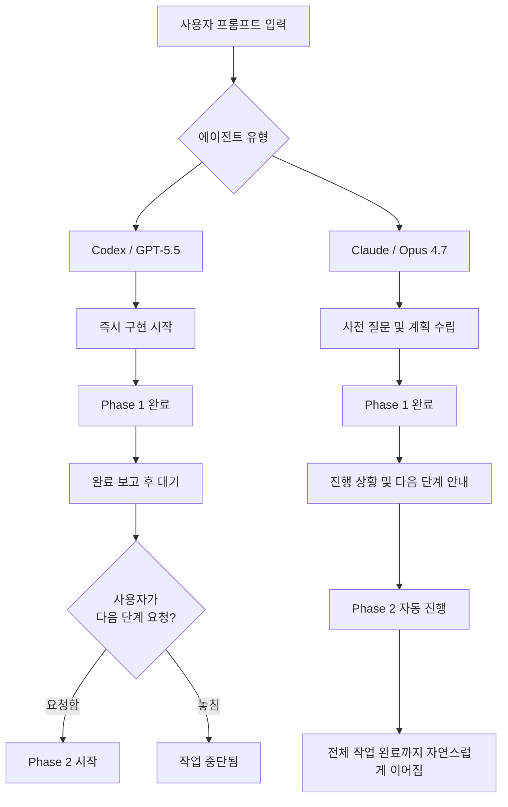
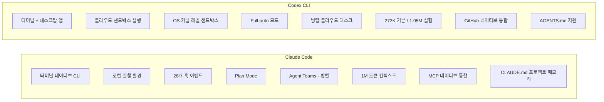
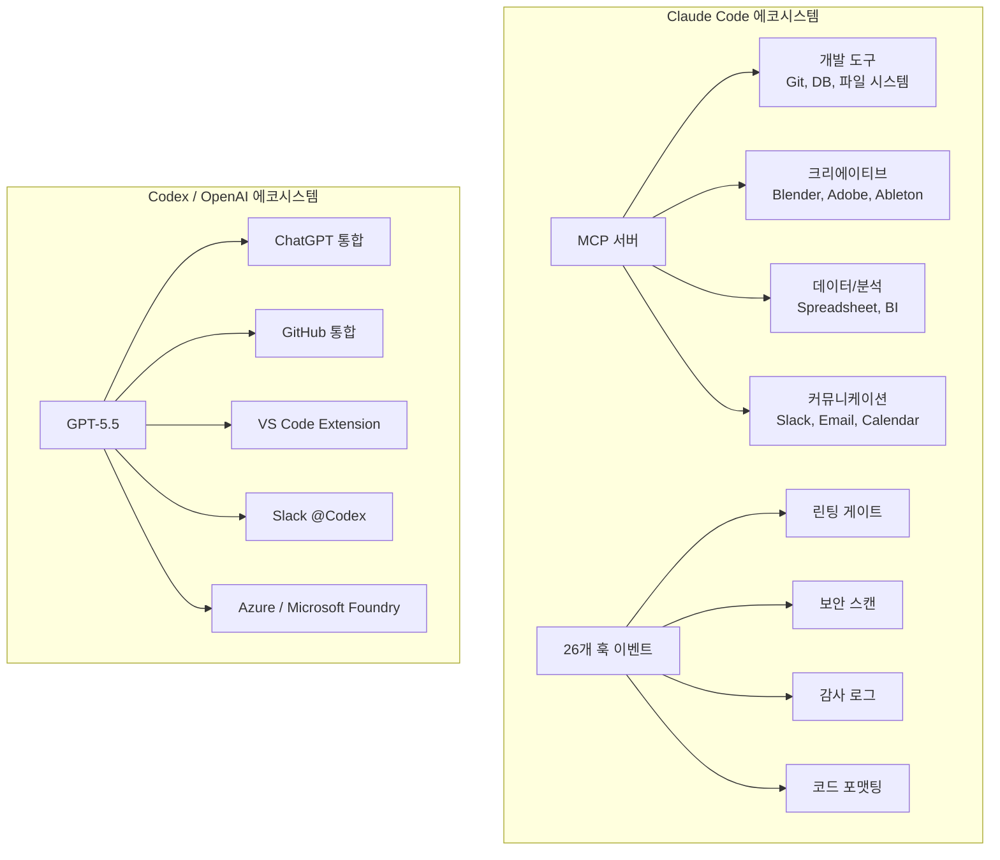
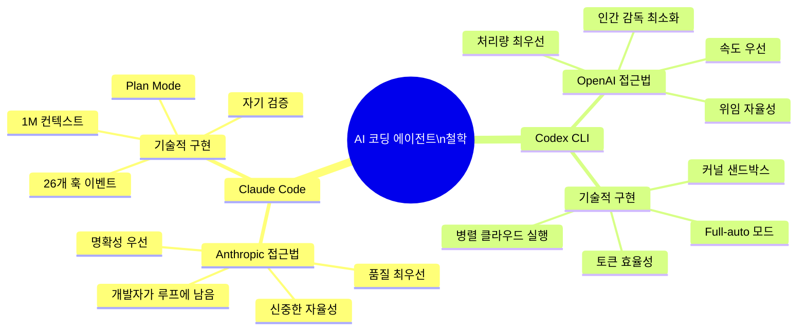

> **원문 출처**: [@void_box]( https://www.threads.com/@void_box/post/DX6jBa3j1NU) (Threads, 2026)  
> 월 $200 요금제로 두 플랫폼 모두 사용량 한도까지 꽉 채워 사용한 경험에 기반한 실사용 비교

---

## 목차

1. [핵심 결론 요약](#1-핵심-결론-요약)
2. [두 모델의 배경과 포지셔닝](#2-두-모델의-배경과-포지셔닝)
3. [가장 결정적인 차이: 작업 흐름의 매끄러움](#3-가장-결정적인-차이-작업-흐름의-매끄러움)
4. [사용자 유형별 승자 분석](#4-사용자-유형별-승자-분석)
5. [Claude가 우위를 점하는 세부 요소들](#5-claude가-우위를-점하는-세부-요소들)
6. [Codex가 우위를 점하는 세부 요소들](#6-codex가-우위를-점하는-세부-요소들)
7. [벤치마크로 본 성능 비교](#7-벤치마크로-본-성능-비교)
8. [CLI 도구 비교: Claude Code vs. Codex CLI](#8-cli-도구-비교-claude-code-vs-codex-cli)
9. [토큰 효율성과 비용 구조](#9-토큰-효율성과-비용-구조)
10. [MCP 에코시스템과 확장성](#10-mcp-에코시스템과-확장성)
11. [컨텍스트 관리와 장기 작업 안정성](#11-컨텍스트-관리와-장기-작업-안정성)
12. [속도와 반응성](#12-속도와-반응성)
13. [아키텍처 철학의 차이](#13-아키텍처-철학의-차이)
14. [실제 활용 시나리오별 추천](#14-실제-활용-시나리오별-추천)
15. [종합 결론](#15-종합-결론)

---

## 1. 핵심 결론 요약

원글(@void_box)의 결론은 명확하다.

> **개발자(Developer) → Claude Opus 4.7 승**  
> **바이브 코더(Vibe Coder) → GPT-5.5 / Codex 승**

이 판단은 단순한 성능 지표가 아니라, 실제로 $200 플랜을 두 개 동시에 구독하고 사용량 한도까지 모두 소진해본 체험에서 나온 것이다. 두 모델이 근본적으로 다른 사용자 페르소나를 위해 설계되어 있다는 사실이 핵심이다.

---

## 2. 두 모델의 배경과 포지셔닝

### Claude Opus 4.7

Anthropic이 2026년 4월 16일 출시한 Claude Opus 4.7은 Claude Opus 시리즈의 현재 공개 플래그십 모델이다. 전작인 Opus 4.6 대비 SWE-bench Pro에서 10.9포인트 상승(53.4% → 64.3%)을 이루었으며, SWE-bench Verified에서는 87.6%를 기록하여 에이전틱 코딩 도구 중 최상위 수준이다.

Anthropic의 포지셔닝은 명확하다. 복잡한 소프트웨어 엔지니어링, 장기 자율 에이전트 작업, 엔터프라이즈 워크플로우에 최적화된 모델이다. 특히 '실패 비용이 큰 자율 코딩 워크플로우'를 위해 설계됐다고 Anthropic은 공식 설명하고 있다. 1M 토큰 컨텍스트 창, 5단계 노력(effort) 파라미터(low/medium/high/xhigh/max), 자기 검증(self-verification) 후 결과 보고 방식이 이 모델의 특징이다.

이 모델의 내부에는 '지시 사항을 문자 그대로 따르는' 경향이 이전 버전보다 훨씬 강화되었다. 사양이 불명확할 때는 잘못된 가정을 내세우기보다 명확한 질문을 던지는 쪽을 택한다. 데모에서는 답답하게 보일 수 있지만, 프로덕션 환경에서는 이 특성이 오히려 가치 있다.

### GPT-5.5 / Codex

OpenAI는 2026년 4월 23일 GPT-5.5를 출시했다. GPT-5.4의 추론 벤치마크를 개선하면서도 출력 간결성과 도구 사용(tool use) 능력에서 상당한 향상을 이뤘다. GPT-5.4의 도구 검색(tool search) 아키텍처를 이어받아 구조화된 작업에서 토큰 소비량을 크게 줄였다.

OpenAI의 공식 포지셔닝에 따르면 GPT-5.5는 ChatGPT와 Codex에서 사용 가능하며, 특히 Codex와의 긴밀한 통합이 강점이다. Codex 내에서는 400K 컨텍스트 창을 기본 사용하고, FastMode에서는 1.5배 속도(2.5배 비용)로 작동한다. 또한 OpenAI 내부에서 85% 이상의 직원이 GPT-5.5와 함께 Codex를 주간 단위로 활용한다고 보고될 정도로 광범위하게 쓰인다.

---

## 3. 가장 결정적인 차이: 작업 흐름의 매끄러움

원글이 가장 중요하게 꼽는 차이점은 **작업 흐름의 매끄러움(workflow smoothness)** 이다. 이는 단순한 기능 차이가 아니라, 에이전틱 코딩 도구를 실제로 사용할 때 느끼는 가장 본질적인 사용자 경험의 차이다.

### Codex의 작업 흐름 문제

Codex는 긴 계획을 세우고 진행할 때 현재 진행 상태와 남은 작업을 파악하기 어렵다. Phase 1~4로 나뉜 작업이 있을 때, Phase 1을 완료하면 "완료했다"고 보고하고 멈추는 경우가 있다. Phase 2로 이어야 한다는 것을 사용자가 직접 확인해 요청하지 않으면, Codex가 먼저 다음 단계 진행 여부를 묻지 않는 케이스가 많다.

이 문제는 Codex의 설계 철학에서 비롯된다. Codex는 '위임(delegation)'에 최적화된 도구다. 사용자가 프롬프트를 던지면 그것을 실행하고 종료한다. 자율적으로 전체 계획을 파악하고 다음 단계를 이어가는 것은 Codex의 기본 동작 방식이 아니다. 작업 속도도 상대적으로 느린 편이어서(Fast Mode OFF 기준), 이런 단절이 더욱 체감된다.

### Claude의 작업 흐름 관리

Claude는 현재 어떤 작업이 진행 중인지, 현재 단계가 끝나면 남은 작업이 무엇인지, 이후 어떻게 진행할지를 자연스럽게 챙긴다. 긴 작업의 흐름을 Claude가 스스로 관리한다는 느낌이 강하다.

이는 Claude가 작업 착수 전에 충분히 질문하고 계획을 수립하는 접근 방식 때문이다. Claude Code로 동일한 프롬프트를 던졌을 때, Codex가 즉시 구현을 시작하는 반면 Claude는 약 10가지 질문을 통해 원하는 방향을 정확히 파악한 후 착수한다는 실사용자 보고가 이를 뒷받침한다. Plan mode를 명시적으로 활성화하지 않더라도 Claude는 기본적으로 이런 방식으로 동작한다.

이 차이를 다음과 같이 도식화할 수 있다.

---

## 4. 사용자 유형별 승자 분석

### 왜 개발자에게는 Claude가 유리한가?

개발자는 코드베이스의 아키텍처를 깊이 이해하고, 멀티 파일 수정과 복잡한 의존성 추적이 필요한 작업을 수행한다. 이런 환경에서는 다음 요소들이 중요해진다.

**첫째, 장기 작업 코히런스(coherence)** 다. Opus 4.7은 많은 단계를 거치는 작업에서도 목표를 일관되게 유지한다. 이전 결정 사항을 기억하고 새로운 코드가 기존 아키텍처와 충돌하지 않도록 한다.

**둘째, 명확성 추구 태도**다. 사양이 불명확할 때 잘못된 가정을 내세우기보다 확인 질문을 던진다. 이는 복잡한 엔터프라이즈 코드베이스에서 치명적 실수를 방지하는 중요한 특성이다.

**셋째, 대규모 코드베이스 이해 능력**이다. 1M 토큰 컨텍스트를 활용해 10,000줄 이상의 프로젝트 전체를 범위에 넣고 아키텍처나 데이터 흐름에 대한 설명을 요청하면, 특정 파일, 함수, 비명시적 패턴까지 참조하는 답변을 제공한다.

**넷째, 코드 품질**이다. 500명 이상의 개발자를 대상으로 한 Reddit 설문에서 65%는 Codex를 일상적 코딩에 선호했으나, 맹검(blind) 코드 품질 평가에서는 Claude Code가 67%의 비율로 더 깔끔하고 관용적(idiomatic)이며 구조적으로 우수한 코드를 생성한다고 평가됐다.

### 왜 바이브 코더에게는 GPT-5.5가 유리한가?

바이브 코딩(vibe coding)은 정확한 코드 품질보다는 빠른 결과물 생성, 대략적인 방향 제시, 프로토타이핑 속도를 우선시하는 접근 방식이다. 이 맥락에서는 GPT-5.5가 더 적합한 이유가 있다.

**첫째, 속도다.** Codex/GPT-5.5는 동일한 작업을 더 짧은 시간에 완료한다. Claude가 신중하게 질문하고 계획을 수립하는 동안 Codex는 이미 구현을 시작하고 있다.

**둘째, 토큰 효율성이다.** Figma-to-code 벤치마크에서 Codex CLI는 150만 토큰, Claude Code는 620만 토큰을 소비했다. 약 4배의 차이다. 바이브 코더는 여러 아이디어를 빠르게 탐색해야 하므로 이 효율성이 실질적인 이점이 된다.

**셋째, 위임 방식의 자율 실행이다.** 프롬프트를 던지고 결과를 나중에 확인하는 위임 방식이 익숙한 사용자에게는 Codex의 "즉시 실행 후 결과 보고" 방식이 오히려 편리하다.

**넷째, 광범위한 에코시스템 통합이다.** Codex는 ChatGPT, VS Code Extension, Slack 통합(@Codex 직접 멘션), GitHub 통합 등 광범위한 OpenAI 에코시스템과 자연스럽게 연결된다.

---

## 5. Claude가 우위를 점하는 세부 요소들

### MCP 생태계 호환성

원글에서 명시적으로 언급된 Claude의 첫 번째 우위다. "필수라고 생각되는 주요 플러그인과 MCP가 Claude 쪽에서 훨씬 원활하게 동작한다"는 평가다.

MCP(Model Context Protocol)는 Anthropic이 주도하는 표준으로, Claude Code는 MCP 서버와의 통합을 네이티브 수준에서 지원한다. 에이전틱 하니스 구성의 핵심 인프라로서, Blender, Adobe, Ableton 같은 크리에이티브 소프트웨어 커넥터부터 데이터베이스, Git, 파일 시스템 도구까지 플러그인 마켓플레이스가 활성화되어 있다. 반면 Codex는 OpenAI 자체 에코시스템에서는 강하지만, 서드파티 MCP 통합은 상대적으로 미성숙하다.

MCP Atlas 벤치마크에서도 이 차이가 확인된다. Claude Opus 4.7이 GPT-5.5 대비 2포인트 이상 앞선다. 수치 자체는 크지 않지만, 실제 운용 환경에서의 호환성 차이가 더 크게 체감된다는 것이 원글의 핵심 관찰이다.

### 컨텍스트 관리의 단순함

원글의 두 번째 지적이다. Codex의 컨텍스트 관리는 "생각보다 신경 쓸 부분이 많다"는 평가다. GPT-5.5는 Codex 내에서 기본적으로 400K 컨텍스트 창을 사용하며, 1M 컨텍스트 장시간 모드는 별도로 활성화해야 한다. 272K 이상의 세션에서는 2배 입력/1.5배 출력 요금이 적용되는 구조도 있어 비용 예측이 어렵다.

반면 Claude Code의 Opus 4.7은 Max/Team/Enterprise 플랜에서 표준 요금으로 1M 토큰 컨텍스트를 제공하며, 26개의 훅(hook) 이벤트를 통해 세밀한 컨텍스트 제어가 가능하다. CLAUDE.md 파일을 통한 프로젝트별 지시 사항 지속화, /compact 명령어를 통한 컨텍스트 압축 등 컨텍스트 엔지니어링 도구가 풍부하게 제공된다.

### 속도

원글의 세 번째 항목이다. Fast Mode OFF 기준으로 Claude가 더 빠르다는 평가다. 기술적으로도 이는 근거가 있다. Claude Opus 4.7의 첫 토큰까지 대기 시간(TTFT)은 약 0.5초로, GPT-5.5의 약 3초 기준선 대비 현저히 빠르다. 이 차이는 인터랙티브 세션—개발자가 질문하고, 수정 요청하고, 코드를 반복적으로 개선하는 환경—에서 실질적으로 체감된다. 물론 GPT-5.5는 출력 토큰 수가 훨씬 적기 때문에 전체 완료 시간에서는 경쟁적이지만, 첫 응답 속도라는 측면에서는 Claude가 확실한 우위다.

### CLI 성숙도

원글의 네 번째 항목이다. "CLI를 기준으로 보면 Codex CLI는 아직 부족한 느낌이 크다"는 평가다. Claude Code는 슬래시 커맨드, 서브에이전트, 커스텀 훅, 폭넓은 설정 옵션을 갖춘 성숙한 터미널 UI를 제공한다. VS Code Marketplace에서 "가장 사랑받는" 도구 46%를 기록하고 r/ClaudeCode에 주간 4,200명 이상의 기여자가 있을 정도로 생태계가 활성화되어 있다.

---

## 6. Codex가 우위를 점하는 세부 요소들

### 토큰 효율성

이것이 Codex/GPT-5.5의 가장 명확한 기술적 우위다. 동일한 Codex 작업을 수행할 때 GPT-5.5는 GPT-5.4 대비 토큰 소비량이 현저히 적다. Claude Opus 4.7과 비교하면 약 72% 더 적은 출력 토큰을 소비한다는 데이터도 있다. 그러나 원글이 명시적으로 지적하듯, "토큰 사용량은 Codex가 훨씬 적게 소모하는 대신, 시간은 훨씬 더 많이 쓴다"는 상충관계(trade-off)가 존재한다.

### 수학 및 추론 능력

FrontierMath Tier 4(최고 난이도)에서 GPT-5.5는 35.4%, Claude Opus 4.7은 22.9%를 기록했다. 수치 정밀도가 필수적인 데이터 과학, 금융 모델링, 과학 연산 워크플로우에서 GPT-5.5가 유리하다.

### 터미널 자동화 및 DevOps

Terminal-Bench 2.0에서 GPT-5.5는 82.7%, Claude Opus 4.7은 69.4%를 기록했다. 이는 이번 비교에서 가장 큰 격차이며, DevOps, CI/CD 파이프라인 구성, 서버 관리, 쉘 스크립트 자동화 등 터미널 중심 작업에서의 GPT-5.5 우위를 반영한다.

### 병렬 에이전트 실행

Codex의 가장 독특한 강점 중 하나는 클라우드 기반 병렬 에이전트 실행이다. 여러 태스크를 동시에 각각의 격리된 샌드박스에서 실행하고, 개발자는 결과를 비동기적으로 확인할 수 있다. 버그 수정, 기능 구현, 테스트 작성을 동시에 큐에 올려두고 결과를 나중에 리뷰하는 방식은 일정 규모의 개발 팀에서 처리량(throughput)을 크게 높인다. Claude Code의 Agent Teams도 병렬 실행을 지원하지만, Codex의 클라우드 샌드박스 방식만큼 마찰 없이 "fire-and-forget" 방식으로 위임하기는 어렵다.

### 웹 리서치 능력

BrowseComp 벤치마크에서 GPT-5.5는 84.4%, Claude Opus 4.7은 79.3%를 기록했다. 웹 리서치가 집약적인 작업에서 GPT-5.5가 약간 앞선다.

---

## 7. 벤치마크로 본 성능 비교

다음은 주요 공개 벤치마크 비교표다. 각 벤치마크는 특정 역량을 측정하므로, 전체를 통합적으로 해석해야 한다.

| 벤치마크 | Claude Opus 4.7 | GPT-5.5 | 우위 |
|---|---|---|---|
| SWE-bench Verified | **87.6%** | N/A | Claude |
| SWE-bench Pro | **64.3%** | 57.7% | Claude (+6.6pp) |
| Terminal-Bench 2.0 | 69.4% | **82.7%** | GPT-5.5 (+13.3pp) |
| BrowseComp | 79.3% | **84.4%** | GPT-5.5 (+5.1pp) |
| OSWorld-Verified | 78.0% | **78.7%** | 거의 동률 |
| FrontierMath Tier 1-3 | 43.8% | **51.7%** | GPT-5.5 (+7.9pp) |
| FrontierMath Tier 4 | 22.9% | **35.4%** | GPT-5.5 (+12.5pp) |
| GPQA | **리드** | - | Claude |
| HLE | **리드** | - | Claude |
| MCP Atlas | **리드** (+2pp) | - | Claude |
| FinanceAgent v1.1 | **리드** (+4.4pp) | - | Claude |
| CyberGym | - | **리드** (+8.7pp) | GPT-5.5 |

**10개 공유 벤치마크 기준:** Claude Opus 4.7이 6개에서 앞서고, GPT-5.5가 4개에서 앞선다. 격차는 2~13포인트 사이다. 전반적으로 벤치마크 승자를 단일하게 선언하기 어려운 구조이며, 워크플로우 유형에 따라 적합한 모델이 갈린다.

```mermaid
xychart-beta
    title "주요 벤치마크 비교 (%)"
    x-axis ["SWE-bench Pro", "Terminal-Bench 2.0", "BrowseComp", "OSWorld", "FrontierMath T4", "MCP Atlas*"]
    y-axis "점수 (%)" 0 --> 100
    bar [64.3, 69.4, 79.3, 78.0, 22.9, 70]
    bar [57.7, 82.7, 84.4, 78.7, 35.4, 68]
```

*MCP Atlas는 상대 수치로 표시. 실제 절대값은 공개되지 않음.

---

## 8. CLI 도구 비교: Claude Code vs. Codex CLI

모델 비교만큼 중요한 것이 실제 코딩 에이전트 도구로서의 비교다. 원글에서 Codex CLI의 미성숙함을 명시적으로 언급한 만큼, 이 차원에서의 분석이 필요하다.

### 실행 환경 철학의 차이

Claude Code는 **감독된 자율성(supervised autonomy)** 을 지향한다. 변경 사항을 실행하기 전에 검토할 수 있는 Plan Mode, 개발자가 중요 라이프사이클 이벤트에 개입할 수 있는 26개 훅 이벤트, 세밀한 권한 제어가 이 철학을 구현한다. "개발자가 루프에 단단히 남아있는" 방식이다.

Codex CLI는 **비감독 자율성(unsupervised autonomy)** 을 지향한다. 승인 게이트 없이 실행되는 Full-auto 모드, 결과를 나중에 확인하는 fire-and-forget 클라우드 실행, 서브에이전트 워크플로우, 세션 재연결 기능이 이 철학을 구현한다. "위임하고 다른 일에 집중하는" 방식이다.

### 안전 경계 방식

Codex는 macOS의 Seatbelt, Linux의 Landlock/seccomp를 통한 OS 커널 레벨 샌드박싱으로 보안을 구현한다. 강력한 경계선이지만 거칠다(coarse). Claude Code는 애플리케이션 레이어에서 26개 훅 이벤트로 세밀한 제어를 제공한다. 유연하지만 경계선 자체는 상대적으로 약하다(finer but softer).

"신뢰할 수 없는 외부 코드를 리뷰할 때는 커널 샌드박싱이 적합하고, 신뢰할 수 있는 코드에 조직 표준을 강제할 때는 프로그래머블 훅이 적합하다"는 것이 전문가들의 공통 관찰이다.

### 2026년 현재 성숙도

원글에서 Codex CLI를 "아직 부족한 느낌이 크다"고 평가한 것에는 역사적 맥락이 있다. Codex CLI는 2025년 말 TypeScript에서 Rust로 전면 재작성되었고, GitHub Stars 67,000개, 오픈소스(Apache 2.0)로 활발한 커뮤니티를 보유하고 있다. 그러나 슬래시 커맨드 수, 설정 세밀도, 훅 시스템 등에서 Claude Code의 성숙도에는 아직 미치지 못한다는 평가다. 다만 이 격차는 빠르게 좁혀지고 있다.

---

## 9. 토큰 효율성과 비용 구조

### API 가격 비교

| 항목 | Claude Opus 4.7 | GPT-5.5 |
|---|---|---|
| 입력 (1M 토큰) | $5 | $5 |
| 출력 (1M 토큰) | $25 | $30 |
| 200K 초과 입력 | 2배 할증 (= $10) | 표준 |
| 배치/플렉스 할인 | - | 50% 할인 (=$2.5/$15) |
| 우선 처리 할증 | - | 2.5배 (=$12.5/$75) |

출력 토큰 기준으로는 Claude가 17% 저렴하다. 그러나 실제 태스크당 비용을 결정하는 것은 **태스크당 소비 토큰 수**다. GPT-5.5가 Claude 대비 ~72% 적은 출력 토큰을 소비한다면, 태스크당 비용은 GPT-5.5가 오히려 크게 낮아진다.

Figma-to-code 벤치마크에서의 실제 측정값을 기준으로 환산하면, API 요금 기준으로 GPT-5.5는 약 $15, Claude Code는 약 $155가 소요되었다. 구독 플랜($200/월)을 사용하는 경우에는 직접 비교가 어렵지만, 사용량 한도 내에서 처리할 수 있는 작업 건수의 차이로 나타난다.

### 구독 플랜 기준 비용 비용 효율성

원글의 사용 맥락($200 요금제, 한도까지 소진)에서 중요한 것은 주어진 예산으로 처리할 수 있는 작업의 양이다. 토큰 효율성이 4배 높은 Codex는 같은 요금제에서 더 많은 작업을 처리할 수 있다. 반면 Claude Code는 더 적은 작업을 수행하지만, 각 작업의 품질과 자율 완료율이 높다.

"더 많이 하지만 간단한 작업"과 "더 적게 하지만 복잡한 작업을 제대로"라는 상충관계다.

---

## 10. MCP 에코시스템과 확장성

Claude 에코시스템에서 MCP는 단순한 플러그인 시스템을 넘어 에이전틱 하니스 엔지니어링의 핵심 인프라로 자리잡고 있다. 원글에서 "MCP가 Claude 쪽에서 훨씬 원활하게 동작한다"고 언급한 것은 단순한 호환성 차이가 아니라, 생태계 성숙도의 차이를 반영한다.

Claude Code의 26개 훅 이벤트는 조직의 코딩 표준을 프롬프트 지시가 아닌 결정론적 방식으로 강제할 수 있다는 점에서 엔터프라이즈 환경에서 특히 가치 있다. 린팅 게이트, 보안 스캔, 금지 명령어 차단 등을 훅으로 구현하면, 모델이 이를 무시할 가능성 자체를 차단한다.

반면 OpenAI의 에코시스템은 더 광범위하다. ChatGPT, Codex, Assistants API, Function Calling Strict Mode, GitHub Copilot 통합, Microsoft Foundry, Azure OpenAI Service 등 엔터프라이즈 소프트웨어 스택 전반에 걸친 통합이 강점이다. OpenAI의 GPT-5.5를 이미 사용하는 조직이라면 이 통합 효과가 상당하다.

---

## 11. 컨텍스트 관리와 장기 작업 안정성

원글에서 "Codex의 컨텍스트 관리는 생각보다 신경 쓸 부분이 많았다"고 언급한 문제를 더 깊이 살펴보면, 이는 여러 층위에서 나타나는 현상이다.

### Claude의 컨텍스트 안정성

Claude Opus 4.7은 200K 토큰 컨텍스트 창(Max 플랜에서 1M)으로 대규모 코드베이스 전체를 범위 안에 두고 작업한다. 중요한 것은 단순히 창 크기가 아니라, 장기 세션 전반에 걸쳐 이전 결정 사항과 일관성을 유지하는 능력이다. Anthropic의 표현을 빌리면, "긴 엔지니어링 세션에서 코히런스를 유지하고 일반적인 에이전트들이 무너지는 종류의 세션을 견디도록 구축된 모델"이다.

CLAUDE.md 파일을 통한 프로젝트별 메모리 지속화, /loop 스케줄링 커맨드를 통한 반복 작업 설정 등이 이를 보완한다.

### Codex의 컨텍스트 제약

Codex는 기본적으로 400K 컨텍스트 창을 사용하며, 1M 토큰 장기 모드는 별도 설정으로 활성화해야 한다. 복잡한 요청에서 더 적은 횟수의 재시도를 보인다는 것이 OpenAI의 주장이지만, 사용자가 직접 컨텍스트 상태를 관리하고 모니터링해야 하는 상황이 발생한다는 것이 원글의 관찰이다. 세션이 길어질수록, 혹은 여러 Phase에 걸친 작업에서 이 관리 부담이 누적된다.

---

## 12. 속도와 반응성

속도 비교는 단순하지 않다. '첫 토큰까지의 대기 시간(TTFT)'과 '전체 작업 완료 시간'이 다른 방향을 가리키기 때문이다.

**TTFT (First-Token Latency):** Claude Opus 4.7 ≈ 0.5초 vs GPT-5.5 ≈ 3초. Claude가 약 6배 빠르다. 개발자가 질문하고 즉각 반응을 기대하는 인터랙티브 세션에서 체감 속도는 Claude가 우세하다.

**전체 완료 시간(Wall-clock):** 토큰 효율성이 높은 GPT-5.5는 출력 토큰 수가 적어, 복잡한 자율 실행 작업에서는 전체 완료 시간이 더 짧을 수 있다. 다만 원글은 Fast Mode OFF 기준으로 Claude가 더 빠르다고 명시하고 있다.

**맥락에 따른 해석:** 하룻밤 사이에 완료되는 자율 파이프라인이라면 TTFT보다 정확도와 신뢰성이 중요하다. 반면 개발자가 화면 앞에 앉아 실시간으로 코드를 반복 개선하는 인터랙티브 워크플로우에서는 TTFT가 결정적인 체감 요소가 된다.

---

## 13. 아키텍처 철학의 차이

이 두 도구의 차이는 기능의 차이를 넘어, 근본적인 설계 철학의 차이에서 비롯된다.

**Claude의 실패 방지 모델:** "에이전트가 중요한 컨텍스트를 놓칠 수 있다"는 위험을 최우선 방지 대상으로 본다. 그래서 정보를 최대화하는 방향으로 설계됐다.

**Codex의 실패 방지 모델:** "에이전트가 위험한 행동을 할 수 있다"는 위험을 최우선 방지 대상으로 본다. 그래서 OS 수준의 샌드박스로 격리하는 방향으로 설계됐다.

어느 철학이 옳다는 것이 아니다. 각각 다른 실패 시나리오를 최적화한다. 개발자가 어떤 실패를 더 두려워하느냐에 따라 더 적합한 도구가 달라진다.

---

## 14. 실제 활용 시나리오별 추천

### Claude Opus 4.7 / Claude Code를 선택해야 하는 경우

복잡한 기존 코드베이스에서 작업하며 AI가 전체 아키텍처를 깊이 이해해야 할 때 Claude가 적합하다. 테스트 주도 개발(TDD)이 워크플로우의 핵심인 경우, 다층적 아키텍처 변경이 필요한 경우, AI가 추론 과정을 설명하고 개발자를 항상 인지 상태로 유지해야 하는 경우, MCP 통합이 중요한 에이전틱 하니스를 구축하는 경우, 그리고 엔터프라이즈 환경에서 코딩 표준을 강제하는 거버넌스 레이어가 필요한 경우가 이에 해당한다.

### GPT-5.5 / Codex를 선택해야 하는 경우

잘 정의된 작업을 빠르게 실행하고 결과를 나중에 확인하는 위임 방식이 편한 사용자에게 Codex가 적합하다. 터미널 자동화, DevOps, CI/CD 파이프라인 구성 등 터미널 중심 작업이 많은 경우, 병렬로 여러 독립 작업을 동시에 처리해야 하는 팀 환경, OpenAI 에코시스템(ChatGPT, GitHub Copilot, Azure)에 이미 깊이 투자한 경우, 그리고 수학 및 정량 추론이 핵심인 워크플로우가 이에 해당한다.

### 두 도구를 모두 사용하는 경우

2026년의 고성능 개발자 다수는 실제로 두 도구를 병행한다. 일반적인 패턴은 다음과 같다. Claude Code는 아키텍처 설계, 복잡한 기능 구현, 프론트엔드 작업, 집중적 리팩토링에 활용하고, Codex는 백그라운드 GitHub 태스크, DevOps 자동화, 비용 민감한 워크플로우에 활용한다. CLAUDE.md와 AGENTS.md가 나란히 공존할 수 있어 두 도구를 하나의 저장소에서 함께 사용하는 것이 기술적으로 지장이 없다.

---

## 15. 종합 결론

원글(@void_box)의 결론은 단순한 "어느 모델이 더 좋다"가 아니라, 사용자 유형과 작업 맥락에 따른 정밀한 선택의 문제라는 것을 말하고 있다.

**작업 흐름의 매끄러움**이라는 기준에서 Claude는 장기 멀티 Phase 작업에서 자율적 관리 능력을 보여준다. 이는 시니어 개발자가 에이전트에 기대하는 것, 즉 "다음에 무엇을 해야 하는지 알아서 챙겨주는" 능력이다.

반면 **속도, 토큰 효율성, 위임 방식의 편의성**을 기준으로 하면 Codex/GPT-5.5가 앞선다. 이는 "내가 방향을 정할 테니 너는 빠르게 실행하라"는 사용 방식에 최적화된 도구다.

$200 요금제 기준으로 두 도구를 모두 한도까지 소진해본 실사용 경험이 도달한 결론은 다음과 같다.

> 복잡한 엔지니어링 작업에서 자율성과 품질이 중요하다면 **Claude Opus 4.7**이다.  
> 빠른 결과와 효율적 위임이 중요하다면 **GPT-5.5 / Codex**다.  
> 그리고 가장 생산적인 개발자는 **둘 다 사용**한다.

모델 경쟁은 현재 진행 중이다. Anthropic과 OpenAI 모두 수주 단위로 새 모델을 출시하고 있고, 벤치마크 격차는 시간이 지나면서 좁아지는 추세다. 장기적으로 차별화는 생태계 통합, 가격 구조, 각 워크플로우 유형에 대한 적합성으로 이동할 가능성이 높다.

---

## 참고 자료

- @void_box, Threads, 2026 — 원글 실사용 비교
- MindStudio Blog — *Claude Opus 4.7 vs GPT-5.5: Which Model Should You Build On?*
- DataCamp — *GPT-5.5 vs Claude Opus 4.7: Benchmarks, Coding, Pricing*
- LLM Stats — *GPT-5.5 vs Claude Opus 4.7 Detailed Comparison*
- NxCode — *Claude Code vs Codex CLI 2026: Which Terminal AI Coding Agent Wins?*
- CatDoes — *Claude Code vs Codex in 2026: The Honest Comparison*
- XDA Developers — *I switched from Claude Code to Codex for a week*
- Particula Tech — *Codex vs Claude Code: which is the better AI coding agent?*
- Lushbinary — *GPT-5.5 vs Claude Opus 4.7: Pricing, Speed, Benchmarks*
- Developers Digest — *Claude Code vs Codex App in 2026*

---

*작성일: 2026년 5월 4일*
