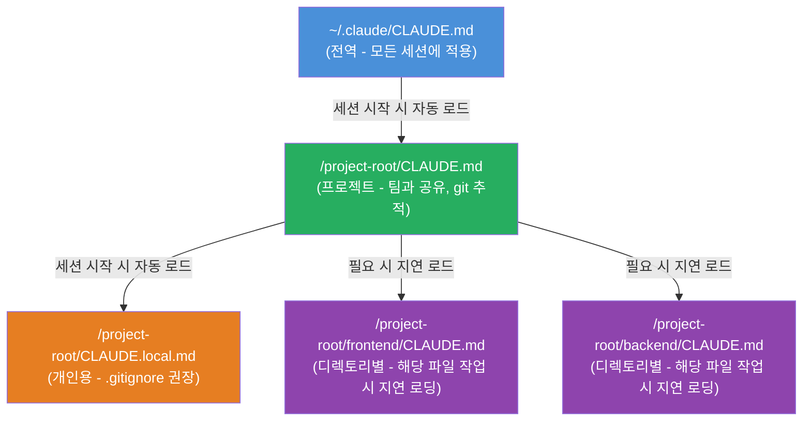
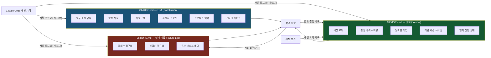
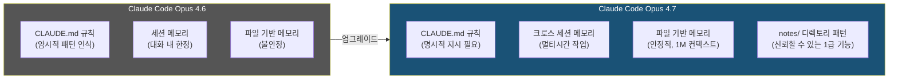
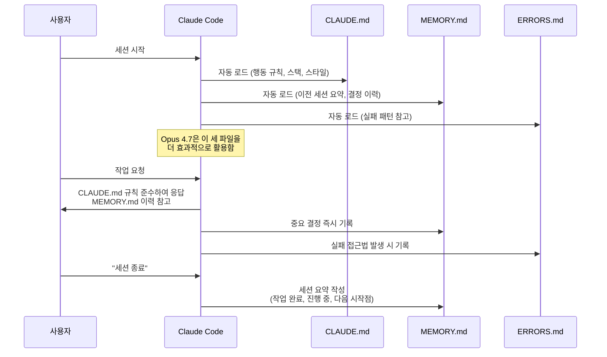
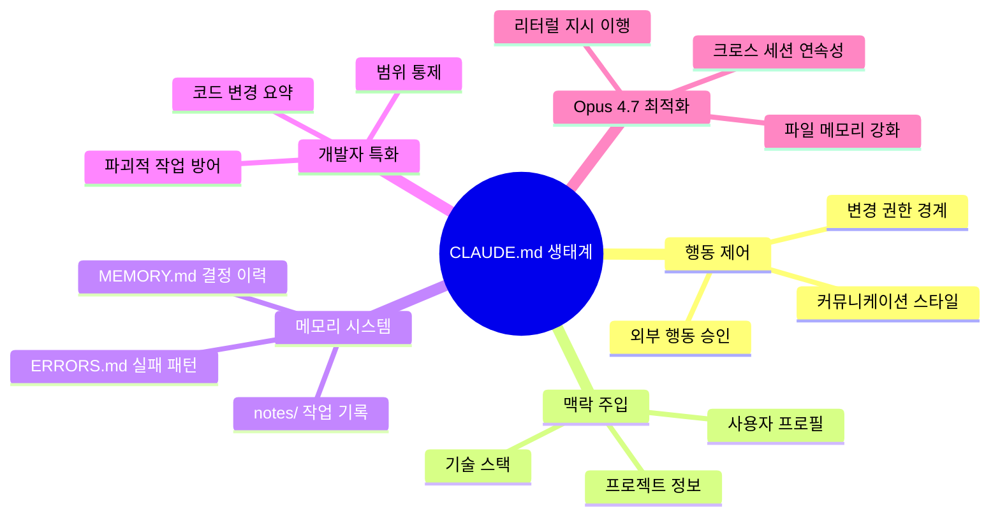

> GitHub Trending 1위, 별(⭐) 82,000개를 기록한 CLAUDE.md 파일의 전모(全貌)와  
> Claude Code Opus 4.7 환경에서 CLAUDE.md와 MEMORY.md의 역할 및 차이에 대한 심층 분석

## 관련글

[**CLAUDE.md 终于有人把最全用法讲清楚了**(CLAUDE.md Finally, Someone Has Explained Its Full Usage Clearly)](https://x.com/xiangxiang103/status/2051103971327271012?s=46)

---

## 목차

1. [왜 지금 CLAUDE.md가 화제인가](#1-왜-지금-claudemd가-화제인가)
2. [CLAUDE.md란 무엇인가](#2-claudemd란-무엇인가)
3. [파일 생성 방법과 위치 계층 구조](#3-파일-생성-방법과-위치-계층-구조)
4. [21가지 핵심 지침: 범주별 심층 분석](#4-21가지-핵심-지침-범주별-심층-분석)
   - 4.1 커뮤니케이션 방식 교정 (1–4번)
   - 4.2 행동 제어와 권한 경계 (5–8번)
   - 4.3 맥락과 정체성 설정 (9–11번)
   - 4.4 메모리와 연속성 확보 (12–15번)
   - 4.5 개발자를 위한 코드베이스 통제 (16–21번)
5. [CLAUDE.md vs MEMORY.md: 역할과 차이의 본질](#5-claudemd-vs-memorymd-역할과-차이의-본질)
6. [Claude Code Opus 4.7의 파일 기반 메모리 개선](#6-claude-code-opus-47의-파일-기반-메모리-개선)
7. [실전 설계 패턴: 어떻게 조합해서 쓸 것인가](#7-실전-설계-패턴-어떻게-조합해서-쓸-것인가)
8. [흔한 실수와 안티패턴](#8-흔한-실수와-안티패턴)
9. [Andrej Karpathy의 4가지 핵심 규칙](#9-andrej-karpathys-4가지-핵심-규칙)
10. [결론: CLAUDE.md는 인프라다](#10-결론-claudemd는-인프라다)

---

## 1. 왜 지금 CLAUDE.md가 화제인가

2025년 말부터 2026년 초 사이, GitHub에서 하나의 파일 레포지토리가 폭발적인 관심을 받았다. 단순한 마크다운 설정 파일 하나를 중심으로 구성된 이 프로젝트는 **별(⭐) 82,000개, 포크(fork) 7,800개**를 기록하며 GitHub Trending 1위에 올랐다. 비슷한 맥락에서 `claude-code-best-practice` 레포지토리도 20,000개 이상의 별을 받으며 빠르게 성장했다.

이 현상이 시사하는 바는 단순하다. Claude를 포함한 대형 언어 모델을 쓰는 사람이 폭발적으로 늘었지만, 그 사람들 대부분이 도구의 20% 성능만 끌어내고 있다는 것이다. 나머지 80%를 가로막는 가장 큰 장벽이 바로 **세션 간 기억 부재**와 **컨텍스트 매번 재입력 문제**이고, CLAUDE.md는 그 장벽을 제거하는 가장 단순하면서도 효과적인 방법이다.

중국 기술 커뮤니티의 반응 역시 주목할 만하다. "드디어 누군가 CLAUDE.md의 완전한 사용법을 명확히 설명했다"는 반응과 함께, "이 파일은 Claude에게 영구적인 기억 장치와 행동 준칙을 장착하는 것"이라는 평가가 빠르게 퍼졌다. 실제로 중요한 포인트가 있다. CLAUDE.md는 개발자만을 위한 도구가 아니다. 작가, 마케터, 연구자, 사업주 등 누구든 Claude를 반복적으로 쓰는 사람이라면 첫 번째로 설정해야 할 파일이다.

---

## 2. CLAUDE.md란 무엇인가

CLAUDE.md는 **Claude Code가 매 세션 시작 시 자동으로 읽어들이는 마크다운 형식의 지시 파일**이다. 그 본질은 단순하다. 사람이 동료에게 "우리 팀에선 이렇게 일해요"라고 온보딩하듯, Claude에게 영구적인 행동 지침과 프로젝트 맥락을 미리 주입해두는 장치다.

Claude의 근본적인 한계에서 출발해야 이해가 된다. 대형 언어 모델은 본질적으로 **상태 없는(stateless) 함수**다. 가중치(weights)는 추론 시점에 고정되어 있고, 스스로 학습하지 않는다. 모델이 코드베이스에 대해 아는 것은 오직 프롬프트로 집어넣은 토큰뿐이다. 그래서 Claude Code 같은 코딩 에이전트 하네스(harness)는 에이전트의 메모리를 명시적으로 관리해줘야 한다. CLAUDE.md는 그 관리의 핵심 레버다.

공식 문서가 정의하는 CLAUDE.md의 특성은 다음과 같다. 매 대화마다 자동으로 읽힌다. bash 명령어, 코드 스타일, 워크플로우 규칙 등 코드만으로는 추론할 수 없는 맥락을 지속적으로 제공한다. `/init` 명령어를 실행하면 현재 프로젝트 구조를 분석해서 CLAUDE.md 초안을 자동 생성해준다. 필수 형식은 없지만, 짧고 인간이 읽기 쉬운 형태를 유지하는 것이 핵심이다.

여기서 가장 중요한 경고를 짚고 넘어가야 한다. **CLAUDE.md가 너무 길면 역효과가 난다.** HumanLayer의 연구에 따르면 최전선 추론 모델도 약 150~200개 지시를 일관되게 따를 수 있고, 그 이상이 되면 모든 지시를 균일하게 무시하기 시작한다. Claude Code 시스템 프롬프트 자체가 이미 약 50개의 지시를 포함하고 있으므로, 사용자가 추가할 수 있는 실질적인 여유는 생각보다 훨씬 좁다. "이걸 없애면 Claude가 실수할까?"라는 질문에 '아니오'라면, 그 줄은 과감히 삭제해야 한다.

---

## 3. 파일 생성 방법과 위치 계층 구조

파일 생성 자체는 2분이면 된다. 프로젝트 폴더에 `CLAUDE.md`라는 이름의 파일을 만들고(대문자, 공백 없음), 어떤 텍스트 에디터로든 열어서 지시 사항을 평문으로 입력하면 된다. Claude Code는 해당 폴더에서 세션을 열 때 이 파일을 자동으로 읽는다. 별도 설정이나 추가 단계가 없다.

그런데 실제로 CLAUDE.md는 단일 파일이 아닌 **계층 구조**로 작동한다. Claude Code는 현재 작업 디렉토리에서 시작해 파일 시스템 루트를 향해 위로 올라가면서 경로상의 모든 CLAUDE.md를 찾아 자동으로 불러온다. 반면 하위 디렉토리의 CLAUDE.md는 실제로 그 디렉토리 내 파일을 다룰 때 지연 로딩(lazy loading) 방식으로 가져온다.

`@` 구문을 이용하면 다른 파일을 CLAUDE.md 안에서 임포트할 수도 있다. 예를 들어 `@docs/architecture.md`를 명시하면 그 파일이 맥락으로 포함된다. 다만 파일 전체를 매번 임베드하는 방식보다는 "복잡한 사용법은 `path/to/docs.md`를 참고할 것"처럼 레퍼런스로 안내하는 편이 토큰 효율 면에서 더 낫다.

---

## 4. 21가지 핵심 지침: 범주별 심층 분석

### 4.1 커뮤니케이션 방식 교정 (1–4번)

**지침 1: 불필요한 서두 제거**

Claude의 기본 동작은 모든 응답을 "Great question!", "Of course!", "Certainly!", "Absolutely!" 같은 구문으로 시작하는 것이다. 이 구문들은 어떤 정보도 전달하지 않는다. Claude를 매일 수 시간씩 사용한다면, 이 마찰이 시간이 지날수록 복리로 쌓인다. 단 하나의 지시로 이를 영구적으로 제거할 수 있다. 모든 응답이 실제 답변으로 바로 시작되게 된다.

**지침 2: 실행 전 선택지 제시**

Claude는 기본적으로 하나의 접근법을 선택해 바로 실행한다. 문단 수정을 요청하면 전체 톤을 바꾸고, 문서 재구성을 요청하면 자신의 판단으로 조직 구조를 재편한다. 이 지침은 그 다이나믹을 뒤집는다. 중요한 작업 전에 Claude가 2~3가지 접근 방식을 먼저 제시하고, 사용자가 방향을 선택한 후 실행에 들어간다. 원하는 결과물을 얻기 위한 왕복 횟수를 획기적으로 줄이는 설정이다.

**지침 3: 불확실성의 명시적 선언**

Claude는 불확실할 때 인정하지 않는다. 그럴듯하게 들리지만 사실이 아닌 정보, 날짜, 통계, 인용구를 자신감 넘치는 문체로 제시한다. 이 지침은 그 패턴을 차단한다. 어떤 사실, 통계, 날짜, 인용구든 불확실하다면 응답에 포함하기 전에 명시적으로 "확실하지 않습니다"라고 선언하도록 강제한다. 근거 없는 확신 위에 의사결정을 쌓는 위험을 사전에 차단하는 안전장치다.

**지침 4: 응답 길이의 태스크 비례**

단순한 질문에 네 단락짜리 답변을, 복잡한 작업 요청에 뼈대만 있는 출력을 받아본 경험은 누구에게나 있다. 이 지침은 응답 길이와 태스크 복잡도의 관계를 교정한다. 단순한 질문은 짧고 직접적인 답으로, 깊이 있는 작업은 충분한 분량으로 처리한다. 불필요한 패딩도, 필요한 깊이를 압축하는 것도 없게 된다.

---

### 4.2 행동 제어와 권한 경계 (5–8번)

**지침 5: 큰 변경 전 확인 요청**

문단 하나를 수정해달라고 했는데 전체 문서가 재작성되어 돌아오는 상황은 CLAUDE.md를 사용해본 사람이라면 누구나 경험했을 것이다. 이 지침은 그 패턴을 근절한다. 이미 만들어진 콘텐츠에 중대한 변경(섹션 재작성, 문단 삭제, 흐름 재구성, 톤 변경)을 하기 전에는 완전히 멈추고, 무엇을 왜 변경하려는지 설명한 후 사용자의 확인을 기다린다.

**지침 6: 요청된 범위에만 집중**

하나를 고치면서 다섯 개를 "개선"하는 것은 Claude의 고질적인 버릇이다. 문구 조정, 구조 재편성, 만족스러웠던 문장 재작성까지 함께 바꿔놓는다. 이 지침은 Claude를 요청된 작업에만 고정시킨다. 다른 곳에서 개선할 만한 것이 보이면 응답 끝에 언급은 하되, 명시적으로 요청받기 전에는 절대 건드리지 않도록 한다.

**지침 7: 변경 사항 요약 제공**

작업이 끝나고 무엇이 달라졌는지 수동으로 비교해야 하는 상황을 없애는 지침이다. Claude는 모든 편집·작성 작업 후 무엇이 바뀌었는지, 무엇이 그대로인지, 사용자의 검토가 필요한 것이 무엇인지를 간략하게 요약하며 마무리한다.

**지침 8: 외부 행동에 대한 명시적 승인 요구**

AI 도구가 이메일, 캘린더, 소셜 계정, 문서에 연결되는 시대에 이 지침은 핵심 안전장치다. Claude는 발송, 게시, 공유, 예약 등 현재 대화 밖에 영향을 미치는 어떤 행동도 현재 메시지에서 명시적으로 "Yes"를 받기 전에는 절대 실행하지 않는다. "앞서 이걸 하고 싶다고 하셨잖아요"는 승인이 아니다. 현재 메시지에서의 명시적 동의만이 승인이다.

---

### 4.3 맥락과 정체성 설정 (9–11번)

**지침 9: 사용자 프로필 설정**

Claude는 상대가 전문가인지 초보인지, 창업자인지 프리랜서인지, 기술적 깊이를 원하는지 평이한 언어를 원하는지 모른다. 그래서 추측하고, 틀린다. 이름, 역할, 배경, 잘 아는 분야와 아직 배우는 분야를 짧은 단락으로 정의해두면 그 시점부터 Claude는 모르는 사람이 아닌 알고 있는 동료로서 응답한다. 이미 아는 내용을 과잉 설명하지 않고, 필요한 맥락을 생략하지 않는다.

**지침 10: 프로젝트 맥락 주입**

매 세션, Claude는 무엇을 만들고 있는지, 누구를 위한 것인지, 무엇이 중요한지를 모른다. 프로젝트 한 줄 설명, 성공 기준, 대상 독자, 톤, 피해야 할 것들을 명시해두면 제안이 일반적이지 않게 된다. Claude가 실제 상황에 맞는 아웃풋을 내놓는다.

**지침 11: 고유한 문체와 목소리 고정**

Claude에게는 기본 문체가 있다. 나쁘지 않다. 하지만 당신의 것이 아니다. 특정 구문을 쓰고, 특정 방식으로 문장을 구성하며, 당신이 실제로 소통하는 방식과 다른 톤을 가진다. CLAUDE.md에 목소리를 한 번 정의해두면, Claude는 첫 초안부터 그 스타일로 쓴다. 다시 내 목소리로 편집하는 과정이 사라진다.

---

### 4.4 메모리와 연속성 확보 (12–15번)

**지침 12: MEMORY.md 유지**

Claude는 세션 간 모든 것을 잊는다. 하지만 파일은 사라지지 않는다. 이 지침은 함께 내린 모든 중요한 결정을 MEMORY.md 파일에 기록하도록 Claude에게 지시한다. 날짜, 결정 내용, 이유, 검토했다가 탈락한 대안이 모두 남는다. 다음 세션 시작 때 Claude가 이 파일을 읽으면 두 달 전 결정의 배경을 알고, 이미 시도했다가 안 됐던 것을 다시 제안하지 않으며, 결정 위에 쌓아 올리는 방식으로 작업한다.

**지침 13: 세션 종료 요약**

작업을 마치고 이틀 후에 돌아와 이전 대화를 다시 뒤지며 어디까지 했는지 재구성하는 데 15분을 쓰는 상황은 누구에게나 있다. "세션 종료", "마무리하자", "여기서 멈추자" 같은 신호를 주면 Claude가 MEMORY.md에 세션 요약을 작성한다. 다음 세션은 정확히 끊긴 지점에서 이어진다.

**지침 14: 실패 패턴 기록 (ERRORS.md)**

같은 종류의 태스크에서 같은 나쁜 접근법을 반복적으로 제안받는 것을 막는 장치다. 2회 이상 시도해야 했던 접근법, 실패한 이유, 결국 통한 방법을 ERRORS.md에 기록한다. 다음번에 비슷한 태스크가 오면 Claude는 먼저 그 파일을 확인하고 이미 실패한 경로를 건너뛴다.

**지침 15: 프로젝트의 영구 불변 사실 목록**

모든 프로젝트에는 과거 결정에서 비롯된 제약, 중요한 이유로 존재하는 규칙, 특정 태스크와 무관하게 항상 유효한 사실들이 있다. 이것들을 명시하지 않으면 Claude는 그 제약의 존재를 모르고, 이미 이유가 있어 내린 결정을 무심코 뒤집거나, 같은 맥락을 백 번째 설명받게 만든다. 이 블록은 모든 세션, 모든 태스크에 예외 없이 적용되는 영구 기반을 제공한다.

---

### 4.5 개발자를 위한 코드베이스 통제 (16–21번)

**지침 16: 범위 외 코드 손대지 않기**

버그 하나를 고치라고 했는데 세 파일을 리팩터링하고, 변수를 개명하고, 임포트를 재정리하고, 수개월 작업한 코드를 "개선"하는 것은 Claude Code의 가장 위험한 기본 동작이다. 이 지침은 현재 태스크와 직접적으로 연관된 파일, 함수, 코드 라인만 수정하도록 강제한다. 다른 곳에서 수정할 만한 것이 보이면 메모로 언급하되, 절대 건드리지 않는다.

**지침 17: 파괴적 작업 전 목록 제시 및 확인**

Claude Code는 파일을 삭제하고, 함수를 덮어쓰고, 데이터베이스 테이블을 드롭한다. 명시적으로 요청하지 않았더라도, Claude가 그렇게 해석했다면 바로 실행한다. 이 지침은 모든 파괴적 작업을 체크포인트로 만든다. 정확히 무엇이 영향을 받는지 나열하고, 현재 메시지에서 명시적으로 "Yes"를 받은 후에만 진행한다.

**지침 18: 절대 금지 행동 목록**

프로덕션 배포, 라이브 데이터베이스 마이그레이션, 외부 서비스에 대한 API 호출은 "주의가 필요한" 상황이 아니라 사용자가 의식적으로 자리에 있고 의도적으로 "Yes"를 말해야 하는 완전한 정지 지점이다. 이 규칙은 그 행동들 주위에 영구적인 장벽을 친다. "앞서 이걸 하고 싶다고 하셨잖아요"는 확인이 아니다.

**지침 19: 기술 스택 고정**

스택을 정의하지 않으면 Claude는 자신이 가장 인기 있다고 판단한 프레임워크, 가장 자주 본 라이브러리, 자신이 기본 설정으로 쓰는 패키지 매니저를 제안한다. 한 번 스택을 정의하면 Claude는 쓰지 않는 것을 제안하지 않는다. 실제로 구축 중인 시스템에 맞는 코드를 써낸다.

**지침 20: 변경 파일 요약**

작업 완료 후 무엇이 달라졌는지 수동으로 비교하는 시간을 없애는 지침이다. 코딩 태스크 완료 후에는 항상 변경된 파일, 각 파일에서 무엇이 수정되었는지, 의도적으로 건드리지 않은 파일, 추가 검토가 필요한 사항을 간략하게 정리한다.

**지침 21: Karpathy의 4가지 핵심 규칙**

Tesla AI 전 이사이자 OpenAI 창립 멤버인 Andrej Karpathy가 Claude Code의 코딩 태스크 실패를 유발하는 네 가지 핵심 행동 패턴을 식별했다. 한 개발자가 이를 네 가지 지침으로 압축해 CLAUDE.md에 담은 파일이 GitHub Trending 1위를 차지하고, 코딩 정확도를 65%에서 94%로 끌어올렸다고 보고했다. 이 내용은 별도 섹션에서 자세히 다룬다.

---

## 5. CLAUDE.md vs MEMORY.md: 역할과 차이의 본질

CLAUDE.md와 MEMORY.md는 둘 다 "기억"과 관련이 있지만, 근본적으로 다른 성격을 가진다. 이 차이를 이해하는 것이 두 파일을 제대로 운용하는 출발점이다.

**CLAUDE.md는 헌법(Constitution)이다.** 이 파일은 Claude가 어떻게 행동해야 하는지를 규정한다. 수정 빈도가 낮고, 프로젝트의 정체성과 규칙을 담는다. 충돌이 있을 때 CLAUDE.md가 항상 이긴다. git에 커밋되어 팀 전체가 공유한다. "무엇을 하지 말라", "어떤 스택을 써라", "응답을 어떻게 구성하라"는 내용이 들어간다. 이 파일은 Claude의 영구적인 행동 프레임워크를 정의한다.

**MEMORY.md는 일지(Journal)이다.** 이 파일은 Claude가 무엇을 했는지를 기록한다. 세션이 지날수록 내용이 쌓인다. 언제 어떤 결정을 내렸는지, 왜 그 결정을 내렸는지, 어떤 대안을 검토했다가 버렸는지가 남는다. 세션을 닫았다가 돌아왔을 때 처음부터 다시 설명하지 않아도 되는 근거가 된다. git에 커밋할 수도 있지만, 개인 작업이라면 `.gitignore`에 넣는 것도 선택이다.

아래 표가 두 파일의 차이를 명확히 한다.

| 속성 | CLAUDE.md | MEMORY.md |
|------|-----------|-----------|
| **역할** | 행동 규칙과 맥락 정의 | 결정 이력과 세션 연속성 |
| **성격** | 헌법 / 규범 문서 | 작업 일지 / 진행 기록 |
| **작성 주체** | 사람 (직접 작성) | Claude (자동 생성 + 사람 검토) |
| **수정 빈도** | 낮음 (가끔 업데이트) | 높음 (매 세션 추가) |
| **내용 예시** | "Python 3.11 이상만 쓸 것", "응답에 서두 없이 시작할 것" | "2025-05-01: REST API 대신 GraphQL 채택, 이유: 복잡한 관계형 쿼리 필요" |
| **충돌 시** | 항상 우선 | CLAUDE.md에 의해 재정의됨 |
| **git 추적** | 보통 추적 (팀 공유) | 선택적 (개인이면 gitignore 고려) |
| **로드 방식** | 세션 시작 시 자동 | 세션 시작 시 자동 (지시 시) |
| **비유** | 직원 핸드북 | 개인 업무 다이어리 |

---

## 6. Claude Code Opus 4.7의 파일 기반 메모리 개선

2026년 4월 16일 출시된 **Claude Opus 4.7**은 이 문서의 맥락에서 특별히 중요한 변화를 가져왔다. 파일 기반 메모리 활용 능력이 전 세대 대비 눈에 띄게 향상됐기 때문이다.

공식 문서에 따르면, Opus 4.7은 에이전트가 스크래치패드, 메모 파일, 구조화된 메모리 저장소를 여러 턴에 걸쳐 유지할 때 그 파일에 더 잘 기록하고, 이후 작업에서 기록된 내용을 더 효과적으로 활용한다. 이는 "CLAUDE.md + notes/ 디렉토리" 패턴이 이전 버전에서 불안정하다고 느꼈던 사람들에게 실질적인 개선으로 다가온다.

Opus 4.7의 주요 변화를 정리하면 다음과 같다.

**xhigh effort 기본값.** 이전에 없던 `xhigh`라는 새로운 노력 수준이 도입되고, Opus 4.7에서는 이것이 기본값이 됐다. `high`와 `max` 사이에 위치하는 수준으로, 에이전틱 코딩 태스크에 최적화되어 있다.

**적응형 추론(Adaptive Reasoning).** 모델이 각 단계에서 생각할지 여부와 얼마나 생각할지를 태스크 복잡도에 따라 스스로 결정한다. 단순한 프롬프트에는 빠르게 응답하고, 깊은 추론이 필요한 단계에는 더 많은 사고를 할당한다.

**1M 토큰 컨텍스트 윈도우.** 별도 설정 없이 기본으로 1백만 토큰 컨텍스트를 지원한다. 긴 코드베이스를 한 번에 다루거나 대규모 문서를 참조하는 작업이 훨씬 수월해졌다.

**강화된 교차 세션 메모리.** 이전 버전의 Claude Code도 대화 간 메모리를 일부 지원했지만, Opus 4.7은 이를 멀티시간 작업으로 확장했다. 긴 작업을 시작하고, 세션을 닫고, 다음 날 돌아와도 다시 설명하지 않아도 이어진다는 보고가 다수 나오고 있다.

**더 문자 그대로의 지시 이행(Literal Instruction Following).** 이 변화는 CLAUDE.md 운용 방식에 직접적인 영향을 미친다. Opus 4.7은 지시를 한 항목에서 다른 항목으로 암묵적으로 일반화하지 않는다. 요청하지 않은 것을 추론해서 처리하지 않는다. 이것은 코딩 에이전트로서는 훨씬 예측 가능하고 안전한 동작이지만, CLAUDE.md에 더 명확하고 구체적인 지시가 필요하다는 의미이기도 하다. 이전까지 패턴 암시로 충분했던 내용이 이제는 명시적 규칙과 예시로 풀어져야 한다.

Opus 4.7 환경에서 CLAUDE.md 운용 전략을 조정해야 하는 구체적인 이유가 여기 있다. 모델이 더 리터럴하게 동작하므로, 전에는 힌트만으로 충분했던 톤, 스타일, 코드 패턴 설정이 이제는 예시와 명시적 규칙을 포함해야 한다. 반면 파일 기반 메모리의 신뢰성이 높아졌으므로, MEMORY.md와 notes/ 디렉토리를 적극적으로 활용하는 것이 이전보다 훨씬 가치 있는 투자가 됐다.

---

## 7. 실전 설계 패턴: 어떻게 조합해서 쓸 것인가

세 파일을 함께 운용하는 권장 패턴은 다음과 같다.

실전에서 가장 효과적인 운용 방식은 **CLAUDE.md를 코드처럼 관리**하는 것이다. 무언가 잘못될 때 검토하고, 불필요한 것을 정기적으로 제거하고, 변경 후 Claude의 실제 행동이 달라지는지 관찰한다. git에 커밋해 팀이 기여할 수 있게 하면 시간이 지날수록 복리로 가치가 쌓인다.

메모리 관련 파일들은 **docs/ 디렉토리를 기반으로 하는 경량 시스템**을 권장하는 목소리가 많다. 복잡한 "Memory Bank" 개념보다는 체크박스 `[ ]`가 있는 마크다운 파일들을 docs/ 안에 두고 필요할 때 `@docs/filename.md`로 참조하는 것이 토큰 효율성과 유지보수성 면에서 더 낫다는 것이 현장 경험에서 나온 결론이다.

CLAUDE.md에 포함시키지 말아야 할 것도 중요하다. "깨끗한 코드를 써라", "모범 사례를 따르라" 같은 모호한 지시는 혼란만 가중시킨다. 매 세션마다 필요하지 않은 도메인 지식이나 특정 시나리오에서만 쓰이는 워크플로우는 SKILL.md 파일로 분리해 수요에 따라 로드하는 것이 좋다. CLAUDE.md를 블로트시키면 실제 중요한 지시가 무시되는 역설적인 결과가 생긴다.

---

## 8. 흔한 실수와 안티패턴

**파일을 너무 길게 만드는 것.** 가장 흔하고 치명적인 실수다. "이것도 넣을까?"라는 질문 앞에서 "이걸 빼면 Claude가 실수할까?"를 먼저 물어야 한다. 아니라면 빼야 한다.

**한꺼번에 모든 것을 설정하려는 것.** 3~4가지 가장 큰 불편을 해결하는 지침부터 시작하고, 경험하면서 점진적으로 추가하는 것이 더 낫다. 처음부터 완벽한 파일을 만들려다 지쳐서 아예 안 쓰게 되는 패턴을 피해야 한다.

**CLAUDE.md를 MEMORY.md처럼 쓰는 것.** 결정 이력과 세션 기록은 MEMORY.md에 들어가야 한다. CLAUDE.md에 날짜별 결정 기록이 쌓이기 시작하면 행동 규칙을 담아야 할 공간이 잡동사니로 채워진다.

**Opus 4.7 전환 후 CLAUDE.md를 업데이트하지 않는 것.** Opus 4.7의 리터럴 지시 이행 방식은 이전 패턴 암시 기반 지침을 종종 무력화한다. 4.6이나 더 이전 버전을 염두에 두고 작성된 CLAUDE.md를 4.7 환경에서 그대로 쓰면 기대와 다른 결과가 나올 수 있다. 스타일, 톤, 코드 패턴 설정에 구체적인 예시를 추가하는 것이 권장된다.

**hooks와 CLAUDE.md를 혼동하는 것.** CLAUDE.md의 지시는 권고(advisory)다. 확실히 실행을 보장해야 하는 것, 예를 들어 "파일 수정 후 항상 eslint를 실행할 것" 같은 내용은 hooks로 구현해야 한다. Hooks는 결정론적이고 예외 없이 실행된다.

---

## 9. Andrej Karpathy의 4가지 핵심 규칙

Tesla AI 전 이사이자 OpenAI 창립 멤버였던 Andrej Karpathy가 식별한 Claude Code의 핵심 실패 패턴 네 가지는 어떤 CLAUDE.md에도 직접 추가할 가치가 있다. 이 규칙들이 코딩 정확도를 65%에서 94%로 끌어올렸다는 보고는 단순한 마케팅 수치가 아니라, 이 네 가지가 AI 코딩 어시스턴트의 가장 근본적인 문제를 다루기 때문이다.

**규칙 1: 추측하지 말고 물어볼 것(Ask, don't assume).** 불명확하거나 사양이 완전히 정해지지 않은 것이 있다면 단 한 줄도 쓰기 전에 물어보라. 의도, 아키텍처, 요구사항에 대해 암묵적으로 가정하지 말아라. 이 규칙이 왜 중요한지는 자명하다. 잘못된 가정 위에서 쓴 코드는 올바른 방향으로 다시 써야 한다. 코드를 쓰기 전에 물어보는 것이 다 쓰고 나서 수정하는 것보다 항상 빠르다.

**규칙 2: 항상 가장 단순한 해법을 먼저(Simplest solution first).** 명시적으로 요청받지 않은 추상화, 레이어, 유연성을 추가하지 말아라. Claude는 미래 확장성을 고려해서 필요 이상으로 복잡한 솔루션을 제시하는 경향이 있다. 이 규칙은 그 경향을 차단한다. 지금 요청된 것을 가장 단순하게 구현하는 것이 출발점이다. Opus 4.7의 리터럴 지시 이행 특성과 함께, 이 규칙은 더욱 효과적으로 작동한다.

**규칙 3: 관련 없는 코드에 손대지 않을 것(Don't touch unrelated code).** 현재 태스크의 직접적인 일부가 아닌 파일이나 함수는 개선의 여지가 보이더라도 수정하지 말아라. 이 규칙은 16번 지침과 맥락을 같이 한다. 범위 밖 수정은 디버깅을 지수적으로 어렵게 만들고, 팀 환경에서는 예상치 못한 병합 충돌을 만들어낸다.

**규칙 4: 불확실성을 명시적으로 드러낼 것(Flag uncertainty explicitly).** 접근법, 라이브러리의 동작, 기술적 세부 사항에 자신이 없다면 진행하기 전에 말해라. 확실성 없는 자신감은 인정하는 것보다 더 많은 피해를 준다. 3번 지침(불확실성 명시)을 개발자 맥락에서 구체화한 것이다.

---

## 10. 결론: CLAUDE.md는 인프라다

CLAUDE.md를 "편리한 설정 파일"로 보는 것은 그 가치를 과소평가한다. 제대로 보면, CLAUDE.md는 **인프라**다. Docker Compose 파일이나 Kubernetes 매니페스트처럼, 시스템이 어떻게 작동해야 하는지를 코드로 정의하는 것이다.

커뮤니티의 관찰을 빌리면, "AI 도구는 점점 강해지고 있지만, 그 도구를 얼마나 잘 쓸 수 있는지는 이 '배후 규칙'을 먼저 얼마나 잘 세팅하느냐에 달려 있다." CLAUDE.md는 그 중에서 가장 단순하고, 투자 대비 수익이 가장 높은 설정이다.

Claude Code Opus 4.7 환경에서 이 파일의 가치는 더 높아졌다. 파일 기반 메모리가 이전 버전에서 불안정하다고 느꼈다면, 4.7에서 다시 시도해볼 가치가 있다. MEMORY.md와 notes/ 디렉토리 패턴이 이제 덕트 테이프가 아닌 1급 기능으로 작동하기 시작했다. CLAUDE.md에 더 명시적인 지시가 필요해진 반면, 그 지시들이 더 예측 가능하고 일관되게 이행된다.

파일을 만들어라. 가장 큰 불편을 해결하는 지침 3~4가지를 먼저 넣어라. 경험하면서 추가해 나가라. 이것이 전부다.

---

*작성일: 2026년 5월 4일*

*참고 출처: Anatoli Kopadze ([@AnatoliKopadze](https://x.com/anatolikopadze/status/2050225292585607440)), Anthropic Claude Code 공식 문서, HumanLayer 블로그, Claude Code Best Practices (shanraisshan), wmedia.es Opus 4.7 분석, Anthropic 공식 모델 문서*
