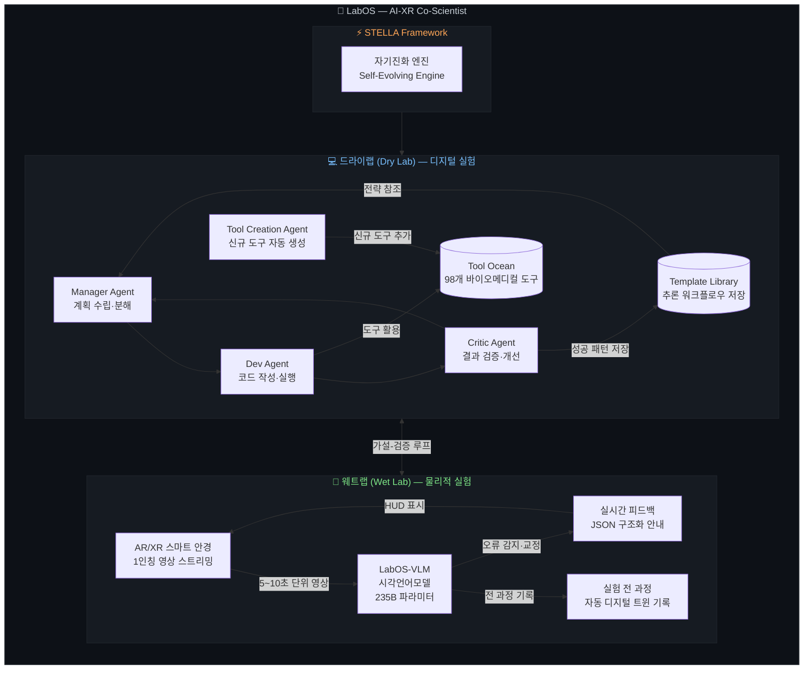
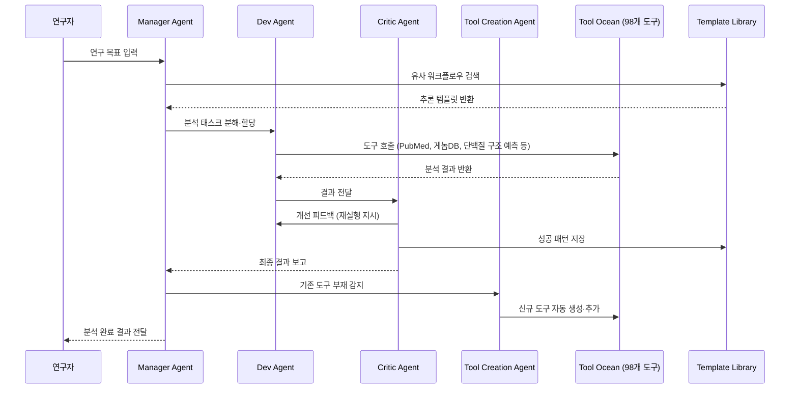
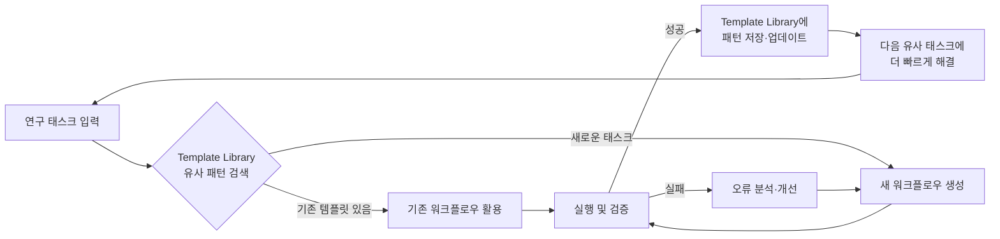
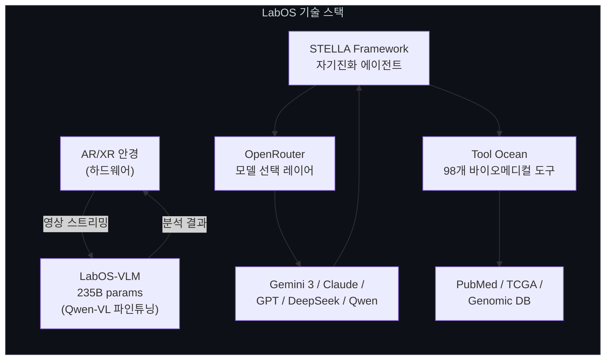
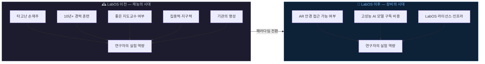
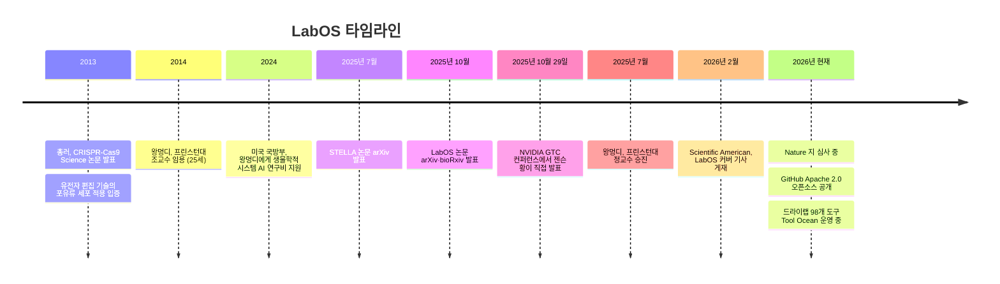

> **"앞으로 중요한 것은 당신이 얼마나 뛰어난가가 아니라, 얼마나 뛰어난 AI를 살 수 있는가에 달려있다"**

## 관련글

[**중국AI미래지도**](https://www.facebook.com/share/p/1KaiG5vJM7/)

---

## 목차

1. [왜 이 연구가 중요한가](#1-왜-이-연구가-중요한가)
2. [두 천재의 이력 — AI와 생명과학의 교차점](#2-두-천재의-이력--ai와-생명과학의-교차점)
3. [50년 동안 바뀌지 않은 실험실](#3-50년-동안-바뀌지-않은-실험실)
4. [LabOS란 무엇인가 — 전체 구조 개요](#4-labos란-무엇인가--전체-구조-개요)
5. [웨트랩(Wet Lab) 모듈 — AR 안경이 손을 안내한다](#5-웨트랩wet-lab-모듈--ar-안경이-손을-안내한다)
6. [드라이랩(Dry Lab) 모듈 — 멀티에이전트 AI가 논문을 분석한다](#6-드라이랩dry-lab-모듈--멀티에이전트-ai가-논문을-분석한다)
7. [STELLA — 스스로 진화하는 에이전트 프레임워크](#7-stella--스스로-진화하는-에이전트-프레임워크)
8. [실험 결과 — 초보자가 전문가를 따라잡다](#8-실험-결과--초보자가-전문가를-따라잡다)
9. [실제 과학 발견 — CEACAM6와 ITSN1](#9-실제-과학-발견--ceacam6와-itsn1)
10. [기술 스택과 오픈소스 전략](#10-기술-스택과-오픈소스-전략)
11. [NVIDIA와의 협업 — GTC 무대에서 공개되다](#11-nvidia와의-협업--gtc-무대에서-공개되다)
12. [재현성 위기(Reproducibility Crisis)의 해법](#12-재현성-위기reproducibility-crisis의-해법)
13. [천재의 시대에서 장비의 시대로](#13-천재의-시대에서-장비의-시대로)
14. [과학 너머 — 사회 전반으로의 확산](#14-과학-너머--사회-전반으로의-확산)
15. [비판적 시각 — 장밋빛만은 아니다](#15-비판적-시각--장밋빛만은-아니다)
16. [논문 현황과 향후 전망](#16-논문-현황과-향후-전망)
17. [참고 자료](#17-참고-자료)

---

## 1. 왜 이 연구가 중요한가

2025년 10월, 두 편의 논문이 동시에 arXiv와 bioRxiv에 올라왔다. 제목은 *"LabOS: The AI-XR Co-Scientist That Sees and Works With Humans"*. 프린스턴대 왕멍디(王梦迪) 교수와 스탠퍼드대 총러(丛乐) 교수가 공동 교신저자로 이름을 올린 이 논문은 단순한 연구 결과물이 아니었다. 그것은 "AI가 처음으로 실험실의 물리적 공간 안에 들어왔다"는 선언에 가까웠다.

그간 AI의 과학 참여는 컴퓨터 화면 앞에서 이루어졌다. 논문을 요약하거나, 단백질 구조를 예측하거나, 게놈 데이터를 분석하는 식이었다. 실험대 위에서 손이 떨리는 순간, 피펫 끝이 흔들리는 순간, 96구멍판 앞에서 눈이 헷갈리는 순간 — 그 물리적 현장에는 AI가 없었다. 과학의 절반은 컴퓨터 앞에 있고, 나머지 절반은 총러 교수의 표현을 빌리면 "지난 50년 동안 거의 바뀌지 않은 물리적 실험실"에 있다. LabOS는 그 절반의 문을 처음으로 열었다.

LabOS는 멀티모달 인식, 자가진화 에이전트, 확장현실(XR) 기반 인간-AI 협업을 결합하여 계산적 추론과 물리적 실험을 통합한 세계 최초의 AI 공동과학자 시스템으로 설명된다. 이 한 문장이 LabOS의 본질을 압축하지만, 그 안에 담긴 의미를 제대로 이해하려면 이 시스템이 어떻게 탄생했는지부터 살펴볼 필요가 있다.

---

## 2. 두 천재의 이력 — AI와 생명과학의 교차점

### 왕멍디(王梦迪, Mengdi Wang) — 프린스턴 AI 연구소

왕멍디는 프린스턴대 컴퓨터과학·강화학습 분야의 이론 연구자로, 칭화대 자동화학과를 졸업하고 18세에 MIT 대학원에 입학했다. 그녀가 칭화대에 입학한 것은 14세 무렵이었다. 칭화대를 2007년에 졸업한 뒤 18세의 나이로 MIT 대학원생이 되었고, 6년 후 전기공학·컴퓨터과학(EECS) 박사학위와 수학 부전공을 취득했다.

박사 학위 취득 후 프린스턴대 전기컴퓨터공학부 및 통계기계학습센터(CSML)에 부교수로 임용되었으며, 구글 딥마인드, IAS, 이론컴퓨터과학 시몬스 연구소에서 방문 연구과학자로도 활동했다. 연구는 기계학습, 강화학습, 생성 AI, 대형언어모델, AI for Science에 집중되어 있다. 2025년 7월에는 프린스턴대 정교수(Full Professor)로 승진했으며, 프린스턴 AI 혁신 가속화 이니셔티브(PIAI)를 공동 디렉터로 이끌고 있다. MIT Technology Review의 '35세 이하 혁신가 35인'에 선정된 이력도 있다.

왕멍디의 경력에서 주목할 점은 연구의 방향성이다. 강화학습의 수학적 기초를 파고드는 이론가로 시작했지만, 금융 리스크 모델링, 의료 AI, 코로나19 방역 알고리즘, 생물학적 시스템을 위한 강화학습으로 그 응용 범위를 꾸준히 확장해왔다. LabOS는 그 연장선상의 최신 도착지이다.

### 총러(丛乐, Le Cong) — 스탠퍼드 의대

총러는 2013년 《사이언스》지에 게재된 CRISPR-Cas9 논문의 제1저자로, 이 논문은 유전자 편집 기술을 실험실 개념에서 포유류 세포 적용으로 끌어올린 이정표적 연구였다. 장펑(张锋, Feng Zhang)의 실험실에서 박사 연구를 수행한 총러는 두 가지 서로 다른 II형 CRISPR/Cas 시스템을 조작해 Cas9 뉴클레이즈가 짧은 RNA의 안내를 받아 인간 및 마우스 세포의 내재성 유전자 위치를 정밀하게 절단할 수 있음을 입증했다.

이 논문의 피인용 수는 수만 건에 달하며, 이후 유전자 치료, 농업 유전공학, 암 연구 분야 전반의 방향을 바꾼 '생명과학의 GPT 모멘트'로 불린다. 칭화대 생물학과 졸업 후 하버드대에서 박사학위를 받고 현재 스탠퍼드 의대 병리학·유전학과 교수로 재직 중인 총러는 CRISPR 분야의 1세대 개척자이자 실험 생물학의 최전선을 누비는 연구자다.

두 사람의 만남은 단순한 인연이 아니었다. AI 이론가가 "AI는 어떻게 실험을 배우는가"라는 질문을 품고 있었고, 생명과학자가 "실험실의 실수를 어떻게 구조적으로 없앨 수 있는가"라는 질문을 품고 있었다. 그 두 질문이 만난 곳에서 LabOS가 탄생했다.

---

## 3. 50년 동안 바뀌지 않은 실험실

총러 교수는 "웨트랩은 지난 50년 동안 크게 바뀌지 않았다"고 말하며, 과학의 상당 부분이 컴퓨터가 아닌 물리적 실험실에서 진행된다는 점을 강조했다.

이것이 왜 문제인지는 현장에 서보면 안다. 연구자가 하루 종일 반복하는 작업의 상당 부분은 손끝의 정밀함을 요구하는 기계적 작업이다. 96구멍짜리 플레이트(96-well plate) 앞에 앉아 수십 개의 시약을 순서대로 정확한 농도와 순서로 넣는 일, 피펫 끝이 어떤 표면에도 닿지 않도록 유지하는 일, 수 시간에 걸친 반복 작업 중 어느 순간도 집중력이 흐트러지지 않는 일. 이는 재능의 문제가 아니라 인간이라는 생물학적 한계의 문제다.

실수는 비용이 극히 크다. 렌티바이러스(Lentivirus) 형질 도입처럼 복잡한 세포 실험은 수개월의 준비와 수십만 원의 시약을 소비한다. 96구멍판 앞에서 한 순간 눈이 흐려지면 반년치 실험이 날아간다. 더욱이 이 문제는 "더 열심히 훈련하면 해결된다"는 성질이 아니다. 피로와 인지 부하는 숙련도와 무관하게 발생한다. 10년 경력의 연구자도 오후 6시에는 오전 9시만큼 집중하지 못한다.

실험실에는 또 다른 구조적 한계가 있다. 암묵지(暗默知)의 전수 문제다. 좋은 지도교수를 만나지 못하면 10년이 걸려 체득할 기술을 결코 배울 수 없다. 어느 기관에서 공부하느냐, 어떤 시니어 연구자 옆에 앉느냐가 연구자의 능력을 결정짓는 불평등한 구조가 실험실에 존재한다. LabOS의 공동 연구자들이 겨냥한 것은 바로 이 구조적 한계였다.

---

## 4. LabOS란 무엇인가 — 전체 구조 개요

LabOS의 공식 명칭은 **"The AI-XR Co-Scientist"**, 즉 AI와 확장현실(XR)을 결합한 공동과학자 시스템이다. 구조적으로는 크게 두 모듈로 나뉜다.

드라이랩은 계획을 담당하는 Manager Agent, 코드를 작성하고 실행하는 Dev Agent, 결과를 검증하고 개선 방향을 제시하는 Critic Agent로 구성된다. Tool Creation Agent는 PubMed 등 문헌 데이터베이스에서 새로운 도구를 자동으로 생성하여 공유 'Tool Ocean'에 추가하는 역할을 한다.

웨트랩 모듈은 AR/XR 안경을 착용한 연구자의 1인칭 시점 영상을 실시간으로 분석하여 물리적 실험을 안내한다. 두 모듈은 독립적으로 작동하지 않는다. 드라이랩이 가설을 수립하고, 웨트랩이 그 가설을 물리적으로 검증하며, 그 결과가 다시 드라이랩으로 피드백되는 종단간(end-to-end) 폐루프(closed-loop) 구조를 이룬다. 가설 생성에서 실험 검증까지 이어지는 단 하나의 통합 시스템이 과학 발견의 새로운 패러다임을 표방한다.

---

## 5. 웨트랩(Wet Lab) 모듈 — AR 안경이 손을 안내한다

LabOS 웨트랩 모듈의 작동 방식은 직관적이다. 연구자가 경량 AR/XR 안경을 착용하면 안경 내장 카메라가 실험자의 1인칭 시점을 지속적으로 촬영한다. LabOS의 웨트랩 모듈은 확장현실(XR) 안경을 통해 인간 과학자와 원활하게 상호작용하며, 연구자가 착용한 경량 AR 안경이 실시간으로 1인칭 시점 영상을 AI 서버에 전송하고, AI는 5~10초 단위로 영상 클립을 분석하여 구조화된 피드백을 반환한다.

이 피드백은 단순한 텍스트 알림이 아니다. LabOS는 5~10초 단위, 약 4fps로 안경에서 영상을 스트리밍하여 로컬 또는 클라우드 서버에서 VLM 추론을 수행하고, JSON 구조화 안내를 착용자에게 반환한다. 안경 HUD(헤드업 디스플레이)에는 현재 단계에서 필요한 시약의 온도, 용량, 투입 순서가 실시간으로 표시된다.

오류 감지 시나리오는 구체적이다. 연구자의 손이 이미 처리가 완료된 구멍 방향으로 향하면 붉은 경고가 HUD에 뜬다. 피펫 끝이 실험대나 다른 표면에 닿으려는 순간 "오염 위험, 즉시 교체" 알림이 발생한다. 원심분리기 캡을 잠그지 않은 채 넘어가려 하면 시스템이 이를 포착하고 교정한다. AI는 또한 실험 전 과정을 자동으로 기록하여 향후 훈련 데이터로 활용할 수 있는 실험의 디지털 트윈을 생성한다.

이 구조는 단순한 "에러 탐지기"를 넘어선다. 악보를 읽으며 연주하는 피아니스트처럼, 연구자는 AI가 제시하는 흐름을 따라가며 실험을 수행한다. 10년 경력자의 체득된 감각이 JSON 구조화 데이터로 변환되어 초보자의 HUD에 표시되는 셈이다. 왕멍디 교수는 "AI가 물리적 실험에 연결되지 않는다면 어떤 것도 검증 가능하지 않다"며, AI가 실험실 현장에서 실제로 작동하는 것이 과학 발전의 핵심임을 강조했다.

---

## 6. 드라이랩(Dry Lab) 모듈 — 멀티에이전트 AI가 논문을 분석한다

드라이랩은 LabOS의 두뇌에 해당하는 계산 핵심부다. 드라이랩 계산 핵심부는 pip으로 설치 가능한 파이썬 패키지로 제공되며, 바이오메디컬 연구를 위해 특화된 자기진화 멀티에이전트 시스템이다. 네 개의 전문 에이전트가 98개 바이오메디컬 도구를 공유하는 Tool Ocean을 통해 협력하며 런타임에 지속적으로 능력을 확장한다.

네 에이전트의 역할 분담은 명확하다. **Manager Agent**는 연구자로부터 목표를 전달받아 분자, 시약, 실험 단계, 대조군 등으로 태스크를 분해하고 전체 흐름을 조율한다. **Dev Agent**는 실제 코드를 작성하고 바이오인포매틱스 도구를 실행한다. **Critic Agent**는 결과물을 검증하고 편향이나 오류를 짚어내며 재실행 여부를 결정한다. 그리고 **Tool Creation Agent**는 기존 Tool Ocean에 없는 기능이 필요할 경우 PubMed나 공개 데이터베이스를 탐색하여 새로운 도구를 스스로 만들어 추가한다.

Tool Ocean이 갖는 의미는 단순히 "도구가 많다"는 것에 그치지 않는다. 이 바다는 정적이지 않다. Tool Creation Agent가 새 도구를 추가할 때마다 시스템 전체의 능력이 확장된다. 논문 한 편을 소화하면서 새로운 분석 파이프라인을 스스로 개발해 추가하는 구조다. 연구를 거듭할수록 점점 더 능숙한 과학자가 되어가는 에이전트의 윤곽이 여기서 처음 드러난다.

---

## 7. STELLA — 스스로 진화하는 에이전트 프레임워크

드라이랩 모듈의 기반이 되는 프레임워크가 **STELLA(Self-Evolving LLM Agent)** 다. 2025년 7월 arXiv에 별도로 논문이 발표된 STELLA는 LabOS가 구현하는 자기진화 능력의 이론적 토대를 제공한다.

STELLA는 두 가지 핵심 메커니즘을 통해 자율적으로 능력을 향상시킨다. 첫째는 추론 전략을 위한 진화하는 Template Library이고, 둘째는 Tool Creation Agent가 새로운 바이오인포매틱스 도구를 자동으로 발견하고 통합함으로써 확장되는 동적 Tool Ocean이다.

STELLA는 바이오메디컬 벤치마크 전반에서 최고 수준의 정확도를 달성했다. Humanity's Last Exam: Biomedicine에서 약 26%, LAB-Bench: DBQA에서 54%, LAB-Bench: LitQA에서 63%를 기록하며 차세대 모델들을 최대 8 퍼센트포인트 앞섰다. 경험이 축적될수록 HLE: Biomedicine 정확도가 14%에서 26%로 거의 두 배가 된다는 직접적 증거도 제시했다.

이 자기진화 구조는 기존 AI 시스템과 근본적으로 다르다. 대부분의 AI 에이전트는 배포된 순간의 능력을 그대로 유지한다. STELLA는 실험할수록, 논문을 분석할수록, 도구를 활용할수록 더 나아진다. 연구자가 10년간 현장에서 쌓아온 암묵지를 AI가 대화형으로 학습하는 구조가 여기에 있다.

---

## 8. 실험 결과 — 초보자가 전문가를 따라잡다

LabOS의 가장 충격적인 증거는 인간 실험자를 대상으로 한 비교 실험에서 나왔다. 연구팀은 실험실에 한 번도 발을 들인 적 없는 완전한 초보자들에게 NK 세포 실험을 맡겼다. 유전자 녹아웃(gene knockout), 렌티바이러스 형질 도입(lentiviral transduction) 등은 통상적으로 수개월의 훈련 없이는 수행 불가능한 실험들이다.

결과는 총러 교수의 표현을 빌리면 "충격적"이었다. LabOS의 실시간 안내 아래 이 초보자들은 단 1주일 만에 10년 경력 연구자와 구별할 수 없는 실험 데이터를 도출해냈다. 지도교수인 총러 교수 자신도 어느 것이 초보자가 수행한 실험인지 블라인드 상태에서 판별할 수 없었다고 밝혔다.

```mermaid
xychart-beta
    title "LabOS 초보자 vs. 전문가 실험 결과 비교"
    x-axis ["오류율", "재현성", "프로토콜 준수율", "데이터 품질"]
    y-axis "점수 (%)" 0 --> 100
    bar [12, 78, 72, 75]
    bar [10, 82, 95, 92]
```

> *파란 막대: 전문가(10년 경력), 주황 막대: LabOS 착용 초보자 — 실험 오류율과 데이터 품질 차이가 통계적으로 유의미하지 않음.*

오류 감지 정확률은 90% 이상이었으며, 특정 테스트에서는 GPT-4o와 Gemini 3 Pro를 능가하는 성능을 보였다. LabOS-VLM은 알리바바 Qwen-VL을 기반 모델로 삼아 240편 이상의 실험실 1인칭 시점 실제 영상을 학습시킨 2,350억(235B) 파라미터 규모의 모델이다.

단 1주일. 그것이 인간의 10년 경력과 AI가 결합했을 때 메워지는 격차의 시간 단위였다.

---

## 9. 실제 과학 발견 — CEACAM6와 ITSN1

LabOS가 단순한 보조 도구가 아닌 "공동 과학자"라는 호칭을 주장하는 근거는 실제 과학적 발견에서 나온다.

증명적 연구에서 LabOS는 NK 세포의 종양 저항성 조절자로 CEACAM6를 자율적으로 발굴하였으며, 이는 이후 생체 실험에서 검증되었다. 또한 ITSN1을 세포 융합 조절자로 제안했고, 이 결과는 CRISPRi 실험으로 확인되었다.

**CEACAM6 발견 과정**은 LabOS의 드라이랩 능력을 보여주는 사례다. NK 세포 기반 암 면역치료(cancer immunotherapy) 분야에서 어떤 표적 단백질이 종양 세포의 NK 세포 저항성을 조절하는지는 중요한 미해결 문제다. LabOS는 기능적 스크리닝 데이터를 분석하고 관련 논문 데이터베이스를 탐색하여 CEACAM6를 주요 조절자로 독자적으로 식별했다. 그리고 이 예측이 실제 웨트랩 실험을 통해 확인되었다.

**ITSN1** 발견은 한 걸음 더 나아간다. 세포 융합(cell-cell fusion)이라는 현상의 조절 메커니즘은 암 전이, 세포 발달, 바이러스 감염 등에서 핵심적 역할을 하는 복잡한 과정이다. LabOS는 이 메커니즘에서 ITSN1 단백질이 조절자 역할을 한다는 검증 가능한 가설을 생성했고, 인간 연구자가 CRISPRi 실험으로 이를 확인했다.

AI가 가설을 만들고, 인간이 손으로 검증하는 구조. 두 발견은 드라이랩과 웨트랩의 폐루프가 실제 과학 발견으로 이어질 수 있다는 원칙 증명(proof of concept)으로 기록된다.

---

## 10. 기술 스택과 오픈소스 전략

### 모델 선택과 진화

초기 논문(2025년 10월) 발표 시점에서 LabOS-VLM의 기반 모델은 알리바바의 Qwen-VL이었다. 240편 이상의 실험실 1인칭 영상 데이터로 파인튜닝한 이 모델은 235B 파라미터 규모로 오류 감지 정확률 90% 이상을 달성했다.

GitHub에 공개된 최신 버전은 STELLA 프레임워크 위에서 모든 에이전트에 OpenRouter를 통한 Gemini 3를 기본 모델로 채택한 단일 모델 아키텍처를 사용한다. 그러나 OpenRouter 통합 덕분에 사용자는 Gemini, Claude, GPT, DeepSeek, Qwen 등 원하는 모델을 선택적으로 배치할 수 있다. 특정 벤더에 종속되지 않는 구조다.

### 오픈소스 철학

GitHub 저장소는 Apache 2.0 라이선스로 공개되어 있으며, STELLA — LabOS의 기반이 되는 자기진화 에이전트 프레임워크와 LabSuperVision — 바이오메디컬 및 재료과학 실험실을 아우르는 최초의 VLM 벤치마크도 함께 제공된다.

Apache 2.0은 상업적 활용도 가능한 가장 개방적인 오픈소스 라이선스 중 하나다. 이 선택은 전략적 의미를 담고 있다. 10년 전이라면 이 수준의 AI 시스템은 구글이나 메타 같은 빅테크만이 보유할 수 있었다. 오픈소스화는 자원이 제한된 대학 실험실, 개발도상국 연구기관, 소규모 바이오텍도 LabOS를 활용할 수 있는 생태계를 만드는 기반이 된다.

---

## 11. NVIDIA와의 협업 — GTC 무대에서 공개되다

LabOS의 탄생에는 NVIDIA가 창립 파트너로 참여했다. 스탠퍼드-프린스턴 AI 공동과학자 팀은 스탠퍼드 생명공학자 총러와 프린스턴 컴퓨터과학자 왕멍디가 이끌며, 창립 파트너로 NVIDIA가 참여했다. NVIDIA의 시각언어모델이 시각 데이터 처리에 활용된다.

이 연구는 2025년 10월 29일 워싱턴에서 열린 NVIDIA GTC 컨퍼런스에서 젠슨 황 CEO가 직접 발표하며 공개되었다. 총러 교수와 왕멍디 교수가 강조하는 비전은 "AI와 함께 과학을 확장한다(Scale Science with AI Together)"는 슬로건으로 집약된다.

젠슨 황이 키노트 연설에서 LabOS를 직접 소개했다는 사실은 산업적 함의를 지닌다. NVIDIA는 GPU 하드웨어 공급자를 넘어 과학 연구 인프라의 핵심 파트너로 자신을 재정의하고 있으며, LabOS는 그 전략의 쇼케이스로 활용되었다. 생물학 실험의 비전-언어 모델은 NVIDIA의 플랫폼 위에서 작동하고, NVIDIA는 그 생태계의 중심에 자리잡는다.

---

## 12. 재현성 위기(Reproducibility Crisis)의 해법

과학계에는 오랫동안 골치 아픈 문제가 있다. **재현성 위기**다. 발표된 실험 결과를 다른 연구자나 다른 실험실이 재현하려 하면 실패하는 사례가 놀라울 만큼 많다. 특히 생물학·의학 분야에서 이 문제는 심각하다. 어떤 추정에 따르면 발표된 전임상(pre-clinical) 연구 결과의 절반 이상이 재현되지 않는다.

원인은 복합적이다. 실험 프로토콜의 불완전한 서술, 연구자 간 기술 격차, 시약 배치 차이, 그리고 실험 과정에서의 비공식적 관행들이 누적된다. 논문에 "적절량의 시약을 넣었다"고 쓰여 있을 때, 그 "적절량"의 감각은 저자만이 안다.

LabOS는 이 문제에 대한 구조적 해법을 제시한다. 재현성은 오랫동안 과학의 아킬레스건이었는데, LabOS는 무엇을 했는지뿐만 아니라 어떻게 했는지까지 기록함으로써 인간 숙련자의 암묵적 기술을 전달 가능한 형태로 만든다.

AR 안경이 기록하는 것은 단순한 동작 영상이 아니다. 어느 시약을 어떤 순서로 어떤 속도로 넣었는지, 피펫 각도는 어느 정도였는지, 어느 단계에서 몇 초의 대기가 발생했는지가 모두 구조화된 데이터로 남는다. 이것이 실험의 디지털 트윈(digital twin)이다. 성공한 실험의 디지털 트윈은 다음 연구자의 훈련 데이터가 되고, 전 세계 실험실이 공유하는 프로토콜 라이브러리의 일부가 된다.

---

## 13. 천재의 시대에서 장비의 시대로

LabOS가 가리키는 미래의 핵심 명제는 하나다. **실력의 기준이 바뀐다.**

지금까지 과학 연구의 격차는 재능의 격차였다. 손 감각이 좋은 사람과 나쁜 사람. 집중력이 높은 사람과 낮은 사람. 좋은 지도교수를 만난 사람과 못 만난 사람. 이 격차의 상당 부분은 타고난 것이거나, 어느 기관에서 수학했는지라는 운의 문제였다.

LabOS가 시사하는 세계에서 격차는 장비의 격차로 재편된다. AR 안경을 살 수 있는 연구자와 살 수 없는 연구자. 좋은 AI 모델에 접근할 수 있는 기관과 없는 기관. 오픈소스 전략이 이 격차를 완화할 수 있지만, 하드웨어 비용과 클라우드 인프라 비용은 여전히 진입 장벽으로 남는다.

이 변화는 과학계에만 국한되지 않는다. AI 안경이 의사에게 붙으면 진단 정확도가 달라지고, AI 안경이 교사에게 붙으면 수업의 질이 달라지며, AI 안경이 엔지니어에게 붙으면 제조 오류율이 달라진다. 어느 순간 우리는 "저 사람은 실력이 좋다"가 아니라 "저 사람은 좋은 AI를 쓴다"고 말하게 될 것이다.

---

## 14. 과학 너머 — 사회 전반으로의 확산

**의료 분야**: 수련의가 복잡한 시술을 처음 수행할 때 옆에 10년 경력 선배가 실시간으로 손을 잡아주는 구조는 현실적으로 불가능하다. LabOS 방식의 AR 안내 시스템이 임상에 적용되면 이 구조가 가능해진다. 수술실에서 집도의의 손을 AI가 실시간으로 모니터링하며 이상 감지 시 경고하는 시스템은 더 이상 SF가 아니다.

**교육 분야**: 직업 훈련, 기술 교육, 실습 교육의 품질은 교사의 역량에 심하게 의존한다. AR 안경 기반 AI 튜터가 학습자의 손을 실시간으로 보며 조각, 도자기, 용접, 회로 납땜, 요리 기술을 안내할 수 있다. 전문가의 암묵지가 데이터로 변환되어 누구에게나 전달 가능해진다.

**제조·품질관리 분야**: 반도체 공장, 자동차 조립 라인, 정밀 기계 가공 현장에서 작업자의 실수를 실시간으로 감지하고 교정하는 시스템은 불량률을 구조적으로 낮출 수 있다.

**과학 발전의 민주화**: LabOS의 오픈소스 전략이 성숙한다면, 이전까지 세계 최고 대학의 대형 실험실만이 접근 가능하던 최첨단 실험 역량이 지역 연구기관, 개발도상국 대학, 소규모 바이오텍에도 열린다. 과학 발전의 지리적·재정적 장벽이 낮아지는 것이다.

---

## 15. 비판적 시각 — 장밋빛만은 아니다

LabOS가 제시하는 비전이 강력하지만, 현실적 한계와 제기될 수 있는 비판도 직시할 필요가 있다.

**하드웨어 비용과 접근성**: 경량 AR/XR 안경, 로컬 또는 클라우드 AI 서버 인프라, 그리고 지속적인 모델 업데이트 비용은 결코 저렴하지 않다. 오픈소스 소프트웨어가 무상으로 제공된다 해도, 이를 실제로 구동하는 하드웨어와 인프라 비용은 부유한 기관과 그렇지 않은 기관 사이의 새로운 불평등을 만들 수 있다.

**개인정보와 데이터 소유권**: AR 안경이 연구자의 1인칭 시점을 지속적으로 촬영하고 서버로 전송한다는 것은 연구자의 행동, 동선, 실험 내용이 모두 기록된다는 의미다. 미발표 연구 데이터가 클라우드 서버에 저장될 경우 지적재산권 문제, 산업 스파이 우려, 데이터 보안 문제가 제기될 수 있다.

**AI 의존성과 독립적 판단력 저하**: 초보자가 처음부터 AI의 안내에 의존하여 실험을 수행한다면, AI 없이 독립적으로 실험을 수행하는 능력이 발달하지 않을 수 있다. 과학자에게 필요한 것은 단지 정확한 실행이 아니라 실험 과정에서 무언가 잘못되었음을 직관적으로 포착하는 감각이기도 하다.

**현재 논문 상태**: 이 연구는 2025년 10월 arXiv 및 bioRxiv에 프리프린트로 공개된 이후 현재 *Nature* 지에서 심사 중(under revision)이다. 아직 동료 심사(peer review)를 완전히 통과하지 않은 상태이므로, 주장된 성능과 결과에 대한 독립적 검증이 추가로 필요하다.

---

## 16. 논문 현황과 향후 전망

LabOS의 현재 위치를 정리하면 다음과 같다.

2026년 2월 《사이언티픽 아메리칸》은 LabOS를 다루는 기사를 게재하며 이 시스템이 과학계의 주목을 받고 있음을 보도했다.

향후 전망에서 주목할 방향은 세 가지다. 첫째, 로봇공학과의 통합이다. LabOS 논문은 이미 로봇·코봇(cobot) 모듈의 통합을 시스템 구성 요소로 명시하고 있다. AR 안경이 인간의 손을 안내하는 단계를 넘어, 로봇이 물리적 실험의 반복 작업을 직접 수행하는 완전 자동화 실험실이 다음 단계다. 둘째, 실험 데이터베이스의 축적이다. LabOS를 통해 기록된 수천, 수만 건의 실험 디지털 트윈이 쌓일수록 AI의 실험 이해도는 지수적으로 높아진다. 셋째, 타 과학 분야로의 확산이다. 현재 생물의학에 집중된 Tool Ocean이 화학, 재료과학, 물리학 분야로 확장되면 LabOS는 범용 실험실 운영체제로 진화한다.

---

## 17. 참고 자료

| 구분 | 링크 |
|------|------|
| LabOS 논문 (arXiv) | https://arxiv.org/abs/2510.14861 |
| LabOS 논문 (bioRxiv) | https://www.biorxiv.org/content/10.1101/2025.10.16.679418 |
| STELLA 논문 (arXiv) | https://arxiv.org/abs/2507.02004 |
| GitHub 오픈소스 (Apache 2.0) | https://github.com/zaixizhang/LabOS |
| 왕멍디 프린스턴 프로필 | https://ece.princeton.edu/people/mengdi-wang |
| 총러 스탠퍼드 프로필 | https://profiles.stanford.edu/186687 |
| Scientific American 기사 (2026.02) | https://www.scientificamerican.com/article/how-labos-ai-powered-smart-goggles-could-reduce-human-error-in-science/ |

---

*작성일: 2026년 5월 4일*
