### DeepSeek V4 기반 Claude Code형 코딩 에이전트 도구 설계

---

>- **문서 분류**: 시스템 아키텍처 정의서 (Architecture Definition Document)
>- **버전**: v1.0
>- **작성일**: 2026년 5월 4일
>- **참조 원전**: [*Agentic Design Patterns*](https://drive.google.com/file/d/1Gpt-p1-CS1H-BMQ_LqO3xgxWMB-hmfd4/view) Appendix G — Coding Agents (Antonio Gulli, Springer 2025)
>- **대상 모델**: DeepSeek V4 Pro / Flash (2026년 4월 24일 프리뷰 공개)

---

### 관련문서 

[**코딩 에이전트 하네스 구축 완전 가이드**](https://k82022603.github.io/posts/%EC%BD%94%EB%94%A9-%EC%97%90%EC%9D%B4%EC%A0%84%ED%8A%B8-%ED%95%98%EB%84%A4%EC%8A%A4-%EA%B5%AC%EC%B6%95-%EC%99%84%EC%A0%84-%EA%B0%80%EC%9D%B4%EB%93%9C/)

---

# 슬라이드 1
## 문서 목적 및 범위

이 아키텍처 정의서는 "코딩 에이전트 하네스 구축 완전 가이드"를 바탕으로, 실제 시스템을 구현할 수 있는 수준의 아키텍처 청사진을 제공하기 위해 작성되었다. 단순한 개념 소개를 넘어, 각 구성 요소의 역할과 책임, 상호 연결 방식, 데이터 흐름, 보안 경계, 배포 전략까지 포괄하는 완전한 기술 문서를 지향한다.

이 문서가 다루는 범위는 다음과 같다. 첫째, 시스템 전체 구조를 조망하는 최상위 아키텍처(Top-Level Architecture)를 정의한다. 둘째, 각 하위 시스템의 내부 설계를 컴포넌트 다이어그램으로 표현한다. 셋째, 에이전트 실행의 핵심인 루프(Agent Loop) 동작 방식을 시퀀스 다이어그램으로 명세화한다. 넷째, LLM 모델 선택 전략과 비용 최적화 원리를 설명한다. 다섯째, 보안 레이어와 권한 관리 체계를 정의한다. 여섯째, 배포 및 운영 아키텍처를 제시한다.

이 문서의 주요 독자는 이 시스템을 실제로 구현하는 개발자, 아키텍처를 검토하고 승인하는 기술 책임자, 그리고 시스템의 기능과 한계를 이해해야 하는 제품 관리자다.

---

---

# 슬라이드 2
## 핵심 설계 철학

### 왜 하네스인가: 모델보다 맥락이 중요하다

코딩 에이전트 하네스의 출발점은 하나의 역설적 관찰에서 비롯된다. 동일한 Claude Opus 모델이 Claude Code 자체 하네스에서는 SWE-bench 87.2%를 기록하지만, Cursor의 하네스에서는 91.1%를 기록한다. 모델이 같은데 성능이 다르다. 차이는 오직 하네스, 즉 모델을 둘러싼 도구 · 컨텍스트 · 회복 로직 · 권한 체계에 있다.

이 관찰은 코딩 에이전트 개발의 핵심 전략적 방향을 시사한다. 더 좋은 모델을 기다리거나 더 비싼 모델을 구매하는 것보다, 지금 있는 모델에서 최대한의 성능을 끌어내는 하네스 엔지니어링이 훨씬 더 빠른 개선 경로다. Vercel이 텍스트-to-SQL 에이전트에서 전문화된 도구 80%를 제거하고 기본 bash와 파일 접근만 남겼더니 정확도가 80%에서 100%로 뛰어올랐다는 사례가 이를 뒷받침한다. 더 많은 도구가 아니라 더 명확한 컨텍스트가 성능을 결정한다.

### 세 가지 설계 원칙

이 아키텍처 전체는 세 원칙으로 귀결된다.

**인간 주도 오케스트레이션(Human-Led Orchestration)**: 개발자는 항상 루프 안에 있어야 한다. 에이전트는 전술적 실행을 담당하고, 인간은 전략적 방향과 최종 품질 판단을 책임진다. 어떤 에이전트도 인간의 승인 없이 코드베이스에 변경을 영구 반영해서는 안 된다.

**컨텍스트의 최우선성(Primacy of Context)**: 에이전트의 성능은 제공받는 컨텍스트의 품질에 전적으로 의존한다. 자동화된 블랙박스 컨텍스트 수집을 지양하고, 태스크별로 정밀하게 선별된 브리핑 패키지를 인간이 책임지고 구성한다.

**직접 모델 접근(Direct Model Access)**: 중개 플랫폼이 컨텍스트를 가리거나 잘라내지 않도록, 프런티어 모델 API에 직접 연결한다. 각 에이전트가 모델의 원시 역량을 최대한 활용할 수 있어야 한다.

---

---

# 슬라이드 3
## 최상위 시스템 아키텍처 (Top-Level Architecture)

### 전체 시스템 조망

이 하네스는 크게 여섯 개의 기능 블록으로 구성된다. 입력 레이어, 컨텍스트 엔진, 지능형 라우터, 에이전트 풀, 도구 실행 레이어, 그리고 안전 레이어가 그것이다. 각 블록은 명확한 책임 경계를 가지며, 다음 블록에 정제된 데이터를 전달하는 파이프라인 구조로 연결된다.

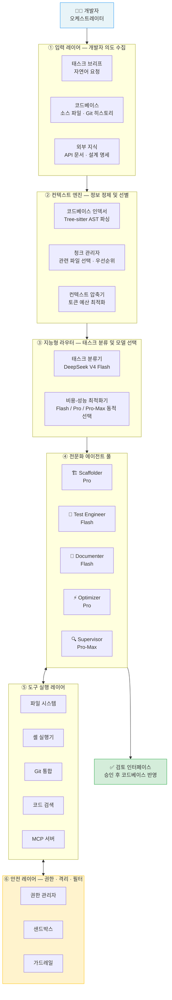

### 데이터 흐름 요약

시스템의 데이터 흐름은 단방향이 아니라 반복적이다. 개발자의 자연어 요청이 입력되면, 컨텍스트 엔진이 관련 파일을 선별하여 정제된 브리핑을 구성한다. 라우터는 태스크의 성격을 분류하여 적절한 에이전트와 모델 모드를 결정한다. 선택된 에이전트가 도구를 호출하며 작업을 수행하는 과정에서, 도구 실행 레이어와 안전 레이어가 모든 작업을 중재한다. 에이전트의 출력은 검토 인터페이스를 통해 인간에게 제시되고, 인간의 승인 이후에만 코드베이스에 실제 변경이 반영된다.

---

---

# 슬라이드 4
## 컴포넌트 상세 정의 — 입력 레이어

### 역할과 책임

입력 레이어는 시스템의 관문(Gateway)이다. 이 레이어의 핵심 역할은 개발자의 의도를 구조화된 데이터로 변환하여 이후 처리 파이프라인이 안정적으로 작동할 수 있는 기반을 제공하는 것이다. 단순히 텍스트를 받아 전달하는 것이 아니라, 태스크 브리프·코드베이스·외부 지식이라는 세 원천에서 정보를 수집하고 초기 검증을 수행한다.

### 컴포넌트 구성

**태스크 브리프(Task Brief)**: 개발자가 자연어로 작성하는 작업 요청이다. "사용자 인증 모듈 구현 (JWT + OAuth2)", "결제 API의 예외 처리 강화" 같은 형태로 입력된다. 좋은 브리프는 목표(What), 이유(Why), 제약조건(Constraints)을 포함해야 한다. 이 레이어는 브리프의 최소 길이와 필수 필드를 검증하고, 너무 모호한 요청을 조기에 식별하여 명확화를 유도한다.

**코드베이스 참조(Codebase Reference)**: 에이전트가 기존 패턴, 스타일, 의존성을 이해하는 데 필요한 소스 코드다. 전체 코드베이스를 무분별하게 주입하는 것이 아니라, 태스크와 관련된 파일만 선별적으로 참조한다. Git 히스토리도 컨텍스트에 포함할 수 있으며, 최근 커밋 패턴에서 팀의 코딩 관례를 추론하는 데 활용된다.

**외부 지식(External Knowledge)**: API 문서, 설계 명세, 스타일 가이드, PR 템플릿 등 코드베이스 외부에 존재하는 참조 자료다. 에이전트가 외부 라이브러리를 올바르게 사용하거나 팀의 문서화 표준을 준수하게 하는 데 필수적이다.

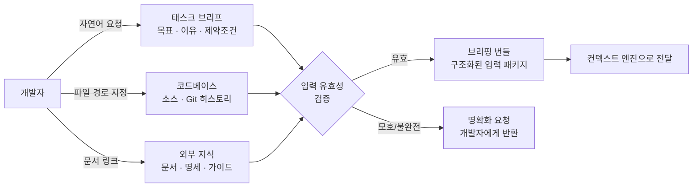

### 설계 결정: 명시적 컨텍스트 선택

이 레이어의 가장 중요한 설계 결정은 자동화된 컨텍스트 수집을 의도적으로 제한한다는 점이다. 많은 코딩 에이전트 도구가 전체 코드베이스를 자동으로 인덱싱하고 에이전트에 주입한다. 이 방식은 편리하지만 두 가지 문제를 야기한다. 첫째, 관련 없는 코드가 컨텍스트를 오염시켜 집중도를 낮춘다. 둘째, 보안상 민감한 파일이 의도치 않게 LLM 서버로 전송될 위험이 있다. 이 하네스는 개발자가 명시적으로 지정한 파일과 자동 발견 알고리즘이 선별한 파일을 결합하되, 최종 컨텍스트 목록을 항상 개발자가 확인할 수 있도록 투명성을 보장한다.

---

---

# 슬라이드 5
## 컴포넌트 상세 정의 — 컨텍스트 엔진

### 역할과 책임

컨텍스트 엔진은 이 하네스에서 가장 중요한 하위 시스템이다. "에이전트의 성능은 컨텍스트의 품질에 전적으로 의존한다"는 원칙의 구체적 구현체가 바로 이 엔진이다. 브리핑 번들로 입력된 원시 정보를 정제하고, 압축하고, 우선순위를 부여하여, 에이전트가 최소한의 토큰으로 최대한의 이해를 달성할 수 있는 최적의 컨텍스트 패키지를 구성한다.

### 세 개의 서브컴포넌트

**코드베이스 인덱서(Codebase Indexer)**: Tree-sitter 라이브러리를 사용하여 소스 코드를 추상 구문 트리(AST)로 파싱한다. 파일 단위가 아닌 함수, 클래스, 모듈 단위로 인덱싱함으로써 더 정밀한 검색이 가능해진다. 인덱싱 결과는 벡터 데이터베이스에 임베딩으로 저장되어 시맨틱 검색의 기반이 된다. 최초 인덱싱 이후에는 변경된 파일만 증분 업데이트하여 성능을 유지한다.

**청크 관리자(Chunk Manager)**: 태스크 브리프와 인덱스를 비교하여 관련 코드 청크를 선별한다. 선별 기준은 두 가지다. 키워드 일치도(태스크에 언급된 함수명, 클래스명, 모듈명)와 의미적 유사도(임베딩 벡터 코사인 유사도)를 결합하여 최종 점수를 산출한다. 또한 선택된 청크가 참조하는 의존성 파일을 자동으로 추가하여 컨텍스트의 완전성을 보장한다.

**컨텍스트 압축기(Context Compressor)**: 선별된 청크들이 모델의 컨텍스트 윈도우 예산을 초과할 경우, 우선순위가 낮은 청크를 압축하거나 제거한다. DeepSeek V4 Pro의 경우 1M 토큰 컨텍스트를 지원하지만, 이 중 태스크 브리프와 대화 히스토리를 제외한 실질적 코드 컨텍스트 예산을 약 180K 토큰으로 제한한다. 이는 모델이 긴 컨텍스트의 중간 부분에서 주의력이 저하되는 "lost-in-the-middle" 현상을 방지하기 위한 것이다.

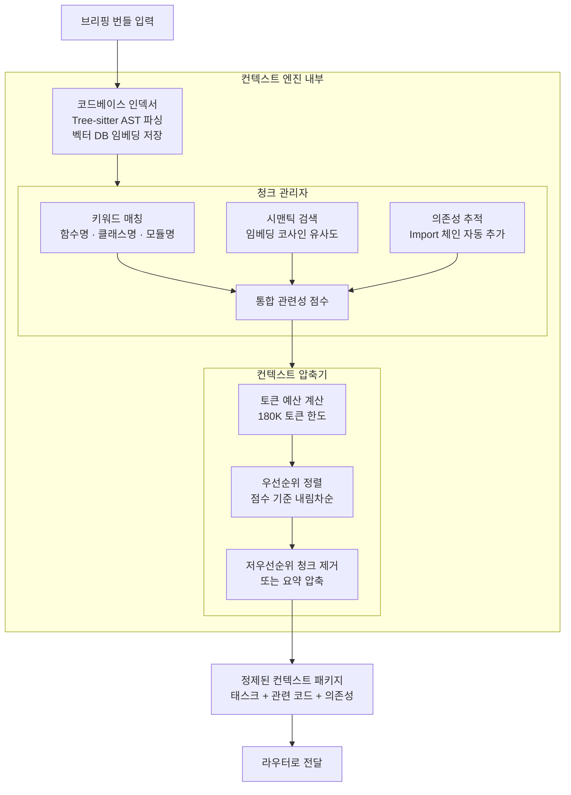

### 성능 및 캐싱 전략

컨텍스트 엔진은 캐싱을 적극적으로 활용한다. AST 인덱스는 파일 변경 타임스탬프를 기준으로 무효화되며, 임베딩은 동일 파일이 다른 태스크에서 재사용될 때 재계산 없이 재활용된다. 이를 통해 두 번째 이후 태스크에서는 컨텍스트 구성 시간이 초기 인덱싱 대비 80% 이상 단축된다.

---

---

# 슬라이드 6
## 컴포넌트 상세 정의 — 지능형 라우터

### 역할과 책임

지능형 라우터는 이 하네스의 경제성과 품질 사이의 균형을 조율하는 두뇌다. 모든 태스크에 가장 강력한 모델을 적용하는 것은 품질 면에서 이상적이지만, 비용 효율이 떨어진다. 반대로 모든 태스크에 가장 저렴한 모델을 사용하면 복잡한 작업의 품질이 보장되지 않는다. 라우터는 태스크의 성격과 복잡도를 분석하여 가장 적절한 에이전트와 모델 모드를 동적으로 결정한다.

라우터 자체는 DeepSeek V4 Flash를 사용한다. 결정 품질보다 속도와 비용이 중요한 라우팅 작업의 특성상, 가장 가벼운 모델이 최선이다.

### 라우팅 결정 로직

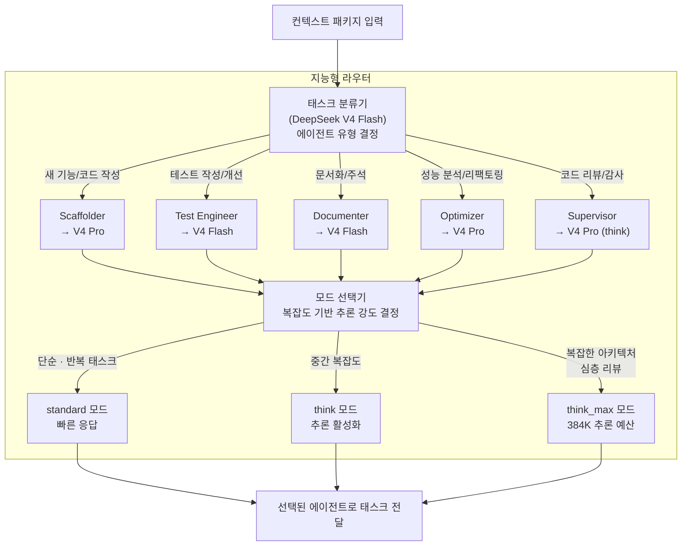

### 라우팅 결정 매트릭스

라우터가 참조하는 결정 기준은 다음과 같이 구조화된다. 태스크 유형, 권장 에이전트, 기본 모델, 기본 추론 모드, 그리고 모드를 상향 조정하는 조건을 하나의 매트릭스로 표현하면 아래와 같다.

태스크 유형이 "새 기능 구현"이면 Scaffolder 에이전트에 V4 Pro 모델이 배정되며, 기본 standard 모드로 시작하되 외부 라이브러리 통합이나 복잡한 비즈니스 로직을 포함하면 think 모드로 상향된다. "테스트 작성"은 Test Engineer에 V4 Flash가 배정되며, 코드 커버리지 전략 설계가 필요한 경우 Pro로 에스컬레이션된다. "코드 리뷰"는 Supervisor에 V4 Pro가 배정되고, 보안 감사나 전체 PR 검토처럼 심층 분석이 요구될 때 think_max 모드가 활성화된다.

### 에스컬레이션 메커니즘

라우터는 에이전트 실행 중에도 동적으로 개입할 수 있다. 에이전트가 일정 횟수 이상 오류를 반복하거나, 도구 호출이 예상 범위를 벗어나거나, 실행 시간이 임계값을 초과하면 라우터가 개입하여 더 강력한 모드로 에스컬레이션하거나 인간에게 개입을 요청한다. 이 메커니즘이 단순 라우팅을 넘어 동적 조율 시스템으로서의 라우터 역할을 완성한다.

---

---

# 슬라이드 7
## 에이전트 풀 — 다섯 가지 전문화 에이전트

### 설계 원칙: 개념적 페르소나

에이전트 풀을 구성하는 다섯 개의 에이전트는 별도의 프로세스나 별도의 API 호출 구조가 아니다. 이들은 동일한 LLM에 서로 다른 역할별 시스템 프롬프트와 도구 명세를 제공함으로써 실현되는 **개념적 페르소나(Conceptual Persona)** 다. 같은 DeepSeek V4 Pro 모델에 "당신은 QA 엔지니어입니다"라고 지시하면 Test Engineer가 되고, "당신은 수석 엔지니어로서 코드 리뷰를 수행합니다"라고 지시하면 Supervisor가 된다.

이 설계 방식의 장점은 유연성이다. 새로운 에이전트를 추가하는 것은 새로운 시스템 프롬프트를 작성하는 것만으로 충분하다. 인프라 변경 없이 에이전트 팀의 구성을 확장하거나 수정할 수 있다.

### 에이전트별 상세 명세

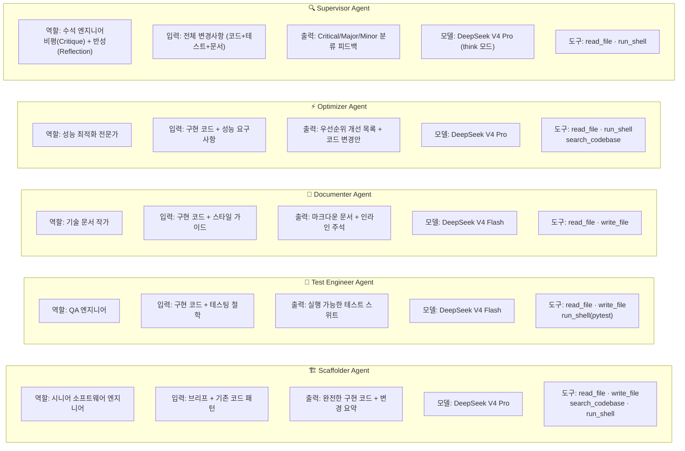

### Supervisor의 2단계 메커니즘

Supervisor는 다른 에이전트들과 구조적으로 구별되는 **비평-반성(Critique-Reflection) 이중 단계**를 수행한다. 이 설계는 단순히 "코드 리뷰를 해주세요"라고 요청하는 것보다 실질적으로 더 유용한 피드백을 생성하기 위한 것이다.

1단계 비평(Critique) 단계에서는 제약 없이 모든 잠재적 문제를 식별한다. 버그와 로직 오류, 보안 취약점, 성능 이슈, 코딩 표준 위반, 테스트 커버리지 부족 등 발견되는 모든 것을 목록화한다.

2단계 반성(Reflection) 단계에서는 비평 목록을 메타 분석한다. 어떤 이슈가 실제로 중요한가? 어떤 것이 사소한 스타일 선호도 차이에 불과한가? 이 필터링 과정을 거쳐 최종적으로 Critical / Major / Minor의 세 등급으로 분류된 우선순위화된 피드백이 생성된다. 개발자는 이 피드백의 모든 항목을 처리할 의무가 없다. Minor 항목은 향후 개선 사항으로 추적하되, Critical과 Major에 집중할 수 있다.

---

---

# 슬라이드 8
## 에이전트 루프 — 핵심 동작 메커니즘

### 루프의 본질

에이전트가 코딩 작업을 수행하는 핵심 메커니즘은 **관찰-행동-관찰의 반복 루프**다. LLM은 텍스트만 생성할 수 있다. 파일을 직접 읽거나, 명령을 실행하거나, 코드를 편집할 수 없다. 하네스는 LLM이 텍스트로 표현한 도구 호출 의도를 가로채서 실제 시스템에서 실행하고, 그 결과를 다시 LLM의 컨텍스트에 추가하여 다음 단계 추론이 현실 기반에서 이루어지도록 한다.

이 루프의 구현 핵심은 약 60~75줄의 Python 코드에 불과하다. 복잡성은 루프 자체가 아니라 튜닝에 있다. 어떤 도구를 제공할지, 그 도구를 어떻게 설명할지, 시스템 프롬프트에 무엇을 담을지가 실질적인 에이전트 성능을 결정한다.

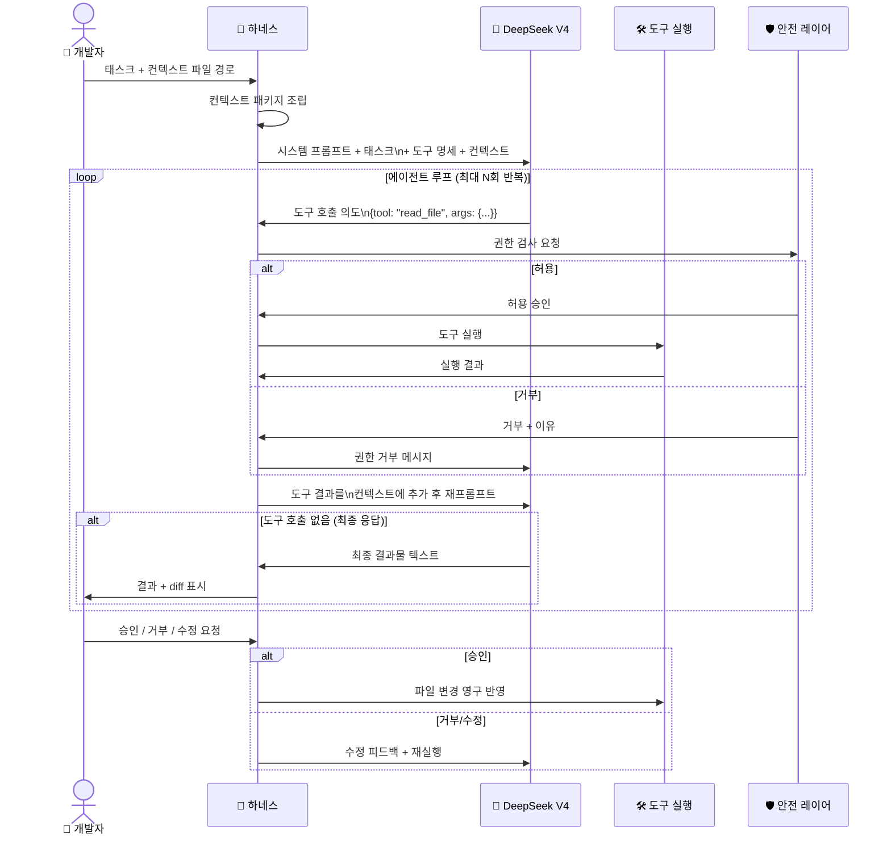

### 루프 제어 메커니즘

에이전트 루프는 무한정 실행될 수 없다. 세 가지 종료 조건이 있다.

첫째, **정상 완료**다. LLM이 도구 호출 없이 최종 응답 텍스트를 반환하면 루프가 종료된다. 이는 에이전트가 태스크를 완료했다고 판단한 상태다.

둘째, **최대 반복 도달**이다. `max_iterations` 파라미터(기본값 10)에 도달하면 루프가 강제 종료되고, 지금까지의 진행 상황을 개발자에게 보고한다. 복잡한 태스크는 이 값을 상향 조정할 수 있다.

셋째, **오류 에스컬레이션**이다. 특정 도구가 연속 3회 실패하거나, 예상치 못한 예외가 발생하면 루프가 중단되고 인간 개입이 요청된다.

---

---

# 슬라이드 9
## 도구 실행 레이어 — 에이전트의 손과 눈

### 도구의 역할

도구는 에이전트가 실제 세계와 상호작용하는 유일한 채널이다. 에이전트가 아무리 뛰어난 추론을 수행해도, 도구 없이는 어떤 실질적인 변화도 만들어낼 수 없다. 이 레이어는 에이전트가 텍스트로 표현한 의도를 실제 시스템 작업으로 변환하는 변환기(Transducer) 역할을 한다.

### 다섯 가지 핵심 도구

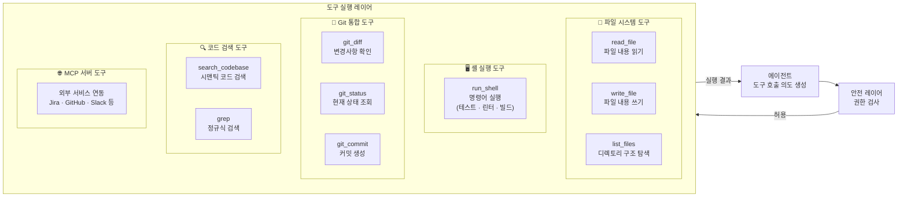

**파일 시스템 도구**: `read_file`, `write_file`, `list_files`로 구성된다. 이 세 도구가 에이전트의 기본 작업 공간이다. 주의할 점은 `write_file`이 즉시 파일을 덮어쓰는 것이 아니라, 변경 제안을 버퍼에 저장하고 인간 승인 후에 실제 파일에 반영하는 방식으로 동작한다는 점이다. 이것이 인간이 최종 품질 게이트로 기능하는 구조적 보장이다.

**셸 실행 도구**: `run_shell`은 가장 강력하지만 가장 위험한 도구다. 테스트 실행(`pytest`), 린터(`flake8`, `mypy`), 빌드 시스템(`make`, `cargo build`) 등을 실행한다. 이 도구는 안전 레이어의 차단 목록(blocklist)과 경로 제한이 가장 엄격하게 적용되는 도구이기도 하다.

**Git 통합 도구**: 에이전트가 변경사항의 영향 범위를 스스로 파악하고, 올바른 단위로 커밋을 생성하는 데 사용된다. `git_diff`는 에이전트가 자신이 생성한 변경사항을 검토하는 자기 점검 도구로도 활용된다.

**코드 검색 도구**: `search_codebase`는 컨텍스트 엔진의 벡터 DB를 쿼리하여 태스크와 의미적으로 관련된 코드를 찾는다. 에이전트가 기존 패턴을 참조하거나, 유사한 구현 예시를 찾거나, 함수의 사용처를 파악하는 데 사용된다.

**MCP 서버 도구**: Model Context Protocol을 통해 외부 서비스와 연동된다. GitHub에서 이슈를 조회하거나, Jira 티켓 정보를 가져오거나, Slack에 진행 상황을 알리는 등의 기능이 이 레이어에서 처리된다.

---

---

# 슬라이드 10
## 안전 레이어 — 권한, 격리, 가드레일

### 안전 설계의 철학

에이전트에게 강력한 도구를 제공한다는 것은 실수나 오용의 영향 반경도 함께 커진다는 의미다. Anthropic의 엔지니어 Thariq Shihipar는 코딩 에이전트의 보안 모델을 "스위스 치즈 방어(Swiss cheese defense)"라고 표현한다. 개별적으로는 구멍이 있지만, 여러 레이어를 중첩하면 어떤 단일 취약점도 전체 시스템을 타협시킬 수 없다. 이 하네스의 안전 레이어는 모델 얼라인먼트, 하네스 권한 관리, 샌드박스 격리의 세 레이어를 중첩한다.

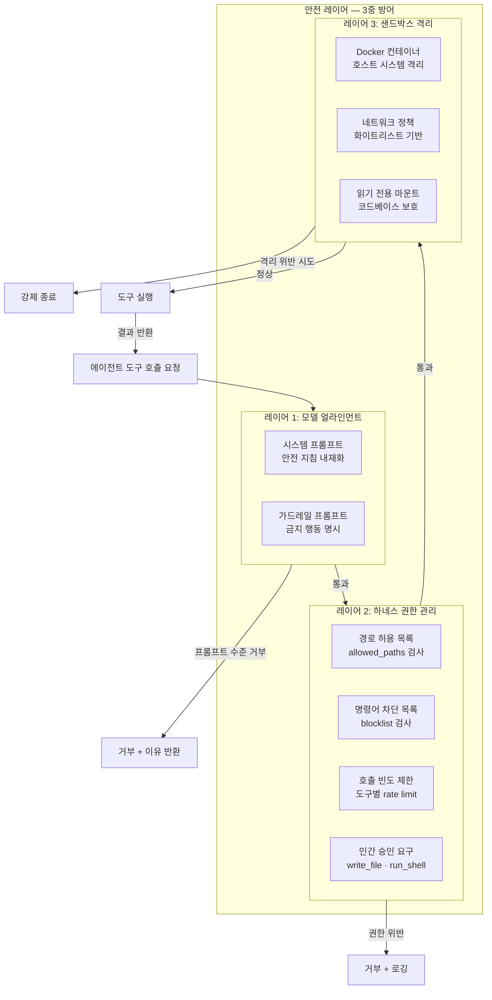

### 권한 관리 상세

권한 관리자는 모든 도구 호출 요청을 실행 전에 검사하는 정책 집행 지점이다.

**경로 허용 목록(allowed_paths)**: 에이전트가 읽거나 쓸 수 있는 파일 경로를 명시적으로 지정한다. `./src`, `./tests`, `./docs` 처럼 태스크와 관련된 디렉토리만 허용하고, 시스템 파일이나 자격증명 파일이 위치한 디렉토리는 완전히 차단한다. `~/.ssh`, `~/.aws`, `.env` 같은 경로는 절대 허용 목록에 포함되어서는 안 된다.

**명령어 차단 목록(blocked_commands)**: `rm -rf /`, 포크 폭탄(`:(){ :|:& };:`), 외부에서 스크립트를 다운로드하여 실행하는 패턴(`curl * | bash`) 등 위험한 명령어 패턴을 차단한다. 정규식 기반으로 패턴을 정의하여 변형을 통한 우회를 방지한다.

**인간 승인 요구(require_approval_for)**: `write_file`과 `run_shell`은 인간 승인 없이 실행할 수 없도록 구성할 수 있다. `--auto-approve` 플래그를 통해 신뢰된 환경에서 자동 승인으로 전환할 수 있지만, 기본값은 항상 승인 요구다.

### 샌드박스 격리

프로덕션 시스템에서 에이전트는 Docker 컨테이너 안에서 실행된다. 컨테이너는 호스트 시스템과 파일 시스템을 공유하지 않으며, 네트워크 접근은 화이트리스트에 등록된 외부 API 엔드포인트만 허용된다. 코드베이스는 읽기 전용으로 마운트되고, 에이전트의 쓰기 작업은 별도 볼륨에 기록된 후 검토와 승인을 거쳐 원본 코드베이스에 병합된다.

---

---

# 슬라이드 11
## LLM 모델 전략 — DeepSeek V4 중심의 멀티 모델 아키텍처

### DeepSeek V4: 왜 이 모델인가

2026년 4월 24일 공개된 DeepSeek V4는 코딩 에이전트 하네스의 기본 모델로 선택될 충분한 이유를 갖고 있다.

첫째, 에이전틱 코딩 벤치마크에서 오픈소스 SOTA를 달성하며, GPT-5.5와 Claude Opus 4.7에 버금가는 성능을 제공한다. 둘째, Claude Code, OpenCode 같은 주요 코딩 에이전트와의 통합이 원활하도록 명시적으로 최적화되었다. 셋째, 출력 토큰 백만 개당 3.48달러(Pro)라는 가격은 Claude Opus 4.7의 25달러, GPT-5.5의 30달러 대비 약 7~9배 저렴하다. 넷째, 1M 토큰 컨텍스트가 기본값으로 제공되어 대규모 코드베이스를 한 번에 처리할 수 있다. 다섯째, MIT 라이선스의 오픈 웨이트 모델로 자가 호스팅이 가능하다.

### 멀티 모델 전략 구조

단일 모델에 의존하는 것은 운영 리스크다. 이 하네스는 세 개의 모델 레이어를 중첩하는 멀티 모델 전략을 채택한다.

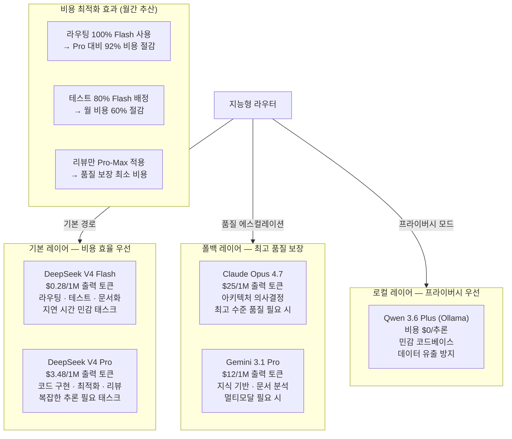

### 모델별 최적 태스크 할당

각 모델을 어떤 태스크에 배정하는가가 이 아키텍처의 경제성을 결정한다. 아래 원칙을 따른다.

V4 Flash는 응답 시간이 중요하고 반복적이며 창의성보다 정확성이 요구되는 태스크에 적합하다. 라우팅 결정, 테스트 작성, 문서화, 간단한 버그 수정이 이에 해당한다. V4 Pro는 복잡한 비즈니스 로직 이해, 다중 파일 수정, 아키텍처 패턴 준수가 필요한 태스크에 배정된다. 새 기능 구현, 성능 최적화 분석, 심층 코드 리뷰가 여기에 속한다. Claude Opus 4.7는 프런티어 수준의 추론이 필요하거나 회사 전체 아키텍처에 영향을 미치는 의사결정에만 선택적으로 사용한다. 로컬 Qwen 3.6은 외부 API로 전송해서는 안 되는 민감한 비즈니스 로직이나 개인정보를 포함하는 코드를 처리할 때 사용한다.

---

---

# 슬라이드 12
## 전체 파이프라인 — 다섯 에이전트의 순차 실행

### 파이프라인의 의미

단일 에이전트 실행이 단일 태스크를 처리하는 것이라면, 전체 파이프라인은 하나의 기능을 코드베이스에 안전하게 통합하기 위한 완전한 개발 사이클을 자동화하는 것이다. Scaffolder가 구현하고, Test Engineer가 검증하고, Documenter가 기록하고, Optimizer가 개선하고, Supervisor가 최종 승인하는 5단계 연쇄 실행이 이루어진다.

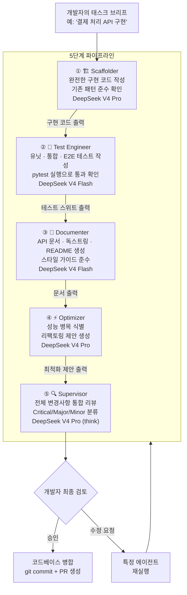

### 파이프라인 실행의 실제

전체 파이프라인을 실행할 때 각 단계는 이전 단계의 출력을 컨텍스트로 활용한다. Test Engineer는 Scaffolder가 작성한 코드를 보고 테스트를 작성하며, Optimizer는 Scaffolder의 구현과 Test Engineer의 테스트를 모두 분석하여 개선점을 도출한다. Supervisor는 모든 이전 단계의 산출물을 한꺼번에 검토하여 전체 변경사항의 통합적 품질을 평가한다.

각 단계 사이에는 선택적 검사점(checkpoint)을 둘 수 있다. 예를 들어 Scaffolder의 출력이 명백히 잘못된 경우, 이후 단계를 진행하기 전에 개발자가 개입하여 방향을 수정할 수 있다. 이 중간 개입 기능이 전체 파이프라인을 블랙박스 자동화가 아닌 인간 주도 협력으로 유지하는 핵심이다.

---

---

# 슬라이드 13
## 컨텍스트 스테이징 영역 — 태스크별 브리핑 패키지

### 스테이징 영역의 개념

컨텍스트 스테이징 영역은 각 태스크를 위해 임시로 생성되는 전용 작업 공간이다. 파일 시스템 상의 디렉토리(`task-context/`)로 구현되며, 에이전트가 해당 태스크를 수행하는 데 필요한 모든 정보를 구조화하여 담는다. 마치 새로운 팀원에게 업무를 배정하기 전에 필요한 모든 자료를 한 봉투에 담아 전달하는 것과 같다.

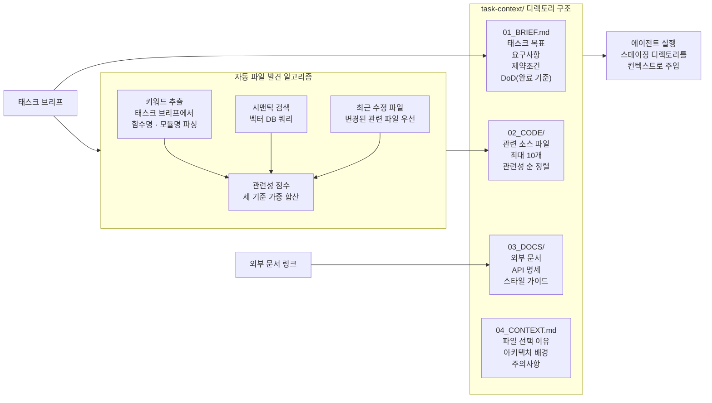

### 브리핑 번들의 네 구성 요소

**01_BRIEF.md — 태스크 목표**: 이것이 가장 중요한 파일이다. 태스크의 목표, 배경, 요구사항, 제약조건, 그리고 완료 기준(Definition of Done)을 담는다. 에이전트는 이 파일을 시스템 프롬프트 다음으로 가장 높은 우선순위로 처리한다. 좋은 브리프는 에이전트가 두 번 묻지 않아도 될 정도로 완전해야 한다.

**02_CODE/ — 관련 소스 파일**: 태스크와 관련된 소스 파일을 최대 10개까지 담는다. 파일 수를 제한하는 것은 컨텍스트 오염을 방지하기 위해서다. 자동 발견 알고리즘이 관련성 점수를 기준으로 상위 파일을 선택하지만, 개발자가 수동으로 추가하거나 제외할 수 있다.

**03_DOCS/ — 외부 지식**: 외부 라이브러리 문서, 팀의 코딩 스타일 가이드, 보안 요구사항, API 설계 명세 등을 담는다. 에이전트가 외부 지식 없이 내부 코드만으로는 판단할 수 없는 결정을 내려야 할 때 이 파일들이 근거가 된다.

**04_CONTEXT.md — 메타 정보**: 왜 이 파일들이 선택되었는지, 프로젝트의 전반적 아키텍처 배경은 무엇인지, 에이전트가 주의해야 할 사항은 무엇인지를 설명하는 메타 파일이다. 특히 초보 팀원에게 업무를 맡길 때 배경 설명이 필요한 것처럼, 에이전트도 이 컨텍스트 파일을 통해 더 나은 판단을 내린다.

---

---

# 슬라이드 14
## 프롬프트 라이브러리 — 버전 관리되는 에이전트 인격

### 프롬프트를 코드처럼 취급하라

Appendix G의 중요한 실천 원칙 중 하나는 에이전트 프롬프트를 코드처럼 취급하는 것이다. 프롬프트는 에이전트의 인격을 정의한다. 프롬프트가 바뀌면 에이전트의 행동이 바뀐다. 따라서 프롬프트는 Git으로 버전 관리되어야 하고, 팀이 협력하여 개선해야 하며, 변경 이력이 추적되어야 한다.

```
/prompts
├── scaffolder.md       ← Scaffolder 에이전트 시스템 프롬프트
├── test_engineer.md    ← Test Engineer 에이전트 시스템 프롬프트
├── documenter.md       ← Documenter 에이전트 시스템 프롬프트
├── optimizer.md        ← Optimizer 에이전트 시스템 프롬프트
├── supervisor.md       ← Supervisor 에이전트 시스템 프롬프트
├── router.md           ← 라우팅 결정 프롬프트
└── CHANGELOG.md        ← 프롬프트 변경 이력
```

### 좋은 에이전트 프롬프트의 구조

각 에이전트 프롬프트는 다음 구조를 따른다.

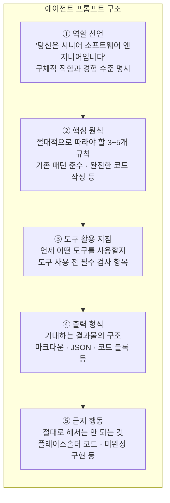

**역할 선언**은 에이전트가 어떤 관점에서 태스크를 바라볼지를 결정한다. "시니어 소프트웨어 엔지니어"와 "QA 엔지니어"는 동일한 코드를 매우 다른 관점에서 바라본다. 역할이 구체적이고 명확할수록 에이전트의 행동 예측 가능성이 높아진다.

**핵심 원칙**은 에이전트의 행동을 제약하는 불변 규칙이다. Scaffolder의 경우 "플레이스홀더나 TODO 주석을 절대 남기지 않는다. 모든 함수는 완전히 구현되어야 한다"가 핵심 원칙 중 하나다. 이 원칙이 없으면 에이전트가 미완성 코드를 구현으로 착각하는 경우가 발생한다.

**출력 형식**의 명세가 중요한 이유는 파이프라인의 다음 단계가 이전 단계의 출력을 파싱해야 하기 때문이다. Supervisor의 출력이 `## Critical Issues` 섹션으로 시작하도록 강제하면, 이후 처리 코드가 해당 섹션의 존재 여부로 에스컬레이션 여부를 자동 판단할 수 있다.

---

---

# 슬라이드 15
## Git 통합 및 DevOps 자동화

### Git 훅을 통한 품질 자동화

에이전트를 개발 워크플로에 자연스럽게 통합하는 가장 효과적인 방법은 Git 훅이다. 개발자가 별도의 명령을 실행하지 않아도, Git의 특정 이벤트(커밋, 푸시 등)가 발생할 때 에이전트가 자동으로 개입한다.

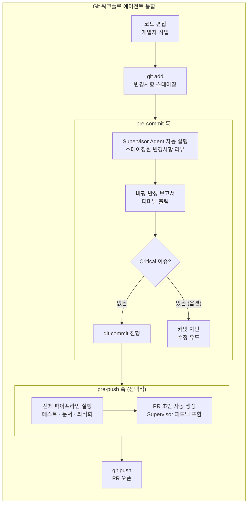

**pre-commit 훅**: 가장 핵심적인 자동화다. `git commit` 명령이 실행될 때 Supervisor 에이전트가 스테이징된 변경사항을 분석하고, 비평-반성 보고서를 터미널에 직접 출력한다. 개발자는 커밋 확정 전에 이 피드백을 검토하고 필요한 수정을 할 수 있다. Critical 이슈 발견 시 커밋을 자동 차단하는 것은 선택적 기능이다. 기본값은 경고만 표시하고 커밋을 허용하는 방식으로, 개발자의 자율성을 존중한다.

**pre-push 훅**: `git push` 실행 시 전체 파이프라인을 실행하는 더 강력한 자동화다. 테스트가 모두 통과하는지, 문서가 최신 상태인지, 최적화 기회가 없는지를 확인한 후 PR 초안을 자동 생성한다. 이 훅은 실행 시간이 상당히 길 수 있으므로(수 분), 큰 변경사항에만 선택적으로 적용하는 것이 권장된다.

### 버전 관리 프롬프트 라이브러리의 운영

프롬프트도 코드베이스의 일부다. 팀원이 에이전트의 행동에 문제를 발견하면, 해당 에이전트의 프롬프트를 수정하는 PR을 올린다. 이 PR은 코드 변경 PR과 동일한 리뷰 프로세스를 거친다. 프롬프트 변경이 에이전트 행동에 미치는 영향을 평가하기 위해, 프롬프트 변경 PR은 반드시 테스트 케이스(예상 입력과 기대 출력 쌍)와 함께 제출되어야 한다.

---

---

# 슬라이드 16
## CLI 인터페이스 — 개발자 경험 설계

### CLI 설계 철학

CLI는 이 하네스와 개발자가 만나는 인터페이스다. 좋은 CLI는 강력하지만 단순해야 한다. 자주 쓰는 기능은 최소한의 타이핑으로 접근 가능해야 하고, 고급 기능은 필요할 때 발견할 수 있어야 한다.

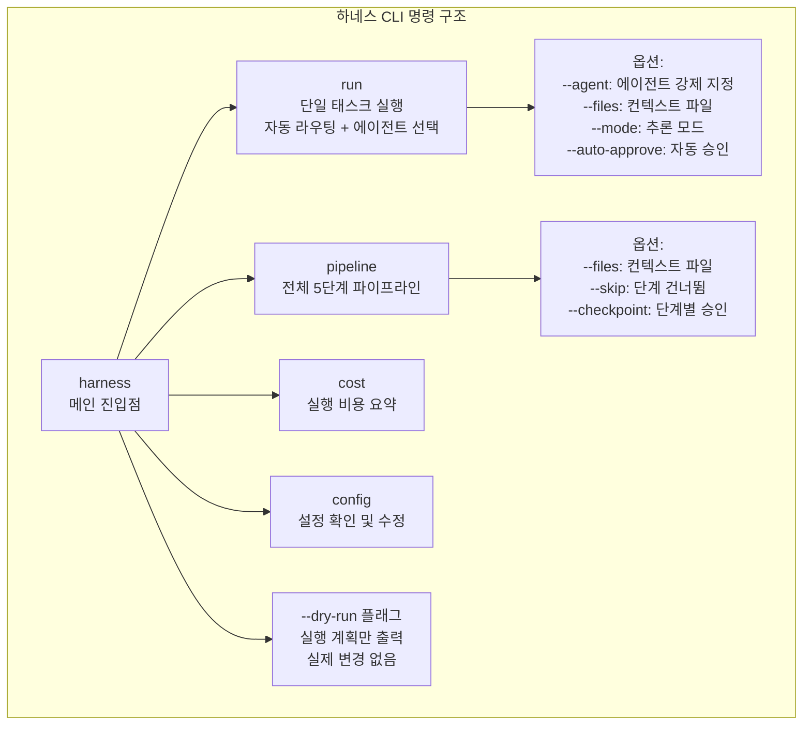

### 주요 사용 시나리오

```bash
# 시나리오 1: 자동 라우팅으로 단순 실행
# 라우터가 태스크를 분석하여 최적 에이전트 선택
harness run "사용자 프로필 업데이트 API 엔드포인트 구현"

# 시나리오 2: 에이전트 명시 + 특정 파일 컨텍스트
harness run "auth.py의 JWT 토큰 검증 로직 최적화" \
    --agent optimizer \
    --files src/auth.py src/middleware.py

# 시나리오 3: 최고 품질 코드 리뷰 (PR 제출 전)
harness run "결제 모듈 전체 리뷰" \
    --agent supervisor \
    --mode think_max \
    --files src/payment/ tests/test_payment.py

# 시나리오 4: 전체 파이프라인 (새 기능 완성)
harness pipeline "Stripe 웹훅 처리 모듈 구현"

# 시나리오 5: dry-run으로 계획 확인 후 실행
harness run "인증 모듈 전면 리팩토링" --dry-run
# 출력: 사용할 에이전트, 모델, 모드, 예상 비용 표시
# 개발자가 확인 후 --dry-run 없이 재실행

# 시나리오 6: 비용 추적
harness cost
# 출력: 금일 실행 내역, 에이전트별 비용, 월간 누적
```

### TUI — 터미널 UI 인터페이스

CLI 외에 풍부한 터미널 UI(TUI)를 제공하여 에이전트 실행 과정을 시각적으로 모니터링할 수 있다. TUI는 현재 실행 중인 에이전트, 도구 호출 내역, 생성된 코드의 실시간 diff, 그리고 인간 승인이 필요한 시점에 인터랙티브 프롬프트를 표시한다.

---

---

# 슬라이드 17
## 배포 아키텍처 — 개발 환경에서 팀 환경까지

### 3단계 배포 모델

이 하네스는 개인 개발자부터 엔터프라이즈 팀까지 다양한 규모에서 사용될 수 있다. 배포 복잡도를 최소화하면서 확장 가능한 3단계 모델을 제안한다.

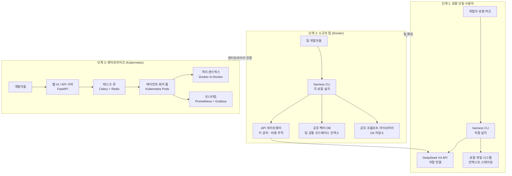

**단계 1(로컬 단일 사용자)**: 개별 개발자가 로컬 머신에 CLI를 설치하고, DeepSeek V4 API 키를 환경변수로 설정하여 바로 사용한다. 설치는 `pip install coding-harness`로 끝난다. 벡터 DB는 로컬 파일로 저장되며, 프롬프트 라이브러리는 개인 디렉토리에 관리된다.

**단계 2(소규모 팀)**: 팀 공용 API 게이트웨이를 통해 API 키를 중앙 관리하고 비용을 팀원별로 추적한다. 코드베이스 인덱스를 공유 벡터 DB에 저장하여 팀원 모두가 동일한 검색 품질을 누린다. 프롬프트 라이브러리는 공용 Git 저장소로 관리하며 팀이 협력하여 개선한다.

**단계 3(엔터프라이즈)**: 웹 UI로 에이전트를 제어하고, 태스크 큐를 통해 비동기 실행을 지원한다. 에이전트 워커는 Kubernetes 파드로 실행되어 수평 확장이 가능하며, Docker-in-Docker 샌드박스로 완전한 격리를 보장한다. 실행 비용과 성능은 Prometheus와 Grafana로 모니터링한다.

---

---

# 슬라이드 18
## 비용 최적화 전략 — 토큰 예산 관리

### 에이전트 비용의 구조

코딩 에이전트의 비용은 예측하기 어렵다. 단순 질의응답과 달리, 에이전트는 도구 호출과 대화 히스토리 누적으로 인해 단일 태스크에서 수만 토큰을 소비할 수 있다. 이 하네스는 세 수준에서 비용을 제어한다.

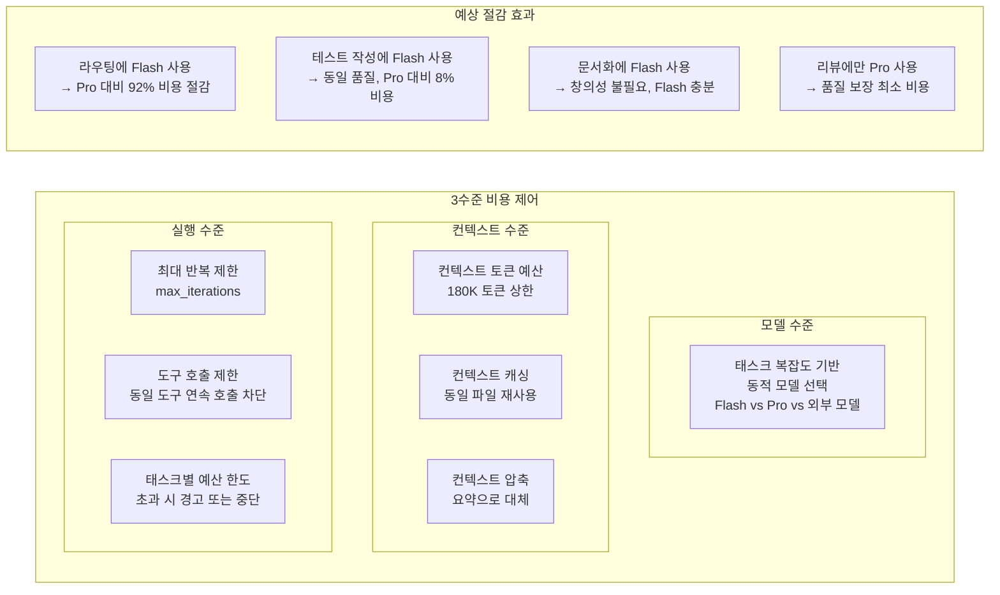

### 월간 비용 시나리오 분석

일반적인 중간 규모 팀(개발자 5명)의 월간 에이전트 사용 시나리오를 가정하면, 전략 없이 모든 태스크에 Claude Opus 4.7을 사용할 경우 약 월 1,200달러가 예상된다. 이 하네스의 모델 선택 전략을 적용하면 동일한 작업량을 약 180~250달러로 처리할 수 있다. 핵심은 품질이 중요한 태스크에만 비싼 모델을 쓰고, 나머지는 충분히 저렴한 모델로 처리하는 것이다.

중요한 점은 DeepSeek V4가 단순히 저렴한 것이 아니라 GPT-5.5와 Claude Opus 4.7에 버금가는 에이전틱 성능을 제공한다는 것이다. 비용을 아끼면서도 품질을 타협하지 않는 선택이 가능해진 것이다.

---

---

# 슬라이드 19
## 모니터링 및 품질 관리

### 관찰 가능성(Observability) 설계

에이전트 시스템은 비결정론적이다. 동일한 프롬프트에도 매번 다른 출력이 나올 수 있다. 이는 전통적인 소프트웨어 테스팅 방식으로는 품질을 보장하기 어렵다는 의미다. 따라서 에이전트 시스템에는 실행 후 검증이 아닌 지속적 관찰이 필수다.

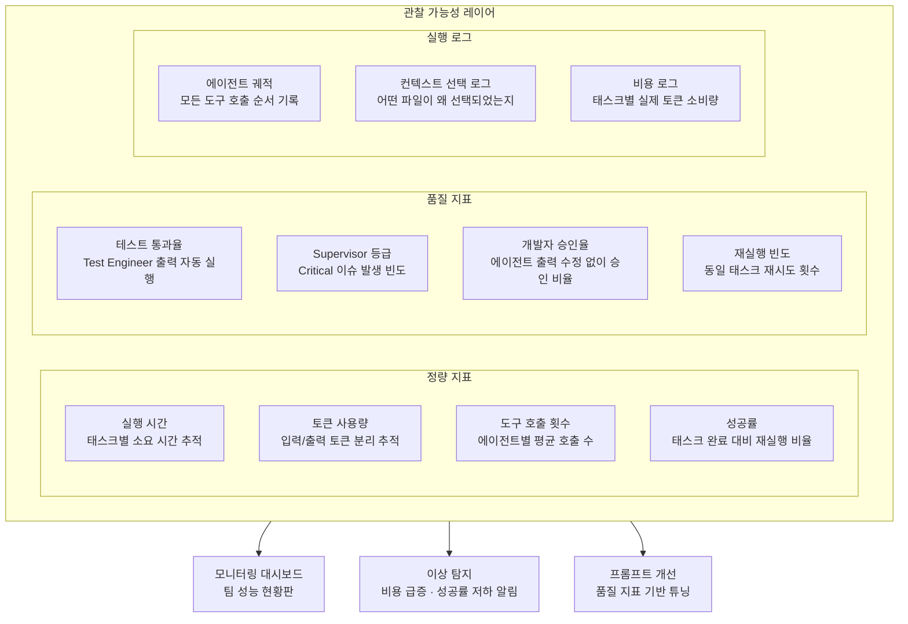

### 지속적 품질 개선 사이클

관찰 데이터는 단순 모니터링을 넘어 시스템 개선의 피드백 루프를 형성한다. 개발자 승인율이 낮은 에이전트는 프롬프트 개선의 대상이 된다. Critical 이슈 발생 빈도가 높은 코드 영역은 더 강력한 모드(think_max)를 기본으로 설정하도록 라우터를 조정한다. 특정 유형의 태스크에서 재실행 빈도가 높으면, 해당 유형의 브리핑 템플릿을 개선한다.

이 피드백 루프가 시스템 전체를 점진적으로 개선하는 자기 강화 메커니즘이다. 처음에는 완벽하지 않은 하네스가 운영 데이터를 통해 시간이 지날수록 팀의 특정 코드베이스와 개발 문화에 맞춰 최적화된다.

---

---

# 슬라이드 20
## 구현 로드맵 및 마일스톤

### 단계적 구현 전략

이 하네스의 완전한 구현은 단계적으로 접근한다. 각 단계는 독립적으로 가치를 제공하며, 이전 단계 위에 점진적으로 기능을 추가한다. 처음부터 모든 기능을 구현하려 하지 않는다. 핵심 루프를 먼저 안정화하고, 그 위에 전문화 에이전트를 추가하는 방식이 가장 실용적이다.

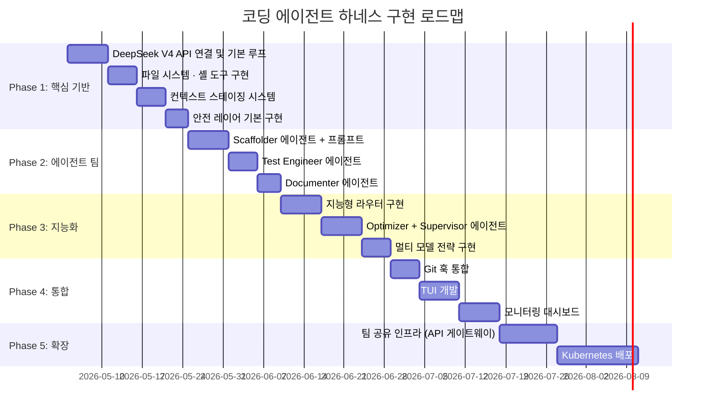

### 각 단계의 완료 기준

**Phase 1 완료 기준**: DeepSeek V4 Flash/Pro API 호출이 정상 동작하고, 파일 읽기/쓰기와 셸 명령 실행이 권한 검사와 함께 작동한다. 기본 에이전트 루프가 최대 반복 제한과 오류 처리를 포함하여 안정적으로 동작한다.

**Phase 2 완료 기준**: 다섯 개의 전문화 에이전트가 각각의 역할에 맞는 출력을 생성한다. Scaffolder가 완전한 구현 코드를 생성하고, Test Engineer가 실제로 통과하는 테스트를 작성한다.

**Phase 3 완료 기준**: 라우터가 태스크 유형을 올바르게 분류하여 적절한 에이전트와 모델 모드를 선택한다. 전체 5단계 파이프라인이 순차적으로 실행된다.

**Phase 4 완료 기준**: `git commit` 시 Supervisor가 자동으로 실행되어 피드백을 제공한다. 개발자가 CLI 또는 TUI를 통해 에이전트를 직관적으로 제어할 수 있다.

**Phase 5 완료 기준**: 팀 환경에서 API 게이트웨이를 통해 비용을 팀원별로 추적한다. Kubernetes 배포로 동시 다중 에이전트 실행이 가능하다.

---

---

# 슬라이드 21
## 핵심 통찰 및 설계 교훈

### 현장에서 검증된 다섯 가지 교훈

이 아키텍처는 이론이 아닌 실전 경험에서 도출된 통찰을 반영한다.

**교훈 1: 적게 주어야 더 잘한다**
Vercel의 사례에서 배우자. 도구를 많이 줄수록 에이전트가 더 강력해지는 것이 아니다. 오히려 선택의 부담이 증가하고 잘못된 도구를 선택할 확률이 높아진다. 에이전트에게 태스크에 꼭 필요한 도구만 제공하고, 나머지는 제거하라. Manus가 6개월 동안 프레임워크를 5번 재구축하면서 배운 교훈도 같다. 가장 큰 성과는 기능을 추가하는 것이 아니라 제거하는 데서 왔다.

**교훈 2: 하네스가 모델보다 중요하다**
동일한 모델이 하네스에 따라 91.1%와 87.2%로 다른 SWE-bench 성능을 보인다. 더 비싼 모델을 사기 전에 먼저 하네스를 개선하라. 시스템 프롬프트 한 줄의 변경이 모델 업그레이드보다 더 큰 성능 향상을 가져올 수 있다.

**교훈 3: 컨텍스트 오염이 가장 흔한 실패 원인이다**
에이전트가 이상한 코드를 생성할 때, 가장 먼저 의심해야 할 것은 컨텍스트다. 관련 없는 파일이 컨텍스트에 포함되어 있진 않은가? 태스크 브리프가 충분히 명확한가? 에이전트 성능의 80%는 컨텍스트 품질로 설명된다.

**교훈 4: 에이전트의 출력은 항상 제안이다**
에이전트가 생성한 코드를 검토 없이 배포하는 것은 AI와 관계없이 좋지 않은 관행이다. 에이전트는 훌륭한 협력자이지만 프로덕션 코드의 최종 책임은 인간에게 있다. 검토와 승인의 마찰을 최소화하되, 이 단계를 완전히 생략해서는 안 된다.

**교훈 5: 반복적 대화가 단발성 프롬프트보다 낫다**
처음 요청한 결과가 마음에 들지 않으면, 그것을 버리고 처음부터 다시 시작하기 전에 피드백을 제공하고 개선을 요청하라. 에이전트는 대화 컨텍스트를 유지한다. 이전 시도에서 무엇이 잘못되었는지를 설명하는 한 줄이 훨씬 나은 다음 결과를 만들어낸다.

---

---

# 슬라이드 22
## 결론 — 증강된 개발의 새로운 패러다임

### 이 아키텍처가 정의하는 새로운 개발 패러다임

코딩 에이전트 하네스는 개발자를 대체하는 기술이 아니다. 개발자가 더 높은 수준의 작업에 집중할 수 있도록 하는 증폭기다. Scaffolder가 반복적인 구현을 담당하면, 개발자는 아키텍처 비전을 다듬는 데 시간을 쓸 수 있다. Test Engineer가 테스트 커버리지를 유지하면, 개발자는 사용자가 실제로 무엇을 원하는지를 고민하는 데 집중할 수 있다. Supervisor가 코드 품질을 지키면, 개발자는 기술 부채를 쌓지 않으면서도 더 빠르게 기능을 출시할 수 있다.

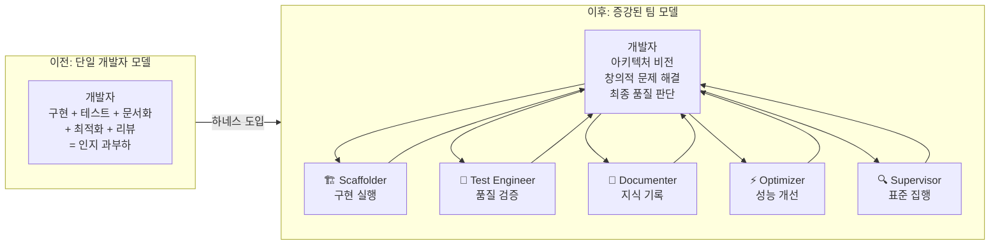

### 이 문서가 제시하는 것

이 아키텍처 정의서는 코딩 에이전트 하네스를 "개념"에서 "구현 가능한 시스템"으로 이어주는 다리다. 최상위 아키텍처에서 시작하여 각 컴포넌트의 내부 설계, 에이전트 루프의 동작 메커니즘, 도구와 안전 레이어의 상세 명세, LLM 모델 선택 전략, 배포 방식, 비용 최적화까지 실제 구현에 필요한 모든 수준의 설계 결정을 담았다.

Appendix G가 제시하는 세 원칙 — 인간 주도 오케스트레이션, 컨텍스트의 최우선성, 직접 모델 접근 — 은 이 아키텍처 전체를 관통하는 설계 철학이다. 이 원칙들이 각 컴포넌트의 설계 결정에 어떻게 반영되었는지를 이해한다면, 이 문서에 담기지 않은 새로운 상황에서도 올바른 결정을 내릴 수 있을 것이다.

코드의 미래는 인간 대 기계의 경쟁이 아니라, 인간의 창의성과 기계의 실행력이 결합된 증강된 팀이다. 이 하네스는 그 미래를 지금 현재의 개발 환경에서 구현하는 실용적 청사진이다.

---

---

## 부록 A: 설정 파일 완전 레퍼런스

```toml
# context.toml — 프로젝트 루트 배치 권장
# 모든 필드는 CLI 플래그로 오버라이드 가능

[project]
name = "my-service"        # 프로젝트 이름 (로그, 비용 추적에 활용)
root = "."                  # 프로젝트 루트 경로
language = "python"         # 주 언어: python | go | typescript | java | rust

[models]
# 에이전트별 기본 모델 지정
# 변경 시 팀 전체에 영향을 미치므로 신중하게 결정
scaffold   = "deepseek-v4-pro"
test       = "deepseek-v4-flash"
document   = "deepseek-v4-flash"
optimize   = "deepseek-v4-pro"
supervise  = "deepseek-v4-pro"
route      = "deepseek-v4-flash"

# 폴백 모델 (기본 모델 API 장애 시 자동 전환)
fallback   = "claude-opus-4-7"  # 선택적

[context]
max_files      = 20              # 자동 발견 최대 파일 수
max_tokens     = 180000          # 컨텍스트 토큰 상한
always_include = [               # 모든 태스크에 항상 포함
    "README.md",
    "pyproject.toml",
]
always_exclude = [               # 항상 제외 (보안 파일 포함)
    "**/__pycache__/**",
    "**/node_modules/**",
    "**/.git/**",
    "**/.env",
    "**/*.secret",
    "**/credentials*",
]

[permissions]
allowed_paths     = ["./src", "./tests", "./docs"]
blocked_commands  = ["rm -rf /", "curl * | bash", "wget * | sh"]
require_approval  = ["write_file", "run_shell"]  # 인간 승인 필요 도구
auto_approve      = false        # true: CI/CD 환경에서만 사용 권장
max_iterations    = 10           # 에이전트 루프 최대 반복

[hooks]
pre_commit    = true             # 커밋 전 Supervisor 자동 실행
pre_push      = false            # 푸시 전 전체 파이프라인 (느림)
auto_test     = true             # 코드 변경 후 테스트 자동 실행
block_on_critical = false        # Critical 이슈 시 커밋 차단 여부

[cost]
monthly_budget    = 100          # 월간 예산 한도 (USD)
alert_threshold   = 80           # 예산 80% 도달 시 경고
per_task_limit    = 2            # 태스크당 최대 비용 (USD)

[prompts]
library_path  = "./prompts"      # 프롬프트 라이브러리 디렉토리
```

---

## 부록 B: 에이전트별 도구 접근 권한 매트릭스

각 에이전트에게 제공되는 도구를 제한함으로써 권한 최소화(Principle of Least Privilege) 원칙을 적용한다.

| 도구 | Scaffolder | Test Engineer | Documenter | Optimizer | Supervisor |
|------|:---:|:---:|:---:|:---:|:---:|
| `read_file` | ✅ | ✅ | ✅ | ✅ | ✅ |
| `write_file` | ✅ | ✅ | ✅ | ❌ (제안만) | ❌ |
| `run_shell` | ✅ (빌드) | ✅ (테스트) | ❌ | ✅ (프로파일링) | ✅ (읽기전용) |
| `git_diff` | ❌ | ❌ | ❌ | ✅ | ✅ |
| `git_commit` | ❌ | ❌ | ❌ | ❌ | ❌ |
| `search_codebase` | ✅ | ✅ | ✅ | ✅ | ✅ |
| `list_files` | ✅ | ✅ | ✅ | ✅ | ✅ |
| MCP 서버 | 선택적 | ❌ | 선택적 | ❌ | ❌ |

Optimizer가 `write_file`을 직접 사용하지 못하는 이유는 최적화 제안이 반드시 인간의 검토를 거쳐야 하기 때문이다. Supervisor가 모든 쓰기 도구에서 제외된 이유는 감독자가 직접 코드를 변경하는 것이 역할의 분리 원칙에 위반되기 때문이다.

---

## 부록 C: 트러블슈팅 가이드

**증상: 에이전트가 반복적으로 같은 도구를 호출한다**
원인: 도구 실행이 실패하거나 예상과 다른 결과를 반환하고 있다. 해결: `--debug` 플래그로 실행하여 도구 호출 로그를 확인하고, 오류 메시지를 분석한다.

**증상: 에이전트가 기존 패턴을 무시하고 새로운 스타일로 코드를 작성한다**
원인: 컨텍스트에 기존 코드 패턴이 충분히 포함되지 않았다. 해결: `--files` 플래그로 유사한 기능의 기존 구현 파일을 명시적으로 추가하고, 브리프에 "기존 `auth.py`와 동일한 패턴을 사용하시오"를 추가한다.

**증상: 비용이 예상보다 훨씬 높다**
원인: 대부분의 태스크에 Pro 모델이 배정되거나, 에이전트 루프가 과도하게 반복되고 있다. 해결: `harness cost --detail`로 어떤 에이전트가 비용을 많이 소비하는지 확인하고, 해당 에이전트의 기본 모델을 Flash로 변경하거나 `max_iterations`를 줄인다.

**증상: Supervisor가 항상 Critical 이슈를 발견한다**
원인: Supervisor 프롬프트가 지나치게 엄격하거나, 팀의 코딩 표준이 프롬프트에 반영되지 않았다. 해결: `prompts/supervisor.md`를 수정하여 팀이 의도적으로 허용하는 패턴을 명시하고, 무시해야 할 스타일 관련 이슈를 지정한다.

---

*작성일: 2026년 5월 4일*
