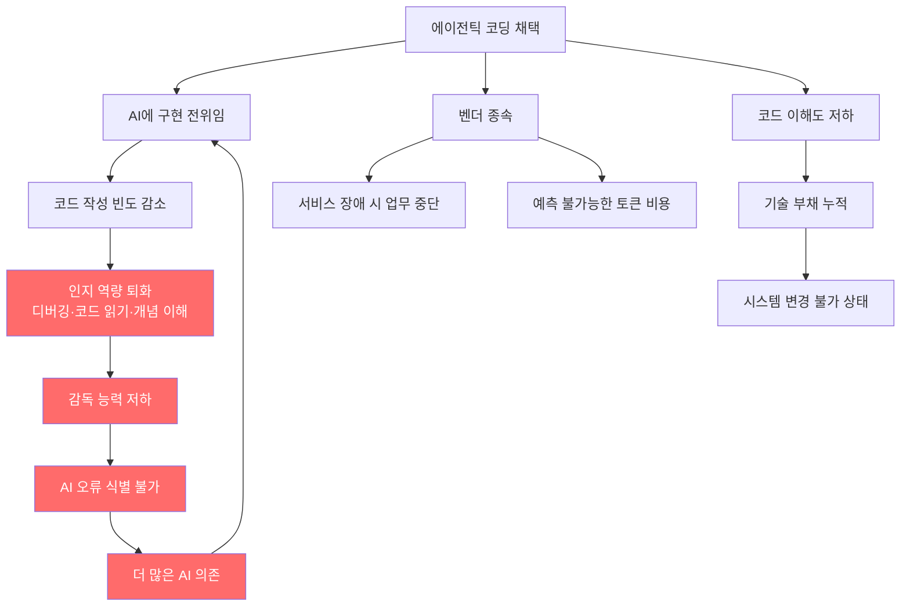
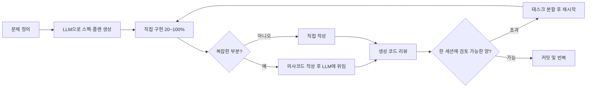

> 원문: Lars Faye, *"Agentic Coding is a Trap"*  
> 출처: [https://larsfaye.com/articles/agentic-coding-is-a-trap](https://larsfaye.com/articles/agentic-coding-is-a-trap)

---

## 개요: 이 글이 말하고자 하는 것

Lars Faye의 이 글은 2026년 현재 소프트웨어 업계를 휩쓸고 있는 "에이전틱 코딩(Agentic Coding)" 열풍에 정면으로 이의를 제기하는 비평 에세이다. "AI가 코드를 짜고, 인간은 오케스트레이터가 된다"는 담론이 마치 불가역적인 미래처럼 포장되는 현실에서, 저자는 그 이면에 숨겨진 기술적·인지적·경제적 트레이드오프를 체계적으로 해부한다.

저자의 핵심 주장은 단순하지만 날카롭다. **에이전틱 코딩 워크플로우를 전적으로 채택하는 행위는, 그 워크플로우를 제대로 운용하는 데 필수적인 바로 그 역량을 서서히 파괴한다.** 이른바 "감독의 역설(Paradox of Supervision)"이다. 이 글은 그 역설이 왜 단순한 기우가 아니라 이미 수치로 확인되는 현실인지를 논증하며, 개발자 개인의 실천적 대안까지 제시한다.

---

## 1. 에이전틱 코딩 열풍의 실체

### 1.1 Spec Driven Development(SDD)의 부상

현재 업계에서 유행하는 워크플로우는 대략 다음과 같은 형태를 취한다. 개발자는 요구사항 명세(spec)를 작성하고, 이를 바탕으로 AI 에이전트가 구현을 전담한다. 인간은 코드를 직접 쓰지 않고, AI가 생성한 결과물을 검토하고 방향을 잡아주는 "오케스트레이터" 역할만 맡는다. Claude Code, Cursor, Codex 같은 도구들이 이 워크플로우의 물적 기반을 이루고 있으며, 복수의 AI 에이전트 인스턴스를 병렬로 돌리는 패턴도 흔해지고 있다.

저자는 이 워크플로우를 "슬롯머신 레버를 반복해서 당기는 행위"에 빗댄다. 원하는 결과가 나올 때까지 프롬프트를 수정하고, 에이전트를 재실행하고, 반복하는 과정이 점점 코드 자체와 개발자 사이의 거리를 벌려놓는다는 것이다.

### 1.2 열풍이 말하지 않는 네 가지 트레이드오프

저자는 에이전틱 코딩의 이면에 네 가지 구체적인 비용이 존재한다고 지적한다.

첫째, **시스템 복잡성의 증가**다. AI의 비결정론적(non-deterministic) 특성이 만들어내는 모호성을 완충하기 위해, 주변 인프라와 검증 시스템의 복잡도가 올라간다. 확률적 시스템을 결정론적 시스템처럼 운용하려면 그 차이를 메우는 별도의 공학적 노력이 필요하다.

둘째, **개발자 역량의 퇴화**다. 이것이 이 글의 핵심 주제이며, 뒤에서 상세히 다룬다.

셋째, **벤더 종속(Vendor Lock-in)** 이다. Claude Code 서비스 장애가 발생했을 때 다수의 엔지니어링 팀이 업무를 멈춰야 했던 사례가 이미 보고되었다. 한때 텍스트 에디터 하나로 수행할 수 있었던 작업이 특정 AI 서비스 구독에 종속되어 버린 것이다.

넷째, **예측 불가능한 비용**이다. 직원 인건비는 고정 비용이지만, 토큰 비용은 날마다, 달마다, 모델이 바뀔 때마다 달라진다. 조직 전체가 에이전틱 코딩을 기본 워크플로우로 채택하면, 비용 예측 자체가 불가능해진다.

---

## 2. "이번에는 진짜 다르다" — 과거 기술 전환과의 결정적 차이

### 2.1 역사적 유사 사례들과의 비교

FORTRAN이 등장했을 때 어셈블리 프로그래머들은 새 언어가 버그를 늘리고 효율을 떨어뜨릴 것이라 우려했다. 컴파일러가 도입될 때도, Java나 Python이 C++을 대체해갈 때도, AWS가 전통적 시스템 관리를 흡수해갈 때도 비슷한 저항이 있었다. 그러나 이 전환들에는 공통점이 있다. C++ 개발자가 Python으로 이동할 때 "뇌에 안개가 낀다(brain fog)"고 호소하지 않았다. 시스템 관리자가 AWS를 쓰기 시작했다고 해서 네트워크에 대한 이해를 잃지 않았다.

### 2.2 지금이 다른 이유: 사변이 아닌 실측

저자가 강조하는 핵심은, 이전 기술 전환에 대한 우려는 **이론적·규범적 논쟁**이었지만, AI 코딩 도구에 대한 우려는 이미 **측정 가능한 현실**이라는 점이다. AI 툴링이 존재한 지 불과 몇 년 만에, 주니어 개발자뿐 아니라 10년 이상 경력의 시니어 엔지니어들에게서도 인지 역량 저하가 보고되고 있다.

30년 경력의 개발자 Simon Willison은 자신이 AI 에이전트에 기대기 시작한 후, 자신이 만든 애플리케이션의 동작 방식에 대한 명확한 정신 모델(mental model)을 잃어가고 있다고 고백했다. 결과적으로 새로운 기능을 추가할수록 추론이 점점 어려워지는 현상을 경험하고 있다.

### 2.3 시니어 엔지니어의 경험적 자산이 만들어지는 방식

저자는 시니어 엔지니어가 왜 가치 있는가에 대해 중요한 통찰을 제시한다. 시니어 엔지니어가 고수준의 아키텍처 판단을 내릴 수 있는 것은, 수십 년에 걸쳐 직접 코드를 작성하고, 디버깅하고, 문제를 해결하면서 축적된 마찰(friction)의 산물이다. 그 마찰 없이 오케스트레이터 역할만 맡은 개발자는, 그 판단을 내리는 데 필요한 내공을 쌓을 기회 자체를 박탈당한다.

즉, 에이전틱 코딩이 요구하는 오케스트레이터 역량은 수십 년의 직접 경험이 필요한 것인데, 그 직접 경험을 우회하는 방법으로 그 역량을 키우려 한다는 모순이 생긴다.

---

## 3. 감독의 역설 — Anthropic 스스로가 인정한 것

### 3.1 Anthropic의 자체 연구

저자가 인용한 Anthropic의 자체 연구 결과는 주목할 만하다. AI 도구를 판매하는 회사가 그 도구의 부작용을 직접 측정하고 발표했다는 점에서 의미가 크다.

Anthropic이 수행한 무작위 대조 실험(RCT)에서, Python 경험이 있는 52명의 주니어 개발자를 두 그룹으로 나눠 새로운 라이브러리(Trio)를 학습하게 했다. 한 그룹은 AI 지원을 허용하고, 다른 그룹은 직접 코딩하도록 했다. 이후 디버깅, 코드 읽기, 개념 이해를 평가하는 퀴즈를 실시한 결과, AI 사용 그룹이 직접 코딩 그룹보다 **17% 낮은 점수**를 기록했다. 그것도 생산성 향상은 통계적으로 유의미하지 않은 상황에서 말이다.

가장 큰 점수 차이를 보인 영역은 디버깅이었다. AI가 생성한 코드를 감독하는 데 가장 필요한 바로 그 역량이 가장 크게 손상된 것이다. 또한 AI를 개념 이해를 위해 활용한 참가자들은 65% 이상의 점수를 기록한 반면, 코드 생성을 AI에 전적으로 위임한 참가자들은 40% 미만의 점수를 받았다. AI를 어떻게 사용하느냐가 결과를 갈랐다.

Anthropic은 이 연구에서 "역설적 감독 문제(paradox of supervision)"를 다음과 같이 표현했다.

> "Claude를 효과적으로 사용하려면 감독이 필요하고, Claude를 감독하려면 AI 과다 사용으로 인해 퇴화할 수 있는 바로 그 코딩 역량이 필요하다."

### 3.2 LinkedIn 엔지니어링 디렉터의 증언

LinkedIn의 소프트웨어 엔지니어링 디렉터 Sandor Nyako는 50명의 엔지니어를 감독하면서 이 현상이 조직 전반에 퍼지고 있음을 목격하고, 팀원들에게 "비판적 사고나 문제 해결이 요구되는 업무"에는 AI를 사용하지 말도록 요청했다. 그의 발언은 이 문제의 본질을 정확히 짚는다.

> "역량을 키우려면 사람들이 어려움을 겪어야 한다. 문제를 생각하는 근육을 키워야 한다. AI가 정확한지 아닌지를 어떻게 판단할 수 있겠는가, 비판적 사고 능력이 없다면?"

---

## 4. LLM은 잘못된 부분을 가속화한다

### 4.1 개발자의 진짜 우선순위

저자는 AI 이전의 좋은 개발자가 코드를 작성할 때 무엇을 우선시했는지를 다음과 같이 정리한다.

```
1. 코드와 코드베이스의 관계에 대한 이해
2. 문서화된 표준 및 효율적 패턴과의 정렬
3. 목표를 달성하는 데 필요한 최소한의 코드 라인(가독성 유지 하에)
4. 처리 속도(turnaround time)
```

에이전틱 코딩과 LLM은 이 우선순위를 완전히 **역전**시킨다. 단위 시간당 생성 가능한 코드 양, 즉 속도가 최우선이 된다. 깊은 이해나 간결함은 부수적인 목표로 밀려난다.

속도는 높은 역량의 자연스러운 부산물이다. 그것이 강제될 때는 항상 정확도 저하를 수반한다.

### 4.2 코딩은 사고의 과정이다

오픈소스 코딩 에이전트 OpenCode의 개발자 Dax는 역설적이게도 Spec Driven Development를 논하는 인터뷰에서 이렇게 말했다.

> "새롭거나 어려운 무언가를 작업할 때, 내가 코드를 타이핑하는 행위가 곧 우리가 무엇을 해야 하는지를 파악하는 과정이다. 방대한 spec을 먼저 써내려가는 것이 나에게는 매우 어렵다. 타입을 작성하고, 함수들이 어떻게 맞물릴지 써보고, 폴더 구조를 실험해보는 것이 개념들을 정리하는 방법이다."

코딩은 단순히 이미 완성된 생각을 코드로 옮기는 행위가 아니다. 코딩 **자체**가 생각하는 과정이다. 이 사실을 간과한 채 LLM에 구현을 전위임하면, 사고 과정 자체를 포기하는 결과를 낳는다.

### 4.3 확률론적 시스템의 근본적 한계

저자는 중요한 기술적 논점을 제기한다. LLM은 컴파일러가 아니다. 아무리 완벽하게 구조화된 프롬프트를 작성해도, LLM은 여전히 존재하지 않는 메서드를 환각(hallucinate)할 수 있다. 결정론적(deterministic) 시스템을 확률론적(probabilistic) 시스템으로 대체하면서 모호성 제로를 기대할 수는 없다. 이것은 도구의 성숙도 문제가 아니라, LLM의 구조적 특성에서 비롯되는 본질적 한계다.

---

## 5. 벤더 종속 — 토큰 비용이라는 새로운 족쇄

### 5.1 Claude Code 장애가 드러낸 현실

저자는 Claude Code 서비스 장애 당시 LinkedIn에 올라온 게시물들을 목격했다. 다수의 개발자와 엔지니어링 팀이 업무를 완전히 멈춰야 했다는 내용들이었다. 불과 수개월 전까지만 해도 텍스트 에디터 하나로 할 수 있었던 일을 이제는 특정 AI 서비스 없이 수행할 수 없게 된 것이다.

### 5.2 예측 불가능한 토큰 경제

AI 모델 제공업체들은 현재 대규모 보조금(subsidy)을 받으며 운영되고 있다. 새로운 모델이 출시될 때마다 동일한 패턴이 반복된다. 높은 벤치마크와 과대 선전으로 시작하고, 실제 사용에서는 토큰 소모량이 이전 모델 대비 2~3배 늘어나는 현실로 귀결된다.

직원 인건비는 계약으로 확정된 고정 비용이다. 하지만 토큰 비용은 날마다, 달마다, 모델 업데이트 때마다 달라진다. 팀 전체가 에이전틱 코딩에 기본 의존한다면, 운영 비용의 예측 가능성 자체가 사라진다. ThePrimeagen은 이를 정확히 포착했다.

> "완전한 에이전틱 워크플로우를 사용하면, 모델 제공업체가 사실상 당신을 소유하게 된다."

### 5.3 산업 전체의 스킬셋 종속

더 장기적인 시나리오를 그려보면, 한때 개발자의 두뇌와 손가락에서 자유롭게 나오던 것들이 토큰 구매를 통해서만 수행 가능한 행위로 전환될 수 있다. 이것은 특정 소프트웨어 도구에 대한 종속이 아니라, 산업 스킬셋 전체의 종속이다. 로컬 LLM은 아직 이 규모의 수요를 흡수할 수준에 도달하지 못했다.

---

## 6. 연구들이 말하는 것 — 인지 부채(Cognitive Debt)의 실체

이 시점에서 Lars Faye의 주장을 뒷받침하거나 심화하는 2025~2026년의 주요 연구 결과들을 정리해볼 필요가 있다.

### 6.1 MIT Media Lab: ChatGPT와 뇌 연결성 연구 (2025)

MIT Media Lab의 Nataliya Kosmyna 팀은 보스턴 지역 5개 대학 학생 54명을 대상으로 4개월에 걸친 실험을 진행했다. 참가자들을 ChatGPT 활용 그룹, 검색엔진 활용 그룹, 도구 없이 직접 작성하는 그룹으로 나눠 에세이 작성 과제를 반복하면서 EEG로 뇌파를 측정했다.

결과는 충격적이었다. ChatGPT 활용 그룹은 4개월에 걸쳐 뇌 연결성(neural connectivity)이 가장 낮았고, 기억 보유율(memory retention)도 가장 저조했으며, 자신이 작성한 에세이에 대한 주인의식(ownership)도 가장 낮았다. 도구 없이 직접 작성한 그룹이 가장 강력하고 광범위한 신경망 활성을 보였다. 더 우려스러운 것은 ChatGPT에서 도구 없는 작성으로 전환했을 때도 뇌 활성이 즉각적으로 회복되지 않았다는 점이다. 인지적 타성(cognitive inertia)이 남아 있었다.

단, 이 연구는 동료 심사(peer review)를 아직 거치지 않은 프리프린트이며, 표본 크기도 제한적이다. 연구자 스스로도 결론을 예비적(preliminary)인 것으로 처리할 것을 권고했다.

### 6.2 속도-이해 격차(Velocity-Comprehension Gap)

AI 코딩 에이전트의 코드 생성 속도(분당 140~200줄)와 인간의 코드 이해 속도(분당 20~40줄) 사이에는 5~7배의 간극이 존재한다. 이 격차는 인간이 검토하기 전에 코드가 이미 시스템에 누적되는 "이해 부채(comprehension debt)"로 이어진다. Addy Osmani가 이 개념을 상세히 분석한 글에서 지적했듯, 이 부채는 속도 지표에는 나타나지 않고 개발자의 머릿속에 쌓인다. 팀이 자신들의 코드를 수정하지 못하는 상황이 되어서야 비로소 가시화된다.

### 6.3 생산성 역설

AI 코딩 도구를 적극 도입한 팀들에서 PR(Pull Request) 볼륨은 전년 대비 29% 증가했지만, 67%의 개발자가 AI 생성 코드를 디버깅하는 데 더 많은 시간을 소비하고 있다고 보고했다. 68%는 보안 취약점 해결에 더 많은 시간이 든다고 했으며, 59%는 배포 문제가 더 많이 발생한다고 했다. 초기 속도 이점이 리뷰, 디버깅, 수정 사이클에서 상쇄되는 것이다.

---

## 7. 전체 구조를 한눈에 — 에이전틱 코딩 트랩의 메커니즘



---

## 8. 저자의 대안: AI의 역할을 강등하라

Lars Faye는 AI를 거부하자고 말하는 것이 아니다. 그는 AI를 **주된(primary) 프로세스**가 아닌 **보조적(secondary) 프로세스**로 재배치할 것을 제안한다.

### 8.1 저자의 실제 일상 워크플로우



저자의 핵심 원칙들은 다음과 같다.

**스펙과 계획은 LLM으로, 구현은 본인이.** 오케스트레이션 워크플로우의 역전이다. LLM은 계획 수립에, 인간은 실제 구현에 적극적으로 참여한다.

**의사코드(pseudo-code)를 먼저 작성하라.** LLM에 요청할 때 의사코드를 먼저 작성하면, 요청과 생성 코드 사이의 간극이 좁혀진다. 이해 없는 생성을 막는 실질적 방어선이다.

**한 세션에 검토 가능한 양 이상을 생성하지 말라.** 이것이 핵심 자기 규율이다. 검토하기 어려운 양이 생성되면 속도를 낮추고 태스크를 분할한다.

**직접 해본 적 없는 것은 LLM에 맡기지 말라.** 학습 목적이 아닌 이상, 본인이 수행할 수 없는 작업을 AI에 위임하지 않는다. 감독할 역량이 없으면 위임해서도 안 된다는 원칙이다.

**LLM을 연구·개념 이해 도구로 활용하라.** 코드 생성보다 개념 탐구에 LLM을 더 많이 사용하는 것이 장기적으로 역량을 키우는 방향이다. Anthropic 연구도 이를 수치로 지지한다. 개념 이해에 AI를 활용한 그룹은 65% 이상의 점수를 기록했다.

### 8.2 Star Trek 메타포

저자는 자신의 방법론을 한 문장으로 요약하면서 Star Trek 비유를 사용한다. "데이터(Data, 인조인간)처럼이 아니라, 함선 컴퓨터처럼 사용하라." 함선 컴퓨터는 승무원의 쿼리에 응답하는 강력한 도구지만, 함선의 판단과 항법을 직접 결정하지 않는다. 의사결정 주체는 여전히 인간이다.

---

## 9. 더 넓은 함의 — 소셜미디어 실험의 반복?

저자는 에세이 말미에 역사적 유비를 제시한다. 소셜미디어의 경우, 도입 당시 장기적 영향에 대한 충분한 이해 없이 사회 전반에 확산되었고, 이후 주의력 결핍을 비롯한 다양한 인지·사회적 문제가 광범위하게 드러났다.

에이전틱 코딩의 전면 채택이 그와 유사한 경로를 밟는다면, 그 결과는 소셜미디어보다 훨씬 심각할 수 있다. 소셜미디어는 주의력과 감정에 영향을 미쳤지만, 지금 문제가 되는 것은 전문적 추론 능력과 비판적 사고 능력이다.

Jeremy Howard(fast.ai 창립자)의 경고가 이 우려를 단적으로 표현한다.

> "지금 AI 에이전트에 올인하는 사람들은 자신의 진부화(obsolescence)를 보장하고 있다. 컴퓨터에 모든 사고를 아웃소싱하면, 역량 향상을 멈추고, 배움을 멈추고, 더 유능해지기를 멈추게 된다."

---

## 10. 비판적 독해: 이 글의 강점과 한계

이 에세이는 현재 담론에서 상대적으로 약하게 다뤄지는 비용과 위험을 전면에 부각시킨다는 점에서 가치 있다. 특히 Anthropic 자체 연구 인용, LinkedIn 사례, Simon Willison 같은 실무자의 증언을 통해 주장을 구체적 근거로 뒷받침하려는 시도는 설득력이 있다.

다만 몇 가지 한계도 존재한다. 저자가 묘사하는 "에이전틱 코딩에 올인하는 개발자"는 다소 극단적인 스트로맨일 수 있다. 실제로 대부분의 숙련된 개발자는 도구를 스펙트럼 위에서 선택적으로 활용한다. 또한 AI 도구 사용 방식의 진화도 빠르게 이루어지고 있어, 현재의 트레이드오프가 2년 후에도 동일하게 유지될지는 불확실하다.

그럼에도 저자의 핵심 주장 — **AI를 어떻게 사용하느냐에 따라 역량 강화 혹은 역량 퇴화라는 정반대의 결과가 나온다** — 은 현재로서 가장 믿을 만한 연구들로 지지된다.

---

## 결론 — 속도가 아닌 이해를

에이전틱 코딩 트랩의 본질은 단순한 기술 선택의 문제가 아니다. 그것은 전문 역량을 어떻게 구축하고 유지할 것인가라는 더 깊은 질문과 연결된다. AI 도구는 이미 존재하며, 앞으로도 더 강력해질 것이다. 문제는 그 도구를 어떤 위치에 배치하느냐다.

코드 작성의 마찰(friction)은 단순한 비효율이 아니다. 그것은 이해를 만들어내는 과정이다. 그 마찰을 AI로 완전히 제거한 결과물은, 더 빠르게 도달하지만 더 얕게 이해하는 코드베이스다. 그리고 그 코드베이스를 감독할 역량조차 서서히 잃어가는 개발자들이다.

Lars Faye의 제안은 보수적으로 들릴 수 있지만, 그 내용은 사실 매우 실용적이다. AI를 적의 개념으로 거부하는 것이 아니라, 도구의 위계를 재설정하는 것이다. 인간의 사고가 주된 엔진으로 남고, AI는 그 엔진을 보조하는 부품으로 남아야 한다. 그 위계가 역전되는 순간, 엔진이 사라지는 것은 시간문제다.

---

*작성일: 2026년 5월 5일*
