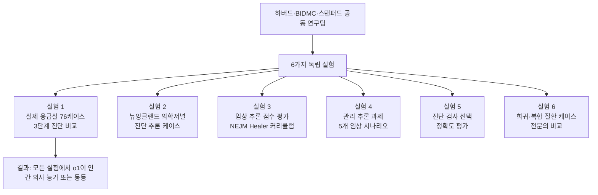
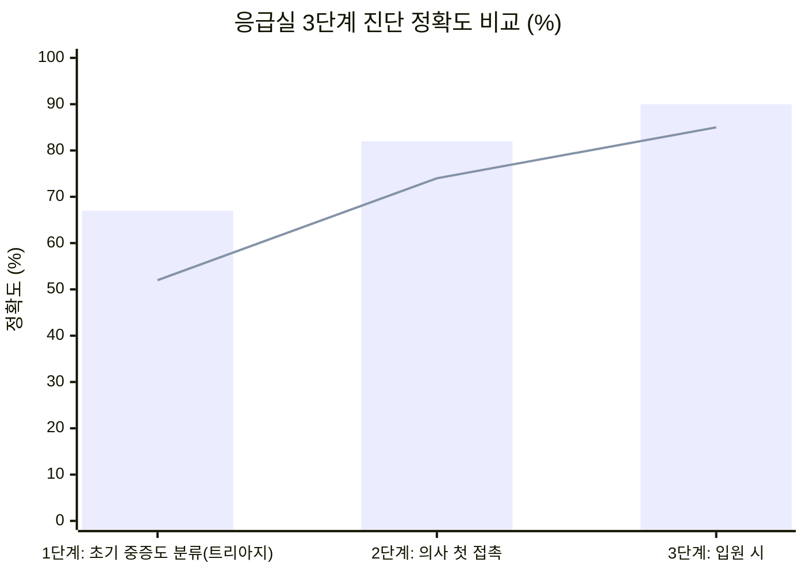
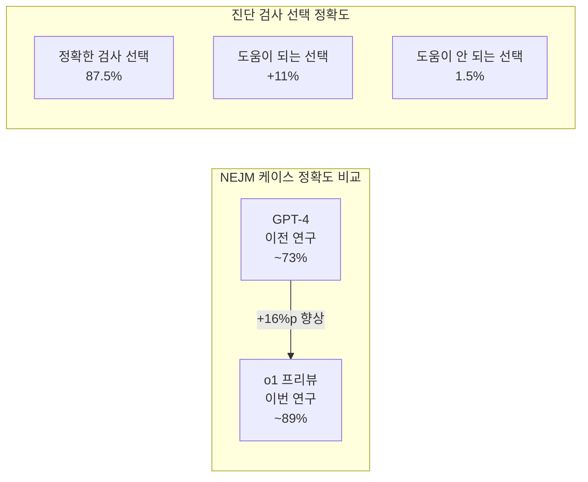
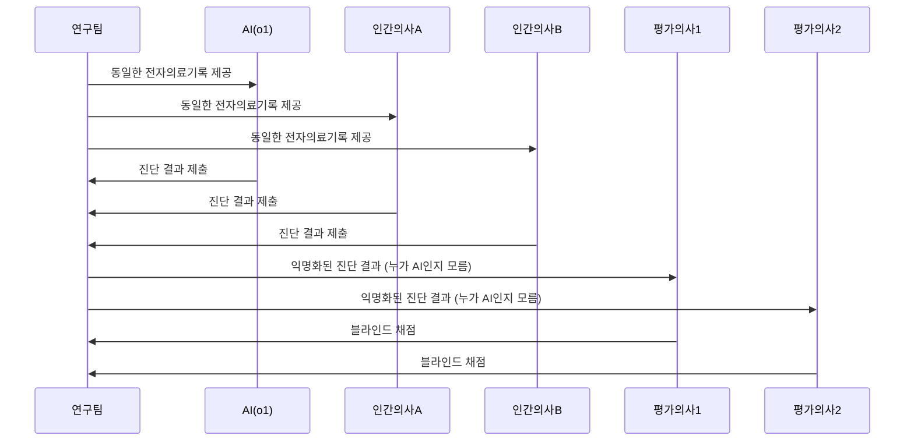
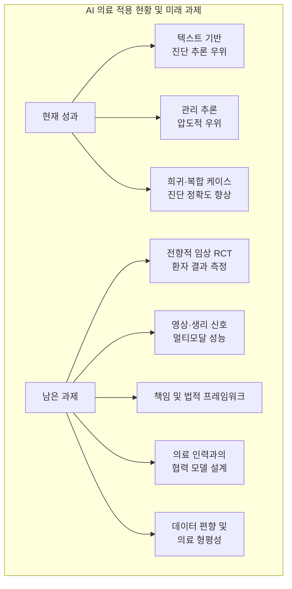

### — 하버드·스탠퍼드 공동 연구, 『사이언스』 게재 (2026년 4월 30일)

### 관련기사

[**"응급실 진단, AI가 의사 앞섰다"…하버드 연구 결과 - 환자 정보 제한적인 초기 응급실 분류 단계서 강점 드러내**](https://zdnet.co.kr/view/?no=20260504135017)

---

## 들어가며 — 의학계를 뒤흔든 발표

2026년 4월 30일, 세계 최고 권위의 학술지 『사이언스(Science)』에 짧지만 묵직한 논문 한 편이 실렸다. 제목은 ["Performance of a large language model on the reasoning tasks of a physician(의사의 추론 과제에서 대형 언어 모델의 성능)"](https://www.science.org/doi/10.1126/science.adz4433)이다. 하버드 의과대학(Harvard Medical School), 베스 이스라엘 디코니스 메디컬센터(Beth Israel Deaconess Medical Center, BIDMC), 스탠퍼드대학교 연구진이 공동으로 수행한 이 연구는 오픈AI(OpenAI)의 추론 특화 모델 **o1 프리뷰(o1-preview)** 가 응급실 환경에서 인간 전문의보다 더 정확하게 환자를 진단했다는 결과를 담고 있다.

이 한 문장이 전 세계 의료계와 기술계에 파장을 일으켰다. 보스턴에 있는 한 응급실의 실제 환자 기록 76건을 바탕으로 AI와 인간 의사가 나란히 진단을 내렸을 때, AI가 더 높은 정확도를 기록했다는 것은 단순한 학문적 수치 이상의 의미를 지닌다. 논문의 수석 공동 저자이자 하버드 의과대학 블라바트닉 연구소의 아르준 만라이(Arjun Manrai) 조교수는 이를 두고 "사실상 모든 벤치마크에서 AI가 이전 모델과 의사 기준선을 모두 뛰어넘었다"라고 밝혔다.

물론 이 연구는 AI가 즉시 병원에 배치될 수 있다고 주장하지 않는다. 오히려 연구진은 논문 전체에 걸쳐 전향적 임상 시험의 필요성을 강조하며, 이 결과를 AI 의료 도입의 청신호가 아니라 다음 단계로 나아가기 위한 강력한 근거로 제시하고 있다. 그렇다면 이 연구는 정확히 무엇을 측정했고, 어떤 결과를 냈으며, 어떤 한계와 가능성을 품고 있는가.

---

## 1. 연구의 배경 — 벤치마크의 천장을 뚫어야 했다

### 1-1. 기존 의료 AI 평가의 한계

AI의 의료 능력을 평가하는 기존 방식은 주로 표준화된 의사 면허 시험 문제나 다지선다형 의학 퀴즈를 활용해 왔다. 미국 의사면허시험(USMLE)이나 영국 의사면허시험을 AI에게 풀게 하여 점수를 측정하는 방식이 대표적이다. 그러나 이 방법은 이미 실효성을 잃어가고 있었다.

오픈AI의 GPT-4나 다른 최신 LLM들이 이러한 시험에서 80~90%대의 점수를 기록하게 되면서, 벤치마크가 이미 **천장(ceiling)** 에 닿아버린 것이다. 만라이 교수는 이 상황을 직접적으로 표현했다. "우리는 오랫동안 AI를 다지선다형 시험으로 평가해 왔는데, 모델들이 이미 거의 100%에 근접한 점수를 내고 있어 더 이상 진보를 추적할 수 없는 상황이 됐다." 다지선다형 시험은 이제 AI의 실질적 임상 능력을 구별해낼 수 없다.

진짜 질문은 전혀 다른 층위에 있다. AI가 실제 응급실에서 불완전하고 비정형적인 데이터를 마주했을 때, 즉 아직 진단이 확정되지 않은 채 들것에 실려 들어오는 환자의 기록을 접했을 때도 유사한 성능을 낼 수 있는가. 이것이 하버드 연구팀이 새로운 실험 설계를 택한 이유였다.

### 1-2. o1 프리뷰 — 추론하는 AI

이번 연구에 사용된 오픈AI의 o1 프리뷰는 기존 GPT 계열 모델과는 근본적으로 다른 방식으로 작동한다. 가장 큰 특징은 **단계적 사고(chain-of-thought reasoning)** 를 모델 내부에 내재화했다는 점이다. 즉, 질문에 즉각 답변을 내놓는 것이 아니라 마치 인간이 생각하듯 여러 중간 추론 단계를 거쳐 결론에 도달한다.

강화학습(Reinforcement Learning)을 통해 훈련된 이 모델은 복잡한 문제를 접했을 때 스스로 풀이 전략을 수립하고, 각 단계에서 자신의 추론을 검토하며 수정해나간다. 이는 일반 시험 문제처럼 정해진 패턴이 있는 과제가 아니라, 맥락이 복잡하고 정보가 불완전한 실제 임상 상황에서 특히 강점을 발휘할 수 있는 구조다. 오픈AI는 o1을 "첫 번째로 단계적 추론이 가능한 모델"이라고 소개했으며, 연구팀은 이 점이 의료 진단이라는 복잡한 추론 과제에 부합한다고 판단했다.

---

## 2. 연구 설계 — 여섯 가지 독립 실험

이번 연구의 가장 큰 방법론적 강점 중 하나는 단일 실험이 아니라 **여섯 가지 서로 다른 독립 실험**을 설계했다는 점이다. 각 실험은 임상 추론의 서로 다른 측면을 평가하며, 다양한 경력과 전공을 가진 수백 명의 의료진이 비교 대상으로 참여했다. AI는 이 모든 실험에서 인간 의사를 능가했다.

### 2-1. 실험 설계의 핵심 원칙

연구팀이 이번 실험에서 특히 강조한 것은 **데이터의 무가공 원칙**이다. AI에게 제공된 환자 정보는 실제 전자 의료 기록(Electronic Health Record, EHR)에 그대로 존재하는 그대로였다. 연구팀은 "데이터를 전혀 전처리하지 않았다"고 밝혔다. 오타, 약어, 간호사의 비정형 메모, 미완성 정보가 모두 그대로 포함된 상태였다. AI가 받은 정보는 인간 의사가 같은 시점에 전자 기록에서 볼 수 있었던 것과 완전히 동일했다.

블라인드 평가 방식도 이 연구의 신뢰성을 높이는 핵심 요소다. 두 명의 평가 의사가 각 진단이 AI에서 나온 것인지 인간 의사에서 나온 것인지 전혀 모르는 상태에서 채점했다. 이 이중 맹검(double-blind) 방식은 평가자의 선입견이 결과에 영향을 미치는 것을 차단한다.

---

## 3. 핵심 수치 — 세 단계에 걸친 비교

이번 연구에서 가장 주목받은 수치는 실제 응급실 76케이스에서의 진단 정확도 비교다. 연구팀은 환자가 응급실에 도착한 뒤 **세 개의 시점**에서 각각 진단을 비교했다.

### 3-1. 1단계: 초기 중증도 분류(트리아지) — 가장 드라마틱한 격차

가장 극적인 차이는 첫 번째 시점, 즉 환자가 응급실에 막 도착해 간호사가 초기 평가를 기록하는 **중증도 분류(triage) 단계**에서 나타났다. 이 단계는 의료진이 가장 적은 정보로 가장 빠른 판단을 내려야 하는 순간이다. 혈압, 체온, 맥박, 간호사의 몇 문장짜리 초기 메모가 전부인 경우가 많다.

이 조건에서 o1 프리뷰는 **67%** 의 케이스에서 정확하거나 매우 근접한 진단을 내렸다. 반면 두 명의 내과 전문의는 각각 **55%** 와 **50%** 에 그쳤다. 정보가 가장 부족한 조건에서 격차가 가장 컸다는 점은 특히 의미심장하다. AI가 단순히 방대한 의학 지식을 암기한 것이 아니라, 불완전한 정보 속에서도 추론을 통해 가능성을 좁혀가는 능력이 인간보다 뛰어남을 시사하기 때문이다.

### 3-2. 2단계: 의사 첫 접촉 — 격차는 줄지만 AI 우위 유지

환자가 의사와 첫 접촉을 마친 뒤, 진찰 결과와 추가 검사 결과가 포함된 더 풍부한 정보가 주어졌을 때의 비교다. 이 단계에서 o1의 정확도는 **82%** 로 올라갔고, 인간 전문의들은 **70~79%** 를 기록했다. 격차가 좁아지기는 했지만 통계적 유의성 경계에 위치하며, AI의 우위는 유지됐다.

### 3-3. 3단계: 입원 시

환자가 일반 병동 또는 중환자실(ICU)에 입원하는 시점, 즉 가장 많은 정보가 축적된 조건에서는 AI와 인간 의사 모두 높은 정확도를 보였으며 통계적으로 유의미한 차이는 감소했다. 정보가 충분해질수록 인간 전문의의 격차 추격이 가능하지만, 가장 중요한 초기 판단 단계에서의 AI 우위는 변하지 않는다는 것을 보여준다.

---

## 4. 관리 추론 — 가장 압도적인 격차

진단 정확도보다 더 눈에 띄는 결과가 있었다. 이른바 **관리 추론(Management Reasoning)** 실험이다. 이 과제는 단순히 질병명을 맞히는 것을 넘어, 환자에게 어떤 치료를 적용할지, 어떤 검사를 먼저 지시할지, 항생제를 어떻게 처방할지, 심지어 임종 관리 대화를 어떻게 접근할지 등 복합적 의사결정을 평가하는 것이다.

연구팀은 25명의 의사 전문가 집단이 합의를 통해 개발하고 채점 기준을 확립한 5개의 실제 임상 시나리오를 사용했다. 여기에 46명의 의사와 o1 프리뷰가 같은 시나리오를 받고 관리 계획을 제시했다.

결과는 충격적이었다.

| 참여 집단 | 중앙값 점수 |
|---|---|
| **o1 프리뷰** | **89%** |
| GPT-4 단독 | 42% |
| 의사 + GPT-4 활용 | 41% |
| 의사 + 구글 검색 등 일반 수단 활용 | 34% |

o1은 구글 검색을 활용한 인간 의사보다 **48.4%포인트** 높은 점수를 기록했고(95% CI: 38.3~58.5, p<0.001), GPT-4 단독보다도 41%포인트 높았다. 관리 추론이 진단 추론보다 더 복잡한 과제임을 감안하면, 바로 이 영역에서 o1의 강점이 극대화된다는 사실이 더욱 두드러진다.

공동 저자인 피터 브로더(Peter Brodeur) 임상 연구원은 이를 이렇게 설명했다. "관리 추론은 진단 추론보다 훨씬 복잡한 과제입니다. 케이스의 객관적 특성뿐 아니라, 환자가 놓인 맥락과 상황 같은 주관적 요인까지 고려해야 하기 때문입니다. 따라서 추론 모델이 이 영역에서 인간과 GPT-4를 크게 능가한다는 것은 어쩌면 놀랍지 않은 결과일 수도 있습니다."

---

## 5. NEJM 케이스 — 희귀·복합 질환에서의 탁월함

또 하나의 주목할 만한 실험은 『뉴잉글랜드 의학저널(NEJM, New England Journal of Medicine)』의 'Healer 커리큘럼'을 활용한 평가다. NEJM Healer는 의대생과 전공의의 임상 추론 능력 훈련을 위해 개발된 가상 환자 시나리오 시스템으로, 각 케이스는 실제 임상 사례를 바탕으로 하며 수준이 매우 높다.

연구팀은 20개의 NEJM Healer 케이스를 사용했으며, 임상 추론 문서를 평가하는 검증된 10점 척도인 **수정 IDEA 점수(Revised-IDEA, R-IDEA)** 로 채점했다. o1 프리뷰는 80개 채점 항목 중 **78개에서 만점**을 획득했으며, 이는 GPT-4, 전문의, 전공의를 모두 크게 웃도는 결과였다.

만라이 교수는 이 NEJM 케이스들이 "통상 매우 어렵다"고 설명했다. "희귀하거나 혼란스러운 요소들로 가득 차 있고, 의학의 많은 분야에 걸쳐 있다. AI가 이런 케이스에서 보여준 성능은 많은 사람들을 정말 놀라게 했다."

특히 연구팀이 보고한 별도의 비교에서는, 이전 연구에서 GPT-4가 NEJM 진단 케이스에서 약 73%의 정확도를 보였던 것에 비해, o1은 동일 70개 케이스에서 **약 89%** 의 정확도를 기록했다.

---

## 6. AI가 선택한 진단 검사 — 98.5%가 유효했다

단순히 병명을 맞히는 것을 넘어, 다음에 어떤 검사를 지시해야 하는지 판단하는 것도 임상에서 핵심적인 역량이다. 불필요한 검사는 환자에게 비용과 불편을 초래하고, 잘못된 검사는 진단을 지연시킨다.

o1은 이 과제에서도 강한 면모를 보였다. 전체 케이스의 **87.5%** 에서 실제로 시행된 검사와 일치하는 검사를 정확히 선택했고, **11%** 에서는 정확한 검사는 아니었지만 임상적으로 도움이 되는 선택을 했다고 평가 의사들이 판정했다. 즉 사실상 **98.5%** 의 검사 선택이 유효했다. 명백히 도움이 되지 않는 선택은 단 **1.5%** 에 불과했다.

---

## 7. 연구의 구조 — 블라인드 평가의 중요성

이 연구의 결과를 해석할 때 평가 방식을 이해하는 것이 중요하다. 연구팀은 AI와 인간 의사의 진단을 비교할 때, 두 명의 **독립적인 평가 의사**를 별도로 동원했다. 이 평가 의사들은 각 진단이 AI에서 나온 것인지 인간 의사에서 나온 것인지 전혀 알지 못하는 상태에서 채점했다. 이 블라인드 설계는 평가자가 무의식적으로 AI에게 더 후한 혹은 더 박한 점수를 주는 편향을 제거하기 위한 것이다.

두 평가 의사 간의 채점 일치도는 통계적으로 '상당한 일치(substantial agreement)'를 나타내는 카파 계수(κ = 0.71)를 기록했다. 이는 채점의 신뢰성을 뒷받침한다.

---

## 8. 연구의 한계 — 연구진 스스로 강조한 것들

이 연구가 주목받는 이유 중 하나는 연구팀 자신이 결과의 한계를 매우 명확하게 짚었다는 점이다. 성과를 부풀리지 않고 냉정하게 한계를 명시한 것은 과학적 엄밀성의 측면에서 높이 평가받고 있다.

### 8-1. 텍스트 기반의 근본적 한계

가장 중요한 한계는 이번 연구 전체가 **텍스트 기반 정보만**을 다뤘다는 점이다. 만라이 교수는 이를 직접적으로 인정했다. "현실의 의사들은 텍스트 외에도 매우 다양한 정보를 다뤄야 합니다. 환자의 말을 듣고, 흉부 X선을 검토하고, CT나 MRI 같은 영상 검사를 판독하며, 심전도(EKG/ECG) 같은 생리학적 신호를 해석합니다. 이 모든 것이 실제 임상 의사결정에 필수적입니다."

실제로 응급실 현장에서 텍스트만으로 진단이 내려지는 상황은 드물다. 따라서 이번 결과는 텍스트 추론 능력에 국한된 비교임을 분명히 해야 한다. 물론 연구팀은 "영상 및 기타 신호에 대한 모델의 성능을 보는 병행 연구를 진행 중이며, 빠르게 개선되고 있는 결과를 보고 있다"고 덧붙였다.

### 8-2. 비교 집단의 전문성 문제

외부 비판자들이 가장 강하게 제기한 반론 중 하나는 비교 집단의 설정에 관한 것이다. 응급 전문의 크리스틴 판타가니(Kristen Panthagani)는 AI가 **응급 전문의**가 아닌 **내과 전문의**와 비교됐다는 점을 지적했다. 응급실 진단은 응급 의학 전공자들이 훈련받는 핵심 역량이며, 다른 과 전문의들은 응급실 진단에 특화된 훈련을 받지 않는다.

더불어 판타가니는 한정된 텍스트 기반 진단 추측을 실제 응급 의료와 동일시하는 것이 방법론적 과단순화라고 비판했다. 응급실에서 의사의 역할은 단순한 진단 명칭 제시를 훨씬 뛰어넘는다는 것이다.

### 8-3. 실제 임상과 시험 환경의 간극

이번 연구에서 비교 대상이 된 인간 의사들은 **응급실 전문의가 아니었다**. 응급실 트리아지 단계의 빠른 판단은 응급 전문의의 특수 훈련 영역이다. 다른 과 의사가 동일 조건에서 비교될 때 발생하는 전문성 불일치는 결과 해석에 주의를 요한다.

또한 현실 응급 의료에서 의사는 단순히 진단 이름만 제시하는 것이 아니다. 환자의 불안을 다스리고, 가족에게 상황을 설명하며, 여러 과 간 협력을 조율하고, 예상치 못한 변수에 즉각 대응한다. AI가 진단 정확도 수치에서 앞섰다고 해서 이 복합적 역할까지 대체할 수 있다는 의미는 아니다.

### 8-4. 전향적 임상 시험의 부재

논문 자체가 명시적으로 밝히듯, 이번 연구는 소급적(retrospective) 데이터 분석이다. 과거의 기록을 가져와 AI에게 제시한 것이지, AI가 실시간으로 응급실 환자에게 개입하는 상황을 연구한 것이 아니다. 실제 임상 배포를 논의하려면 AI의 개입이 환자 결과(outcome)를 실제로 개선하는지 측정하는 **전향적 무작위 대조 시험(RCT)** 이 반드시 필요하다.

---

## 9. 연구진의 입장 — "AI가 의사를 대체한다는 것이 아니다"

연구팀은 이 연구 결과가 AI의 임상 즉각 배치를 지지하는 것이 아님을 반복적으로 강조했다. 만라이 교수의 말은 이 점에서 명확하다. "AI가 의사를 대체한다는 의미가 아닙니다. 다만 기술에서 매우 심오한 변화가 일어나고 있음을 목격하고 있으며, 이것이 의학을 재편할 것이고, 이 기술을 지금 평가하고 엄밀하게 전향적 임상 시험을 실시해야 한다는 것을 의미합니다."

공동 저자이자 하버드 의과대학 의학 조교수인 애덤 로드먼(Adam Rodman)은 실용적 차원의 문제를 짚었다. "AI 진단에 대한 책임 체계가 현재 없습니다. 환자들은 여전히 생사가 걸린 결정과 어려운 치료 결정에서 인간이 이끌어주기를 원합니다." 그가 가디언 인터뷰에서 밝힌 이 말은, 기술적 가능성과 사회적 준비 사이의 간극을 정확히 짚는다.

만라이 교수도 AI 모델의 현실적 취약점을 솔직하게 언급했다. "AI 모델은 틀릴 수 있고, 동조적(sycophantic)일 수 있습니다. 하지만 동시에 오늘날 환자와 의사에게 실질적 가치를 제공하고 있습니다." 이 발언은 AI를 맹신하지도 부정하지도 않는 균형 잡힌 시각을 대변한다.

---

## 10. 더 넓은 맥락 — 의료 AI의 흐름 속에서

이번 연구는 의료 분야에서 AI의 역할이 빠르게 확장되는 큰 흐름 속에 위치한다. 구글 딥마인드(Google DeepMind)의 알파폴드(AlphaFold)는 수십 년이 걸리던 단백질 구조 예측 문제를 혁신하며 생물학 연구의 판도를 바꿨다. 일부 병원의 응급실에서는 이미 생성형 AI가 진료 기록 작성과 전자 의무기록 정리를 담당하고 있다. 1959년부터 컴퓨터 진단 능력의 기준으로 쓰여온 MGH(매사추세츠 종합병원) NEJM 케이스 벤치마크에서 o1이 사실상 최적해에 근접했다는 점은 역사적 상징성도 갖는다.

동시에 이 연구가 AI 의료의 모든 문제를 해결했다고 볼 수는 없다. 의료 현장에는 텍스트 너머의 무수한 신호들이 있고, 환자와 의사 사이의 신뢰 관계는 알고리즘이 쉽게 대체할 수 없는 인간적 차원이다. AI 오진의 책임은 누가 지는가, 의료 AI 데이터의 편향은 어떻게 다루는가, 접근성이 낮은 환경에서 AI 의료는 불평등을 줄이는가 심화시키는가 — 이 질문들은 기술적 성능 수치로는 답할 수 없다.

---

## 11. 연구 요약 — 핵심 수치 한눈에 보기

| 평가 항목 | o1 프리뷰 | 인간 의사 | 비고 |
|---|---|---|---|
| 초기 트리아지 진단 정확도 | **67%** | 50~55% | 가장 큰 격차 |
| 의사 첫 접촉 후 진단 정확도 | **82%** | 70~79% | 통계적 유의성 경계 |
| 관리 추론 점수 | **89%** | 34% (일반 수단 활용) | 48.4%p 차이, p<0.001 |
| 진단 검사 선택 정확도 | **87.5%** | — | +11% 유용한 선택 포함 시 98.5% |
| NEJM Healer 임상 추론 만점 | **78/80 (97.5%)** | — | GPT-4 대비 대폭 향상 |
| NEJM 진단 케이스 정확도 | **~89%** | — | GPT-4의 ~73% 대비 +16%p |

---

## 마치며 — 이미 시작된 변화, 아직 필요한 준비

하버드 연구팀이 『사이언스』를 통해 전 세계에 던진 메시지는 이중적이다. 한편으로는 "AI가 이미 특정 임상 추론에서 인간 전문의 수준 또는 그 이상에 도달했다"는 기술적 사실이다. 다른 한편으로는 "그렇기 때문에 지금 당장 이 기술을 엄밀하게 평가하고 전향적 시험을 시작해야 한다"는 과학적 촉구다.

의료는 다른 어떤 분야보다도 신중한 검증을 요구한다. 오진의 대가가 인간의 생명이기 때문이다. AI가 응급실에서 의사의 조수가 되든, 2차 검토자가 되든, 혹은 접근이 어려운 의료 환경에서 1차 스크리닝 도구가 되든 — 어떤 형태로 배치되든 그 전에는 체계적인 임상 시험과 책임 체계 설계가 선행되어야 한다.

Thomas Buckley(하버드 의과대학 박사과정)의 말처럼, o1은 "1959년부터 컴퓨터 진단 능력의 기준으로 쓰여온 벤치마크에서 거의 최적해에 도달"했다. 이 수십 년의 목표가 달성된 시점에서, 이제 질문은 'AI가 할 수 있는가'에서 'AI를 어떻게, 언제, 어디서, 누구의 책임 하에 사용할 것인가'로 이동하고 있다.

---

*작성일: 2026년 5월 5일*  
*주요 참고 출처: Science, Vol. 392, Issue 6797 (2026.04.30) — "Performance of a large language model on the reasoning tasks of a physician"; Harvard Magazine, TechCrunch, Fortune, NPR, The Guardian (2026.04.30~05.04)*
