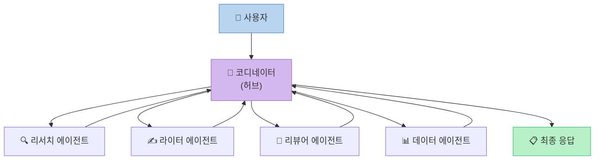
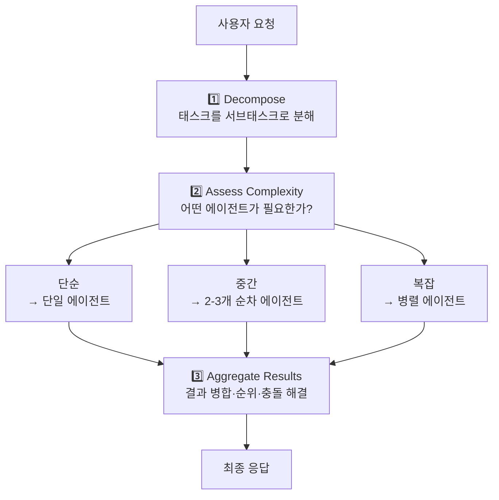
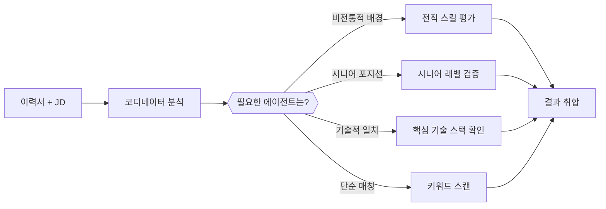
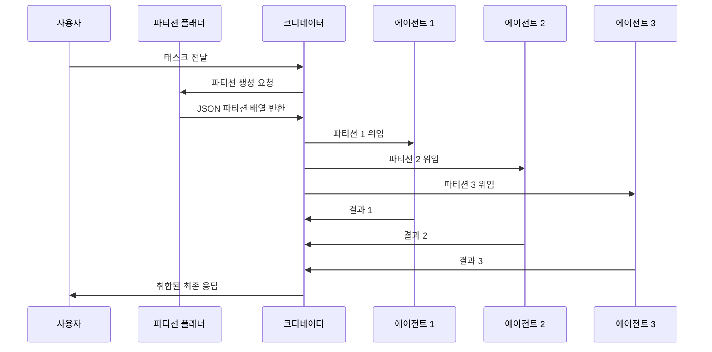
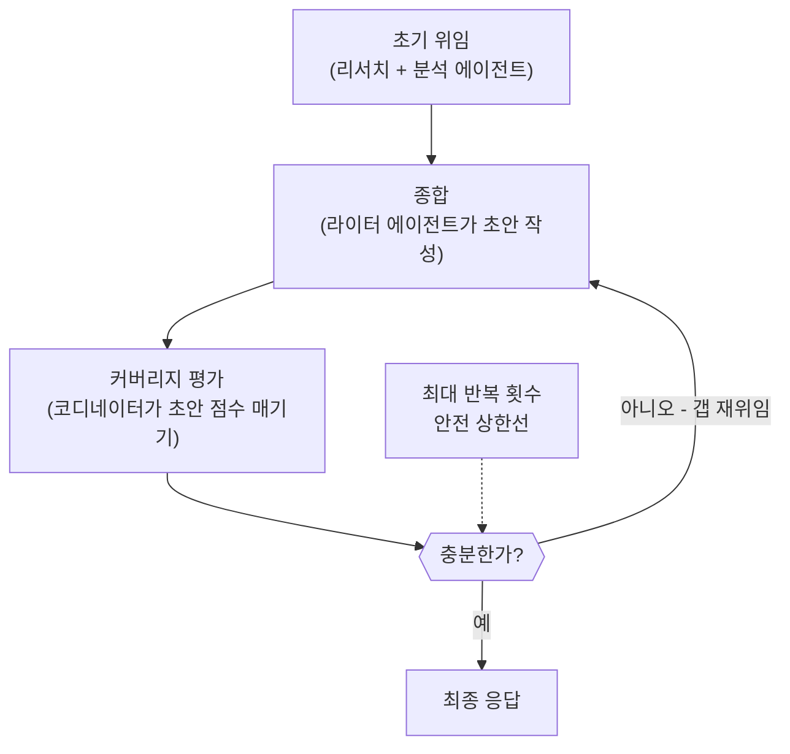

> **출처:** ExamPro — [Claude Architect: Multi-Agent Orchestration](https://www.youtube.com/watch?v=vRYBG_R8JAI) (2026.04.29)  
> **과정:** Claude Certified Architect (CCA-F) Full Course  
> **작성 기준:** 영상 전체 내용 + 2026년 5월 기준 최신 정보 반영

---

## 목차

1. [개요: 왜 멀티에이전트가 필요한가](#1-개요)
2. [Hub and Spoke 아키텍처](#2-hub-and-spoke-아키텍처)
3. [코디네이터 에이전트의 역할과 태스크 생명주기](#3-코디네이터-에이전트)
4. [기본 코디네이터 구현](#4-기본-코디네이터-구현)
5. [Narrow Task Decomposition 안티패턴과 해결책](#5-narrow-task-decomposition)
6. [Dynamic Selection (동적 선택)](#6-dynamic-selection)
7. [Research Partitioning (리서치 파티셔닝)](#7-research-partitioning)
8. [Refinement Loop (정제 루프)](#8-refinement-loop)
9. [Observability (관찰 가능성)](#9-observability)
10. [코드 리팩토링: 유지보수 가능한 구조 만들기](#10-코드-리팩토링)
11. [Agent SDK로의 포팅](#11-agent-sdk로의-포팅)
12. [핵심 교훈과 2026년 업계 트렌드](#12-핵심-교훈과-업계-트렌드)

---

## 1. 개요

멀티에이전트 시스템은 단일 에이전트가 처리하기 어려운 복잡한 태스크를 여러 전문화된 에이전트들이 협력하여 처리하는 방식이다. 그런데 오케스트레이션 레이어를 잘못 설계하면, 에이전트들이 서로 충돌하거나 중복 작업을 수행하거나 에러를 감지하지 못하는 혼란 상태에 빠지게 된다.

2026년 기준으로, 단일 에이전트와 컨텍스트 창(context window) 하나에 의존하던 방식에서 여러 에이전트가 각각 독립적인 컨텍스트를 갖고 비동기적으로 협업하는 방식으로 패러다임이 급격히 전환되고 있다. 이 강의는 Claude SDK를 기반으로 이 오케스트레이션 레이어를 올바르게 설계하는 방법을 단계적으로 가르쳐준다.

핵심 질문은 하나다: **"에이전트들이 어떻게 서로 소통하고, 누가 전체 흐름을 제어하는가?"**

---

## 2. Hub and Spoke 아키텍처

### 2.1 개념

Hub and Spoke(허브-앤-스포크)는 항공 노선망에서 차용한 개념이다. 허브(중심 공항)를 경유해야만 다른 목적지(스포크)로 이동할 수 있는 것처럼, 멀티에이전트 시스템에서도 모든 서브에이전트는 반드시 중앙의 코디네이터를 통해서만 통신한다.

```
                    Research Agent
                         ↑
                         |
Planner Agent ←→  [ Coordinator ]  ←→  Coder Agent
                         |
                         ↓
                   Summariser Agent
```

서브에이전트들은 서로 직접 대화하지 않는다. 리서치 에이전트가 리뷰어 에이전트에게 무언가를 전달하고 싶다면, 반드시 코디네이터를 경유해야 한다. 이것이 Hub and Spoke 아키텍처의 핵심 규칙이며, 이 규칙을 어기는 것은 아키텍처 위반이다.

### 2.2 코디네이터가 소유하는 세 가지 책임

코디네이터는 단순한 전달자가 아니다. 다음 세 가지를 완전히 소유한다:

**라우팅(Routing):** 어떤 서브에이전트를 호출할지, 어떤 순서로 호출할지 결정한다. 이 결정권은 오직 코디네이터에게만 있다.

**컨텍스트 공유(Context Sharing):** 서브에이전트는 자신에게 전달된 정보 외에는 아무것도 모른다. 코디네이터가 명시적으로 전달하지 않으면 다른 에이전트가 무슨 작업을 했는지 알 수 없다. 이 격리(isolation)는 버그가 아니라 의도된 설계다.

**에러 처리(Error Handling):** 모든 메시지와 결과가 코디네이터를 통과하기 때문에, 에러를 일관된 방식으로 감지하고 처리할 수 있는 단일 지점이 생긴다.

### 2.3 왜 코디네이터가 직접 작업하지 않는가

강의에서 중요하게 강조하는 점이 있다: 코디네이터는 직접 작업(do the work)을 해서는 안 된다. 코디네이터의 역할은 작업을 분해하고 위임하고 결과를 취합하는 것이지, 스스로 리서치하거나 코딩하거나 글쓰기를 하는 것이 아니다. 역할을 명확히 분리해야 각 에이전트가 자신의 전문 영역에 집중할 수 있다.



---

## 3. 코디네이터 에이전트

### 3.1 태스크 생명주기(Task Life Cycle)

코디네이터가 태스크를 처리하는 과정은 세 단계로 구성된다.



**1단계: 태스크 분해(Task Decomposition)**
주어진 태스크를 의미있는 서브태스크들로 쪼갠다. 이 분해가 너무 좁으면 중요한 영역이 연구되지 않고 누락된다(이후 "Narrow Decomposition" 섹션에서 상세히 다룬다).

**2단계: 복잡성 평가 및 라우팅(Assess Complexity & Routing)**
단순한 사실 질문은 단일 에이전트로 충분하다. 여러 단계가 필요한 태스크는 순차적으로 에이전트를 호출한다. 서로 독립적인 서브태스크는 병렬로 처리한다. 라우팅은 정적이지 않고, 태스크의 특성에 따라 동적으로 결정되어야 한다.

**3단계: 결과 취합(Result Aggregation)**
여러 에이전트의 출력을 하나의 일관된 응답으로 합친다. 상충되는 정보가 있을 경우 해결하고, 결과를 사람이 읽기 좋은 형태로 정리한다.

### 3.2 코디네이터 프롬프트 설계 원칙

코디네이터 프롬프트는 에이전트에게 다음을 명확히 알려줘야 한다:

- 너는 코디네이터다. 직접 작업하지 마라.
- 단순 질문은 단일 에이전트, 복잡한 다단계 태스크는 순차적 위임, 독립적 서브태스크는 병렬 위임하라.
- 모든 에이전트의 출력을 수집한 뒤, 충돌을 해결하고 하나의 응답으로 합쳐라.

---

## 4. 기본 코디네이터 구현

### 4.1 구현 접근 방식

강의는 "Job Application Screener"(채용 지원서 심사 에이전트)를 예제 유즈케이스로 선택한다. 이 예제가 좋은 이유는 결과를 사람이 직관적으로 검증할 수 있고, 라우팅 복잡성을 보여주기에 충분하기 때문이다.

아키텍처는 다음과 같다:

- **코디네이터:** 구직 공고와 이력서를 받아 세 개의 스포크 에이전트를 오케스트레이팅
- **Keyword Scanner(키워드 스캐너):** 직무 공고의 필수 스킬이 이력서에 명시적으로 있는지 확인. "추론하지 말 것, 명시된 것만 보고"라는 엄격한 지침 적용
- **Deep Evaluator(심층 평가자):** 경험의 깊이와 시니어 적합성 평가
- **Red Flag Detector(위험 신호 탐지):** 고용 관련 우려사항(공백기, 잦은 이직 등) 탐지
- **Score Aggregator(점수 취합자):** 세 스포크의 출력을 종합하여 최종 추천

### 4.2 while 루프와 max_steps 설계

에이전트 루프 설계에서 흔히 발생하는 실수는 탈출 조건 없는 `while True` 루프다. 강의는 `max_steps`(또는 `max_iteration`)를 명시적으로 설정하도록 권장한다.

```python
max_steps = 10  # 예상 단계의 2배로 설정하여 재시도 여유 확보

for step in range(1, max_steps + 1):
    # 에이전트 루프 실행
    if break_condition:
        break
```

예상 단계 수의 2배를 max_steps로 설정하는 이유는 에이전트가 재시도할 여유를 주면서도 무한 루프는 방지하기 위해서다. 이 설계 없이는 에이전트가 엣지 케이스에서 영원히 돌 수 있다.

---

## 5. Narrow Task Decomposition

### 5.1 문제: 좁은 분해의 함정

코디네이터가 태스크를 분해할 때, 자신이 생각하는 것만 분해할 수 있다는 근본적인 한계가 있다. 예를 들어 "EV 시장에 대한 종합 분석을 해줘"라는 요청을 받았을 때, 코디네이터가 너무 좁게 분해하면 다음과 같은 결과가 나온다:

```javascript
// 너무 좁은 분해 (안티패턴)
const subtasks = [
  "Research EV sales figures",
  "Research EV battery technology",
  "Research major EV manufacturers"
]
```

이렇게 하면 다음 주제들이 완전히 누락된다:
- 충전 인프라
- 정부 정책 및 보조금
- 중고 EV 시장
- 소비자 정서 및 수용 장벽
- 공급망(리튬, 코발트)
- 전력망 용량 문제

각 서브에이전트는 자신의 격리된 컨텍스트만 보기 때문에, 누락된 영역이 있어도 이를 감지하고 보고할 수 없다.

### 5.2 해결책: 명시적 분해 가이드

코디네이터 프롬프트에 분해 방법론을 명시적으로 정의해야 한다:

```
당신은 코디네이터입니다. 태스크를 분해할 때:

1. 서브태스크 초안 목록을 생성한다
2. 스스로 묻는다: 어떤 관점, 이해관계자, 차원이 빠져 있는가?
3. 빠진 부분을 커버하는 서브태스크를 추가한다
4. 그 이후에만 위임을 시작한다

리서치 태스크의 경우 특히 다음을 고려한다:
- 정량적 AND 정성적 관점
- 공급 AND 수요 측면
- 단기 AND 장기 요인
- 지원 인프라 (주요 주제뿐 아니라)
- 정책, 규제, 경제적 맥락
- 기회뿐 아니라 리스크와 실패 모드
```

### 5.3 안전망: submit_decomposition 툴

분해 품질을 보장하는 또 다른 방법은 코디네이터가 위임을 시작하기 전에 서브태스크 분해안을 검토를 위해 제출하도록 강제하는 툴을 만드는 것이다.

```javascript
const tools = [
  {
    name: "submit_decomposition",
    description: "서브태스크 분해안을 위임 전에 검토를 위해 제출",
    input_schema: {
      type: "object",
      properties: {
        subtasks: {
          type: "array",
          items: { type: "string" },
          description: "위임할 전체 서브태스크 목록"
        },
        coverage_rationale: {
          type: "string",
          description: "각 서브태스크가 어떤 차원을 커버하는지 설명"
        },
        potential_gaps: {
          type: "string",
          description: "이 분해에서 여전히 빠질 수 있는 것은?"
        }
      },
      required: ["subtasks", "coverage_rationale", "potential_gaps"]
    }
  }
]
```

이 툴을 통해 코디네이터는 자신의 분해 계획을 언어로 명시화해야 하며, 이 과정에서 누락된 영역을 스스로 발견하게 된다.

---

## 6. Dynamic Selection

### 6.1 문제: 전체 파이프라인 실행의 비용

매번 요청마다 모든 에이전트를 실행하는 것은 토큰과 시간을 낭비한다. 다음은 전형적인 비효율적 패턴이다:

```javascript
// 비효율적: 항상 전체 파이프라인 실행
async function run(userTask) {
  const research = await researchAgent.run(userTask)
  const analysis = await analysisAgent.run(research)
  const writing  = await writerAgent.run(analysis)
  const review   = await reviewerAgent.run(writing)
  return review
}
```

단순한 사실 확인 질문에도 리뷰어 에이전트까지 실행되는 비효율이 발생한다.

### 6.2 해결책: 복잡성 기반 동적 라우팅

코디네이터 프롬프트에 라우팅 규칙을 명시한다:

```
당신은 코디네이터입니다. 위임 전에 쿼리를 분석하세요:

- 단순 사실 질문 → 단일 에이전트, 파이프라인 불필요
- 리서치 + 종합이 필요한 질문 → 리서치 후 작성
- 검증이 필요한 요청 → 출력이 실행될 경우에만 리뷰어 추가
- 창의적 태스크 → 라이터만, 리서치 불필요
- 데이터 중심 질문 → 데이터 에이전트 먼저, 분석가 나중

이 특정 쿼리에 가치를 더하지 않는 한 에이전트를 호출하지 마세요.
위임 전에 항상 선택 이유를 설명하세요.
```

### 6.3 온더플라이(On-the-Fly) 동적 라우팅

더 발전된 형태는 코디네이터가 고정된 라우팅 목록을 따르는 것이 아니라, 입력을 분석하고 필요한 스크리닝 각도를 동적으로 생성하는 것이다. 채용 심사 예제에서 코디네이터는 이력서와 직무 공고를 보고 "이 특정 후보에게 확인해야 할 것들"을 동적으로 결정한다. 비전통적 배경을 가진 후보라면 키워드 스캔 대신 전직 기술 평가에 집중하는 식이다.



---

## 7. Research Partitioning

### 7.1 문제: 중복 리서치의 낭비

병렬 리서치를 위해 여러 에이전트를 호출할 때, 모두에게 동일한 과제를 주면 세 배의 토큰을 소비하고 세 개의 중복된 답변을 얻게 된다:

```javascript
// 안티패턴: 동일한 태스크를 중복 실행
const results = await Promise.all([
  researchAgent1.run({ task: "research the EV market" }),
  researchAgent2.run({ task: "research the EV market" }),
  researchAgent3.run({ task: "research the EV market" }),
])
```

### 7.2 해결책: 파티션으로 영역 나누기

각 에이전트가 서로 겹치지 않는 고유한 영역을 소유하도록 스코프를 명확히 분할한다:

```javascript
const partitions = [
  {
    agent: "research_agent_1",
    scope: {
      topic: "EV market – consumer demand side",
      cover: ["adoption rates", "consumer sentiment", "purchase barriers", "demographics"],
      exclude: ["manufacturing", "policy", "infrastructure"]
    }
  },
  {
    agent: "research_agent_2",
    scope: {
      topic: "EV market – supply and manufacturing",
      cover: ["production volumes", "supply chain", "battery materials", "major manufacturers"],
      exclude: ["consumer behaviour", "policy", "charging"]
    }
  },
  // ... 추가 파티션
]
```

`cover`(다룰 것)와 `exclude`(제외할 것)를 명시함으로써 에이전트들이 서로의 영역을 침범하지 않도록 설계 레벨에서 강제한다.

### 7.3 파티션 플래너와 코디네이터의 역할 분리

고급 구현에서는 파티션 생성 자체를 별도의 단계로 분리한다. **파티션 플래너**는 직무 공고와 이력서를 받아 서로 겹치지 않는 스크리닝 파티션의 JSON 배열을 생성한다. 이후 **코디네이터**는 이 파티션들을 받아 각각 해당 에이전트에게 위임한다. 라우팅 판단의 책임이 파티션 플래너에게 있고, 코디네이터는 실행에만 집중하는 구조다.



---

## 8. Refinement Loop

### 8.1 개념: 원샷에서 반복 개선으로

지금까지의 설계는 모두 "원샷(one-shot)"이었다. 에이전트가 한 번 실행되고 결과가 나오면 종료된다. 하지만 복잡한 리서치나 분석 태스크에서는 첫 번째 결과가 충분하지 않을 수 있다. **정제 루프(Refinement Loop)**는 결과를 다시 평가하고 부족한 부분을 채워가는 반복 개선 프로세스다.



### 8.2 evaluate_coverage 툴의 역할

`evaluate_coverage`는 정제 루프의 핵심 강제 메커니즘이다. 이 툴이 없으면 코디네이터는 커버리지가 불충분해도 이를 인식하지 못하고 최종 응답을 제출해버린다. `evaluate_coverage`는 코디네이터가 루프를 계속하기 전에 반드시 점수와 갭 목록을 커밋(commit)하도록 강제한다.

```javascript
const tools = [
  {
    name: "delegate_research",
    description: "리서치 에이전트에게 리서치 쿼리 전송"
  },
  {
    name: "delegate_synthesis",
    description: "수집된 리서치를 라이터 에이전트에게 종합 요청"
  },
  {
    name: "evaluate_coverage",
    description: "현재 종합을 점수 매기고 갭 식별"
  },
  {
    name: "submit_final",
    description: "커버리지가 충분할 때 최종 응답 제출"
  }
]
```

코디네이터 프롬프트:

```
당신은 리서치 코디네이터입니다. 당신의 역할은 한 번만 위임하는 것이 아니라
최종 출력이 완성도 있도록 보장하는 것입니다.

각 종합 이후, 원래 태스크에 대해 평가하세요:
- 어떤 차원이 빠져 있거나 빈약한가?
- 어떤 주장에 뒷받침 증거가 없는가?
- 초안이 제기하지만 답하지 않은 후속 질문은 무엇인가?

갭이 있다면, 그것들을 채우기 위해 타깃화된 쿼리를 재위임하세요.
커버리지가 충분하다고 확신할 때만 submit_final을 호출하세요.

최대 4번의 정제 반복을 사용할 수 있습니다. 신중하게 사용하세요.
```

---

## 9. Observability

### 9.1 코디네이터가 관찰 가능성을 가능하게 하는 이유

분산 에이전트 시스템에서 관찰 가능성(observability)은 어렵다. 에이전트들이 직접 서로 통신하면 어떤 메시지가 오갔는지, 어디서 에러가 났는지, 어떤 정보가 경계를 넘어갔는지 파악할 수 없다. Hub and Spoke 아키텍처는 이 문제를 구조적으로 해결한다. 모든 것이 코디네이터를 통과하기 때문에, 코디네이터는 자연스럽게 단일 관찰 지점(single choke point)이 된다.

```
라우팅 없이:                    코디네이터 라우팅과 함께:
┌────────┐   ┌────────┐         ┌────────┐          ┌────────┐
│Research│-->│ Writer │         │Research│<-------->│        │
└────────┘   └────────┘         └────────┘  코디네이터│Writer  │
     |             |                           (관찰·  └────────┘
     v             v                           처리·
┌────────┐   ┌────────┐          ┌────────┐  라우팅)  ┌────────┐
│Analyst │   │Reviewer│          │Analyst │<-------->│Reviewer│
└────────┘   └────────┘          └────────┘          └────────┘

관찰 불가 · 에러 불일치              모든 흐름 관찰 가능 · 에러 중앙 처리
```

### 9.2 관찰 가능성 구현의 6가지 개선사항

강의에서 분석된 기존 구현의 문제점과 해결책:

**1. 구조화된 로깅:** `print()` 문 대신 타임스탬프와 레벨(INFO, WARN, ERROR, TRACE)이 포함된 구조화 로거 도입

**2. 에러 처리:** JSON 파싱 등 각 단계에서 발생할 수 있는 에러를 `try-catch`로 감싸고 기록

**3. 스포크 입출력 영속화:** 서브에이전트에게 전달된 질문과 받은 답변을 모두 추적하여 저장

**4. 커버리지 평가 툴 추가:** 중간에 커버리지를 확인하는 미드런(mid-run) 갭 감지 로직 추가

**5. 명시적 종료 게이트:** `evaluate_coverage` 호출 이후에만 `submit_final`을 호출할 수 있도록 강제

**6. 파티션 스코핑 강화:** 각 에이전트가 자신의 파티션 스코프를 인식하고 스코프를 벗어난 질문은 거부하도록 설계

### 9.3 JSONL 로그 포맷 권장

로그는 단순 텍스트보다 JSONL(JSON Lines) 포맷으로 출력하는 것이 훨씬 유용하다. 각 로그 라인이 파싱 가능한 JSON 객체이기 때문에 나중에 분석 파이프라인으로 인제스트하거나 대시보드로 시각화하기 쉽다.

```python
import logging
import json

def log_event(level: str, event_type: str, **kwargs):
    entry = {
        "timestamp": datetime.utcnow().isoformat(),
        "level": level,
        "event": event_type,
        **kwargs
    }
    logger.info(json.dumps(entry))
```

---

## 10. 코드 리팩토링

### 10.1 모놀리식 main.py의 문제

처음 구현이 완료된 시점에서 모든 코드가 하나의 `main.py`에 몰려있다. 코디네이터 프롬프트, 스포크 프롬프트, 툴 정의, 파티션 로직, 로깅, 데이터 등 모든 것이 한 파일에 있으면 유지보수가 불가능해진다.

강의는 리팩토링을 단계적으로 진행한다:

### 10.2 권장 디렉토리 구조

```
coordinator_refactor/
├── main.py                 # 진입점 (최소화)
├── data/                   # 데이터 아티팩트
│   ├── job_posting.md
│   └── resume.md
├── prompts/                # 프롬프트는 마크다운 파일로
│   ├── coordinator.md
│   ├── partition_planner.md
│   └── screening_agent.md
├── tools/                  # 툴은 개별 파일로
│   ├── __init__.py
│   ├── coordinator_tools.py
│   └── screening_agent.py
├── lib/                    # 비즈니스 로직 라이브러리
│   ├── __init__.py
│   ├── coordinator.py      # 코디네이터 스테이트리스 클래스
│   ├── partitions.py       # 파티션 로직 스테이트리스 클래스
│   ├── coverage_report.py  # 커버리지 리포트 생성
│   ├── templates.py        # 템플릿 로딩 및 변수 주입
│   └── logger.py           # 일관된 로거
├── logs/                   # 런타임 로그
└── reports/                # 타임스탬프 붙은 리포트
```

### 10.3 스테이트리스 클래스 패턴

강의 진행자가 강조하는 핵심 패턴은 스테이트리스 클래스(static methods를 가진 클래스)다. 이 패턴은 입력과 출력이 명확해지고, 테스트 코드 작성이 쉬워지고, 어디서 왔는지 알 수 없는 느슨한 함수들이 사라진다.

```python
class Partitions:
    @staticmethod
    def generate(job_posting: str, resume: str) -> list[dict]:
        """파티션 JSON 배열 생성"""
        ...

    @staticmethod
    def validate_overlap(partitions: list[dict]) -> bool:
        """파티션 간 겹침 검증"""
        ...

    @staticmethod
    def index_by_agent(partitions: list[dict]) -> dict:
        """에이전트 이름 기준 파티션 인덱싱"""
        ...
```

### 10.4 if-else 블록을 함수로 교체

주 루프의 if-else 블록 내용은 모두 함수로 추출되어야 한다. 함수 이름이 곧 문서가 된다.

```python
# 나쁜 예 - 긴 if-else 블록
if tool_use.name == "run_keyword_scanner":
    # 50줄의 코드...
elif tool_use.name == "evaluate_coverage":
    # 30줄의 코드...

# 좋은 예 - 함수 호출
if tool_use.name == "run_keyword_scanner":
    return handle_keyword_scanner(state, tool_use)
elif tool_use.name == "evaluate_coverage":
    return handle_evaluation_coverage(state, tool_use)
```

---

## 11. Agent SDK로의 포팅

### 11.1 왜 Agent SDK로 이전하는가

Anthropic SDK를 직접 사용하면 툴 정의가 방대한 JSON 스키마로 작성되어야 한다. Agent SDK는 이를 데코레이터(decorator) 방식으로 크게 단순화한다.

### 11.2 핵심 변화: 툴 데코레이터

```python
# 기존 Anthropic SDK 방식 - 방대한 JSON 스키마
tools = [
  {
    "name": "run_keyword_scanner",
    "description": "...",
    "input_schema": {
      "type": "object",
      "properties": {
        "job_posting": {"type": "string", "description": "..."},
        "resume": {"type": "string", "description": "..."}
      },
      "required": ["job_posting", "resume"]
    }
  }
]

# Agent SDK 방식 - 데코레이터로 단순화
def run_keyword_scanner(job_posting: str, resume: str) -> str:
    """채용 공고의 필수 스킬이 이력서에 있는지 스캔"""
    ...
```

데코레이터가 런타임에 실행되어 툴 스키마를 자동 생성한다.

### 11.3 내부 MCP 서버

Agent SDK의 또 다른 중요한 변화는 툴들이 내부 MCP(Model Context Protocol) 서버로 패키징된다는 것이다. 즉, 에이전트와 툴 간의 통신이 MCP 프로토콜을 통해 이루어진다. 이는 Anthropic이 MCP를 최우선 통신 계층으로 삼고 있음을 보여준다.

```python
from anthropic.agent_sdk import AgentSDK, tool

sdk = AgentSDK()

def run_keyword_scanner(job_posting: str, resume: str) -> str:
    ...

# 내부 MCP 서버에 툴들이 자동 등록되어 전달됨
response = await sdk.run(
    coordinator_prompt,
    tools=sdk.tools  # MCP 서버가 자동 설정됨
)
```

### 11.4 코드 크기 감소 효과

툴 정의에서 방대한 JSON이 사라지기 때문에 전체 코드 크기가 현저히 줄어든다. 툴 로직 자체는 동일하지만 보일러플레이트(boilerplate)가 극적으로 감소한다.

---

## 12. 핵심 교훈과 업계 트렌드

### 12.1 강의의 핵심 교훈 10가지

1. **코디네이터는 직접 작업하지 않는다.** 분해, 위임, 취합만 한다.

2. **서브에이전트는 서로 직접 통신하지 않는다.** 이것은 규칙이지 제약이 아니다.

3. **서브에이전트는 전달된 정보만 안다.** 다른 에이전트의 결과나 코디네이터의 역사를 자동으로 상속받지 않는다.

4. **초기 분해의 품질이 결과 품질을 결정한다.** 좁은 분해는 전체 분석의 빈 구멍을 만든다.

5. **max_steps 없는 while 루프는 위험하다.** 항상 안전 상한선을 설정하라.

6. **동적 라우팅은 정적 라우팅보다 비용 효율적이다.** 필요한 에이전트만 호출하라.

7. **파티셔닝은 중복을 제거한다.** 각 에이전트가 고유한 영역을 소유하게 하라.

8. **정제 루프는 품질을 보장한다.** 하지만 max_iterations으로 안전 상한을 정해야 한다.

9. **좋은 코드는 작동하는 것과 별개다.** 모놀리식 코드는 에이전트가 이해해도 인간이 이해하지 못하면 위험하다.

10. **Agent SDK는 툴 정의를 극적으로 단순화한다.** 적극적으로 이전을 고려하라.

### 12.2 2026년 업계 트렌드와의 연결

이 강의의 내용은 2026년 현재 업계 트렌드와 정확히 맞닿아 있다.

2026년의 개발자들은 단일 AI 어시스턴트와 동기적으로 일하던 방식에서, 여러 에이전트가 각자의 컨텍스트 창을 가지고 비동기적으로 작동하는 오케스트레이터 모델로 전환하고 있다. 컨텍스트 과부하, 전문화 부재, 조율 부재라는 세 가지 벽에 부딪혀 결국 단일 에이전트를 넘게 된다.

멀티에이전트 오케스트레이션은 중앙 코디네이터가 전문화된 서브에이전트들에게 태스크를 위임하는 허브-앤-스포크 아키텍처를 사용한다. 각 서브에이전트는 자신의 격리된 컨텍스트 안에서 작동하고 결과를 코디네이터에게 반환한다.

모든 서브에이전트 간 통신은 코디네이터를 통해 흐른다. 서브에이전트들은 절대 직접 통신하지 않는다. 이것은 허브-앤-스포크 오케스트레이션의 근본적 아키텍처 제약이며, 멀티에이전트 시스템에서 가장 흔히 오해되는 개념이다.

### 12.3 Claude Certified Architect(CCA) 시험과의 연결

이 강의의 내용은 Anthropic의 공식 Claude Certified Architect(CCA-F) 시험 커리큘럼의 핵심 영역인 "Agentic Architecture & Orchestration(27%)"을 직접 다룬다. 2026년 현재 CCA 자격증 보유자는 연봉 $130,000~$155,000+ 수준의 포지션에서 경쟁력을 가지는 것으로 보고되고 있다.

### 12.4 실제 프로덕션 적용 시 고려사항

강의 진행자가 반복해서 강조하는 경고가 있다: **"작동한다고 해서 잘 설계된 것은 아니다."** 에이전트를 빠르게 코딩하는 것은 쉽다. 그것이 실제로 올바른 결과를 내는지 검증하는 것은 훨씬 더 어렵고 시간이 많이 걸린다. 프로덕션 배포를 위해서는 다음이 필수다:

- 다양한 입력에 대한 예상 결과 데이터셋 구축
- 에이전트 경계를 오염시키는 테스트(파티션 격리 검증)
- 토큰 사용량과 레이턴시 측정 및 최적화
- 컨테이너화(Docker/K8s)와 OpenTelemetry 같은 외부 관찰 가능성 레이어 통합

---

## 부록: 빠른 참조 카드

| 패턴 | 문제 해결 | 핵심 메커니즘 |
|------|-----------|---------------|
| Hub and Spoke | 에이전트 간 직접 통신 혼란 | 코디네이터 단일 통과 |
| Narrow Decomposition 방지 | 누락된 연구 영역 | 명시적 분해 가이드 + submit_decomposition 툴 |
| Dynamic Selection | 전체 파이프라인 낭비 | 복잡성 기반 조건부 라우팅 |
| Research Partitioning | 중복 리서치 | cover/exclude 스코프 정의 |
| Refinement Loop | 원샷 품질 부족 | evaluate_coverage + max iterations |
| Observability | 디버깅 불가능 | 단일 통과 + 구조화 로깅 |
| Refactoring | 모놀리식 코드 | 프롬프트/툴/라이브러리 분리 |
| Agent SDK 포팅 | 방대한 툴 JSON | 데코레이터 + 내부 MCP 서버 |

---

*작성 일자: 2026-05-05*
