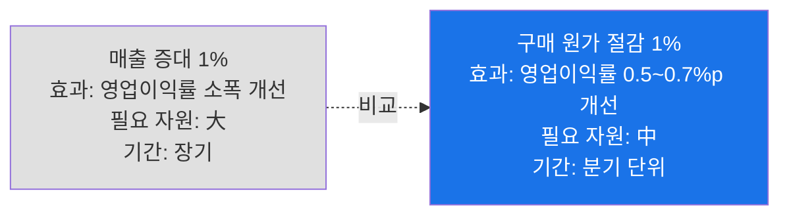
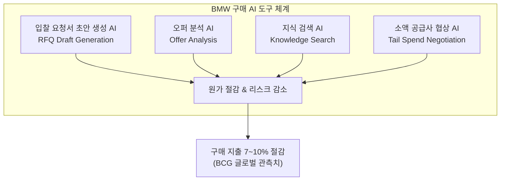
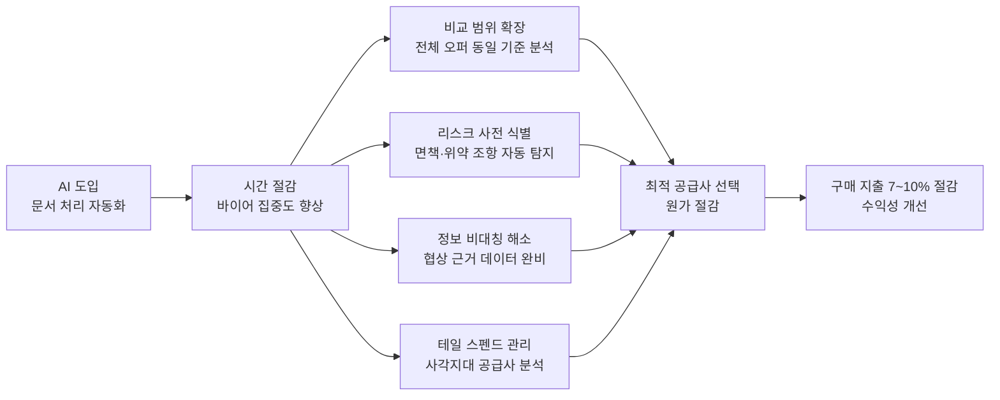
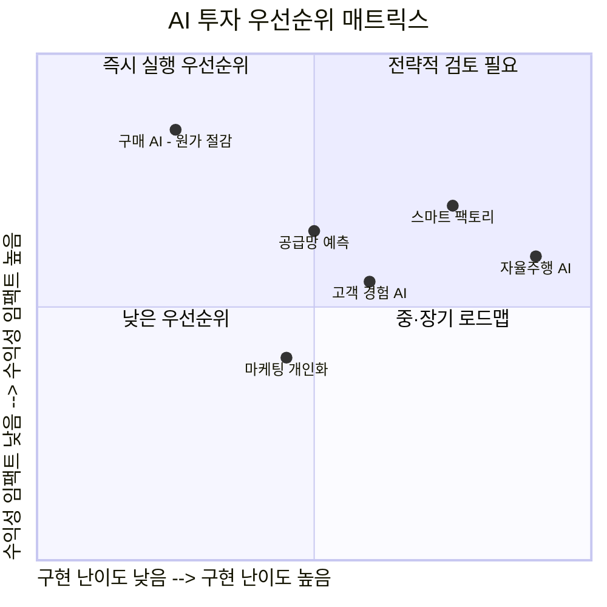

### — BCG 코리아의 진단과 BMW 사례로 본 구매 AI 혁신

---

## 들어가며 — 흔들리는 독일 자동차의 교훈

2024년 3분기, 독일 자동차 산업은 충격적인 성적표를 받아들었다. BMW의 순이익은 전년 동기 대비 84% 급감했고, 메르세데스-벤츠는 54%, 폭스바겐은 64% 감소했다. 중국 전기차의 공격적인 가격 정책, 에너지 비용 상승, 글로벌 공급망 재편이 동시에 맞물리며 수십 년간 프리미엄 자동차 산업의 상징이었던 독일 브랜드들이 심각한 수익성 위기에 직면한 것이다.

그렇다면 이 위기 속에서 BMW가 생성형 AI를 가장 먼저 투입한 곳은 어디였을까. 자율주행 기술 고도화? 스마트팩토리 자동화? 고객 경험 마케팅? 모두 아니었다. BMW가 선택한 첫 번째 AI 전장(戰場)은 엑셀 파일과 PDF 문서, 도장이 오가는 가장 전통적인 업무 영역인 **구매(Procurement)** 였다.

이 선택은 단순한 전술적 실험이 아니다. BCG(보스턴컨설팅그룹) 코리아의 곽병렬 MD 파트너는 이를 전략적 필연이라고 진단한다. 한국 기업들이 AI를 주로 매출 성장이나 고객 경험 향상의 도구로 인식하는 것과 달리, 글로벌 선도 기업들은 AI의 실질적인 수익성 개선 효과를 구매 영역에서 조용히 실현해 나가고 있다는 것이다.

---

## 1. 왜 하필 구매인가 — 세 가지 구조적 이유

### 1-1. 수익성은 '매출'이 아니라 '원가'에서 결정된다

기업의 수익성 구조를 들여다보면 구매의 중요성은 자명해진다. 한국 제조 기업의 영업이익률은 대체로 한 자릿수다. 매출 1조 원 규모의 기업이라도 영업이익은 500억 원 안팎인 경우가 많다. 이런 구조에서 매출을 수천억 원 늘리는 것과 비용을 1~2% 절감하는 것을 비교해 보면, 후자의 현실성이 훨씬 높다.

산업별 구매 지출 비중을 보면 그 무게감이 더욱 분명해진다. 제조업은 매출의 60~70%, 유통업은 70~80%, 금융·서비스업은 40~50%가 구매 지출이다. 이 수치가 의미하는 바는 단순하다. 구매 원가를 단 1%만 낮춰도 영업이익률은 0.5~0.7%포인트 개선된다는 것이다. 같은 기업에서 매출 증대로 동일한 효과를 내려면 얼마나 더 많은 자원과 시간이 필요한지를 생각하면, 구매가 얼마나 강력한 수익성 레버인지 알 수 있다.

문제는 이 레버가 지금까지 효과적으로 당겨지지 못했다는 점이다. 구매 업무는 비정형 문서의 홍수, 공급사별로 다른 용어와 양식, 방대한 계약 조건의 복잡성으로 인해 인간의 역량만으로는 최적화에 한계가 있었다. 생성형 AI는 바로 이 지점에서 처음으로 실질적인 돌파구를 제공하고 있다.

### 1-2. 구매 AI는 빠르고, 지속적이며, 조직 부담이 적다

매출 성장형 AI와 구매 최적화 AI의 가장 큰 차이는 **성과 가시화 속도**에 있다. 고객 경험 AI나 마케팅 개인화 AI는 효과가 나타나기까지 수개월에서 수년의 시간이 필요하다. 소비자 행동 변화, 브랜드 인식 개선, 시장 점유율 증가는 본질적으로 중·장기적인 현상이다.

반면 구매 AI는 다르다. 계약 조건 비교에서 찾아낸 절감 기회, 협상 전략 개선으로 줄어든 단가, 관리 사각지대였던 소액 공급사에서 발굴한 원가 절감은 **분기 단위로 측정 가능한 수치**로 환산된다. 한 번 최적화 사이클이 구축되면 절감 효과는 매년 누적되며 수익성을 지속적으로 끌어올린다.

또한 구매 AI는 조직 구조 변화 없이 외부 지출을 최적화한다는 점에서 내부 저항이 적다. 인력 구조 재편이나 사업부 통폐합 없이 도입 가능하다는 특성은 경영진의 의사결정 속도를 높이는 요인이기도 하다.

### 1-3. 구매 업무의 본질이 생성형 AI와 정확히 맞닿아 있다

세 번째 이유는 기술적 적합성이다. 구매 업무는 본질적으로 **비정형 문서를 읽고, 상이한 양식을 동일 기준으로 비교하며, 의미를 해석하는 작업**이다. 이는 생성형 AI가 가장 강점을 발휘하는 영역과 정확히 일치한다.

구매 바이어는 매달 형식과 용어가 제각각인 제안서와 계약서 수백 건을 처리한다. '납기'와 '공급 완료 시점'처럼 언뜻 비슷해 보이지만 법적·계약적으로 의미가 다른 조건들을 구분하고, 면책 조항의 범위를 해석하며, 공급사 간 조건을 사과와 사과로 비교하는 것이 숙련 바이어의 핵심 역량이었다. 그러나 처리해야 할 문서의 양이 방대해질수록 이 작업은 인간의 인지 한계에 부딪힌다. 결국 의사결정은 경험과 직감에 의존하게 되고, 놓치는 기회는 보이지 않는 채로 쌓여갔다.

생성형 AI는 이 오래된 병목을 정확히 해소한다. 오랫동안 잠재돼 있던 구매의 수익성 레버가 드디어 그에 맞는 열쇠를 만난 것이다.

---

## 2. BMW가 선택한 네 가지 AI 도구

BMW의 구매 본부가 도입한 AI 도구들은 추상적인 기술 실험이 아니다. 각 도구는 구매 업무의 구체적인 병목 지점을 정조준하며, 실제 바이어의 하루를 바꾸고 있다.

### 2-1. 입찰 요청서 초안 생성 AI

과거 구매 바이어가 새로운 부품 공급사 선정 입찰을 시작할 때는 먼저 기존 템플릿을 찾아 수정하는 작업에 반나절 이상을 소비했다. 과거 유사 건의 조건들을 확인하고, 현재 상황에 맞게 항목을 조정하며, 법무 검토가 필요한 조항들을 따로 표시하는 과정 전체가 수작업이었다.

이제는 다르다. AI가 과거 입찰 데이터와 계약 이력을 학습해 초안을 자동으로 생성한다. 바이어는 생성된 초안을 검토하고 수정하는 역할에만 집중할 수 있다. 작업 시간은 반나절에서 수십 분으로 압축되며, 그만큼 바이어의 시간은 전략적 판단에 재배분된다.

### 2-2. 오퍼 분석 AI

복수의 공급사로부터 제안서가 도착하면 문제가 시작된다. 각 공급사는 자신들의 양식으로 문서를 작성한다. 가격 표기 방식, 납기 조건의 정의, 품질 보증 범위, 면책 조항의 표현이 모두 제각각이다. 이 이질적인 문서들을 사과와 사과로 비교하는 것은 기존의 스프레드시트와 인력으로는 사실상 불가능에 가까웠다.

오퍼 분석 AI는 서로 다른 형식의 문서들을 동일한 기준으로 정렬하고, 가격·납기·품질·계약 조건의 차이를 한눈에 시각화한다. 특히 면책 조항, 위약금 기준, 계약 갱신 조건처럼 텍스트 깊숙이 숨겨진 리스크 조항들을 자동으로 식별하고 표시한다. 문제가 발생한 뒤 계약서를 뒤지는 것이 아니라, 계약 체결 전 협상 단계에서 이미 리스크를 차단할 수 있게 되는 것이다.

### 2-3. 지식 검색 AI

구매 실무자가 공급사와의 미팅을 준비하거나 계약 협상에 임할 때 필요한 정보는 여러 시스템에 분산되어 있다. 관련 과거 계약서는 문서 관리 시스템에, 내부 기준 단가는 ERP에, 공급사 평가 이력은 별도 데이터베이스에 흩어져 있다. 이를 취합하려면 여러 부서를 거쳐야 하고, 그 과정에서 시간이 소요되며 정보의 정확성도 확보하기 어렵다.

지식 검색 AI는 이 모든 정보에 자연어로 질문하는 방식으로 접근할 수 있게 한다. "지난 2년간 이 공급사와 체결한 부품 A의 계약 단가 추이는?" 또는 "이 조항의 법무 검토 기준은?" 같은 질문에 AI가 관련 출처와 함께 즉시 답변을 제공한다. 정보 취합에 소요되던 시간이 거의 사라지고, 협상 준비의 질이 높아진다.

### 2-4. 소액 공급사(테일 스펜드) 협상 AI

구매 조직의 인력과 시간이 항상 부족하다 보니, 전략적으로 중요한 핵심 공급사 관리에 역량이 집중되고 소액 공급사 영역은 사실상 관리 사각지대로 방치되는 경향이 있다. 이른바 '테일 스펜드(Tail Spend)'라 불리는 이 영역은, 건당 금액은 작지만 공급사 수가 많아 합산하면 전체 구매 지출의 상당 부분을 차지한다.

AI는 이 수천 개의 소액 공급사 포트폴리오를 동시에 분석하고, 각 공급사별 가격 인하 가능성을 도출하며, 맞춤형 협상 전략과 협상 서한을 자동으로 생성한다. 이전에는 인력 제약으로 아예 접근하지 못하던 절감 기회가 현실화되는 것이다.

---

## 3. 시간 절감에서 원가 절감으로 — 인과관계의 구조

BMW의 구매 AI 도입이 가져오는 변화는 단순히 '업무가 빨라졌다'는 차원이 아니다. 각 도구가 만들어내는 시간 절감은 연쇄적으로 의사결정의 질을 높이고, 그것이 측정 가능한 원가 절감으로 이어지는 인과 구조를 형성한다.

### 비교 범위의 확장

과거에는 시간과 인력의 한계로 일부 공급사의 제안서만 깊이 검토할 수 있었다. 그러다 보니 더 나은 조건을 제시하는 공급사가 존재하더라도 놓치는 경우가 발생했다. AI는 모든 제안서를 동일한 기준으로 처리함으로써 이 기회 손실을 차단한다. 같은 품질의 부품을 더 낮은 가격에 공급할 수 있는 공급사가 가시화된다.

### 계약 리스크의 선제적 차단

계약 이행 중 문제가 생긴 후 계약서를 들여다보며 대응하는 것은 사후적 비용이다. 면책 조항의 범위가 좁거나 위약금 기준이 모호하면 문제 발생 시 실질적인 배상을 받기 어렵다. AI가 계약 체결 전 이러한 조항들을 자동으로 탐지하고 협상 포인트로 제시함으로써, 사전에 리스크를 걸러낼 수 있다.

### 정보 비대칭의 해소

협상에서 정보는 권력이다. 과거 계약 단가, 시장가 변동 추이, 공급사의 재무 상태 등을 협상 전에 체계적으로 정리할 수 있는 쪽이 더 유리한 조건을 얻어낼 수 있다. 지식 검색 AI는 이 정보 준비 과정을 자동화함으로써 바이어의 협상력을 구조적으로 높인다.

---

## 4. BCG의 수치 — 구매 지출 7~10% 절감

BCG가 글로벌 자동차 및 제조 기업들의 구매 프로젝트를 통해 지속적으로 관측한 수치에 따르면, AI를 활용한 구매 최적화는 전체 구매 지출의 **약 7~10% 수준의 원가 절감**을 실현한다. 이 수치를 한국의 매출 1조 원 제조 기업에 대입해 보면 구매 지출이 매출의 약 65%인 6,500억 원이고, 여기서 8%를 절감한다고 가정하면 연간 520억 원의 비용 절감이 된다. 이 기업의 영업이익이 500억 원이라면, 구매 AI 하나로 영업이익을 약 두 배 늘리는 효과와 맞먹는 것이다.

물론 BCG도 이 수치가 보편적으로 동일하게 실현된다고 주장하지는 않는다. 데이터 품질, 조직의 준비도, 경영진의 의지와 실행력에 따라 실현 폭은 달라진다. 그러나 방향 자체는 명확하다. 구매에서 AI가 만들어내는 원가 절감은 이미 현실화된 성과이며, 이론적 가능성의 영역을 벗어났다는 것이다.

---

## 5. 한국 기업의 현재 위치 — 기반은 있고, 실행이 없다

BCG 코리아의 진단에서 특히 주목할 부분은 한국 기업의 현주소에 대한 평가다. 구매 AI 도입을 머뭇거리는 기업들이 자주 내세우는 이유는 "아직 구매 데이터가 정리되어 있지 않아 AI 도입은 이르다"는 것이다.

그러나 BMW도 데이터가 완비된 상태에서 시작하지 않았다. BCG의 핵심 메시지는 역방향이다. 데이터가 정리된 기업이 AI를 도입하는 것이 아니라, **AI를 도입하는 과정에서 데이터가 정리된다**는 것이다.

오히려 한국 기업은 유리한 출발선에 서 있다는 평가도 나온다. 글로벌 기준에서 볼 때 국내 대기업의 구매 조직은 디지털화와 표준화 수준이 높은 편이다. ERP와 전자 조달 시스템은 이미 광범위하게 도입되어 있고, 공급사 관리 프로세스도 상당 부분 체계화되어 있다. 기술적 기반 자체는 글로벌 경쟁자들에 비해 결코 뒤처지지 않는다는 것이다.

문제는 기반의 부재가 아니라 **실행의 부재**다.

### 국내 실제 사례

BCG가 최근 지원한 한 대형 국내 제조사의 사례는 이를 잘 보여준다. 이 기업 역시 구매 데이터가 여러 시스템에 흩어진 상태에서 AI를 적용하기 시작했다. 그럼에도 수개월 만에 연간 수백억 원의 절감 성과를 실현했다. 더 주목할 만한 것은 절감의 상당 부분이 핵심 공급사가 아니라 그동안 관리 사각지대였던 간접 구매 영역에서 나왔다는 점이다. 보이지 않던 곳에 실질적인 기회가 숨어 있었던 것이다.

---

## 6. 전략적 시사점 — 성과 지도의 빈 땅

BCG의 분석이 제시하는 핵심 프레임은 **'성과 지도(Performance Map)'** 다. 기업이 AI를 도입할 때 어느 영역부터 시작할 것인가는 단순한 기술적 판단이 아니라 전략적 선택이다.

매출 성장을 위한 AI는 경쟁자들도 동시에 추구하는 영역이다. 고객 경험 개선, 추천 알고리즘, 마케팅 자동화는 이미 많은 기업이 투자를 집중하는 곳이다. 반면 구매 영역은 가장 크지만 가장 늦게 변화한 영역이다. 그동안 너무 익숙해서 오히려 보이지 않던 이 거대한 비용 블록이 지금 AI로 인해 처음으로 최적화 가능한 영역으로 열리고 있다.

BCG가 던지는 마지막 질문은 날카롭다. "회사의 성과 지도에서 구매는 어디에 있는가. 아직 지도 밖에 있다면, 그곳이 지금 기업 성과를 가장 빠르게 바꾸는 지점이다."

---

## 마치며 — 두 시대의 공존과 선택

지금 우리는 두 시대의 공존을 목격하고 있다. 매출 1%를 늘리기 위해 조직 전체가 1년을 뛰는 시대와, AI가 구매 원가 1%를 한 분기 안에 절감하는 시대가 동시에 존재한다. 이 두 시대 중 어디에 집중할 것인가는 이제 경영 전략의 핵심 질문이 되고 있다.

BMW의 선택이 위기 속에서 이루어진 생존의 결단이었다면, 한국 기업들에게는 위기가 본격화되기 전에 조용히 실행할 수 있는 기회가 아직 남아 있다. 구매라는, 가장 크지만 가장 늦게 주목받은 이 영역에서, AI가 여는 다음 전선은 이미 시작되고 있다.

---

*작성일: 2026년 5월 5일*  
*참고 출처: 조선일보 [AX 지금, 현장에선] 칼럼 — [곽병렬 BCG 코리아 MD 파트너 기고](https://www.chosun.com/economy/tech_it/2026/05/04/XXFJURF33FDYDLQDABVY63CIUQ/) (2026.05.04)*
