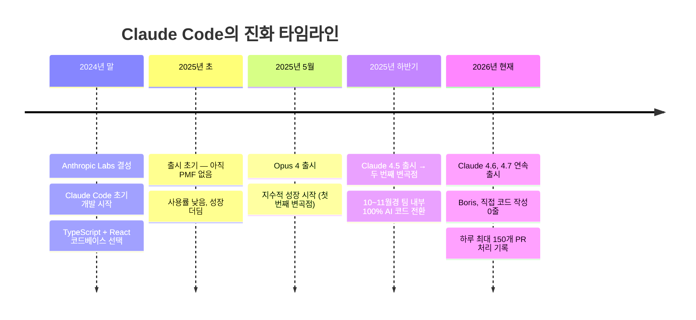
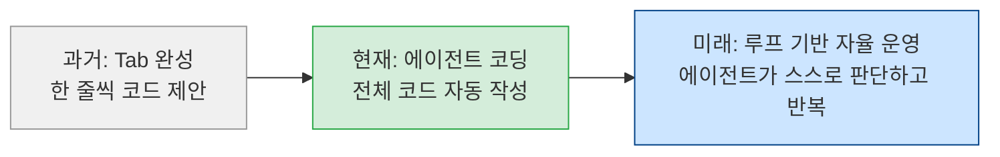
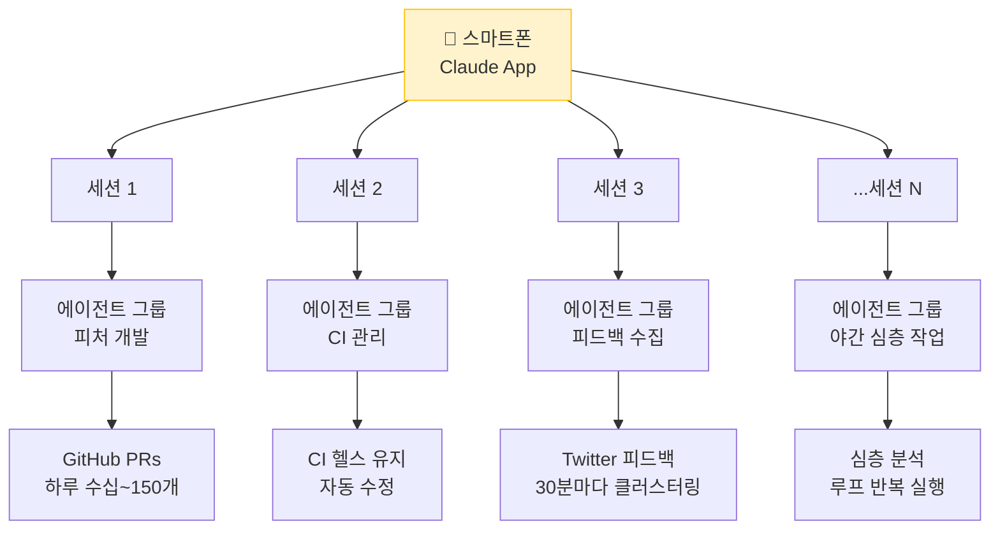
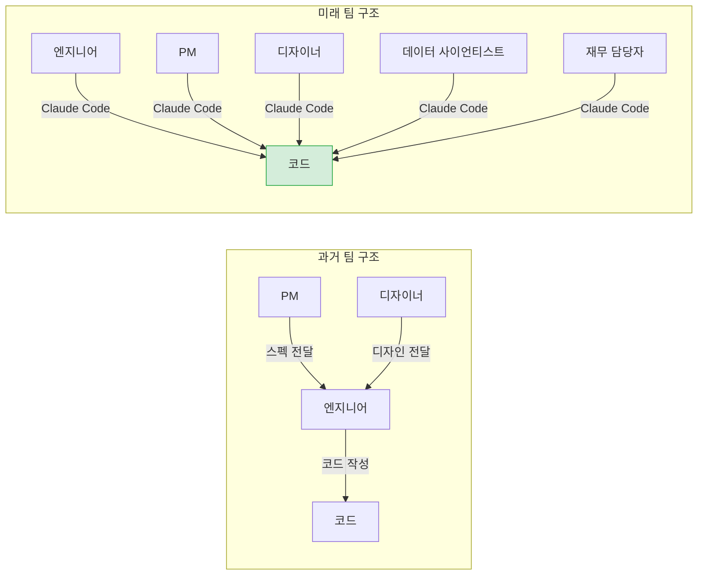
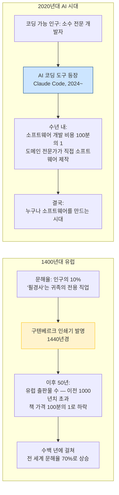
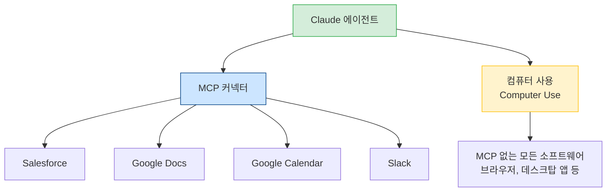

## Boris Cherny (Anthropic Claude Code 창시자) — Sequoia AI Ascent 2026 강연 완전 해설

> **원본 영상**: [Anthropic's Boris Cherny: Why Coding Is Solved, and What Comes Next](https://www.youtube.com/watch?v=SlGRN8jh2RI)  
> **발표자**: Boris Cherny (Anthropic, Head of Claude Code)  
> **인터뷰어**: Lauren Reeder (Sequoia Capital 파트너)  
> **행사**: AI Ascent 2026 — 2026년 5월 5일  
> **작성일**: 2026년 5월 5일

---

## 📌 한눈에 보는 핵심 메시지

이 강연은 AI 코딩 도구의 현주소와 미래를 가장 가까이서 바라보는 사람, 즉 Claude Code를 직접 만든 Boris Cherny가 전하는 생생한 증언이다. 그는 2026년 들어 단 한 줄의 코드도 직접 작성하지 않았으며, 매일 수십 개의 PR(Pull Request)을 스마트폰으로 처리하고 있다고 밝혔다. 이 강연은 단순한 도구 소개를 넘어, 소프트웨어 개발이라는 직업 자체가 어떻게 재정의되고 있는지를 깊이 있게 들여다보는 자리였다.

---

## 1장. 강연의 배경과 Boris Cherny는 누구인가

Boris Cherny는 Anthropic의 Claude Code 팀 수장으로, 엔지니어로서의 경력이 매우 탄탄한 인물이다. TypeScript 관련 교과서를 직접 집필했고, 오랜 시간 코드를 손수 쓰던 엔지니어였다. 그런 그가 2026년 들어 직접 코드를 단 한 줄도 작성하지 않았다는 사실은 AI 코딩 도구가 얼마나 빠르게 실용적인 단계에 진입했는지를 상징적으로 보여준다.

강연 인터뷰어인 Lauren Reeder는 Sequoia Capital의 파트너로, 그녀 역시 스스로를 "Claude Code 중독자(Claude Code Psychosis)"라고 부를 만큼 AI 코딩 도구에 깊이 빠져 있다는 점에서 이 강연이 단순한 홍보 행사가 아닌, 현장 실무자들 간의 솔직한 대화임을 느낄 수 있다.

---

## 2장. Claude Code의 탄생 — 우연한 발명

### Anthropic Labs라는 작은 인큐베이터에서

Claude Code는 2024년 말, Anthropic 내부의 소규모 혁신 팀인 **Anthropic Labs**에서 시작됐다. 이 팀은 말 그대로 소수 정예로 구성되어 있었으며, 단 몇 명이 Claude Code, MCP(Model Context Protocol), 그리고 데스크톱 앱을 동시에 개발했다. Boris는 이 경험을 "우리가 만들고 싶은 것을 자유롭게 만들었다"고 회고한다.

팀은 이후 해산됐다가 현재 "라운드 2"를 위해 다시 모인 상태다. 현재 이 팀을 이끄는 것은 Instagram 공동 창업자 출신이자 Anthropic의 최고 제품 책임자(CPO)인 **Mike Krieger**다.

### '제품 과잉(Product Overhang)'이라는 아이디어

Boris가 코딩 도구를 만들게 된 핵심 동기는 "모델은 이미 훨씬 더 많은 것을 할 수 있는데, 아직 그 능력을 담은 제품이 없다"는 인식, 즉 **Product Overhang** 개념이었다. 2024년 말 당시, 코딩 분야의 최첨단 기술은 코드 자동 완성(Tab 키 한 번으로 한 줄 완성)이 전부였다. Claude Sonnet 3.5가 처음으로 이런 수준의 타입어헤드(typeahead) 기능을 가능하게 했지만, Boris는 "이 정도에서 멈출 이유가 없다"고 판단했다.

---

## 3장. 타입어헤드에서 에이전트로 — 패러다임의 전환

### 코드 완성(Tab)의 시대는 끝났다

과거의 AI 코딩 도구는 단순히 "다음에 올 코드 한 줄을 예측"하는 수준이었다. 개발자는 여전히 모든 로직을 직접 생각하고, AI는 그 생각을 빠르게 타이핑해주는 보조 도구에 불과했다.

Boris는 이 구조가 근본적으로 바뀌어야 한다고 생각했다. 핵심 아이디어는 단순하다. **"이제는 에이전트가 모든 코드를 작성하게 하면 된다."**

그러나 현실은 생각만큼 쉽지 않았다. 처음 6개월 동안 Claude Code는 잘 작동하지 않았다. Boris 본인도 전체 작업의 10% 정도에만 활용했을 정도였다. 중요한 것은 그가 이 상황을 실패로 보지 않았다는 점이다. 그는 의도적으로 **"현재 모델이 아닌, 6개월 후 모델"을 위한 도구를 만들고 있었다**. PMF(Product-Market Fit)가 없을 것이라는 걸 알면서도 미래를 위해 개발을 계속한 것이다.

---

## 4장. "코딩은 해결됐다" — 이 말의 진짜 의미

### 완전한 주장인가, 아니면 맥락 있는 주장인가

Boris가 "코딩은 해결됐다(Coding is solved)"고 말했을 때, 청중 반응은 엇갈렸다. 여전히 손으로 코드를 100% 직접 작성하는 사람, 에이전트에 100% 의존하는 사람, 그리고 그 사이 어딘가에 있는 사람들이 공존하는 현실이 그것을 증명한다.

Boris의 주장은 사실 맥락이 있다. 그의 팀이 사용하는 Claude Code 코드베이스는 TypeScript와 React로 작성된 비교적 단순한 구조다. 이는 의도적인 선택이었다. 초창기 모델이 가장 잘 처리할 수 있는, 학습 데이터에 많이 등장하는(on-distribution) 언어와 프레임워크를 골랐기 때문이다. 이 선택 덕분에 2025년 10~11월경, 모델이 해당 코드베이스의 100%를 작성하는 단계에 도달했다.

반면 매우 복잡한 레거시 코드베이스, 희귀 언어, 특수 도메인 영역은 아직 완전히 해결되지 않았다고 Boris도 인정한다. 하지만 그의 조언은 명확하다. **"보통 정답은 그냥 다음 모델을 기다리는 것"** 이라고.

### Boris의 하루 — 150개 PR의 비밀

Boris는 지난주 단 하루에 **150개의 PR**을 처리한 날이 있었다고 언급했다. 이것이 가능한 이유는 그가 병렬로 수백 개의 에이전트를 동시에 운용하기 때문이다. 단순히 작업 속도가 빠른 것이 아니라, 일하는 방식 자체가 다르다.

---

## 5장. Boris의 개인 워크플로우 — 스마트폰으로 수백 개의 에이전트를 지휘하다

### 핸드폰이 곧 개발 환경

Boris의 주 개발 도구는 노트북이 아닌 **스마트폰**이다. Claude 앱의 왼쪽에 있는 코드 탭에서 5~10개의 세션을 열어두고, 각 세션 안에서 다시 수많은 에이전트를 병렬로 실행한다. 일반적인 날에는 수백 개, 심야에는 수천 개의 에이전트가 더 깊은 작업을 처리하고 있다.

### 루프(Loop) — Boris가 "미래"라고 부르는 것

Boris가 가장 강조하는 개념은 **루프(Loop)** 다. 루프란 Claude가 cron 작업을 스케줄링하여 지속적으로 반복 실행되는 에이전트를 의미한다. 간격은 1분, 5분, 하루 단위 등 자유롭게 설정할 수 있다.

현재 Boris가 운용하는 루프의 예시는 다음과 같다.

- **PR 보모 루프**: 자신의 PR들을 모니터링하고, CI가 실패하면 자동으로 수정하며 자동 리베이스
- **CI 건강 유지 루프**: 불안정한 테스트(flaky test)를 자동으로 감지하고 수정
- **Twitter 피드백 루프**: 30분마다 Twitter에서 Claude Code 관련 피드백을 수집하고 클러스터링해서 보고
- **라우틴(Routines)**: 방금 출시된 기능으로, 노트북을 닫아도 서버에서 루프가 계속 실행됨

> "루프가 미래라고 진심으로 생각한다. 아직 경험해보지 않았다면 강력히 권한다."  
> — Boris Cherny

---

## 6장. 미래의 팀은 어떤 모습인가 — 제너럴리스트의 부상

### 학제 간 제너럴리스트의 시대

Boris는 팀의 미래 구조에 대해 명확한 예측을 내놓았다. 현재 "제너럴리스트"라는 말은 주로 iOS, 웹, 서버 등 여러 영역을 다루는 엔지니어를 의미한다. 하지만 앞으로의 제너럴리스트는 **학문 분야를 넘나드는** 인재를 뜻하게 된다.

즉, 뛰어난 제품 엔지니어이면서 동시에 디자인, 데이터 사이언스, 제품 기획까지 아우르는 사람이 핵심 인재가 된다.

### Anthropic Claude Code 팀이 이미 그 증거다

놀랍게도, Anthropic의 Claude Code 팀에서는 **엔지니어링 매니저, PM, 디자이너, 데이터 사이언티스트, 재무 담당자, 사용자 리서처** 등 모든 구성원이 코드를 작성한다. 각자의 전문 분야가 있지만, 동시에 코딩은 팀의 공통 언어가 됐다.

---

## 7장. SaaS 종말론? — 소프트웨어 산업의 재편

### 코드 작성 비용이 100분의 1이 된다면?

AI가 코딩 비용을 10배 혹은 100배 낮춘다면, 소프트웨어로 만든 제품의 가치는 어떻게 변할까? "SaaS 종말(SaaS Apocalypse)"이라는 도발적인 질문에 Boris는 두 가지 방향으로 답했다.

### 첫 번째: '세븐 파워(Seven Powers)' 프레임의 재편

Boris는 해밀턴 헬머의 저서 *7 Powers* — 비즈니스의 7가지 경제적 해자(moat) 개념을 인용한다. AI 시대에는 이 7가지 파워 중 일부는 약화되고, 일부는 더욱 강화된다고 본다.

| 파워 | AI 시대 영향 | 이유 |
|------|-------------|------|
| 전환 비용 (Switching Costs) | ⬇️ 약화 | 모델이 한 플랫폼에서 다른 플랫폼으로 마이그레이션을 자동화 |
| 프로세스 파워 (Process Power) | ⬇️ 약화 | AI가 워크플로우와 프로세스 최적화를 직접 수행 (특히 Claude 4.7의 hill-climbing) |
| 네트워크 효과 (Network Effects) | ➡️ 유지 | AI가 복제하기 어려운 네트워크 구조 |
| 규모의 경제 (Scale Economies) | ➡️ 유지 | 대규모 데이터와 인프라는 여전히 강점 |
| 희소 자원 (Cornered Resources) | ➡️ 유지 | 특수 데이터, 특허 등은 AI로 대체 불가 |

### 두 번째: 스타트업 황금시대의 도래

Boris는 향후 10년 안에 스타트업의 수가 10배 이상 증가할 것이라고 예측한다. 그 이유는 간단하다. 소규모 스타트업이 이제 대기업과 동등한 수준의 소프트웨어를 만들 수 있게 됐기 때문이다.

대기업은 AI를 도입하려 해도 내부 프로세스 변경, 직원 재교육, 조직 저항이라는 장벽이 있다. 반면 스타트업은 처음부터 AI를 중심으로 조직을 설계할 수 있다.

> "지금이 스타트업을 시작하기 가장 좋은 시기다. 엄청난 disruption이 몰려오고 있다."  
> — Boris Cherny

---

## 8장. 청중 Q&A — 핵심 질의응답

### Q1. 성공의 공은 모델인가, 제품인가?

**A**: 1년 전 기준으로 50대 50이었다. 하지만 Boris는 제품의 중요성을 강조한다. YC 출신으로서, "사람들이 사랑하는 것을 만들어라"는 원칙이 코드와 모델 못지않게 중요하다고 말한다. 세부 사항에 집착하고, 하루 종일 써도 좋은 경험을 주는 것이 제품의 역할이다. 다만 모델이 좋아질수록 "하네스(harness, 제품 레이어)"의 중요성은 상대적으로 줄어들 것이라고 전망했다.

### Q2. Anthropic은 일반인보다 얼마나 앞서 있는가?

**A**: 모델 측면에서는 사실상 차이가 없다. 내부적으로 쓰는 것과 외부에 공개된 모델이 동일하기 때문이다. 오히려 차이가 나는 것은 **조직 구조와 프로세스**다. Anthropic에서는 모든 SQL이 모델이 작성하고, 모든 코드가 AI에 의해 만들어지며, 각자의 Claude 에이전트들이 Slack으로 서로 소통하며 협업한다. 이 수준의 조직적 변화가 진짜 격차를 만들고 있다.

### Q3. 미래에도 클라우드 컴퓨팅에 의존할 것인가, 로컬 AI로 전환될까?

**A**: Boris는 이 질문이 몇 년 안에 무의미해질 것이라고 본다. 모델이 스스로 "이 작업에는 로컬 모델이 낫겠다"고 판단하고 결정하는 시대가 오기 때문이다. 즉, 클라우드냐 로컬이냐는 엔지니어가 아닌 **AI 스스로가 결정하는 문제**가 된다.

### Q4. 비개발자도 소프트웨어를 만드는 시대가 올까?

**A**: 이 질문에 Boris는 가장 열정적으로 반응했다. 그의 대답은 단호하다. **"그렇다, 그리고 그 이상이 될 것이다."**

---

## 9장. 인쇄기의 비유 — 역사적 맥락에서 본 AI 코딩

Boris가 가장 강력하게 주장하는 역사적 비유는 **15세기 유럽의 인쇄기 발명**이다.

이 비유의 핵심은 단순히 속도가 빨라지는 게 아니라, **소프트웨어를 만드는 행위 자체가 대중화된다**는 것이다. 문자를 읽고 쓰는 능력처럼, 소프트웨어를 만드는 능력이 특수 직업의 전유물이 아닌 일상적 기술이 되는 것이다.

Boris는 특히 **회계 소프트웨어**의 예를 든다. 회계 소프트웨어를 가장 잘 만드는 사람은 뛰어난 엔지니어가 아니라, **훌륭한 회계사**가 될 것이다. 코딩은 이제 쉬운 부분이 되고, 도메인 지식이 가장 중요한 요소가 된다는 것이다.

---

## 10장. 현재 Claude Code의 최신 기능과 실제 영향

### 2026년 현재 클로드 코드의 주요 업데이트

이 강연 이전에 공개된 최신 동향을 함께 살펴보면, Boris의 주장이 단순한 낙관론이 아님을 알 수 있다.

**코드 리뷰(Code Review) 기능** — 2026년 3월 9일 출시: PR이 열리면 에이전트 팀이 자동으로 버그를 검색한다. Anthropic 내부에서 먼저 사용한 결과, 이 기능 도입 이후 Anthropic 엔지니어 1인당 코드 산출량이 **200% 향상**됐다.

**루틴(Routines)** — 서버 기반 루프 기능: 노트북을 닫아도 에이전트가 계속 실행되며, 정기적 반복 작업을 자동화한다.

**서브 에이전트(Sub-agents)** — Claude가 스스로 하위 에이전트를 생성하여 병렬 작업을 수행하는 기능.

**코워크(Cowork)** — Claude Code 팀이 약 10일 만에 개발한 비개발자용 에이전트 제품. 파일 관리, 브라우저 제어, 앱 조작 등을 자율적으로 수행한다.

### Claude Code 기업 채택 현황

Claude Code는 현재 Uber, Netflix, Spotify, Salesforce, Accenture, Snowflake 등 대형 기업들이 활발히 활용 중이다. Anthropic의 총 웹 방문자 수는 2024년 12월 이후 두 배 이상 증가했으며, 이 성장의 핵심에 Claude Code가 있다.

---

## 11장. 클로드 코드가 바꾸는 비즈니스 구조

### 지식 노동의 MCP 통합

Boris는 비개발자의 업무 환경(Salesforce, Google Docs, Google Calendar 등)이 이미 클라우드에 있다는 점을 지적하며, 이를 MCP(Model Context Protocol)로 연결하면 Claude Code와 동일한 방식으로 지식 업무도 자동화할 수 있다고 말한다.

MCP는 Claude AI, Claude CLI, Claude Code 어디서나 동일하게 작동하는 연결 표준이며, 아직 MCP 커넥터가 없는 시스템에는 **컴퓨터 사용(Computer Use)** 기능이 대안이 된다. Boris에 따르면 Anthropic은 현재 컴퓨터 사용 기술에서 업계 선두를 달리고 있으며, Claude 4.7에서 특히 큰 향상이 이루어졌다.

---

## 12장. 미래를 위해 지금 무엇을 만들어야 하는가

강연 마지막 질문은 "6개월~1년 후 모델이 더 좋아졌을 때 훨씬 흥미로워질 제품이 지금 어떤 형태인가?"였다.

Boris의 대답은 간결하면서도 울림이 있었다.

1. **Claude Design** — 현재도 꽤 좋지만, 앞으로 훨씬 더 강력해질 것이다.
2. **루프 & 배치(Loop & Batch)** — 에이전트를 대규모로 병렬 실행하는 인프라. 지금도 강하지만 갈수록 더 중요해진다.
3. **컴퓨터 사용(Computer Use)** — 아직 느리지만, 모델이 좋아질수록 가장 범용적인 자동화 수단이 될 것이다.

---

## 13장. 강연의 시사점 — 개발자와 기업이 지금 해야 할 것

이 강연에서 얻을 수 있는 실질적인 시사점을 정리하면 다음과 같다.

**개발자 개인 차원**에서는 이제 '코드 작성 능력'보다 '에이전트를 효과적으로 지휘하는 능력', 즉 도메인 지식과 문제 정의 능력이 더 중요해진다. TypeScript, Python 문법보다 "무엇을 만들어야 하는가"에 집중해야 한다.

**팀과 조직 차원**에서는 PM, 디자이너, 데이터 사이언티스트 등 비엔지니어링 구성원들도 AI 코딩 도구 활용 능력을 갖추는 것이 생산성에 직결된다. Anthropic처럼 모든 팀원이 코딩을 일상적 도구로 쓰는 구조를 만들어가야 한다.

**스타트업 차원**에서는 처음부터 AI 네이티브로 조직을 설계할 수 있다는 것이 대기업에 대한 최대 경쟁 우위다. 내부 저항 없이 가장 빠르게 AI를 통합할 수 있는 주체는 스타트업이다.

**비개발자 도메인 전문가 차원**에서는 자신의 도메인 전문성이 소프트웨어를 만드는 데 가장 큰 자산이 되는 시대가 오고 있다. 회계, 의료, 법률 등 각 분야 전문가가 직접 소프트웨어를 설계하고 만드는 흐름이 가속화될 것이다.

---

## 마치며

Boris Cherny의 이 강연은 단순히 "AI 도구가 좋아졌다"는 메시지를 전달하는 자리가 아니었다. 그것은 소프트웨어 개발의 본질이 바뀌고 있다는, 더 나아가 누가 소프트웨어를 만들 수 있는가에 대한 오래된 전제가 허물어지고 있다는 선언에 가까웠다.

인쇄기가 발명된 후 문해율이 10%에서 70%로 오르는 데 수백 년이 걸렸다. 하지만 AI 코딩 도구의 민주화는 훨씬 빠르게 진행될 것이다. 그 변화의 한가운데에 Claude Code가 있고, Boris Cherny는 그 최전선에서 직접 미래를 설계하고 있다.

---

*이 문서는 Sequoia Capital AI Ascent 2026에서 발표된 Boris Cherny의 강연 전문 및 공개된 관련 자료를 바탕으로 작성됐습니다.*  
*작성일: 2026년 5월 5일*
