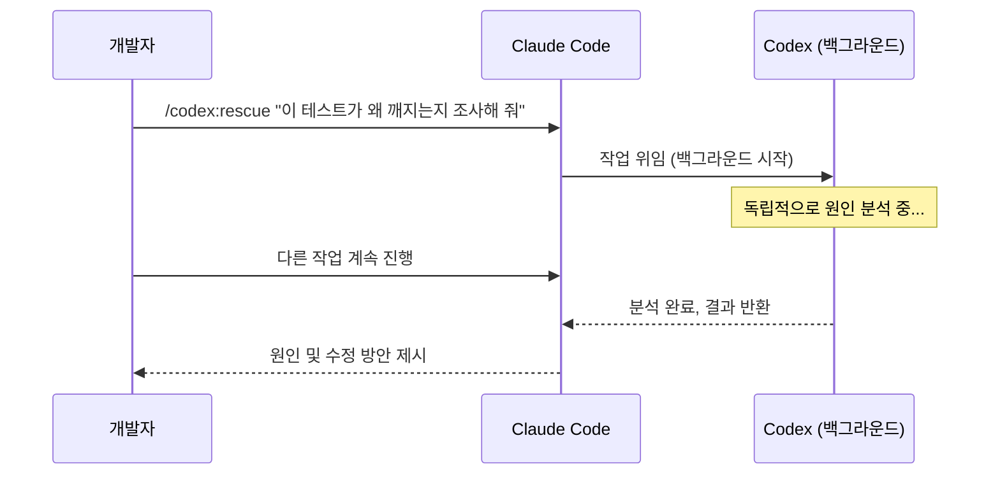
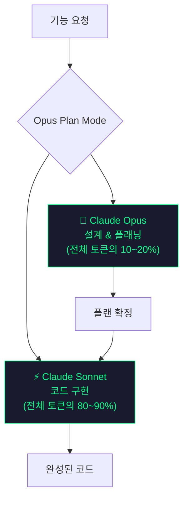
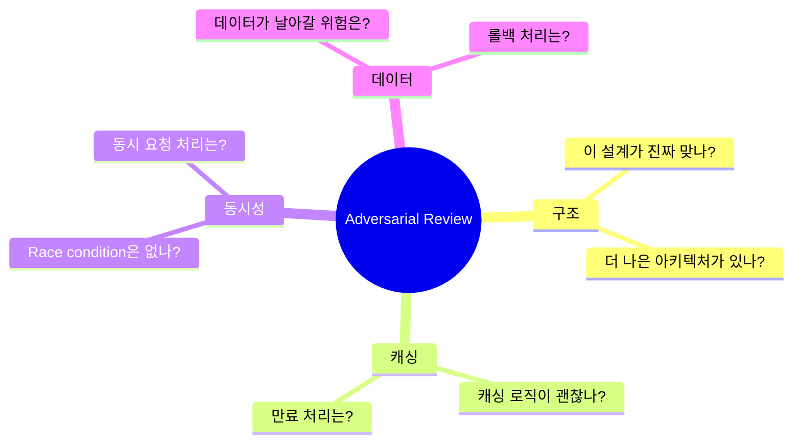
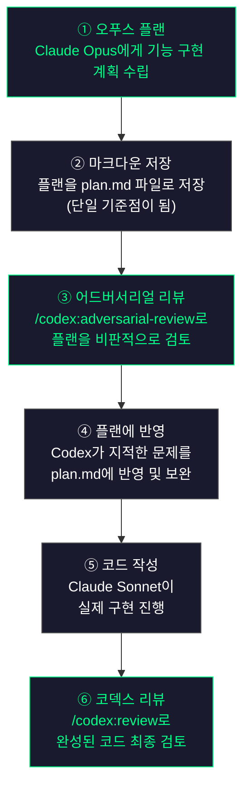

> **영상 출처:** [클로드 코드 하나만 쓰면 이제 망합니다 (feat. Codex)](https://www.youtube.com/watch?v=f0hcByvsyjU) — 메이커 에반 | Maker Evan (2026. 5. 5.)

---

## 목차

1. [왜 지금 이 이야기를 하는가](#1-왜-지금-이-이야기를-하는가)
2. [클로드 코드 성능 저하 사태 회고](#2-클로드-코드-성능-저하-사태-회고)
3. [codex-plugin-cc 의 등장](#3-codex-plugin-cc-의-등장)
4. [서로 다른 모델이 서로 다른 곳에서 실수한다](#4-서로-다른-모델이-서로-다른-곳에서-실수한다)
5. [Codex Rescue — 막혔을 때의 탈출구](#5-codex-rescue--막혔을-때의-탈출구)
6. [Opus Plan Mode — 비용을 1/3로 줄이는 방법](#6-opus-plan-mode--비용을-13로-줄이는-방법)
7. [Adversarial Review — 설계 자체를 의심하라](#7-adversarial-review--설계-자체를-의심하라)
8. [실전 설치 가이드](#8-실전-설치-가이드)
9. [6개의 슬래시 커맨드](#9-6개의-슬래시-커맨드)
10. [실전 워크플로우 — 한 사이클 6단계](#10-실전-워크플로우--한-사이클-6단계)
11. [주의사항 — Rescue 무한 루프 버그](#11-주의사항--rescue-무한-루프-버그)
12. [전략적 맥락 — 왜 OpenAI는 경쟁사 생태계에 플러그인을 만들었나](#12-전략적-맥락--왜-openai는-경쟁사-생태계에-플러그인을-만들었나)
13. [정리 및 결론](#13-정리-및-결론)

---

## 1. 왜 지금 이 이야기를 하는가

2025년 하반기만 해도 많은 개발자들이 Claude Code 하나만 터미널에 띄워 놓고 모든 코딩 작업을 처리했습니다. 결과물이 좋았고, 하나로 다 된다는 느낌이 있었기 때문입니다.

그런데 2026년으로 넘어오면서 분위기가 조용히 달라졌습니다. 요즘 커뮤니티를 보면 Claude Code 단독으로 쓰는 사람이 눈에 띄게 줄었고, 대신 **OpenAI의 Codex를 보조로 함께 띄우거나**, 혹은 **구현이 끝난 코드를 Codex로 검토시키는** 패턴이 빠르게 자리 잡고 있습니다. 심지어 Claude Code에서 Codex로 아예 갈아타는 사람도 생겨났습니다.

이 변화의 배경에는 몇 가지 결정적인 계기가 있었습니다.

---

## 2. 클로드 코드 성능 저하 사태 회고

실제로 **2026년 2월에서 3월 사이**, Claude Code의 성능이 일시적으로 눈에 띄게 떨어지는 시기가 있었습니다. 같은 버그를 두세 번 고쳤다고 하는데 또 깨지고, 어떤 날은 멀쩡하다가 어떤 날은 답이 이상하게 짧아지는 현상이 반복됐습니다.

이후 Anthropic이 공식 **사후 보고서(Post-mortem)** 를 발표했는데, 그 원인으로 **토큰 누락(token dropout)**, **메모리 초기화 버그**, 그리고 세 번째 버그가 동시에 겹쳐 있었다고 밝혔습니다.

이 사태가 개발자들에게 남긴 메시지는 명확합니다.

> **"단 하나의 모델에만 의존하는 것은 구조적으로 위험하다."**

아무리 뛰어난 모델도 예기치 못한 성능 저하, 버그, 혹은 특정 유형의 문제에서 구조적 맹점을 가질 수 있습니다. 이 감각이 커뮤니티 전반에 퍼지면서 **멀티 모델 워크플로우**에 대한 관심이 폭발적으로 높아졌습니다.

---

## 3. codex-plugin-cc 의 등장

이런 흐름에 결정타를 날린 것이 바로 **2026년 3월 30일**, OpenAI가 공개한 공식 플러그인 **`codex-plugin-cc`** 입니다.

이 플러그인의 핵심은 간단합니다. **Claude Code 안에서 슬래시 커맨드 하나만으로 Codex를 직접 호출할 수 있게 해준다**는 것입니다. 같은 프로젝트, 같은 컨텍스트 안에서 두 모델을 함께 쓸 수 있게 된 것입니다.

플러그인은 OpenAI의 엔지니어 Dominik Kundel, Kyle Kelley, Omid Rajabi가 만들었으며, 오픈소스로 공개되어 있습니다. 경쟁사인 Anthropic의 도구 생태계에 공식 플러그인을 심는다는 것은 업계에서도 상당히 이례적인 움직임으로 평가받고 있습니다.

```
# 설치 흐름 (3줄)
/plugin marketplace add openai/codex-plugin-cc
/plugin install codex@openai-codex
/codex:setup
```

설치 후에는 Claude Code 안에서 `/codex:review`, `/codex:rescue` 같은 명령어를 쓸 수 있게 됩니다.

---

## 4. 서로 다른 모델이 서로 다른 곳에서 실수한다

### 핵심 원리

멀티 모델 워크플로우의 핵심 논리를 한 문장으로 정리하면 이렇습니다.

> **서로 다른 회사가 만든 모델은, 서로 다른 곳에서 실수한다.**

비유하자면, 같은 학원에서 같은 강사에게 배운 두 학생은 시험에서 비슷한 문제를 틀립니다. 반면 다른 학원, 다른 강사에게 배운 학생을 데려오면 서로가 놓친 부분을 잡아줄 수 있습니다.

Claude와 Codex의 관계가 정확히 그렇습니다. Claude는 아키텍처적인 문제를 잘 발견하는 경향이 있고, Codex는 코드의 정확성(correctness) 문제를 잘 잡아내는 경향이 있습니다.

### 실제 사례: MCP 브릿지 코드 리뷰

어떤 개발자가 Claude Code로 MCP 브릿지 코드를 완성했습니다. 다 됐다고 생각했지만, Codex에게 한 번 리뷰를 시켜봤더니 **Claude가 놓친 문제가 3가지**나 나왔습니다.

| 번호 | 발견된 문제 | 설명 |
|------|------------|------|
| 1 | 종료 코드 처리 로직의 구멍 | 특정 상황에서 프로세스가 비정상 종료돼도 오류를 잡지 못함 |
| 2 | ANSI 이스케이프 문자 필터 누락 | 터미널 출력에서 ANSI 코드를 걸러내지 않아 인젝션 위험 존재 |
| 3 | 경로 이중 적용 버그 | 동일한 경로를 두 번 적용하는 로직 오류 |

이는 **사람이 자기 글을 교정할 때 오탈자를 잘 못 잡는 것**과 같은 원리입니다. 자신이 짠 코드를 자신이 검토하면, 자신의 시각에서만 볼 수 있습니다. 처음 보는 외부 모델이 검토할 때 비로소 보이지 않던 문제가 드러납니다.

---

## 5. Codex Rescue — 막혔을 때의 탈출구

### 기존 방식의 문제

Claude Code로 작업하다 보면 누구나 한번쯤 이런 상황을 겪습니다. 같은 버그를 두세 번 고쳤다고 하는데 또 깨지고, 고치려 할수록 코드는 점점 더 복잡해지는 상황. 기존에는 이럴 때 새 세션을 열고 처음부터 다시 시작하는 수밖에 없었습니다.


### Codex Rescue의 흐름

`/codex:rescue`를 쓰면 막힌 그 자리에서 벗어날 수 있습니다. 슬래시 커맨드 하나를 치면서 문제를 설명하기만 하면 됩니다.

예시:
```
/codex:rescue 이 테스트가 왜 깨지는지 조사해 줘
```

그러면 Codex가 백그라운드에서 해당 작업을 독립적으로 파고들고, 그 동안 Claude Code 창에서는 다른 작업을 계속할 수 있습니다. Codex가 분석을 끝내면 결과를 가져와서 보여줍니다.



### 실제 사례: 사이드바 리팩터링

한 개발자가 사이드바의 대규모 리팩터링을 마쳤습니다. 새 위저드 흐름, 상태 관리 새로 짜기, 화면 여러 개 동시 수정 등 큰 변경이 한꺼번에 이루어졌습니다. 다 됐다고 생각하고 Codex Rescue로 점검을 시켰더니, **6분 35초 만에** 엣지 케이스 4개가 발견됐습니다.

| 번호 | 발견된 엣지 케이스 |
|------|-------------------|
| 1 | 설정이 안 된 상태에서 제출 버튼을 눌러도 조용히 실패함 |
| 2 | 저장 없이 리뷰 단계로 점프할 수 있는 경로 존재 |
| 3 | 실행 중인 요청을 뒤로 가기로 끊으면 복구 불가 |
| 4 | 동시 요청 시 서로의 상태를 덮어씀 |

이 개발자는 이렇게 말했습니다: "큰 변화가 한꺼번에 일어나면 엣지 케이스는 잘 안 보입니다. 상태 변화 사이의 틈새에 숨어 있다가 나중에 사용자가 겪어야 드러나는 법이거든요."

---

## 6. Opus Plan Mode — 비용을 1/3로 줄이는 방법

### 역할 분리의 논리

Claude Code에는 **Opus Plan Mode**라는 설정이 있습니다. 이 모드에서는 **플래닝은 Claude Opus가, 실제 코드 작성은 Claude Sonnet이** 담당합니다. 같은 세션 안에서 자동으로 역할이 나뉩니다.



### 왜 이렇게 나눠 쓰는가?

코딩 작업을 잘 들여다보면, 진짜 머리를 써야 하는 부분은 사실 처음 설계 단계뿐입니다.

- **구조를 어떻게 잡을 것인가**
- **데이터 흐름은 어떻게 가져갈 것인가**
- **어떤 문제가 생길 수 있는가**

이 설계 단계는 전체 작업의 **토큰 중 10~20%** 밖에 차지하지 않습니다. 나머지 **80~90%** 는 함수 만들기, 테스트 짜기, import 정리 같은 실제 구현 작업입니다. 이 부분은 Sonnet으로도 충분히 잘 처리됩니다.

### 비용 비교

| 방식 | 비용 (1M 토큰 기준) |
|------|-------------------|
| 전부 Opus로 돌릴 때 | ~$1.50 |
| Opus 플랜 + Sonnet 구현 | ~$0.48 |

거의 **1/3 수준**으로 비용이 떨어집니다. 베테랑 건축가에게 설계도만 부탁하고, 실제 시공은 실력 있는 일반 작업자에게 맡기는 것과 같은 원리입니다.

---

## 7. Adversarial Review — 설계 자체를 의심하라

### Opus Plan만으론 부족하다

Opus가 플랜을 짜줬다고 해서 바로 구현에 들어가는 것은 좋지 않습니다. Opus도 자신이 만든 플랜의 문제를 스스로 잘 발견하지 못할 수 있습니다. 이때 필요한 것이 **Codex Adversarial Review**입니다.

### Adversarial Review란?

Codex에게 플랜을 **비판적으로 검토**하도록 시키는 작업입니다. 단순한 문법 검사가 아니라, **설계 자체를 의심하는 과정**입니다.



사용법:
```
/codex:adversarial-review --base main "이 캐싱 및 재시도 설계가 올바른지 점검해 줘"
```

### 실제 사례: 3라운드에서 14개 문제 발견

한 개발자가 Adversarial Review를 **3라운드** 돌렸더니, **14개의 문제**가 플랜 단계에서 발견됐습니다.

- 인증 모델 누락
- 셸 스크립트 다운패스 처리 버그
- 기타 설계 결함들

**플랜 단계에서 발견하면 수정 비용이 거의 들지 않습니다.** 하지만 구현을 다 마치고 나서 발견되면, 코드 전체를 다시 짜야 할 수도 있습니다. 그래서 이 순서가 중요합니다.

---

## 8. 실전 설치 가이드

### 준비물

- Claude Code (설치 완료 상태)
- OpenAI Codex CLI (별도 설치 필요)
- ChatGPT 계정 (ChatGPT Plus 권장, 월 $20) 또는 OpenAI API 키
- Node.js 18.18 이상

### 설치 — 3줄이면 끝

```bash
# 1단계: 마켓플레이스 추가
/plugin marketplace add openai/codex-plugin-cc

# 2단계: 플러그인 설치
/plugin install codex@openai-codex

# 3단계: 셋업 및 인증 확인
/codex:setup
```

`/codex:setup`을 실행하면 Codex CLI가 설치되어 있는지 확인하고, 설치가 안 되어 있다면 npm을 통해 자동으로 설치를 제안합니다. 인증은 `!codex login`으로 ChatGPT 계정 또는 API 키로 진행합니다.

플러그인은 로컬에 설치된 Codex CLI 바이너리를 그대로 활용하며, `~/.codex/config.toml`에 저장된 기존 인증 정보를 재사용합니다. 별도의 계정이나 런타임을 따로 관리할 필요가 없습니다.

---

## 9. 6개의 슬래시 커맨드

설치 후에는 Claude Code 안에서 6개의 새 슬래시 커맨드를 쓸 수 있게 됩니다.

| 커맨드 | 역할 | 특징 |
|--------|------|------|
| `/codex:setup` | 설치 및 인증 확인 | 최초 1회 실행 |
| `/codex:review` | 코드 리뷰 | 커밋되지 않은 변경사항 또는 브랜치 diff 검토, 읽기 전용 |
| `/codex:adversarial-review` | 설계 비판 리뷰 | 구조, 동시성, 데이터 안전성 등을 압박 테스트, 읽기 전용 |
| `/codex:rescue` | 막힌 작업 위임 | 백그라운드에서 Codex가 독립적으로 문제 분석 및 해결 |
| `/codex:consult` | 자문 요청 | 특정 결정에 대한 의견 및 대안 제시 |
| `/codex:cancel` | 진행 중인 작업 취소 | 무한 루프 등 비정상 상황에서 사용 |

이 중 **가장 많이 쓰이는 두 가지**는 `/codex:review`(코드 검토)와 `/codex:rescue`(디버그 구조)입니다.

---

## 10. 실전 워크플로우 — 한 사이클 6단계

지금까지의 내용을 하나의 실전 워크플로우로 정리하면 다음과 같습니다.



### 각 단계의 의미

**① 오푸스 플랜**: "이 기능 만들 건데 어떻게 접근할까?"라고 Opus에게 물으면 단계별 계획을 짜줍니다.

**② 마크다운 저장**: 플랜을 `plan.md` 같은 파일로 정리해 둡니다. 이것이 이후 모든 작업의 단일 기준점이 됩니다.

**③ 어드버서리얼 리뷰**: 구현에 들어가기 전, Codex에게 그 플랜을 비판적으로 두드려 보게 합니다.

**④ 플랜에 반영**: Codex가 지적한 부분이 있으면 plan.md에 반영하고 플랜을 보완합니다.

**⑤ 코드 작성**: 검증된 플랜을 바탕으로 Sonnet이 실제 구현을 진행합니다.

**⑥ 코덱스 리뷰**: 구현이 끝나면 `/codex:review`로 한 번 더 검토합니다.

이 사이클을 따르면 **비용은 1/3로, 버그는 절반 이하로** 줄어드는 효과를 기대할 수 있습니다.

---

## 11. 주의사항 — Rescue 무한 루프 버그

### 알려진 이슈

`/codex:rescue`는 아직 완성도가 높지 않아, 가끔 **무한 루프**에 빠지는 버그가 있습니다.

| 증상 | 설명 |
|------|------|
| 같은 파일 무한 읽기 | 분석을 진행하지 않고 같은 파일만 반복적으로 읽음 |
| 결과를 내놓지 않는 경우 | 작업이 진행되는 것처럼 보이지만 응답이 없음 |
| 맥에서 멈춰버리는 경우 | macOS 환경에서 프로세스가 완전히 멈추기도 함 |

### 대처 방법

**5분 이상 응답이 없다면** `/codex:cancel`로 작업을 끊고 다시 시도하세요.

또한 OpenAI는 공식 README에서 **Review Gate 기능**(`/codex:setup --enable-review-gate`)을 경고하고 있습니다. 이 기능을 켜두면 Claude와 Codex가 서로를 검토하는 루프가 형성될 수 있으며, **API 사용량이 빠르게 소진**될 수 있습니다. 반드시 직접 모니터링하는 세션에서만 사용하세요.

> ⚠️ **아직 완성된 도구가 아닙니다. 맹신은 금물입니다.**

---

## 12. 전략적 맥락 — 왜 OpenAI는 경쟁사 생태계에 플러그인을 만들었나

이 플러그인의 존재 자체가 흥미로운 이유가 있습니다. 경쟁사인 Anthropic의 도구에 OpenAI가 공식 플러그인을 직접 만들어 배포했다는 사실은 업계에서 상당히 이례적으로 받아들여지고 있습니다.

배경을 이해하려면 숫자를 봐야 합니다. 2026년 초 기준으로 **Claude Code는 연간 매출 약 25억 달러** 규모로 추산되며, 하루에 약 **13만 5천 건**의 GitHub 커밋(전체 공개 커밋의 약 4%)에 관여하고 있을 만큼 개발자 워크플로우에 깊숙이 자리 잡은 상태입니다. 반면 Codex는 주간 활성 사용자 200만 명 규모이지만, 로컬 실행 중심의 Claude Code와는 다른 특성(클라우드 샌드박스, 엔터프라이즈 거버넌스 등)을 가지고 있습니다.

플러그인 제작자 Dominik Kundel은 이를 "생태계 개방"의 관점에서 설명했습니다. Codex가 어디서든, 심지어 Claude Code 안에서도 쓰일 수 있게 한다는 방향성입니다. 경제적으로도 의미가 있습니다. `/codex:review`나 `/codex:rescue`를 호출할 때마다 OpenAI API 토큰이 소비되므로, 사용자를 직접 확보하지 않고도 Claude Code 사용자 기반에서 수익을 창출할 수 있는 구조입니다.

---

## 13. 정리 및 결론

2026년 현재, AI 코딩 도구의 패러다임은 "하나를 잘 쓰는 것"에서 "여러 모델을 조합해서 서로의 맹점을 보완하는 것"으로 이동하고 있습니다.

```mermaid
graph LR
    subgraph 과거["2025년 이전 — 단일 모델"]
        O1[Claude Code만] --> P1[코드 작성 + 리뷰\n모두 혼자]
    end

    subgraph 현재["2026년 현재 — 멀티 모델"]
        O2[Claude Opus] -->|플랜 수립| M[plan.md]
        M -->|어드버서리얼 리뷰| O3[Codex]
        O3 -->|검증된 플랜| O4[Claude Sonnet]
        O4 -->|구현 완료 후 리뷰| O3
    end

    style 과거 fill:#2a1a1a,stroke:#ff4444
    style 현재 fill:#1a2a1a,stroke:#00ff88
```



핵심 요약:

- **서로 다른 모델은 서로 다른 곳에서 실수합니다.** 한 모델이 놓친 것을 다른 회사의 모델이 잡아줍니다.
- **Codex Rescue**는 막혔을 때 새 세션을 열 필요 없이 그 자리에서 다른 모델에게 위임할 수 있게 해줍니다.
- **Opus Plan + Sonnet 구현** 조합으로 비용을 전부 Opus를 쓸 때의 약 1/3로 줄일 수 있습니다.
- **Adversarial Review**는 구현 전 플랜 단계에서 설계 결함을 잡아, 수정 비용을 최소화합니다.
- 설치는 3줄이면 됩니다. 단, `/codex:rescue`의 무한 루프 버그가 있으니 5분 무응답 시에는 `/codex:cancel`로 끊으세요.

단일 모델에 의존하는 시대는 끝나가고 있습니다. 비용, 품질, 안정성 모두를 고려할 때, **Opus로 설계하고 → Codex로 검증하고 → Sonnet으로 구현하고 → Codex로 마무리 리뷰하는** 사이클이 현재 가장 합리적인 워크플로우입니다.

---

*작성 기준일: 2026년 5월 5일*  
*원본 영상: [메이커 에반 | Maker Evan](https://www.youtube.com/@maker-evan)*  
*참고: [GitHub - openai/codex-plugin-cc](https://github.com/openai/codex-plugin-cc)*
