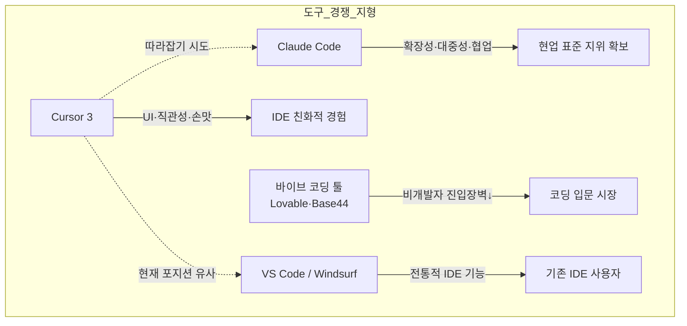
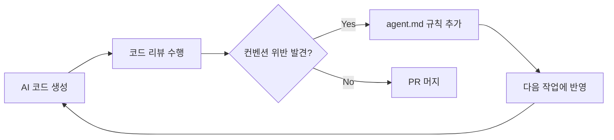
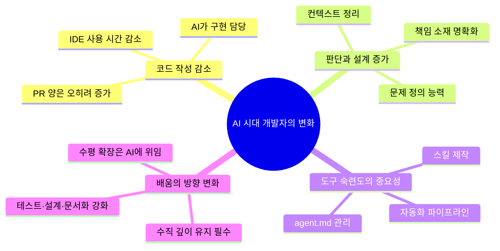

> 요즘IT 연재 2편 심층 분석 — ["개발자의 커서 3 후기, 그들은 왜 따라가기 바쁠까?"](https://yozm.wishket.com/magazine/detail/3732/) + ["코드는 줄고 판단은 남았다: AI 시대 개발자의 일일일"](https://yozm.wishket.com/magazine/detail/3673/)

---

## 서론: 두 글이 맞닿는 지점

요즘IT에 연재된 두 편의 글은 서로 다른 시점에서 동일한 현상을 바라본다. 한 편은 도구(Cursor 3)에 대한 현장 후기이고, 다른 한 편은 도구를 사용하는 인간(개발자)에 대한 인터뷰다. 두 글을 함께 읽으면 하나의 선명한 윤곽이 드러난다. AI 코딩 도구의 폭발적 성장 속에서 개발자의 역할이 어떻게 재편되고 있는지, 그리고 도구가 그 변화를 어떻게 따라가거나 실패하고 있는지의 이야기다.

저자 '핸디'는 약 2년간 Cursor를 애용해온 현업 개발자다. 회사 비용 지원 없이도 개인 비용으로 구독을 유지할 만큼 Cursor에 애착이 있었고, 특히 Tab 자동완성 기능을 통해 "코드를 한발 먼저 읽고 길을 알려주는 선지자"의 경험을 했다고 묘사한다. 그런 그가 Cursor 3 출시 후 2주간 Claude Code를 내려놓고 Cursor 3만으로 사이드 프로젝트를 진행했다. 조건은 기본 설정 그대로, 20달러 요금제 유지다.

---

## 1부: Cursor 3의 새로운 기능 — Agent Window를 중심으로

### Agent Window: IDE를 벗어난 새로운 인터페이스

Cursor 3의 핵심은 **Agent Window**다. 기존 IDE 환경 안에서 대화 패널을 통해 에이전트와 소통하던 방식에서 벗어나, 에이전트 전용 독립 인터페이스를 별도로 만들었다는 것이 핵심 변화다. 이는 단순한 UI 개선이 아니라 "에이전트를 사용하는 행위" 자체를 IDE와 분리하겠다는 방향성 선언에 가깝다.

저자는 이 인터페이스에서 세 가지 주목할 만한 변화를 발견한다.

### 1-1. 정돈된 GUI: CLI와 GUI 사이의 선택

개발자 커뮤니티 안에서도 CLI(Command-Line Interface)와 GUI(Graphical User Interface)에 대한 선호는 갈린다. 저자는 젊은 연차이거나 프론트엔드 성향에 가까울수록 직관적인 GUI를 선호하는 경향이 있다고 본다. 이 관점에서 기본 설정 상태의 Claude Code 터미널은 "상당히 거칠게 느껴졌다"고 평한다.

반면 Cursor 3의 Agent Window는 무난하고 부드러운 정돈된 UI를 제공한다. 슬래시(/) 인터페이스로 명령을 입력할 때의 흐름, 코드 변경 사항을 시각적으로 보여주는 Diff 인터페이스 모두 깔끔하다. 다만 테마가 현재 3개밖에 지원되지 않는다는 점은 아쉬운 대목이다. VS Code 포크인 만큼 다양한 테마를 기대했지만 그 기대는 충족되지 않았다.

한 가지 특이한 점은 **단방향 대화 공유**다. IDE 모드에서 생성한 대화는 Agent Window에서도 확인 가능하지만, Agent Window에서 시작한 대화는 IDE 모드에서 보이지 않는다. 두 인터페이스가 완전히 통합된 것이 아님을 보여주는 설계적 한계다.

### 1-2. 페어 프로그래밍 인터페이스의 초안

두 번째 글에 등장하는 40년 차 빅테크 개발자는 현재 AI와 함께하는 개발 방식을 "페어 프로그래밍"에 비유한다. 코드를 제안하고, 리팩토링을 제안하고, 테스트를 작성하고, 구조를 정리하는 AI는 이미 페어 프로그래머처럼 작동한다는 것이다. 그리고 Cursor 3에는 그 개념을 인터페이스로 구현한 초안이 등장한다.

현재는 코드 Diff를 보여주는 수준에 머물지만, 저자는 이 방향이 진화하면 특정 라인 단위로 Agent가 리뷰를 수행하는 형태가 될 것이라 예상한다. AI가 대규모 코드를 생성하는 시대에, 변경 사항 전체를 개발자가 검토하기보다 라인 단위의 작은 PR 리뷰처럼 이해할 수 있게 해주는 구조다. "우리 모델은 빠르고 코딩에 특화되어 있다"는 Cursor의 강점이 코드 리뷰 영역에서도 발휘될 수 있다는 가능성을 저자는 개인적으로 흥미롭게 바라본다.

### 1-3. 타일형 레이아웃: IDE의 흔적 유지

타일형 레이아웃은 전통적인 IDE에서 제공하는 창 분할 기능이다. Agent Window라는 독립적인 에이전트 인터페이스를 표방하면서도, 코드 편집 창과 에이전트 대화 창을 나란히 배치할 수 있어 IDE의 모습을 유지하고 있다.

저자에게 이 기능은 "익숙하면서도 당연히 있어야 하는 기능"으로 느껴졌다. Claude Code와 tmux/cmux 조합을 이미 사용해왔기 때문이다. cmux는 Claude Code의 멀티 패널 레이아웃을 지원하는 도구로, 터미널 기반 환경에서 타일형 레이아웃을 구성하는 방식이다. Cursor 3는 이를 GUI로 제공하는 셈이다.

---

## 2부: 실제 사용기 — "SEO 개선 포인트를 찾아서 수정하라"

저자가 Cursor 3 테스트를 위해 던진 명령은 "SEO에 대해 무작정 개선 포인트를 찾아서 수정하라"는 열린 지시였다. 에이전트가 자율적으로 코드베이스를 탐색하고 SEO 관련 개선 사항을 식별해 수정하는 전 과정을 Cursor 3에 맡긴 것이다.

### 플랜 모드의 명확화

기존 IDE 모드와 비교했을 때 가장 눈에 띄는 변화는 **플랜 모드의 역할 분리**다. 어떤 에이전트가 무엇을 담당하는지가 더 선명해졌고, 플랜 모드의 결과물은 "Plans > 결과물" 형태로 표시되어 어느 프로젝트에서 생성된 문서인지 즉시 파악할 수 있다. 여러 플랜 모드를 병렬로 실행할 때 어느 플랜이 어느 결과와 연결되는지 직관적으로 추적하기 어려웠던 기존의 불편함이 개선된 것이다.

### 채팅 상태 추적: 개발자의 오래된 불편함 해소

많은 개발자가 AI 코딩 도구에서 느끼는 공통적인 불편함 중 하나는 "채팅이 어디까지 진행됐는지 알 수 없다"는 것이다. Cursor 3는 이를 사이드바에서 시각적으로 해결했다. 완료된 대화, 처리 중인 대화, 워크트리로 분기된 대화, push까지 완료된 대화를 각각 다른 상태로 표시해 한눈에 파악할 수 있게 했다.

### 그룹 커밋과 푸시의 편의성

저자가 Claude Code를 사용하면서 직접 만들어 쓰던 커스텀 스킬이 있었다. 바로 `/grouped-commits`다. 특정 기능을 위한 채팅을 병렬로 실행하다 보면 변경된 파일들을 어떤 기준으로 커밋할지 판단이 필요한 상황이 생긴다. 이 번거로움을 해결하기 위해 저자는 스스로 스킬을 제작했는데, Cursor 3는 이 기능을 기본 UI로 제공한다. 대화가 마무리되면 해당 대화에서 변경된 파일들만 선택적으로 커밋하고 푸시할 수 있는 별도의 인터페이스가 생긴 것이다.

이 지점은 흥미로운 역설을 보여준다. Claude Code 사용자인 저자가 불편함을 느껴 직접 만든 해결책을 Cursor 3가 기본 기능으로 내장했다는 것은, 곧 Cursor의 방향이 이미 시장에서 검증된 니즈를 따라가고 있음을 의미한다.

---

## 3부: Cursor 3 vs Claude Code — 비교 분석

### "특별한 것은 없었다"는 결론의 의미

2주간의 사용 끝에 저자가 내린 결론은 단호하다. "이번 커서 3에는 딱히 특별한 것이 없다." 이 평가가 단순한 실망이 아닌 이유는 그 논리 구조에 있다. 저자가 기술한 Cursor 3의 모든 개선 사항은 다음과 같은 패턴으로 설명된다.

> "기존에 불편함이 있었고 → 이를 다른 방식으로 해결해왔는데 → Cursor에서도 이렇게 해결했다"

즉, Cursor 3는 이미 시장에 존재하던 해결책들을 통합하고 정리한 것이지, 새로운 패러다임을 제시한 것이 아니라는 뜻이다. 저자는 이를 "기존의 날것들이 다양한 방식으로 진화를 거듭하는 와중에, 저 멀리서 '내가 정통이오!' 하며 정리한 느낌"이라고 표현한다. 개성은 사라지고 기능 그 자체만 남았다는 것이다.

### 비교표로 보는 구체적 차이

저자가 작성한 비교표를 기반으로 두 도구의 특성 차이를 정리하면 다음과 같다.

| 구분 | Cursor 3 | Claude Code | 비고 |
|------|----------|-------------|------|
| 가격 정책 | 무승부 | 무승부 | Cursor $20 vs CC $20/$200 |
| 코딩 중 '손맛' | **승리** | 패배 | GUI 기반 인터페이스 우위 |
| 수정 편의성 | **승리** | 패배 | Diff UI, 커밋 UI 등 |
| 직관성 | **승리** | 패배 | 비개발자 친화적 |
| 확장성 | 패배 | **승리** | Claude Code 생태계 |
| 대중성 | 패배 | **승리** | 현업 표준화 추세 |
| 협업 용이성 | 패배 | **승리** | 팀 단위 공유 자료 |

표면상 3:3:1로 무승부처럼 보이지만, 저자는 핵심적인 차이를 강조한다. Cursor가 이긴 3가지는 개인 선호도의 영역이고, Claude Code가 이긴 3가지는 실질적인 코딩 생산성과 팀 협업을 결정하는 요인이라는 것이다.

### 현업 생태계의 현실: Claude Code 중심화

저자가 지적하는 중요한 관찰 포인트는 현업 생태계의 실제 흐름이다. "이미 현업에서는 모든 에이전트가 Claude Code 기준으로 돌아가고 있다. 공유되는 문서와 사용법, 심지어 팁까지 Claude Code를 중심으로 한다." 이는 기술적 성능의 우위를 넘어 **생태계의 표준화**가 진행 중임을 뜻한다.

해커뉴스의 반응도 인용된다. Cursor 사용자들이 Cursor를 쓰는 이유는 IDE스러움에 있는데, 이번 업데이트는 그 방향과 다르게 나아간다는 비판이다. 실제로 코딩하고 싶은 개발자에게 Cursor가 제공해야 할 가치는 에이전트 인터페이스가 아니라 코딩 환경 그 자체였다는 것이다.

저자 본인도 Cursor $20 플랜과 Claude Code $200 플랜을 병행하고 있다고 밝힌다. 즉, 두 도구는 경쟁 관계이기도 하지만 현실에서는 상호 보완적으로 쓰이고 있는 것이다.

### Cursor의 포지셔닝 문제

저자는 Cursor의 현재 위치를 날카롭게 진단한다. 세 방향에서 동시에 압박을 받고 있다는 것이다.

- **위에서**: Claude Code, Codex App 등 본격적인 에이전트 플랫폼
- **아래에서**: Lovable, Base44 등 바이브 코딩 툴(비개발자용)
- **옆에서**: VS Code, Windsurf 등 전통적인 IDE

이 구도에서 Cursor 3의 Agent Window 추가는 위를 향한 도전이지만, 그 시도가 기존 Cursor 사용자들이 원하던 방향(더 나은 IDE 경험)과 어긋났다는 점이 핵심 문제다. IDE에서 벗어나려는 시도가 오히려 정체성 혼란을 일으킨 셈이다.

---

## 4부: 개발자의 변화하는 일상 — 세 인터뷰

두 번째 글은 세 명의 현직 개발자 인터뷰를 통해 AI 시대 개발자의 실제 변화를 포착한다.

### 인터뷰 1: 40년 차 미국 빅테크 프린시펄 엔지니어

아마존을 포함한 여러 빅테크에서 시스템을 설계하고 현재도 프린시펄 엔지니어로 재직 중인 그는 AI를 처음 보는 기술로 받아들이지 않는다. 80년대 개발을 시작할 때도 AI는 이미 핫한 토픽이었다. Smalltalk 머신도 존재했다. 차이는 당시에는 연산 능력과 데이터가 부족했을 뿐이라는 것이다.

그는 현재 AI와의 작업 방식을 **페어 프로그래밍**으로 정의한다. 연차가 쌓일수록 함께 페어 프로그래밍 하자고 찾아오는 사람이 없어지는데, 이제는 AI가 그 자리를 채운다는 것이다. 코드 제안, 리팩토링, 테스트 작성, 구조 정리, 문서 작성까지 AI는 이미 페어 프로그래머처럼 작동한다.

그러나 그는 핵심적인 차이를 강조한다. **AI는 비판하지 않는다.** 사람과의 페어 프로그래밍에서는 의견 충돌과 논쟁이 오가며 코드가 완성되는데, AI는 반박을 받으면 대부분 수용적으로 돌아선다. 이 때문에 코드 리뷰 에이전트에 "무조건 반대하는 입장에서 코드를 리뷰하라"는 역할을 부여하는 시도도 나오고 있다.

준비에 대한 그의 조언은 명확하다. "질문하는 법을 배워라." AI의 결과 품질은 질문과 설계의 품질에 달려 있으며, 이 원칙은 40년 전에도 같았다. 달라진 것은 이제 그 '좋은 질문'이 주니어도 익혀야 할 핵심 역량이 되었다는 점이다. 전통적으로 시니어의 영역이었던 문제 정의, 설계, 역할 분배가 이제는 모든 개발자에게 요구된다.

그가 우려하는 또 하나는 **주니어의 초기 고통 부재**다. 버그를 추적하며 스택을 따라 내려가는 경험, 잘못된 설계로 장애를 내보고 복구하는 경험, 이런 감각은 자동으로 생기지 않는다. 하지만 그 대안으로 AI를 금지하는 것이 아닌, "AI와 함께 버그를 추적하며 설계해보면 된다"는 방향을 제시한다.

그에게 AI는 "만능 도구"이며, "장인은 도구를 탓하지 않지만 실력에 좋은 도구까지 더하면 더 빠르고 멀리 갈 수 있다."

### 인터뷰 2: 쿠팡 9년 차 프론트엔드 개발자

여러 스타트업을 거쳐 쿠팡에 합류한 그는 프론트엔드 전문가다. 그의 AI 활용 방식은 매우 체계적이다. 핵심은 `agent.md` 문서를 지속적으로 업데이트하는 것이다. AI가 일관된 방향으로 작업하도록 규칙을 정리하고, AI가 리뷰를 수행하다 컨벤션에 어긋나는 부분이 발견되면 즉시 규칙에 반영한다. 그가 작성하는 PR 중 10%는 오로지 AI를 위한 수정 사항이라고 한다.

흥미로운 사실은, 그가 agent.md에 추가하는 규칙들이 실제로는 그가 입사 초기에 받은 코드 리뷰 내용에서 비롯된다는 것이다. 처음 PR 하나에 30개의 리뷰가 달렸던 경험, 그중 반복되는 패턴들을 `/pr-check` 스킬로 만들어 먼저 걸러내던 습관, 그것이 이제는 AI 에이전트를 위한 규칙 체계로 발전했다.

그는 AI의 강점을 **수평 확장**에서 찾는다. 이전 회사에서 CMS(콘텐츠 관리 시스템)를 구축할 때, puck editor에 필요한 컴포넌트 약 30개를 AI 도움을 받아 3일 만에 완성했다. 이전이라면 컴포넌트 하나당 며칠씩 걸렸을 작업이다. "같은 구조를 여러 곳에 적용해야 할 때 AI는 압도적으로 빠르다."

그로부터 도출되는 개발자의 역할론은 명확하다. "AI가 수평 확장을 담당한다면, 개발자가 할 일은 수평 확장이 가능하도록 수직 확장의 토대를 마련하는 것이다."

AI에 생성된 코드를 책임지는 방식으로 그가 선택한 것은 **테스트 코드**다. AI 도입 이후 테스트 코드가 3배 증가했지만, 그는 테스트가 단순히 늘어나는 것이 아니라 유의미한 개수로 유지되어야 한다고 본다. 테스트가 많아질수록 CI/CD 시간이 늘어나고 리팩토링에도 부정적인 영향을 미치기 때문이다. 그래서 5권의 테스트 관련 서적을 구입해 깊이 공부하고, 그 지식을 바탕으로 테스트 코드를 위한 agent.md를 작성하는 것을 목표로 한다.

"AI를 신뢰하는 것과 판단을 위임하는 것은 다르다." — 그의 핵심 철학이다.

그리고 그는 현재 대화 내용에서 스킬이나 룰로 만들 수 있는 것을 추출하도록 AI에게 명령하는 방식으로 `/create-skills` 스킬을 커스텀하고 있다. 스킬을 만들기 위한 스킬, 재귀적 구조로 AI 활용 체계를 발전시키는 것이다.

### 인터뷰 3: 네이버 12년 차 백엔드 개발자 겸 초보 매니저

프론트엔드에서 시작해 백엔드를 거쳐 현재는 풀스택으로 일하고 있으며, 최근 매니저 역할도 시작한 그는 올해(인터뷰 기준 3월 초) 들어 IDE를 거의 열지 않았다고 말했다. 그러면서 스스로 소름이 끼쳤다고 덧붙인다.

그러나 IDE를 켜지 않는다고 해서 개발을 하지 않는 것이 아니다. 오히려 PR 양은 이전보다 늘었다. 그는 Claude Code를 주로 사용하며, 문서와 지라 티켓에 상세하게 작성된 PRD(제품 요구사항 정의서)를 Claude Code가 알아서 가져와 백엔드 코드를 작성하게 한다.

그가 제시하는 흥미로운 인사이트는 **AI가 생산성을 10배, 100배 높였다는 느낌이 아니라는 것**이다. 이유는 단순하다. 코딩 그 자체는 원래부터 가장 많은 시간을 차지하는 일이 아니었다. 컨텍스트 정리, 문서화, 여러 문서를 읽고 역할과 책임(R&R)을 정리하는 일이 항상 더 많은 시간을 차지했다. AI가 바꾼 것은 그 문서화 작업이 이제 직접적으로 개발 속도를 높이는 효과를 낸다는 점이다. 즉, AI 이전에는 문서가 개발자들의 커뮤니케이션 비용을 줄이는 용도였다면, 이제는 AI가 잘 일하게 만드는 Plan 문서로도 기능한다.

매니저로서 그는 지라 티켓 관리 자동화를 Claude Code로 구현했다. 특정 작업을 시작하겠다고 하면 Claude Code가 다음 세 가지를 자동으로 처리한다.

1. 지라 티켓 status 변경
2. 지라 티켓 번호를 포함한 브랜치 설정
3. 해당 브랜치를 기반으로 GitHub draft 작성

하루에 한 번씩 실행되는 일정 관리 크론잡도 있다. 지라 티켓, GitHub 정보, 일정 정보를 종합해 업무 진행 현황을 자동으로 알려주는 스크립트다. 그리고 하루 작업 내용을 바탕으로 성과 관리 문서를 자동 생성해 주간·월간·분기 단위로 자신의 성과를 축적하고 있다.

그는 AI 활용을 vim 수련에 비유한다. 학생 시절 마우스 없이 코딩하는 연습을 하고, vim을 익히는 데 시간을 투자했듯, AI도 시간을 들여 익혀야 하는 도구라는 것이다. 하네스 엔지니어링, AI 오케스트레이션 같은 개념도 공부하고 있지만, 변화 속도가 너무 빠르다는 불안감도 솔직하게 털어놓는다. "그래도 어쩌겠습니까? 다들 AI라는 비행기를 타고 날아가고 있는데, 저만 뛰어갈 수는 없잖아요."

---

## 5부: 세 인터뷰가 수렴하는 결론

세 명의 개발자 인터뷰를 관통하는 공통 주제를 정리하면 다음과 같다.

세 사람이 서로 다른 포지션과 연차에서 동일하게 강조하는 것이 있다. **무엇을 만들지 결정하고 그 책임을 지는 일은 여전히 사람의 몫**이라는 것이다. AI는 일을 더 빠르게 만들어주는 도구이지만, 방향 설정과 책임은 인간에게 남아 있다.

그리고 이 관찰은 Cursor 3 평가로 자연스럽게 연결된다. 개발자들이 도구에게 요구하는 것은 단순히 에이전트 인터페이스가 아니다. 그들이 판단하고 책임지는 과정을 더 효율적으로 지원하는 것이다.

---

## 6부: SpaceX-Cursor 딜 — 최신 업데이트 (2026년 4월)

글이 공개된 직후, Cursor를 둘러싼 상황은 급격하게 변화했다. 2026년 4월 21일, SpaceX는 AI 코딩 도구 Cursor를 올해 안에 600억 달러(한화 약 82조 원)에 인수할 권리를 획득하거나, 공동 작업에 대한 대가로 100억 달러를 지불하는 계약을 체결했다고 발표했다.

### 딜의 구조

SpaceX는 Cursor를 2026년 말까지 600억 달러에 인수하거나, xAI의 Colossus 슈퍼컴퓨터를 활용한 컴퓨팅 및 협업 파트너십에 100억 달러를 지불하는 두 가지 선택지를 확보했다. 이 계약은 Andreessen Horowitz, Thrive Capital, Nvidia가 참여하는 500억 달러 밸류에이션의 20억 달러 펀딩 라운드를 선점하는 형태로 체결되었으며, Microsoft도 인수를 검토했다가 포기한 것으로 알려졌다.

SpaceX는 인수를 2026년 말까지 완료하지 않을 경우 100억 달러의 위약금을 Cursor 측에 지불해야 한다.

### 딜의 배경: 양측의 계산

Cursor는 컴퓨팅 상한선과 동시에 경쟁 모델 제공업체들로 인한 마진 압박에 직면해 있었고, SpaceX는 역대 최대 규모를 목표로 하는 IPO를 앞두고 AI 수익원과 신뢰성이 필요한 상황이었다.

Elon Musk는 2월에 SpaceX와 xAI를 합병했으며, 합산 기업가치를 1.25조 달러로 평가했다. 그는 IPO를 앞두고 AI 경쟁자인 OpenAI의 Codex, Anthropic의 Claude Code를 따라잡기 위한 수단으로 Cursor를 선택했다.

SpaceX는 인프라와 컴퓨팅 용량을 제공하고, Cursor는 실제 AI 제품과 소프트웨어 엔지니어들에게 축적된 코딩 데이터를 제공하는 구조다. 이는 SpaceX의 Starlink와 Starship 소프트웨어에도 활용되고, xAI가 경쟁 AI 모델 대비 격차를 줄이는 데도 기여할 것으로 보인다.

### 기존 Cursor 사용자에게 미치는 영향

Cursor를 사용 중인 기업 고객들은 약 6개월간의 벤더 정체성 불확실성에 직면하게 됐으며, 모델 중립성 가정과 데이터 흐름 배치가 재협상 대상이 될 수 있다.

이 딜은 글의 결론에 예상치 못한 후기를 붙인다. 저자가 "Fast Follower 같은 기능은 아니면 좋겠다"며 아쉬워하던 Cursor가, SpaceX/xAI라는 완전히 다른 궤도 위에서 새로운 국면을 맞이하게 된 것이다. Cursor가 스페이스X와 결합해 어디로 향할지, 기존 팬들이 기대했던 "IDE의 진화"가 이 딜 안에서 어떻게 자리를 잡을지는 두고 볼 일이다.

---

## 종합 진단: 도구와 인간 사이의 간극

두 글을 합쳐서 읽으면 하나의 구조적 긴장이 드러난다.

**개발자들은 이미 변하고 있다.** 코드를 덜 쓰고, 컨텍스트를 더 정리하고, AI를 위한 규칙을 만들고, 테스트로 책임을 담보하고, 자동화로 반복을 제거한다. 그들의 가치는 구현에서 설계와 판단으로 이동하고 있다.

**도구는 그 변화를 따라가고 있다.** 하지만 Cursor 3의 사례는 "따라간다"는 것이 반드시 옳은 방향으로 가는 것을 의미하지 않음을 보여준다. 사용자들이 원하는 것을 파악하는 것과, 경쟁자를 따라잡으려는 충동 사이에서 길을 잃으면 결과적으로 누구의 요구도 충족하지 못하는 중간 지점에 서게 된다.

그리고 SpaceX-Cursor 딜은 이 모든 논의에 새로운 변수를 던졌다. 컴퓨팅 인프라의 제약에서 벗어난 Cursor가 어떤 방향을 선택할지, IDE의 정체성을 지킬지 에이전트 플랫폼으로 전환할지, 그것이 앞으로의 진짜 질문이 될 것이다.

---

*작성일: 2026년 5월 6일*

*참고 자료: 요즘IT "개발자의 커서 3 후기, 그들은 왜 따라가기 바쁠까?" (2026.05), "코드는 줄고 판단은 남았다: AI 시대 개발자의 일일일" (2026.04), Bloomberg, CNBC, Fortune, Futurum Group — SpaceX-Cursor 딜 관련 보도 (2026.04.21~)*
