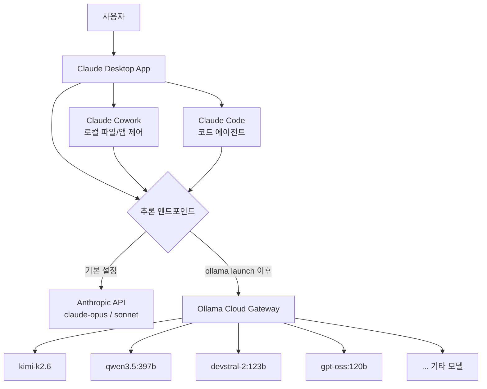
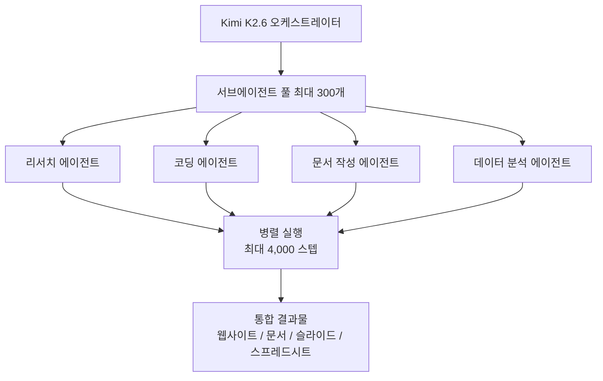
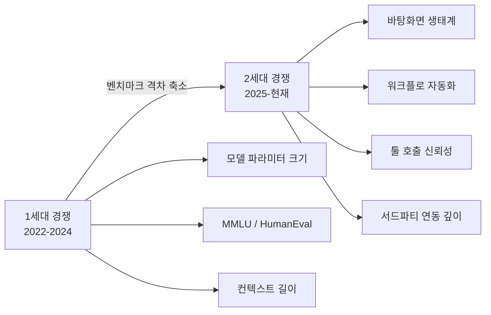
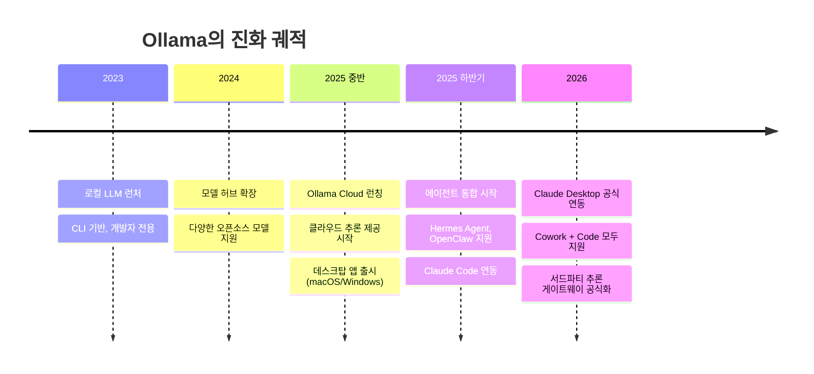
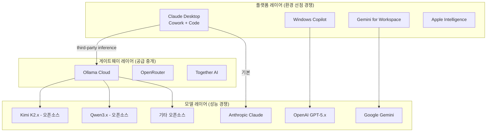

> AI 업계의 전장이 '모델 성능'에서 '작업 환경 장악'으로 이동하고 있다. Ollama의 Claude Desktop 연동은 그 전환점을 상징하는 사건이다.

## 관련글

[**클로드의 껍데기에 다른 AI의 뇌를 끼워 넣는 일이 마침내 공식적으로 가능해졌습니다**](https://www.threads.com/@choi.openai/post/DX9Gm_LD_MM)

---

## 1. 사건의 개요: 무슨 일이 벌어졌나

2026년 5월, Ollama가 [공식 문서](https://docs.ollama.com/integrations/claude-desktop)를 통해 **Claude Desktop과의 네이티브 연동**을 발표했다. 핵심은 단 하나의 명령어다.

```bash
ollama launch claude-desktop
```

이 한 줄이 실행되면, Claude Desktop 앱은 Anthropic 모델 대신 **Ollama Cloud에 등록된 외부 모델들을 추론 엔진으로 사용**하도록 재구성된다. Claude의 인터페이스, 도구 호출 체계, 에이전트 파이프라인은 그대로 유지되면서, 그 안을 채우는 '두뇌'만 교체되는 것이다.

원상복구도 간단하다.

```bash
ollama launch claude-desktop --restore
```

이 명령어 하나로 다시 Anthropic 기본 모델로 돌아온다.

---

## 2. 스크린샷 해설: Claude Desktop의 모델 선택 드롭다운

연동이 완료된 Claude Desktop에서 모델 선택 드롭다운을 열면, Anthropic 모델 대신 Ollama Cloud에서 제공하는 다양한 모델 목록이 나타난다. 현재 확인된 목록은 다음과 같다.

| 모델명 | 출처 | 특징 |
|---|---|---|
| **kimi-k2.6** ✓ | Moonshot AI | 장기 에이전트, 300 서브에이전트 스웜 |
| kimi-k2-thinking | Moonshot AI | K2.6 사고 모드 변형 |
| gpt-oss:120b | OpenAI (오픈소스) | 120B 파라미터 오픈소스 GPT |
| ministral-3:14b | Mistral AI | 14B 경량 추론 모델 |
| devstral-2:123b | Mistral AI | 코딩 특화 대형 모델 |
| qwen3.5:397b | Alibaba Cloud | 397B MoE 추론 모델 |
| nemotron-3-super | NVIDIA | NVIDIA 자체 LLM |
| qwen3-vl:235b | Alibaba Cloud | 멀티모달 비전-언어 모델 |
| minimax-m2.5 | MiniMax | 대용량 멀티모달 모델 |
| ministral-3:8b | Mistral AI | 8B 초경량 변형 |
| glm-4.7 | Zhipu AI | 중국계 최신 범용 모델 |
| minimax-m2.1 | MiniMax | M2.5 경량 변형 |

이 목록이 의미하는 바는 단순한 호환성 그 이상이다. **Claude라는 '플랫폼'이 모델 제공자에 중립적인 실행 환경으로 전환되고 있다**는 신호다.

---

## 3. 기술 구조: 어떻게 작동하는가

### 3.1 Ollama의 Third-Party Inference 게이트웨이

이번 연동의 핵심 기술은 Claude Desktop이 내장한 **서드파티 추론(Third-Party Inference) 지원**이다. Anthropic은 Claude Desktop 내부에 외부 추론 엔드포인트를 연결할 수 있는 구조를 공개했으며, Ollama는 이 게이트웨이에 Ollama Cloud를 연결한 것이다.



### 3.2 모델 자동 검색

설정 완료 후 Claude Desktop은 Ollama Cloud에서 사용 가능한 모델 목록을 **자동으로 검색(autodiscovery)** 한다. 별도의 수동 설정 없이도 드롭다운에 모델이 채워지는 이유다.

```bash
# API 키 설정 (한 번만)
export OLLAMA_API_KEY=your_api_key

# 설정 미리보기 (앱 재시작 없이)
ollama launch claude-desktop --config

# 자동 재시작 포함
ollama launch claude-desktop --yes
```

### 3.3 현재 지원 범위와 한계

Ollama 공식 문서에 명시된 **지원 항목**은 다음과 같다.

- Ollama Cloud를 서드파티 추론 게이트웨이로 사용
- 모델 자동 검색
- **Claude Cowork**에서 Ollama Cloud 모델 사용
- **Claude Code (Claude Desktop 내)** 에서 동일 모델 사용
- 서브에이전트가 현재 모델을 상속하도록 지시 가능

반면 **아직 지원되지 않는 항목**도 존재한다.

- 웹 검색(Web Search)
- 확장 기능(Extensions)

즉, Cowork의 핵심 기능인 로컬 파일 접근, 앱 제어, 자율 실행은 외부 모델로도 가능하지만, 실시간 웹 연동과 플러그인 생태계는 아직 Anthropic 모델에 종속되어 있다.

---

## 4. Kimi K2.6: 왜 이 모델이 대표 사례인가

스크린샷과 Ollama 공식 문서 모두 **Kimi K2.6**을 대표 예시로 제시한다. 이는 우연이 아니다. Kimi K2.6은 현재 오픈 웨이트 모델 중 에이전트 워크플로에서 가장 높은 성능을 보여주는 모델 중 하나이기 때문이다.

### 4.1 모델 아키텍처

Moonshot AI가 2026년 4월 20일 공개한 Kimi K2.6은 다음 구조를 가진다.

- **총 파라미터**: 1조 (1T) — Mixture-of-Experts(MoE) 구조
- **활성 파라미터**: 토큰당 32B
- **전문가 수**: 384개 (토큰당 8개 활성화)
- **컨텍스트 윈도우**: 262,144 토큰 (262K)
- **라이선스**: Modified MIT (완전 오픈 웨이트)

### 4.2 K2.6의 핵심 역량: 에이전트 스웜

K2.6이 이전 버전 대비 가장 크게 진화한 부분은 **에이전트 스웜(Agent Swarm)** 아키텍처다.

| 항목 | K2.5 | K2.6 |
|---|---|---|
| 최대 서브에이전트 수 | 100개 | **300개** |
| 최대 조율 스텝 수 | 1,500 | **4,000** |
| 지속 실행 시간 | 수 시간 | **12시간+** |
| 컨텍스트 압축 | 수동 | **자동 요약/압축** |



### 4.3 벤치마크 성과

- **SWE-Bench Verified**: 80.2% — 실제 소프트웨어 엔지니어링 이슈 해결
- **SWE-Bench Pro**: 58.6%
- **DeepSearchQA F1**: 92.5%
- **Terminal-Bench 2.0**: 66.7%

Rust, Go, Python 등 다양한 언어와 프론트엔드부터 DevOps까지 광범위한 스택을 처리할 수 있으며, K2.6이 Zig라는 매우 희소한 언어로 모델 추론 코드를 직접 최적화하는 데 성공했다는 사례는 그 일반화 능력을 잘 보여준다.

---

## 5. 플랫폼 전쟁의 새 국면: 생태계 선점

### 5.1 모델 성능에서 워크플로 장악으로

이번 연동이 단순한 기술 업데이트가 아닌 이유가 여기 있다. AI 업계는 오랫동안 "어느 모델이 더 똑똑한가"를 두고 벤치마크 전쟁을 벌여왔다. 그러나 Kimi K2.6, Qwen3.5, devstral 등 오픈소스 모델들이 클로즈드 소스 프론티어 모델과 대등한 성능을 보이기 시작하면서, **모델 성능만으로는 차별화가 어려워지는 시대**가 도래하고 있다.

그렇다면 다음 전장은 어디인가. 답은 **사용자의 작업 환경(Work Environment)** 이다.



### 5.2 Claude Desktop이 선점한 것

Claude의 Cowork와 Code는 현재 가장 성숙한 **데스크탑 에이전트 환경** 중 하나다. 로컬 파일 시스템 접근, 앱 제어, 능동적 작업 실행이 하나의 UI 안에 통합되어 있다.

Ollama의 이번 연동은 이 환경에 **모델 중립성**을 부여한다. 사용자는 Claude라는 실행 환경에 익숙해지면서, 그 안에서 가장 적합한 모델을 자유롭게 교체할 수 있게 된다. 이는 다음과 같은 함의를 갖는다.

첫째, **사용자 잠금(User Lock-in)의 층위 분리**다. 과거에는 모델사가 플랫폼과 모델을 동시에 소유하면서 사용자를 묶었다. 이제 플랫폼(Claude Desktop)과 모델은 분리될 수 있으며, 사용자는 플랫폼에는 의존하지만 모델에는 독립성을 가질 수 있다.

둘째, **Anthropic의 전략적 우위 재정의**다. 모델 성능이 평준화될수록 Claude의 가치는 Opus/Sonnet 자체보다, Cowork와 Code가 구현하는 **에이전트 실행 인프라**에서 나올 가능성이 높다.

셋째, **오픈소스 모델에 대한 접근 민주화**다. Kimi K2.6, Qwen3.5 같은 고성능 오픈소스 모델이 친숙한 Claude UI를 통해 사용 가능해지면서, 개인 개발자와 중소 팀의 선택지가 대폭 넓어진다.

### 5.3 Ollama의 포지셔닝 진화

Ollama는 본래 로컬에서 오픈소스 LLM을 실행하는 CLI 도구로 출발했다. 2025년 이후 Ollama는 단계적으로 **클라우드 추론 게이트웨이**로 영역을 확장해왔다.



Ollama는 이제 단순히 모델을 실행하는 도구가 아니라, **AI 에이전트 인프라의 모델 공급 레이어**로 스스로를 재정의하고 있다. Claude Desktop, OpenClaw, Hermes Agent, VS Code, JetBrains 등 주요 개발 도구들이 모두 Ollama를 통해 모델을 공급받을 수 있게 되는 구조가 형성되고 있다.

---

## 6. 실무적 의미: 무엇이 달라지는가

### 6.1 개발자/엔지니어 관점

**비용 구조의 유연화**가 가장 직접적인 변화다. Anthropic의 Opus 수준 모델 사용료 대신, Kimi K2.6이나 Qwen3.5 같은 오픈소스 기반 모델을 Ollama Cloud를 통해 저렴하게 사용하면서도 Claude의 에이전트 인프라를 그대로 활용할 수 있다.

**태스크별 모델 최적화**도 가능해진다. 코딩 작업에는 devstral-2:123b, 추론 집약 작업에는 kimi-k2-thinking, 빠른 응답이 필요한 경우 ministral-3:8b 같은 식으로 업무 성격에 따라 모델을 전환하는 전략이 현실적으로 가능해졌다.

### 6.2 AI 생태계 관점

**모델-플랫폼 분리(Decoupling)** 가 가속화된다. 이는 마치 스마트폰에서 앱스토어와 운영체제가 분리된 것처럼, AI 실행 환경과 AI 모델이 독립적으로 발전하는 구조로 귀결될 수 있다.

**플랫폼 전쟁의 구도 재편**도 뒤따른다. 현재 AI 플랫폼 경쟁에서 관건은 "어느 모델이 가장 강한가"가 아니라, "어느 실행 환경이 사용자의 일상 워크플로에 가장 깊이 침투했는가"로 이동하고 있다. Claude Desktop, Windows Copilot, Gemini for Workspace, Apple Intelligence가 각자 데스크탑 생태계 선점을 다투는 이유가 바로 이것이다.

### 6.3 경쟁 지형



이 구조에서 Ollama는 플랫폼과 모델 사이의 **중개 게이트웨이 레이어**를 장악하는 포지션을 노리고 있다. 가장 똑똑한 모델은 계속 바뀌겠지만, 어떤 모델이든 공급할 수 있는 인프라를 가진 플랫폼이 생존 가능성이 높다.

---

## 7. 현재의 한계와 향후 전망

### 7.1 현재 한계

이번 연동이 강력하긴 하지만, 아직 완전하지 않다. 가장 두드러진 제약은 **웹 검색과 확장 기능(Extensions)의 미지원**이다. 현실 업무에서 실시간 정보 검색은 필수적인 경우가 많고, Claude의 확장 기능 생태계는 Cowork의 범용성을 크게 높여주는 요소다. 이 두 가지가 외부 모델로 지원되지 않는 한, 완전한 대체는 어렵다.

또한 외부 모델을 사용할 경우 Anthropic의 **안전 필터, 가이드라인, 하모닉 튜닝**이 적용되지 않는다는 점도 기업 환경에서는 고려 사항이 된다.

### 7.2 향후 전망

단기적으로는 Ollama가 웹 검색 도구 지원을 Claude Desktop 연동에 추가하는 방향으로 발전할 가능성이 높다. Ollama는 이미 독립적인 웹 검색 기능을 보유하고 있으며, 이를 Claude Desktop 연동 레이어에 통합하는 것은 기술적으로 가능하다.

중기적으로는 이 모델-플랫폼 분리 흐름이 가속화되면서, AI 실행 환경 자체의 경쟁이 격화될 것으로 보인다. Claude Desktop이 외부 모델을 허용한 것처럼, 다른 플랫폼들도 비슷한 개방 전략을 택하거나, 반대로 더 강한 수직 통합으로 대응하는 양극화가 예상된다.

장기적으로는 **하네스 엔지니어링(Harness Engineering)** 의 중요성이 더욱 부각될 것이다. 모델이 교체 가능해질수록, 그 모델을 효과적으로 조율하는 에이전트 실행 환경의 설계 역량이 핵심 경쟁력이 된다. 단순히 어떤 모델을 쓰느냐보다, 어떤 하네스 위에서 어떻게 운영하느냐가 결과를 가른다.

---

## 8. 요약

Ollama의 Claude Desktop 연동은 단순한 호환성 업데이트가 아니다. 이것은 AI 산업의 지각 변동을 압축적으로 보여주는 사건이다. 모델 성능 경쟁은 이미 충분히 치열했고, 그 결과 오픈소스조차 클로즈드 소스 프론티어 모델을 추격할 만큼 강해졌다. 이제 진짜 싸움은 사용자의 바탕화면, 일상 워크플로, 실무 생태계를 누가 더 깊이 장악하느냐에서 벌어진다.

클로드의 껍데기에 킴이의 두뇌를 끼워 넣을 수 있게 된 지금, "가장 좋은 AI"는 모델의 문제가 아니라 생태계의 문제가 되어가고 있다.

---

*작성일: 2026년 5월 6일*