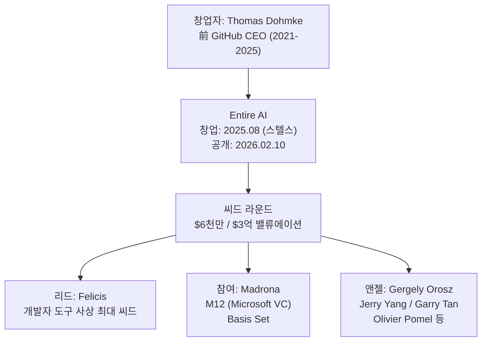
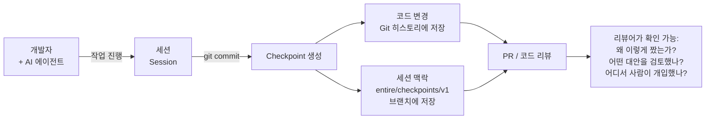
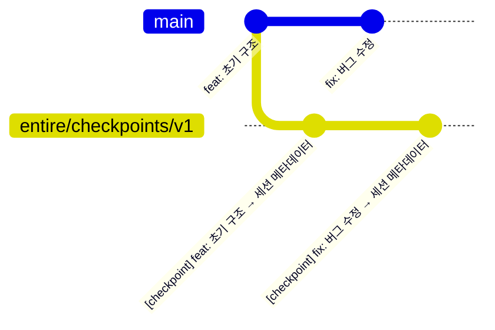
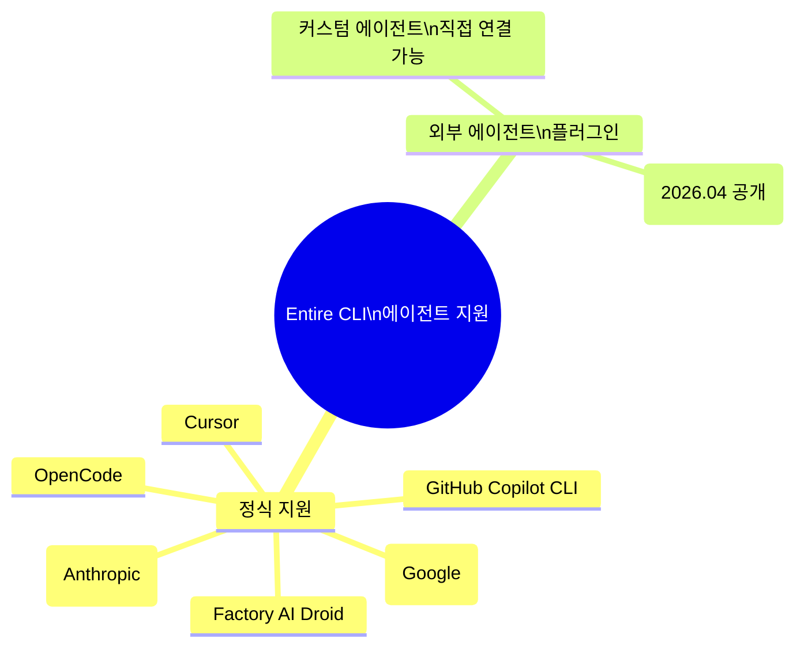
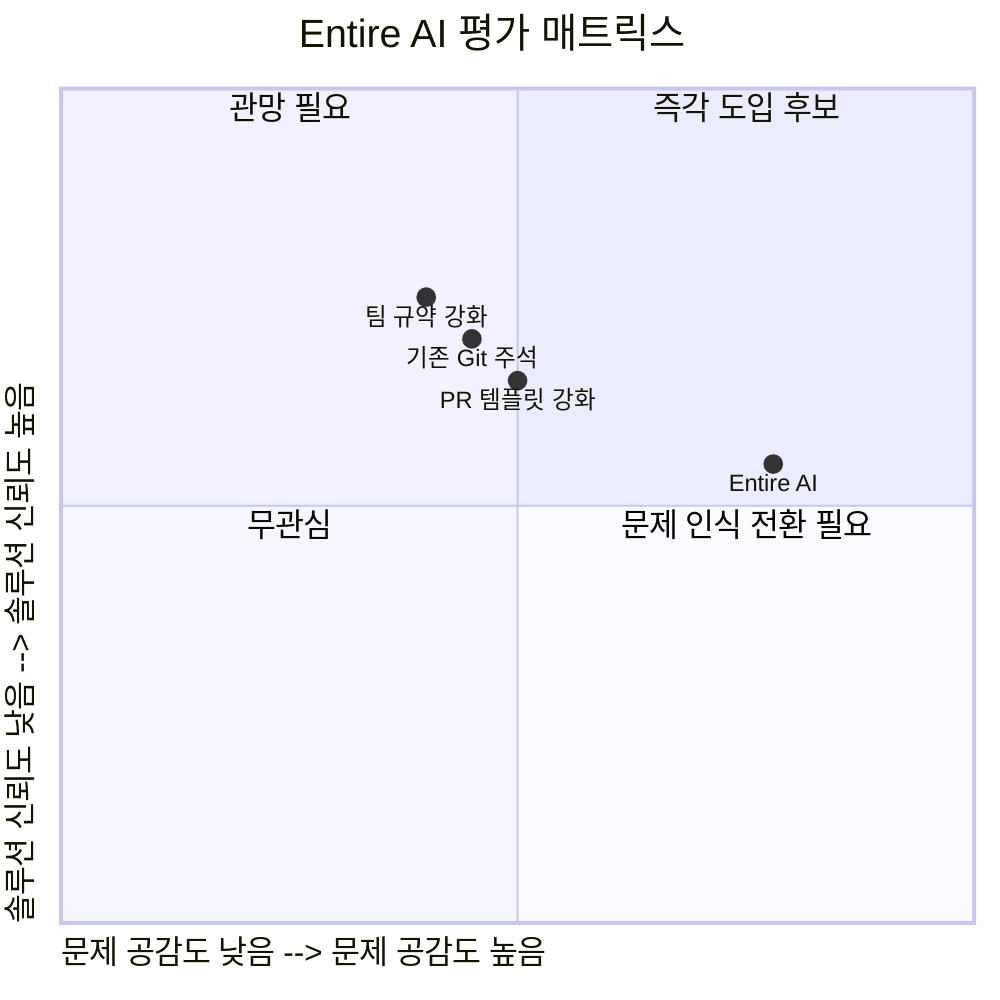
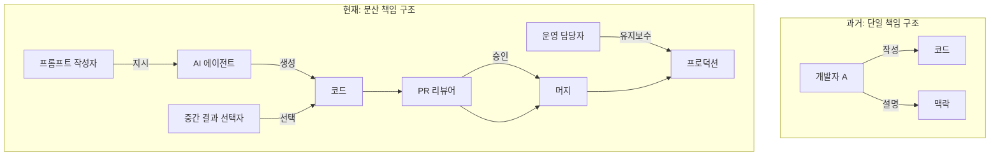
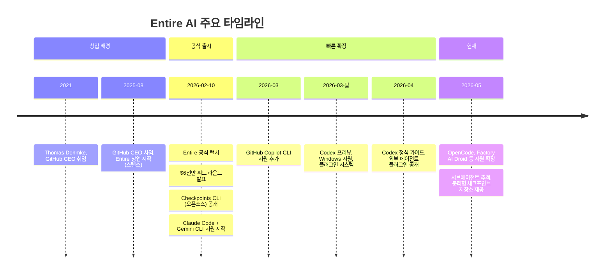

## — Entire AI와 '맥락 관리' 시대의 도래에 대한 심층 분석

> **원문 출처**: [요즘IT — 개발자H, 2026.05.06](https://yozm.wishket.com/magazine/detail/3741/)  
> **보충 리서치**: Entire AI 공식 발표, TechCrunch, GeekWire, The New Stack, GitHub CLI 저장소 등

---

## 목차

1. [들어가며: 속도는 올라갔는데, 왜 개발은 더 힘들어졌나](#1)
2. [생산성의 역설 — AI가 빠를수록 팀은 더 느려진다](#2)
3. [병목은 '생성'이 아니라 '맥락 관리'로 이동했다](#3)
4. [Entire AI의 탄생 — 누가, 왜, 어떻게 만들었나](#4)
5. [Checkpoints: 핵심 제품의 작동 원리](#5)
6. [기술 아키텍처 심층 분석](#6)
7. [지원 에이전트 생태계와 확장 로드맵](#7)
8. [개발자 커뮤니티의 반응 — 찬성과 회의론](#8)
9. [더 넓은 그림: 개발팀 운영 방식의 구조적 전환](#9)
10. [살아남는 개발자의 기준이 바뀐다](#10)
11. [종합 평가 및 전망](#11)

---

## 1. 들어가며: 속도는 올라갔는데, 왜 개발은 더 힘들어졌나 {#1}

AI 코딩 도구가 실무에 빠르게 퍼지면서 개발자들이 공통적으로 경험하는 이상한 현상이 있다. 코드를 만들어내는 속도는 분명히 빨라졌다. Copilot, Cursor, Claude Code 같은 도구 덕분에 예전에는 반나절이 걸릴 초안이 몇 분 만에 완성된다. 초안 생성, 테스트 코드 작성, 반복 로직 정리, 간단한 리팩토링까지 이제 사람이 처음부터 끝까지 손으로 짜기보다 방향을 잡아주고 결과를 검토하는 역할에 더 가까워졌다.

그런데 이상하게도 실무의 개발은 기대만큼 쉬워지지 않았다. 오히려 어떤 부분은 더 어려워졌다는 느낌마저 든다. 특히 코드 리뷰, 장애 복기, 인수인계 같은 순간에서 그 괴리가 두드러진다. 코드는 빠르게 나왔지만, 정작 그 코드가 어떤 판단과 시도를 거쳐 여기까지 왔는지는 설명하기 어려운 경우가 많아졌다.

이 글은 그 이상한 감각의 정체를 추적하고, 그 문제를 제품으로 풀어내려는 시도인 **Entire AI**라는 스타트업을 중심으로 '에이전트 시대의 버전 관리'가 어떻게 바뀌고 있는지를 상세하게 서술한다.

---

## 2. 생산성의 역설 — AI가 빠를수록 팀은 더 느려진다 {#2}

### 2.1 개인 생산성의 폭발

2025~2026년을 기점으로 AI 코딩 에이전트는 단순한 자동완성 수준을 넘어섰다. Claude Code는 SWE-bench 기준 80.9%의 성능을 기록하며 실제 소프트웨어 이슈를 자율적으로 해결하고, OpenAI의 Codex CLI는 병렬 에이전트 실행을 지원하며, Google의 Gemini CLI는 100만 토큰에 달하는 장문 맥락 처리 능력을 자랑한다. 개발자 한 명이 여러 터미널 창에서 에이전트 플릿(fleet)을 동시에 지휘하는 광경이 낯설지 않아졌다.

이 변화는 개인 차원의 생산성 지표에서는 극적으로 나타난다. IBM이 8만 명의 개발자를 대상으로 수집한 데이터에 따르면 AI 도구를 통해 45% 수준의 생산성 향상이 보고되고 있다. 하지만 이 수치는 개인 단위의 코드 생성 속도를 기준으로 한 것이다. 팀 단위로 시야를 넓히면 상황이 달라진다.

### 2.2 팀 단위의 이해 비용

AI가 개입한 작업은 기존 작업 방식과 구조적으로 다르다. 예전의 코드 작성 과정은 선형적이었다. 사람이 요구사항을 이해하고, 설계를 고민하고, 손으로 한 줄씩 타이핑했기 때문에 코드와 의도 사이에는 항상 작성자가 존재했다. 모호한 부분이 있으면 그 사람에게 물어보면 됐다.

하지만 에이전트 기반의 작업은 이 관계를 단절시킨다. 프롬프트 몇 줄로 방향이 바뀌고, 그 사이에는 수십 번의 시도가 오가다, 그중 일부만 결과물로 남는다. 결국 Git에는 최종 코드만 기록되고, 그 코드가 왜 그런 형태가 되었는지에 대한 '이유'는 세션이 닫히는 순간 사라진다. 어떤 프롬프트가 주어졌는지, 어떤 설계 방향을 검토했다가 버렸는지, 어디까지가 에이전트의 자율 판단이고 어디서부터 사람이 개입했는지 — 이 모든 맥락이 휘발된다.

```
[ 코드 생성 속도 향상 ]
        ↓
[ Git에는 최종 결과물만 남음 ]
        ↓
[ 리뷰어: "이거 왜 이렇게 짰지?" ]
        ↓
[ 코드 리뷰 = 의도 추리 게임 ]
        ↓
[ 팀 전체의 이해 비용 급증 ]
```

이 현상을 두고 요즘IT의 원문 필자는 "생산성은 올라갔지만, 팀 전체의 이해 비용은 오히려 커지는 셈"이라고 표현했다. 이것이 바로 AI 시대 개발의 역설이다.

### 2.3 코드 리뷰의 위기

리뷰어 입장에서 이 변화는 매우 구체적인 어려움으로 드러난다. 예전의 코드 리뷰는 비교적 단순했다. 사람이 직접 짠 코드라면 작성자와 대화 몇 마디로 맥락을 빠르게 복원할 수 있었다. 하지만 AI가 깊게 개입한 작업은 작성자조차 며칠만 지나면 흐름을 모두 기억하지 못한다. "대충 이렇게 하라고 시켰어요" 정도만 남는 상황이 흔하다.

이런 상태에서 PR을 열면 변경량은 방대한데 설계 선택에 대한 설명은 없고, 리뷰어는 코드만 붙잡고 의도를 역추적해야 한다. 리뷰는 검토가 아니라 탐정 수사에 가까워진다. 생성 속도는 빨라졌지만 리뷰 속도는 오히려 느려지는 역설이 현실이 된다.

---

## 3. 병목은 '생성'이 아니라 '맥락 관리'로 이동했다 {#3}

### 3.1 패러다임 전환의 신호

원문 기사의 핵심 논지는 명확하다. AI 시대 개발에서 진짜 병목은 더 이상 코드를 '만들어내는' 능력이 아니라, 만들어진 코드를 팀이 '이해하고 다룰 수 있게 남기는' 능력이라는 것이다.

이 주장은 단순한 관찰이 아니라 구조적 변화에 근거한다. AI 코딩 에이전트가 확산되면서 개발 프로세스에서 가장 시간이 많이 걸리는 구간이 이동했다. 코드 초안 작성 → 리뷰 → 수정 → 배포로 이어지는 흐름에서, 이제 초안 작성은 압도적으로 빨라졌지만 리뷰와 검증, 인수인계는 오히려 더 오래 걸리게 됐다.


### 3.2 맥락 손실의 세 가지 경로

AI 코딩 세션에서 맥락이 사라지는 경로는 크게 세 가지로 나눌 수 있다.

**첫째, 세션 종료와 함께 사라지는 대화 기록.** AI 에이전트와 나눈 프롬프트와 응답, 여러 차례의 수정 시도와 방향 전환은 대화 세션이 닫히면 기본적으로 어디에도 저장되지 않는다. Git에는 최종 결과물인 코드 diff만 남는다.

**둘째, 선택되지 않은 대안의 소멸.** 에이전트는 작업 과정에서 여러 설계 방향을 내부적으로 시도한다. 그 중 선택된 방향만 코드에 반영되고, 버려진 대안들은 기록되지 않는다. 나중에 "왜 A가 아니라 B를 선택했는가?"라는 질문에 아무도 답하지 못하는 상황이 발생한다.

**셋째, 서브에이전트 호출 체인의 불투명성.** 현대의 에이전트 워크플로우는 하나의 에이전트가 다른 에이전트를 호출하는 중첩 구조로 발전하고 있다. 이 계층적 호출 체인에서 어떤 판단이 어느 레벨에서 내려졌는지 추적하기가 점점 어려워진다.

### 3.3 '왜'를 기록하는 것이 핵심 역량이 된다

이 세 가지 손실 경로를 막는 것, 즉 '왜 그랬는지'를 체계적으로 남기는 것이 이제 팀 단위 개발의 핵심 역량이 됐다. 원문은 이를 "잘 만든 코드보다, 왜 그렇게 만들었는지를 설명할 수 있는 코드가 더 중요해지는" 시대라고 표현한다.

---

## 4. Entire AI의 탄생 — 누가, 왜, 어떻게 만들었나 {#4}

### 4.1 창업자: 토마스 돔케의 배경

Entire AI의 창업자는 **토마스 돔케(Thomas Dohmke)** 다. 그는 2015년 자신의 스타트업 HockeyApp을 Microsoft에 매각한 이후 GitHub에 합류했고, 2021년부터 2025년 8월까지 GitHub의 CEO를 역임했다.

그의 CEO 재임 기간은 GitHub에게 있어 가장 중요한 전환기였다. Copilot을 전략적 중심에 놓고 GitHub를 단순한 코드 저장소에서 AI 중심 개발 플랫폼으로 재편하는 작업을 이끌었다. 2025년 8월, Microsoft CEO 사티아 나델라에게 "다시 창업자로 돌아가 무언가 새로운 것을 만들고 싶다"고 전하며 자리에서 물러났고, 이후 몇 달의 스텔스 모드를 거쳐 2026년 2월 Entire를 세상에 공개했다.

### 4.2 $6천만 달러 씨드 라운드의 의미

2026년 2월 10일, Entire는 공식 런치와 동시에 **$6천만 달러(약 830억 원) 규모의 씨드 라운드** 클로징을 발표했다. 리드 투자자는 실리콘밸리 VC인 Felicis였고, Madrona, Microsoft의 벤처 부문 M12, Basis Set이 참여했다. 개인 투자자로는 The Pragmatic Engineer의 Gergely Orosz, Yahoo 공동창업자 Jerry Yang(AME Cloud Ventures), Y Combinator CEO Garry Tan, Datadog CEO Olivier Pomel 등이 이름을 올렸다.

Felicis는 이 라운드를 **개발자 도구 역사상 최대 씨드 투자**로 공표했다. 기업 가치는 **$3억 달러(약 4,150억 원)** 로 평가됐다. 15명의 풀 리모트 팀이 이 규모의 씨드를 확보했다는 것은 시장이 이 문제의식을 얼마나 심각하게 받아들이는지를 단적으로 보여준다.



### 4.3 창업 철학: "더 똑똑한 AI"가 아닌 "더 잘 관리되는 AI"

Entire가 내세우는 문제의식은 단순하지만 강렬하다. 돔케는 런치 글에서 이렇게 설명했다:

> "우리는 에이전트 붐을 살아가고 있으며, 이제 어떤 인간도 합리적으로 이해할 수 있는 속도보다 더 빠르게 방대한 양의 코드가 생성되고 있다. 진실은, 이슈에서 깃 리포지토리, 풀 리퀘스트, 배포에 이르는 우리의 수동 소프트웨어 생산 시스템은 처음부터 AI 시대를 위해 설계된 것이 아니었다는 점이다."

자동차 산업이 장인 제작 방식에서 이동식 조립 라인으로 전환해 생산 방식 자체를 재설계했듯이, 소프트웨어 개발 라이프사이클(SDLC)도 기계가 코드의 1차 생산자가 된 세상에 맞게 근본적으로 재설계되어야 한다는 것이다. Entire는 바로 그 재설계의 첫 삽을 뜨겠다는 포부를 가지고 탄생했다.

---

## 5. Checkpoints: 핵심 제품의 작동 원리 {#5}

### 5.1 핵심 개념

Entire의 첫 번째 제품은 **Checkpoints**라는 오픈소스 CLI 도구다. 이 도구의 핵심 아이디어는 단 한 문장으로 요약된다: **AI 에이전트가 만들어낸 코드 변경과 그 변경이 만들어진 대화·판단·맥락을 Git 히스토리 안에 함께 저장한다.**

Checkpoint는 단순한 커밋 이상의 정보 단위다. 하나의 Checkpoint에는 다음이 모두 포함된다:

- 전체 대화 트랜스크립트 (프롬프트와 응답)
- 사용된 도구 호출(tool calls) 목록
- 수정된 파일 목록
- 토큰 사용량
- 에이전트가 작성한 부분과 사람이 편집한 부분의 라인 단위 귀속(attribution)
- 타임스탬프와 세션 메타데이터



### 5.2 설치와 사용의 단순함

Entire CLI의 철학 중 하나는 기존 워크플로우에 최소한의 마찰로 끼어드는 것이다. 설치와 활성화는 단 두 단계로 끝난다:

```bash
# 1단계: CLI 설치
curl -fsSL https://entire.io/install.sh | bash

# 2단계: 프로젝트에서 활성화
cd your-project
entire enable
```

이후에는 기존처럼 에이전트를 사용하면 된다. git commit이 실행될 때마다 Entire가 자동으로 세션 데이터를 Checkpoint로 기록한다.

### 5.3 Shadow Branch를 통한 Git 히스토리 보호

가장 영리한 설계 결정 중 하나는 **Shadow Branch**의 활용이다. AI 에이전트가 작업하는 중간 단계마다 커밋을 남기면 Git 히스토리가 노이즈로 가득 찰 것이다. Entire는 이 문제를 다음과 같이 해결한다:

1. 에이전트가 작업하는 동안 임시 체크포인트는 `entire/<commit-hash-7chars>-<worktree-hash-6chars>` 형태의 **shadow branch**에 저장된다
2. 이 shadow branch는 사용자의 작업 브랜치와 완전히 분리되어 `git log`나 PR에 절대 나타나지 않는다
3. 사용자가 `git commit`을 실행하는 순간, 그 시점까지의 모든 임시 체크포인트가 **영구 Checkpoint**로 압축되어 `entire/checkpoints/v1` 브랜치에 저장된다
4. 커밋 메시지에는 `Entire-Checkpoint: <checkpoint-id>` 트레일러가 추가되어 코드 커밋과 맥락 기록이 연결된다



이 구조 덕분에 **"도구를 쓰기 위해 새로운 방식으로 일하라"가 아니라, 늘 해오던 Git 워크플로우에 Entire가 자연스럽게 끼어드는** 방식이 실현된다.

---

## 6. 기술 아키텍처 심층 분석 {#6}

### 6.1 세 가지 핵심 레이어

TechCrunch를 비롯한 미디어 보도에 따르면 Entire의 기술 스택은 세 개의 핵심 레이어로 구성된다:

**첫째, Git 호환 데이터베이스(Git-compatible Database).** AI가 생산한 코드와 그 맥락을 통합적으로 관리하는 저장 레이어다. 기존 Git 인프라를 확장하는 방식으로 설계되어 별도의 SaaS 서비스나 외부 데이터베이스를 필요로 하지 않는다. 데이터는 리포지토리 안에 머물며, 오프라인에서도 동작하고, 리모트를 변경해도 히스토리가 이동한다.

**둘째, 유니버설 시맨틱 추론 레이어(Universal Semantic Reasoning Layer).** 여러 AI 에이전트가 함께 작업할 때 서로의 맥락을 공유하고 조율할 수 있게 해주는 레이어다. 에이전트들이 동일한 코드베이스에서 중복 작업을 하거나 서로 충돌하는 결정을 내리지 않도록 공유 메모리를 제공하는 것이 목표다.

**셋째, AI 네이티브 UI.** 에이전트와 인간이 협업하는 방식에 맞게 설계된 인터페이스다. 기존의 PR 리뷰 화면처럼 코드 diff만 보여주는 것이 아니라, 변경 사항과 함께 그 변경이 어떤 세션에서 어떤 맥락으로 만들어졌는지를 나란히 볼 수 있는 형태다.

### 6.2 세션과 Checkpoint의 데이터 모델

Entire의 공식 GitHub 저장소를 기반으로 데이터 모델을 정리하면 다음과 같다:

```
Session (세션)
├── ID: YYYY-MM-DD-<UUID> (예: 2026-01-08-abc123de-f456-7890-abcd-ef1234567890)
├── 시작 시간 / 종료 시간
├── 사용된 에이전트 (Claude Code, Gemini CLI 등)
├── 수정된 파일 목록
└── Checkpoints[] (세션 내 체크포인트 목록)
        ├── ID: 12자리 hex (예: a3b2c4d5e6f7)
        ├── git commit SHA
        ├── 트랜스크립트 (프롬프트 + 응답 전체)
        ├── 툴 호출 목록
        ├── 토큰 사용량
        └── 라인 귀속 (에이전트 작성 vs 인간 편집)
```

### 6.3 서브에이전트 추적 기능

2026년 3월 25일 발표된 업데이트에서 Entire는 **서브에이전트 추적(Subagent Tracking)** 기능을 공개했다. 현대의 에이전트 워크플로우에서는 하나의 오케스트레이터 에이전트가 목표를 분해해 여러 서브에이전트에게 위임하는 패턴이 일반적이다. 이 경우 어떤 결정이 어느 레벨에서 내려졌는지 추적하기가 매우 어렵다.

서브에이전트 추적 기능은 에이전트가 서브에이전트를 스폰할 때 해당 서브에이전트에게도 별도의 중첩 Checkpoint를 부여한다. 이를 통해 "이 기능 구현은 오케스트레이터가 Claude Code에게 위임했고, Claude Code가 다시 테스트 작성을 위한 서브에이전트를 호출했다"는 전체 명령 체계를 추적할 수 있게 된다.

### 6.4 분리형 체크포인트 저장소

팀 환경을 고려한 또 다른 중요한 기능은 **분리형 체크포인트 저장소(Decoupled Repository)** 다. 코드베이스는 공개 리포지토리지만 AI 세션 데이터는 비공개로 유지해야 하는 경우, 또는 여러 리포지토리의 체크포인트 데이터를 중앙에서 통합 관리하려는 경우를 위해, 체크포인트를 메인 코드베이스와 별개의 리포지토리에 저장하는 옵션이 제공된다.

---

## 7. 지원 에이전트 생태계와 확장 로드맵 {#7}

### 7.1 멀티 에이전트 철학

Entire는 처음부터 특정 에이전트 하나에 올인하는 전략을 취하지 않았다. 이는 실제 개발 현장에서 단일 에이전트만 사용하는 경우가 드물다는 현실 인식에서 비롯된다. Claude Code로 복잡한 아키텍처 결정을 내리고, Codex CLI로 빠른 코드 생성을 처리하고, Gemini CLI로 대규모 문서와 코드베이스를 분석하는 멀티 에이전트 조합이 실무에서 점점 일반화되고 있다.

### 7.2 지원 에이전트 현황 (2026년 5월 기준)



2026년 2월 초기 출시 시점에는 Claude Code와 Gemini CLI만 지원했으나, 이후 빠른 속도로 지원 범위가 확장됐다:

- **2026년 3월**: GitHub Copilot CLI 지원 추가
- **2026년 3월 말**: Codex 프리뷰, Windows 호환성, 플러그인 시스템 소개
- **2026년 4월**: Codex 정식 사용 가이드, 외부 에이전트 연결 플러그인 방식 공개
- **현재**: OpenCode, Factory AI Droid 추가 지원

자동 캡처가 실패한 세션은 `entire attach` 명령어로 사후에 연결할 수 있다.

### 7.3 Git Worktree와의 통합

병렬 에이전트 실행이 일반화되면서 Git Worktree 지원도 중요해졌다. Entire는 각 Worktree에서 독립적인 세션 추적을 제공하므로, 여러 에이전트가 서로 다른 Worktree에서 동시에 작업하더라도 세션이 충돌하지 않는다.

---

## 8. 개발자 커뮤니티의 반응 — 찬성과 회의론 {#8}

### 8.1 공감하는 쪽: "빠진 조각을 정확하게 짚었다"

호의적인 반응의 핵심은 문제의식의 정확성에 대한 공감이다. AI가 만들어낸 코드는 점점 늘어나는데, 그 코드가 어떤 프롬프트와 시도, 툴 호출을 거쳐 나왔는지는 쉽게 사라지는 현실은 많은 실무 개발자가 직접 경험하고 있다. Checkpoints처럼 세션의 흔적을 Git과 함께 남기겠다는 발상이 "실무에 필요하다"는 반응을 끌어낸다.

GitHub 저장소의 스타 수가 빠르게 증가한 것, 그리고 출시 직후부터 적극적인 커뮤니티 기여가 이루어지고 있다는 점도 이 공감대의 크기를 보여준다. GitHub와 Atlassian 출신의 팀 구성에 대한 신뢰도 긍정적인 요소로 작용했다.

특히 멀티 에이전트 환경이 확산될수록 이 문제는 더 커질 것이라는 전망이 공감을 강화한다. 하나의 에이전트가 작업하는 경우도 맥락 추적이 어려운데, 여러 에이전트가 병렬로 협업하는 환경에서는 그 복잡도가 기하급수적으로 늘어나기 때문이다.

### 8.2 회의적인 쪽: "문제는 인정, 방식은 미지수"

반대로 회의적인 시각도 상당하다. 해외 개발자 커뮤니티에서 가장 자주 등장하는 질문은 두 가지다:

**첫째, "이게 정말 새로운 해자인가?"** 세션 데이터와 메타데이터를 Git에 붙이는 아이디어 자체는 기술적으로 복잡하지 않다. GitHub Copilot, VS Code 같은 대형 플랫폼이 유사한 기능을 자체적으로 통합하면 독립 플랫폼으로서의 가치가 급격히 줄어들 수 있다. 실제로 VS Code는 이미 Chat Checkpoints라는 유사한 개념의 기능을 실험적으로 도입하고 있다.

**둘째, "별도 레이어가 반드시 필요한가?"** 기존의 PR 설명을 더 잘 쓰거나, CLAUDE.md 같은 맥락 문서를 체계화하거나, 팀 내 규약을 강화하는 방식으로도 어느 정도 해결할 수 있는 문제가 아니냐는 지적이다. 도구를 하나 더 추가하는 것이 과연 올바른 해법인지에 대한 의문이다.

또한 오히려 협업 도구가 아니라 학습용 데이터 수집 플랫폼으로서 더 큰 가치가 있을 것이라는 시각도 나온다. 방대한 AI 세션 데이터는 차세대 코딩 에이전트를 훈련하는 데 있어 귀중한 자산이 될 수 있기 때문이다.

### 8.3 팀 도입이 넘어야 할 현실적 장벽

개인 개발자 수준에서의 실험과 팀 단위 도입 사이에는 상당한 거리가 있다. 팀 차원에서 Entire를 도입하려면 다음과 같은 현실적인 검증이 필요하다:

- **보안**: AI 세션 데이터에는 민감한 프롬프트나 비즈니스 로직이 포함될 수 있다. 이 데이터의 저장 및 접근 권한을 어떻게 관리할 것인가
- **운영 부담**: 체크포인트 브랜치 관리, 저장 용량 증가 등의 운영 오버헤드가 실제 개발 생산성 향상을 상쇄하지 않는가
- **워크플로우 통합**: 기존의 CI/CD 파이프라인, PR 프로세스, 코드 리뷰 도구와 자연스럽게 통합되는가
- **실질적인 ROI**: 맥락이 보존됨으로써 코드 리뷰나 인수인계에 실제로 얼마나 시간이 절약되는가를 측정할 수 있는가



---

## 9. 더 넓은 그림: 개발팀 운영 방식의 구조적 전환 {#9}

### 9.1 책임 구조의 분산

원문이 지적하는 가장 중요한 변화 중 하나는 코드에 대한 책임 구조의 분산이다. 예전에는 코드 작성자와 의사결정자가 거의 같은 사람이었다. 누가 만들었는지 알면 왜 그렇게 만들었는지도 따라갈 수 있었다.

하지만 AI가 깊게 개입하는 순간 이 구조가 달라진다. 프롬프트를 던진 사람, 중간 결과를 선택한 사람, 최종 머지를 승인한 사람, 이후 운영을 맡는 사람이 서로 달라질 수 있다. 이때부터는 단순히 코드만 남겨서는 책임과 판단을 제대로 설명하기 어려워진다.



이 분산 구조에서는 코드와 함께 각 단계의 맥락이 명시적으로 기록되지 않으면 나중에 "누가 무슨 근거로 이 결정을 내렸는가"를 재구성하는 것이 불가능해진다.

### 9.2 코드 리뷰 방식의 변화

AI 시대의 코드 리뷰는 근본적으로 다른 접근이 필요하다. 기존의 코드 리뷰는 주로 코드 스타일, 로직의 정확성, 테스트 커버리지를 검토하는 것이었다. 작성자가 옆에 있거나 Slack으로 연락할 수 있어 의도를 빠르게 확인할 수 있었다.

하지만 AI가 생성한 코드의 리뷰에는 추가적인 차원이 생긴다. 이 구현 방식은 다른 대안을 검토한 결과인가, 아니면 에이전트가 자의적으로 선택한 것인가? 이 결정에는 비즈니스 제약 조건이 반영되어 있는가, 아니면 단순히 기술적으로 작동하는 방식을 선택한 것인가? 사람이 어디서 개입했고 어디까지가 에이전트의 자율 판단이었는가?

Entire의 Checkpoints는 바로 이 질문들에 대한 답을 코드 변경과 나란히 제공함으로써 코드 리뷰의 효율을 높이려는 것이다.

### 9.3 온보딩 방식의 변화

새로운 팀원이 코드베이스를 이해하는 방식도 변할 것이다. 예전에는 코드를 읽고 선임 개발자에게 질문하면서 맥락을 익혔다. 앞으로는 "이 변경이 어떤 세션에서 어떤 판단 끝에 나왔는지"까지 함께 훑을 수 있다면, 코드가 만들어진 역사를 스스로 탐색할 수 있게 된다.

이는 특히 급격히 성장하는 팀이나 이직률이 높은 조직에서 중요한 의미를 갖는다. 핵심 개발자가 퇴사해도, AI 세션 기록이 체계적으로 보존되어 있다면 다음 개발자가 그 의도를 복원하는 비용이 현저히 줄어들 수 있다.

### 9.4 장애 대응과 감사(Audit)의 미래

규제 산업과 보안이 중요한 환경에서 AI 코드 거버넌스는 이미 실무적인 이슈가 됐다. 어떤 AI 에이전트가 어떤 코드를 생성했는지, 그 과정에서 어떤 입력(프롬프트)이 사용됐는지를 추적할 수 있어야 한다는 요구가 기업 고객에게서 나오고 있다.

장애 대응 시나리오에서도 마찬가지다. 예전에는 커밋 로그와 담당자의 기억을 조합해 원인을 복기했다면, 앞으로는 AI 세션 기록과 결정 흐름까지 함께 보는 방식이 필요해질 것이다. Entire가 반복적으로 강조하는 "감사 가능성(auditability)"과 "추적 가능성(traceability)"은 단순한 편의 기능이 아니라 기업 도입을 위한 필수 요건이 되어가고 있다.

---

## 10. 살아남는 개발자의 기준이 바뀐다 {#10}

### 10.1 "빠르게 짜는 사람"에서 "설명할 수 있게 남기는 사람"으로

원문이 제시하는 가장 핵심적인 통찰 중 하나는 개발자의 핵심 역량 기준이 바뀐다는 것이다. 과거에는 빠르게 구현하는 사람이 눈에 띄었다. AI 도구가 보편화되면서 이 기준은 의미를 잃어간다. 초안 생성 자체는 누구나 할 수 있게 됐기 때문이다.

앞으로 더 중요해지는 것은 AI가 만든 결과물을 팀이 이해할 수 있는 형태로 정리하고 남기는 능력이다. 구체적으로는 다음을 포함한다:

- 에이전트에게 준 프롬프트와 그 의도를 명확하게 문서화하는 능력
- 여러 대안 중 특정 방향을 선택한 이유를 기록하는 습관
- 팀원이 나중에 이해할 수 있도록 맥락을 구조화하는 능력
- AI 세션 기록과 코드 변경을 연결해 추적 가능한 히스토리를 만드는 능력

### 10.2 '토큰 비용'이 새로운 운영 지표가 된다

돔케는 런치 인터뷰에서 이런 발언을 했다: "2026년에는 어떤 리더든 인력 비용을 단순히 급여와 복지, 출장비로만 생각하지 않고, 토큰을 함께 고려해야 한다."

이 발언은 단순한 비용 관리 이야기가 아니다. AI 에이전트가 조직의 개발 역량의 핵심 부분을 담당하게 된 상황에서, 에이전트의 활동(토큰 소비)이 팀의 성과 지표와 직결된다는 의미다. 에이전트가 소비한 토큰, 생성한 코드의 양, 그 코드가 얼마나 재사용되고 이해됐는지가 새로운 엔지니어링 메트릭이 될 수 있다.

### 10.3 맥락을 남기는 것이 팀의 자산이 된다

개인이 맥락을 남기지 않으면, AI 도구를 통한 생산성 향상은 그 개인의 순간적인 속도로만 끝난다. 반면 맥락을 체계적으로 남기면 그 결과물은 팀 전체의 학습 자산이 된다. 다음 사람이 같은 실수를 반복하지 않고, 비슷한 문제에 부딪혔을 때 과거의 판단을 참조할 수 있다. 이것이 개인 생산성이 조직 역량으로 전환되는 방식이다.

---

## 11. 종합 평가 및 전망 {#11}

### 11.1 문제 정의의 정확성

Entire가 제기하는 문제의식, 즉 "AI 시대에 버전 관리의 대상은 코드만이 아니라 코드를 만들어낸 맥락까지 포함해야 한다"는 주장은 매우 정확하고 시의적절하다. 이 문제는 이미 실무에서 구체적인 고통으로 나타나고 있으며, 에이전트의 활용이 심화될수록 더 심각해질 것이 분명하다.

$6천만 달러 씨드, GitHub CEO 출신의 창업자, Felicis·Madrona·M12의 참여라는 조합은 문제의식의 신뢰도를 높이는 동시에, 이 문제를 진지하게 받아들이는 시장의 평가를 반영한다.

### 11.2 솔루션의 현재 위치

Entire는 아직 초기 단계다. Checkpoints CLI는 빠르게 발전하고 있지만, 팀 단위의 본격적인 도입을 위해서는 보안, 거버넌스, UI/UX, 기존 도구와의 통합 측면에서 추가적인 개발이 필요하다. "비전만 존재하는 회사"는 아니지만, 아직 "정답이 확정된 제품"도 아니다.

관건은 Entire가 독자적인 플랫폼으로 자리잡을 수 있을지, 아니면 결국 GitHub, GitLab, Cursor 같은 대형 플랫폼에 유사 기능이 통합되는 과정에서 시장 기회를 잃을지다.

### 11.3 더 큰 흐름 속에서의 의미

Entire를 개별 제품으로만 보는 것은 시야가 좁다. 이 회사가 상징하는 것은 더 크다. AI 코딩 에이전트의 확산이 단순히 "코드 생성 속도"의 문제가 아니라 "소프트웨어 개발 라이프사이클 전체의 재설계" 문제라는 인식이 주류로 진입하고 있다는 신호다.

앞으로 이 공간에서는 Entire 외에도 다양한 도구와 방법론이 등장할 것이다. 어떤 형태로든 "AI가 만든 코드의 맥락을 팀이 이해할 수 있게 만드는 것"이 에이전트 시대 개발 인프라의 핵심 문제가 될 것이고, 그 해법을 먼저 만들어낸 팀이 다음 세대의 개발 플랫폼을 정의하게 될 것이다.



---

## 마치며

AI가 코드를 짜는 시대에, 버전 관리의 대상은 더 이상 코드만이 아니다. 코드를 만들어낸 맥락, 판단, 대화, 선택의 흔적까지 관리의 대상이 된다. 이 변화는 단순한 도구의 문제가 아니라 개발팀이 일하는 방식, 책임을 나누는 방식, 지식을 축적하는 방식 전체를 바꾸는 구조적 전환이다.

Entire AI가 그 전환의 정답을 가지고 있는지는 아직 알 수 없다. 하지만 최소한 이 회사는 가장 중요한 질문을 가장 정확하게 묻고 있다. 그리고 그것만으로도, 지금 주목할 충분한 이유가 있다.

---

*작성일: 2026년 5월 7일*  
*원문: [요즘IT — AI가 코드 짜는 시대, 버전 관리도 바뀐다 (feat. Entire AI)](https://yozm.wishket.com/magazine/detail/3741/)*  
*보충 출처: Entire AI 공식 블로그, GitHub CLI 저장소, TechCrunch, GeekWire, The New Stack, Pure AI*
