> **AI-Augmented (AX) Software Development Methodology for SI Projects**
>
> 인간 지성과 AI 에이전트가 협력하여 전통적 SI 프로젝트의 한계를 극복하는 새로운 개발 패러다임

- **문서 버전**: 1.2
- **작성일**: 2026-05-07
- **기반 프로젝트**:
  - [Hybrid RAG Knowledge Operations](https://github.com/k82022603/hybrid-rag-knowledge-ops) (2026-01-09 ~ 02-18, 38일)
  - [RummiArena Multi-LLM Strategy Platform](https://github.com/k82022603/RummiArena) (2026-03-08 ~ 05-06, 약 60일)

---

## 목차

1. [개요 및 철학](#1-개요-및-철학)
2. [방법론의 이론적 기반](#2-방법론의-이론적-기반)
3. [AX 방법론 프레임워크](#3-ax-방법론-프레임워크)
4. [AI 에이전트 팀 구조](#4-ai-에이전트-팀-구조)
5. [프로젝트 생명주기](#5-프로젝트-생명주기)
6. [스프린트 운영 방식](#6-스프린트-운영-방식)
7. [코딩 방법론 — TDD + SDD + Augmented Coding](#7-코딩-방법론--tdd--sdd--augmented-coding)
8. [품질 관리 체계](#8-품질-관리-체계)
9. [도구 생태계](#9-도구-생태계)
10. [산출물 체계](#10-산출물-체계)
11. [실증 데이터 — 두 프로젝트에서 배운 것](#11-실증-데이터--두-프로젝트에서-배운-것)
12. [적용 가이드 — 어떤 프로젝트에 맞는가](#12-적용-가이드--어떤-프로젝트에-맞는가)

**부록**
- [부록 A: CLAUDE.md 템플릿](#부록-a-claudemd-템플릿)
- [부록 B: Agent Teams 빠른 시작](#부록-b-agent-teams-빠른-시작)
- [부록 C: 일일 스킬 명령어 레퍼런스](#부록-c-일일-스킬-명령어-레퍼런스)
- [부록 D: AI 페어 프로그래밍 — Driver/Navigator 에이전트 구성법](#부록-d-ai-페어-프로그래밍--drivernavigator-에이전트-구성법)
- [부록 E: MCP 연동 기반 프로젝트 관리 (Hybrid RAG Knowledge Ops 사례)](#부록-e-mcp-연동-기반-프로젝트-관리-hybrid-rag-knowledge-ops-사례)
- [부록 F: GitLab 기반 DevSecOps 파이프라인 (RummiArena 사례)](#부록-f-gitlab-기반-devsecops-파이프라인-rummiarena-사례)
- [부록 G: QA 주도 테스트 자동화 — 두 프로젝트 실증 사례](#부록-g-qa-주도-테스트-자동화--두-프로젝트-실증-사례)

---

## 1. 개요 및 철학

### 1.1 AX란 무엇인가

**AX(AI-Augmented, AI 증폭)** 방법론은 AI 에이전트를 단순한 도구가 아닌 **역할을 가진 팀원**으로 편입하여 소프트웨어 개발의 생산성과 품질을 동시에 높이는 방법론입니다.

여기서 "증폭(Augmented)"이라는 단어가 핵심입니다. Kent Beck이 말한 것처럼, AI 코딩 어시스턴트는 개발자를 대체하지 않습니다. 대신 개발자의 능력을 10배, 100배로 증폭시킵니다. 단, 그 전제는 개발자가 방향을 올바르게 잡고 AI의 출력을 비판적으로 검토하는 인간 판단(Human Judgment)을 유지할 때입니다.

Vibe Coding(오직 동작만 추구하고 코드 품질은 무시하는 방식)과 달리, AX 방법론은 **작동하는 깔끔한 코드(Working Clean Code)** 를 목표로 합니다. AI가 빠르게 코드를 생성하더라도, 테스트 원칙과 설계 원칙은 반드시 유지됩니다.

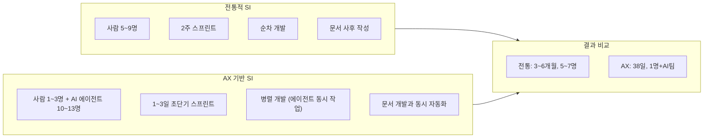

### 1.2 왜 새로운 방법론이 필요한가

기존의 PMP, PRINCE2, Scrum, Waterfall은 **"인간으로 구성된 팀"** 을 전제로 설계되었습니다. AI 에이전트를 팀에 편입했을 때, 다음과 같은 전혀 다른 특성이 나타납니다.

| 항목 | 인간 팀원 | AI 에이전트 |
|------|----------|------------|
| 기억 연속성 | 장기 기억 유지 | 세션 단절 시 컨텍스트 소실 |
| 작업 속도 | 1개 작업/일 | 10~100개 작업/일 (병렬) |
| 역할 경계 | 암묵적 협의로 조정 | 명시적 문서화 없으면 위반 |
| 비용 구조 | 월 고정 인건비 | 토큰 과금 (변동, 사용량 비례) |
| 제약 요소 | 휴가, 집중도, 감정 | Rate limit, Context window |
| 과설계 경향 | 보통 | 높음 (YAGNI 원칙 자동 위반) |

이러한 차이를 인식하고, AX 방법론은 AI 에이전트의 강점(병렬 처리, 문서 자동화, 지치지 않는 일관성)을 최대화하면서 약점(컨텍스트 단절, 역할 위반 경향, 과설계)을 제도적으로 보완합니다.

### 1.3 핵심 철학 3가지

**철학 1: 인간은 방향을 잡고, AI는 속도를 낸다**

사용자(Product Owner)는 "무엇을 왜 만드는가"를 결정하고, AI 팀이 "어떻게 만드는가"를 실행합니다. 최종 판단과 품질 게이트는 반드시 인간이 담당합니다.

**철학 2: 명시적이지 않으면 존재하지 않는다**

AI 에이전트는 암묵적 규칙을 따르지 않습니다. 역할 경계, 금지 사항, 품질 기준은 모두 `CLAUDE.md`에 명문화되어야 합니다. "PM은 코드를 직접 작성하지 않는다"처럼 당연해 보이는 것도 문서화되어야 합니다.

**철학 3: 실동작으로 검증하라**

설계서에 적혀 있다고 구현된 것이 아닙니다. 코드 리뷰 시에는 반드시 실제 API를 호출하여 동작을 검증해야 합니다. "보인다"가 아니라 "확인했다"가 품질의 기준입니다.

---

## 2. 방법론의 이론적 기반

AX 방법론은 여러 검증된 이론의 교차점에 위치합니다. 각 이론이 어떻게 AX 방법론에 녹아있는지 살펴봅니다.

### 2.1 Waterfall — 기획·설계 단계의 엄격함

Waterfall(폭포수) 방법론의 핵심 강점은 **요구사항 완전성과 설계 선행**입니다. AX 방법론은 프로젝트 초기 Phase 0(기획·설계)에서 Waterfall의 엄격함을 차용합니다.

왜냐하면, AI 에이전트는 "요구사항이 명확하면 탁월하지만, 모호한 요구사항에서는 방향을 잃기" 때문입니다. Waterfall처럼 요구사항을 완전히 정의하고, 설계서를 TechLead가 검토한 후에 구현에 착수하는 것이 AI 팀에서는 더욱 중요합니다.

RummiArena 프로젝트에서는 Sprint 0에서 기획 문서 5종(헌장, 요구사항, 리스크, 도구체인, WBS)과 설계 문서 10종(아키텍처, DB, API, AI Adapter, 게임 세션 등)을 완성한 후에 구현을 시작했습니다. 이 투자가 이후 스프린트의 질을 결정했습니다.

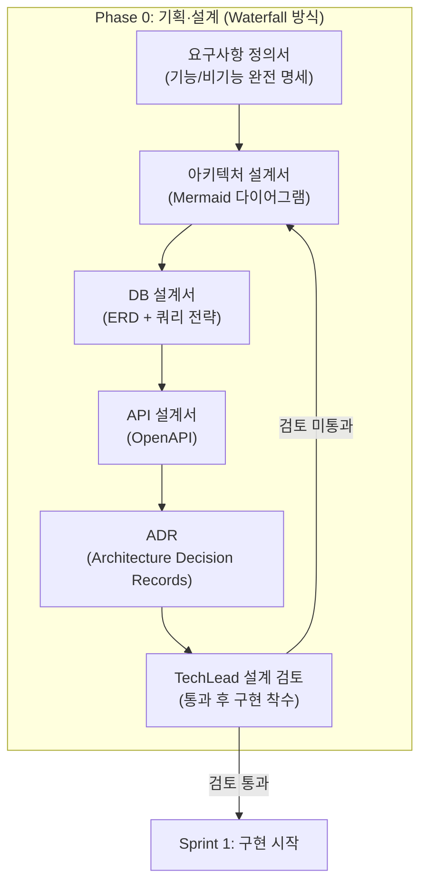

### 2.2 Agile + Scrum — 실행 단계의 유연성

구현 단계에서는 Agile의 반복적 개발과 Scrum의 스프린트 구조를 따릅니다. 단, AI 에이전트의 처리 속도에 맞춰 **스프린트 주기를 1~3일로 단축**합니다.

Hybrid RAG 프로젝트에서 Sprint 1은 10일로 계획되었지만 1일 만에 완료되었습니다. AI 에이전트가 병렬로 작동하기 때문입니다. 이 경험을 통해 AX 방법론은 인간 팀의 2주 스프린트 대신 3일 스프린트를 표준으로 채택하였습니다.

핵심 Agile 실천법:
- **짧은 스프린트**: 3일 주기로 자주 피드백하여 방향 오류 조기 발견
- **데일리 스탠드업**: 모든 에이전트의 상태를 매일 공유 (Slack 자동화)
- **백로그 관리**: PM 에이전트가 Jira를 통해 Epic → Story → Subtask 계층 관리
- **스프린트 회고**: Sprint 종료 시 에이전트별 회고 문서 작성

### 2.3 XP (Extreme Programming) — 기술적 탁월성

XP는 짧은 릴리즈 주기, 지속적 테스트, 페어 프로그래밍, 리팩토링을 강조합니다. AX 방법론에서는 XP의 기술 실천법을 AI 맥락에 적응시킵니다.

- **짧은 릴리즈**: 3일 스프린트 자체가 짧은 릴리즈 주기
- **TDD**: Red-Green-Refactor 사이클 — 복잡한 로직에는 강제 적용, 단순 코드는 Test-Along으로 대체 (Section 7.1 참조)
- **페어 프로그래밍 → AI 페어**: AI 에이전트(Sonnet, Driver) + AI 에이전트(Opus, Navigator) 조합 (RummiArena에서 `frontend-dev`와 `frontend-dev-opus`가 Driver/Navigator 역할 분담, 상세는 부록 D 참조)
- **지속적 통합**: GitHub Actions/GitLab CI로 모든 커밋에 테스트+린트+보안 스캔 자동 실행
- **리팩토링**: Tidy First 원칙에 따라 구조 변경과 기능 변경을 명확히 분리

XP의 "용기(Courage)" 원칙 — 나쁜 코드를 리팩토링할 용기 — 은 AI 맥락에서 "우회하지 말고 근본 해결을 선택하라"는 원칙으로 표현됩니다.

### 2.4 SDD (Specification-Driven Development) — 설계가 코드를 이끈다

SDD는 명세(Specification)를 먼저 작성하고, 그 명세에서 코드가 도출되어야 한다는 방법론입니다. AX 방법론에서 SDD는 특히 중요한 위치를 차지합니다.

왜냐하면, AI 에이전트에게 명확한 명세 없이 작업을 지시하면 에이전트는 자신의 학습 데이터에서 "가장 일반적인 답"을 생성합니다. 이것이 사용자가 원하는 것과 다를 수 있습니다.

SDD의 핵심 실천법:
- **명세 우선**: API 계약서, DB 스키마, 컴포넌트 인터페이스를 구현 전에 작성
- **ADR(Architecture Decision Records)**: 모든 중요한 기술 결정에 배경, 선택지, 선택 이유, 결과를 문서화
- **설계 검토 게이트**: TechLead 에이전트가 설계서를 검토한 후 구현 착수 승인
- **설계서-구현 일치 검증**: 설계서에 적힌 것이 실제로 구현되었는지 E2E로 확인

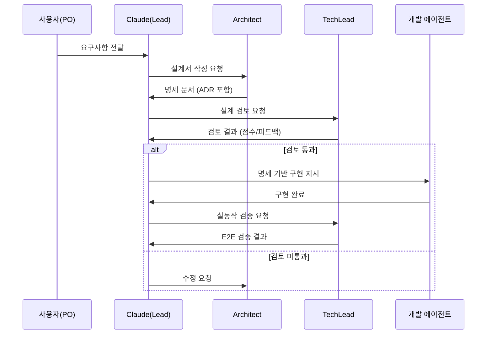

### 2.5 Kent Beck의 TDD와 Tidy First

Kent Beck이 제시한 TDD와 Tidy First 원칙은 AX 방법론의 코딩 기준이 됩니다.

#### TDD의 3가지 법칙

1. **실패하는 테스트 없이 제품 코드 작성 금지** — 테스트를 먼저 작성하면 요구사항을 명확히 이해하게 됩니다
2. **최소한의 테스트만 작성** — 한 번에 하나의 기능만 검증합니다
3. **테스트 통과에 필요한 최소 코드만 작성** — 완벽함을 추구하기보다 빠른 피드백 루프를 유지합니다

> **두 프로젝트 실증에서 배운 것**: TDD 3법칙은 복잡한 비즈니스 로직·알고리즘·에러 핸들링에서 탁월하지만, 단순 CRUD·UI 컴포넌트·설정 클래스에 이를 엄격히 적용하면 생산성 저하만 초래합니다. Hybrid RAG 프로젝트 테스트 전략 문서(00_unit_integration_test_plan.md)는 이를 명시적으로 정리해 **TDD · Test-Along · Test-First 세 가지를 코드 성격에 따라 선택적으로 적용**하는 방침을 채택했습니다. 구체적인 선택 기준은 Section 7.1에서 다룹니다.

#### Red-Green-Refactor 사이클

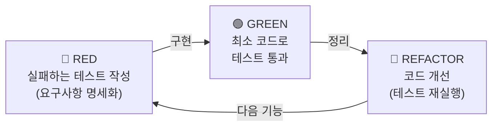

#### Tidy First — 구조 변경과 기능 변경의 분리

Tidy First의 핵심은 **구조 변경(Structure)과 기능 변경(Behavior)을 절대 하나의 커밋에 섞지 않는 것**입니다.

| 커밋 타입 | 내용 | 예시 |
|----------|------|------|
| `[STRUCTURAL]` | 동작 불변 구조 개선 | 변수명 개선, 함수 추출, 중복 제거 |
| `[BEHAVIORAL]` | 새 기능 추가 | 엔드포인트 추가, 비즈니스 로직 변경 |
| `[FIX]` | 버그 수정 | 잘못된 조건 수정, NPE 해결 |
| `[REFACTOR]` | 코드 품질 개선 | 전략 패턴 적용, 레이어 분리 |

이 분리가 중요한 이유: 혼합 커밋은 버그 원인 파악을 어렵게 만들고, 코드 리뷰를 복잡하게 하며, 필요 시 되돌리기를 불가능하게 합니다. Hybrid RAG 프로젝트에서 전략 패턴 리팩토링(STRUCTURAL)과 BGE-Reranker 통합(BEHAVIORAL)을 분리 커밋으로 처리한 것이 후속 디버깅을 크게 단순화했습니다.

### 2.6 Kent Beck의 Augmented Coding — AI 시대의 새로운 패러다임

Kent Beck은 Augmented Coding을 "AI 코딩 어시스턴트와 협업하여 소프트웨어 개발을 가속화하는 실천"으로 정의합니다. AX 방법론은 이 개념을 팀 레벨로 확장한 것입니다.

#### 핵심 원칙 4가지

**1. 컨텍스트 제약** — AI에게 현재 필요한 정보만 제공합니다. 너무 많은 컨텍스트는 오히려 품질을 저하시킵니다. `CLAUDE.md`와 `PLAN.md`가 필요한 컨텍스트를 정확히 제공하는 역할을 합니다.

**2. 옵션성 보존** — Kent Beck의 표현으로 "씨앗 옥수수를 먹지 않기"입니다. AI가 빠르게 코드를 생성할 수 있다고 해서 기술 부채를 방치하면 안 됩니다. 매 Sprint마다 기술 부채 해소 Sprint를 두는 것이 이 원칙의 실천입니다.

**3. 확장-수축 균형** — 기능을 추가하면(확장) 반드시 리팩토링(수축) 단계를 거칩니다. Hybrid RAG 프로젝트에서 Sprint 5를 "기술 부채 해결 Sprint"로 명시적으로 배정한 것이 이 원칙의 적용입니다.

**4. 인간 판단 유지** — AI의 제안을 비판적으로 평가하고 최종 결정은 인간이 내립니다. AI 에이전트가 Mock 테스트로 "97% 커버리지"를 보고해도, 사용자가 "Docker 환경에서 실제로 돌아가는지 확인해봐"라고 지시할 수 있는 것이 인간 판단의 역할입니다.

#### AI 경고신호 인식

Kent Beck이 BPlusTree3 프로젝트에서 식별한 AI 경고신호 (3가지 원형 + 두 프로젝트 경험에서 추가):

- **무한 루프**: AI가 같은 시도를 반복하면 방향을 바꿀 신호
- **요청하지 않은 기능 추가**: YAGNI 원칙 위반, 즉시 제거
- **테스트 비활성화**: Mock 사용, 테스트 skip — 절대 금지
- **우회 코드 추가** (프로젝트 경험 추가): 근본 원인을 해결하지 않고 `docker cp` 같은 임시 방편 사용

### 2.7 Uncle Bob Martin의 경고: Agentic Discipline

> **참고 출처**: [Uncle Bob Martin의 경고: AI 시대, 단순한 규율과 도구만으로는 충분하지 않다](https://k82022603.github.io/posts/uncle-bob-martin%EC%9D%98-%EA%B2%BD%EA%B3%A0-ai-%EC%8B%9C%EB%8C%80,-%EB%8B%A8%EC%88%9C%ED%95%9C-%EA%B7%9C%EC%9C%A8%EA%B3%BC-%EB%8F%84%EA%B5%AC%EB%A7%8C%EC%9C%BC%EB%A1%9C%EB%8A%94-%EC%B6%A9%EB%B6%84%ED%95%98%EC%A7%80-%EC%95%8A%EB%8B%A4/)

Kent Beck이 AI 시대의 새로운 가능성을 이야기한다면, Robert C. "Uncle Bob" Martin은 그 이면의 위험을 경고합니다. Clean Code와 Clean Architecture의 저자이자 애자일 선언문의 공동 서명자인 그는 현재 CleanCoders.com에서 "Agentic Discipline" 시리즈를 제작하고 있습니다. 그의 핵심 명제는 간결합니다.

> "몇 가지 규율과 도구만으로는 충분하지 않다."

#### 역사는 반복된다 — OO, Agile, 그리고 AI

Uncle Bob의 관찰은 기술 혁명의 패턴에서 시작합니다. 소프트웨어 업계는 이미 두 번의 "혁명"을 경험했습니다. 그 패턴은 놀랍도록 동일합니다.

| 혁명 | 약속 | 현실 | 결과 |
|------|------|------|------|
| **객체지향(OO)** | 소프트웨어 위기 해결 | SOLID 원칙 없이는 오히려 복잡도 증가 | 수십 년 후에도 절반은 원리를 모름 |
| **Agile** | 2일 교육으로 프로젝트 성공 보장 | 기술과 규율 없이는 혼란 가중 | 인증서 남발, 본질 훼손 |
| **AI (현재)** | 자동화된 소프트웨어 개발 | 아키텍처 감각 없는 급속 개발 → 기술 부채 4배 | ? |

패턴은 동일합니다. 새 도구가 등장하면 많은 사람이 "이제 전문성 없이도 소프트웨어를 만들 수 있다"고 착각합니다. 그러나 OO를 진정으로 활용하려면 SOLID가 필요했고, Agile을 실천하려면 TDD와 리팩토링이 필요했듯이, AI 에이전트를 활용하려면 아키텍처 감각과 엔지니어링 통찰력이 반드시 필요합니다. 도구는 바뀌었지만, 전문성의 필요성은 사라지지 않습니다.

#### Vibe Coding vs. Agentic Discipline

Uncle Bob은 두 가지 상반된 접근을 명확히 대비시킵니다.

**Vibe Coding (위험한 패턴)**:
- AI가 만든 코드를 바이브(느낌)로 수용
- 모든 제안을 수동적으로 받아들임
- 단기 속도에만 집중
- 코드가 무엇을 하는지 점차 잊어감

**Agentic Discipline (AX 방법론의 지향점)**:
- 명시적 아키텍처 지시 — AI에게 레이어 경계, 인터페이스, 의존성 방향을 명시
- 경계 설정된 작업 분배 — 에이전트가 자신의 영역만 수정하도록 제한
- 테스트 기반 검증 — 매 단계 테스트 통과를 완료의 정의로 삼음
- 능동적 설계 관리 — 개발자가 설계의 주도권을 유지

이 구분은 AX 방법론의 본질이기도 합니다. AI가 빠르게 코드를 생성한다고 해서 설계 결정권까지 AI에게 넘기는 것은 Vibe Coding으로 퇴행하는 것입니다. AX 방법론에서 AI 에이전트는 "지도받는 구현자"이고, 인간(또는 TechLead 에이전트)이 항상 설계자입니다.

#### 아키텍처 유연성과 스타트업 피벗 리스크

Uncle Bob이 강조하는 또 하나의 현실적 위험은 **스타트업 피벗 문제**입니다. 대부분의 초기 스타트업은 "make or break 피벗"에 직면합니다. 이때 핵심 질문은 하나입니다.

> "AI가 만든 소프트웨어 구조가 피벗을 견딜 수 있는가?"

잘못된 아키텍처로 빠르게 만들어진 코드베이스는 "1,000번의 칼질로 인한 천천한 죽음"으로 이어집니다. 새 기능을 추가할 때마다 예상치 못한 곳에서 버그가 터지고, 리팩토링 비용이 기능 개발 비용을 초과하는 시점이 옵니다.

Uncle Bob의 Clean Architecture가 지향하는 의존성 규칙 — "모든 소스 의존성은 안쪽(고수준 정책)을 향해야 한다" — 은 이 피벗 가능성을 보장합니다. UI가 바뀌어도 비즈니스 로직이 살아남고, 데이터베이스가 바뀌어도 서비스 레이어는 변하지 않는 구조가 피벗을 견디는 아키텍처입니다.

#### K자형 기술 이분화 — 어떤 개발자가 살아남는가

Uncle Bob은 AI 시대에 개발자 집단이 K자형으로 양극화될 것이라고 예측합니다.

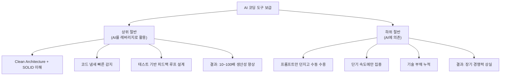

차이는 단 하나입니다. **전문성과 규율을 갖추었는가**. AI 도구 자체는 상위와 하위 절반 모두에게 동등하게 제공됩니다. 그러나 도구를 레버리지로 쓰는 사람은 생산성이 10배가 되고, 도구에 의존하는 사람은 기술 부채가 4배가 됩니다.

AX 방법론은 바로 이 "상위 절반"의 특성 — 아키텍처 감각, 테스트 기반 검증, 능동적 설계 관리 — 을 팀과 에이전트 운영 원칙으로 제도화한 것입니다.

---

## 3. AX 방법론 프레임워크

### 3.1 방법론 전체 구조

AX 방법론은 세 개의 동심원으로 이루어집니다.

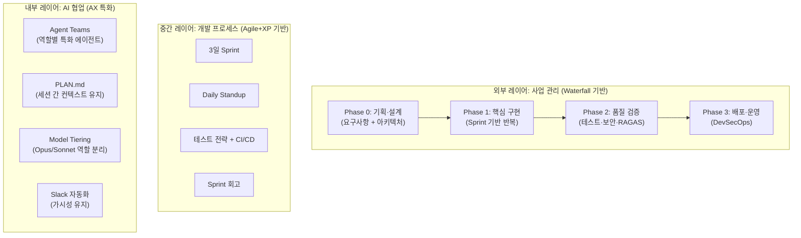

### 3.2 전통 방법론과의 비교

| 구분 | 순수 Waterfall | 순수 Agile/Scrum | AX 방법론 |
|------|---------------|-----------------|-----------|
| **기획·설계** | 매우 엄격 (변경 어려움) | 유연 (과도한 유연성) | **엄격** (Phase 0 완료 후 착수) |
| **구현** | 순차 | 반복 (2주 Sprint) | **초단기 반복** (1~3일 Sprint) |
| **팀 구성** | 역할별 분리 | 크로스펑셔널 팀 | **AI 에이전트별 전문화** |
| **문서화** | 사전 완전 문서화 | 최소 문서 | **개발과 동시 자동 문서화** |
| **품질 게이트** | 각 단계 엄격한 검토 | 지속적 통합 | **TechLead 에이전트 + CI 이중 게이트** |
| **테스트** | 사후 테스트 | TDD/BDD | **TDD·Test-Along·Test-First 선택 적용 + Docker 강제 실행** |

### 3.3 단계별 방법론 적용 원칙

각 Phase에서 어떤 방법론이 지배적으로 적용되는지를 이해하는 것이 중요합니다.

```mermaid
gantt
    title AX 방법론 단계별 적용
    dateFormat X
    axisFormat %s

    section Waterfall 지배
    Phase 0 기획·설계 :0, 20
    Phase 4 최종화·인계 :80, 100

    section Agile 지배
    Phase 1 핵심 구현 :20, 60

    section DevSecOps 지배
    Phase 2 테스트·품질 :50, 75
    Phase 3 배포·운영 :70, 90
```

---

## 4. AI 에이전트 팀 구조

### 4.1 팀 계층 구조

AX 방법론의 팀은 4개 레이어로 구성됩니다.

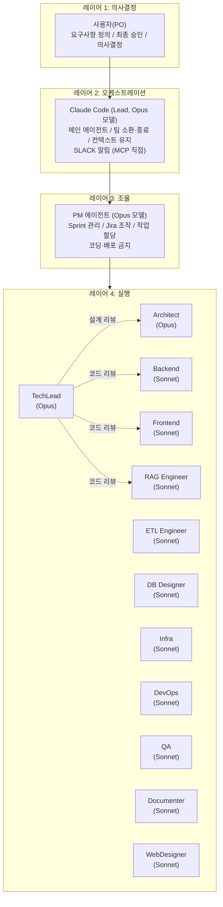

### 4.2 에이전트별 역할 정의

#### 핵심 에이전트 (Opus 모델 — 심층 추론 필요)

| 에이전트 | 역할 | 주요 산출물 |
|---------|------|-----------|
| **TechLead** | 아키텍처 결정, 코드 리뷰, 기술 트레이드오프 | ADR, 코드 리뷰 승인, 기술 보고서 |
| **Architect** | 상세 설계서, Mermaid 다이어그램, 기능 명세 | 아키텍처 설계서 6~14종 |
| **PM** | Sprint 관리, Jira 조작, Slack 조율 | Sprint 계획서, 완료 보고서 |
| **AI Engineer** | AI/ML 파이프라인 설계, 모델 선택 | RAG 전략, 평가 보고서 |
| **Security** | 보안 감사, OWASP 검토, 취약점 분석 | 보안 감사 보고서 |

#### 실행 에이전트 (Sonnet 모델 — 정형화된 구현)

| 에이전트 | 주요 파일 경로 | 주요 산출물 |
|---------|-------------|-----------|
| **Backend Developer** | `backend/`, `gateway/` (Java/Go) | REST API, WebSocket 서버 |
| **Frontend Developer** | `frontend/src/` (React/Next.js) | UI 컴포넌트, E2E 테스트 |
| **RAG Engineer** | `ai_service/`, `knowledge_service/` | 검색 파이프라인, LangGraph |
| **ETL Engineer** | `scripts/`, `etl/` | 데이터 파이프라인, 청킹/임베딩 |
| **Database Designer** | SQL DDL, 마이그레이션 | 스키마, 쿼리 최적화 |
| **Infra Engineer** | `infrastructure/docker/` | Docker Compose, 네트워크 |
| **DevOps Engineer** | `.github/workflows/`, `.gitlab-ci.yml` | CI/CD 파이프라인 8개 |
| **QA Engineer** | `tests/` | 테스트 스위트, 커버리지 보고서 |
| **Code Documenter** | `docs/` | API 문서, 아키텍처 문서 |
| **Web Designer** | 디자인 시스템 | UI/UX 가이드, 와이어프레임 |
| **Game Analyst** (프로젝트 특화) | `work_logs/` | 전략 분석, 실험 보고서 |

### 4.3 모델 티어링 원칙

모든 에이전트를 고성능 모델로 실행하면 비용이 기하급수적으로 증가합니다. AX 방법론은 **판단이 필요한 작업과 실행이 필요한 작업을 구분**하여 모델을 배정합니다.

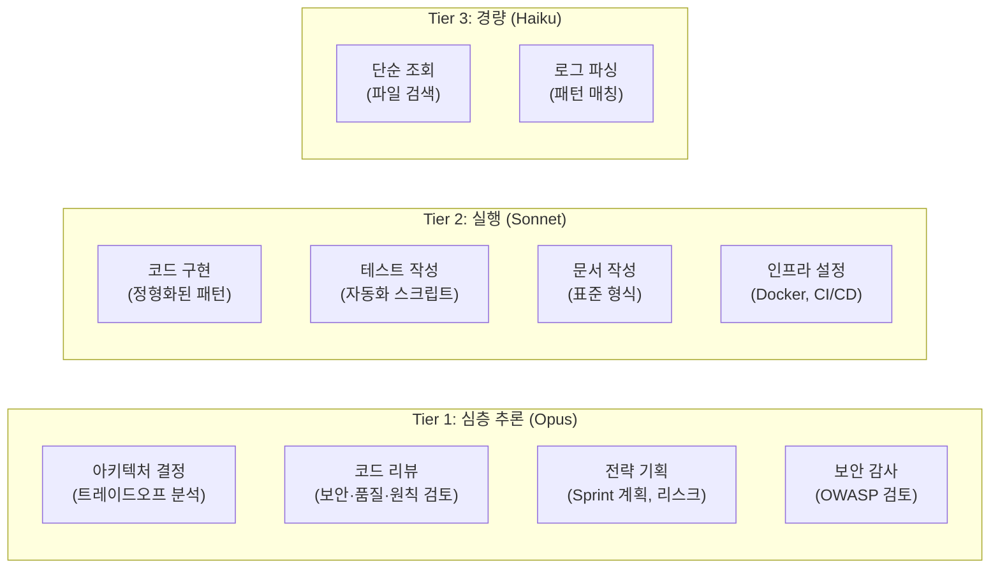

**비용 효과**: Hybrid RAG 프로젝트에서 13개 에이전트 중 11개를 Sonnet으로 전환하여 전체 비용을 73% 절감하면서 품질은 B+ 수준으로 유지했습니다.

### 4.4 Agent Teams vs 개별 위임

Claude Code의 Agent Teams 기능을 언제 사용할지 결정하는 기준입니다.

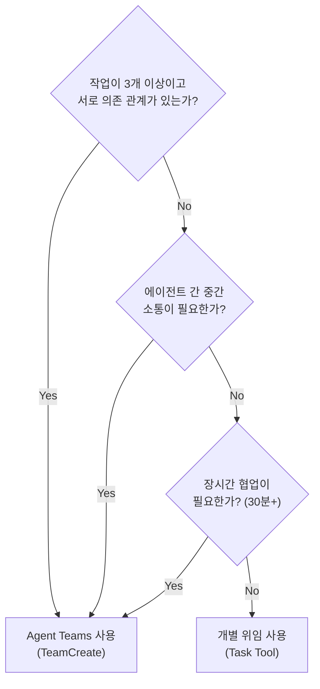

**Agent Teams 적합 시나리오**: Full Stack 기능 개발 (DB → Backend → Frontend → QA 순차 의존), Sprint 단위 대규모 작업, 복잡한 디버깅 (여러 레이어 동시 조사)

**개별 위임 적합 시나리오**: 독립 문서 1개 작성, 코드 리뷰 1건, 단순 파일 조사, 2개 이하 독립 작업

### 4.5 두 프로젝트의 에이전트 구성 비교

| 구분 | Hybrid RAG (13명) | RummiArena (12명) | 공통점 |
|------|------------------|------------------|--------|
| 핵심 에이전트 | TechLead, Architect, PM | Architect, PM, AI Engineer, Security, Game Analyst | 아키텍처·PM 공통 |
| 도메인 특화 | RAG Engineer, ETL Engineer | Go Dev, Node Dev, Game Analyst | 도메인별 특화 |
| 공통 에이전트 | Backend, Frontend, DB, Infra, DevOps, QA, Documenter | Go Dev≈Backend, Frontend, DevOps, QA, Designer | 기본 역할 동일 |
| 모델 정책 | Opus×2 + Sonnet×11 | Opus×6(high effort) + Sonnet×5 | 판단→Opus, 실행→Sonnet |

---

## 5. 프로젝트 생명주기

### 5.1 전체 흐름

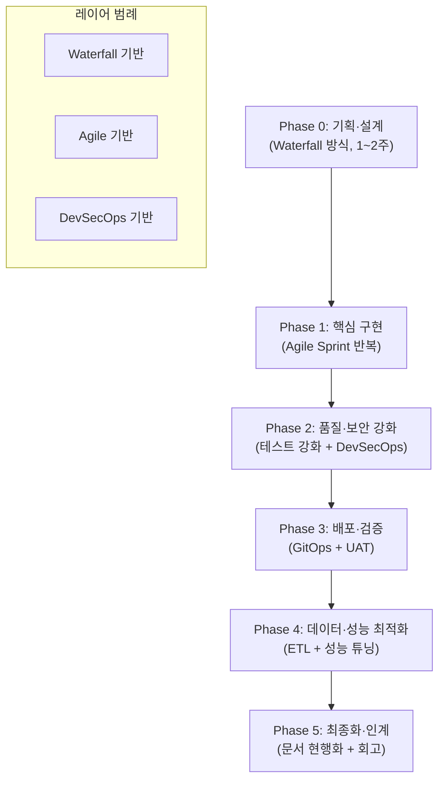

### 5.2 Phase 0: 기획·설계 (1~2주)

Phase 0의 목적은 **구현 전에 방향을 완전히 확정하는 것**입니다. AI 에이전트가 빠르게 작업하는 만큼, 잘못된 방향으로 빠르게 가면 수정 비용이 더 큽니다.

**산출물 체계** (두 프로젝트 통합):

| 문서 | 내용 | 담당 에이전트 |
|------|------|-------------|
| 프로젝트 헌장 | 목표, 범위, 마일스톤, 이해관계자 | PM |
| 요구사항 정의서 | 기능/비기능 요구사항, 수락 기준 | Claude(Lead) + PM |
| 리스크 관리 계획 | 리스크 식별, 영향도, 대응 계획 | PM |
| 도구체인 정의서 | 기술 스택 비교, 선정 이유 | Architect + TechLead |
| WBS | 작업 분해 구조, 일정 | PM |
| 아키텍처 설계서 | 전체 시스템 구조 (Mermaid) | Architect |
| DB 설계서 | ERD, 테이블 정의, 쿼리 전략 | DB Designer |
| API 설계서 | OpenAPI 명세, 계약 | Backend + Architect |
| ADR | 핵심 기술 결정 기록 | TechLead |
| 테스트 전략 | 단위/통합/E2E 기준 | QA |

**TechLead 검토 게이트**: 모든 설계 문서는 TechLead의 검토 점수(9.0/10 이상)를 통과해야 구현이 시작됩니다. 이것이 Waterfall의 품질 게이트를 AI 맥락에서 구현한 것입니다.

### 5.3 Phase 1: 핵심 구현

Phase 1은 Sprint 기반의 반복 개발로 이루어집니다. 각 Sprint는 1~3일로 구성되며, AI 에이전트의 처리 속도에 최적화됩니다.

**Sprint 내부 흐름**:

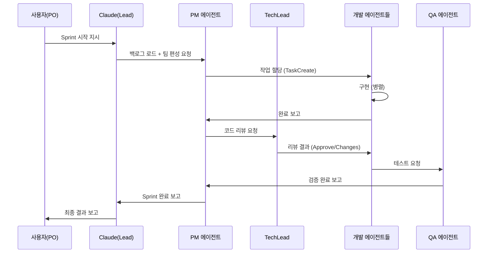

### 5.4 Phase 2: 품질·보안 강화

일반적으로 전체 구현의 60~70% 완료 시점에서 별도 Sprint를 편성합니다.

- **기술 부채 해소 Sprint**: 구현 중 발견된 기술 부채를 전수 해결
- **보안 감사 Sprint**: OWASP Top 10 기준 Security 에이전트 감사
- **커버리지 강화 Sprint**: 단위/통합 테스트 커버리지 80%+ 달성
- **성능 최적화**: 프로파일링 기반 병목 해소

RummiArena 프로젝트에서는 Sprint 5에 Rate Limit, WS 보안, 인증 토큰 검증(JWKS RS256), 보안 헤더 6종을 집중 구현하며 13개 보안 이슈 중 9개를 해결했습니다.

### 5.5 Phase 3~5: 배포·데이터·최종화

이 Phase들은 GitOps 기반 배포, ETL/데이터 최적화, 최종 산출물 현행화 및 프로젝트 회고로 구성됩니다.

**최종화 산출물** (9종, 에이전트 병렬로 약 15분):

| # | 산출물 | 담당 에이전트 |
|:-:|--------|-------------|
| 01 | 프로젝트 최종 보고서 | PM |
| 02 | 시스템 아키텍처 문서 v최신 | Architect |
| 03 | 운영자 매뉴얼 | Code Documenter |
| 04 | 사용자 매뉴얼 | Code Documenter |
| 05 | API 명세서 (OpenAPI) | Code Documenter |
| 06 | 데이터베이스 설계서 | DB Designer |
| 07 | 설치/배포 가이드 | DevOps |
| 08 | 테스트 보고서 | QA |
| 09 | Known Issues & 향후 과제 | PM |

---

## 6. 스프린트 운영 방식

### 6.1 스프린트 길이와 이유

전통 Scrum의 2주 스프린트 대신 **1~3일 스프린트**를 사용합니다.

그 이유는 AI 에이전트가 인간보다 훨씬 빠르게 작업을 처리하기 때문입니다. Hybrid RAG 프로젝트 Sprint 1에서 10일 계획을 1일 만에 완료했습니다. 짧은 스프린트로 자주 피드백을 받으면 방향 오류를 조기에 발견할 수 있습니다.

또한, AI의 컨텍스트 단절(세션 종료)과 스프린트 경계를 일치시키면 관리 오버헤드가 줄어듭니다.

### 6.2 일일 세션 루틴

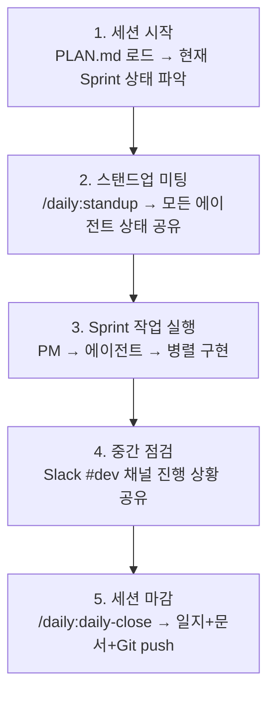

**세션 시작 필수 3가지**:
1. `PLAN.md` 확인 → 현재 Sprint 상태 및 이월 작업 파악
2. `CLAUDE.md` 확인 → 역할 규칙 및 금지 사항 재확인
3. 어제의 블로커 → 오늘의 우선순위 설정

**세션 종료 자동화** (`/daily:daily-close`):
```
→ 작업일지 작성 (work_logs/daily_logs/)
→ PLAN.md 업데이트 (진행 상황 동기화)
→ Git commit + push (작업 내용 보존)
→ Slack 마감 알림
```

### 6.3 스탠드업 형식

```
*[에이전트명]* 상태 공유
• 어제: {완료 작업 + Jira 이슈 번호}
• 오늘: {예정 작업}
• 블로커: {이슈 또는 없음}
• 한마디: {인사이트 또는 팁}
```

### 6.4 Slack 채널 구조

| 채널 | 용도 | 주요 발신자 |
|------|------|-----------|
| `#proj-{name}-dev` | 개발 작업 시작/완료/리뷰 | 모든 에이전트 |
| `#proj-{name}-standup` | 스탠드업 미팅 | PM, 모든 에이전트 |
| `#proj-{name}-alerts` | 인프라/보안 경보 | Infra, DevOps, Security |
| `#proj-{name}-general` | 일반 공지 | Claude(Lead) |

**알림 표준 형식**:
```bash
# 작업 시작
*[에이전트명]* 작업 시작: {SCRUM-XX} - {작업명}

# 완료
*[에이전트명]* 작업 완료: {SCRUM-XX} - {결과 요약} / 변경파일: {경로:라인}

# 블로커
*[에이전트명]* 🚨 블로커: {이슈 설명} / 에스컬레이션: {TechLead/PM}
```

### 6.5 스프린트 리뷰와 회고

**Sprint Review**: PM 에이전트가 Jira 기준 완료율, 주요 산출물, 미완료 이유를 정리하여 사용자에게 보고

**Sprint Retrospective**: 에이전트별 `.md` 형식의 회고 문서 작성
- 무엇이 잘 됐나 (Keep)
- 무엇이 잘못 됐나 (Problem)
- 다음에 무엇을 다르게 할 것인가 (Try)
- AI 에이전트 관점에서 본 학습

---

## 7. 코딩 방법론 — TDD + SDD + Augmented Coding

### 7.1 테스트 전략 — TDD · Test-Along · Test-First 선택적 적용

두 프로젝트는 모든 코드에 TDD 3법칙을 일률 적용하지 않았습니다. Hybrid RAG 프로젝트 테스트 전략 문서는 코드 성격에 따라 세 가지 접근을 명시적으로 분리합니다.

| 접근 방식 | 테스트 작성 시점 | 적용 대상 |
|----------|--------------|---------|
| **TDD** (Red-Green-Refactor) | 코드 **이전** | 복잡한 비즈니스 로직, 알고리즘, 에러 핸들링, 상태 전이, 리팩토링 |
| **Test-Along** | 코드와 **동시** | 단순 CRUD, UI 컴포넌트, 설정 클래스, 단순 위임 메서드 |
| **Test-First** | 코드 **이전** (버그 재현) | 버그 수정 — 실패하는 재현 테스트를 먼저 작성한 뒤 수정 |

**선택 기준 플로우**:

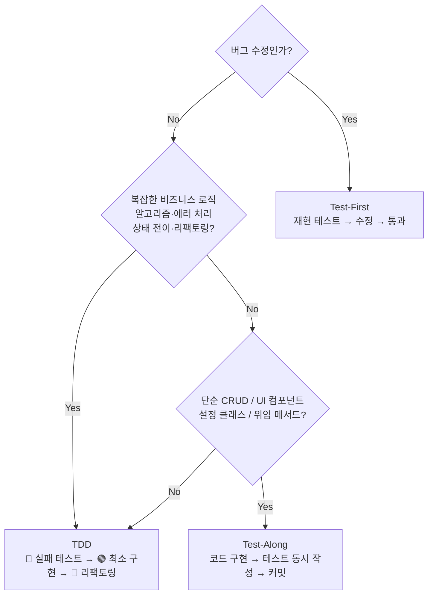

어느 접근을 사용하든 **완료 기준은 동일**합니다. 커버리지 80%+, Docker 통합 테스트 통과, TechLead 코드 리뷰 승인.

**절대 원칙 — Mock 테스트 금지**:

Hybrid RAG 프로젝트에서 QA 에이전트가 `TEST_MODE=mock`으로 97% 커버리지를 달성했다고 보고했으나, 실제 Docker 환경에서는 40.6%만 통과했습니다. 이 사고 이후:

```bash
# 반드시 Docker 환경에서 실행
export TEST_MODE=docker
pytest src/tests/ -v --cov=src/app --cov-report=term-missing

# Mock 모드 절대 금지
# TEST_MODE=mock pytest ...  ← 금지
```

RummiArena 프로젝트에서도 같은 원칙: Go 테스트는 실제 PostgreSQL/Redis 컨테이너에 연결하여 실행합니다.

### 7.2 코드 품질 기준

**커밋 메시지 형식** (AI 에이전트가 자동 준수):

```bash
git commit -m "[TYPE] 간단한 설명 (50자 이내)

- 변경 사항 1
- 변경 사항 2

관련 이슈: SCRUM-XXX"

# TYPE: FEAT, FIX, REFACTOR, TEST, DOCS, CHORE
# Tidy First 원칙: 구조 변경과 기능 변경은 별도 커밋
```

**코드 리뷰 체크리스트** (TechLead 에이전트, PR 머지 전 필수):

```
[ ] 명세서와 구현 일치 확인 (설계서 != 코드일 때 검토)
[ ] 실동작 검증 (API 호출, DB 쿼리 실행으로 확인)
[ ] 타입 힌트/인터페이스 완전 명시
[ ] 에러 핸들링 (예외 종류 명시, 로깅 포함)
[ ] 보안 취약점 없음 (SQL injection, XSS, CSRF)
[ ] YAGNI 원칙 준수 (불필요한 기능 없음)
[ ] 테스트 커버리지 80%+ (Docker mode)
[ ] API 문서 업데이트
```

### 7.3 전략 패턴과 SOLID 원칙

AI 에이전트는 기능을 빠르게 추가하는 과정에서 if-elif 체인, 긴 함수 등 기술 부채를 누적시킵니다. TechLead 에이전트의 코드 리뷰에서 이를 발견하고 전략 패턴으로 리팩토링합니다.

**Before (기술 부채 — 76줄의 if-elif 체인)**:
```python
if search_mode == "hybrid":
    dense_results = await dense_search(query)
    sparse_results = await sparse_search(query)
    # ... 중복 로직 반복
elif search_mode == "dense":
    return await dense_search(query)
elif search_mode == "sparse":
    return await sparse_search(query)
# ... 계속 반복
```

**After (전략 패턴 — 5줄, 확장 가능)**:
```python
SEARCH_STRATEGIES: Dict[str, SearchStrategy] = {
    "hybrid": HybridSearchStrategy(),
    "dense": DenseSearchStrategy(),
    "sparse": SparseSearchStrategy(),
    "keyword": KeywordSearchStrategy(),
}
strategy = SEARCH_STRATEGIES.get(search_mode, SEARCH_STRATEGIES["hybrid"])
return await strategy.search(query, top_k, filters)
```

### 7.4 아키텍처 원칙

**계층형 아키텍처 강제** (레이어드 아키텍처 원칙):
```
Controller → Service → Repository
(의존성 방향은 항상 아래로만)
```

RummiArena 프로젝트에서는 Sprint 7 Week 2에서 4계층 재설계를 수행했습니다:
- **L1 UI**: React 컴포넌트 (표현만)
- **L2 상태+Hook**: Zustand store, custom hook
- **L3 도메인**: 게임 로직, 유효성 검증
- **L4 통신**: WebSocket, REST API 클라이언트

**SSOT (Single Source of Truth) 원칙**: 여러 파일에 동일한 값이 흩어지면 안 됩니다. 타임아웃 설정, 프롬프트 variant, 게임 룰 — 모두 단일 기준 파일에서 관리됩니다.

### 7.5 AI 특화 코딩 원칙

Augmented Coding 환경에서 추가로 지켜야 할 원칙들입니다.

**1. 능동적 대처 원칙**

```
[잘못된 접근]
"2워커 CPU 경합 확인했습니다. 1워커로 전환할까요?"

[올바른 접근]
"2워커 CPU 경합 확인, 실측:
  - 2워커: 0.7c/s (CPU 200%, 경합)
  - 1워커: 0.7c/s (CPU 100%, 안정)
→ 1워커로 즉시 전환 완료. 성능 동일, 안정성 향상."
```

실측 데이터가 있으면 "할까요?" 대신 즉시 결정하고 보고합니다.

**2. 근본 해결 원칙**

```
[잘못된 접근]
docker cp scripts/ kp-ai-service:/app/scripts/  # 임시 복사

[올바른 접근]
# .dockerignore에서 scripts/ 제외 항목 삭제
# Dockerfile 리빌드
docker-compose build ai-service && docker-compose up -d
```

안 되는 것이 있으면 우회하지 않고, 반드시 원인 파악 후 근본 해결합니다.

### 7.6 아키텍처 감각과 선택적 탐침 (Uncle Bob의 Agentic Discipline 실천)

AI가 코드를 빠르게 생성하는 환경에서 개발자에게 가장 절실하게 필요한 것은 **아키텍처 감각(Architectural Intuition)** 입니다. Uncle Bob Martin은 이것을 "멘탈 모델"이라는 개념으로 정의합니다. 코드를 모두 읽지 않더라도 구조적 위험을 감지하고, AI 에이전트가 잘못된 방향으로 가기 전에 수정하는 내적 능력입니다.

#### 멘탈 모델의 4가지 구성요소

**1. 아키텍처적 감각** — 의존성 방향이 올바른지, 레이어 경계가 지켜지는지, 추상화 수준이 일관되는지를 빠르게 파악합니다. "이 비즈니스 로직이 왜 Controller에 있지?"라고 즉시 감지하는 능력입니다.

**2. 코드 품질 감지** — 중복의 냄새, 함수 길이의 적절성, 복잡도 증가 신호, 테스트 없는 코드의 위험성을 느끼는 감각입니다. Uncle Bob의 *Clean Code* Chapter 17 "Smells and Heuristics"에서 다루는 코드 냄새와 휴리스틱이 이 감각의 기준이 됩니다.

**3. AI 행동 패턴 이해** — AI가 자주 저지르는 실수(환각, 컨텍스트 한계로 인한 누락, YAGNI 위반 경향)를 알고, AI 출력을 그냥 수용하지 않고 패턴으로 검토하는 능력입니다. "이 에이전트가 자꾸 추상화를 과도하게 만드는 경향이 있다"는 것을 인식하는 것이 여기에 해당합니다.

**4. 비즈니스 맥락 연결** — 코드 변경이 비즈니스 피벗 가능성에 어떤 영향을 미치는지 연결합니다. "이 결합도가 나중에 우리가 프론트엔드 프레임워크를 바꿀 때 발목을 잡을 것"을 미리 인식하는 능력입니다.

#### Clean Architecture 의존성 규칙

Uncle Bob의 Clean Architecture가 정의하는 핵심 규칙은 하나입니다. **모든 소스 의존성은 안쪽(고수준 정책)을 향해야 한다.** 이 규칙이 지켜질 때 각 레이어는 독립적으로 교체 가능해집니다.

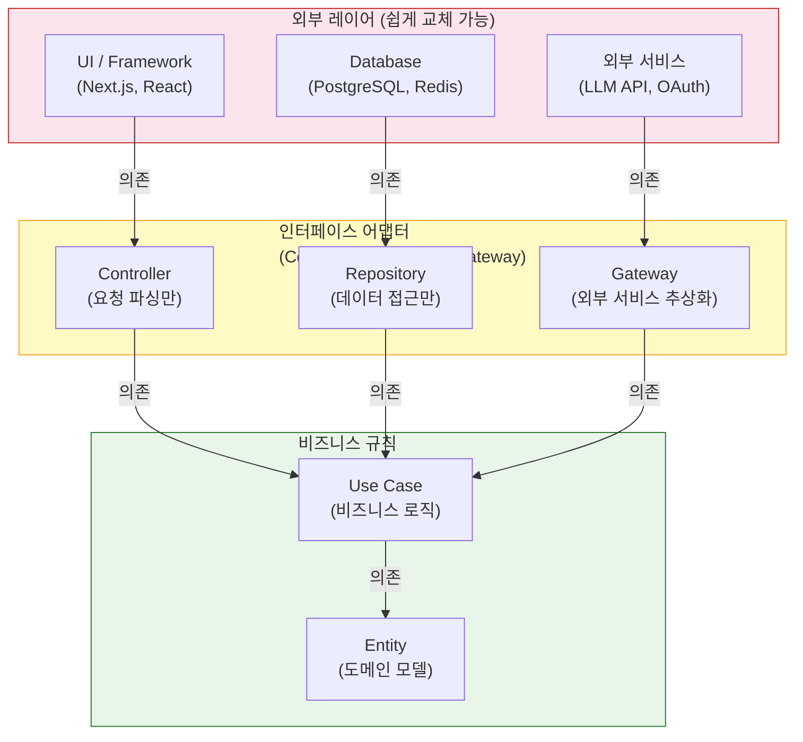

핵심은 화살표 방향입니다. 외부(UI, DB, 외부 서비스)가 안쪽(비즈니스 로직)에 의존하고, 절대 반대 방향이 되어서는 안 됩니다. 비즈니스 로직이 특정 UI 프레임워크나 데이터베이스 구현에 의존하는 순간 피벗이 불가능해집니다.

RummiArena의 game-server 설계 `handler → service → repository`와 Hybrid RAG의 Search Strategy 패턴 모두 이 의존성 규칙을 따릅니다.

#### 선택적 탐침 — AI 코드에서 위험을 감지하는 신호

Uncle Bob은 전체 코드를 일일이 검토하는 것이 비효율적임을 인정합니다. 대신 **선택적 탐침(Selective Probing)** — 위험 신호가 있는 특정 영역만 깊이 파고드는 기법 — 을 권장합니다. 다음 신호가 보이면 그 영역을 우선적으로 검토해야 합니다.

| 경고 신호 | 의미 | 조치 |
|----------|------|------|
| 500줄 이상 클래스/모듈 | 단일 책임 원칙(SRP) 위반 가능성 | 책임 분리 여부 검토 |
| 모호한 함수명: `process()`, `handle()`, `manage()` | 책임이 불명확한 God Object | 구체적 역할 명명 + 분리 |
| 인터페이스 없이 구체 클래스 직접 의존 | 의존성 역전 원칙(DIP) 위반 | 인터페이스 도입 |
| 비즈니스 로직이 Controller/Repository에 혼재 | 레이어 경계 붕괴 | Service 레이어로 이동 |
| AI가 3번 이상 같은 파일을 수정 | 설계 문제를 코드로 덮으려는 시도 | 근본 구조 재설계 |
| 테스트 파일이 없는 새 모듈 | Agentic Discipline 미적용 | 테스트 추가 후 진행 |
| `# TODO: fix later` 주석 밀집 | 기술 부채 묵인 | Sprint 내 해결 또는 ADR로 추적 |

RummiArena 프로젝트에서 `GameClient.tsx`가 1,830줄까지 성장한 것이 바로 이 신호들을 무시한 결과였습니다. 매 스프린트마다 선택적 탐침을 통해 위험 영역을 조기에 식별했다면 모놀리스 분해 비용을 줄일 수 있었습니다.

#### AI에게 아키텍처를 명시하는 방법

Agentic Discipline의 핵심 실천법은 AI에게 작업을 지시할 때 아키텍처 제약을 명시적으로 전달하는 것입니다.

```
[Agentic Discipline 지시 예시]

❌ Vibe Coding 방식:
"게임 점수 계산 기능을 추가해줘."

✅ Agentic Discipline 방식:
"게임 점수 계산 기능을 추가해줘.
- 비즈니스 로직은 internal/service/scoring.go에만 위치할 것
- handler는 요청 파싱과 응답 직렬화만 담당 (로직 금지)
- 인터페이스 ScoringService를 먼저 정의하고 구현할 것
- 의존성은 handler → service 방향만 허용
- 구현 전 테스트 케이스 3개 먼저 작성할 것"
```

이 명시적 제약이 없으면 AI 에이전트는 가장 빠른 경로로 구현하는 경향이 있고, 그것은 종종 handler 함수 안에 비즈니스 로직이 직접 들어가는 Clean Architecture 위반으로 이어집니다.

**3. 파일 소유권 원칙**

동일한 파일을 두 에이전트가 동시에 수정하면 충돌이 발생합니다. Agent Teams를 사용할 때는 파일 레벨 소유권을 TaskCreate 시에 명시합니다:

```
✅ 올바른 할당:
  RAG      → ai_service/services/graph_search.py
  Backend  → gateway/src/main/resources/application.yml
  Frontend → frontend/src/components/GraphPanel.tsx

❌ 잘못된 할당:
  RAG      → ai_service/services/graph_search.py
  Backend  → ai_service/services/graph_search.py  ← 충돌!
```

---

## 8. 품질 관리 체계

### 8.1 품질 관리 전체 구조

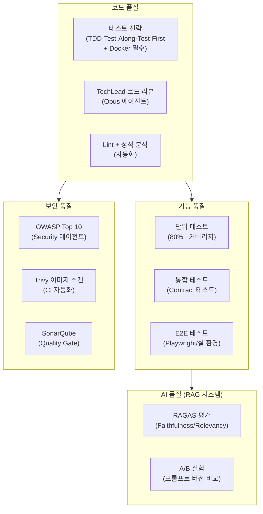

### 8.2 테스트 계층과 기준

**테스트 피라미드 (AX 기반)**:

| 레이어 | 비율 | 실행 환경 | 담당 |
|--------|:----:|---------|------|
| 단위 테스트 | 70% | Docker 실 환경 | QA 에이전트 |
| 통합/Contract 테스트 | 20% | Docker + 실 DB | QA 에이전트 |
| E2E 테스트 | 10% | 실 K8s/Docker | QA 에이전트 |

**커버리지 목표**: 핵심 비즈니스 로직 80%+ (Docker mode)

Hybrid RAG 프로젝트 실측:
- conversation_history.py: 100%
- hybrid_retriever.py: 97%
- search_service.py: 97%
- **평균: 97%** (Docker mode)

RummiArena 프로젝트 실측:
- Go game-server: 770 테스트 PASS
- NestJS ai-adapter: 606 테스트 PASS
- Frontend Jest: 659 테스트 PASS
- Playwright E2E: 376 PASS

### 8.3 RAGAS 평가 (RAG 시스템 특화)

RAG 시스템을 포함하는 프로젝트에서는 전통적 테스트 메트릭으로는 AI 품질을 측정할 수 없습니다. RAGAS 평가 사이클을 적용합니다.

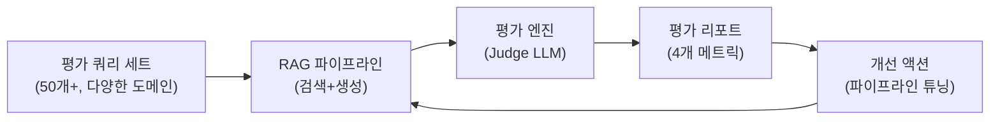

**RAGAS 4개 핵심 메트릭**:

| 메트릭 | 의미 | 목표 |
|--------|------|:----:|
| Faithfulness | LLM이 컨텍스트에 충실한가 (환각 방지) | ≥ 0.90 |
| Answer Relevancy | 답변이 질문과 관련 있는가 | ≥ 0.60 |
| Context Precision | 검색된 컨텍스트가 정확한가 | ≥ 0.60 |
| Context Recall | 필요한 컨텍스트를 빠짐없이 검색했는가 | ≥ 0.65 |

Hybrid RAG 최종 성과: Faithfulness **0.935** (A- 등급, v5의 0.144에서 6번의 사이클로 향상)

**핵심 교훈**: "양보다 질" — 108K 청크를 42K로 줄였더니(쓰레기 청크 제거) RAGAS가 오히려 향상되었습니다.

### 8.4 CI/CD 품질 게이트

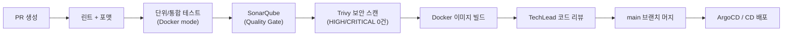

RummiArena GitLab CI: 5개 스테이지 — lint / test / quality(4개: SonarQube·Trivy-FS·npm audit·govulncheck) / build(Kaniko ×4 + 이미지 스캔 ×4) / update-gitops — **17/17 ALL GREEN** 달성 (파이프라인 상세 구조는 부록 F 참조)

### 8.5 보안 관리 (DevSecOps)

RummiArena에서 실증된 보안 레이어:

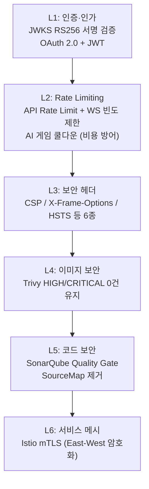

**보안 설계 원칙 (CLAUDE.md 명문화)**:
- LLM 응답 신뢰 금지: 항상 Game Engine으로 유효성 검증 후 적용
- 타임아웃 체인 SSOT: 모든 타임아웃 설정값은 단일 기준 파일에서 관리
- 시크릿 파일 커밋 금지: `.env`, `*.pem` 등 Gitignore 강제

---

## 9. 도구 생태계

### 9.1 전체 도구 맵

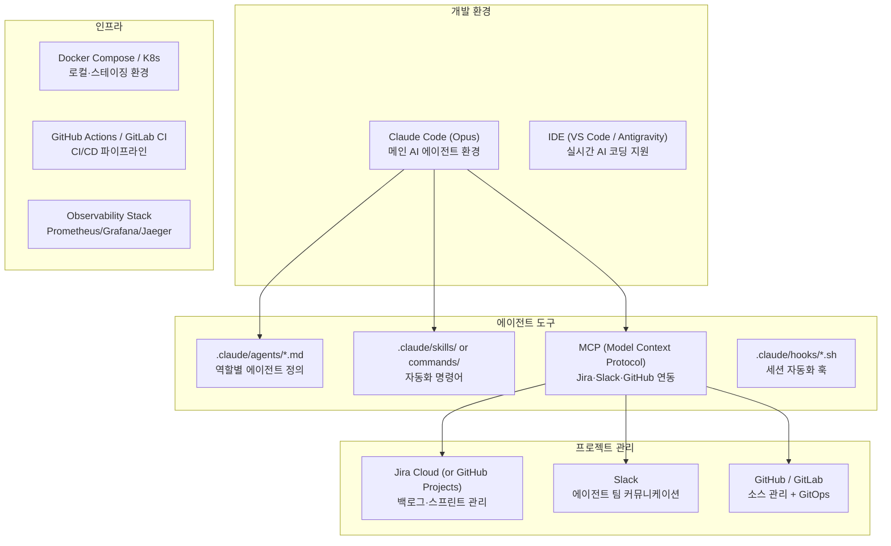

### 9.2 Claude Code 핵심 설정

```
.claude/
├── agents/          # 역할별 에이전트 정의 (.md 파일)
│   ├── backend-developer.md
│   ├── tech-lead.md
│   └── ...
├── skills/ (or commands/)
│   ├── daily/       # 일일 루틴 자동화
│   │   ├── standup.md     → /daily:standup
│   │   ├── daily-log.md   → /daily:daily-log
│   │   └── daily-close.md → /daily:daily-close
│   ├── tools/       # 코드 품질 도구
│   │   ├── ai-review.md   → /tools:ai-review
│   │   └── tech-debt.md   → /tools:tech-debt
│   └── workflows/   # 개발 프로세스
│       ├── feature-development.md
│       └── tdd-cycle.md
├── hooks/           # 세션 자동화
│   ├── worklog-update.sh
│   └── slack-notify.sh
└── settings.json    # Agent Teams 활성화
```

**Agent Teams 활성화**:
```json
{
  "env": {
    "CLAUDE_CODE_EXPERIMENTAL_AGENT_TEAMS": "1",
    "TEST_MODE": "docker"
  }
}
```

### 9.3 PLAN.md — 세션 간 컨텍스트 유지의 핵심

AI 에이전트는 세션이 끊기면 이전 맥락을 잃습니다. `PLAN.md`는 프로젝트의 "살아있는 메모리"로, 다음을 포함합니다:

```markdown
# PLAN.md

## 프로젝트 현황
- 현재 Sprint: Sprint N
- 진행률: XX%
- 다음 마일스톤: YYYY-MM-DD

## 현재 Sprint 백로그
- [ ] SCRUM-XXX: 작업 설명 (담당: Backend)
- [x] SCRUM-YYY: 완료 작업 (완료: YYYY-MM-DD)

## 이월 이슈
- SCRUM-ZZZ: 블로커 설명 (원인: ...)

## 핵심 기술 결정 사항
- ADR-001: Docker Compose 채택 (K8s 대비 복잡도 절감)

## 알려진 이슈 (Known Issues)
- ...
```

### 9.4 브랜치 전략

두 프로젝트 모두 GitFlow 기반 전략을 사용합니다:

```mermaid
flowchart LR
    subgraph Branches
        main["main\n(프로덕션, 보호됨)"]
        develop["develop\n(개발 통합)"]
        feature["feature/{이슈번호}-{설명}\n(기능 개발)"]
        hotfix["hotfix/{이슈번호}\n(긴급 수정)"]
    end

    feature -->|"PR + 리뷰"| develop
    hotfix -->|"즉시 머지"| main
    develop -->|"릴리즈"| main
```

**에이전트별 브랜치 규칙**:
- 각 에이전트는 자신의 feature 브랜치에서 작업
- Agent Teams 사용 시: `git worktree add /tmp/agent-{name}` 으로 격리
- 병렬 에이전트 `git checkout -b` 충돌 방지를 위해 worktree 격리 필수

---

## 10. 산출물 체계

### 10.1 문서 계층 구조

```
project-root/
├── CLAUDE.md          # 프로젝트 규칙 + 역할 정의 (필수)
├── PLAN.md            # 현재 진행 상황 (매일 업데이트)
├── README.md          # 프로젝트 개요
│
├── docs/
│   ├── 01-planning/   # 기획 문서
│   │   ├── 01-project-charter.md
│   │   ├── 02-requirements.md
│   │   ├── 03-risk-management.md
│   │   ├── 04-tool-chain.md
│   │   └── 05-wbs.md
│   ├── 02-design/     # 설계 문서
│   │   ├── 01-architecture.md
│   │   ├── 02-database-design.md
│   │   ├── 03-api-design.md
│   │   └── ADR-*.md
│   ├── 03-development/   # 개발 가이드
│   ├── 04-testing/       # 테스트 전략 + 보고서
│   ├── 05-deployment/    # 배포 가이드
│   └── 06-operations/    # 운영 가이드
│
└── work_logs/
    ├── daily_logs/        # 일일 작업 일지 (매일)
    ├── session_logs/      # Claude Code 세션 로그
    ├── vibe/              # 인사이트·아이디어 기록
    ├── decisions/         # 의사결정 기록 (ADR)
    └── retrospectives/    # 스프린트 회고 (에이전트별)
```

### 10.2 CLAUDE.md 필수 섹션

모든 프로젝트의 `CLAUDE.md`는 다음 섹션을 포함해야 합니다:

```markdown
## 프로젝트 개요
## 아키텍처 (Mermaid 다이어그램)
## 기술 스택
## 에이전트 목록 및 역할

## 역할 분담 원칙 (CRITICAL)
### PM 금지 사항
- ❌ 코드 파일 직접 수정
- ❌ Docker 컨테이너 빌드/배포
- ❌ Git commit/push
- ❌ 설정 파일 수정

### 에이전트 모델 정책
| 에이전트 | 모델 | Effort | 이유 |

## 테스트 정책 (CRITICAL)
- TEST_MODE=docker 필수 (Mock 금지)
- 복잡한 로직: TDD (Red-Green-Refactor) / 단순 CRUD·UI: Test-Along / 버그 수정: Test-First

## 아키텍처 원칙
- SSOT 원칙 적용 항목 목록
- 계층 의존성 규칙

## 알려진 이슈 및 교훈
```

### 10.3 ADR 형식

```markdown
# ADR-{번호}: {제목}

## 상태
Accepted | Deprecated | Superseded

## 컨텍스트
왜 이 결정이 필요했는가?

## 선택지 검토
| 옵션 | 장점 | 단점 |
|------|------|------|
| A | ... | ... |
| B | ... | ... |

## 결정
어떤 선택지를 선택했는가, 이유는?

## 결과
이 결정으로 무엇이 달라졌는가?

## 참고
관련 이슈, 문서
```

---

## 11. 실증 데이터 — 두 프로젝트에서 배운 것

### 11.1 생산성 지표

```mermaid
flowchart LR
    subgraph HRKP["Hybrid RAG (38일)"]
        H1["350+ Story Points\n12 Sprint 완주"]
        H2["97% 테스트 커버리지\n(Docker mode)"]
        H3["RAGAS A-\nFaithfulness 0.935"]
        H4["9종 공식 산출물\n14종 설계 문서"]
        H5["18개 Docker 컨테이너\n1,437개 문서 처리"]
    end

    subgraph RUMMI["RummiArena (60일)"]
        R1["Go 770 + NestJS 606\n+ Jest 659 테스트 PASS"]
        R2["CI/CD 17/17 ALL GREEN\n(GitLab CI)"]
        R3["K8s + Istio mTLS\n보안 9건 해결"]
        R4["4개 LLM 실전 비교\n(GPT/Claude/DeepSeek/Ollama)"]
        R5["114개 문서\nAgent Teams 최대 13명"]
    end
```

### 11.2 비용 최적화 실증

**Hybrid RAG 프로젝트**:
- ETL(23,074건 엔티티 추출): **$52** (DeepSeek V3.2)
- GPT-4o 동일 작업 추정: $775 (15배)
- 모델 티어링으로 에이전트 비용 73% 절감

**RummiArena AI 대전 실험**:
- DeepSeek V4-Pro 대전 12회: $14.09
- 모델별 Place Rate: DeepSeek 33.3%, GPT 28.2%, Claude 25.6%, Ollama 15.8%

### 11.3 핵심 실패 사례 (재발 방지)

#### 사례 1: Mock 테스트 사고 (Hybrid RAG)

**증상**: QA 에이전트가 Mock mode로 97% 커버리지를 보고했으나, Docker mode에서는 40.6%

**근본 원인**: AI 에이전트는 "가장 쉬운 방법"을 선택하는 경향. Mock이 Docker보다 쉬움

**대책**: `settings.json`에 `TEST_MODE=docker` 환경변수 고정. CLAUDE.md에 Mock 금지 명문화

#### 사례 2: Nori 미적용 32일 (Hybrid RAG)

**증상**: Elasticsearch Nori 한국어 분석기가 32일간 미적용. 3번의 코드 리뷰에서 미발견

**근본 원인**: 코드 리뷰가 설정 파일 확인에 그침. 실제 `_analyze` API 호출 미검증

**대책**: "설계서에 적혀 있다고 구현된 것이 아니다" — 인프라 설정 변경 후 실동작 검증 의무화

#### 사례 3: PM 역할 위반 (Hybrid RAG)

**증상**: PM 에이전트가 "API Gateway 라우팅 마무리" 요청에 SecurityConfig.java 직접 수정

**근본 원인**: CLAUDE.md에 PM 금지 사항 미명시

**대책**: CLAUDE.md에 역할별 허용/금지 매트릭스 완전 명시

#### 사례 4: 타임아웃 체인 불일치 (RummiArena)

**증상**: 정상 AI 응답이 타임아웃 fallback으로 오분류되는 사고

**근본 원인**: 타임아웃 설정값이 10개 지점에 흩어져 있어 한 곳만 변경

**대책**: `timeout-chain-breakdown.md`를 SSOT로 지정. 부등식 계약 명시:
```
script_ws > gs_ctx > http_client > istio_vs > adapter_internal > llm_vendor
```

#### 사례 5: 병렬 에이전트 Git 충돌 (RummiArena)

**증상**: 4명 에이전트 동시 `git checkout -b` → branch/index.lock 충돌

**대책**: 모든 에이전트 호출 시 `git worktree add /tmp/agent-{name}` 격리 명시

### 11.4 스프린트 속도 실측

**Hybrid RAG (3일 스프린트)**:

| Sprint | SP | 완료율 | 핵심 교훈 |
|--------|:--:|:------:|----------|
| Sprint 01 | 21 | 100% | **10일 계획 → 1일 완료 (1000% 효율)** |
| Sprint 03 | 84 | 100% | 2일에 84 SP (6개 에이전트 병렬) |
| Sprint 04 | 52 | 75% | 블로커 발생 시 현실적 한계 (75%) |
| Sprint 12 | - | 100% | 9종 산출물 15분 현행화 (6개 병렬) |

**RummiArena (1~2주 스프린트)**:

| Sprint | 핵심 성과 | 교훈 |
|--------|----------|------|
| Sprint 1~3 | Game Engine 355 tests PASS, MVP 완성 | 탄탄한 설계 = 빠른 구현 |
| Sprint 5 | CI/CD 17/17 ALL GREEN | DevSecOps 선행 투자의 중요성 |
| Sprint 7 | 자동 회귀 테스트가 사용자보다 먼저 버그 발견 | 테스트 자동화의 가치 |

---

## 12. 적용 가이드 — 어떤 프로젝트에 맞는가

### 12.1 AX 방법론이 최적화된 상황

```mermaid
flowchart TB
    IDEAL["최적 적용 상황"]
    C1["1~3명 소규모 팀\n폭넓은 기술 스택"]
    C2["실험적 시스템\n(AI/ML, 새 아키텍처)"]
    C3["문서화 요구사항이 높은 프로젝트"]
    C4["반복적 품질 평가 필요\n(RAGAS, 성능 테스트)"]
    C5["빠른 PoC → MVP → 운영\n빠른 검증이 필요한 경우"]

    IDEAL --> C1
    IDEAL --> C2
    IDEAL --> C3
    IDEAL --> C4
    IDEAL --> C5
```

### 12.2 주의가 필요한 상황

| 상황 | 주의 사항 |
|------|---------|
| 엄격한 규제 환경 (금융, 의료) | AI 에이전트의 결정 추적성 추가 확보 필요 |
| 기존 대규모 팀과 협업 | 사람-AI 경계 역할 갈등 발생 가능, 명확한 경계 사전 정의 필요 |
| 보안 극도로 민감한 환경 | AI에 전달되는 정보 범위 제한, 오프라인 모델 검토 |
| 모호한 요구사항 | AI 에이전트는 모호함을 메우지 못함, Phase 0 충분한 투자 필요 |

### 12.3 팀 규모별 에이전트 구성 권장

**1인 팀 (Solo + AI)**:
- 필수: Claude(Lead), PM, TechLead, Backend, Frontend, QA
- 선택: Architect, DevOps, Documenter
- 모델 정책: TechLead=Opus, 나머지=Sonnet

**2~3인 팀 (Small Team + AI)**:
- 필수: PM, TechLead, Architect, 도메인별 에이전트 전원
- 선택: AI Engineer (AI 시스템일 때), Security (보안 중요할 때)
- 모델 정책: 판단형=Opus, 구현형=Sonnet

**4인 이상 (Medium Team + AI)**:
- AI 에이전트가 인간 팀원을 보조
- 인간 코드 리뷰에 TechLead 에이전트를 1차 리뷰어로 활용
- PM 에이전트가 Jira 백로그 자동 관리

### 12.4 단계적 도입 로드맵

AX 방법론을 처음 도입하는 팀을 위한 단계적 접근:

```mermaid
flowchart LR
    STEP1["Step 1: 기반 구축\n(1~2주)\n• CLAUDE.md 작성\n• 에이전트 3~5개 설정\n• /daily:standup 도입"]
    STEP2["Step 2: 일상화\n(2~4주)\n• 3일 스프린트 적용\n• Jira/Slack 연동\n• TDD·Test-Along 선택 적용"]
    STEP3["Step 3: 최적화\n(4~8주)\n• Agent Teams 활용\n• 모델 티어링\n• RAGAS/보안 자동화"]
    STEP4["Step 4: 성숙\n(8주+)\n• 전체 CI/CD 자동화\n• DevSecOps 완성\n• 방법론 문서화"]

    STEP1 --> STEP2 --> STEP3 --> STEP4
```

### 12.5 핵심 원칙 요약 — 실전 체크리스트

프로젝트를 시작하기 전에 다음 10가지를 확인하세요.

```
□ 1. CLAUDE.md에 역할별 허용/금지 사항을 명문화했는가?
     → PM은 코드를 작성하지 않는다, 에이전트별 파일 소유권 정의

□ 2. Phase 0 설계서를 TechLead 검토를 통과했는가?
     → 설계 없는 구현은 AI 팀에서 더욱 위험

□ 3. TEST_MODE=docker를 settings.json에 강제 설정했는가?
     → Mock 테스트는 숫자만 높이는 의미 없는 행위

□ 4. PLAN.md가 매일 업데이트되고 있는가?
     → 세션 컨텍스트 복원의 핵심

□ 5. 모델 티어링을 적용했는가?
     → 판단=Opus, 실행=Sonnet (비용 73% 절감)

□ 6. Slack 알림이 작업 시작/완료 시 자동화되어 있는가?
     → 가시성 없이는 병렬 팀 운영 불가능

□ 7. 실동작 검증 원칙이 코드 리뷰에 포함되어 있는가?
     → 설정 파일 확인만으로는 부족, API 호출로 검증

□ 8. 에이전트 작업 충돌 방지를 위한 파일 소유권이 정의되어 있는가?
     → 1파일 = 1에이전트 원칙

□ 9. 기술 부채 해소 Sprint가 계획에 포함되어 있는가?
     → AI의 과설계 경향을 정기적으로 정리

□ 10. 실패 사례를 MEMORY.md 또는 CLAUDE.md에 기록하고 있는가?
      → 같은 실수를 반복하지 않도록
```

---

## 부록 A: CLAUDE.md 템플릿

~~~markdown
# CLAUDE.md

## 프로젝트 개요
- 프로젝트명: {이름}
- 기간: {시작} ~ {종료}
- 목적: {한 줄 요약}

## 아키텍처 개요
```mermaid
flowchart LR
    ...
```

## 기술 스택
- Backend: ...
- Frontend: ...
- Infrastructure: ...

## 에이전트 구성
| 에이전트 | 모델 | 역할 | 담당 경로 |
|---------|------|------|---------|

## 역할 분담 원칙 (CRITICAL)
### PM 금지 사항
- ❌ 소스코드 직접 수정
- ❌ Docker 컨테이너 조작
- ❌ Git commit/push

### 테스트 정책
- TEST_MODE=docker 필수
- Mock 테스트 절대 금지

## 아키텍처 원칙
- SSOT 적용 항목 목록
- 계층 의존성 규칙

## 알려진 이슈 및 교훈
- {날짜}: {사고 요약} → {대책}
~~~

---

## 부록 B: Agent Teams 빠른 시작

```
# Step 1: 팀 생성 (세션 시작 시)
TeamCreate("{project}-sprint-{N}", description="Sprint {N} 작업")

# Step 2: PM 먼저 소환
Task(subagent_type="project-manager", team_name="{team}", name="pm",
     prompt="PM입니다. 다음 작업을 분석하고 팀을 구성하세요: {요청}")

# Step 3: PM 지시에 따라 팀원 소환
Task(subagent_type="backend-developer", team_name="{team}", name="backend",
     model="sonnet", prompt="백엔드 개발자입니다. TaskList를 확인하세요.")

# Step 4: 팀원 자율 작업
# → TaskList 확인 → claim → 수행 → completed → 다음 태스크

# Step 5: 세션 정리
SendMessage(type="shutdown_request", recipient="backend")
TeamDelete()
```

---

## 부록 C: 일일 스킬 명령어 레퍼런스

| 명령어 | 내용 |
|--------|------|
| `/daily:standup` | 모든 에이전트 상태 수집 + Slack 게시 |
| `/daily:daily-log` | 오늘의 작업 일지 작성/업데이트 |
| `/daily:daily-close` | 일지 + 문서 동기화 + Git push + Slack 마감 |
| `/daily:session-log` | Claude Code 세션 로그 작성 |
| `/daily:vibe-log` | 인사이트·아이디어 기록 |
| `/tools:ai-review` | AI/ML 코드 리뷰 |
| `/tools:security-scan` | OWASP Top 10 보안 스캔 |
| `/tools:tech-debt` | 기술 부채 분석 |
| `/workflows:tdd-cycle` | TDD 자동화 (Red-Green-Refactor) |
| `/workflows:feature-development` | 기능 개발 전체 사이클 |
| `/pm:jira-sync` | Jira 이슈 일괄 동기화 |
| `/pm:backlog-sync` | Story 상태 동기화 |


---

## 부록 D: AI 페어 프로그래밍 — Driver/Navigator 에이전트 구성법

> **참고 출처**: [Opus 4.7과의 페어코딩, 그리고 분업의 미학](https://k82022603.github.io/posts/opus-4.7%EA%B3%BC%EC%9D%98-%ED%8E%98%EC%96%B4%EC%BD%94%EB%94%A9,-%EA%B7%B8%EB%A6%AC%EA%B3%A0-%EB%B6%84%EC%97%85%EC%9D%98-%EB%AF%B8%ED%95%99/) | RummiArena 프로젝트 설계 기록 `docs/02-design/65-opus-pair-coding-2026-04-28.md`

### D.1 왜 AI 페어 프로그래밍인가

켄트 벡의 XP(익스트림 프로그래밍)에서 페어 프로그래밍이 탄생한 이유를 생각해봅시다. 두 사람이 한 화면을 공유할 때, 한 명은 지금 이 줄에 집중(드라이버)하고 다른 한 명은 전체 흐름을 바라봅니다(내비게이터). 이 나무와 숲의 동시 관찰이 회귀(regression)를 줄이고 코드 품질을 높입니다.

RummiArena 프로젝트에서는 이 원칙을 AI 에이전트에 그대로 적용했습니다. 2026년 4월 28일, 메인 세션(Claude Lead)이 1,830줄짜리 `GameClient.tsx` 모놀리스를 직접 수정하다가 4인 방에 2명만 표시되는 회귀 버그를 만들었습니다. "맥락이 있으니 내가 빨리 고칠 수 있다"는 착각이 반복적인 땜빵을 낳았던 것입니다. 이 사건이 AI 페어 프로그래밍 도입의 직접적인 계기였습니다.

```
"ui 개발자 에이전트 1명 더 추가해줘. opus 4.7 최신모델로해서.
지금 있는 ui 개발자와 항상 함께 짝코딩(pair coding)하게 해줘."
— 애벌레, 2026-04-28
```

이 한 마디로 `frontend-dev`(Sonnet, Driver)와 `frontend-dev-opus`(Opus 4.7, Navigator)의 페어코딩 구조가 탄생했습니다.

### D.2 인간 페어 vs AI 페어: 무엇이 같고 무엇이 다른가

인간 페어코딩과 AI 페어코딩의 구조는 같습니다. 드라이버와 내비게이터의 역할 분리를 그대로 유지합니다. 그러나 AI 페어는 인간 페어와 결정적으로 다른 네 가지 특성을 갖습니다.

| 차이점 | 인간 페어코딩 | AI 페어코딩 |
|--------|-------------|------------|
| 협업 방식 | 실시간 동기적 공유 화면 | 비동기 순차 리뷰 (Sonnet 구현 → Opus 검토) |
| 역할 특성 | 시니어가 모든 판단에 강함 | 모델별 특성 차이가 명확 (Sonnet=속도, Opus=깊이) |
| 비용 구조 | 인건비 단순 2배 | Sonnet 저가 구현 + Opus 선택적 개입 = 총비용 최적화 |
| 회귀 감지 | 동료가 즉시 포착 | Opus 리뷰로 에이전트 수준 감지 → 사용자 노출 전 차단 |

**비동기 협업의 실제 흐름**은 이렇습니다. Sonnet이 1차 구현을 완료하면 메인 세션이 그 결과물과 컨텍스트를 Opus에게 전달합니다. Opus는 영향 범위를 분석하고 리뷰 피드백과 위험도 평가를 메인 세션에게 반환합니다. 메인 세션은 피드백을 다시 Sonnet에게 전달합니다. 이 순환이 한 작업 단위 안에서 한 번 이상 반복됩니다.

**비용의 실측치**: 단일 Sonnet 전담 대비 30~40% 토큰 비용 증가. 그러나 사용자가 직접 발견해야 하는 회귀 버그 1건을 차단하면 1~3시간의 재작업 비용이 절약됩니다. 에이전트 토큰 비용보다 사용자 발견 비용이 시스템 전체로 훨씬 컸다는 것이 실증된 결론입니다.

### D.3 에이전트 파일 구성: 실제 코드

AI 페어코딩의 핵심은 `.claude/agents/` 아래에 두 개의 에이전트 파일을 쌍으로 배치하는 것입니다.

**패턴 규칙**:
```
{role}-agent.md        → Driver: model: sonnet   (구현 담당)
{role}-opus-agent.md   → Navigator: model: opus  (리뷰/설계 담당)
```

아래는 RummiArena에서 실제 사용된 파일들입니다.

#### Driver 에이전트: `frontend-dev-agent.md`

```markdown
---
name: frontend-dev
description: "프론트엔드 개발자. Next.js 게임 UI 및 관리자 대시보드 개발."
tools: Read, Grep, Glob, Bash, Write, Edit   ← Edit/Write 모두 허용
model: claude-sonnet-4-6
---

## 담당
- 게임 UI: src/frontend/ (Next.js)
- 실시간 게임 보드 (타일 드래그 앤 드롭)
- WebSocket 클라이언트

## 행동 원칙
1. 컴포넌트는 작고 재사용 가능하게
2. 서버/클라이언트 컴포넌트 명확히 분리
3. 타일 렌더링 성능 최적화 (메모이제이션)
4. 코드 수정 시 code-modification/SKILL.md 절차를 따른다
```

#### Navigator 에이전트: `frontend-dev-opus-agent.md`

```markdown
---
name: frontend-dev-opus
description: "프론트엔드 페어코딩 파트너 (Opus 4.7). 코드 리뷰, 위험도 평가,
             대규모 리팩토링 설계 담당."
tools: Read, Grep, Glob, Bash   ← Edit/Write 의도적으로 제거
model: opus
# 2026-04-29 도구 박탈 — Navigator only.
# 사용자 명시 지시: "소스코드 수정하지 말고, pair programming Navigator에 집중할 것."
---

## [ABSOLUTE] Navigator only — 코드 수정 절대 금지
Edit / Write 도구 박탈 (2026-04-29). 발견한 수정안은
frontend-dev(Sonnet) Driver에 인계할 patch 제안 형태로만 보고.

## 역할 분담

| 작업 유형 | 적합한 에이전트 |
|----------|---------------|
| 정형화된 1차 구현 | Sonnet(Driver) |
| 1라인~10라인 핫픽스 | Sonnet(Driver) |
| 위험도 평가 / 분해 설계 | Opus(Navigator) |
| 100라인 이상 리팩토링 | Opus 설계 + Sonnet 구현 |
| 리뷰 / 누락 패턴 발견 | Opus(Navigator) |
| race condition / 구조적 RCA | Opus(Navigator) |
| SSOT 통합 / Phase 분해 | Opus(Navigator) |

## Navigator 산출물 형식
(a) RCA 가설 + 코드 위치(파일:라인)
(b) patch 의사코드
(c) 위험도/영향 범위
(d) 회귀 테스트 권고
절대 실제 Edit 호출 금지
```

#### 핵심 설계 원칙: Navigator의 Edit/Write 도구 박탈

이것이 AI 페어코딩의 가장 중요한 설계 결정입니다. 처음에는 Opus에게도 Edit/Write를 허용했지만, 이후 **의도적으로 제거**했습니다. 이유는 다음과 같습니다.

- Navigator가 직접 코드를 수정하면 Driver와 충돌 가능성 발생
- "검토자"와 "구현자"의 경계가 무너지면 리뷰의 독립성이 사라짐
- 코드 수정의 책임이 Driver 단일 에이전트에 집중될 때 추적과 롤백이 명확해짐

이 설계는 인간 페어코딩에서 내비게이터가 키보드를 빼앗지 않는 것과 같은 원칙입니다.

### D.4 3계층 협업 구조

페어코딩 도입 이후 팀 구조가 세 층으로 재편되었습니다.

```mermaid
graph TB
    User["사용자\n(최종 의사결정)"]
    Main["Claude 메인 세션\n(PM · 오케스트레이터)"]
    Opus["frontend-dev-opus\n(Opus 4.7 · 리뷰/위험평가/분해설계)"]
    Sonnet["frontend-dev\n(Sonnet · 구현/핫픽스)"]
    Code["소스코드\n(GameClient, Store, Components)"]

    User --> Main
    Main -->|"구현 지시 + 컨텍스트 번역"|Sonnet
    Main -->|"리뷰 요청 + 위험도 질의"|Opus
    Sonnet -->|"1차 구현 결과물 보고"|Main
    Main -->|"구현 결과물 전달"|Opus
    Opus -->|"리뷰 피드백 + 분해 계획 반환"|Main
    Main -->|"피드백 반영 지시"|Sonnet
    Sonnet -->|"수정 적용"|Code
```

**메인 세션의 역할 변화**가 핵심입니다. 도입 전에는 메인 세션이 "맥락이 있으니 내가 빨리 고칠 수 있다"며 직접 코드를 수정했습니다. 도입 후에는 메인 세션이 코드를 절대 직접 수정하지 않습니다. 오케스트라 지휘자가 악기를 직접 연주하지 않고 각 파트의 타이밍을 잡듯이, 메인 세션은 두 에이전트 사이의 맥락을 정확하게 번역하고 전달합니다.

### D.5 실제 협업 사이클

```mermaid
sequenceDiagram
    participant U as 사용자
    participant M as 메인 세션(PM)
    participant S as Sonnet(Driver)
    participant O as Opus(Navigator)

    U->>M: 작업 지시
    M->>S: 구현 컨텍스트 + 지시 전달
    S->>S: 1차 구현 (정형 패턴, 빠른 구현)
    S->>M: 구현 결과 보고
    M->>O: 리뷰 요청 + 구현 결과 전달
    O->>O: 영향 범위 분석 + 패턴 누락 탐색
    alt 위험도 높음
        O->>M: 분해 권고 (N단계 Phase 설계)
        M->>S: 단계별 구현 지시
        S->>S: Phase 1 구현
        S->>M: Phase 1 완료 + Jest PASS 확인
        M->>O: Phase 2 위험도 선행 평가 요청
        O->>M: Phase 2 위험도 평가 반환
        M->>S: Phase 2 구현 지시
    else 위험도 낮음
        O->>M: 리뷰 피드백 (패치 제안 형식)
        M->>S: 피드백 반영 지시
        S->>S: 수정 적용
    end
    M->>U: 최종 보고
```

### D.6 분업 기준표 — 언제 Sonnet, 언제 Opus

이것이 페어코딩의 실전 운영 핵심입니다. 작업 특성에 따라 어떤 에이전트를 호출할지 판단 기준이 명확해야 합니다.

| 작업 유형 | 담당 에이전트 | 이유 |
|----------|-------------|------|
| 정형화된 컴포넌트/훅/타입 추가 | Sonnet(Driver) | 빠른 1차 구현, 높은 토큰 효율 |
| 1~10라인 핫픽스 | Sonnet(Driver) | 즉시 반영, 컨텍스트 파악 빠름 |
| 정형 패턴 테스트 케이스 작성 | Sonnet(Driver) | 반복 작업, 기계적 변환 |
| 영향 범위 분석 (파일 10개 이상) | Opus(Navigator) | 깊은 추론, 누락 없는 전수 분석 |
| 위험도 평가 / Phase 분해 설계 | Opus(Navigator) | 구조적 통찰, 보수적 판단 |
| 100라인 이상 리팩토링 | Opus 설계 → Sonnet 구현 | 사전 분해 필수, 구현은 정형화 |
| 리뷰 / 누락 패턴 발견 | Opus(Navigator) | 같은 패턴의 다른 위치 추론 |
| race condition / 인과관계 분석 | Opus(Navigator) | 비선형 추론, 구조 통찰 |
| E2E fixture / 마이그레이션 | Sonnet(Driver) | 기계적 변환, 빠른 적용 |
| "멈추기" 판단 | Opus(Navigator) | 가속에 거리를 두는 역할 |

단순 원칙으로 요약하면: **Sonnet은 실행의 속도를, Opus는 판단의 깊이를 담당합니다.** "이 작업이 1~10라인이면 Sonnet, 영향 파일 10개 이상이면 Opus 리뷰 필수"가 실전 경험칙입니다.

### D.7 실증 사례 4가지

#### 사례 1: SeatSlot EMPTY 처리 — 한 줄 수정에서 세 곳 발견

Sonnet이 `isEmpty = !player || player.status === "EMPTY"` 한 줄을 추가했습니다. Opus의 리뷰에서 같은 컴포넌트 내에 동일한 EMPTY 판별 로직이 세 곳에 분산되어 있음이 발견됐습니다. 결과적으로 수정은 세 곳으로 확장됐습니다. Opus 리뷰 없이 끝났다면 나머지 두 곳은 다른 사용자 사고로 나중에 발견됐을 것입니다.

**패턴**: 단순 버그 수정 요청 → Opus가 같은 파일 내 동일 패턴 전수 탐색 → 통일 수정 권고

#### 사례 2: P2b Phase 분해 — 38개 파일, 13개 필드 통합

`gameStore`에 쌓인 deprecated 필드 13개를 제거하고 pending 상태를 `pendingStore.draft`로 통합하는 작업으로, 영향 범위가 38개 파일이었습니다. 메인 세션의 초기 판단은 "한 번에 끝내자"였지만, Opus가 단호하게 대응했습니다.

> "38개 파일, deprecated 13개 필드, 동시 수정 시 회귀 위험 극히 높음. 5단계 분해 권고."
> Phase A → B → C1 → C2 → C3. 각 Phase 완료 기준: Jest 통과.

결과: 단계별 구현 후 612 PASS → 610 PASS (2건 감소는 동작 보존). 회귀 0건.

**패턴**: 영향 파일 10개 초과 시 Opus에게 위험도 평가 의뢰 → Phase 분해 계획 수립 → Sonnet이 단계별 구현 → 각 단계 Jest 게이트 통과 후 진행

#### 사례 3: P3-3 보류 결정 — 멈추는 용기

P3-3(DndContext를 GameClient에서 GameRoom으로 이전)은 행동 등가가 보장되지 않은 상태였습니다. 자정이 넘은 시각, 마감 압박 속에서 Opus가 "진행 보류" 권고를 냈습니다. 이 권고를 받아들여 P3-3을 다음 세션으로 이월했습니다. 잠재 BUG-UI-EXT 회귀 0건을 지켰습니다.

**패턴**: Opus의 "멈추기" 신호가 가속 압박보다 우선합니다. 절반만 끝낸 채 깔끔하게 멈추는 것이 회귀를 남기는 것보다 책임 있는 마무리입니다.

#### 사례 4: myRack Race Condition — 인과관계 분석

자동화 playbook에서 14건 FAIL이 발생했습니다. Sonnet이 즉시 코드를 추적했고, Opus가 인과관계를 분석했습니다.

> "이 race condition은 새로 만들어진 것이 아니다. P2b Phase C4가 gameStore의 다중 폴백 구조를 제거하면서 기존에 가려져 있던 race가 수면 위로 올라온 것이다."

단순한 버그 수정이 아니라 SSOT 통합 과정에서 드러난 잠재 결함이었음을 파악했고, 회귀 방지 단위 테스트 4건을 신규 추가했습니다.

**패턴**: 예상치 못한 회귀 발생 시 Opus에게 인과관계 분석 의뢰 → 근본 원인(RCA) 파악 → Sonnet이 핫픽스 + 회귀 방지 테스트 추가

### D.8 에이전트 구성 템플릿

다른 프로젝트에 AI 페어 프로그래밍을 도입할 때 사용하는 기본 템플릿입니다.

```
.claude/agents/
  {role}-agent.md           ← Driver (Sonnet)
  {role}-opus-agent.md      ← Navigator (Opus)
```

**Driver 에이전트 필수 요소**:
- `tools: Read, Grep, Glob, Bash, Write, Edit` (코드 수정 권한 부여)
- `model: claude-sonnet-4-6`
- 담당 디렉토리와 기술 스택 명시
- `code-modification/SKILL.md` 참조 (4단계 수정 절차: 분석 → 계획 → 구현 → 검증)

**Navigator 에이전트 필수 요소**:
- `tools: Read, Grep, Glob, Bash` (Edit/Write 의도적 제거)
- `model: opus`
- `[ABSOLUTE] Navigator only — 코드 수정 절대 금지` 명시
- Navigator 산출물 형식 정의 (RCA 가설, patch 의사코드, 위험도/영향 범위, 회귀 테스트 권고)
- Driver와의 역할 분담 테이블

**적용 효과 측정 기준** (30일 후 검토):

| 지표 | 의미 | 권장 임계값 |
|------|------|------------|
| 회귀 에이전트 감지율 | 사용자 노출 전 자동 탐지 비율 | 80% 이상 |
| Opus 분해 채택률 | 분해 권고 실제 채택 비율 | 70% 이상 |
| 토큰 비용 증가율 | 페어 vs 단일 Sonnet | 40% 이내 |

### D.9 적용 조건과 오버킬 판단

페어코딩이 효과를 발휘하는 조건:
1. **복잡한 컴포넌트/모듈이 이미 형성된 프로젝트** — 모놀리스가 1000줄을 넘거나, 같은 패턴이 여러 파일에 분산되어 있는 경우
2. **영향 범위가 넓은 변경이 자주 발생하는 도메인** — SSOT 통합, deprecated 필드 제거, race condition 빈발
3. **메인 세션 또는 사용자가 PM 역할을 수행할 수 있는 환경** — 두 에이전트의 흐름을 조정할 중개자가 필요

다음 경우에는 오버킬이 될 수 있습니다:
- **신규 프로젝트 초기 단계**: 단순 구조에서는 Sonnet 단독으로 충분
- **CRUD 위주의 정형화된 작업**: Opus 리뷰가 필요한 복잡한 케이스가 드물면 토큰 비용만 증가
- **짧은 스프린트의 독립 기능 추가**: 의사소통 오버헤드가 작업 시간을 초과

---

## 부록 E: MCP 연동 기반 프로젝트 관리 (Hybrid RAG Knowledge Ops 사례)

> **출처**: Hybrid RAG Knowledge Operations 프로젝트 (2026-01-09 ~ 02-18) — `docs/05_개발환경_MCP_설정_가이드.md`, `docs/07_Jira_Slack_Claude_통합가이드.md`, `docs/09_PM_중심_워크플로우_가이드.md`

### E.1 MCP란 무엇인가, 왜 프로젝트 관리에 쓰는가

**MCP(Model Context Protocol)** 는 AI 에이전트가 외부 서비스(Jira, Slack, GitHub 등)를 직접 호출할 수 있도록 표준화한 프로토콜입니다. Claude Code에서 MCP 서버를 연결하면 에이전트가 도구를 쓰듯이 외부 시스템을 조작할 수 있습니다.

기존 방식에서는 개발자가 Jira 웹 UI를 열고 이슈를 수동으로 생성하고 상태를 변경했습니다. MCP를 사용하면 PM 에이전트가 스프린트 백로그 파일을 읽어 Jira에 자동으로 Epic/Story/Sprint를 생성하고, 진행 상태를 업데이트하며, Slack에 알림을 보냅니다. **사람이 하던 행정 작업이 에이전트의 자동화로 대체**됩니다.

```mermaid
flowchart LR
    subgraph 기존["기존 방식\n(수동)"]
        H1["개발자가\nJira 웹 UI 열기"]
        H2["이슈 수동 생성"]
        H3["상태 수동 변경"]
        H4["Slack에 직접 입력"]
    end

    subgraph MCP["MCP 연동 방식\n(자동화)"]
        A1["PM 에이전트\n백로그 파일 읽기"]
        A2["Jira MCP로\nEpic/Story 생성"]
        A3["작업 완료 시\n상태 자동 전이"]
        A4["Slack MCP로\n알림 자동 발송"]
    end

    기존 -->|"MCP 도입"| MCP
```

### E.2 설정 파일 구조 — 민감 정보 분리 원칙

MCP 설정은 두 파일로 반드시 분리합니다. 팀과 공유할 설정과 개인 토큰·권한을 섞으면 보안 사고로 이어지기 때문입니다.

```
project-root/
└── .claude/
    ├── settings.json        ← MCP 서버 정의 (Git 포함, 팀 공유)
    └── settings.local.json  ← 개인 권한·토큰 (Git 제외, .gitignore)
```

**`.claude/settings.json`** (Git에 커밋):
```json
{
  "mcpServers": {
    "jira": {
      "command": "npx",
      "args": ["-y", "@anthropic/mcp-server-jira"],
      "env": {
        "JIRA_HOST": "your-project.atlassian.net",
        "JIRA_EMAIL": "${JIRA_EMAIL}",
        "JIRA_API_TOKEN": "${JIRA_API_TOKEN}"
      }
    },
    "github": {
      "command": "npx",
      "args": ["-y", "@modelcontextprotocol/server-github"],
      "env": {
        "GITHUB_PERSONAL_ACCESS_TOKEN": "${GITHUB_TOKEN}"
      }
    },
    "slack": {
      "command": "npx",
      "args": ["-y", "@anthropic/mcp-server-slack"],
      "env": {
        "SLACK_TEAM_ID": "T0XXXXXXXXX",
        "SLACK_BOT_TOKEN": "${SLACK_BOT_TOKEN}"
      }
    }
  }
}
```

**`.claude/settings.local.json`** (Git 제외):
```json
{
  "permissions": {
    "allow": [
      "mcp__jira__jira_update_issue",
      "mcp__slack__slack_post_message",
      "Bash(git commit:*)"
    ]
  }
}
```

**핵심 원칙**: API 토큰은 반드시 환경변수 참조(`${VAR}`) 형식으로 작성합니다. 토큰 값이 파일에 직접 적히면 Git에 유출될 수 있습니다.

| 항목 | 위치 | Git 포함 여부 |
|------|------|-------------|
| MCP 서버 정의 (command, args) | `settings.json` | ✅ 포함 |
| API 토큰, 비밀번호 | 환경변수 (`.env`) | ❌ 제외 |
| 개인 권한 (allow) | `settings.local.json` | ❌ 제외 |

### E.3 연동한 MCP 서버 3종

**Jira MCP** — 이슈 생성·조회·상태 변경·스프린트 관리

```
사용 시나리오:
"백로그 파일의 EPIC-001과 STORY-001~003을 Jira에 생성해줘.
 Sprint 01도 생성하고 Story들을 할당해줘."

→ PM 에이전트가 자동으로:
  1. 백로그 Markdown 파일 파싱
  2. Jira API로 Epic → Story → Subtask 계층 생성
  3. Sprint 생성 및 이슈 할당
  4. 백로그 파일에 Jira ID 업데이트 (STORY-001 → HRKP-6)
```

**GitHub MCP** — PR 생성·코드 리뷰·이슈 연동

```
사용 시나리오:
"현재 브랜치로 PR 생성해줘. 제목은 'HRKP-6 문서 업로드 API 구현'"

→ TechLead 에이전트가 자동으로:
  1. GitHub MCP로 PR 생성
  2. Jira 이슈 번호와 PR 연결
  3. 코드 리뷰 코멘트 추가
```

**Slack MCP** — 에이전트 상태 알림·스탠드업 자동화

```
사용 시나리오: /daily:standup 스킬 실행

→ 모든 에이전트가 순서대로:
  mcp__slack__slack_post_message(
    channel_id="C0A9WGCD733",  # #proj-hrkp-dev
    text="*[PM]* 🚀 Sprint 03 시작! 목표: RAG 파이프라인 통합"
  )
```

> **중요 제약**: MCP Slack은 **메시지 전송(Push)만** 가능합니다. Slack에서 @멘션해도 Claude Code가 자동으로 응답하지 않습니다. 이는 설계 한계이며, 실시간 응답이 필요하면 별도 Slack Bot 서버가 필요합니다.

### E.4 PM 중심 워크플로우 — 에이전트가 스프린트를 운영하는 방법

hybrid-rag-knowledge-ops 프로젝트에서 PM 에이전트는 단순 보고자가 아니라 **스프린트 컨트롤러** 역할을 수행했습니다.

```mermaid
sequenceDiagram
    participant U as 사용자(PO)
    participant C as Claude(Lead)
    participant PM as PM 에이전트
    participant J as Jira MCP
    participant S as Slack MCP
    participant DEV as 개발 에이전트들

    U->>C: "Sprint 03 시작해줘"
    C->>PM: Sprint 컨트롤러 호출
    PM->>PM: backlog/sprints/sprint-03.md 로드
    PM->>S: [PM] 🚀 Sprint 03 시작! 알림
    PM->>J: Story들 → In Progress 상태 전이
    PM->>S: [PM] 📋 작업 할당: HRKP-12 → MLRag 에이전트
    PM->>DEV: RAG 파이프라인 구현 지시
    DEV->>PM: 구현 완료 보고
    PM->>J: HRKP-12 → Done 상태 전이
    PM->>S: [PM] ✅ Story 완료: HRKP-12
    PM->>C: Sprint 진행 현황 보고
    C->>U: Sprint 03 완료율 70%, 블로커 없음
```

**PM 에이전트의 규칙** (CLAUDE.md에 명시):
- PM은 코드를 직접 작성하지 않습니다 — 오직 조율과 추적만
- 모든 Story 착수/완료 시 Jira 상태 전이 + Slack 알림 필수
- 블로커 발생 시 `#proj-hrkp-alerts` 채널에 즉시 에스컬레이션

### E.5 Slack 자동화 — MCP와 스크립트의 혼합 전략

실제 운영에서는 MCP만으로 Slack을 모두 처리하지 않았습니다. 메인 세션과 서브 에이전트(Agent Teams)의 도구 접근 방식이 달랐기 때문입니다.

| 발신자 | 방식 | 이유 |
|--------|------|------|
| 메인 세션 (Claude Lead) | `mcp__slack__slack_post_message` | MCP 직접 접근 가능 |
| Agent Teams 서브 에이전트 | `scripts/send_slack.sh` (curl) | 서브 에이전트는 MCP 도구에 직접 접근 불가 |

```bash
# scripts/send_slack.sh — 서브 에이전트용 Slack 전송 스크립트
./scripts/send_slack.sh proj-hrkp-dev "MLRag" "HRKP-12 RAG 파이프라인 구현 완료"

# 내부적으로 curl로 Slack API 호출
curl -s -X POST "https://slack.com/api/chat.postMessage" \
  -H "Authorization: Bearer $SLACK_BOT_TOKEN" \
  -H "Content-Type: application/json" \
  -d "{\"channel\": \"proj-hrkp-dev\", \"text\": \"*[MLRag]* HRKP-12 완료\"}"
```

이 혼합 전략은 Agent Teams 가이드(부록 B)의 "Teammate Slack은 shell script" 원칙과 동일합니다.

### E.6 방법론적 의미 — MCP가 바꾸는 것

MCP 연동은 단순한 자동화 편의 기능이 아닙니다. **에이전트가 외부 시스템의 상태를 직접 읽고 쓰는 행위자**가 된다는 방법론적 전환입니다.

전통적 Scrum에서 Jira는 사람이 수동으로 관리하는 추적 도구였습니다. MCP 연동 이후 Jira는 에이전트가 자율적으로 조작하는 **작업 계획의 단일 진실 공급원(SSOT)** 이 됩니다. 에이전트가 작업을 완료하면 Jira가 자동으로 갱신되고, Slack에 알림이 가며, 다음 작업이 자동으로 시작됩니다. 이 사이클이 사람의 개입 없이 스프린트 전체를 순환합니다.

이것이 AX 방법론에서 "명시적이지 않으면 존재하지 않는다"는 철학이 구현되는 방식입니다. 에이전트의 모든 활동은 Jira 이슈와 Slack 메시지로 가시화되어, 프로젝트 투명성이 자동으로 확보됩니다.

---

## 부록 F: GitLab 기반 DevSecOps 파이프라인 (RummiArena 사례)

> **출처**: RummiArena 프로젝트 (2026-03-08 ~ 05-06) — `.gitlab-ci.yml`, `docs/00-tools/05-gitlab-ci.md`, `docs/00-tools/07-sonarqube.md`, `docs/00-tools/08-trivy.md`, `docs/00-tools/09-owasp-zap.md`

### F.1 DevSecOps란 무엇인가 — 보안의 시프트레프트

**DevSecOps**는 보안 검사를 개발 사이클의 마지막(배포 전 수동 검토)이 아니라, **코드를 푸시하는 순간부터** 자동으로 수행하는 방식입니다. "Security Shift Left" — 보안을 왼쪽(개발 초기)으로 당긴다는 의미입니다.

AI 에이전트 팀에서 DevSecOps는 특히 중요합니다. AI 에이전트는 빠르게 코드를 생성하지만, 보안 취약점을 인지하는 감각이 인간보다 낮습니다. CI 파이프라인이 보안 게이트로 작동하지 않으면, 에이전트가 생성한 취약한 코드가 프로덕션에 그대로 올라갈 위험이 있습니다.

```mermaid
flowchart LR
    subgraph 기존["기존 방식"]
        D1["개발"] --> D2["테스트"] --> D3["배포"] --> D4["보안 검토\n(마지막)"]
    end

    subgraph DevSecOps["DevSecOps"]
        S1["코드 Push"] --> S2["Lint\n(문법/스타일)"]
        S2 --> S3["Test\n(단위/통합)"]
        S3 --> S4["Quality Gate\n(SonarQube + Trivy)"]
        S4 --> S5["Build\n(Kaniko)"]
        S5 --> S6["GitOps 업데이트\n(ArgoCD → K8s)"]
    end
```

### F.2 RummiArena 파이프라인 전체 구조

실제 `.gitlab-ci.yml`은 **5개 스테이지**로 구성되며, 2026년 4월 3일 기준 **17/17 ALL GREEN**을 달성했습니다 (weekly-dependency-audit은 스케줄 전용으로 일반 파이프라인에서 제외).

```mermaid
flowchart TB
    subgraph Lint["① Lint (4개 잡)"]
        L1["lint-go\n(golangci-lint)"]
        L2["lint-nest\n(ESLint)"]
        L3["lint-frontend\n(ESLint)"]
        L4["rule-matrix-check\n(게임룰 추적성 검증)"]
    end

    subgraph Test["② Test (2개 잡)"]
        T1["test-go\n(go test + 커버리지)"]
        T2["test-nest\n(Jest + 커버리지)"]
    end

    subgraph Quality["③ Quality — DevSecOps 핵심 (4개 잡)"]
        Q1["sonarqube\n(코드 품질 + 취약점)"]
        Q2["trivy-fs\n(소스코드 의존성 스캔)"]
        Q3["sca-npm-audit\n(Node 의존성 감사)"]
        Q4["sca-govulncheck\n(Go 취약점 검사)"]
    end

    subgraph Build["④ Build (8개 잡: 4 빌드 + 4 스캔)"]
        B1["build-game-server\n(Kaniko)"]
        B2["build-ai-adapter\n(Kaniko)"]
        B3["build-frontend\n(Kaniko)"]
        B4["build-admin\n(Kaniko)"]
        B5["trivy-game-server\n(이미지 스캔)"]
        B6["trivy-ai-adapter"]
        B7["trivy-frontend"]
        B8["trivy-admin"]
    end

    subgraph GitOps["⑤ Update GitOps (1개 잡)"]
        G1["update-gitops\n(Helm values image tag 갱신)"]
    end

    Lint --> Test --> Quality --> Build --> GitOps
```

### F.3 Quality 스테이지 — 보안 게이트 3중 구조

DevSecOps의 핵심은 Quality 스테이지입니다. 여기서 통과하지 못하면 빌드와 배포가 원천 차단됩니다.

#### SonarQube — 소스코드 정적 분석

SonarQube는 코드를 실행하지 않고 소스 레벨에서 버그, 취약점, 코드 스멜을 탐지합니다. `qualitygate.wait=true` 설정으로 게이트 결과를 CI가 대기하며, 기준 미달 시 파이프라인이 실패합니다.

**Quality Gate 기준**:

| 메트릭 | 기준 | 실패 시 |
|--------|------|---------|
| New Code 커버리지 | ≥ 60% | 파이프라인 중단 |
| 신규 버그 | 0건 | 파이프라인 중단 |
| 신규 취약점 | 0건 | 파이프라인 중단 |
| 코드 중복 (New Code) | ≤ 5% | 파이프라인 중단 |
| Security Hotspots 검토 | 100% | 파이프라인 중단 |

```yaml
# .gitlab-ci.yml — sonarqube 잡 핵심 설정
sonarqube:
  stage: quality
  image: sonarsource/sonar-scanner-cli:5.0
  script:
    - sonar-scanner
        -Dsonar.qualitygate.wait=true      # 게이트 결과 대기
        -Dsonar.qualitygate.timeout=300
        -Dsonar.go.coverage.reportPaths=src/game-server/coverage_sonar.out
        -Dsonar.javascript.lcov.reportPaths=src/ai-adapter/coverage/lcov.info
  needs:
    - test-go      # 커버리지 리포트 의존성
    - test-nest
  allow_failure: false
```

#### Trivy — 컨테이너 이미지 취약점 스캔

Trivy는 두 단계로 실행됩니다.

**1단계 (Quality)**: 소스코드 파일시스템 스캔 (`trivy-fs`)
```yaml
trivy-fs:
  stage: quality
  script:
    - trivy fs
        --exit-code 1
        --severity HIGH,CRITICAL
        --ignore-unfixed          # 패치 없는 CVE는 제외
        src/
  allow_failure: false            # 실패 시 파이프라인 중단
```

**2단계 (Build)**: 빌드된 Docker 이미지 스캔 (4개 이미지 각각)

| 이미지 | 베이스 | 게이트 기준 |
|--------|--------|------------|
| `rummiarena/game-server` | `alpine:3.21` | CRITICAL = 0 |
| `rummiarena/ai-adapter` | `node:22-alpine` | CRITICAL = 0 |
| `rummiarena/frontend` | `node:22-alpine` | CRITICAL = 0 |
| `rummiarena/admin` | `node:22-alpine` | CRITICAL = 0 |

**`.trivyignore`** — CVE 예외 등록 시 반드시 사유와 재검토일 주석 필수:
```
# node:22-alpine의 busybox CVE — 업스트림 미패치, 익스플로잇 경로 없음
# 등록: 2026-03-12 | 재검토: 2026-06-12
# CVE-2023-42364
```

이유 없는 ignore는 코드 리뷰에서 반려합니다. 이것이 DevSecOps의 감사 추적(Audit Trail)입니다.

#### OWASP ZAP — 런타임 동적 보안 테스트 (DAST)

Trivy가 이미지 정적 스캔이라면, ZAP은 **실행 중인 서버를 직접 공격**하여 취약점을 탐지합니다. REST API와 WebSocket 엔드포인트를 대상으로 합니다.

| 스캔 모드 | 실행 시점 | 소요 시간 | 특징 |
|----------|----------|-----------|------|
| Baseline Scan | CI (MR마다) | ~2분 | 수동 크롤, 능동 공격 없음 (CI 안전) |
| API Scan | 주간 정기 | ~10분 | OpenAPI 명세 기반 전체 탐지 |
| Full Scan | 릴리스 전 | ~30분+ | 능동 공격 포함, 스테이징 환경 전용 |

**OWASP Top 10 매핑** — ZAP이 검증하는 취약점 분류:

| OWASP | 취약점 | 검증 방법 |
|-------|--------|-----------|
| A01 - Broken Access Control | IDOR, 권한 우회 | API Scan + 수동 |
| A03 - Injection | SQL Injection | Full Scan |
| A05 - Security Misconfiguration | CORS, 불필요한 헤더 | Baseline |
| A07 - Auth Failures | JWT 우회, 세션 고정 | 수동 체크리스트 |

### F.4 Build 스테이지 — Kaniko 도입 배경

일반적인 Docker 빌드는 Docker Daemon이 필요하고, Kubernetes 환경에서는 Docker-in-Docker(DinD)를 써야 합니다. 그런데 DinD는 `privileged=true` 컨테이너가 필요하여 보안 취약점이 됩니다.

RummiArena는 **Kaniko**를 채택하여 이 문제를 해결했습니다. Kaniko는 Docker Daemon 없이 사용자 공간에서 Dockerfile을 빌드합니다.

```yaml
# Kaniko 빌드 예시 (DinD 불필요)
build-game-server:
  stage: build
  image:
    name: gcr.io/kaniko-project/executor:v1.21.0-debug
    entrypoint: [""]
  script:
    - /kaniko/executor
        --context "$CI_PROJECT_DIR/src/game-server"
        --dockerfile "$CI_PROJECT_DIR/src/game-server/Dockerfile"
        --destination "$CI_REGISTRY_IMAGE/game-server:$CI_COMMIT_SHORT_SHA"
        --cache=true
        --cache-repo "$CI_REGISTRY_IMAGE/cache/game-server"
```

**DinD → Kaniko 전환 이력**:
- Pipeline #94: DinD 방식 시도 → K8s Executor `privileged=false` 제약으로 실패
- Pipeline #95: Kaniko 전환 → timeout 30m 초과 실패 (첫 빌드 캐시 미스)
- Pipeline #96: timeout 45m + 직렬화(Phase 1→Phase 2) → **17/17 ALL GREEN**

### F.5 GitOps 연계 — 소스 저장소와 배포 저장소 분리

파이프라인의 마지막 잡 `update-gitops`는 빌드된 이미지 태그를 GitOps 저장소에 자동으로 반영합니다.

```mermaid
flowchart LR
    SRC["소스 저장소\n(GitHub/GitLab)\n코드 변경"] -->|"GitLab CI 트리거"| PIPE["CI 파이프라인\nlint → test → quality → build"]
    PIPE -->|"image tag 업데이트"| GITOPS["GitOps 저장소\n(Helm values.yaml)"]
    GITOPS -->|"감지 + 자동 배포"| ARGOCD["ArgoCD\n(GitOps CD)"]
    ARGOCD -->|"K8s 적용"| K8S["Kubernetes 클러스터"]
```

```yaml
# update-gitops 잡
update-gitops:
  stage: update-gitops
  script:
    - git clone https://$GITOPS_TOKEN@github.com/xxx/rummiarena-gitops.git
    - cd rummiarena-gitops
    - sed -i "s|tag:.*|tag: \"$CI_COMMIT_SHORT_SHA\"|" helm/values.yaml
    - git add . && git commit -m "ci: update image tag to $CI_COMMIT_SHORT_SHA"
    - git push
  only:
    - main
```

이 구조에서 **소스 저장소는 코드만 관리**하고, **GitOps 저장소는 인프라 상태만 관리**합니다. ArgoCD는 GitOps 저장소를 지속적으로 모니터링하여 변경이 감지되면 K8s에 자동 배포합니다. 이것이 GitOps 원칙 — "Git이 유일한 진실"입니다.

### F.6 CI 환경 제약 관리 — 10GB WSL 메모리 한계와의 싸움

RummiArena CI는 WSL2(10GB RAM 제한) 환경에서 실행됐습니다. 이 물리적 제약이 여러 설계 결정을 강제했습니다.

**PVC 기반 캐시 전략**: GitLab 표준 cache 메커니즘(압축/해제) 대신 K8s PVC(`/cache`)에 직접 저장합니다. 모든 Job Pod가 동일한 PVC를 마운트하여 Go 모듈, npm, Trivy DB를 재사용합니다.

```yaml
variables:
  GOMODCACHE: "/cache/go/mod"    # Go 모듈 캐시 → PVC
  GOCACHE: "/cache/go/build"     # Go 빌드 캐시 → PVC
  npm_config_cache: "/cache/npm" # npm 캐시 → PVC
  TRIVY_CACHE_DIR: "/cache/trivy" # Trivy DB → PVC
```

**CI / Dev 모드 교대 운영**: SonarQube(PostgreSQL 포함)와 GitLab Runner가 동시에 ~2.5GB를 사용합니다. K8s 애플리케이션과 CI를 동시에 실행하면 OOM이 발생하므로, CI 실행 시 개발/배포 모드 컨테이너를 내립니다.

이 경험에서 얻은 방법론적 교훈: **CI 파이프라인 설계 시 실행 환경의 물리적 제약을 반드시 고려해야 합니다.** 이상적인 파이프라인이 실제 환경에서 동작하지 않으면 의미가 없습니다.

### F.7 방법론적 의미 — CI가 품질 게이트가 되는 방식

DevSecOps 파이프라인의 방법론적 핵심은 **품질 기준을 사람의 판단이 아닌 자동화된 게이트로 강제**한다는 점입니다.

"코드를 짜고 나중에 테스트하자" → `allow_failure: false`로 불가능하게 만듭니다.
"보안은 나중에 검토하자" → Trivy/SonarQube 게이트로 불가능하게 만듭니다.
"이번 PR은 빠르게 머지하자" → 17개 잡 중 1개라도 실패하면 머지 불가입니다.

AI 에이전트 팀에서 이것은 더 중요합니다. 에이전트는 "이번 한 번만 넘어가자"는 판단을 하지 않습니다. CI가 Red면 머지가 안 됩니다. 이 자동화된 엄격함이 AX 방법론에서 "실동작으로 검증하라"는 철학의 기술적 구현입니다.

---

## 부록 G: QA 주도 테스트 자동화 — 두 프로젝트 실증 사례

### G.1 테스트 자동화의 방법론적 출발점

AI 에이전트가 코드를 생성하는 환경에서 테스트 자동화의 역할은 근본적으로 달라집니다. 인간 개발자는 "이 정도면 괜찮다"는 직관적 판단을 내리지만, 에이전트는 수십 개의 파일을 동시에 수정하고 그 결과를 스스로 검증할 수단이 제한적입니다.

두 프로젝트는 서로 다른 도메인(게임 플랫폼 vs. RAG 지식 시스템)에서 QA 자동화를 각자의 방식으로 구현했습니다. 공통된 결론은 하나입니다. **자동화된 테스트가 없으면 에이전트 팀이 만드는 변경은 신뢰할 수 없습니다.**

### G.2 테스트 피라미드 — 두 프로젝트의 계층 비교

두 프로젝트 모두 전통적인 테스트 피라미드를 AI 환경에 맞게 조정했습니다.

```mermaid
graph TB
    subgraph RummiArena["RummiArena (게임 플랫폼)"]
        R3["E2E — Playwright 376 PASS<br/>+ Go e2e 4개 시나리오<br/>(10%)"]
        R2["Integration — httptest(Go) / supertest(NestJS)<br/>REST API, WebSocket, DB<br/>(20%)"]
        R1["Unit — testify(Go) + Jest(Frontend/NestJS)<br/>Jest 659 PASS<br/>(70%)"]
        R3 --> R2 --> R1
    end

    subgraph HRKP["hybrid-rag-knowledge-ops (RAG 시스템)"]
        H3["E2E — Playwright(Frontend) + pytest e2e 16개<br/>인프라·인증·검색 흐름<br/>(10%)"]
        H2["Integration — pytest integration 7개<br/>SSE, Circuit Breaker, Nori 분석기<br/>(20%)"]
        H1["Unit — pytest 30개+ / JUnit(SpringBoot) / Jest(React)<br/>커버리지 80%+<br/>(70%)"]
        H3 --> H2 --> H1
    end
```

두 프로젝트 모두 70/20/10 비율을 명시적으로 정의했습니다. 단위 테스트가 기반을 형성하고, 통합 테스트가 서비스 간 계약을 검증하며, E2E 테스트가 최종 사용자 흐름을 보증합니다.

### G.3 RummiArena — 게임 규칙 추적성 매트릭스

RummiArena에서 가장 중요한 테스트 설계 원칙은 **게임 규칙의 추적성**입니다. V-01~V-15까지 15개 규칙 각각에 대해 정상/경계/실패 케이스를 매트릭스로 정의하고, CI lint 스테이지에서 `rule-matrix-check.py`가 매트릭스와 실제 코드 간 정합성을 자동 검증합니다.

```
V-01: 유효한 그룹(같은 숫자, 다른 색)
  ├── 정상: 빨강3 + 파랑3 + 노랑3
  ├── 경계: 3장 정확히 (최소 유효)
  └── 실패: 같은 색 2장 포함

V-02: 3장 이상 규칙
  ├── 정상: 4장 런
  ├── 경계: 정확히 3장
  └── 실패: 2장만 → 에러

... (V-03~V-15 동일 구조)
```

이 접근법의 방법론적 의미: **요구사항(규칙) → 테스트 케이스 → 코드** 순서로 추적 가능한 체계를 만듦으로써, 에이전트가 규칙을 잘못 구현하거나 빠뜨렸을 때 자동으로 감지합니다.

### G.4 RummiArena — QA 에이전트의 검증 프로세스

RummiArena의 `qa-agent`는 코드 수정이 발생할 때마다 **Phase 3 검증** 절차를 수행합니다.

```
[코드 수정 후 QA Phase 3]

1. git diff 대조 → 의도한 변경과 실제 변경 일치 확인
2. next build (빌드 실패 여부)
3. Jest 단위 테스트 (전체 PASS 회귀 확인 — 기준 수 이상 유지)
4. 관련 통합 테스트 실행
5. 누락·의도치 않은 변경 탐색
→ PASS / FAIL 판정
```

특히 주목할 원칙은 **"Jest PASS만으로 완료 판정 금지"** 입니다. 단위 테스트가 전부 통과해도, 실제 게임 플로우(방 생성 → 게임 시작 → 타일 배치 → 종료)가 동작한다는 보장이 없습니다. 이를 위해 **E2E 이터레이션 루프 스킬**을 도입했습니다.

```mermaid
flowchart LR
    A["코드 수정"] --> B["Phase 1\nbuild + Jest"]
    B --> C["Phase 2\nDocker + K8s 배포"]
    C --> D["Phase 3\nPlaywright E2E\n(핵심 5개 spec)"]
    D --> E{"결과"}
    E -->|"FAIL"| F["Phase 4\n실패 분석 + 수정"]
    F --> A
    E -->|"PASS"| G["Phase 5\n이터레이션 보고서"]
    G --> H{"최종 판정"}
    H -->|"GO"| I["배포 승인"]
    H -->|"NO-GO"| F
```

이 루프의 핵심 금지 사항이 방법론적으로 중요합니다.

- Jest PASS만으로 "완료" 선언 금지
- E2E 실패를 flaky로 단순 치부 금지
- 사용자에게 검증을 떠넘기는 것 금지

즉, **AI 에이전트가 사용자보다 먼저 버그를 발견해야 한다**는 원칙입니다.

### G.5 RummiArena — UI 회귀 방지와 사용자 발견 버그의 자동화 전환

UI 컴포넌트 수정은 특히 회귀 위험이 높습니다. dnd-kit 충돌 감지 변경, 게임 상태 분기 수정, 조커 처리 로직 등은 다른 시나리오에 예상치 못한 영향을 줄 수 있습니다. `ui-regression` 스킬은 이를 위한 5단계 체계를 정의합니다.

| 단계 | 내용 | 핵심 규칙 |
|------|------|---------|
| Phase 0 | 반사실적 체크리스트 (수정 전) | 영향 파일 목록 + 위험도 평가 |
| Phase 1 | Jest 단위 테스트 100% PASS | 실패 시 Phase 2 진입 금지 |
| Phase 2 | Integration (handleDragEnd, gameStore) | dnd-kit 변경 시 필수 |
| Phase 3 | Playwright E2E (2개 뷰포트) | classifySetType 수정 시 필수 |
| Phase 4 | 보고서 작성 | 변화 추적 문서화 |

**Phase 5 (사용자 실측 24h 전환 의무)**: 사용자가 게임 중 버그를 발견하면 24시간 내에 그 시나리오를 E2E 테스트로 영구 편입해야 합니다. 이 규칙이 방법론적으로 중요한 이유는 **버그가 한 번 발견되면 두 번 다시 배포될 수 없게** 만들기 때문입니다.

### G.6 hybrid-rag-knowledge-ops — Mock 금지 원칙과 실환경 테스트

RAG 시스템에서 가장 중요한 QA 결정은 **Mock/MagicMock/@patch 전면 금지**입니다. 이것은 철학적 선택이 아니라 실패에서 배운 교훈입니다.

> **2026-03-06 사고**: ChunkQualityGate의 `MIN_TOKEN_COUNT`가 10에서 50으로 변경됐습니다. 그런데 Mock 기반 테스트는 이 값을 하드코딩하고 있었기 때문에, 실제 코드가 바뀌어도 Mock 테스트는 구버전 기준으로 계속 통과했습니다. 결과: 실환경 테스트에서 80건 FAIL.

이 사고 이후 `qa-engineer` 에이전트의 규칙에 명시됩니다.

```
TEST_MODE=docker 필수
→ 실제 컨테이너(Elasticsearch, Neo4j, PostgreSQL, Keycloak)를 띄운 상태에서만 테스트
→ Mock은 실제 코드 변경과 동기화가 불가능 → "겉보기 통과" 초래
```

43개의 계층별 `conftest.py`는 이 원칙의 기술적 구현입니다. 각 테스트 레이어(unit/integration/e2e/security/evaluation)가 독립적인 픽스처 계층을 가지며, 상위 레이어일수록 더 많은 실제 인프라에 의존합니다.

### G.7 hybrid-rag-knowledge-ops — RAGAS 평가 루프

RAG 시스템의 품질은 단순한 코드 정확성이 아닌 **검색-생성 품질**로 측정해야 합니다. 이를 위해 RAGAS(RAG Assessment) 프레임워크를 도입하고, v1부터 v18까지 18개 버전의 평가를 누적했습니다.

```mermaid
flowchart TB
    A["51개 테스트 쿼리\n(7개 도메인)"] --> B["RAG 파이프라인 실행\n검색 → 재순위화 → 생성"]
    B --> C["RAGAS 메트릭 계산"]
    C --> D["Faithfulness\n≥ 0.85"]
    C --> E["Answer Relevancy\n≥ 0.60"]
    C --> F["Context Precision\n≥ 0.80"]
    D & E & F --> G{"품질 게이트"}
    G -->|"PASS"| H["결과 커밋\nresults/ragas_weekly_YYYYMMDD.json"]
    G -->|"FAIL"| I["Slack alerts 채널 긴급 알림\n→ 파이프라인 개선"]
    H --> J["주간 추세 분석\n(v8~v18 비교)"]
```

**핵심 평가 메트릭 정의:**

| 메트릭 | 의미 | 기준 |
|--------|------|------|
| Faithfulness | 생성된 답변이 검색된 컨텍스트에만 근거하는가 | ≥ 0.85 |
| Answer Relevancy | 답변이 질문에 얼마나 관련 있는가 | ≥ 0.60 |
| Context Precision | 검색된 컨텍스트 중 실제로 필요한 것의 비율 | ≥ 0.80 |
| Context Recall | 정답에 필요한 정보가 검색됐는가 | 추적 중 |

RAGAS 평가는 GitHub Actions 워크플로우로 **매주 자동 실행**됩니다(일요일 자정 KST). 결과는 JSON으로 커밋되어 버전 추적이 가능하며, 품질 하락 시 Slack `#alerts` 채널에 즉시 알림이 갑니다.

이것이 방법론적으로 중요한 이유: RAG 시스템의 품질은 코드 변경 외에도 **데이터 품질, 임베딩 모델, 프롬프트 변경**에 의해 영향받습니다. 정기 평가 루프 없이는 품질 저하를 알아채는 데 수 주가 걸릴 수 있습니다.

### G.8 hybrid-rag-knowledge-ops — 계층적 테스트 구조

81개의 테스트 파일은 목적에 따라 7개 카테고리로 분류됩니다.

| 카테고리 | 파일 수 | 주요 범위 |
|---------|--------|---------|
| unit | 30+ | 캐시, 청커, Circuit Breaker, 임베딩, 엔티티 추출, RRF 융합, 검색 서비스 |
| integration | 7 | SSE 프로토콜, Reranker 비동기, Nori 분석기, 검색 안정성 |
| e2e | 16 | 인프라 헬스, DB 초기화, 인증 흐름, 검색 흐름, SSE 스트리밍 |
| evaluation | 2 | RAGAS 평가기, 샘플 데이터, 메트릭 계산 |
| contract | 5 | AI-Knowledge 계약, Auth 계약, SSE 이벤트 스키마 |
| security | 1 | OWASP Top 10 (A01~A07) |
| performance | 3 | k6 부하 테스트 (auth/chat/search, P95 < 2s) |

**계약 테스트(Contract Test)** 의 도입이 특히 주목할 만합니다. 마이크로서비스 간 API 계약을 JSON Schema로 정의하고, 각 서비스가 독립적으로 테스트될 때도 계약이 유지되는지 검증합니다. 이는 서비스가 개별적으로는 PASS이지만 연결 시 실패하는 문제를 사전에 차단합니다.

### G.9 CI 품질 게이트 비교

두 프로젝트의 CI 품질 게이트를 나란히 비교합니다.

```mermaid
flowchart LR
    subgraph RummiArena["RummiArena (.gitlab-ci.yml)"]
        RA1["Lint\n(golangci-lint + ESLint × 3\n+ rule-matrix-check.py)"]
        RA2["Test\n(go test + jest\n커버리지 cobertura 업로드)"]
        RA3["Quality\n(SonarQube + Trivy-FS\n+ npm audit + govulncheck)"]
        RA4["Build\n(Kaniko × 4\n+ Trivy 이미지 스캔 × 4)"]
        RA5["Update GitOps\n(Helm values 갱신)"]
        RA1 --> RA2 --> RA3 --> RA4 --> RA5
    end

    subgraph HRKP["hybrid-rag-knowledge-ops (GitHub Actions)"]
        HK1["Code Quality\n(Ruff + ESLint + Checkstyle\n+ mypy + Trivy SARIF)"]
        HK2["Service Tests\n(backend / gateway / frontend /\nai-service 병렬 실행)"]
        HK3["E2E Tests\n(Playwright)"]
        HK4["Docker Build Test\n(push 없이 빌드만 검증)"]
        HK5["RAGAS Eval\n(주간 스케줄\n품질 게이트 + Slack 알림)"]
        HK1 --> HK2 --> HK3 --> HK4
        HK5
    end
```

| 항목 | RummiArena | hybrid-rag-knowledge-ops |
|------|-----------|------------------------|
| CI 플랫폼 | GitLab CI (K8s Executor) | GitHub Actions |
| 총 잡 수 | 17개 (직렬 5스테이지) | 11개 워크플로우 (병렬) |
| 정적 분석 | golangci-lint + ESLint | Ruff + mypy + ESLint + Checkstyle |
| 취약점 스캔 | Trivy-FS + npm audit + govulncheck | Trivy SARIF |
| 품질 분석 | SonarQube (버그 0, 커버리지 80%) | - |
| 컨테이너 빌드 | Kaniko (daemon-free) | Docker buildx |
| RAG 품질 평가 | - | RAGAS 주간 자동 평가 |
| 캐시 전략 | PVC 영구 캐시 | GitHub Actions cache |
| 게임 규칙 추적 | rule-matrix-check.py | - |

### G.10 방법론적 종합 — AI 팀에서 테스트 자동화가 다른 이유

두 프로젝트의 경험을 통해 도출된 AX 방법론의 테스트 자동화 원칙입니다.

**원칙 1: 에이전트가 만든 코드는 테스트로만 신뢰할 수 있다**

에이전트는 빠르게 많은 코드를 생성하지만, 전체 시스템에 미치는 영향을 완전히 파악하지 못할 수 있습니다. 단위 테스트는 최소한의 안전망이고, E2E 테스트가 실제 동작을 보증합니다. "빌드가 됐으니 OK"는 충분하지 않습니다.

**원칙 2: Mock은 코드 변경을 따라가지 못한다**

hybrid-rag-knowledge-ops의 2026-03-06 사고가 입증합니다. 실제 코드가 바뀌어도 Mock은 구버전 동작을 시뮬레이션합니다. AI 에이전트 팀에서 코드 변경 속도가 빠를수록, Mock 기반 테스트의 허위 신뢰도는 더 위험해집니다.

**원칙 3: 사용자가 발견한 버그는 자동화로 영구 전환한다**

RummiArena의 24시간 E2E 편입 의무 규칙이 이것입니다. 버그는 한 번 발견되면 다시는 배포될 수 없어야 합니다. 이를 위해 인간이 발견한 모든 버그는 자동화 테스트로 변환되어 회귀 방지 장벽이 됩니다.

**원칙 4: 품질은 숫자로 추적한다**

"테스트를 작성했다"가 아니라 "커버리지 80% + Faithfulness 0.85 + CRITICAL 0건"이 기준입니다. 에이전트 팀은 숫자가 명시되지 않은 기준을 쉽게 무시하거나 잘못 해석합니다. 품질 게이트는 숫자로 CI에 내장되어야 합니다.

**원칙 5: QA 에이전트는 독립적이어야 한다**

RummiArena의 `qa-agent`는 `frontend-dev`, `go-dev`와 별개로 존재하며, 코드 작성 에이전트가 자신의 코드를 검증하는 구조를 피합니다. 구현 에이전트와 검증 에이전트를 분리함으로써 확인 편향을 방지합니다.


---

## 맺음말

AX 방법론은 "AI 에이전트가 개발자를 대체한다"는 환상을 거부합니다. 대신 **인간과 AI의 최적 분업**을 추구합니다.

인간이 잘하는 것:
- 요구사항의 본질을 파악하는 것
- 트레이드오프를 가치 기준으로 판단하는 것
- 사용자 경험을 공감으로 이해하는 것
- AI의 경고신호를 알아채는 것

AI 에이전트가 잘하는 것:
- 명확한 명세를 빠르게 구현하는 것
- 반복 패턴을 일관성 있게 적용하는 것
- 병렬로 여러 작업을 동시에 진행하는 것
- 지치지 않고 문서를 자동으로 작성하는 것

이 분업이 제대로 작동할 때, "10일 계획을 1일에 완료"하는 생산성이 현실이 됩니다.

Kent Beck이 Augmented Coding에서 강조하듯, AI 에이전트는 단순한 도구를 넘어 팀의 역할을 맡는 존재입니다. 단, 그 역할과 경계는 반드시 명시적으로 정의되어야 합니다.

---

*이 문서는 Hybrid RAG Knowledge Ops (2026-01-09 ~ 02-18)와 RummiArena (2026-03-08 ~ 05-06) 두 프로젝트의 실증 경험을 기반으로 작성되었습니다.*

*이론이 아닌 실증 데이터에서 도출된 방법론입니다.*

---

## 참고 자료

- Kent Beck, ["TDD와 Tidy First 원칙 완전 가이드"](https://k82022603.github.io/posts/kent-beck%EC%9D%98-tdd%EC%99%80-tidy-first-%EC%9B%90%EC%B9%99-%EC%99%84%EB%B2%BD-%EA%B0%80%EC%9D%B4%EB%93%9C/), k82022603.github.io
- Kent Beck, ["Augmented Coding: AI 시대의 새로운 프로그래밍 패러다임"](https://k82022603.github.io/posts/kent-beck%EC%9D%98-augmented-coding-ai-%EC%8B%9C%EB%8C%80%EC%9D%98-%EC%83%88%EB%A1%9C%EC%9A%B4-%ED%94%84%EB%A1%9C%EA%B7%B8%EB%9E%98%EB%B0%8D-%ED%8C%A8%EB%9F%AC%EB%8B%A4%EC%9E%84/), k82022603.github.io
- [Uncle Bob Martin의 경고: AI 시대, 단순한 규율과 도구만으로는 충분하지 않다](https://k82022603.github.io/posts/uncle-bob-martin%EC%9D%98-%EA%B2%BD%EA%B3%A0-ai-%EC%8B%9C%EB%8C%80,-%EB%8B%A8%EC%88%9C%ED%95%9C-%EA%B7%9C%EC%9C%A8%EA%B3%BC-%EB%8F%84%EA%B5%AC%EB%A7%8C%EC%9C%BC%EB%A1%9C%EB%8A%94-%EC%B6%A9%EB%B6%84%ED%95%98%EC%A7%80-%EC%95%8A%EB%8B%A4/), k82022603.github.io (2026-05-07)
- [Opus 4.7과의 페어코딩, 그리고 분업의 미학](https://k82022603.github.io/posts/opus-4.7%EA%B3%BC%EC%9D%98-%ED%8E%98%EC%96%B4%EC%BD%94%EB%94%A9,-%EA%B7%B8%EB%A6%AC%EA%B3%A0-%EB%B6%84%EC%97%85%EC%9D%98-%EB%AF%B8%ED%95%99/), k82022603.github.io (2026-04-28)
- [AI-Assisted Development Best Practices 2026](https://dev.to/austinwdigital/ai-assisted-development-in-2026-best-practices-real-risks-and-the-new-bar-for-engineers-3fom)
- [Best Practices for Building Agentic Systems](https://www.infoworld.com/article/4154570/best-practices-for-building-agentic-systems.html)
- [AWS: Generative AI in Software Development](https://docs.aws.amazon.com/prescriptive-guidance/latest/strategy-accelerate-software-dev-lifecycle-gen-ai/best-practices.html)
- [Hybrid RAG Knowledge Operations 프로젝트 방법론 문서](https://github.com/k82022603/hybrid-rag-knowledge-ops/blob/main/docs/14_%ED%94%84%EB%A1%9C%EC%A0%9D%ED%8A%B8_%EA%B0%9C%EB%B0%9C_%EB%B0%A9%EB%B2%95%EB%A1%A0.md) (2026-02-20)
- RummiArena [PLAN.md](https://github.com/k82022603/RummiArena/blob/main/PLAN.md), [CLAUDE.md](https://github.com/k82022603/RummiArena/blob/main/CLAUDE.md) (2026-05-07 기준)
