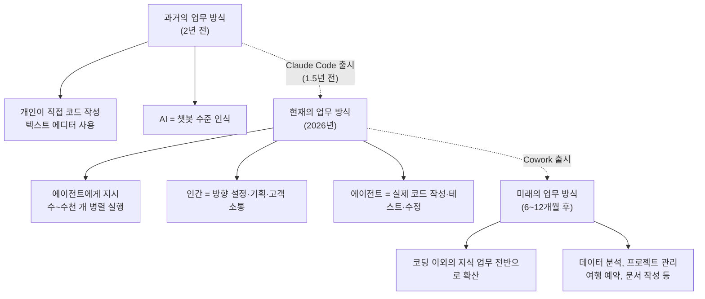
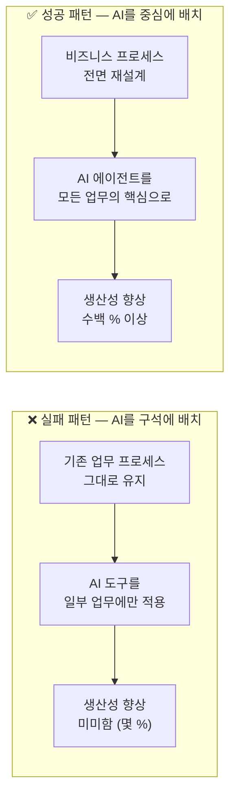
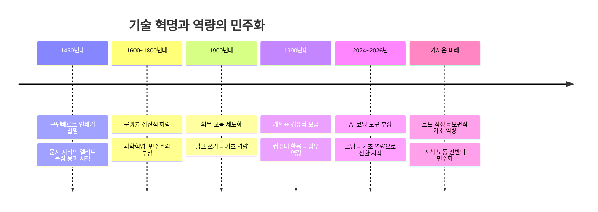
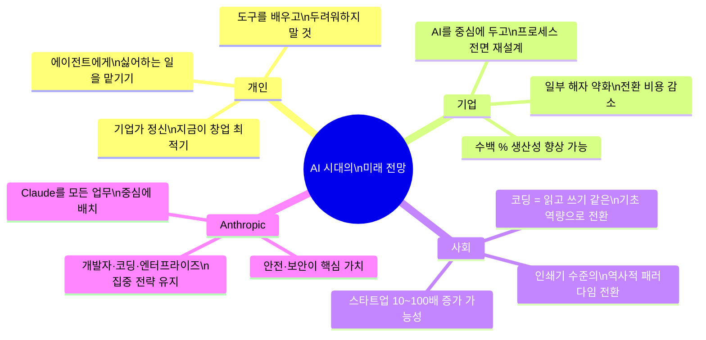

## CNBC 인터뷰 심층 분석 — Boris Cherny (Head of Claude Code, Anthropic)

>- **출처:** CNBC Television | 진행: Kate Rooney | 장소: Anthropic 연례 개발자 컨퍼런스, 샌프란시스코
>- **날짜:** 2026년 5월 7일 | [YouTube 원본 영상](https://www.youtube.com/watch?v=kRgdkOw82F0)

---

## 목차

1. [인터뷰 개요](#1-인터뷰-개요)
2. [Boris Cherny는 누구인가 — 그의 커리어 여정](#2-boris-cherny는-누구인가--그의-커리어-여정)
3. [Claude Code의 탄생 — Anthropic 내부 이야기](#3-claude-code의-탄생--anthropic-내부-이야기)
4. [2026년 개발자 컨퍼런스의 주요 발표 내용](#4-2026년-개발자-컨퍼런스의-주요-발표-내용)
5. [컴퓨팅 자원 전쟁과 Anthropic의 전략](#5-컴퓨팅-자원-전쟁과-anthropic의-전략)
6. [AI 에이전트가 바꾸는 일의 미래](#6-ai-에이전트가-바꾸는-일의-미래)
7. [Cowork — 개발자가 아닌 사람들을 위한 Claude](#7-cowork--개발자가-아닌-사람들을-위한-claude)
8. [기업이 AI 혜택을 보지 못하는 이유 — 하버드 비즈니스 스쿨의 교훈](#8-기업이-ai-혜택을-보지-못하는-이유--하버드-비즈니스-스쿨의-교훈)
9. [고용과 경제에 미치는 영향 — 코끼리를 방 안으로](#9-고용과-경제에-미치는-영향--코끼리를-방-안으로)
10. [소프트웨어 기업의 해자(Moat)는 사라지는가](#10-소프트웨어-기업의-해자moat는-사라지는가)
11. [코딩의 미래 — 인쇄기 발명에 비유한 패러다임 전환](#11-코딩의-미래--인쇄기-발명에-비유한-패러다임-전환)
12. [보안과 취약점 — Mythos 프로젝트](#12-보안과-취약점--mythos-프로젝트)
13. [OpenAI와의 경쟁과 개발자 생태계](#13-openai와의-경쟁과-개발자-생태계)
14. [대학생과 미래 세대에게 주는 조언](#14-대학생과-미래-세대에게-주는-조언)
15. [종합 평가 및 시사점](#15-종합-평가-및-시사점)

---

## 1. 인터뷰 개요

이 인터뷰는 2026년 5월 7일, 샌프란시스코에서 열린 Anthropic의 연례 개발자 컨퍼런스 현장에서 진행되었다. CNBC의 기자 Kate Rooney가 Anthropic의 Claude Code 총괄 책임자인 Boris Cherny와 대담을 나눈 이 영상은, AI가 단순한 기술적 도구를 넘어 인류의 일하는 방식 전체를 근본적으로 재편하고 있다는 메시지를 중심으로 구성되어 있다.

Boris Cherny는 이 인터뷰에서 자신의 개인적 경력 여정부터 시작해, Claude Code가 어떻게 탄생했는지, Anthropic이 이번 컨퍼런스에서 무엇을 발표했는지, 그리고 AI 에이전트가 앞으로 수년 내에 지식 노동 전반을 어떻게 변화시킬 것인지에 대한 심층적인 시각을 제공한다. 특히 그는 현재의 AI 전환을 15세기 인쇄기의 발명에 비유하며, 역사적으로 전례가 없는 수준의 패러다임 전환이 지금 이 순간 일어나고 있다고 강조한다.

---

## 2. Boris Cherny는 누구인가 — 그의 커리어 여정

Boris Cherny는 테크 업계에서 오랫동안 경력을 쌓아온 인물이다. 그의 이야기는 단순히 한 기업인의 성공 스토리가 아니라, AI가 인류에게 어떤 의미인지를 직접 목격하고 행동으로 옮긴 한 사람의 결단에 관한 이야기다.

그는 커리어 초반부터 스타트업을 창업하는 방식으로 테크 업계에 발을 들였다. 첫 번째 도전들은 모두 친구들과 함께 시작한 소규모 창업이었으며, 그는 YC(Y Combinator)에 매우 초기에 참여했다. 그에 따르면 자신이 YC 스타트업에 합류한 첫 번째 엔지니어였으며, 당시 YC는 두세 번째 배치(batch) 정도밖에 진행하지 않은 극초기 시절이었다고 한다. 이는 그가 실리콘밸리 스타트업 생태계의 가장 이른 시기부터 그 흐름 한복판에 있었음을 의미한다.

이후 그는 메타(Meta, 구 Facebook)에서 약 7년간 재직했다. 메타에서 그는 인스타그램(Instagram)의 기술 리드(Tech Lead) 중 한 명으로 활동했을 뿐만 아니라, 메타 전체의 모든 코드베이스에 걸친 코드 품질 관리를 담당하는 중요한 역할을 맡았다. 이 경험은 이후 그가 Claude Code를 만들게 된 핵심적인 토대가 되었는데, 바로 "엔지니어들의 생산성을 높이지 않으면 훌륭한 제품을 만들 수 없다"는 확고한 신념이 이 시기에 형성되었기 때문이다.

메타를 떠난 후, 그는 일본에서 생활하고 있었다. 그가 인터뷰에서 말한 바에 따르면, 일본에 있을 당시 AI 분야에서 "완전히 미친 일"이 일어나고 있음을 직감했고, 이 흐름이 잘못된 방향으로 흘러가서는 안 된다는 강한 사명감을 느꼈다고 한다. 그는 이 기술이 안전하게, 올바른 방식으로 개발되어야 한다는 믿음 아래 Anthropic에 합류하기로 결정했다.

그의 커리어 전반을 관통하는 핵심 가치는 단 하나다. "나는 제품을 만드는 것을 사랑한다. 그리고 훌륭한 제품을 만들기 위해서는 엔지니어들을 생산적으로 만들어야 한다." 이 철학이 Claude Code라는 제품으로 결실을 맺게 된다.

---

## 3. Claude Code의 탄생 — Anthropic 내부 이야기

Boris가 Anthropic에 합류했을 때 처음 배속된 팀은 "Anthropic Labs"였다. 이 팀은 일종의 탐색적 연구·개발 팀으로, 새로운 아이디어를 실험하고 제품화하는 역할을 맡고 있었다. 이 팀은 한 번 목적을 달성하고 해산했다가 다시 복원되었는데, 현재는 인스타그램의 공동 창업자 중 한 명인 Mike Krieger가 이 팀을 다시 이끌고 있다고 그는 전했다.

Boris와 그의 팀이 Anthropic Labs에서 만들어낸 결과물은 네 가지다.

```
1. Claude Code   — AI 기반 코딩 도구
2. MCP           — Model Context Protocol (AI와 외부 도구를 연결하는 프로토콜)
3. Skills        — AI 에이전트의 능력을 확장하는 기능 단위
4. Desktop App   — Anthropic 데스크톱 애플리케이션
```

이 네 가지 제품이 탄생한 배경에는 Anthropic이 설립 초기부터 일관되게 유지해온 세 가지 핵심 집중 영역, 즉 **엔터프라이즈, 안전성, 코딩**이 있다고 Boris는 설명한다. 그는 이 집중력이 처음부터 매우 명확했으며, 그것이 자연스럽게 이 제품들로 이어졌다고 강조한다. Claude Code의 개발은 약 2년 전(2024년경)부터 시작되었으며, 약 1년 반 전에 출시되었다.

---

## 4. 2026년 개발자 컨퍼런스의 주요 발표 내용

이번 Anthropic 개발자 컨퍼런스에서는 모델 발표나 대형 제품 발표는 없었다. 대신, 두 가지 중요한 발표가 이루어졌다.

### 4-1. Managed Agent API

첫 번째는 관리형 에이전트(Managed Agent)를 위한 API 발표다. 이 API는 개발자들이 Anthropic 플랫폼 위에서 AI 에이전트를 훨씬 더 쉽고 매끄럽게 구축할 수 있도록 다양한 도구들을 제공한다. Boris는 이를 "정말 흥미롭다"고 표현했으며, 개발자 생태계의 확장을 위한 핵심 기반이 될 것이라고 설명했다.

### 4-2. Colossus 1 컴퓨팅 파트너십 (with SpaceX)

두 번째 발표는 컴퓨팅 자원에 관한 것으로, Colossus 1이 이제 Anthropic 고객 서비스에 전용으로 사용된다는 내용이다. 특히 SpaceX와의 파트너십을 통해 대규모 컴퓨팅 자원을 추가로 확보하게 되었다는 소식이 포함되었다. 이는 Anthropic의 급격한 성장세에 발맞추어 고객 수요를 충족시키기 위한 전략적 행보다.

---

## 5. 컴퓨팅 자원 전쟁과 Anthropic의 전략

컴퓨팅 자원의 확보는 현재 AI 업계 전체에서 가장 뜨거운 화두 중 하나다. Boris는 Anthropic의 성장세가 "폭발적"이며, 회사가 내부적으로 세운 모든 추정치를 능가하는 속도로 수요가 증가하고 있다고 밝혔다.

그는 Anthropic이 컴퓨팅 자원 관리에 있어 "책임감"을 가장 중요한 원칙으로 삼고 있다고 강조했다. 이는 단순히 AI 안전성에 대한 책임만을 의미하는 것이 아니라, 고객 수요와 컴퓨팅 공급 사이의 균형을 지속 가능한 방식으로 유지하는 것을 포함한다.

인터뷰에서 Kate가 "프로젝트를 위해 더 많은 컴퓨팅이 필요할 때 누구에게 가냐"고 묻자, Boris는 Anthropic이 단기적 필요보다 **장기적 균형**에 초점을 맞춘다고 답했다. 제품에 투입되는 컴퓨팅과 연구에 투입되는 컴퓨팅 사이의 비율을 장기적으로 건강하게 유지하는 것이 핵심이라는 설명이다. 너무 많이 사지도, 너무 적게 사지도 않는 균형 — 이것이 Anthropic의 컴퓨팅 전략이다.

---

## 6. AI 에이전트가 바꾸는 일의 미래

이 인터뷰에서 가장 비중 있게 다루어진 주제 중 하나는 AI 에이전트가 일하는 방식을 어떻게 변화시키고 있는가 하는 점이다.

Boris는 일반 대중이 AI를 "챗봇" 수준으로 인식하고 있는 것이 현실이라고 인정하면서, 2년 전만 해도 프로그래머인 자신도 AI를 그런 식으로 사용했다고 솔직하게 말한다. 그러나 이후 상황은 완전히 달라졌다.

약 1년 반 전 Claude Code가 출시된 이후, 엔지니어들이 코드를 작성하는 방식이 **완전히 변모**했다. 과거에는 텍스트 에디터를 열고 마치 워드 문서를 작성하듯 직접 코드를 한 줄씩 입력했다면, 이제는 에이전트에게 말을 걸고 에이전트가 코드를 작성한다. Boris 자신의 경우, 특정 순간에 수개 또는 수천 개의 에이전트가 동시에 자신의 업무를 수행하고 있을 때도 있다고 했다.

이것이 가져다주는 변화는 단순한 속도의 향상이 아니다. Boris에 따르면 에이전트들이 그가 좋아하지 않는 부분(예: 디버깅, 복잡한 코드 작성)을 대신 처리해주는 동안, 그는 새로운 아이디어를 생각하고, 다음 방향을 기획하고, 고객과 대화하는 데 집중할 수 있게 되었다. 이 변화는 "컴퓨터로 할 수 있는 모든 종류의 업무"로 향후 수년 내에 확산될 것이라고 그는 예측한다.



---

## 7. Cowork — 개발자가 아닌 사람들을 위한 Claude

Cowork의 탄생 배경에는 흥미로운 이야기가 담겨 있다. Claude Code가 출시되고 약 6개월이 지났을 무렵, Anthropic 팀은 사용자들이 이 도구를 코딩 이외의 용도로 사용하기 시작했다는 것을 발견했다.

Boris는 이것이 "제품 개발자로서 볼 수 있는 가장 멋진 일"이라고 표현했다. 시장 수요가 자연 발생적으로 나타난 것이기 때문이다. 사용자들은 Claude Code를 데이터 분석, 프로젝트 관리 등에 활용했고, 심지어 어떤 사람은 트위터(X)에서 Claude Code를 이용해 웹캠으로 토마토 식물을 모니터링하고 영양분 상태를 추적하는 시스템을 만들기도 했다.

이러한 사용 패턴을 포착한 Anthropic은 "코딩을 모르는 사람들도 이 경험을 누릴 수 있어야 한다"는 결론에 도달했고, 그 결과물이 바로 **Cowork**다. Boris에 따르면 Cowork는 초기 Claude Code보다도 더 빠른 속도로 성장하고 있다.

Boris 자신도 Cowork를 개인 생활에서 활발하게 사용하고 있다고 밝혔다. 개발자 컨퍼런스 참석을 위해 이동할 때, Cowork에게 항공권 예약을 맡겼고 그 사이 다른 일에 집중했다는 사례를 들었다.

---

## 8. 기업이 AI 혜택을 보지 못하는 이유 — 하버드 비즈니스 스쿨의 교훈

왜 평범한 기업들은 아직 AI의 혜택을 충분히 경험하지 못하고 있을까? Boris는 이에 대한 답을 1990년대 초반에 발표된 하버드 비즈니스 스쿨의 한 케이스 스터디에서 찾는다.

당시 논문의 핵심 질문은 이것이었다: "컴퓨터는 이미 존재하는데 왜 생산성 향상은 보이지 않는가?" 그리고 논문이 도달한 결론은 명확했다. **생산성 향상의 혜택을 누리려면 컴퓨터를 중심에 놓고 비즈니스 프로세스 전체를 재구조화해야 한다는 것이다.** 낡은 서류 캐비닛들은 그대로 둔 채 구석에 컴퓨터 한 대를 갖다 놓는 것만으로는 아무것도 바뀌지 않는다.

Boris는 이 역사적 교훈이 오늘날의 AI 전환에도 그대로 적용된다고 말한다. 현재 Anthropic 내부에서는 Claude가 모든 업무의 중심에 있으며, 가장 앞서가는 고객사들도 이와 마찬가지로 Claude를 중심에 두고 비즈니스 전체를 재설계하고 있다는 것이다.

그 결과는 놀랍다. 그가 이전 직장에서 개발자 생산성 향상을 위해 노력할 때 기대할 수 있었던 수준이 "몇 퍼센트" 수준의 개선이었다면, 지금 이 방식을 제대로 적용한 기업들이 경험하는 생산성 향상은 **수백 퍼센트**에 달하며, 그 개선 속도 자체도 계속 빨라지고 있다. Boris는 이것을 단순한 개선이 아닌 "완전한 상전이(phase change)"라고 표현했다.



---

## 9. 고용과 경제에 미치는 영향 — 코끼리를 방 안으로

이 대담에서 Kate Rooney는 많은 사람들이 가장 두려워하는 질문을 직접적으로 꺼냈다. "AI가 일자리를 없애지 않겠느냐"는 것이다.

Boris는 이 질문에 대해 단기와 장기를 분리하여 답한다. 장기적 전망은 예측하기 어렵고 많은 경제학자들이 연구 중인 분야라고 인정하면서, 단기적으로는 오히려 기회가 창출되고 있다고 말한다.

그가 관찰하는 단기적 변화는 "해방"이다. 사람들이 원하지 않는 반복적이고 힘든 업무에서 해방되고 있다는 것이다. 엔지니어인 그에게는 그것이 디버깅이나 복잡한 코드 구현 같은 작업이었다. 일반인에게는 항공권 예약 같은 행정적 업무가 될 수 있다.

그러나 Boris는 경제 전체에 미치는 영향에 대해 단정적인 결론을 내리지 않는다. 그가 확신하는 것은 하나다. 지금 당장 보이는 것은 **새로운 기회의 창출**이라는 점이다. 그리고 소프트웨어 기업들에 미치는 영향에 대해서는, 일부 기존의 "해자(moat)"는 사라질 수 있지만, 많은 기존의 강점들은 여전히 유효하며 모든 것이 가속화되고 있는 방향으로 흘러가고 있다고 말한다.

특히 그가 언급한 사라지는 해자의 예시는 **전환 비용(switching cost)** 이다. Claude가 한 소프트웨어에서 다른 소프트웨어로의 전환을 훨씬 쉽게 만들어주는 코드를 작성해줄 수 있기 때문에, 전통적으로 사용자를 붙잡아두던 전환 비용의 장벽이 낮아지고 있다는 것이다.

---

## 10. 소프트웨어 기업의 해자(Moat)는 사라지는가

AI가 소프트웨어 기업의 경쟁 우위, 즉 해자에 어떤 영향을 미치는지에 대한 질문도 심도 있게 다루어졌다.

Boris의 시각은 미묘하고 균형 잡혀 있다. 일부 해자는 분명히 약화되거나 사라지고 있다. 앞서 언급한 전환 비용이 대표적인 예다. Claude를 활용하면 한 소프트웨어 플랫폼에서 다른 플랫폼으로 마이그레이션하는 코드를 훨씬 쉽게 작성할 수 있기 때문에, 과거에는 높은 전환 비용 때문에 특정 소프트웨어에 "잠겨 있던" 기업들이 이제는 훨씬 자유롭게 이동할 수 있다.

그러나 그는 기존 해자들이 완전히 사라진다고 보지 않는다. **대부분의 전통적 경쟁 우위는 여전히 유효하며, 다만 모든 것의 속도가 빨라지고 있을 뿐이라는 것이 그의 관점이다.** 브랜드, 네트워크 효과, 데이터, 규제 관계 같은 요소들은 AI의 등장으로 사라지지 않는다.

Anthropic 자신도 자사의 도구를 독점적으로 쌓지 않는다는 점도 언급했다. Claude Code가 구축된 기반인 Claude Agent SDK와 Anthropic API는 전 세계 개발자 누구나 사용할 수 있도록 공개되어 있으며, 수천 명의 개발자들이 동일한 스택 위에서 새로운 비즈니스와 스타트업을 구축하고 있다.

---

## 11. 코딩의 미래 — 인쇄기 발명에 비유한 패러다임 전환

이 인터뷰에서 가장 인상적이고 광범위하게 인용될 발언은 아마도 이 부분일 것이다.

Kate Rooney가 "소프트웨어 개발자라는 직업 자체가 사라지는가"라고 물었을 때, Boris Cherny는 다음과 같은 예언적 답변을 내놓았다.

> *"나의 예측은 소프트웨어가 읽고 쓰기와 같은 기초 역량이 될 것이라는 것입니다. 1400년대에는 대부분의 사람들이 읽고 쓰지 못했지만, 지금은 대부분의 사람들이 글을 읽고 씁니다. 그것이 현대 사회에서 필요한 기초 역량이 되었기 때문입니다. 코드를 작성할 수 있는 능력도 같은 방향으로 갈 것이라고 생각합니다."*

이 비유는 단순한 미사여구가 아니다. 15세기 인쇄기(구텐베르크 프레스)의 발명 이후 수백 년에 걸쳐 유럽 전체의 문맹률이 극적으로 낮아지고, 그 결과 과학 혁명, 민주주의, 산업혁명 같은 거대한 사회 변화가 가능해졌다. Boris는 AI 코딩 도구의 등장이 이와 유사한 역할을 할 것이라고 본다.

Claude와 같은 도구에 말을 걸어 원하는 소프트웨어를 만들어낼 수 있는 능력이 보편화되면, 지금 전문 프로그래머만이 할 수 있는 일을 훨씬 더 많은 사람들이 할 수 있게 된다. 물론 전문 개발자라는 직업 자체는 사라지지 않는다. 마치 "글을 쓸 줄 아는 사람들이 많아졌지만, 전문 작가라는 직업은 여전히 존재하고 중요한 것처럼" 말이다. 그는 Kate Rooney가 실제로 책을 쓰고 있다는 사실을 언급하며 이 비유를 더욱 생생하게 만들었다.

그리고 그는 이 모든 것의 역사적 의미를 이렇게 압축했다:

> *"이것은 인쇄기의 순간입니다. 역사에서."*



---

## 12. 보안과 취약점 — Mythos 프로젝트

AI 에이전트의 역할이 커질수록 보안은 더욱 중요한 화두가 된다. Kate Rooney가 이 주제를 꺼냈을 때, Boris는 보안이 Anthropic에게 단순한 기능적 요구사항이 아니라 회사가 가장 중요하게 여기는 핵심 가치와 직결된 문제라고 답했다.

그는 최근 일어난 중요한 변화를 이렇게 설명했다. 현재 Claude 같은 AI 모델은 거의 모든 종류의 소프트웨어에서 취약점을 **탁월하게** 찾아낼 수 있는 수준에 도달했다. 이것은 불과 3개월 전에도 해당되지 않던 이야기다. 즉, 모델의 보안 취약점 탐지 능력이 극히 최근에 질적으로 전환(phase change)된 것이다.

이 변화는 위협 모델 자체를 새롭게 만들고 역학 구도를 완전히 바꾸어 놓았다. Anthropic의 대응 전략은 명확하다. **선의의 방어자들(good guys)이 최고의 모델을 먼저 갖추어 소프트웨어를 방어하고, 취약점을 먼저 발견하고 패치할 수 있게 하는 것이다.** 나쁜 행위자들이 같은 도구를 활용하기 전에 방어체계를 구축하는 것이 핵심이다.

Anthropic이 내부적으로 고급 사이버 보안 역량과 관련해 개발하고 있는 "Mythos" 프로젝트에 대해서는, Kate가 더 넓은 범위의 개발자들에게 배포할 계획이 있는지 물었고, Boris는 "현재 Mythos를 광범위하게 배포할 계획은 없다"고 명확하게 답했다.

---

## 13. OpenAI와의 경쟁과 개발자 생태계

OpenAI와의 경쟁에 대한 질문에서 Boris는 방어적이거나 공격적인 언어를 일절 사용하지 않고, 오히려 Anthropic의 일관된 집중력을 강조했다.

그에 따르면 Anthropic은 처음부터 지금까지 변하지 않는 세 가지 집중 대상이 있다. **개발자, 코딩, 엔터프라이즈.** 이 집중력은 앞으로도 바뀌지 않을 것이라고 그는 단언했다.

자신이 매일 사용자들과 직접 대화하고, 스스로 개발자로서 자신이 사용하고 싶은 제품을 만든다는 점도 강조했다. 이것은 경쟁자를 의식한 제품 개발이 아니라, 내부에서 진정성 있게 필요를 느끼고 만들어가는 방식임을 의미한다.

특히 그는 개발자 커뮤니티의 중요성을 이렇게 표현했다. 오늘 이 자리에 모인 개발자들이야말로 미래의 회사들을 만들어갈 사람들이라는 것이다. 그래서 Anthropic에게 개발자와 엔터프라이즈는 단순한 고객층이 아니라 핵심 파트너이자 생태계를 함께 만들어가는 주체들이다.

인재 확보 전쟁에 대해서도 흥미로운 관점을 제시했다. AI 도구가 발전하면서 "좋은 엔지니어"의 기준이 바뀔 수 있지 않느냐는 질문에, 그는 여전히 훌륭한 사람들을 보유하는 것이 중요하다고 답했다. 다만 그것이 항상 엔지니어일 필요는 없으며, 때로는 프로덕트 매니저, 디자이너, 또는 다른 역할의 최고 인재가 더 중요할 수도 있다고 말했다.

---

## 14. 대학생과 미래 세대에게 주는 조언

인터뷰의 후반부, Kate Rooney는 경제학을 전공한 Boris에게 지금 대학교 3~4학년으로서 미래를 설계하고 있는 학생들에게 어떤 조언을 하겠느냐고 물었다.

Boris의 답변은 두 가지로 구성되었다.

**첫 번째 조언 — 도구를 배우고 두려워하지 말 것:**
에이전트를 두려워하지 말고, AI를 두려워하지 말라는 것이다. 오히려 적극적으로 뛰어들어 직접 사용해보고, 어떤 방식이 자신에게 맞는지 탐색해보라는 조언이다. 그는 새로운 모델이 나올 때마다 이전 버전의 기억으로만 판단하지 말 것을 당부했다. 1년 전 모델과 현재 모델 사이에는 엄청난 차이가 있으며, 매번 시도해볼 때마다 완전히 달라진 능력을 발견하게 될 것이라고 했다.

**두 번째 조언 — 기업가적 마인드가 있다면 지금 당장 창업하라:**
Boris는 지금이 스타트업을 시작하기에 역사상 가장 좋은 시기라고 단언한다. 엄청난 혁신이 지금 이 순간 일어나고 있으며, 앞으로 더 큰 혁신이 예정되어 있다는 것이다. 그는 이를 "황금 시대(golden age)"라고 표현했다.

Kate가 "스타트업이 너무 많아지는 것 아니냐"고 반문했을 때, Boris는 놀라운 답변을 내놓았다. 앞으로 10년 안에 지금보다 스타트업이 10배, 심지어 100배 많아질 수도 있으며, 그것이 전혀 이상한 일이 아니라고 했다. AI 도구가 창업의 장벽을 극적으로 낮추고 있기 때문이다.

NASA의 사례도 언급되었는데, NASA가 화성 탐사 로버의 경로를 계획하는 데 Claude Code를 사용하고 있다는 사실은, 코딩 분야에서의 AI 채택이 이미 포천(Fortune) 100대 기업부터 개인 주말 프로젝트까지 전 스펙트럼에 걸쳐 일어나고 있음을 보여주는 사례로 제시되었다.

---

## 15. 종합 평가 및 시사점

이 인터뷰는 표면적으로는 한 AI 제품의 책임자가 자사의 기술을 소개하는 자리처럼 보이지만, 실제로는 현재 진행 중인 기술적·사회적 전환의 규모와 방향성에 대한 매우 중요한 증언을 담고 있다.

Boris Cherny가 제시한 핵심 메시지를 정리하면 다음과 같다.

첫째, **AI 에이전트는 이미 현실이다.** 수천 개의 에이전트가 동시에 운영되며 실제 업무를 수행하는 것은 미래의 이야기가 아니라 오늘 일어나고 있는 일이다.

둘째, **기업의 변화는 AI 도구 도입이 아니라 프로세스 재설계에 달려 있다.** 1990년대 컴퓨터 혁명에서 얻은 교훈처럼, AI를 기존 업무 방식 위에 얹는 것만으로는 충분하지 않다. AI를 중심에 두고 전체를 재구성해야 수백 퍼센트의 생산성 향상을 경험할 수 있다.

셋째, **코딩은 문해력처럼 보편적 기초 역량이 될 것이다.** 이것은 프로그래머라는 직업이 사라진다는 의미가 아니라, 훨씬 더 많은 사람들이 소프트웨어를 활용할 수 있게 된다는 의미다. 전문 작가가 여전히 필요하듯, 전문 개발자도 여전히 필요할 것이다.

넷째, **우리는 인쇄기 수준의 역사적 전환점에 있다.** Boris의 이 발언은 과장이 아닐 수 있다. 인쇄기가 수백 년에 걸쳐 사회를 바꾸었다면, AI는 그 변화를 훨씬 빠른 속도로 진행시킬 것이다.

마지막으로, 보안은 이 전환의 핵심 과제다. AI가 소프트웨어 취약점을 탁월하게 발견할 수 있게 된 것은 방어자와 공격자 모두에게 새로운 현실이다. Anthropic이 "선한 쪽이 최고의 도구를 먼저 갖추어야 한다"는 원칙 아래 이 분야에 집중하는 것은 단순한 사업 전략이 아니라 사회적 책임의 표명이기도 하다.



---

## 부록: 주요 발언 요약

| 주제 | Boris Cherny의 핵심 발언 |
|------|------------------------|
| AI 에이전트 현실 | "어떤 순간에는 수천 개의 에이전트가 내 업무를 수행하고 있다" |
| 기업의 AI 전환 | "AI를 중심에 두고 비즈니스 프로세스 전체를 재구조화해야 한다" |
| 생산성 향상 | "수백 퍼센트 개선, 그리고 그 속도는 계속 빨라지고 있다" |
| 코딩의 미래 | "소프트웨어는 읽고 쓰기와 같은 기초 역량이 될 것이다" |
| 역사적 의미 | "이것은 인쇄기의 순간이다, 역사에서" |
| 스타트업 기회 | "10년 안에 지금보다 10배, 100배 더 많은 스타트업이 생길 수 있다" |
| 보안 전략 | "선한 쪽이 최고의 모델을 먼저 갖추어 소프트웨어를 방어해야 한다" |
| 인재 전쟁 | "훌륭한 사람들을 보유하는 것은 여전히 중요하다" |

---

*작성일: 2026-05-07*
*출처: CNBC Television — "Head of Claude Code on the future of work and productivity" (2026.05.07)*
