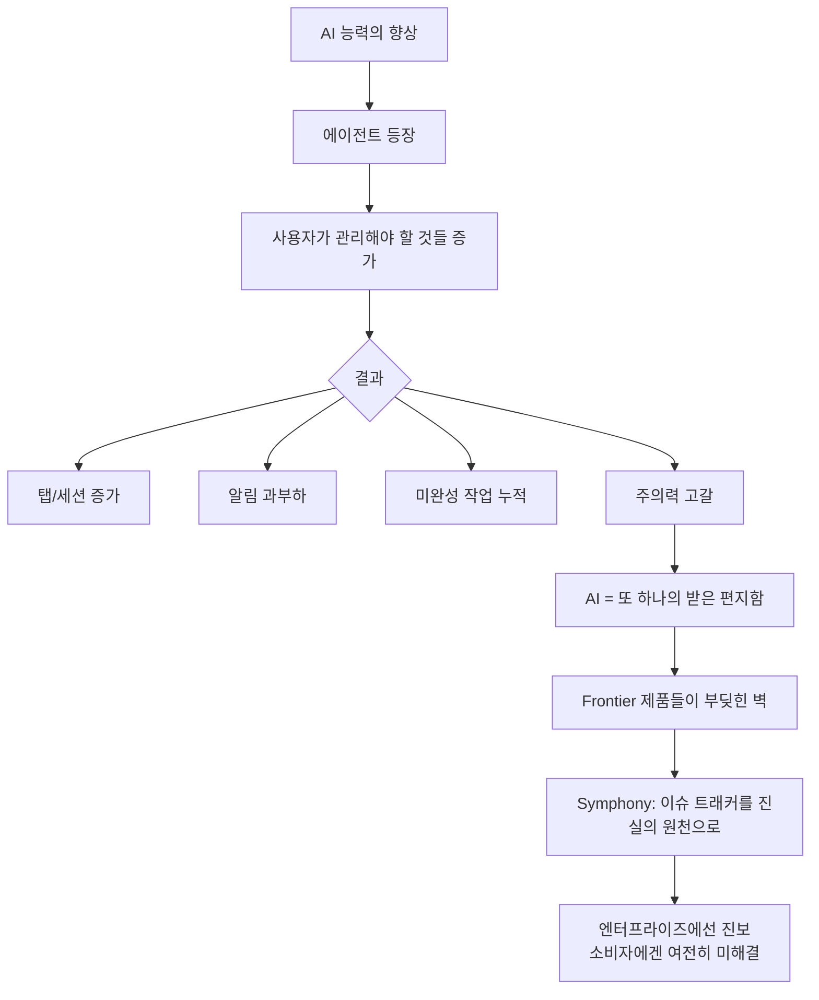
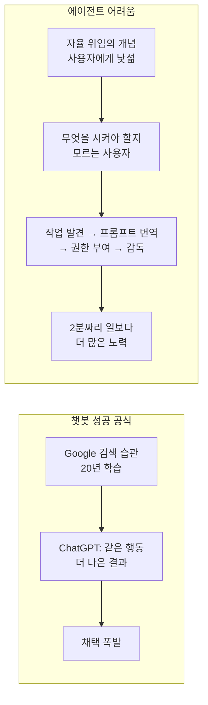
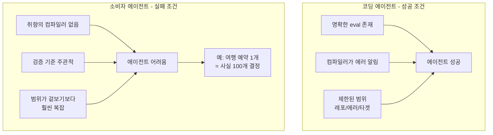
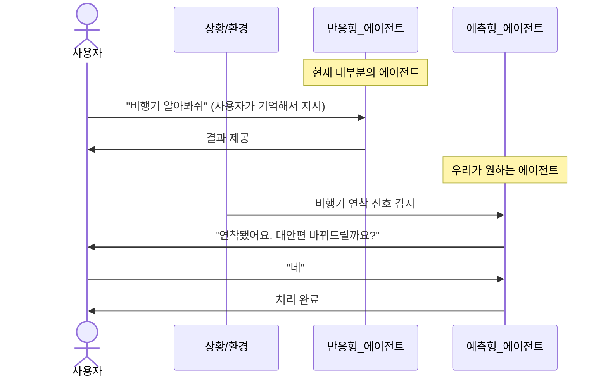
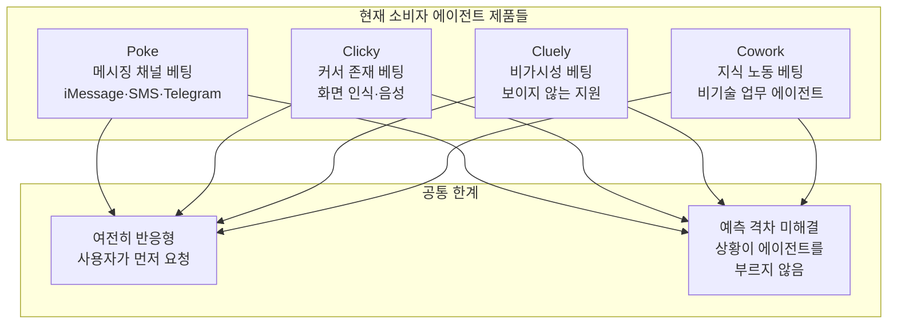
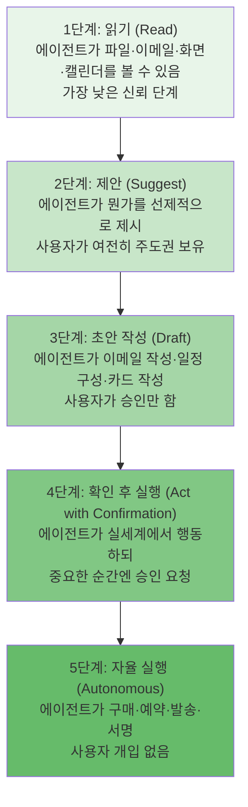
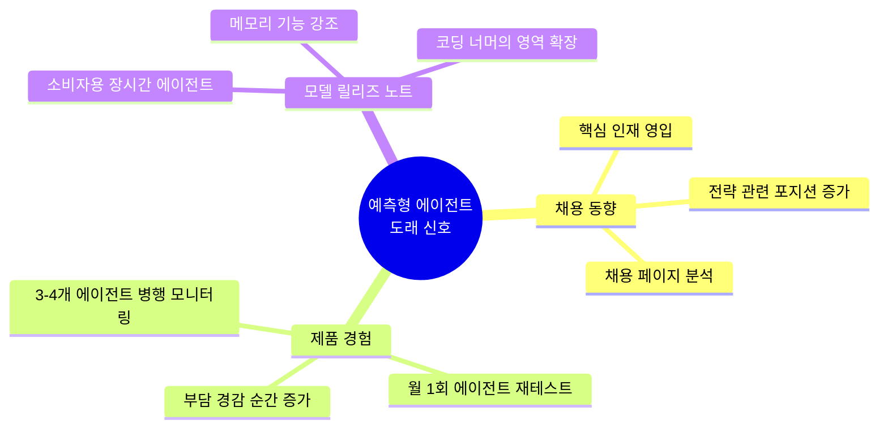
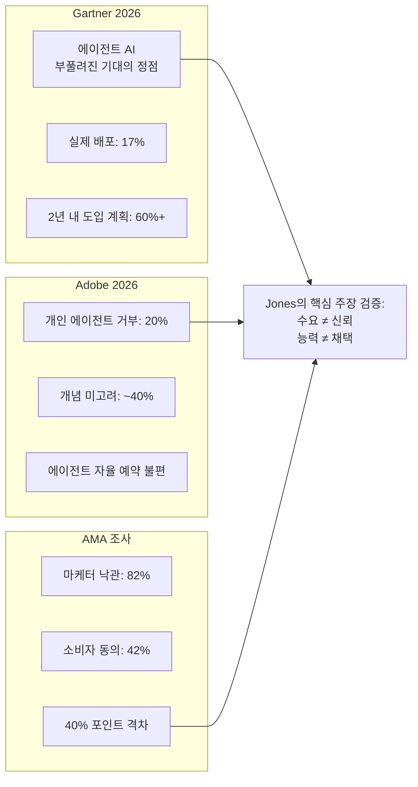
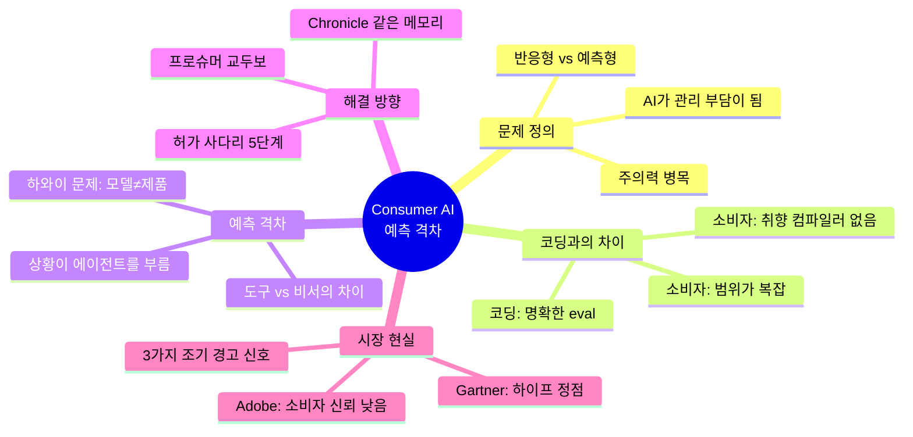

> **출처:** "Consumer AI Has a Problem Nobody's Naming" — Nate B Jones (AI News & Strategy Daily)  
> **영상 링크:** https://www.youtube.com/watch?v=Z0HizICooiw  
> **원문 뉴스레터:** https://natesnewsletter.substack.com/p/consumer-ai-anticipation-gap  
> **영상 공개일:** 2026년 5월 5일 (Seattle)  
> **분석 작성일:** 2026-05-07

---

## 들어가며: 2026년 AI의 역설

2026년 현재, 인공지능은 마침내 "실제로 도움이 될 만큼" 충분히 유능해졌다. 모델 능력의 측면에서는 의심의 여지가 없다. 코드를 작성하고, 웹을 탐색하고, 문서를 요약하고, 멀티스텝 작업을 수행하는 AI는 이미 현실이다. ChatGPT는 2026년 2월 기준 주간 사용자 9억 명을 돌파했고, Claude는 일상 언어가 되었으며, Gemini는 매일 10억 명의 검색 사용자에게 닿는다.

그런데 역설적인 일이 벌어지고 있다. AI가 강해질수록, 사용자들은 AI를 **관리해야 할 또 하나의 일거리**로 느끼기 시작했다. Nate B Jones는 이 문제를 정면으로 겨냥한다. 그는 단순히 "AI가 아직 부족하다"는 말을 하는 게 아니다. 그는 훨씬 더 날카로운 질문을 던진다: **왜 AI는 능력이 충분한데도 우리 어머니가 쓸 수 없는가? 왜 도움이 되려면 내가 먼저 알아채고, 지시하고, 확인하고, 재시작해야 하는가?**

이 분석 문서는 해당 영상의 내용을 한국어로 완전히 풀어내고, 2026년 최신 업계 동향과 함께 그 의미를 해석한다.

---

## 1부: 문제의 본질 — AI는 또 하나의 받은 편지함이 되었다

### 1-1. 관리 부담의 역설

Jones가 가장 먼저 짚는 것은 "에이전트가 많아질수록 내 업무가 늘어나는" 아이러니다. 오늘날의 AI 에이전트 생태계를 떠올려보자. 탭이 늘어난다. 세션이 쌓인다. 완료되지 않은 작업들이 여기저기 흩어진다. 알림이 울린다. 결과를 확인해야 한다. 방향을 수정해야 한다. 멈춘 작업을 재시작해야 한다. 이것은 비서가 하는 일이 아니다. **이것은 새로운 받은 편지함(inbox)이다.**

그는 이 상황을 '2026년 Frontier 제품들이 이미 부딪힌 벽'이라고 부른다. 인간의 주의력(attention)이 바닥나고 있다는 것이다. OpenAI의 워크스페이스 에이전트는 Slack과 클라우드에서 장시간 작업을 수행하도록 설계되어 있다. AWS는 신원과 로그와 운영 제어 기능을 갖춘 관리형 에이전트를 이야기한다. 그리고 OpenAI 개발자들이 내부적으로 겪은 **인간 주의력 병목(human attention bottleneck)** 문제를 해소하기 위해 Symphfony라는 오픈소스 프로토콜이 등장했다.

### 1-2. Symphony의 교훈

Symphfony는 OpenAI 엔지니어들이 빠른 코딩 에이전트를 보유하고 있었음에도 사람들이 여전히 세션을 열고 작업을 할당하고 진행 상황을 확인하고 에이전트를 재시작하느라 머릿속에 모든 것을 담아두어야 했던 경험에서 탄생했다. Symphfony는 이 부담을 **이슈 트래커**라는 명확한 진실의 원천(source of truth)으로 옮겼다. 에이전트가 작업을 집어 들고, 사람은 결과만 검토한다.

Jones는 이것이 진보이긴 하지만 충분하지는 않다고 평가한다. 그리고 소비자 AI에 있어서는 문제가 훨씬 더 복잡하다. 왜냐하면 **소비자의 인생에는 깔끔한 이슈 트래커가 없기 때문이다.** 어머니는 GitHub가 무엇인지 모른다.

---

## 2부: 실제 욕구 vs. 현재 제품 — 기대 격차

### 2-1. Jones가 진짜 원하는 것

Jones는 자신의 실제 삶을 솔직하게 묘사한다. 집 캘린더, 업무 캘린더, 복수의 받은 편지함, 아마 지키지 못할 약속들, 가족 물류, 학교 이메일, 여행 변경, 청구서, 리마인더, Slack 대화, 학교 서류들. **어떤 앱도 이 모든 것을 이해한 적이 없다.**

그가 원하는 것은 에이전트 관리(agent management)의 정반대다. 그는 이런 AI를 원한다:

- 내 비행기가 연착된 것을 **내가 알아채기 전에** 먼저 알아채는 에이전트
- 학교 이메일을 보고 "금요일까지 서명이 필요한 허가서가 있어요"라고 조용히 알려주는 에이전트
- 뒤엉킨 캘린더와 미완성 장 보기 목록과 긴장이 고조되는 업무 스레드를 훑어보고 "제가 다음 단계를 처리할 수 있어요. 원하시나요?"라고 물어보는 에이전트

이 묘사에서 핵심은 **사용자가 기억해서 호출하는 게 아니라, 상황이 에이전트를 불러낸다**는 것이다. 도구(tool)와 비서(assistant)의 차이가 바로 여기에 있다. 도구는 당신이 기억해주기를 기다린다. 비서는 당신이 기억해야 할 것들의 수를 줄여준다.

### 2-2. 챗봇이 채택된 이유와 에이전트가 어려운 이유

ChatGPT가 폭발적으로 성장한 이유를 Jones는 행동 변화의 최소화로 설명한다. 20년간 사용자들은 검색창에 쿼리를 입력하는 행동을 Google을 통해 학습했다. ChatGPT는 거대한 능력의 도약이었지만 **극히 작은 행동의 변화**였다. Google 대신 ChatGPT에 타이핑하면 됐다. 인지적 재학습이 거의 필요 없었다.

에이전트는 그 혜택을 누릴 수 없다. 대부분의 사람들은 아침에 일어나서 "오늘은 어떤 생활 행정 업무를 자율 시스템에 할당해야 하지?"라는 생각을 하지 않는다. 에이전트를 설치한 후 가장 많이 나오는 질문은 단 하나다: **"이걸로 뭘 해요?"**

더 근본적인 문제가 있다. 사람에게 예약을 위임할 때 그 위임은 수년간 쌓인 공유된 역사, 취향, 맥락, 판단력 위에서 작동한다. 소프트웨어는 이것을 공짜로 얻지 못한다.

---

## 3부: 소비자 AI의 핵심 난제 — 검증 없는 세계

### 3-1. 코딩 에이전트는 왜 성공했는가

Jones는 코딩 에이전트가 2025년 12월~2026년 1월 사이 티핑 포인트를 넘어 기본 워크플로우로 자리 잡았다고 설명한다. Cursor, Claude Code, Codex 스타일의 도구들이 그 주역이다. 이 성공에는 구조적인 이유가 있다.

코딩에는 **깔끔한 검증(clean verification)** 이 있다. 코드는 실행되거나 실행되지 않거나 둘 중 하나다. 테스트는 통과하거나 실패하거나 둘 중 하나다. 컴파일러가 무엇이 잘못되었는지 알려준다. 에이전트의 작업 결과를 평가할 명확한 eval이 존재한다. 또한 코딩은 **제한된 범위(bounded scope)** 를 갖는다. "이 버그를 고쳐라"라는 명령에는 레포지토리, 에러, 작업, 타겟이 명확하다.

소비자 생활에는 이 두 가지 모두 없다.

### 3-2. 취향에는 컴파일러가 없다

Jones가 날카롭게 지적하는 부분이다. 에이전트가 올바른 항공편을 예약했는가? 모르겠다. 도착은 했지만 시간이 잘못됐을 수도 있다. 올바른 식당을 골랐는가? '올바른'의 기준이 무엇인가? 회의를 정확하게 요약했는가? **취향에는 컴파일러가 없다.** 생활 행정에는 테스트 스위트가 없다.

거기에 더해 소비자 작업은 범위가 보기와 달리 복잡하다. "여행을 예약해줘"라는 단순해 보이는 명령에는 가족 선호도, 캘린더 제약, 취소 허용 범위, 도착 후 계획, 숙박, 렌터카 등 무수한 하위 변수가 숨어 있다. Expedia가 존재하는 이유가 바로 이 복잡성 때문이다. 수천 명의 개발자가 이 문제를 해결하기 위해 매달리고 있다.

---

## 4부: 예측 격차(Anticipation Gap) — 핵심 개념의 정의

### 4-1. 예측 격차란 무엇인가

이 영상에서 Jones가 제안하는 가장 중요한 개념이다. 그는 AI의 프론티어가 더 이상 "AI가 대답할 수 있는가"나 "AI가 행동할 수 있는가"가 아니라고 주장한다. 진짜 프론티어는 다음이다:

> **"AI가 나를 새로운 관리 계층으로 끌어들이지 않고도 유용한 일을 할 수 있는가?"**

현재 대부분의 에이전트들은 여전히 **반응형(reactive)** 이다. 당신이 앱을 열고, 원하는 것을 말하고, 에이전트가 실행한다. 이것이 agency처럼 들리지만, 가장 어려운 작업은 여전히 사용자의 어깨 위에 있다. 사용자가 에이전트가 무엇을 하고 있는지 파악해야 한다. 에이전트를 완전히 신뢰할 수 없기 때문에.

돌파구는 단순히 "오래 실행되는 에이전트"가 아니다. Jones가 말하는 예측 격차의 본질은 이것이다:

> **"당신이 X를 해달라고 요청하는 것"에서 "이것이 X가 중요한 순간입니다, 제가 처리할까요?"로의 이동.**

### 4-2. 예측이란 무엇이 아닌가

Jones는 예측(anticipation)이 마법이 아님을 분명히 한다. 에이전트가 모든 것을 추측하고 당신의 삶을 대신 운영하는 것이 아니다. 그것은 **올바른 순간에, 올바른 수준의 개입으로, 올바른 질문을 하는 것**이다.

실제 예시를 통해 설명하면:

- 비행기가 연착된다 → 에이전트가 말한다: "오늘 밤 도착 가능한 나중 비행편이 있어요. 바꿔드릴까요?"
- 아이 학교에서 이메일이 온다 → 에이전트가 말한다: "오늘 현장학습 허가서가 필요해요. 불러드렸어요."
- 업무 스레드가 긴장된다 → 에이전트가 말한다: "신중한 답변이 필요해 보여요. 중립적인 톤으로 초안을 작성해드릴게요."
- 장 보기 목록이 길어진다 → 에이전트가 말한다: "수요일 배송으로 바꿀 수 있어요. 검토해드릴까요?"

이 모든 경우에서 공통점이 있다. **사용자가 에이전트를 기억해서 부르지 않는다. 상황이 에이전트를 불러낸다.**

### 4-3. 과거에 좁은 버전의 예측을 이룬 사례들

Jones는 소비자 소프트웨어가 이미 예측 격차의 작은 버전들을 넘어선 역사가 있다고 지적한다.

- **푸시 알림**: 앱을 열지 않아도 메시지가 왔다는 것을 알게 되었다
- **추천 피드**: 무엇을 보고 싶은지 알기 전에 콘텐츠가 나타났다 (유튜브가 이 영상을 추천했을 수도 있다)
- **자동완성**: 쿼리를 끝내기 전에 다음 단어가 나타났다
- **스마트 답장**: 이메일 답변을 처음부터 구성하지 않아도 다음 단계가 나타났다

그러나 이 기능들이 작동한 이유는 **좁고, 경계가 명확하고, 되돌릴 수 있었기** 때문이다. 알림을 무시할 수 있었다. 추천을 건너뛸 수 있었다. 에이전트는 이와 같은 일을 하려고 하지만, **여러 도메인에 걸쳐, 실세계 액션을 포함하고, 오류 비용이 훨씬 높은 상황에서** 해야 한다.

---

## 5부: 현재 시장의 세 가지 베팅

Jones는 현재 시장에서 예측 격차를 넘으려는 몇 가지 제품을 분석한다.

### 5-1. Poke — 메시징 인터페이스에 거는 베팅

Poke는 인터페이스가 메시징이어야 한다는 강력한 베팅이다. 메시징은 인지적 비용이 거의 없다. 사람들은 이미 하루 종일 문자를 보낸다. 인터페이스가 소프트웨어처럼 느껴지지 않고 연결처럼 느껴진다. iMessage, SMS, Telegram에서 살며 이메일과 캘린더와 검색에 연결된다.

문제는 메시징 레일이 Poke의 완전한 통제 하에 있지 않다는 것이다. Apple, Meta, SMS 비용 등이 제품의 일부가 된다. 그리고 **현저성(salience)** 문제가 있다. Poke가 나에게 무엇이 중요한지 어떻게 아는가? Jones는 실제 사용 경험에서 아직 완전하지 않다고 평가한다. 비전은 보이지만, 모델이 더 좋아지면 더 유용해질 것이라는 베팅을 하고 있다고 해석한다.

### 5-2. Clicky — 커서 존재에 거는 베팅

Clicky는 Mac에서 커서 옆에 앉는다. 도움을 요청하면 화면을 보고, 말로 명령할 수 있으며, 요소를 가리킬 수 있다. 이것이 중요한 이유는 사용자의 고통 대부분이 자신이 완전히 이해하지 못하는 소프트웨어 안에서 발생하기 때문이다. Figma, Photoshop, Excel의 모든 설정을 다 아는 사람이 없다. 사용자는 답을 보고 있지만 그것이 무엇인지, 어디를 클릭해야 하는지 모른다.

커서가 주의가 어디에 있는지를 알려준다는 점에서 Jones는 Clicky가 결국 예측으로 나아갈 수 있다고 본다. 하지만 현재는 여전히 반응형이다.

### 5-3. Cluely — 보이지 않는 존재에 거는 베팅

Cluely는 "모든 것에서 속임을 써라(cheat on everything)"는 프레이밍으로 유명해졌다. 인터뷰, 시험 등에서의 사용으로 논란이 됐지만, 그 아래에는 진짜 행동 패턴이 있다. **AI 사용이 가시적일 때는 사회적 비용이 든다. 그래서 보이지 않는 AI 사용이 유리하게 느껴진다.**

Jones가 직접 사용한 경험에서 두 가지 문제를 지적한다: 답변이 틀에 박혀 있어서 자신의 말로 표현하면 어리석어 보일 것 같다는 점, 그리고 느리다는 점이다. 면접관들이 AI 사용을 탐지하는 방법은 흔히 **멈춤과 갑작스러운 깊이의 변화**라고 Jones는 설명한다. 에이전트는 당신이 이미 알고 있는 것을 강화해주어야지, 당신을 부자연스럽게 만들어서는 안 된다.

### 5-4. Chronicle — 미래를 향한 단서

Jones가 특별히 주목하는 것이 Codex가 출시한 메모리 기능인 Chronicle이다. Chronicle을 활성화하면 "오늘 아침 어떤 작업을 했는지 보고 어떻게 도와줄 수 있나요?"라고 물었을 때, 에이전트가 스스로 작업 패턴을 파악해서 제안한다. Jones의 경험에서 Chronicle은 프로세스 문서(SOP)를 작성하는 작업을 제안했고, 실제로 80~85% 수준의 초안을 완성했다.

중요한 점은 **Jones가 스스로 그 작업을 Codex에 할당할 생각을 하지 않았다**는 것이다. 에이전트가 먼저 알아채고 제안했다. 이것이 예측형 에이전트로 향하는 방향의 단서다.

---

## 6부: 허가 사다리(Permission Ladder) — 에이전트 자율성의 구조

Jones가 제시하는 가장 실용적인 프레임워크는 허가 사다리다. 에이전트 자율성을 한 번에 최대로 부여하는 것은 소비자 신뢰를 무너뜨릴 위험이 있다. 신뢰는 한 번 깨지면 회복이 어렵다. 인간은 손실 회피(loss aversion) 성향이 있기 때문이다. 그래서 단계적인 접근이 필요하다.

Jones의 핵심 경고는 많은 사람들이 5단계로 바로 건너뛰려 한다는 것이다. 에이전트가 당신의 카드로 구입하고, 예약하고, 발송하고, 서명하는 것은 신뢰를 올바르게 구축했을 때만 소비자에게 용납된다. Stripe가 에이전트 지갑(agent wallets)을 출시했다는 것은 이 미래가 현실이 되고 있다는 신호다. 그러나 그 전에 우리는 에이전트가 올바른 순간에, 올바른 수준의 개입으로, 올바른 권한으로 행동한다는 것을 신뢰해야 한다.

---

## 7부: 조기 경고 신호 — 예측형 에이전트의 도래를 어떻게 알 수 있는가

Jones는 예측형 에이전트의 시대가 언제 올지 알려줄 세 가지 조기 경고 신호를 제시한다.

### 7-1. 핵심 채용 동향 관찰

OpenAI가 OpenClaw로 유명한 Peter Steinberger를 영입한 것이 대표적인 신호다. 기업의 전략 방향은 채용 페이지에 공개적으로 드러난다. Jones는 Anthropic의 채용 페이지가 HR 테크를 향하고 있다는 것도 언급한다. 공개 정보다. 지원하는 회사의 채용 페이지 전체를 보면 회사의 전략 전반을 파악할 수 있다.

### 7-2. 부담 경감(Load Lifting)의 증가 관찰

특정 에이전트가 어깨의 짐을 덜어주는 느낌을 주는 순간들을 주목하라. Jones는 3~4개의 에이전트를 동시에 수개월에 걸쳐 테스트한다. 시간이 지남에 따라 그런 순간이 늘어나는지, 줄어드는지를 본다. 늘어나면 그 제품이 올바른 방향으로 가고 있다는 신호다. 한 달에 한 번 다시 시도해보는 것만으로도 충분하다.

### 7-3. 모델 릴리즈 노트 관찰

새로운 프론티어 모델이 출시될 때 릴리즈 노트를 주목하라. 코딩을 위한 장시간 에이전트 작업뿐만 아니라 **소비자를 위한 메모리가 있는 장시간 에이전트 의도(long-running agentic intent with memory for consumers)** 에 대해 이야기하기 시작한다면, 그것이 예측형 에이전트가 "거의 해결된 문제"에 가까워진 신호다.

---

## 8부: 하와이 문제 — 예측이 어려운 진짜 이유

Jones가 영상에서 가장 설득력 있게 전달하는 부분 중 하나가 하와이 예시다. 이것은 예측형 에이전트가 단순히 "모델 성능" 문제가 아닌 이유를 보여준다.

당신이 에이전트에게 말한다: "하와이에서 수영복을 예쁘게 입으려는 목표가 있어." 어떤 사람에게 이것은 매우 진지한 목표다. 에이전트는 수영복과 해변 운동 계획과 식단을 함께 잡아야 한다. 그러나 많은 사람들에게 이것은 TikTok에서 하와이 영상을 보고 "언젠가 좋겠다"고 생각한 정도다. 에이전트가 주 5회 고강도 인터벌 트레이닝을 잡아준다면, 가장 효율적이지만 가장 현실적이지 않다. 트레드밀 위에서 죽어가다 결국 포기하게 될 것이다.

에이전트는 사용자가 매우 Type-A 적이고 목표에 가장 효율적인 경로를 원한다고 가정해서는 안 된다. **이 문제는 모델 문제가 아니라 제품 문제다.** 다른 행동 데이터(예: 실제 운동 빈도)를 통해 절충점을 이해해야 하고, 이것을 모든 소비자 도메인에 걸쳐 곱해야 한다. 그래서 이것이 어렵다.

---

## 9부: 2026년 업계 최신 동향과의 연결

Nate Jones의 분석은 2026년 업계 데이터와 정확히 맞아떨어진다.

### 9-1. Gartner의 에이전트 AI 하이프 사이클 (2026년)

Gartner의 2026 AI 에이전트 하이프 사이클에 따르면, 현재 에이전트 AI는 부풀려진 기대의 정점(Peak of Inflated Expectations)에 있다. CIO 조사에서 기업의 17%만이 AI 에이전트를 실제 배포했지만, 60% 이상이 향후 2년 내 도입을 계획한다. 이것은 모든 신흥 기술 중 가장 공격적인 채택 곡선이다. 그러나 완전 자율 에이전트는 대부분의 엔터프라이즈 사용 사례에 아직 준비되지 않았다는 평가도 함께 나온다.

### 9-2. Adobe 2026 AI & 디지털 트렌드 소비자 보고서

Adobe의 4,000명 글로벌 소비자 조사에서 흥미로운 결과가 나왔다. 개인 AI 에이전트 생성에 열려 있지 않은 소비자가 5명 중 1명이며, 40%에 가까운 소비자는 그 개념 자체를 고려한 적이 없다. 에이전트가 여행을 예약하거나 최종 구매 결정을 내리는 것에 대한 편안함은 현저히 낮다. 소비자들은 루프에 사람을 유지하는 것을 선호한다. 이것은 Jones가 말한 허가 사다리의 중요성과 직결된다.

### 9-3. AI 인식 격차

마케터와 소비자 사이에도 큰 격차가 있다. 마케터의 82%가 소비자들이 AI 마케팅에서 해보다 이익을 더 많이 볼 것이라고 기대하지만, 소비자 중 42%만이 그렇게 생각한다. B2B 구매자의 44%는 지금 당장 AI 구매 에이전트를 사용할 준비가 되어 있지만, 소비자 중에서는 19%에 불과하다.

---

## 10부: 프로슈머 교두보 — 업무에서 개인 생활로

Jones가 제시하는 또 하나의 관점은 소비자 에이전트의 돌파가 **프로슈머(proumer)** 경로를 통해 올 수 있다는 것이다.

Slack은 팀 협업 도구로 시작해 개인 생활에도 스며들었다. Notion은 PM과 디자이너의 협업 도구로 시작해 개인 생활 관리에도 쓰인다. Superhuman은 임원용으로 시작했지만 일반 사용자에게도 퍼졌다. 이 모두는 업무 도구로 시작해 저변에서 위로 올라가는 바텀업 채택 패턴을 보였다.

Cowork는 코딩 에이전트가 가진 강점(멀티스텝 작업, 결과 지향)을 비기술 지식 노동에 적용하려 한다. 업무 파일과 개인 파일의 경계가 생각만큼 명확하지 않기 때문에, 업무에서 먼저 예측형 에이전트를 경험한 사용자가 그 패턴을 개인 생활에 가져오게 되는 경로가 자연스럽다.

---

## 11부: 결론 — 어머니는 OpenClaw를 설치하지 않는다

Jones의 영상 전체를 관통하는 리트머스 테스트는 하나다: **"내 어머니가 이것을 쓸 수 있는가?"**

오늘날 개발자나 기술에 익숙한 프로슈머는 커스텀 오픈소스 에이전트를 구성해 작은 예측 능력을 구현할 수 있다. Jones 자신도 그렇게 한다. 하지만 그것이 소비자 어플리케이션의 기준을 충족하는 것은 아니다. 어머니는 OpenClaw를 설치하지 않는다. 설치해야 하지도 않는다.

Jones가 기다리는 것은 이것이다: 개발자가 아니어도, 서브스택 가이드를 읽지 않아도, 설치만 하면 예측형으로 작동하는 에이전트. 그 날이 올 수 있다고 그는 믿는다. 충분한 조각들이 보이기 때문이다.

그 날이 오기 전까지, 그가 AI 랩들에게 보내는 메시지는 명확하다:

> **"우리는 실제 예측형 에이전트가 필요하다. 단순히 어떤 에이전트가 얼마나 빠른지가 아니라, 올바른 순간에 나타나고, 올바른 것을 물어보고, 그 외의 순간에는 방해하지 않는 에이전트. 그것이 돌파구가 될 제품이다."**

---

## 핵심 개념 요약

---

*본 문서는 Nate B Jones의 YouTube 영상 "Consumer AI Has a Problem Nobody's Naming" (2026년 5월 5일 공개) 및 Substack 원문을 바탕으로, 2026년 5월 7일 기준 최신 업계 데이터(Gartner, Adobe, AMA 등)를 종합하여 작성된 한국어 분석 문서입니다.*

**작성 일자: 2026-05-07**
