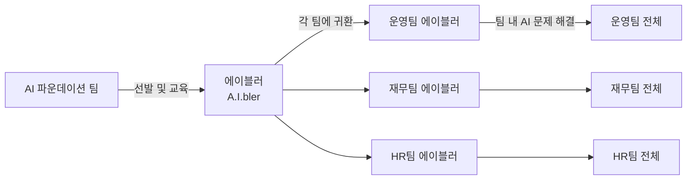
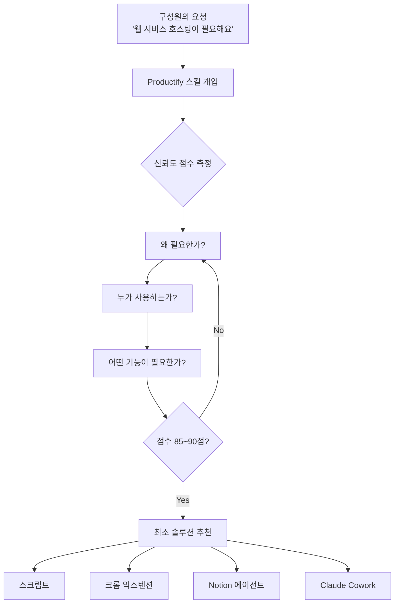
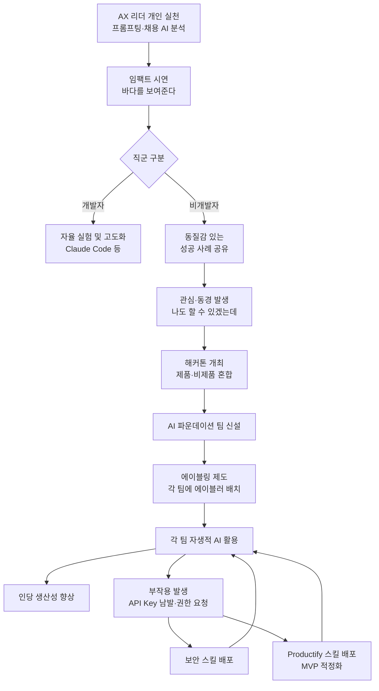

### 힐링페이퍼 김윤혁 — 하조은 유튜브 인터뷰 심층 분석

> **출처:** [하조은 YouTube — 강남언니가 전사 AI를 확산시킨 방식](https://www.youtube.com/watch?v=q60uZq14aoo)  
> **인터뷰이:** 김윤혁 (힐링페이퍼 CCO, 전 CTO/CPO)  
> **게시일:** 2025년 5월 7일

---

## 목차

1. [회사 소개: 힐링페이퍼와 강남언니](#1-회사-소개)
2. [김윤혁은 누구인가](#2-김윤혁은-누구인가)
3. [AX의 출발점: 조직의 온도감을 만드는 법](#3-ax의-출발점)
4. [교육보다 먼저 — 바다를 보여주는 접근법](#4-바다를-보여주는-접근법)
5. [첫 번째 와우 모멘트: 채용 인터뷰 AI 분석](#5-첫-번째-와우-모멘트)
6. [개발자 vs 비개발자: 직군별 차별화 전략](#6-직군별-차별화-전략)
7. [해커톤: 바다를 직접 경험시키다](#7-해커톤)
8. [실제로 살아남은 AI 도구들](#8-실제로-살아남은-ai-도구들)
9. [AI 파운데이션 팀과 에이블링 제도](#9-ai-파운데이션-팀과-에이블링-제도)
10. [현장의 구체적 사례들](#10-현장의-구체적-사례들)
11. [갑자기 터진 문제: API Key 남발과 권한 요청](#11-api-key-남발과-권한-요청)
12. [Productify: MVP를 모르는 사람들을 위한 스킬](#12-productify)
13. [100점짜리 표준은 없다 — LLM 위키와 스타트업 정신](#13-100점짜리-표준은-없다)
14. [팀의 표준을 어떻게 정할 것인가](#14-팀의-표준을-어떻게-정할-것인가)
15. [AX의 궁극적 목표: 인당 생산성](#15-ax의-궁극적-목표)
16. [처음 시작하는 조직에게 주는 조언](#16-처음-시작하는-조직에게)
17. [핵심 인사이트 요약](#17-핵심-인사이트-요약)
18. [AX 확산 흐름 다이어그램](#18-ax-확산-흐름-다이어그램)

---

## 1. 회사 소개

힐링페이퍼는 2012년 의사 출신 홍승일 대표가 창업한 헬스테크 스타트업으로, 2015년 출시한 미용의료 정보 플랫폼 **강남언니**로 널리 알려져 있다. 강남언니는 성형수술·피부 시술 후기, 가격, 병원 정보를 투명하게 제공함으로써 기존의 불투명한 미용의료 시장 구조를 바꿔온 서비스다.

현재 한국·일본·태국 등 전 세계 700만 명 이상의 이용자를 보유하고 있으며, 2023년 흑자 전환에 성공한 이후 가파른 성장세를 이어가고 있다. 2025년 기준 힐링페이퍼 전체 매출은 979억 원으로 전년 대비 45% 성장했으며, 일본 법인 매출도 두 배 가까이 뛰었다. 국내 팀 약 250명, 미국·일본 포함 전체 300~400명 규모의 조직을 운영하고 있다. 2025년에는 428억 원의 시리즈C 투자를 유치하며 글로벌 확장에 박차를 가하고 있다.

이 인터뷰는 이처럼 빠르게 성장 중인 힐링페이퍼가 전사적으로 AI를 어떻게 도입하고 확산시켰는지, 그 구체적인 과정과 방법론을 다룬다.

---

## 2. 김윤혁은 누구인가

김윤혁은 힐링페이퍼에서 10년 넘게 근무하며 CTO, CPO를 거쳐 현재는 CCO(Chief Culture Officer) 타이틀을 갖고 있다. 전사 조직문화를 총괄하면서 동시에 병원 대상 B2B SaaS 솔루션 사업도 맡고 있다. 개발자로 시작해 제품과 조직 전반을 아우르는 역할을 두루 경험한 덕분에, AI가 급부상하는 시점에서 자연스럽게 **전사 AX(AI Transformation) 기획과 실행**을 맡게 됐다.

그는 스스로 "AI 기술 이해도가 그렇게 높은 편은 아니다"라고 말한다. 대신 조직의 의사결정 방식, 변화를 어떻게 퍼뜨릴 것인가, 사람들이 움직이게 만드는 메커니즘을 잘 이해한다는 점에서 AX 역할을 맡을 수 있었다고 설명한다. 이 점은 인터뷰 전체를 관통하는 중요한 전제다. AX는 AI 전문 지식의 문제가 아니라 **조직 다이나믹스에 대한 이해**의 문제라는 것이다.

---

## 3. AX의 출발점

### 적당한 뜨거움이 먼저다

김윤혁이 강조하는 AX의 시작점은 기술 교육이 아니라 **조직 내 온도감**이다. 모든 구성원이 "우리도 AI 써야 한다"고 확신하게 만드는 것은 이미 늦은 것이고, 반대로 아무도 관심 없는 상태에서 혼자 추진하면 "생쇼"가 된다고 표현한다.

그가 말하는 이상적인 출발 상태는, **조직 내에서 존중받는 몇몇 인물들**이 "우리도 이런 거 해야 하는 거 아니야?"라는 온도감을 갖기 시작하는 순간이다. 그 순간에 마중물을 붓는 것이 AX 추진자의 역할이다. 처음에는 기다림도 필요하다. 구성원들이 자연스럽게 그런 관심을 갖게 될 때까지 서두르지 않는 것이 오히려 전략적이다.

### 스타트업의 속성과 AI 도입 타이밍

그는 스타트업에 비유한다. 모든 사람이 "이 사업 해야 돼"라고 말하는 순간은 이미 레드오션이다. 마찬가지로 조직 내 모든 사람이 "AI 써야 해"라고 느끼는 때는 이미 늦은 것이다. "1년 후면 쓰지 말라고 해도 쓸 텐데, 그때 가서 '열심히 쓰세요'라고 하는 건 늦다"는 말이 그 논리를 압축한다.

---

## 4. 바다를 보여주는 접근법

### 생텍쥐페리 인용: 배 만드는 법 대신 바다를 보여줘라

인터뷰에서 가장 인상적인 비유는 **"배를 만들게 하고 싶으면 배 만드는 방법을 교과서처럼 가르쳐주는 게 아니라, 배를 타고 나갈 수 있는 바다를 동경하게 만들어라"** 는 문장이다. 이것이 힐링페이퍼의 AI 확산 철학 전체를 관통하는 원칙이다.

AI를 확산시키는 과정에서도 동일하게 적용했다. "LLM이 무엇인지", "파운데이션 모델의 원리가 어떻게 되는지"를 설명하는 대신, GPT나 Claude를 활용해 **자신의 일상이 어떻게 바뀌었는지를 직접 보여주는 것**을 먼저 했다. 사람들이 그 임팩트를 목격하면 동경하게 되고, 그제야 스스로 "어떻게 쓰는 거예요?"를 물어온다. 그 시점에 지식과 방법을 전파하는 것이 훨씬 효과적이다.

### 왜 교육 먼저가 안 되는가

기술 교육을 먼저 받으면 사람들은 AI를 개념적으로는 이해하지만, 자신의 일과 연결하지 못한다. 반면 감동적인 사례를 먼저 목격하면 감정적 동기가 생기고, 그 동기가 스스로 배우게 만드는 연료가 된다. 이는 정보 전달이 아니라 **욕망 점화**의 문제다.

---

## 5. 첫 번째 와우 모멘트

### 채용 인터뷰 AI 분석 시연

힐링페이퍼에서 구성원들이 처음으로 "와우"를 외쳤던 장면은 채용 업무에서 나왔다. 김윤혁은 자신이 직접 시스템 프롬프팅을 공부해서 커스텀 지침을 만들었고, 채용 인터뷰 스크립트를 AI에 입력한 뒤 다음 세 가지를 뽑아냈다.

- **이 사람을 채용해야 하는 이유**
- **채용하면 위험한 이유**
- **다음 인터뷰에서 더 질문해야 할 포인트**

이 결과물을 팀원들에게 보여주자, "대체 어떻게 저렇게까지 쓸 수 있지?"라는 반응이 나왔다. 그 시점에 프롬프팅, 시스템 프롬프팅 개념을 설명했고, 이후 많은 구성원이 자체적으로 유사한 프로젝트를 만들기 시작했다.

중요한 것은, 이 시연이 단순한 데모가 아니었다는 점이다. 실제로 자신의 업무에 사용하던 것이었고, 그 현실성이 설득력을 가졌다. "이론"이 아니라 "저 사람의 실제 일상"이었기 때문에 구성원들이 자신도 할 수 있겠다는 현실적 가능성을 느꼈다.

---

## 6. 직군별 차별화 전략

### 개발자와 비개발자를 다르게 접근해야 한다

힐링페이퍼가 AX를 추진하면서 발견한 중요한 사실은 직군에 따라 AI 접근 방식을 달리해야 한다는 것이다.

**개발자 그룹**의 경우, 이미 GitHub Copilot, Claude Code 등 AI 도구의 맛을 경험한 상태이기 때문에 자체적으로 실험하고 고도화하는 경향이 있다. 조직 차원에서 방향만 제시하면 스스로 달려가는 편이다.

**비개발자·비제품 그룹**의 경우, 접근 방식이 달라야 한다. 이들은 "나 같은 사람은 쓰기 어려운 거 아니야?"라는 인식을 갖고 있는 경우가 많다. "개발자 출신이니까 할 수 있지"라는 귀인을 하기 때문에, 개발자 출신이 아닌 사람이 뭔가를 만들어내는 것을 직접 보여주는 것이 훨씬 효과적이다.

### 비개발자를 주인공으로 세우는 전략

김윤혁이 사용한 방법은, 일부러 비개발자 구성원에게 "혼자서 이걸 만들어봐"라고 부탁하고, 그 결과물을 전체 조직에 공유하는 것이었다. 개발자 출신 리더가 직접 시연하는 것과 달리, 마케터나 운영팀 직원이 Claude Cowork나 Claude Code로 무언가를 직접 만들어냈다는 사실이 비개발자들에게 훨씬 강력한 메시지를 전달한다.

"쟤도 이만큼 했다고? 그럼 나도 할 수 있겠는데?"

이 문장이 핵심이다. 동질감 있는 사람의 성공 사례가 동경보다 강한 실행 동기를 만들어낸다.

---

## 7. 해커톤

### 타이밍과 구성 방식

"쓰지 말라고 해도 결국 쓰게 될 것이다"라는 판단 아래, 힐링페이퍼는 작년 여름~가을 무렵 전사 해커톤을 열었다. 이 해커톤의 설계에서 특이한 점은 **제품 직군과 비제품 직군을 의도적으로 혼합**했다는 것이다.

구성원들은 평소 느끼던 업무 고충을 자유롭게 가져왔다. "마케팅 수요조사를 수동으로 하기 너무 힘들다", "재무 특정 수치를 매일 입력하고 관리하는 게 너무 힘들다" 같은 문제들이었다. 이들을 팀으로 묶어서 실제 솔루션을 만드는 과정을 경험하게 했다.

### 해커톤의 결과: 살아남은 것과 사라진 것

해커톤 결과물 중에는 퀄리티가 낮거나 운영이 어려워서 폐기된 것도 있었고, 실제로 지금까지 사용 중인 것도 있었다. 후자의 대표 사례로는 **보안·오류·예외 탐지 시스템**이 있다. 해커톤이라는 형식 자체가 목적이 아니라, 이 경험을 통해 구성원들이 "AI가 진짜 되는구나"를 몸으로 느끼게 만드는 것이 목표였다.

---

## 8. 실제로 살아남은 AI 도구들

### 의료법 검수 자동화 — 이벤트 콘텐츠 심사

강남언니 서비스의 특성상, 입점 병원이 올리는 이벤트 콘텐츠(광고 이미지·문구)가 의료법에 위반되지 않는지 검수해야 한다. 기존에는 운영팀 직원이 이미지와 텍스트를 눈으로 보고 수동으로 판단했다.

이 과정을 LLM 기반으로 전환했다. 이미지와 텍스트를 분석해서 회사 고유의 규칙에 따라 "위험", "안전", "수정 필요" 여부를 자동으로 판단하는 시스템을 구축했다. 더 나아가, 이벤트를 게시하는 병원 측이 직접 이 시스템을 사용해서 사전 점검할 수 있는 UI까지 개발했다. 이 기능은 운영팀이 단독으로 만든 것이 아니라 AI 파운데이션 팀과 협업해서 구축했다.

---

## 9. AI 파운데이션 팀과 에이블링 제도

### AI 파운데이션 팀의 역할

힐링페이퍼는 별도로 **AI 파운데이션** 팀을 신설했다. 이 팀의 역할은 두 가지다. 첫째는 비제품 조직에서 필요로 하는 AI 솔루션을 직접 만들어주는 것이고, 둘째는 비제품 조직 구성원들이 AI를 스스로 활용할 수 있도록 키워내는 것이다.

단순히 도구를 만들어서 전달하는 것만으로는 AI 리터러시가 높아지지 않는다는 것을 인식했기 때문이다. "문제 해결 툴을 받은 것"과 "AI를 활용할 능력을 갖춘 것"은 완전히 다르다.

### 에이블링(A.I.bling) 제도

이를 해결하기 위해 김윤혁이 직접 고안한 제도가 **에이블링**이다. 'AI'와 '-able'의 합성어로, "AI를 되게 하는 사람들"을 의미한다.

운영팀, 재무팀 등 각 비제품 조직에서 AI에 관심이 많고 도전적인 사람을 한 명씩 선발해 **에이블러(A.I.bler)** 로 지정한다. 에이블러는 AI 파운데이션 팀과 함께 자기 조직의 고충을 꺼내고, 그것을 AI로 해결하는 방법을 배운다. 단순히 스킬을 만드는 것일 수도 있고, 루틴 자동화일 수도 있고, 서비스를 개발하는 것일 수도 있다.

일정 시간이 지나면 에이블러가 자기 팀으로 돌아가 그 팀의 AI 문제 해결사가 된다. 팀원이 "이거 어떻게 하지?"라고 물었을 때 "이런 식으로 하면 될 것 같은데요"를 제안할 수 있는 사람이 각 팀에 심어지는 구조다.

---

## 10. 현장의 구체적 사례들

### 사례 1: HR 담당자의 인터뷰 스케줄링 자동화

컴퓨터 전공을 버리고 HR로 전환한 구성원이 있었다. 코딩이 싫어서 전공을 포기했지만, Claude Code의 맛을 본 이후로 달라졌다.

이 사람이 해결하고 싶었던 문제는 인터뷰 스케줄링이었다. 하루에 면접자 한 명이 면접관 3명을 순서대로 만나야 할 경우, 3명의 면접관이 연달아 비어 있는 시간과 방을 맞춰야 한다. 사람의 손으로 하면 하루에 1시간 이상을 쓰는 일이었다.

이 사람이 혼자서 Claude Code와 씨름하며 만든 것은 캘린더 API와 연동된 스케줄링 자동화 도구였다. "몇 월 며칠에 A, B, C를 인터뷰에 넣고 싶어"라고 입력하면, 세 사람이 연속으로 비어 있는 슬롯을 자동으로 찾아주고 버튼 하나로 예약까지 완료된다. 이 덕분에 1시간 이상 걸리던 일이 5분도 안 걸리게 됐다.

### 사례 2: 디자이너의 크롬 익스텐션 개발

서비스 기능이 새로 나올 때마다 웹페이지 스크린샷을 찍어서 사용자 매뉴얼을 만드는 것이 디자이너의 반복 업무였다. 문제는 실제 데이터가 아직 들어가 있지 않은 상태에서 스크린샷을 찍어야 하기 때문에, 포토샵 등으로 텍스트나 버튼을 수정하는 과정이 필요했다는 것이다.

이 디자이너가 Claude Code와 함께 만든 것은 크롬 익스텐션이었다. 이 익스텐션으로 할 수 있는 것은 다음과 같다.

- 현재 보고 있는 웹페이지를 원하는 사이즈로 스크린샷
- 화면에서 특정 요소(버튼, 임시 개체 등)를 선택해서 삭제
- 텍스트를 실제 운영 텍스트로 교체한 뒤 스크린샷

이 도구는 원래 본인 혼자 쓰려고 만든 것이었지만, 사용 가이드를 작성해서 회사 전체 채널에 올리자마자 모든 팀에서 가져갔다. "우리도 맨날 하고 있던 일인데"라는 반응이 폭발했다.

이 두 사례는 공통점이 있다. 비개발자가 AI를 활용해서 자신의 반복 업무를 직접 해결했다는 것, 그리고 그 결과물이 자신을 넘어 팀 전체에 파급됐다는 것이다.

---

## 11. API Key 남발과 권한 요청

### 뜻하지 않은 혼란: 모두가 AI 개발자가 되다

AX가 어느 정도 궤도에 오른 시점에서 뜻하지 않은 문제가 터졌다. 너무 많은 사람들이 AI를 활용해서 알 수 없는 도구들을 만들기 시작했다는 것이다. 그리고 그 과정에서 과도한 권한을 요청하는 사례들이 생겨났다.

대표적인 사례로, 한 구성원이 "이런이런 이유로 Notion 슈퍼 관리자 권한을 주십시오"라고 요청했다. 이유를 물었더니 "AI가 달라고 해요"였다. 실제로는 API를 발급하기 위해 슈퍼 관리자 권한이 필요했는데, AI가 그 경로를 사용자에게 그대로 안내한 것이었다. 보안 관점에서 심각한 문제가 될 수 있는 상황이었다.

### 두 가지 대응 스킬

이를 해결하기 위해 김윤혁은 전 구성원에게 배포하는 스킬 두 가지를 직접 만들었다.

**첫 번째 스킬: 보안 강화 스킬**
AI가 과도한 권한이나 API Key를 요청할 때 제동을 거는 스킬이다. "이게 진짜 필요한 거야? 왜 필요한 거야?"를 강제로 한 번 더 묻게 만드는 구조다.

**두 번째 스킬: Productify**
아래 항목에서 상세히 다룬다.

---

## 12. Productify

### 문제 상황: MVP를 모르는 사람들이 대형 인프라를 요구한다

구성원들이 Claude Code와 함께 문제를 해결하고 싶어졌는데, **MVP(Minimum Viable Product) 개념에 대한 이해가 없다 보니** 불필요하게 복잡한 솔루션을 요구하는 상황이 생겼다.

"스크립트 하나면 해결될 문제"인데 갑자기 "웹 서비스를 호스팅해야 해요"라는 요청이 오는 식이다. 호스팅이 필요하면 인프라도 필요하고, API도 필요하고, 비용도 발생한다. 잘 파고 들어가면 사실은 간단한 해결책으로 충분한 경우가 대부분이다.

### Productify 스킬의 작동 방식

이를 해결하기 위해 만든 것이 **Productify** 스킬이다. 이 스킬은 다음 방식으로 작동한다.

사용자의 문제에 대해 만들 수 있는 솔루션 옵션들을 사전에 등록해둔다.

- 스크립트
- 에이전트
- Notion 에이전트
- Claude Cowork
- 크롬 익스텐션

이 스킬은 솔루션을 제안하기 전에 사용자에게 계속 질문한다. "왜 필요해?", "누구한테 쓰려는 거야?", "어떤 기능까지 할 거야?" 이런 질문을 통해 요구사항의 신뢰도 점수를 높여가다가, 85~90점에 도달하면 비로소 **"당신의 문제는 크롬 익스텐션으로 만드시면 됩니다"** 같은 추천을 내놓는다. 필요 없는 권한이나 API 요청 없이, 가장 최소한의 방식으로 문제를 해결하게 유도하는 것이다.

---

## 13. 100점짜리 표준은 없다

### LLM 위키 구축의 교훈

대화 후반부에서 흥미로운 주제가 나온다. 힐링페이퍼 내부에서도 **LLM 위키** 구축이 화두였다. Andrej Karpathy가 제시한 개념으로, LLM이 사용하기 좋게 구조화된 사내 지식 베이스를 만드는 것이다.

김윤혁의 접근은 독특하다. 논문을 모두 읽거나 100점짜리 완벽한 체계를 만들려 하지 말자는 것이다. 그 이유는 다음과 같다.

"어제 100점이었던 것이 오늘은 80점이 된다." 모델이 바뀌면 최적화했던 구조가 무의미해지는 경우도 있다. 예측 불가능한 세상에서 예측 가능한 완벽한 것을 만들려고 하면 안 된다.

대신 그가 강조하는 것은 **불완전하더라도 동작하는 것을 빠르게 만들고 실험하는 스타트업 정신**이다. LLM 위키도 결국 인간이 지식을 어떻게 습득하고 구조화하고 사용하는지와 비슷한 메커니즘이라고 본다. 논문 없이도, 자기 팀이 정보를 습득하고 쓰는 방식을 빗대어 구조를 설계하고, 빠르게 실험해서 피드백을 받는 방식으로 접근했다.

---

## 14. 팀의 표준을 어떻게 정할 것인가

### 표준 없음과 강제 표준 사이 어딘가

개인이 AI를 활용하는 것보다 더 어려운 과제는 **팀 단위의 표준**을 잡는 일이다. 양 극단은 이렇다.

- **극단 A:** "모르겠고, 쓰고 싶은 사람 맘대로 쓰세요" (표준 없음)
- **극단 B:** "이것이 정답이니 무조건 이렇게 해" (경직된 강제 표준)

둘 다 답이 아니다. 그 사이 어딘가에서 **빠르게 의사결정하고, 틀리더라도 일단 실행하고, 다시 조정하는** 사이클이 필요하다. "이게 나중에 정답이 아니게 되겠지만, 일단 우리 이렇게 한번 맞춰서 써볼래?"라는 식의 빠른 합의가 AX에서는 더 중요하다.

### AX는 AI 이해도의 문제가 아니다

여기서 김윤혁의 가장 핵심적인 주장이 나온다. AX를 잘하기 위해 필요한 것은 AI 기술에 대한 깊은 이해가 아니라 **조직 다이나믹스에 대한 이해**라는 것이다.

우리 조직에서 의사결정이 어떻게 이루어지는가, 결정된 것이 어떻게 퍼지는가, "이렇게 하자"고 하면 사람들이 실제로 따라오는가. 이런 질문에 대한 답을 갖고 있는 사람이 AX를 실행할 수 있다.

AI 전문가는 AI를 만드는 전문가일 수는 있지만, 기업에 AI를 도입하는 전문가는 따로 있다. 그리고 그 전문가는 **조직 내부에서 탄생**하는 것이 가장 이상적이다. 조직의 맥락, 문화, 사람을 아는 내부자가 AI를 활용하는 법을 익히는 것이 외부 전문가를 영입하는 것보다 훨씬 효과적이다.

### '함께 자라기'의 교훈

김창준의 책 [「함께 자라기」](https://www.aladin.co.kr/shop/wproduct.aspx?ItemId=175977462)에서 인상 깊었다는 구절을 소개한다. 진리에 가까운 것을 알고 있는데 사람들이 따라주지 않아 답답하다고 토로하는 사람에게, 구루가 이렇게 물었다고 한다.

**"사람들이 당신을 좋아하나요?"**

이 질문이 함축하는 바는 깊다. 사람들이 자신을 좋아한다는 것은 그가 하자고 하는 것에 모종의 신뢰를 갖는다는 의미다. 정답이 없는 세상에서, 지식으로 설득하기보다 신뢰를 얻은 사람의 제안을 따르고 같이 실패하는 문화가 AX를 가능하게 한다.

이것은 AX가 기술의 문제가 아니라 **관계와 신뢰의 문제**임을 말한다.

---

## 15. AX의 궁극적 목표

### 힐링페이퍼의 키워드: 인당 생산성

힐링페이퍼 대표가 요즘 자주 사용하는 표현이 **"인당 생산성"** 이다. 같은 비즈니스 임팩트와 퍼포먼스를 사람 수를 늘리지 않고 달성할 수 있다면, 조직이 가져갈 수 있는 것이 많아진다.

경제적 보상만이 아니다. 조직이 커질수록 고맥락(high context) 소통이 줄어들고 시스템과 규칙이 늘어날 수밖에 없다. 자율성과 신뢰로 움직이길 원하는 사람들이 모인 조직이 규모의 압박으로 관료화되어가는 것은 자연스러운 현상이다. AI가 인당 생산성을 끌어올린다면 이 문제를 일부 완화할 수 있다. **더 적은 인원으로 더 밀도 있게 일하면서 더 좋은 가치를 만들어낼 수 있다**는 것이 힐링페이퍼의 구상이다.

---

## 16. 처음 시작하는 조직에게

인터뷰 마지막 부분에서 김윤혁은 AX를 막 시작하려는 조직에게 다음과 같은 메시지를 전한다.

첫째, 조직에 포텐셜이 있는지를 먼저 판단해야 한다. 아무리 노력해도 바뀌지 않을 조직이라면 다른 조직에서 해야 한다.

둘째, 포텐셜이 있다면, 해야 할 일은 **사람들을 와우하게 만들고 꿈꾸게 만드는 것**이다. 기술을 가르치기 전에 그 기술로 가능한 미래를 먼저 보여줘야 한다.

셋째, "그건 너니까 할 수 있는 거지"가 아니라 **"나도 할 수 있겠는데"를 느끼게 해주는 것**이 핵심이다. 그렇게 되면 사람들이 알아서 뛰어든다. 그 이후에 적절한 가이드와 도움을 주면 된다.

이 세 가지는 사실상 인터뷰 전체의 철학을 압축한 것이다.

---

## 17. 핵심 인사이트 요약

인터뷰에서 추출할 수 있는 핵심 원칙들을 정리하면 다음과 같다.

**조직 변화에 관하여**

AX는 기술 변화가 아니라 문화 변화다. 가르침보다 동경이 먼저고, 동경보다 공감할 수 있는 성공 사례가 더 강력하다. 변화의 출발은 "전부 다 해야 한다"가 아니라 "존중받는 몇 명이 관심을 갖기 시작하는 것"이다.

**도구와 제도에 관하여**

AI 도구를 만들어서 전달하는 것과 AI 활용 능력을 키우는 것은 다른 목표다. 에이블링 제도처럼, 각 조직에 AI 문제 해결 능력을 가진 사람을 심어두는 것이 지속 가능한 AI 리터러시 향상 방법이다.

**표준과 완성도에 관하여**

100점짜리 표준은 없다. 빠르게 결정하고, 틀리면 고치고, 다시 실험하는 스타트업 정신이 AI 시대의 조직 운영 방식이다. 완벽함을 추구하다가 시작하지 못하는 것이 가장 나쁜 결과다.

**AX 리더십에 관하여**

AX를 이끄는 사람에게 AI 기술 전문성보다 더 중요한 것은 조직 다이나믹스 이해와 신뢰다. AI 전문가는 외부에서 데려올 수 없다. 조직을 아는 내부자가 AI를 배우는 것이 맞다.

---

## 18. AX 확산 흐름 다이어그램

힐링페이퍼의 AX 확산 전체 흐름을 정리하면 아래와 같다.

---

## 마치며

이 인터뷰는 AI 기술 자체가 아니라 **사람이 AI를 받아들이는 방식**에 관한 이야기다. 강남언니가 전사 AI를 확산시킨 방식은 교육 프로그램이나 의무화 정책이 아니었다. 누군가의 실제 일상이 바뀌는 것을 보여주고, 그 바뀐 일상이 나와 멀지 않다는 것을 느끼게 하는 것이었다.

기술의 속도가 빨라질수록 조직 안에서의 변화 관리는 더 어려워진다. 힐링페이퍼의 사례는 그 어려움을 돌파하는 데 있어서 기술 이해보다 사람 이해가 더 결정적인 변수임을 보여준다.

---

*작성일: 2026년 5월 7일*
