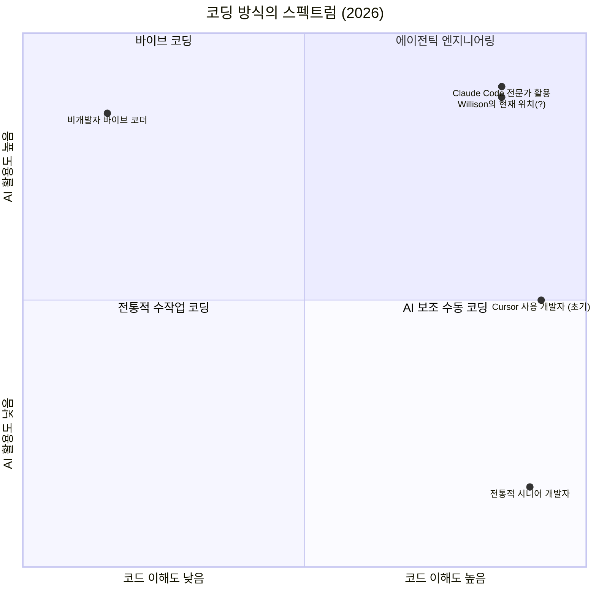
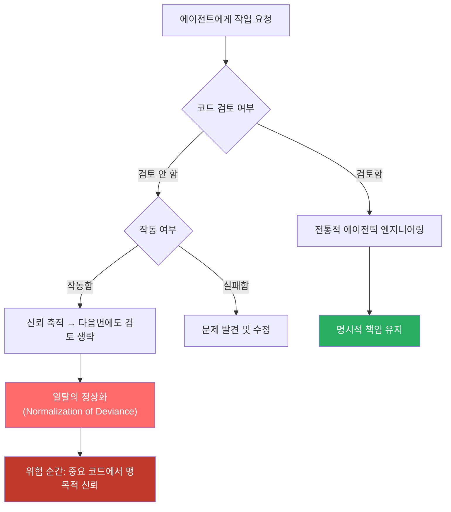
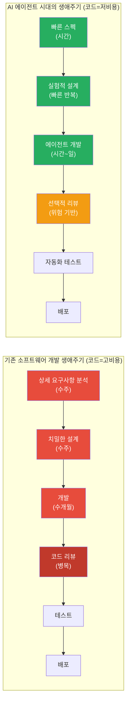
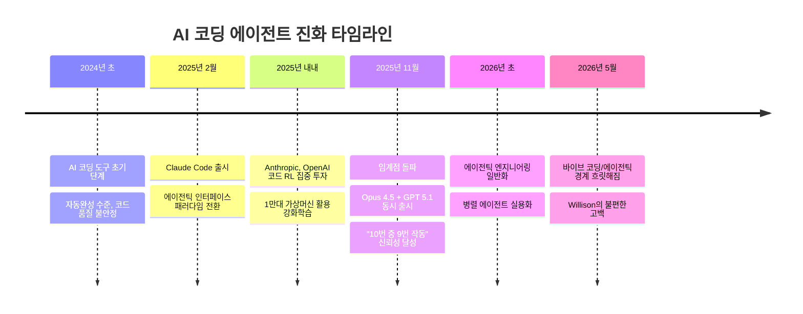
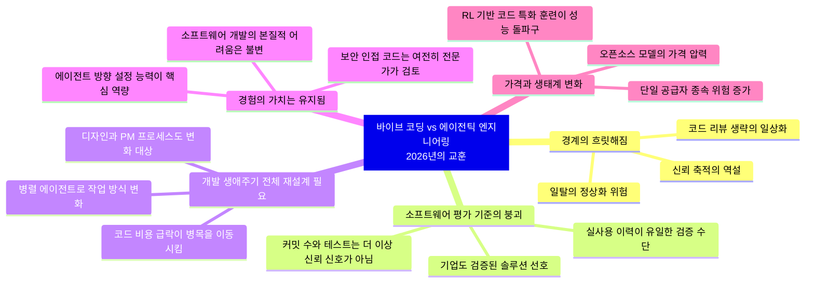

> Simon Willison의 블로그 포스트 및 Heavybit High Leverage 팟캐스트 Ep.9 심층 분석  
> 원문: [simonwillison.net](https://simonwillison.net/2026/May/6/vibe-coding-and-agentic-engineering/) | [Heavybit High Leverage Ep.9](https://www.heavybit.com/library/podcasts/high-leverage/ep-9-the-ai-coding-paradigm-shift-with-simon-willison)

---

## 개요

2026년 5월 6일, Django 공동 창시자이자 Datasette 제작자인 Simon Willison이 자신의 블로그에 짧지만 밀도 높은 글 하나를 발행했다. 제목은 *"Vibe coding and agentic engineering are getting closer than I'd like"* — 직역하면 "바이브 코딩과 에이전틱 엔지니어링이 내가 원하는 것보다 더 가까워지고 있다"다. 이 글은 같은 날 Heavybit의 팟캐스트 *High Leverage* Episode 9에 출연해 Joseph Ruscio와 나눈 대화를 요약한 것이다.

Willison은 25년 경력의 소프트웨어 엔지니어이자 AI 코딩 도구 분야에서 가장 신뢰받는 중립적 관찰자 중 한 명이다. 그는 과대 홍보도 극단적 비관론도 아닌, "지금 실제로 작동하는 것이 무엇인가"라는 저널리스틱 시각을 일관되게 유지해왔다. 그래서 그가 "불편하다"고 고백할 때, 업계는 귀를 기울일 필요가 있다.

이 문서는 해당 블로그 포스트와 팟캐스트 전문을 바탕으로, 핵심 주제를 상세히 풀어내고 2026년 현재 AI 코딩 생태계의 맥락 속에 위치시킨다.

---

## 1. 두 개념의 탄생과 구분: 바이브 코딩 vs. 에이전틱 엔지니어링

### 바이브 코딩이란 무엇인가

"바이브 코딩(Vibe Coding)"이라는 용어는 Andrej Karpathy가 처음 제안했다. 핵심은 단순하다 — 코드를 읽지 않는다. 무언가를 요청하고, 결과물이 나오면 그것을 쓴다. 작동하지 않으면 오류 메시지를 붙여넣고 다시 시도한다. 프로그래머가 아닌 사람도 할 수 있고, 코드 품질이나 보안, 유지보수성에 대해 신경 쓰지 않는다.

Willison은 처음부터 바이브 코딩 자체를 부정하지 않았다. 그는 2025년 3월에 발표한 글 *"Not all AI-assisted programming is vibe coding (but vibe coding rocks)"* 에서 명확한 입장을 취했다 — 바이브 코딩은 적절한 맥락에서 사용할 때 훌륭하다. 개인 도구, 버그가 자신에게만 영향을 미치는 환경, 프로토타입이라면 문제없다. 그러나 타인의 데이터와 정보가 걸린 소프트웨어를 바이브 코딩으로 만드는 것은 "심각하게 무책임한 행위(grossly irresponsible)"라고 단언했다.

### 에이전틱 엔지니어링이란 무엇인가

에이전틱 엔지니어링은 이와 대비되는 개념으로, Willison 자신이 명명하고 발전시킨 개념이다. 정의는 이렇다 — 전문 소프트웨어 엔지니어가, 보안·유지보수성·성능·운영 등을 이해한 상태에서, AI 코딩 에이전트를 자신의 역량을 최대로 발휘하는 방식으로 활용하는 것. Claude Code나 OpenAI Codex처럼 코드를 생성하고 실행하며 스스로 반복할 수 있는 도구를 사용하되, 인간 엔지니어가 아키텍처·품질·정확성의 최종 책임자로 남는 방식이다.

Google의 Addy Osmani도 같은 맥락에서 에이전틱 엔지니어링의 핵심 원칙을 정리한 바 있다 — 먼저 계획을 세우고, 작업을 잘 정의된 단위로 분해하며, 테스트를 철저히 수행하고, 코드베이스의 소유권을 인간이 유지한다는 것이다. AI가 구현을 가속하지만, 시스템에 대한 책임은 여전히 인간에게 있다.

---

## 2. 핵심 고백: 경계가 흐릿해지고 있다

이 글에서 가장 주목할 부분은 Willison의 솔직한 고백이다. 팟캐스트에서 Joseph Ruscio가 두 개념의 구분에 대해 질문했을 때, 그는 예상치 못한 대답을 내놓았다.

> "기묘하게도, 그 두 가지가 이미 나에게서 흐릿해지기 시작했습니다. 꽤 당혹스럽습니다."

그가 설정했던 명확한 경계 — "바이브 코딩은 코드를 전혀 보지 않는 것, 에이전틱 엔지니어링은 전문 엔지니어가 책임을 지며 AI를 활용하는 것" — 가 코딩 에이전트의 신뢰성이 높아지면서 실제 실천 속에서 스스로 무너지고 있다는 것이다.

구체적인 사례를 들어 설명하면 이렇다. Claude Code에게 SQL 쿼리를 실행하여 JSON으로 결과를 반환하는 API 엔드포인트를 만들어달라고 하면, 그것은 그냥 제대로 만들어낸다. 자동화된 테스트도 추가하고, 문서도 작성한다. Willison은 그 코드를 더 이상 한 줄 한 줄 검토하지 않는다. 그러면서도 그것을 프로덕션에 배포한다.

이것이 바이브 코딩인가, 에이전틱 엔지니어링인가? 그는 스스로도 확신하지 못한다.

---

## 3. 코드 리뷰라는 윤리 문제: "죄책감"의 발생

Willison이 직면한 딜레마는 단순한 실무적 질문이 아니다. 그것은 일종의 직업 윤리적 질문이다.

"코드를 검토하지 않았다면, 그것을 프로덕션에 사용하는 것이 책임 있는 행동인가?"

그는 이 불편함을 해소하는 방식으로 과거 엔지니어링 매니저 경험을 떠올린다. 다른 팀이 만든 이미지 리사이징 서비스를 쓸 때, 그는 그 팀의 소스코드를 한 줄씩 읽지 않는다. 문서를 보고 기능을 사용하고, 문제가 생기면 그때 깊이 들어간다. 팀은 평판이 있고, 평판은 책임을 담보한다.

그런데 Claude Code는 평판이 없다. 전문적 책임을 질 수도 없다. 그러나 실제로는 반복적으로 올바른 코드를 생성해내면서 신뢰를 쌓아가고 있다. Willison은 그 신뢰를 마치 팀을 신뢰하듯 에이전트에게 부여하기 시작했다.

그는 여기서 중요한 개념을 인용한다 — **"일탈의 정상화(Normalization of Deviance)"**. 이는 원래 Diane Vaughan이 챌린저 우주왕복선 사고를 분석하며 제시한 개념으로, 작은 실패나 편차가 반복적으로 문제를 일으키지 않을 때 그것이 정상적인 것으로 받아들여지는 과정을 가리킨다. 모델이 검토 없이 올바른 코드를 계속 생성할 때마다, 언젠가 잘못된 순간에 과신하게 될 위험이 축적된다.

---

## 4. 소프트웨어 평가 기준의 붕괴

Willison이 제기한 또 다른 중요한 문제는, AI 코딩 에이전트가 소프트웨어 품질을 판단하는 전통적 신호들을 무의미하게 만들었다는 점이다.

과거에 GitHub 저장소에 커밋이 100개 있고, 잘 작성된 README와 자동화 테스트가 갖춰져 있다면, 그것은 누군가가 상당한 노력과 주의를 기울였다는 신호였다. 그 신호는 신뢰의 근거가 되었다.

이제 Willison은 단 30분 만에 커밋 100개, 아름다운 README, 전체 코드에 대한 포괄적 테스트를 갖춘 Git 저장소를 만들 수 있다. 겉으로 보기에는 수개월에 걸쳐 공들여 만든 프로젝트와 구분이 불가능하다. 실제로 동등한 품질일 수도 있다. 그러나 알 수 없다 — 만든 본인조차도.

그래서 그가 이제 더 가치 있게 여기는 신호는 하나다 — **그것을 실제로 사용한 사람이 있는가?** 바이브 코딩으로 만들었더라도 2주 동안 매일 사용한 도구는, AI가 방금 생성했지만 거의 실행해보지 않은 코드보다 훨씬 신뢰할 만하다는 것이다.

이것은 기업 맥락에서도 동일하게 적용된다. Willison은 이렇게 말한다 — 자신은 최소 두 개의 대형 기업이 6개월 이상 성공적으로 사용한 CRM만 사용하겠다고. "검증된 것을 원한다"는 보수적 심리가 AI 생성 소프트웨어 시대에 오히려 더 강화된다.

---

## 5. 병목의 이동: 소프트웨어 개발 생애주기 전체의 재설계

가장 광범위하면서도 실질적인 통찰은 코딩 속도 자체가 아니라, 그 속도 변화가 개발 생애주기 전체에 미치는 연쇄 영향에 관한 것이다.

Willison은 핵심 질문을 이렇게 제기한다 — "하루에 코드를 200줄 생산하던 것이 2,000줄이 된다면, 그 외에 무엇이 무너지는가?"

소프트웨어 개발의 전체 프로세스 — 기획, 설계, 추정, 리뷰, 배포, 모니터링 — 는 코드 작성이 느리다는 전제 위에 설계되었다. 그 전제가 무너졌다.

하류(downstream)만의 문제가 아니다. 상류(upstream)도 재설계가 필요하다. Willison은 Anthropic의 디자인 리더 Jenny Wen의 강연을 인용한다. 기존의 치밀한 디자인 프로세스는, 엔지니어들이 잘못된 것을 3개월 동안 만들 경우 발생하는 막대한 비용을 전제로 구축되었다. 그 비용이 급격히 낮아졌다면, 디자인 프로세스도 더 실험적이고 유연해질 수 있다.

제품 관리(Product Management) 분야도 마찬가지다. 사양을 치밀하게 작성하고, 기능의 가치를 정교하게 추정하고, 스프린트를 세밀하게 계획하는 관행은 엔지니어링 시간이 극도로 비싸다는 전제 위에 서 있다. 그 전제가 바뀌면, 일하는 방식 전체가 바뀐다.

또 흥미로운 변화는 병렬 작업의 현실화다. Willison은 현재 여러 에이전트를 동시에 실행하며, 하나가 복잡한 작업을 처리하는 10분 동안 다른 프로젝트를 진행한다. 요리를 하면서 노트북 화면을 5분마다 확인하며 다음 프롬프트를 입력한다. 심지어 개를 산책시키면서 음성으로 코드를 작성한다. 집중과 몰입 상태(flow state)를 요구했던 소프트웨어 개발의 특성이 근본적으로 변화하고 있다.

---

## 6. 코딩 에이전트의 신뢰성 임계점: 2025년 11월

Willison과 Ruscio는 대화 중에 중요한 역사적 순간을 짚어낸다 — 2025년 11월, Claude Opus 4.5와 GPT 5.1이 거의 동시에 출시된 시점이다.

그 이전까지 코딩 에이전트는 "들쑥날쑥(hit and miss)"했다. 때로는 유용했고, 때로는 그렇지 않았다. 2025년 11월을 기점으로 에이전트가 10번 중 9번은 작동하는 코드를 생성하는 신뢰할 수 있는 파트너가 되었다는 것이다.

이 변화의 배경에 대해 두 사람은 기술적 설명을 제공한다 — Anthropic과 OpenAI가 2025년 한 해 동안 사실상 모든 컴퓨팅 예산을 코드에 대한 강화학습(Reinforcement Learning)에 쏟아부었다는 것이다. 1만 대의 가상 머신에서 코드를 생성하고, 코드가 작동하는지 확인하고, 작동하면 thumbs up, 실패하면 thumbs down — 이 단순하고 명확한 보상 신호(reward signal)가 코딩 성능을 폭발적으로 향상시켰다.

법률이나 의학 분야와 달리, 코드는 "작동하는가 아닌가"라는 이진법적 검증이 가능하다. 법정 판결에 수개월을 기다려야 하는 것과 달리, 파이썬 스크립트는 즉각 검증된다. 강화학습의 최적 조건이 소프트웨어 개발이었던 것이다.

---

## 7. 여전히 두렵지 않은 이유: 경험의 증폭기 효과

Willison은 AI 도구가 소프트웨어 엔지니어의 커리어를 위협한다는 주장에 동의하지 않는다. 이유는 명확하다 — 이 도구들은 기존 경험을 증폭시키는 도구이기 때문이다.

그가 에이전트와 나누는 대화를 볼 때, 그것은 "일반 인류에게는 외계어(moon language)"처럼 보인다고 말한다. 무엇을 요청해야 할지, 어떻게 아키텍처를 잡아야 할지, 무엇이 보안에 민감한지, 어떤 엣지 케이스가 중요한지 — 이 모든 것은 수십 년의 경험에서 나온다. 도구가 강력해질수록, 그 도구를 제대로 방향 잡아줄 수 있는 사람의 가치가 높아진다.

특히 그는 보안에 인접한 코드(security adjacent code)에 대해서는 여전히 직접 검토한다고 강조한다. 무엇이 보안에 민감한지 판단하는 능력 자체가 수년간의 엔지니어링 경험에서 나오는 것이다.

소프트웨어 개발이 얼마나 어려운 일인지에 대한 그의 인식도 바뀌지 않았다. 모든 AI 도구를 다 준다 해도, 진정한 소프트웨어를 만드는 것은 여전히 "맹렬하게 어려운(ferociously difficult)" 일이라고 그는 단언한다.

Matthew Yglesias의 트윗을 인용하면서 그는 핵심을 정리한다 — "5개월 동안 써본 결과, 나는 바이브 코딩을 직접 하고 싶지 않다. 전문적으로 관리되는 소프트웨어 기업들이 AI 코딩 도구를 사용해서 더 좋고, 더 많고, 더 저렴한 소프트웨어 제품을 만들어 나에게 팔기를 원한다." Willison은 이에 동의한다 — 유튜브 동영상을 충분히 보면 집의 배관을 직접 할 수 있다. 그러나 배관공을 고용하는 것이 더 낫다.

---

## 8. 모델 경쟁과 가격 구조의 격변

팟캐스트 후반부에는 모델 생태계 전반에 대한 분석이 이어진다.

Willison은 현재 자신의 일상 도구가 Claude Code에서 OpenAI Codex로 넘어갔다고 밝혔다 — Anthropic의 Claude Code 가격 정책에 대한 불신 때문이다. Codex의 최신 버전이 "탁월하다(outstanding)"고 평가하면서도, 새 모델이 출시될 때마다 그동안 쌓아온 신뢰를 다시 검증해야 한다는 피로감도 털어놓는다.

가격 인상의 기조도 주목할 만하다. 그는 팟캐스트 녹화 당시 일주일 안에 두 차례의 큰 가격 인상이 있었음을 언급한다. Opus 4.7은 Opus 4.6과 같은 명목 가격이지만, 토크나이저 변경으로 사실상 40% 인상 효과가 있다. GPT 5.5는 GPT 5.4 대비 API 가격이 두 배다.

반대 방향의 압력도 있다. DeepSeek 등 중국 오픈소스 모델들이 Claude Opus 대비 20분의 1 가격을 제시하면서, 폐쇄형 모델의 가격 인상에 제동을 거는 역할을 하고 있다. Qwen 3.6-27B는 20GB 메모리로 MacBook Pro에서 구동되며, 1년 전 최고 모델 수준에 근접한 성능을 낸다는 것이 Willison의 평가다.

단일 모델 공급자에게 종속되는 것의 위험성에 대해서는 명확한 입장을 취한다 — 현 시점에서 한 모델에 완전히 묶이는 것은 근시안적이다. Anthropic, OpenAI, Gemini 세 주요 플레이어가 계속 서로를 추월하는 구도가 유지되고 있고, 특정 작업(예: 장시간 동영상 분석)에서는 Gemini가 유일한 선택지일 수 있다.

---

## 9. SaaS의 위기와 검증된 소프트웨어의 가치

AI 코딩 도구의 발전으로 기업들이 직접 소프트웨어를 만들기 시작하면서 기존 SaaS 공급업체가 위협받는다는 논의에 대해, Willison은 흥미로운 역설을 제시한다.

오픈소스 사이드 프로젝트에 대해 그가 갖는 태도 — "최소 2주 동안 직접 사용한 것만 신뢰한다" — 가 기업 레벨에서도 동일하게 적용된다는 것이다. 대기업 입장에서는 "최소 두 개의 대형 기업이 6개월 이상 성공적으로 사용한 솔루션"만을 신뢰하게 된다.

즉, 코드 생성 비용이 급격히 낮아졌더라도, 기업은 여전히 검증된 솔루션을 원한다. 이는 기존 SaaS 기업들이 가진 "수년간의 사용 이력"이라는 자산이 AI 시대에도 여전히 경쟁 우위가 될 수 있음을 의미한다.

동시에 경제적으로 실현 불가능했던 틈새 소프트웨어 — 동네 정육점을 위한 맞춤형 소프트웨어, 수십만 달러의 개발 비용을 감당할 수 없었던 소규모 시장을 위한 솔루션 — 이 이제 실현 가능해진다는 점도 주목한다.

---

## 10. AI에 대한 대중의 역풍과 이미지 문제

팟캐스트 말미에 두 사람은 AI에 대한 대중 정서의 악화를 다룬다. The Verge 편집장 Nilay Patel의 글 제목 — *"The People Do Not Yearn for Automation"* — 이 상징적이다.

AI 지지율은 급격히 하락하고 있으며, 특히 아이러니하게도 AI를 가장 많이 사용하는 Gen Z에서 비호감도가 높다는 조사 결과가 있다. 데이터센터 반대 운동은 AI에 대한 광범위한 반감이 물리적으로 표출되는 방식이다.

Willison은 이 문제의 핵심을 정확히 짚는다 — "소프트웨어 마인드를 가진 사람들이 흥분하는 것들, 즉 모든 것을 자동화할 수 있다는 아이디어는 일반 대중에게 통하지 않는다." 스마트홈 자동화가 기술 애호가들의 전유물에 머무는 것처럼, AI의 진정한 가능성과 일반 대중의 인식 사이에는 깊은 간극이 있다.

---

## 종합: Willison의 불편함이 의미하는 것

Simon Willison의 이 글이 중요한 이유는, 그가 단순히 기술의 발전을 찬양하거나 비판하는 것이 아니라, 자신의 실천 속에서 발생하고 있는 인지 부조화를 정직하게 드러내기 때문이다.

그는 25년 경력의 전문 엔지니어로서, 자신이 설정한 기준 — "에이전틱 엔지니어링은 책임 있는 방식" — 을 스스로 조금씩 내려놓고 있음을 인식하고 있다. 그 내려놓음은 게으름에서 비롯된 것이 아니라, 에이전트의 실제 성능이 코드 리뷰라는 행위의 한계비용을 초과했기 때문이다.

이것이 업계 전체에 던지는 질문은 이렇다 — 에이전트를 신뢰한다는 것이 무엇을 의미하는가? 인간의 판단이 개입하지 않는 지점은 어디인가? 그리고 그 지점을 우리는 의식적으로 결정하고 있는가, 아니면 조용히 미끄러져가고 있는가?

---

## 결론

Simon Willison의 이 작은 고백은, AI 코딩 도구의 성숙이 단순히 생산성의 문제가 아님을 보여준다. 그것은 책임의 구조, 신뢰의 방식, 품질을 판단하는 기준, 그리고 전문가다움의 의미를 근본적으로 재정의하는 과정이다.

바이브 코딩과 에이전틱 엔지니어링의 경계가 흐릿해진다는 것은, 도구가 너무 좋아져서 우리가 자신의 원칙을 편의적으로 조정하기 시작했다는 신호일 수 있다. 혹은, 기존의 구분 자체가 충분히 정교하지 않았다는 것을 현실이 드러내고 있는 것일 수도 있다.

어느 쪽이든, 그 경계선이 어디에 있어야 하는지를 의식적으로 결정하는 것 — 그것이 전문가와 그저 에이전트를 따라가는 사람의 차이다.

---

*작성일: 2026년 5월 7일*  
*참고 출처: [Simon Willison's Weblog](https://simonwillison.net/2026/May/6/vibe-coding-and-agentic-engineering/) | [Heavybit High Leverage Ep.9](https://www.heavybit.com/library/podcasts/high-leverage/ep-9-the-ai-coding-paradigm-shift-with-simon-willison) | [Addy Osmani - Agentic Engineering](https://addyosmani.com/blog/agentic-engineering/) | [Simon Willison Newsletter - Agentic Engineering Patterns](https://simonw.substack.com/p/agentic-engineering-patterns)*
