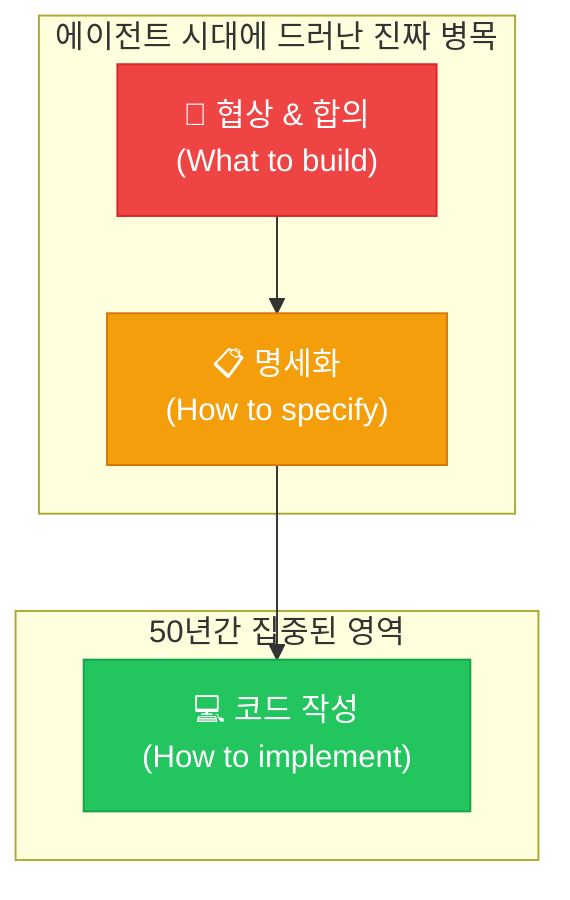
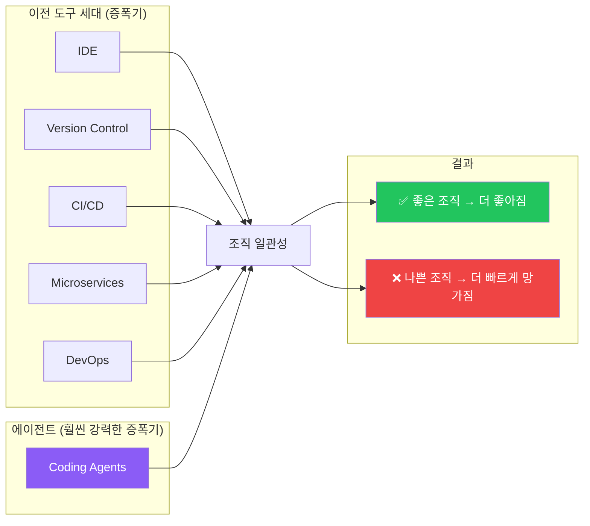
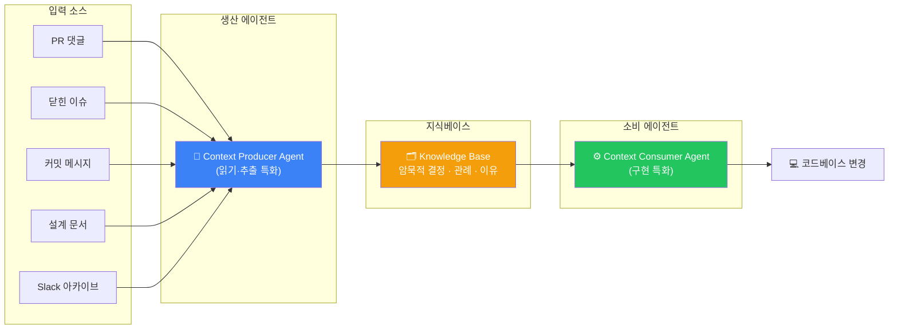
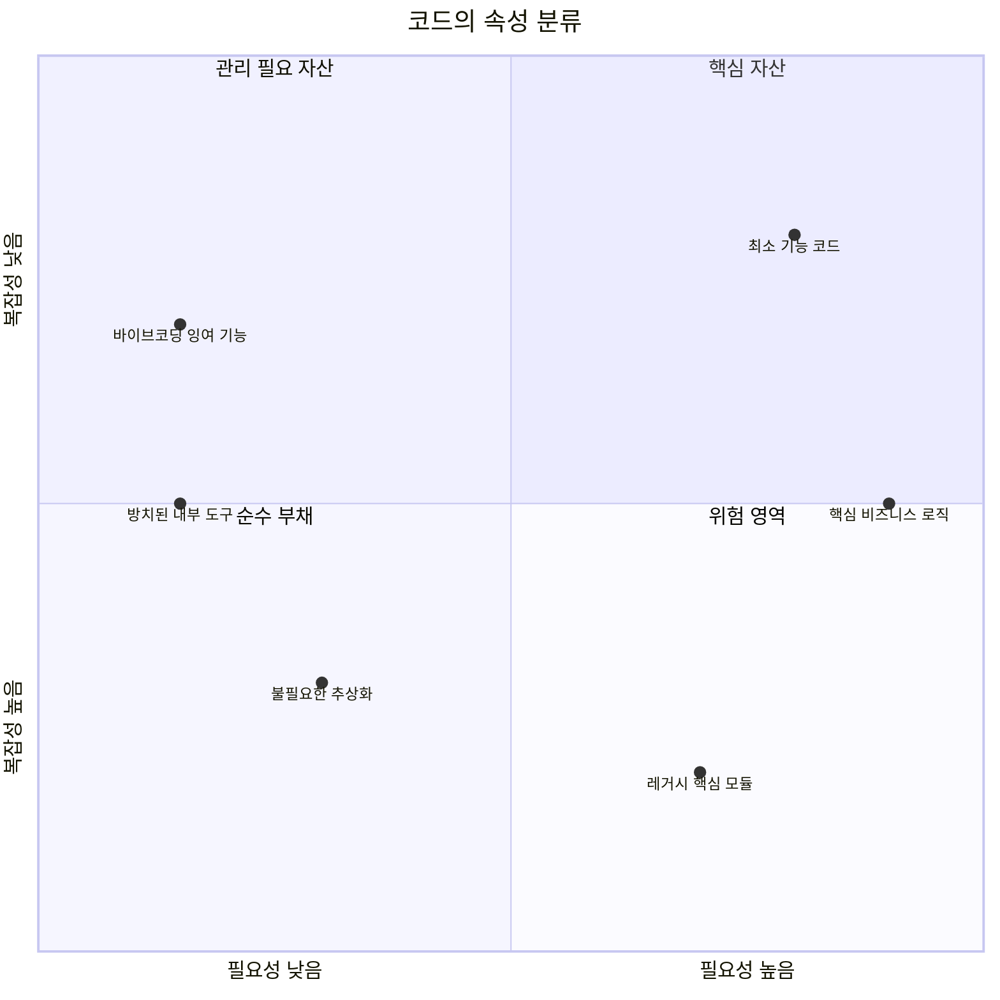
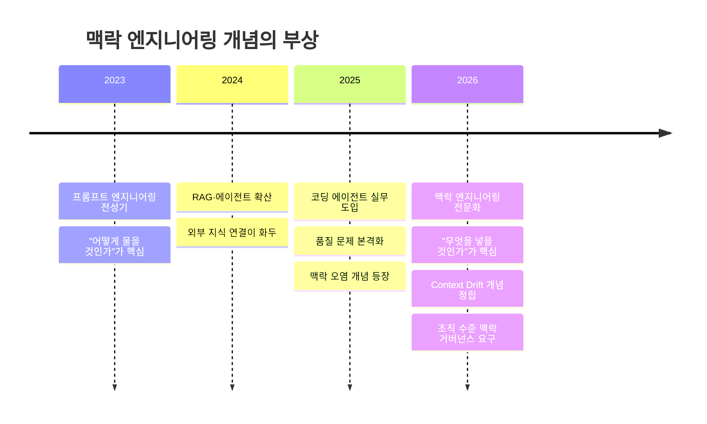
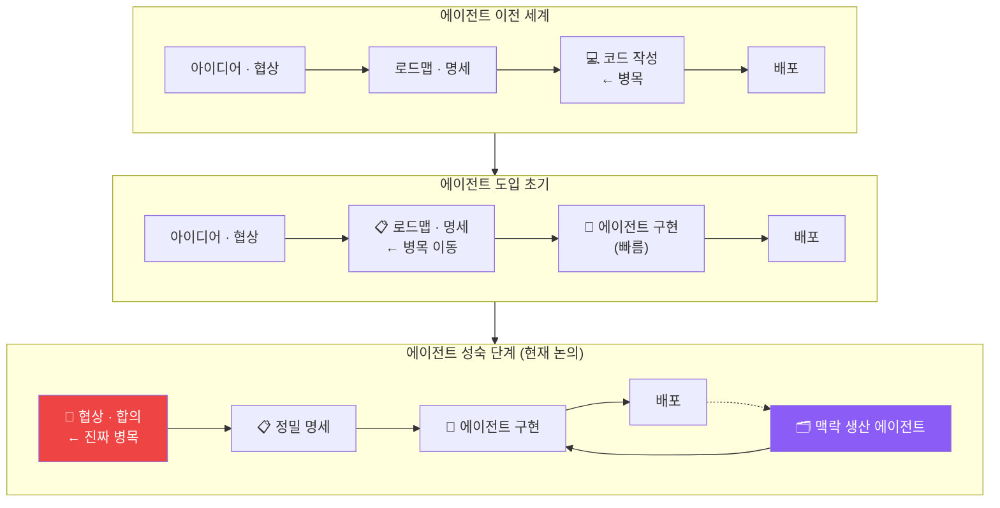

> **원문**: [The bottleneck was never the code](https://www.thetypicalset.com/blog/thoughts-on-coding-agents) — thetypicalset.com, 2026.04.29  
> **커뮤니티 반응**: [GeekNews / HackerNews](https://news.hada.io/topic?id=29238), 2026.05.07

---

## 목차

1. [글의 배경과 맥락](#1-글의-배경과-맥락)
2. [핵심 논제: 소프트웨어의 본질 재정의](#2-핵심-논제-소프트웨어의-본질-재정의)
3. [4대 테제 상세 분석](#3-4대-테제-상세-분석)
   - [테제 1 — 로드맵이 새 병목](#테제-1--로드맵이-새-병목)
   - [테제 2 — 제번스 역설: 싸진 코드의 역설적 부담](#테제-2--제번스-역설-싸진-코드의-역설적-부담)
   - [테제 3 — 맥락이 핵심 자원](#테제-3--맥락이-핵심-자원)
   - [테제 4 — 새로운 해자는 조직 일관성](#테제-4--새로운-해자는-조직-일관성)
4. [맥락 생산 루프: .txt의 실험](#4-맥락-생산-루프-txt의-실험)
5. [HN·GeekNews 커뮤니티 반응 분석](#5-hngeekNews-커뮤니티-반응-분석)
   - [비판 진영: "병목은 여전히 코드였다"](#비판-진영-병목은-여전히-코드였다)
   - [동의 진영: "조직이 항상 진짜 문제였다"](#동의-진영-조직이-항상-진짜-문제였다)
   - [철학적 논쟁: 위선인가, 합리적 갱신인가](#철학적-논쟁-위선인가-합리적-갱신인가)
   - [개념 비판: 제번스 역설의 오용](#개념-비판-제번스-역설의-오용)
   - [코드는 자산인가 부채인가](#코드는-자산인가-부채인가)
6. [2026년 최신 연구·산업 동향과의 접점](#6-2026년-최신-연구산업-동향과의-접점)
7. [구조도: 병목 이동의 전체 흐름](#7-구조도-병목-이동의-전체-흐름)
8. [종합 평가 및 시사점](#8-종합-평가-및-시사점)

---

## 1. 글의 배경과 맥락

> **지난달에 저는 [.txt](https://www.dottxt.ai/)에서 1년 넘게 미뤄왔던 실험을 드디어 실행했습니다.**

이 글은 [.txt](https://www.dottxt.ai/) — LLM 구조화 생성(structured generation) 전문 스타트업 — 의 한 엔지니어가 쓴 에세이다. 분량은 약 2,000 단어로 짧지 않지만, 단순한 기술 블로그 포스트와는 결이 다르다. 저자는 코딩 에이전트가 이미 개인 생산성을 극적으로 높였다는 사실을 인정하면서도, 그것이 소프트웨어 산업 전체의 속도를 동일한 비율로 높일 것이라는 통상적 서사에 대해 정면으로 이의를 제기한다.

글의 직접적 계기는 구체적인 실험 하나다. .txt 팀은 자체 구조화 생성 알고리듬과 오픈소스 대안들을 비교 평가하는 실험을 1년 넘게 로드맵에 올려두고 실행하지 못했다. 평가의 기준 자체를 바꾸는 것이 목표였다 — 단순히 "이 문자열을 받아들이는가(does it accept this string?)"가 아니라 "올바른 토큰 분포를 생성하는가(does it produce the right token distribution?)"로. 저자는 Codex에 30분 동안 이 방법론을 설명했고, 몇 시간 뒤 작동하는 첫 버전이 나왔다. 바로 그 경험이 이 에세이 전체의 출발점이다.

저자의 반응은 흥분이 아니라 성찰이었다. "1년을 미뤄온 실험이 하루 만에 가능해졌다" — 이 사실이 말해주는 것은 무엇인가? 저자는 코딩 에이전트가 코드 생성 속도를 극적으로 낮춘 것은 인정하지만, 그 이익이 자동으로 조직 전체의 속도 향상으로 전환된다는 낙관론에는 수개월째 회의적이었다고 고백한다.

이 긴장감을 풀기 위해 저자는 고전을 다시 꺼낸다 — Fred Brooks의 *The Mythical Man Month*(1975)와 Gerald Weinberg의 *The Psychology of Computer Programming*(1971). 이미 반세기 전에 제기된 논점들이 코딩 에이전트 시대에 다시 중심 무대로 소환된다.

---

## 2. 핵심 논제: 소프트웨어의 본질 재정의

저자가 제시하는 소프트웨어에 대한 정의는 다음 한 문장으로 압축된다.

> "Software is what's left over after a group of humans finishes negotiating with each other about what the system should do."
> 소프트웨어란 한 무리의 인간들이 시스템이 무엇을 해야 하는지 서로 협상하고 난 뒤 남는 것이다.

코드는 중요하다. 그러나 그것은 더 어렵고 더 근본적인 작업 — 사람들 사이의 합의와 협상 — 의 **잔여물(residue)** 이다. 지난 50년간 이 잔여물이 충분히 비쌌기 때문에 우리의 관심이 거기 집중되었다. 타이핑 속도, 언어 설계, 프레임워크 선택, IDE 플러그인, 코드 리뷰 도구 — 이 모든 것은 잔여물의 생산 비용을 낮추는 작업이었다.

코딩 에이전트가 그 비용을 충분히 낮추자, 그 아래 있던 것이 드러났다. **사람들이 합의하려는 시도**.

이 구도를 다이어그램으로 표현하면 다음과 같다.

이 프레임이 글의 모든 논점을 관통한다. 에이전트가 코드 생성의 비용을 0에 가깝게 만드는 순간, 진짜 병목이 수면 위로 올라온다 — 그리고 그것은 기술의 문제가 아니라 인간 조직의 문제다.

---

## 3. 4대 테제 상세 분석

### 테제 1 — 로드맵이 새 병목

에이전트가 구현을 담당하는 팀에서 속도를 제약하는 것은 이제 코드 작성자가 아니다. 에이전트가 즉시 실행할 수 있을 만큼 정밀하게 작성된 **명세(specification)** 를 생산하는 능력이 새 병목이다.

저자는 주변 관리자들의 실증적 관찰을 근거로 든다. 기능은 놀라운 속도로 구현된다. 엔지니어들은 더 이상 다른 엔지니어를 기다리지 않는다. 대신 **잘 작성된 다음 스펙을 기다린다**. 병목이 이동한 것이다.

- 이전: 코드를 쓰는 사람 → 병목
- 이후: 어떤 코드가 존재해야 하는지 결정하는 사람 → 병목

"결정하는 사람"이란 결국 **관리(management)** 다. 저자는 이 이동이 관리자를 더 중요하게 만드는 동시에, 관리자의 역할을 훨씬 어렵게 만든다고 지적한다. 빠른 구현 속도는 명세의 정밀도에 대한 요구를 극적으로 높이기 때문이다. 모호한 요구사항은 예전에도 문제였지만, 에이전트 시대에는 그 결과가 훨씬 빠르게 그리고 규모 있게 나타난다.

---

### 테제 2 — 제번스 역설: 싸진 코드의 역설적 부담

코드 작성 비용이 10배 낮아졌을 때 무슨 일이 일어나는가? 저자는 **제번스 역설(Jevons Paradox)** 을 소환한다.

> "어떤 것이 더 싸지면 덜 쓰게 되는 게 아니라 더 많이 쓰게 된다."

원래 제번스 역설은 자원 효율이 높아질수록 그 자원의 총 소비량이 증가하는 현상을 가리킨다. 저자는 이것을 소프트웨어 맥락에 적용한다. 코드 생산 비용이 내려가면 이전에는 "할 가치가 없던" 작업들이 갑자기 가능해진다. 3개월 전이라면 "시간 낭비"로 여겼을 프로토타입이 오후 한 번에 만들어진다. 명확한 수요가 없었던 내부 도구가 만들어졌다가 잊힌다.

저자가 던지는 가장 날카로운 문장이 여기 있다.

> "Every vibe-coded product with 12 features is 11 features away from being great."
> 12개의 기능을 가진 바이브 코딩 제품은 대체로 1개의 기능만 남기면 훌륭한 제품이 된다.

사용자가 기능을 흡수할 수 있는 속도는 팀이 10개를 출시하든 50개를 출시하든 크게 변하지 않는다. 스티브 잡스가 1997년에 말한 것처럼, "집중은 거절하는 것(focus is about saying no)"이다. Apple은 그해 제품군의 약 70%를 정리했고, 그 이후에야 세상이 알고 있는 Apple이 되었다.

에이전트가 있으면 새 기능을 출시하는 **감각적 만족감**이 더 쉽게 충족된다. 그것이 오히려 위험하다. 무엇을 만들지 않을 것인지 결정하는 훈련이 전보다 훨씬 어려워지기 때문이다.

---

### 테제 3 — 맥락이 핵심 자원

이 글에서 가장 밀도 있게 전개되는 논점이다. 저자는 **맥락(context)** 을 조직이 운영되는 상품(commodity)으로 정의한다.

맥락이란 무엇인가? 저자는 다음과 같이 열거한다: 무엇을 만들고 있는지, 왜 그것이 중요한지, 무엇을 이미 시도했는지, 누가 무엇을 결정했는지, 무엇이 핵심 구조이고 무엇이 역사적 유물인지. 이것들의 대부분은 문서화되지 않는다.

시니어 엔지니어가 PR을 리뷰하면서 "이건 마이그레이션을 깨뜨릴 것"이라고 말할 때, 그는 어떤 문서에도 없는 맥락을 활용한 것이다. 팀원들은 같은 공간에 있고, 같은 Slack 채널을 읽고, 새벽 2시에 같은 장애를 디버깅하면서 이 맥락을 **삼투(osmosis)** 방식으로 축적한다.

에이전트는 이 삼투를 할 수 없다. 프롬프트, 파일 트리, 도구, 명시적 지시 안에 넣지 못한 모든 것을 에이전트는 안정적으로 보유하지 않는다. 맥락 없는 에이전트가 만드는 것은 "조금 잘못된 질문에 대한 그럴듯한 답"이다.

저자는 여기서 중요한 자기 고백을 한다.

> ".txt에서 에이전트가 유용한 일을 했을 때, 정직하게 따지면 맥락 작업을 한 것은 '우리(we)'였다. 다음 10명의 엔지니어는 그 그림을 자동으로 갖게 되지 않는다."

맥락은 이제 **속도를 제한하는 입력(rate-limiting input)** 이 되었다. 그리고 인간은 자연스럽게 맥락을 암묵적으로 남기려 한다. 예전에는 명시적으로 적을 독자가 없었기 때문이다.

---

### 테제 4 — 새로운 해자는 조직 일관성

저자는 다음 10년의 승자를 이렇게 정의한다.

> 50명, 200명, 2,000명으로 성장하면서도 줄어드는 결정 집합에 정렬된 상태를 유지하며 1인당 더 많은 산출을 내는 조직.

이들은 에이전트가 도착하기 전부터 자신의 가장 어려운 문제가 **일관성(coherence)** 이라는 것을 알고 있던 조직이다. 이것은 문화와 관리의 문제다. 그리고 항상 그래왔다.

저자는 과거의 모든 도구 혁신이 남긴 교훈을 정리한다. IDE, 버전 관리, CI/CD, 마이크로서비스, DevOps — 이 중 어느 것도 도구 자체로 조정 문제를 해결하지 못했다. 각각은 이미 존재하는 조직적 일관성을 증폭하는 역할을 했다.

작은 팀은 일관성을 거의 공짜로 얻는다. 그래서 에이전트를 가장 강하게 지지하는 목소리가 작은 팀에서 많이 나오며, 그들은 자신의 맥락 안에서는 대체로 옳다. 그러나 일정 규모를 넘으면 일관성은 적극적으로 만들어지고 유지되어야 한다. 에이전트는 이 증폭 효과를 이전 어떤 도구보다 크게 만든다.

저자의 결론:

> 에이전트는 개인이 코드를 더 빨리 쓰게 하는 수단으로는 **과대평가**되고, 조직이 자신이 아는 것을 외부화하게 만드는 수단으로는 **과소평가**된다.

---

## 4. 맥락 생산 루프: .txt의 실험

글의 가장 실용적인 부분이다. 저자는 단순히 문제를 제기하는 데 그치지 않고, .txt에서 진행 중인 실험을 소개한다.

**핵심 통찰**: 맥락을 소비하는 에이전트에는 맥락을 생산하는 에이전트가 필요하다.

.txt에서는 코드베이스, 이슈, PR, 스레드를 크롤링해서 암묵적 결정, 관례, "왜 이렇게 했는지"를 지식베이스로 만드는 에이전트를 구축하기 시작했다. 단순히 "이 모듈이 존재한다"가 아니라, 다음과 같은 수준의 맥락을 담는 것이 목표다.

- "이 모듈이 이상한 이유는 마이그레이션 과정에서 기존 동작을 보존해야 했기 때문이다."
- "이 벤치마크가 중요한 이유는 이전 최적화가 분포를 조용히 바꿔버린 사례가 있었기 때문이다."

이 지식베이스는 다른 에이전트들이 코드베이스에서 행동할 때 참조한다. 인간이 비공식적으로 수행하던 삼투 과정이 **에이전트도 읽을 수 있고 인간도 읽을 수 있는 형태**로 외부화된다.

이 루프가 작동하면 조직은 스스로 만들지 않았을 **문서화된 기반**을 갖게 된다.

저자는 그러나 한계를 명확히 인정한다. 마이클 폴라니의 말을 빌려, "우리는 말할 수 있는 것보다 더 많이 안다(we know more than we can tell)." 어떤 핵심 맥락은 말로 적힌 적이 없기 때문에 존재하고, 적는 순간 달라질 수 있다. 사람이 직접 만나 쌓는 삼투 층은 문서화된 산출물만으로 완전히 복원될 수 없다. 이 루프의 결과물은 완전한 복원이 아니라 **유용한 출발점**에 가깝다.

---

## 5. HN·GeekNews 커뮤니티 반응 분석

GeekNews와 Hacker News의 반응은 이 글의 논지에 대한 다양한 각도의 검증이자 도전이다. 크게 다섯 갈래로 분류할 수 있다.

---

### 비판 진영: "병목은 여전히 코드였다"

가장 날카로운 반론이 여기서 나온다. 핵심 논리는 다음과 같다.

> "Codex에 방법론을 설명하고 몇 시간 만에 작동하는 버전이 나왔다 — 이것이 바로 병목이 코드였다는 증거다. AI가 그 코드를 썼을 뿐."

이 반론은 병목의 **정의**를 문제 삼는다. "병목이 코드였다"는 말이 "기능을 원했지만 코딩에 몇 달이 걸렸다"만을 의미하지 않는다. "2년 동안 이 기능을 원했지만, 앉아서 코드로 옮기는 5~10일의 마찰이 실행을 막았다"도 포함된다. 코드 작성의 마찰이 사라지지 않았기 때문에 루프가 실행되지 않았던 것이다.

또한 일부는 탐색적 코드 작성의 가치를 강조한다. 명세가 명확하지 않은 상황에서도 코드를 써보고, 확인하고, 버리고, 새 설계를 재시도하는 과정 자체가 학습이며, LLM은 정확히 이 "코드 작성" 부분을 빠르게 만든다. 따라서 병목은 코드였고, 에이전트가 그것을 해결했다는 주장이다.

**평가**: 이 반론은 타당하다. 저자의 논지가 "코드 작성이 어떤 의미에서도 병목이 아니었다"는 주장이라면 과도한 일반화다. 정확한 논지는 에이전트가 코드 병목을 해소한 이후에 **더 큰 병목이 드러났다**는 것이다. 두 주장은 모순되지 않는다.

---

### 동의 진영: "조직이 항상 진짜 문제였다"

베테랑 엔지니어들이 많이 동의한 지점이다.

> "경험이 쌓일수록 코드는 더 대체 가능해 보이고, 프로세스가 더 중요하고 어렵게 느껴진다."

특히 코드 품질 문제가 기술이 아니라 조직 구조에서 비롯된다는 관찰 — 오프쇼어링과 정리해고 사이클이 반복되면서 코드베이스가 기술 부채로 가득 찬다는 경험 — 은 폭넓은 공감을 얻었다.

Conway's Law를 인용한 댓글도 주목할 만하다.

> "넓은 의미에서 시스템을 설계하는 조직은 그 조직의 소통 구조를 복제한 설계를 만들 수밖에 없다." — Melvin E. Conway, 1967

소프트웨어 아키텍처가 조직 구조를 반영한다는 이 오래된 통찰이, 에이전트 시대에 다시 핵심 명제로 되살아난다. 에이전트가 생산하는 코드도 결국 그 에이전트에게 주어지는 맥락의 구조 — 즉 조직이 만든 명세와 지식베이스의 구조 — 를 반영할 수밖에 없다.

또 한 명의 관리자는 수십 년간 장기 팀을 이끈 경험을 공유한다. 부서 통합 시점에 막내 엔지니어의 경력도 10년차였던 팀에서, 소통 오버헤드는 거의 무시 가능한 수준이었다고 한다. 하루살이 재직 기간 문화가 이런 맥락 자산을 파괴한다는 지적은, 저자의 논지와 정확히 공명한다.

---

### 철학적 논쟁: 위선인가, 합리적 갱신인가

가장 감정적으로 뜨거운 논쟁이 여기서 벌어진다.

비판자들은 이렇게 지적한다. "경력 내내 팀 회의, 애자일 의식, 이슈 추적기가 자신의 코딩 몰입 상태를 방해한다고 불평하던 엔지니어들이, 기계가 자기들보다 코드를 빨리 쓰게 되자 갑자기 협업의 중요성을 설교하기 시작한다 — 이것은 위선이다."

이에 대한 반론은 논리적으로 강하다. 상황의 사실관계가 바뀌었을 때 생각을 바꾸는 것은 위선이 아니다. 코드 작성이 핵심 과정이었던 세계에서는 그 몰입 상태를 보호하는 것이 최적 전략이었다. 코드 작성이 에이전트에게 위임되는 세계에서는 협업과 명세가 핵심 과정이 된다. 합리적 행위자가 상황에 맞게 우선순위를 조정하는 것이다.

그러나 더 정밀한 비판도 있다. "의식(ritual)과 티켓은 실제 협업에 특별히 효과적이지 않다. 그것들은 주로 경영진을 위한 가시성 도구다." 스크럼 의식이나 Jira 티켓이 고객-코더 간 이해 동기화를 실제로 높이는지는 별개의 문제다. 협업의 중요성을 인정하면서도 특정 협업 도구를 비판하는 것은 완전히 일관된 입장일 수 있다.

---

### 개념 비판: 제번스 역설의 오용

여러 댓글이 저자의 제번스 역설 적용 방식을 문제 삼는다.

저자는 "어떤 것이 더 싸지면 덜 쓰는 게 아니라 더 많이 쓰게 된다"고 기술했다. 비판자들은 이것이 역설이 아니라 **당연한 수요 곡선 효과**라고 지적한다.

제번스 역설의 정확한 내용은 다음과 같다. 어떤 자원의 **효율**이 높아져서 단위 작업에 필요한 양이 줄었는데도, 그 자원의 **총 소비량**은 오히려 증가하는 현상이다. "역설"인 이유는, 효율 향상이 직관적으로는 총 소비를 줄일 것 같기 때문이다. 원래 제번스가 이것을 발견한 맥락은 석탄 증기기관이었다 — 증기기관 효율이 높아지자 석탄을 쓰는 증기기관이 더 많이 보급되어 총 석탄 소비량이 오히려 증가했다.

저자가 실제로 말하려는 것은 제번스 역설의 정확한 적용이라기보다는, 코드 비용 감소가 **범위의 폭발적 확장**으로 이어진다는 관찰이다. 개념 차용이 약간 부정확하지만, 가리키는 현상 자체는 실재한다.

---

### 코드는 자산인가 부채인가

흥미로운 부가 논쟁이다. 한 댓글은 코드를 근본적으로 **부채**로 정의한다.

> "에이전트가 더 빠르게 더 많은 코드를 만드는 것은, 더 빠르게 더 많은 부채를 만드는 것이다."

이에 대한 반론도 설득력 있다. 코드 자체는 자산도 부채도 아니다. 비즈니스 요구를 해결하는 데 필요한 최소한의 코드는 유지보수 부채가 붙은 **자산**이다 — 농부의 트랙터가 유지보수가 필요한 자산인 것처럼. 불필요한 복잡성을 위한 코드는 순수한 부채다.

그러나 "코드 작성은 항상 뭔가를 가르쳐 준다"는 반론도 강하다. 어떤 PRD나 명세서도 "명세대로 구현하면 문제를 해결한다"를 보장하지 않는다. 실제로 만들어보면서 시스템이 어떻게 동작해야 하는지 배우게 된다. 탐색적 코드 작성은 **인식론적** 가치를 갖는다 — 단순히 구현 수단이 아니라 문제 이해의 도구다.

---

## 6. 2026년 최신 연구·산업 동향과의 접점

저자의 논지는 2026년 현재 여러 독립적인 연구 및 산업 보고서에서 검증되고 있다.

**LangChain 에이전트 엔지니어링 현황 보고서 2026**에 따르면, 기업의 57%가 에이전트를 실제 운영 환경에 배포하고 있다. 그러나 품질이 여전히 최대 장벽으로, 응답자의 32%가 이를 최우선 과제로 꼽는다. 특히 10,000명 이상 규모의 대형 조직에서는 "맥락 엔지니어링과 규모 확장 시 맥락 관리"가 품질 문제의 핵심 원인으로 지목된다.

**Anthropic의 2026 에이전트 코딩 트렌드 보고서**는 소프트웨어 개발의 무게중심이 코드 작성에서 에이전트 오케스트레이션으로 이동하고 있다고 진단한다. 그리고 이 모든 역량 발전이 결국 하나의 지점에서 병목을 만난다고 분석한다 — 인간 또는 다른 에이전트가 작업 에이전트에게 얼마나 잘 맥락을 조립하고, 큐레이션하고, 전달할 수 있는가.

Anthropic의 자체 엔지니어링 팀이 발표한 **"AI 에이전트를 위한 효과적인 맥락 엔지니어링"** 문서는 맥락을 "주의 예산(attention budget)"이 있는 유한 자원으로 프레이밍한다. 이 자원은 희소하고 방향성이 있으며, 어떤 로드베어링 시스템 컴포넌트에도 적용할 수 있는 것과 동일한 엔지니어링 규율을 필요로 한다.

**The New Stack의 2026년 1월 보고서**는 이를 더 구체적으로 표현한다.

> "AI의 잠재적 생산성 향상을 팀이 얼마나 포착하느냐를 결정하는 것은 맥락 격차(context gap)다. 엔지니어가 머릿속에 담아두는 것과 AI가 이해하거나 소통할 수 있는 것 사이의 간격."

맥락 문제를 해결하는 회사는 더 빠르게 움직이고 더 적은 수정이 필요한 실수를 만든다. 반면 맥락 문제를 무시하는 팀은 개발자들이 완전히 설명할 수 없는 코드 형태로 기술 부채를 축적한다.

**맥락 드리프트(context drift)** 라는 개념도 등장했다. 팀의 관례가 진화하는데 에이전트는 구식 사례에 따라 코드를 생성하는 현상이다. Mike Mason(2026년 1월)은 네 가지 증상을 식별했다: 사용 중단된 API나 구식 패턴을 제안하는 패턴 위반, 지역적으로는 일관되지만 전역적으로는 불일치한 아키텍처 드리프트, 더 이상 실제 코드베이스를 반영하지 않는 지시의 진부화, 다른 에이전트나 레포 간의 불일치.

---

## 7. 구조도: 병목 이동의 전체 흐름

저자의 논지를 전체 시스템으로 표현하면 다음과 같다.

병목은 이동했다. 그러나 이동의 방향은 기술에서 멀어지고 조직을 향한다. 이것이 저자의 핵심 주장이다.

---

## 8. 종합 평가 및 시사점

### 글의 강점

이 에세이의 가장 큰 강점은 **구체성과 자기 성찰**의 결합이다. 저자는 자신의 실험 결과를 솔직하게 공유하고, "에이전트가 유용한 일을 했을 때 맥락 작업을 한 것은 우리였다"는 불편한 진실을 인정한다. 근거 없는 낙관론도 아니고 기술 혐오도 아닌, 실증적 관찰에 기반한 비판적 사고다.

Brooks와 Weinberg를 호출하는 것도 효과적이다. 50년 전 제기된 명제가 오늘날 새로운 형태로 재현되고 있다는 구도는, 기술 트렌드를 역사적 패턴 속에 위치시키는 데 성공한다.

### 글의 한계

그러나 몇 가지 한계도 분명하다.

첫째, 논지가 **맥락 의존적**이다. 저자의 관찰은 주로 소규모 고기능 팀(small high-functioning teams)의 경험에서 온다. 주니어 비중이 높거나, 코드 품질 자체가 생산성 제약이 되는 환경에서는 코딩 에이전트의 영향이 다르게 나타난다. HN 커뮤니티가 지적한 것처럼, 소프트웨어 개발 공간에는 "코드 난이도와 조직 문제 사이의 거대한 연속체"가 존재한다.

둘째, **폴라니의 암묵지 문제**를 제기하면서도 충분히 전개하지 않는다. 맥락 생산 루프가 포착할 수 없는 것 — 직접 만남, 비언어적 신호, 암묵적 판단 기준 — 이 실제로 얼마나 중요한지는 아직 열린 질문이다. 저자도 "아직 실험 중"이라고 인정하지만, 이 불확실성이 글의 전체적 설득력을 약화시킨다.

셋째, **제번스 역설의 부정확한 적용**은 작지만 신뢰도에 영향을 미친다. 커뮤니티의 비판이 정당하다.

### 핵심 시사점

그럼에도 이 글이 제기하는 질문들은 중요하고 실용적이다.

첫째, 조직이 **맥락을 자산으로 관리하기 시작**해야 한다. 지식베이스, 결정 이력, 설계 이유 — 이것들은 에이전트 시대의 핵심 인프라다. 코드베이스만큼, 혹은 그 이상으로.

둘째, **명세 작성 능력**이 새로운 핵심 역량이 된다. 에이전트가 즉시 실행할 수 있는 정밀한 명세를 생산하는 것은 기술 문제이자 커뮤니케이션 문제다.

셋째, **집중의 규율**이 더 어렵고 더 중요해진다. 코드 생산 비용이 낮아질수록 "무엇을 만들지 않을 것인가"를 결정하는 능력이 차별화 요소가 된다.

넷째, **조직 일관성이 진짜 해자**다. 모델 선택이나 에이전트 인프라가 아니라, 규모가 커져도 핵심 결정 집합에 정렬 상태를 유지하는 조직 문화와 관리 체계가 다음 10년의 경쟁 우위를 결정한다.

저자의 마지막 문장이 글 전체를 압축한다.

> "에이전트는 자기 생각의 확장처럼 느껴질 수 있다. 더 어려운 과제는 그것을 회사 문화의 확장으로 만드는 것이다."

---

## 참고 자료

- [The bottleneck was never the code](https://www.thetypicalset.com/blog/thoughts-on-coding-agents) — thetypicalset.com, 2026.04.29
- [병목은 결코 코드가 아니었다 (GeekNews)](https://news.hada.io/topic?id=29238) — GeekNews, 2026.05.07
- [Context is AI coding's real bottleneck in 2026](https://thenewstack.io/context-is-ai-codings-real-bottleneck-in-2026/) — The New Stack, 2026.01
- [Best context engineering tools for AI coding in 2026](https://packmind.com/context-engineering-ai-coding/best-context-engineering-tools/) — Packmind, 2026.04
- LangChain State of Agent Engineering 2026
- Anthropic 2026 Agentic Coding Trends Report
- Fred Brooks, *The Mythical Man Month*, 1975
- Gerald Weinberg, *The Psychology of Computer Programming*, 1971
- Michael Polanyi, *The Tacit Dimension*, 1966
- Melvin E. Conway, "How Do Committees Invent?", 1968

---

*작성일: 2026년 5월 7일*
