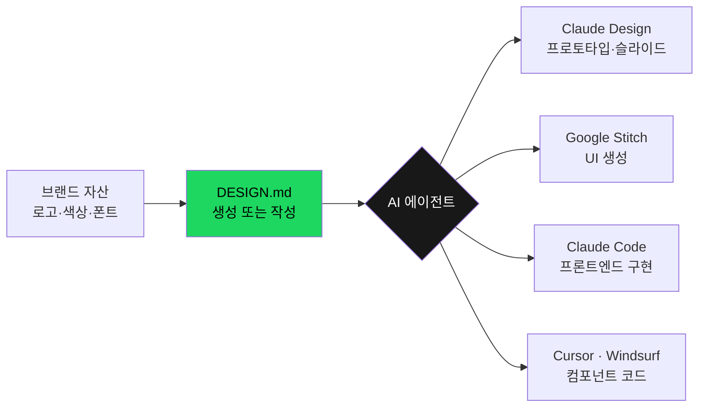
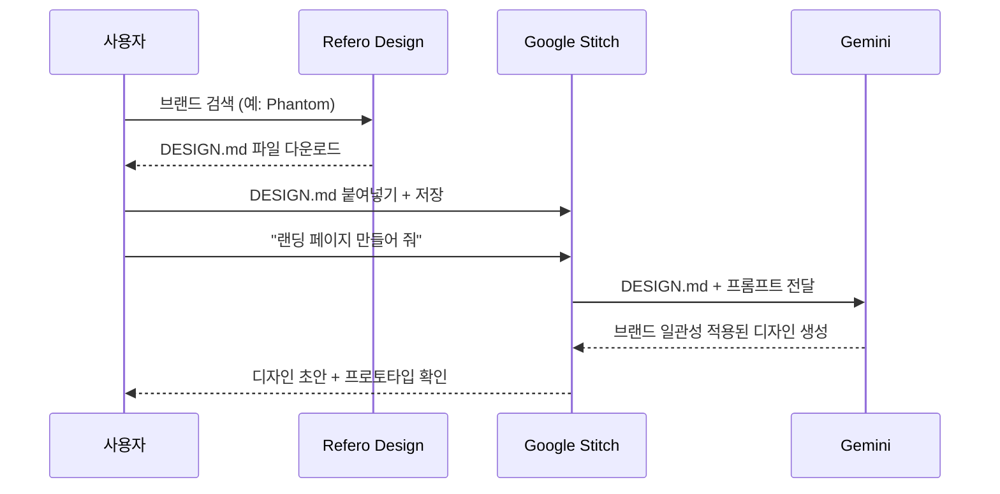
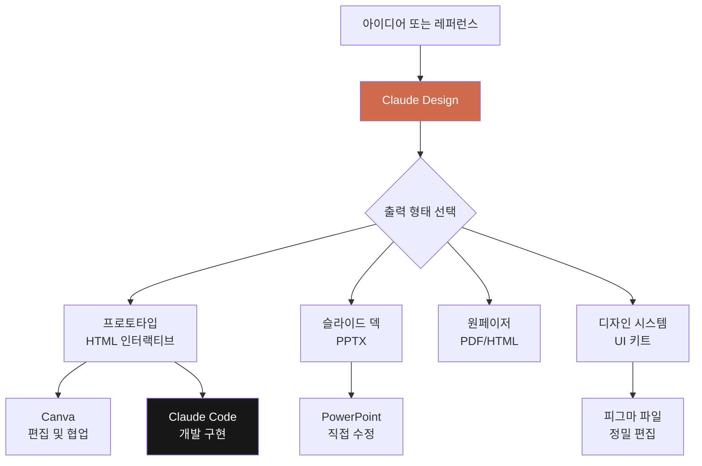
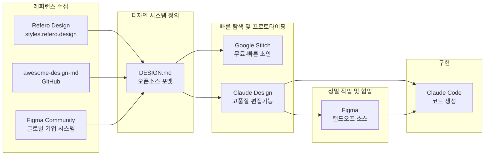

---

## 들어가며: 왜 AI는 항상 비슷한 디자인을 만드는가

AI를 활용해 웹사이트나 UI를 만들어 본 사람이라면 누구나 비슷한 경험을 한다. 프롬프트를 아무리 정성스럽게 써도 결과물이 항상 어딘가 어색하고, 파란 버튼에 Inter 폰트, 흰 배경의 Tailwind 스타터 템플릿 같은 인상을 지울 수 없다. 이 현상은 커뮤니티에서 "Tailwind starter aesthetic"이라 불리며, AI가 인터넷에 공개된 방대한 디자인 데이터의 통계적 평균을 학습했기 때문에 발생한다. 특정 브랜드의 정수가 아니라 수백만 개 프로젝트의 중간값을 재현하는 것이다.

이 문제의 본질은 기술의 부재가 아니라 소통의 부재다. AI에게 "좋은 디자인을 만들어 달라"고 하는 것은 요리사에게 레시피 없이 "맛있는 음식을 만들어 달라"고 하는 것과 같다. 결과물이 나쁘지 않을 수는 있지만, 내가 원하는 그 맛이 나올 가능성은 낮다. 2026년 현재 이 문제를 해결하기 위한 흐름이 여러 방향에서 동시에 수렴하고 있다. Google Stitch의 DESIGN.md 포맷 오픈소스화, Refero Design의 2,000건 이상 design.md 라이브러리 무료 공개, 그리고 Anthropic의 Claude Design 출시가 그것이다.

---

## 1부: DESIGN.md — AI에게 주는 디자인 레시피

### DESIGN.md란 무엇인가

DESIGN.md는 Google Stitch가 도입한 플레인 마크다운 파일로, 프로젝트의 디자인 시스템 전체를 AI 에이전트가 읽을 수 있는 형식으로 담은 문서다. 색상 팔레트, 타이포그래피, 간격 규칙, 컴포넌트 스타일, 브랜드 가이드라인이 모두 하나의 파일에 담긴다. 별도의 툴링이나 빌드 파이프라인이 필요 없으며, 프로젝트 루트에 파일 하나를 놓는 것만으로 Claude Code, Cursor, Windsurf, Google Stitch 등 어떤 AI 에이전트든 이 맥락을 읽고 일관된 디자인을 생성할 수 있다.

기존의 JSON 디자인 토큰과 결정적으로 다른 점은 "왜"를 담는다는 것이다. `#B8422E`라는 헥스코드만 적혀 있으면 AI는 이 색이 무엇인지 알 수 없다. 하지만 "Boston Clay — 인터랙티브 요소에만 사용되는 유일한 액션 드라이버"라고 적혀 있으면, AI는 이 색을 시멘틱한 역할로 이해하고 버튼이나 링크에만 정확하게 적용한다. Figma 컴포넌트 라이브러리가 인간 디자이너에게 "어떻게 생겼는지"를 알려준다면, DESIGN.md는 AI 에이전트에게 "왜 이렇게 생겼는지"를 알려주는 것이다.

DESIGN.md 파일의 공식 스펙은 Google이 오픈소스로 관리하며, 8개의 표준 섹션으로 구성된다. 브랜드 개요, 색상 시스템, 타이포그래피, 간격, 컴포넌트 스타일, 모션·애니메이션, 접근성 기준, 그리고 플랫폼별 가이드라인이 차례로 담긴다. `npx @google/design.md lint DESIGN.md` 명령으로 파일의 유효성을 검증할 수 있으며, WCAG AA 명암 대비, 깨진 참조, 섹션 순서 오류까지 자동으로 점검해 준다.

### 2026년 3월, Google Stitch가 포맷을 오픈소스로 공개한 이유

2026년 3월 Google Stitch는 무한 캔버스, 디자인 에이전트 프로젝트 메모리, 즉시 프로토타이핑, 음성 인터랙션 등의 기능 업데이트와 함께 DESIGN.md 포맷 전체를 오픈소스로 공개했다. 단일 도구에 종속되지 않고 업계 전반의 표준으로 자리잡기 위한 전략적 결정이었다. 덕분에 Claude Code, Cursor, Kiro, Gemini CLI 등 어느 에이전트에서도 동일한 DESIGN.md 파일을 그대로 사용할 수 있게 됐다. Stitch MCP 서버용 에이전트 스킬 라이브러리도 함께 공개되어, `npx skills add google-labs-code/stitch-skills --skill design-md --global` 명령 하나로 기존 코드베이스에서 자동으로 DESIGN.md를 추출하는 것도 가능해졌다.

---

## 2부: Refero Design — 2,000건의 디자인 레시피 라이브러리

### styles.refero.design의 등장

Refero는 원래 13만 장 이상의 실제 제품 스크린샷을 페이지 유형, UX 패턴, 브랜드별로 분류하여 디자이너들에게 레퍼런스를 제공하던 서비스였다. 2026년 이 서비스는 한 단계 더 나아가 `styles.refero.design`이라는 별도 페이지를 열고, 각 브랜드의 디자인 시스템을 추출하여 AI 에이전트 용도로 최적화한 DESIGN.md 파일 2,000건 이상을 무료로 공개하기 시작했다.

사용법은 간단하다. 원하는 브랜드를 검색하거나 카탈로그에서 선택하면, 해당 브랜드의 컬러값, 폰트, 여백 체계, 곡선 반경, 컴포넌트 가이드라인이 정리된 DESIGN.md 파일을 바로 다운로드할 수 있다. Phantom이나 Stripe 같은 브랜드를 검색하면 그 웹사이트의 실제 디자인 언어를 그대로 담은 레시피가 나온다. 공식 MCP 서버도 제공되어, 에이전트가 코드를 작성하기 전에 라이브러리에서 시맨틱 검색을 수행하고 현재 작업에 적합한 패턴을 자동으로 추출할 수도 있다.

이와 함께 GitHub의 `VoltAgent/awesome-design-md` 레포지토리는 59개 이상의 브랜드 DESIGN.md를 큐레이션하여 제공하고 있으며, Stripe, Linear, Vercel, Notion, Apple, Spotify 등 유명 브랜드의 파일이 포함되어 있다. `designmd.app`은 독립적인 공개 라이브러리로 400건 이상의 파일을 호스팅 중이며, 각 파일은 표준 8섹션 구조를 따른다.

### 왜 이것이 바이브 코딩의 판도를 바꾸는가

AI를 활용한 웹 개발의 성패는 얼마나 구체적인 맥락을 AI에게 제공하느냐에 달려 있다. "좋게 만들어 줘"가 아니라 "Phantom의 디자인 언어로 만들어 줘"라고 하면, AI는 추상적으로 상상하는 대신 명확한 규칙에 따라 작업한다. Refero와 awesome-design-md 같은 라이브러리는 디자이너가 아닌 사람도 세계적 수준의 브랜드 디자인 언어를 즉시 AI에 주입할 수 있게 해준다. 이를 통해 바이브 코딩의 결과물 품질이 평준화될 수 있다는 것이 핵심이다.

---

## 3부: Google Stitch에서 DESIGN.md 활용하기

### Stitch의 작동 방식

Google Stitch는 Gemini 모델 기반의 AI 디자인 도구로, 자연어 프롬프트로 UI를 설명하면 디자인과 프론트엔드 코드(React 등)를 함께 생성한다. 핵심 차별점은 DESIGN.md를 시스템 프롬프트처럼 활용한다는 것이다. 프롬프트를 입력할 때마다 Gemini는 DESIGN.md 전체를 맥락으로 함께 읽는다. 덕분에 "설정 페이지"와 "결제 페이지"를 별개로 요청해도 동일한 색상, 폰트, 컴포넌트 스타일이 일관되게 적용된다.

실제 워크플로는 이렇다. Refero Design 또는 awesome-design-md에서 원하는 브랜드의 DESIGN.md 파일을 가져와 Stitch의 컨텍스트 창에 붙여넣는다. Stitch는 이를 바탕으로 디자인 시스템을 정립하고, 이후의 모든 UI 생성에 이 규칙을 자동으로 적용한다. 결과물은 텍스트로 정리된 마크다운과 함께 시각적 디자인 초안으로 동시에 제공된다.

Stitch는 무료로 사용해 볼 수 있어 접근성이 높지만, 베타 버전이기에 모든 브랜드가 검색되지는 않고 동적 요소의 완전한 구현에는 한계가 있다. 그럼에도 불구하고 클라이언트가 레퍼런스 사이트를 제시했을 때, 해당 사이트의 디자인 규칙을 DESIGN.md로 가져와 초안을 빠르게 만들어 보는 용도로는 매우 강력하다.

---

## 4부: Claude Design의 등장 — 2026년 4월의 충격

### 출시 배경과 피그마 주가 하락

2026년 4월 17일, Anthropic Labs는 Claude Design을 연구 프리뷰 형태로 출시했다. 발표 직전 Anthropic의 CPO인 Mike Krieger가 Figma 이사회에서 물러났고, 출시 당일 Figma 주가는 하루 만에 7% 하락했다. Adobe와 Webflow도 동반 하락하며 월스트리트는 디자인 소프트웨어 업계 전반의 가치를 하루 만에 재평가하기 시작했다.

이 사건에는 상징적인 맥락이 있다. Claude Design의 디자인을 총괄한 Jenny Wen은 Figma에서 FigJam을 성공시킨 디자인 디렉터 출신으로, Figma의 전성기를 이끌었던 인물이다. 그녀는 Anthropic으로 이직하면서 이렇게 선언했다: "리서치, 발산, 수렴의 사이클을 몇 달씩 밟던 기존 디자인 프로세스는 끝났다." 엔지니어 7명이 Claude를 동시에 돌리며 코드를 찍어내는 시대에, 디자이너가 몇 달씩 걸려 리서치 사이클을 밟는 것보다 빠르게 만들고 즉시 검증하는 것이 훨씬 낫다는 의미다.

### Claude Design이란 무엇인가

Claude Design은 Claude Opus 4.7 모델로 구동되는 AI 기반 비주얼 제작 도구다. 텍스트 프롬프트, 업로드된 이미지·문서(DOCX, PPTX, XLSX), 코드베이스, 웹 캡처 등 다양한 입력을 받아 프로토타입, 슬라이드 덱, 원페이저, UI 목업 등 편집 가능한 디자인 결과물을 생성한다.

Claude Opus 4.7은 이 도구를 위해 설계된 것이나 다름없는 모델이다. 비전 해상도가 기존 Opus 4.6의 1,568px(115만 화소)에서 2,576px(375만 화소)로 대폭 향상되어, 레퍼런스 이미지 안의 작은 텍스트까지 정확하게 인식할 수 있다. 이미지 정확도가 기존 54.5%에서 98.5%로 올라갔다는 평가도 나오며, 이는 레퍼런스 이미지를 제공할수록 더 충실한 결과물이 나온다는 뜻이다.

Claude Design은 현재 Claude Pro, Max, Team, Enterprise 구독자를 대상으로 연구 프리뷰로 제공되며, 기존 채팅 및 Claude Code 사용량과는 별도로 집계되는 독립적인 주간 한도를 가진다. 데스크탑 앱에서는 지원되지 않으며, 웹 브라우저 버전에서만 접근 가능하다.

### Claude Design이 GPT나 Gemini와 다른 결정적인 차이

GPT나 Gemini 기반 도구도 디자인을 생성할 수 있지만, 치명적인 한계가 있었다. 편집이 불가능한 통 이미지 형태로 결과물을 준다는 점이다. 텍스트를 바꾸거나 색상을 수정하려면 처음부터 다시 생성해야 했다.

Claude Design의 핵심 차별점은 편집 가능한 원본 파일을 직접 제공한다는 것이다. PPT로 만들면 PPTX 파일을 받을 수 있고, 이 파일은 PowerPoint에서 그대로 수정 가능하다. Canva로 내보내면 Canva에서 완전히 편집 가능한 디자인이 된다. HTML로 내보낸 후 피그마의 HTML 임포트 플러그인을 활용하면 피그마에서도 이어서 작업할 수 있다. Claude Code로 핸드오프하면 코드 구현까지 파이프라인이 이어진다. 이것이 단순한 이미지 생성 도구가 아니라 디자인 워크플로 레이어가 되는 이유다.

---

## 5부: Claude Design 주요 기능 심층 분석

### 디자인 시스템 구축

Claude Design의 가장 중요한 기능 중 하나는 디자인 시스템을 자동으로 구축하고 관리하는 것이다. 온보딩 과정에서 Claude는 사용자의 코드베이스와 디자인 파일을 읽어 컬러, 타이포그래피, 컴포넌트를 자동으로 추출하고 디자인 시스템을 만든다. 이후 생성되는 모든 프로젝트에는 이 시스템이 자동으로 적용된다.

실제 시연에서는 Spotify의 DESIGN.md 파일을 가져와 디자인 시스템을 구성하면, Spotify Green(#1ED760), Near Black(#121212), Dark Surface(#181818), Mid Dark(#1F1F1F) 등의 브랜드 컬러와 타이포그래피가 자동으로 정의되고 리뷰 인터페이스를 통해 18개 항목을 하나씩 검토하고 승인하거나 수정 요청을 할 수 있다. 마음에 들면 "Looks good", 수정이 필요하면 "Needs work"를 선택하고 프롬프트로 방향을 제시하면 된다.

피그마 커뮤니티에 공개된 글로벌 기업들의 고퀄리티 디자인 시스템 파일을 그대로 업로드하여 사용하는 것도 가능하다. IBM의 오픈소스 Carbon Design System(방대한 컴포넌트 라이브러리, 강력한 접근성 기준, 프론트엔드 코드 문서화까지 갖춘 교과서 수준의 시스템)을 피그마 커뮤니티에서 다운로드해 Claude Design에 업로드하면, 이 수준의 디자인 시스템을 기반으로 앱이나 웹을 처음부터 만들어 볼 수 있다.

### 인터페이스 구성과 네 가지 작업 유형

Claude Design의 인터페이스는 왼쪽 사이드바에 네 가지 탭으로 구성된다.

첫 번째는 **프로토타입**으로, 인터랙티브한 UI를 만드는 데 사용한다. 와이어프레임(러프 스케치 수준)과 하이피델리티(실제 제품에 가까운 수준) 중에서 선택할 수 있다. 이 탭에서는 웹GL 셰이더 기반의 3D 요소, 파티클 애니메이션, 스트리밍 텍스트 효과, 3D 지구본, 트럼프 카드 3D 렌더링 등 기술적으로 수준 높은 결과물도 생성 가능하다. GitHub에서 `react-globe-gl` 같은 컴포넌트 코드를 가져와 붙여넣으면 품질을 한층 더 높일 수도 있다.

두 번째는 **슬라이드 덱**으로, 발표용 PPT를 만든다. 디자인 시스템을 적용한 상태에서 슬라이드를 만들면 해당 브랜드 컬러와 폰트가 자동으로 적용된다. 발표자 노트 기능을 활성화하면 슬라이드에 텍스트를 과하게 넣지 않고 발표 스크립트를 별도로 관리할 수 있다. 한 번 슬라이드가 생성된 후 WebGL 셰이더 배경과 슬라이드별 추상 도형, 스트리밍 텍스트 애니메이션을 추가하는 등의 발전적인 수정도 프롬프트 두 번으로 가능하다.

세 번째는 **프롬 템플릿**으로, 미리 정의된 템플릿에서 시작할 수 있다. 네 번째는 **기타(Other)** 로, 카드 뉴스 등 앞의 세 유형에 해당하지 않는 결과물을 만들 때 사용한다.

### Tweak 기능과 정밀 수정 방법

Claude Design은 단순히 결과물을 생성하는 것에서 멈추지 않고, 다양한 방식으로 수정할 수 있는 체계를 갖추고 있다.

가장 독특한 것은 **Tweaks** 기능이다. 슬라이더나 토글 같은 커스텀 조절 패널을 Claude에게 만들어 달라고 요청하면, Claude가 직접 그 패널을 생성해 준다. 이후 이 패널을 통해 액센트 컬러 변경, 장면 전환 속도 조정, 배경 셰이더 강도 조절, 슬라이드 번호 표시 여부 등을 실시간으로 조작할 수 있다. 고정된 속성 패널이 아니라 사용자가 원하는 조작 옵션을 직접 설계할 수 있다는 점에서 다른 도구와 차별화된다.

**드로잉 기능**을 사용하면 수정하고 싶은 영역을 직접 그린 후 구체적인 수정 요청을 입력할 수 있다. **Edit 기능**으로는 특정 섹션을 선택해 폰트, 사이즈, 굵기, 컬러, 정렬 등을 세밀하게 조정할 수 있다. 패딩, 반경 값 조정도 이를 통해 직접 처리할 수 있다.

**프레젠테이션 모드**는 실용적인 기능이다. 가장 오른쪽 상단의 Present 버튼을 클릭하면 슬라이드가 전체 화면으로 펼쳐지며, 발표자가 볼 수 있는 별도 노트 창이 함께 제공된다. 발표자는 이 노트를 보면서 슬라이드의 텍스트를 최소화한 채 발표를 진행할 수 있다.

### 실제 PPT 제작 시연

한 시연에서는 AI 에이전시 제안서 PPT를 Claude Design으로 만들었다. 보고서용 미니멀한 디자인 컨셉을 설명하고, 사용할 폰트 파일(Pretendard 등)을 첨부한 뒤 전송하자, 약 5분 뒤 15페이지짜리 PPT가 생성되었다. 흰 배경에 검은 계열 텍스트, 포인트 블루 컬러로 구성된 디자인 시스템이 자동으로 만들어졌고, 표지, 목차, 간지, 섹션별 내용, 전체 일정표, 견적 패키지, Thank You 페이지까지 완성도 있게 구성되었다.

내보낼 때 폰트 옵션이 두 가지 제공되는데, 커스텀 폰트(사용자가 업로드한 Pretendard)를 적용하거나, 모든 컴퓨터에서 깨지지 않도록 시스템 폰트(맑은 고딕 등)로 변환하는 옵션 중 선택할 수 있다. 이렇게 생성된 PPTX 파일은 텍스트 줄바꿈이나 크기 등 일부 세밀한 부분은 직접 조정이 필요하지만, 수정 가능한 편집 가능 원본 파일이라는 것이 핵심이다.

### 카드 뉴스 제작

카드 뉴스 제작도 인상적이다. Other 탭에서 레퍼런스 이미지를 첨부하고 "볼드하고 텍스트가 잘 보이는 카드 뉴스 디자인 컨셉을 만들어 줘, 프레임은 4:5 비율로"라고 요청하면, Claude는 바로 작업에 들어가는 대신 먼저 질문을 한다. 카드 뉴스 주제, 장수, 레이아웃 다양성 여부, 사용 언어, 이미지 강도, 장식 요소 등을 서베이 형태로 물어보며 구체적으로 정보를 수집한다. 1080×1350 인스타그램 권장 사이즈까지 자동으로 제안하는 등 세밀한 면을 보인다.

결과물에서는 레퍼런스에 충실한 볼드한 디자인이 나오고, 어떤 내용 그린을 포인트로 쓸지 모르기 때문에 여러 버전을 함께 보여주는 배려도 담겨 있다. Pretendard, 지마켓 산스, Noto Sans 등 코리안 폰트도 실시간으로 전환해 비교할 수 있게 제공한다. 전문 디자이너 관점에서도 원본 파일을 받아 브랜드에 맞게 약간 손보면 바로 활용할 수 있는 수준이라는 평가가 나왔다.

---

## 6부: 뉴욕 AI 스타트업 디자이너의 현장 후기 — 피그마 vs Claude Design

### 실무 투입 맥락

뉴욕의 AI 스타트업에서 Founding Product Designer로 일하는 현직 디자이너의 [사례](https://www.youtube.com/watch?v=7NipvZVUbO4)는 Claude Design의 실제적 가능성과 한계를 가장 냉정하게 보여준다. 그녀는 출시 직후 주말 내내 Claude Design을 테스트하고, 다음 주 월요일부터 실무 프로젝트에 투입했다. 방식은 피그마 반, Claude Design 반이었다.

프로젝트 투입 시점은 PM, CTO, 엔지니어, 디자이너가 데이터베이스 로직, 기능 범위, 유저 플로우를 함께 맞추던 초기 단계였다. 정확히 무엇을 만들어야 하는지 완전히 정립되지 않은 상태였고, 여러 방향을 빠르게 탐색해야 하는 상황이었다. 이미 피그마에는 초기 와이어프레임이 일부 있었고, 회사 디자인 시스템도 피그마 라이브러리로 정리되어 있었다.

### Claude Design이 탁월했던 세 가지 순간

**첫째, 빠른 프로토타이핑과 팀 얼라이먼트.** 기존에는 피그마에서 와이어프레임을 만들고, 이를 하이피델리티 디자인으로 발전시키고, 버튼 하나하나를 연결해 프로토타입으로 만드는 데 상당한 시간이 소요됐다. Claude Design으로는 실제 제품처럼 보이는 수준의 인터랙티브 프로토타입을 훨씬 빠르게 만들 수 있었다. 더 중요한 것은 PM과 엔지니어가 말이나 정적 와이어프레임이 아니라 직접 클릭해서 플로우를 경험할 수 있게 되었다는 점이다. 팀 얼라이먼트 속도가 크게 단축됐다.

**둘째, 유저 테스팅.** 피그마에서 모든 버튼과 상태를 하나하나 연결해 테스트 가능한 프로토타입을 만드는 것은 생각보다 훨씬 많은 시간과 노력이 필요하다. Claude Design으로는 훨씬 적은 비용으로 유저 테스팅용 프로토타입을 만들 수 있었다. 어느 정도 완성도가 갖춰진 프로토타입으로 실제 유저 테스팅까지 진행했다.

**셋째, 설계 탐색의 폭.** Claude Design은 여러 가지 컨셉의 프로토타입을 빠르게 만들어 볼 수 있게 해준다. 피그마에서 하나 만드는 시간에 Claude Design으로는 열 개의 방향을 탐색할 수 있다.

### Claude Design이 실패한 순간 — 엔지니어 핸드오프

핵심적인 한계는 엔지니어 핸드오프 단계에서 드러났다. 처음에는 엔지니어들도 Claude Code와 연동되는 핸드오프 파일로 Claude Design 결과물을 사용해볼 수 있을 것 같다고 했지만, 자세히 들여다보니 문제가 생겼다.

Claude Design이 만든 프로토타입이 실제로 회사의 디자인 시스템 토큰을 사용하고 있는지가 불분명했다. 겉으로는 비슷해 보이지만 실제 스페이싱, 타이포그래피, 컴포넌트 구조가 피그마에 정의된 디자인 시스템과 다르게 커스텀으로 생성된 부분이 조금씩 있었다. 어디까지가 공식 시스템이고 어디까지가 Claude가 추측해서 만든 것인지 분리해내기가 어려웠다. 최종 핸드오프의 소스 오브 트루스로 쓰기에는 엔지니어들이 혼란스러울 수 있다는 결론에 이르렀고, 결국 핸드오프 단계에서는 다시 피그마로 돌아왔다.

### 현직 디자이너의 결론

이 경험을 바탕으로 내린 결론은 명확하다. Claude Design은 피그마를 완벽히 대체하는 도구가 아니라, 디자인 프로세스의 앞단을 극적으로 가속화하는 도구다. 아이디에이션, 프로토타이핑, 팀 얼라이먼트, 유저 테스팅 단계에서는 정말 강력하다. 그러나 최종 디자인 스펙, 엔지니어 핸드오프, 디자인 시스템 관리, 정밀한 팀 협업에서는 아직 피그마가 더 적합하다.

비용도 고려해야 한다. 일주일 정도 실무에서 피그마만큼 사용했을 때 Max 플랜(회사 부담)의 주간 한도에 처음으로 근접했다. 개인 사용자가 무분별하게 사용하면 토큰 소비가 상당하다. 한 시연에서 PPT, 브랜드 디자인 시스템, 카드 뉴스 세 가지를 제작하고 나서 Max 플랜 주간 한도의 35%가 소비된 것을 확인했다. 따라서 팀 단위로 장기적으로 활용하려면 어떤 단계에서 Claude Design을 쓰고 어떤 단계에서 피그마로 정리할지에 대한 명확한 전략이 필요하다.

---

## 7부: Claude Design과 RummiArena 프로젝트

### Claude Design을 실제 프로젝트에 투입하다

Claude Design은 실제 개발 중인 프로덕트인 [RummiArena](https://github.com/k82022603/RummiArena) 프로젝트에도 투입되어 있다. RummiArena는 온라인 루미큐브 게임 플랫폼으로, Claude Design 안에 별도 프로젝트 공간이 열려 있는 것을 볼 수 있다. (관련글 : [**RummiArena — 게임보드 상단 빈 공간 활용 검토**](https://k82022603.github.io/posts/rummiarena-%EA%B2%8C%EC%9E%84%EB%B3%B4%EB%93%9C-%EC%83%81%EB%8B%A8-%EB%B9%88-%EA%B3%B5%EA%B0%84-%ED%99%9C%EC%9A%A9-%EA%B2%80%ED%86%A0/))

Claude Design에서 게임 보드 상단 빈 공간 문제를 기획자와 함께 검토하고 마크다운 문서 및 다이어그램을 작성하는 작업이 이루어지고 있다. 클로드가 스크린샷을 분석하여 현재 레이아웃 구조(좌측 플레이어 패널, 상단 중앙의 Room ID·타이머·헨드오프 버튼 영역, 중앙 게임 보드, 하단 핸드, 우측 힌트 패널)를 서술형으로 정리하고, 개선안을 5가지 도출하며, Mermaid 다이어그램과 SVG 와이어프레임을 포함한 기획 문서를 함께 만들어 내는 과정이 진행 중이다.

이 프로젝트에서 Claude Design은 단순한 UI 생성기가 아니라 기획 문서 작성, 와이어프레임 설계, Claude Code에 전달할 스펙 작성을 포함하는 통합 디자인 워크스페이스로 활용되고 있다. Design Files 탭에는 `docs/`, `mock/`, `uploads/` 폴더가 구성되어 있으며, `Board Top Hifi.html`, `design-canvas.jsx` 등의 산출물이 저장되어 있다. 마크다운 스펙 파일, 의사결정 백락 파일, 목업 JSX 코드, SVG 와이어프레임이 함께 관리되며 Claude Code에 전달하기 위한 완성된 컨텍스트 패키지를 구성한다.

---

## 8부: 도구들의 관계와 실무 전략

### 2026년 현재 도구들이 서로 어떻게 연결되는가

2026년 현재 DESIGN.md, Refero Design, Google Stitch, Claude Design, 피그마는 서로 경쟁하는 도구들이 아니라 디자인 워크플로의 릴레이를 이루는 부분들이다. 각 도구가 특정 단계에서 가장 효과적인 역할을 맡는다.

### 사용자 유형별 권장 전략

비디자이너 창업자, PM, 마케터의 경우 DESIGN.md 라이브러리에서 원하는 브랜드 스타일을 가져오거나 Claude Design에 온보딩을 통해 자체 디자인 시스템을 구축하고, 이후 모든 프로토타입과 슬라이드를 Claude Design으로 만드는 것이 효율적이다. 초기 아이디어를 시각화하거나 투자자 피치덱을 만드는 데 피그마 없이도 충분한 결과물을 얻을 수 있다.

소규모 팀이나 1인 개발자라면 Claude Design 프로토타입을 그대로 Claude Code 핸드오프 파일로 넘기는 워크플로를 시도해 볼 만하다. 완성도 높은 디자인 시스템을 갖추지 못한 초기 단계에서는 이 접근이 현실적이다.

전문 디자이너가 있는 팀이라면 아이디에이션과 유저 테스팅에는 Claude Design, 최종 스펙과 엔지니어 핸드오프에는 피그마라는 이분법적 전략이 현실적이다. Claude Design으로 만든 프로토타입이 팀 얼라이먼트와 유저 리서치에는 충분히 기여하지만, 디자인 토큰 수준의 정확성이 요구되는 최종 핸드오프에는 아직 피그마가 더 신뢰할 수 있다.

AI 에이전트 기반 개발 파이프라인(Claude Code 중심)을 구축한 경우, DESIGN.md를 프로젝트 루트에 두고 모든 AI 에이전트가 이를 참조하도록 설정하는 것이 일관성을 확보하는 핵심이다. 이것은 `CLAUDE.md`(Claude Code 프로젝트 지침 파일)와 함께 AI 에이전트의 두 가지 핵심 컨텍스트 파일로 자리잡아가고 있다.

---

## 맺음말: 디자인 민주화와 그 그림자

2026년 현재 진행 중인 변화는 단순히 "AI가 디자인을 잘한다"는 이야기가 아니다. 디자인 역량이 AI와의 소통 방식에 달려 있고, 그 소통의 언어가 DESIGN.md와 같은 구조화된 컨텍스트 파일로 수렴하고 있다는 이야기다.

Figma 주가 하락은 단순한 주가 이벤트가 아니라 업계가 인식하는 디자인 소프트웨어의 역할 변화를 반영한다. 동시에, Claude Design이 출시 직후 상당한 비용을 발생시키고 피그마 수준의 협업 기능을 갖추지 못한 현실은 이 변화가 아직 진행 중임을 보여준다.

가장 현명한 접근은 특정 도구에 완전히 의존하거나 완전히 거부하는 것이 아니라, 각 도구가 어느 단계에서 가장 강력한지를 파악하고 워크플로를 설계하는 것이다. AI에게 자유를 주지 말고 정확한 레시피를 주라는 원칙은, 도구를 선택하는 인간에게도 동일하게 적용된다.

---

## 참고 링크

- Refero Design Styles: https://styles.refero.design
- Google Stitch: https://stitch.withgoogle.com
- Google DESIGN.md 공식 스펙: https://github.com/google-labs-code/design.md
- GitHub Awesome Design MD: https://github.com/VoltAgent/awesome-design-md
- Figma 커뮤니티 IBM Carbon Design System: https://www.figma.com/community/file/874592104192380079/ibm-carbon-design-system
- Claude Design 공식 소개: https://www.anthropic.com/news/claude-design-anthropic-labs
- designmd.app (400+ 디자인 시스템 라이브러리): https://designmd.app

---

*작성일: 2026년 5월 8일*
