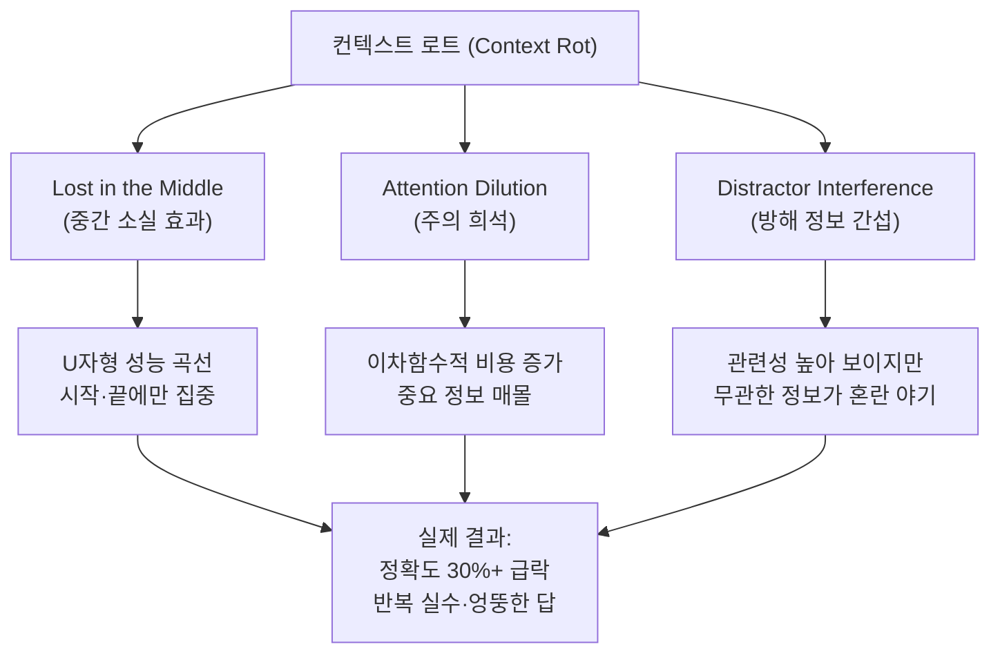
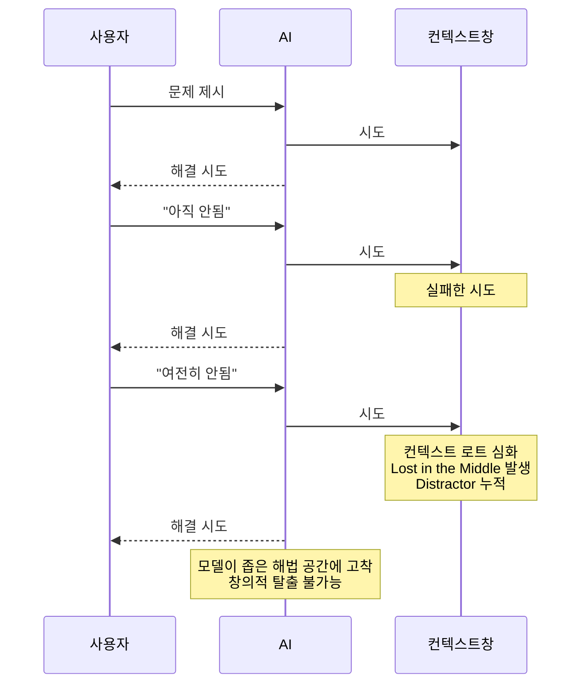
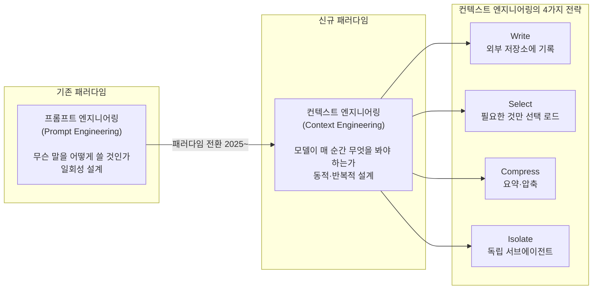
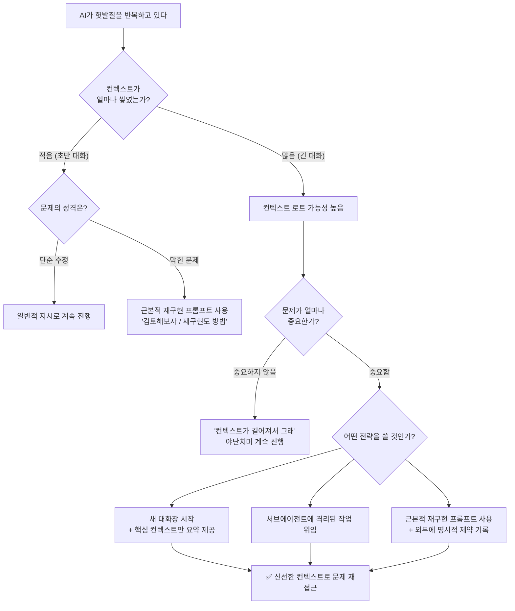

> "AI 덕분에 오히려 인간에 대해서 많이 생각하게 되는 요즘."  
> — [@golbin]( https://www.threads.com/@golbin/post/DYCZ2PGEysX) (Threads, 2025)

---

## 들어가며

요즘 AI 코딩 도구나 챗봇을 집중적으로 쓰다 보면 묘한 경험을 한다. 분명 처음에는 척척 답을 내놓던 모델이, 대화가 길어질수록 점점 엉뚱한 답을 내놓거나 아까 스스로 해결했던 문제조차 반복해서 틀린다. 커뮤니티에서는 이것을 두고 "AI가 또 멍청해졌다"거나 "컨텍스트가 길어져서 헛발질한다"고 표현한다. 그리고 어떤 사람들은 AI를 혼내듯 야단치며 계속 대화를 이어가고, 또 어떤 사람들은 새 대화창을 열어 처음부터 다시 시작한다.

이 현상은 단순한 체감이 아니다. 2025년을 기점으로 여러 연구팀이 이를 **"컨텍스트 로트(Context Rot)"** 라는 이름으로 체계적으로 규명하기 시작했고, 그 원인과 구조, 그리고 대응책이 빠르게 축적되고 있다. 동시에, 실무 개발자들 사이에서는 이 문제를 우회하는 실용적인 프롬프트 전략들도 공유되고 있다. 그중 하나가 바로 "쫌쫌따리 방법이 아니라 근본적으로 해결할 수 있는 방법이 있는지 검토해보자. 완전히 재구현하는 것도 방법이다"라는 식의 직접적이고 근본적인 재설정 요청이다.

이 글은 그 현상의 정체와 이유, 그리고 실용적인 대응 전략을 가능한 한 깊이 파고든다.

---

## 1. 컨텍스트 로트란 무엇인가

### 1.1 기본 개념

**컨텍스트 로트(Context Rot)** 는 LLM(대형 언어 모델)에 입력되는 컨텍스트의 길이가 늘어날수록 모델의 출력 품질이 저하되는 현상을 말한다. "Rot"는 부패·썩음을 뜻하는 영어 단어로, 오래된 정보가 쌓일수록 모델의 판단이 흐려진다는 비유다.

중요한 점은, 이것이 **단순히 토큰 한도에 다가갔기 때문**이 아니라는 것이다. 모델의 맥락 창(context window)이 절반도 차지 않은 시점에서도 성능 저하는 측정 가능한 수준으로 나타난다. 즉, 컨텍스트가 "꽉 차서" 문제가 생기는 것이 아니라, **길어질수록 구조적으로 주의(attention)가 흐려지는 것**이 본질적인 원인이다.

### 1.2 연구로 확인된 사실들

2025년 Chroma 연구팀은 GPT-4.1, Claude Opus 4, Gemini 2.5 Pro를 포함한 18개의 최전선 모델을 대상으로 실험을 진행했다. 결과는 충격적이었다. **모든 모델이 예외 없이 입력 길이가 늘어날수록 성능 저하를 보였다.** 저하의 방식도 점진적이지 않았다. 어떤 모델은 특정 임계점까지 95%의 정확도를 유지하다가, 그 지점을 넘는 순간 60%대로 급락했다. 마치 절벽처럼 무너지는 양상이었다.

이는 GPT-4.1이나 Claude Opus 4 같은 "가장 좋은 모델"의 문제가 아니다. 컨텍스트 로트는 **트랜스포머 아키텍처의 구조적 속성**이다. 훈련을 더 많이 한다고 해서 근본적으로 해결되는 문제가 아니라는 뜻이다.

또 다른 연구(Paulsen, 2025)에서는 더 놀라운 결과가 나왔다. 일부 최고 수준의 모델들이 **고작 100개 토큰의 컨텍스트만으로도 실패 사례**를 보였고, 많은 모델이 1,000 토큰 수준에서 이미 유의미한 정확도 저하를 드러냈다. 이는 제조사가 광고하는 "100만 토큰 컨텍스트 창"과 "실제로 안정적으로 활용할 수 있는 유효 컨텍스트" 사이에 거대한 간극이 존재함을 시사한다.

---

## 2. 왜 이런 일이 생기는가: 세 가지 메커니즘

컨텍스트 로트를 유발하는 메커니즘은 크게 세 가지로 분류된다. 이 세 가지가 복합적으로 작용할 때 문제가 극적으로 심화된다.



### 2.1 중간 소실 효과 (Lost in the Middle)

스탠퍼드 연구팀이 2023년 Liu et al. 논문에서 처음 규명한 이 현상은, LLM이 입력된 컨텍스트 전체를 균등하게 처리하지 않는다는 사실을 보여준다. 모델은 **맥락 창의 첫 부분과 마지막 부분에 강하게 주의를 기울이고, 중간 부분의 정보는 상대적으로 무시**하는 경향을 띤다.

다중 문서 질의응답 실험에서, 관련 문서가 컨텍스트의 5번째~15번째 위치에 배치되었을 때의 정확도는 1번째나 20번째 위치에 배치된 경우보다 **30% 이상 낮았다**. 이 U자형 성능 곡선은 컨텍스트 창이 절반 이상 채워지기 전까지는 유지되지만, 절반이 넘어가면 패턴이 바뀐다. 2025년 Veseli et al. 연구에 따르면, 컨텍스트가 50% 이상 채워지면 U자형이 무너지고 **가장 최근 정보를 우선시하는 패턴**으로 전환된다. 즉, 대화가 길어질수록 초반에 설정했던 조건, 규칙, 제약 사항들은 점점 모델의 주의에서 멀어진다.

### 2.2 주의 희석 (Attention Dilution)

트랜스포머 모델의 주의 메커니즘은 **이차함수적(quadratic)** 특성을 갖는다. 10만 토큰의 컨텍스트는 1,000억 쌍의 토큰 관계를 처리해야 한다는 의미다. 이 구조에서는 컨텍스트가 길어질수록 각 토큰에 배분되는 주의의 질이 희석된다.

비유하자면, 처음에는 조용한 방에서 한 사람의 말을 듣는 것과 같다. 대화가 길어질수록 배경 소음이 쌓이고, 중요한 말이 소음 속에 묻히기 시작한다. 모델은 주의 예산(attention budget)이 한정되어 있으며, 넣는 토큰이 늘어날수록 **중요한 정보가 낮은 주의 구역에 묻혀버린다.**

더욱이 코딩 에이전트처럼 도구를 반복 호출하는 경우, 검색 결과, 파일 내용, 명령어 출력 등의 도구 결과물이 축적되면서 노이즈가 기하급수적으로 쌓인다.

### 2.3 방해 정보 간섭 (Distractor Interference)

세 번째 메커니즘은 가장 직관에 반하는 것이다. 2025년 Chroma 연구에서 발견된 이 현상은, **의미적으로 관련성 있어 보이지만 실제로는 도움이 되지 않는 정보가 관련 없는 정보보다 더 심한 성능 저하를 유발**한다는 것이다.

즉, 단순히 컨텍스트가 길기 때문에 문제가 생기는 것이 아니라, 이전 대화에서 나왔던 유사한 시도들, 비슷해 보이지만 다른 오류들, 부분적으로 성공했던 접근법들이 모두 "관련 있어 보이는 방해 정보"로 기능하며 모델의 판단을 흐린다. 이것이 바로 **문제가 해결 안 되는 대화를 오래 끌수록 AI가 점점 더 나쁜 방향으로 수렴하는 이유**다.

---

## 3. AI의 인지 고착(Design Fixation): 인간과의 유사성

### 3.1 인간의 인지 고착

인지과학에서 **"설계 고착(Design Fixation)"** 이란 문제 해결자가 특정 접근 방식에 조기에 묶여버려 대안적 해법을 탐색하지 못하는 현상을 말한다. 한 문제에 오래 몰두한 사람일수록, 오히려 창의적인 돌파구를 찾기 어려워지는 역설적 상황이다. 이는 뇌가 이미 투자한 사고 경로에 의존하려는 경향과 관련된다.


> "사람도 한 문제에 몰두하면 자기가 생각한 방식에 빠져서 새로운, 즉 창의적인 생각을 못하게 되곤 하는데, AI는 그런 경향이 더욱 강하다."

### 3.2 AI의 인지 고착

2026년 아르헨티나 연구팀의 논문(Supervising Ralph Wiggum)은 LLM 기반 설계 에이전트에서도 인간과 유사한 설계 고착 현상이 나타남을 실험적으로 보여줬다. 모델은 **반복적 자기 수정(reflective loop)** 과정에서 초기 접근 방식에 점점 더 강하게 묶이는 경향을 보였다.

문제의 구조는 이렇다. AI가 어떤 해법을 시도하고 실패하면, 그 실패 기록이 컨텍스트에 쌓인다. 다음 시도에서 모델은 이미 시도했던 방법들을 "배경 지식"으로 삼아 수정안을 제안하는데, 이 과정에서 처음 접근법의 프레임에서 완전히 벗어나기가 점점 어려워진다. 각 시도의 흔적이 방해 정보로 기능하면서 모델을 특정 해법 공간 안에 가두는 것이다.

이것이 "몇 번을 돌아도 제자리"인 이유다. 더 많이 시도할수록, 모델은 오히려 더 좁은 해법 공간 안에 갇혀가고 있을 수 있다.



---

## 4. 실용적 탈출 전략: "근본적 재구현 요청" 프롬프트

### 4.1 프롬프트 기법의 원리


```
"여전히 이러이러한 문제가 있다. 지금까지 계속 몇 번을 돌았는데도 여전히 제자리다. 
쫌쫌따리 방법이 아니라 근본적으로 해결할 수 있는 방법이 있는지 검토해보자. 
완전히 재구현하는 것도 방법이다."
```

이 프롬프트가 효과적인 이유는 세 가지다.

첫째, **현재 해법 경로를 명시적으로 무효화**한다. "쫌쫌따리 방법"이 아닌 "근본적 해결"을 요구함으로써, 모델이 이전 시도들의 프레임을 버리고 완전히 새로운 접근 공간을 탐색하도록 허용한다. 모델에게 "지금까지의 모든 시도는 실패했고 그 방향은 잘못된 것"이라는 명시적 신호를 준다.

둘째, **재구현을 명시적 옵션으로 제시**한다. LLM은 기본적으로 사용자가 원하는 것을 조심스럽게 수정하려는 경향이 있다. "완전히 재구현하는 것도 방법이다"는 표현은 모델에게 전면적 재설계에 대한 명시적 허가를 부여하는 것이다.

셋째, **메타인지적 검토(metacognitive review)를 유도**한다. "검토해보자"는 표현은 모델이 즉각 실행에 나서는 것이 아니라, 먼저 현재 상황을 진단하고 전략적 접근을 재고하도록 구조화한다.

### 4.2 변형 프롬프트 패턴들

유사한 효과를 내는 프롬프트 변형들이 실무에서 통용된다.

**전략적 후퇴 요청 패턴:**
```
"잠깐, 지금까지의 방향을 전부 내려놓고 처음부터 다시 생각해보자.
이 문제의 근본 원인이 무엇인지부터 분석하고, 
우리가 전혀 시도하지 않은 접근 방식이 있다면 제시해줘."
```

**전문가 관점 전환 패턴:**
```
"이 코드를 지금까지의 맥락 없이 처음 보는 시니어 엔지니어라면
이 문제를 어떻게 진단하고 해결할 것 같아?"
```

**명시적 고착 탈출 패턴:**
```
"우리가 X라는 가정에 너무 갇혀 있는 것 같다.
X가 틀렸다는 가정 하에 문제를 처음부터 접근해보자."
```

### 4.3 왜 이 방식이 "마법같이" 작동하는가

컨텍스트 로트와 설계 고착의 맥락에서 보면, 이 프롬프트들의 효과는 마법이 아니다. 이 프롬프트들은 모델이 축적된 방해 정보들에 과도하게 가중치를 두는 것을 억제하고, **새로운 사전 확률(prior)로 문제 공간을 재탐색하도록 유도**하는 것이다. 동일한 컨텍스트 창 안에서도, 이런 프롬프트는 모델이 기존 접근 방식의 흔적들을 "배경"으로 처리하고 새로운 방향을 "전경"으로 처리하도록 주의 가중치를 재조정하는 효과를 낼 수 있다.

---

## 5. 구조적 해결책: 컨텍스트 엔지니어링

### 5.1 프롬프트 엔지니어링에서 컨텍스트 엔지니어링으로

2025~2026년을 거치며 AI 실무의 핵심 개념이 변화하고 있다. Andrej Karpathy는 이를 간결하게 요약했다.

> "사람들은 프롬프트를 LLM에게 주는 짧은 작업 설명으로 연상한다. 하지만 실제로는, 컨텍스트 창에 들어가는 모든 것이 맥락이다."

**프롬프트 엔지니어링**이 "무엇을 어떻게 말할 것인가"의 문제라면, **컨텍스트 엔지니어링(Context Engineering)** 은 "모델이 매 순간 무엇을 보고 있어야 하는가"를 설계하는 시스템 수준의 문제다. LangChain의 표현을 빌리면, LLM을 CPU에, 컨텍스트 창을 RAM에 비유할 수 있다. 운영체제가 CPU의 RAM에 올라오는 것을 정밀하게 관리하듯, 컨텍스트 엔지니어링은 모델의 작업 메모리를 정밀하게 관리하는 것이다.



### 5.2 4가지 핵심 전략

#### 전략 1: 압축(Compaction/Summarization)

긴 대화가 쌓이면, 전체 히스토리를 그대로 들고 다니는 대신 **핵심 내용만 요약해서 새 컨텍스트로 시작**하는 전략이다. Claude Code는 컨텍스트 창이 95% 차면 "auto-compact"를 실행하여 전체 대화 히스토리를 고밀도 요약으로 대체한다. 이는 실용적인 해결책이지만 한계도 있다. 요약 과정에서 특정 결정이나 세부 사항이 영구적으로 소실될 수 있기 때문이다. Cognition(Devin의 개발사)은 이 문제를 너무 심각하게 받아들여, 에이전트 간 정보 이전 시 요약을 담당하는 **별도의 파인튜닝된 전용 모델**을 훈련시켰다.

#### 전략 2: 선택적 로드(Selective/Just-in-Time Loading)

처음부터 모든 정보를 컨텍스트에 넣지 않고, 현재 작업에 필요한 정보만 **필요한 시점에 동적으로 로드**하는 전략이다. Claude Code가 CLAUDE.md 파일은 처음부터 로드하되, 실제 코드 파일은 grep/glob으로 필요할 때만 읽어오는 방식이 여기에 해당한다. 목표는 항상 동일하다. "원하는 결과를 최대한 높은 확률로 만들어내는 가장 작은 고신호(high-signal) 토큰 집합을 찾는 것."

#### 전략 3: 외부 메모리(External Memory)

컨텍스트 창은 일시적 작업 공간이다. 정보를 컨텍스트 안에 쌓는 것이 아니라 **외부 저장소에 구조화된 노트를 작성하고 필요할 때 불러오는** 방식이다. Anthropic의 멀티에이전트 리서치 시스템은 작업 시작 시 리드 에이전트가 계획을 외부 메모리에 기록하는데, 이는 컨텍스트가 20만 토큰을 넘어 잘릴 경우를 대비한 것이다. Claude Code가 Pokémon 게임을 플레이할 때, 에이전트가 맵 탐색 현황, 포켓몬 레벨 추이, 전투 전략을 외부 메모리에 기록해두고 컨텍스트 리셋 후에도 연속적으로 플레이를 이어간 사례는 이 전략의 효과를 잘 보여준다.

#### 전략 4: 격리(Isolation via Subagents)

특정 작업을 위해 **완전히 새로운 컨텍스트를 가진 독립 서브에이전트**를 실행하는 전략이다. Claude Code의 서브에이전트, 병렬 Claude 인스턴스 실행이 여기에 해당한다. 이는 단순히 컨텍스트 효율을 위한 것만이 아니다. Claude Code 문서에는 다음과 같이 명시되어 있다. "신선한 컨텍스트는 코드 리뷰 품질을 향상시킨다. Claude는 자신이 방금 작성한 코드에 편향되지 않는다." 즉, 설계 고착을 구조적으로 방지하는 수단이기도 하다.

### 5.3 실용적 의사결정 트리



---

## 6. "컨텍스트 로트"의 4가지 실패 유형

컨텍스트 실패가 항상 같은 방식으로 나타나는 것은 아니다. 최근 연구들은 이를 네 가지 유형으로 구분한다.

### 6.1 오염(Poisoning)

초반에 잘못된 가정이나 오류가 컨텍스트에 들어오면, 이후 모든 추론이 그 오류를 기반으로 쌓인다. 초기에 설정한 잘못된 전제가 대화 전반에 걸쳐 지속적으로 모델의 추론을 오염시키는 현상이다. 특히 시스템 프롬프트 수준의 초기 설정이 잘못됐을 때 심각하다.

### 6.2 주의 분산(Distraction)

관련성 없는 정보가 쌓이면서 모델이 실제로 중요한 정보를 찾는 데 어려움을 겪는 현상이다. 코딩 에이전트가 파일 이름으로 grep을 실행했을 때 80개의 파일이 반환되고, 그중 실제로 필요한 파일이 3개뿐이라면, 나머지 77개는 모두 주의를 분산시키는 노이즈가 된다.

### 6.3 혼돈(Confusion)

비슷하지만 다른 여러 시도들이 쌓이면서 모델이 무엇이 유효하고 무엇이 무효인지 구별하지 못하게 되는 현상이다. 이전 실패한 접근법들이 방해 정보로 기능하는 설계 고착의 메커니즘과 맞닿아 있다.

### 6.4 충돌(Clash)

컨텍스트 안에 서로 모순되는 지시 사항이나 정보가 공존할 때 발생한다. 초기에 "간결하게 작성하라"고 지시했는데 이후 "자세히 설명하라"는 요청이 계속 쌓이면, 모델은 어느 쪽을 따라야 할지 혼란스러워진다. 에이전트 시스템에서 오래된 지시와 새로운 지시가 충돌할 때 특히 문제가 된다.

---

## 7. 위치의 중요성: 정보를 어디에 배치할 것인가

컨텍스트 엔지니어링에서 가장 즉각적으로 적용할 수 있는 실용적 원칙은 **정보의 위치 설계**다. 중간 소실 효과를 고려하면, 가장 중요한 정보는 항상 컨텍스트의 첫 부분 또는 끝 부분에 배치해야 한다.

실제로 RAG(검색 증강 생성) 시스템에서 이를 적용하면 유의미한 성능 차이가 발생한다. 가장 관련성 높은 문서를 컨텍스트의 처음과 끝에 배치하고, 덜 중요한 문서를 중간에 두는 방식이다. 개인 사용자 수준에서도 적용 가능한 원칙이 있다.

- 핵심 제약 사항과 요구사항은 **매 메시지의 첫 줄 또는 마지막 줄**에 위치시킨다.
- 모델에게 중요한 규칙을 중간 어딘가에 묻지 않는다.
- 긴 대화에서는 중요한 요구사항을 **주기적으로 반복**해서 최신 토큰에 가깝게 유지한다.

---

## 8. 인간에 대해 생각하게 만드는 AI


> "AI 덕분에 오히려 인간에 대해서 많이 생각하게 되는 요즘."

이 문장이 무겁게 느껴지는 것은 우연이 아니다. 컨텍스트 로트와 설계 고착은 원래 인간 인지과학에서 먼저 연구된 현상이다. 우리가 AI에서 이 문제를 마주치면서, 역설적으로 인간 자신의 인지 한계를 더 선명하게 보게 되었다.

인간도 오래된 가정에 갇힌다. 인간도 자신이 많이 투자한 방향에서 쉽게 벗어나지 못한다. 인간도 새로운 정보가 쌓일수록 처음의 맥락을 잃어버린다. 그 탈출 방법도 유사하다. 의식적으로 "처음부터 다시 생각하기", 외부 메모리(메모, 다이어그램, 문서)에 의존하기, 동료에게 신선한 시각을 요청하기.

AI를 더 잘 쓰기 위해 개발된 원칙들이, 동시에 인간의 사고를 더 잘 이해하는 창이 되고 있다. 기술을 이해한다는 것이 결국 인간을 이해하는 일과 분리되지 않는다는 것을 AI 시대는 계속해서 상기시킨다.

---

## 9. 요약: 현실적인 대응 지침

| 상황 | 추천 전략 | 이유 |
|---|---|---|
| 대화 초반, 간단한 수정 | 계속 진행 | 컨텍스트 로트 영향 미미 |
| 3~5회 시도 후에도 반복 실패 | "근본적 재구현 검토" 프롬프트 | 설계 고착 탈출 |
| 대화가 매우 길어짐 | 새 대화창 + 핵심 요약 제공 | 신선한 컨텍스트 효과 |
| 복잡한 독립 서브태스크 | 서브에이전트 또는 새 세션 격리 | 교차 오염 방지 |
| 중요한 제약사항 유지 | 매 메시지 첫/끝에 반복 명시 | Lost in the Middle 대응 |
| 에이전트 장시간 운용 | 외부 메모리 + 주기적 압축 | 컨텍스트 지속성 확보 |

컨텍스트 로트는 현재 AI 아키텍처의 구조적 속성이다. 더 좋은 모델이 나온다고 해서 완전히 사라지지는 않는다. 그렇다면 이를 이해하고 설계에 반영하는 것이, 현 시점에서 AI를 잘 쓰는 가장 실질적인 역량이 된다.

---

*작성일자: 2026년 5월 8일*

*참고 자료: Chroma Context Rot Research (2025), Stanford "Lost in the Middle" (Liu et al., 2024), Anthropic Effective Context Engineering for AI Agents (2025), Anthropic Claude Code Best Practices, ByteByteGo Context Engineering Guide (2026), Morph LLM Context Rot Analysis (2026), Veseli et al. (2025), Paulsen (2025), Du et al. (2025)*
