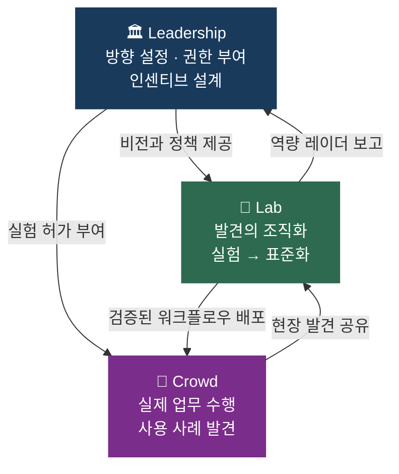
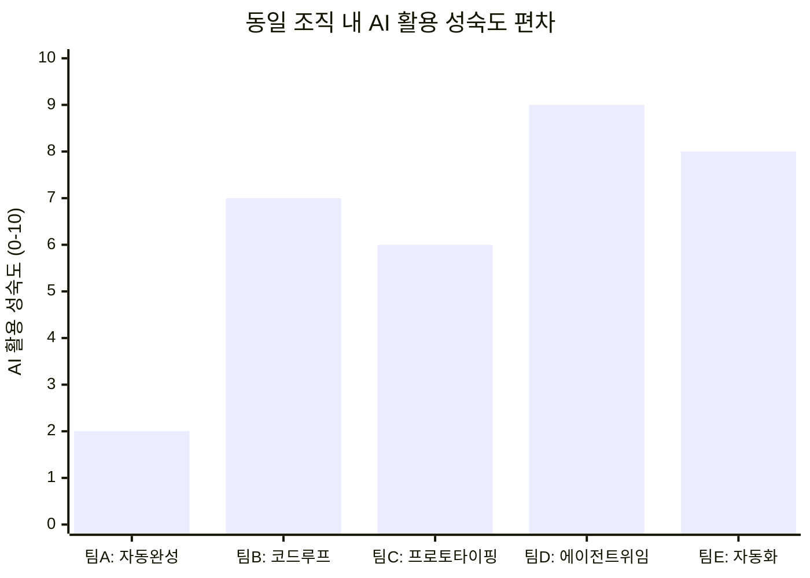
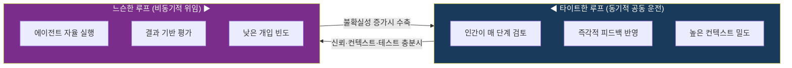
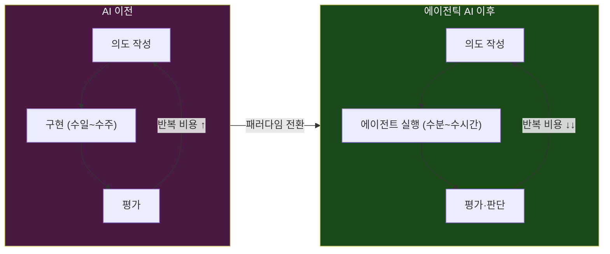
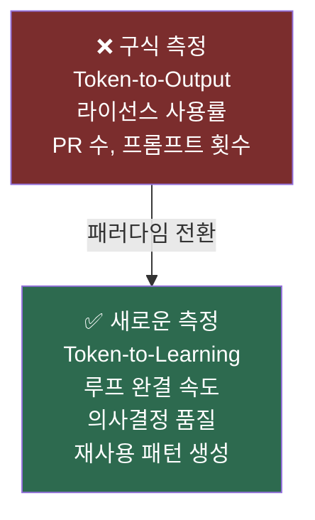
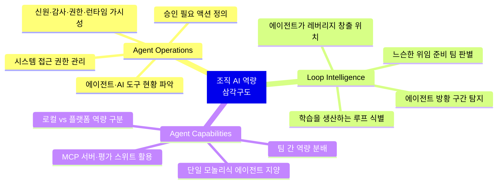
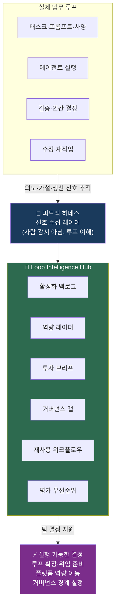
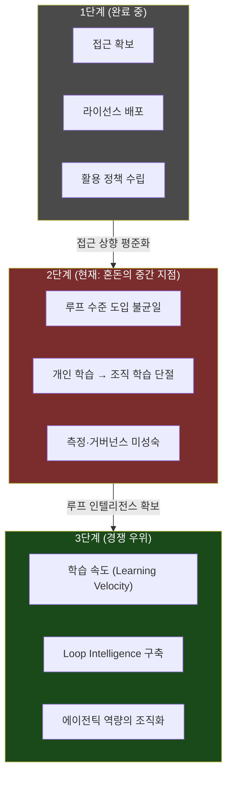

> **원문**: Robert Glaser, *"When everyone has AI and the company still learns nothing"*  
> **출처**: [robert-glaser.de](https://www.robert-glaser.de/when-everyone-has-ai-and-the-company-still-learns-nothing/) (2026년 5월 5일)  
> **저자 소개**: Robert Glaser는 독일 컨설팅 기업 INNOQ의 Head of Data & AI이자 에이전틱 엔지니어링 분야 실무 전문가로, 팟캐스트 *"AI und jetzt"* 를 진행하며 조직의 AI 전략 수립을 지원하고 있다.

---

## 들어가며: 질문의 전환

지금 이 순간, 수많은 기업의 임원들이 비슷한 회의실에 앉아 비슷한 질문을 던지고 있다. "우리가 Anthropic에 연간 200만 유로를 썼는데, ROI는 어디 있나?" 라이선스는 배포됐고, 사용 횟수는 집계됐고, 몇 가지 내부 PoC는 운영위원회 덱에 올라갔다. 어떤 회사에서는 AI 도입 사업이 IT 부서로 넘어가 조용히 죽었다. 그런데 이 모든 상황에서 정작 중요한 질문은 아무도 하지 않는다.

**"사람들이 AI를 사용하고 있는가?"가 아니라, "조직이 AI로부터 무언가를 배우고 있는가?"**

Robert Glaser의 이 에세이는 바로 이 질문으로부터 출발한다. 개인의 생산성 향상이 자동으로 조직의 역량 향상으로 이어지지 않는다는 관찰, 그리고 그 간극을 어떻게 메울 것인가에 대한 실천적 사고의 기록이다.

---

## 1부: Mollick의 프레임과 개인-조직 생산성의 단절

### 비밀 사이보그들의 등장

와튼스쿨 부교수이자 AI 연구자인 Ethan Mollick은 조직 내 AI 도입을 수년간 연구해온 인물이다. 그의 글 [*"Making AI Work: Leadership, Lab, and Crowd"*](https://www.oneusefulthing.org/p/making-ai-work-leadership-lab-and?ref=robert-glaser.de)(2025년 5월)는 지금 이 시점에서 가장 중요한 관찰을 담고 있다. 개인 수준의 AI 생산성 향상이 조직 수준의 성과로 자동 번역되지 않는다는 것이다.

덴마크의 지식 노동자 대상 연구에 따르면, AI 사용자들은 자신이 하는 업무의 41%에서 소요 시간이 절반으로 줄었다고 응답했다. 미국 조사에서는 90분짜리 업무가 30분으로 단축됐다는 보고도 있다. 2024년 12월 기준 미국 직장인의 약 30%가 업무에 AI를 사용했고, 2025년 4월에는 그 비율이 40%로 뛰었다. 그런데도 기업들이 보고하는 AI 성과는 여전히 "소폭 향상" 수준에 그치고 있다.

왜일까? Mollick은 그 이유로 "비밀 사이보그(secret cyborgs)" 현상을 지목한다. 직원의 절반 이상이 업무에 AI를 활용하지만, 그것을 조직에 공유하지 않는다. 이유는 세 가지 두려움이다. AI로 자신의 업무를 3시간 만에 처리할 수 있다고 보여주면 해고될 것이라는 두려움, 공유하면 새로운 기준선이 돼버릴 것이라는 두려움, 그리고 동료의 일자리가 위협받는다는 죄책감이다.

결과적으로 조직은 아이러니한 상황에 놓인다. 개인들은 분명히 더 잘하고 있지만, 그 노하우는 조직의 기억으로 편입되지 않는다. 개인의 혁신이 그림자 속에 숨어있는 동안, 회사는 여전히 라이선스 사용률만 보고 있다.

### Leadership-Lab-Crowd 프레임워크

Mollick이 제안하는 해결 프레임은 세 축으로 구성된다.

**Leadership**는 방향을 설정하고 허가를 부여한다. C레벨 리더가 AI 활용을 위한 인센티브를 설계하고 조직 전체의 실험을 독려하는 역할이다. **Crowd**는 실제 업무를 수행하는 모든 직원이다. 이들이 일상에서 발견하는 사용 사례가 혁신의 원재료다. **Lab**은 이 둘 사이의 결정적 다리다. 현장의 발견을 체계화하고, 검증하고, 재사용 가능한 워크플로우로 전환해 다시 조직 전체에 배포하는 기능을 담당한다.

Mollick의 진단은 명확하다. 세 축 중 하나라도 빠지면 실패한다. Leadership만 있고 Lab이 없으면 그냥 좋은 말뿐이다. Lab이 있어도 Crowd 없이는 고립된 사일로가 된다. Crowd가 있어도 Leadership 없이는 지하에 남는다.

---

## 2부: "혼돈의 중간 지점"이란 무엇인가

### 동일한 회사, 완전히 다른 현실

Glaser는 지금 많은 기업이 처한 상태를 "the messy middle(혼돈의 중간 지점)"이라고 부른다. AI 사용이 어디에나 있지만 균일하지 않고, 부분적으로 보이지 않으며, 비교하기 어렵고, 아직 조직 학습과 연결되지 않은 상태다.

같은 회사 안에서 동시에 다음과 같은 일이 벌어진다.

한 팀은 Copilot을 단순 자동완성 용도로만 쓰고 그걸로 충분하다고 생각한다. 다른 팀은 Claude Code를 테스트, 리뷰, 지속적인 조정과 함께 타이트한 루프로 운영한다. 어느 제품 담당자는 Figma에서 화면을 목업하는 대신 실제로 작동하는 소프트웨어를 직접 프로토타이핑한다. 한 시니어 엔지니어는 근본 원인 분석을 에이전트에 위임하고 1시간 만에 유효한 해결책을 얻는다 — AI 없이는 2주가 걸렸을 일이다. 반면 어느 주니어 개발자는 세련된 코드를 산출하지만 어떤 아키텍처 가정이 시스템에 슬쩍 끼어들었는지 전혀 모른다. 한 고객지원팀은 반복되는 티켓들을 자동화 워크플로우로 전환하고 있다 — 실제 고통이 어디에 있는지 그들이 가장 잘 알고, Center of Excellence는 한 번도 올바른 질문을 하지 않았기 때문이다.

이것이 혼돈의 중간 지점을 혼돈스럽게 만드는 이유다. **도입의 단위가 더 이상 조직도 아니고 팀도 아니다. 업무 안에 있는 루프(loop)다.**

### 기존 변화 관리 기계는 너무 느리다

대부분의 기업은 AI 도입을 이미 가지고 있는 기계에 통과시키려 한다. 실천 커뮤니티, 브라운백 세션, 챔피언 네트워크, 활성화 덱, 오피스 아워, 월별 데모, 설문조사, 대시보드. 이런 것들이 아예 무의미하진 않다. 특히 실험 자체에 허가가 필요한 조직에서는 도움이 된다.

하지만 진짜 AI 관련 작업은 다음 커뮤니티 회의를 기다리지 않는다. 그것은 코드 리뷰 안에서, 영업 제안서 안에서, 연구 과제 안에서, 제품 프로토타입 안에서, 프로덕션 장애 안에서 나타난다.

특히 주목할 만한 사례가 있다. 어떤 팀은 특정 유형의 제품 컴포넌트에 대해 "다크 팩토리(dark factory)"에 가까운 방식을 구축했다. 의도를 작성하고, 에이전트를 느슨한 루프로 실행하고, 적절한 역압(backpressure)을 가해 궤도에 유지하고, 강력한 시나리오로 결과를 평가하고, 의도를 다듬어 반복적으로 고품질 결과를 얻는다.

그러나 이 노하우가 모범 사례 슬라이드가 될 만큼 정제될 때쯤이면, 중요한 학습은 이미 그 가치를 잃어버린다. 진정으로 유용했던 것은 마찰(friction)이었기 때문이다 — 누락된 컨텍스트, 실패한 테스트, 이상한 API 동작, 에이전트가 헛소리로 방황하다가 누군가 되돌려야 했던 그 순간들.

---

## 3부: 탄성 루프(The Elastic Loop) — AI 협업의 스펙트럼

Glaser가 수개월에 걸쳐 발전시켜온 핵심 개념이 바로 "탄성 루프(elastic loop)"다. AI와의 협업은 단일한 모드가 아니다. 그것은 타이트하고 동기적인 공동 운전(co-driving)에서 느슨하고 비동기적인 위임(delegation)까지 스펙트럼을 이룬다.

이 프레임에서 AI 도입의 진짜 질문은 "사람들이 AI를 사용하고 있는가?"가 아니다. 팀이 어떤 루프 크기를 사용해야 하는지 알고 있는가, 어디서 저항이 필요한지 알고 있는가, 어떤 산출물이 루프에서 살아남아야 하는지 알고 있는가, 그리고 그 산출물이 어떻게 조직이 학습할 수 있는 무언가가 되는지 알고 있는가 — 이것이 진짜 질문이다.

도구 사용 횟수나 토큰 수를 세는 것보다 훨씬 어려운 질문이다.

---

## 4부: 스크럼은 비싼 반복을 위해 설계됐다

Glaser의 날카로운 통찰 중 하나는 현대 소프트웨어 프로세스에 대한 역사적 해석이다. 스프린트 계획, 추정, 스탠드업, 사용자 스토리, 티켓 정리, 핸드오프 — 이 모든 의식(ceremony)은 인간의 반복이 비쌌기 때문에 존재했다. 단 하나의 반복에 며칠에서 몇 주가 걸린다면, 너무 많은 반복을 낭비하지 않도록 구조가 필요하다.

하지만 에이전틱 엔지니어링이 경제학을 바꿔놓았다. AI는 의도(intent)에서 프로토타입, 평가까지의 이동을 훨씬 빠르게 만든다. 더 많은 옵션을 실체화 가능하게 한다. 구현에 있던 제약이 이제 의도, 검증, 판단, 피드백으로 이동한다.

역설적이게도, 많은 조직이 20년 동안 자신을 '애자일'하다고 불렀지만, 애자일이 제거하려 했던 조직적 반사 신경을 그대로 보존해왔다. 이제 AI가 진정한 애자일을 가능하게 만들었지만, 시스템은 여전히 2주 스프린트 약속, 핸드오프 문서, 반복이 희귀하다고 가정하는 모든 것을 요구한다.

**루프가 조직이 학습한 것을 소화하는 속도보다 더 빠르게 움직일 수 있다.** 이것이 의식의 공동묘지(ceremony graveyard)가 이제 도입 수준에서 나타나는 방식이다.

---

## 5부: 공짜 바는 영원히 열려있지 않다 — 측정의 패러다임 전환

### "렌트된 지능"의 경제학

AI 사용량은 점점 더 가시적으로 과금될 것이다. 지금처럼 "모두가 접근할 수 있으니 청구서 걱정은 나중에"라는 기업 문화는 지속되지 않는다. 모델 라우팅, 토큰 예산, 사용량 기반 가격 책정, 추론 비용, 어떤 태스크에 어떤 모델이 허용되는지에 관한 거버넌스 — 이 모든 것이 기업들이 단순한 AI 보조에서 본격적인 에이전틱 업무로 이동함에 따라 더욱 명시적이 될 것이다.

그러나 Glaser는 이것을 비용 공포 이야기로 만들지 않으려 한다. 소프트웨어 납품의 질문이 결코 키스트로크를 최소화하는 것이 아니었듯, 토큰 소비를 최소화하는 것도 핵심이 아니다.

청구서는 더 나은 질문을 강제할 것이다: **우리가 그 토큰들을 소비했기 때문에 무엇이 바뀌었는가?**

### 토큰-투-학습: 새로운 측정 철학

Glaser는 풀 리퀘스트 숫자를 세는 것을 그만두라고 간청한다. 대신 다음을 물어야 한다.

- 어떤 루프가 더 빠르게 닫혔는가?
- 어떤 결정이 개선되었는가?
- 어떤 근본 원인 분석이 더 날카로워졌는가?
- 어떤 리뷰가 더 많이 잡아냈는가?
- 어떤 팀이 재사용 가능한 패턴을 학습했는가?
- 어떤 제품 아이디어가 프로토타입이 약점을 명백히 드러냈기 때문에 더 일찍 폐기됐는가?

**Token-to-Output은 새로운 옷을 입은 구식 측정 반사 신경이다. Token-to-Learning이 진정 중요한 것에 더 가깝다.**

AI가 학습을 창출한 곳은 어디인가, 그리고 단지 더 많은 산출물만 만들어낸 곳은 어디인가? 이것이 핵심 질문이다.

---

## 6부: Loop Intelligence — 누락된 피드백 경로

### 세 가지 핵심 역량

Glaser는 "혼돈의 중간 지점"에서 기업들이 필요로 하게 될 세 가지 역량을 식별한다.

**Agent Operations(에이전트 운영)** 은 통제 측면이다. 어떤 에이전트와 AI 도구가 실행 중인지, 어떤 시스템에 접근할 수 있는지, 어떤 데이터를 볼 수 있는지, 어떤 액션이 승인을 필요로 하는지, 신원·감사·권한·런타임 가시성이 어디에 있는지를 다룬다. 에이전틱 작업이 결국 실제 시스템에 닿기 때문에 이것은 중요하다.

**Loop Intelligence(루프 인텔리전스)** 는 진단 측면이다. AI 보조 혹은 완전 에이전틱 루프 중 실제로 학습을 생산하는 것은 어느 것인가, 어느 것이 열린 채로 남아있는가, 어느 것이 쇠퇴하는가, 에이전트가 레버리지를 만드는 곳은 어디이고 엉뚱한 방향으로 방황하는 곳은 어디인가, 어떤 팀이 테스트나 컨텍스트나 직관 부족으로 타이트한 감독에 갇혀있는가, 어떤 팀이 더 느슨한 위임을 받을 준비가 됐는가.

**Agent Capabilities(에이전트 역량)** 는 배포 측면이다. 세 개의 모놀리식 에이전트로 모든 사람의 업무를 처리할 수 있다고 가정하지 않고, 유용한 역량이 어떻게 조직 전체에 분산되는가의 문제다. AI는 단일 애플리케이션 범주보다는 유동적인 기반 기술처럼 작동하기 시작하고 있다. "HR 에이전트", "엔지니어링 에이전트", "영업 에이전트" 같은 방식으로 깔끔하게 구분되지 않는다. 더 나은 질문은 역량이 실제 업무가 일어나는 곳으로 어떻게 흘러들어가느냐다 — 직원 하네스, 백그라운드 에이전트, 제품 팀, 플랫폼 서비스, 로컬 스킬, MCP 서버, 평가 스위트, 런북, 예시들, 도메인별 절차.

### 세 역량의 상호의존성

셋 중 하나라도 빠지면 이상해진다.

- Agent Operations만 있고 Loop Intelligence가 없으면 → 통제 관료주의
- Loop Intelligence만 있고 Agent Capabilities가 없으면 → 유용한 패턴을 발견하지만 그것을 업무에 다시 피드백할 방법이 없는 분석 레이어
- Agent Capabilities만 있고 Operations·Loop Intelligence가 없으면 → 더 나은 브랜딩을 가진 도구 난립

**통제 경로, 학습 경로, 역량 경로가 어딘가에서 만나야 한다.**

---

## 7부: 피드백 하네스와 Loop Intelligence Hub

### 개념의 탄생

Glaser는 그 "어딘가"를 내부적으로 "피드백 하네스(feedback harness)"라고 불러왔다. 하지만 그 용어가 고객에게 적합한지는 확신하지 못한다. 건축 다이어그램에서 나온 것처럼 들리기 때문이다. 고객들은 메커니즘이 우아하다는 이유로 하네스를 구매하지 않는다. 그들이 구매하는 것은 자신감, 더 나은 의사결정, 더 빠른 학습, 더 적은 낭비, 더 안전한 위임이다.

그래서 더 유용한 고객 대면 개념은 **Loop Intelligence Hub(루프 인텔리전스 허브)** 가 될 수 있다.

피드백 하네스는 실제 업무 루프를 청취한다 — 태스크, 프롬프트, 사양, 리뷰, 시나리오, 수락·거부된 가설, 생산 신호, 재작업, 인간의 결정과 개입. 사람들을 감시하는 것이 아니라 루프를 이해하기 위해서다.

첫 번째 버전이 거대한 플랫폼일 필요는 없다. 몇 가지 실제 워크플로우를 선택하고, 의도·에이전트 작업·검증·인간 결정이 이미 흔적을 남기는 지점들을 계측하고, 루프가 작동했거나 실패한 이유를 이해할 만큼 충분한 정성적 피드백을 수집하고, 그것을 반복적인 학습 산출물로 만들면 된다.

Loop Intelligence Hub는 그 신호를 조직이 행동할 수 있는 무언가로 바꾼다 — 활성화 백로그, 역량 레이더, 투자 브리프, 거버넌스 갭, 재사용 워크플로우, 훈련 필요, 평가 우선순위. 흥미로운 산출물은 대시보드가 아니다. 이어지는 결정이 흥미로운 것이다.

예를 들어 이런 결정들이다. "이 팀은 더 위임하기 전에 더 나은 역압(backpressure)이 필요하다(루프를 늘려라)", "이 제품 그룹은 특정 컴포넌트 유형에 대해 반복 가능한 다크 팩토리 패턴을 가지고 있다", "이 컴플라이언스 워크플로우는 거버넌스된 도구 경계가 필요하다", "이 스킬은 다섯 팀이 형편없이 재발명했기 때문에 플랫폼으로 이동해야 한다."

**하네스가 수집하고, 허브가 결정을 돕는다. 역량 레이어가 학습을 업무에 다시 피드백한다.**

---

## 8부: 직원 감시가 되어서는 안 된다

전체 구조는 직원 점수화로 변질되는 순간 죽는다.

사람들이 조직이 자신이 AI를 충분히 사용했는지 측정하고 있다고 믿으면, 신호를 게임하기 시작할 것이다. 모든 실험이 생산성 기대치가 된다고 믿으면, 실험을 숨길 것이다. 자신의 최선의 워크플로우가 단순히 새로운 기준선 업무가 될 것이라고 믿으면, 비공개로 유지할 것이다. 회사는 도입의 최악 버전을 얻게 된다 — 눈에 보이는 순응과 보이지 않는 학습.

이것이 진심 어린 의도(단지 프레이밍만이 아니라)가 중요한 이유다. 유용한 질문은 "누가 AI를 충분히 사용하는가?"가 될 수 없다. 그것은 "AI가 조직이 학습할 수 있는 방식으로 업무를 변화시킨 곳은 어디인가?"여야 한다.

> "어떤 루프가 더 건강해졌는가? 어떤 팀이 더 위임하기 전에 더 나은 역압이 필요한가? 프로토타입이 실제 소프트웨어가 되고 있기 때문에 어디서 제품 팀이 다른 환경이 필요한가?"

거버넌스는 정책을 쓸 수 있고, 아마 써야 한다. 하지만 학습처럼, 거버넌스도 사용을 통해서만 실제가 된다. 에이전트가 프로덕션 인접 업무에 닿고, 제품 담당자가 명세 대신 프로토타이핑을 하고, 개발자가 근본 원인 분석을 위임하고, 토큰 지출이 경영진이 답을 원할 만큼 충분히 커지면, 조직은 자신이 학습 시스템을 구축했는지 아니면 그냥 많은 좌석을 구입했는지를 발견하게 된다.

---

## 9부: 혼돈의 중간 지점은 살아남아야 할 국면이 아니다

### 다음 경쟁 우위: 학습 속도

AI 도입의 첫 번째 국면은 접근에 관한 것이었다. 누가 도구를 갖고, 누가 허가를 받고, 누가 계약을 협상하고, 프로큐어먼트 티켓 없이 누가 최신 모델을 시도할 수 있는가. 그 국면은 여전히 중요하지만, 오래 차별화 요소로 남지 않을 것이다. **프론티어 인텔리전스에 대한 접근은 렌트할 수 있다. 운영 통제와 조직 학습은 같은 방식으로 렌트할 수 없다.**

다음 우위는 **학습 속도(learning velocity)** 다.

누가 실제 패턴을 더 빨리 찾는가? 누가 개인에서 팀으로, 팀에서 조직 역량으로 발견을 이동시키는가? 누가 에이전트가 방황하지 못하도록 에이전틱 루프에 역압을 구축하는가? 누가 모두에게 맞지 않는 모놀리식 엔트프라이즈 에이전트로 만들지 않고 유용한 에이전트 역량을 분배하는가? 누가 마침내 에이전틱 엔지니어링을 사용해 기존 의식에 AI를 덧씌우는 대신 애자일을 진짜로 만드는가?

아무도 이것을 아직 완전히 파악하지 못했다. Glaser 자신도 마찬가지다. 탄성 루프를 수개월 동안 반복해왔고, 모든 고객 대화, 모든 내부 토론, 실제 업무에서 나온 모든 이상한 예시가 그것을 다시 재형성한다. 그것이 요점이다. 이 전환을 이해하는 길은 벤더나 컨설턴트나 AI 연구소의 확정적인 도입 플레이북을 기다리는 것이 아니다. 업무를 계측하고, 지저분한 학습을 공유하고, 다른 사람들이 구멍을 뚫게 두고, 공개적으로 반복하는 것이다.

---

## 종합: 이 글이 우리에게 묻는 것

Robert Glaser의 에세이는 표면적으로는 AI 도입 전략에 관한 글이다. 그러나 더 깊이 들어가면, 이것은 **조직 학습의 본질에 관한 질문**이다. AI는 더 빠른 루프를 가능하게 했다. 하지만 더 빠른 루프가 자동으로 더 많은 학습을 의미하지 않는다. 루프 안의 마찰이, 실패한 테스트가, 에이전트를 되돌려야 했던 그 순간들이 실제 학습의 원천이다.

그리고 그 원천을 체계적으로 포착해 조직의 기억으로 만드는 것, 감시가 아니라 이해를 위해 루프를 계측하는 것, 개인의 혁신이 그림자 속에 숨지 않도록 심리적 안전을 설계하는 것 — 이것이 다음 단계의 과제다.

결국 이 글의 핵심 명제는 단순하다.

> **접근(access)은 렌트할 수 있다. 학습(learning)은 렌트할 수 없다.**

---

*작성일: 2026년 5월 8일*
