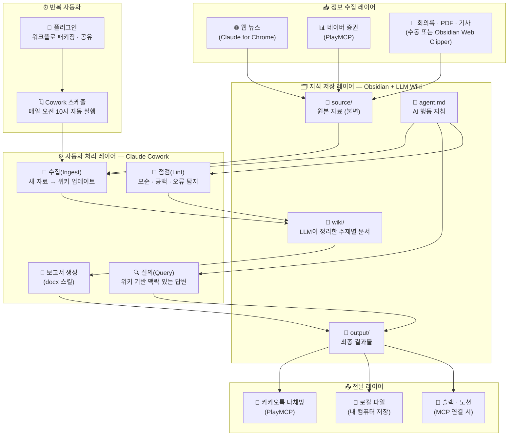
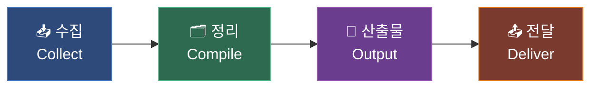

## 매일 아침 스스로 작동하는 AI 업무 시스템 만들기

> 작성 기준일: 2026년 5월 9일  
> 참고 출처: [소소한 AI 입문노트 소에노](https://www.youtube.com/watch?v=HFcVTALckhw) (2026.04.17), 칼퇴연구소직장인 (2026.05.07), [Brian's Brain Trinity](https://www.youtube.com/watch?v=mX58P9KHXek) (2026.04.12), [Andrej Karpathy LLM Wiki Gist](https://www.youtube.com/watch?v=UbxFpDuWt8Q) (2026.04), Anthropic 공식 문서

---

## 들어가며 — 왜 세 가지를 함께 봐야 하는가

AI 도구를 하나씩 따로 배우는 것과, 세 도구가 서로 어떻게 맞물려 작동하는지를 이해하는 것은 완전히 다른 차원의 이야기입니다.

이 문서에서 다루는 세 콘텐츠는 표면적으로는 각각 독립된 주제를 다루는 것처럼 보입니다. 첫 번째는 클로드 코워크(Claude Cowork)를 이용해 웹 데이터를 수집하고 보고서를 자동으로 만드는 법, 두 번째는 Obsidian과 LLM을 결합해 나만의 업무 위키를 구축하는 법, 세 번째는 Obsidian이 AI 시대에 왜 필수적인 도구가 됐는지에 관한 내용입니다.

그런데 이 세 콘텐츠를 하나의 흐름으로 이어 붙이면, 매우 강력한 업무 자동화 시스템의 설계도가 완성됩니다. Obsidian이 지식의 저장소 역할을 하고, LLM Wiki 방식이 그 저장소를 AI가 읽고 쓸 수 있는 살아 있는 위키로 만들어 주며, Claude Cowork가 외부 정보 수집부터 보고서 생성, 알림 발송까지의 자동화 실행 엔진 역할을 담당합니다.

이 세 축이 맞물리는 지점을 이해하면, 단순히 "AI에게 질문하는 사람"에서 "AI 시스템을 설계하는 사람"으로 전환할 수 있습니다.

---

## 1부 — 기초 개념: 왜 마크다운이고 왜 Obsidian인가

### 1.1 마크다운은 AI의 언어다

AI와 인간이 공통으로 읽고 쓸 수 있는 언어 형식이 있습니다. 바로 마크다운(Markdown)입니다. Claude, ChatGPT, Gemini 같은 현대의 LLM이 문서를 생성할 때 기본적으로 사용하는 형식이 마크다운이고, 반대로 마크다운으로 작성된 문서를 AI에게 입력하면 구조를 잘 파악하고 처리합니다.

예를 들어 Claude에게 "라면 끓이는 법을 알려줘"라고 요청하면 재료, 순서, 팁이 소제목과 목록으로 깔끔하게 구조화된 문서가 나옵니다. 그 결과물을 복사해 Obsidian에 붙여넣으면 그대로 아름답게 렌더링됩니다. AI가 생성한 것을 사람이 읽기 좋게 보여주고, 다시 AI가 읽기도 좋은 형식 — 이것이 마크다운의 핵심 강점입니다.

### 1.2 Obsidian이 AI 시대의 필수 도구가 된 이유

노션(Notion)이나 에버노트(Evernote) 같은 기존 노트 앱들도 마크다운을 지원합니다. 그러나 Obsidian이 특별한 이유는 다음 세 가지입니다.

**첫째, 완전한 로컬 저장입니다.** Obsidian의 모든 데이터는 내 컴퓨터의 실제 폴더에 `.md` 파일로 저장됩니다. 노션은 데이터가 서버에 있어서 클로드 코드나 Claude Cowork 같은 AI 에이전트가 직접 접근하기 어렵습니다. 반면 Obsidian 볼트(Vault)는 그냥 내 컴퓨터의 폴더이기 때문에, AI가 해당 폴더를 작업 폴더로 지정하면 파일을 읽고 쓰고 새로 만드는 것이 모두 자유롭습니다.

**둘째, 완전 무료에 용량 제한이 없습니다.** obsidian.md에서 다운로드하면 기본 기능을 무료로 사용할 수 있으며, 저장 용량은 내 컴퓨터 용량에만 제한됩니다.

**셋째, 2,700개 이상의 플러그인 생태계입니다.** 그림 그리기, 데이터베이스, 칸반 보드, 습관 관리, 웹 클리퍼 등 개인 개발자들이 만든 다양한 플러그인으로 기능을 무한히 확장할 수 있습니다.

**넷째, 그래프 뷰와 캔버스입니다.** 내 노트들이 서로 어떻게 연결되는지를 시각적으로 탐색하는 그래프 뷰, 노트들을 공간적으로 배치하는 캔버스 기능은 지식 구조를 한눈에 파악하게 해줍니다.

결론적으로 Obsidian은 "사람이 보기 좋은 정리함"이 아니라 "사람도 AI도 읽고 이해할 수 있는 지식 작업장"입니다.

---

## 2부 — LLM Wiki: AI가 관리하는 살아 있는 업무 위키

### 2.1 기존 노트 앱이 지식 무덤이 되는 이유

Andrej Karpathy는 OpenAI 공동창업자이자 Tesla AI 총괄을 역임한 AI 연구자입니다. 그가 2026년 4월 GitHub Gist에 공개한 "LLM Wiki" 개념은 AI 커뮤니티 전반에 빠르게 퍼졌습니다. 그는 자신이 직접 100편이 넘는 논문과 문서, 약 40만 단어 규모의 위키를 이 방식으로 관리하고 있다고 밝혔습니다.

그가 제시하는 문제 의식은 매우 현실적입니다. 우리가 노트 앱에 자료를 쌓아도 결국 "나중에 읽겠다"고 밀어둔 자료 창고가 될 뿐인 이유는 세 가지 비용 때문입니다.

- **입력 비용**: 자료를 일일이 정리해서 체계적으로 입력해야 한다
- **검색 비용**: 이전에 저장해 둔 내용이 필요할 때 찾기 어렵다
- **유지 비용**: 새 자료가 생길 때마다 기존 노트와 연결하고 업데이트하는 데 엄청난 노력이 든다

AI가 등장하면서 이 세 가지 비용 모두를 AI가 대신 처리하는 것이 가능해졌습니다. 단, 한 가지 조건이 있습니다. AI가 잘 읽을 수 있는 형식으로 지식이 저장되어 있어야 한다는 것입니다. 그래서 마크다운이, 그리고 Obsidian이 중요합니다.

### 2.2 LLM Wiki의 핵심 철학

Karpathy가 LLM Wiki의 본질을 한 문장으로 요약한 것이 있습니다.

> "Obsidian is the IDE; the LLM is the programmer; the wiki is the codebase."
>
> — Andrej Karpathy

Obsidian이 개발 환경(IDE)이고, LLM이 코드를 짜는 프로그래머이며, 위키가 그 결과로 만들어진 코드베이스라는 비유입니다. 사람의 역할은 무엇인가요? 좋은 원본 자료를 공급하고, 방향을 결정하고, AI가 정리한 결과를 검토하는 것입니다.

전통적인 PKM(개인 지식 관리) 시스템이 "사람이 연결을 만든다"는 가정 위에 구축되었다면, LLM Wiki는 그 반대입니다. AI가 연결을 만들고, 사람은 질문을 던집니다.

### 2.3 LLM Wiki의 폴더 구조

실제로 Obsidian 볼트 안에 네 개의 폴더를 구성하는 것이 기본 구조입니다.

```
vault/
├── source/       # 원본 자료 (절대 수정 금지 — 불변의 사실 기록)
├── wiki/         # LLM이 정리한 주제별 위키 문서
├── agent.md      # AI가 지켜야 할 규칙을 적어둔 파일
└── output/       # 보고서, 요약본, 임원 보고 문서 등 최종 결과물
```

여기서 가장 중요한 원칙이 하나 있습니다. **`source/` 폴더의 원본 자료는 절대 수정하지 않는다**는 것입니다. 원본이 변경되면 AI가 어떤 자료를 근거로 정리했는지 추적하기 어려워지기 때문입니다. AI는 `source/`를 읽고 그 내용을 `wiki/`에 정리된 형태로 씁니다.

`agent.md` 파일(또는 `CLAUDE.md`라고 부르기도 함)은 AI가 어떤 방식으로 정리해야 하는지, 출처는 어떻게 기록해야 하는지, 기존 문서를 업데이트하는 원칙은 무엇인지를 적어두는 AI 행동 지침서입니다. 이 파일이 있으면 AI는 매번 새로운 대화에서 맥락을 다시 설명받지 않아도 일관성 있는 결과물을 냅니다.

### 2.4 LLM Wiki의 세 가지 핵심 작업

LLM Wiki를 운용하는 핵심 작업은 세 가지로 요약됩니다.

**① 수집(Ingest)**: 새 원본 자료를 `source/`에 넣고 AI에게 위키를 업데이트하도록 요청합니다. AI는 자료를 읽고 관련된 기존 위키 문서를 수정하며, 새로운 개념이 등장하면 새 문서를 만들고 연결합니다.

**② 질의(Query)**: "경쟁사 비교 분석을 참고해서 우리 서비스의 차별화 포인트를 다섯 가지로 정리해줘" 같은 요청을 합니다. AI는 위키 전체를 참고해 맥락에 맞는 답을 내놓습니다.

**③ 점검(Lint)**: AI에게 위키 전체의 건강 상태를 확인하도록 요청합니다. 서로 모순되는 내용이 있는지, 출처가 불분명한 내용이 있는지, 빠진 연결 고리가 있는지를 탐지하고 수정합니다.

### 2.5 신규 프로젝트 기획 업무 적용 예시

구체적인 예를 들어 보겠습니다. 새로운 프로덕트를 기획하는 업무를 맡았다고 합시다.

`source/` 폴더에 아래와 같은 자료들을 넣습니다.
- 팀 회의록 3개
- 시장 조사 보고서
- 경쟁사 분석 PDF
- 고객 인터뷰 메모
- 산업 동향 기사

그리고 AI에게 이렇게 요청합니다.

> "source 폴더의 자료를 읽고 wiki 폴더에 프로젝트 개요, 문제 정의, 경쟁사 비교, 리스크 요인, 핵심 의사결정 항목을 각각 별도의 문서로 만들어줘."

이렇게 하면 `wiki/` 폴더에 잘 정리된 문서들이 생기고, 다음부터 AI에게 이런 요청이 가능해집니다.

> "wiki 폴더 내용을 참고해서 임원 보고용 한 페이지 요약을 만들어줘."

AI가 이미 맥락을 알고 있기 때문에, 매번 배경을 다시 설명할 필요가 없어집니다.

---

## 3부 — Claude Cowork: AI 에이전트가 실제로 일을 한다

### 3.1 Cowork란 무엇인가

Claude Cowork는 Anthropic이 2026년 1월 30일에 공개한 기능입니다. Claude Desktop 앱 내의 자율 실행 탭으로, 사용자가 지속적으로 입력하지 않아도 다단계 작업을 스스로 실행합니다. 공식 문서에 따르면 Cowork는 Claude Code의 에이전트 기능을 코딩 이외의 일반 지식 업무 영역으로 확장한 것으로, Pro, Max, Team, Enterprise 요금제에서 이용 가능합니다.

기존의 Claude와의 가장 큰 차이는 다음과 같습니다.

- **기존 Claude**: 질문을 하면 답변을 줌 (알려주는 AI)
- **Claude Cowork**: 목표를 설정하면 스스로 단계를 계획하고 실행하여 결과물을 만들어냄 (해주는 AI)

Cowork는 내 컴퓨터의 지정된 폴더를 작업 공간으로 삼고, 그 안의 파일을 읽고 쓰며, 웹 브라우저를 직접 조작하거나 외부 서비스에 연결해 작업을 완수합니다.

### 3.2 준비물과 기본 세팅

Cowork를 사용하려면 두 가지가 필요합니다.

1. **Claude Pro 이상 구독** (claude.ai/pricing 참고)
2. **Claude Desktop 앱 설치** (claude.com/download — 현재 웹 브라우저에서는 작동하지 않음)

데스크톱 앱을 설치하고 실행하면 왼쪽 사이드바에 채팅, 코워크, 코드 탭이 있습니다. 코워크를 클릭한 후 작업 폴더를 지정합니다. 바탕화면에 `Agent` 폴더를 만들고 그 안에 `Claude`라는 하위 폴더를 만들어 지정하는 방식이 권장됩니다. 폴더를 지정하면 Claude는 그 폴더 안의 파일을 읽고 쓸 수 있는 권한을 갖게 됩니다.

보안 측면에서 걱정할 필요는 없습니다. 컴퓨터의 여러 방 중에서 내가 허락한 방의 열쇠만 Claude에게 주는 구조이기 때문입니다.

### 3.3 핵심 기능 1 — Claude for Chrome (사람처럼 웹을 읽는 AI)

웹에서 정보를 가져오려면 보통 API 연결이 필요합니다. 그러나 Claude for Chrome은 다릅니다. 실제로 크롬 브라우저를 열어서, 사람이 보는 것처럼 페이지를 읽고 정보를 추출합니다. API가 없는 사이트에서도 정보를 수집할 수 있다는 뜻입니다.

설치 방법은 간단합니다.
1. Chrome 웹 스토어에서 "Claude" 확장 프로그램을 설치합니다.
2. Claude Desktop 앱 설정에서 "브라우저 사용" 토글을 활성화합니다.

이 기능이 활성화되면 Cowork에서 "한국경제 사이트에 접속해서 오늘의 증시 뉴스를 수집해줘"라고 하면, Claude가 실제로 브라우저를 열어 해당 사이트를 탐색하고 데이터를 가져옵니다.

### 3.4 핵심 기능 2 — MCP와 PlayMCP (외부 서비스 연결)

MCP(Model Context Protocol)는 Anthropic이 만든 AI-외부서비스 연결 표준 규격입니다. 과거에는 AI와 다른 서비스를 연결하는 방식이 제각각이었는데, MCP가 이를 통일했습니다. USB-C 타입이 충전 규격을 통일한 것에 비유할 수 있습니다. MCP라는 표준 규격으로 Claude와 다양한 서비스들이 연결됩니다.

국내 사용자에게 특히 유용한 것이 **PlayMCP**입니다. PlayMCP는 한국 서비스들을 Claude에 연결해주는 MCP 모음으로, 네이버 검색 MCP와 카카오톡 나채방 MCP가 포함되어 있습니다.

PlayMCP 연결 방법은 다음과 같습니다.
1. 크롬에서 PlayMCP 홈페이지에 접속해 카카오 로그인
2. 카카오톡 나채방 MCP와 네이버 검색 MCP를 도구함에 추가
3. Claude Desktop 앱 → 커스터마이즈 → 커넥터 → 플러스 버튼 → 커넥터 둘러보기 → "PlayMCP" 검색 후 연결

연결이 완료되면 Claude가 네이버에서 실시간 증권 데이터를 가져오거나, 분석 결과를 카카오톡 나와의 채팅으로 발송할 수 있게 됩니다.

### 3.5 핵심 기능 3 — 플러그인 (반복 워크플로를 한 번의 클릭으로)

매일 반복해야 하는 복잡한 워크플로를 일일이 텍스트로 입력하는 것은 비효율적입니다. Cowork의 플러그인 기능은 스킬, 커넥터 설정, 명령어, 서브 에이전트까지 전부 하나의 패키지로 묶어줍니다.

예를 들어 Claude에게 "지금까지 한 작업을 플러그인으로 패키징해줘. 네이버 MCP 작업과 Chrome 작업은 서브 에이전트로 놓고 병렬 작업식으로 패키징해줘"라고 하면, Claude가 알아서 플러그인을 만들어 줍니다.

이후 플러그인 이름을 선택하거나 `/generate-report` 같은 슬래시 명령어 한 줄로 복잡한 워크플로 전체가 실행됩니다.

플러그인 파일(`.plugin` 형식)은 공유도 가능합니다. 파일을 지인에게 보내고, 지인의 Claude Desktop에서 플러그인 업로드를 통해 설치하면 동일한 워크플로를 사용할 수 있습니다. (단, 지인도 동일한 MCP 연결을 먼저 완료해야 합니다.)

### 3.6 핵심 기능 4 — 스케줄 (매일 정해진 시간에 자동 실행)

Cowork의 스케줄 기능을 사용하면, 설정한 플러그인이 매일 특정 시간에 자동으로 실행됩니다.

설정 방법은 다음과 같습니다.
1. 왼쪽 사이드바 → 스케줄 → 새 태스크
2. 이름 및 설명 입력
3. 프롬프트에 `/generate-report 실행해줘` 입력
4. 빈도: 매일 오전 10시 설정
5. 모델: Sonnet 4.6 선택, 폴더 지정 후 저장

이렇게 설정하면 매일 아침 지정된 시간에 Claude가 자동으로 웹 데이터를 수집하고, 보고서를 작성하며, 카카오톡으로 요약을 발송합니다. 단, 컴퓨터와 Claude Desktop 앱이 켜져 있어야 실행됩니다.

### 3.7 보너스 — 디스패치 (모바일로 PC를 원격 조종)

Dispatch는 핸드폰 Claude 앱에서 PC의 Claude Desktop에 명령을 내려 원격으로 작업을 실행하는 기능입니다. 외출 중에도 스마트폰을 리모컨처럼 사용해 PC의 Cowork를 구동할 수 있는 개념입니다. 다만 2026년 4월 기준으로 안정화 중이며, 명령 전달에 간헐적 오류가 발생하는 것으로 알려져 있습니다.

---

## 4부 — 세 가지를 연결하면: 통합 시스템 설계도

이제 세 개의 퍼즐 조각을 맞춥니다.



### 4.1 수집 레이어: 정보가 들어오는 통로

Claude for Chrome이 웹 사이트를 실제로 탐색해 뉴스와 데이터를 가져오고, PlayMCP를 통해 네이버 증권 등 한국 서비스의 실시간 데이터를 수집합니다. 한편 회의록, PDF, 기사처럼 직접 만들어지거나 수동으로 저장된 자료는 Obsidian Web Clipper(크롬 확장 프로그램)로 클릭 한 번에 마크다운 파일로 변환되어 볼트에 저장됩니다.

이 모든 자료는 Obsidian 볼트의 `source/` 폴더로 흘러 들어갑니다.

### 4.2 지식 저장 레이어: Obsidian + LLM Wiki

수집된 원본 자료들이 `source/`에 쌓이면, Claude(또는 Claude Cowork)가 `agent.md`의 지침을 따라 `wiki/`를 업데이트합니다. 같은 주제가 여러 자료에 등장하면 하나의 위키 문서로 통합되고, 서로 연결된 개념들은 위키링크(`[[개념명]]`)로 연결됩니다.

이 과정이 반복될수록 지식 기반은 두꺼워지고, Claude가 다음 질문에 답할 때는 이미 정제된 맥락 위에서 작업하기 때문에 답변의 품질이 계속 향상됩니다. 이것이 Karpathy가 말한 "지식이 복리로 쌓인다(knowledge compounds)"는 의미입니다.

### 4.3 자동화 처리 레이어: Claude Cowork의 역할

Claude Cowork는 이 시스템에서 실행 엔진입니다. 스케줄 기능으로 매일 정해진 시간에 작동하고, 플러그인으로 복잡한 워크플로를 한 줄 명령으로 실행합니다. 서브 에이전트를 병렬로 동작시켜 Chrome 수집과 네이버 MCP 수집을 동시에 처리하고, 두 결과를 합쳐 docx 보고서를 생성합니다.

### 4.4 전달 레이어: 결과물이 사람에게 닿는 방식

생성된 보고서는 내 컴퓨터 폴더에 저장되는 동시에, PlayMCP를 통해 요약본이 카카오톡 나채방으로 발송됩니다. 슬랙이나 노션 MCP를 추가로 연결하면 팀원과의 공유도 자동화할 수 있습니다.

### 4.5 반복 자동화: 플러그인과 스케줄

이 전체 흐름을 플러그인으로 패키징하고 스케줄에 등록해두면, 이후로는 사람이 개입하지 않아도 됩니다. 아침에 컴퓨터를 켜놓기만 하면, 매일 정해진 시간에 수집 → 정리 → 보고서 생성 → 카카오톡 발송이 자동으로 이뤄집니다.

---

## 5부 — 구체적 구축 시나리오: 증시 브리핑 자동화

이론을 구체적인 예시로 풀어봅니다. 매일 아침 한국 및 미국 증시 브리핑 보고서를 자동으로 받고 싶은 경우를 상정합니다.

### 5.1 사전 준비

1. Claude Desktop 앱 설치 (claude.com/download)
2. Claude Pro 이상 구독 확인
3. Chrome 확장 프로그램: Claude for Chrome 설치 및 활성화
4. PlayMCP 가입 후 카카오 로그인 → 카카오톡 나채방 MCP + 네이버 검색 MCP 추가
5. Claude Desktop → 커스터마이즈 → 커넥터 → PlayMCP 연결
6. 바탕화면에 `Agent/Claude` 폴더 생성 후 Cowork 작업 폴더로 지정
7. 같은 `Agent/Claude` 폴더를 Obsidian 볼트로도 설정 (또는 별도 볼트를 지정 폴더 내 하위 경로로 생성)

### 5.2 LLM Wiki 초기 구조 세팅

`Agent/Claude` 폴더 안에 다음 구조를 만듭니다.

```
Agent/Claude/
├── source/           # 수집된 원본 뉴스 · 보고서
├── wiki/             # LLM이 정리한 종목별 · 이슈별 위키
├── output/           # 최종 docx 보고서
└── agent.md          # Claude에게 주는 행동 지침
```

`agent.md` 파일에는 예를 들어 다음과 같은 내용을 적습니다.

```markdown
# 증시 분석 에이전트 지침

## 역할
나는 매일 한국 및 미국 증시 데이터를 수집해 분석 보고서를 작성하는 에이전트입니다.

## 규칙
1. source/ 폴더의 파일은 절대 수정하지 않는다.
2. 새 자료가 들어오면 wiki/의 관련 문서를 업데이트하고 연결한다.
3. 보고서는 항상 output/ 폴더에 docx 형식으로 저장한다.
4. 요약본은 200자 이내로 작성해 카카오톡 나채방으로 발송한다.

## 위키 구조
- wiki/종목/ : 주요 종목별 동향 문서
- wiki/거시경제/ : 금리, 환율, 원자재 등 거시 지표 문서
- wiki/이슈/ : 주요 뉴스 이슈별 문서
```

### 5.3 플러그인 생성

Cowork에서 이렇게 입력합니다.

> "지금까지 한 작업을 플러그인으로 패키징해줘. 한국경제 Chrome 수집과 네이버 MCP 수집은 서브 에이전트로 병렬 처리하고, 결과를 합쳐 docx 보고서를 만들고 카카오톡으로 발송하는 흐름으로 패키징해줘."

Claude가 플러그인을 생성하면 '플러그인 설치' → '플러그인 저장'을 클릭합니다.

### 5.4 스케줄 등록

1. 왼쪽 사이드바 → 스케줄 → 새 태스크
2. 이름: `증시 일일 브리핑`
3. 프롬프트: `/generate-report 실행해줘`
4. 빈도: 매일 오전 9시 30분 (개장 전)
5. 모델: claude-sonnet-4-6, 폴더: `Agent/Claude/output`
6. 저장

이제 컴퓨터가 켜져 있는 한, 매일 오전 9시 30분이 되면 Claude가 알아서 브라우저를 열고 한국경제를 탐색하고, 네이버 증권 데이터를 가져오고, wiki를 업데이트하고, docx 보고서를 저장하고, 카카오톡으로 요약을 발송합니다.

---

## 6부 — 확장 가능한 패턴: 이 구조를 다른 업무에 적용하기

이 시스템의 구조는 수집 → 정리 → 산출물 → 전달의 네 단계입니다. 한 번 이 패턴을 이해하면 어떤 반복 업무에도 적용할 수 있습니다.



몇 가지 예시를 살펴보겠습니다.

**경쟁사 모니터링 시스템**: Chrome으로 경쟁사 블로그와 보도자료를 수집하고, LLM Wiki의 `wiki/경쟁사/` 폴더에 자동 정리하며, 주요 변화가 감지되면 슬랙으로 팀에게 알립니다.

**고객 리뷰 분석 시스템**: 앱스토어나 포털의 리뷰를 정기적으로 수집하고, 감성 분석 결과를 Obsidian 위키에 축적하며, 주간 트렌드 보고서를 노션에 자동으로 업로드합니다.

**채용 트렌드 분석**: 사람인 MCP(PlayMCP에서 제공)로 특정 직군 채용 공고 데이터를 수집하고, LLM이 요구 역량의 변화를 위키로 정리하며, 월간 인사이트 보고서를 PDF로 생성합니다.

**개인 학습 아카이브**: Obsidian Web Clipper로 저장한 기사, 유튜브 자막, PDF가 `source/`에 쌓이면, LLM이 `wiki/`에 주제별로 정리하고 관련 개념을 연결합니다. 지식이 쌓일수록 Claude에게 복잡한 질문을 해도 내 맥락에 맞는 깊이 있는 답을 받을 수 있습니다.

---

## 7부 — 사람과 AI의 역할 분담

이 시스템에서 사람과 AI의 역할은 명확하게 구분됩니다.

| 역할 | 사람 (Human) | AI (Claude + LLM) |
|------|-------------|-------------------|
| **담당 업무** | 방향 결정, 자료 큐레이션, 결과 검토, 중요 판단 | 반복 수집, 정리, 분류, 연결, 문서 생성, 발송 |
| **강점** | 맥락 이해, 가치 판단, 창의적 사고 | 일관성, 속도, 대량 처리, 패턴 인식 |
| **Obsidian에서** | 질문하고, 결과를 읽고, 방향을 수정함 | 위키를 쓰고, 업데이트하고, 연결함 |

Karpathy가 강조했듯이, 앞으로 AI를 잘 쓰는 사람은 단순히 좋은 질문을 하는 사람이 아닙니다. **AI가 계속 참고하고 업데이트할 수 있는 자신만의 지식 시스템을 가진 사람**입니다. Obsidian과 LLM Wiki는 그 지식 시스템의 토대가 되고, Claude Cowork는 그 시스템을 자동으로 운영하는 실행 엔진이 됩니다.

---

## 8부 — 주의사항 및 현실적 고려점

### 8.1 Cowork 사용 시 주의사항

- 스케줄 자동화는 **컴퓨터와 Claude Desktop 앱이 반드시 켜져 있어야** 합니다. 따라서 본인의 생활 패턴에서 컴퓨터가 켜져 있는 시간으로 스케줄을 맞추는 것이 중요합니다.
- Cowork의 네트워크 접근은 설정된 정책에 따라 달라집니다. 팀/엔터프라이즈 요금제에서는 관리자가 웹 검색 권한을 제한할 수 있습니다.
- Cowork가 접근하는 폴더는 신중하게 지정해야 합니다. 민감한 개인 파일이 있는 폴더를 작업 폴더로 지정하지 않도록 주의합니다.

### 8.2 LLM Wiki 운영 시 주의사항

- `source/` 폴더의 원본 파일은 절대 수정하지 않는 원칙을 반드시 지킵니다. 이 원칙이 깨지면 AI가 어느 자료를 근거로 정리했는지 추적하기 어려워집니다.
- LLM Wiki는 처음부터 많은 자료를 넣을 필요가 없습니다. 회의록 3개, 보고서 2개 정도로 시작해서 점점 늘려가는 방식이 현실적입니다.
- `agent.md` 파일의 품질이 AI 출력물의 일관성을 결정합니다. 처음에는 간단하게 작성하고, 결과물을 보면서 점점 정교하게 다듬어 가는 것을 권장합니다.

### 8.3 Dispatch 기능 현황

Dispatch(모바일 원격 제어) 기능은 2026년 4월 기준으로 안정화가 진행 중이며, 명령이 PC로 전달되지 않는 오류가 간헐적으로 발생하는 것으로 알려져 있습니다. 안정화 이후 업데이트된 사용법을 확인하는 것을 권장합니다.

---

## 정리 — 세 가지 콘텐츠가 전달하는 하나의 메시지

Brian's Brain Trinity의 Obsidian 마스터 시리즈는 **왜 마크다운 기반의 로컬 노트 앱이 AI 시대의 필수 도구인지**를 설명합니다.

칼퇴연구소직장인의 LLM Wiki 영상은 **Obsidian을 단순한 메모 앱이 아니라 AI가 관리하는 살아 있는 지식 위키의 기반으로 쓰는 방법**을 보여줍니다.

소에노의 Claude Cowork 영상은 **그 지식 시스템을 실제로 자동으로 돌리는 실행 엔진을 코딩 없이 만드는 방법**을 시연합니다.

세 가지를 하나로 연결하면 이렇게 됩니다.

> **Obsidian(저장소) + LLM Wiki(지식 구조화) + Claude Cowork(자동 실행) = 매일 스스로 작동하는 개인 AI 업무 시스템**

도구 하나를 잘 쓰는 단계를 넘어, 도구들을 연결해서 시스템을 설계하는 단계로의 전환. 이것이 세 콘텐츠가 공통으로 가리키는 방향입니다.

---

## 참고 링크

- Claude Cowork 공식 문서: https://support.claude.com/ko/articles/13345190
- Obsidian 다운로드: https://obsidian.md
- Obsidian Web Clipper: https://obsidian.md/clipper
- Andrej Karpathy LLM Wiki Gist: https://gist.github.com/karpathy/442a6bf555914893e9891c11519de94f
- PlayMCP 홈페이지: PlayMCP 검색 후 카카오 로그인
- Claude Desktop 다운로드: https://claude.com/download
- 소에노 영상 플러그인 파일: https://drive.google.com/file/d/1XlUkAOOC8jptFPhaEPKKAtV0IFEWMBp7/view
