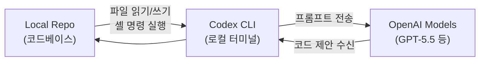
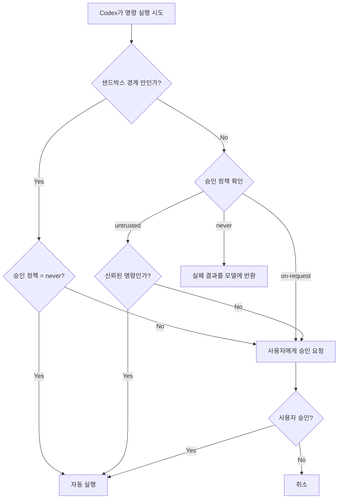
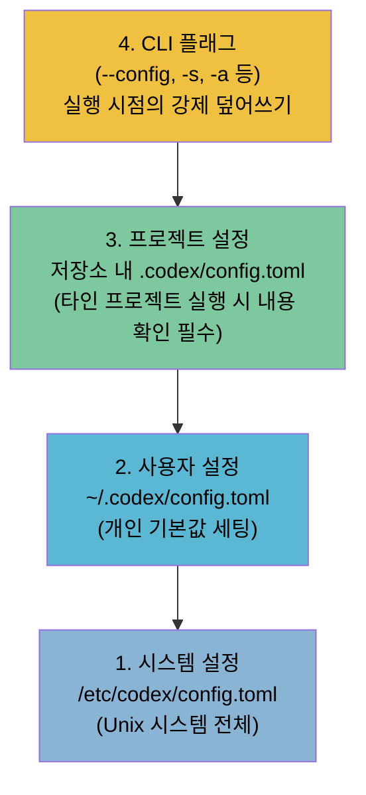
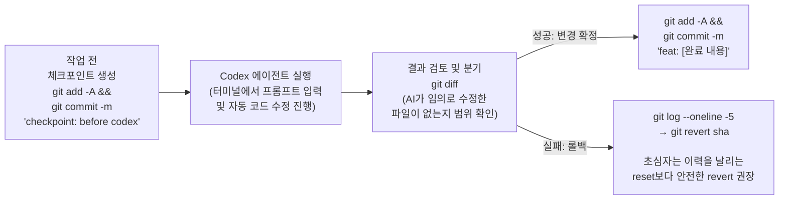
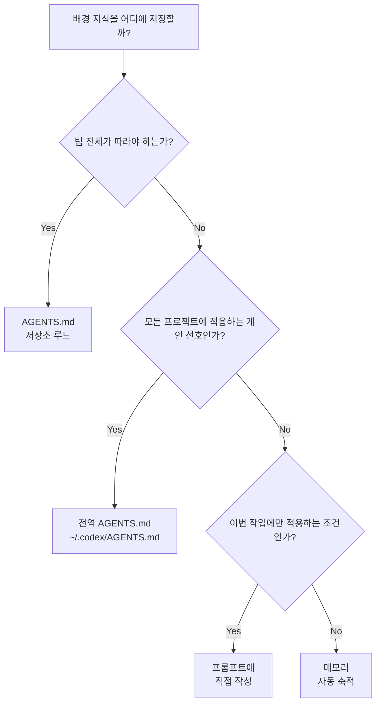
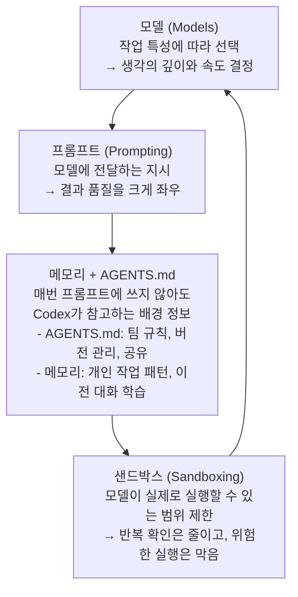

## 설치부터 핵심 개념까지 — Prompting, Memories, Sandboxing, Models

## 관련문서

[Codex CLI 입문(1) : OpenAI Codex CLI 빠른 시작 - codex 설치, 인증 하기](https://goddaehee.tistory.com/596)

[Codex CLI 입문(2) : OpenAI Codex 핵심 개념 4가지 - Prompting, Memories, Sandboxing, Models](https://goddaehee.tistory.com/597?category=838923)

---

## 들어가며

2026년 현재, OpenAI의 Codex CLI는 단순한 "터미널용 코드 보조 도구"를 훨씬 넘어선 위치에 있다. 초기 CLI 도구로 출발한 Codex는 지속적인 업데이트를 거쳐 목표(Goals) 관리, 브라우저 조작, 클라우드 실행 환경, MCP(Model Context Protocol) 연동, 서브에이전트 병렬 처리까지 갖춘 에이전트 워크스페이스로 진화하고 있다. 4월·5월 연속 업데이트에서 GPT-5.5가 권장 모델로 자리 잡았고, 자동 승인 검토(Automatic Approval Review), 퍼미션 프로필, 플러그인 마켓플레이스 등이 추가됐다.

이 문서는 Codex CLI를 처음 접하는 사람이 "설치 → 인증 → 첫 실행 → 권한 설정 → 메모리·컨텍스트 관리 → 모델 선택"이라는 흐름을 막힘 없이 따라갈 수 있도록 구성했다. 동시에, 이미 쓰고 있는 사람이라면 프롬프트 설계, AGENTS.md 운용, 샌드박스 튜닝, 모델별 reasoning effort 선택 같은 실전 판단 기준을 체계적으로 정리할 수 있다.

> **버전 기준**: 이 문서는 2026년 5월 OpenAI 공식 문서 및 Codex CLI changelog를 기반으로 작성되었다. Codex CLI는 지속적으로 업데이트되므로 최신 변경사항은 [공식 changelog](https://developers.openai.com/codex/changelog)에서 확인한다.

---

## 목차

1. [Codex CLI란 무엇인가](#1-codex-cli란-무엇인가)
2. [설치하기](#2-설치하기)
3. [인증하기](#3-인증하기)
4. [처음 실행해보기](#4-처음-실행해보기)
5. [샌드박스와 승인 정책 이해하기](#5-샌드박스와-승인-정책-이해하기)
6. [안전하게 쓰기 — Git Checkpoint 패턴](#6-안전하게-쓰기--git-checkpoint-패턴)
7. [프롬프트(Prompting) — 좋은 지시의 4원칙](#7-프롬프트prompting--좋은-지시의-4원칙)
8. [메모리(Memories) — AGENTS.md와 로컬 메모리](#8-메모리memories--agentsmd와-로컬-메모리)
9. [샌드박스(Sandboxing) 심화 — 판단 기준과 조합 가이드](#9-샌드박스sandboxing-심화--판단-기준과-조합-가이드)
10. [모델(Models) — 어떤 모델을 언제 쓸까](#10-모델models--어떤-모델을-언제-쓸까)
11. [4개 개념의 연결 구조](#11-4개-개념의-연결-구조)
12. [실전 프롬프트 패턴 모음](#12-실전-프롬프트-패턴-모음)
13. [2026년 5월 기준 주요 변경사항](#13-2026년-5월-기준-주요-변경사항)

---

## 1. Codex CLI란 무엇인가

Codex CLI는 OpenAI가 만든 터미널용 로컬 코딩 에이전트다. 마우스 없이 터미널 명령어만으로 작동하며, 코드를 읽고 수정하고 셸 명령을 직접 실행할 수 있다. GitHub 저장소에 오픈소스로 공개되어 있으며, Rust로 구현되어 빠르고 안정적인 네이티브 실행 환경을 제공한다. macOS, Windows(PowerShell 또는 WSL2), Linux를 모두 지원한다.

단순한 코드 자동완성 도구와 결정적으로 다른 점은 **에이전트(Agent)** 라는 것이다. Codex CLI는 프롬프트를 받으면 모델을 호출하고, 파일을 읽거나 수정하고, 셸 명령을 실행하는 루프를 반복한다. 작업이 끝났다고 판단하거나 사용자가 중단할 때까지 이 사이클이 자동으로 이어진다.



2026년 4~5월 업데이트를 거치며 Codex CLI는 단순 CLI를 넘어 다음을 지원하게 됐다.

- **Persistent Goals**: 여러 세션에 걸쳐 목표를 유지하고 스케줄 기반으로 재개
- **Browser Use**: Codex App 내에서 브라우저를 조작해 로컬 개발 서버 검증
- **Automatic Approval Review**: 위험도가 있는 명령을 실행 전 별도 검토 에이전트가 자동 평가
- **Plugin Marketplace**: Git 저장소나 로컬 소스에서 플러그인을 설치해 Codex 기능 확장
- **Subagents**: 복잡한 작업을 역할별로 쪼개 병렬 처리

---

## 2. 설치하기

### 2.1 npm으로 설치 (가장 보편적)

Node.js가 설치된 환경이라면 가장 단순한 방법이다.

```bash
npm install -g @openai/codex
```

업데이트할 때는 `@latest`를 붙인다.

```bash
npm install -g @openai/codex@latest
```

또는 CLI의 내장 자가 업데이트 기능을 쓸 수 있다.

```bash
codex update
```

### 2.2 Homebrew로 설치 (macOS)

```bash
brew install codex
```

> **주의**: 공식 quickstart와 GitHub README 사이에 명령어 표기 차이가 있을 수 있다(`brew install codex` vs `brew install --cask codex`). 설치 직전 최신 공식 문서를 확인하는 것이 안전하다.

### 2.3 바이너리 직접 다운로드

npm이나 Homebrew를 쓰기 어려운 환경이라면, GitHub Releases에서 플랫폼별 바이너리를 직접 내려받을 수 있다. macOS(Apple Silicon/x86_64), Linux(x86_64/arm64) 옵션을 제공한다.

### 2.4 IDE 확장으로 시작하기

터미널이 낯설다면 에디터 안에서 Codex를 먼저 써볼 수 있다. 공식 지원 IDE는 다음과 같다.

- VS Code / VS Code Insiders
- Cursor
- Windsurf (VS Code 계열)
- JetBrains IDE 계열

IDE 확장을 쓰면 열린 파일 목록과 선택한 코드가 자동으로 컨텍스트에 포함되어, 터미널에서 파일 경로를 길게 적는 수고 없이 바로 요청을 던질 수 있다. 단, CI/CD 자동화나 서버 원격 작업까지 다루려면 CLI 흐름도 함께 익혀두는 것이 좋다.

---

## 3. 인증하기

설치 후 터미널에서 `codex`를 입력하면 첫 실행 시 인증 화면이 나타난다. 인증 방식은 크게 두 가지다.

### 3.1 ChatGPT 계정으로 로그인

ChatGPT Plus, Pro, Business, Edu, Enterprise 플랜에 Codex가 포함된다. 플랜별 사용량, 지원 모델, 클라우드 기능 범위는 다르다.

```bash
codex   # 실행 후 화면 안내에 따라 브라우저에서 인증
```

브라우저 창이 열리면 ChatGPT 계정으로 로그인하고 인증을 완료한 뒤, 터미널로 돌아와 Enter를 누른다.

### 3.2 OpenAI API 키로 로그인

CI/CD 파이프라인이나 자동화 스크립트처럼 사람이 직접 개입하지 않는 흐름에 적합하다.

```bash
printenv OPENAI_API_KEY | codex login --with-api-key
```

> **제한**: API 키 방식은 CLI·SDK·IDE 확장에 사용할 수 있지만, GitHub 코드 리뷰나 Slack 같은 클라우드 기반 기능은 지원되지 않는다. 브라우저를 열 수 없는 서버·원격 환경이라면 `codex login --device-auth`를 쓴다.

### 3.3 인증 방식 선택 기준

| 상황 | 권장 방식 |
|---|---|
| 개인 개발, 대화형 작업 | ChatGPT 계정 로그인 |
| CI/CD, 자동화 스크립트 | API 키 인증 |
| 조직 워크스페이스 권한·데이터 정책 | ChatGPT 계정 (조직 설정 범위 확인 필요) |
| 브라우저 없는 서버/원격 환경 | `codex login --device-auth` |

### 3.4 로그인 상태 확인과 로그아웃

```bash
codex login status   # 현재 인증 상태 확인
codex logout         # 로그아웃
```

보안 주의: 자격증명은 기본적으로 `~/.codex/auth.json`에 저장된다. 이 파일은 비밀번호처럼 다뤄야 하며, Git에 커밋하거나 채팅창에 붙여 넣으면 안 된다. `config.toml`에서 `file`, `keyring`, `auto` 중 저장 방식을 선택할 수 있다.

---

## 4. 처음 실행해보기

인증까지 완료했다면 작업할 프로젝트 폴더로 이동한 뒤 `codex`를 입력한다. 터미널 UI(TUI)가 열리면 평소 말하듯 작업을 입력하면 된다.

### 4.1 핵심 명령어 4가지 패턴

**1. 분석 (Analyze)**: 코드 구조와 의존성 파악

```
Tell me about this project
```

Codex가 현재 폴더의 코드를 읽고 프레임워크, 언어, 구조를 요약해준다.

**2. 구현 (Build)**: 새 기능 또는 파일 생성

```
Build a classic Snake game in this repo
```

새 파일을 만들고 기존 파일을 수정하는 작업까지 수행한다.

**3. 수정 (Fix)**: 버그 탐색 및 수정

```
Find and fix bugs in my codebase with minimal, high-confidence changes
```

"minimal, high-confidence changes"라는 제약 조건을 함께 적으면 Codex가 의도하지 않은 범위까지 파일을 바꾸는 것을 막을 수 있다.

**4. 추가 (Add)**: 기존 코드에 기능 덧붙이기

```
Add a new command-line option --json that outputs JSON.
```

원하는 인터페이스를 구체적으로 명시할수록 Codex가 수정해야 할 파일과 로직을 더 잘 좁힌다.

### 4.2 좋은 첫 프롬프트의 4요소

공식 best practices에서는 프롬프트에 **목표(Goal), 맥락(Context), 제약(Constraints), 완료 기준(Done when)** 을 함께 담으라고 권장한다.

```
Goal: 로그인 오류를 고쳐줘.
Context: 에러 메시지는 "Invalid token"이고, 관련 파일은 src/auth.ts야.
Constraints: API 응답 형식은 바꾸지 말아줘.
Done when: 기존 테스트를 통과하고, 로그인 실패 케이스 테스트를 하나 추가해줘.
```

처음부터 길게 쓸 필요는 없지만, 이 네 가지를 챙기면 Codex가 추측으로 범위를 넓힐 일이 크게 줄어든다.

---

## 5. 샌드박스와 승인 정책 이해하기

Codex CLI는 파일을 편집하고 셸 명령도 실행할 수 있다. 이 강력함을 안전하게 쓰려면 두 가지 개념을 명확히 구분해야 한다.

- **샌드박스(sandbox)**: Codex가 넘으면 안 되는 기술적 경계. 어떤 파일과 네트워크까지 접근할 수 있는지를 정한다.
- **승인 정책(approval policy)**: 그 경계를 넘거나 특정 명령을 실행하려 할 때 사용자에게 먼저 물어볼지 정하는 규칙.

샌드박스가 "울타리"라면 승인 정책은 "문을 열기 전 노크할지"를 정하는 것이다. `--yolo`는 이 두 장치를 동시에 우회하는 별도의 고위험 옵션이다.



### 5.1 샌드박스 3단계

| 모드 | CLI 플래그 값 | 언제 쓰나 |
|---|---|---|
| read-only | `--sandbox read-only` | 낯선 저장소를 처음 분석할 때. 파일을 읽는 데 집중하고, 수정이나 명령 실행은 막아두고 싶을 때 |
| workspace-write | `--sandbox workspace-write` | 일반적인 로컬 개발 기본값. 현재 작업 폴더 안의 파일 읽기/수정은 허용, 바깥 폴더 수정이나 네트워크 접근은 기본 제한 |
| danger-full-access | `--sandbox danger-full-access` | 샌드박스 경계를 제거해야 하는 특수 상황. 입문 단계 비권장 |

처음에는 `workspace-write`로 시작하는 편이 안전하다. 네트워크 접근이 필요한 작업(패키지 설치, 외부 API 호출)은 별도 설정으로 다루며, 이유를 Codex에게 먼저 설명하게 하는 습관이 좋다.

### 5.2 승인 정책 3단계

| 값 | 의미 | 주의점 |
|---|---|---|
| untrusted | 신뢰된 명령 목록에 없는 명령은 사용자 승인 요청 | 보수적으로 시작하고 싶을 때 유용 |
| on-request | 샌드박스 안에서 가능한 작업은 진행, 경계를 넘으려 할 때 승인 요청 | 일반적인 대화형 로컬 개발에 가장 무난 |
| never | 사용자 승인을 요청하지 않음. 실패는 모델에게 반환 | 승인만 끄는 것이지 샌드박스를 끄는 것이 아님 |

> `on-failure`는 현재 deprecated된 값이다. 새로 설정한다면 대화형 작업은 `on-request`, 비대화형 작업은 `never`를 사용한다.

### 5.3 처음 고를 조합

| 상황 | 권장 조합 |
|---|---|
| 처음 보는 저장소를 읽기만 할 때 | `read-only + on-request` |
| 일반적인 로컬 개발 | `workspace-write + on-request` |
| CI/자동화 스크립트 | `workspace-write + never` (깨끗한 Git 상태, CI runner 환경 필요) |
| 전체 파일/네트워크 권한이 필요한 특수 작업 | 격리된 VM/컨테이너 환경에서만 검토 |

```bash
# 기본 권장 조합 (로컬 작업)
codex --sandbox workspace-write --ask-for-approval on-request

# 읽기 전용으로 탐색만 할 때
codex --sandbox read-only

# 비대화형 CI 실행
codex exec "run the tests and summarize failures"
```

### 5.4 yolo는 빠른 모드가 아니라 우회 모드다

`--yolo`(`--dangerously-bypass-approvals-and-sandbox`)는 승인과 샌드박스를 동시에 해제하는 옵션이다. "빠르게 실행"하는 모드처럼 보이지만, 실제로는 로컬 파일·네트워크·패키지 설치 스크립트·환경변수 노출 위험까지 함께 열리는 선택이다.

`never`와 `--yolo`는 명백히 다르다. `approval_policy = "never"`는 승인 질문만 끄는 것이며 샌드박스는 유지된다. `--yolo`는 두 가지를 모두 해제한다. 이 차이를 모른 채 설정하면 "승인만 줄이려던 의도"가 "보호장치 전체 해제"로 바뀔 수 있다.

### 5.5 영구 설정 (config.toml)

매번 플래그를 입력하기 번거롭다면 `config.toml`에 기본값을 저장한다.

```toml
# ~/.codex/config.toml (개인 기본값)
sandbox_mode = "workspace-write"
approval_policy = "on-request"
```

프로젝트별 예외는 저장소 안의 `.codex/config.toml`에 저장한다. 우선순위는 CLI 플래그 > `--config` > 프로필 > 프로젝트 설정 > 사용자 설정 > 시스템 설정 > 내장 기본값 순이다.

### 5.6 설정 우선순위 구조



우선순위는 아래(CLI 플래그)가 가장 강하고 위로 갈수록 낮아진다. 오늘 한 번만 다르게 실행하려면 CLI 플래그를 쓰고, 계속 유지할 기본값은 사용자 설정 파일에 저장하는 식으로 분리하면 된다.

### 5.7 플랫폼별 샌드박스 구현

- **macOS**: 내장 Seatbelt 프레임워크 기반
- **Linux / WSL2**: bubblewrap(bwrap) 기반 격리. 설치되어 있지 않으면 샌드박스 오류가 발생하므로 패키지 매니저로 먼저 설치한다.

---

## 6. 안전하게 쓰기 — Git Checkpoint 패턴

Codex CLI는 여러 파일을 한 번에 수정할 수 있다. 공식 문서도 "Codex는 코드베이스를 수정할 수 있으므로, 각 작업 전후에 Git 체크포인트를 만들어 되돌릴 수 있도록 하라"고 명확히 권장한다.



### 실전 Git Checkpoint 패턴

```bash
# 작업 시작 전 checkpoint 생성
git status
git add -A && git commit -m "checkpoint: before codex task - [작업 내용 간략 설명]"

# Codex 작업 실행
codex

# 작업 결과 확인 후, 만족스러우면 다시 커밋
git diff
git add -A && git commit -m "feat: [작업 완료 내용]"

# 이미 커밋한 Codex 결과를 취소하고 싶을 때
git log --oneline -5
git revert <codex_result_commit_sha>
```

**주의**: `git reset`은 이전 이력을 삭제할 수 있어 Git에 익숙하지 않은 경우 위험하다. 초심자에게는 "되돌리는 새 커밋"을 만드는 `git revert`가 훨씬 안전하다.

이 패턴의 진짜 가치는 "커밋을 자주 하라"는 단순한 조언이 아니다. AI 에이전트가 여러 파일을 한 번에 수정하면, 어느 변경이 문제였는지 나중에 파악하기 어려워진다. 작업 단위로 체크포인트를 남겨두면 디버깅도 쉽고 롤백도 훨씬 편하다.

---

## 7. 프롬프트(Prompting) — 좋은 지시의 4원칙

Codex는 지시가 명확할수록 더 잘 작동한다. 공식 Prompting 문서에서는 네 가지 핵심 원칙을 강조한다.

### 7.1 검증 가능성(Verifiability): 결과를 확인할 수 있게 만든다

Codex는 자신의 작업을 확인할 방법이 있을 때 더 좋은 결과를 낸다. 버그를 재현하는 순서, 기능이 맞게 동작하는지 확인하는 방법, 린트나 프리커밋 체크 실행 방법을 함께 적어주는 것이 좋다.

```
# 나쁜 예
이 버그를 고쳐줘.

# 좋은 예
버그를 고친 후 npm test로 회귀 테스트가 통과하는지 확인해줘.
```

### 7.2 작업 분해(Task Decomposition): 작게 나눌수록 잘 처리한다

복잡한 작업은 작게 나눌수록 Codex가 더 잘 처리한다.

```
# 나쁜 예
게시판을 개선해줘.

# 좋은 예
먼저 검색 버그를 고치고, 그 다음 빈 결과 화면 문구를 바꿔줘.
```

### 7.3 계획 먼저(Plan First): 분해가 막히면 계획을 먼저 요청한다

`/plan` 명령으로 현재 대화를 계획 모드로 전환할 수 있다. 큰 리팩토링, 마이그레이션, 원인 모를 장애처럼 바로 수정하면 위험한 일은 `/plan`으로 먼저 접근하는 것이 안전하다.

```
/plan Refactor the payment validation flow safely.

Start by reading the current validation path and tests.
Do not edit files yet.

Return:
- files that probably need changes
- behavior that must stay the same
- risks and edge cases
- the smallest implementation steps
- tests to run before and after the change
```

계획 모드에서 Codex는 다음을 반환한다.

1. 변경이 필요할 가능성이 있는 파일 (영향 범위)
2. 그대로 유지해야 하는 기존 동작
3. 위험 요소와 엣지 케이스
4. 가장 작은 구현 단계
5. 변경 전후에 실행할 회귀 테스트

### 7.4 컨텍스트 제공(Context): 관련 파일과 이미지를 함께 넣는다

CLI에서는 `/mention <path>`로 관련 파일을 현재 대화에 추가할 수 있다. IDE 확장을 쓰면 열린 파일 목록과 선택한 코드가 자동으로 컨텍스트에 포함된다. 2026년 5월 업데이트 기준으로 스크린샷, 와이어프레임, 다이어그램 같은 이미지 파일도 CLI에서 직접 첨부할 수 있다.

```
# CLI에서 이미지 첨부
codex --image screenshot.png "이 에러 화면을 보고 원인을 찾아줘"
```

### 7.5 프롬프트 구조: 페르소나보다 제약 조건이 낫다

"넌 React 18 전문가야"처럼 역할을 주입하는 방식은 점점 효과가 줄어들고 있다. Codex 같은 에이전트 도구에서는 **제약 조건**이 페르소나보다 정확하게 범위를 잡아준다.

```
# 스타일 힌트 (효과 약함)
"넌 바닐라 JS 전문가야"

# 범위 제한 (효과 강함)
"외부 라이브러리 없이 index.html 하나로 동작해야 한다"
```

단, 설명 수준("초보자에게 설명하듯 주석을 달아라")이나 피드백 스타일("시니어 코드 리뷰 스타일로") 같은 뉘앙스는 페르소나가 여전히 유용하다.

### 7.6 초심자용 프롬프트 점검표

- 목표: 무엇을 고치거나 만들 것인지 한 문장으로 적었는가?
- 맥락: 관련 파일, 화면, 오류 메시지, 재현 단계를 줬는가?
- 제약: 바꾸면 안 되는 API, UI 문구, 파일 범위를 적었는가?
- 완료 기준: 어떤 테스트나 확인이 통과해야 끝인지 적었는가?

---

## 8. 메모리(Memories) — AGENTS.md와 로컬 메모리

Codex에는 배경지식을 유지하는 두 가지 메커니즘이 있다. 각각 쓰임새가 다르다.

### 8.1 AGENTS.md — 반복 규칙을 저장소에 남기는 장치

AGENTS.md는 Codex가 작업할 때 계속 참고하는 지침 파일이다. 저장소 루트, 하위 폴더, 사용자 홈 디렉토리에 각각 배치할 수 있으며, Codex는 이를 계층적으로 합산해 읽는다.

| 구분 | 역할 | 예시 |
|---|---|---|
| 전역 지침 (`~/.codex/AGENTS.md`) | 개인 기본값 | 모든 프로젝트에 적용할 코딩 선호도 |
| 저장소 지침 (프로젝트 루트 `AGENTS.md`) | 팀 공통 규칙 | 빌드·테스트 명령, 리뷰 기준, 금지 변경 |
| 하위 폴더 지침 | 특정 영역 규칙 | 프론트/백엔드/문서 폴더별 다른 기준 |

**AGENTS.md에 Karpathy의 4원칙 적용하기**

AI 연구자 Andrej Karpathy가 제시하고, Forrest Chang이 CLAUDE.md(Claude Code의 동일 역할 파일)로 만들어 GitHub 10만 스타를 넘긴 4가지 원칙을 AGENTS.md에 그대로 적용할 수 있다.

1. **가정하지 말고 표면화하라**: 불확실하면 멈추고 묻는다. 해석이 여러 개면 모두 제시한다.
2. **단순함이 우선**: 요청된 것만 구현한다. 추측성 추상화·유연성·방어 코드 금지.
3. **외과적 변경**: 요청과 직접 연결되지 않은 줄은 건드리지 않는다.
4. **검증 가능한 목표**: 작업 시작 전 성공 기준을 명시하고, 끝난 뒤 그 기준으로 자체 검증한다.

**AGENTS.md 시작 템플릿**

```markdown
# AGENTS.md

## 테스트
- 코드 변경 후 [테스트 명령]을 실행한다

## 의존성
- 새 패키지를 추가하기 전에 반드시 물어봐라

## 코딩 규칙
- 불확실한 부분이 있으면 구현 전에 먼저 물어봐라
- 요청에 없는 파일은 건드리지 않는다
- 외과적 변경만 한다 — 요청 범위 밖의 줄은 건드리지 않는다
```

**AGENTS.md 적용 전후 비교**

의존성 규칙 예시:

```
# AGENTS.md (저장소 루트)
## 의존성 규칙
- 날짜 처리는 이미 설치된 date-fns를 쓴다
- 새 npm 패키지를 추가하기 전에 반드시 물어봐라
```

AGENTS.md 없을 때는 Codex가 프로젝트에 이미 `date-fns`가 있어도 독자적으로 `dayjs`를 선택해 불필요한 의존성을 추가할 수 있다. AGENTS.md가 있으면 기존 라이브러리를 활용하고, 새 패키지가 필요하면 먼저 묻는다.

테스트 규칙 예시:

```
# AGENTS.md (저장소 루트)
## 테스트 규칙
- 코드 수정 후 반드시 npm test -- auth를 실행한다
- 테스트가 실패하면 수정하지 않고 결과를 먼저 보고한다
```

이렇게 설정하면 버그 수정 후 매번 프롬프트에 "테스트도 돌려봐"를 적을 필요가 없다. Codex가 AGENTS.md를 읽고 자동으로 테스트를 실행한 뒤 결과를 보고한다.

### 8.2 로컬 메모리 — `~/.codex/memories/`

메모리 파일은 `~/.codex/memories/`에 저장된다. 이전 대화의 요약, 오래 유지할 항목, 반복되는 개인 작업 패턴이 여기에 축적된다.

**메모리에 들어가기 좋은 내용**: 안정적인 개인 선호, 반복되는 작업 흐름, 자주 쓰는 기술 스택, 프로젝트 관례.

**메모리에 두면 안 되는 내용**: 반드시 지켜야 하는 팀 규칙 (이는 AGENTS.md에 둔다).

메모리는 모든 대화가 끝나면 즉시 만들어지는 것이 아니다. 활성 작업 중이거나 대화가 너무 짧으면 생성을 건너뛸 수 있고, 사용량이 낮을 때도 백그라운드 생성이 생략될 수 있다. 메모리 기능은 기본적으로 꺼져 있으며, EEA·영국·스위스에서는 출시 시점 기준 사용 불가다.

**활성화 방법**:

```toml
# ~/.codex/config.toml
[features]
memories = true
```

또는 TUI에서 `/memories`를 입력해 현재 스레드의 메모리 설정을 조정할 수 있다.

### 8.3 언제 무엇을 쓸까



| 상황 | 사용할 도구 |
|---|---|
| 팀 전체가 따라야 하는 린트·테스트 규칙 | AGENTS.md (저장소 루트) |
| 내가 선호하는 패키지 관리 방식 | AGENTS.md (전역) |
| 지난 스레드에서 배운 패턴 | 메모리 (자동 축적) |
| 이번 작업에서만 참고할 특정 파일 | 프롬프트 경로 또는 `/mention` |
| 일회성 제약 ("이 버그만 API 형식 변경 금지") | 프롬프트에 직접 |

---

## 9. 샌드박스(Sandboxing) 심화 — 판단 기준과 조합 가이드

5장에서 개념을 소개했다면, 여기서는 "이번 작업을 Codex에게 어디까지 맡겨도 되는지" 판단하는 실전 기준을 다룬다.

### 9.1 작업별 판단 흐름

선택이 헷갈리면 아래 순서로 판단한다.

| 질문 | 권장 선택 | 이유 |
|---|---|---|
| 낯선 저장소를 읽기만 할 것인가? | `read-only` | 수정 없이 구조만 파악하므로 울타리를 좁게 둔다 |
| 현재 프로젝트 안에서만 파일을 고치면 되는가? | `workspace-write + on-request` | 일반 개발 작업의 기본값 |
| 다른 폴더도 일부 수정해야 하는가? | `writable_roots` 추가 | 전체 권한을 열기보다 필요한 폴더만 추가로 연다 |
| 사람 확인 없이 전체 권한 자동화가 필요한가? | 전용 VM·컨테이너·CI runner에서만 | 로컬 작업 폴더에서 바로 쓰면 피해 범위가 커진다 |

### 9.2 승인 정책과의 대표 조합

공식 문서가 제시하는 두 가지 대표 조합은 다음과 같다.

```toml
# 저위험 로컬 자동화 (권장 시작점)
sandbox_mode = "workspace-write"
approval_policy = "on-request"

# 완전 자동화 (주의 필요 — 격리 환경에서만)
sandbox_mode = "danger-full-access"
approval_policy = "never"
```

CLI 플래그로 동일하게 설정할 수 있다.

```bash
codex --sandbox workspace-write --ask-for-approval on-request
```

### 9.3 특정 폴더만 추가로 허용하기

현재 작업 폴더 밖의 특정 폴더만 필요하다면, 전체 권한을 열지 않고 해당 폴더만 추가로 열 수 있다.

```bash
# 실행 시 임시로 추가 폴더 허용
codex --add-dir /path/to/shared/config

# config.toml에 영구 설정
[sandbox_workspace_write]
writable_roots = ["/path/to/shared/config"]
```

---

## 10. 모델(Models) — 어떤 모델을 언제 쓸까

모델은 Codex 안에서 실제로 답을 만들고 판단하는 AI 엔진이다. 어떤 모델을 쓰느냐에 따라 속도, 비용, 추론 깊이가 달라진다.

### 10.1 2026년 5월 기준 주요 모델

| 모델 | 특성 | 적합한 상황 |
|---|---|---|
| gpt-5.5 | 최신 고성능 모델. 복잡한 코딩·문서 작업·연구 흐름 | 대부분의 작업 — 시작점으로 권장 (ChatGPT 계정 로그인 필요) |
| gpt-5.4 | 고성능 모델. 깊은 추론·도구 사용·에이전트 작업 | 전문성이 필요한 복잡한 작업 |
| gpt-5.4-mini | 빠르고 효율적인 미니 모델 | 빠른 코딩 반복, 서브에이전트 |
| gpt-5.3-codex | 코딩에 특화된 모델 | 복잡한 개발 작업 |
| gpt-5.3-codex-spark | 텍스트 중심 빠른 리서치 프리뷰 | 즉각적인 코딩 반복 (ChatGPT Pro 사용자 대상) |

> **주의**: `gpt-5.5`는 ChatGPT 계정 로그인 시 제공되며, API 키 인증에서는 사용할 수 없다. 계정에 아직 보이지 않는다면 `gpt-5.4`를 쓰면 된다.

### 10.2 작업별 모델 선택 기준

| 작업 | 추천 방향 | 판단 이유 |
|---|---|---|
| 작은 파일 수정, 문구 변경, 빠른 탐색 | gpt-5.4-mini | 빠른 응답과 비용 효율이 더 중요하다 |
| 여러 파일을 바꾸는 기능 구현 | gpt-5.5 또는 gpt-5.4 | 맥락을 길게 유지하고 설계 판단이 필요하다 |
| 원인 추적이 어려운 버그, 아키텍처 검토 | 강한 모델 + 높은 reasoning effort | 속도보다 추론 깊이와 검증 계획이 중요하다 |
| 서브에이전트에게 나눠 맡기는 반복 작업 | 가벼운 모델을 역할별로 사용 | 각 역할이 작고 독립적이면 빠른 모델이 효율적이다 |

### 10.3 모델 지정 방법

```bash
# 시작 시 모델 지정
codex --model gpt-5.5 "이 모듈의 구조를 분석해라"
codex -m gpt-5.4-mini "빠르게 오타 수정해줘"

# 실행 중 모델 변경
/model    # TUI에서 모델 선택 화면 열기

# config.toml에 기본 모델 설정
model = "gpt-5.5"
```

### 10.4 Reasoning Effort (추론 깊이)

지원 모델에서는 `model_reasoning_effort`로 생각의 깊이를 조절할 수 있다. 선택지는 `minimal`, `low`, `medium`, `high`, `xhigh`다.

| 값 | 의미 | 적합한 작업 |
|---|---|---|
| minimal | 가장 가벼운 설정 | 짧은 요약, 단순 분류, 파일명 정리 |
| low | 속도 우선 | 반복 수정, 간단한 리팩터링 후보 탐색 |
| medium | 속도와 판단 깊이의 균형 | 대부분의 일반 코딩, 문서화, 리뷰 초안 |
| high | 가정을 많이 점검하는 깊은 추론 | 복잡한 버그, 설계 검토, 보안·권한 검토 |
| xhigh | 더 깊은 추론 (모델 의존) | 아키텍처 결정, 장기 리팩토링 계획, 어려운 장애 분석 |

```toml
# config.toml에 reasoning effort 설정
model_reasoning_effort = "high"
```

### 10.5 Fast Mode

Fast Mode는 별도 모델명이 아니라 지원 모델을 더 빠른 서비스 티어로 실행하는 속도 설정이다.

- GPT-5.5: Fast Mode 시 표준 대비 2.5배 크레딧 소모
- GPT-5.4: Fast Mode 시 표준 대비 2배 크레딧 소모

```toml
service_tier = "fast"

[features]
fast_mode = true
```

TUI에서 `/fast on` / `/fast off`로 토글할 수 있다. 속도 병목이 확인된 작업에만 제한적으로 켜는 편이 사용량 관리에 유리하다.

---

## 11. 4개 개념의 연결 구조

지금까지 다룬 4가지 개념은 따로 노는 기능이 아니다. Codex에게 일을 맡길 때 각자 역할을 나눠 갖는 장치들이다.



### 상황별 4개 개념 연결

| 상황 | 프롬프트 | 메모리/AGENTS.md | 샌드박스/모델 |
|---|---|---|---|
| 낯선 저장소 분석 | 구조 요약, 위험 파일, 수정 전 확인 요청 | 팀 규칙은 아직 신뢰하지 말고 먼저 읽기 | `read-only` + 강한 모델 |
| 작은 버그 수정 | 재현 단계, 수정 금지 범위, 테스트 명령 | AGENTS.md의 테스트 규칙을 따르게 함 | `workspace-write + on-request` |
| 큰 리팩토링 | 먼저 계획 요청, 단계별 체크포인트 | 반복 규칙은 AGENTS.md에, 임시 제약은 프롬프트에 | 강한 모델 + 높은 reasoning effort |

4개가 제대로 맞으면 Codex에게 같은 말을 반복할 일이 줄어든다. AGENTS.md에 린트·테스트 규칙을 박아두고 `workspace-write`로 실행하면, 매번 프롬프트에 "PR 전에 린트 돌려라"를 다시 쓸 필요가 없다.

---

## 12. 실전 프롬프트 패턴 모음

### 패턴 1 — 프로젝트 분석

```
Explain how the request flows through the selected code.

Include:
- a short summary of the responsibilities of each module involved
- what data is validated and where
- one or two "gotchas" to watch for when changing this
```

단순히 "이 코드를 설명해라"보다 포함할 항목을 명시하면 Codex가 더 유용한 분석을 돌려준다.

### 패턴 2 — 버그 수정 (완성형)

```
Bug: Clicking "Save" on the settings screen sometimes shows "Saved" but doesn't persist the change.

Repro:
1) Start the app: npm run dev
2) Go to /settings
3) Toggle "Enable alerts"
4) Click Save
5) Refresh the page: the toggle resets

Constraints:
- Do not change the API shape.
- Keep the fix minimal and add a regression test if feasible.

Start by reproducing the bug locally, then propose a patch and run checks.
```

### 패턴 3 — 리팩토링 전 계획 세우기

```
/plan Refactor the payment validation flow safely.

Start by reading the current validation path and tests.
Do not edit files yet.

Return:
- files that probably need changes
- behavior that must stay the same
- risks and edge cases
- the smallest implementation steps
- tests to run before and after the change
```

### 패턴 4 — 실패한 테스트를 기준으로 원인 좁히기

```
Test failure:
- command: pnpm test -- auth
- failing test: should refresh an expired session token
- error: expected 200, received 401

Goal:
Find the root cause and make the smallest safe fix.

Constraints:
- Do not change the public API response shape.
- Do not rewrite the auth module.
- Add or update one regression test if the fix changes behavior.

Completion:
Run the focused auth test, then tell me what changed and why.
```

### 바이브 코딩(Vibe Coding) vs 구조화 프롬프트

프롬프트 구조를 반드시 지켜야 하는 것은 아니다. 모델이 강해질수록 프롬프트의 최소 요건이 낮아지고 있다. 아래 두 방식은 동일한 결과를 낼 수 있다.

**구조화 프롬프트** (정확한 범위 제어):
```
Goal: Vite + React로 간단한 할 일 목록(To-do) 앱을 만들어라.
Features: 입력창에 할 일을 입력하고 버튼으로 추가, 완료 체크박스, 삭제 버튼
Constraints: useState만 쓴다. 백엔드와 데이터베이스 없이 컴포넌트 상태로만 동작.
Completion: npm run dev 실행 후 추가 → 체크 → 삭제 순서로 동작 확인.
```

**바이브 코딩** (빠른 시작):
```
React로 할 일 목록 앱 만들어줘. 추가, 완료 체크, 삭제 되는 거. useState만 써.
```

구조를 알면 정확하게 쓸 수 있고, 몰라도 일단 시작할 수 있다. 단, 복잡한 작업이나 건드리면 안 되는 범위가 있는 작업에서는 구조화 프롬프트가 훨씬 안전하다.

---

## 13. 2026년 5월 기준 주요 변경사항

Codex CLI는 빠르게 진화하고 있다. 2026년 4~5월 changelog에서 실용적으로 중요한 변경사항을 정리한다.

### 새로운 기능

**GPT-5.5 권장 모델 등록**: 4월 업데이트에서 GPT-5.5가 대부분의 Codex 작업의 권장 모델로 지정됐다. ChatGPT 계정 로그인 방식에서 사용할 수 있다.

**Persistent Goals**: 여러 세션에 걸쳐 유지되는 목표를 설정하고, 스케줄 기반으로 자동 재개할 수 있다. `/goals` 명령으로 확인하고 관리한다.

**Automatic Approval Review**: 위험도가 있는 명령을 실행 전, 별도 검토 에이전트가 자동으로 평가한다. 승인·거부·타임아웃 상태를 확인한 뒤 최종 결정을 내릴 수 있다.

**Vim 편집 모드 지원**: TUI의 composer에서 `/vim` 명령으로 Vim 편집 모드를 활성화할 수 있다.

**TUI Resume/Fork 개선**: 세션 재개와 포크 기능이 강화됐다. `/resume`으로 이전 세션을 불러오고, `/diff`로 변경 내역을 확인할 수 있다.

**Linux bwrap 독립 배포**: npm과 DotSlash 설치 방식에서 독립적인 Bubblewrap(bwrap) fallback이 포함됐다. Linux 환경에서 샌드박스 관련 의존성이 줄어들었다.

**Amazon Bedrock 지원**: 빌트인 Amazon Bedrock 모델 프로바이더가 추가됐다. AWS 프로필 기반 인증을 지원한다.

**Chrome 확장**: Codex Chrome Extension이 출시됐다. 브라우저 탭을 병렬로 조작할 수 있으며, 어떤 웹사이트에 접근할지 제어권을 사용자가 유지한다.

**Computer Use**: Codex App에서 macOS 앱을 직접 조작할 수 있는 기능이 추가됐다. EEA·영국·스위스에서는 사용 불가.

### 주요 변경

- `on-failure` 승인 정책이 deprecated됐다. 대신 대화형에는 `on-request`, 비대화형에는 `never`를 쓴다.
- 권한 프로필(permission profile)이 TUI 세션, 사용자 전환, MCP 샌드박스 상태에 걸쳐 유지되도록 개선됐다.
- `/mcp verbose`로 MCP 서버 진단, 리소스, 리소스 템플릿을 상세하게 확인할 수 있게 됐다.
- `codex exec --json`이 reasoning 토큰 사용량을 리포트한다.

---

## 핵심 CLI 플래그 빠른 참조

터미널에서 `codex --help`를 실행하면 전체 옵션 목록을 확인할 수 있다. 처음에는 아래 항목만 알아도 충분하다.

| 플래그 | 축약 | 역할 |
|---|---|---|
| `--sandbox` | `-s` | Codex가 접근할 수 있는 파일 범위 선택 (`read-only` / `workspace-write` / `danger-full-access`) |
| `--ask-for-approval` | `-a` | 사용자 확인을 언제 받을지 선택 (`untrusted` / `on-request` / `never`) |
| `--model` | `-m` | 사용할 모델 지정 (예: `gpt-5.5`, `gpt-5.4-mini`) |
| `--add-dir` | — | 현재 작업 폴더 외에 추가로 쓰기 허용할 폴더 지정 |
| `--dangerously-bypass-approvals-and-sandbox` | `--yolo` | 승인과 샌드박스를 모두 해제하는 고위험 옵션 |
| `--image` | — | 이미지 파일 첨부 (스크린샷, 와이어프레임 등) |

## 처음 실행 시 자주 겪는 문제

| 증상 | 대응 |
|---|---|
| 인증 토큰 만료 오류 | `codex login`으로 재인증 |
| 어떤 계정으로 로그인했는지 불명확 | `codex login status`로 확인 후 필요시 `codex logout` |
| Linux/WSL2에서 샌드박스 오류 | `sudo apt install bubblewrap`으로 bwrap 설치 |
| 패키지 설치·외부 요청이 막힘 | Codex에게 왜 네트워크가 필요한지 설명하게 한 뒤, 필요한 경우에만 승인 |
| 회사 네트워크에서 로그인 실패 | `CODEX_CA_CERTIFICATE` 환경변수로 사내 루트 CA 번들 지정 |

---

## Codex CLI를 지금 당장 써볼 상황 vs 잠시 미룰 상황

| 지금 쓸 때 | 잠시 미룰 때 |
|---|---|
| 혼자 개발하는 사이드 프로젝트 | 프로덕션 배포 직전 작업 |
| 리팩토링이나 테스트 보강 | 보안 민감 코드 직접 수정 |
| 버그 재현·분석 탐색 | 팀 규칙 정의가 아직 없는 경우 |
| 새로운 기술 스택 탐색 | 중요한 저장소에서 `--yolo` 사용 |

---

*작성일: 2026년 5월 9일*
*기준 버전: OpenAI Codex CLI (2026년 5월 공식 문서 및 changelog 기준)*
*이 문서는 작성 시점 기준으로 정확하며, 이후 변경될 수 있다. 최신 정보는 [공식 문서](https://developers.openai.com/codex)와 [changelog](https://developers.openai.com/codex/changelog)에서 확인한다.*
