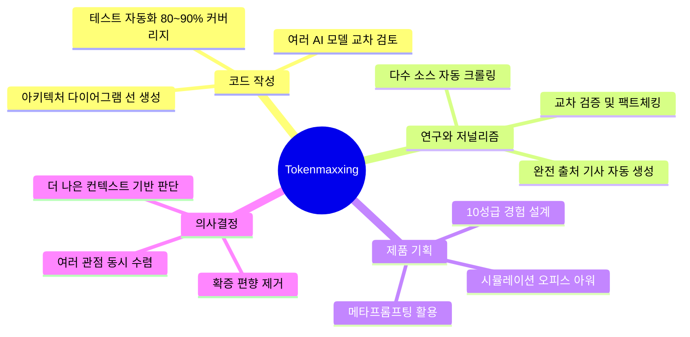
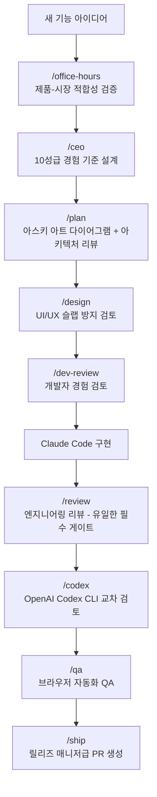
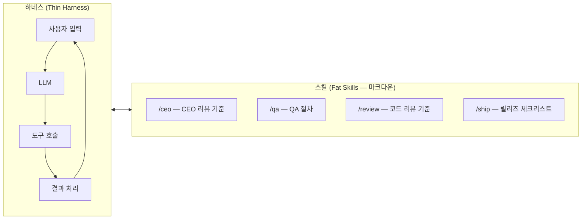
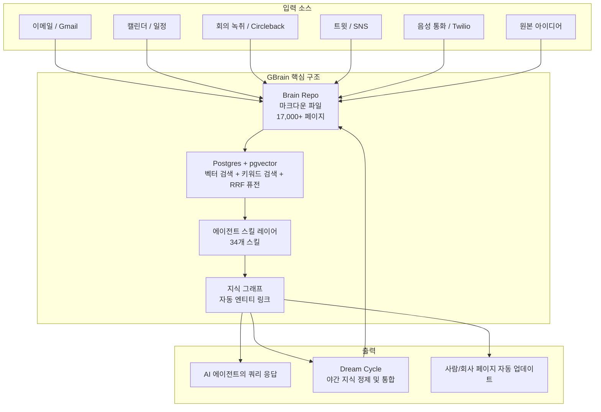

### Lightcone Podcast 완전 분석 — "Tokenmaxxing: How Top Builders Use AI To Do The Work Of 400 Engineers"
**출처:** [Y Combinator Lightcone Podcast](https://www.youtube.com/watch?v=57lDpTwiW6g]) | 2026년 5월 8일 방영  
**출연:** Garry Tan (Y Combinator CEO), 공동 진행자

---

## 들어가며 — 이 에피소드가 중요한 이유

이 팟캐스트 에피소드는 단순한 AI 도구 소개가 아니다. Y Combinator의 대표이자 CEO인 Garry Tan이 직접 13년의 코딩 공백을 깨고, AI 에이전트 도구만으로 수십만 줄의 코드를 혼자 작성하며 여러 오픈소스 프로젝트를 동시에 런칭해 낸 실전 경험을 공유하는 에피소드다. 이 에피소드가 방영된 2026년 5월 시점에, Garry Tan의 GStack 리포지토리는 이미 16,000개 이상의 GitHub 스타를 기록하고 있었고, GBrain은 출시 24시간 만에 5,400개의 스타를 모았다. 즉, 이 팟캐스트에서 다루는 내용은 단순한 아이디어가 아니라 이미 수만 명의 개발자들이 실제로 채택하고 있는 새로운 개발 패러다임이다.

---

## 1부. AI를 통제할 것인가, AI에 통제당할 것인가

에피소드는 하나의 근본적인 질문으로 시작한다.

> "당신은 자신의 도구를 통제할 것인가, 아니면 도구가 당신을 통제할 것인가?"

Garry Tan은 오늘날 AI 에이전트 도구를 사용하는 경험을 페라리를 운전하는 것에 비유한다. 엄청나게 강력하고 스릴 있지만, 동시에 페라리처럼 고장이 잦고, 고장 났을 때 직접 고칠 줄 알아야 한다는 것이다. 그가 언급한 OpenClaw는 오스트리아 개발자 Peter Steinberger가 2025년 11월에 만든 오픈소스 AI 에이전트로, 2026년 초 폭발적으로 성장해 GitHub에서 React를 추월해 역대 가장 빠르게 성장한 오픈소스 프로젝트 중 하나가 되었다. OpenClaw는 사용자의 로컬 머신에서 동작하며, 각종 메시징 플랫폼과 통합되어 자율적으로 작업을 수행하는 개인 AI 에이전트다.

이 비유는 단순한 수사가 아니다. 현재의 AI 에이전트는 놀라운 일을 해내지만 여전히 불완전하며, 진정으로 이 도구에서 가치를 얻으려면 사용자가 기계에 대한 깊은 이해와 통제 능력을 갖춰야 한다는 핵심 메시지를 담고 있다.

---

## 2부. 13년 만의 코딩 복귀 — 무엇이 가능해졌나

Garry Tan은 Y Combinator 대표로 활동하면서 수년간 직접 코드를 작성하지 않았다. 그런 그가 2025년 말 Claude Code를 통해 다시 코딩을 시작했다. 그 결과는 놀라웠다.

- **과거(2013년):** 하루 평균 14줄의 논리적 코드 변경(logical lines of code)
- **2026년 현재:** 하루 평균 11,417줄의 논리적 코드 변경

팟캐스트에서 처음에 "400배 생산성"을 언급했지만, 이후 Garry Tan이 실제 논리적 코드 기준으로 재계산한 결과 **810배**라는 수치가 나왔다. 여기서 중요한 점은 "AI가 쓴 코드가 자신의 코드인가?"라는 논란이 있었다는 것인데, Tan의 답은 명확하다. 핵심은 누가 타이핑했는가가 아니라 무엇이 실제로 출시되었는가다.

GitHub 리포지토리 기준으로, 2026년 4월 18일까지 2026년 한 해에 생산된 코드는 2013년 한 해 전체의 **240배**에 달했다.

이것이 가능했던 배경은 단순히 AI가 똑똑해졌기 때문만은 아니다. Tan이 개발한 구체적인 워크플로우와 방법론이 결정적인 역할을 했다.

---

## 3부. Posterous에서 Gary's List까지 — 스타트업을 혼자 재건하다

### 3-1. Posterous의 역사

Tan의 첫 번째 YC 스타트업인 Posterous는 2008년 이메일로 블로그를 운영하는 서비스로 시작해 인터넷 상위 200위 웹사이트로 성장했고, 이후 Twitter에 약 2천만 달러에 인수되었다. Twitter 인수 후 서비스가 종료되자 Tan은 "Post Haven"이라는 이름으로 두 번째 버전을 약 10만 달러와 두 명이서 3개월에 걸쳐 재건했다.

그리고 2026년 초, 같은 블로그 플랫폼을 **단 약 200달러(Claude Code Max 계정 구독료)와 5일**만에 세 번째로 재건하는 데 성공했다. 단순한 블로그 플랫폼이 아니라 완전한 RAG(검색 증강 생성), 에이전트 기반 데이터 수집, 딥 리서치 기능까지 포함된 형태로.

```
1차 구축 (2008):  $4,000,000 + 6~7명 + 1년 6개월
2차 구축 (Post Haven):  $100,000 + 2명 + 3개월
3차 구축 (2026):  $200 + 1명 + 5일
```

### 3-2. Gary's List — AI 저널리즘 플랫폼

Gary's List(garryls.org)는 단순한 블로그가 아니다. Tan이 관심을 갖는 캘리포니아 교육 정책, 샌프란시스코 도시 문제 등에 대해 자동으로 인터넷을 크롤링하고, 수십 개의 소스를 교차 검증한 후 완전히 출처가 달린 심층 기사를 생성하는 AI 저널리즘 시스템이다. Tan은 이를 약 5~10달러의 Opus API 호출 비용으로, 숙련된 인간 조사 저널리스트가 수일에 걸쳐 할 작업을 수행한다고 설명한다.

이 시스템의 철학적 기반은 YC의 동문 Jake Heler(Casetext 창업자)에게서 영감을 받았다. "인간이라면 이 컨텍스트를 주었을 때 무엇을 할 것인가? 도서관에 가는가? 어떤 책을 찾는가? 웹에서 무엇을 검색하는가?" 이 질문들을 AI에 그대로 적용한 것이다.

---

## 4부. Tokenmaxxing — AI 시대의 새로운 생산성 철학

### 4-1. 개념 정의

"Tokenmaxxing"은 Tan이 창안한 개념으로, AI에 처리시킬 작업에 대해 가능한 한 많은 컨텍스트와 리소스를 제공해 최고의 결과를 끌어내는 전략이다. 핵심 아이디어는 이렇다.

기존 인간 작업자는 시간과 에너지 제약으로 인해 단 하나의 소스를 읽고 결정을 내린다. AI는 그런 제약이 없다. 20개의 소스를 읽어도 되고, 100개를 읽어도 된다. 13개 소스가 한쪽 주장을 지지하고 7개 소스가 다른 주장을 지지한다면, 이 모든 컨텍스트를 통합해서 더 나은 판단을 내릴 수 있다. 더 많은 토큰을 쓰는 것에 두려움을 갖지 말고, 가능한 한 완전한(completionist) 접근을 취하라는 것이 tokenmaxxing의 본질이다.

### 4-2. Tokenmaxxing의 적용 범위

Tan은 이것이 코드 작성에만 국한된 것이 아니라고 강조한다. 지식 노동(knowledge work) 전반에 걸쳐 적용 가능하다.



### 4-3. Tokenmaxxing과 SF 임대료 비유

Tan은 tokenmaxxing에 투자하는 것을 샌프란시스코 임대료에 비유한다. YC 창업자들이 종종 SF의 비싼 임대료를 아까워하지만, 실제로는 "SF에 살지 않는 것이 더 비싸다"는 논리다. 좋은 위치에 있을 때 생기는 우연한 만남, 네트워크 효과, 정보 습득 속도가 임대료 비용을 훨씬 초과한다는 것. AI 토큰 비용도 마찬가지다. 하루에 500달러를 쓰더라도 그것이 진정한 가치를 만들어내고 있다면, 절약보다 최대 활용이 맞는 선택이라는 주장이다.

---

## 5부. GStack — 우연히 탄생한 가상 엔지니어링 팀

### 5-1. GStack의 탄생 배경

GStack은 처음부터 공개 프레임워크로 기획된 것이 아니었다. Garry Tan이 Gary's List를 개발하면서 Claude Code에 반복적으로 같은 프롬프트를 입력한다는 사실을 깨달았고, 이를 Apple Notes에 정리하기 시작한 것이 출발점이다. 그 메모가 바이럴되면서(200,000명 조회) 더 발전된 버전을 만들었고, 이것이 GStack으로 이어졌다.

### 5-2. GStack이란

GStack은 Claude Code를 위한 오픈소스 "스킬(Skills)" 모음으로, 단일 개발자가 전체 스타트업 팀의 기능을 수행할 수 있도록 Claude에게 구조화된 역할을 부여한다. 단순히 Claude에게 코드를 쓰라고 지시하는 것이 아니라, Claude가 CEO처럼, 엔지니어링 매니저처럼, 디자이너처럼, QA 리더처럼 각각의 역할로 작동하도록 구조화한다.

2026년 5월 현재, GStack은 GitHub에서 23개의 슬래시 커맨드와 도구를 제공하며 16,000개 이상의 스타를 기록하고 있다.



### 5-3. GStack의 핵심 스킬들

팟캐스트에서 언급된 주요 스킬들을 정리하면 다음과 같다.

**Plan Review (계획 리뷰)** — Claude Code가 작업을 시작하기 전에 아스키 아트 다이어그램을 먼저 생성하도록 지시한다. 데이터 흐름, 입출력, 사용자 플로우, 에러 메시지를 먼저 시각화하면 AI가 전체 컨텍스트를 로드한 후 더 완전한 작업을 수행한다는 것이 핵심 발견이다.

**CEO Review (CEO 리뷰)** — Airbnb CEO Brian Chesky의 "10성급 경험" 개념에서 영감을 받아 만든 스킬이다. 별 5개 경험을 넘어 6성, 7성, 8성, 10성이 무엇인지 극한까지 정의하고, 현재 계획이 그 이상적인 기준에 얼마나 가까운지 평가한다. 또한 "10배 더 많은 가치를 2배의 노력으로 달성하는 더 야심찬 버전은 무엇인가?"라는 질문을 포함한다.

**QA (품질 보증)** — 처음에는 Claude Code MCP를 통해 브라우저 테스팅을 시도했으나 응답이 너무 느렸다(매 턴 2~3초). 이에 Microsoft Playwright를 직접 래핑하는 형태로 만든 브라우저 자동화 QA 도구. 현재 브랜치에서 무엇을 변경했는지 컨텍스트를 확인하고, UI 변경이나 데이터 변형이 있으면 자동으로 브라우저를 열어 테스트한다.

**Codex (/codex)** — Claude Code가 막히거나 더 깊은 분석이 필요할 때 OpenAI의 Codex CLI를 불러와 교차 검토하는 스킬. "200 IQ의 거의 말 없는 CTO를 친구로 불러오는" 방식이라고 Tan은 표현한다. 반대로 Codex를 주 에이전트로 사용할 때 /claude 커맨드로 Claude를 잠깐 CEO 역할로 불러올 수도 있다.

**2026년 4월 기준 GStack 현황:**
- MIT 라이선스로 오픈소스 공개
- Claude Code, OpenAI Codex CLI, Cursor, OpenCode 등 8개 호스트 지원
- 23개 슬래시 커맨드
- /careful, /freeze, /guard 등 안전 가드레일 포함
- 팀 설치 모드: 세션 시작 시 자동 업데이트

---

## 6부. 400배 생산성 워크플로우 — 하루 13개 PR을 가능하게 하는 구체적 방법

Tan의 실제 일상 워크플로우는 이렇다.

먼저 Conductor(Claude Code의 멀티 에이전트 오케스트레이션 레이어)를 열고, 새로운 기능 아이디어가 떠오르는 즉시 입력한다. Claude가 그 아이디어를 받아 GStack을 통해 오피스 아워 → CEO 리뷰 → 플랜 생성까지 진행하고, 사용자가 승인(approve)하면 실제 구현을 시작한다. 단위 테스트, 통합 테스트, E2E 테스트까지 자동 통과한 후 자동 QA가 브라우저를 열어 수동 테스트까지 대신 수행한다.

Tan은 최대 15개의 기능이 큐에 동시에 올라와 있는 상태로 작업했다고 밝혔으며, 48시간 만에 13개의 PR을 머지한 적도 있다. 이것이 YC 대표직을 풀타임으로 수행하면서 동시에 이루어진 일이라는 점이 더욱 놀랍다.

### 테스트 커버리지에 대한 현실적 조언

초기에 Tan은 100% 테스트 커버리지를 목표로 했으나, 실제로는 **80~90%가 최선의 실천**임을 발견했다. 그는 직접 코드를 작성할 때 항상 테스트를 최소화했는데("재미없으니까"), AI는 테스트 작성을 추가 비용 없이 수행한다는 점이 게임 체인저라고 강조한다. 테스트 없는 vibe coding 결과물은 인간이 쓴 코드보다 10배 더 나쁜 슬랩이 될 수 있다.

---

## 7부. Thin Harness, Fat Skills — 에이전트 엔지니어링의 핵심 철학

이 에피소드에서 가장 이론적으로 중요한 부분 중 하나다. "얇은 하네스, 두꺼운 스킬(Thin Harness, Fat Skills)"이라는 개념은 YC 파트너 Pete Kumin과의 대화에서 나왔다.

### 하네스(Harness)란

하네스는 에이전트 시스템의 핵심 루프다. 사용자 입력을 받아 LLM에 전달하고, LLM이 도구 호출 등을 수행하면 그 결과를 다시 처리하는 기반 구조다. Claude Code, LangGraph, OpenClaw 같은 것들이 하네스다.

### 스킬(Skills)이란

스킬은 그 하네스 위에서 "무엇을 어떻게 할 것인가"를 마크다운으로 정의한 것이다. 이벤트 플래너가 결혼식을 다시 진행해야 할 때 다음 담당자에게 어떻게 하라고 알려줄 메모와 같다. 체크리스트, 판단 기준, 예외 처리 방식 등을 평이한 영어(마크다운)로 작성한다.



### 코드 vs 마크다운: 무엇을 어디에 넣을 것인가

에이전트 엔지니어링의 실질적인 어려움은 **무엇을 코드로 처리하고 무엇을 마크다운(LLM)으로 처리할 것인지** 결정하는 데 있다.

코드는 결정론적이다. 0과 1로 동작하며 예외 처리를 명시적으로 다 작성해야 한다. 반면 LLM은 잠재 공간(latent space)을 가지며 사용자의 의도, 맥락, 일반적인 예외 상황을 이해한다. 웨딩 플래너가 20개의 장소에 전화해야 한다면 코드(Twilio API 호출)가 맞지만, "어느 장소가 적합한가"를 판단하는 것은 마크다운(LLM 스킬)이 맞다.

---

## 8부. AI 에이전트는 페라리다 — 홈브루 컴퓨터 클럽의 시대

Tan은 현재의 AI 개발 환경을 1970년대 후반의 홈브루 컴퓨터 클럽과 Apple 1이 등장하던 시대에 비유한다. 당시 개인용 컴퓨터를 원했다면 Steve Jobs와 Steve Wozniak이 나무 케이스에 못과 덕테이프로 만든 브레드보드 수준의 기계를 받아들여야 했다. 지금의 AI 에이전트 도구도 마찬가지다.

기술적으로 능숙한 사람이 수백에서 수천 달러와 2~3시간을 투자해야 제대로 작동하는 환경을 구성할 수 있다. 하지만 일단 그것을 손에 넣으면, 이제 "키트카 페라리 단계(kit car Ferrari phase)"에 접어드는 것이다. 원하는 어디든 달릴 수 있게 된다.

이 비유에서 중요한 포인트는 "고장 났을 때 직접 고칠 줄 알아야 한다"는 부분이다. AI 에이전트는 자기 자신을 망가뜨리기도 하지만(brick itself), Claude Code 같은 다른 에이전트를 옆에서 계속 실행하면 그것이 자동으로 수정해주기도 한다. 즉, 에이전트들이 서로를 감시하고 복구하는 구조가 이미 등장했다.

### Stack Overflow → ChatGPT → Claude Code

Tan과 공동 진행자는 AI 개발 도구의 진화 과정을 다음과 같이 요약한다. Stack Overflow는 막혔을 때 참고하는 웹사이트였다. ChatGPT는 더 상호작용적이었지만 여전히 복붙(copy-paste) 방식이었다. Claude Code와 함께라면 이제 복붙조차 필요 없다. AI가 직접 실행하고 결과를 확인하고 수정한다. 개발자의 역할이 코드 작성에서 방향 설정과 판단으로 이동하고 있는 것이다.

---

## 9부. 개인 AI의 미래 — 페이스북 뉴스피드 vs. 나의 AI

에피소드의 가장 철학적인 부분이다. Tan은 AI의 미래가 두 갈래로 나뉠 것이라고 예측한다.

**시나리오 A — 개인 제어형 AI:**
자신의 데이터, 자신의 통합, 자신의 프롬프트로 작동하는 AI. 알고리즘이 무엇을 어떻게 처리하는지 투명하게 볼 수 있다. 자신의 필요와 가치관에 맞게 맞춤화되어 있다.

**시나리오 B — 기업 제어형 AI:**
어느 PM이나 개발자가 설계한 알고리즘이 무엇을 보여줄지 결정한다. 페이스북 뉴스피드처럼 알고리즘이 어떤 비즈니스 모델을 위해 어떻게 작동하는지 사용자는 알 수 없다.

Tan이 강조하는 것은 개인용 컴퓨터 혁명의 반복이다. PC 혁명이 컴퓨팅 능력을 개인에게 가져다준 것처럼, 개인 AI 혁명은 지능 증폭(intelligence amplification)을 개인에게 가져다준다. 이것은 선택이고, 대다수 사람들은 아직 그 선택의 기로에 서 있다는 것이 그의 진단이다.

OpenClaw가 이 맥락에서 중요한 이유는, 사용자의 로컬 머신에서 동작하고 자신의 API 키로 자신의 데이터를 처리하는 구조이기 때문이다. OpenClaw의 창시자 Peter Steinberger가 OpenAI에 합류하면서 프로젝트를 재단에 이관했음에도, 오픈소스 커뮤니티는 이 원칙을 계속 이어가고 있다.

---

## 10부. GBrain — 잠자는 동안 더 똑똑해지는 AI

팟캐스트에서는 GBrain이 개발 중인 프로젝트로 간략히 언급되지만, 실제로 GBrain은 2026년 4월 9일 MIT 라이선스로 오픈소스 공개되어 출시 24시간 만에 5,400개의 GitHub 스타를 기록했다.

### GBrain이란

GBrain은 AI 에이전트를 위한 영구 기억 시스템이다. Tan의 표현을 빌리면, "AI 에이전트에게 뇌를 주는 시스템"이다.



### 드림 사이클(Dream Cycle)

GBrain에서 가장 화제가 된 기능은 "드림 사이클"이다. 에이전트가 사용자가 잠자는 동안 자율적으로 지식을 풍부화하고 통합한다. Tan의 말을 빌리면, "잠자리에 들 때보다 깨어났을 때 뇌가 더 똑똑해져 있다." 이것은 기존 AI 챗봇의 무상태(stateless) 패러다임에 정면으로 도전하는 접근이다.

현재 Tan의 개인 GBrain에는:
- 17,888페이지의 지식 문서
- 3,000개 이상의 인물 프로필
- 280개 이상의 회의 녹취
- 13년치 캘린더 데이터
- 21개의 자율 크론 작업

이 포함되어 있다.

---

## 11부. 토큰으로 시간을 산다 — 시간 억만장자 되기

에피소드의 마지막 챕터는 존재론적 질문으로 마무리된다. Tan은 YC 대표로서 극도로 시간이 부족하다는 것이 오히려 자동화를 더 극단적으로 추구하게 만든 원동력이었다고 회고한다.

그의 핵심 철학은 이렇다. "내 몸 안에는 지금 이 순간 10억 개의 삶을 살고 싶은 충동이 있다." 개인에게 주어진 시간은 유한하지만, 머신 컨텍스트(토큰)를 구매하면 그 머신의 시간, 즉 수백만 년의 작업 시간을 빌릴 수 있다. 이것이 그가 말하는 "토큰으로 시간을 산다"의 의미다.

> "무한한 시간을 가질 수 있다, 머신에게서 그 시간을 빌림으로써."

이것은 단순한 생산성 논리가 아니다. Garry Tan이 진정으로 관심 갖는 것—샌프란시스코 공립학교의 대수학 교육, 더 나은 정부, 개발자들이 더 잘 만들 수 있는 환경—을 위해 더 많은 시간과 에너지를 쏟을 수 있다는 의미로 연결된다.

---

## 에필로그 — 기술 능력자들이 가장 큰 수혜자

에피소드의 역설적 메시지가 있다. tokenmaxxing과 AI 에이전트 도구를 가장 격렬하게 비판하는 사람들은 대체로 기술 이해도가 높은 개발자들이다. 그런데 실제로 이 도구에서 가장 큰 혜택을 얻을 수 있는 사람들이 바로 그들이다. 제품 감각(taste), 기술에 대한 이해, 실제 사용자의 필요를 아는 사람이 AI 에이전트를 방향 설정 도구로 활용한다면, 이전에는 팀 전체가 필요했던 일을 혼자 해낼 수 있게 된다.

Tan의 메시지는 간결하다. "싸우지 말고 그냥 Claude Code를 열어서 해봐라."

---

## 주요 도구 및 프로젝트 요약

| 도구/프로젝트 | 설명 | 현황 (2026년 5월) |
|---|---|---|
| **Claude Code** | Anthropic의 에이전트 AI 코딩 도구 | 상용 서비스 운영 중 |
| [**GStack**](https://github.com/garrytan/gstack) | Claude Code를 위한 오픈소스 스킬 프레임워크 | GitHub 16,000+ 스타, MIT |
| [**GBrain**](https://github.com/garrytan/gbrain) | AI 에이전트를 위한 영구 기억 시스템 | GitHub 5,400+ 스타, MIT (4월 출시) |
| [**OpenClaw**](https://github.com/openclaw/openclaw) | 오픈소스 자율 AI 에이전트 (Peter Steinberger) | GitHub 350,000+ 스타, 재단 운영 |
| **Gary's List** | AI 기반 조사 저널리즘 플랫폼 | 운영 중 (garryls.org) |

---

## 결론 — 이 에피소드가 시사하는 것

이 팟캐스트 에피소드는 AI 도구를 활용한 개발 방식의 근본적인 전환을 보여준다. 핵심 시사점을 정리하면 다음과 같다.

첫째, AI 도구는 이제 보조 수단이 아닌 주요 실행자다. 개발자의 역할은 코드 작성자에서 에이전트 감독자(orchestrator)로 이동하고 있다.

둘째, 구조화된 프롬프트(스킬)는 코드만큼 중요하다. 마크다운으로 작성된 스킬이 실제 소프트웨어 기능이 되는 시대가 왔다.

셋째, 토큰 비용을 아끼는 것은 잘못된 경제학이다. 더 많은 컨텍스트와 더 많은 토큰이 더 나은 결과를 만들고, 장기적으로 더 큰 가치를 창출한다.

넷째, AI 주권은 개인의 선택이다. 자신의 프롬프트, 자신의 데이터, 자신의 에이전트를 갖는 것과 기업이 설계한 AI를 그냥 사용하는 것 사이의 차이는 앞으로 더 커질 것이다.

이 모든 것을 관통하는 하나의 질문은 에피소드 첫 문장과 마지막 문장에 동일하게 반복된다.

**"당신은 자신의 도구를 통제할 것인가, 아니면 도구가 당신을 통제할 것인가?"**

---

*본 문서는 Lightcone Podcast 에피소드 "Tokenmaxxing: How Top Builders Use AI To Do The Work Of 400 Engineers" (2026년 5월 8일 방영)의 전체 트랜스크립트와 공개된 최신 정보(GStack GitHub, GBrain GitHub, OpenClaw 관련 자료 등)를 기반으로 작성되었습니다.*
