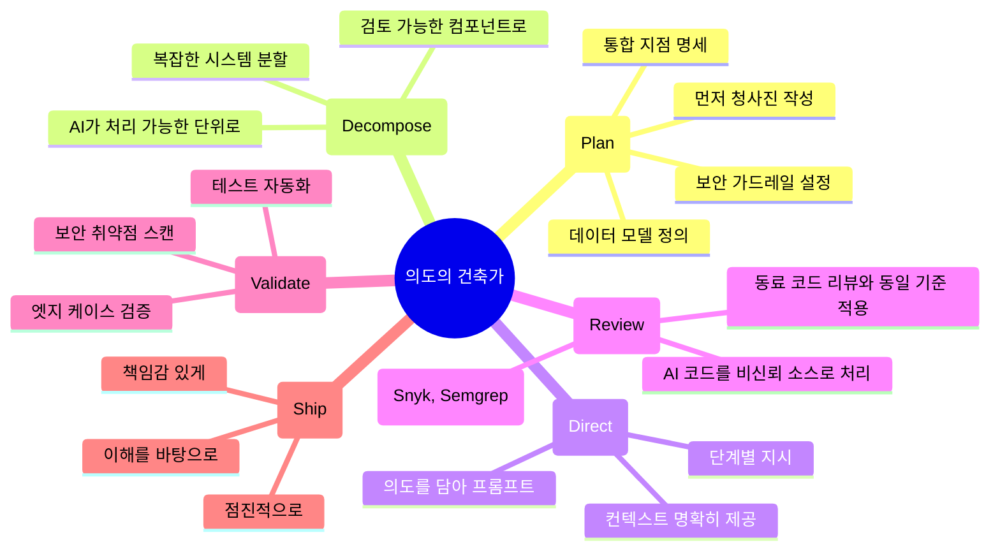

> 2025년의 황금 환상이 어떻게 무너졌고, 2026년의 개발 세계는 어디로 향하는가

---

## 1. 바이브 코딩이란 무엇인가

2025년 2월, OpenAI 공동 창업자이자 전 테슬라 AI 총괄인 **안드레이 카르파티(Andrej Karpathy)** 는 소셜 미디어에 하나의 개념을 올렸다. 그는 자신이 AI가 생성한 코드를 거의 읽지 않고도 앱을 만들고 있다고 고백하며, 이 새로운 개발 방식을 **"바이브 코딩(Vibe Coding)"** 이라고 이름 붙였다. 말 그대로 "분위기(vibe)에 몸을 맡기는" 개발 방식이었다. 코드를 이해하지 않아도 된다. AI가 알아서 만들어 줄 테니, 그냥 원하는 것을 설명하고 결과물을 받아 쓰면 된다.

이 개념은 순식간에 기술 문화 전반을 사로잡았다. 영국의 **콜린스 사전(Collins Dictionary)** 은 2025년 올해의 단어로 '바이브 코딩'을 선정했다. 수백만 명의 비개발자들이 Cursor, Replit, Bolt, Lovable 같은 도구를 사용해 앱을 만들기 시작했다. 코딩을 한 줄도 모르는 사람이 주말 이틀 만에 SaaS 제품을 출시하는 이야기가 쏟아졌다. 민주화된 소프트웨어 개발의 시대가 열린 것처럼 보였다.

---

## 2. 폭발적 성장 — 숫자로 보는 바이브 코딩의 전성기

바이브 코딩의 부상은 단순한 유행이 아니었다. 수치들은 그 규모를 명확하게 보여준다.

- **GitHub 보고서**에 따르면, 2025년 기준으로 커밋되는 전체 신규 코드의 **46%** 가 AI가 생성한 코드였다.
- **Y Combinator 2025년 겨울 배치** 스타트업 중 **25%** 는 코드베이스의 95% 이상이 AI로 생성되었다. 이들은 코드를 직접 짤 능력이 없는 비개발자가 아니었다. 속도를 위해 의도적으로 AI 생성을 선택한 숙련 개발자들이었다.
- 한 조사에 따르면 미국 개발자의 **92%** 가 AI 코딩 도구를 매일 사용하고 있었다.
- AI 코딩 도구 시장 규모는 **2026년 기준 약 47억 달러**로 추산되며, 이듬해까지 **123억 달러**에 달할 것으로 전망되었다.
- AI 도움을 받은 개발자들은 작업을 **25~55% 빠르게** 완료했으며, 시니어 엔지니어들은 최대 **81%** 의 생산성 향상을 보고했다.

Lovable의 성장은 이 흐름의 정점을 보여준다. 이 플랫폼은 서비스 출시 4주 만에 연간 반복 매출(ARR) **400만 달러**를 달성했고, 2025년 2월에는 45,000명 이상의 유료 고객을 보유했다. 같은 해 7월 **18억 달러** 밸류에이션으로 2억 달러를 조달했고, 12월에는 **66억 달러** 밸류에이션으로 3억 3,000만 달러를 추가 조달하며 5개월 만에 밸류에이션을 세 배 이상 끌어올렸다.

가트너는 2026년 말까지 전체 신규 코드의 **60%** 가 AI 생성 코드가 될 것으로 전망했다.

---

## 3. 균열의 시작 — 생산성의 이면

그러나 속도와 편리함의 이면에서 균열이 시작되고 있었다.

### 3-1. 코드 품질 문제

2025년 12월, 한 리서치 기관이 오픈소스 GitHub 풀 리퀘스트 **470건**을 분석했다. 결과는 불편한 진실을 드러냈다.

- AI가 공동 작성한 코드는 인간이 작성한 코드보다 **주요 이슈가 1.7배 많았다**.
- 잘못된 설정(misconfiguration)은 **75% 더 빈번하게** 나타났다.
- 보안 취약점은 인간 작성 코드에 비해 **2.74배 더 많이** 발견되었다.

코드 품질 외에도 구조적 문제가 심각했다. 코드 중복은 **4배** 증가했으며, 코드 변경률(churn)은 **41%** 상승했다. 코드베이스의 건강성을 유지하는 데 필수적인 리팩토링 비율은 2021년 전체 변경 코드의 **25%** 에서 2024년 **10% 미만**으로 급감했다.

Veracode는 LLM 100개 이상을 보안 민감 코딩 작업에 테스트해, AI 생성 코드 샘플의 **45%** 가 OWASP 상위 10대 취약점을 포함한다는 결과를 발표했다. 이 통과율은 2025년부터 2026년 초까지 여러 테스트 사이클에 걸쳐 개선되지 않았다.

### 3-2. Lovable 사태와 CVE-2025-48757

바이브 코딩 보안 위기의 상징적 사건은 **Lovable 플랫폼**에서 발생했다.

2025년 4월 14일, Palantir Technologies의 엔지니어 **다니엘 아사리아(Daniel Asaria)** 는 점심시간에 Lovable의 '추천 앱' 페이지를 살펴보다가 흥미로운 실험을 시작했다. 앱 API 요청에서 인증 헤더 하나를 제거해 재전송했더니, 플랫폼 전체 사용자 데이터베이스처럼 보이는 것이 고스란히 반환되었다. 이름, 이메일 주소, 사용자가 작성한 커스텀 프롬프트, 그리고 충분히 위험한 수준의 개인정보까지.

이후 보안 연구자들이 Lovable 마켓플레이스에 전시된 **1,645개 앱**을 동일한 방식으로 점검했다. **170개**, 즉 전체의 **약 10%** 가 동일한 유형의 취약점을 통해 사용자 데이터를 노출하고 있었다.

취약점의 근본 원인은 명확했다. Lovable의 AI가 생성한 앱들이 **Supabase** 데이터베이스에 연결될 때 **행 수준 보안(Row Level Security, RLS) 정책을 설정하지 않거나 잘못 설정**하는 경우가 만연했다. RLS가 없으면 데이터베이스는 누가 어떤 데이터를 요청하든 가리지 않고 내용을 반환한다.

이 취약점에는 **CVE-2025-48757**이 공식 지정되었으며, CVSS 점수는 **8.26~9.3(심각)** 을 기록했다. Palantir의 또 다른 연구자는 파이썬 코드 단 **15줄**로 한 시간도 안 되어 여러 앱에서 부채 잔액, 집 주소, API 키를 추출했다.

유출된 앱 중 하나는 덴마크 비영리단체 **Connected Women in AI**의 것이었다. 노출된 데이터에는 Accenture Denmark와 코펜하겐 비즈니스 스쿨 직원들의 이름, 직책, LinkedIn 프로필, Stripe 고객 ID가 포함되어 있었다. Nvidia, Microsoft, Uber, Spotify 직원들의 Lovable 계정도 피해 앱과 연결된 것으로 알려졌다.

더 충격적인 것은 취약점 공개 과정이었다. 보안 연구자 매트 팔머(Matt Palmer)는 2025년 3월 21일 Lovable CEO에게 취약점 보고서를 이메일로 전송했다. Lovable은 3월 24일 수신을 확인했지만 실질적인 응답을 하지 않았다. 4월 14일 아사리아가 동일한 취약점을 공개 트윗하자, 팔머는 45일간의 공개 협조 창을 시작했다. Lovable은 4월 24일 보안 스캐너가 포함된 'Lovable 2.0'을 출시했다. 하지만 분석에 따르면, 이 스캐너는 RLS 정책의 **존재 여부**만 확인할 뿐, **정책이 올바르게 구성되었는지**는 검증하지 않았다.

### 3-3. 연속되는 보안 사고들

Lovable 사태는 시작에 불과했다. 2026년 4월, 단 한 주 동안 세 개의 AI 관련 플랫폼에서 연속적으로 보안 사고가 발생했다.

- **Lovable**: 2026년 4월, 사용자의 소스 코드, 데이터베이스 자격증명, AI 채팅 히스토리가 기본 API 결함으로 **48일간** 외부에 노출되었다. Lovable은 세 번째 주요 보안 사고를 맞이했다.
- **Vercel**: 서드파티 AI 평가 도구인 Context.ai를 통해 공격자가 내부 시스템에 접근하는 침해 사고가 발생했다.
- **Bitwarden CLI**: 공급망 공격(supply chain attack)으로 악성코드가 삽입되었으며, 이 악성코드는 Claude, Cursor, Codex CLI 자격증명을 특정해 탈취하도록 설계되어 있었다.

또한 2026년 2월, 한 창업자가 "단 한 줄의 코드도 직접 쓰지 않았다"고 공개 선언하며 바이브 코딩으로 구축한 소셜 네트워크 **Moltbook**을 출시했다. 출시 3일 후, 보안 기업 Wiz는 잘못 설정된 데이터베이스로 인해 **150만 개의 인증 토큰과 3만 5,000개의 이메일 주소**가 노출되었음을 발견했다.

조지아 공대의 Vibe Security Radar 프로젝트는 2026년 3월 단 한 달 동안 AI 코딩 도구에 직접 귀속되는 **CVE 35건**을 추적했으며, 오픈소스 생태계 전반에서 실제 수치는 이의 5~10배에 달한다고 추정했다.

---

## 4. 시각적 균질화 — 디자인의 위기

보안 문제와는 별개로, 또 다른 심각한 문제가 수면 위로 떠올랐다. 디자인 전문가 **미칼 말레비치(Michal Malewicz)** 는 2026년 3월 24일 게재한 글에서 다른 각도의 위기를 지적했다.

AI로 생성된 랜딩 페이지, 앱 인터페이스, SaaS 제품들이 점점 서로 구분할 수 없을 만큼 비슷해지고 있다는 것이었다. 그는 이를 이케아의 유명한 커피 테이블 **LACK**에 비유했다. 내부는 톱밥이고 플라스틱으로 포장되어 있지만 겉보기에는 멀쩡한 테이블. AI가 만들어낸 결과물들은 기능적이지만 영혼이 없었다.

그는 AI로 생성된 가상의 이케아 조립 가이드를 **'PROMPTA'** 라고 불렀다. 부품 A(기반 요소)를 깔고, B(기둥 역할을 하는 구성 요소)를 꽂고, C(연결 부품)로 조이면 완성되는 조립형 제품. 누구나 만들 수 있고, 모두 똑같이 생겼으며, 아무도 기억하지 못한다.

그의 핵심 주장은 이것이었다. AI의 문제가 아니라, **기초 지식 없이 빠른 길을 찾으려는 사람들**의 문제라는 것이다. 이런 현상은 AI가 등장하기 훨씬 전, 1990년대 인터넷 태동기에도 이미 존재했다.

모두가 힘들이지 않고 무언가를 만들 수 있게 되면, 그 **만들기 자체의 가치가 하락**한다. 소비자들은 이미 포화 상태다. 카테고리마다 192개의 유사 제품이 있고, 아무도 새로운 앱이 필요하지 않다. 대부분의 SaaS는 1~2년 내에 주요 AI 도구에 기능으로 흡수될 것이다. 말레비치는 결론짓는다. "대부분의 사람들은 그냥 만드는 것을 멈춰야 한다."

---

## 5. 바이브 코딩의 진짜 종말이 의미하는 것

이 시점에서 오해를 분명히 정리할 필요가 있다. "바이브 코딩이 끝났다"는 말이 "AI 보조 개발이 끝났다"는 뜻은 아니다. AI 도구는 계속해서 강력해지고 있고, 이를 활용하는 것은 선택이 아니라 필수가 되고 있다.

카르파티가 원래 정의한 의미의 바이브 코딩 — **검토 없이 AI 결과물을 수용하고 진행하는 방식** — 이 더 이상 전문적 전략으로 유효하지 않다는 것이다. 이유는 도구가 나빠진 게 아니라, 현실이 따라잡았기 때문이다.

앱들은 프로덕션에서 고장났다. 보안 구멍이 발견되었다. 코드베이스는 유지 관리할 수 없게 되었다. 연구자들의 관찰은 이를 한 문장으로 압축한다.

> *"바이브 코딩은 제품을 만들 수 있다. 하지만 제품을 유지할 수 없다."*

---

## 6. 다음 단계 — "의도의 건축가"

2026년에 실제로 성과를 내고 있는 개발자들이 발견한 새로운 패러다임이 있다. 그것은 **전략적 분해(Strategic Decomposition)** 의 시대다.

역할이 사라진 것이 아니라 **변형**된 것이다. 지금 가장 가치 있는 엔지니어는 코드를 가장 많이 쓰는 사람이 아니다. AI를 효과적으로 지휘하고 AI의 결과물을 평가할 수 있는 사람이다. 아키텍처 판단력, 보안 직관, 복잡한 시스템을 AI가 신뢰할 수 있게 해결할 수 있는 이산적 컴포넌트로 분해하는 능력. 이것이 2026년의 핵심 역량이다.

이 시대의 개발자를 가리키는 표현이 자주 등장하고 있다. **"당신이 조각가다. AI는 점토다."**

### 6-1. 프롬프트 이전에 계획하라

2026년에 신뢰할 수 있는 소프트웨어를 출시하는 팀들은 Cursor를 열고 "SaaS 만들어줘"라고 타이핑하지 않는다. 그들은 먼저 **기술 요구사항 문서(PRD)** 를 작성한다. 데이터 모델, 통합 지점, 보안 가드레일을 정의한다. AI는 실제 컨텍스트가 주어질 때 더 빠르고 정확하게 작동한다.

### 6-2. AI 코드를 신뢰하지 않는 코드로 취급하라

이것이 대부분의 바이브 코더들이 받아들이기 싫었던 불편한 진실이다. AI가 생성한 코드는 기본적으로 안전하지 않다. 미지의 출처에서 온 코드와 동일한 보안 스캐닝, 동일한 리뷰, 동일한 테스트가 필요하다. Snyk, Semgrep 같은 도구가 지금 진지한 AI 보조 개발 워크플로우의 진입점에 자리 잡고 있는 이유가 바로 여기에 있다.

### 6-3. 한 번에 전체를 생성하지 말고 점진적으로 통합하라

컴포넌트 하나를 만들고, 테스트하고, 이해한 다음, 다음 단계로 넘어간다. "프롬프트 한 번으로 앱 전체를 만드는" 방식은 아무도 — 개발자 본인조차도 — 실제로 이해하지 못하는 시스템을 만들어낸다. 이해하지 못하는 시스템은 고장났을 때 고칠 수 없다.

---

## 7. 거버넌스와 제도적 대응

이러한 위기에 대응하기 위해 조직적, 제도적 움직임도 시작되었다.

Palo Alto Networks 산하 **Unit 42**는 2026년 1월 바이브 코딩 거버넌스를 위한 **SHIELD 프레임워크**를 발표했다. 이 프레임워크는 다음 여섯 가지 원칙으로 구성된다.

| 항목 | 의미 |
|------|------|
| **S**eparation of duties | 역할 분리 |
| **H**uman-in-the-loop controls | 인간 개입 통제 |
| **I**nput/output validation | 입출력 검증 |
| **E**nvironmental isolation | 환경 격리 |
| **L**ogging | 로깅 |
| **D**efense-in-depth | 심층 방어 |

**EU AI Act**의 고위험 의무 조항은 **2026년 8월 2일** 발효될 예정이다. 이는 AI 도구로 생성된 코드가 규제 범위에 들어오는 것을 의미하며, 기업들은 AI 보조 개발에 대한 명시적 위험 평가를 수행해야 한다.

**포천 500대 기업의 87%** 가 이미 바이브 코딩 플랫폼 중 하나 이상을 채택했으며, 엔터프라이즈의 바이브 코딩 도입은 전년 대비 **340%** 성장했다. 비기술 사용자의 도입은 **520%** 급증했다. 그럼에도 포천 50대 기업을 대상으로 한 실증 연구에서, AI 보조 개발자들은 동료 대비 3~4배 빠른 커밋 속도를 보였지만, 보안 결함도 **10배 높은 비율**로 도입하는 것으로 나타났다.

---

## 8. 비개발자에게 남은 것

바이브 코딩의 원래 약속은 민주화였다. 누구나 소프트웨어를 만들 수 있게 된다는 것. 그리고 그 약속은 부분적으로 이루어졌다.

하버드 교육대학원 교수 **카렌 브레넌(Karen Brennan)** 은 2025년 하반기에 바이브 코딩 강좌를 가르치며, 그 핵심 가치를 "실험의 경제학을 바꾸는 것"이라고 표현했다. 무언가를 이해하기 위해 그것을 빠르게 만들 수 있다. 이는 실질적이고, 사라지지 않는 가치다.

하지만 어떤 AI 능력으로도 메울 수 없는 간극이 하나 있다. **데모에서 작동하는 프로토타입과 실제 사용자의 실제 데이터를 다루며 안정적으로 작동하는 프로덕션 소프트웨어 사이의 간극**이다. 이 간극을 메우는 것은 여전히 코드가 무엇을 하는지 이해하는 누군가를 필요로 한다. 반드시 모든 줄을 직접 쓴 사람일 필요는 없지만, 코드를 읽고, 평가하고, 그에 대한 책임을 질 수 있는 사람이어야 한다.

개발자 커뮤니티에서 존경받는 목소리 **사이먼 윌리슨(Simon Willison)** 은 이를 명확하게 정의했다.

> *"LLM이 당신의 코드 모든 줄을 작성했더라도, 당신이 그 모든 것을 검토하고, 테스트하고, 이해했다면 — 내 기준에서 그것은 바이브 코딩이 아니다. 그것은 LLM을 타이핑 보조도구로 사용하는 것이다."*

이 구분이 중요하다. AI를 타이핑 보조도구로, 초안 생성기로, 빠르지만 가끔 틀리는 페어 프로그래머로 사용하는 것 — 그것은 강력하고 정당한 워크플로우다. AI 결과물을 이해 없이 배포하는 것은 전혀 다른 문제다. 그 "다른 것"이 바로 2025년이 우리에게 멈추라고 가르쳐준 것이다.

---

## 9. 정리 — 세 가지 입장에서 본 교훈

### 개발자라면

당신의 일자리는 위협받지 않는다. 진화하고 있다. 지금 어려움을 겪는 엔지니어는 AI 도구를 완전히 거부하거나, 순진하게 사용하는 사람들이다. 성과를 내는 사람들은 **취향(taste)** 을 개발한 사람들이다. AI 결과물을 언제 신뢰하고 언제 의심할지 아는 사람, 복잡한 시스템을 AI가 신뢰할 수 있게 처리할 수 있는 문제로 분해할 수 있는 사람.

### 비개발자로 무언가를 만들었다면

그것은 가치 있는 일이었다. 배운 것이 있다. 문제는 이제 무엇을 할 것인가다. 실제 사용자에게 서비스를 제공하고 있다면, 코드를 직접 검토할 능력을 키우거나, 그렇게 할 수 있는 협력자가 필요하다.

### 바이브 코딩 도구를 만들거나 투자한다면

로드맵은 명확하다. 속도 문제는 해결되었다. 다음 10년은 **AI 생성 코드를 기본적으로 신뢰할 수 있게 만드는** 주체에게 속한다. 사후 조치가 아니라, 첫 번째 프롬프트부터 설계 원칙으로 내재화된 보안이다.

---

## 결론

바이브 코딩은 죽지 않았다. 하지만 어려운 부분을 건너뛸 수 있게 해주던 버전의 바이브 코딩은 사라졌다.

어려운 부분은 항상 돌아온다. 언제나 그래왔다.

**메가 프롬프트의 시대는 끝났다. 전략적 분해의 시대가 왔다.**

---

## 참고 자료 및 원문

| 출처 | 내용 | 날짜 |
|------|------|------|
| [The PolyfdoR (Medium)](https://medium.com/@ahmed.hafdi.contact/vibe-coding-is-over-what-comes-next-is-much-harder-9fe95b509850) | "Vibe Coding Is Over. What Comes Next Is Much Harder." | 2026년 4월 |
| [Michal Malewicz (Medium)](https://michalmalewicz.medium.com/vibe-coding-is-over-5a84da799e0d) | "Vibe Coding is OVER. Here's What Comes Next." | 2026년 3월 24일 |
| Cloud Security Alliance | AI Generated Code Vulnerability Surge 2026 | 2026년 4월 4일 |
| The Next Web | Lovable vibe coding security crisis | 2026년 5월 |
| XDA Developers | Vibe coded apps leaking user data | 2026년 4월 |
| NVD | CVE-2025-48757 (CVSS 9.3 Critical) | 2025년 5월 29일 |
| Getautonoma.com | Vibe Coding Failures: 7 Real Apps That Broke in Production | 2026년 3월 |
| Georgia Tech | Vibe Security Radar — 35 CVEs in March 2026 | 2026년 |
| [Unit 42 (Palo Alto Networks)](https://unit42.paloaltonetworks.com/securing-vibe-coding-tools/) | SHIELD Framework for Vibe Coding Governance | 2026년 1월 |

---

*작성 기준일: 2026년 5월 9일*
