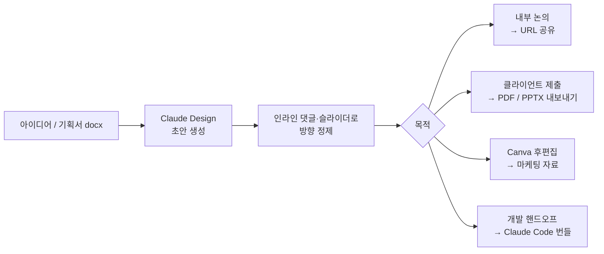
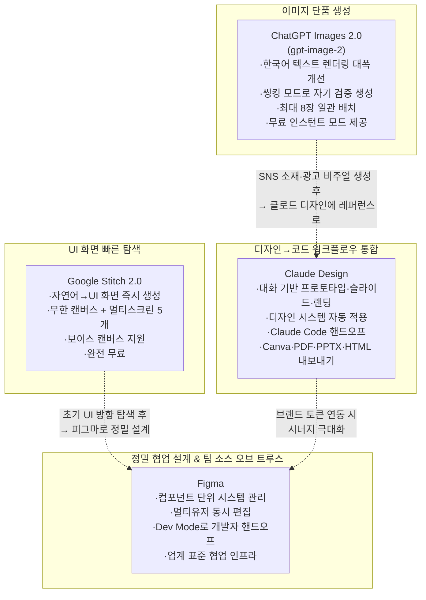
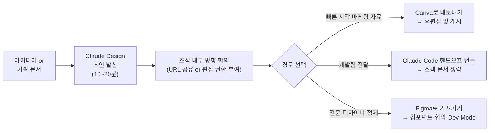
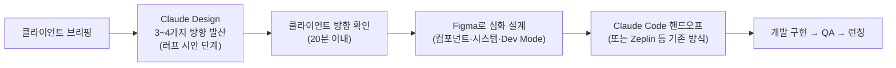
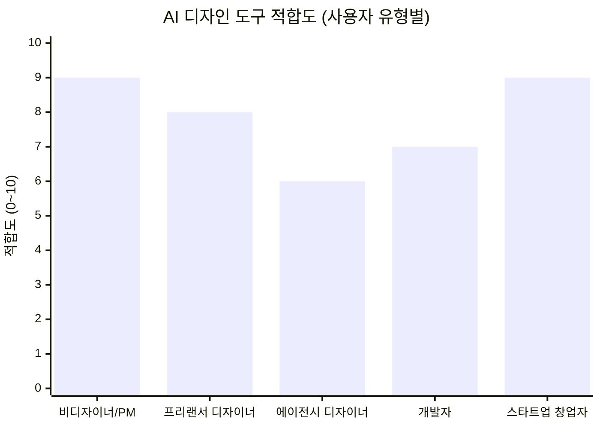

> 브런치 '지밍리' 연재 3편([#216]( https://brunch.co.kr/@7217b71f43c34f7/216), [#217](https://brunch.co.kr/@7217b71f43c34f7/217), [#220]( https://brunch.co.kr/@7217b71f43c34f7/220)) 및 공개 출처 기반 종합 정리

---

## 1. 배경: 2026년 4월, AI 디자인 시장의 동시다발적 격변

2026년 4월은 AI 보조 디자인 툴 시장에서 유례없는 밀도의 출시가 집중된 시기였다. 4월 17일 Anthropic이 Claude Design을 공개했고, 나흘 뒤인 4월 21일 OpenAI가 ChatGPT Images 2.0(모델명 gpt-image-2)을 내놓았다. 두 발표 모두 같은 달에 이루어진 것으로, 업계에서는 이를 AI가 텍스트·코드 영역에서 비주얼 창작 워크플로우 전반으로 영토를 확장하는 '디자인 러시'의 신호탄으로 읽는다. 구글 또한 이미 3월 19일에 Stitch 2.0(무한 캔버스 버전)을 배포하며 이 경쟁에 먼저 진입해 있었다.

브런치 UX/UI 전문 작가 '지밍리'는 8년 경력의 현역 디자이너로, 이 세 도구를 실무 관점에서 직접 사용하며 세 편의 연재를 통해 그 경험을 기록했다. 첫 번째 편(#216, 2026-04-20)은 Claude Design의 기능별 후기, 두 번째 편(#217, 2026-04-29)은 ChatGPT Images 2.0과의 비교, 세 번째 편(#220, 2026-05-07)은 Figma·Canva·Google Stitch와의 다각 비교 및 실무 활용법으로 구성되어 있다.

아래는 이 세 편과 공개된 공식 자료를 바탕으로, 각 도구의 본질적 포지션·기능·한계를 종합한 심층 분석이다.

---

## 2. Claude Design — Anthropic의 비전 기반 시각 창작 워크플로우

### 2.1 출시 개요

Claude Design은 2026년 4월 17일 Anthropic Labs가 공개한 AI 기반 비주얼 창작 도구로, Claude Pro, Max, Team, Enterprise 구독자를 대상으로 리서치 프리뷰 형태로 제공된다. Claude Opus 4.7을 기반 모델로 사용하며, 프롬프트만으로 프로토타입, 슬라이드, 랜딩 페이지, 원페이저 같은 시각 산출물을 생성하는 방식이다.

기반 모델인 Claude Opus 4.7은 2026년 4월 16일 출시되었으며, 비전 해상도가 기존 Opus 4.6의 1,568px에서 2,576px로 향상되어 3.75메가픽셀 수준의 고해상도 입력을 처리할 수 있게 되었다. Anthropic은 이 모델이 전문 디자인 작업에서 "더 심미적이고 창의적"이라고 설명한다.

Claude Design은 독립 앱이 아닌 claude.ai 내부에 통합된 형태로, 사이드바의 팔레트 아이콘을 통해 진입한다.

### 2.2 핵심 기능 해설

#### (1) 스케치 입력 → UI 시안 자동화

노트나 포스트잇에 그린 와이어프레임을 촬영해 업로드하면, Claude가 이를 해석하여 정돈된 모바일·웹 목업으로 변환한다. 지밍리는 이 기능을 통해 기존에 반나절이 걸리던 피그마 옮김 작업이 20분 이내로 단축되었다고 밝혔다. 간격, 타이포 위계, 전체 구성이 본래 스케치보다 더 정제된 형태로 생성되는 경험이었다고 한다.

#### (2) 피치 덱 자동 생성

회사 한 줄 소개와 핵심 수치만 입력해도 타이틀, 문제 정의, 솔루션, 시장 규모, 팀 슬라이드를 갖춘 IR 덱 초안이 한 번에 생성된다. 폰트 계층이 일관되게 유지되어 첫 생성물도 미팅 자료로 활용 가능한 수준이라는 평가였다. 기획서 docx 파일을 통째로 업로드한 경우에도 정보 위계 구성이 숙련된 디자이너의 판단에 근접했다.

#### (3) 디자인 시스템 자동 적용

팀의 코드베이스와 디자인 파일을 읽어 색상, 타이포그래피, 컴포넌트 패턴을 추출하고, 이후 모든 프로젝트에 자동 적용한다. 팀은 이 시스템을 시간에 따라 정제하거나 복수의 디자인 시스템을 병행 관리할 수 있다. 지밍리는 이 기능이 디자인 시스템 토큰을 잘 정리한 팀일수록 효과가 크다고 강조했다.

#### (4) 다중 포맷 내보내기 및 Claude Code 핸드오프

완성된 프레젠테이션 덱이나 프로토타입은 PDF, URL, PPTX 파일 형태로 내보내거나 Canva로 전송할 수 있다. Canva로 넘어간 산출물은 완전한 편집 및 협업이 가능한 상태가 된다고 Anthropic은 밝혔다. 이에 더해 HTML 독립 파일 형태의 내보내기도 지원한다.

개발 핸드오프 측면에서는 디자인이 완성되면 Claude가 모든 것을 핸드오프 번들로 패키징하여 단 하나의 지시문으로 Claude Code에 전달할 수 있다는 점이 워크플로우 연속성에서 가장 두드러지는 특징이다.

#### (5) 인라인 댓글·직접 편집·커스텀 슬라이더

초안이 생성된 이후에는 인라인 댓글로 특정 요소에 피드백을 남기거나, 텍스트를 직접 편집하거나, Claude가 생성한 커스텀 슬라이더로 간격·색상·레이아웃을 실시간으로 조정할 수 있다. 지밍리는 이 정제 흐름이 피그마에서 시안 두세 개를 따로 만들어놓고 고르던 기존 방식과 확실히 다르다고 평가했다.

#### (6) 입력 소스의 다양성

텍스트 프롬프트뿐 아니라 문서(DOCX, PPTX, XLSX)나 코드베이스를 업로드하거나, 웹 캡처 도구로 기존 웹사이트 요소를 직접 끌어와 실제 제품처럼 보이는 프로토타입을 만들 수 있다.

#### (7) 조직 범위 협업

디자인은 조직 범위 공유가 적용되어, 문서를 비공개로 유지하거나 조직 내 링크 공유, 또는 동료가 직접 수정하고 Claude와 대화할 수 있는 편집 권한 부여 중 선택할 수 있다.

### 2.3 사용 플랜 및 비용 구조

Claude Design은 Claude.ai의 별도 사용량 할당량으로 운영된다. 즉, 채팅 메시지 사용량과 독립적으로 계산된다. 지밍리는 Pro 플랜 기준으로 반복 수정을 3~4회 진행하면 주간 사용량이 빠르게 소진된다며, 작업량이 많은 경우 Max 플랜(월 $100~$200)을 고려해야 한다고 밝혔다.

| 항목 | 내용 |
|---|---|
| 접근 가능 플랜 | Pro, Max, Team, Enterprise |
| 기반 모델 | Claude Opus 4.7 |
| 무료 플랜 | 지원 안 함 |
| 사용량 할당 | 채팅과 독립된 별도 쿼터 |
| Enterprise | 관리자 설정에서 별도 활성화 필요 |

### 2.4 사용 적합 시나리오

지밍리가 실무에서 검증한 Claude Design의 최적 활용 구간은 다음과 같다.

주간 업무 기준으로 러프 시안 제작, 아이데이션용 레퍼런스 구성, 피치 덱 초안, 마케팅 자료 시안, 와이어프레임·목업 생성 등 초반부 발산 작업이 약 30~40% 해소 가능하다는 것이 지밍리의 실무적 추정이다.

### 2.5 현재 한계

리서치 프리뷰 단계인 만큼 미성숙한 영역이 명확하게 존재한다.

스크롤 애니메이션, 호버 인터랙션 등 동적 요소는 `transition-all duration-300` 수준에 그쳐, 움직임이 중심인 프로젝트에서는 Figma나 Framer를 병행해야 한다. 접근성 대응(포커스 링, `aria-label` 등) 또한 사람 손이 여전히 필요하다. 컴포넌트 재사용성 측면에서는 코드가 반복되는 경향이 있어, 대규모 프로덕션 코드베이스에 그대로 적용하기에는 이르다. AI 특성상 결과물이 유사한 톤으로 수렴하는 경향도 있어, 브랜드 차별화가 핵심인 프로젝트에서는 디자이너의 후처리가 필수적이다.

---

## 3. ChatGPT Images 2.0 — 이미지 단품 품질의 리셋

### 3.1 출시 개요

OpenAI는 2026년 4월 21일 ChatGPT Images 2.0을 출시했으며, 새 gpt-image-2 모델은 네이티브 추론 기능, 2K 해상도, 다중 이미지 일관성을 특징으로 한다. 이는 OpenAI가 이미지 생성 모델에 추론 모델을 처음으로 통합한 버전이다.

### 3.2 주요 특징

#### 한국어 텍스트 렌더링의 실질적 개선

새 gpt-image-2 모델은 프롬프트를 읽고 렌더링 전에 레이아웃을 계획하며, 일본어, 한국어, 중국어, 힌디어, 벵골어 등 비라틴 계열 텍스트를 기존 이미지 생성기를 괴롭혔던 왜곡 글자나 조작된 문자 없이 표현한다. 커뮤니티에서는 텍스트 정확도가 99%를 넘는다는 비공식 평가도 나왔다.

#### 씽킹 모드와 인스턴트 모드의 이중 구조

씽킹 모드는 AI가 생성 결과를 스스로 검증하면서 이미지를 만드는 방식으로, ChatGPT Plus 이상 유료 구독자에게만 제공된다. 인스턴트 모드는 무료 계정에서도 사용 가능하다. 한 프롬프트에 최대 8장까지 일관된 캐릭터·스타일로 생성할 수 있다.

#### API 접근 및 해상도

API에서는 `gpt-image-2` 모델명으로 호출 가능하며, 2K 해상도에 3:1부터 1:3까지 다양한 비율을 지원한다. DALL-E 2와 DALL-E 3는 2026년 5월 12일자로 퇴역 처리되어, gpt-image-2가 사실상의 공식 계승 모델이 되었다.

### 3.3 실무 적용 범위와 한계

지밍리의 실사용 경험에 따르면, 초안은 빠르게 생성되지만 세부 수정을 반복할수록 결과가 오히려 나빠지는 경향이 있다. 와튼스쿨 AI 연구자 에단 몰릭(Ethan Mollick)도 유사한 관찰을 공유한 것으로 전해지며, 1~2회 수정까지는 효과적이지만 그 이후에는 개선이 이루어지지 않았다. 브랜드 가이드라인이 엄격한 에이전시에서는 자간·서체 규정까지 맞추기 어렵다는 한계가 있다. 반면, SNS 광고 소재를 빠르게 돌려야 하는 소규모 스타트업이나 프로토타입·초기 시안 단계에서는 충분히 실무에 활용 가능한 수준이라는 평가다.

---

## 4. Google Stitch 2.0 — 무료 AI 네이티브 UI 탐색 캔버스

### 4.1 진화 과정

Google Stitch는 2025년 5월 구글 I/O에서 Google Labs 실험 프로젝트로 처음 공개된 이후, 2026년 3월 19일 대규모 업데이트를 통해 멀티스크린 생성, AI 네이티브 무한 캔버스, 인터랙티브 프로토타이핑 기능을 갖춘 제품으로 진화했다. Stitch는 구글이 Galileo AI를 인수한 뒤 리브랜딩한 도구로, Gemini AI 모델 패밀리를 기반으로 운영된다.

### 4.2 2026년 3월 이후 주요 기능

가장 주목할 신기능은 멀티스크린 생성으로, 사용자가 자연어로 전체 앱 흐름을 묘사하면 Stitch가 최대 5개의 연결된 화면을 한 번에 생성한다. 단순히 개별 목업을 쌓는 것이 아니라 복수 뷰에 걸쳐 일관된 타이포그래피, 색상 팔레트, 컴포넌트 라이브러리를 갖춘 디자인 시스템을 형성한다.

보이스 캔버스(Voice Canvas)는 사용자가 캔버스에 직접 말로 지시하면 AI 에이전트가 디자인 목표를 확인하고, 실시간으로 결과물을 비평하고, 대안을 제안하며, 대화 중에 즉시 수정을 적용하는 방식으로 작동한다.

Stitch MCP 서버와 SDK를 통해 Cursor, Blackbox 같은 외부 코딩 에이전트와 연동하거나, AI Studio 및 Antigravity로 디자인을 내보내 프로덕션 코드로 이어지는 파이프라인을 구성할 수 있다.

모델 선택 기능도 추가되어, 고품질 출력이 필요한 경우 Gemini 2.5 Pro를, 빠른 반복 탐색이 필요한 경우 Gemini 2.5 Flash를 선택할 수 있다.

### 4.3 접근 비용 및 한계

2026년 초 기준 Google Stitch는 무료로 제공되고 있다. 단, 팀 고유의 컴포넌트 라이브러리가 아닌 Stitch 자체 모델에서 UI를 생성하므로, 기존 디자인 시스템과의 통합에는 별도 작업이 필요하다. 코드 내보내기는 HTML/CSS 중심이며, React나 SwiftUI 직접 출력은 아직 지원되지 않는다. 협업 기능과 마이크로 인터랙션 설계 기능도 아직 제한적이다.

---

## 5. 4개 도구의 포지션 비교 분석

### 5.1 도구별 핵심 포지션 정리

### 5.2 항목별 비교 매트릭스

| 비교 항목 | Claude Design | ChatGPT Images 2.0 | Google Stitch 2.0 | Figma |
|---|---|---|---|---|
| 출시 시기 | 2026-04-17 | 2026-04-21 | 2025-05-20 (v2 2026-03) | 2016~ (지속 업데이트) |
| 접근 비용 | 유료 (Pro 이상) | 무료(인스턴트)/유료(씽킹) | 완전 무료 | Starter 무료, 팀·Enterprise 유료 |
| 생성 단위 | 프로토타입·슬라이드·랜딩 페이지 전체 | 단일 이미지 (최대 8장 배치) | UI 화면 (최대 5개 멀티스크린) | 없음 (수동 설계) |
| 한국어 텍스트 | 자연어 대화 기반이므로 일반적 | 크게 개선됨 (CJK 지원) | Gemini 기반 다국어 지원 | 수동 입력 |
| 디자인 시스템 연동 | 코드베이스 자동 읽기·적용 | 없음 | 테마 수준 (팀 컴포넌트 아님) | 업계 최고 수준 |
| 개발 핸드오프 | Claude Code 직접 번들 전달 | 없음 | Firebase Studio / MCP | Dev Mode (피그마 자체) |
| 동적 인터랙션 | transition-all 수준 | 정적 이미지 | 프로토타입 전환 지원 | 프로토타입·플러그인 완비 |
| 협업 | 조직 범위 링크 공유·편집 권한 | 없음 | 제한적 | 실시간 멀티유저 동시 편집 |
| Canva 연동 | 직접 내보내기 지원 | 없음 | 없음 | 없음 |
| 현 상태 | 리서치 프리뷰 | 정식 출시 | 베타 | 정식 출시 |

### 5.3 Figma와의 관계: 경쟁이 아닌 역할 분리

이 글에서 가장 핵심적인 관찰 중 하나는 Claude Design이 Figma를 직접 대체하는 것이 아니라는 점이다. 지밍리는 이를 "빈 캔버스 앞에서 방향을 잡는 초반 작업은 Claude Design이 빠르고, 이후 컴포넌트 단위 정밀 설계와 팀 협업은 Figma가 압도적"이라는 방식으로 정리했다.

Figma의 Dev Mode, 멀티유저 동시 편집, 컴포넌트 재사용 시스템은 현재 어떤 AI 도구도 대체하기 어려운 영역이다. 반면 기존에 반나절이 걸리던 러프 시안 발산 단계를 20분으로 압축할 수 있다는 것이 Claude Design의 실질적 가치다.

Canva와의 관계는 더 흥미롭다. Claude Design은 Canva와 경쟁하는 것처럼 보이지만, Anthropic은 상호 보완적 관계로 포지셔닝했다. 캔바는 템플릿에서 출발하고 Claude Design은 대화에서 출발하며, 두 도구는 내보내기로 연결되어 실제로는 이어서 사용하는 시나리오가 가능하다.

Google Stitch와의 비교에서는 Stitch가 여러 방향을 빠르게 탐색하는 데 초점이 맞춰진 반면, Claude Design은 거기서 한 걸음 더 나아가 Claude Code로 개발 핸드오프까지 연결되는 종단 간 워크플로우를 지향한다는 차이가 있다.

---

## 6. 디자이너의 역할 변화: 만드는 것에서 판단하는 것으로

지밍리가 세 편의 연재를 통해 가장 일관되게 제기한 통찰은 디자이너의 업무 성격이 근본적으로 전환되고 있다는 것이다.

> "시안 한 장 뽑는 일은 도구가 빠르게 해주니까, 디자이너는 그중에 무엇을 골라야 하고 왜 이게 맞는지 설명할 수 있어야 한다."

이 관찰은 단순한 낙관적 전망이 아니라, 도구 의존도가 높아질수록 더욱 선명하게 드러나는 구조적 현실이다. Claude Design은 디자인 시스템 없이 사용하면 범용적인 결과물이 나온다. 반대로 잘 정비된 디자인 시스템을 보유한 팀이라면 같은 도구로 훨씬 브랜드에 가까운 결과물을 얻을 수 있다. AI가 빠르게 결과물을 만들어낼수록 그 결과물의 일관성을 잡아주는 시스템 — 색상, 타이포그래피, 컴포넌트 패턴, 스페이싱 규칙 — 을 처음부터 체계적으로 설계하고 유지보수하는 역량이 오히려 더 중요해지는 역설이 발생한다.

이는 디자이너의 위협이 아니라, 디자이너가 더 전략적 레이어로 이동하는 기회로 읽을 수 있다. 단, 그 이동에 적응하지 못한다면 실제로 대체 압력을 받게 될 것이다. 비디자이너 직군 — PM, 예비 창업자, 마케터 — 이 Claude Design 같은 도구를 활용해 초기 시안을 직접 생성하고 미팅에 가져오는 시나리오가 빠르게 현실화되고 있기 때문이다.

---

## 7. 실무 워크플로우 통합 설계

### 7.1 비디자이너(PM·창업자·마케터) 권장 워크플로우

### 7.2 디자이너 권장 워크플로우

### 7.3 AI 도구가 커버하지 못하는 영역

아무리 AI 디자인 툴이 발전해도 현재 기준에서 외주 개발사 또는 전문 인력의 개입이 필수적인 영역이 있다.

사용자 인증과 권한 관리, 결제 시스템 연동, 백엔드 API 설계, 데이터베이스 구조 설계, 서버 배포 환경 구축, CI/CD 파이프라인, 성능 최적화, SEO 메타 태그, 접근성 표준 대응, 브라우저 호환성 테스트, 런칭 이후 유지보수 등이 이에 해당한다. 디자인 시스템을 재사용 가능한 코드 컴포넌트로 체계화하는 작업 역시 AI가 생성한 코드의 한계를 보완하는 중요한 작업이다.

---

## 8. 각 도구를 가장 잘 써야 하는 사람

*위 차트는 Claude Design 기준. 실제 수치는 개인 작업 방식에 따라 다를 수 있음.*

각 사용자 유형별로 도구를 정리하면 다음과 같다.

**비디자이너(PM·마케터·예비 창업자):** Claude Design이 가장 즉각적인 가치를 제공한다. 디자인 툴에 익숙하지 않아도 대화 방식으로 시안을 생성하고, 개발사 미팅 전 방향을 정리하는 데 최적이다. 처음 진입 비용이 낮은 시각 자료 생성은 ChatGPT Images 2.0의 무료 인스턴트 모드로도 빠르게 해결 가능하다.

**프리랜서 디자이너:** 러프 시안 발산에서의 시간 단축 효과가 가장 크다. 클라이언트 미팅 전 반나절 작업을 20분으로 줄이고, 남은 시간을 정제 작업이나 다른 프로젝트에 투입할 수 있다.

**에이전시 디자이너·대형 팀:** Figma가 여전히 소스 오브 트루스로서 역할을 유지하되, Claude Design은 초기 탐색과 클라이언트 제안 단계에서 보조 도구로 활용하는 방식이 현실적이다.

**개발자:** Claude Code와 이어지는 핸드오프 기능이 특히 유용하다. 디자인 스펙 문서를 따로 작성받지 않고도 시안의 의도를 담은 번들을 전달받을 수 있다.

---

## 9. 주요 팩트 정리

- **Claude Design 출시일:** 2026년 4월 17일 (Anthropic Labs, 리서치 프리뷰)
- **기반 모델:** Claude Opus 4.7 (비전 해상도 2,576px, 3.75MP)
- **접근 조건:** Claude Pro, Max, Team, Enterprise (무료 플랜 미지원)
- **내보내기 포맷:** Canva, PDF, PPTX, HTML, 조직 내부 URL
- **ChatGPT Images 2.0 출시일:** 2026년 4월 21일 (API명: gpt-image-2)
- **ChatGPT Images 2.0 특징:** 네이티브 추론, 2K 해상도, 최대 8장 배치, CJK 텍스트 개선
- **Google Stitch v2.0 업데이트:** 2026년 3월 19일 (무한 캔버스, 멀티스크린 5개, 보이스 캔버스)
- **Google Stitch 비용:** 무료 (Google Labs 베타)
- **Figma:** 컴포넌트 관리·멀티유저 협업·Dev Mode에서 여전히 업계 표준

---

*작성일: 2026년 5월 10일*
*출처: 브런치 '지밍리' 연재(#216, #217, #220), Anthropic 공식 블로그, TechCrunch, MacRumors, The New Stack, Google Labs 블로그, Wikipedia(Claude 항목), Releasebot(Anthropic 릴리스 노트)*
