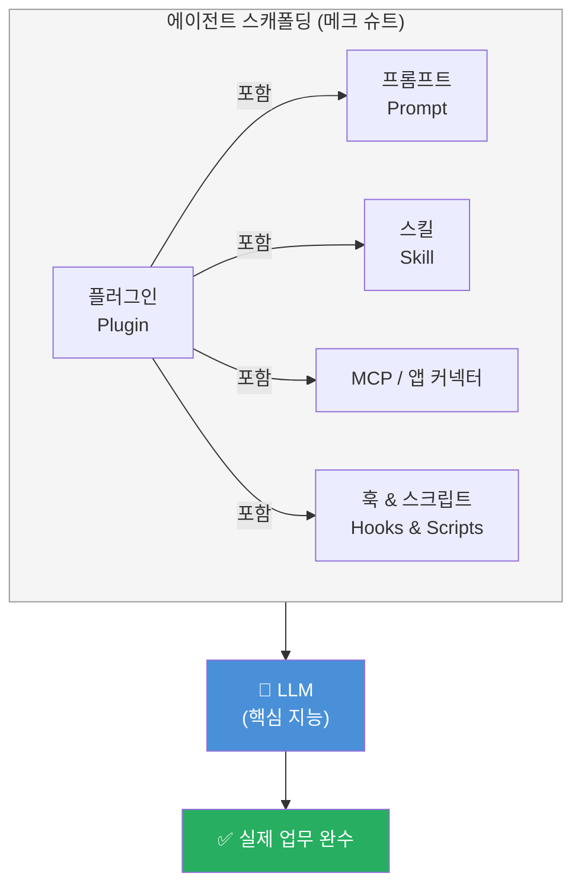
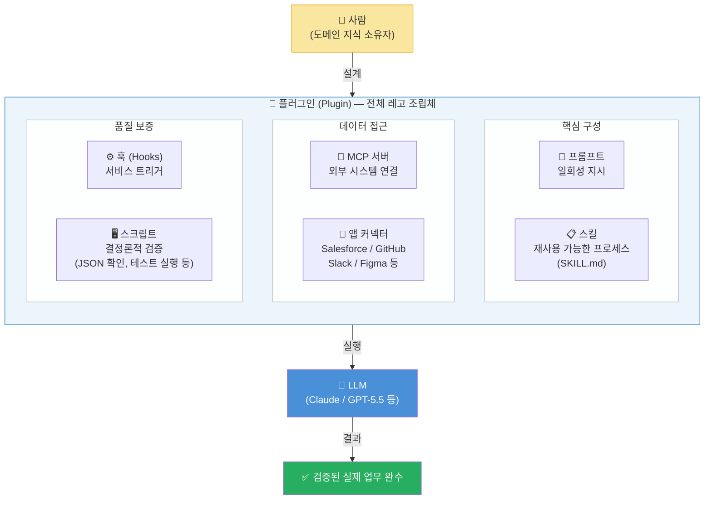
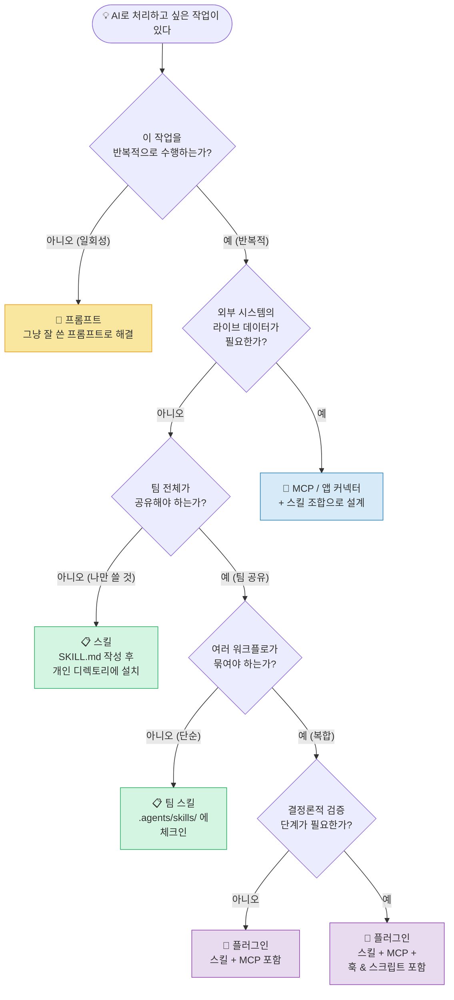
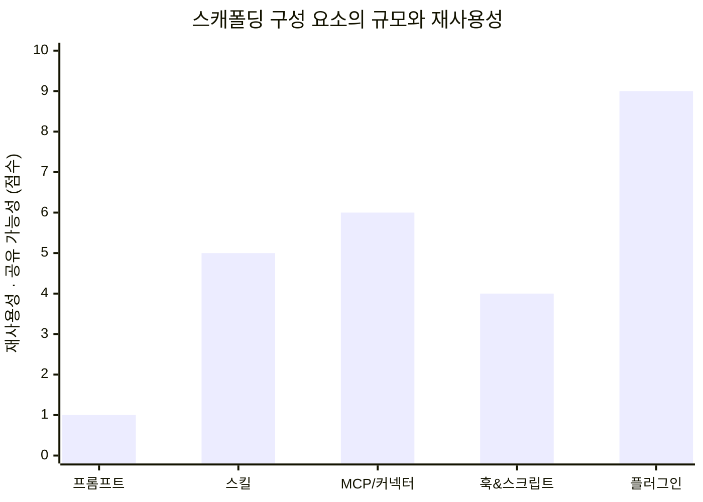
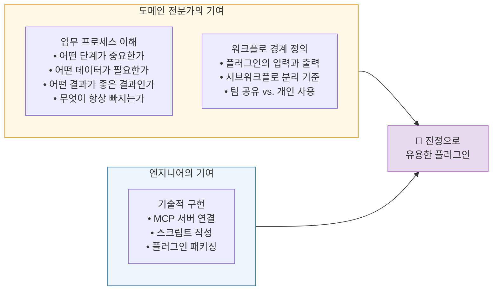
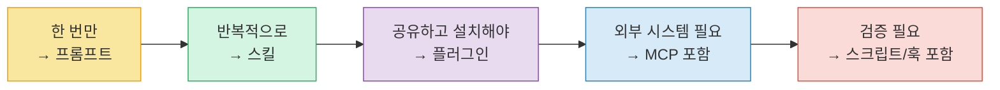

> **원본 영상**: *You're Wasting 40% Of Your AI Time On Something Fixable*  
> **출처**: AI News & Strategy Daily — Nate B Jones  
> **영상 게시일**: 2026년 5월 10일  
> **채널 링크**: https://www.youtube.com/watch?v=647pSnX5H_Y

---

## 들어가며: 왜 지금 이 이야기를 해야 하는가

AI 도구를 진지하게 사용하는 사람이라면 한 번쯤 이런 경험을 했을 것이다. 모델은 분명히 영리한데, 실제로 내가 원하는 결과가 나오지 않는다. 매번 같은 맥락을 다시 설명하고, 같은 지시를 반복하고, 모델이 실수한 부분을 일일이 교정하느라 시간을 낭비한다. 제목이 "당신은 AI 시간의 40%를 고칠 수 있는 문제에 낭비하고 있다"인 이유가 바로 여기에 있다.

Nate B Jones는 이 낭비의 근본 원인을 **에이전트 스캐폴딩(agentic scaffolding)에 대한 무지**로 규정한다. LLM은 영리하지만, 그 자체로는 반복 업무를 처리할 수 없다. 에이전트가 실제로 일을 해내려면 그 주변에 구조물이 필요하다. 그 구조물이 바로 스캐폴딩이며, 스캐폴딩을 이해하지 못하면 아무리 성능 좋은 모델을 써도 사람이 직접 중간자 역할을 떠안게 된다. Nate B Jones는 이 역할을 "휴먼 플러그인(human plugin)"이라고 부른다.

이 문서는 그 핵심 논지를 상세히 정리하고, 2026년 5월 현재 실제로 존재하는 도구들의 상태와 연결하여 그 의미를 입체적으로 분석한다.

---

## 1. 배경: 2026년의 AI 에이전트 지형

### 1.1 GPT-5.5와 "지저분한 멀티파트 작업"

GPT-5.5는 2026년 4월 23일 OpenAI가 공식 출시한 모델이다. OpenAI는 이 모델을 기존의 채팅 완성 모델이 아니라 **에이전트 런타임**으로 포지셔닝했다. 공식 발표에서 OpenAI가 전면에 내세운 문구는 단순한 성능 수치가 아니라 행동 방식이었다. "복잡하고 정리되지 않은 멀티파트 업무를 맡기면, 알아서 계획하고, 도구를 사용하고, 자신의 결과물을 검증하며, 모호함을 헤쳐나가면서 끝까지 완수한다"는 것이다.

벤치마크 수치도 실질적인 변화를 보여준다. Terminal-Bench 2.0에서 82.7%, SWE-Bench Pro에서 58.6%, GDPval(44개 직종의 지식 작업을 측정)에서 84.9%를 기록했다. 더 중요한 것은 이 모델이 GPT-5.4 대비 동일한 Codex 작업을 더 적은 토큰으로 처리한다는 점이다. 즉, 에이전트로서의 효율성이 올라갔다.

바로 이 지점에서 핵심적인 역설이 드러난다. 모델이 이처럼 강력해졌음에도 불구하고, 대부분의 사람들은 여전히 같은 자리에서 맴돌고 있다. 이유는 모델 성능이 부족해서가 아니라, **모델을 둘러싼 구조(스캐폴딩)를 어떻게 설계해야 하는지 모르기 때문**이다.

### 1.2 Codex 플러그인 생태계의 실제 현황

논의의 구체적 예시로는 OpenAI Codex의 플러그인 시스템이 자주 등장한다. 이는 2026년 3월 25일 공식 출시된 기능으로, 스킬·앱 통합·MCP 서버 설정을 하나의 설치 가능한 패키지로 묶은 것이다. 2026년 4월 16일에는 Atlassian Rovo, CircleCI, CodeRabbit, GitLab Issues, Microsoft Suite, Render 등을 포함한 90개 이상의 신규 플러그인이 추가되었다.

Claude Code를 포함한 다른 에이전트 플랫폼들도 동일한 구조를 채택하고 있다. MCP(Model Context Protocol)가 에이전트와 외부 도구를 연결하는 사실상의 표준 인터페이스로 자리잡았으며, Codex·Claude Code·Cursor·Gemini CLI 모두 이를 지원한다. 이 논의는 특정 도구에 국한된 것이 아니라, 이 시대 에이전트 개발의 보편적 패턴을 다루고 있다.

---

## 2. 핵심 은유: LLM의 메크 슈트

스캐폴딩을 이해하는 데 가장 직관적인 비유는 이것이다. LLM은 다스 베이더와 같고, 스캐폴딩은 그의 생명유지 메크 슈트와 같다. 또는 트랜스포머의 금속 외골격처럼, LLM 자체는 지능을 담당하지만 실제 작업을 수행하는 것은 그 주변에 설계된 구조물이라는 것이다.

이 은유가 중요한 이유는, 많은 사람들이 "모델이 더 똑똑해지면 내 문제가 해결될 것"이라고 기대하기 때문이다. 그러나 실제로는 더 나은 메크 슈트를 설계하는 능력이 더 중요하다. 이것을 두고 "우리가 AI를 더 똑똑하게 만드는 큰 부분"이라는 표현이 쓰인다. 결코 모델에게 책임을 전가하는 것이 아니라, 사람이 스캐폴딩 설계에 참여해야 한다는 뜻이다.



---

## 3. 스캐폴딩의 지도: 다섯 가지 계층

이 논의의 핵심 기여는 에이전트 스캐폴딩을 구성하는 요소들을 명확한 언어로 분류하고 각각의 용도를 정의한다는 점이다. 혼용되기 쉬운 개념들에 경계를 그어준다.

### 3.1 프롬프트 (Prompt): 단발성 요청의 도구

프롬프트는 가장 기본적인 단위다. 특정 순간에 특정 질문을 던지는 텍스트 입력이다. 2026년 기준으로 프롬프트의 적절한 용도는 매우 명확하게 정의된다. **한 번만 할 일, 일시적인 일, 그 순간에 매우 특정적인 일**이라면 프롬프트로 충분하다.

그러나 프롬프트는 여러 가지 한계를 가진다. 도구를 함께 실어 나르지 못하고, 권한을 포함하지 못하며, 반복 가능한 워크플로를 패키지화하지 못한다. 팀원들과 쉽게 공유하기도 어렵다. 가장 심각한 문제는 사람들이 반복적으로 해야 하는 일을 계속 프롬프트로 처리하면서 매번 동일한 맥락을 다시 입력하느라 엄청난 시간을 낭비한다는 것이다.

요점은 간명하다. "실제 작업은 프롬프트 안에 살지 않는다." 그렇다면 어디에 살고 있는가? 다음 계층들에 있다.

**프롬프트가 적합한 경우:**
- 클라이언트에게 보내는 복잡한 단발성 메모
- 특정 상황에 맞춘 일회성 분석
- 아직 패턴이 형성되지 않은 실험적 시도

### 3.2 스킬 (Skill): 하우스 스타일을 가르치다

스킬은 특정 LLM에게 팀의 특정 업무 방식을 가르치는 재사용 가능한 지침이다. 기술적으로는 마크다운 문서 하나다. 하지만 그 의미는 훨씬 크다. 팀의 코드 리뷰 방식, 마케팅 문서 작성 방식, 고객 서비스 응대 방식 등 반복적으로 수행하는 모든 프로세스를 명확하게 기술한 것이 스킬이다.

스킬의 핵심적인 특성은 두 가지다. 첫째, 어떤 LLM을 사용하든 동일하게 적용할 수 있다. Claude Code든 Codex든 스킬 파일은 범용적으로 작동한다. 둘째, 스킬을 작성하는 데 엔지니어링 지식이 필요하지 않다. 팀의 업무를 가장 잘 이해하는 사람이 작성할 수 있다.

실제로 OpenAI Codex 문서는 스킬을 `SKILL.md` 파일로 정의하며, `~/.agents/skills/`(개인용)나 `.agents/skills/`(팀 공유)에 저장할 수 있다고 명시한다. 스킬 디렉토리에는 선택적으로 `scripts/` 폴더를 포함할 수 있어, 시드 데이터 생성이나 검증 실행 같은 CLI 스크립트를 묶을 수 있다.

판단 기준은 간단하다. "한 번만 하는 일이면 프롬프트, 반복해서 다시 호출하고 싶은 것이면 스킬."

**스킬이 적합한 경우:**
- 특정 스타일의 콜드 아웃바운드 이메일을 다수 발송해야 할 때
- 팀의 PR 리뷰 기준을 항상 일관되게 적용하고 싶을 때
- 마케팅 문서의 단락 구조와 톤을 표준화하고 싶을 때

### 3.3 플러그인 (Plugin): 워크플로 전체를 패키지화하다

플러그인은 스캐폴딩 계층 중 가장 오해가 많은 개념이다. 많은 사람들이 앱 스토어의 확장 프로그램 정도로 이해하는데, 이것은 플러그인의 실제 가치를 심각하게 과소평가하는 시각이다.

플러그인은 스킬·앱 통합·MCP 서버·훅·스크립트·에셋·명령어·메타데이터를 하나로 묶은 설치 가능한 워크플로 패키지다. "워크플로 전체에 이름을 붙이고 팀이 한 번에 설치할 수 있게 만든 것"이다.

Codex의 공식 플러그인 구조를 보면 이 개념이 더 명확해진다. 플러그인은 `plugin.json` 매니페스트와 함께 스킬 파일, 앱 매핑, MCP 서버 설정, 에셋을 하나의 폴더 구조 안에 담는다.

```
my-plugin/
  .codex-plugin/
    plugin.json      ← 필수: 플러그인 매니페스트
  skills/            ← 선택: 패키지된 스킬들
  .app.json          ← 선택: 앱/커넥터 매핑
  .mcp.json          ← 선택: MCP 서버 설정
  assets/            ← 선택: 아이콘, 로고 등
```

플러그인을 이해하는 핵심 질문은 이것이다. "내 작업 중에서 에이전트가 상속받아 사용할 수 있을 만큼 반복 구조가 충분한 부분이 어디인가? 그리고 팀 전체가 같이 쓰고 싶은 부분이 어디인가?"

**플러그인이 적합한 경우:**
- 주간 비즈니스 보고서를 위해 스프레드시트·Slack·문서·대시보드·과거 보고서를 취합해야 할 때
- 구매자 정보를 Salesforce에서 실시간으로 끌어와서 개인화된 이메일을 보내야 할 때
- 고객 성공팀의 환불 처리, 계정 활성화, 업그레이드 안내 각각을 별도 플러그인으로 분리할 때

주목해야 할 중요한 함정이 있다. 플러그인을 "너무 크게" 만들려는 유혹이다. 고객 성공 전체를 하나의 플러그인으로 묶으면 기술적으로는 작동할지 몰라도, 한 플러그인이 너무 많은 역할을 떠맡게 된다. 좋은 워크플로는 명확한 경계를 가진다. 경계를 정의하는 능력이 2026년에 매우 가치 있는 스킬이다.

### 3.4 MCP와 앱 커넥터: 살아있는 데이터에 접근하다

MCP(Model Context Protocol)와 앱 커넥터는 에이전트가 실제 업무가 살아 숨쉬는 시스템에 접근하는 방법이다. Salesforce에서 고객 데이터를 끌어오거나, GitHub에서 코드 변경 사항을 확인하거나, Figma에서 디자인 언어를 읽어오는 것이 바로 MCP 커넥터가 하는 일이다.

이것을 "유니버설 플러그"로 비유하면 이해하기 쉽다. 마치 예전에 인터넷에 직접 케이블을 연결하던 것처럼, MCP는 라이브 데이터가 있는 곳에 꽂아서 데이터를 가져오는 표준 인터페이스다.

중요한 구분이 있다. 플러그인과 MCP를 혼동하는 사람이 많지만, MCP는 플러그인의 구성 요소 중 하나일 뿐이다. 플러그인은 MCP를 포함하지만, MCP만으로 이루어지지 않는다. 플러그인은 라이브 데이터를 가져온 후에 그것으로 무엇을 할지까지 정의하는 더 큰 패키지다.

실제 현황으로는, 2026년 현재 대부분의 주요 SaaS 도구들이 자체 MCP 서버를 적극적으로 구축하고 있다. Atlassian Rovo, GitHub, Slack, Google Drive, Figma, Linear 등이 공식 MCP 서버를 제공한다. 직접 MCP를 만들 필요 없이 이미 만들어진 것을 가져다 쓰는 시대가 되었다.

### 3.5 훅과 스크립트: 모델에게 맡기지 말아야 할 것들

훅과 스크립트는 스캐폴딩에서 가장 덜 이해된 요소이면서도, 실제 프로덕션 품질의 에이전트 워크플로를 만드는 데 결정적으로 중요하다. 에이전트 설계의 핵심 원칙 중 하나가 바로 이것이다. "모델이 주의를 기울이는 것에 의존해서는 안 되는 워크플로의 부분들"을 위해 훅과 스크립트가 존재한다.

코드 포맷팅이 필요하다면 포매터를 실행해야 한다. 모델에게 "포맷을 맞춰줘"라고 부탁하는 것이 아니다. 스키마 검증이 필요하다면 실제로 스키마를 검증해야 한다. 테스트가 통과해야 한다면 실제로 테스트를 돌려야 한다. 생성된 파일이 올바른 JSON 구조를 가져야 한다면 실제로 확인해야 한다.

이것을 **결정론적(deterministic)** 처리라고 부른다. 어떤 행위들은 확률적인 LLM 추론에 맡기면 안 된다. 항상 같은 결과를 보장해야 하는 단계는 반드시 코드로 고정되어야 한다.

훅과 스크립트가 플러그인의 구성 요소로 포함될 수 있다는 점이 중요하다. 워크플로의 결정론적 검증 단계를 플러그인 안에 내장할 수 있다.

---

## 4. 전체 아키텍처: 레고 브릭 모델

가장 강력한 프레이밍 중 하나는 이 모든 구성 요소를 **경쟁하는 도구들이 아니라 레고 브릭들**로 이해하라는 것이다. 각 요소는 서로 대체재가 아니라 보완재다.



플러그인이 레고 완성품이라면, 스킬·MCP·훅·스크립트·프롬프트는 각각의 레고 브릭이다. 그리고 어떤 것은 완성품(플러그인)으로 만들 필요가 없을 수도 있다. 레고 브릭 하나(스킬)만으로도 충분할 때가 있고, 아예 레고가 필요 없는 경우도 있다.

---

## 5. 결정 프레임워크: 무엇을 어디에?

판단 기준은 놀랍도록 명확하다.



---

## 6. 규모별 계층 비교

다섯 가지 구성 요소를 규모, 재사용성, 공유 가능성의 축으로 비교하면 다음과 같다.



| 구성 요소 | 규모 | 재사용성 | 팀 공유 | 라이브 데이터 | 결정론적 처리 |
|---|---|---|---|---|---|
| 프롬프트 | 최소 | 없음 (일회성) | 어려움 | 불가 | 불가 |
| 스킬 | 소형 | 높음 | 가능 | 불가 | 선택적 |
| MCP/커넥터 | 중형 | 높음 | 가능 | **핵심** | 불가 |
| 훅 & 스크립트 | 소형~중형 | 중간 | 가능 | 불필요 | **핵심** |
| 플러그인 | **최대** | **최고** | **최우선** | 포함 가능 | 포함 가능 |

---

## 7. 앱 스토어 비유의 한계

특히 날카로운 비판이 가해지는 지점이 있다. 바로 플러그인을 앱 스토어의 앱처럼 이해하는 시각이다.

앱 스토어 비유가 틀린 것은 아니다. 그러나 그 비유가 만들어내는 행동 패턴이 잘못되었다. 앱 스토어에서는 수동적으로 쇼핑한다. 무엇이 있는지 둘러보고 마음에 드는 것을 설치한다. 그 결과 가장 중요한 질문을 놓치게 된다.

올바른 질문은 이것이다. "내 업무 중에서 에이전트가 상속받아 반복적으로 사용할 수 있을 만큼 충분히 구조화된 부분이 어디인가?"

이 질문을 던지는 순간, 사람들은 자신의 업무를 능동적으로 분석하기 시작한다. 어떤 부분이 반복적인가? 어떤 부분이 팀 전체가 일관되게 따라야 하는가? 어떤 부분에서 실수가 발생하면 안 되는가? 이런 분석이 선행되어야 진정으로 유용한 플러그인이 탄생한다.

실제 사례가 인상적이다. 한 편집자가 텍스트의 거칠고 비일관된 부분을 찾아주는 편집 리뷰 플러그인을 비엔지니어 신분으로 직접 구축했다. 특정 내용 출처를 참조하고, 텍스트를 세 가지 방식으로 읽으며, 특정 유형의 코멘트를 달아야 한다는 것이 명시된 워크플로였다. 이것이 바로 단순한 스킬을 넘어서 플러그인이 필요한 경우다.

---

## 8. 도메인 전문가의 역할: 비엔지니어의 시대

가장 중요한 메시지 중 하나는 **도메인 지식 소유자가 스캐폴딩 설계에 직접 참여해야 한다**는 것이다. 2022년까지는 이 영역이 엔지니어의 전유물이었다. 그러나 2026년에는 그 경계가 의미 있게 낮아졌다.

이유는 간단하다. 무엇이 좋은 결과물인지, 어떤 단계가 항상 빠지는지, 어떤 데이터 소스가 중요한지를 가장 잘 아는 사람은 그 업무를 실제로 수행해 온 사람이기 때문이다. 엔지니어는 스캐폴딩의 기술적 구현을 도울 수 있지만, 워크플로의 경계와 내용은 도메인 전문가가 정의해야 한다.

특별히 가치 있다고 지목되는 능력이 있다. 워크플로를 보고 "여기가 경계다. 이 안에 이것이 들어가고, 저것이 나온다"라고 명확하게 정의할 수 있는 능력. 그 경계를 플러그인으로 전환하는 능력. 이것이 2026년에 실질적으로 높은 가치를 지닌 스킬이다.



---

## 9. 실용적인 권력 법칙: 20%의 스킬이 80%의 가치

스킬 관리에 관한 실용적인 경고도 있다. 스킬의 개념을 이해한 사람들이 빠지는 함정은 너무 많은 스킬을 만드는 것이다. 스킬이 쌓이면 어떤 스킬이 어떤 용도인지 추적하기 어려워진다.

해결책은 **파레토 원칙의 적용**이다. 전체 스킬의 20%가 전체 가치의 80%를 만들어낸다. 따라서 진짜 중요한 20%를 찾는 것이 핵심이다. 그 20%의 기준은 세 가지다.

첫째, 자주 반복된다. 둘째, 결과의 품질에 민감하다(잘못되면 큰 문제가 생긴다). 셋째, 일관성이 중요하다(사람에 따라 다르게 하면 안 된다).

이 세 기준을 모두 충족하는 업무에 스킬을 작성하고, 그 스킬이 충분히 성숙해지면 팀 공유용 플러그인으로 패키징하는 것이 바람직하다.

---

## 10. 경영진에게 전달해야 할 메시지

흥미롭게도, 논의의 후반부는 경영진, 특히 CTO가 아닌 임원들을 청중으로 직접 겨냥한다. 많은 조직에서 기술 스캐폴딩에 대한 이해가 없는 경영진이 "왜 AI를 더 적극적으로 쓰지 않느냐"고 압박하는 상황이 발생한다. 그러나 실무자들은 "나는 AI를 쓰고 있다. 다만 결정론적 스크립트가 마지막에 필요하다"고 답한다.

이 대화가 엇갈리는 이유는 스캐폴딩에 대한 공통 언어가 없기 때문이다. 이 언어를 조직 전체가 공유해야 한다는 점이 강조된다. 특히 AI 트랜스포메이션(AX)을 추진하는 조직에서, 스캐폴딩에 대한 이해는 기술팀의 내부 지식이 아니라 조직 전체의 공통 어휘가 되어야 한다.

---

## 11. 핵심 요약: 한 문장으로 정리하는 다섯 가지

다섯 가지 원칙을 한 문장씩 정리하면 다음과 같다.

스크립트는 매번 예측 가능하고 결정론적인 작업을 처리한다. 스킬은 LLM이 명확하고 팀 전체가 일관되게 공유할 수 있는 방식으로 프로세스를 따르도록 한다. 프롬프트는 일회성 작업에 여전히 유효하고, 2025년에 프롬프팅 능력을 키운 것은 충분히 가치 있는 투자였다. 플러그인은 스킬·스크립트·프롬프트의 중요한 부분과 MCP 커넥터를 하나로 묶은 번들이다. 그리고 모든 것을 플러그인으로 만들 필요는 없다. 어떤 것은 프롬프트로 남겨두고, 어떤 것은 스킬로 충분하며, 어떤 것은 사람의 판단에 남겨두어야 한다.



---

## 맺음말: 2026년의 레버리지는 어디에 있는가

반복해서 강조되는 핵심은 **2026년의 AI 레버리지는 모델 성능이 아니라 스캐폴딩 설계에 있다**는 것이다. GPT-5.5가 Terminal-Bench 2.0에서 82.7%를 기록하든, Claude Opus 4.7이 소프트웨어 엔지니어링 벤치마크에서 앞서든, 그 모델의 성능을 실제 반복 가능한 업무로 전환하는 것은 스캐폴딩이다.

스캐폴딩을 설계하는 능력은 더 이상 엔지니어만의 영역이 아니다. 워크플로를 이해하는 사람, 좋은 결과가 무엇인지 아는 사람, 어떤 단계가 항상 빠지는지 경험적으로 아는 사람이라면 누구든 이 역할을 할 수 있다. 그것이 이 논의가 전달하려는 핵심 메시지이며, 동시에 2026년 AI 업무 혁신의 현실적인 입구다.

---

*작성일: 2026년 5월 10일*
