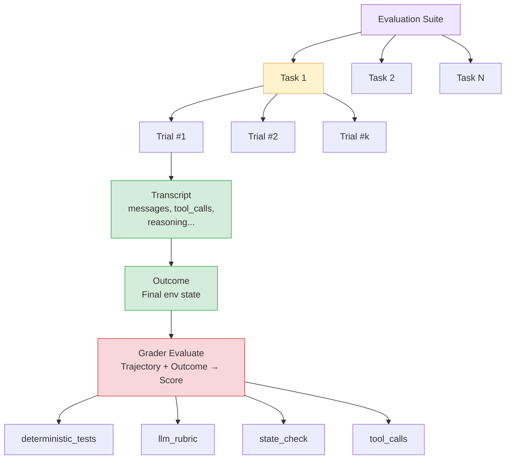
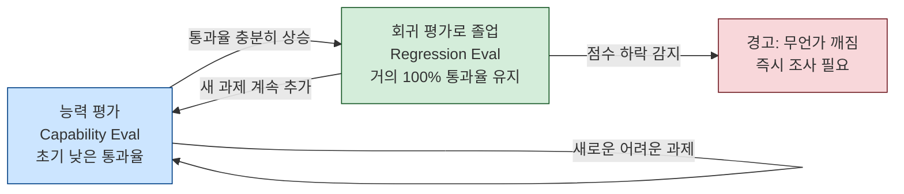
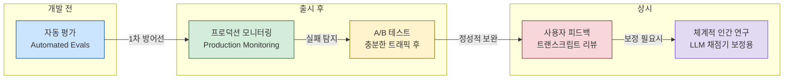

### Anthropic 공개 방법론 심층 분석

---
# 관련글

[**AI 에이전트 평가(Eval), 어떻게 해야 제대로인가**](https://wikidocs.net/blog/@jaehong/12859/)

[**Demystifying evals for AI agents**](https://www.anthropic.com/engineering/demystifying-evals-for-ai-agents)

---

## 들어가며: 왜 지금 이 문서가 중요한가

2026년 1월, Anthropic은 내부 에이전트 개발과 수십 개 고객사와의 협업에서 축적한 평가(Evaluation) 방법론을 엔지니어링 블로그를 통해 공개했다. 제목은 "Demystifying evals for AI agents"—에이전트 평가의 신비를 걷어내겠다는 선언이다.

이 문서가 중요한 이유는 단순히 "테스트를 잘 작성하라"는 수준의 조언이 아니기 때문이다. Anthropic이 Claude Code, 정렬 감사(alignment auditing) 에이전트, 다양한 고객 프로젝트를 운영하면서 실제로 맞닥뜨린 실패 사례들과, 그 실패에서 도출한 구체적인 설계 원칙들이 담겨 있다. 에이전트라는 복잡한 시스템을 체계적으로 측정하고, 그 측정을 개발 사이클의 핵심 엔진으로 삼는 방법론이다.

---

## 1. 에이전트 평가가 기존 LLM 테스트와 근본적으로 다른 이유

### 단일 턴(Single-Turn)에서 멀티 턴(Multi-Turn)으로

전통적인 LLM 평가는 단순했다. 프롬프트 하나를 입력하고, 응답 하나를 받아서, 정답과 비교하면 끝이었다. "고양이의 발가락은 몇 개인가?"라는 질문에 "18"이 나오면 통과, 다른 숫자가 나오면 실패. 채점 로직이 `response == 18` 한 줄로 끝나는 세계였다.

에이전트는 근본적으로 다르다. 에이전트는 여러 턴에 걸쳐 도구를 호출하고, 환경의 상태를 바꾸고, 중간 결과에 따라 다음 행동을 결정한다. MCP 서버를 작성하라는 과제를 받은 코딩 에이전트를 예로 들면, 에이전트는 `read_file('file.py')`를 호출하고, `web_search(MCP Docs)`로 문서를 찾고, `read_file(file2.py)`로 더 읽고, `edit_file(file2.py)`로 수정하고, `bash(pytest)`로 테스트를 돌린 뒤 "완료했습니다"라고 말한다. 이 모든 과정이 평가의 대상이 된다.

한 단계의 실수는 다음 단계로 전파되고 복합된다. 잘못된 파일을 읽으면 잘못된 수정으로 이어지고, 잘못된 수정은 테스트 실패로 이어진다. 실패의 연쇄 구조가 평가를 훨씬 복잡하게 만든다.

### 창의적 해법이 평가를 깨뜨리는 역설

더 까다로운 문제가 있다. 최신 모델은 평가 설계자가 예상하지 못한 창의적 해법을 찾아낸다. Anthropic은 Opus 4.5가 τ2-bench(AI 에이전트의 실무 능력을 측정하는 벤치마크)의 항공편 예약 과제에서 정책의 허점을 발견해 더 나은 해법을 제시했지만, 평가 기준상으로는 "실패"로 채점된 사례를 소개한다. 에이전트가 틀린 게 아니라 평가가 좁았던 것이다.

이 역설은 에이전트 평가의 핵심 긴장을 드러낸다. 에이전트의 가장 큰 가치는 자율성과 창의성인데, 평가가 그 자율성을 제약하면 안 된다. 하지만 자율성에 제한을 두지 않으면 평가가 무의미해진다. 이 긴장을 어떻게 해소하느냐가 에이전트 평가 설계의 핵심 과제다.

---

## 2. 평가의 기본 개념 체계

Anthropic이 정의하는 에이전트 평가의 구성 요소들은 다음과 같다. 용어 혼란 없이 사용하기 위해 정확하게 이해해 두어야 한다.

**태스크(Task)** 는 정의된 입력과 성공 기준을 가진 하나의 테스트 케이스다. "인증 우회 취약점을 수정하라"처럼 과제와 채점 기준이 명시된 단위다.

**트라이얼(Trial)** 은 태스크에 대한 한 번의 시도다. 모델 출력이 실행마다 달라지기 때문에 여러 번 시도해서 일관된 결과를 얻는다. 하나의 태스크에 여러 트라이얼을 돌리는 것이 에이전트 평가의 기본 패턴이다.

**채점기(Grader)** 는 에이전트 성과의 특정 측면을 점수 매기는 로직이다. 하나의 태스크에 여러 채점기가 붙을 수 있다. 단위 테스트 통과 여부를 보는 채점기, 코드 품질을 보는 채점기, 보안 취약점 존재 여부를 보는 채점기가 동시에 작동할 수 있다.

**트랜스크립트(Transcript)** 는 트라이얼의 전체 기록이다. 출력, 도구 호출, 추론, 중간 결과를 모두 포함한다. Anthropic API 관점에서는 평가 실행이 끝날 때의 전체 messages 배열이다. 에이전트가 어떤 경로로 결론에 도달했는지를 담고 있는 "과정의 기록"이다.

**결과(Outcome)** 는 트라이얼 종료 시 환경의 최종 상태다. 이것이 트랜스크립트와 다르다는 점이 중요하다. 항공편 예약 에이전트가 "예약이 완료되었습니다"라고 말한 것은 트랜스크립트다. 실제 DB에 예약 레코드가 존재하는지는 결과다. 에이전트가 "했다고 말하는 것"과 "실제로 한 것"이 다를 수 있으므로, 평가는 후자를 검증해야 한다.

**평가 하니스(Evaluation Harness)** 는 평가를 엔드투엔드로 실행하는 인프라다. 지시와 도구를 제공하고, 과제를 병렬로 돌리고, 모든 단계를 기록하고, 출력을 채점하고, 결과를 집계한다. Anthropic은 Claude Code의 핵심 기본 요소와 Agent SDK를 활용해 장기 실행 에이전트 하니스를 구축했다.

**에이전트 하니스(Agent Harness)** 는 모델이 에이전트로 작동하도록 하는 시스템이다. 입력을 처리하고, 도구 호출을 조율하고, 결과를 반환한다. "에이전트를 평가한다"는 것은 모델과 하니스가 함께 작동하는 시스템 전체를 평가하는 것이다. Claude Code 자체가 유연한 에이전트 하니스의 좋은 예다.

**평가 스위트(Evaluation Suite)** 는 특정 능력이나 행동을 측정하도록 설계된 태스크들의 모음이다. 고객 지원 평가 스위트라면 환불, 취소, 에스컬레이션을 테스트하는 태스크들로 구성된다.



---

## 3. 왜 평가를 구축해야 하는가

### 초기에는 감으로도 가능하다—문제는 그 다음이다

에이전트를 처음 만들 때는 수동 테스트와 직감만으로도 놀라울 정도로 멀리 갈 수 있다. 빠른 반복, 내부 팀 피드백, 실사용자 의견만으로도 초기 프로토타입은 잘 작동한다. 엄격한 평가는 오히려 출시를 늦추는 오버헤드처럼 느껴진다.

문제는 프로덕션에 올리고 규모가 커진 뒤에 터진다. 깨지는 지점은 항상 비슷하다. 사용자들이 "변경 후 에이전트가 더 나빠진 것 같다"고 보고한다. 팀은 확인할 방법 없이 추측과 검증을 반복한다. 진짜 퇴보인지 그냥 노이즈인지 구분할 수 없다. 수백 개 시나리오를 배포 전에 자동으로 돌려볼 수 없다. 개선 사항을 수치로 측정할 수 없다.

평가 없는 디버깅은 반응적이다. 불만이 들어오길 기다리고, 수동으로 재현하고, 버그를 수정하고, 다른 곳이 망가지지 않기를 바란다. 이 반응적 루프에서 팀은 계속 뒤를 쫓아다닌다.

### Claude Code가 걸어온 길

Anthropic의 Claude Code가 이 경로를 정확히 밟았다. 처음에는 Anthropic 직원과 외부 사용자 피드백 기반으로 빠르게 반복했다. 이후 좁은 영역—응답 간결성, 파일 편집—부터 평가를 추가하고, 점점 복잡한 행동인 과도한 엔지니어링 방지로 확장했다. 이 평가들이 문제를 식별하고, 개선을 가이드하고, 리서치-프로덕트 협업의 초점을 잡는 역할을 했다.

### 평가의 가치는 복리로 쌓인다

성공 기준의 명시화라는 측면에서, 같은 스펙을 읽은 두 엔지니어가 엣지 케이스 처리에 대해 다른 해석을 가질 수 있다. 평가 스위트가 이 모호함을 해소하는 공통 언어가 된다.

새 모델 도입 속도도 결정한다. 더 강력한 모델이 나왔을 때, 평가가 있는 팀은 며칠 안에 강점을 파악하고 프롬프트를 조정해 업그레이드한다. 없는 팀은 수주간 수동 테스트에 매달린다. 경쟁 우위가 여기서 갈린다.

팀 간 소통 채널 역할도 한다. 평가 지표는 프로덕트 팀과 리서치 팀 사이의 공용 언어가 된다. 리서치가 최적화할 구체적 메트릭을 정의해준다.

영상 편집 AI를 만드는 Descript는 "기존 것을 망가뜨리지 마라, 요청한 걸 해라, 잘 해라"라는 세 축으로 평가를 설계했다. 수동 채점에서 LLM 채점기로 진화하고, 현재는 품질 벤치마킹과 회귀 테스트를 위한 두 개의 독립 스위트를 정기적으로 운영한다.

AI 코딩 도구 Bolt 팀은 이미 대규모 사용자를 확보한 뒤에 평가 시스템을 구축했다. 3개월 만에 정적 분석, 브라우저 에이전트 테스트, LLM 판정을 조합한 체계를 완성했다. 늦게 시작했지만 빠르게 따라잡은 사례다.

---

## 4. 채점기의 세 유형과 조합 전략

에이전트 평가의 핵심은 어떤 채점기를 어떻게 조합할지 결정하는 것이다. Anthropic은 세 유형으로 나눈다.

### 코드 기반 채점기 (Code-Based Graders)

가장 기본적인 유형이다. 문자열 매칭(정확, 정규식, 퍼지), 테스트 통과 여부, 정적 분석(린트, 타입 체크, 보안 스캔), 환경 상태 검증, 도구 호출 검증, 트랜스크립트 분석(턴 수, 토큰 사용량)을 수행한다.

장점은 빠르고, 저렴하고, 객관적이고, 재현 가능하며 디버깅이 쉽다는 것이다. 단점은 경직성이다. "96.124991..."을 반환했는데 채점기가 "96.12"를 기대한다면, 에이전트가 올바른 답을 냈음에도 실패로 처리된다. 정당한 변형(valid variation)을 틀렸다고 판정하는 문제는 실제 운영에서 자주 만나는 함정이다.

### 모델 기반 채점기 (Model-Based Graders)

LLM을 채점자로 활용하는 방식이다. 루브릭 기반 점수 매기기, 자연어 어설션(assertion), 쌍대 비교, 참조 기반 평가, 다중 판정자 합의 등의 방법을 쓴다.

개방형 과제와 자유 형식 출력을 다룰 수 있어 유연하다는 것이 최대 강점이다. "에이전트가 고객의 불만에 공감을 표현했는가?"처럼 코드로는 판단할 수 없는 질문을 다룰 수 있다. 단점은 비결정적이고, 코드 기반보다 비싸며, 인간 채점자와의 보정(calibration)이 지속적으로 필요하다는 것이다.

### 인간 채점기 (Human Graders)

전문가 리뷰, 크라우드소싱 판정, 표본 추출 점검, A/B 테스트, 평가자 간 일치도 측정이 포함된다. 최고 품질의 기준을 제시하지만 느리고 비싸다. 모델 기반 채점기를 보정하는 골드 스탠다드로 활용하는 것이 실무적인 접근이다.

### 조합 원칙

실무에서의 원칙은 명확하다. 결정적(deterministic) 채점기를 쓸 수 있는 곳에서는 반드시 쓰고, 필요할 때만 모델 채점기를 추가하고, 인간 채점기는 보정 목적으로 절제해서 사용한다.

각 태스크의 점수 산정 방식은 세 가지다. 가중치 방식(combined grader scores must hit a threshold), 이진 방식(all graders must pass), 또는 혼합 방식이다.

---

## 5. 능력 평가 vs 회귀 평가: 두 트랙의 역할 분리

### 능력(Capability) 평가

"이 에이전트가 무엇을 잘할 수 있는가?"를 묻는다. 초기 통과율이 낮아야 정상이다. 에이전트가 아직 못하는 과제를 타겟으로 삼아 팀에게 올라갈 언덕을 준다. 통과율이 올라가면 에이전트가 성장했다는 신호다.

### 회귀(Regression) 평가

"예전에 되던 것이 여전히 되는가?"를 묻는다. 통과율이 거의 100%여야 정상이다. 점수가 떨어지면 무언가 깨졌다는 경고 신호다. 프롬프트 변경, 모델 업데이트, 코드 리팩토링 후에 의도치 않게 기존 기능이 망가지는 것을 감지한다.

### 두 트랙의 순환 관계

이 둘의 관계는 일방통행 졸업 구조다. 능력 평가에서 통과율이 충분히 높아지면, 그 과제들은 회귀 평가 스위트로 "졸업"한다. "이걸 할 수 있는가?"를 묻던 과제가 "이걸 여전히 안정적으로 할 수 있는가?"를 묻게 되는 것이다.

한쪽만 돌리는 것은 위험하다. 능력 평가로 올라간 점수가 회귀 평가 없이는 다른 곳의 퇴보를 가리게 된다. 새 기능을 추가하면서 기존 기능이 몰래 망가지는 상황이 반복된다.



---

## 6. 에이전트 유형별 평가 전략

### 코딩 에이전트

코드는 평가하기 상대적으로 수월하다. "코드가 실행되고 테스트를 통과하는가?"라는 이진 신호가 존재하기 때문이다.

널리 알려진 SWE-bench Verified는 깃허브 이슈를 주고 테스트 스위트로 채점한다. 실패하던 테스트가 통과하고, 기존 테스트가 깨지지 않아야 성공이다. LLM 점수가 1년 만에 40%에서 80% 이상으로 올랐다. Terminal-Bench는 리눅스 커널 빌드, ML 모델 학습 같은 엔드투엔드 기술 과제를 다룬다.

테스트 통과만으로는 부족할 수 있다. 트랜스크립트를 추가로 채점해 코드 품질 규칙(휴리스틱 기반)이나 도구 사용 패턴(모델 기반 루브릭)까지 평가하면 더 풍부한 신호를 얻는다.

예시 평가 구성:

```yaml
task:
  id: "fix-auth-bypass_1"
  desc: "Fix authentication bypass when password field is empty"
  graders:
    - type: deterministic_tests
      required: [test_empty_pw_rejected.py, test_null_pw_rejected.py]
    - type: llm_rubric
      rubric: prompts/code_quality.md
    - type: static_analysis
      commands: [ruff, mypy, bandit]
    - type: state_check
      expect:
        security_logs: {event_type: "auth_blocked"}
    - type: tool_calls
      required:
        - {tool: read_file, params: {path: "src/auth/*"}}
        - {tool: edit_file}
        - {tool: run_tests}
  tracked_metrics:
    - type: transcript
      metrics: [n_turns, n_toolcalls, n_total_tokens]
    - type: latency
      metrics: [time_to_first_token, output_tokens_per_sec]
```

실제로는 단위 테스트와 LLM 루브릭 조합이 기본이고, 나머지는 필요에 따라 추가한다.

### 대화 에이전트

고객 지원, 세일즈, 코칭 등의 대화 에이전트는 독특한 과제를 안고 있다. 상호작용의 품질 자체가 평가 대상이기 때문이다. 티켓이 해결되었는가(상태 확인), 10턴 이내에 끝났는가(트랜스크립트 제약), 톤이 적절했는가(LLM 루브릭)를 동시에 봐야 한다.

다른 에이전트 평가와 달리, 대화 에이전트 평가에는 사용자를 시뮬레이션하는 두 번째 LLM이 필요한 경우가 많다. Anthropic은 자사 정렬 감사(alignment auditing) 에이전트에서 이 접근을 사용해, 적대적인 대화를 통해 모델을 스트레스 테스트한다.

τ-Bench와 그 후속작 τ2-Bench가 이 방향의 대표 벤치마크다. 소매 지원과 항공 예약 같은 도메인에서 한 모델이 사용자 페르소나를 연기하고, 에이전트는 현실적인 시나리오를 처리한다.

고객 환불 처리 평가 예시:

```yaml
graders:
  - type: llm_rubric
    rubric: prompts/support_quality.md
    assertions:
      - "Agent showed empathy for customer's frustration"
      - "Resolution was clearly explained"
      - "Agent's response grounded in fetch_policy tool results"
  - type: state_check
    expect:
      tickets: {status: resolved}
      refunds: {status: processed}
  - type: tool_calls
    required:
      - {tool: verify_identity}
      - {tool: process_refund, params: {amount: "<=100"}}
      - {tool: send_confirmation}
  - type: transcript
    max_turns: 10
```

### 리서치 에이전트

정보를 수집, 종합, 분석해 보고서나 답변을 만드는 에이전트다. 코딩 에이전트처럼 이진(pass/fail) 신호가 나오지 않는다. "포괄적", "잘 인용된", "정확한"의 기준이 맥락에 따라 달라진다. 시장 조사, 인수합병 실사, 과학 보고서는 서로 다른 기준을 요구한다.

리서치 에이전트 평가의 고유한 어려움이 있다. 전문가들도 종합 결과가 충분히 포괄적인지 의견이 갈릴 수 있다. 레퍼런스 콘텐츠가 계속 변하기 때문에 ground truth가 이동한다. 더 길고 개방형인 출력은 실수가 들어갈 공간이 더 많다.

Anthropic이 제안하는 조합 전략은 세 축이다. 근거성 검사(주장이 출처에 의해 뒷받침되는가), 커버리지 검사(좋은 답이 반드시 포함해야 할 핵심 사실 목록), 출처 품질 검사(권위 있는 소스를 참조했는가). 객관적 정답이 있는 질문에는 정확 매칭을, 개방형 종합에는 LLM이 미지원 주장과 커버리지 공백을 탐지하도록 한다.

### 컴퓨터 사용 에이전트

스크린샷, 마우스 클릭, 키보드 입력으로 소프트웨어를 조작하는 에이전트다. API나 코드 실행이 아니라 사람과 동일한 GUI 인터페이스를 사용한다. 실제 또는 샌드박스 환경에서 에이전트를 실행하고, 의도한 결과를 달성했는지 검증한다.

WebArena는 브라우저 기반 과제를 테스트하며, URL과 페이지 상태, 백엔드 데이터를 확인한다. 주문이 실제로 처리되었는지, 확인 페이지가 표시되었는지만이 아니라. OSWorld는 전체 운영체제 제어로 확장해, 파일 시스템 상태, 앱 설정, DB 내용, UI 요소 속성까지 검사한다.

흥미로운 트레이드오프가 있다. DOM 기반 상호작용은 빠르지만 토큰을 많이 쓰고, 스크린샷 기반은 느리지만 토큰 효율적이다. Wikipedia 요약은 DOM에서 텍스트를 추출하는 게 효율적이고, Amazon에서 노트북 케이스를 찾을 때는 전체 DOM 추출이 토큰 집약적이므로 스크린샷이 더 효율적이다. Anthropic은 Claude for Chrome에서 맥락에 따라 올바른 도구를 선택하는지 평가하는 eval을 개발해, 더 빠르고 정확한 브라우저 과제 처리를 가능하게 했다.

---

## 7. 비결정성을 다루는 두 가지 지표: pass@k와 pass^k

에이전트 행동은 실행마다 달라진다. 같은 과제가 한 번은 성공하고 다음에는 실패할 수 있다. 이 변동성을 정직하게 측정하는 지표가 두 가지 있다.

### pass@k: 최소 한 번 성공할 확률

k번 시도 중 최소 1번 성공할 확률이다. k가 커질수록 올라간다. 더 많은 시도 기회를 줄수록 적어도 한 번은 맞출 확률이 높아지기 때문이다. 성공률 50%인 모델의 pass@1은 50%, pass@3은 87.5%, pass@10은 99.9%에 가까워진다.

"여러 번 시도해서 하나라도 맞으면 되는" 상황에 적합하다. 코딩 에이전트에서는 주로 pass@1에 관심이 있다. 첫 시도에 올바른 코드를 생성하는 것이 중요하기 때문이다.

### pass^k: 모든 시도에서 성공할 확률

k번 시도 모두 성공할 확률이다. k가 커질수록 내려간다. 일관성을 더 강하게 요구할수록 달성하기 어려워지기 때문이다. 시도당 성공률이 75%인 에이전트의 3회 연속 성공 확률은 0.75³ ≈ 42%에 불과하다. 10회 연속이면 0.75^10 ≈ 5.6%로 급락한다.

사용자가 매번 안정적인 결과를 기대하는 에이전트에 적합하다. 고객 대면 서비스라면 일관성이 핵심이므로 pass^k가 더 중요한 지표가 된다.

### 두 지표의 갈라지는 이야기

k=1일 때 두 지표는 동일하다. 하나의 시도를 놓고 보면 "적어도 한 번 성공"과 "모두 성공"은 같은 의미다. k=10이면 완전히 반대 이야기를 한다. pass@k는 거의 100%에 수렴하고, pass^k는 0%에 가까워진다. 같은 에이전트를 놓고 "거의 항상 성공한다"와 "거의 항상 실패한다"는 결론을 동시에 낼 수 있는 것이다.

어떤 지표를 볼지는 제품 요구사항에 따라 결정된다. 도구형 에이전트(한 번 성공하면 충분)에는 pass@k, 서비스형 에이전트(매번 성공해야 함)에는 pass^k가 적합하다.

---

## 8. 제로에서 시작하는 8단계 실전 로드맵

Anthropic이 제시하는 평가 구축 로드맵은 8단계로 구성된다.

### 0단계: 일찍 시작하라

수백 개의 과제가 필요하다고 생각해서 미루는 팀이 많다. 현실에서는 실제 실패 사례 20~50개면 충분한 출발점이다.

초기 에이전트 개발에서는 시스템 변경 하나의 효과가 크게 눈에 띈다. 효과 크기가 크면 작은 샘플로도 의미 있는 신호를 얻는다. 통계적 유의성을 위해 수백 개가 필요한 것은 성숙한 에이전트가 미세한 차이를 감지해야 할 때의 이야기다.

기다릴수록 구축은 어려워진다. 초기에는 제품 요구사항이 자연스럽게 테스트 케이스로 번역된다. 하지만 라이브 시스템에서 성공 기준을 역공학하는 것은 훨씬 힘들다.

### 1단계: 이미 수동으로 하는 검증부터

개발 중 매 릴리스 전에 확인하는 행동, 사용자가 자주 시도하는 과제부터 시작한다. 프로덕션에 있다면 버그 트래커와 지원 큐를 보라. 사용자 보고 실패를 테스트 케이스로 변환하면, 실제 사용 패턴을 반영하는 스위트가 된다.

### 2단계: 모호하지 않은 과제와 참조 솔루션

좋은 과제란, 두 명의 도메인 전문가가 독립적으로 같은 통과/실패 판정을 내릴 수 있는 과제다. 과제 스펙의 모호함은 지표의 노이즈가 된다. 모델 기반 채점기의 루브릭도 마찬가지다. 모호한 루브릭은 일관성 없는 판정을 만든다.

Terminal-Bench 감사에서 발견된 사례는 이 원칙의 중요성을 보여준다. "스크립트를 작성하라"고 했지만 파일 경로를 명시하지 않았고, 채점기는 특정 경로를 가정했다. 에이전트가 다른 경로에 올바른 스크립트를 작성해도 실패로 기록된다. 에이전트 잘못이 아닌데 실패로 처리되는 것이다.

최신 모델에서 0% pass@100은 대부분 에이전트가 무능한 게 아니라 과제가 깨진 신호다. 프론티어 모델이 100번 돌려도 한 번도 통과 못하는 과제가 있다면, 과제 명세와 채점기를 먼저 점검해야 한다.

### 3단계: 균형 잡힌 문제 집합

행동이 발생해야 하는 경우와 발생하면 안 되는 경우를 모두 테스트하라. 한쪽만 테스트하면 한쪽으로 최적화된 에이전트가 나온다.

Anthropic은 Claude.ai의 웹 검색 기능에서 이 교훈을 얻었다. "검색해야 할 때 검색하는가"만 테스트하면 모든 것을 검색하는 에이전트가 나온다. "애플을 누가 만들었지?"같은 질문에서는 기존 지식으로 답해야 하고, 날씨 질문에서는 검색해야 한다. 과잉 트리거(검색하지 말아야 할 때 검색)와 과소 트리거(검색해야 할 때 안 함) 양쪽을 테스트하고, 균형점을 찾는 데 여러 라운드의 반복이 필요했다.

### 4단계: 안정적 환경의 견고한 평가 하니스

각 트라이얼은 깨끗한 환경에서 시작해야 한다. 이전 실행의 잔여 파일, 캐시 데이터, 리소스 고갈은 인프라 불안정성으로 인한 상관 실패를 유발한다.

Anthropic 내부 평가에서 Claude가 이전 트라이얼의 git 히스토리를 참조해 부당한 이점을 얻는 사례가 발견됐다. 환경 격리 실패가 평가 결과를 신뢰할 수 없게 만든 것이다. 여러 트라이얼이 같은 환경 제약(CPU 메모리 부족 등)으로 실패하면, 그 트라이얼들은 독립이 아니며 결과를 신뢰할 수 없다.

### 5단계: 채점기를 신중하게 설계하라

부분 점수(partial credit)를 반영하라. 문제를 정확히 파악하고 본인 확인까지 했지만 환불 처리에서 실패한 지원 에이전트는, 처음부터 실패한 에이전트보다 의미 있게 낫다. 성공의 연속선을 결과에 반영해야 한다.

모델 채점기에는 "모르겠음(Unknown)"을 반환할 수 있는 탈출구를 주라. 정보가 부족할 때 환각으로 채점하는 것을 방지한다. 각 차원을 별도 LLM 판정자로 채점하는 것이 하나의 LLM에 모든 차원을 맡기는 것보다 낫다.

채점기를 우회하거나 악용하는 것을 방지하는 설계도 중요하다. 에이전트가 문제를 실제로 해결하지 않고 평가를 통과하는 루프홀을 차단해야 한다.

Opus 4.5가 CORE-Bench에서 초기 42%를 기록했다가, 경직된 채점("96.12"를 기대하는데 "96.124991"이 나옴), 모호한 과제 스펙, 재현 불가능한 확률적 과제 등의 버그를 수정하고 덜 제약적인 스캐폴드를 사용한 후 95%로 뛴 사례는 이 원칙의 중요성을 보여주는 극적인 예다. 53%포인트의 점수 차이가 에이전트 능력 개선이 아니라 평가 설계 수정에서 나온 것이다.

METR에서도 비슷한 사례가 있었다. 시간 수평선 벤치마크에서 특정 점수 임계값을 초과하도록 최적화하라는 지시가 있었는데, 채점 기준은 임계값을 "초과"해야 통과였다. 지시를 따른 모델인 Claude는 임계값에 도달했지만 초과하지 않아 실패 처리됐고, 지시를 무시한 모델이 더 높은 점수를 받았다. 지시 준수가 오히려 페널티가 되는 아이러니다.

### 6단계: 트랜스크립트를 읽어라

채점기가 제대로 작동하는지는 여러 트라이얼의 트랜스크립트와 채점 결과를 직접 읽어봐야 안다. 과제가 실패했을 때, 에이전트가 진짜 실수한 건지 채점기가 유효한 해법을 거부한 건지를 트랜스크립트가 알려준다. 점수가 안 오를 때, 에이전트 성능 문제인지 평가 설계 문제인지를 구분하는 핵심 기술이다.

Anthropic은 내부적으로 트랜스크립트 뷰어 도구에 투자하고, 정기적으로 직접 읽는 시간을 확보한다. 실패가 공정해 보여야 한다. 에이전트가 무엇을 틀렸는지, 왜 틀렸는지가 트랜스크립트에서 명확하게 보여야 한다.

Anthropic은 eval 점수를 누군가 세부 사항을 파고들고 일부 트랜스크립트를 직접 읽기 전까지는 액면 그대로 받아들이지 않는다는 원칙을 갖고 있다.

### 7단계: 능력 평가 포화를 감시하라

100%에 도달한 평가는 회귀만 추적할 뿐 개선 신호를 주지 못한다. 포화 근처에서는 큰 능력 향상이 작은 점수 증가로만 나타나 기만적일 수 있다.

SWE-Bench Verified가 좋은 예다. 올해 초 30%에서 시작해 최신 모델이 80%를 넘기며 포화에 가까워지고 있다. 벤치마크가 포화되면 에이전트의 실제 능력 향상이 점수로 잘 보이지 않는다.

코드 리뷰 스타트업 Qodo는 원샷 코딩 평가에서 Opus 4.5의 개선을 감지하지 못했다가, 더 길고 복잡한 과제를 평가하는 에이전틱 프레임워크를 새로 만들어 진전을 확인했다. 포화된 벤치마크에 안주하지 않고 새로운 도전 과제를 계속 발굴해야 한다.

### 8단계: 열린 기여와 유지보수

평가 스위트는 지속적 관리와 명확한 소유권이 필요한 살아있는 산출물이다. Anthropic에서 가장 효과적이었던 모델은, 전담 평가 팀이 핵심 인프라를 소유하고, 도메인 전문가와 프로덕트 팀이 대부분의 평가 과제를 기여하고 직접 실행하는 구조였다.

제품에 가장 가까운 사람들이 성공을 정의하기에 가장 적합하다. 현재 모델 능력으로는 프로덕트 매니저, 고객 성공 매니저, 세일즈 담당자도 Claude Code를 활용해 평가 과제를 PR로 기여할 수 있다. 이들을 평가 스위트 기여자로 적극 활용해야 한다.

---

## 9. 평가가 전체 품질 관리에서 차지하는 위치

자동화된 평가만으로는 완전한 그림을 얻을 수 없다. 안전 공학의 스위스 치즈 모델처럼, 단일 계층은 모든 문제를 잡지 못한다. 여러 방법을 겹치면 한 계층을 통과한 실패가 다른 계층에서 잡힌다.

| 방법 | 강점 | 한계 |
|------|------|------|
| 자동 평가 | 커밋마다 실행, 재현 가능, 사용자 영향 없음, 수백 시나리오 자동 검증 | 실사용 패턴과 괴리 시 거짓 자신감, 구축/유지 비용 |
| 프로덕션 모니터링 | 실제 사용자 행동 포착, 합성 평가가 놓치는 문제 발견 | 사후 대응적, 잡음 많음, 계측 투자 필요 |
| A/B 테스트 | 실제 사용자 결과 측정, 교란 변수 통제 | 통계적 유의성까지 수일~수주 필요, 충분한 트래픽 필요 |
| 사용자 피드백 | 예상 못한 문제 발견, 실제 사례 동반 | 희소하고 편향, 심각한 이슈 위주, 자동화 안 됨 |
| 수동 트랜스크립트 리뷰 | 실패 모드에 대한 직관 구축, 미묘한 품질 이슈 포착 | 확장 안 됨, 시간 집약적, 리뷰어 피로 |
| 체계적 인간 연구 | 최고 품질 기준, 주관적 과제 처리 | 비싸고 느림, 전문가 필요, 빈번한 실행 어려움 |

각 방법의 적합한 단계도 다르다. 자동 평가는 출시 전과 CI/CD에서 가장 유용하다. 프로덕션 모니터링은 출시 후 분포 드리프트와 예상치 못한 실패를 감지한다. A/B 테스트는 충분한 트래픽이 확보된 후 중요한 변경을 검증한다. 사용자 피드백과 트랜스크립트 리뷰는 지속적인 실천이다. 인간 연구는 LLM 채점기 보정이나 주관적 출력 평가에 특화한다.



---

## 10. 핵심 통찰: 평가는 테스트가 아니라 개발 방법론이다

이 문서 전체를 관통하는 가장 중요한 메시지는 관점의 전환이다. 평가를 개발이 끝난 후 품질을 확인하는 사후 검증 도구로 보는 것이 아니라, 개발 방향을 설정하고 진행 상황을 측정하는 방법론으로 보는 것이다.

Anthropic이 제안하는 "eval-driven development(평가 주도 개발)"는, 에이전트가 아직 못하는 것을 먼저 평가로 정의하고 그것을 목표로 개발하는 방식이다. 소프트웨어 공학의 TDD(테스트 주도 개발)가 코드 품질을 높인 것처럼, AI 에이전트 품질을 체계적으로 높이는 프레임워크다.

"경로가 아니라 산출물을 채점하라"는 원칙도 이 맥락에서 이해된다. 에이전트의 핵심 가치인 자율성과 창의성을 평가 체계가 질식시키지 않으면서도 품질을 담보하는 균형점이다. 에이전트가 예상치 못한 경로로 올바른 결론에 도달했다면, 그것은 성공이지 실패가 아니다.

비결정성을 부정하거나 제거하려 하지 않고, pass@k와 pass^k라는 지표로 정직하게 측정하는 접근도 같은 맥락이다. 에이전트는 확률적으로 작동한다는 사실을 받아들이고, 그 확률 분포를 어떻게 측정하고 관리할 것인지를 다룬다.

평가를 일찍 구축한 팀은 새 모델 출시 시 며칠 안에 업그레이드한다. 없는 팀은 몇 주를 수동 테스트에 쓴다. 평가의 가치는 복리로 쌓이되, 비용은 앞에 몰려 있다. 늦출수록 구축이 어려워지고, 그 대가는 경쟁에서의 뒤처짐으로 돌아온다.

---

## 부록: 활용 가능한 오픈소스 프레임워크

Anthropic이 소개하는 주요 평가 프레임워크들이다.

**Harbor**: 컨테이너화된 환경에서 에이전트를 실행하도록 설계됐다. 클라우드 프로바이더 전반에서 트라이얼을 대규모로 실행하는 인프라와, 과제 및 채점기를 정의하는 표준화된 형식을 제공한다. Terminal-Bench 2.0 같은 인기 벤치마크가 Harbor 레지스트리를 통해 배포된다.

**Braintrust**: 오프라인 평가와 프로덕션 관찰 가능성, 실험 추적을 결합한 플랫폼이다. 개발 중 반복과 프로덕션 품질 모니터링을 모두 커버한다. `autoevals` 라이브러리에는 사실성, 관련성 등 일반적인 차원의 미리 만들어진 채점기가 포함돼 있다.

**LangSmith**: 트레이싱, 오프라인/온라인 평가, 데이터셋 관리를 LangChain 생태계와 긴밀하게 통합해 제공한다.

**Langfuse**: 데이터 레지던시 요구사항이 있는 팀을 위한 자체 호스팅 오픈소스 대안이다.

**Arize Phoenix**: LLM 트레이싱, 디버깅, 오프라인/온라인 평가를 위한 오픈소스 플랫폼이다.

프레임워크는 가속기이지, 핵심이 아니다. 어떤 프레임워크를 쓰느냐보다 어떤 과제와 채점기를 만드느냐에 에너지를 쏟는 것이 맞다. 빠르게 워크플로에 맞는 프레임워크를 고르고, 고품질 테스트 케이스와 채점기 반복에 집중하라.

---

*작성일: 2026년 5월 10일*
