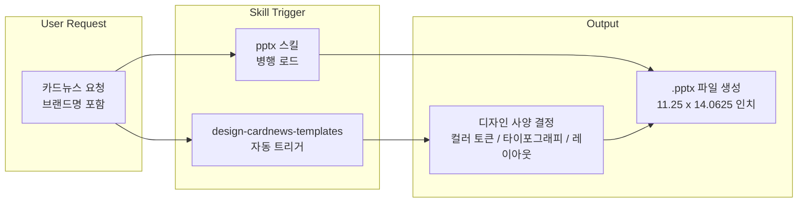
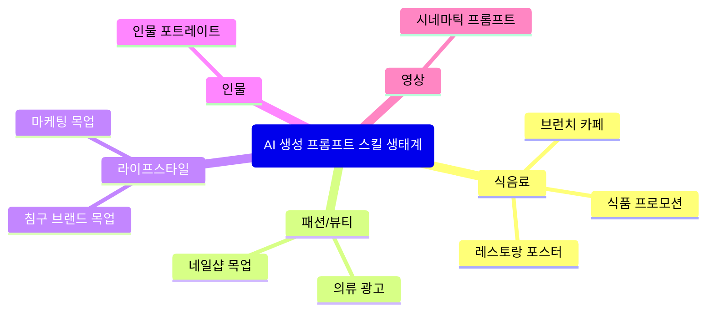
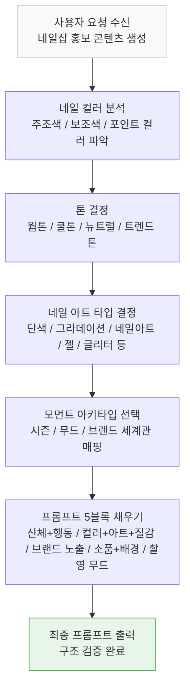
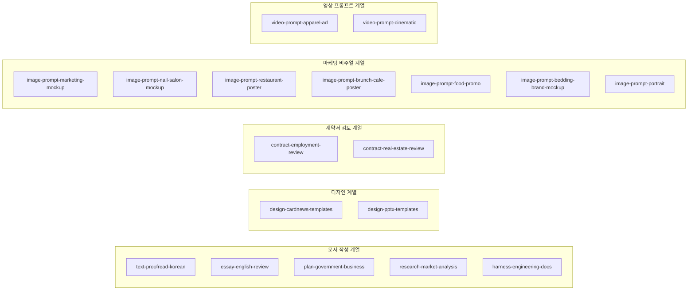

---
## 관련글

[**내가 클로드 스킬을 만들때**](https://www.facebook.com/share/1BKu9XU7yC/)

---

## 들어가며

클로드 스킬(Claude Skills) 목록을 한눈에 들여다보면, 그 자체로 하나의 철학이 보인다. `text-proofread-korean`, `essay-english-review`, `design-cardnews-templates`, `plan-government-business`, `design-pptx-templates`, `research-market-analysis`, `video-prompt-apparel-ad`, `video-prompt-cinematic`, `contract-employment-review`, `contract-real-estate-review`, `image-prompt-marketing-mockup`, `image-prompt-bedding-brand-mockup`, `image-prompt-nail-salon-mockup`, `image-prompt-restaurant-poster`, `image-prompt-brunch-cafe-poster`, `image-prompt-food-promo`, `image-prompt-cafe-campaign-poster`, `image-prompt-portrait`, `harness-engineering-docs`까지 — 이 목록은 단순한 스킬 모음이 아니라, 특정한 설계 원칙의 산물이다.

각 스킬의 이름을 살펴보면 공통점이 있다. 스킬 하나가 다루는 영역이 극도로 좁다. 계약서 검토만 해도 `contract-employment-review`(고용계약서)와 `contract-real-estate-review`(부동산 계약서)로 나뉜다. AI 생성 프롬프트 제작도 의류(`video-prompt-apparel-ad`), 네일샵(`image-prompt-nail-salon-mockup`), 레스토랑(`image-prompt-restaurant-poster`), 브런치 카페(`image-prompt-brunch-cafe-poster`), 식품 프로모션(`image-prompt-food-promo`), 침구 브랜드(`image-prompt-bedding-brand-mockup`), 인물(`image-prompt-portrait`)로 세분화되어 있다. 발표용 슬라이드(`design-pptx-templates`)와 카드뉴스(`design-cardnews-templates`)도 별개의 스킬로 분리되어 있다.

이 글은 이러한 스킬 라이브러리의 구조와 그것이 탄생하게 된 설계 방법론을 깊이 있게 다룬다.

---

## 1. Claude Skills란 무엇인가

### 기술적 정의와 작동 원리

Claude Skills는 2025년 10월 Anthropic이 공개하고, 같은 해 12월 오픈 표준으로 공개한 모듈형 역량 확장 시스템이다. 핵심 구조는 단순하다. `SKILL.md`라는 마크다운 파일을 중심으로, 지침(instructions), 스크립트(scripts), 템플릿(templates), 예시(examples) 등을 하나의 폴더에 패키징한다. 이 폴더 전체가 하나의 스킬이 된다.

기술적으로 스킬은 두 가지 방식으로 호출된다. 하나는 슬래시 명령어(`/skill-name`)를 통한 명시적 호출이고, 다른 하나는 Claude가 대화 맥락을 파악해 스스로 관련 스킬을 불러오는 자동 트리거 방식이다. 자동 트리거는 `SKILL.md`의 frontmatter에 정의된 `description`과 `triggers` 항목을 기반으로 작동한다.

컨텍스트 효율성도 설계 상의 특징이다. 스킬은 점진적 공개(Progressive Disclosure) 방식으로 로딩된다. 전체 스킬 내용이 한꺼번에 컨텍스트 윈도우에 올라오는 것이 아니라, 처음에는 메타데이터만 30~50 토큰 정도 로드되고, 실제로 해당 스킬이 필요한 순간에만 전체 지침이 로드된다. 이 덕분에 수십 개의 스킬을 동시에 보유하더라도 컨텍스트 과부하 없이 운용할 수 있다.

### MCP와의 차이

Claude Skills는 MCP(Model Context Protocol)와 자주 비교된다. 두 기술 모두 Claude의 역량을 확장하는 목적이지만, 작동 방식과 용도가 다르다. MCP는 외부 서버와의 연결을 통해 실시간 데이터 접근, API 호출, 외부 시스템 통합에 초점을 맞춘다. 반면 Skills는 로컬 중심으로 작동하며, "어떻게 작업할 것인가"에 관한 지식, 규칙, 워크플로우를 담는다. MCP가 외부 세계와의 연결선이라면, Skills는 Claude 내부의 업무 처리 방식을 정의하는 매뉴얼에 가깝다.

실무적 비유를 들자면, n8n이나 Make 같은 자동화 도구가 "A가 발생하면 B API를 호출하라"는 확정적(deterministic) 명령 체계라면, Claude Skills는 "C 상황에서는 D 가이드라인을 따라 판단하며 작업하라"는 맥락 중심의 지시 체계다. Skills는 스크립트 실행 결과를 바탕으로 다음 단계를 유연하게 판단하는 추론 능력과 결합되어 작동한다.

### 디지털 인수인계서로서의 역할

스킬의 또 다른 중요한 속성은 조직의 암묵지(tacit knowledge)를 명시적으로 코드화할 수 있다는 점이다. 신입 사원에게 업무 매뉴얼을 건네는 것처럼, 스킬은 "이 조직에서 이 작업은 이렇게 처리한다"는 노하우를 AI가 이해 가능한 형태로 문서화한다. 한 번 정의해두면 재사용 가능하고, 팀 전체가 일관된 결과물을 얻을 수 있으며, 버전 관리도 가능하다. 이 맥락에서 스킬은 단순한 프롬프트 저장 도구가 아니라 조직 지식의 자산화 수단이다.

---

## 2. design-cardnews-templates 스킬 분석

`design-cardnews-templates` 스킬은 이 스킬 라이브러리의 설계 철학을 잘 보여주는 사례다.

### 스킬의 목적과 구조

이 스킬은 인스타그램 카드뉴스(1080×1350, 4:5 세로 카루셀)용 디자인을 제작하기 위한 것이다. Apple, Notion, Claude, Linear, Stripe 등 유명 브랜드의 디자인 시스템을 카드뉴스 포맷으로 재해석한 54종의 템플릿 라이브러리를 품고 있다. 각 템플릿은 `templates/` 폴더 안에 마크다운으로 저장되어 있으며, 컬러 토큰, 타이포그래피, 카드 레이아웃, 카루셀 시퀀스, 금기사항까지 모두 정의되어 있다.

스킬의 트리거 조건도 명확하게 설계되어 있다. 사용자가 "어떤 카드뉴스 템플릿이 있어?", "사용 가능한 카드뉴스 디자인 보여줘", "Apple 스타일 카드뉴스 만들어줘", "[브랜드] 디자인으로 인스타 카드뉴스/카루셀", "1080×1350 카드뉴스", "인스타 카드뉴스 디자인 시스템 적용"과 같은 표현을 사용하면 자동으로 이 스킬이 발동된다. 특정 브랜드명(Apple, 애플, Notion, Linear, Stripe, Airbnb, Claude, Cursor 등)을 언급하면서 카드뉴스/인스타 카루셀/SNS 카드/4:5 슬라이드를 요청해도 마찬가지다.

### pptx 스킬과의 협업 구조

`design-cardnews-templates`는 단독으로 작동하지 않는다. 항상 `pptx` 스킬과 쌍으로 사용된다. 역할 분담이 명확하다. `design-cardnews-templates`는 "어떻게 보여야 하는가"에 대한 디자인 사양을 제공하고, `pptx` 스킬이 실제 `.pptx` 파일을 생성한다. 이때 슬라이드 크기는 발표용 16:9(33.87cm×19.05cm)가 아니라 카드뉴스용 4:5 캔버스(11.25인치×14.0625인치)로 설정된다.

이것이 `design-pptx-templates`와 분리된 이유이기도 하다. 발표 슬라이드와 인스타그램 카드뉴스는 사용 목적, 캔버스 비율, 텍스트 밀도, 시각적 위계 구조가 근본적으로 다르다. 하나의 스킬로 통합하면 두 용도 모두 어중간한 결과물이 나온다. 분리함으로써 각각에 최적화된 규칙과 템플릿을 독립적으로 관리할 수 있다.



---

## 3. 세분화의 원칙 — 왜 작게 쪼개는가

스킬 목록에서 드러나는 가장 일관된 원칙은 극도의 세분화다. 이것은 단순히 스킬을 많이 만들기 위한 선택이 아니다. AI가 좋은 결과를 내기 위한 필연적인 구조적 선택이다.

### 도메인 특이성과 결과 품질의 상관관계

'계약서 검토'를 하나의 범용 스킬로 만들 때 발생하는 문제를 생각해보자. 고용계약서, 부동산 임대차 계약서, 소프트웨어 개발 공급 계약서는 검토해야 할 핵심 조항, 법적 위험 포인트, 업계 관행, 주의해야 할 표현 방식이 완전히 다르다. 고용계약서라면 수습 기간 조항, 경업금지 조항, 퇴직금 규정을 중점적으로 봐야 한다. 부동산 임대차 계약서라면 보증금 반환 조건, 원상복구 범위, 특약사항 독소 조항을 봐야 한다. 하나의 스킬이 이 모든 도메인을 아우르려 하면, 어느 것도 깊이 있게 다루지 못한다.

프롬프트 엔지니어링 관점에서도 세분화는 유리하다. 스킬이 좁을수록 컨텍스트 윈도우에 올라오는 지침이 해당 작업과의 관련도가 높아진다. 관련 없는 정보가 줄어들수록 Claude의 추론은 더 집중되고 일관된다. 이것은 어텐션 메커니즘의 특성상 자연스러운 결과이기도 하다.

### AI 생성 프롬프트 스킬의 세분화 논리

AI 생성 프롬프트 제작 스킬들의 세분화는 더욱 정교하다. 네일샵, 레스토랑, 브런치 카페, 식품 프로모션, 침구 브랜드, 의류, 인물은 각각 다른 구도 문법, 색채 언어, 소품 체계, 촬영 무드를 가진다.

네일샵 콘텐츠라면 손의 각도, 네일 컬러와 질감의 표현, 소품 배치, 브랜드 간접 노출 방식이 핵심이다. 레스토랑이라면 음식의 플레이팅, 공간감, 조명, 식기 선택이 중요하다. 의류라면 피팅감, 소재 텍스처, 착용 시 실루엣, 브랜드 세계관이 핵심 변수다. 이들을 하나의 스킬로 묶으면 각 도메인의 미세한 뉘앙스가 희석된다.



---

## 4. 스킬 설계 방법론 — 네일샵 사례를 통한 8단계

이 스킬 라이브러리가 구축된 방법론은 이론적 설계 원칙에서 시작하지 않는다. 실제 시장에서 유효한 패턴을 데이터로 추출하고, 그것을 스킬의 지식 베이스로 변환하는 귀납적 접근이다. 이 과정을 네일샵 홍보 콘텐츠 프롬프트 생성 스킬 제작 사례를 통해 단계별로 살펴본다.

### 1단계: 성공 사례 수집

가장 먼저 하는 일은 실제 시장에서 반응을 얻은 사례를 수집하는 것이다. 인스타그램에서 '네일샵', '네일아트'를 키워드로 검색해, 홍보용으로 제작된 네일 관련 콘텐츠 중 조회수, 좋아요, 공유, 댓글이 가장 많은 것들을 30장 이상 수집한다. 30장 이상이라는 기준은 통계적 유의미성을 위한 것이다. 소수 샘플에서는 우연적 요소가 과대 반영될 수 있다.

수집 기준은 엄격하게 '홍보 목적으로 제작된' 콘텐츠다. 일반 사용자의 개인적 네일 인증샷과 전문 마케터가 제작한 브랜드 홍보물은 문법이 다르다. 이 스킬의 목적이 마케팅 콘텐츠 프롬프트 생성이므로, 처음부터 목적에 맞는 데이터를 수집해야 한다.

### 2단계: 성공 패턴 추출

수집된 고반응 콘텐츠들을 Claude에 업로드하고, 이들 사이의 공통된 패턴과 규칙을 추출해달라고 요청한다. Claude는 구도적 패턴(손목 각도, 카메라 거리, 심도 처리), 색채 패턴(계절별 주조색, 보색 대비 방식), 소품 패턴(자주 등장하는 배경 오브젝트, 브랜드 로고 노출 방식), 텍스트 레이아웃 패턴(폰트 선택, 텍스트 양, 배치 영역) 등을 체계적으로 정리한다.

이 단계에서 얻어지는 것은 단순한 목록이 아니다. "고반응 네일 홍보 콘텐츠에는 이런 패턴이 있다"는 귀납적 법칙이다. 마케터가 수년간 현장 경험을 통해 체득하는 감각을 데이터 기반으로 빠르게 압축하는 것이다.

### 3단계: 실패 사례 수집

여기서 일반적인 접근법과 결정적으로 갈라진다. 다음 단계는 반응이 없었던 네일샵 홍보 콘텐츠를 찾는 것이다. 낮은 조회수, 거의 없는 좋아요, 침묵에 가까운 반응을 보인 콘텐츠들을 동일한 방식으로 수집한다.

이것이 핵심 키포인트다. 성공 패턴만 학습한 AI는 "좋은 것이 무엇인지"는 알지만, "나쁜 것이 무엇인지"는 모른다. 대부분의 AI 프롬프트 설계가 긍정적 사례만으로 구성되는데, 이 접근은 의도적으로 부정 사례를 포함시킨다.

### 4단계: 실패 패턴의 비교 분석

이제 중요한 대조 분석이 이루어진다. 2단계에서 추출한 성공 패턴을 Claude에 알려주면서, 실패 콘텐츠들이 가진 패턴, 규칙, 특이점을 찾아서 정리해달라고 요청한다.

성공 패턴과의 비교를 전제로 실패 패턴을 분석하면 훨씬 날카로운 인사이트가 나온다. "실패한 콘텐츠들은 단순히 성공 패턴이 없는 것이 아니라, 특정한 실패 패턴을 공유하고 있다"는 사실이 드러나기 때문이다. 예를 들어, 지나치게 정면에서 촬영된 구도, 배경이 지저분하거나 산만한 구성, 텍스트가 과도하게 많아 집중도를 분산시키는 레이아웃, 계절이나 트렌드와 맞지 않는 컬러 선택 같은 실패 패턴이 체계적으로 정리된다.

### 5단계: 성공/실패 패턴 데이터베이스 구축

이렇게 해서 두 종류의 패턴 데이터베이스가 완성된다. 반드시 따라야 할 규칙(Must-Follow Rules)과 반드시 피해야 할 규칙(Must-Avoid Rules)이다.

대부분의 스킬 설계자들이 간과하는 부분이 바로 이 실패 패턴의 명시적 기록이다. 스킬에 "피해야 할 규칙"을 넣었을 때와 넣지 않았을 때 결과물의 차이는 생각보다 훨씬 크다. AI는 해야 할 것을 알려줘도 하지 말아야 할 것을 명확히 지정받지 않으면 무의식적으로 흔한 패턴, 즉 "통계적 중심"으로 수렴하는 경향이 있다. 실패 패턴을 명시하는 것은 이 수렴을 막는 레일이다.

### 6단계: 프롬프트의 구조적 틀 설계

이 스킬의 최종 출력물이 네일샵 홍보 콘텐츠 생성을 위한 프롬프트인 만큼, 프롬프트 자체의 구조를 설계해야 한다. 단순히 "좋은 프롬프트를 만들어줘"가 아니라, 프롬프트가 반드시 갖춰야 할 구조적 틀을 정의한다.

네일샵 사례에서는 5개 블록 구조로 정의되었다.

```
[신체 부위 + 행동] [네일 컬러/아트/질감] [브랜드 간접 노출] [소품/배경] [촬영 무드]
```

이 구조가 중요한 이유는, Claude가 프롬프트를 생성할 때 빠뜨리는 요소가 없도록 강제하기 때문이다. 자유롭게 프롬프트를 작성하면 때로는 촬영 무드를 빠뜨리고, 때로는 브랜드 노출 방식을 지정하지 않는다. 구조를 명시하면 일관된 완성도의 프롬프트가 매번 생성된다.

### 7단계: Skill Creator로 스킬 제작

클로드에는 스킬을 만드는 스킬이 기본 내장되어 있다. `skill-creator`라는 빌트인 기능이 그것이다. 이 단계에서 앞서 수집하고 정리한 모든 내용을 `skill-creator`에 입력해 실제 스킬을 제작한다.

입력되는 내용은 세 가지다. 프롬프트 구조의 예시, 반드시 따라야 할 패턴과 규칙, 그리고 피해야 할 패턴과 규칙이다. 이 세 요소가 충실할수록 생성된 스킬의 품질이 높아진다. 특히 피해야 할 패턴을 얼마나 구체적이고 명확하게 기술하느냐가 결과물의 차별성을 결정한다.

### 8단계: 처리 프로세스 설계

스킬 설계에서 가장 중요하고 가장 많이 간과되는 요소가 바로 처리 프로세스다. 단순히 "어떤 결과물을 만들어라"가 아니라, "어떤 순서로 사고하며 결과물을 만들어라"를 명시하는 것이다.

네일샵 스킬에서는 다음 순서로 처리하도록 설계되었다.



이 처리 순서가 존재한다는 것 자체가 스킬의 핵심 가치다. 컬러 분석 없이 바로 프롬프트를 쓰면 컬러 톤의 일관성이 깨진다. 톤을 결정하지 않고 네일 아트 타입을 결정하면 서로 어울리지 않는 조합이 나올 수 있다. 모먼트 아키타입을 먼저 결정해야 소품과 배경이 브랜드 세계관과 일치한다. 처리 순서는 단순한 절차가 아니라 출력 품질을 보장하는 인식론적 체계다.

---

## 5. 처리 프로세스 설계의 보편적 원칙

네일샵 사례에서 드러난 처리 프로세스 설계의 논리는 모든 스킬에 적용 가능한 보편적 원칙을 담고 있다.

### 의존성 순서 반영

좋은 처리 프로세스는 각 단계가 이전 단계의 출력에 의존하도록 설계된다. 후반 단계의 결정이 전반 단계의 결정에 영향을 받는다는 인과적 구조를 프로세스에 반영하는 것이다. 이것을 잘못 설계하면 단계들이 독립적으로 실행되어 최종 결과물의 내적 일관성이 깨진다.

### 분기점의 명시

처리 도중 다양한 방향으로 갈 수 있는 분기점에서, 어떤 기준으로 분기할지를 명시하는 것이 중요하다. "네일 아트 타입을 결정하라"는 지시보다 "앞서 결정한 톤과 모먼트 아키타입을 기반으로 네일 아트 타입을 결정하라"는 지시가 훨씬 정교한 결과를 낳는다.

### 검증 단계의 내재화

출력 직전에 구조 검증 단계를 포함시키면 누락된 블록 없이 완성된 결과물이 보장된다. "5블록을 모두 채웠는가"를 스킬 내에서 스스로 확인하도록 설계하면, 사용자가 불완전한 프롬프트를 받아드는 경우가 현저히 줄어든다.

---

## 6. 스킬 라이브러리 전체의 구조적 해석

이제 시작 부분에서 언급했던 스킬 목록 전체를 이 방법론의 관점에서 다시 읽으면 다른 풍경이 보인다.

`text-proofread-korean`과 `essay-english-review`의 분리는 단순히 언어를 나눈 것이 아니다. 한국어 교정과 영어 에세이 리뷰는 문법 체계, 문체 판단 기준, 금기 표현의 문화적 맥락이 완전히 다르다.

`video-prompt-apparel-ad`와 `video-prompt-cinematic`의 분리는 광고 영상과 시네마틱 영상의 문법 차이를 반영한다. 브랜드 광고 영상은 제품 노출, CTA, 컷 템포에 집중하고, 시네마틱 영상은 내러티브, 카메라 무브먼트, 감성적 아크에 집중한다.

`research-market-analysis`가 별도 스킬로 존재하는 것은, 시장 조사 결과물이 갖춰야 할 구조(시장 규모, 경쟁사 분석, 소비자 인사이트, 기회 영역)와 서술 방식이 다른 문서 작성 스킬과 다르기 때문이다.



각 계열 안에서도 세분화가 이루어져 있다. 마케팅 비주얼 계열은 업종별로 나뉘어져 있고, 계약서 검토 계열은 계약 유형별로 나뉘어져 있다. 이것이 19개 스킬이 하나의 일관된 설계 원칙 아래 구축된 라이브러리임을 보여준다.

---

## 7. 이 방법론의 AI 활용 관점에서의 의미

### 인간 전문가의 감각을 데이터로 변환

이 방법론이 갖는 가장 큰 의미는 인간 전문가의 암묵적 감각을 AI가 처리 가능한 명시적 데이터로 변환한다는 점이다. 숙련된 마케터가 "이 네일샵 사진은 왠지 흥하지 않을 것 같다"고 느끼는 감각이 있다. 그것이 왜인지 설명하기 어렵지만, 수많은 사례를 본 경험에서 나온 직관이다. 이 방법론은 그 직관을 데이터로 역공학(reverse engineering)한다.

성공 사례와 실패 사례를 대조 분석해 공통 패턴을 추출하는 과정이 바로 그것이다. 이렇게 추출된 패턴은 처음에는 인간의 언어로 기술되어 있지만, 스킬의 형태로 코드화되면 AI가 매번 일관되게 적용할 수 있는 규칙이 된다.

### 스킬 제작 자체가 지식 자산화 과정

스킬을 만드는 과정 자체가 암묵지를 명시지로 변환하는 지식 자산화 작업이다. "어떤 콘텐츠가 잘 되는가"에 대한 막연한 감각이 구체적인 규칙의 목록으로 정리된다. 이렇게 만들어진 스킬은 개인의 역량이 조직의 자산이 되는 과정과 유사하다.

더 나아가, 이렇게 만들어진 스킬은 Claude Skills의 오픈 스탠다드 포맷을 따르기 때문에 Claude Code를 포함한 다양한 AI 도구에서 재사용 가능하다. 2026년 현재 SkillsMP 같은 스킬 마켓플레이스가 등장했고, 커뮤니티 기여 스킬이 수천 개에 달한다. 개인이 만든 스킬이 생태계의 공유 자산이 될 수 있는 구조다.

### 범용성에서 특수성으로의 전환

지금까지 AI 활용의 기본 전제는 범용 모델을 활용하는 것이었다. 동일한 Claude가 시를 쓰고, 코드를 짜고, 계약서를 검토한다. 스킬 라이브러리는 이 범용성을 도메인 특화 역량으로 전환하는 레이어다. Claude는 그대로이지만, 어떤 스킬을 불러오느냐에 따라 네일샵 전문 마케터, 부동산 계약 전문 검토자, 인스타그램 카드뉴스 디자인 전문가로 변신한다.

이것은 파인튜닝(fine-tuning)과는 다른 접근이다. 파인튜닝은 모델 자체를 특화시키지만, 스킬은 작업 맥락과 처리 방식을 특화시킨다. 모델은 범용으로 유지하면서, 실행 레이어에서 특화를 달성하는 방식이다.

---

## 8. 실용적 시사점 — 나만의 스킬을 만들기 위한 체크리스트

이 방법론에서 추출할 수 있는 실용적 원칙을 정리하면 다음과 같다.

**세분화 원칙**: 하나의 스킬이 다루는 도메인을 최대한 좁혀라. 스킬이 좁을수록 결과물의 품질이 높아진다. "계약서 검토 스킬"보다 "고용계약서 검토 스킬"이 낫다.

**데이터 수집 원칙**: 성공 사례만이 아니라 실패 사례를 반드시 포함하라. 실패 패턴의 명시적 기록이 결과물의 차별성을 만든다.

**구조 설계 원칙**: 출력물의 형식을 자유 형식으로 두지 말고, 반드시 갖춰야 할 블록 구조를 명시하라. 구조화된 출력은 일관된 완성도를 보장한다.

**프로세스 설계 원칙**: "무엇을 만들어라"보다 "어떤 순서로 사고하며 만들어라"를 스킬에 담아라. 처리 순서는 출력 품질의 인과적 보장이다.

**협업 스킬 원칙**: 단독으로 완결되지 않는 스킬은 쌍으로 설계하라. `design-cardnews-templates`와 `pptx`의 역할 분담처럼, 각 스킬이 자신이 가장 잘하는 영역에 집중하게 하라.

---

## 마치며

이 스킬 라이브러리는 단순히 반복 작업을 자동화하는 도구가 아니다. 현장에서 검증된 패턴을 체계화하고, 그것을 AI가 일관되게 재현할 수 있는 형태로 코드화한 지식 자산이다. 스킬을 만드는 과정 자체가 실무 역량을 명시화하는 작업이며, 그 결과물은 Claude라는 범용 모델을 특정 도메인의 전문가로 전환시키는 레이어가 된다.

2026년 현재 Claude Skills 생태계는 빠르게 성장하고 있다. 공식 Anthropic 스킬, 서드파티 검증 스킬, 수천 개의 커뮤니티 기여 스킬이 공존하며, 오픈 스탠다드 덕분에 Claude Code 외의 다른 AI 코딩 도구에서도 동일한 스킬을 사용할 수 있다. 이 생태계에서 진짜 경쟁력은 스킬을 설치하는 능력이 아니라, 자신의 도메인 지식을 스킬로 변환하는 능력에서 온다.

---

*작성일: 2026년 5월 10일*
