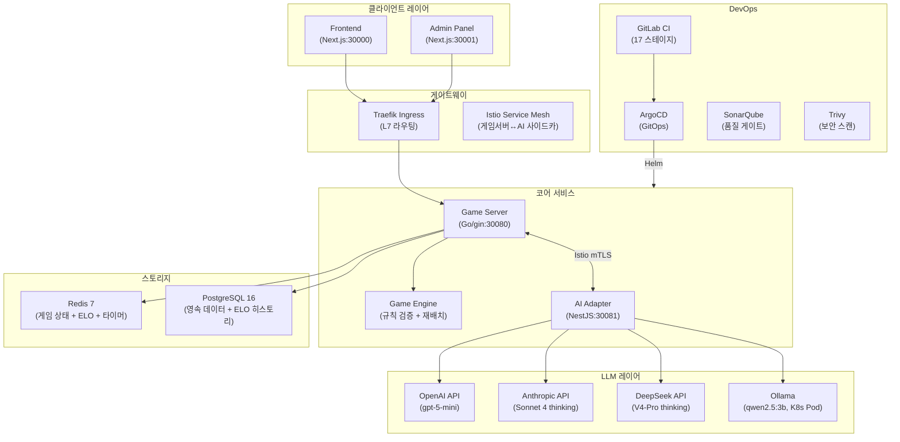
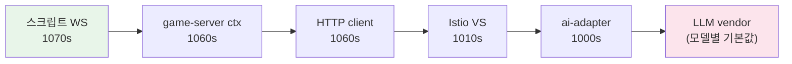
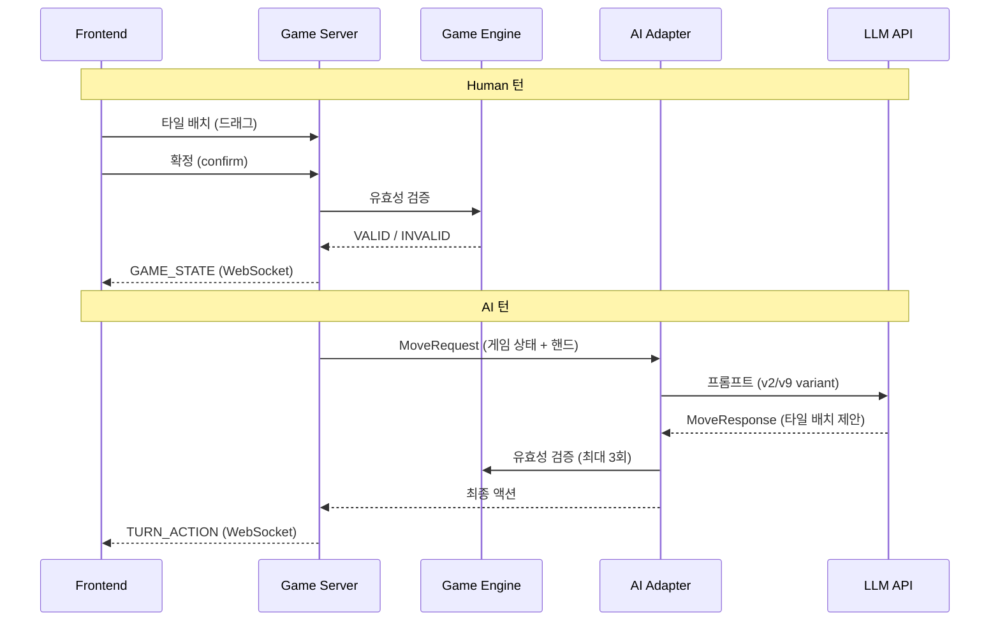
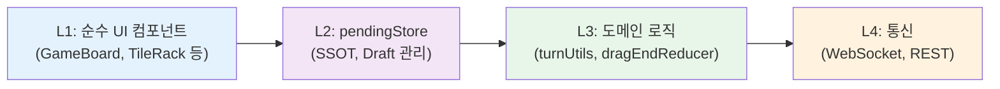

- **프로젝트**: [RummiArena](https://github.com/k82022603/RummiArena) — 루미큐브 기반 멀티 LLM 전략 실험 플랫폼
- **기간**: 2026-03-08 ~ 2026-05-10 (약 63일)
- **종료 일자**: 2026-05-10
- **작성자**: 애벌레 (프로젝트 오너)

---

## 1. 프로젝트 개요

### 1.1 목적

루미큐브(Rummikub) 보드게임을 플랫폼 삼아 다양한 LLM(대형 언어 모델)이 게임 전략을 얼마나 잘 수행하는지 비교하고, Human-AI 혼합 실시간 대전이 가능한 시스템을 구축한다.

### 1.2 핵심 질문

이 프로젝트가 답하고자 했던 질문:
1. LLM이 규칙 기반 전략 게임을 얼마나 잘 플레이하는가?
2. 서로 다른 LLM 모델(GPT, Claude, DeepSeek, Ollama) 사이에 전략적 차이가 있는가?
3. 비용 대비 성능(성능/달러)은 어떻게 되는가?
4. Local CPU 추론(Ollama)으로도 의미 있는 수준의 게임 플레이가 가능한가?

### 1.3 팀 구성

- **프로젝트 오너**: 애벌레 (1인 개발자)
- **AI 에이전트 팀 (13명)**: Claude Code 기반
  - architect, go-dev, node-dev, frontend-dev, frontend-dev-opus
  - devops, qa, ai-engineer, game-analyst, designer, security, pm

---

## 2. 최종 아키텍처

### 2.1 전체 시스템 구성



### 2.2 타임아웃 체인 (SSOT)



부등식 계약: `script_ws > gs_ctx ≥ http_client > istio_vs > adapter > llm_vendor`

### 2.3 게임 액션 흐름



### 2.4 UI 상태 아키텍처 (Sprint 7 최종)



---

## 3. 스프린트별 성과 요약

| Sprint | 기간 | 핵심 성과 | 테스트 |
|--------|------|----------|--------|
| Sprint 1 | 03-13~21 | Game Engine + REST + WS + K8s 5서비스 + CI/CD 기반 | Go 530 PASS |
| Sprint 2 | 03-22~28 | AI 캐릭터 6종 + Turn Orchestrator + ELO + Admin + 연습 모드 | Go 650 PASS |
| Sprint 3 | 03-29~04-04 | Google OAuth K8s + WS 재연결 + Ollama + Redis Timer | Go 700 PASS |
| Sprint 4 | 04-05~11 | 플레이어 생명주기 + 비용 메트릭 + 보안 P0 5건 + AI Round 2 | Go 720 PASS |
| Sprint 5 | 04-12~18 | Rate Limiting + DeepSeek 30%+ + CI/CD 17/17 + 플레이테스트 88.6% | Go 750 PASS |
| Sprint 6 | 04-19~21 | 재배치 UI 4유형(dnd-kit) + Agent Teams 13명 + 핫픽스 4건 | Jest 539 PASS |
| Sprint 7 | 04-22~29 | UI State 통합 + pendingStore SSOT + 룰 77개 + BUG-CONFIRM-001 | Jest 638 / Go 770 PASS |
| 핫픽스 | 05-01~10 | v8/v9-ollama-place (0%→25.6%) + joker 파이프라인 + ELO API | Jest 659 / AI 637 PASS |

---

## 4. LLM 전략 실험 결과

### 4.1 최종 Place Rate 비교

| Model | 최종 Place Rate | 초기 Place Rate | 개선 | 비용/게임 |
|-------|:--------------:|:--------------:|:----:|-----------|
| GPT gpt-5-mini | **33.3%** | 28.0% (Round 2) | +5.3%p | $0.15 |
| DeepSeek V4-Pro thinking | **31.9%** | 5.0% (Reasoner Round 2) | +26.9%p | $0.039 |
| Ollama qwen2.5:3b | **25.6%** | 0% (최초) | +25.6%p | $0 |
| Claude Sonnet 4 thinking | **20.0%** | 23.0% (Round 2) | -3%p | $1.11 |

### 4.2 핵심 발견사항

**프롬프트가 모델 능력보다 중요하다**
- DeepSeek Reasoner가 Round 2에서 5%(F등급)였다가 v2 프롬프트 도입 후 30.8%(A+등급)로 급등했다.
- Ollama qwen2.5:3b는 단순 질의 프롬프트(v6)에서 0% place rate → 사전 계산 전략 프롬프트(v9)로 25.6% 달성.

**Thinking 모드는 필수**
- DeepSeek V4-Flash(비thinking)는 place rate 0%. V4-Pro thinking 채택 후 31.9%.
- Claude Sonnet 4 thinking이 역대 최고 33.3%(v2 프롬프트 실험)를 기록했다.

**비용 대비 성능**
- DeepSeek V4-Pro: $0.039/게임 — 가장 높은 비용 효율
- Claude: $1.11/게임 — 28배 비싸나 성능은 유사 (20~33.3%)
- Ollama: $0 — CPU 추론이라 응답 25초이지만 무료

**LLM 신뢰 금지 원칙 검증**
- Game Engine 3-retry 메커니즘으로 전 모델 Fallback 0건 달성
- LLM이 잘못된 수를 제안하더라도 시스템이 유효한 액션으로 복구

### 4.3 프롬프트 진화 이력

| 버전 | 특징 | 대상 모델 |
|------|------|----------|
| v1 | 기본 프롬프트 | 전 모델 |
| v2 | 단계별 추론 + 예시 | GPT/Claude/DeepSeek (공통 표준) |
| v3 | 확장 추론 (GPT 역효과) | 실험 후 폐기 |
| v8-ollama-place | 사전 계산 전략 | Ollama 전용 |
| v9-ollama-place | 조커 지원 + ERR_NO_RACK_TILE 방어 | Ollama 전용 (최신) |

---

## 5. 품질 지표

### 5.1 테스트 현황 (2026-05-10 기준)

| 카테고리 | 테스트 수 | 상태 |
|---------|---------|------|
| Game Engine (Go) | 770 | PASS |
| AI Adapter (NestJS) | 637 | PASS |
| Frontend Jest | 659 | PASS |
| Playwright E2E | 375 | PASS |
| WS 통합 테스트 | 21 | PASS |
| **합계** | **2,462** | **ALL PASS** |

### 5.2 CI/CD 파이프라인 (17/17 ALL GREEN)

```
lint (4) → test (2) → quality (2) → build (4) → scan (4) → gitops (1)
```

- lint: Go vet, ESLint, TypeScript tsc, Prettier
- quality: SonarQube (신규 코드 기준 Quality Gate)
- scan: Trivy (Critical/High CVE 0건)
- gitops: ArgoCD image tag 자동 업데이트

### 5.3 보안 현황

| 항목 | 상태 |
|------|------|
| Critical/High CVE | 0건 (Trivy) |
| SonarQube Quality Gate | PASSED |
| SEC-A (OAuth 보안 강화) | 완료 |
| SEC-B (Rate Limiting) | 완료 |
| SEC-C (인증/인가 분리) | 완료 |
| SEC-DEBT-001~006 | 식별됨 (미해결) |

---

## 6. 시스템 제약사항

### 6.1 인프라 제약

**단일 노드 K8s**
- 현재 Docker Desktop Kubernetes 기반 단일 노드 클러스터
- 고가용성(HA) 미지원. Node 장애 시 전체 서비스 중단
- WSL2 .wslconfig 메모리 10GB 설정. 7개 서비스 + Istio 사이드카 동시 실행 시 여유 1~2GB

**Ollama CPU 추론**
- GPU 없이 CPU만 사용. qwen2.5:3b 기준 평균 응답 25.3초
- 동시 2개 게임 이상에서 심각한 지연 발생 (CPU 병렬화 한계)
- GPU 노드(NVIDIA T4) 사용 시 응답 시간 약 3초 예상

**NodePort 네트워크**
- 30000~30432 포트 대역. 단일 노드에서만 동작
- L4 로드밸런서 없음. 외부 트래픽 분산 불가

### 6.2 동시접속 처리 능력 분석

**현재 아키텍처로 동시 100~200명 처리 가능성 분석:**

| 구성 요소 | 현재 처리 능력 | 100~200명 시나리오 |
|-----------|-------------|------------------|
| game-server | Stateless, 수평 확장 쉬움. 200 goroutine ≈ 200MB | ✅ 가능 (replicas=3 권장) |
| Redis | 단일 인스턴스, 초당 수만 ops 처리 | ✅ 50개 방 동시 진행 충분 |
| PostgreSQL | 단일 인스턴스, 연결 풀 100개 | ✅ 조회 위주라 충분 |
| ai-adapter | LLM API 콜은 비동기. 타임아웃 1000초로 커넥션 점유 | ⚠️ AI 게임 많으면 풀 고갈 위험 |
| Ollama | CPU 기반. 동시 2~3 게임이 실질적 한계 | ❌ 병목 — AI 대전은 순차 처리 |
| DeepSeek/Claude/GPT | API 레이트 리밋 + 비용 제약 | ⚠️ 일일 $20 한도 = 약 500 GPT 게임 |

**결론:**
- **Human vs Human 게임** 위주 200명: 가능. game-server 3개 인스턴스 + Redis 충분
- **AI 포함 게임** 50개 동시: Ollama 제외 API 모델이면 가능하나 비용 급증
- **Ollama AI 동시 게임**: 2~3개가 현실적 상한

### 6.3 기능 제약

| 기능 | 상태 | 비고 |
|------|------|------|
| 관전 모드 | 미구현 | 다음 버전 후보 |
| 모바일 UI | 데스크톱 최적화 | 반응형 미완성 |
| 실시간 채팅 | 미구현 | WebSocket 확장으로 가능 |
| 토너먼트/리그 | 미구현 | ELO 기반 확장 가능 |
| 다국어 지원 | 한국어만 | i18n 미적용 |

### 6.4 LLM 비용 제약

| 모델 | 비용/게임 | 일일 한도($20) | 월간 추정 비용 |
|------|-----------|--------------|-------------|
| DeepSeek V4-Pro | $0.039 | ~512 게임 | $23~120 |
| GPT gpt-5-mini | $0.15 | ~133 게임 | $90~450 |
| Claude Sonnet 4 | $1.11 | ~18 게임 | $670~ |
| Ollama | $0 | 무제한 | $0 |

---

## 7. 기술 부채

### 7.1 미해결 항목

| ID | 항목 | 우선순위 | 추정 공수 |
|----|------|---------|---------|
| DEBT-001 | next-auth v5 이주 (현재 v4) | High | 2~3일 |
| DEBT-002 | Istio Phase 5.2 Circuit Breaker | Medium | 1~2일 |
| SEC-DEBT-001 | CSRF 보호 강화 | High | 1일 |
| SEC-DEBT-002 | Content Security Policy 헤더 | Medium | 0.5일 |
| SEC-DEBT-003 | WebSocket 인증 토큰 갱신 | High | 2일 |
| SEC-DEBT-004 | Admin API 인가 세분화 | Medium | 1일 |
| SEC-DEBT-005 | PII 데이터 암호화 | Low | 1일 |
| SEC-DEBT-006 | 감사 로그(Audit Log) | Low | 2일 |
| OLLAMA-001 | ERR_NO_RACK_TILE 수정 (v10) | High | 0.5일 |
| OLLAMA-002 | 조커 확장 지원 (v10) | Medium | 1일 |

### 7.2 설계 결정 한계

**pendingStore P3-3 미완료**
- DndContext를 GameRoom으로 이전하는 작업(P3-3)이 Sprint 7에서 미완료됨
- 현재 구조에서 동작하지만, 이상적인 L1 컴포넌트 분리를 달성하지 못함

**Google OAuth 프로필 덮어쓰기 방어**
- `docs/03-development/06-coding-conventions.md` §5.5에 명시되어 있으나,
  실제 구현에서 엣지 케이스(계정 연동 시) 검증이 부족함

---

## 8. 운영 이관 요약

### 8.1 현재 운영 상태 (2026-05-10)

| 서비스 | 이미지 태그 | 상태 |
|--------|-----------|------|
| frontend | `rummikub-frontend:lobby-fix-e7222d0` | Running |
| game-server | `rummiarena/game-server:day5-8dc0999` | Running |
| ai-adapter | `rummiarena/ai-adapter:v9-ollama-place-8631831` | Running |
| postgres | `postgres:16-alpine` | Running |
| redis | `redis:7-alpine` | Running |
| admin | `rummiarena/admin:latest` | Running |
| ollama | `ollama/ollama:latest` | Running |

### 8.2 핵심 설정값

| 환경변수 | 값 | 설명 |
|---------|-----|------|
| AI_ADAPTER_TIMEOUT_SEC | 1000 | LLM 최대 대기 시간 |
| GAME_MAX_TURNS_LIMIT | 200 | 게임 최대 턴 수 |
| OLLAMA_PROMPT_VARIANT | v9-ollama-place | Ollama 프롬프트 버전 |
| USE_V2_PROMPT | true | GPT/Claude/DeepSeek v2 고정 |

상세: [Operation Handover Plan](https://github.com/k82022603/RummiArena/blob/main/docs/07-closure/02-operation-handover-plan.md)

---

## 9. 프로젝트 회고

### 9.1 성공 요인

1. **LLM 신뢰 금지 원칙의 실증**: "LLM은 제안만, 엔진이 검증"이라는 원칙이 전 모델 Fallback 0건으로 검증됨
2. **프롬프트 엔지니어링의 중요성**: DeepSeek 5% → 31.9%, Ollama 0% → 25.6%로 프롬프트가 모델 능력보다 결정적
3. **게임룰 SSOT**: 77개 룰을 코드와 분리해 관리하면서 구현과 사양의 불일치를 최소화
4. **DevSecOps 자동화**: CI/CD 17/17 + SonarQube + Trivy가 품질 회귀를 자동으로 차단
5. **에이전트 팀 협업**: 13명 AI 에이전트 팀이 2개월간 750+ 커밋, 110+ 문서를 생산

### 9.2 주요 사건과 교훈

| 사건 | 날짜 | 교훈 |
|------|------|------|
| Day 4 Run 3 사고 (타임아웃 계약 위반) | 04-16 | 부등식 계약이 깨지면 정상 응답이 fallback으로 오분류됨 |
| Turn#11 보드 복제 사고 | 04-24 | Jest PASS ≠ E2E 실동작. 자동화 커버리지 한계 |
| BUG-CONFIRM-001 확정버튼 영구잠금 | 05-01 | 상태 관리 복잡도가 임계점을 넘으면 예상치 못한 데드락 발생 |
| LLaMA v8 place rate 0% → 15.8% | 05-01 | CPU 추론 모델은 다른 프롬프트 전략이 필요 |
| V4-Pro 할인 종료 (75% → 정가) | 05-05 | 외부 API 가격 변동이 운영 비용에 직접 영향 |

### 9.3 결론

RummiArena는 "LLM이 전략 게임을 얼마나 잘 플레이하는가?"라는 질문에 **데이터로 답했다**. GPT 33.3%, DeepSeek 31.9%, Ollama 25.6%라는 수치는 단순한 숫자가 아니라, 수십 번의 실패와 프롬프트 수정을 거쳐 얻어낸 실증 결과다.

그리고 그 여정에서 가장 큰 발견은 기술 밖에 있었다: **혼자 개발하는 사람 옆에서 13명의 AI가 함께 고민한다는 것**이 가능하다는 것. 그것이 이 프로젝트가 남긴 가장 중요한 실험 결과다.

---

*이 보고서는 프로젝트 종료일(2026-05-10)에 작성되었습니다.*
*관련 문서: [최종 회고](../../work_logs/retrospectives/final-2026-05-10/) | [운영 이관 계획](./02-operation-handover-plan.md)*