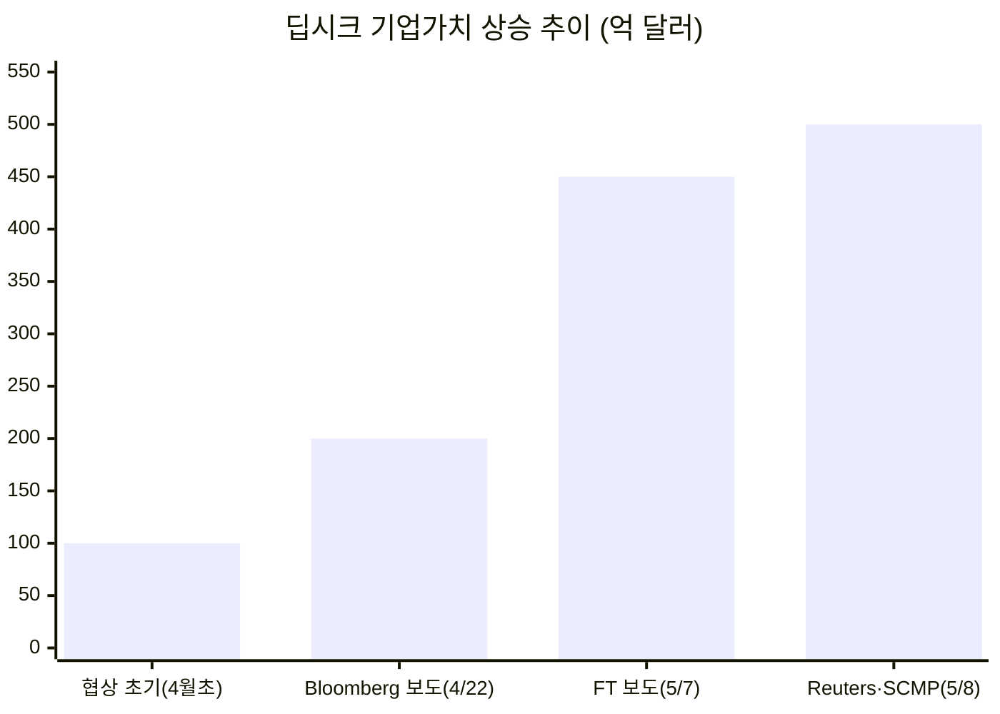
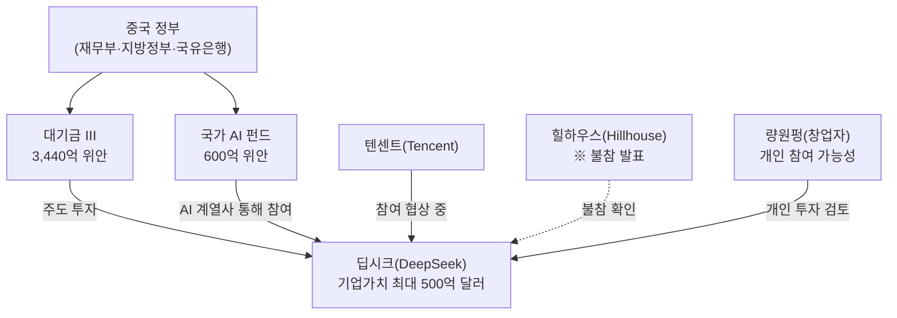
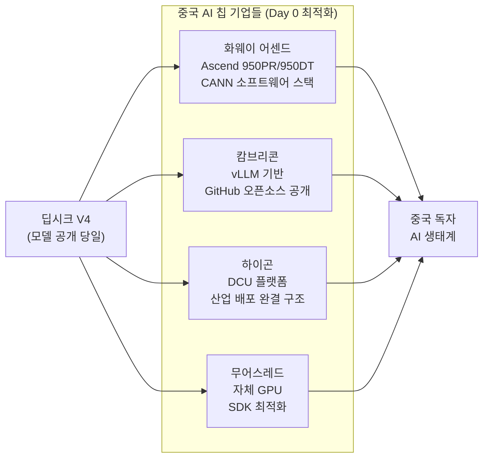
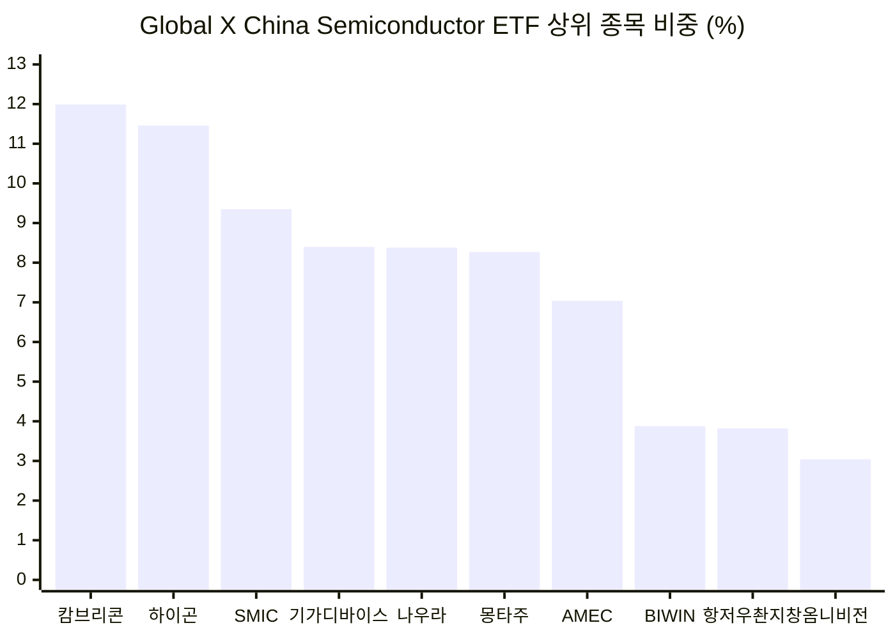
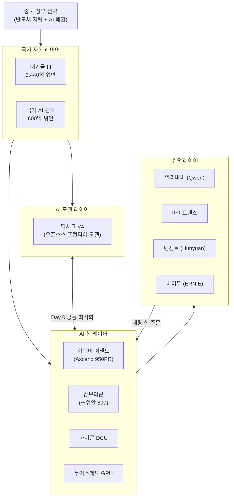

---
## 관련기사

[**몸값 61조 뛴 딥시크, 中 국가자산 격상…AI 반도체 수혜주는**](https://news.einfomax.co.kr/news/articleView.html?idxno=4413946)

---

## 1. 개요: 연구소에서 국가 전략 자산으로

중국의 AI 스타트업 딥시크(DeepSeek)가 설립 이래 처음으로 외부 자금 조달에 나서면서 그 기업가치가 불과 수 주 만에 천문학적 수준으로 뛰어올랐다. 2026년 4월 말 시작된 이번 펀딩 협상에서 딥시크의 몸값은 초기 보도 기준 100억 달러에서 최종적으로 500억 달러(약 70조 원)에 달할 것으로 예상되고 있다. 특히 중국 최대 국책 반도체 투자 기구인 '대기금(大基金, China Integrated Circuit Industry Investment Fund)'이 주도 투자자로 나서고 텐센트(Tencent)와 글로벌 사모펀드 힐하우스(Hillhouse)까지 참여 협상을 벌이고 있어, 딥시크가 단순한 민간 AI 연구소를 넘어 중국 정부가 직접 챙기는 '전략적 국가 자산'으로 격상되었음을 대내외에 선언하는 사건으로 읽힌다.

딥시크는 항저우에 본사를 두고 있으며, 창업자 량원펑(梁文鋒)이 운영하는 퀀트 헤지펀드 하이플라이어(High-Flyer)의 자체 자금만으로 설립 이래 운영되어 왔다. 이처럼 외부 투자를 의도적으로 거부하며 순수 연구소 방식으로 운영해온 것이 딥시크의 가장 두드러진 특징이었다. 그러나 경쟁사들이 수십억 달러의 자금을 투입하며 컴퓨팅 인프라와 인재 영입에 공격적으로 나서는 가운데, 딥시크 역시 자금을 수혈받지 않고서는 경쟁력 유지가 어렵다는 판단을 내린 것으로 보인다. 조달 자금은 컴퓨팅 인프라 확충과 직원 처우 개선에 투입될 예정이다.

---

## 2. 기업가치 폭등의 배경

딥시크가 처음으로 외부 자금 조달을 시작한 것은 경쟁사들의 인재 영입 공세가 직접적인 계기가 되었다. 실제로 딥시크 출신의 핵심 연구원 뤄푸리(罗富理)가 이탈해 샤오미의 AI 모델팀 MiMo를 이끌게 된 사례가 대표적이다. 스톡옵션이 AI 연구자 보상의 대부분을 차지하는 현실에서, 딥시크가 기업가치 책정 없이는 경쟁력 있는 옵션을 제시하기 어려웠던 구조적 약점이 있었다. 량원펑이 초기에는 명목상의 소액만 조달하려 했다는 것도 이 때문이다.

그러나 협상이 진행되면서 기업가치 평가는 예상을 뛰어넘는 속도로 상승했다. 블룸버그가 4월 22일 200억 달러(약 28조 원) 수준에서 텐센트와 알리바바가 협상 중이라고 처음 보도한 이후, FT는 450억 달러, 로이터와 사우스차이나모닝포스트(SCMP)는 최종적으로 최대 500억 달러까지 제시되고 있다고 잇달아 보도했다. 불과 3주 만에 기업가치가 5배가량 뛴 셈이다. 현재 협상은 계속 진행 중으로, 최종 수치는 변동 가능성이 있다.

량원펑은 현재 개인 보유 지분 및 계열사를 통해 딥시크의 약 84~89.5%를 직접 통제하고 있으며, 이번 라운드에 본인도 개인 투자자 자격으로 참여할 가능성이 거론되고 있다.

---

## 3. 대기금(大基金)의 참전: 처음으로 LLM 기업에 직접 투자

이번 딥시크 투자에서 가장 주목해야 할 요소는 중국 **국가집적회로산업투자기금(대기금)** 이 주도 투자자로 나섰다는 점이다. 대기금은 시진핑 주석이 추진하는 '반도체 자립' 전략의 핵심 집행 기구로, 2014년 1기 출범 이후 반도체 제조·설계·장비·재료 전 분야에 전략적 투자를 집행해왔다.

2024년에 조성된 3기 대기금(大基金 III)은 역대 최대 규모인 3,440억 위안(약 66조 원)으로, 재원은 재무부, 지방정부, 국유은행 등에서 출자받았다. 3기 대기금은 기존의 반도체 장비·소재 투자 의무와 더불어 AI 반도체 분야로의 투자 범위를 확장했다. 여기에 더해 2025년 1월 출범한 중국 국가 AI 전용 펀드(600억 위안 규모)도 이번 투자에 참여하는 것으로 전해진다.

대기금이 기존에 중국의 거대언어모델(LLM) 기업에 직접 투자한 전례가 없다는 점에서, 이번 결정은 중국 정부가 딥시크를 단순 민간 기업이 아닌 국가 기술 전략의 핵심 자산으로 간주한다는 분명한 신호다. 대기금은 과거 SMIC(반도체 파운드리), YMTC(낸드플래시) 등 반도체 제조 인프라에 집중 투자해왔는데, 이제 그 범위가 모델 레이어까지 확대된 것이다.

다만 힐하우스는 협상 보도 이후 대변인을 통해 "딥시크에 투자하지 않는다"고 불참을 공식 확인했다.

---

## 4. 딥시크 V4: 기술적 진전과 시장의 반응

딥시크는 2026년 4월 말 V4 모델을 공개했다. V4는 고성능을 지향하는 'V4-Pro'와 고효율에 초점을 맞춘 'V4-Flash' 두 가지 라인업으로 구성된다. V4-Pro는 파라미터 총수 1.6조 개에 추론 시 활성화 파라미터는 490억 개 규모이며, 복잡한 추론과 에이전트 기반 애플리케이션을 주요 용도로 삼는다.

아키텍처 측면에서는 CSA(압축·희소화, Compressed Sparse Attention)와 HCA(전체압축화, Holistic Compression Architecture) 기법을 교차 적용해 연산 효율을 극대화했다. 이전 세대인 V3.2와 비교하면 추론 연산량(FLOPs)을 V4-Pro 기준 약 73%, V4-Flash 기준 약 90%까지 줄이는 성과를 냈다. 또한 컨텍스트 길이가 100만 토큰 수준으로 대폭 확장되었으며, API 가격도 경쟁사 대비 현저히 낮게 책정되었다.

벤치마크 성능 측면에서는 GPT-5.5 및 Claude Opus 4.7에 근접하는 수준이라는 평가가 나오고 있으나, 서드파티 종합 평가에서는 미국 및 일부 중국 경쟁사 최상위 모델에는 아직 뒤처진다는 지적도 있다. 무엇보다 V4 출시가 V3·R1 당시 전 세계 기술주 매도세를 촉발했던 것과 달리, 이번에는 글로벌 시장 충격이 없었다. 이는 경쟁사들이 그 사이 상당 부분 격차를 좁혔음을 시사한다.

V4 개발 과정에서 주목할 만한 사실이 있다. 딥시크는 2025년 중반부터 훈련 프레임워크를 엔비디아 GPU 기반에서 화웨이 어센드(Ascend) 칩 기반으로 전환하는 작업을 진행했다. 이 과정에서 심각한 훈련 장애가 발생하기도 했고, 내부적으로 훈련 방향에 대한 의견 충돌도 있었다. 결과적으로 V4는 화웨이 어센드 950PR 칩 위에서 최적화 추론을 수행하는 중국 최초의 프런티어급 AI 모델이 되었다.

---

## 5. '중국판 CUDA 생태계'의 가시화: Day 0 최적화의 의미

V4 출시에서 기술적으로 가장 주목받은 장면은 화웨이(Huawei Ascend), 캄브리콘(Cambricon), 하이곤(Hygon), 무어스레드(Moore Threads) 등 중국 주요 AI 칩 기업들이 모두 모델 공개 당일(Day 0)에 최적화 작업을 완료했다는 점이다.

과거에는 NVIDIA 외에 어떤 하드웨어 기업도 새 모델 출시 당일에 완전한 호환성을 확보하지 못하고 수개월이 걸리는 것이 일반적이었다. 엔비디아가 CUDA 소프트웨어 스택과 하드웨어를 수십 년에 걸쳐 긴밀하게 통합해온 결과로, 그 생태계 독점을 가능하게 했던 핵심 우위였다. 그런데 중국 칩 기업들이 이를 집단적으로 달성한 것이다.

각 기업의 최적화 내용을 구체적으로 보면, 화웨이 어센드는 950PR·950DT를 포함한 전체 어센드 SuperNode 제품군에서 V4-Pro와 V4-Flash 모두를 지원하며, 퓨즈드 커널과 멀티스트림 병렬 처리로 추론 효율을 높였다. CANN(Compute Architecture for Neural Networks)은 화웨이가 CUDA에 대응해 만든 자체 소프트웨어 스택으로, 이번에 V4와의 사전 협업을 통해 당일 적용이 가능했다고 밝혔다. 캄브리콘은 vLLM 추론 프레임워크 기반으로 Day 0 최적화를 완료하고 적응 코드를 깃허브에 공개했다. 하이곤의 DCU(심층연산유닛) 플랫폼도 당일 적용과 심층 모델 최적화를 완료해 '모델 출시→칩 적응→산업 배포'의 완결 구조를 형성했다.

이러한 성과는 단순한 기술적 진보가 아니라 구조적 의미를 갖는다. 딥시크와 중국 칩 설계사들이 사전에 긴밀히 협의해 공동 개발했다는 사실, 즉 소프트웨어 개발 키트(SDK)가 단기 최적화를 수행할 만큼 고도화되었다는 사실은 중국이 독자적인 AI 하드웨어-소프트웨어 생태계를 구축하고 있음을 실증하는 사건이다.

엔비디아의 젠슨 황 CEO는 이러한 흐름에 대해 "딥시크가 화웨이 위에서 먼저 출시되는 날은 미국에 끔찍한 결과"라며 "전 세계 AI 모델이 미국이 아닌 하드웨어 위에서 가장 잘 구동되는 시나리오가 될 수 있다"고 경고한 바 있다.

---

## 6. 캄브리콘(Cambricon): 중국 AI 반도체 수혜주의 대표

이 구조적 전환에서 가장 직접적인 수혜를 받고 있는 기업이 캄브리콘(寒武纪, 688256.SH)이다. 베이징 소재의 팹리스 AI 반도체 설계 기업으로 2016년 중국과학원(CAS) 연구원 출신의 천윈지·천톈스 형제가 창업했다. 회사명은 5억 년 전 생명 대폭발이 일어난 '캄브리아기(Cambrian)'와 '실리콘(silicon)'의 합성어로, AI 혁명을 이끌겠다는 창업 의지를 담고 있다.

캄브리콘의 실적 흐름은 2024년 말부터 극적인 전환점을 맞이했다. 2024년 4분기에 상장 이래 첫 분기 흑자(이익 2억 7,200만 위안)를 달성했으며, 2025년 상반기에는 매출이 전년 동기 대비 무려 4,348% 급증한 28억 8,000만 위안을 기록하며 순이익 10억 4,000만 위안으로 연속 흑자를 이어갔다. 연간 기준으로도 2025년 매출은 전년 대비 453% 수직 상승하며 상장 이래 처음으로 연간 흑자 전환에 성공했다. 2026년 1분기에는 매출 28억 8,500만 위안(전년 동기 대비 +160%), 순이익 10억 1,300만 위안(+185%)을 달성해 성장세를 이어갔다.

미래에셋증권은 캄브리콘이 올해(2026년) 바이트댄스, 알리바바, 바이두 등 대형 고객사에 본격적인 납품을 시작했다고 분석하며, 내년(2027년) 매출이 전년 대비 140% 증가한 156억 위안, 영업이익은 178% 증가한 57억 위안에 달할 것으로 전망했다. 캄브리콘 주가는 2025년 연간으로 약 140~148% 상승했으며, 2026년 4월 30일에는 하루에만 20% 폭등하여 1,699.96위안을 기록하면서 중국 증시(A주) 최고가 종목에 등극했다. 시가총액은 한때 140조 원을 돌파했다.

캄브리콘의 대표 제품인 쓰위안(思元) 690 칩은 엔비디아 H100에 근접하는 성능이라는 평가를 받고 있으며, 딥시크·알리바바 Qwen·텐센트 Hunyuan 등 주요 중국 AI 모델에 대한 소프트웨어 지원을 확장하고 있다. 다만 2022년 12월 미국 무역 제재 명단(Entity List)에 등재되어 TSMC 파운드리 서비스 등 선진 제조 기술 접근에 제약이 있다는 점은 중장기 성장의 구조적 리스크로 남아 있다.

---

## 7. Global X China Semiconductor ETF 주요 구성 종목

다음은 미래에셋그룹이 운용하는 **Global X China Semiconductor ETF**의 주요 편입 종목이다. 이 ETF는 중국 AI 반도체 산업의 핵심 기업들에 집중 투자하는 상품으로, 본 보고서에서 다룬 기업들을 포함한 중국 반도체 밸류체인 전반을 커버한다.

| 종목명 | 티커 | 거래소 | 주가(위안) | 보유 주수 | 시가 평가액(위안) | 순자산 비중(%) |
|---|---|---|---|---|---|---|
| **캄브리콘(Cambricon)** | 688256 C1 | 상하이 | 1,868.00 | 122,904 | 229,564,672 | **11.99** |
| **하이곤 정보기술(Hygon Information)** | 688041 C1 | 상하이 | 341.60 | 642,100 | 219,341,360 | 11.46 |
| **SMIC(반도체 파운드리)** | 688981 C1 | 상하이 | 125.34 | 1,427,608 | 178,936,387 | 9.35 |
| **기가디바이스(GigaDevice)** | 603986 C1 | 상하이 | 350.16 | 459,400 | 160,863,504 | 8.40 |
| **나우라 테크놀로지(Naura)** | 002371 C2 | 선전 | 552.34 | 290,600 | 160,451,884 | 8.38 |
| **몽타주 테크놀로지(Montage)** | 688008 C1 | 상하이 | 209.91 | 754,260 | 158,326,757 | 8.27 |
| **어드밴스드 마이크로-패브리케이션(AMEC)** | 688012 C1 | 상하이 | 384.60 | 250,584 | 134,834,606 | 7.04 |
| **BIWIN 스토리지 테크놀로지** | 688525 C1 | 상하이 | 299.85 | 247,728 | 74,281,241 | 3.88 |
| **항저우 촨지창 테크놀로지** | 300604 C2 | 선전 | 185.80 | 392,900 | 73,000,820 | 3.82 |
| **옴니비전 집적회로(OmniVision IC)** | 603501 C1 | 상하이 | 100.26 | 581,300 | 58,261,086 | 3.04 |

상위 10개 종목이 순자산에서 차지하는 비중을 합산하면 약 75.6%에 달해 중국 반도체 핵심 기업에의 집중도가 높다. 캄브리콘이 단일 종목 최고 비중(11.99%)으로 1위를 차지하고 있으며, V4와의 Day 0 최적화로 직결된 하이곤이 그 뒤를 잇는다. SMIC는 중국 최대 파운드리로 국산화 수요 흡수의 수혜주이고, 나우라 테크놀로지는 반도체 장비 국산화 정책의 핵심 기업이다.

---

## 8. 중국 AI '원팀' 생태계의 구조적 맥락

지금까지 살펴본 흐름을 종합하면, 현재 중국에서 진행되고 있는 것은 단순히 한 스타트업의 기업공개 준비가 아니다. 그것은 AI 소프트웨어(딥시크 모델)-AI 하드웨어(화웨이 어센드, 캄브리콘 등)-국가 자본(대기금)-대형 테크 수요(알리바바, 바이트댄스, 텐센트)가 긴밀하게 연결되는 '중국형 AI 수직 통합 생태계'의 완성을 향한 움직임이다.

미국의 대중 AI 반도체 수출 통제가 강화될수록 이 생태계는 역설적으로 가속화된다. 엔비디아의 H100·H200 등 첨단 GPU 공급이 막힌 상황에서 중국 기업들은 자국 칩 채택을 서두를 수밖에 없고, 이것이 캄브리콘·하이곤·화웨이 어센드의 실질적 수요로 연결된다.

또한 딥시크의 오픈소스 전략이 이 생태계 확산에 결정적으로 기여하고 있다는 점도 간과할 수 없다. 가중치(weights)를 공개하는 오픈소스 방식은 하류 개발자들이 자국 하드웨어 위에서 자유롭게 모델을 배포·미세조정할 수 있게 해주어, 중국 칩 생태계의 저변을 자연스럽게 확대하는 효과를 낳는다.

---

## 9. 경쟁 환경의 변화와 딥시크의 과제

딥시크의 자금 조달 자체가 시사하는 한 가지 중요한 사실이 있다. 2025년 초 R1 공개 당시 딥시크가 시장을 뒤흔들었던 '훈련 비용 600만 달러'의 충격은 이미 경쟁사들이 재현하고 학습을 마친 영역이 되었다. 바이트댄스, 알리바바, 미니맥스(MiniMax), 문샷AI(Moonshot AI) 등은 수십억 달러를 투입해 격차를 빠르게 좁혔다. 스탠퍼드 AI 인덱스(2026년 3월)에 따르면 미국 최상위 모델과 중국 최강 경쟁 모델의 성능 격차는 2.7%포인트 수준으로 축소되었다.

AI 산업의 초점 자체도 챗봇 벤치마크에서 에이전트 기반 복잡 작업으로 이동했으며, 이 영역은 훨씬 더 많은 컴퓨팅 파워를 요구한다. 딥시크가 여전히 연산 효율에서 강점을 가지고 있지만, 자원 집약적인 에이전트 시대에서는 풍부한 컴퓨팅 인프라 없이는 경쟁력 유지가 어렵다. V4가 아직 멀티모달 기능을 갖추지 못한 것도 컴퓨팅 자원과 자금의 제약 때문인 것으로 알려졌다.

이번 외부 자금 조달은 딥시크가 스스로 자급자족 연구소 모델의 한계를 인정한 것이며, 동시에 국가 자본과의 연대를 통해 장기 경쟁력을 확보하려는 전략적 전환이기도 하다. 향후 딥시크의 기업 정체성이 순수 연구소에서 국가 지원 AI 챔피언으로 이동하게 되면, 상업화와 정부 조달 수요 연결이라는 새로운 경로가 열릴 가능성이 있다.

---

## 10. 국내 투자자를 위한 접근 방식

중국 AI 반도체 수혜 기업 대부분이 상하이 STAR 마켓(과창판) 또는 선전 중소 기업 시장에 상장되어 있어, 국내 투자자가 개별 종목에 직접 접근하는 것은 구조적으로 제한적이다. 이에 대한 현실적 대안으로 미래에셋 그룹이 운용하는 두 가지 ETF가 제시된다.

첫째, 홍콩 증시에 상장된 **Global X China Semiconductor ETF**는 캄브리콘(11.99%), 하이곤(11.46%), SMIC(9.35%) 등을 담고 있어 본 보고서에서 다룬 핵심 수혜 기업들을 직접 편입하고 있다.

둘째, 국내 상장 상품인 **TIGER 차이나반도체FACTSET ETF**는 현재 국내 증시에 상장된 중국 반도체 전용 ETF 중 유일한 상품이며, 접근성 면에서 국내 투자자에게 가장 실용적인 대안이다.

다만 어떠한 ETF 투자도 지정학적 리스크(미·중 기술 전쟁 심화), 중국 증시의 정책 불확실성, 개별 종목의 고평가 논란(캄브리콘의 경우 PER이 수백 배에 달하는 고평가 논란이 있음) 등을 반드시 고려해야 한다. 본 내용은 투자 권유가 아니며 정보 제공 목적으로 작성된 분석이다.

---

## 11. 결론

딥시크의 기업가치가 수 주 만에 5배 뛰어오르며 500억 달러에 근접한 것, 그리고 대기금이 LLM 기업에 처음으로 직접 투자에 나선 것은 단순한 투자 라운드를 넘어선 지정학적 사건이다. 이는 중국이 AI를 단순 소비재 서비스가 아닌 반도체·에너지·우주 분야와 동급의 '국가 전략 기술'로 취급하기 시작했음을 뜻한다.

딥시크 V4의 화웨이 어센드 기반 배포와 중국 칩 기업들의 Day 0 최적화 달성은, 미국 중심의 엔비디아 CUDA 생태계에 맞서는 병렬 AI 인프라 생태계가 이미 동작 가능한 수준에 도달했음을 보여준다. 그 생태계의 핵심 수혜 기업으로서 캄브리콘은 2026년 현재 중국 A주 최고가 종목에 등극하며 이 구조적 전환의 상징이 되었다.

미국의 수출 통제가 계속 강화되는 한, 이 중국형 AI 원팀 생태계의 구심력은 더욱 강해질 것이다. 그리고 그 생태계의 진화 속도는 딥시크 V4가 대기 중인 차세대 모델이 어떤 하드웨어 위에서, 어떤 파트너십으로 등장할지에 달려 있다.

---

*작성일: 2026년 5월 10일*
