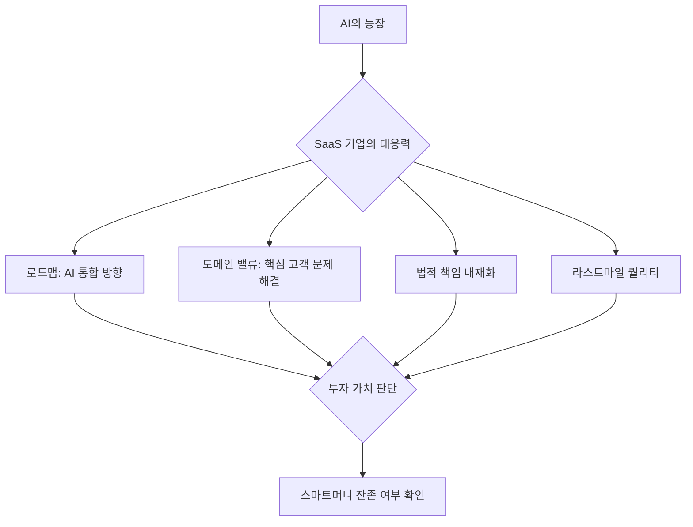
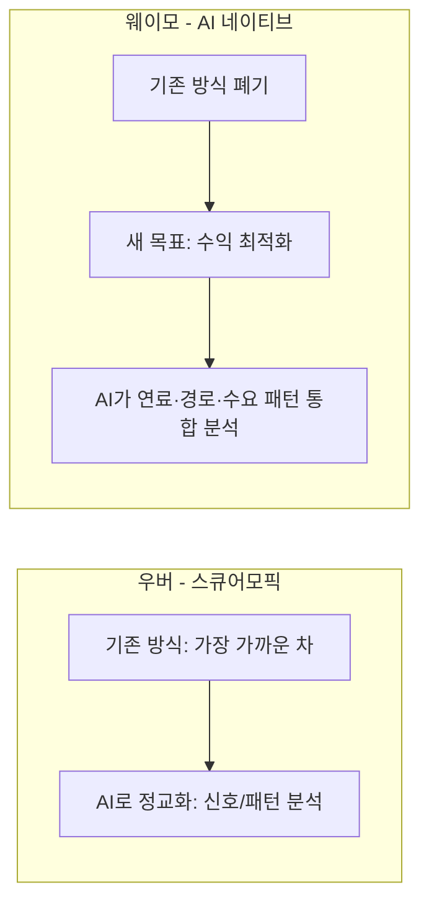
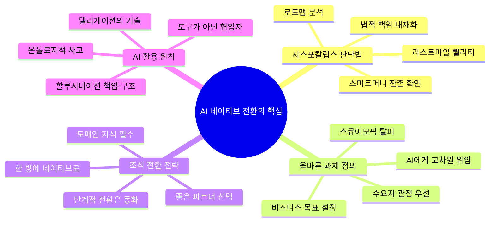

### 조용민 언바운드랩스 대표 × 티타임즈 홍재의 기자 | 2026년 5월 10일

---

> **영상 출처**: 티타임즈 YouTube — [https://www.youtube.com/watch?v=wjPpkUxqC7w](https://www.youtube.com/watch?v=wjPpkUxqC7w)  
> **출연**: 조용민 (언바운드랩스 대표, 앤트로픽 4차→5차 라운드 투자 펀드 운용)  
> **진행**: 홍재의 기자 (티타임즈)

---

## 목차

1. [사스포칼립스란 무엇인가](#1-사스포칼립스란-무엇인가)
2. [지무비 사례로 본 파운데이션 모델의 실제 한계](#2-지무비-사례로-본-파운데이션-모델의-실제-한계)
3. [B2B SaaS가 쉽게 무너지지 않는 두 가지 이유](#3-b2b-saas가-쉽게-무너지지-않는-두-가지-이유)
4. [주가 급락 때 스마트머니를 확인하는 법](#4-주가-급락-때-스마트머니를-확인하는-법)
5. [AI 전환의 핵심: 효율보다 문제 정의](#5-ai-전환의-핵심-효율보다-문제-정의)
6. [스큐어모픽 과제를 벗어나는 법](#6-스큐어모픽-과제를-벗어나는-법)
7. [과제 정의가 AI 실행 속도를 바꾼다](#7-과제-정의가-ai-실행-속도를-바꾼다)
8. [레거시 조직은 왜 AI 네이티브가 되기 어려운가](#8-레거시-조직은-왜-ai-네이티브가-되기-어려운가)
9. [공공 AI: 내부 효율보다 국민 경험](#9-공공-ai-내부-효율보다-국민-경험)
10. [핵심 메시지 요약](#10-핵심-메시지-요약)

---

## 1. 사스포칼립스란 무엇인가

**사스포칼립스(SaaSpocalypse)** 란 SaaS(Software as a Service, 구독형 클라우드 소프트웨어)와 Apocalypse(종말)를 합친 신조어다. 클로드 코드(Claude Code), 클로드 코워크(Claude Cowork)와 같은 강력한 AI 에이전트들이 등장하면서, 기존 SaaS 기업들이 제공하던 기능들을 AI가 대체할 수 있다는 위기론을 표현한다.

2026년 들어 이 논의는 실리콘 밸리 전반에서 뜨겁게 달아올랐다. 세일즈포스(Salesforce), 어도비(Adobe), 각종 사이버보안 기업들의 주가가 새로운 AI 모델 업데이트가 발표될 때마다 급락과 급등을 반복하는 롤러코스터 장세가 이어지고 있다. 또한 실리콘 밸리에서는 테크 스타트업들의 팀 해체, 퇴직, 정리해고 소식이 연이어 나오고 있다.

조용민 대표는 이 현상을 단순히 "SaaS가 망한다"는 식으로 해석하는 것을 경계한다. 그의 핵심 주장은, **어떤 SaaS 기업이 AI의 충격을 받느냐 아니냐는 해당 기업의 로드맵과 도메인 밸류에 달려 있다**는 것이다.

예를 들어 어도비는 클라우드 기반의 Firefly 같은 AI 솔루션으로 전환을 꾀하는 동시에, 로컬 환경에서 작동하는 전문가 도구들도 유지하고 있다. 실제 현장 전문가들이 어디서 가치를 느끼느냐에 따라 어도비의 미래가 갈린다. 따라서 조 대표는 앞으로 5~10년 동안 이들 기업의 로드맵을 면밀히 공부해야 한다고 강조한다.

---

## 2. 지무비 사례로 본 파운데이션 모델의 실제 한계

조 대표는 **지무비(Zimuvi)** 라는 유튜브 채널의 사례를 구체적으로 들어 파운데이션 모델의 현실적 한계를 설명한다.

나영갑 대표가 운영하는 지무비는 웹툰 홍보 콘텐츠를 유튜브에 올리는 채널이다. 영화는 영상이 있어 유튜브 홍보가 자연스럽지만, 웹툰은 정지 이미지가 주를 이루기 때문에 이미지를 짧은 영상으로 변환하는 작업이 필요하다. 이를 위해 지무비 팀은 이미지 한 장을 넣으면 3~5초짜리 영상을 생성해주는 **클라우드 기반 파운데이션 모델(구글 Veo 계열로 추정)** 을 사용하고 있었다.

### 파운데이션 모델의 문제점

파운데이션 모델을 이용해 만화 이미지를 영상으로 변환할 때 핵심 문제가 발생한다. 바로 **일관성(Consistency) 부재**다. 클라우드 기반으로 작동하는 AI 모델은 연속 프레임을 생성하면서 캐릭터의 얼굴이나 세부 디테일이 미묘하게 변한다. 실사 영상에서는 인간이 이런 변화를 쉽게 눈치채지 못하지만, 만화·웹툰 이미지에서는 인간의 뇌가 매우 예민하게 반응해 아주 작은 변화도 즉시 포착해낸다.

결과적으로 지무비 팀은 3초짜리 영상 하나를 만들기 위해 약 30개의 결과물을 생성해야 했고, 그중 실제 쓸 수 있는 것은 고작 1~2개에 불과했다. 이 반복 작업을 팀원들이 수작업으로 처리하고 있었던 것이다.

### 로컬 솔루션의 대안

조 대표가 주목한 것은 파운데이션 모델이 아닌 **로컬에서 구동되는 오픈소스 솔루션**이다. 한 개발자가 무료로 공개한 이 솔루션은 다음과 같은 차별화된 특징을 가진다.

| 항목 | 파운데이션 모델(클라우드) | 로컬 오픈소스 솔루션 |
|---|---|---|
| 비용 | 매우 높음 | 무료 |
| 일관성 | 낮음 (얼굴·디테일 변형) | 높음 (변형 없음) |
| 생성 수량 | 30개 중 1~2개 합격 | 50~60개 생성 후 AI가 최적본 추천 |
| 운용 방식 | 클라우드 API 호출 | 3단계 설치 후 로컬 구동 |

이 솔루션은 단순한 영상 생성 AI가 아니라, **업무 효율 극대화 솔루션**이라고 불러도 좋을 만큼 팀의 생산성을 비약적으로 높여준다. 파운데이션 모델이 갖는 할루시네이션(Hallucination) 문제와 비용 문제를 동시에 해결한 사례로, 조 대표는 이 사례가 사스포칼립스를 바라보는 올바른 시각을 제공해준다고 말한다.

> **핵심 교훈**: 비용과 일관성(Consistency), 전체 노동 시간 감소, 그리고 도메인의 핵심 문제를 실제로 해결하는가 — 이 세 가지 기준으로 AI 솔루션을 평가해야 한다.

---

## 3. B2B SaaS가 쉽게 무너지지 않는 두 가지 이유

조 대표는 B2B SaaS 기업들이 단순히 AI로 대체되지 않는 구조적 이유를 두 가지로 설명한다.

### 첫 번째: 법적 책임(Legitimacy)

B2B 환경에서는 단 1원이라도 잘못 처리되면 법적 책임 문제가 발생한다. 예를 들어 급여 관련 소프트웨어에서 계산 오류가 생겼을 때, 워크데이(Workday)나 SAP 컨커(SAP Concur) 같은 SaaS 솔루션들은 그 **오류에 대해 계약상 책임**을 진다.

**Workday**는 기업의 인사(HR), 급여(Payroll), 재무(Finance)를 통합 관리하는 클라우드 기반 소프트웨어이며, **SAP Concur**는 경비·출장·인보이스 관리 전 과정을 자동화하는 클라우드 솔루션이다. 이 기업들이 높은 과금 체계를 유지할 수 있는 근본적인 이유는 바로 이 '책임'을 떠안기 때문이다.

반면 파운데이션 AI 모델은 "할루시네이션이었다"는 이유로 오류 책임을 회피할 수 없다. 일부 AI 회사들이 레지티머시(Legitimacy, 법적 정당성) 기능까지 내재화하려 시도하고 있지만, 모든 기업이 그 수준에 도달했다고 볼 수 없다. HR팀이 내부에서 자체 AI를 만든다 해도 할루시네이션 제로를 보장하기는 사실상 불가능하다.

### 두 번째: 라스트마일 퀄리티(Last-Mile Quality)

세일즈포스, SAP 컨커, 어도비와 같은 SaaS 기업들이 수십 년간 구축해온 것은 단순한 소프트웨어가 아니라, 특정 도메인에서의 **마지막 1%의 완성도**다. AI가 업무의 99%를 처리할 수 있다 해도, B2B 계약이 성립하려면 나머지 1%까지 완벽해야 한다.

이 라스트마일 퀄리티가 과연 2026년, 2027년, 2028년 안에 AI가 완전히 구현할 수 있느냐에 대한 논쟁이 현재 진행 중이다. 조 대표는 어느 한쪽에 단정짓지 않지만, 실제 현장에서 보면 "엑셀+클로드"의 조합이 현재 거의 완벽에 가까운 수준임을 인정하면서도, 오히려 엑셀에 깊이 익숙한 사용자들이 이 조합으로 전환되는 속도는 더 늦을 수 있다는 역설적 관찰을 제시한다.

---

## 4. 주가 급락 때 스마트머니를 확인하는 법

AI 관련 새 모델이나 논문이 발표될 때마다 SaaS·반도체 관련 주가가 30% 급락했다가, 열흘쯤 지나면 해당 기업이 "우리도 AI 대책이 있다"고 발표하면서 다시 30% 급등하는 패턴이 반복되고 있다. 보안 기업들도 클로드 코드 출시 후 급락했다가, "우리도 AI로 보안을 더 잘할 수 있다"고 하자 곧 반등했다.

조 대표는 이러한 혼란 속에서 투자 판단의 기준으로 **스마트머니(Smart Money) 잔존 여부**를 확인할 것을 제안한다.

### 스마트머니 vs 덤머니

- **스마트머니**: 해당 산업과 기술을 깊이 이해하는 전문 투자자. 라이트스피드(Lightspeed), 세콰이어(Sequoia), a16z 같은 AI를 잘 이해하는 VC, 그리고 해당 기업 파운더의 로드맵을 정확히 아는 투자자들.
- **덤머니**: 트렌드에 반응하여 공포와 환희에 따라 움직이는 일반 투자자.

주가가 급락했을 때 스마트머니가 함께 빠졌는가, 아니면 덤머니만 빠진 것인가를 확인해야 한다. 상장사의 경우 주주 구성을 통해, 비상장사의 경우 투자자 공시를 통해 이를 확인할 수 있다.

### 반도체 사례: 터보퀀트(TurboQuant)

구글이 발표한 터보퀀트 논문이 나왔을 때 SK하이닉스와 삼성전자 주가가 큰 폭으로 하락했다. 모델 정밀도를 16비트에서 8비트, 4비트로 줄이는 양자화(Quantization) 기술이 발전하면서, 터보퀀트는 심지어 **3.5비트** 수준까지 압축하는 데 성공했다. 이는 모델 구동에 필요한 메모리 용량이 크게 줄어든다는 의미이므로, 반도체 수요가 감소할 것이라는 우려가 시장에 퍼진 것이다.

그러나 조 대표가 존경하는 투자자들의 시각은 달랐다. 모델이 1비트까지 줄어들어도 메모리는 여전히 핵심 자원이며, SK하이닉스와 삼성전자에 대한 **폭발적 수요는 아직 완전히 현실화되지 않았다**는 것이다. 시장의 착각이 만들어낸 급락에서 스마트머니는 오히려 더 매수했고, 덤머니만 패닉 셀링으로 손해를 봤다는 교훈이다.

> **투자 체크리스트**: 주가 급락 시 → 해당 기업의 주주 구성 확인 → AI를 깊이 이해하는 투자자들이 아직 존재하는가 → 스마트머니가 잔존하면 단기 패닉일 가능성이 높다.

---

## 5. AI 전환의 핵심: 효율보다 문제 정의

많은 기업들이 사스포칼립스 논의 속에서 "우리도 SaaS 대신 AI로 직접 만들어서 쓰자"는 내재화 시도를 하고 있다. 실제로 티타임즈 내부에서도 자체 AI 툴을 만들어 사용해보았는데, 기존 SaaS 툴보다 조금 더 편리하긴 했지만, 운영 팀이 필요하고 운영 비용이 증가하는 문제가 생겼다.

### 기업 AI 전환의 세 가지 결과

조 대표가 현장에서 관찰한 POC(Proof of Concept, 개념 검증) 프로젝트의 결과는 크게 세 가지로 나뉜다.

1. **POC만 하고 폐기**: "잘 해봤는데 그다지 대단한 건 아니네" 하고 끝나는 경우.
2. **POC 도중 파트너사 먹튀**: 도메인 지식이 없는 AI 전환 업체가 들어왔다가 문제를 해결하지 못하고 연락이 끊기는 경우. 특히 스타트업 중 이런 사례가 많다.
3. **잘 만들었지만 본 프로젝트로 미연결**: 성공적으로 만들었음에도 조직 내부의 저항이나 과제 설정 오류로 인해 실제 업무로 이어지지 않는 경우.

이 중 3번이 가장 치명적이며, 그 원인은 **과제 설정(Problem Definition)의 실패**에 있다고 조 대표는 단언한다.

### 이메일 AI의 스큐어모픽 vs 네이티브 활용

가장 쉽게 이해할 수 있는 예시가 이메일이다.

**스큐어모픽(Skeuomorphic) 접근**: AI가 이메일 초안을 대신 써주고, 제목을 달아준다. 이것은 마치 전구가 발명됐을 때 촛불 옆에 전구를 가져다 놓은 것과 같다. AI를 기존 업무 방식에 그냥 끼워 넣는 것에 불과하다.

**AI 네이티브 접근**: 슈퍼휴먼(Superhuman) 같은 툴로 조직 내 모든 이메일 트랜잭션을 AI가 실시간으로 학습하게 한다. 그러면 부장이 "전무님이 그 프로젝트 승인 받았나요?"라고 AI에게 물으면, AI가 5분 전에 승인된 내용과 전무님의 코멘트, 중요 데이터를 즉시 알려준다. 직접 가서 물어볼 필요도, 메일을 쓸 필요도, 채팅으로 물어볼 필요도 없어진다.

이것이 진정한 AI 네이티브 이메일 전환이다. 커뮤니케이션 자체를 줄이는 것이 목표여야 하는데, 많은 기업들은 여전히 "메일 초안을 AI가 써주는 것"을 AI 전환이라고 착각하고 있다.

---

## 6. 스큐어모픽 과제를 벗어나는 법

**스큐어모픽(Skeuomorphic)** 이란 원래 디자인 용어로, 디지털 인터페이스가 현실 세계의 물체를 흉내내는 것을 뜻한다. 조 대표는 이를 확장하여, 새로운 기술을 도입할 때 **기존의 틀과 사고방식을 그대로 유지한 채** 새 기술을 덧씌우는 행위를 스큐어모픽 과제라고 정의한다.

### 우버 vs 웨이모: AI 과제 정의의 격차

가장 선명한 대비가 우버(Uber)와 웨이모(Waymo)의 차량 배차 알고리즘이다.

**우버의 접근 (스큐어모픽에 가까움)**

우버 AI의 핵심 전략은 '가장 가까운 차량 배치'다. 동일한 거리라도 신호 체계, 학교 하교 시간, 도로 패턴 등 다양한 변수를 AI가 분석해 더 정교하게 판단한다. AI로 기존 방식을 고도화한 것이다.

- AI 기반 분석: 거리 실시간 측정, 교통 신호 상태, 운행 패턴 학습

**웨이모의 접근 (AI 네이티브)**

웨이모는 '가장 가까운 차량 배치'라는 개념 자체를 스큐어모픽으로 보고, 배차의 목표를 **수익 극대화**로 바꿨다. AI에게 "어떤 차를 어디에 배치해야 우리 회사 전체 수익이 가장 높아지는가"라는 더 고차원적인 질문을 던진 것이다.

- AI 기반 분석: 기름·충전 잔량 체크, 차량 운행 효율 분석, 경로 수익성 분석

구체적으로 웨이모의 AI는 차량의 기름 잔량을 체크하고, 말리부(Malibu)로 가는 것과 팰로스버디스(Palos Verdes)로 가는 것의 수익성을 비교하며, 40분 후 해당 지역에서 다시 손님을 태울 수 있는 효율까지 계산해 배차를 결정한다. 개별 사용자의 순간적인 경험은 잠시 나빠질 수 있지만, 전체 네트워크 효율과 수익이 획기적으로 개선됐다.

### SaaS 과금 모델의 전환

이와 연결되는 것이 SaaS 기업들의 과금 구조 변화다. 기존의 시트(Seat) 기반 과금, 즉 사용자 수에 따라 요금을 매기는 방식이 AI 시대에 도전받고 있다.

예를 들어 1,000명 규모의 기업이 시트당 $60/월짜리 SaaS를 쓰면 월 $60,000이 된다. 반면 사용량 기반 요금제(Usage-Based Pricing)는 $2,995/월로 시작하며, Dynamic resource scaling, Payload-based billing, 좌석 수 제한 없음 등의 특징을 갖는다. 이것이 SaaS 업계에서 일어나는 근본적인 비즈니스 모델 전환이다.

조 대표는 이를 두고 "c투u(seat 수 대비 사용량 기반) 과금으로의 변환이 불가피하며, 실제 문제 해결에 따른 성과 기반 과금 모델로 바뀌는 흐름이 생길 것"이라고 내다본다.

### 수원시청의 AI 네이티브 인사이동 사례

조 대표가 소개하는 공공 기관의 모범 사례다. 수원시청은 3,800명 직원의 전환 배치를 AI로 해결하고자 했다.

**스큐어모픽 접근**: 3,800명의 스킬 세트를 AI로 잘 분류해달라. → 전산화 시대에도 할 수 있는 수준.

**AI 네이티브 접근**: 전환 배치 자체, 즉 "이 직원이 어느 부서에 가야 하는지"를 AI가 직접 결정하고, 그 이유도 설명해달라.

더 나아가 수원시청은 마치 축구 선수의 능력치 오각형 그래프처럼, 각 직원의 역량 지표를 시각화하고 해당 부서와의 궁합까지 설명해주는 AI 시스템을 자체 개발하고 있다. 이것은 AI에게 진정한 **위임(Delegation)** 을 준 케이스다.

---

## 7. 과제 정의가 AI 실행 속도를 바꾼다

조 대표가 강조하는 또 하나의 핵심 개념은 **"아트 오브 델리게이션(Art of Delegation)"**, 즉 AI에게 얼마나 잘 위임하느냐의 기술이다.

### 알파고의 무브 37과 무브 78 

구글이 신사옥 이름을 **"무브 쓰리세븐(Move 37)"** 으로 지은 것은 상징적이다. 2016년 알파고와 이세돌의 대국에서, 알파고의 37번째 수는 모든 바둑 전문가들이 악수(惡手)라고 했지만, 결과적으로 그것이 승리의 결정적 수였다.

반대로 이세돌이 4국에서 둔 **무브 78**은 알파고가 예상하지 못한 수로, 알파고를 이기게 한 장면이다.

조 대표는 이를 AI와의 협업 비율에 비유한다. 영상의학과 교수들이 AI 판독에 대해 처음에는 5:5로 보수적으로 보다가 이제 8:2까지 신뢰도를 높이고 있듯이, AI와 인간의 협업 비율이 시계열로 바뀌고 있다. 심지어 일부 영역에서는 99:1까지 AI에게 위임해도 될 수준에 도달했다는 것이다.

단, B2B에서는 여전히 정확도가 100%여야 하는 영역이 있기 때문에, 모든 분야를 99:1로 맡기기는 아직 어렵다.

### 의료기기 업계의 역전

AI 도입 속도에 따라 산업 내 순위가 단번에 바뀐 사례가 있다. MRI 기기 업계에서 10년 넘게 3위였던 업체가 AI를 빠르게 도입해 단번에 1위로 올라섰고, 기존 1위는 3위로 내려앉았다.

### 흑백 해커톤의 교훈

흑백요리사를 모티브로 한 '흑백 개발자' 해커톤 사례도 인상적이다. 백개발자 20명, 흑개발자 80명이 1박 2일 동안 팀을 이루어 AI 앱을 만들었다. 한 팀이 만든 것은 **"직장 상사가 쓰레기인지 아닌지를 분류해주는 AI"** 였다. 오늘 상사에게 들은 말을 입력하면 AI가 판단해주는 것이다. 이 앱은 블라인드 같은 플랫폼에 팔 수도 있을 만한 비즈니스 가치가 있었고, 마케팅까지 포함해 1박 2일 만에 완성됐다.

과제 정의가 명확하고 비즈니스 임팩트가 분명하면, AI를 통한 실행 속도는 상상 이상으로 빨라진다. 이것이 조 대표가 강조하는 핵심 교훈이다.

### RaceTrac × 팔란티어 사례

미국 편의점 체인 **RaceTrac**은 팔란티어(Palantir)와 협업하여 AI 재고 관리를 도입했다. 흥미로운 것은 팔란티어의 접근 방식이다.

스큐어모픽적 발상이라면 "비전 AI 카메라로 진열대를 분석해 어떤 상품이 잘 팔리는지 모니터링하자"는 것이다. 하지만 팔란티어는 이를 거부했다. 진열대에서 상품이 사라지는 것보다 **POS(Point of Sale) 시스템의 판매 데이터**가 훨씬 정확하고 저렴하기 때문이다. 비전 AI 토큰 비용만 낭비하는 셈이다.

팔란티어의 온톨로지(Ontology) 플랫폼은 재고 관리보다 더 상위의 목표, 즉 **수익 극대화**를 AI에게 맡겼다. 편의점의 1+1 행사도 단순히 재고 소진 목적이 아니라 수익 극대화 관점에서 결정되도록 한 것이다.

이에 대해 팔란티어 발표자가 받은 질문은 "왜 이렇게 작은 문제를 해결하느냐?"였다. 팔란티어의 답은 명확하다. 온톨로지는 인간이 정의하는 과제보다 훨씬 고차원적인 문제를 풀 수 있는 능력이 있기 때문에, 작아 보이는 과제에서 시작해도 전체 수익 구조를 바꿀 수 있다는 것이다.

---

## 8. 레거시 조직은 왜 AI 네이티브가 되기 어려운가

조 대표는 레거시 조직이 AI 네이티브로 전환하기 극히 어려운 근본적 이유를 제시한다.

### AI 어시스티드 → AI 드리븐 → AI 네이티브, 단계적 전환은 동화다

조직의 AI 성숙도는 흔히 세 단계로 구분된다.

1. **AI 어시스티드(AI-Assisted)**: 사람이 하는 일에 AI가 보조. 이메일 초안 작성, 보고서 요약 등.
2. **AI 드리븐(AI-Driven)**: AI가 의사결정 과정에서 핵심 역할.
3. **AI 네이티브(AI-Native)**: 조직 구조와 프로세스 자체가 AI를 중심으로 설계됨.

많은 사람들이 1단계를 경험하면서 점차 2단계, 3단계로 올라갈 수 있다고 생각한다. 그러나 조 대표는 이를 **"동화(fairy tale)"** 라고 단언한다. 1단계에서 도입한 솔루션이 헤게모니를 형성하면, 그다음 단계로 넘어가기가 생각보다 훨씬 어려워진다. 한 번 시스템이 자리 잡으면 이주 비용(Migration Cost)이 급격히 높아지기 때문이다.

따라서 조 대표의 처방은 **"한 방에 가야 한다"** 는 것이다. 이를 위해서는 진정한 AI 네이티브 전환 파트너가 필요하며, 좋은 파트너를 찾는 것이 핵심이다.

### 제조업 AI 전환의 현실

한 국내 제조 AI 기업이 어느 대기업에 들어가 AI 네이티브 전환을 시도했다. 포워드 디플로이드 엔지니어(Forward Deployed Engineer)를 모두 투입했지만, 현장에서 "이건 이래서 안 되고, 저건 저래서 안 되고"라는 저항에 부딪혔다.

결국 이 AI 기업이 내린 결론은, 기존 조직에 외부로 들어가 바꾸려는 것이 한계가 있다면, **아예 그 제조 회사의 최대지분을 획득해 원하는 대로 바꿀 수 있는 사례를 만들겠다**는 것이었다. 즉, 레거시 폼을 외부에서 바꾸려다 안 되니, 아예 새 폼을 만들어버리는 전략이다.

---

## 9. 공공 AI: 내부 효율보다 국민 경험

조 대표는 국가 데이터 심의위원회 위원을 맡게 된 경험을 바탕으로, 공공기관 AI 전환의 방향성에 대해 명확한 의견을 제시한다.

### 공무원의 업무 효율화는 AI 어시스티드에 불과하다

공공기관 AI 전환의 전형적인 접근: 공무원이 8시간 걸리던 보고서 작성을 2시간으로 줄이는 AI를 도입한다. 이것은 AI 어시스티드이며, 겉으로는 효율화처럼 보이지만 국민이 체감하는 변화는 없다.

국민은 "공무원들이 그래서 쉬는 시간이 길어졌나?" 정도의 인식만 하게 된다. 기관 본연의 서비스에 변화가 없기 때문에 국민이 인정하지 않는다.

### 진정한 공공 AI 네이티브의 목표

조 대표가 제시하는 공공 AI의 진정한 과제는 **국민이 민원을 넣을 때의 경험을 바꾸는 것**이다.

예를 들어 국민이 민원을 입력하는 순간, AI가 실시간으로 "혹시 이런 내용인가요?"라고 알아서 물어보고 민원 처리 속도를 획기적으로 줄이는 것이다. 이처럼 **끝단의 사용자(국민) 경험에 AI를 먼저 적용**해야, 백단(Back-end)의 데이터 정리와 업무 프로세스 개편도 자연스럽게 따라온다.

공급자(공무원) 관점의 과제 정의가 아닌, **수요자(국민) 관점의 과제 정의**가 선행되어야 한다는 것이다.

### 부처 사일로(Silo) 문제의 올바른 해결법

"부처 간 사일로를 없애면 뭘 할 것인가?"라는 질문에 답이 없다면, 계속 풀 수 없다. 반면 "이 사일로를 풀었을 때 어떤 국민 경험이 만들어지는가"라는 밸류가 명확하면, 부처 전체가 아니라 특정 두 부처 사이의 협력만으로도 해결할 수 있는 방법이 보인다.

---

## 10. 핵심 메시지 요약

조용민 대표가 이 인터뷰 전체를 통해 전하고자 하는 핵심 메시지는 다음과 같이 요약된다.

### 사스포칼립스에 대하여

사스포칼립스는 공포를 파는 논리다. 진짜 중요한 것은 해당 SaaS 기업의 로드맵, 법적 책임 내재화 여부, 라스트마일 퀄리티 구현 수준이다. 스마트머니가 여전히 SaaS에 투자하고 있다는 사실을 놓치지 말아야 한다.

### AI 전환에 대하여

- AI는 3년 전에 이미 "도구"의 시대를 끝냈다. Claude는 광화문 교보문고(약 50만 권)보다 40배 많은 2천만 권 이상의 정보를 학습했다. 그럼에도 불구하고 우리는 여전히 채팅봇 수준으로 쓰고 있다.
- 효율성 관점으로 AI 전환에 접근하면 일이 오히려 더 많아질 수 있다. **비즈니스 문제 해결 관점**에서 접근해야 한다.
- **스큐어모픽 과제**를 반드시 점검하라. 기존 방식의 틀을 깨지 않고 AI를 끼워 넣는 것은 AI의 1~2%만 활용하는 것이다.
- AI 어시스티드에서 네이티브로의 단계적 전환은 환상이다. **한 방에 AI 네이티브로 가야 하며**, 이를 위한 파트너 선택이 가장 중요하다.

### 과제 정의에 대하여

과제 정의가 잘 되면 AI 실행 속도는 놀랍도록 빨라진다. 알파고의 무브 37처럼, 인간의 눈에 악수처럼 보이는 것이 실은 전체 판을 이기는 최선수일 수 있다. AI에게 더 고차원적인 목표를 위임하는 **아트 오브 델리게이션**을 익혀야 할 때다.

---

---

*본 문서는 2026년 5월 10일 공개된 티타임즈 YouTube 영상 "왜 AI로 DT를 하려 하나요? AI를 1~2% 밖에 못쓰는 겁니다" (조용민 언바운드랩스 대표)의 내용을 바탕으로 작성되었습니다.*
