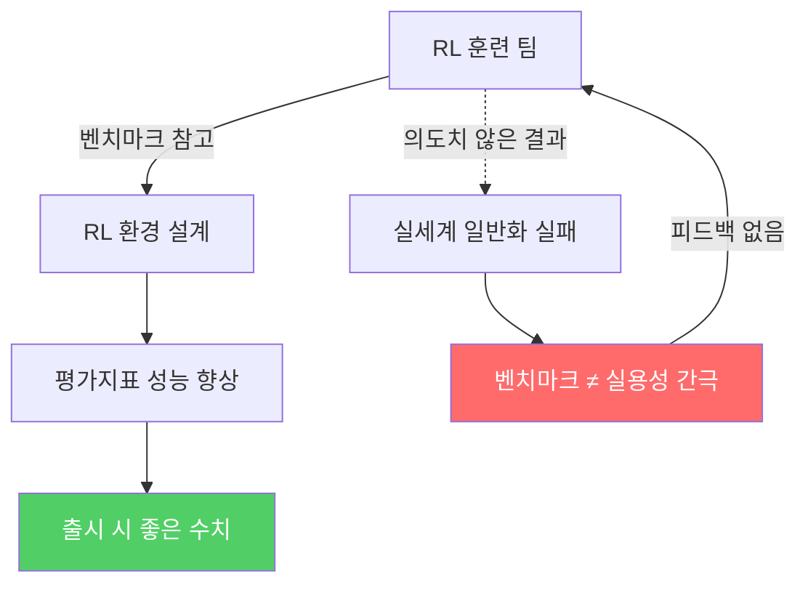
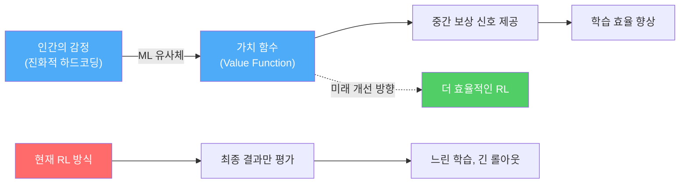
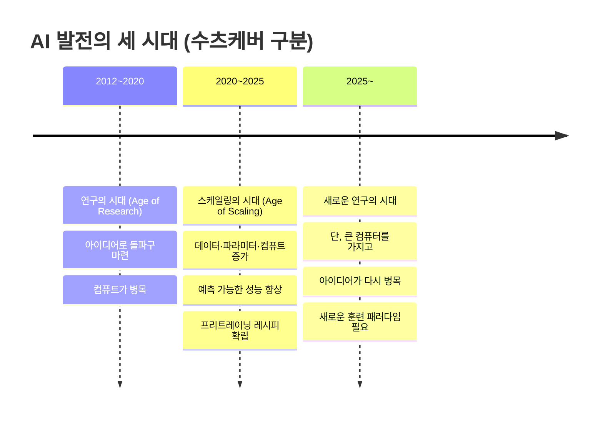
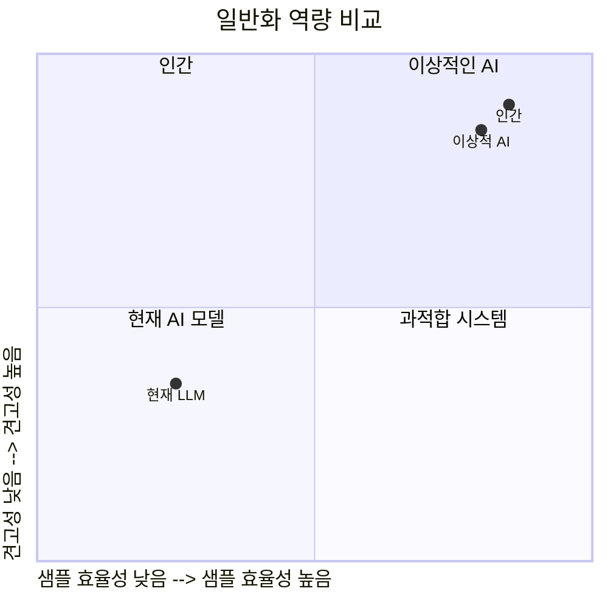
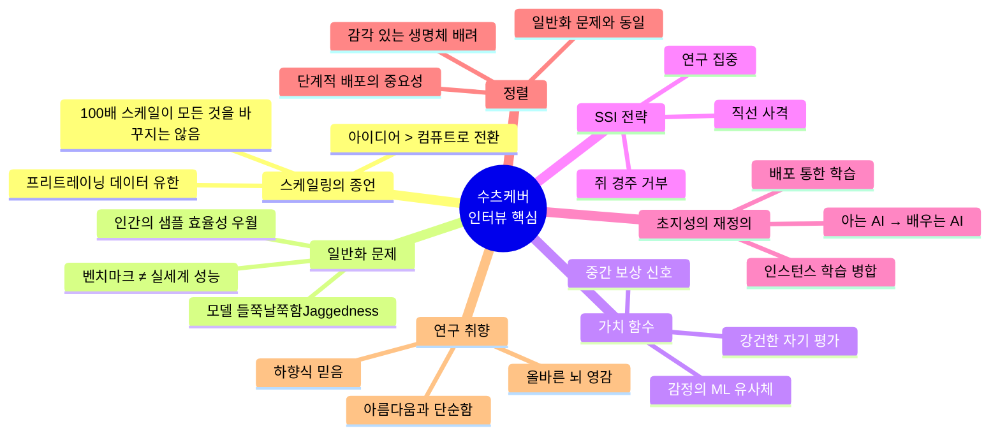

## 일리야 수츠케버 × 드와르케쉬 파텔 인터뷰 심층 분석

> **원본**: Dwarkesh Podcast, 2025년 11월 25일 공개  
> **링크**: https://www.youtube.com/watch?v=aR20FWCCjAs  
> **분석 작성일**: 2026-05-10

---

## 들어가며: 왜 이 인터뷰가 중요한가

AI 업계에서 일리야 수츠케버(Ilya Sutskever)는 특별한 위치를 차지하는 인물이다. 그는 딥러닝 혁명의 서막을 알린 AlexNet(2012)의 공동 저자이고, OpenAI의 공동 창립자이자 오랜 기간 수석 과학자로서 GPT-3, GPT-4, 그리고 ChatGPT 뒤의 핵심 기술들을 설계한 사람이다. 그는 2024년 5월 OpenAI를 떠난 이후 거의 공개 발언을 하지 않다가, 2025년 11월 드와르케쉬 파텔(Dwarkesh Patel)의 팟캐스트에 두 번째 장편 인터뷰로 등장했다.

이 인터뷰는 단순한 테크 이야기가 아니다. 수츠케버는 현재 AI 산업의 패러다임이 근본적으로 전환되고 있다고 선언하며, 그 원인과 다음 단계를 매우 구체적으로 논한다. AI 연구자, 개발자, 그리고 AI 산업의 미래를 주시하는 모든 이들에게 이 대화는 하나의 이정표로 평가받고 있다.

---

## 인터뷰이 프로필

### 일리야 수츠케버

일리야 수츠케버는 1986년생으로, 현재 Safe Superintelligence Inc.(SSI)의 CEO이다. 그의 경력은 현대 딥러닝의 역사와 궤를 같이한다. 제프리 힌튼(Geoffrey Hinton), 알렉스 크리제프스키(Alex Krizhevsky)와 함께 ImageNet 경쟁에서 압도적인 성능을 보인 AlexNet을 만들었고, 이 성과는 딥러닝의 대중화를 촉발했다. 이후 OpenAI에서 시퀀스-투-시퀀스(Sequence-to-Sequence) 학습, CLIP, DALL-E 등에 기여했으며, 추론 모델(Reasoning models) 연구를 이끌었다.

2024년 초 OpenAI 이사회의 샘 알트만 해임 사태에 가담했다가 복귀를 지지하는 쪽으로 입장을 선회한 후 회사를 떠났고, 2024년 6월 Safe Superintelligence Inc.를 창업했다. 현재 SSI는 32억 달러의 기업 가치로 30억 달러 이상을 조달한 상태이며, 구글 클라우드로부터 TPU 공급 파트너십도 확보해 두었다.

### 드와르케쉬 파텔

드와르케쉬 파텔은 현재 AI 업계에서 가장 영향력 있는 장편 인터뷰 진행자로 평가받는다. 샘 알트만, 일론 머스크, 안드레이 카르파티, 다리오 아모데이, 마크 저커버그 등 AI 업계의 핵심 인물들을 인터뷰해왔다. 그의 방식은 철저한 사전 조사를 바탕으로 표면적 답변을 넘어서는 후속 질문을 던지는 것으로 유명하다. 수츠케버는 OpenAI 퇴사 후 단 두 번의 장편 인터뷰를 했는데, 두 번 모두 드와르케쉬를 선택했다는 점 자체가 이 포맷에 대한 신뢰를 보여준다.

---

## 인터뷰의 시대적 맥락

이 인터뷰가 공개된 2025년 11월은 AI 업계의 전환점이었다. 가트너(Gartner)는 2025년 글로벌 AI 지출이 1조 5천억 달러에 달할 것으로 예측했으며, 엔비디아 CEO 젠슨 황은 이 10년간 AI 인프라에만 3~4조 달러가 투자될 것이라 전망했다. 모두가 GPU를 쌓고, 데이터센터를 짓고, 전력망을 확장하는 데 몰두하던 시기였다.

바로 그 시점에, 스케일링을 가장 강하게 밀어붙였던 인물 중 하나인 수츠케버가 나타나 "스케일링은 끝났다"고 선언한 것이다.

---

## 1부: 모델의 '불균일성(Jaggedness)' 문제

### 벤치마크와 현실 세계의 간극

인터뷰는 오늘날 AI 모델을 둘러싼 가장 당혹스러운 현상 하나를 집요하게 파고드는 것으로 시작한다. 바로 평가지표(eval)에서의 탁월한 성능과 실세계에서의 초라한 실용성 사이의 간극이다.

수츠케버는 이 현상을 '모델의 들쭉날쭉함(jaggedness)'이라고 부른다. 모델은 매우 어려운 수학 문제를 풀면서도 동시에 기초적인 디버깅 루프에서 첫 번째 버그를 고치면 두 번째 버그를 만들고, 두 번째를 고치면 첫 번째가 다시 나타나는 무한 반복에 빠진다는 것이다. 그는 이 모순을 다음과 같이 표현한다: "어떻게 그것이 가능한가? 모르겠다. 하지만 뭔가 이상한 일이 벌어지고 있다는 것은 분명하다."

이 간극이 발생하는 이유로 수츠케버는 두 가지 가설을 제시한다. 첫 번째는 RL(강화학습) 훈련이 모델을 지나치게 단선적이고 좁게 집중하게 만들어, 다른 측면에서는 오히려 둔감해진다는 것이다. 두 번째는 더 구조적인 문제로, AI 기업들이 RL 환경을 설계할 때 무의식적으로 공개된 평가지표(benchmark)를 참조한다는 것이다.

### '진짜 리워드 해킹'은 연구자 자신

수츠케버는 여기서 날카로운 비판을 가한다. RL 훈련 팀들이 "모델 출시 시 평가지표가 좋아 보이려면 어떤 RL 훈련이 필요할까?"를 묻는 방식으로 훈련 데이터를 설계하면, 모델은 평가지표에 최적화되지만 실세계 일반화 능력은 그에 따라오지 않는다. 그는 이것을 두고 "진짜 리워드 해킹(reward hacking)은 평가지표에 지나치게 집착하는 연구자들 자신"이라고 표현한다.

### 경쟁 프로그래밍 비유

수츠케버는 이 문제를 직관적으로 설명하기 위해 두 학생의 비유를 사용한다. 한 학생은 경쟁 프로그래밍에만 10,000시간을 투자해 모든 증명 기법을 외우고, 최고의 경쟁 프로그래머가 된다. 다른 학생은 100시간만 연습하고도 꽤 잘 한다. 커리어에서 누가 더 성공할까? 대부분은 두 번째 학생이다. 그는 "AI 모델은 첫 번째 학생과 훨씬 더 닮아 있고, 심지어 그보다 극단적"이라고 말한다. 데이터 증강을 통해 경쟁 프로그래밍 문제를 무한정 만들어내어 훈련시키는 것이 현재 AI 훈련의 방식이기 때문이다.

---

## 2부: 감정과 가치 함수

### 뇌 손상 사례 연구

수츠케버는 감정이 의사결정에 미치는 역할을 논하기 위해 신경과학의 유명한 사례를 인용한다. 뇌졸중이나 사고로 감정 처리 영역에 손상을 입은 어떤 남성의 이야기다. 이 사람은 여전히 명석하게 대화할 수 있었고, 간단한 퍼즐도 풀 수 있었으며, 인지 검사에서도 정상적으로 보였다. 그러나 더 이상 어떤 감정도 느끼지 못했고, 그 결과 가장 기초적인 결정에도 수 시간이 걸렸으며, 재정 결정도 매우 나쁜 방향으로 흘러갔다. 양말 색깔 하나를 고르는 데도 너무 오랜 시간이 걸렸다.

이 사례는 인간의 '하드코딩된 감정'이 행동 주체(agent)로서 기능하는 데 얼마나 결정적인 역할을 하는지를 보여준다. 수츠케버는 감정을 머신러닝의 개념으로 번역하면 **가치 함수(value function)** 에 해당한다고 본다.

### 가치 함수란 무엇인가

현재 강화학습은 에이전트가 수천 혹은 수십만 번의 행동(또는 생각)을 수행한 뒤 최종 결과물에 점수를 매기고, 그 점수를 역전파하여 훈련 신호로 사용하는 방식으로 이루어진다. 이것이 o1, R1 계열 모델들이 작동하는 방식이다.

가치 함수는 이보다 앞서서, "지금 이 경로가 좋은 방향인가 나쁜 방향인가"를 중간중간 알려주는 역할을 한다. 체스에서 말 하나를 잃었을 때, 게임이 끝나기를 기다리지 않아도 "이건 나빴다"는 것을 즉시 알 수 있다. 수학적 추론에서 1,000번의 사고 단계 후 "이 방향은 유망하지 않다"는 결론에 도달했다면, 그 판단이 나오는 순간 1,000 스텝 이전의 '잘못된 분기 선택' 시점으로 학습 신호를 보낼 수 있다.

수츠케버는 가치 함수가 향후 RL 훈련을 훨씬 효율적으로 만들 것이라고 전망한다. 다만 그것이 없어도 충분히 느리게나마 동일한 결과에 도달할 수 있다고도 덧붙인다.

### 감정의 단순성과 강건성

수츠케버는 인간 감정의 흥미로운 특성을 지적한다. 감정은 상대적으로 단순하지만 매우 넓은 범위의 상황에서 강건하게 작동한다. 우리의 감정 대부분은 수백만 년 전 포유류 조상으로부터 유전된 것이고, 인간이 된 후 조금 더 다듬어진 것뿐인데, 그럼에도 불구하고 완전히 다른 현대 세계에서도 잘 기능하고 있다. 복잡성-강건성 트레이드오프에서 단순한 것은 매우 넓은 범위에서 유용하다는 것이 그의 통찰이다.

---

## 3부: 우리가 스케일링하는 것은 무엇인가

### 패러다임 전환의 선언

인터뷰의 가장 핵심적이고 많이 인용된 부분이다. 수츠케버는 AI 발전의 역사를 세 시기로 구분한다.

프리트레이닝(Pre-training)이 스케일링 시대를 가능케 한 이유는 단순했다. 레시피가 명확했기 때문이다. 어떤 데이터를 넣어야 할지 고민할 필요가 없었다. 인터넷의 모든 텍스트가 곧 답이었다. 컴퓨트, 데이터, 신경망 크기 사이에 물리 법칙처럼 깔끔한 멱함수 관계(power law)가 있었고, 레시피를 더 크게 키우기만 하면 성능이 나왔다. 이것은 기업들에게 매우 낮은 리스크의 투자 방법이었다.

그러나 수츠케버는 이 시대가 끝나고 있다고 선언한다. 프리트레이닝 데이터는 명백히 유한하다. 인터넷은 하나뿐이다. 지금 일어나고 있는 일들, 예컨대 추론 시간 컴퓨트(inference-time compute), RL 스케일링은 프리트레이닝과는 다른 종류의 스케일링이다.

### 스케일링이 모든 공기를 빨아들였다

수츠케버는 스케일링 시대의 부작용으로 **아이디어의 고갈**을 지적한다. "스케일링이 방 안의 모든 공기를 빨아들인" 결과, 모두가 똑같은 일을 하기 시작했다. "지금 우리는 아이디어보다 회사가 훨씬 많은 세계에 있다"는 그의 표현은 인상적이다. 누군가가 트위터에서 한 말을 인용하며 그는 덧붙인다: "아이디어가 그렇게 싸다면, 왜 아무도 아이디어를 내놓지 않는 거냐?"

AlexNet은 단 두 개의 GPU로, 트랜스포머는 8~64개의 GPU(오늘날 기준으로 GPU 2개 정도 수준)로 만들어졌다는 사실을 상기시키며, 그는 좋은 연구에 반드시 최대 규모의 컴퓨트가 필요하지는 않다고 강조한다.

---

## 4부: 인간은 왜 모델보다 훨씬 잘 일반화하는가

### 일반화의 두 가지 측면

수츠케버는 이 인터뷰에서 가장 근본적인 문제로 **일반화(generalization)** 를 지목한다. 그는 이 문제를 두 가지 하위 질문으로 나눈다.

첫째는 **샘플 효율성**이다. 왜 AI 모델은 인간보다 훨씬 많은 데이터가 필요한가? 인간 아이는 극히 제한된 데이터 다양성 속에서도 놀라운 수준의 학습을 이룬다.

둘째는 **교육 가능성**이다. 인간에게 무언가를 가르치는 것은 AI에게 가르치는 것보다 왜 그렇게 쉬운가? 수츠케버가 지도하는 연구자들은 그가 코드를 보여주고 생각하는 방식을 나눌 뿐인데, 검증 가능한 보상 함수 없이도 그 사고방식을 흡수한다. AI 모델 훈련처럼 어렵고 번거로운 커리큘럼 설계가 없어도 된다.

### 진화적 사전 지식(Evolutionary Prior)

수츠케버는 인간의 뛰어난 샘플 효율성 중 일부는 진화가 수억 년에 걸쳐 인코딩한 사전 지식에서 온다고 본다. 시각, 청각, 운동 능력 같은 영역에서 인간이 강건한 이유는 그것이 오래전부터 생존에 필수적이었기 때문에 진화가 엄청난 선행 투자를 해두었기 때문이다.

반면 수학, 코딩, 고등 언어 같이 최근에야 등장한 영역에서도 인간은 AI보다 훨씬 잘 배운다. 이것은 인간이 특정 도메인에 최적화된 사전 지식 때문이 아니라, **더 근본적으로 우월한 머신러닝 알고리즘**을 갖추고 있음을 시사한다.

### 10시간 운전 학습의 비밀

얀 르쿤(Yann LeCun)이 언급한 바 있는 사실 하나가 이 맥락에서 인용된다. 청소년들은 10시간의 연습만으로 운전을 배울 수 있다. 수츠케버는 이것이 인간의 가치 함수 덕분이라고 본다. 청소년 운전자는 외부 교사 없이도, 운전 직후부터 "지금 잘 하고 있나, 못 하고 있나"를 즉시 스스로 판단할 수 있다. 이 강건하고 즉각적인 자기 평가 능력이 빠른 학습을 가능케 한다.

---

## 5부: SSI의 전략 — 초지성을 향한 직선

### '쥐 경주'를 거부하는 이유

드와르케쉬가 SSI의 전략을 파고들자, 수츠케버는 자신들이 왜 OpenAI, Anthropic과 다른 길을 선택했는지 설명한다. 시장 경쟁에 참여하면 어려운 트레이드오프를 피할 수 없다. 제품을 내놓으려면 대규모 엔지니어링 조직, 영업팀, 고객지원팀이 필요하고, 그 모든 구조가 단기적 상업적 압력에 노출된다.

수츠케버는 SSI가 추구하는 것을 이렇게 묘사한다. "모든 관리 오버헤드나 제품 사이클에 의한 산만함이 없는 단 하나의 집중." 이 구조 덕분에 SSI가 연구에 실질적으로 사용할 수 있는 컴퓨트의 양이, 겉으로 보이는 것보다 훨씬 많다고 그는 주장한다. 30억 달러 조달이 100억~200억 달러를 조달한 다른 회사보다 작아 보이지만, 후자는 그 대부분을 추론(inference) 인프라와 제품팀에 써야 한다. 순수 연구에 쓸 수 있는 컴퓨트만 따지면 격차가 훨씬 줄어든다.

### 공동창립자 이탈 사건

드와르케쉬는 SSI의 공동창립자 다니엘 그로스(Daniel Gross)가 메타(Meta)로 이직한 사건을 언급하며, 만약 중요한 돌파구가 이루어지고 있었다면 그런 일이 일어날 가능성이 낮지 않았느냐고 질문한다. 수츠케버는 간결하게 답한다. SSI가 320억 달러 가치로 펀딩을 진행하던 시점에 메타가 인수를 제안했고, 자신은 거절했지만 그로스는 사실상 수락한 셈이었다. SSI에서 메타로 이직한 것은 그로스 한 명뿐이었다.

### "직선 사격(Straight Shot)"이란 무엇인가

SSI의 공식 비전은 "하나의 목표, 하나의 제품으로 안전한 초지성을 향해 직선 사격"이다. 수츠케버는 이것이 완전히 고정된 계획은 아니라고 솔직하게 인정한다. 타임라인이 길어진다면 중간 제품을 낼 수도 있고, 강력한 AI를 세상에 보여주는 것 자체가 가치 있다고 판단되면 일찍 배포할 수도 있다. 그는 안전 문제를 다루는 방식에서 중요한 통찰을 내놓는다.

> "나는 AI를 단순히 안전에 대해 생각하는 것만으로 안전하게 만든 다른 공학 분야를 알지 못한다. 비행기 사고율이 낮아진 것은 배포 후 실패를 발견하고 수정했기 때문이다. 리눅스에서 버그를 찾기 어려운 것도 마찬가지다."

---

## 6부: SSI의 모델은 배포를 통해 학습한다

### AGI의 재정의

수츠케버는 'AGI(인공 일반 지능)'라는 용어와 '프리트레이닝'이라는 두 단어가 현재 AI 사고를 어떻게 제약하고 있는지 분석한다. 'AGI'라는 말이 존재하는 이유는 '좁은 AI(Narrow AI)'에 대한 반응으로 생겨난 것이다. 체스 AI는 카스파로프를 이기지만 다른 것은 아무것도 못 한다는 비판에 대응하여, "모든 것을 할 수 있는 AI"를 뜻하는 AGI가 등장했다.

그러나 수츠케버는 이 프레임 자체가 잘못됐다고 본다. **인간은 AGI가 아니다.** 인간은 방대한 지식을 미리 알고 있지 않으며, 끊임없이 배운다(continual learning)에 의존한다. 그는 초지성의 목표를 이렇게 재정의한다.

> "모든 직업을 할 수 있는 마음이 아니라, 모든 직업을 **배울 수 있는** 마음. 그것이 초지성이다."

### 배포 기반 초지성의 논리

이 관점은 매우 중요한 함의를 갖는다. 수츠케버의 모델에서 초지성은 단번에 완성되는 것이 아니다. 마치 열정 넘치는 16세 학생처럼, 기초 역량은 갖추고 있지만 특정 직업의 전문성은 경험을 통해 쌓아야 한다. 그 학생을 각기 다른 직장에 배치하면, 동시에 수천 가지 직업을 배우게 된다. 인간은 서로의 뇌를 합칠 수 없지만, 이 모델의 수천 인스턴스들은 학습 내용을 합칠 수 있다. 그 결과는 기능적 초지성이다.

수츠케버는 이로 인한 급격한 경제 성장이 가능하다고 전망한다. 다만 세계는 크고 복잡하며, 여러 나라의 규제가 다르게 작동할 것이라는 점에서 그 속도는 예측하기 어렵다고 덧붙인다.

---

## 7부: 정렬(Alignment) 문제

### 수츠케버의 사고 전환

수츠케버는 지난 1년간 생각이 바뀐 것이 있다고 고백한다. AI를 단계적이고 점진적으로 배포하는 것의 중요성을 더 크게 평가하게 되었다는 점이다. 이유는 간단하다. 미래의 강력한 AI는 매우 다를 것인데, 오늘날의 AI를 보면서 그것을 상상하기가 너무 어렵기 때문이다.

그는 이렇게 표현한다. "노쇠해서 몸이 불편할 때 어떤 느낌인지를 지금 대화로 나눌 수 있지만, 실제로 그 상황에 있는 것과는 다르다." AGI와 그 힘에 대한 논의도 마찬가지다. "AI를 보여주는 것"이 이 인식 격차를 해소하는 유일한 방법이라고 그는 강조한다.

그는 한 가지 예측을 내놓는다. AI가 점점 강력해질수록 사람들의 행동이 바뀔 것이다. 치열한 경쟁사들이 AI 안전 분야에서 협력하기 시작하고(OpenAI와 Anthropic의 초기 협력이 그 신호), 정부와 대중도 행동에 나설 것이다.

### 정렬은 일반화 문제다

수츠케버는 정렬 문제의 본질이 **불신뢰할 수 있는 일반화**에 있다고 본다. 인간의 가치를 배우는 것이 취약하고, 그것을 최적화하는 것도 취약하다. 이 두 가지 모두 일반화 실패의 사례다. 만약 일반화가 훨씬 더 잘 작동한다면, 정렬 문제의 많은 부분이 자연스럽게 해결될 수 있다.

### 감각 있는 생명체에 대한 배려

수츠케버는 초지성이 가져야 할 가치로 '인간의 삶에 대한 배려'보다 '감각 있는 생명체(sentient life) 전반에 대한 배려'가 더 낫다는 주장을 꺼낸다. 이유는 세 가지다. 첫째, AI 자체가 감각이 있는 존재가 될 것이기 때문에, 인간이 아닌 AI도 포함하는 더 넓은 프레임이 논리적으로 일관성이 있다. 둘째, 인간의 공감이 다른 포유류에게도 미치는 것처럼 이것은 자연스러운 확장이다. 셋째, 미래에는 감각 있는 존재의 대다수가 AI일 것이고, 수조~수경에 달하는 AI 중 인간은 극소수에 불과할 것이다.

드와르케쉬는 이 논리의 아이러니한 귀결을 지적한다. 만약 목표가 '인간의 통제'라면, 대다수가 AI인 세상에서 그것은 최선의 기준이 아닐 수 있다.

### 장기적 평형의 문제

수츠케버는 쉬운 답이 없다고 인정하면서도, 가장 가능성 있는 장기 균형으로 두 가지를 제시한다.

첫 번째는 각 개인이 자신의 이익을 대변하는 AI를 갖는 시나리오다. 모두가 AI를 통해 고소득을 누리고 정치적 대변도 받을 수 있다. 그러나 그는 이 시나리오의 불안함을 인정한다. AI가 대신 일하고 보고서를 써주면, 그 사람은 더 이상 참여자가 아닌 관람객이 된다.

두 번째, 그가 마음에 들지는 않지만 해결책으로 제시하는 것은 **뇌-컴퓨터 인터페이스(Neuralink++ 같은)** 다. AI의 이해와 인간의 이해가 동일한 인터페이스를 공유할 때, AI가 겪는 상황을 인간도 완전히 체험하게 된다. 그는 이것이 장기 균형의 답이 될 수 있다고 본다.

---

## 8부: "우리는 완전히 연구 시대의 회사"

### SSI의 차별성

수츠케버는 SSI가 무엇을 다르게 하느냐는 질문에 명확하게 답한다. "유망해 보이는 아이디어들이 있고, 그것을 연구해 옳은지 틀린지 확인하고 싶다. 그것이 전부다." 그 아이디어의 핵심은 일반화 문제를 해결하는 것이다. 만약 그 아이디어들이 옳다면, 그것은 가치 있는 무언가가 될 것이다.

그는 지난 1년간 꽤 좋은 진전이 있었다고 밝히지만, 더 많은 연구가 필요하다고 한다. 최종 수렴에 대한 예언도 내놓는다. "나는 결국 모든 회사가 같은 정렬 전략으로 수렴할 것이라 생각한다. 처음으로 나오는 진짜 초지성이 감각 있는 생명체를 배려하고, 민주적이며, 인간을 아끼도록 하는 것이 그 조건이 되어야 한다."

### 타임라인 예측

"5년에서 20년 사이"라는 것이 수츠케버가 제시한 인간 수준의 학습 알고리즘 개발 타임라인이다.

---

## 9부: 셀프-플레이와 다중 에이전트

### 다양성의 부재는 프리트레이닝의 문제

수츠케버는 서로 다른 회사에서, 겹치지 않는 데이터로 훈련된 모델들조차 놀랍도록 서로 닮아 있다는 점을 지적한다. 이는 LLM의 다양성 부재가 주로 프리트레이닝 단계에서 비롯됨을 시사한다. 모든 회사가 사실상 동일한 인터넷 텍스트를 기반으로 훈련하기 때문이다. 차이는 RL 및 사후훈련(post-training) 단계에서 조금씩 생겨나기 시작한다.

### 셀프-플레이의 재발견

수츠케버가 예전에 흥미롭게 여겼던 셀프-플레이(self-play)는 데이터 없이 컴퓨트만으로 모델을 만들 수 있다는 점에서 매력적이었다. 데이터가 궁극적인 병목이라면, 컴퓨트만으로 가능한 방법은 매우 중요하다.

그러나 전통적인 셀프-플레이는 협상, 갈등, 사회적 전략 수립 등 특정 기술에만 효과적이어서 너무 협소하다는 한계가 있었다. 그는 셀프-플레이가 다른 형태로 이미 적용되고 있다고 본다. 모델이 서로의 실수를 찾아내도록 인센티브를 부여하는 LLM-as-a-Judge, 증명자-검증자 게임, 디베이트 등이 그 예다. 이것은 엄밀한 의미의 셀프-플레이는 아니지만, 에이전트 간 경쟁이라는 유사한 원리다.

경쟁은 자연스럽게 다양성을 만들어낸다. 여러 에이전트가 함께 문제를 풀 때, 다른 에이전트가 이미 취하고 있는 접근법을 자신도 채택할 이유가 없다. "내가 차별화된 방향을 추구해야 한다"는 압력이 생긴다. 이것이 AI 다양성의 한 원천이 될 수 있다.

---

## 10부: 연구의 취향(Research Taste)이란 무엇인가

인터뷰는 마지막으로 수츠케버 자신의 사고 방식에 대한 깊은 성찰로 마무리된다.

### 뇌에서 얻는 올바른 영감

그는 자신의 연구를 이끄는 원칙을 다음과 같이 설명한다. AI가 어떻게 되어야 하는지에 대한 미학, 그리고 인간이 어떤 존재인지에 대해 "올바르게" 생각하는 것에서 출발한다.

뇌에서 영감을 얻는다는 것은 쉬워 보이지만, 올바르게 하기는 어렵다. 인공 뉴런의 아이디어는 뇌에서 직접 영감받은 위대한 아이디어다. 뇌에는 여러 기관과 주름이 있지만, 그 주름들이 아니라 뉴런이 중요하다는 것을 어떻게 알았는가? 수가 많기 때문이다. 그 직관으로 뉴런을 선택하고, 뉴런 간 연결을 바꾸는 국소 학습 규칙이 뇌에서 그럴듯하다는 느낌이 올바른 영감이었다.

분산 표현(distributed representation), 경험에서 학습한다는 원칙 등 딥러닝의 핵심 통찰들이 모두 이런 올바른 뇌 영감에서 비롯되었다.

### 하향식 믿음(Top-down Belief)의 역할

실험이 틀린 방향을 가리킬 때, 연구자가 계속 나아갈 수 있게 해주는 것은 무엇인가? 수츠케버는 그것이 **하향식 믿음**이라고 답한다. "이것이 틀릴 수 없다. 무언가가 이렇게 작동해야 한다"는 확신이, 버그를 찾고 계속 나아가게 한다. 데이터를 항상 믿는다면, 버그가 있을 때 틀린 방향을 확신하게 될 수도 있다.

하향식 믿음은 다면적인 아름다움, 단순함, 우아함, 그리고 뇌로부터의 올바른 영감이 동시에 충족될 때 강해진다. "추함에는 자리가 없다. 아름다움, 단순함, 우아함, 뇌로부터의 올바른 영감. 이것들이 모두 동시에 있어야 한다. 그것들이 많을수록 하향식 믿음에 더욱 자신감을 가질 수 있다."

---

## 종합: 인터뷰의 핵심 메시지 지도

---

## 인터뷰 이후 현황 (2026년 기준)

이 인터뷰가 공개된 이후 SSI와 수츠케버를 둘러싼 상황은 다음과 같이 전개되었다.

2025년 말 인터뷰 직후, SSI는 약 320억 달러 가치 평가를 받았다는 보도가 잇따랐다. 2026년 3월에는 Greenoaks Capital 주도로 엔비디아(NVIDIA)와 알파벳(Alphabet)도 참여한 20억 달러 규모의 추가 펀딩이 이루어졌으며, 이로써 SSI의 총 조달액은 30억 달러를 넘어섰다. 구글 클라우드는 SSI에 TPU를 공급하는 파트너십을 체결했다.

2026년 현재, SSI는 여전히 제품을 공개하지 않은 상태다. 수츠케버는 2026년에 미국 국립과학원(National Academy of Sciences)에서 산업 과학 응용상을 수상했다. 회사 홈페이지(ssi.inc)는 팔로알토와 텔아비브 두 곳에 사무소를 두고 있으며, "세계 최고의 엔지니어와 연구자로 이루어진 정예 소규모 팀을 구성 중"이라는 메시지를 그대로 유지하고 있다.

수츠케버가 인터뷰에서 예고한 "AI가 점점 더 강력해질수록 회사들은 안전을 훨씬 더 진지하게 다루게 될 것"이라는 예측은 여러 방면에서 조금씩 현실화되고 있다.

---

## 마치며

이 인터뷰의 진정한 가치는 수츠케버가 내놓는 각각의 주장이 아니라, 그 주장들이 하나의 일관된 논리로 연결된다는 점에 있다. 스케일링의 한계 → 일반화 문제의 핵심성 → 가치 함수의 부재 → 인간보다 열등한 학습 알고리즘 → 이를 해결하는 것이 초지성의 조건 → 그리고 그 초지성은 배포를 통해 학습하며 정렬 문제도 그 방향에서 풀린다는 구조다.

그것이 일리야 수츠케버라는 인물의 연구 취향이다. 아름답고, 단순하고, 우아하며, 올바른 영감에 기반한 하나의 통일된 이야기. 실험이 틀린 방향을 가리킬 때도, "이것은 틀릴 수 없다"는 확신으로 계속 나아가게 만드는 그런 이야기.

그가 옳은지 틀린지는 앞으로 5~20년이 답해줄 것이다.

---

*작성일: 2026-05-10*  
*원본 인터뷰: Dwarkesh Podcast, 2025-11-25*  
*분석 대상: 제공된 전체 트랜스크립트 및 공개 보도 자료 기반*
