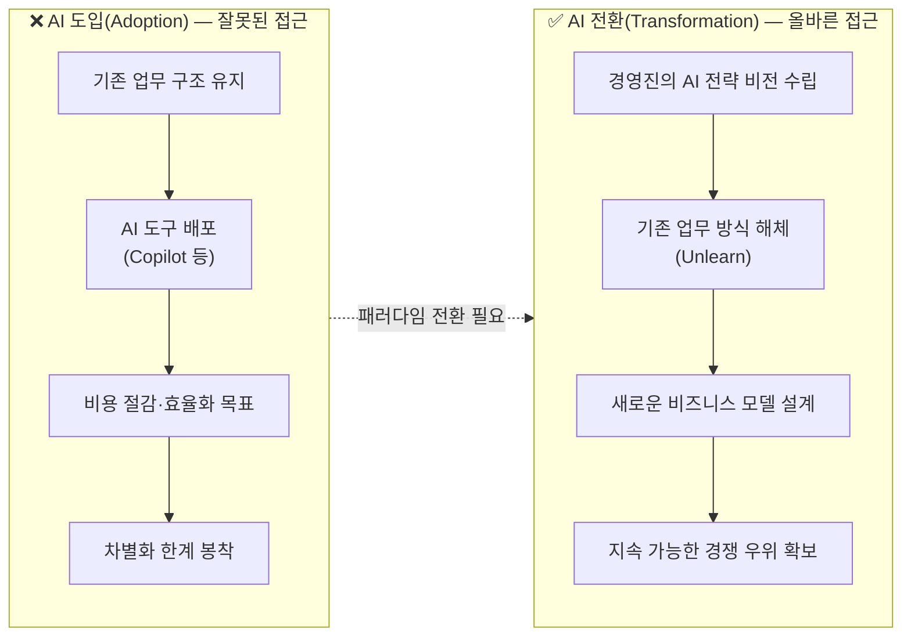
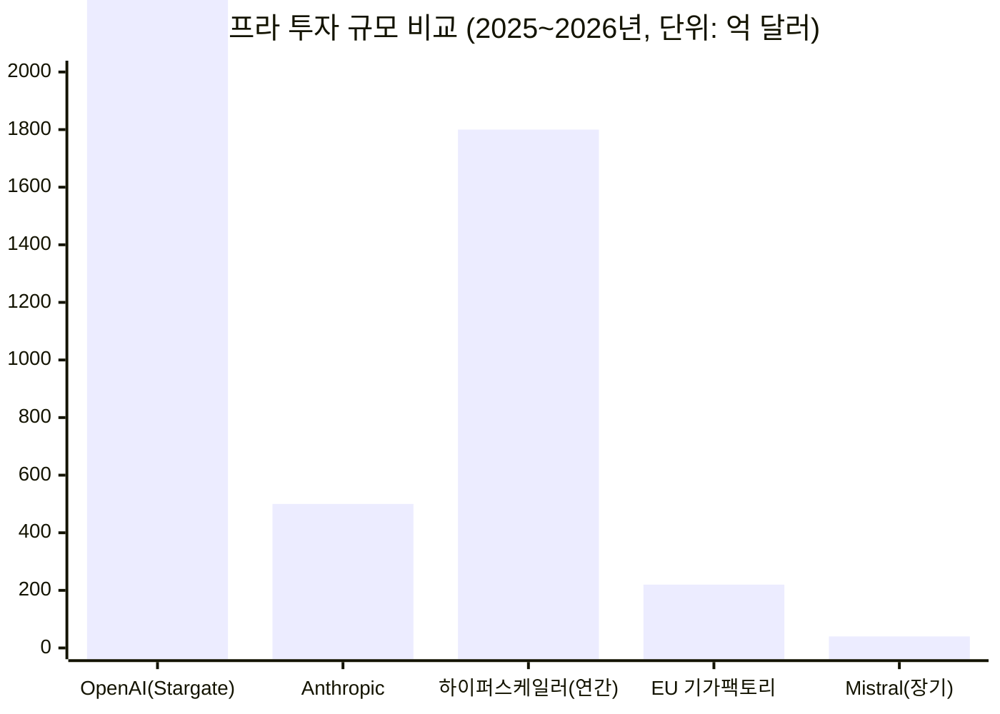
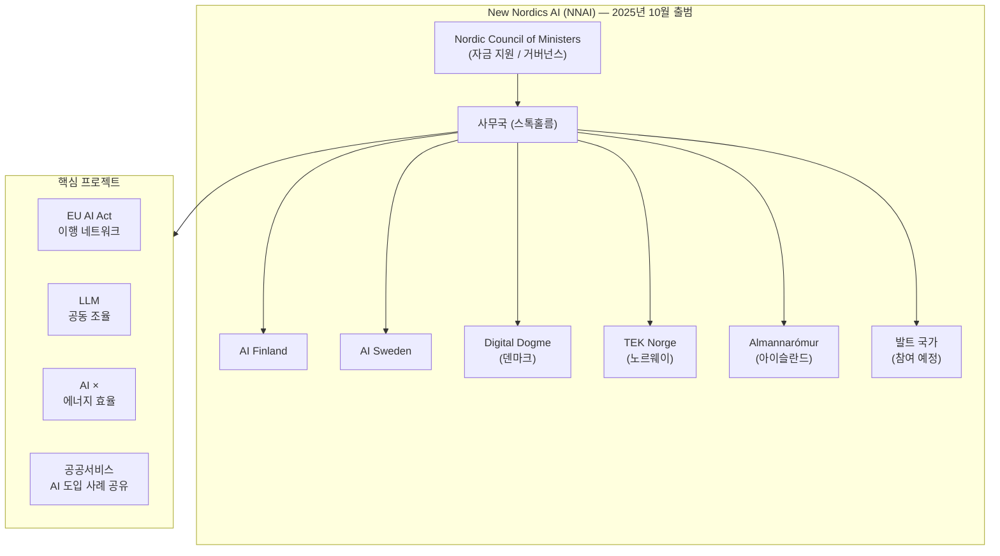
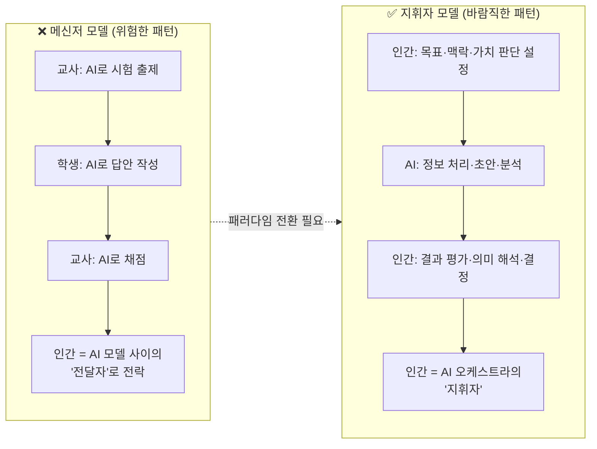
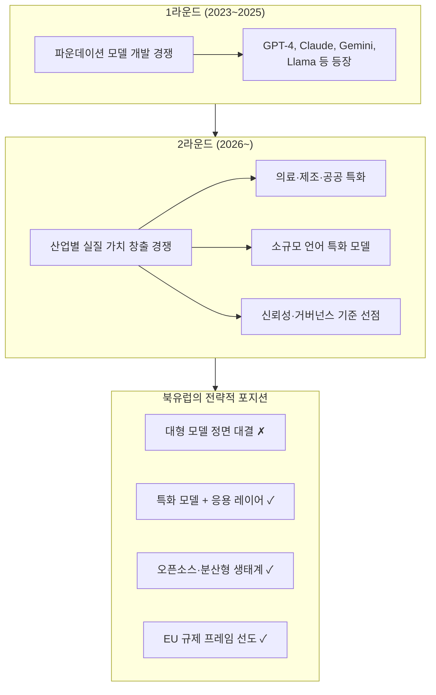
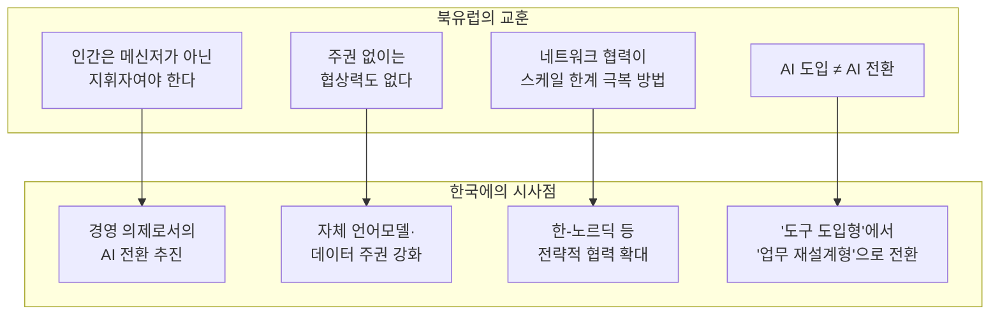

> [동아일보 2026년 5월 7일자 인터뷰]( https://www.donga.com/news/Inter/article/all/20260507/133822792/1)를 원문으로 삼아, 관련 최신 자료와 배경을 종합·분석한 심층 해설

---

## 1. 인터뷰의 배경: '한+노르딕 혁신의 날 2026'

2026년 4월 21일부터 23일까지, 주한 덴마크·핀란드·노르웨이·스웨덴 대사관이 공동으로 '한+노르딕 혁신의 날(Nordic+Korea Innovation Days 2026)'을 서울·경기·대전 3개 도시에서 개최했다. 2회를 맞이한 이 행사는 급변하는 기술 환경 속에서 한국과 북유럽 4개국이 공유하는 가치와 경험을 기반으로, 인간 중심의 지속가능한 혁신과 회복탄력성 있는 사회 모델을 모색하는 협력 플랫폼으로 자리매김하고 있다. 특히 2026년 행사에서는 'AI 시대의 인간-기술 새로운 협업 방식'을 핵심 의제로 설정하고, 기술 발전이 생산성·경쟁력 강화와 신뢰·책임성·사회적 포용을 어떻게 조화시킬 수 있는가를 집중 조명했다.

동아일보는 이 행사 참석차 방한한 두 전문가를 2026년 4월 24일 서울 종로구 주한핀란드대사관에서 단독 인터뷰했다. 두 인물은 각각 **이다 레데매키(Ida Lähdemäki, AI 핀란드 최고운영책임자·COO)** 와 **스테판 벤딘(Stefan Wendin, 스웨덴 국립연구원 RISE 지능형 시스템 부문장)** 이다. AI 핀란드는 핀란드의 AI 산업 진흥을 총괄하는 국가 무역협회이고, RISE(Research Institutes of Sweden)는 스웨덴 정부가 지원하는 국책 연구기관으로 산업계와 공공 부문의 AI 실증·응용을 이끌어온 곳이다.

---

## 2. 핵심 주장 1: "AI 도입(adoption)"이라는 표현 자체가 잘못됐다

인터뷰의 첫 번째 핵심 논점은 기업들이 AI를 대하는 방식에 대한 근본적인 문제 제기다. 레데매키 COO는 "'AI 도입(adoption)'이라는 표현 자체가 문제"라고 잘라 말했다. 그에 따르면 AI 도입이란 기존에 하던 일을 그대로 유지하면서 그 위에 AI를 '살짝 얹는' 것에 불과하다. 많은 기업이 직원들에게 Microsoft Copilot 같은 AI 도구를 쥐어주고 "이제 알아서 써봐"라고 하는 방식이 그 전형적인 예다. 그는 이것을 AI 전환(transformation)과 혼동해서는 안 된다고 강조한다.

진정한 AI 전환의 출발점은 경영진이 AI가 사업 전반에 미칠 영향을 이해하고 명확한 비전을 제시하는 것이다. 비용 절감과 운영 최적화는 AI 활용의 출발점이 될 수 있어도, 그것만으로는 경쟁 차별화를 이루기 어렵다. 진짜 질문은 "어떻게 프로세스를 효율화할까"가 아니라 "어떻게 새로운 비즈니스를 만들고, 어떻게 성장할 것인가"여야 한다는 것이다.

벤딘 부문장은 이 논점을 다른 각도에서 심화시킨다. 그는 AI 시대의 진정한 전환이란 "새로운 것을 쌓는 게 아니라 무엇을 내려놓을지 결정하는 것"이라고 말했다. 기존의 업무 방식을 버리는 것(unlearn), 즉 '학습 해제'가 전환의 핵심이라는 진단이다. 또한 AI가 이미 비즈니스 자체를 근본적으로 재편하는 국면에 접어들었기 때문에, 수동적 대응이 오히려 더 큰 리스크를 낳는다고 경고했다.

---

## 3. 핵심 주장 2: AI 주권 — 미국 의존에서 벗어나야 한다

두 번째 핵심 논점은 AI 주권(AI Sovereignty)이다. 벤딘 부문장은 이를 가장 시급한 과제로 꼽으며, 유럽 현황에 대한 강도 높은 비판을 내놓았다. 그의 비유는 날카롭다. "협상 테이블에서 자리를 박차고 나올 수 없다면, 당신은 자기 자신의 계약 조건을 협상하는 셈"이라는 것이다. 유럽의 정부와 지방자치단체가 AI와 관련해 구매하는 서비스의 대부분이 미국 기반이라는 점을 지적하며, 유럽의 자금을 미국에 쏟아붓고선 별도로 자체 인프라 구축 자금을 모으려 한다는 것은 앞뒤가 맞지 않는다고 했다.

그렇다면 유럽의 현실적인 AI 경쟁력은 어디서 나오는가? 벤딘 부문장은 미국·중국의 폐쇄적 대형 모델과 달리, "누구나 자체 모델을 훈련할 수 있는 기반을 조성하는 것"을 유럽의 경쟁 방식으로 제시했다. 이는 북유럽이 오픈소스 생태계를 선도해온 역사와 맥을 같이 한다. 리눅스(Linux)가 대표적 사례다. 미국과 중국이 획일적이고 집중화된 접근 방식을 취하는 동안, 유럽은 다양한 아이디어들이 연결된 분산 네트워크로 작동해왔다는 것이다. 대형 모델로 정면 승부하는 것은 어렵지만, 경쟁의 '판 자체를 평등하게 만드는 것'이 유럽의 전략적 지향점이라고 그는 정리했다.

### 스웨덴과 Mistral의 파트너십: 유럽 AI 주권의 실체

이 맥락에서 주목할 최신 동향이 있다. 스웨덴은 현재 프랑스 AI 연구소 Mistral과 협력해 대규모 AI 인프라 구축을 추진 중이다. 2026년 2월 11일, Mistral은 스웨덴 중부 도시 Borlänge에 위치한 EcoDataCenter 부지에 12억 유로(약 1조 8천억 원)를 투자해 AI 데이터센터를 구축하겠다고 발표했다. 이는 Mistral의 프랑스 이외 지역에서의 첫 대규모 인프라 투자로, 2027년 가동을 목표로 한다. 해당 시설은 재생에너지로만 운영되며, Nvidia의 차세대 Vera Rubin GPU 기반 슈퍼컴퓨터를 탑재할 예정이다.

이어 2026년 3월 30일에는 Mistral이 파리 남부 Bruyères-le-Châtel에 데이터센터를 구축하기 위해 유럽 은행 컨소시엄으로부터 8억 3천만 달러의 부채 조달에 성공했다. BNP Paribas, Crédit Agricole, HSBC 등 주요 유럽 금융기관들이 참여했으며, 미국계 은행은 단 한 곳도 없었다. 이는 유럽 자본으로 유럽 AI 인프라를 구축하겠다는 전략적 의지의 표현이다. Mistral의 장기 목표는 2027년까지 유럽 전역에 200메가와트 규모의 컴퓨팅 인프라를 구축하는 것이다.

> ※ Stargate($5000억), Anthropic 인프라 투자($500억), 하이퍼스케일러 연간 설비투자($1800억 추정), EU AI 기가팩토리 계획($220억), Mistral 장기 목표($40억) 비교

물론 규모 면에서 미국과의 격차는 여전히 크다. 미국 OpenAI의 Stargate 프로젝트가 5,000억 달러 규모인 것과 비교하면 유럽의 투자는 아직 초보적 수준이다. 하지만 방향성은 분명하다. Mistral의 CEO 아르튀르 망쉬(Arthur Mensch)는 "유럽에 독립적인 AI 역량을 구축하는 구체적인 발걸음"이자 "유럽 AI 클라우드의 토대를 놓는 것"이라고 의미를 부여했다.

---

## 4. New Nordics AI: 협력으로 경쟁력을 만드는 지역 이니셔티브

레데매키 COO가 소개한 'New Nordics AI(NNAI)' 이니셔티브는 이 기사에서 가장 구체적인 정책 사례로 등장한다. 이 이니셔티브는 2025년 10월 22일 헬싱키에서 공식 출범했다. 핀란드가 의장국을 맡은 북유럽장관회의 체제 아래, 북유럽 각국의 AI 진흥 기관들—AI Finland, AI Sweden, 덴마크의 Digital Dogme, 노르웨이의 TEK Norge, 아이슬란드의 Almannarómur—이 공동으로 설립한 북유럽-발트 지역 응용 AI 센터다. 사무국은 스톡홀름에 두고 있으며, 3년간 3,000만 덴마크크로네의 예산을 북유럽장관회의로부터 지원받는다.

NNAI의 핵심 미션은 세 가지로 요약된다. 첫째, AI 도입 가속화를 통한 지역 기업·공공기관의 경쟁력 강화. 둘째, 전략적 공동 투자 촉진. 셋째, 국제 무대에서 지역의 발언권 강화. 특히 각국의 수도 공공서비스에 AI를 도입하는 사례를 국경을 넘어 공유하는 프로젝트가 대표적이다. 레데매키는 "모든 나라의 당국이 'AI를 국가 차원에서 어떻게 도입하지?'라는 동일한 질문을 하고 있는데, 왜 다들 혼자서 해결하려 하는가"라고 반문하며, 공동 해결을 통해 훨씬 많은 것을 배울 수 있다고 강조했다.

NNAI는 출범 초기에 이미 세 가지 실행 프로젝트를 발표했다. EU AI Act 이행 네트워크(AI Act Implementation Network), 대형언어모델(LLM) 조율 협력, 그리고 AI와 에너지 효율 프로젝트가 그것이다. 발트 국가들도 순차적으로 합류할 예정으로, 이 플랫폼은 궁극적으로 북유럽-발트 광역권의 AI 생태계를 연결하는 허브가 될 구상이다.

---

## 5. 북유럽의 AI 경쟁력 기반: 왜 북유럽인가

인터뷰를 제대로 이해하려면 북유럽 국가들이 AI 분야에서 왜 주목받는지 그 구조적 배경을 알아야 한다.

**첫째, 디지털 성숙도.** 덴마크와 핀란드는 EU 회원국 가운데 AI 도입률 최상위권에 위치하며, 글로벌 리더들과도 견줄 수 있는 수준이다. 스웨덴도 EU 평균을 크게 웃도는 도입률을 보인다. 북유럽이 AI를 논하는 것은 추상적 담론이 아니라 실제 도입과 활용 경험에 기반한 실천적 발언이다.

**둘째, 청정에너지와 데이터센터 인프라.** 핀란드, 스웨덴, 노르웨이, 덴마크는 수력·풍력·원자력 등 재생에너지가 풍부하고 기후가 서늘해 AI 데이터센터 운영의 냉각 비용을 크게 낮출 수 있다. 예컨대 핀란드의 Nebius 데이터센터는 전력사용효율(PUE) 1.1이라는 세계 최고 수준을 기록하며, 폐열을 인근 가정 난방에 재활용하고 있다. 이는 전 세계 AI 기업들이 북유럽에 데이터센터를 짓는 핵심 이유다.

**셋째, 오픈소스와 협력의 문화.** 리눅스(Linux)가 핀란드 출신 리누스 토르발스(Linus Torvalds)에 의해 탄생한 것은 상징적이다. 북유럽은 오픈소스 생태계를 선도하며 다양한 행위자들이 협력하는 분산형 혁신의 문화를 축적해왔다. 이는 미·중의 폐쇄적 거대 모델 전략과는 본질적으로 다른 접근이다.

**넷째, 스웨덴 AI 전략 2026.** 스웨덴 정부는 2026년 2월 AI 전략을 공식 채택하면서, ①AI 분야 세계 10위권 진입, ②공공행정 AI 활용 세계 최고 수준 달성, ③AI 스웨덴어 언어모델 접근성 확대 등을 명시적 목표로 설정했다. 전략은 교육·훈련, 연구·혁신, 인프라 세 축을 중심으로 구성되며, AI가 민주주의적 가치·법적 안정성·개인정보보호와 조화를 이루어야 함을 명확히 하고 있다.

---

## 6. 한국과의 협력 가능성: 무엇이 논의됐나

기사의 말미에서 벤딘 부문장은 한국과의 협력 가능성을 구체적으로 언급했다. 그는 SKT와 업스테이지가 공동 개발한 Solar 모델 등 한국의 자체 언어모델 이니셔티브를 거론하며, 공동의 문제로 인식하고 네트워크로 협력한다면 충분한 인재와 시장이 있다고 평가했다.

흥미로운 것은 그가 한국과 스웨덴의 문화적 차이를 오히려 상호보완적 관점에서 바라봤다는 점이다. 한국의 하향식(top-down) 의사결정 문화는 스웨덴의 합의 중심(consensus-driven) 문화와 상이하지만, 각기 다른 강점을 갖는다. 빠른 실행력이 필요한 국면에서는 한국식 의사결정이 유리할 수 있고, 지속 가능한 정착과 사회적 수용을 이끌어내는 데는 스웨덴식이 효과적일 수 있다는 것이다.

실제로 2026년 한+노르딕 혁신의 날 행사에서는 KAIST, UNIST, 현대자동차 AI 연구진 등 한국 측 참여자와 북유럽 연구자들 간에 휴머노이드 로보틱스, AI 기반 제조, AI 거버넌스 등의 분야에서 중장기 공동 협력 가능성이 논의됐다. 이는 단순한 기술 교류를 넘어, AI 시대의 전략적 파트너십으로 발전할 수 있는 기반을 갖추는 과정이다.

---

## 7. "메신저가 아니라 지휘자" — AI 시대 인간 역할론

두 전문가는 AI 시대에 인간적 역량이 오히려 더 중요해진다는 데 의견을 같이했다. 레데매키는 AI 기술을 적극적으로 배우고 활용하되, 일상을 '자동조종(autopilot) 모드'로 살아가면 많은 것을 놓치게 된다고 경고했다. 의도적으로 문제와 기회를 스스로 사고하는 시간을 확보해야 한다는 것이다.

벤딘 부문장의 비유는 더욱 선명하다. "교사가 AI로 시험을 만들고, 학생이 AI로 답하고, 교사가 AI로 채점하는 식으로 흘러가면, 인간은 AI 모델들 사이의 다리로 전락한다." 그는 인간이 AI의 '메신저(messenger)'가 아닌 '지휘자(conductor)'여야 한다고 단언했다. AI와 무관해도 좋으니 매일 5분씩 새로운 것을 찾아 시도해보라는 조언도 덧붙였다. 변화를 습관으로 만드는 것이 AI 시대 적응력의 출발점이라는 것이다.

---

## 8. AI 2라운드: 파운데이션 모델에서 산업 가치로

레데매키 COO는 이 시점을 "AI 경쟁의 본격적인 2라운드"로 규정했다. 지난 3년간(2023~2025)은 파운데이션 모델 훈련에 천문학적 투자가 집중된 시기였다. GPT-4, Claude 3, Gemini, Llama 등 강력한 기반 모델들이 등장한 것이 그 결과다. 이제 핵심 질문은 "그 모델들이 실제 산업과 기업에 어떤 구체적 가치를 가져오느냐"로 옮겨갔다.

이 2라운드에서 북유럽은 자신만의 경쟁 방정식을 가지고 있다. 대형 모델 개발에서 미국과 정면 대결하는 것이 아니라, 특정 산업(의료, 제조, 공공서비스)과 특정 언어(핀란드어, 스웨덴어, 노르웨이어 등)에 특화된 모델과 응용 레이어에서 차별화를 추구하는 것이다. EU AI Act의 규제 프레임 속에서 신뢰성·투명성·거버넌스 측면의 선도적 기준을 선점하려는 전략도 이와 맞닿아 있다.

---

## 9. 미중 패권 경쟁 사이에서: 제3의 경쟁력이란 무엇인가

인터뷰의 두 전문가는 지금 보이는 AI 경쟁이 "빙산의 일각"에 불과하다고 했다. 미국은 Stargate(5,000억 달러), Anthropic의 미국 내 인프라 투자(500억 달러), 각 하이퍼스케일러(MS, Google, Meta, Amazon)의 연간 AI 인프라 투자(합산 약 1조 8천억 달러 수준) 등 압도적인 자본력을 앞세우고 있다. 중국은 국가 주도의 집중 지원으로 빠르게 성장 중이다.

이 구도 속에서 북유럽(그리고 유럽)이 취할 수 있는 현실적 전략은 두 축으로 정리된다.

**첫째, 자체 모델 훈련 역량의 확보.** 미국이나 중국의 모델에만 의존하는 것이 아니라, 자국어와 자국 데이터로 훈련된 모델을 운영할 수 있는 기술 기반을 갖추는 것이다. 스웨덴이 AI 전략에서 "스웨덴어 언어모델 접근성 확대"를 명시한 것도 이런 맥락이다.

**둘째, 네트워크 기반 협력.** 단일 국가로는 대응하기 어려운 스케일의 문제를, 북유럽-발트 광역권의 협력 네트워크(NNAI), 유럽연합 차원의 AI 기가팩토리 프로그램, 프랑스 Mistral 같은 유럽 AI 챔피언과의 전략적 제휴 등을 통해 극복하려는 것이다.

---

## 10. 종합 평가: 이 인터뷰가 한국에 주는 시사점

동아일보 인터뷰에서 두 북유럽 전문가가 던진 메시지는 한국에도 직접적인 함의를 갖는다.

한국은 AI 분야에서 SKT-업스테이지의 Solar, 네이버의 HyperCLOVA X 등 자체 언어모델 개발에 상당한 성과를 내고 있다. 반도체(삼성, SK하이닉스), 통신 인프라, 제조업 AI 적용 등에서도 고유한 강점을 보유한다. 그러나 기업 현장에서 AI를 대하는 방식은 여전히 레데매키가 비판한 '도구 도입형' 접근에 머무르는 경우가 많다.

북유럽의 메시지는 세 가지로 압축된다.

**첫째, AI 전환은 기술이 아니라 경영의 문제다.** 어떤 AI 도구를 도입하느냐보다, 경영진이 AI 시대의 비전을 갖고 조직 전체의 업무 방식을 재설계하느냐가 핵심이다.

**둘째, 주권적 AI 역량 없이는 협상력도 없다.** 자체 모델 훈련 역량과 데이터 거버넌스는 단순한 기술 문제가 아니라 국가 전략의 문제다. 한국이 미국·중국 AI 플랫폼에 과도하게 의존하는 구조에서 벗어나려면, 자체 기반을 꾸준히 강화해야 한다.

**셋째, 협력은 선택이 아니라 생존 전략이다.** 북유럽-발트 협력(NNAI), 한-노르딕 협력 같은 횡단적 네트워크가 단일 국가의 한계를 넘는 방법이다. 한국이 유사한 규모의 국가들과 AI 분야에서 전략적 연대를 구축하는 것은 충분히 검토할 만한 방향이다.

---

## 참고 자료

- 동아일보 원문 인터뷰 (2026.05.07), 김윤진 기자
- Swedish Government, *Sweden's AI Strategy*, February 2026
- CNBC, *Mistral AI announces billion-dollar AI infrastructure push in Sweden*, February 11, 2026
- Bloomberg, *Mistral AI Invests €1.2 Billion in Swedish Data Center*, February 11, 2026
- European Business Magazine, *Mistral's $830m Debt Deal*, March 30, 2026
- AI Finland, *New Nordics AI*, December 2025
- Nordic Innovation, *New Nordic-Baltic AI Center Launched*, October 22, 2025
- Computer Weekly, *Nordics ally with Baltics*, March 2026
- ECIPE, *Boosting the Use of AI in Europe — Follow the Nordics?*, July 2025
- 청년개발자신문·아크로팬, *한+노르딕 혁신의 날 2026 성료* 보도, 2026년 4월
- Arelion Blog, *The Nordic Blueprint for Europe's AI Infrastructure*, April 2026
- Resultsense / Techzine, *EU's €20B AI Gigafactory Plan*, May 2026

---

*작성일: 2026년 5월 11일*
