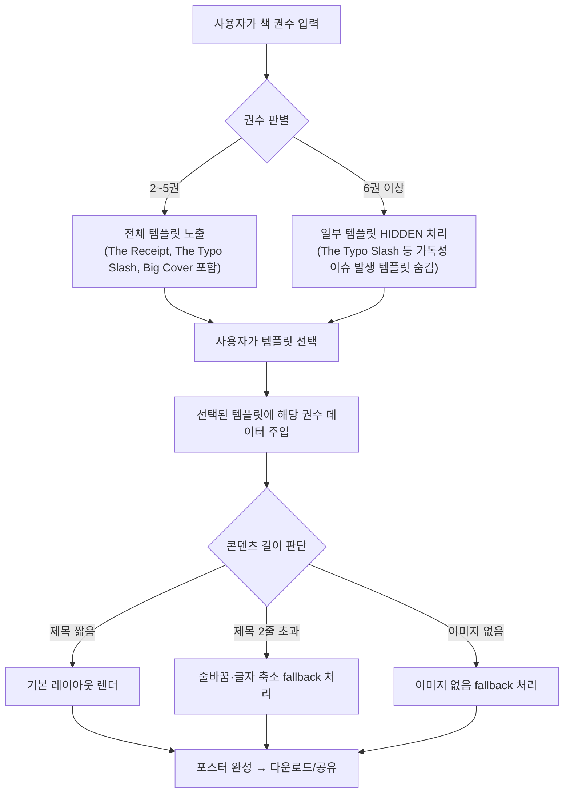
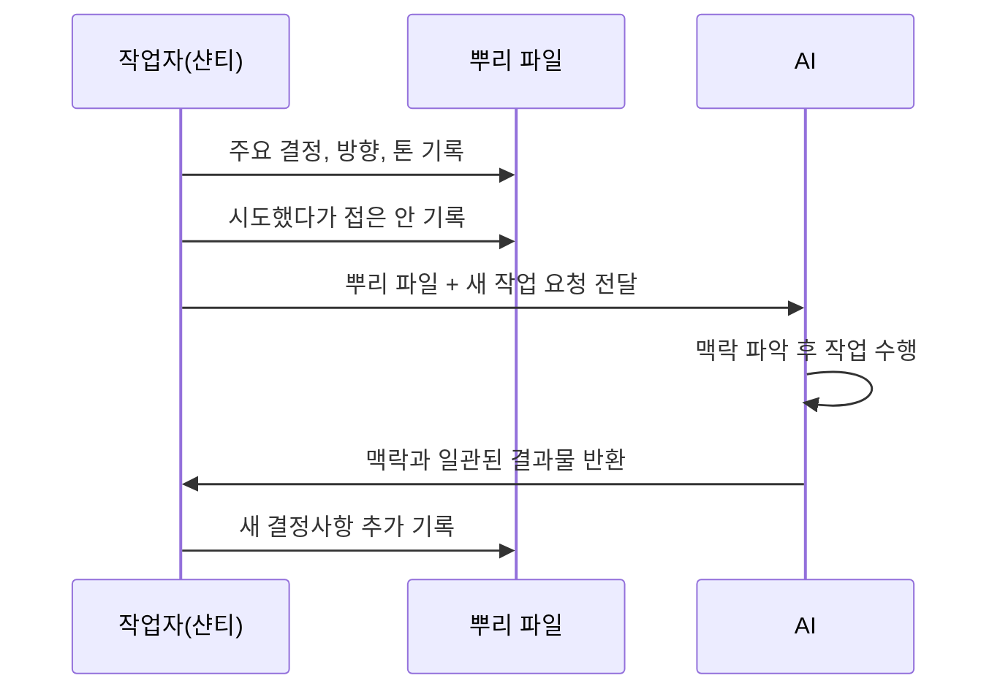
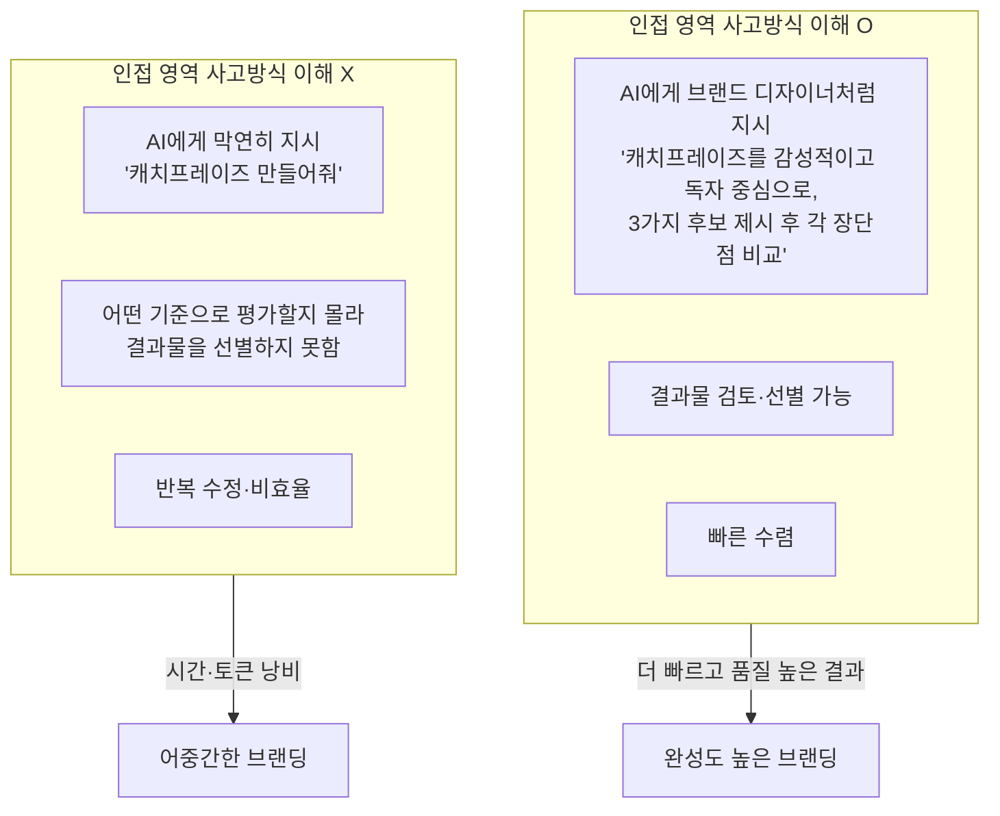
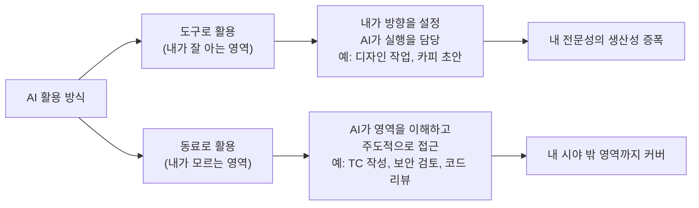
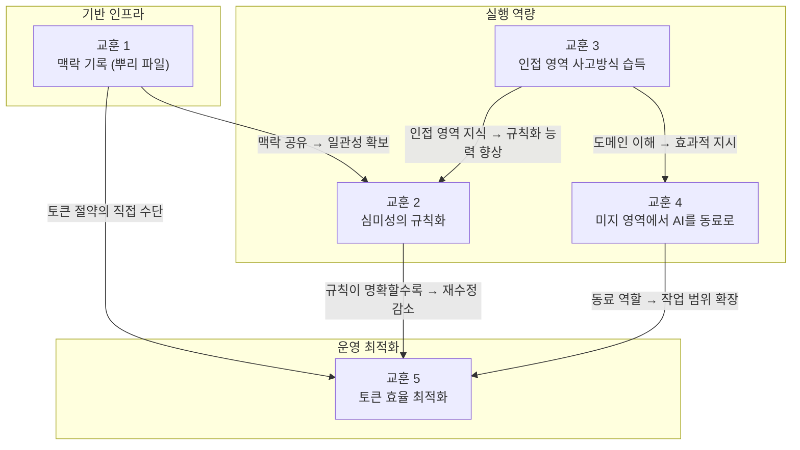
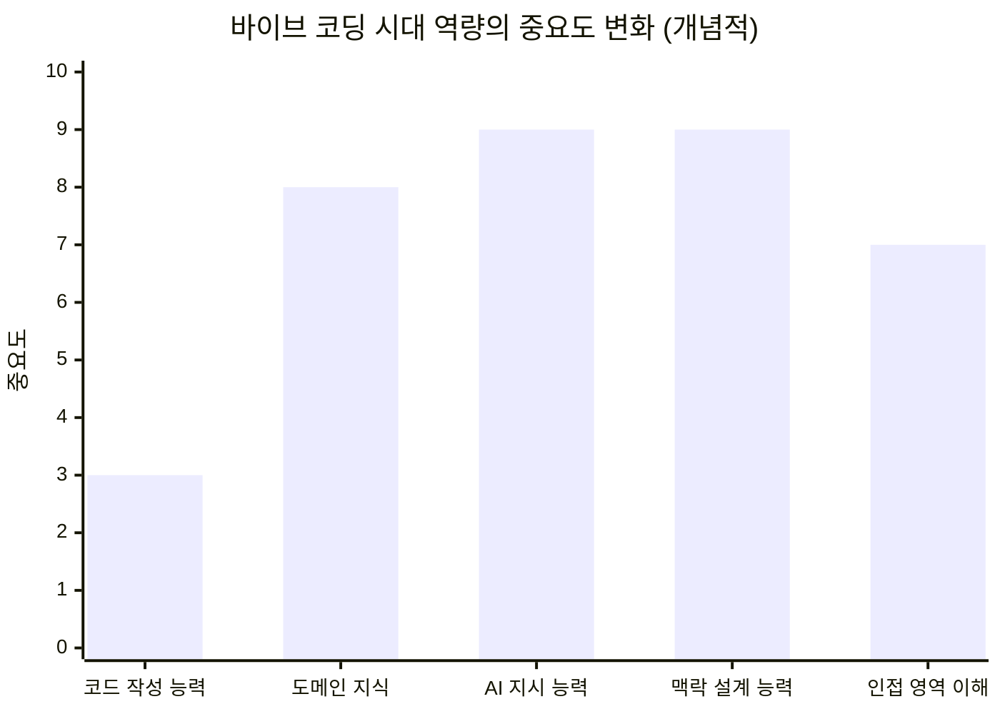

> 원문: 샨티, 「바이브 코딩하며 배운 AI와 함께 일하는 법 5가지」(브런치, 2026.05.10)  
> 서비스: [boocap.vercel.app](https://boocap.vercel.app)

---

## 목차

1. [배경: 바이브 코딩이란 무엇인가](#1-배경-바이브-코딩이란-무엇인가)
2. [boocap: 프로젝트 개요](#2-boocap-프로젝트-개요)
3. [템플릿 매트릭스 — 권수별 포스터 설계](#3-템플릿-매트릭스--권수별-포스터-설계)
4. [5가지 교훈 — AI와 함께 일하는 법](#4-5가지-교훈--ai와-함께-일하는-법)
   - 교훈 1: 결과물보다 '맥락'을 기록하라
   - 교훈 2: 디자이너의 '감'도 규칙으로 정의하라
   - 교훈 3: 인접 영역의 전문가가 일하는 방식을 익혀두라
   - 교훈 4: 모르는 영역은 AI를 동료로 활용하라
   - 교훈 5: 도구를 효율적으로 쓰는 법을 고민하라
5. [교훈들의 구조적 연결](#5-교훈들의-구조적-연결)
6. [비개발자의 바이브 코딩이 갖는 의미](#6-비개발자의-바이브-코딩이-갖는-의미)
7. [종합 평가 및 시사점](#7-종합-평가-및-시사점)

---

## 1. 배경: 바이브 코딩이란 무엇인가

### 개념의 탄생

**바이브 코딩(Vibe Coding)** 은 2025년 2월 3일, OpenAI 공동창업자이자 전 테슬라 AI 책임자인 안드레이 카르파티(Andrej Karpathy)가 X(트위터)에 처음 언급한 개념이다. 그는 이를 두고 "코드가 존재한다는 사실 자체를 잊어버리고, AI의 흐름에 완전히 몸을 맡기는 새로운 종류의 코딩"이라 설명했다. 이 개념은 불과 한 달 만에 Merriam-Webster 사전에 등재되었고, 콜린스 영어사전은 '2025년 올해의 단어'로 선정하기도 했다.

바이브 코딩의 핵심은 단 하나다. **코드의 작동 원리를 완전히 이해하지 않아도, 자연어로 의도를 전달하면 AI가 코드를 생성해 낸다.** 개발의 주도권이 사람의 타이핑에서 AI의 코드 생성으로 이동하는 것이다. 기존의 AI 코드 보조 도구들이 개발자의 작업을 보조하는 수준이었다면, 바이브 코딩은 개발 행위 자체의 주체를 재정의한다.

### 현황과 규모

현재 전 세계에서 생성되는 코드의 41%가 AI의 처리 과정을 거친다. Y콤비네이터(YC)의 2025년 겨울 배치 스타트업 중 25%는 코드베이스의 95% 이상을 AI가 작성했다고 공개했다. 2022년부터 2025년 사이에 주요 바이브 코딩 스타트업들이 유치한 총 투자액은 94억 달러에 이른다. Vercel v0 플랫폼 사용자의 63%가 비개발자라는 통계는 이 흐름이 개발자 중심의 생산성 혁신을 넘어, **소프트웨어 제작의 민주화**라는 사회적 변화로 이어지고 있음을 보여준다.

### 바이브 코딩의 두 가지 형태

바이브 코딩은 실용적으로 크게 두 가지 방식으로 나뉜다.

샨티의 boocap 프로젝트는 후자에 가깝다. 코드 자체를 건드리지 않더라도, AI의 출력물을 디자이너로서의 감각과 판단으로 끊임없이 검토하고 방향을 잡아갔다는 점에서다.

---

## 2. boocap: 프로젝트 개요

### 무엇을 만들었나

**boocap**([boocap.vercel.app](https://boocap.vercel.app))은 한 달 동안 읽은 책들을 SNS에 올릴 수 있는 포스터로 시각화해주는 웹 서비스다. 공식 소개문에 따르면 "한 달의 독서 여정을 한 장의 포스터로 완성해 보세요"라는 컨셉을 내세우고 있다.

사람들이 월말에 독서 기록을 SNS에 올릴 때 대부분 앱 캡처를 모아 붙이거나 책 표지를 사진으로 찍어 올리는 정도에 그친다는 불편함에서 출발했다. 독서라는 개인적 경험을 더 감각적이고 다양한 방식으로 표현할 수 없을까 하는 질문이 서비스의 씨앗이 되었다.

### 주요 기능

| 기능 | 내용 |
|---|---|
| 책 검색 | 제목 또는 저자로 도서 검색 |
| 템플릿 선택 | 총 8종의 디자인 템플릿 (권수별 자동 노출 정책 적용) |
| 다국어 지원 | 한국어 포함 다국어 인터페이스 |
| 다운로드 | 완성된 포스터를 이미지 파일로 저장 |
| 공유 기능 | SNS 직접 공유 지원 |

### 제작자 배경

작성자 '샨티'는 프로덕트 디자이너 출신으로, 코드를 한 줄도 작성하지 못하는 비개발자다. Figma를 통한 화면 설계와 UX 설계, 디자인 시스템 관리가 본업이었으며, 마케팅 카피라이팅이나 브랜드 설계는 다른 팀의 영역이었다. boocap은 그가 처음으로 처음부터 끝까지 혼자(AI와 함께) 완성한 실제 배포 가능한 웹 앱이다.

### 반응

독서모임 지인들로부터 "최근에 삶의 질을 위해 써본 앱 중 제일 마음에 든다"는 평가를 받았고, 북스타그램 운영자로부터는 "디자인이 감각적이고 힙하다"는 반응을 얻었다. 소규모이지만 실사용자의 피드백이 유의미하게 돌아오는 수준의 서비스로 성장했다.

---

## 3. 템플릿 매트릭스 — 권수별 포스터 설계

boocap의 핵심 설계 의사결정 중 하나는 템플릿을 단순히 고정된 디자인으로 만들지 않고, **사용자가 그달에 읽은 책의 권수에 따라 다른 템플릿을 노출하는 정책**을 적용한 것이다. 이는 2번 교훈(심미성의 규칙화)에서 가장 뼈아픈 시행착오를 겪은 후 도달한 결론이기도 하다.

### 템플릿 × 권수 구성표

실제 서비스의 템플릿 구성은 아래와 같이 정의되어 있다.

| 템플릿 | 2권 | 3권 | 4권 | 5권 | 6권 | 7권 | 8권 | 9권 |
|---|---|---|---|---|---|---|---|---|
| **The Receipt** | 6개 핏 | 6개 핏 | 8개 핏 | 7개 핏 | 7개 핏 | 6개 핏 | 7개 핏 | 6개 핏 |
| **The Typo Slash** | 노출 | 노출 | 노출 | 노출 | HIDDEN | HIDDEN | HIDDEN | HIDDEN |
| **Big Cover** | 노출 | 노출 | 노출 | 노출 | 노출 | 노출 | 노출 | 노출 |

- **The Receipt**: 영수증 형태의 세로 목록형 레이아웃. 책 제목을 번호와 함께 나열하며, 권수에 따라 글자 크기와 줄 간격이 자동 조정된다.
- **The Typo Slash**: 타이포그래피 중심의 감성적 레이아웃. "In January, I read:" 형태의 문장 구조를 활용한다. 단, 6권 이상에서는 가독성 문제로 인해 선택지에서 숨겨진다(HIDDEN 처리).
- **Big Cover**: 책 표지 이미지를 크게 배치하는 레이아웃. 권수가 늘어날수록 그리드 방식으로 이미지를 분할·배치한다.

### 설계의 핵심: 권수별 정책 분기

이 구조는 단순해 보이지만, 제작 과정에서 가장 많은 시간과 시행착오를 요구한 부분이다. "예쁘게 만들어줘"라는 모호한 지시로는 절대로 도달할 수 없는 결과물이었으며, 각 경우의 수를 명시적으로 정의하는 과정을 통해서만 완성될 수 있었다.

---

## 4. 5가지 교훈 — AI와 함께 일하는 법

### 교훈 1: 결과물보다 '맥락'을 기록하라

#### 문제 상황

AI와의 협업에서 가장 먼저 부딪히는 벽은 **AI의 기억 부재**다. 매번 새로운 대화 세션을 열 때마다 AI는 이전의 모든 맥락을 잊는다. 서비스의 톤앤매너가 무엇인지, 어떤 사용자를 위한 서비스인지, 지난번에 어떤 결정을 내리고 어떤 방향을 접었는지—이 모든 것을 처음부터 다시 설명해야 한다.

작은 카피 하나를 수정할 때도, 새 컴포넌트를 추가할 때도, "이게 우리 서비스의 톤에 맞나?", "저번에 우리가 어떻게 결정했더라?" 같은 질문이 따라붙는다. 그리고 그 맥락을 제대로 전달하지 않으면 AI의 출력물은 엉뚱한 방향으로 흘러간다.

#### 해결책: '뿌리 파일'

샨티는 이를 해결하기 위해 스스로 **'뿌리 파일'** 이라 이름 붙인 맥락 문서를 따로 만들었다. 이 문서는 단순한 서비스 소개서가 아니다. 다음을 포함한다.

- 서비스의 핵심 개념과 목표 사용자
- 지금까지 내린 주요 결정과 그 이유
- 시도해봤지만 접은 방향과 그 이유
- 서비스의 톤앤매너와 디자인 원칙
- 현재까지의 대화 흐름 요약

새 작업을 시작할 때 이 파일 하나를 AI에게 제공하면, 동일한 설명을 반복할 필요가 없어진다. **매번 제로에서 시작하는 것이 아니라, 이미 쌓인 맥락 위에서 이어갈 수 있게 된다.**

#### AI 엔지니어링과의 연결

흥미롭게도 이는 멀티-에이전트 시스템에서 이미 확립된 패턴과 동일하다. 여러 AI 에이전트가 병렬로 작업할 때, 각 에이전트가 현재 상황을 빠르게 파악하고 즉시 작업에 착수할 수 있도록 공유 문서(흔히 "handoff document" 또는 "context document"라 부름)를 둔다. 1인 바이브 코딩 프로젝트지만, 실질적으로 동일한 원리가 작동하고 있다.

#### 핵심 통찰

> AI와 일을 잘한다는 건, 매번 같은 설명을 반복하지 않을 수 있는 구조를 만드는 것이다. 그 구조의 핵심은 결과물이 아니라 '맥락'을 기록하는 것이다.

---

### 교훈 2: 디자이너의 '감'도 규칙으로 정의하라

#### 가장 오래 걸린 부분

boocap 제작에서 가장 많은 시간이 든 것은 기능 구현이 아니라 **템플릿**이었다. 이는 직관적으로 납득하기 어려운 결과다. 기능 구현은 명확한 정답이 있고, AI가 잘 다루는 영역이다. 그런데 왜 템플릿이 더 어려웠을까.

#### 모호함의 함정

"예쁘게 만들어줘"라는 요청은 AI에게 아무런 의미가 없다. AI는 명확한 기준이 없으면 임의로 선택하고, 그 결과물은 작업자의 머릿속 그림과 다를 수밖에 없다.

구체적으로 발생한 문제들은 다음과 같다.

- 책이 3권일 때와 5권일 때의 배치가 같으면 어색하다 → 권수별 레이아웃 규칙 필요
- 제목이 두 줄을 넘을 때 어떻게 처리할지 → fallback 규칙 필요
- 책 표지 이미지가 없을 때 → 대체 표시 규칙 필요
- 여백이 어색하다, 조금 더 차분하게 → **이 표현으로는 AI가 원하는 방향을 잡지 못한다**

#### 심미성의 언어화

"여백이 어색하다"는 느낌을 AI가 이해할 수 있는 형태로 변환하면 어떻게 될까. 예를 들어 "제목 요소와 상단 테두리 사이의 패딩은 16px 이상, 책 제목 간 줄 간격은 1.5em, 전체 포스터의 상하 마진은 24px 유지"처럼 수치화된 규칙이 되어야 한다. 이것이 바로 디자이너의 감을 규칙으로 정의하는 작업이다.

Figma에서 컴포넌트를 설계할 때 이미 이 과정을 거쳐왔다. 데이터가 길 경우, 짧을 경우, 이미지가 없을 경우를 각각 케이스로 정의하는 것이 디자이너의 기본 작업이다. AI와의 협업에서도 똑같은 원칙이 적용된다.

#### 핵심 통찰

> 심미적인 부분도 "예쁘게 만들어줘"라고 던지지 말고, "어떤 경우에 어떻게 보여야 하는지"를 명확하게 언어화하자.

---

### 교훈 3: 인접 영역의 전문가가 일하는 방식을 익혀두라

#### 역할 경계의 해체

회사에서 일할 때 프로덕트 디자이너의 역할은 비교적 명확하다. 화면 설계, UX 설계, 디자인 시스템 관리. 서비스 네이밍, 캐치프레이즈, 마케팅 톤앤매너, 카피라이팅은 마케팅팀이나 브랜드 디자이너의 몫이다.

하지만 1인 프로젝트에서는 이 모든 것이 혼자의 몫이 된다. 'boocap'이라는 이름을 짓는 것부터 한 줄 캐치프레이즈, 로고, 색감 설정, 인스타그램 소개 문구까지 전부. AI가 도와주더라도, 결정은 작업자가 해야 하고 일관성도 작업자가 책임진다.

#### '어깨너머로 본 지식'의 가치

여기서 흥미로운 지점이 생긴다. 이런 영역들은 완전히 모르던 일이 아니었다. 오랫동안 마케터, 브랜드 디자이너와 협업하면서 옆에서 그들이 일하는 방식을 관찰해왔다. 어떤 순서로 캐치프레이즈를 다듬는지, 톤앤매너를 정의할 때 어떤 기준을 보는지—이 사고 방식 자체를 알고 AI에게 지시하는 것과 모르고 지시하는 것은 결과물의 품질에서 크게 차이가 난다.

#### AI가 직군 경계를 흐린다는 것의 의미

AI는 디자이너도 카피를 쓸 수 있게 해준다. 하지만 그렇다고 마케터의 전문성 자체가 필요 없어지는 것은 아니다. 그 전문성을 AI에게 지시하는 형태로 활용할 수 있는 사람이 더 좋은 결과를 얻는다. **AI는 전문성을 대체하는 것이 아니라, 전문성을 레버리지하는 도구다.**

#### 핵심 통찰

> AI를 잘 쓰려면, 다른 직군의 일하는 방식에도 관심을 가져보자.

---

### 교훈 4: 모르는 영역은 AI를 동료로 활용하라

#### 3번 교훈과의 차이

3번이 '어깨너머로 본 적 있는 인접 영역'에 대한 이야기였다면, 4번은 그 반대다. 전혀 몰랐던 영역, 평소라면 손도 못 댔을 영역이다. boocap 제작에서 이 영역은 **기능 QA**였다.

#### 기능 QA의 특수성

기능 QA는 개발자에게도 쉽지 않은 작업이다. 모든 사용 케이스를 머릿속으로 펼쳐 하나하나 검증해야 하고, 일부 케이스는 개발 지식이 있어야 제대로 짚어낼 수 있다. 디자이너 입장에서는 "직접 하기엔 품이 너무 들고, 안 하기엔 찜찜한" 영역이었다.

#### AI에게 TC 작성과 실행을 위임

QA 전문가들도 이미 TC(Test Case) 작성에 AI를 적극 활용하고 있다는 것을 알게 된 후, 샨티는 한 발 더 나아가 AI에게 다음을 요청했다.

> "TC를 알아서 짜고, 그걸 바탕으로 직접 테스트까지 돌려달라."

결과는 예상 이상이었다. AI는 다음과 같은 엣지 케이스들을 스스로 발굴하고 검증했다.

- 사용자 입력 필드에 빈 값이 들어갈 때
- 책 검색이 실패할 때 (네트워크 오류, 결과 없음)
- 이미지 로딩이 끊어질 때
- 한 달에 책을 1권만 읽었을 때의 레이아웃 처리

이런 케이스들은 제품을 직접 만든 사람이 자주 놓치는 부분이다. 제품을 너무 잘 알기 때문에 정상 흐름만 자연스럽게 테스트하게 되고, 비정상적인 플로우는 별도의 인지적 노력 없이는 떠올리기 어렵다. AI는 이 과정을 기계적으로, 그리고 꼼꼼하게 수행해낼 수 있다.

#### 도구 vs 동료의 구분

#### 핵심 통찰

> '내 일을 대신 해주는 사람'이 아니라 '내가 평소에 닿지 못하던 영역까지 같이 가주는 동료'로 보자. 그렇게 보는 순간, 손댈 수 있는 일의 범위가 단번에 넓어진다.

---

### 교훈 5: 도구를 효율적으로 쓰는 법을 고민하라

#### 토큰 비용 의식

AI와 협업할 때 처음에는 떠오르는 대로 요청을 던지기 쉽다. 두루뭉술하게 요청하고, 결과물을 보고 수정 요청하고, 다시 다듬고. 이 과정에서 같은 결과물을 얻더라도 토큰이 몇 배씩 더 쓰인다. 한 번에 명확하게 요청했다면 깔끔하게 끝날 일을 여러 번에 걸쳐 비효율적으로 처리하는 것이다.

#### 뿌리 파일과 토큰 절약의 연결

1번 교훈에서 언급한 '뿌리 파일'은 토큰 효율과도 직결된다. 매번 같은 맥락을 설명할 필요가 없으니, 작업 시작 시점부터 토큰이 절약된다. 역설적으로 맥락 문서를 만드는 데 일부 토큰을 투자하면, 이후 반복 작업에서 훨씬 많은 토큰을 아낄 수 있다.

#### 비용 구조의 현실

도구 자체의 비용도 무시할 수 없다. AI 생산성 도구들은 대부분 구독제로 운영되며, 검증되지 않은 상태에서 먼저 구독 결제를 해야 하는 구조는 진입장벽이 된다. 실제로 미드저니(Midjourney)는 무료 요금제를 완전히 폐지했다. AI 도구들이 빠르게 늘어날수록, 어떤 도구를 쓸지보다 **어떻게 효율적으로 쓸지**가 더 중요한 판단 기준이 된다.

#### 효율적 사용을 위한 원칙

| 원칙 | 구체적 적용 |
|---|---|
| 명확한 요청 한 번 | 두루뭉술한 반복 요청 → 정확한 요구사항 정리 후 1회 요청 |
| 맥락 문서 활용 | 반복 설명 제거 → 뿌리 파일로 세션 초기 토큰 절약 |
| 컨텍스트 길이 관리 | 핵심만 전달, 불필요한 대화 히스토리 축적 방지 |
| 도구 조합 최적화 | 모든 작업을 하나의 AI 도구에 몰지 않고 적합한 도구 분배 |

#### 핵심 통찰

> 단순히 '어떤 도구를 쓸까'만 고민할 게 아니라, '같은 도구를 어떻게 효율적으로 쓸까'까지 고민해야 한다. 도구를 고르는 안목만큼, 도구를 효율적으로 쓰는 안목도 이제 작업의 일부다.

---

## 5. 교훈들의 구조적 연결

5가지 교훈은 서로 독립된 팁의 나열이 아니라, 하나의 유기적인 AI 협업 체계를 구성한다.

- **뿌리 파일(교훈 1)** 은 전체 협업의 기반 인프라다. 나머지 교훈들이 효과를 발휘하려면 이 맥락 기록 체계가 먼저 작동해야 한다.
- **심미성의 규칙화(교훈 2)** 와 **인접 영역 사고방식 습득(교훈 3)** 은 실행 역량의 두 축이다. 내가 아는 것을 어떻게 AI에게 전달할지(규칙화), 그리고 내가 모르는 것에 어떻게 접근할지(사고방식 습득)를 다룬다.
- **AI를 동료로 활용(교훈 4)** 은 완전히 모르는 영역에서 AI에게 주도권을 위임하는 패턴이다.
- **효율적 사용(교훈 5)** 은 위의 모든 교훈이 잘 실행될 때 자연스럽게 따라오는 결과이기도 하지만, 동시에 의식적으로 추구해야 할 메타 목표이기도 하다.

---

## 6. 비개발자의 바이브 코딩이 갖는 의미

### 소프트웨어 제작의 민주화

샨티의 boocap 프로젝트는 개인 수준에서 바이브 코딩의 가능성을 실증한 사례다. 책 검색 기능, 8종 템플릿, 다국어 지원, 다운로드 및 공유—이 모든 기능을 코드 없이 구현했다는 것은 소프트웨어 제작의 진입장벽이 얼마나 낮아졌는지를 보여준다.

Vercel v0 플랫폼 사용자의 63%가 비개발자라는 통계, Replit의 사용자 5000만 명 중 개발자보다 비개발자가 더 많다는 사실과 함께 읽으면, 이것이 단발적 사례가 아닌 구조적 흐름임이 분명해진다.

### '1인 제품' 시대

바이브 코딩은 단순히 개발 생산성을 높이는 것이 아니라, **1인이 완전한 제품을 만들 수 있는 시대**를 열고 있다. 기획-디자인-개발-마케팅-QA를 한 사람이 AI와 함께 커버할 수 있게 되면서, 소규모 팀이나 개인이 만들어낼 수 있는 제품의 범위가 이전 세대와 비교해 질적으로 달라졌다.

### 전문성의 재정의

바이브 코딩이 확산될수록 "코드를 쓸 수 있는가"보다 **"AI에게 무엇을 어떻게 지시할 수 있는가"** 가 핵심 역량이 된다. 그리고 그 지시의 품질은 결국 도메인 지식과 인접 영역에 대한 이해에서 나온다. 전문성이 사라지는 것이 아니라, 전문성을 표현하고 활용하는 방식이 바뀌는 것이다.

---

## 7. 종합 평가 및 시사점

샨티의 브런치 글과 boocap 프로젝트는 바이브 코딩에 관한 수많은 담론 중에서도 독특한 위치를 점한다. 대부분의 바이브 코딩 성공 사례가 개발자 또는 기술 배경자의 이야기인 반면, 이 글은 **코드를 한 줄도 모르는 프로덕트 디자이너의 실전 경험**에서 나왔다.

5가지 교훈은 추상적인 원칙이 아니라 구체적인 시행착오에서 증류된 것들이다. 뿌리 파일이라는 아이디어는 AI 엔지니어링 분야의 공유 컨텍스트 문서 개념과 독립적으로 수렴했다는 점에서 특히 주목할 만하다. 현장에서 문제를 해결하는 과정이 이미 이론과 같은 방향을 향하고 있다는 뜻이기도 하다.

boocap이 완전한 상업적 성공을 거두었는지는 아직 알 수 없다. 그러나 작은 피드백 루프를 유지하면서 계속 업데이트해 나가겠다는 방향, 그리고 다음 제품을 이미 기획하고 있다는 사실은 이 프로젝트가 결과물이 아니라 **학습과 성장의 플랫폼**으로 기능하고 있음을 보여준다.

"만드는 게 끝나지 않으면, 배우는 것도 끝나지 않을테니." 이 마지막 문장은 이 글 전체를 관통하는 태도를 가장 잘 요약한다.

---

*작성일: 2026년 5월 11일*  
*원문 출처: [브런치 - 바이브 코딩하며 배운 AI와 함께 일하는 법 5가지](https://brunch.co.kr/@ashantichoii/22)*  
*서비스 링크: [boocap.vercel.app](https://boocap.vercel.app)*
