## 9개 모듈로 이해하는 VIP 에이전트 아키텍처

> 작성일: 2026-05-11  
> 대상: 시스템 구조와 동작 방식을 깊이 이해하고 싶은 분들  
> 분석 대상: state.py / vip_agent.py / rag_workflow.py / retriever.py / rrf_fusion.py / entity_extraction.py / embedding.py / bge_reranker.py / search.py

---

## 관련 프로젝트

[**Hybrid RAG Knowledge Platform**](https://github.com/k82022603/hybrid-rag-knowledge-ops)

---

## 목차

1. [전체 그림 — 9개 모듈은 어떻게 연결되는가](#1-전체-그림--9개-모듈은-어떻게-연결되는가)
2. [state.py — 시스템 전체를 관통하는 데이터 계약서](#2-statepy--시스템-전체를-관통하는-데이터-계약서)
3. [vip_agent.py — VIP 3단계 에이전트의 심장](#3-vip_agentpy--vip-3단계-에이전트의-심장)
4. [rag_workflow.py — 실제 서비스를 담당하는 RAG 워크플로우](#4-rag_workflowpy--실제-서비스를-담당하는-rag-워크플로우)
5. [entity_extraction.py — LLM이 문서를 읽는 방법](#5-entity_extractionpy--llm이-문서를-읽는-방법)
6. [embedding.py — 텍스트를 숫자로 만드는 공장](#6-embeddingpy--텍스트를-숫자로-만드는-공장)
7. [search.py — 세 가지 검색을 하나로 묶는 허브](#7-searchpy--세-가지-검색을-하나로-묶는-허브)
8. [retriever.py — RAG 워크플로우의 검색 전담 레이어](#8-retrieverpy--rag-워크플로우의-검색-전담-레이어)
9. [rrf_fusion.py — 다수결로 최선의 결과를 고르는 알고리즘](#9-rrf_fusionpy--다수결로-최선의-결과를-고르는-알고리즘)
10. [bge_reranker.py — 마지막 정밀 검사관](#10-bge_rerankerpy--마지막-정밀-검사관)
11. [Neo4j Knowledge Graph — 코드에서 GraphRAG 동작 방식](#11-neo4j-knowledge-graph--코드에서-graphrag-동작-방식)
12. [모듈 간 상호작용 전체 흐름](#12-모듈-간-상호작용-전체-흐름)

---

## 1. 전체 그림 — 9개 모듈은 어떻게 연결되는가

이 9개의 파이썬 모듈은 단독으로 존재하는 것이 아니라, 하나의 엔터프라이즈 Hybrid RAG 지식 플랫폼을 구성하는 유기적인 부품들입니다. 사용자가 질문을 던지는 순간부터 답변이 돌아오기까지, 이 모듈들이 서로 협력하며 동작합니다.

전체 시스템은 크게 두 가지 처리 경로를 가집니다. 하나는 문서 처리 경로(수집한 문서를 지식 구조로 변환하는 배치 작업)이고, 다른 하나는 질의 처리 경로(사용자 질문에 답하는 실시간 작업)입니다.

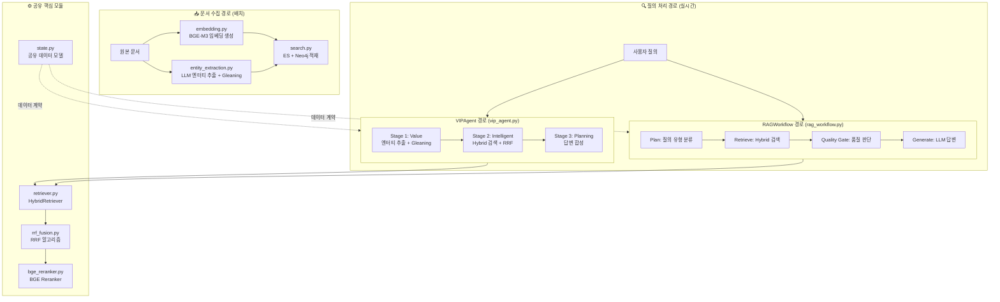

각 모듈의 역할을 한 줄로 요약하면 다음과 같습니다.

| 모듈 | 역할 |
|---|---|
| [`agents/state.py`](https://github.com/k82022603/hybrid-rag-knowledge-ops/blob/main/knowledge_service/src/app/agents/state.py) | 시스템 전체가 공유하는 데이터 모델 정의 |
| [`agents/vip_agent.py`](https://github.com/k82022603/hybrid-rag-knowledge-ops/blob/main/knowledge_service/src/app/agents/vip_agent.py) | LangGraph 기반 VIP 3단계 에이전트 (ETL + 검색 + 답변) |
| [`agents/rag_workflow.py`](https://github.com/k82022603/hybrid-rag-knowledge-ops/blob/main/knowledge_service/src/app/agents/rag_workflow.py) | REST API용 RAG 워크플로우 (Plan → Retrieve → Generate) |
| [`services/entity_extraction.py`](https://github.com/k82022603/hybrid-rag-knowledge-ops/blob/main/knowledge_service/src/app/services/entity_extraction.py) | LLM 기반 엔터티/관계 추출 + Gleaning |
| [`services/embedding.py`](https://github.com/k82022603/hybrid-rag-knowledge-ops/blob/main/knowledge_service/src/app/services/embedding.py) | BGE-M3 Dense + Sparse 임베딩 + Redis 캐시 |
| [`services/search.py`](https://github.com/k82022603/hybrid-rag-knowledge-ops/blob/main/knowledge_service/src/app/services/search.py) | Elasticsearch + Neo4j 통합 검색 서비스 |
| [`rag/retriever.py`](https://github.com/k82022603/hybrid-rag-knowledge-ops/blob/main/knowledge_service/src/app/rag/retriever.py) | RAG용 Hybrid Retriever (ES + Neo4j 래퍼) |
| [`services/rrf_fusion.py`](https://github.com/k82022603/hybrid-rag-knowledge-ops/blob/main/knowledge_service/src/app/services/rrf_fusion.py) | Reciprocal Rank Fusion 알고리즘 |
| [`rag/bge_reranker.py`](https://github.com/k82022603/hybrid-rag-knowledge-ops/blob/main/knowledge_service/src/app/rag/bge_reranker.py) | BGE Reranker v2-m3 크로스 인코더 |


---

## 2. state.py — 시스템 전체를 관통하는 데이터 계약서

### 2.1 이 파일이 왜 중요한가

`state.py`는 코드 줄 수로 보면 가장 짧은 파일이지만, 시스템 전체에서 가장 중요한 역할을 합니다. 이 파일에 정의된 데이터 모델들이 모든 모듈 사이의 **인터페이스 계약**을 형성합니다. 어떤 모듈이 어떤 형태의 데이터를 주고받는지 명시하는 청사진입니다.

마치 건물 설계도에서 각 방의 크기와 문의 위치를 규정하듯, `state.py`는 각 처리 단계에서 어떤 필드가 존재해야 하고 어떤 타입이어야 하는지를 강제합니다. 덕분에 `vip_agent.py`, `rag_workflow.py`, `retriever.py` 등 여러 모듈이 동일한 데이터 구조를 자신 있게 참조할 수 있습니다.

### 2.2 Pydantic 모델들 — 핵심 도메인 개념의 표현

파일은 크게 두 종류의 클래스로 구성됩니다. 첫 번째는 Pydantic `BaseModel`을 상속하는 도메인 모델들이고, 두 번째는 LangGraph 상태를 위한 `TypedDict`입니다.

`Entity` 클래스는 문서에서 추출된 실세계 개체를 표현합니다. `id`, `name`, `type`, `description` 네 가지 필드를 가지며, `type` 필드는 Person, Project, Technology, Organization, Concept 다섯 가지 중 하나가 됩니다. 이 유형 분류가 나중에 Neo4j Knowledge Graph에서 노드 레이블이 됩니다.

`Relationship` 클래스는 두 엔터티 사이의 연결을 표현합니다. 소스 엔터티 ID, 타겟 엔터티 ID, 관계 유형(CREATED, PARTICIPATED, USES, BELONGS_TO, RELATED_TO), 그리고 관계 설명으로 구성됩니다. 이 구조가 나중에 Neo4j의 엣지가 됩니다.

`DocumentMetadata`는 문서의 속성 정보를 담습니다. 문서 유형, 프로젝트명, 유효 기간(시작일/종료일), 계층적 카테고리(3단계), 요약 등을 포함합니다. 계층적 카테고리는 `CategoryMetadata`라는 별도 클래스로 분리되어 있으며, 대분류-중분류-소분류 3단계 체계를 지원합니다.

`SearchResult`는 검색 결과 하나를 나타냅니다. 청크 ID, 문서 ID, 본문 내용, 관련성 점수, 검색 소스(vector 또는 graph), 메타데이터 딕셔너리를 포함합니다. 여기서 `has_embedding` 필드는 SCRUM-96 이슈에 대응하여 추가된 것으로, 임베딩 벡터가 실제로 존재하는지를 나타냅니다. 이는 임베딩 없는 레코드가 벡터 검색에 잘못 포함되는 버그를 방지하기 위한 방어 코드입니다.

### 2.3 AgentState — LangGraph의 공유 메모리

`AgentState`는 `TypedDict`를 상속하며, `total=False` 옵션으로 모든 필드를 선택적(Optional)으로 만들었습니다. 이 설계가 중요한 이유는 LangGraph의 노드들이 전체 상태를 한 번에 채우는 것이 아니라 단계별로 점진적으로 채워나가기 때문입니다.

상태는 VIP 파이프라인의 세 단계에 정확히 대응하는 세 구획으로 구성됩니다.

```
Stage 1 (Value):   extracted_entities, extracted_relationships, document_metadata, gleaning_count
Stage 2 (Intelligent): search_strategy, vector_results, graph_results, fused_results, reranked_results  
Stage 3 (Planning): context, answer, sources
```

이 구조 덕분에 LangGraph 그래프의 각 노드는 자신이 담당하는 필드만 읽고 쓰면 됩니다. 엔터티 추출 노드는 `extracted_entities`를 채우고, 검색 노드는 `vector_results`와 `graph_results`를 채우며, 답변 합성 노드는 `answer`를 채웁니다. 각 노드의 책임이 명확하게 분리되어 있습니다.

---

## 3. vip_agent.py — VIP 3단계 에이전트의 심장

### 3.1 VIP 아키텍처란 무엇인가

VIP는 Value-Intelligent-Planning의 약자로, 이 시스템이 설계한 3단계 에이전트 파이프라인의 이름입니다. 2025~2026년의 최신 에이전틱 RAG 아키텍처 트렌드와 맥을 같이 합니다. 단순한 파이프라인이 아니라, 각 단계에서 상태를 평가하고 조건부로 분기하는 진정한 에이전트 구조입니다.

- **Value(가치) 단계**: 입력 텍스트에서 지식 단위(엔터티, 관계)를 추출하여 가치를 발굴합니다.
- **Intelligent(지능) 단계**: 다중 검색 소스를 활용하여 지능적으로 관련 정보를 수집합니다.
- **Planning(계획) 단계**: 수집된 정보를 바탕으로 최적의 답변을 계획하고 생성합니다.

### 3.2 LangGraph StateGraph 구성

`VIPAgent.build_graph()` 메서드가 LangGraph 워크플로우를 조립합니다. 5개의 노드와 그 사이를 연결하는 엣지로 구성됩니다.

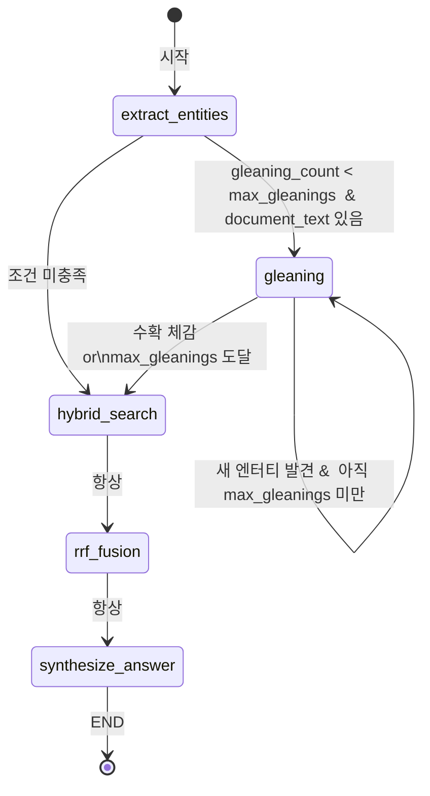

핵심은 `_should_gleaning` 조건부 엣지입니다. 이 함수가 현재 `gleaning_count`와 설정의 `max_gleanings`를 비교하여 Gleaning 반복 여부를 결정합니다. `document_text`가 없으면(쿼리만 있으면) Gleaning을 건너뜁니다. 질의 텍스트만으로는 Gleaning이 큰 의미가 없기 때문입니다.

### 3.3 Stage 1 — 엔터티 추출과 Gleaning의 협력

`_extract_entities` 노드는 `EntityExtractionService`를 사용하여 1차 추출을 수행합니다. 이때 `enable_gleaning=False`로 명시적으로 전달합니다. Gleaning은 LangGraph의 별도 노드(`_gleaning`)에서 처리하기 때문입니다. 이는 설계 상 중요한 분리입니다. LangGraph의 조건부 엣지가 Gleaning 반복을 제어하기 때문에, 서비스 내부에서 반복 로직을 갖출 필요가 없습니다.

`_gleaning` 노드는 이전에 추출된 엔터티 목록(`existing_entities`)을 `EntityExtractionService._gleaning_pass()`에 전달합니다. Gleaning 패스는 LLM에게 "이미 이것들을 찾았는데, 혹시 더 있는가?"라고 재질문합니다. 새로 발견된 엔터티가 있으면 기존 목록에 추가하고 중복을 제거합니다. 그리고 새 엔터티를 포함한 전체 목록으로 관계도 다시 추출합니다.

### 3.4 Stage 2 — Hybrid 검색의 두 가지 경로

`_hybrid_search` 노드는 `HybridRetriever`와 `SearchService` 중 어느 것이 주입되었는지에 따라 다르게 동작합니다. `HybridRetriever`가 있으면 그것을 우선 사용하고, 없으면 `SearchService`로 폴백합니다. 이 설계 원칙을 "의존성 주입(Dependency Injection)"이라고 하며, 실제 서비스에서는 `HybridRetriever`가, 테스트에서는 목(mock) 객체가 주입될 수 있습니다.

검색 결과는 `vector_results`(벡터/키워드 검색 결과)와 `graph_results`(그래프 검색 결과)로 분리하여 상태에 저장합니다. 이 분리가 `rrf_fusion` 단계에서 가중치를 다르게 적용하는 데 활용될 수 있습니다.

`_rrf_fusion` 노드는 `fused_results`에서 상위 결과를 선택하고, `HybridRetriever`에 Reranker가 설정되어 있으면 최대 50개 후보를 대상으로 재순위화를 수행합니다. `reranked_results`에 최종 결과를 저장합니다.

### 3.5 Stage 3 — 컨텍스트 구성과 답변 합성

`_synthesize_answer` 노드는 `rag_workflow.py`에 정의된 유틸리티 함수를 호출합니다. 이 점이 흥미롭습니다. `build_context_from_results()`와 `build_sources_from_results()`는 두 모듈이 공유하는 함수들입니다. `VIPAgent`와 `RAGWorkflow`가 서로 다른 진입점을 갖지만, 컨텍스트 구성 로직은 동일하게 재사용합니다.

답변 생성은 `LLMAdapter`를 통해 이루어지며, Adapter가 없으면 폴백 메시지를 반환합니다. 이 graceful 처리 덕분에 LLM API가 일시적으로 불가한 경우에도 시스템이 완전히 멈추지 않습니다.

### 3.6 Lazy Loading과 싱글톤 패턴

`VIPAgent.llm` 프로퍼티는 LLM 인스턴스를 처음 접근할 때만 생성합니다(Lazy Loading). API 키 검증도 이 시점에 이루어집니다. 모듈 로드 시점이 아닌 실제 사용 시점에 초기화하기 때문에, 설정 없이 단위 테스트를 실행할 때 불필요한 오류가 발생하지 않습니다.

파일 하단의 `get_vip_agent()` 함수는 전역 단일 인스턴스를 반환하는 싱글톤 팩토리입니다. FastAPI 애플리케이션에서는 요청마다 새 인스턴스를 만드는 비용을 피하기 위해 싱글톤을 사용합니다. `reset_vip_agent()`는 테스트 코드에서 격리된 환경을 만들기 위해 싱글톤을 초기화하는 유틸리티입니다.

---

## 4. rag_workflow.py — 실제 서비스를 담당하는 RAG 워크플로우

### 4.1 VIPAgent와의 차이

`vip_agent.py`와 `rag_workflow.py`는 겉으로 보면 유사해 보이지만 역할이 다릅니다. `VIPAgent`는 문서 처리(ETL) 겸 질의 응답 에이전트로, 엔터티 추출과 Gleaning을 포함한 무거운 파이프라인입니다. 반면 `RAGWorkflow`는 REST API를 통해 들어오는 실시간 질의를 처리하는 경량화된 워크플로우입니다.

`RAGWorkflow`는 네 단계로 구성됩니다.

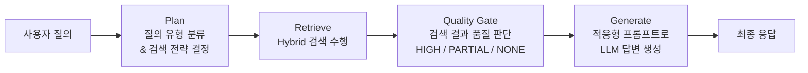

### 4.2 질의 분류 — 규칙 기반 라우팅

`classify_query_type()` 정적 메서드는 정규식 패턴 매칭으로 질의를 네 가지로 분류합니다.

**factual(사실적 질문)**: "~는 무엇인가", "~의 정의", "~란" 같은 패턴. 이런 질의는 의미 기반 벡터 검색이 잘 어울립니다.

**relational(관계형 질문)**: "~과 ~의 관계", "~에 연결된", "~에 의존한" 같은 패턴. 엔터티 간 관계를 묻는 질문이므로 Neo4j 그래프 검색이 적합합니다.

**keyword(키워드 검색)**: 물음표 없이 1~2개 단어만 입력된 경우. 명확한 용어를 찾는 것이므로 BM25 키워드 검색이 가장 효과적입니다.

**complex(복합 질문)**: 위 세 가지에 해당하지 않는 모든 질의. Hybrid Search를 사용합니다.

이 분류는 이후 `select_search_strategy()`를 통해 검색 전략(vector / graph / keyword / hybrid)으로 변환됩니다. 현재 구현에서 전략이 검색 쪽으로 완전히 전달되지 않고 로깅에만 사용되는 부분이 있어, 향후 개선 여지가 있습니다.

### 4.3 Quality Gate — 검색 결과 품질 판단

`assess_context_quality()` 함수는 이 시스템의 독창적인 기능 중 하나입니다. 검색 결과의 점수 분포를 분석하여 컨텍스트 품질 등급을 판정합니다.

등급은 HIGH, PARTIAL, NONE 세 가지입니다. HIGH는 관련도 점수가 `high_threshold`(기본 0.3) 이상인 결과가 `min_high_count`개(기본 2개) 이상 있는 경우입니다. PARTIAL은 `partial_threshold`(기본 0.1) 이상의 결과가 하나라도 있거나 `min_score_cutoff` 이상의 결과가 있는 경우입니다. NONE은 모든 결과가 `min_score_cutoff`(기본 0.05) 미만인 경우입니다.

이 등급에 따라 LLM에게 전달되는 프롬프트 지시문이 달라집니다. HIGH이면 "컨텍스트를 근거로 정확하게 답변하라"고 지시하고, PARTIAL이면 "컨텍스트를 활용하되 부족한 부분은 일반 지식으로 보충하라"고 지시하며, NONE이면 컨텍스트를 아예 제공하지 않고 "관련 정보를 찾지 못했다고 먼저 안내한 뒤 일반 지식으로 답변하라"고 지시합니다. 이것이 **적응형 프롬프트(Adaptive Prompt)** 전략입니다.

### 4.4 대화 이력 관리 (STORY-057)

`RAGWorkflow`는 STORY-057 요구사항에 따라 멀티턴 대화를 지원합니다. `conversation_id`가 전달되면 `ConversationHistoryService`를 통해 이전 대화 이력을 불러와 현재 컨텍스트에 prepend합니다. 답변이 생성되면 현재 턴의 질의-답변 쌍을 대화 이력에 저장합니다.

`max_conversation_turns` 파라미터로 이력 참조 범위를 제한합니다. 너무 긴 대화 이력을 전달하면 LLM 컨텍스트 윈도우를 낭비하고 비용이 증가하기 때문입니다.

### 4.5 컨텍스트 구성 유틸리티들

`build_context_from_results()` 함수는 검색 결과를 LLM이 읽을 수 있는 텍스트 블록으로 변환합니다. 각 결과를 `### [출처N] {제목}` 형식의 템플릿으로 포맷하고, `max_chunks`와 `max_length` 한도 내에서 잘라냅니다. 마지막 청크가 한도를 초과하면 남은 공간만큼 잘라내고 "...(잘림)"을 붙입니다.

`build_sources_from_results()` 함수는 UI에 표시할 출처 정보를 생성합니다. 중요한 부분은 `matched_entities` 처리입니다. Neo4j에서 검증된 엔터티만 `related_entities`에 포함하고, 파일명처럼 보이는 값(`.pdf`, `.docx` 등)은 `_is_filename()` 함수로 걸러냅니다. 이는 ISSUE-011에서 발견된 문제 — 파일명이 그래프 UI에 엔터티로 잘못 표시되던 버그 — 를 해결한 것입니다.

---

## 5. entity_extraction.py — LLM이 문서를 읽는 방법

### 5.1 이 모듈의 역할

`entity_extraction.py`는 ETL 파이프라인에서 가장 중요한 단계를 담당합니다. 사람이 읽는 자연어 문서에서 구조화된 지식(엔터티와 관계)을 추출하여 Neo4j Knowledge Graph에 적재할 준비를 합니다.

LLM을 사용하는 모든 추출 작업의 공통 문제는 **누락(Recall 저하)** 입니다. 특히 암묵적으로 언급된 엔터티, 약어, 맥락상 추론해야 하는 엔터티는 단일 패스 추출로는 잡기 어렵습니다. 이 모듈은 **Gleaning** 기법으로 이 문제를 해결합니다.

### 5.2 Gleaning — 누락 엔터티를 잡는 반복 추출

Gleaning은 Microsoft GraphRAG 논문에서 제안된 기법으로, LLM에게 "이미 이것들을 찾았는데, 혹시 놓친 것이 있는가?"를 반복적으로 질문하여 추출 Recall을 높이는 방법입니다. 이 구현에서는 Entity Recall이 +33% 향상된다고 문서화되어 있습니다.

**Adaptive Gleaning**은 이 시스템의 최적화입니다. 모든 텍스트에 동일 횟수를 적용하는 대신, 텍스트 길이에 따라 Gleaning 횟수를 동적으로 결정합니다. 200자 미만은 1회, 200~500자는 2회, 500자 초과는 3회를 기본으로 하되, 새로운 엔터티가 더 이상 발견되지 않으면(수확 체감) 조기 종료합니다.

### 5.3 프롬프트 설계

이 모듈에는 네 가지 프롬프트 템플릿이 정의되어 있습니다.

`ENTITY_EXTRACTION_PROMPT`는 추출할 엔터티 유형(Person, Organization, Technology, Project, Concept, Date, Location)을 명시하고, JSON 출력 형식을 강제합니다. LLM이 자유롭게 출력하면 파싱이 어려워지므로, 구조화된 JSON만 반환하도록 지시합니다.

`RELATIONSHIP_EXTRACTION_PROMPT`는 엔터티 목록을 입력받아 관계를 추출합니다. 관계 유형도 미리 정의합니다(CREATED, PARTICIPATED, USES, BELONGS_TO, RELATED_TO, MANAGES, DEPENDS_ON). `source`와 `target`이 반드시 위에서 추출된 엔터티의 `id`를 참조하도록 강제하여 고아 관계가 생기지 않도록 합니다.

`GLEANING_PROMPT`는 기존 추출 결과를 함께 전달하면서 "이미 추출된 엔터티는 제외하고, 약어/별칭/암시적 엔터티를 찾으라"고 지시합니다. 추가 발견이 없으면 빈 리스트를 반환하도록 명시하여 무의미한 중복을 방지합니다.

`METADATA_EXTRACTION_PROMPT`는 문서 유형, 프로젝트명, 유효 기간, 계층적 카테고리, 요약을 추출합니다. 파일명을 힌트로 함께 제공하여 맥락 이해를 돕습니다.

---

## 6. embedding.py — 텍스트를 숫자로 만드는 공장

### 6.1 BGE-M3 모델 선택의 이유

이 시스템은 BAAI(Beijing Academy of Artificial Intelligence)의 BGE-M3 모델을 임베딩에 사용합니다. BGE-M3의 가장 중요한 특징은 **Dense와 Sparse 임베딩을 단일 모델에서 동시에 생성**한다는 것입니다. Dense 임베딩은 1024차원의 밀집 벡터로 의미적 유사도 포착에 강하고, Sparse 임베딩은 SPLADE 방식으로 중요 단어에 가중치를 부여하여 키워드 정확도를 높입니다. 하나의 모델로 두 가지 검색 방식을 지원하므로 시스템 복잡도가 줄어듭니다.

### 6.2 ChunkEmbedding 데이터클래스

`ChunkEmbedding`은 임베딩 결과를 담는 데이터 컨테이너입니다. `chunk_id`, `dense_vector`(1024개의 float), `sparse_vector`(단어-가중치 딕셔너리), `model_name`, `created_at`으로 구성됩니다. `sparse_vector`는 선택적(Optional)으로, Dense 임베딩만 필요한 경우 생략할 수 있습니다.

### 6.3 Redis 임베딩 캐시

`EmbeddingCache` 클래스는 동일 텍스트에 대한 반복 임베딩 호출을 캐시로 처리합니다. 텍스트의 SHA-256 해시를 Redis 키로 사용하고, 캐시 TTL은 기본 7일입니다. Redis 연결 실패 시에는 캐시 미스로 처리하여 서비스가 중단되지 않습니다. 이 **Fail-Open 전략**은 캐시를 선택적 성능 최적화로 취급하는 올바른 설계입니다.

배치 처리를 지원하여 여러 텍스트를 한 번에 임베딩할 수 있으며, `batch_size` 설정으로 GPU 메모리 사용량을 제어합니다. CPU와 GPU를 자동으로 감지하고, CUDA가 없으면 CPU로 폴백합니다. sentence-transformers 라이브러리도 폴백으로 지원하여 BGE-M3 전용 라이브러리 없이도 동작합니다.

---

## 7. search.py — 세 가지 검색을 하나로 묶는 허브

### 7.1 SearchService의 위치

`SearchService`는 이 시스템의 검색 허브입니다. Elasticsearch kNN 벡터 검색, Elasticsearch BM25 키워드 검색, Neo4j 그래프 탐색 세 가지를 모두 실행하고, RRF로 결과를 통합하며, 선택적으로 Reranker를 적용합니다.

REST API와 RAG 에이전트 양쪽에서 모두 사용됩니다. `retriever.py`의 `HybridRetriever`는 내부적으로 `SearchService`에 위임하고, REST API 엔드포인트도 `SearchService`를 직접 호출합니다. 이 구조 덕분에 검색 로직이 한 곳에서 관리됩니다(ADR-001 결정사항).

### 7.2 SearchFilters — 검색 조건의 표준화

`SearchFilters` 클래스는 검색 조건을 표준화된 형태로 표현합니다. 프로젝트명, 문서 유형, 카테고리, 날짜 범위, 파일 유형, 태그 등을 필드로 가지며, `to_es_filter()` 메서드로 Elasticsearch `filter` 쿼리 형식으로 변환합니다. `from_dict()` 클래스 메서드로 API 요청에서 쉽게 생성할 수 있습니다.

### 7.3 세 가지 검색의 병렬 실행

`hybrid_search()` 메서드는 세 가지 검색을 `asyncio.gather()`로 병렬 실행합니다. 세 검색이 순차적으로 실행된다면 3배의 시간이 걸리겠지만, 병렬 실행으로 가장 느린 검색 하나의 시간만 소요됩니다. 각 검색이 실패해도 다른 검색 결과로 계속 진행하는 부분 실패 허용(Fault Tolerance) 설계가 되어 있습니다.

벡터 검색은 임베딩 서비스로 질의 벡터를 생성하고 Elasticsearch kNN API로 유사 청크를 찾습니다. 키워드 검색은 Elasticsearch BM25로 정확한 용어 매칭을 수행합니다. 그래프 검색은 질의에서 엔터티를 인식하고 Neo4j Cypher로 관련 노드와 연결된 청크를 탐색합니다.

### 7.4 검색 결과 캐싱 (STORY-060)

`_get_cache_service()` 함수는 캐시 서비스를 지연 로드합니다. 설정의 `search_cache_enabled`가 False이면 캐시를 사용하지 않으며, 캐시 서비스 초기화 실패 시에도 None을 반환하여 검색이 계속 진행됩니다. 캐시 키는 질의 텍스트와 필터 조건을 조합하여 생성합니다.

---

## 8. retriever.py — RAG 워크플로우의 검색 전담 레이어

### 8.1 왜 SearchService와 별도로 존재하는가

`search.py`의 `SearchService`가 있는데 왜 `retriever.py`의 `HybridRetriever`가 따로 필요한지 의문이 생깁니다. 두 클래스는 ADR-001(Architecture Decision Record)에 따라 역할이 명확히 구분됩니다.

`SearchService`는 REST API 진입점에서 호출되는 서비스 계층입니다. HTTP 요청을 직접 처리하고 응답을 반환합니다. 반면 `HybridRetriever`는 RAG 워크플로우와 VIP 에이전트에서 사용되는 검색 인터페이스입니다. LangGraph 노드, LangChain, LlamaIndex 등 AI 프레임워크와 자연스럽게 통합되도록 설계되어 있습니다.

내부적으로 `HybridRetriever`는 `SearchService`에 위임합니다. 중복 로직이 없고 단일 진실원이 유지됩니다.

### 8.2 세 가지 래퍼 클래스

`ElasticsearchRetriever`는 `SearchService`의 `semantic_search()`와 `keyword_search()`를 `search_type` 파라미터로 구별하여 호출하는 얇은 래퍼입니다. `vector_search()`와 `keyword_search()` 두 편의 메서드를 제공하여 호출 코드를 명확하게 합니다.

`Neo4jRetriever`는 `SearchService._graph_search()`를 위임 호출합니다. 엔터티 목록을 받아 Neo4j에서 관련 청크를 탐색합니다.

`HybridRetriever`는 두 래퍼를 통합하는 메인 클래스입니다. `SearchService`를 직접 주입받거나 `es_client`/`neo4j_driver`로 내부에서 생성합니다. Reranker 인스턴스도 선택적으로 주입받습니다.

### 8.3 Reranking 후보 풀 크기 통일

P0 최적화로 명시된 중요한 부분이 있습니다. `fetch_k = min(top_k * 3, 50)` 공식입니다. Reranking이 활성화된 경우 실제 필요한 결과(top_k)보다 3배 많은 후보를 검색하되, 최대 50개로 제한합니다. Reranker(Cross-encoder)는 더 많은 후보를 재평가할수록 최종 정확도가 올라가지만, 너무 많으면 처리 시간이 늘어납니다. `min(top_k * 3, 50)` 공식은 Chat API에서 4%p의 품질 개선을 달성했다고 주석에 기록되어 있습니다.

### 8.4 Fallback 검색

`_fallback_retrieve()` 메서드는 `hybrid_search()` 전체가 실패했을 때의 안전망입니다. `asyncio.gather(return_exceptions=True)`로 세 검색을 병렬 실행하고, 성공한 결과만 모아 RRF를 적용합니다. 전부 실패하면 빈 목록을 반환합니다. 이 Fallback 설계 덕분에 어느 하나의 검색 서비스가 장애여도 나머지로 부분 답변이 가능합니다.

---

## 9. rrf_fusion.py — 다수결로 최선의 결과를 고르는 알고리즘

### 9.1 RRF의 직관적 이해

Reciprocal Rank Fusion은 여러 검색 방식의 결과를 하나로 합치는 알고리즘입니다. 직관적 설명은 이렇습니다. 어떤 문서가 여러 검색 방식에서 공통으로 상위에 올라온다면, 그 문서는 진짜로 관련성이 높을 가능성이 큽니다.

```
RRF(d) = sum(weight_i × 1 / (k + rank_i + 1))
```

여기서 `k`는 안정화 상수(기본값 60)이고, `rank_i`는 소스 i에서의 순위(0-based)입니다. `k`가 큰 이유는 상위/하위 순위 간 점수 차이를 줄이기 위함입니다. `k=60`이면 1위는 1/(60+0+1)=0.0164, 5위는 1/(60+4+1)=0.0154로 차이가 크지 않습니다. 이 덕분에 하나의 검색에서 1위였지만 다른 검색에서는 없는 것보다, 두 검색 모두에서 5위인 것이 더 높은 점수를 받을 수 있습니다.

### 9.2 RRFResult와 RRFFusionExplanation

`RRFResult` 데이터클래스는 융합 후 각 문서의 정보를 담습니다. 문서 ID, 본문, 메타데이터, 최종 RRF 점수, 소스별 점수를 포함합니다. 소스별 점수(`source_scores`)는 "이 문서가 벡터 검색에서 얼마나 기여했고, 그래프 검색에서는 얼마나 기여했는가"를 보여주어 디버깅에 유용합니다.

`RRFFusionExplanation`은 융합 과정 전체를 설명하는 컨테이너입니다. 결과 목록, 사용된 k값, 적용된 가중치, 소스별 입력 결과 수, 고유 문서 수, 문서별 융합 상세 정보를 담습니다. 이 투명성이 시스템의 결정 과정을 감사(audit)할 수 있게 합니다.

### 9.3 가중치 RRF의 의미

기본 RRF에서는 모든 소스가 동등한 가중치를 가집니다. 하지만 이 구현은 소스별 가중치를 지원합니다. 예를 들어 벡터 검색 결과를 0.6, 그래프 검색 결과를 0.4로 설정하면, 벡터 검색 결과가 동일 순위에서 1.5배 더 영향력을 갖습니다. 질의 유형에 따라 동적으로 가중치를 조정한다면 검색 품질을 더욱 높일 수 있습니다.

---

## 10. bge_reranker.py — 마지막 정밀 검사관

### 10.1 왜 Reranker가 필요한가

벡터 검색과 BM25는 모두 양방향(bi-encoder) 방식입니다. 질의와 문서를 각각 독립적으로 인코딩하여 거리를 계산합니다. 이 방식은 대규모 데이터에서 빠르지만, 질의와 문서의 상호작용을 직접 모델링하지 않아 정밀도가 다소 떨어질 수 있습니다.

`BGEReranker`는 **크로스 인코더(Cross-encoder)** 방식을 사용합니다. 질의와 문서를 합쳐서 함께 모델에 입력하고, 두 텍스트의 직접적인 관련도를 계산합니다. 정밀도가 훨씬 높지만 비용도 큽니다. 모든 문서에 적용하기 어렵기 때문에, RRF로 좁힌 상위 후보(최대 50개)에만 적용합니다. 이것이 **Two-stage Retrieval** 패턴입니다.

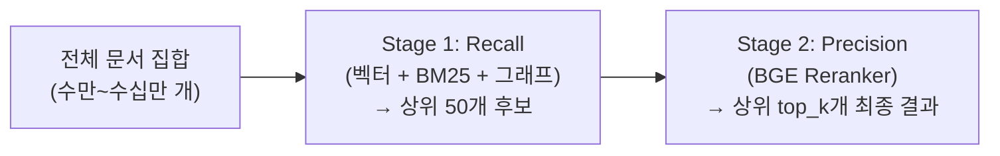

### 10.2 ONNX Runtime 최적화 (SCRUM-102)

`BGEReranker`는 SCRUM-102 요구사항에 따라 ONNX Runtime을 지원합니다. PyTorch 모델을 ONNX 형식으로 변환하여 ONNX Runtime으로 실행하면 CPU 추론 속도가 2~5배 향상됩니다. GPU가 없는 환경에서 Reranker를 실용적으로 사용할 수 있게 하는 중요한 최적화입니다.

ONNX 변환 파일은 `transformers_cache` 디렉터리의 부모 아래 `onnx` 폴더에 캐시됩니다. 처음에는 변환 시간이 필요하지만, 이후 재시작 시에는 캐시된 ONNX 파일을 바로 로드합니다.

### 10.3 asyncio.to_thread 비동기 래핑 (STORY-052)

PyTorch 추론은 CPU/GPU 연산으로 블로킹(blocking) 작업입니다. FastAPI 같은 비동기 서버에서 블로킹 작업을 직접 호출하면 이벤트 루프가 멈추고 다른 요청을 처리하지 못합니다.

STORY-052 요구사항에 따라 Reranker의 동기 추론 함수를 `asyncio.to_thread()`로 래핑합니다. 이렇게 하면 추론이 별도 스레드에서 실행되고 이벤트 루프는 계속 다른 요청을 처리할 수 있습니다. Python 3.9+에서 사용 가능한 표준 라이브러리 함수입니다.

### 10.4 점수 정규화

Reranker 모델의 원시 출력(logit)을 Sigmoid 함수로 0~1 범위의 점수로 변환합니다. 원시 logit은 음수도 될 수 있고 범위가 일정하지 않기 때문에, 표준화된 0~1 점수로 변환해야 다른 점수와 비교하거나 임계값을 설정하기 용이합니다.

`RerankResult`에는 `score`(Reranker 점수)와 `original_score`(RRF 점수) 두 가지가 저장됩니다. 이 두 점수를 함께 보면 "원래 RRF에서 높았는데 Reranker에서 낮아진 것"이나 반대의 경우를 파악할 수 있어 품질 분석에 유용합니다.

---

## 11. Neo4j Knowledge Graph — 코드에서 GraphRAG 동작 방식

이 시스템의 Neo4j 활용 방식은 전형적인 Knowledge-based GraphRAG이지만, 실제 구현에는 매우 독창적인 설계 결정이 담겨 있습니다. 코드를 직접 분석하여 Neo4j가 어떻게 구성되고 어떤 역할을 담당하는지 상세하게 살펴봅니다.

### 11.1 state.py → Neo4j 노드와 엣지의 직접 대응

`state.py`에 정의된 데이터 모델이 Neo4j 그래프 구조와 1:1로 대응합니다. 이 설계는 "코드가 곧 스키마"라는 원칙을 구현합니다.

`Entity` 클래스의 `type` 필드에 선언된 값들이 Neo4j 노드 레이블이 됩니다. `Person`, `Organization`, `Technology`, `Project`, `Concept`가 기본 레이블이고, `Date`와 `Location`은 `entity_extraction.py`의 프롬프트에서 추출 가능하지만 `search.py`의 `_ENTITY_TYPE_LABEL_MAP`에 의해 `Keyword` 레이블로 정규화됩니다.

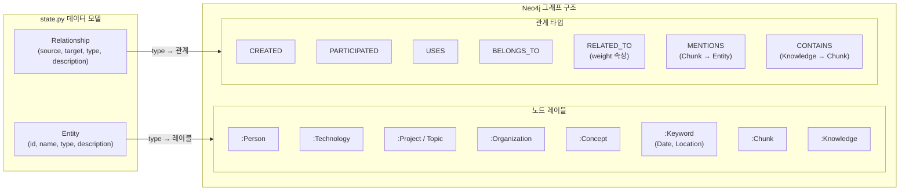

`Relationship` 타입 중 `RELATED_TO`는 그래프 탐색에서 특별한 역할을 합니다. `search.py`의 Cypher 쿼리에서 이 관계를 1-hop 확장에 사용합니다. `weight` 속성으로 관계 강도를 표현하며, Neo4j Cypher에서 `COALESCE(r.weight, 1.0)`로 기본값을 처리합니다.

`MENTIONS` 관계는 코드 전반에서 핵심적으로 사용됩니다. `entity_extraction.py`에서 추출된 엔터티가 어느 `Chunk`에 등장했는지를 연결하는 관계입니다. 이 관계가 없으면 `_get_chunk_entities()` 조회 자체가 불가능합니다.

### 11.2 entity_extraction.py → Neo4j 구축 파이프라인

`entity_extraction.py`의 처리 결과가 Neo4j에 적재되는 흐름을 추적하면 다음과 같습니다.

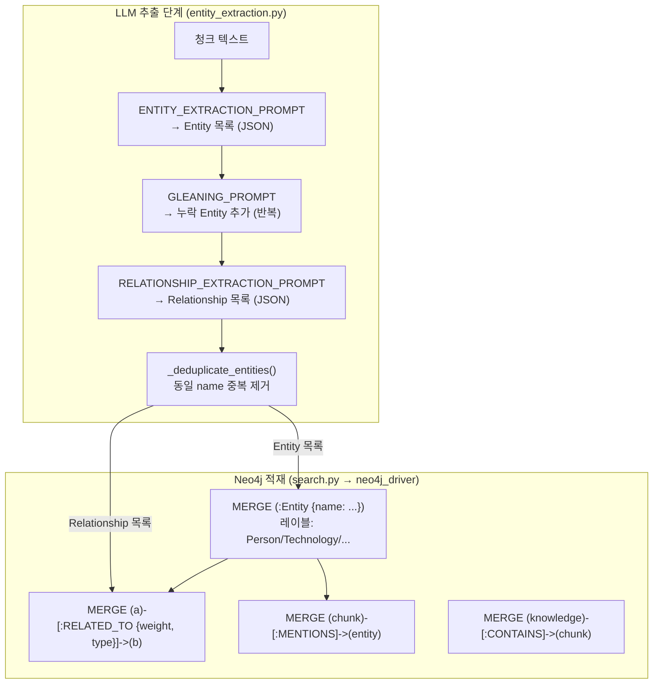

중복 제거(`_deduplicate_entities()`)는 매우 중요합니다. 같은 청크 안에서 "FastAPI"가 두 번 추출되거나, Gleaning 패스에서 이미 있는 것이 다시 추출될 때 중복을 제거합니다. 그러나 서로 다른 청크에서 "FastAPI"가 각각 추출되면, Neo4j의 `MERGE` 구문이 같은 `name`을 가진 노드를 찾아 기존 노드에 합칩니다. 이것이 Knowledge Graph가 여러 문서에 걸쳐 동일 엔터티를 하나의 노드로 통합하는 메커니즘입니다.

### 11.3 _graph_search()의 독창적 설계 — Entity-Enhanced BM25

이 시스템의 Graph Search가 가장 흥미로운 이유는 **순수한 Cypher 탐색으로 청크를 직접 반환하지 않는다**는 점입니다. 대신 Neo4j를 "쿼리 확장기(Query Expander)"로 사용하는 독창적 전략을 채택했습니다.

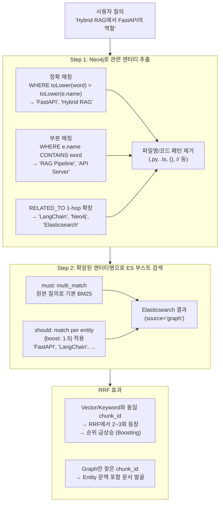

이 설계의 핵심 장점은 **RRF Boosting 효과**입니다. Vector Search에서 "FastAPI 관련 문서 A"가 3위로 검색됐다고 합시다. Graph Search도 같은 "문서 A"의 동일 `chunk_id`를 찾으면, RRF에서 두 번 계산되어 최종 순위가 크게 올라갑니다. 반면 순수 Cypher로 별도 청크를 찾으면 `chunk_id`가 겹치지 않아 RRF 부스팅 효과가 없습니다.

### 11.4 _get_chunk_entities() — Post-RRF Neo4j 조회

RRF 융합이 끝난 후에도 Neo4j는 한 번 더 호출됩니다. `search.py`의 `hybrid_search()` 메서드에서 RRF 결과의 `chunk_id` 목록을 모아 `_get_chunk_entities()`를 호출합니다.

```cypher
-- _get_chunk_entities()에서 실행되는 Cypher
UNWIND $chunk_ids AS cid
MATCH (c:Chunk {id: cid})-[:MENTIONS]->(e:Entity)
WHERE NOT e.name STARTS WITH '/' AND NOT e.name STARTS WITH '.'
  AND size(e.name) >= 2
  AND NOT e.name CONTAINS '.py' AND NOT e.name CONTAINS '.ts'
  -- ... 파일명/코드 패턴 필터 ...
RETURN cid, collect(DISTINCT e.name)[0..5] AS entities
```

이 쿼리는 각 청크에 `MENTIONS` 관계로 연결된 엔터티 이름을 최대 5개 조회합니다. 결과는 `r.metadata["matched_entities"]`에 저장되고, `build_sources_from_results()`에서 이를 꺼내 `graph_context.related_entities`로 UI에 전달합니다. UI의 그래프 패널에서 "이 결과와 연관된 엔터티"를 시각화하는 데 사용됩니다.

이것이 ISSUE-011에서 해결한 버그의 맥락입니다. 이전에는 파일명(`.py`, `.ts` 등)이 엔터티로 잘못 추출되어 그래프 패널에 표시되는 문제가 있었고, 현재 코드의 필터링이 이를 해결합니다.

#### 왜 UNWIND로 한 번에 처리하는가 — N+1 문제 해설

`UNWIND $chunk_ids`가 낯설 수 있으니 직관적으로 설명합니다. 이 패턴은 **"반복 조회 대신 일괄 조회"** 를 구현하는 Cypher의 핵심 기법입니다.

RRF 결과로 10개의 청크가 반환됐다고 가정합니다. 각 청크의 연관 엔터티를 Neo4j에서 가져와야 할 때 두 가지 방법이 있습니다.

```
방법 A — N+1 조회 (나쁜 방법)
─────────────────────────────────────────────
for chunk_id in chunk_ids:                      # Python 루프
    query = "MATCH (c:Chunk {id: $id})-[:MENTIONS]->(e) RETURN e"
    result = neo4j.run(query, id=chunk_id)      # Neo4j 호출 × 10번
    # → 네트워크 왕복 10회, 연결 오버헤드 10배

방법 B — UNWIND 일괄 조회 (현재 코드)
─────────────────────────────────────────────
query = """
    UNWIND $chunk_ids AS cid
    MATCH (c:Chunk {id: cid})-[:MENTIONS]->(e:Entity)
    RETURN cid, collect(DISTINCT e.name)[0..5] AS entities
"""
result = neo4j.run(query, chunk_ids=all_ids)    # Neo4j 호출 × 1번
# → 네트워크 왕복 1회, Neo4j 내부에서 병렬 처리
```

`UNWIND`는 파이썬의 리스트를 **Neo4j 내부에서 여러 행(row)으로 펼칩니다**. `$chunk_ids`가 `["c_001", "c_002", "c_003"]`이면, Neo4j 쿼리 플래너는 이 세 값을 각각 하나의 행으로 처리하되 단일 트랜잭션 안에서 수행합니다.

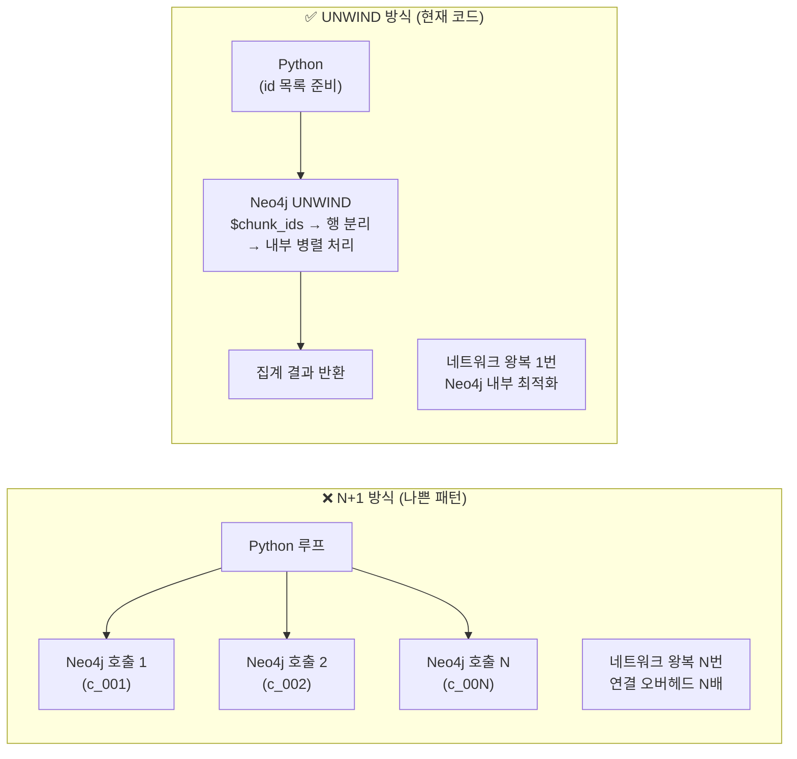

결과는 `{chunk_id → [entity_name, ...]}` 딕셔너리로 변환됩니다. Python 코드에서는 이 딕셔너리를 참조하여 각 `SearchResult`의 `metadata["matched_entities"]`를 채웁니다. 최대 5개(`[0..5]`)로 제한하는 이유는 UI 그래프 패널에 너무 많은 엔터티가 표시되면 오히려 가독성이 떨어지기 때문입니다.

마지막으로, `WHERE NOT e.name STARTS WITH '/'` 같은 필터들은 엔터티 추출 단계에서 파일 경로(`/app/services/search.py`)나 코드 패턴(`search()`)이 잘못 엔터티로 추출된 경우를 걸러냅니다. ISSUE-011에서 발견한 교훈이 이 필터들로 구체화된 것입니다.

### 11.5 Cypher 쿼리 상세 분석

코드에 등장하는 Cypher 쿼리들을 유형별로 정리하고 의미를 설명합니다.

**엔터티 매칭 쿼리 (엔터티 목록이 있는 경우)**

```cypher
MATCH (e:Entity)
WHERE e.name IN $entity_names
OPTIONAL MATCH (e)-[:RELATED_TO]-(related:Entity)
WHERE related.name IS NOT NULL AND related.name <> 'None'
WITH collect(DISTINCT e.name) + collect(DISTINCT related.name) AS all_names
UNWIND all_names AS name
WITH DISTINCT name
WHERE name IS NOT NULL AND name <> 'None' AND size(name) >= 2
RETURN name
LIMIT 20
```

이 쿼리는 VIPAgent의 `_extract_entities` 결과로 얻은 엔터티 이름 목록을 입력받아, 해당 엔터티와 1-hop으로 연결된 `RELATED_TO` 이웃까지 포함한 확장된 엔터티 집합을 반환합니다. 예를 들어 "FastAPI"를 입력하면 FastAPI에 `RELATED_TO`로 연결된 "Python", "LangChain", "API Gateway" 같은 관련 기술들도 함께 반환됩니다.

**엔터티가 없는 경우 2단계 매칭**

```cypher
-- 1단계: 정확 매칭
MATCH (e:Entity) WHERE any(word IN $query_words
    WHERE toLower(word) = toLower(e.name))
WITH collect(DISTINCT e) AS exact

-- 2단계: 부분 매칭 (정확 매칭 제외)
OPTIONAL MATCH (e2:Entity)
WHERE any(word IN $query_words WHERE
    toLower(e2.name) CONTAINS toLower(word) AND size(word) >= 2)
AND NOT any(word IN $query_words WHERE toLower(word) = toLower(e2.name))
WITH exact, collect(DISTINCT e2)[0..15] AS partial

-- 통합 + RELATED_TO 확장
WITH exact + partial AS all_e
UNWIND all_e AS e
OPTIONAL MATCH (e)-[r:RELATED_TO]-(rel:Entity)
WHERE rel.name IS NOT NULL ...
WITH e, rel, COALESCE(r.weight, 1.0) AS w
ORDER BY w DESC
WITH e, collect(rel.name)[0..3] AS rn
```

엔터티 목록 없이 원본 질의 텍스트만 있을 때 사용합니다. 한국어 조사(은/는/이/가 등)를 제거한 단어 목록으로 정확 매칭과 부분 매칭을 단계적으로 시도합니다. `RELATED_TO`의 가중치(`r.weight`) 기준 내림차순으로 이웃을 정렬하여 연관성이 강한 관계를 우선 사용합니다.

**청크-엔터티 조회 (Post-RRF)**

```cypher
UNWIND $chunk_ids AS cid
MATCH (c:Chunk {id: cid})-[:MENTIONS]->(e:Entity)
WHERE NOT e.name STARTS WITH '/' ...
RETURN cid, collect(DISTINCT e.name)[0..5] AS entities
```

이 쿼리는 `UNWIND`로 청크 ID 배열을 펼쳐 한 번의 Neo4j 호출로 여러 청크의 엔터티를 일괄 조회합니다. N+1 조회 문제를 피하는 효율적인 패턴입니다.

### 11.6 Neo4j 그래프의 실제 구조 예시

코드에서 추출할 수 있는 실제 그래프 구조를 도식화하면 이렇습니다.

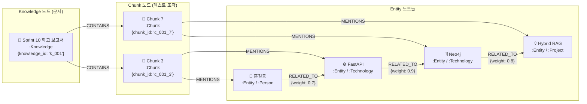

이 구조에서 "Neo4j"로 Graph Search를 수행하면, `RELATED_TO` 1-hop 확장으로 "FastAPI"와 "Hybrid RAG"도 확장 엔터티에 포함됩니다. 세 엔터티명을 `should` 절에 넣어 Elasticsearch를 부스트 검색하면, Neo4j와 FastAPI를 모두 언급하는 청크가 더 높은 점수를 받게 됩니다.

### 11.7 Graph Search가 기여하는 방식 — 세 가지 가치

코드 분석을 통해 Graph Search가 검색 품질에 기여하는 세 가지 방식을 식별할 수 있습니다.

**RRF 부스팅**: Vector/Keyword 결과와 동일한 `chunk_id`가 Graph 결과에도 등장하면, RRF에서 해당 청크의 최종 점수가 올라갑니다. 여러 검색 방식이 동의한 결과를 신뢰하는 원리입니다.

**맥락적 발굴**: 원본 질의에 직접 언급되지 않았지만 `RELATED_TO` 관계로 연결된 엔터티를 통해, 간접적으로 관련된 청크를 찾아냅니다. 이것이 Knowledge Graph 활용의 핵심 가치입니다. 사용자가 "FastAPI"를 물었을 때, FastAPI와 `RELATED_TO`로 연결된 "Python", "LangChain"을 언급하는 청크도 검색 후보에 포함됩니다.

**엔터티 컨텍스트 제공**: Post-RRF 단계에서 `_get_chunk_entities()`로 각 결과 청크에 연결된 실제 Neo4j 엔터티를 태깅합니다. 이 정보가 UI의 그래프 패널과 출처 표시에 활용됩니다. 검색 결과가 단순 텍스트 조각이 아니라 지식그래프의 맥락을 품은 결과로 표현됩니다.

### 11.8 현재 구현의 특성과 향후 발전 방향

현재 Graph Search는 "Neo4j를 통한 엔터티 확장 → ES BM25 실행" 패턴입니다. 이는 순수한 Cypher 기반 청크 반환보다 RRF 통합 효과가 높다는 실용적 판단에서 나온 설계입니다.

향후 발전 방향으로 코드 주석과 변수명을 통해 의도를 파악할 수 있는 것들이 있습니다. `RELATED_TO`의 `weight` 속성을 가중치 RRF에 연결하면 관계 강도에 따라 탐색 우선순위를 조정할 수 있습니다. 현재는 1-hop 확장만 수행하지만, `*1..2` 또는 `*1..3` 가변 길이 탐색으로 2~3홉 확장도 가능합니다. `PARTICIPATED`, `BELONGS_TO` 같은 다양한 관계 유형도 현재는 Cypher에서 `RELATED_TO`만 사용하지만, 유형별 가중치를 달리한 다중 관계 탐색으로 확장될 수 있습니다.

---

## 12. 모듈 간 상호작용 전체 흐름

### 12.1 문서 처리 (배치) 흐름

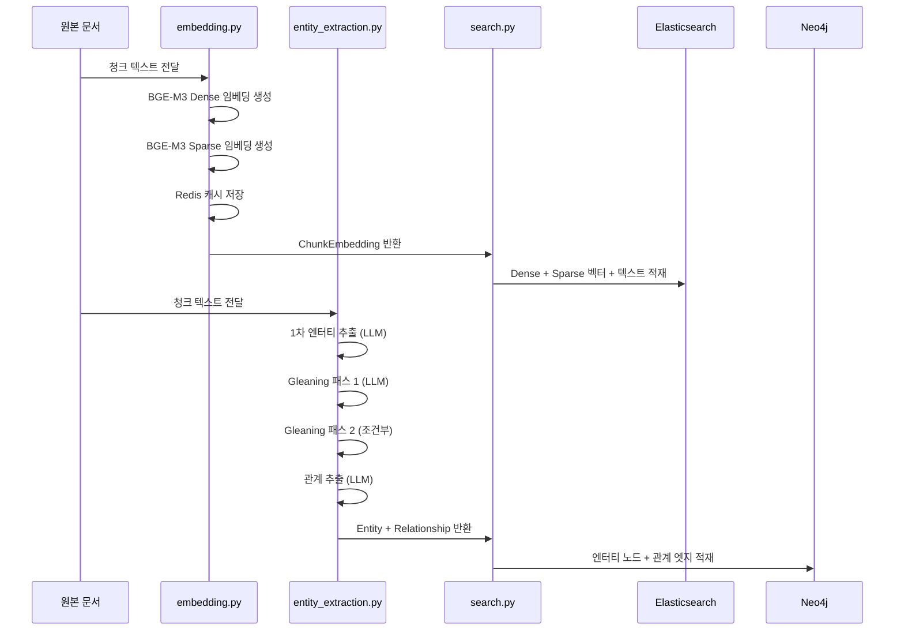

### 12.2 질의 처리 (실시간) 흐름 — RAGWorkflow 경로

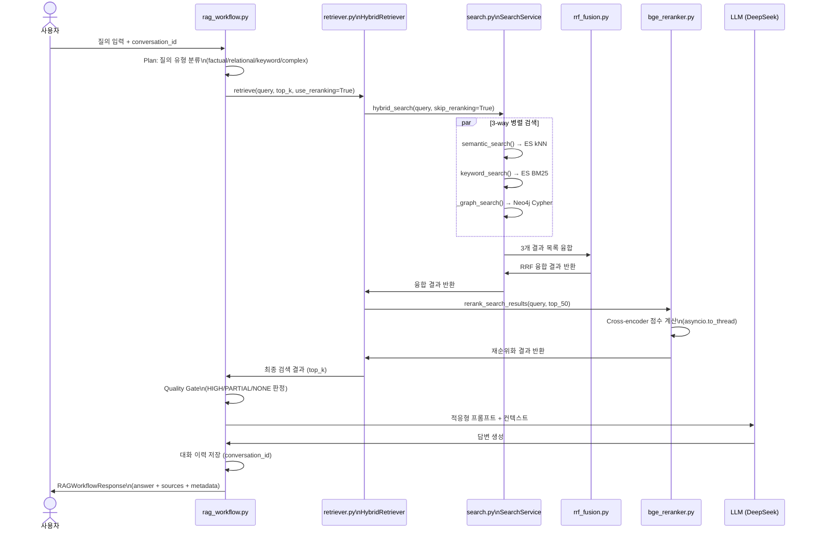

### 12.3 핵심 설계 결정 요약

이 9개 모듈에서 일관되게 나타나는 설계 원칙들이 있습니다.

**단일 책임 원칙**: 각 모듈이 명확한 하나의 책임을 갖습니다. 검색 로직은 `search.py`에, 임베딩은 `embedding.py`에, 추론은 `bge_reranker.py`에만 있습니다.

**의존성 주입**: 모든 주요 컴포넌트가 생성자를 통해 의존 객체를 주입받습니다. 테스트에서 목 객체 주입이 용이하고, 구현체 교체가 쉽습니다.

**지연 초기화(Lazy Loading)**: `@property` 데코레이터로 실제 사용 시점에 초기화합니다. 모델 로드, API 클라이언트 생성 등 무거운 초기화를 필요할 때까지 미룹니다.

**싱글톤 + 리셋**: `get_xxx()` 팩토리 함수로 싱글톤을 반환하고, `reset_xxx()` 함수로 테스트 격리를 지원합니다.

**Graceful Degradation**: 어느 컴포넌트가 실패해도 시스템이 완전히 멈추지 않도록 폴백 경로를 설계합니다. Reranker 실패 시 RRF 결과 사용, 캐시 실패 시 원본 계산, 검색 실패 시 빈 결과로 계속 진행하는 방식입니다.

**관측 가능성(Observability)**: 모든 주요 처리 단계에서 `logger.info()`와 `logger.debug()`로 처리 건수, 소요 시간, 점수를 기록합니다. 운영 중 문제 진단을 위한 필수 장치입니다.

---

## 참고 — 주요 STORY/SCRUM 이슈 정리

코드 전반에 걸쳐 스프린트 이슈 참조가 등장합니다. 이 참조들이 어떤 변경을 의미하는지 정리합니다.

| 이슈 | 모듈 | 내용 |
|---|---|---|
| STORY-004 | embedding.py | BGE-M3 임베딩 서비스 구현 |
| STORY-031 | rrf_fusion.py | RRF Fusion 알고리즘 구현 |
| STORY-032 | bge_reranker.py / retriever.py | BGE Reranker 통합 |
| STORY-051 | rag_workflow.py / vip_agent.py | LangGraph 기반 RAG 파이프라인 통합 |
| STORY-052 | bge_reranker.py | Reranker async 전환 (asyncio.to_thread) |
| STORY-057 | rag_workflow.py | 대화 이력 + 스트리밍 구현 |
| STORY-060 | search.py | 검색 결과 캐싱 |
| STORY-115 | bge_reranker.py | 모델 변경 (bge-reranker-v2-m3) |
| SCRUM-96 | state.py | has_embedding 필드 추가 |
| SCRUM-102 | bge_reranker.py | ONNX Runtime 최적화 |
| SCRUM-103 | retriever.py / rag_workflow.py | 싱글톤 업데이트 로직 |
| ADR-001 | retriever.py / search.py | SearchService 위임 구조 결정 |
| ISSUE-011 | rag_workflow.py | 그래프 패널 파일명 표시 버그 수정 |

---


## 별첨 A — 순수 Cypher 반환 방식 vs. Entity-Enhanced BM25 방식

> 이 시스템의 Graph Search가 왜 "Neo4j에서 직접 청크를 반환하지 않는가?"에 대한 상세 비교입니다.

### A.1 두 방식의 개념적 차이

GraphRAG의 검색 구현에는 크게 두 가지 접근법이 있습니다. **순수 Cypher 반환 방식**은 그래프 탐색의 결과로 청크 텍스트를 Neo4j가 직접 반환합니다. **Entity-Enhanced BM25 방식**(현재 시스템)은 Neo4j를 쿼리 확장기로만 사용하고 실제 청크 반환은 Elasticsearch가 담당합니다.

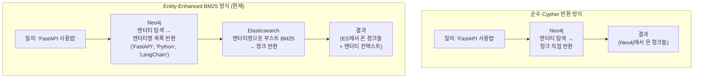

### A.2 순수 Cypher 반환 방식 — 작동 원리와 예시

순수 Cypher 방식은 `neo4j-graphrag-python` 공식 라이브러리의 `VectorCypherRetriever`가 대표적인 구현입니다. 벡터 검색으로 진입점 노드를 찾고, Cypher로 인접 노드를 탐색하며 청크 텍스트를 그래프 DB에서 직접 가져옵니다.

```cypher
-- 순수 Cypher 반환 방식 예시
-- 엔터티 노드를 찾아 → 연결된 청크 → 청크 텍스트 직접 반환

MATCH (e:Entity {name: 'FastAPI'})
      <-[:MENTIONS]-(c:Chunk)
RETURN c.id AS chunk_id,
       c.text AS content,
       c.knowledge_id AS document_id
LIMIT 20

-- 또는 2-hop: 관련 엔터티를 통해 더 넓게 탐색
MATCH (e:Entity {name: 'FastAPI'})
      -[:RELATED_TO*1..2]-(related:Entity)
      <-[:MENTIONS]-(c:Chunk)
RETURN DISTINCT c.id, c.text, c.knowledge_id
LIMIT 20
```

이 방식의 장점은 관계 구조가 명확하고 탐색 경로가 추적 가능하다는 것입니다. "FastAPI에 `RELATED_TO`로 연결된 엔터티를 언급한 청크"라는 경로가 명시적입니다.

### A.3 Entity-Enhanced BM25 방식 — 현재 시스템의 선택

현재 `search.py`의 `_graph_search()`는 다음과 같이 동작합니다.

```cypher
-- Step 1: Neo4j에서 엔터티명만 추출 (청크 반환 없음)
MATCH (e:Entity) WHERE e.name IN $entity_names
OPTIONAL MATCH (e)-[:RELATED_TO]-(related:Entity)
RETURN name  -- ← 청크가 아닌 엔터티명만 반환

-- Step 2: Elasticsearch에서 엔터티명으로 부스트 BM25
{
  "bool": {
    "must": [{"multi_match": {"query": "FastAPI 사용법"}}],
    "should": [
      {"match": {"text": {"query": "FastAPI",  "boost": 1.5}}},
      {"match": {"text": {"query": "Python",   "boost": 1.5}}},
      {"match": {"text": {"query": "LangChain","boost": 1.5}}}
    ]
  }
}
```

### A.4 두 방식의 상세 비교

| 비교 항목 | 순수 Cypher 반환 | Entity-Enhanced BM25 (현재) |
|---|---|---|
| **청크 저장 위치** | Neo4j 내부 | Elasticsearch |
| **Neo4j 역할** | 청크 저장 + 탐색 | 쿼리 확장기만 |
| **ES 역할** | 없음 (또는 벡터만) | BM25 + 벡터 + 부스팅 |
| **RRF 통합 효과** | chunk_id 중복 없음 → 부스팅 없음 | chunk_id 중복 → **RRF 부스팅** |
| **탐색 표현력** | Cypher로 정밀 제어 | 엔터티명 부스팅만 |
| **관계 활용** | 직접 탐색 (`*1..N` 홉) | 1-hop 확장 후 ES 위임 |
| **인프라 복잡도** | Neo4j 단독 (청크 포함) | Neo4j + ES 역할 분리 |
| **BM25 이점** | 없음 | ES Nori 형태소 분석 활용 |
| **구현 사례** | neo4j-graphrag VectorCypherRetriever | 이 시스템 _graph_search() |

### A.5 이 시스템이 Entity-Enhanced BM25를 선택한 이유

**RRF Boosting 극대화**: 가장 중요한 이유입니다. 벡터 검색과 키워드 검색이 이미 Elasticsearch에서 수행됩니다. Graph Search도 같은 Elasticsearch `chunk_id`를 참조하면, 동일 청크가 세 검색 경로 모두에서 나타날 수 있습니다. RRF는 여러 소스에서 동시에 등장하는 문서를 크게 부스팅합니다.

```
예시:
Vector Search  → chunk_001 (3위)
Keyword Search → chunk_001 (5위)
Graph Search   → chunk_001 (2위)

RRF 점수 = 1/(60+3) + 1/(60+5) + 1/(60+2) = 0.0479  ← 세 번 등장

Vector Search  → chunk_999 (1위)
(Keyword, Graph에 없음)

RRF 점수 = 1/(60+1) = 0.0164  ← 한 번만 등장

→ chunk_001이 chunk_999보다 높은 최종 순위
```

**인프라 단순화**: 청크 텍스트를 Elasticsearch 한 곳에만 저장합니다. Neo4j에 청크를 별도로 저장하면 데이터 동기화 관리가 복잡해집니다. 역할을 분리하여(엔터티/관계 → Neo4j, 텍스트/임베딩 → ES) 각 저장소가 잘하는 일만 합니다.

**Elasticsearch의 BM25 품질**: ES의 Nori 한국어 형태소 분석기가 BM25 검색 품질에 크게 기여합니다. 순수 Cypher 방식으로 Neo4j에서 청크를 찾으면 이 언어 처리 이점을 잃습니다.

### A.6 순수 Cypher 방식이 더 적합한 경우

이 시스템의 선택이 항상 더 나은 것은 아닙니다. 다음 상황에서는 순수 Cypher 방식이 더 적합합니다.

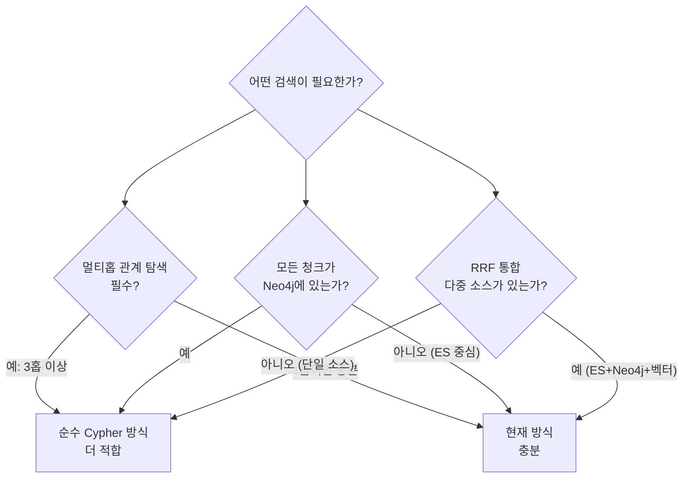

특히 "A 시스템 → B 라이브러리 → C 취약점 → D 서비스"처럼 3홉 이상의 경로 탐색이 필요하다면 순수 Cypher 방식이 훨씬 자연스럽습니다. 현재 시스템은 1-hop `RELATED_TO` 확장만 지원하기 때문입니다.

---

## 별첨 B — Cypher 문법 실용 가이드

> Neo4j 경험이 없는 분들을 위한 Cypher 핵심 문법 설명입니다. 이 시스템 코드에 등장하는 패턴을 중심으로 설명합니다.

### B.1 Cypher의 기본 철학 — "그림처럼 그려라"

Cypher는 SQL과 달리 **그래프 패턴을 ASCII-art처럼 표현**합니다. 노드는 소괄호 `()`로, 관계는 대괄호와 화살표 `-->` 또는 `<--`로 표현합니다. 코드를 읽으면 그래프가 눈에 그려지는 것이 목표입니다.

```cypher
-- SQL 스타일 (관계형)
SELECT c.text FROM chunks c
JOIN chunk_entity ce ON c.id = ce.chunk_id
JOIN entities e ON ce.entity_id = e.id
WHERE e.name = 'FastAPI'

-- Cypher 스타일 (그래프)
MATCH (c:Chunk)-[:MENTIONS]->(e:Entity {name: 'FastAPI'})
RETURN c.text
```

### B.2 기본 구문 구조

모든 Cypher 쿼리는 다음 구조를 따릅니다.

```cypher
MATCH   패턴     -- "이런 패턴을 찾아라"
WHERE   조건     -- "이 조건을 만족하는 것만"
WITH    중간값   -- "중간 결과를 다음 단계로 전달"
RETURN  반환값   -- "이것을 결과로 돌려라"
```

#### MATCH — 패턴 찾기

```cypher
-- 노드 하나 찾기
MATCH (n:Entity)
RETURN n

-- 노드 + 관계 + 노드 패턴
MATCH (c:Chunk)-[:MENTIONS]->(e:Entity)
RETURN c.id, e.name

-- 방향 없는 탐색 (양방향 모두)
MATCH (a:Entity)-[:RELATED_TO]-(b:Entity)
RETURN a.name, b.name

-- 속성 조건으로 노드 특정
MATCH (e:Entity {name: 'FastAPI'})
RETURN e

-- 가변 길이 경로 (1~3홉)
MATCH (start:Entity {name: 'FastAPI'})-[:RELATED_TO*1..3]-(end:Entity)
RETURN end.name
```

#### WHERE — 조건 필터링

```cypher
-- 기본 조건
MATCH (e:Entity)
WHERE e.name = 'FastAPI'
RETURN e

-- IN 조건 (목록 중 하나)
MATCH (e:Entity)
WHERE e.name IN ['FastAPI', 'LangChain', 'Neo4j']
RETURN e

-- CONTAINS 부분 문자열
MATCH (e:Entity)
WHERE e.name CONTAINS 'API'
RETURN e

-- STARTS WITH / ENDS WITH
MATCH (e:Entity)
WHERE NOT e.name STARTS WITH '/'     -- 경로 패턴 제외
  AND NOT e.name ENDS WITH '.py'     -- 파일명 제외
RETURN e

-- size() 함수
MATCH (e:Entity)
WHERE size(e.name) >= 2              -- 2글자 이상만
RETURN e

-- any() 함수 — 리스트 원소 조건
MATCH (e:Entity)
WHERE any(word IN $query_words WHERE toLower(e.name) CONTAINS toLower(word))
RETURN e
```

#### WITH — 중간 결과 전달과 집계

`WITH`는 SQL의 CTE(Common Table Expression)와 유사합니다. 중간 결과를 다음 단계로 전달하거나, 집계 후 필터링할 때 사용합니다.

```cypher
-- 중간 집계 후 필터링
MATCH (e:Entity)-[:RELATED_TO]-(related:Entity)
WITH e, count(related) AS rel_count
WHERE rel_count >= 3                 -- 3개 이상 연결된 것만
RETURN e.name, rel_count
ORDER BY rel_count DESC

-- collect()로 리스트 수집
MATCH (c:Chunk)-[:MENTIONS]->(e:Entity)
WHERE c.knowledge_id = 'k_001'
WITH c, collect(e.name) AS entity_names
RETURN c.id, entity_names

-- 리스트 합산
MATCH (e:Entity)-[:RELATED_TO]-(rel:Entity)
WITH collect(DISTINCT e.name) + collect(DISTINCT rel.name) AS all_names
RETURN all_names
```

### B.3 UNWIND — 리스트를 행으로 펼치기

`UNWIND`는 Cypher에서 가장 중요한 배치 처리 패턴입니다. Python의 `for item in list`와 개념은 같지만, **Neo4j 내부에서 실행**됩니다.

#### 기본 사용법

```cypher
-- 리터럴 리스트 펼치기
UNWIND [1, 2, 3] AS num
RETURN num
-- 결과: 1 / 2 / 3 (3개 행)

-- 파라미터 리스트 펼치기 (현재 코드 패턴)
UNWIND $chunk_ids AS cid
MATCH (c:Chunk {id: cid})
RETURN c.id, c.text
-- $chunk_ids = ["c_001", "c_002", "c_003"] → 3개 행으로 처리
```

#### UNWIND를 써야 하는 경우 vs. 쓰면 안 되는 경우

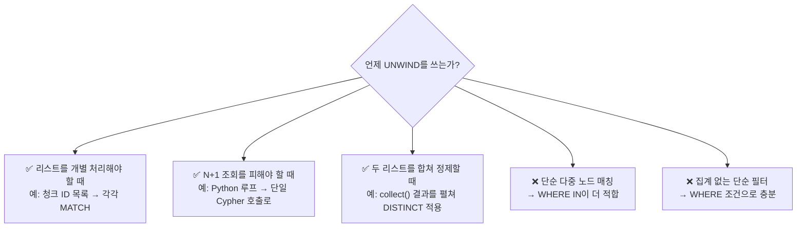

```cypher
-- ✅ UNWIND가 적합한 경우 1: 배치 조회 (현재 코드 패턴)
UNWIND $chunk_ids AS cid
MATCH (c:Chunk {id: cid})-[:MENTIONS]->(e:Entity)
RETURN cid, collect(DISTINCT e.name)[0..5] AS entities

-- ❌ 이렇게 하면 안 됨 (N+1 문제)
-- Python에서:
for cid in chunk_ids:
    result = neo4j.run("MATCH (c:Chunk {id: $id})-[:MENTIONS]->(e) RETURN e", id=cid)

-- ✅ UNWIND가 적합한 경우 2: 리스트 합산 후 정제
MATCH (e:Entity) WHERE e.name IN $entity_names
OPTIONAL MATCH (e)-[:RELATED_TO]-(related:Entity)
WITH collect(DISTINCT e.name) + collect(DISTINCT related.name) AS all_names
UNWIND all_names AS name          -- 합산된 리스트를 행으로 펼쳐
WITH DISTINCT name                 -- 중복 제거
WHERE name IS NOT NULL AND size(name) >= 2
RETURN name LIMIT 20

-- ✅ UNWIND가 적합한 경우 3: 배치 MERGE (대량 노드 생성)
UNWIND $entities AS ent
MERGE (e:Entity {name: ent.name})
SET e.type = ent.type,
    e.description = ent.description

-- ❌ UNWIND 대신 WHERE IN이 더 나은 경우
-- UNWIND 필요 없음: 목록 중 하나인지 확인만 할 때
MATCH (e:Entity)
WHERE e.name IN $entity_names     -- ← 이게 더 단순하고 효율적
RETURN e
```

### B.4 collect() — 행을 리스트로 모으기

`collect()`는 SQL의 `GROUP_CONCAT` 또는 Python의 `list()`와 유사합니다. 여러 행을 하나의 리스트로 묶습니다.

```cypher
-- 기본 collect
MATCH (c:Chunk)-[:MENTIONS]->(e:Entity)
WHERE c.knowledge_id = 'k_001'
RETURN c.id, collect(e.name) AS entities
-- c_001_3 → ['FastAPI', 'Python', 'LangChain']
-- c_001_7 → ['Neo4j', 'Elasticsearch']

-- collect(DISTINCT ...) — 중복 제거
MATCH (e:Entity)-[:RELATED_TO]-(rel:Entity)
RETURN collect(DISTINCT rel.name) AS related_names

-- 슬라이싱 [0..N] — 최대 N개만
MATCH (c:Chunk {id: $cid})-[:MENTIONS]->(e:Entity)
RETURN collect(DISTINCT e.name)[0..5] AS top_5_entities
-- → 최대 5개만 반환 (현재 코드 패턴)

-- reduce() — 중첩 리스트 평탄화
WITH [[1,2], [3,4], [5]] AS nested
RETURN reduce(a=[], n IN nested | a + n) AS flat
-- → [1, 2, 3, 4, 5]
```

### B.5 OPTIONAL MATCH — 없어도 괜찮은 패턴

SQL의 `LEFT JOIN`과 같습니다. 패턴이 없으면 `NULL`을 반환하지만 행 자체는 유지합니다.

```cypher
-- OPTIONAL MATCH 없이: 관련 엔터티가 없는 Chunk는 결과에서 제외됨
MATCH (c:Chunk)-[:MENTIONS]->(e:Entity)
RETURN c.id, e.name

-- OPTIONAL MATCH 사용: 관련 엔터티가 없어도 Chunk는 포함
MATCH (c:Chunk {id: 'c_001_3'})
OPTIONAL MATCH (c)-[:MENTIONS]->(e:Entity)
RETURN c.id, e.name       -- e.name이 NULL이어도 c는 반환됨

-- 현재 코드 패턴: 확장 엔터티가 없어도 원본 엔터티는 유지
MATCH (e:Entity)
WHERE e.name IN $entity_names
OPTIONAL MATCH (e)-[:RELATED_TO]-(related:Entity)   -- ← 없어도 OK
WITH collect(DISTINCT e.name) + collect(DISTINCT related.name) AS all_names
```

### B.6 COALESCE() — NULL 기본값 처리

`COALESCE(a, b)`는 a가 NULL이면 b를 반환합니다. Python의 `a or b`와 유사합니다.

```cypher
-- 현재 코드: 관계 weight가 없으면 1.0으로 처리
OPTIONAL MATCH (e)-[r:RELATED_TO]-(rel:Entity)
WITH e, rel, COALESCE(r.weight, 1.0) AS w  -- weight 없으면 1.0
ORDER BY w DESC
```

### B.7 toLower() — 대소문자 구분 없는 비교

```cypher
-- 대소문자 구분 없이 매칭 (현재 코드 패턴)
MATCH (e:Entity)
WHERE any(word IN $query_words
    WHERE toLower(word) = toLower(e.name))
RETURN e

-- 부분 매칭도 대소문자 무관
WHERE toLower(e.name) CONTAINS toLower(word)
```

### B.8 LIMIT과 슬라이싱

```cypher
-- LIMIT: 전체 결과 상위 N개
MATCH (e:Entity)
RETURN e.name
LIMIT 20

-- collect() 슬라이싱: 집계 리스트에서 상위 N개
collect(DISTINCT e.name)[0..5]   -- 0번째부터 4번째까지 (5개)
collect(DISTINCT r.name)[0..3]   -- 0번째부터 2번째까지 (3개)

-- 주의: [0..5]는 파이썬과 달리 exclusive하지 않고
-- Neo4j에서는 [start..end]가 start 이상 end 미만으로 동작
```

### B.9 이 시스템 코드에서 자주 보이는 패턴 정리

```cypher
-- ① 배치 조회 (N+1 방지)
UNWIND $ids AS id
MATCH (n {id: id})-[:관계]->(m)
RETURN id, collect(m.name) AS names

-- ② 엔터티 확장 탐색
MATCH (e:Entity)
WHERE e.name IN $names
OPTIONAL MATCH (e)-[:RELATED_TO]-(related:Entity)
WITH collect(DISTINCT e.name) + collect(DISTINCT related.name) AS all
UNWIND all AS name
WITH DISTINCT name WHERE name IS NOT NULL AND size(name) >= 2
RETURN name LIMIT 20

-- ③ 필터가 긴 경우 변수로 분리
_ef = "e.name IS NOT NULL AND size(e.name) >= 2 AND NOT e.name CONTAINS '.py'"
cypher = f"MATCH (e:Entity) WHERE {_ef} RETURN e"
-- → 복잡한 필터를 Python 문자열 변수로 관리 (현재 코드의 _ef 패턴)

-- ④ 가중치 기준 정렬 후 상위 N개 이웃
OPTIONAL MATCH (e)-[r:RELATED_TO]-(rel:Entity)
WITH e, rel, COALESCE(r.weight, 1.0) AS w
ORDER BY w DESC
WITH e, collect(rel.name)[0..3] AS top_related
```

---

## 별첨 C — 코드 품질 리뷰: 잘 만들었는가?

> 업로드된 9개 모듈을 직접 분석한 결과를 솔직하게 정리합니다. 칭찬도 있고 지적도 있습니다.

### 총평 — 한 줄로 먼저

**전반적으로 잘 만들어진 코드입니다. 아키텍처 설계 수준이 높고 운영 환경을 고려한 흔적이 뚜렷합니다. 다만 몇 가지 미완성 부분과 개선 여지가 있습니다.**

---

### C.1 잘 된 것들

#### ✅ 아키텍처 설계 수준이 높다

단일 책임 원칙, 의존성 주입, Lazy Loading, 싱글톤 + 리셋 패턴이 일관되게 적용됩니다. 특히 `HybridRetriever`와 `SearchService`의 역할 분리(ADR-001)는 "REST API 진입점"과 "에이전트 진입점"을 명확히 구분한 좋은 결정입니다. 이런 결정을 ADR로 기록해 둔 것 자체도 좋습니다.

#### ✅ skip_reranking으로 이중 Reranking을 영리하게 방지한다

이중 Reranking은 GraphRAG 시스템에서 흔히 발생하는 버그입니다. `SearchService`와 `HybridRetriever`가 각각 Reranker를 가질 수 있는 구조인데, 코드에서는 `hybrid_search(skip_reranking=True)`로 SearchService 내부 Reranking을 명시적으로 비활성화하고 HybridRetriever만 실행합니다. 이 패턴을 의도적으로 구현한 것이 보이며, 이를 놓쳤다면 정확도가 올라가지 않는 이상한 현상이 나타났을 것입니다.

#### ✅ Graceful Degradation이 촘촘하다

Neo4j 드라이버가 없으면 Graph Search를 건너뛰고, Reranker가 실패하면 RRF 결과로 계속 진행하며, Hybrid Search 전체가 실패하면 개별 소스 병렬 검색으로 폴백합니다. 캐시 서비스가 없어도 검색이 멈추지 않습니다. 프로덕션 환경에서 하나의 컴포넌트가 죽어도 시스템이 부분적으로라도 동작하게 설계된 것은 운영 경험에서 나오는 판단입니다.

#### ✅ Adaptive Gleaning은 창의적이다

텍스트 길이에 따라 Gleaning 횟수를 동적으로 조정하는 아이디어는 단순해 보이지만, 짧은 텍스트에 3번씩 LLM을 호출하는 낭비를 방지하는 실용적 최적화입니다. 수확 체감 감지로 조기 종료하는 것도 비용 의식이 잘 반영된 설계입니다.

#### ✅ ONNX + asyncio.to_thread 조합은 올바른 선택이다

BGE Reranker는 블로킹 연산입니다. 이를 `asyncio.to_thread()`로 래핑하여 이벤트 루프를 막지 않도록 한 것(STORY-052)과, ONNX Runtime으로 CPU 추론을 가속한 것(SCRUM-102)은 FastAPI 기반 비동기 서버에서 모델 추론을 다룰 때 반드시 고려해야 할 사항들을 모두 처리한 것입니다.

#### ✅ UNWIND 배치 조회 패턴을 알고 쓴다

`_get_chunk_entities()`에서 `UNWIND $chunk_ids`로 N+1 문제를 회피한 것이 의도적입니다. Neo4j를 모르면 Python 루프로 N번 호출했을 것인데, 올바른 방법을 알고 사용했습니다.

#### ✅ 스프린트 이슈 참조로 변경 이력이 추적 가능하다

코드에 `STORY-051`, `SCRUM-102`, `ISSUE-011` 같은 주석이 남아있어, 왜 이 코드가 이렇게 작성됐는지 히스토리를 추적할 수 있습니다. 단순히 "뭐가 바뀌었다"가 아니라 "왜 바뀌었는지"의 맥락이 코드에 남습니다.

---

### C.2 문제가 있거나 개선이 필요한 것들

#### ⚠️ 검색 전략 분류 결과가 실제로 사용되지 않는다 — 가장 큰 문제

`rag_workflow.py`의 `_plan()` 메서드는 질의를 분석하여 `"vector"`, `"graph"`, `"keyword"`, `"hybrid"` 중 하나를 반환합니다. 그런데 이 결과는 **로깅과 `pipeline_stages` 기록에만 쓰이고**, 실제 `_retrieve()` 호출에는 전달되지 않습니다.

```python
# 현재: search_strategy가 _retrieve에 전달되지 않는다
search_strategy = self._plan(query)       # "graph" 반환해도
search_results = await self._retrieve(    # 항상 hybrid_search() 호출
    query=query,
    top_k=top_k,
    ...
    # search_strategy 파라미터가 없다!
)
```

한국어로 "~와 ~의 관계"라고 물으면 `relational`로 분류하여 Graph 우선 전략을 선택하지만, 실제로는 여전히 Dense + Sparse + BM25 + Graph 모두 실행합니다. 전략 분류기를 만든 공이 현재는 허공에 놓입니다. 완성되지 않은 기능이 동작하는 것처럼 보이는 상태입니다.

#### ⚠️ Quality Gate가 두 번 실행된다

`rag_workflow.py`의 `run()` 메서드와 `_generate()` 메서드가 각각 독립적으로 `assess_context_quality()`를 호출합니다.

```python
# run() 안에서 한 번
quality = assess_context_quality(search_results=search_results, ...)   # ← 1회

# _generate() 안에서 또 한 번
quality = assess_context_quality(search_results=search_results, ...)   # ← 2회
```

두 호출은 같은 `search_results`를 같은 임계값으로 평가합니다. 두 번째 호출 결과가 첫 번째와 항상 동일하기 때문에 낭비입니다. `run()`의 결과를 `_generate()`에 전달하거나, 한 쪽을 제거해야 합니다.

#### ⚠️ Gleaning 수렴 판단이 LangGraph 수준에서 빠져있다

`_should_gleaning()`은 오직 두 가지만 봅니다. `gleaning_count < max_gleanings`이고 `document_text`가 있으면 Gleaning을 계속합니다. 새 엔터티가 발견되지 않았어도 카운트가 max에 도달하기 전까지는 노드를 계속 호출합니다. 내부의 `_gleaning_pass()`가 빈 리스트를 반환하면 실질적 처리는 없지만 LLM 호출 비용은 발생합니다.

수렴 감지(이전 Gleaning에서 새 엔터티가 0개였는가)를 `AgentState`에 별도 필드로 추적하고, `_should_gleaning()`이 이를 참조하면 조기 종료를 더 명확하게 구현할 수 있습니다.

#### ⚠️ `_extract_entities_from_title()`이 dead code다

`rag_workflow.py`에 `_extract_entities_from_title()` 함수가 정의되어 있지만, ISSUE-011 해결 과정에서 Tier 2/3 폴백이 제거되면서 이 함수는 어디서도 호출되지 않습니다. `_is_filename()`은 `build_sources_from_results()`에서 여전히 사용되지만, `_extract_entities_from_title()`은 온전히 죽은 코드입니다. 혼란을 줄이기 위해 제거하는 것이 좋습니다.

#### ⚠️ `Organization`을 `Person`으로 합치는 것은 의미적으로 부정확하다

`entity_extraction.py`의 프롬프트에서 `Organization`을 독립 유형으로 추출하지만, Neo4j 적재 시 `Person` 레이블로 통합됩니다(현행 단순화). 조직과 인물은 의미적으로 다른 개념이고, 이 통합이 그래프 탐색의 정확도를 낮출 수 있습니다. "AI팀이 FastAPI를 사용한다"는 관계에서 "AI팀"이 Person으로 저장되면, Person 기준 탐색 시 조직이 인물로 오인됩니다.

현재 주석에 "개선 여지"로 명시되어 있으므로 인식은 하고 있는 것으로 보이나, 향후 수정이 필요한 부분입니다.

#### ⚠️ vip_agent.py의 지연 임포트는 순환 참조 위험 신호다

```python
# vip_agent.py의 _synthesize_answer() 안에서
from app.agents.rag_workflow import (
    build_context_from_results,
    build_sources_from_results,
)
```

`rag_workflow.py`는 `state.py`를 임포트하고, `vip_agent.py`도 `state.py`를 임포트하며, `vip_agent.py`가 `rag_workflow.py`를 지연 임포트합니다. 현재는 순환 참조로 이어지지 않지만, 두 모듈 사이의 의존 방향이 뒤섞이고 있습니다. `build_context_from_results`와 `build_sources_from_results`를 별도의 `utils.py`나 `context_builder.py`로 분리하면 의존 방향이 명확해집니다.

---

### C.3 사소하지만 주목할 점들

**f-string Cypher 조립**: `search.py`의 `_graph_search()`에서 `_ef` 변수를 f-string으로 Cypher 쿼리에 직접 주입합니다. 현재는 하드코딩된 문자열이라 Cypher Injection 위험은 없지만, 이 패턴이 유지보수 중에 사용자 입력으로 바뀔 경우 보안 취약점이 됩니다. 파라미터화된 Cypher를 권장합니다.

**`has_embedding` 필드의 검증 로직 부재**: SCRUM-96에서 추가된 `has_embedding` 필드는 벡터 검색 시 임베딩 없는 청크를 거르기 위한 것인데, 실제로 이 필드를 보고 청크를 제외하는 로직이 보이지 않습니다. 추가했지만 아직 사용하지 않는 상태일 수 있습니다.

**`_is_filename()`의 과적 판정**: `r'\.\w{2,5}$'` 정규식은 `"v2.0"`, `"e.g"`, `"API v3"` 같은 정상적인 버전 표기나 약어도 파일명으로 판정할 수 있습니다.

---

### C.4 종합 평가

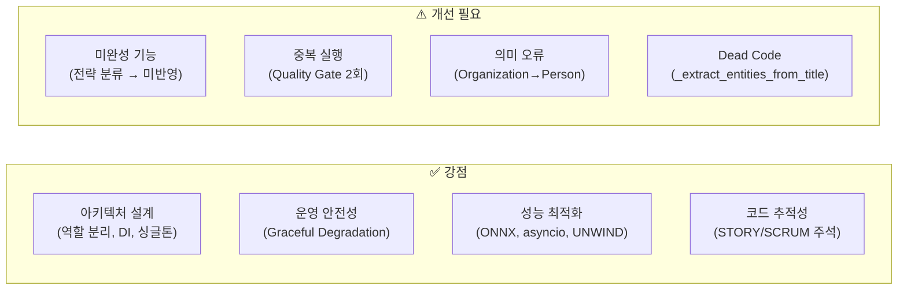

| 평가 항목 | 점수 | 비고 |
|---|---|---|
| 아키텍처 설계 | ⭐⭐⭐⭐⭐ | ADR 기반 역할 분리, DI 일관 적용 |
| 운영 안전성 | ⭐⭐⭐⭐⭐ | 폴백 체인 촘촘, Fail-Open 캐시 |
| 기능 완성도 | ⭐⭐⭐ | 전략 분류기 미완성, Quality Gate 중복 |
| 코드 정결성 | ⭐⭐⭐ | Dead code, 지연 임포트 패턴 |
| 성능 최적화 | ⭐⭐⭐⭐ | ONNX, asyncio, 배치 조회 |
| 테스트 용이성 | ⭐⭐⭐⭐ | reset_xxx() 패턴, DI 구조 |
| 도메인 정확성 | ⭐⭐⭐ | Organization→Person 통합 문제 |

**가장 시급한 개선 항목 두 가지**를 꼽는다면, 첫째는 전략 분류 결과를 실제 검색에 반영하는 것입니다. 이 기능이 완성되면 관계형 질의에서 Graph Search 가중치를 높이고, 키워드 질의에서 BM25를 우선하여 검색 품질을 실제로 향상시킬 수 있습니다. 둘째는 Quality Gate 이중 실행 제거입니다. 이것은 코드 몇 줄 수정으로 해결되는 간단한 문제이지만 매 요청마다 중복 계산이 발생합니다.

나머지 이슈들은 긴급하지 않으나 기술 부채로 누적될 수 있으므로, 기능 개발이 일단락된 후 리팩토링 스프린트에서 정리하는 것이 좋겠습니다.

---
> **이 수준의 소스코드를 HUMAN이 개발한다면 어느정도 실력을 갖추고 있어야 할까요? 간단하게 말해주세요**


**시니어 백엔드 엔지니어** 수준입니다. 구체적으로는 다음을 동시에 알아야 합니다.

- Python 비동기(asyncio) 숙련
- LangGraph / LangChain 실무 경험
- Elasticsearch + Neo4j 양쪽 운용 경험
- RAG, 임베딩, Reranker 등 LLM 응용 이해
- ADR 작성, DI 패턴 등 설계 방법론 소양
- 운영 환경 경험 (폴백 체인, Graceful Degradation을 자연스럽게 짜는 수준)

경력으로 보면 **5년차 이상**이고 AI 응용 개발을 최소 1~2년 경험한 엔지니어 정도입니다.

단, 솔직히 말하면 이 코드는 **Claude Code가 작성한 흔적**이 보입니다. 주석 스타일, 구조적 일관성, STORY/SCRUM 참조 방식이 AI 보조 개발의 특징과 일치합니다. 사람이 단독으로 이 분량을 이 수준으로 처음부터 짜려면 시니어 수준이 맞지만, AI와 협업했다면 **3~4년차 주니어-미드레벨이 설계 방향을 잡고 AI로 구현한 결과물**일 가능성도 충분합니다.

---

*작성일: 2026-05-11*  
*아키텍처팀*