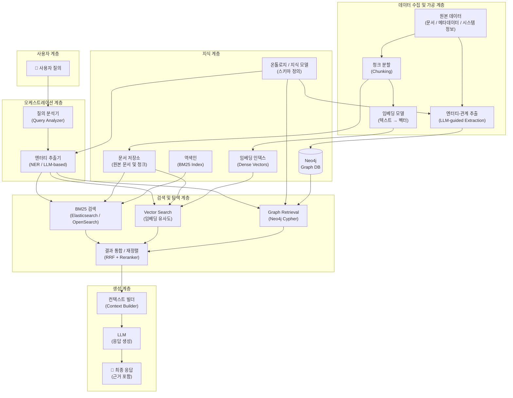
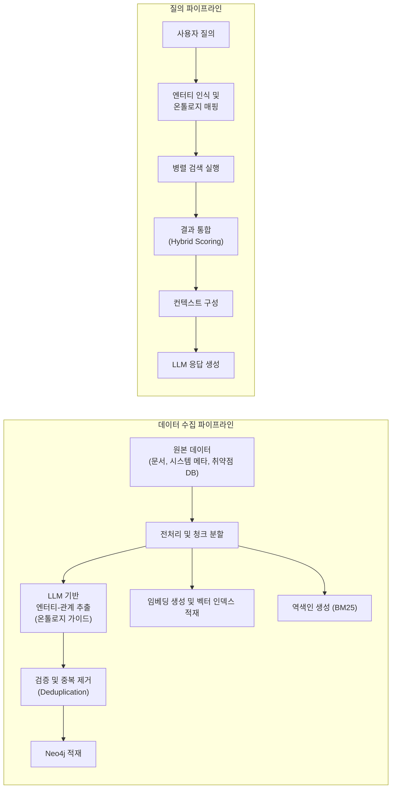
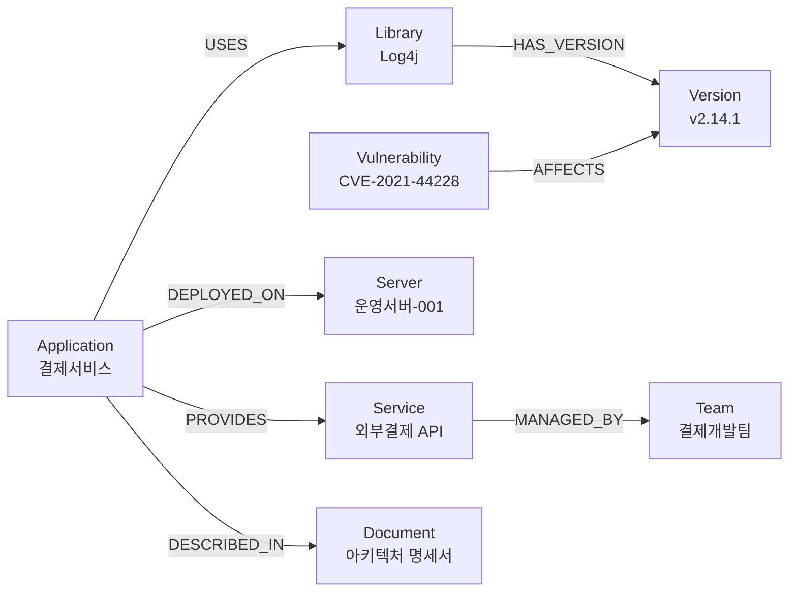
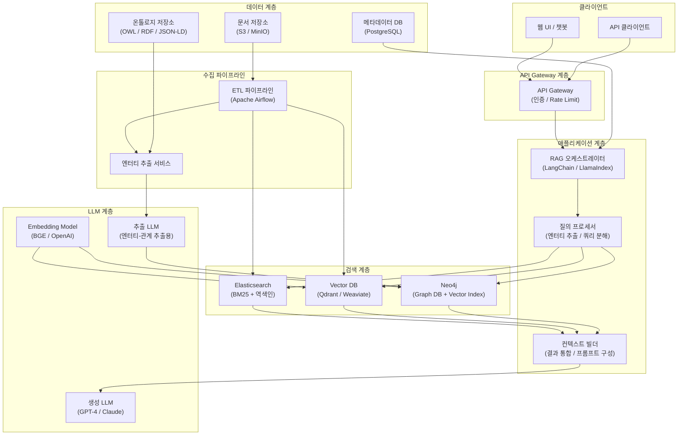
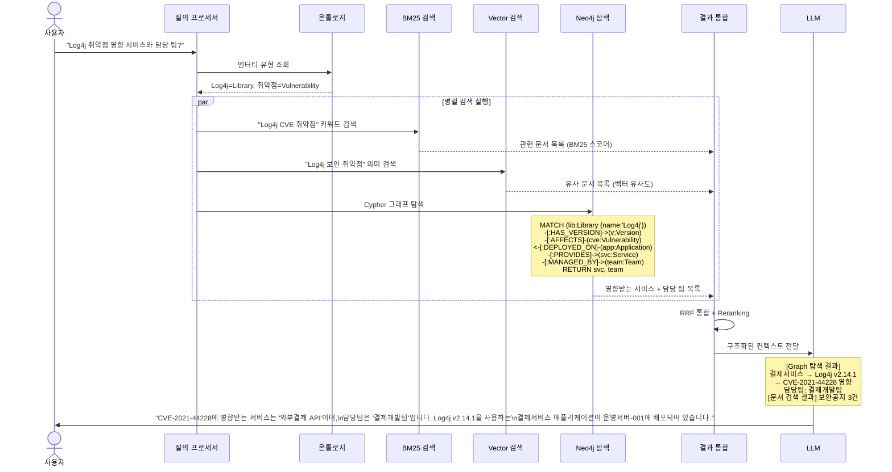
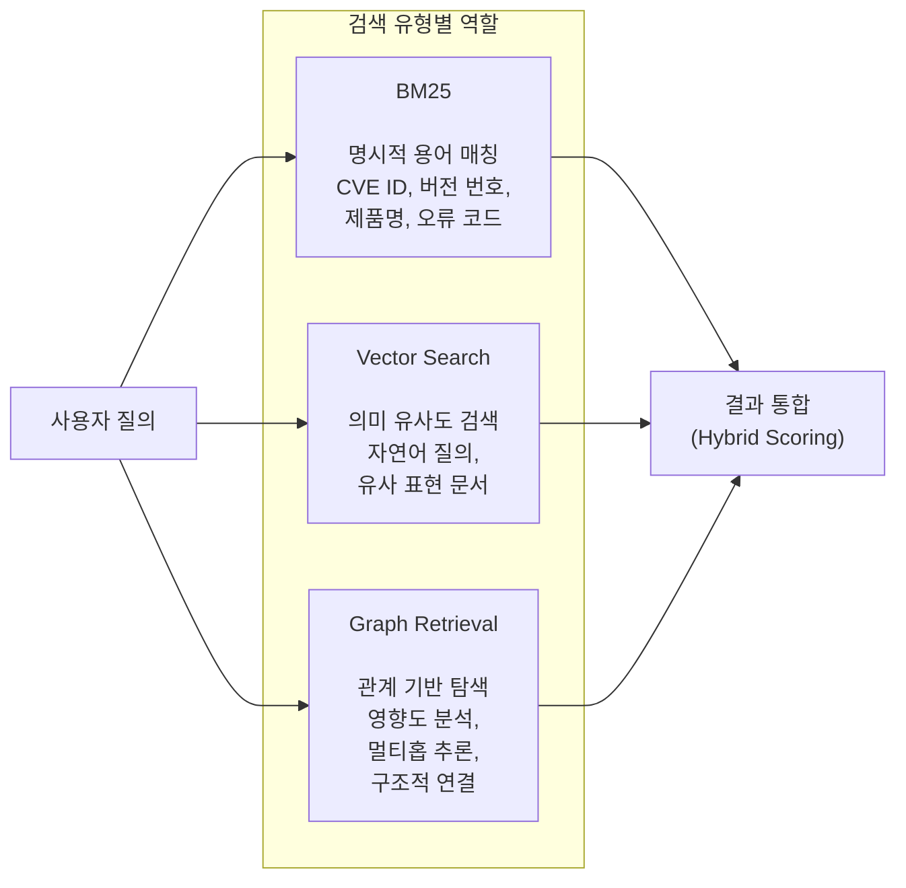
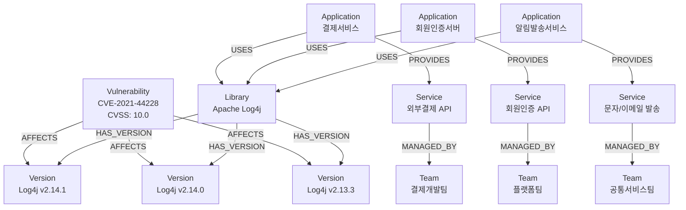
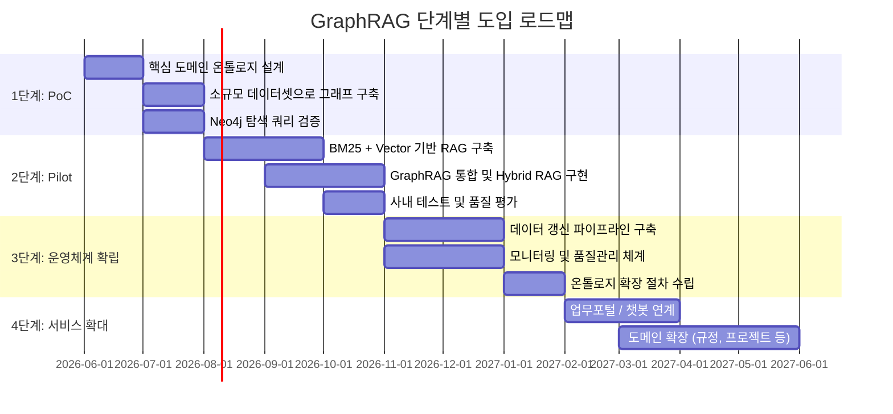

## BM25 / Vector Search와 Ontology 기반 지식 모델링의 결합

> **아키텍처팀 기술 세미나**  
> 작성일: 2026-05-11  
> 대상: 아키텍처팀 전체 (RAG 기술 사전 지식 불필요)

---

## 관련글

- **RAG 기술 아키텍처 세미나 - (1) Neo4j 기반 GraphRAG를 활용한 Hybrid RAG 시스템 구현**
- [**RAG 기술 아키텍처 세미나 - (2) Index-based GraphRAG 심화 이해**](https://k82022603.github.io/posts/rag-%EA%B8%B0%EC%88%A0-%EC%95%84%ED%82%A4%ED%85%8D%EC%B2%98-%EC%84%B8%EB%AF%B8%EB%82%98-(2)-index-based-graphrag-%EC%8B%AC%ED%99%94-%EC%9D%B4%ED%95%B4/)
- [**RAG 기술 아키텍처 세미나 - (3) Knowledge-based GraphRAG 심화 이해**](https://k82022603.github.io/posts/rag-%EA%B8%B0%EC%88%A0-%EC%95%84%ED%82%A4%ED%85%8D%EC%B2%98-%EC%84%B8%EB%AF%B8%EB%82%98-(3)-knowledge-based-graphrag-%EC%8B%AC%ED%99%94-%EC%9D%B4%ED%95%B4/)
- [**RAG 기술 아키텍처 세미나 - (4) Index-based GraphRAG 기반 Neo4j Hybrid RAG 시스템 구현**](https://k82022603.github.io/posts/rag-%EA%B8%B0%EC%88%A0-%EC%95%84%ED%82%A4%ED%85%8D%EC%B2%98-%EC%84%B8%EB%AF%B8%EB%82%98-(4)-index-based-graphrag-%EA%B8%B0%EB%B0%98-neo4j-hybrid-rag-%EC%8B%9C%EC%8A%A4%ED%85%9C-%EA%B5%AC%ED%98%84/)
- [**RAG 기술 아키텍처 세미나 - (5) 엔터프라이즈 Hybrid RAG 지식 플랫폼 구축 전략**](https://k82022603.github.io/posts/rag-%EA%B8%B0%EC%88%A0-%EC%95%84%ED%82%A4%ED%85%8D%EC%B2%98-%EC%84%B8%EB%AF%B8%EB%82%98-(5)-%EC%97%94%ED%84%B0%ED%94%84%EB%9D%BC%EC%9D%B4%EC%A6%88-hybrid-rag-%EC%A7%80%EC%8B%9D-%ED%94%8C%EB%9E%AB%ED%8F%BC-%EA%B5%AC%EC%B6%95-%EC%A0%84%EB%9E%B5/)
- [**RAG 기술 아키텍처 세미나 - (6) 온톨로지로 Knowledge Graph 설계하기**](https://k82022603.github.io/posts/rag-%EA%B8%B0%EC%88%A0-%EC%95%84%ED%82%A4%ED%85%8D%EC%B2%98-%EC%84%B8%EB%AF%B8%EB%82%98-(6)-%EC%98%A8%ED%86%A8%EB%A1%9C%EC%A7%80%EB%A1%9C-knowledge-graph-%EC%84%A4%EA%B3%84%ED%95%98%EA%B8%B0/)
- [**RAG 기술 아키텍처 세미나 - (7) GraphRAG와 Neo4j로 만드는 지능형 지식 검색**](https://k82022603.github.io/posts/rag-%EA%B8%B0%EC%88%A0-%EC%95%84%ED%82%A4%ED%85%8D%EC%B2%98-%EC%84%B8%EB%AF%B8%EB%82%98-(7)-graphrag%EC%99%80-neo4j%EB%A1%9C-%EB%A7%8C%EB%93%9C%EB%8A%94-%EC%A7%80%EB%8A%A5%ED%98%95-%EC%A7%80%EC%8B%9D-%EA%B2%80%EC%83%89/)

---

## 목차

1. [왜 지금 GraphRAG인가 — 문제 인식](#1-왜-지금-graphrag인가--문제-인식)
2. [검색 기술의 발전 계보 — BM25에서 Hybrid Search까지](#2-검색-기술의-발전-계보--bm25에서-hybrid-search까지)
3. [RAG란 무엇인가 — 기본 개념부터 한계까지](#3-rag란-무엇인가--기본-개념부터-한계까지)
4. [GraphRAG — 관계 기반 지식 탐색의 등장](#4-graphrag--관계-기반-지식-탐색의-등장)
5. [Ontology와 Knowledge Modeling — 그래프의 품질을 결정하는 기반](#5-ontology와-knowledge-modeling--그래프의-품질을-결정하는-기반)
6. [Neo4j 기반 Hybrid RAG 시스템 아키텍처](#6-neo4j-기반-hybrid-rag-시스템-아키텍처)
7. [질의 처리 흐름 — 단계별 동작 방식](#7-질의-처리-흐름--단계별-동작-방식)
8. [실제 활용 예시 — Log4j 취약점 영향도 분석](#8-실제-활용-예시--log4j-취약점-영향도-분석)
9. [기대 효과](#9-기대-효과)
10. [구현 시 고려사항과 리스크](#10-구현-시-고려사항과-리스크)
11. [단계별 도입 전략 — PoC부터 확산까지](#11-단계별-도입-전략--poc부터-확산까지)
12. [결론 — 검색에서 지식 탐색으로](#12-결론--검색에서-지식-탐색으로)

---

## 1. 왜 지금 GraphRAG인가 — 문제 인식

AI 기반 검색 시스템이 급격히 발전하면서, 기업 내부에서는 다음과 같은 질문들이 자주 등장하기 시작했습니다.

- **"이 라이브러리의 취약점이 발견됐는데, 우리 서비스 중 영향받는 시스템이 어디어디인가?"**
- **"특정 규정이 개정되면, 어떤 업무 절차와 담당 조직이 함께 바뀌어야 하는가?"**
- **"이번 장애와 유사한 과거 이슈에서는 어떤 시스템들이 연쇄적으로 영향을 받았는가?"**

이 질문들에는 공통점이 있습니다. 단순히 **"관련 문서를 찾아라"** 가 아니라, **"관계를 따라가며 추론하라"** 는 것입니다. 특정 라이브러리가 어떤 애플리케이션에 쓰이고, 그 애플리케이션이 어떤 서버에 배포되며, 그 서버가 어떤 서비스를 제공하는지를 연결해서 파악해야 하는 구조입니다.

기존의 키워드 검색이나 의미 유사도 검색은 이 연결 고리를 추적하는 데 구조적인 한계를 갖습니다. 문서 안에 정보가 흩어져 있거나, 관계가 암묵적으로만 존재하는 경우에는 검색 결과가 단편적으로 나올 수밖에 없습니다.

이 문제를 해결하기 위해 등장한 것이 **GraphRAG**입니다. GraphRAG는 지식그래프(Knowledge Graph)의 관계 탐색 능력과 LLM의 자연어 생성 능력을 결합하여, 문서 검색 수준을 넘어선 **관계 기반 지식 탐색**을 가능하게 합니다.

본 세미나에서는 GraphRAG를 중심으로, 기존 BM25와 Vector Search 기반 검색 시스템에 Neo4j 기반 GraphRAG를 추가하여 **Hybrid RAG 시스템**으로 확장하는 방향을 살펴봅니다. 또한 그 기반이 되는 **Ontology / Knowledge Modeling**의 역할과 중요성도 함께 설명합니다.

---

## 2. 검색 기술의 발전 계보 — BM25에서 Hybrid Search까지

GraphRAG를 이해하려면, 우선 기존 검색 기술이 어떻게 발전해 왔는지를 파악하는 것이 도움이 됩니다.

### 2.1 BM25 — 키워드 기반 정보 검색의 표준

BM25(Best Match 25)는 1994년에 제안된 확률론적 정보검색 알고리즘으로, 오늘날에도 Elasticsearch, Apache Lucene, OpenSearch 등 주요 검색 엔진의 기본 랭킹 알고리즘으로 널리 사용됩니다. 수십 년간의 검증을 거친 성숙한 기술입니다.

BM25의 핵심 원리는 **TF-IDF(Term Frequency-Inverse Document Frequency)** 를 발전시킨 것으로, 질의어가 문서 안에 얼마나 자주 등장하는지(TF)와 해당 단어가 전체 문서 집합에서 얼마나 희귀한지(IDF)를 결합하여 관련도를 점수화합니다. 여기에 문서 길이 정규화를 추가하여, 긴 문서가 단순히 많은 단어를 포함한다는 이유만으로 높은 점수를 받는 것을 방지합니다.

BM25의 **강점**은 명확합니다. 특정 제품명, 오류 코드, 라이브러리 버전, 규정 조항 번호처럼 정확한 키워드 매칭이 필요한 경우에 뛰어난 성능을 보입니다. 시스템이 예측 가능하게 동작하고, 왜 특정 문서가 검색됐는지를 설명하기 쉽습니다.

반면 **한계**도 분명합니다. 사용자가 "데이터베이스 연결 오류"라고 질의했을 때, 문서에 "DB 접속 실패"라고 적혀 있다면 검색에 걸리지 않을 수 있습니다. 표현이 달라지면 관련 문서가 누락되는 어휘 불일치(Vocabulary Mismatch) 문제가 발생합니다.

### 2.2 Vector Search — 의미 기반 검색의 등장

2018년 이후 BERT를 비롯한 Transformer 기반 언어 모델이 등장하면서, 텍스트를 고차원 벡터 공간에 표현하는 임베딩(Embedding) 기술이 급격히 발전했습니다. Vector Search는 이 임베딩을 활용하여 **의미적 유사성**을 기준으로 문서를 검색하는 방식입니다.

동작 원리는 다음과 같습니다. 문서와 질의를 각각 수백~수천 차원의 밀집 벡터(dense vector)로 변환한 다음, 코사인 유사도(Cosine Similarity)나 내적(Inner Product) 등을 이용하여 가장 가까운 벡터를 찾습니다. 이 과정에서 근사 최근접 이웃(ANN, Approximate Nearest Neighbor) 알고리즘을 사용하여 대규모 문서 집합에서도 빠르게 검색할 수 있습니다.

Vector Search의 **강점**은 표현의 다양성을 극복한다는 점입니다. "데이터베이스 연결 오류"와 "DB 접속 실패"는 의미적으로 유사하기 때문에 벡터 공간에서 가까운 위치에 배치되고, 따라서 한쪽으로 질의해도 다른 쪽 문서가 검색됩니다. 자연어로 자유롭게 표현된 질의에도 강합니다.

**한계**도 있습니다. 정확한 버전 번호, 특수 용어, 고유 코드처럼 의미보다 표면적 정확성이 중요한 경우에는 BM25보다 성능이 낮을 수 있습니다. 또한 왜 특정 문서가 검색됐는지를 사람이 직관적으로 이해하기 어렵고, 검색 결과의 관계 구조를 직접적으로 표현하지 못합니다.

### 2.3 Hybrid Search — 두 방식의 결합

BM25와 Vector Search는 서로의 약점을 보완하는 관계입니다. 이 두 가지를 결합한 것이 **Hybrid Search**입니다.

일반적인 결합 방식은 다음과 같습니다. BM25와 Vector Search를 각각 독립적으로 실행하여 결과를 생성한 다음, RRF(Reciprocal Rank Fusion)나 가중 합산(Weighted Sum) 방식으로 두 결과를 통합합니다. 여기에 **Reranker** 모델을 추가하면, 통합된 후보 목록을 더 정밀하게 재정렬할 수 있습니다.

Hybrid Search는 오늘날 Elasticsearch, OpenSearch, Weaviate, Qdrant 등 주요 검색 시스템에서 기본 기능으로 지원되며, 단일 검색 방식에 비해 전반적으로 더 높은 성능을 보입니다.

아래 표는 세 가지 검색 방식을 비교한 것입니다.

| 구분 | BM25 | Vector Search | Hybrid Search |
|---|---|---|---|
| 검색 기준 | 키워드 일치도 | 의미 유사도 | 키워드 + 의미 결합 |
| 강점 | 정확한 용어 매칭 | 표현 다양성 극복 | 두 방식의 장점 활용 |
| 약점 | 어휘 불일치 | 키워드 정확도 | 관계 추론 불가 |
| 관계 탐색 | 불가능 | 불가능 | 불가능 |
| 설명 가능성 | 높음 | 낮음 | 중간 |

이 표에서 중요한 사실을 발견할 수 있습니다. 세 가지 방식 모두 **"관계 탐색"** 항목에서 "불가능"입니다. 이것이 바로 GraphRAG가 필요한 이유입니다.

---

## 3. RAG란 무엇인가 — 기본 개념부터 한계까지

### 3.1 RAG의 기본 개념

RAG(Retrieval-Augmented Generation, 검색 증강 생성)는 2020년 Facebook AI Research(현 Meta AI)에서 제안한 구조로, LLM의 고질적인 문제인 **환각(Hallucination)**  을 줄이기 위해 설계되었습니다.

LLM만 단독으로 사용하면, 모델이 학습 시점 이후의 정보를 모르거나, 특정 도메인의 정확한 내부 정보가 없는 경우에 그럴듯하지만 틀린 답변을 생성하는 환각 현상이 발생합니다. RAG는 이 문제를 해결하기 위해, 질의가 들어오면 먼저 **외부 지식 베이스에서 관련 문서를 검색**하고, 그 검색 결과를 LLM의 입력(컨텍스트)으로 함께 제공하여 답변을 생성하게 합니다.

```
[기본 RAG 처리 흐름]

사용자 질의 → 문서 검색 → 관련 문서를 컨텍스트로 추가 → LLM 응답 생성
```

이 방식은 LLM이 자신의 학습 데이터만으로 답변하는 것이 아니라, 실제 존재하는 문서에 근거하여 답변하도록 유도하기 때문에 환각을 크게 줄일 수 있습니다. 또한 지식 베이스를 갱신하면 모델을 재학습하지 않고도 최신 정보를 반영할 수 있다는 장점도 있습니다.

### 3.2 기존 RAG의 구조적 한계

BM25 + Vector Search 기반의 RAG는 많은 업무에서 유용하지만, 다음과 같은 구조적 한계를 갖습니다.

**첫째, 멀티홉 질의(Multi-hop Query)에 약합니다.** 멀티홉 질의란, 답을 구하기 위해 여러 정보를 연결해서 추론해야 하는 질의입니다. 예를 들어 "Log4j 2.14 버전을 사용하는 서비스 중, 외부에 노출된 것은 어디인가?"라는 질의에 답하려면, 라이브러리 버전 정보 → 해당 라이브러리를 쓰는 애플리케이션 → 해당 애플리케이션의 배포 환경 → 외부 노출 여부를 순서대로 따라가야 합니다. 이 연결 고리가 단일 문서 안에 모두 담겨 있지 않으면, 문서 검색만으로는 완전한 답변을 생성하기 어렵습니다.

**둘째, 관계 구조가 암묵적입니다.** 문서 검색은 어떤 문서가 관련 있는지를 찾아줄 뿐, "A 시스템이 B 라이브러리를 사용한다"는 관계를 명시적으로 표현하지 않습니다. 이런 관계 정보는 문서 곳곳에 흩어져 있고, LLM이 이를 모두 수집하여 추론하는 것은 컨텍스트 길이 제한과 추론 정확도 측면에서 불안정합니다.

**셋째, 설명력이 부족합니다.** "관련 문서에 따르면"이라는 수준의 근거는 제시할 수 있지만, "A 시스템 → B 라이브러리 → C 취약점 → D 서비스 영향"처럼 관계를 명시적으로 포함한 설명을 생성하기 어렵습니다.

이 세 가지 한계를 해결하기 위해 등장한 것이 GraphRAG입니다.

---

## 4. GraphRAG — 관계 기반 지식 탐색의 등장

### 4.1 GraphRAG의 정의와 배경

GraphRAG는 2024년 Microsoft Research가 공식 논문(Edge et al., 2024)과 오픈소스로 제안한 이후, 급속도로 주목받고 있는 RAG 확장 패러다임입니다. 핵심 아이디어는 단순합니다. 문서를 그대로 검색하는 것이 아니라, **문서로부터 엔터티(Entity)와 관계(Relation)를 추출하여 지식그래프(Knowledge Graph)를 구성하고, 질의 시에는 이 그래프를 탐색하여 지식을 확장**한다는 것입니다.

Microsoft의 GraphRAG는 현재 오픈소스 라이브러리로 GitHub에 공개되어 있으며, Microsoft Discovery라는 Azure 기반 과학연구 플랫폼에 통합되어 있습니다. Neo4j에서도 `neo4j-graphrag-python`이라는 공식 Python 라이브러리를 제공하여 Neo4j 기반 GraphRAG 구현을 지원합니다.

### 4.2 지식그래프(Knowledge Graph)란 무엇인가

GraphRAG를 이해하려면 먼저 지식그래프의 개념을 알아야 합니다. 지식그래프는 현실 세계의 개체(Entity)들과 그 사이의 관계(Relation)를 그래프 형태로 표현한 구조입니다. 가장 기본적인 단위는 **주어-관계-목적어** 형태의 트리플(Triple)입니다.

예를 들면 이렇습니다.

```
(결제서비스 App) --[USES]--> (Log4j Library)
(Log4j Library) --[HAS_VERSION]--> (v2.14.1)
(v2.14.1) --[AFFECTS]--> (CVE-2021-44228 Vulnerability)
(결제서비스 App) --[DEPLOYED_ON]--> (운영서버-001)
(운영서버-001) --[HOSTS]--> (외부결제 Service)
```

이런 트리플들이 모여 그래프를 형성하면, "CVE-2021-44228에 영향받는 외부 서비스가 무엇인가?"라는 질의에 대해 그래프를 따라가며 탐색할 수 있게 됩니다.

### 4.3 GraphRAG가 기존 RAG와 다른 점

기존 RAG와 GraphRAG의 가장 큰 차이는 **검색 단위**와 **탐색 방식**입니다.

기존 RAG는 문서 청크(chunk)를 검색 단위로 사용하고, 유사도를 기준으로 검색합니다. GraphRAG는 엔터티와 관계를 검색 단위로 사용하고, 그래프 탐색을 통해 연결된 지식을 확장합니다.

```
[기존 RAG]
질의 → 유사 문서 검색 → 문서를 컨텍스트로 제공 → LLM 응답

[GraphRAG]
질의 → 엔터티 식별 → 그래프 탐색(관계 추적) → 관련 문서 보강 → 구조화된 컨텍스트 제공 → LLM 응답
```

GraphRAG의 핵심 가치는 세 가지입니다.

**관계 기반 검색**: 문서에 특정 단어가 있는지를 찾는 것이 아니라, 엔터티들 사이의 관계를 따라가며 지식을 탐색합니다.

**멀티홉 추론**: 하나의 노드에서 출발하여 여러 관계를 연속으로 따라가며 간접적으로 연결된 정보까지 도달할 수 있습니다.

**설명 가능한 응답**: LLM이 응답을 생성할 때, 어떤 관계를 통해 해당 결론에 도달했는지를 명시적으로 포함할 수 있습니다.

### 4.4 GraphRAG의 종류 — Knowledge-based vs Index-based

GraphRAG에는 크게 두 가지 계열이 있습니다.

**Knowledge-based GraphRAG**는 문서에서 세밀한 지식그래프를 추출하는 방식입니다. 엔터티 인식과 관계 추출을 통해 도메인 특화된 정보를 표현합니다. 정밀도가 높지만, 도메인 온톨로지를 사전에 설계해야 하고 그래프 구축 비용이 큽니다.

**Index-based GraphRAG**는 Microsoft의 원래 GraphRAG 방식으로, 문서들 사이의 유사성과 공통 주제를 기반으로 커뮤니티(Community)를 구성하고, 커뮤니티 요약을 인덱스로 활용합니다. 도메인 온톨로지 없이도 적용할 수 있지만, 세밀한 관계 표현에는 한계가 있습니다.

본 세미나에서 다루는 Neo4j 기반 구현은 **Knowledge-based GraphRAG** 계열로, 도메인 온톨로지를 기반으로 엔터티와 관계를 명시적으로 설계하고 구축하는 방식입니다.

---

## 5. Ontology와 Knowledge Modeling — 그래프의 품질을 결정하는 기반

### 5.1 온톨로지란 무엇인가

지식그래프에서 노드와 엣지를 무작위로 연결한다고 해서 유용한 시스템이 되는 것은 아닙니다. 무엇을 엔터티로 볼 것인지, 어떤 관계를 정의할 것인지, 그 관계가 어떤 방향을 가지는지, 같은 개념을 가리키는 다양한 표현들을 어떻게 정규화할 것인지를 체계적으로 정의해야 합니다. 이것이 **온톨로지(Ontology)** 의 역할입니다.

온톨로지는 그리스어로 "존재에 관한 학문"을 뜻하며, 정보공학에서는 **특정 도메인의 개념, 관계, 제약 조건을 형식적으로 표현한 명세**를 의미합니다.

흔히 혼동되는 유사 개념들과의 차이를 짚고 넘어가겠습니다.

- **분류 체계(Taxonomy)**: 개념들을 계층적으로 분류하는 구조입니다. IS-A 관계만을 표현합니다. 예: "MySQL은 데이터베이스다."
- **데이터 스키마(Schema)**: 데이터의 구조와 타입을 정의합니다. 주로 관계형 데이터베이스에서 사용합니다.
- **온톨로지**: 분류 체계를 포함하되, 훨씬 풍부한 관계 유형(사용한다, 배포된다, 영향받는다 등)과 속성, 제약 조건까지 표현합니다.

### 5.2 GraphRAG에서 온톨로지가 필요한 이유

GraphRAG에서 온톨로지가 없으면 어떤 문제가 생길까요?

**일관성 붕괴**: 어떤 문서에서는 "Log4j"로 추출되고, 다른 문서에서는 "Apache Log4j"로, 또 다른 문서에서는 "log4j-core"로 추출됩니다. 이것이 모두 별개의 노드로 등록되면, 그래프는 단절된 조각들의 집합이 됩니다.

**관계 의미 상실**: "A는 B와 관련 있다"는 모호한 관계보다, "A 애플리케이션은 B 라이브러리를 사용한다(USES)"는 명시적 관계가 훨씬 탐색에 유용합니다. 온톨로지 없이는 관계의 의미와 방향이 일관되게 유지되기 어렵습니다.

**탐색 기준 부재**: 질의에서 "Log4j"라는 단어가 나왔을 때, 이것이 Library 유형의 엔터티라는 사실을 알아야 그래프에서 올바른 노드를 찾아 탐색을 시작할 수 있습니다. 이 매핑 정보를 제공하는 것이 온톨로지입니다.

2024년부터 2025년에 걸쳐 LLM을 이용한 지식그래프 자동 구축 기술이 크게 성숙했습니다. LLM이 텍스트에서 엔터티와 관계를 자동으로 추출할 수 있게 되었지만, 온톨로지로 추출 대상과 관계 유형을 사전에 정의해주지 않으면 추출 품질이 낮고 일관성이 떨어집니다. 온톨로지는 LLM 기반 추출의 **가이드라인**으로 기능합니다.

### 5.3 IT 시스템 도메인 온톨로지 설계 예시

아키텍처팀 관점에서 IT 시스템 도메인의 온톨로지를 설계한다면 다음과 같은 구조를 고려할 수 있습니다.

**엔터티 유형 (Node Types)**

| 유형 | 설명 | 예시 |
|---|---|---|
| `Application` | 소프트웨어 애플리케이션 | 결제서비스, 인증서버 |
| `Library` | 외부 라이브러리 및 의존성 | Log4j, Spring Boot |
| `Vulnerability` | 보안 취약점 | CVE-2021-44228 |
| `Server` | 물리/가상 서버 또는 컨테이너 | 운영서버-001, Pod-payment |
| `Service` | 외부에 제공되는 서비스 | 외부결제 API, 회원인증 |
| `Team` | 운영 및 개발 담당 조직 | 플랫폼팀, 결제개발팀 |
| `Document` | 관련 문서 및 산출물 | 아키텍처 명세서, 운영매뉴얼 |
| `Version` | 소프트웨어 버전 | Log4j v2.14.1 |
| `Regulation` | 규정 및 정책 | 개인정보보호법 제17조 |

**관계 유형 (Relation Types)**

| 관계 | 방향 | 설명 |
|---|---|---|
| `USES` | Application → Library | 애플리케이션이 라이브러리를 사용함 |
| `HAS_VERSION` | Library → Version | 라이브러리의 특정 버전 |
| `AFFECTS` | Vulnerability → Version | 취약점이 해당 버전에 영향을 미침 |
| `DEPLOYED_ON` | Application → Server | 애플리케이션이 서버에 배포됨 |
| `PROVIDES` | Application → Service | 애플리케이션이 서비스를 제공함 |
| `MANAGED_BY` | Service → Team | 서비스를 팀이 관리함 |
| `DESCRIBED_IN` | Application → Document | 애플리케이션이 문서에 기술됨 |
| `DEPENDS_ON` | Application → Application | 서비스 간 의존성 |
| `GOVERNED_BY` | Service → Regulation | 서비스가 규정의 적용을 받음 |

**속성 예시 (Properties)**

| 엔터티 | 속성 |
|---|---|
| `Application` | name, version, status, owner_team |
| `Library` | name, language, license |
| `Version` | version_number, release_date, is_deprecated |
| `Vulnerability` | cve_id, severity, cvss_score, patch_available |
| `Server` | hostname, environment, region, os |

### 5.4 온톨로지 설계 시 핵심 원칙

**용어 정규화**: 동일한 개념을 가리키는 다양한 표현을 하나의 canonical form으로 통일합니다. "log4j", "Apache Log4j", "log4j2", "log4j-core"를 어느 수준까지 같은 엔터티로 처리할지를 명확히 정의합니다.

**관계의 방향성**: USES(Application → Library)와 USED_BY(Library → Application)처럼 방향을 명확히 해야 탐색 쿼리가 명확해집니다.

**계층 구조 표현**: IS_A 관계를 통해 "MySQL IS_A Database", "PostgreSQL IS_A Database"처럼 계층을 표현하면, "어떤 Database를 사용하는가?"라는 상위 개념 질의가 가능합니다.

**지속적 보완**: 초기 온톨로지는 완전할 수 없습니다. 새로운 도메인이 추가되거나 지식이 확장되면, 온톨로지도 함께 진화해야 합니다.

---

## 6. Neo4j 기반 Hybrid RAG 시스템 아키텍처

### 6.1 Neo4j를 선택하는 이유

Neo4j는 세계에서 가장 널리 사용되는 그래프 데이터베이스로, GraphRAG 구현에 여러 이유로 적합합니다.

**Cypher 질의 언어**: SQL과 유사하지만 그래프 패턴 매칭에 최적화된 Cypher는 관계 탐색 질의를 직관적으로 표현할 수 있습니다.

**네이티브 그래프 저장**: 노드와 관계를 인접 리스트 방식으로 저장하여, 그래프 탐색이 조인 연산 없이 포인터 추적만으로 이루어져 성능이 뛰어납니다.

**벡터 인덱스 내장**: Neo4j 5.x부터 벡터 인덱스를 기본 지원하여, 그래프 DB 하나로 벡터 검색과 그래프 탐색을 동시에 수행할 수 있습니다.

**공식 Python 라이브러리**: `neo4j-graphrag-python` 라이브러리를 통해 GraphRAG 파이프라인 구성을 표준화된 방식으로 구현할 수 있습니다.

**생태계**: LangChain, LlamaIndex 등 주요 LLM 오케스트레이션 프레임워크와의 통합이 잘 지원됩니다.

### 6.2 전체 시스템 아키텍처 — 논리 계층도

아래 다이어그램은 Neo4j 기반 Hybrid RAG 시스템의 전체 논리 계층을 나타냅니다.



### 6.3 데이터 흐름 아키텍처 — 수집에서 검색까지

시스템을 **수집 파이프라인(Ingestion Pipeline)** 과 **질의 파이프라인(Query Pipeline)** 으로 나누어 살펴봅니다.



### 6.4 Neo4j 그래프 데이터 모델

실제 Neo4j에 구성되는 그래프 데이터 모델을 나타낸 것입니다.



### 6.5 목표 시스템 구성도 — SW 아키텍처 관점

실제 배포 환경에서의 소프트웨어 컴포넌트 구성을 나타낸 것입니다.



---

## 7. 질의 처리 흐름 — 단계별 동작 방식

사용자가 "Log4j 취약점 영향 있는 서비스와 담당 팀을 알려줘"라고 질의했을 때, Hybrid RAG 시스템이 어떻게 동작하는지를 단계별로 살펴봅니다.

### 7.1 단계별 처리 흐름



### 7.2 Neo4j Cypher 질의 예시

실제 Neo4j에서 사용하는 Cypher 질의 예시입니다.

```cypher
// Log4j 취약점에 영향받는 서비스와 담당 팀 탐색 (멀티홉)
MATCH (lib:Library {name: 'Log4j'})
      -[:HAS_VERSION]->(ver:Version)
      <-[:AFFECTS]-(vuln:Vulnerability)
  , (app:Application)-[:USES]->(lib)
  , (app)-[:DEPLOYED_ON]->(server:Server)
  , (app)-[:PROVIDES]->(svc:Service)
  , (svc)-[:MANAGED_BY]->(team:Team)
WHERE ver.version_number IN ['2.14.1', '2.14.0', '2.13.3']
RETURN
  lib.name AS library,
  ver.version_number AS version,
  collect(DISTINCT vuln.cve_id) AS vulnerabilities,
  app.name AS application,
  server.hostname AS server,
  svc.name AS service,
  team.name AS responsible_team
ORDER BY svc.name
```

이 단일 쿼리는 라이브러리 → 버전 → 취약점 → 애플리케이션 → 서버 → 서비스 → 팀으로 이어지는 6단계 멀티홉 탐색을 수행합니다. 동일한 결과를 문서 검색만으로 얻으려면, 여러 문서를 검색하고 LLM이 이를 수작업으로 종합해야 하며, 정보가 문서에 흩어져 있지 않다면 아예 불가능합니다.

### 7.3 검색 유형별 역할 분담

세 가지 검색 방식은 서로 다른 역할을 분담합니다.



질의 유형에 따라 각 검색 방식의 가중치를 조정하는 것이 효과적입니다. 예를 들어, "Log4j 2.14.1 CVE"처럼 정확한 식별자가 포함된 질의는 BM25 가중치를 높이고, "로그 수집 관련 보안 이슈"처럼 자연어 중심의 질의는 Vector Search 가중치를 높이며, "어떤 시스템이 영향받는가?"처럼 관계 탐색이 필요한 질의는 Graph Retrieval 가중치를 높입니다.

---

## 8. 실제 활용 예시 — Log4j 취약점 영향도 분석

Log4j(Apache Log4j)는 Java 기반의 대표적인 로깅 라이브러리로, 2021년 12월에 CVE-2021-44228(Log4Shell)이라는 심각한 원격 코드 실행(RCE) 취약점이 발견되었습니다. CVSS 점수 10.0으로 최고 심각도로 분류된 이 취약점은, 사실상 Log4j를 사용하는 모든 Java 애플리케이션에 영향을 미쳤습니다.

이 상황에서 기업의 실제 질문은 다음과 같습니다. "우리 서비스 중 취약한 버전의 Log4j를 사용하는 시스템이 어디어디인가? 그리고 그 시스템들을 담당하는 팀은 어디인가?"

### 8.1 기존 RAG vs GraphRAG 비교

**기존 BM25 + Vector 검색의 경우:**

검색 시스템은 "Log4j 취약점"이라는 키워드와 관련된 문서들을 반환합니다. 보안 공지문, 패치 가이드, 기술 블로그 등이 검색될 것입니다. 그러나 "우리 시스템 중 어느 것이 영향받는가?"라는 질문에 답하려면, 각 시스템의 의존성 목록 문서를 별도로 찾아야 하고, 그 문서들이 체계적으로 관리되지 않는다면 불가능합니다.

**GraphRAG의 경우:**

온톨로지 기반으로 구축된 지식그래프가 있다면, 다음과 같은 탐색이 가능합니다.



이 그래프 탐색을 통해 다음과 같은 정확하고 근거 있는 응답이 가능합니다.

> "CVE-2021-44228에 영향받는 서비스는 외부결제 API(담당: 결제개발팀), 회원인증 API(담당: 플랫폼팀), 문자/이메일 발송(담당: 공통서비스팀)입니다. 세 서비스 모두 Log4j 취약 버전(v2.14.x 이하)을 사용하는 애플리케이션이 배포되어 있습니다."

### 8.2 영향도 분석의 확장

GraphRAG의 진가는 이것에 그치지 않습니다. 그래프를 추가로 탐색하면 다음 질문들도 자동으로 답할 수 있습니다.

- "영향받는 서비스 중 외부 사용자에게 직접 노출된 것은?" → Service 노드의 `exposure_type` 속성 필터링
- "해당 서버들은 어느 리전에 있는가?" → Server 노드의 `region` 속성 조회
- "패치 완료 여부는?" → Version 노드의 `is_patched` 속성 + 시간 기반 쿼리
- "의존하는 다른 서비스가 있는가?" → DEPENDS_ON 관계를 통한 상위 서비스 추적

이처럼 GraphRAG는 단일 질의에서 출발하여 관련 지식을 체계적으로 확장할 수 있습니다.

---

## 9. 기대 효과

Neo4j 기반 GraphRAG를 기존 BM25 / Vector 검색 시스템에 추가함으로써 기대할 수 있는 효과를 정리합니다.

### 9.1 검색 품질 향상

문서 검색 단계에서 발견하지 못했던 간접 연관 정보를 그래프 탐색을 통해 추가로 확보할 수 있습니다. BM25와 Vector Search가 서로의 약점을 보완하는 것처럼, GraphRAG는 이 두 방식으로 커버되지 않는 관계형 질의 영역을 담당합니다. 검색 누락(recall 저하)이 크게 줄어들 수 있습니다.

### 9.2 멀티홉 추론 능력 확보

가장 큰 변화입니다. "A와 B의 관계를 통해 C를 찾아라"는 형태의 질의, 즉 여러 단계의 추론이 필요한 복합 질의를 구조적으로 처리할 수 있게 됩니다. 이는 단순 문서 검색 기반 RAG로는 달성하기 매우 어려운 능력입니다.

### 9.3 응답의 설명력과 신뢰성 강화

LLM이 "관련 문서에 따르면"이 아니라, "A 시스템은 B 라이브러리를 사용하고, 해당 버전은 C 취약점의 영향을 받으므로"처럼 **관계 기반 근거**를 명시하며 응답할 수 있습니다. 이는 환각(Hallucination)을 줄이고 응답의 신뢰도를 높입니다. 2025년 연구에 따르면, 그래프 기반 RAG는 단순 RAG 대비 환각률을 90%까지 줄인 사례도 보고된 바 있습니다.

### 9.4 아키텍처팀 업무 특화 지원

아키텍처팀의 주요 업무인 시스템 영향도 분석, 의존성 파악, 변경 관리, 보안 취약점 대응은 모두 관계 기반 질의의 성격을 가집니다. GraphRAG는 이러한 업무에서 특히 큰 효과를 발휘합니다.

### 9.5 지식의 누적과 재활용

온톨로지 기반으로 구조화된 지식그래프는 특정 질의에만 사용되는 것이 아니라, 조직의 IT 자산 현황, 서비스 의존관계, 인력 구조, 규정 체계를 지속적으로 누적하는 **살아있는 지식 베이스**가 됩니다. 한 번 구축되면 다양한 용도로 재활용할 수 있습니다.

---

## 10. 구현 시 고려사항과 리스크

### 10.1 데이터 품질 — 가장 중요한 과제

GraphRAG의 핵심 원칙은 "**모델 성능보다 지식구조 품질이 더 큰 영향을 준다**"는 것입니다. 아무리 뛰어난 LLM과 Neo4j를 사용하더라도, 그래프 데이터 품질이 낮으면 탐색 결과도 부정확해집니다.

**엔터티 중복 문제**: LLM이 문서에서 "Log4j", "Apache Log4j", "log4j-core"를 각각 다른 노드로 추출하면, 탐색 쿼리가 의도대로 동작하지 않습니다. 추출 후 정규화(Canonicalization) 및 중복 제거(Deduplication) 단계가 필수입니다.

**관계 추출 정확도**: LLM 기반 추출이 항상 정확하지 않습니다. 특히 명시적으로 표현되지 않은 암묵적 관계의 경우, 추출 오류가 발생할 수 있습니다. 검증 프로세스와 사람의 검수가 필요합니다.

**최신성 유지**: 소프트웨어 버전이 업데이트되거나, 서비스가 신규 서버에 이전되거나, 담당 팀이 바뀌면 그래프도 함께 갱신되어야 합니다. 데이터 갱신 파이프라인과 주기 관리 정책이 필요합니다.

### 10.2 온톨로지 설계의 어려움

온톨로지 설계는 생각보다 어렵습니다. 처음부터 완벽한 온톨로지를 설계하려고 하면 프로젝트가 지연됩니다. 핵심 도메인에 대한 최소한의 온톨로지로 시작하고, 점진적으로 확장하는 전략이 현실적입니다.

온톨로지가 너무 세밀하면 구축 비용이 크고, 너무 단순하면 탐색 효과가 제한됩니다. 실무에서 자주 등장하는 질의 유형을 분석하여 그에 맞는 엔터티와 관계를 우선적으로 정의하는 것이 좋습니다.

### 10.3 운영 복잡도 증가

기존 BM25 + Vector 검색에 GraphRAG를 추가하면 관리해야 할 시스템이 늘어납니다.

```
기존: 검색 엔진 + 벡터 DB + LLM
추가: Neo4j + 엔터티 추출 파이프라인 + 온톨로지 관리 시스템 + 그래프 갱신 스케줄러
```

각 컴포넌트의 운영 부담을 사전에 파악하고, 모니터링 및 장애 대응 체계를 함께 설계해야 합니다.

### 10.4 성능 고려사항

그래프 탐색은 경우에 따라 시간이 오래 걸릴 수 있습니다. 특히 노드 수가 많고 관계가 복잡한 경우, 탐색 범위를 제한하지 않으면 쿼리 성능이 저하됩니다. Neo4j의 인덱스 전략, 탐색 깊이(hop 수) 제한, 결과 캐싱 등을 통해 성능을 관리해야 합니다.

### 10.5 리스크 요약

| 리스크 | 영향도 | 대응 방향 |
|---|---|---|
| 엔터티 중복 및 오추출 | 높음 | 추출 후 검증 + 정규화 파이프라인 구축 |
| 온톨로지 설계 오류 | 높음 | 파일럿 도메인으로 소규모 시작 + 점진 확장 |
| 그래프 데이터 최신성 | 중간 | 자동화된 갱신 파이프라인 + 갱신 주기 정책 |
| 운영 복잡도 증가 | 중간 | DevOps 자동화 + 모니터링 대시보드 |
| 쿼리 성능 저하 | 중간 | 인덱스 최적화 + 탐색 깊이 제한 |

---

## 11. 단계별 도입 전략 — PoC부터 확산까지

한 번에 전체 시스템을 구축하려는 것은 현실적이지 않습니다. 작게 시작하여 가치를 검증한 후 단계적으로 확장하는 전략이 안전합니다.



### 각 단계별 목표

**1단계 — PoC (개념 검증)**: 가장 자주 등장하는 질의 유형(예: 취약점 영향도 분석)을 선정하여, 소규모 데이터로 GraphRAG가 실제로 효과가 있는지를 검증합니다. 이 단계의 성공 기준은 "기존 검색보다 더 정확하고 완전한 답변을 그래프 탐색으로 생성할 수 있는가?"입니다.

**2단계 — Pilot**: BM25, Vector Search, Graph Retrieval을 통합한 완전한 Hybrid RAG 파이프라인을 구축합니다. 실제 사용자를 대상으로 제한적 서비스를 제공하고 품질을 측정합니다.

**3단계 — 운영체계 확립**: 데이터 갱신 자동화, 그래프 품질 모니터링, 온톨로지 변경 관리 절차 등 장기 운영을 위한 체계를 갖춥니다.

**4단계 — 서비스 확대**: 검증된 Hybrid RAG를 업무포털, 챗봇, 분석 도구 등 다양한 채널에 연계하고, 커버하는 도메인을 점진적으로 확장합니다.

---

## 12. 결론 — 검색에서 지식 탐색으로

BM25와 Vector Search는 지금도 그리고 앞으로도 RAG 시스템의 핵심 검색 축입니다. 키워드 정확도와 의미 유사도라는 각자의 강점을 바탕으로, 대부분의 문서 검색 시나리오를 효과적으로 커버합니다.

그러나 아키텍처팀이 일상적으로 마주하는 질문들 — 시스템 영향도, 의존성 분석, 변경 관리, 규정 준수 — 은 문서를 찾는 것을 넘어 **관계를 추적하고 구조를 이해**해야 합니다. 이 영역에서 GraphRAG는 기존 검색이 구조적으로 답하지 못하는 공백을 채웁니다.

특히 Neo4j 기반 GraphRAG는 다음 세 가지가 맞물릴 때 가장 큰 효과를 발휘합니다.

1. **BM25 + Vector Search**: 명시적 키워드 검색과 의미 기반 문서 검색이라는 탄탄한 기반
2. **GraphRAG (Neo4j)**: 관계 탐색과 멀티홉 추론으로 연결 고리를 따라가는 능력
3. **Ontology / Knowledge Modeling**: 두 계층을 연결하는 의미 기준, 그래프의 품질과 일관성 보장

이 세 축의 결합이 본 세미나에서 제안하는 **Hybrid RAG 시스템**의 본질입니다. 기존 검색을 버리는 것이 아니라, 그 위에 관계 기반 지식 탐색 계층을 얹어 시스템의 지능을 한 단계 높이는 것입니다.

단순 검색 시스템에서 **지식 탐색 시스템**으로의 전환. 이것이 GraphRAG가 제시하는 방향입니다.

---

## 참고 자료

- Edge, D., et al. (2024). "From Local to Global: A Graph RAG Approach to Query-Focused Summarization." Microsoft Research.
- Neo4j Official Documentation: `neo4j-graphrag-python` User Guide (2025)
- Qdrant + Neo4j GraphRAG Tutorial. Qdrant Official Documentation (2025)
- Zhang & Soh (2024). "EDC: Extract–Define–Canonicalize Framework for Knowledge Graph Construction."
- UniAI-GraphRAG (2025). "Ontology-Guided Extraction, Multi-Dimensional Clustering, and Dual-Channel Fusion for Robust Multi-Hop Reasoning."
- Neo4j NODES 2025 Conference: "Hands-On Hybrid Retrieval & RAG with Neo4j"
- Kloia (2026). "Knowledge Base vs Knowledge Graph for LLM Systems"

---

*작성일: 2026-05-11*  
*작성자: 아키텍처팀*
