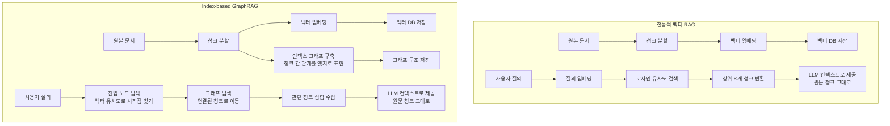
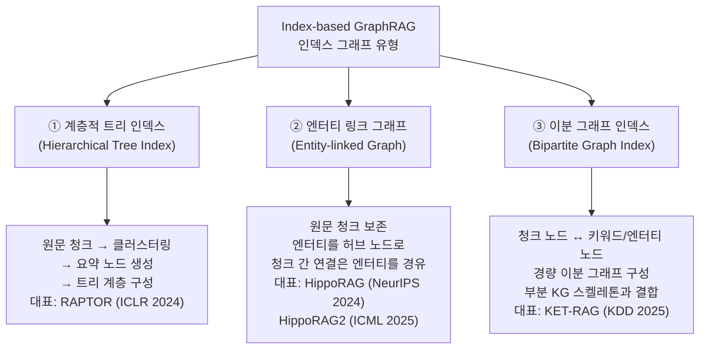
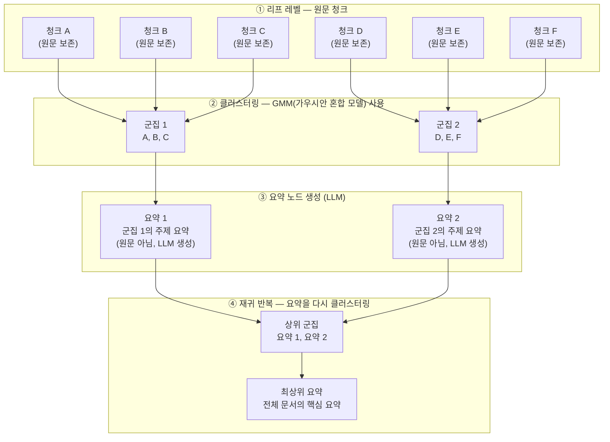
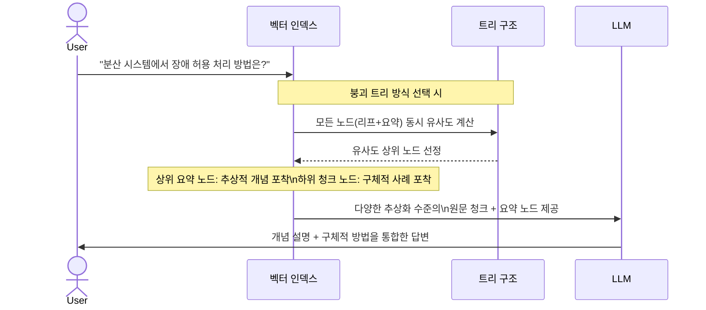
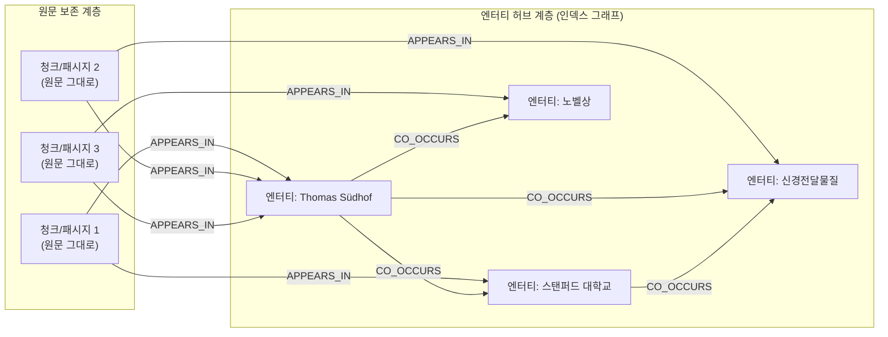
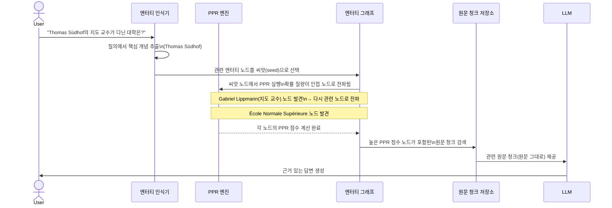
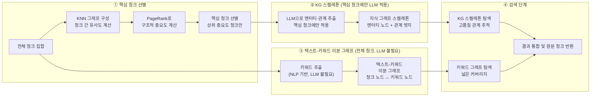
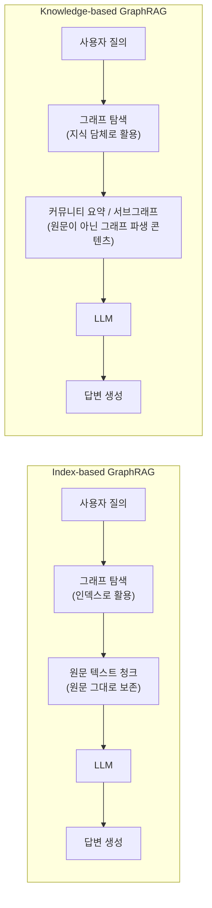
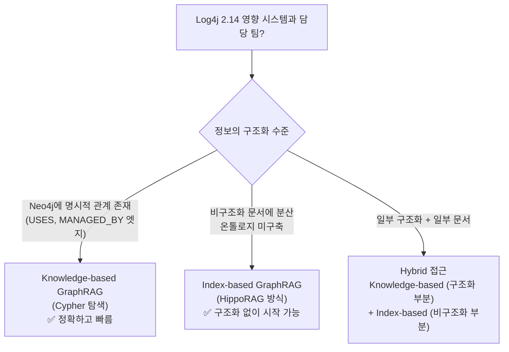

## 원문 청크를 보존하면서 그래프 구조로 검색을 안내하는 접근법

> **아키텍처팀 기술 세미나 — 보조 자료**  
> 원본 문서: Neo4j 기반 GraphRAG를 활용한 Hybrid RAG 시스템 구현  
> 작성일: 2026-05-15  


## 참고문서

[**Knowledge-based GraphRAG vs. Index-based GraphRAG**](https://k82022603.github.io/posts/knowledge-based-graphrag-vs.-index-based-graphrag/)

---

## 관련글

- [**RAG 기술 아키텍처 세미나 - (1) Neo4j 기반 GraphRAG를 활용한 Hybrid RAG 시스템 구현**](https://k82022603.github.io/posts/rag-기술-아키텍처-세미나-(1)-neo4j-기반-graphrag를-활용한-hybrid-rag-시스템-구현/)
- **RAG 기술 아키텍처 세미나 - (2) Index-based GraphRAG 심화 이해**
- [**RAG 기술 아키텍처 세미나 - (3) Knowledge-based GraphRAG 심화 이해**](https://k82022603.github.io/posts/rag-기술-아키텍처-세미나-(3)-knowledge-based-graphrag-심화-이해/)
- [**RAG 기술 아키텍처 세미나 - (4) Index-based GraphRAG 기반 Neo4j Hybrid RAG 시스템 구현**](https://k82022603.github.io/posts/rag-기술-아키텍처-세미나-(4)-index-based-graphrag-기반-neo4j-hybrid-rag-시스템-구현/)
- [**RAG 기술 아키텍처 세미나 - (5) 엔터프라이즈 Hybrid RAG 지식 플랫폼 구축 전략**](https://k82022603.github.io/posts/rag-기술-아키텍처-세미나-(5)-엔터프라이즈-hybrid-rag-지식-플랫폼-구축-전략/)
- [**RAG 기술 아키텍처 세미나 - (6) 온톨로지로 Knowledge Graph 설계하기**](https://k82022603.github.io/posts/rag-기술-아키텍처-세미나-(6)-온톨로지로-knowledge-graph-설계하기/)
- [**RAG 기술 아키텍처 세미나 - (7) GraphRAG와 Neo4j로 만드는 지능형 지식 검색**](https://k82022603.github.io/posts/rag-기술-아키텍처-세미나-(7)-graphrag와-neo4j로-만드는-지능형-지식-검색/)

---

## 목차

1. [Index-based GraphRAG란 무엇인가 — 정확한 정의부터](#1-index-based-graphrag란-무엇인가--정확한-정의부터)
2. [탄생 배경 — 청크 단위 검색의 구조적 한계](#2-탄생-배경--청크-단위-검색의-구조적-한계)
3. [핵심 철학 — 원문을 보존하고 그래프는 안내만 한다](#3-핵심-철학--원문을-보존하고-그래프는-안내만-한다)
4. [인덱스 그래프의 세 가지 유형](#4-인덱스-그래프의-세-가지-유형)
5. [대표 구현체 1: RAPTOR — 계층적 트리 인덱스 (ICLR 2024)](#5-대표-구현체-1-raptor--계층적-트리-인덱스-iclr-2024)
6. [대표 구현체 2: HippoRAG / HippoRAG2 — 엔터티 링크 그래프 (NeurIPS 2024 / ICML 2025)](#6-대표-구현체-2-hipporag--hipporag2--엔터티-링크-그래프-neurips-2024--icml-2025)
7. [대표 구현체 3: KET-RAG — 비용 효율적 다중 세밀도 인덱싱 (KDD 2025)](#7-대표-구현체-3-ket-rag--비용-효율적-다중-세밀도-인덱싱-kdd-2025)
8. [Knowledge-based와의 결정적 차이 — 그리고 Microsoft GraphRAG의 올바른 분류](#8-knowledge-based와의-결정적-차이--그리고-microsoft-graphrag의-올바른-분류)
9. [구현체별 성능 및 비용 비교](#9-구현체별-성능-및-비용-비교)
10. [Neo4j로 Index-based GraphRAG를 구축할 수 있는가](#10-neo4j로-index-based-graphrag를-구축할-수-있는가)
11. [실제 적용 시나리오 — 아키텍처팀 관점](#11-실제-적용-시나리오--아키텍처팀-관점)
12. [한계와 고려사항](#12-한계와-고려사항)
13. [결론 — 도구의 올바른 선택](#13-결론--도구의-올바른-선택)

---

## 1. Index-based GraphRAG란 무엇인가 — 정확한 정의부터

GraphRAG 방법론의 학술적 분류 체계를 제시한 서베이 논문(Zhang et al., arXiv:2501.13958, 홍콩폴리텍대학교·지린대학교, 2025년 1월)은 Index-based GraphRAG를 다음과 같이 정의합니다.

> *"Index-based GraphRAG methods utilize graph structures to index and retrieve relevant raw text chunks, which are then fed into LLMs for knowledge injection and contextual comprehension."*

이 정의에서 핵심은 두 가지입니다. 첫째, **원문 텍스트 청크(raw text chunks)가 보존**됩니다. 둘째, **그래프는 이 청크들을 인덱싱하고 탐색하는 도구**로만 기능하며, LLM에게 최종적으로 제공되는 컨텍스트는 그래프 자체가 아니라 원문 청크입니다.

같은 논문은 Knowledge-based GraphRAG와의 차이를 다음과 같이 명확히 합니다.

> *"While Knowledge-based GraphRAG emphasizes the explicit modeling of domain knowledge and semantic relationships through graph transformation, Index-based GraphRAG prioritizes efficient information retrieval and global navigation through the graph-based organization of the raw text."*

쉽게 말하면 이렇습니다. Knowledge-based GraphRAG는 원문을 지식 그래프로 **변환**하여 그래프 자체가 지식의 표현이 됩니다. 반면 Index-based GraphRAG는 원문을 변환하지 않고 **그대로 보존**하되, 원문들 사이의 관계를 그래프로 표현하여 검색 효율을 높입니다. 서점에 비유하면, Knowledge-based는 모든 책의 내용을 요약해서 새로운 책을 만들어 두는 것이고, Index-based는 책 그대로 두면서 목록 카드(인덱스)만 정교하게 만드는 것입니다.

이 문서는 이 정의에 정확히 부합하는 대표적인 구현체들, 즉 **RAPTOR**, **HippoRAG/HippoRAG2**, **KET-RAG**를 중심으로 Index-based GraphRAG를 설명합니다.

---

## 2. 탄생 배경 — 청크 단위 검색의 구조적 한계

Index-based GraphRAG가 등장한 배경을 이해하려면 먼저 기존 청크 기반 검색이 어떤 한계를 가지는지 살펴봐야 합니다.

### 2.1 인접 청크 의존의 문제

전통적인 RAG는 문서를 일정 크기의 청크로 잘라서 저장하고, 질의와 유사한 청크를 벡터 검색으로 찾아 LLM에 제공합니다. 이 방식에서 청크는 대부분 문서 내에서 인접한 텍스트를 묶어 만들어집니다. 그 결과 같은 문서 안에서 연속된 내용은 잘 연결되지만, **문서를 넘나드는 정보의 연결은 포착하지 못합니다**.

예를 들어 수백 건의 장애 보고서가 있을 때, "2022년에 발생한 네트워크 타임아웃 장애"와 "2024년에 발생한 API 응답 지연 장애"가 사실 같은 근본 원인에서 비롯되었더라도, 두 보고서가 서로 다른 문서에 있으면 청크 기반 검색은 이 연결 고리를 인식하지 못합니다.

Min et al.(2019)은 이미 텍스트 청크를 공출현(co-occurrence) 관계 기반의 그래프로 연결하면 질의응답 성능이 향상된다는 것을 보였습니다. 이 연구는 Index-based GraphRAG의 선구적 아이디어를 제시한 초기 연구로 평가받습니다.

### 2.2 단일 청크의 맥락 부족 문제

긴 문서를 다룰 때 단일 청크는 종종 필요한 맥락을 모두 담지 못합니다. 기술 매뉴얼의 특정 절차를 담은 청크가 있더라도, 그 절차를 이해하려면 앞쪽 챕터의 개요나 뒤쪽 챕터의 예시가 함께 있어야 완전한 답변이 가능한 경우가 많습니다.

고정 크기로 잘린 청크는 의미적 경계를 무시하므로, 중요한 문장이 두 청크 사이에서 잘리는 경우도 발생합니다. 이 문제를 해결하기 위해서는 청크의 계층적 구조나 문서 내 의미 단위를 존중하는 인덱싱이 필요합니다.

### 2.3 다중 홉 추론의 어려움

"Thomas Südhof 교수의 박사 지도 교수가 다닌 대학은 어디인가?"와 같은 다중 홉 질의에서 벡터 유사도 검색은 구조적으로 취약합니다. 이 질의에 답하려면 (1) Thomas Südhof의 지도 교수가 누구인지 찾고, (2) 그 교수가 어떤 대학을 다녔는지를 순서대로 추적해야 합니다. 벡터 검색은 질의 전체와 유사한 문서를 찾을 뿐, 이 연쇄 추론 경로를 따라가는 메커니즘이 없습니다.

Index-based GraphRAG는 청크 간의 관계를 그래프로 표현하여, 질의와 관련된 초기 청크에서 출발해 연결된 청크로 탐색을 확장하는 방식으로 이 문제에 대응합니다.

---

## 3. 핵심 철학 — 원문을 보존하고 그래프는 안내만 한다

Index-based GraphRAG의 설계 철학을 한 문장으로 요약하면 다음과 같습니다.

> "원문 텍스트의 정보 손실 없이, 그래프 구조를 활용해 더 정확하고 풍부한 청크 집합을 검색한다."

이 철학이 구체적으로 어떻게 구현되는지를 전통적인 벡터 RAG와 비교해 살펴봅니다.



두 방식의 차이는 **검색 단계**에 있습니다. 전통적 벡터 RAG는 질의와 각 청크의 유사도를 독립적으로 계산하여 상위 K개를 선택합니다. Index-based GraphRAG는 벡터 유사도로 초기 진입 노드를 찾은 뒤, 그래프를 따라 탐색을 확장하여 직접적으로 유사하지는 않더라도 **관계적으로 연결된** 청크까지 수집합니다. 그러나 LLM에 최종적으로 제공하는 것은 두 방식 모두 **원문 텍스트 청크**입니다.

이 점이 Knowledge-based GraphRAG와 가장 근본적인 차이입니다. Knowledge-based GraphRAG에서 LLM은 원문이 아니라 그래프에서 추출된 커뮤니티 요약이나 서브그래프를 받습니다.

---

## 4. 인덱스 그래프의 세 가지 유형

Index-based GraphRAG에서 청크들을 연결하는 그래프를 어떻게 구성하느냐에 따라 구현 방식이 크게 달라집니다. 현재까지 등장한 구현 방식은 크게 세 가지 유형으로 나뉩니다.



각 유형은 어떤 관계를 그래프의 엣지로 표현하느냐가 다릅니다. 계층적 트리 인덱스는 요약 관계를, 엔터티 링크 그래프는 개체의 공출현 관계를, 이분 그래프 인덱스는 청크와 키워드 간의 포함 관계를 엣지로 사용합니다.

---

## 5. 대표 구현체 1: RAPTOR — 계층적 트리 인덱스 (ICLR 2024)

### 5.1 개요와 탄생 배경

RAPTOR(Recursive Abstractive Processing for Tree-Organized Retrieval)는 스탠퍼드 대학교 연구팀(Sarthi et al.)이 2024년 ICLR에서 발표한 Index-based GraphRAG 구현체입니다. 논문의 문제 인식은 명확합니다. 기존 RAG 방식이 짧고 연속적인 청크에서만 검색하기 때문에, 긴 문서의 전반적인 맥락을 파악하는 데 구조적 한계가 있다는 것입니다.

RAPTOR의 핵심 아이디어는 텍스트 청크를 재귀적으로 클러스터링하고 요약하여 **계층적 트리 구조**를 만드는 것입니다. 리프 노드(leaf node)는 원문 청크이고, 상위 노드들은 LLM이 생성한 요약입니다. 이 구조는 질의의 성격에 따라 다양한 추상화 수준에서 정보를 검색할 수 있게 합니다.

### 5.2 인덱싱 파이프라인

RAPTOR의 인덱싱은 다음과 같이 진행됩니다.



리프 노드에서 시작하여 클러스터링과 요약을 반복하면서 트리가 아래에서 위로 쌓입니다. RAPTOR는 클러스터링 알고리즘으로 **가우시안 혼합 모델(Gaussian Mixture Models, GMM)** 을 사용하는데, 이를 통해 각 텍스트 청크가 여러 클러스터에 동시에 속할 수 있는 소프트 클러스터링(soft clustering)이 가능합니다. 하나의 청크가 여러 주제와 관련될 수 있는 현실을 반영한 선택입니다.

또한 차원 축소 단계에서는 UMAP(Uniform Manifold Approximation and Projection)을 사용하여 고차원 임베딩을 저차원으로 압축한 뒤 클러스터링합니다. 이는 고차원 공간에서 클러스터링이 효과적이지 않은 차원의 저주(curse of dimensionality) 문제를 완화합니다.

### 5.3 질의 시 검색 방식

RAPTOR는 두 가지 검색 전략을 제공합니다.

**트리 탐색(Tree Traversal)** 방식은 루트 노드부터 시작하여 각 레벨에서 질의와 가장 유사한 자식 노드를 선택하며 아래로 내려가는 방식입니다. 검색 범위가 집중되어 효율적이지만, 초기 레벨에서 잘못된 방향을 선택하면 관련 청크를 놓칠 수 있습니다.

**붕괴 트리(Collapsed Tree)** 방식은 트리의 모든 노드를 동일한 수준에서 펼쳐놓고, 질의와의 유사도를 한꺼번에 계산하여 상위 노드를 선택합니다. 계산 비용이 높지만 더 강건하며, RAPTOR 논문에서 더 좋은 성능을 보인다고 보고된 방식입니다.



검색 결과로 LLM에 제공하는 것은 선택된 노드의 **텍스트 내용**입니다. 리프 노드라면 원문 청크가, 요약 노드라면 LLM이 생성한 요약문이 컨텍스트로 들어갑니다. 즉, 그래프(트리)는 어떤 텍스트를 가져올지 안내하는 역할을 합니다.

### 5.4 성능 검증

RAPTOR 논문은 NarrativeQA, QASPER, QuALITY 등 질의응답 벤치마크에서 기존 청크 기반 방식 대비 일관된 성능 향상을 보고합니다. 특히 GPT-4와 결합했을 때 QuALITY 벤치마크에서 당시 최고 성능 대비 20% 향상을 달성했습니다(Sarthi et al., ICLR 2024). GraphRAG-Bench(2025)에서는 RAPTOR가 계층적 구조가 자연스럽게 존재하는 교과서 형태의 데이터셋에서 특히 강한 성능을 보인다고 보고하고 있습니다.

---

## 6. 대표 구현체 2: HippoRAG / HippoRAG2 — 엔터티 링크 그래프 (NeurIPS 2024 / ICML 2025)

### 6.1 신경생물학적 영감 — 해마 인덱싱 이론

HippoRAG(Gutiérrez et al.)는 오하이오 주립대학교 연구팀이 2024년 NeurIPS에서 발표한 독창적인 Index-based GraphRAG입니다. 이 연구의 출발점은 인간의 장기 기억 메커니즘, 특히 **해마(hippocampus)의 역할**에 대한 신경과학적 이해입니다.

Teyler와 Discenna가 제안한 해마 인덱싱 이론(hippocampal indexing theory)에 따르면, 인간의 기억 시스템은 두 부분으로 구성됩니다. 신피질(neocortex)은 실제 기억 표현을 처리하고 저장하며, 해마는 이 기억 단위들을 가리키는 **연결된 인덱스(hippocampal index)** 를 유지합니다. 기억을 떠올릴 때는 해마의 인덱스를 통해 신피질의 기억들이 연결되고 통합됩니다.

HippoRAG는 이 구조를 RAG에 적용합니다. LLM이 신피질(실제 지식 처리)을 담당하고, 지식 그래프로 구성된 엔터티 링크 인덱스가 해마(기억 인덱스)를 담당합니다.

### 6.2 HippoRAG의 인덱싱 구조



핵심을 정리하면, 청크(패시지)는 원문 그대로 보존됩니다. 엔터티 노드는 청크에서 추출되지만, 이 엔터티들은 어떤 청크에 등장하는지를 연결하는 **인덱스 역할**을 합니다. 엔터티 간에는 같은 청크에 공출현하면 엣지가 형성됩니다.

**HippoRAG의 인덱싱 단계는 세 단계**로 이루어집니다.

첫째, **오픈 정보 추출(OpenIE)** 단계입니다. LLM을 활용하여 각 청크에서 `(주어, 관계, 목적어)` 형태의 트리플을 추출합니다. 예를 들어 "Thomas Südhof는 스탠퍼드 대학교의 교수이다"에서 `(Thomas Südhof, 교수, 스탠퍼드 대학교)` 트리플이 추출됩니다. 이 트리플의 주어와 목적어가 엔터티 노드가 됩니다.

둘째, **동의어 탐지 및 엔터티 통합** 단계입니다. 같은 실세계 개체를 가리키는 다양한 표현들(예: "Südhof 교수", "Thomas Südhof", "T. Südhof")을 ANN(근사 최근접 이웃) 인덱스를 통한 임베딩 유사도로 탐지하고 통합합니다.

셋째, **그래프 엣지 추가** 단계입니다. 청크-엔터티 간 관계, 청크-청크 간 관계, 엔터티-엔터티 간 관계를 그래프에 추가합니다. 이렇게 완성된 그래프가 HippoRAG의 해마 인덱스입니다.

### 6.3 PPR(Personalized PageRank) 기반 검색

HippoRAG의 검색에서 핵심 알고리즘은 **Personalized PageRank(PPR)** 입니다. PPR은 일반 PageRank의 변형으로, 특정 시작 노드 집합에 더 높은 확률 가중치를 부여하여 해당 노드 주변의 중요도를 계산합니다.



PPR의 핵심은 확률 질량이 그래프를 따라 **흘러가는** 방식입니다. 씨앗 노드에서 출발한 확률이 인접 노드로 전파되고, 다시 그 인접 노드에서 더 멀리 있는 노드로 전파됩니다. 이 과정을 반복하면 씨앗과 멀리 있더라도 **많은 경로로 연결된** 노드는 높은 점수를 받습니다. 이것이 다중 홉 추론을 한 번의 검색으로 처리할 수 있는 원리입니다.

### 6.4 HippoRAG2의 개선점 (ICML 2025)

HippoRAG2(Gutiérrez et al., arXiv:2502.14802, ICML 2025)는 기존 HippoRAG의 두 가지 한계를 개선했습니다.

첫째, **패시지 노드 추가**입니다. 기존 HippoRAG는 구문(phrase) 노드만 그래프에 있었지만, HippoRAG2는 청크/패시지 노드도 그래프에 포함합니다. 이를 통해 엔터티 수준의 검색과 패시지 수준의 검색을 하나의 그래프에서 통합합니다. 10,000개 패시지 코퍼스 기준으로 약 100,000개의 구문 노드, 10,000개의 패시지 노드, 약 140만 개의 엣지로 구성된 이중 노드 그래프가 만들어집니다.

둘째, **밀집·희소 씨앗 혼합**입니다. 질의와의 유사도를 밀집 임베딩(패시지 수준)과 희소 트리플 매칭(구문 수준) 두 가지로 계산하여 씨앗 노드를 선정합니다. 이 혼합 방식이 순수하게 임베딩만 사용하는 기존 방식보다 다중 홉 추론과 사실 기억(factual recall) 모두에서 성능을 높입니다.

HippoRAG2 벤치마크에서는 기존 임베딩 검색 대비 연관 질의응답(associative QA) F1 점수가 7포인트 향상되었습니다(Gutiérrez et al., 2025). 새로운 패시지 인덱싱 속도는 4×H100 서버 기준 초당 약 1패시지이며, GPT-4o-mini API 기준으로는 패시지당 0.0001달러 미만의 비용이 소요됩니다.

---

## 7. 대표 구현체 3: KET-RAG — 비용 효율적 다중 세밀도 인덱싱 (KDD 2025)

### 7.1 등장 배경 — 비용과 품질의 균형

기존 GraphRAG 방법론들은 품질은 높지만 인덱싱 비용이 높다는 공통적인 한계를 가집니다. KET-RAG(Knowledge-and-Entity-Based Text Retrieval Augmented Generation, Huang et al., ACM KDD 2025)는 이 트레이드오프를 해결하기 위해 **두 종류의 그래프 인덱스를 조합**하는 전략을 제안합니다.

논문은 13개 솔루션을 세 개 실세계 데이터셋(MuSiQue, HotpotQA 기반)에서 비교 평가하여, KET-RAG가 인덱싱 비용, 검색 효과성, 생성 품질 모든 면에서 경쟁 방식들을 능가한다고 보고합니다. 특히 Microsoft GraphRAG와 동등하거나 우수한 검색 품질을 달성하면서 인덱싱 비용을 한 자릿수 이상 줄였으며, Hybrid-RAG 대비 생성 품질을 32.4%까지 향상시켰습니다.

### 7.2 두 가지 그래프 컴포넌트



**KG 스켈레톤(Skeleton)** 은 전체 청크 중 PageRank 기반으로 선별된 핵심 청크에만 LLM을 적용하여 엔터티와 관계를 추출한 경량 지식 그래프입니다. 전체 청크에 LLM을 적용하는 것보다 인덱싱 비용을 크게 줄이면서도, 중요한 관계 정보를 포착합니다.

**텍스트-키워드 이분 그래프(Bipartite Graph)** 는 LLM 없이 NLP 기반 키워드 추출로 구성됩니다. 모든 청크 노드가 관련 키워드 노드와 연결되는 이분 구조로, 전체 코퍼스를 커버하는 경량 인덱스 역할을 합니다. 전체 지식 그래프를 구축하는 것보다 훨씬 저렴합니다.

검색 시에는 두 그래프를 함께 탐색합니다. KG 스켈레톤으로 관계 기반 정밀 탐색을 수행하고, 이분 그래프로 커버리지를 보완합니다. 최종적으로 LLM에 제공되는 것은 원문 텍스트 청크입니다.

---

## 8. Knowledge-based와의 결정적 차이 — 그리고 Microsoft GraphRAG의 올바른 분류

### 8.1 핵심 구분선: LLM에 무엇이 제공되는가

Index-based GraphRAG와 Knowledge-based GraphRAG를 구분하는 가장 명확한 기준은 **LLM에 최종적으로 제공되는 컨텍스트가 무엇인가**입니다.



| 비교 항목 | Index-based GraphRAG | Knowledge-based GraphRAG |
|---|---|---|
| LLM에 제공되는 것 | **원문 텍스트 청크** | 커뮤니티 요약, 엔터티 서술, 서브그래프 |
| 그래프의 역할 | **탐색 안내 (인덱스)** | 지식 표현 (담체) |
| 원문 보존 여부 | **완전 보존** | 추상화·변환됨 |
| 온톨로지 필요 여부 | **불필요** | 필요 (Knowledge-based) / 선택적 (MS GraphRAG) |
| 대표 구현체 | RAPTOR, HippoRAG, KET-RAG | Neo4j + 온톨로지, KAG, OG-RAG |

### 8.2 Microsoft GraphRAG는 어느 쪽인가

이 질문은 GraphRAG 분류에서 가장 빈번하게 혼란이 발생하는 지점입니다. Microsoft GraphRAG(Edge et al., arXiv:2404.16130)는 이 시리즈의 이전 자료(2)에서 "Index-based"로 분류되었지만, 이는 사실과 다릅니다.

Microsoft GraphRAG는 다음 두 가지 이유로 **Knowledge-based GraphRAG**입니다.

**첫째, LLM에 원문 청크가 아닌 그래프 파생 콘텐츠가 제공됩니다.** Global Search에서 LLM이 받는 컨텍스트는 원문 텍스트가 아니라 **커뮤니티 요약(community report)** 입니다. 이 요약은 지식 그래프의 커뮤니티 구조로부터 생성된 새로운 텍스트이며, 원문을 대체합니다.

**둘째, Microsoft 원논문 스스로 자신의 시스템이 지식 그래프(entity knowledge graph)를 구축한다고 명시합니다.** 원논문은 자신들의 그래프가 "전형적인 지식 그래프와 다르다"고 말하기도 하지만, 이는 노드에 풍부한 자연어 서술을 담는다는 점에서 전통적 KG와 구별된다는 의미이지, Index-based에 해당한다는 의미가 아닙니다.

다만 Microsoft GraphRAG는 Knowledge-based 중에서도 **사전 정의된 도메인 온톨로지 없이** 자동으로 엔터티와 커뮤니티를 구성한다는 점에서, 온톨로지 기반의 Neo4j 구현과 다릅니다. 더 정확한 표현은 다음과 같습니다.

- **스키마 프리(Schema-free) Knowledge-based GraphRAG**: Microsoft GraphRAG. 온톨로지 없이 LLM이 자유롭게 엔터티를 추출하고 커뮤니티를 탐지.
- **온톨로지 기반(Ontology-driven) Knowledge-based GraphRAG**: Neo4j + 사전 설계 온톨로지. 스키마를 정의하고 그에 맞게 추출.
- **Index-based GraphRAG**: RAPTOR, HippoRAG, KET-RAG. 원문 청크를 보존하고 그래프는 인덱스로만 사용.

---

## 9. 구현체별 성능 및 비용 비교

arXiv:2502.11371(2025년 3월)의 체계적 비교 평가와 각 논문의 실험 결과를 종합하면 다음과 같습니다.

| 구현체 | 인덱싱 비용 | 다중 홉 추론 | 사실 기억 | 글로벌 패턴 | 원문 보존 |
|---|---|---|---|---|---|
| RAPTOR (ICLR 2024) | 중간 (LLM 요약 필요) | 중상 | 상 | 중 | 부분 (요약 노드 포함) |
| HippoRAG (NeurIPS 2024) | 중간 (OpenIE LLM 적용) | 상 | 중 | 하 | 완전 |
| HippoRAG2 (ICML 2025) | 중간 | 최상 | 상 | 하 | 완전 |
| KET-RAG (KDD 2025) | **낮음** (핵심 청크만 LLM) | 중상 | 중상 | 하 | 완전 |
| 전통적 Vector RAG | 매우 낮음 | 하 | 중 | 하 | 완전 |

GraphRAG-Bench(2025)의 평가 결과에 따르면, RAPTOR는 계층적 구조가 명확한 교과서·기술 문서 데이터셋에서 최상위 성능을 보이며, HippoRAG는 다중 홉 QA 벤치마크(MuSiQue, 2WikiMultiHopQA)에서 특히 강점을 나타냅니다.

비용 측면에서 KET-RAG는 Microsoft GraphRAG 대비 인덱싱 비용을 90% 이상 절감하면서도 동등한 검색 품질을 달성한다고 보고합니다(Huang et al., KDD 2025).

---

## 10. Neo4j로 Index-based GraphRAG를 구축할 수 있는가

앞선 별첨 B에서 다루었듯, Neo4j로 Index-based GraphRAG를 구축하는 것은 **기술적으로 가능합니다**. 다만 각 구현체의 특성에 따라 적합도가 다릅니다.

### 10.1 RAPTOR 스타일의 계층적 트리

Neo4j에 청크와 요약 노드를 저장하고 `SUMMARIZED_BY` 관계로 계층을 구성하는 것은 자연스럽습니다. 예를 들면 다음과 같은 데이터 모델이 가능합니다.

```cypher
// 리프 청크 노드
CREATE (c:TextChunk {id: 'chunk-001', content: '...', embedding: [...]})

// 요약 노드 (레벨 1)
CREATE (s1:Summary {id: 'sum-001', content: '...', level: 1, embedding: [...]})

// 관계
CREATE (c)-[:SUMMARIZED_BY]->(s1)

// 질의 시: 벡터 인덱스로 관련 노드 탐색 후 Cypher로 계층 탐색
MATCH (n) WHERE n.embedding IS NOT NULL
// ... 벡터 유사도 필터 후
MATCH (n)-[:SUMMARIZED_BY*0..3]->(parent)
RETURN n, parent
```

LlamaIndex의 `Neo4jPropertyGraphIndex`는 이와 유사한 계층적 인덱싱을 Neo4j 위에서 공식 지원합니다.

### 10.2 HippoRAG 스타일의 엔터티 링크 그래프

엔터티 노드와 청크 노드를 함께 Neo4j에 저장하고, PPR은 Neo4j Graph Data Science(GDS) 플러그인의 PageRank 알고리즘으로 구현할 수 있습니다.

```cypher
// 엔터티 노드
CREATE (e:Entity {name: 'Thomas Südhof', embedding: [...]})

// 청크 노드 (원문 보존)
CREATE (p:Passage {id: 'p-001', content: '원문 텍스트 그대로...'})

// 연결
CREATE (e)-[:APPEARS_IN]->(p)
CREATE (e1:Entity {name: '스탠퍼드 대학교'})-[:CO_OCCURS]->(e)

// GDS PageRank (엔터프라이즈 기능)
CALL gds.pageRank.stream('myGraph', {dampingFactor: 0.85})
YIELD nodeId, score
```

단, GDS 플러그인의 일부 고급 기능은 Neo4j Enterprise에서만 사용 가능하므로, Community Edition에서는 제약이 있습니다.

### 10.3 대안 솔루션

Index-based GraphRAG에서 그래프 탐색보다 벡터 검색과 경량 그래프 연산이 더 중요한 경우, 반드시 전용 그래프 DB가 필요하지 않습니다.

**PostgreSQL + pgvector**: LlamaIndex RAPTOR 구현체는 PostgreSQL의 pgvector 확장을 스토리지로 사용할 수 있습니다. 별도 그래프 DB 없이 기존 PostgreSQL 인프라에서 RAPTOR 스타일의 계층적 인덱싱이 가능합니다.

**인메모리 그래프 (NetworkX 등)**: HippoRAG의 오픈소스 구현체(github.com/OSU-NLP-Group/HippoRAG)는 Python의 NetworkX 라이브러리로 그래프를 구성하고 PPR을 실행합니다. 그래프 규모가 크지 않은 경우 이 방식이 Neo4j보다 더 간단합니다.

**FalkorDB**: GraphRAG SDK를 공식 제공하는 인메모리 그래프 DB로, 빠른 엔터티 링크 그래프 구성에 적합합니다.

---

## 11. 실제 적용 시나리오 — 아키텍처팀 관점

### 11.1 Index-based가 유리한 시나리오

Index-based GraphRAG는 다음 조건에서 특히 효과적입니다.

**원문의 정확한 표현이 중요한 경우**: 법적 효력이 있는 계약서 조항, 공식 규정 원문, 기술 사양 문서에서는 LLM이 재작성한 요약보다 원문 그대로를 LLM에 제공하는 것이 안전합니다. Index-based는 원문을 보존하므로 이 요구사항을 자연스럽게 충족합니다.

**다중 문서에 걸친 다중 홉 추론이 필요한 경우**: "A 논문에서 언급된 알고리즘을 처음 제안한 연구자가 발표한 다른 논문은?" 같은 질의는 문서를 넘나드는 연쇄 추론을 필요로 합니다. HippoRAG의 PPR 기반 탐색이 이 유형에 강합니다.

**초기 구축 비용을 최소화해야 하는 경우**: 온톨로지 설계 인력이 없거나 빠른 프로토타이핑이 필요하다면, KET-RAG처럼 LLM 호출을 최소화하면서도 품질을 유지하는 방식이 적합합니다.

### 11.2 아키텍처팀 적용 예시 비교

아키텍처팀의 업무에서 두 패러다임이 어떻게 다르게 동작하는지를 구체적인 질의로 비교합니다.

**질의 예시: "우리 시스템에서 Log4j 2.14 버전을 사용하는 애플리케이션과 담당 팀은?"**

이 질의는 시스템 구성 정보(어떤 앱이 어떤 라이브러리를 쓰는지)와 조직 정보(담당 팀)를 연결해야 합니다. 이 정보가 Neo4j 지식 그래프에 명시적으로 저장되어 있다면 Knowledge-based(Cypher 탐색)가 훨씬 정확하고 빠릅니다.

반면 이 정보가 다양한 문서(의존성 목록, 아키텍처 명세서, 팀 소개 페이지 등)에 분산되어 있고 구조화되지 않은 상태라면, HippoRAG 방식으로 엔터티를 연결하여 관련 문서를 탐색하는 Index-based 방식이 현실적인 대안이 됩니다.



### 11.3 두 접근법의 상호보완적 활용

현실적으로 아키텍처팀이 다루는 지식은 구조화 수준이 고르지 않습니다. 시스템 구성 정보는 CMDB(Configuration Management Database)처럼 구조화되어 있을 수 있지만, 장애 보고서·설계 검토 의견·아키텍처 결정 기록(ADR)은 비구조화 문서로 존재합니다.

이 경우 이상적인 전략은 두 방식을 병행하는 것입니다. 구조화된 도메인(시스템-라이브러리-팀 관계)은 Knowledge-based GraphRAG로 처리하고, 비구조화 문서 코퍼스(장애 보고서, 설계 문서)는 Index-based GraphRAG로 처리합니다. 질의 유형에 따라 적합한 경로로 라우팅하면 두 방식의 장점을 함께 활용할 수 있습니다.

---

## 12. 한계와 고려사항

### 12.1 RAPTOR의 한계

RAPTOR의 요약 노드는 LLM이 생성한 새로운 텍스트이므로, 원문의 세부 표현이 변형되거나 요약 과정에서 정보가 손실될 수 있습니다. 특히 수치, 날짜, 고유 식별자처럼 정확성이 중요한 정보는 요약 과정에서 왜곡될 위험이 있습니다. 또한 데이터가 갱신되면 영향받는 부분의 클러스터를 재구성하고 요약을 재생성해야 하므로, 증분 업데이트가 어렵습니다.

### 12.2 HippoRAG의 한계

OpenIE 단계에서 LLM을 사용하므로 인덱싱 비용이 전혀 없지는 않습니다. 또한 엔터티 해소 품질에 따라 그래프의 연결성이 달라지는데, 동일 개체를 가리키는 다양한 표현들이 제대로 통합되지 않으면 PPR 탐색 경로가 단절됩니다. 그래프 규모가 커질수록(수백만 엣지 이상) PPR 계산 비용도 증가합니다.

### 12.3 KET-RAG의 한계

핵심 청크를 PageRank로 선별하는 방식은 구조적으로 중요한 청크를 놓칠 수 있습니다. KNN 그래프 구성 단계에서의 유사도 계산 품질이 선별의 정확도를 결정하므로, 임베딩 모델의 품질에 의존성이 있습니다.

### 12.4 공통적 한계

세 방식 모두 전역 질의(global query), 즉 "전체 문서에서 반복되는 주제가 무엇인가?"처럼 코퍼스 전체를 조망하는 질의에는 상대적으로 취약합니다. 이는 원문 청크 단위로 탐색하는 Index-based 방식의 구조적 특성에서 비롯됩니다. 이런 전역 질의에는 Microsoft GraphRAG처럼 커뮤니티 요약을 활용하는 Knowledge-based 방식이 더 적합합니다.

| 한계 | RAPTOR | HippoRAG/2 | KET-RAG |
|---|---|---|---|
| 정보 손실 가능성 | 있음 (요약 노드) | 없음 (원문 보존) | 없음 (원문 보존) |
| 증분 업데이트 | 어려움 | 용이 (O(log N)) | 보통 |
| 전역 질의 대응 | 중간 (상위 요약 활용) | 약함 | 약함 |
| 인덱싱 비용 | 중간 | 중간 | **낮음** |
| 다중 홉 추론 | 중상 | **최상** | 중상 |

---

## 13. 결론 — 도구의 올바른 선택

Index-based GraphRAG는 원문 텍스트를 보존하면서 그래프 구조를 검색 인덱스로 활용하는 접근법입니다. 이 분류의 대표 구현체는 RAPTOR, HippoRAG/HippoRAG2, KET-RAG이며, 이들은 모두 LLM에 원문 청크를 제공한다는 공통점을 가집니다.

이 접근법이 빛을 발하는 상황은 명확합니다. 원문 표현의 정확성이 중요하거나, 빠른 구축이 필요하거나, 다중 홉 다중 문서 추론을 구조화 없이 처리해야 할 때입니다. 반면 시스템 간 관계처럼 명확한 도메인 구조가 있고 복잡한 관계 탐색이 주된 목적이라면, 온톨로지 기반의 Knowledge-based GraphRAG가 더 적합합니다.

세미나 시리즈 전체 맥락에서 이 두 패러다임의 위치를 정리하면 다음과 같습니다.

- **시스템 의존성 파악, 취약점 영향도 분석, 서비스 책임 조직 추적** → Knowledge-based GraphRAG (Neo4j + 온톨로지)가 적합. 관계가 명시적으로 구조화될 수 있기 때문입니다.
- **비구조화 문서에서 다중 홉 추론, 원문 정확성이 중요한 검색** → Index-based GraphRAG (RAPTOR, HippoRAG)가 적합. 도메인 전문 지식 없이 빠르게 시작할 수 있기 때문입니다.
- **둘 다 필요한 실무 환경** → 질의 유형에 따라 두 경로를 선택하는 하이브리드 아키텍처가 현실적인 해답입니다.

GraphRAG 기술은 2024~2025년을 거치며 빠르게 발전하고 있습니다. RAPTOR는 ICLR 2024, HippoRAG는 NeurIPS 2024, HippoRAG2는 ICML 2025, KET-RAG는 KDD 2025에 각각 발표되는 등 1년 사이에 핵심 구현체들이 연속적으로 등장했습니다. 이 분야의 발전 속도를 고려할 때, 특정 구현체의 선택보다 **어떤 문제를 해결하려 하는지**에 대한 명확한 이해가 더 중요합니다.

---

## 참고 자료

1. **Zhang, Q. et al.** (2025). *A Survey of Graph Retrieval-Augmented Generation for Customized Large Language Models.* arXiv:2501.13958. — **Index-based GraphRAG 공식 정의 및 분류 체계.**

2. **Sarthi, P. et al.** (2024). *RAPTOR: Recursive Abstractive Processing for Tree-Organized Retrieval.* ICLR 2024. arXiv:2401.18059. — **계층적 트리 인덱스 구현체.**

3. **Gutiérrez, B. J. et al.** (2024). *HippoRAG: Neurobiologically Inspired Long-Term Memory for Large Language Models.* NeurIPS 2024. — **엔터티 링크 그래프 + PPR 구현체.**

4. **Gutiérrez, B. J. et al.** (2025). *From RAG to Memory: Non-Parametric Continual Learning for Large Language Models (HippoRAG2).* ICML 2025. arXiv:2502.14802. — **HippoRAG 개선 버전.**

5. **Huang, Y., Zhang, S., & Xiao, X.** (2025). *KET-RAG: A Cost-Efficient Multi-Granular Indexing Framework for Graph-RAG.* ACM KDD 2025. arXiv:2502.09304. — **비용 효율적 다중 세밀도 인덱싱.**

6. **RAG vs. GraphRAG: A Systematic Evaluation and Key Insights.** (2025). arXiv:2502.11371. — **구현체 간 체계적 비교 평가.**

7. **Min, S. et al.** (2019). *Knowledge Guided Text Retrieval and Reading for Open Domain Question Answering.* — **공출현 기반 패시지 그래프의 선구적 연구.**

8. **Edge, D. et al.** (2024). *From Local to Global: A Graph RAG Approach to Query-Focused Summarization.* Microsoft Research. arXiv:2404.16130. — Microsoft GraphRAG 원논문 (Knowledge-based 분류).

9. **GitHub.** *OSU-NLP-Group/HippoRAG.* https://github.com/osu-nlp-group/hipporag — HippoRAG 공식 구현체.

10. **GitHub.** *DEEP-PolyU/Awesome-GraphRAG.* https://github.com/DEEP-PolyU/Awesome-GraphRAG — GraphRAG 논문 및 프로젝트 목록.

---

*작성일: 2026-05-15*  
*작성자: 아키텍처팀*  
*관련 문서: RAG 기술 아키텍처 세미나 시리즈*
