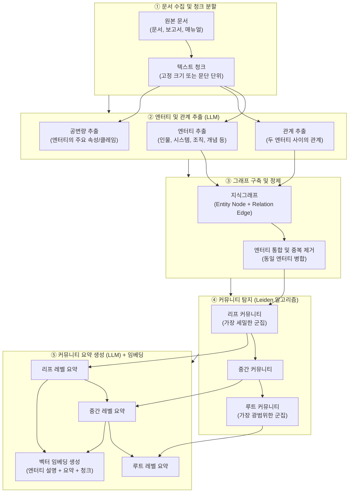
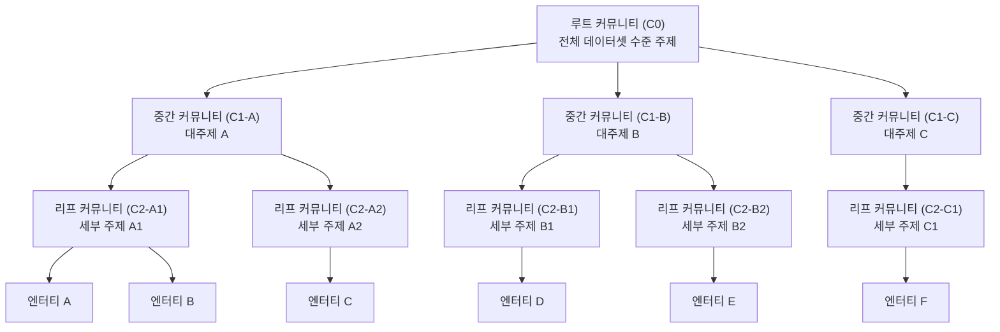
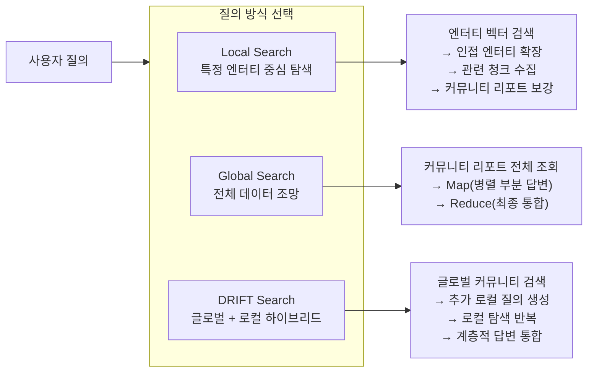
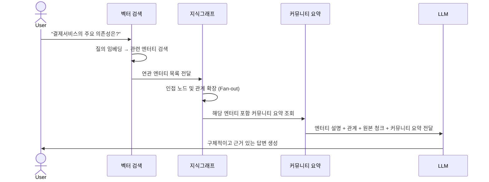
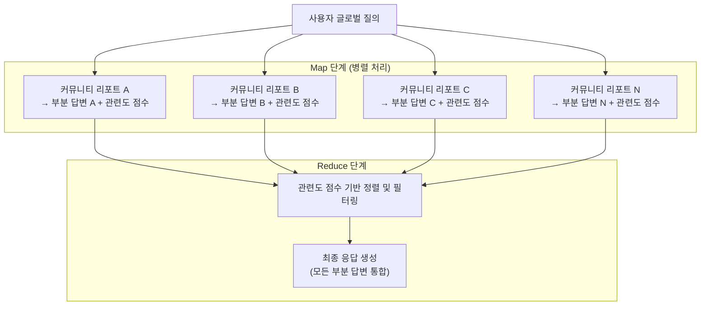
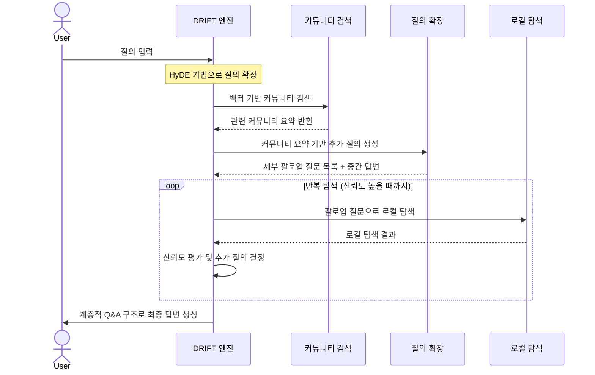
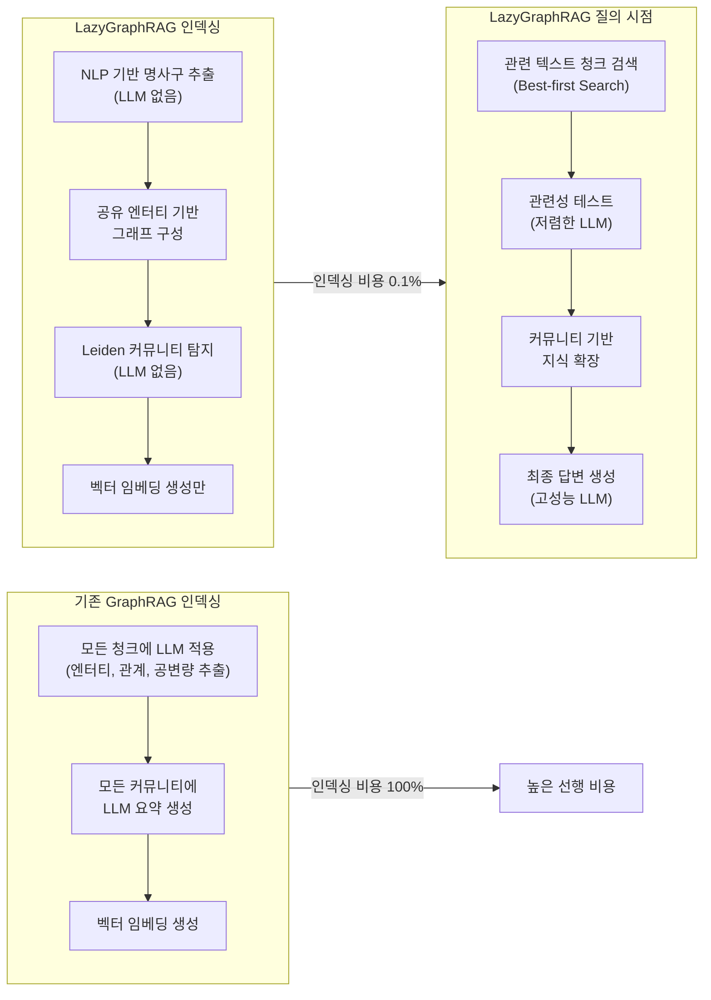
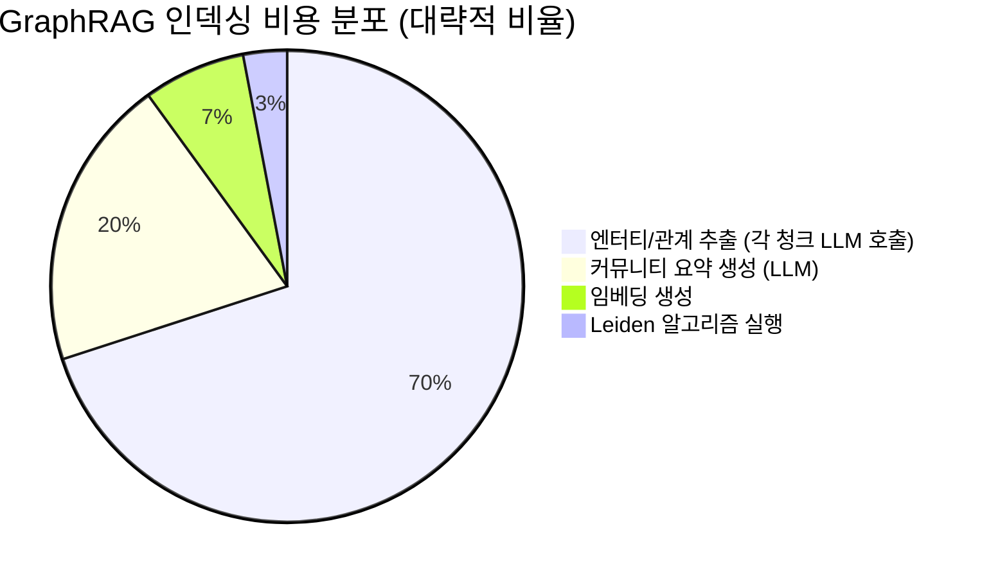
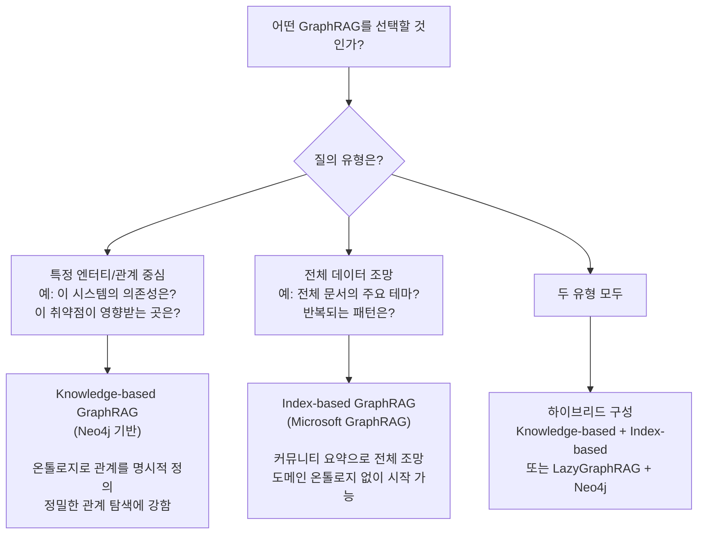
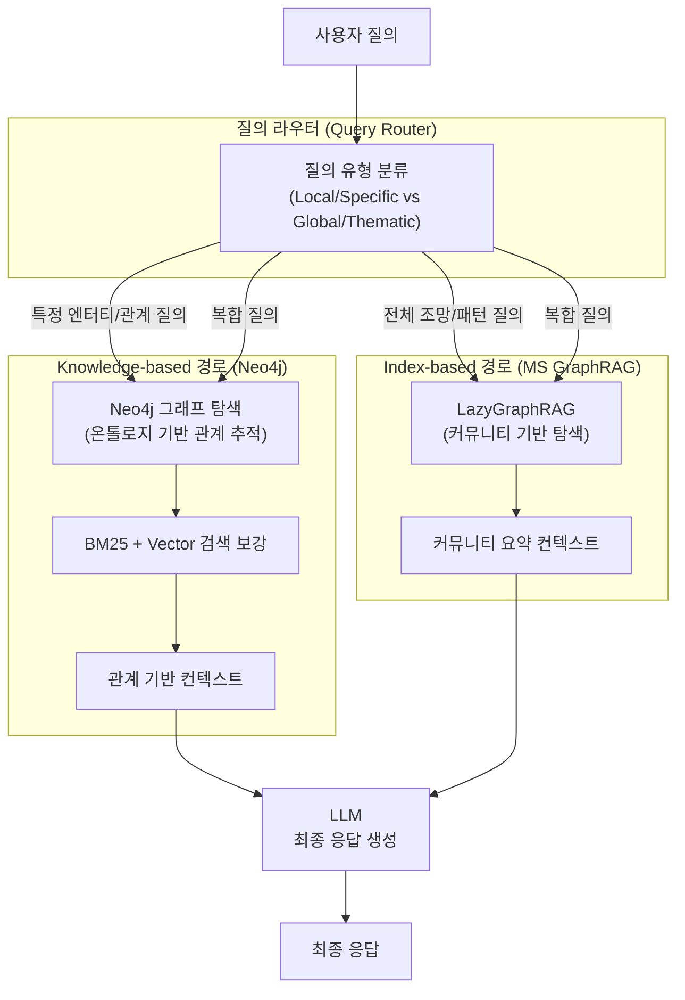

## Microsoft GraphRAG의 커뮤니티 탐지 기반 지식 색인 접근법

> **아키텍처팀 기술 세미나 — 보조 자료**  
> 원본 문서: Neo4j 기반 GraphRAG를 활용한 Hybrid RAG 시스템 구현  
> 작성일: 2026-05-11

---

## 목차

1. [두 가지 GraphRAG — 무엇이 다른가](#1-두-가지-graphrag--무엇이-다른가)
2. [Index-based GraphRAG의 탄생 배경 — 글로벌 질의의 문제](#2-index-based-graphrag의-탄생-배경--글로벌-질의의-문제)
3. [인덱싱 파이프라인 — 문서에서 커뮤니티 요약까지](#3-인덱싱-파이프라인--문서에서-커뮤니티-요약까지)
4. [커뮤니티 탐지 — Leiden 알고리즘](#4-커뮤니티-탐지--leiden-알고리즘)
5. [세 가지 질의 방식 — Local / Global / DRIFT Search](#5-세-가지-질의-방식--local--global--drift-search)
6. [LazyGraphRAG — 비용 혁신](#6-lazygraphrag--비용-혁신)
7. [비용 구조 분석](#7-비용-구조-분석)
8. [Knowledge-based vs Index-based — 언제 무엇을 선택할 것인가](#8-knowledge-based-vs-index-based--언제-무엇을-선택할-것인가)
9. [실제 적용 시나리오](#9-실제-적용-시나리오)
10. [한계와 고려사항](#10-한계와-고려사항)
11. [결론 — 두 접근법의 상호보완적 활용](#11-결론--두-접근법의-상호보완적-활용)

---

## 1. 두 가지 GraphRAG — 무엇이 다른가

앞선 세미나 자료에서 GraphRAG를 **Knowledge-based**와 **Index-based** 두 계열로 구분했습니다. 이 문서는 그중 Index-based GraphRAG를 집중적으로 다룹니다.

두 접근법은 같은 이름을 공유하지만 작동 방식이 근본적으로 다릅니다.

| 구분 | Knowledge-based GraphRAG | Index-based GraphRAG |
|---|---|---|
| 핵심 발상 | **도메인 온톨로지**를 사전 설계하고, 문서에서 엔터티와 관계를 추출하여 지식그래프 구축 | 문서에서 엔터티와 관계를 추출하되, 이를 **커뮤니티(군집)** 로 자동 분류하고 커뮤니티 요약을 색인으로 활용 |
| 대표 구현체 | Neo4j + neo4j-graphrag-python | Microsoft GraphRAG (github.com/microsoft/graphrag) |
| 온톨로지 필요 여부 | 필수 (사전 설계) | 불필요 (자동 추론) |
| 잘 답하는 질의 | "A와 B는 어떤 관계인가?" (관계 탐색) | "이 데이터셋의 주요 주제는?" (전체 조망) |
| 주요 저장소 | Graph DB (Neo4j) | Parquet 파일 + 벡터 스토어 |
| 구축 비용 | 높음 (온톨로지 설계 + 추출 검증) | 매우 높음 (전체 문서 LLM 처리) |

이 문서는 **Index-based GraphRAG**, 즉 Microsoft Research가 2024년에 공개한 원조 GraphRAG 논문(Edge et al., 2024)에 기반한 접근법을 설명합니다.

---

## 2. Index-based GraphRAG의 탄생 배경 — 글로벌 질의의 문제

### 2.1 기존 RAG가 답하지 못하는 질문이 있다

기존 Vector RAG, 그리고 Knowledge-based GraphRAG도 공통적으로 취약한 질의 유형이 있습니다. 바로 **글로벌 질의(Global Query)** 입니다.

글로벌 질의란 특정 문서나 엔터티를 찾는 것이 아니라, **전체 데이터셋을 아우르는 종합적인 이해**를 요구하는 질의입니다.

예를 들어 다음과 같은 질문들입니다.

- "우리 내부 기술 문서 전체에서 주요 이슈로 반복되는 주제는 무엇인가?"
- "지난 5년간 축적된 장애 보고서를 통해 볼 때, 반복되는 근본 원인의 패턴은 무엇인가?"
- "우리 아키텍처 문서 전체를 검토했을 때, 가장 중요한 의존성 리스크는 무엇인가?"

이런 질문에 Vector RAG로 답하려면 어떻게 해야 할까요? 질의와 가장 유사한 상위 몇 개 문서 청크를 찾아 LLM에 전달합니다. 그러나 이 방식은 **전체 데이터셋을 한 번에 조망하지 않고 일부만 샘플링**하기 때문에, 전체적인 패턴이나 테마를 파악하는 데 근본적인 한계를 가집니다.

Microsoft Research가 이 문제를 해결하기 위해 제안한 것이 바로 **커뮤니티 기반 요약 색인** 방식입니다.

### 2.2 핵심 아이디어 — 색인 시점에 요약을 만들어 두다

Index-based GraphRAG의 핵심 발상은 간단합니다.

> "질의 시점에 문서를 검색하는 것이 아니라, **색인 시점에 문서 전체를 읽고 요약**해 두면 어떨까?"

문서 전체에서 엔터티와 관계를 추출하고, 서로 밀접하게 연결된 엔터티들을 커뮤니티(군집)로 묶은 다음, 각 커뮤니티에 대해 LLM이 포괄적인 요약 리포트를 사전에 생성해 둡니다. 그러면 질의가 들어왔을 때 이 커뮤니티 요약들을 활용하여 전체 데이터셋을 아우르는 답변을 생성할 수 있습니다.

이것은 마치 두꺼운 책 전체를 미리 꼼꼼히 읽고 챕터별 독서 노트를 만들어 두는 것과 같습니다. 나중에 질문이 들어오면 원본 책 전체를 다시 읽지 않고 독서 노트를 참고하여 빠르게 답할 수 있습니다.

---

## 3. 인덱싱 파이프라인 — 문서에서 커뮤니티 요약까지

Index-based GraphRAG의 인덱싱 파이프라인은 크게 다섯 단계로 구성됩니다. 이 과정은 **미리 한 번 수행**하는 배치 작업이며, 상당한 LLM 호출 비용이 발생합니다.

### 3.1 1단계 — 문서 수집 및 청크 분할

모든 원본 문서를 수집하고 처리 가능한 크기로 분할합니다. Microsoft GraphRAG의 기본 청크 크기는 약 300~600 토큰이며, 청크 간 일정한 오버랩(overlap)을 두어 문맥이 잘리지 않도록 합니다. 각 청크는 고유 ID가 부여되고, 원본 문서와의 연결 정보가 유지됩니다.

### 3.2 2단계 — 엔터티 및 관계 추출 (LLM 처리)

각 텍스트 청크마다 LLM을 호출하여 다음 세 가지를 추출합니다.

**엔터티(Entity)**: 텍스트에 등장하는 주요 개념, 사람, 조직, 장소, 시스템, 이벤트 등입니다. 각 엔터티에는 유형(type)과 설명(description)이 함께 추출됩니다.

**관계(Relation)**: 두 엔터티 사이의 관계입니다. 관계에도 설명과 중요도 점수(strength)가 부여됩니다.

**공변량(Covariate)**: 엔터티에 대한 주요 클레임이나 사실적 속성입니다. 예를 들어 "Log4j는 2021년 심각한 취약점이 발견됐다"는 Log4j 엔터티에 대한 공변량입니다.

이 단계가 **가장 많은 LLM 호출과 비용이 발생**하는 구간입니다. 모든 청크에 대해 개별 LLM 호출이 이루어지기 때문입니다.

### 3.3 3단계 — 그래프 구축 및 정제

추출된 엔터티와 관계로 지식그래프를 구성합니다. 이 과정에서 동일한 실세계 개체를 가리키는 서로 다른 표현(예: "Apache Log4j", "log4j", "log4j-core")을 하나의 엔터티로 통합하는 **엔터티 해소(Entity Resolution)** 작업이 수행됩니다. 여러 청크에서 동일 엔터티 간 관계가 추출된 경우, 관계 설명들이 병합되어 하나의 풍부한 관계 노드로 통합됩니다.

### 3.4 4단계 — 커뮤니티 탐지 (Leiden 알고리즘)

그래프가 구성되면 **Leiden 알고리즘**을 적용하여 엔터티들을 계층적 커뮤니티로 분류합니다. 이 단계는 LLM 없이 그래프 알고리즘만으로 수행되기 때문에 비용이 거의 들지 않습니다.

Leiden 알고리즘은 서로 강하게 연결된 노드들을 같은 커뮤니티로 묶고, 커뮤니티 간 연결은 상대적으로 약하게 유지하도록 그래프를 분할합니다. 이 과정은 계층적으로 반복되어, 가장 세밀한 군집(리프 커뮤니티)부터 가장 광범위한 군집(루트 커뮤니티)까지 위계적 구조가 만들어집니다.

### 3.5 5단계 — 커뮤니티 요약 생성 및 임베딩

각 커뮤니티마다 LLM이 **커뮤니티 리포트(Community Report)** 를 생성합니다. 이 리포트는 해당 커뮤니티에 속한 엔터티들과 관계들을 종합하여, 커뮤니티가 다루는 주제, 주요 개체, 중요 사실들을 요약합니다. 하위 커뮤니티의 요약은 상위 커뮤니티 요약 생성에 활용되어, Bottom-up 방식으로 계층적 요약이 완성됩니다.

마지막으로, 엔터티 설명, 텍스트 청크, 커뮤니티 리포트에 대한 벡터 임베딩이 생성되어 벡터 스토어에 저장됩니다. 이 임베딩은 이후 Local Search와 DRIFT Search에서 사용됩니다.

---

## 4. 커뮤니티 탐지 — Leiden 알고리즘

### 4.1 Leiden 알고리즘이란

Leiden 알고리즘은 2019년 Traag 등이 제안한 커뮤니티 탐지 알고리즘으로, 이전에 널리 쓰이던 Louvain 알고리즘의 단점을 개선한 버전입니다. 그래프 내의 모듈성(modularity)을 최대화하는 방식으로 커뮤니티를 탐지합니다.

**모듈성(Modularity)** 이란, 커뮤니티 내부의 연결이 무작위 그래프에서 기대되는 연결보다 얼마나 더 많은지를 나타내는 지표입니다. 이 값이 높을수록 커뮤니티 구조가 명확하다는 의미입니다.

Leiden 알고리즘의 핵심 장점은 **계층적 반복 적용**이 가능하다는 것입니다. 전체 그래프에서 커뮤니티를 탐지한 후, 각 커뮤니티 안에서 다시 서브커뮤니티를 탐지하는 방식을 반복하여 다단계 계층 구조를 만들 수 있습니다.

### 4.2 커뮤니티 계층 구조

Microsoft GraphRAG의 CLI에서는 `--community-level` 파라미터로 어느 계층의 커뮤니티 요약을 질의에 활용할지 지정할 수 있습니다. 기본값은 레벨 2로, 대부분의 경우에 적합한 균형점으로 알려져 있습니다. 레벨이 낮을수록 광범위한 요약(루트 방향), 높을수록 세밀한 요약(리프 방향)을 사용합니다.

---

## 5. 세 가지 질의 방식 — Local / Global / DRIFT Search

인덱싱이 완료되면 질의 시점에는 세 가지 검색 방식 중 하나 또는 조합을 사용합니다.

### 5.1 Local Search — 특정 엔터티 중심 탐색

**언제 사용하는가**: "Log4j 2.14.1 버전에 대해 알려줘", "결제서비스의 주요 의존성은?", "이 특정 규정이 어떤 업무에 영향을 주는가?"처럼 특정 엔터티나 개념을 중심으로 구체적인 정보를 찾을 때 적합합니다.

**동작 방식**:

Local Search는 벡터 검색으로 관련 엔터티를 찾고, 그래프를 통해 인접 엔터티를 확장한 다음, 해당 엔터티들이 속한 커뮤니티의 요약으로 컨텍스트를 보강하는 방식으로 동작합니다. 특정 개체에 대한 정밀한 답변에 강합니다.

### 5.2 Global Search — 전체 데이터 조망

**언제 사용하는가**: "이 문서 집합 전체에서 반복되는 주요 패턴은?", "우리 아키텍처 문서의 핵심 우려 사항은?", "지난 장애 보고서를 통해 보이는 공통된 근본 원인은?"처럼 전체 데이터셋을 아우르는 통합적 이해가 필요할 때 적합합니다.

**동작 방식**:

Global Search는 **Map-Reduce** 패턴으로 동작합니다.

Map 단계에서는 지정된 커뮤니티 계층(기본: 레벨 2)의 모든 커뮤니티 리포트를 대상으로, 각각에 대해 LLM이 독립적으로 부분 답변과 관련도 점수를 생성합니다. 이 과정은 병렬로 수행됩니다. Reduce 단계에서는 관련도 점수가 높은 부분 답변들을 우선순위로 하여 최종 통합 답변을 생성합니다.

Global Search의 단점은 **모든 커뮤니티 리포트를 처리**하기 때문에 토큰 비용이 매우 크다는 것입니다. 데이터셋이 클수록 비용은 선형에 가깝게 증가합니다.

**Dynamic Community Selection**: 이 비용을 줄이기 위해 Microsoft는 관련도가 낮은 커뮤니티를 저렴한 모델로 필터링한 후, 관련도 높은 커뮤니티만 주요 모델로 처리하는 **동적 커뮤니티 선택(Dynamic Community Selection)** 기법을 도입했습니다. CLI에서 `--dynamic-community-selection` 플래그로 활성화할 수 있습니다.

### 5.3 DRIFT Search — 글로벌과 로컬의 하이브리드

DRIFT(Dynamic Reasoning and Inference with Flexible Traversal) Search는 Global Search의 포괄성과 Local Search의 정밀도를 결합하려는 시도입니다. 2024년 10월 Microsoft Research가 도입했습니다.

**동작 방식**:

DRIFT Search는 먼저 HyDE(Hypothetical Document Embeddings) 기법으로 질의를 확장한 후, 벡터 검색으로 관련 커뮤니티를 찾습니다. 그런 다음 이 커뮤니티 정보를 바탕으로 LLM이 추가 팔로업 질문들을 자동 생성하고, 각 팔로업 질문으로 로컬 탐색을 반복하여 점진적으로 답변을 정교화합니다. 최종 출력은 질문-답변의 계층적 구조를 갖습니다.

DRIFT Search는 Global Search처럼 전체 커뮤니티를 일괄 처리하지 않기 때문에 비용이 더 낮으면서도, Local Search보다 더 넓은 컨텍스트를 활용할 수 있습니다.

---

## 6. LazyGraphRAG — 비용 혁신

### 6.1 등장 배경

Index-based GraphRAG의 최대 약점은 **인덱싱 비용**입니다. 모든 문서의 모든 청크에 대해 LLM을 호출하여 엔터티와 관계를 추출하고, 모든 커뮤니티에 대해 요약을 생성해야 합니다. 수천~수만 개 문서로 구성된 대규모 데이터셋에서는 이 인덱싱 비용이 실제 도입을 가로막는 장벽이 됩니다.

2024년 11월 Microsoft Research가 이 문제를 해결하기 위해 **LazyGraphRAG**를 발표했습니다.

### 6.2 LazyGraphRAG의 핵심 아이디어 — 지연 평가

"Lazy"라는 이름은 컴퓨터 과학의 **지연 평가(Lazy Evaluation)** 개념에서 왔습니다. 필요한 시점까지 계산을 미루는 전략입니다.

LazyGraphRAG는 인덱싱 시점에 LLM을 거의 사용하지 않습니다. 대신 NLP 기반의 가벼운 명사구 추출로 후보 엔터티를 식별하고, 텍스트 청크와 임베딩만 저장합니다. 커뮤니티는 기존처럼 그래프 알고리즘으로 탐지하되, **커뮤니티 요약은 미리 생성하지 않습니다**.

커뮤니티 요약 생성과 LLM을 활용한 정밀 처리는 **질의 시점으로 미룹니다**. 질의가 들어왔을 때, 관련성이 높은 커뮤니티를 우선 탐색하고 필요한 부분에 대해서만 LLM을 활용하여 즉석에서 처리합니다.

### 6.3 LazyGraphRAG의 성능 비교

Microsoft Research가 5,590개 AP 뉴스 기사, 100개 합성 질의(로컬 50개, 글로벌 50개)를 대상으로 수행한 벤치마크 결과는 다음과 같습니다.

| 비교 대상 | 인덱싱 비용 | 질의 비용 | 성능 (로컬) | 성능 (글로벌) |
|---|---|---|---|---|
| Vector RAG | 기준 | 기준 | 기준 | 낮음 |
| GraphRAG Local | 100% | 기준 | 우수 | 보통 |
| GraphRAG Global | 100% | **매우 높음** | 보통 | 우수 |
| DRIFT Search | 100% | 중간 | 우수 | 우수 |
| **LazyGraphRAG (저비용)** | **0.1%** | Vector RAG 수준 | **최우수** | GraphRAG Global 동급 |
| **LazyGraphRAG (중비용)** | **0.1%** | GraphRAG Global의 4% | **압도적** | **압도적** |

LazyGraphRAG는 Vector RAG와 동일한 질의 비용으로 로컬 질의에서 GraphRAG DRIFT Search와 GraphRAG 로컬 검색을 포함한 모든 경쟁 방식을 능가합니다. 또한 같은 설정에서 글로벌 질의에 대해 GraphRAG Global Search와 동등한 답변 품질을 보여주면서도, 비용은 700배 이상 낮습니다.

최적 설정의 LazyGraphRAG는 모든 평가 지표와 질의 유형에서 70~90%의 승률을 기록했습니다.

### 6.4 LazyGraphRAG 현황

LazyGraphRAG는 2025년 6월 기준 **Microsoft Discovery** (Azure 기반 과학연구 에이전틱 플랫폼)와 **Azure Local** 서비스에 공식 통합되어 있습니다. Microsoft GraphRAG 오픈소스 레포지터리에서도 사용 가능합니다.

---

## 7. 비용 구조 분석

### 7.1 단계별 비용 요소

Index-based GraphRAG를 도입할 때 가장 현실적으로 검토해야 할 요소가 비용입니다.

전체 인덱싱 비용의 약 90%는 LLM 호출에서 발생합니다. 문서 수가 두 배가 되면 비용도 대략 두 배가 됩니다.

### 7.2 방식별 비용 비교표

| 방식 | 인덱싱 비용 | 질의당 비용 | 비고 |
|---|---|---|---|
| Vector RAG | 임베딩만 | 매우 낮음 | 기준선 |
| Index-based GraphRAG (Full) | **매우 높음** (Vector의 약 1,000배) | Global: 높음 / Local: 중간 | 대규모 문서에서 현실적 도전 |
| Index-based GraphRAG + Dynamic Selection | 매우 높음 | Global: 중간 / Local: 중간 | 동적 필터링으로 질의 비용 절감 |
| **LazyGraphRAG** | **임베딩 수준** (Full의 0.1%) | 매우 낮음~중간 (예산 조절 가능) | 인덱싱 비용 혁신 |
| Knowledge-based GraphRAG (Neo4j) | 중간 (온톨로지 설계 + 추출) | 낮음 (Cypher 탐색) | 온톨로지 설계 인건비 별도 |

---

## 8. Knowledge-based vs Index-based — 언제 무엇을 선택할 것인가

### 8.1 질의 유형이 선택을 결정한다

두 접근법 중 어느 것이 더 나은가를 묻는 것은 "스크루드라이버와 망치 중 어느 것이 더 좋은가"를 묻는 것과 같습니다. 질의 유형과 데이터 특성에 따라 적합한 도구가 다릅니다.

### 8.2 상세 비교

| 비교 기준 | Knowledge-based (Neo4j) | Index-based (MS GraphRAG) |
|---|---|---|
| **적합한 질의** | 특정 엔터티 관계, 영향도 분석, 멀티홉 탐색 | 전체 주제 파악, 패턴 발견, 글로벌 요약 |
| **도메인 전문성 필요** | 높음 (온톨로지 설계) | 낮음 (자동 추론) |
| **초기 구축 비용** | 설계 비용 높음, LLM 비용 중간 | LLM 비용 매우 높음 (LazyGraphRAG로 해소 가능) |
| **결과 설명력** | 높음 (Cypher 탐색 경로 추적 가능) | 중간 (커뮤니티 리포트 기반) |
| **갱신 용이성** | 중간 (그래프 업데이트 파이프라인 필요) | 낮음 (전체 재인덱싱 필요) |
| **비정형 문서 처리** | 추출 정확도에 의존 | 상대적으로 강건함 |
| **대규모 문서 처리** | 확장 가능 | 인덱싱 비용 이슈 (LazyGraphRAG로 완화) |

### 8.3 실무 선택 기준

**Knowledge-based GraphRAG(Neo4j)를 선택하는 경우**:
- IT 시스템 구성, 의존성, 취약점 영향도처럼 **관계 구조가 명확한 도메인**
- "A가 B에 어떤 영향을 주는가?"와 같이 **구체적인 엔터티 간 관계** 질의가 주를 이룰 때
- 정확하고 추적 가능한 결과가 중요한 경우 (근거 명시 필요)
- 온톨로지를 설계할 도메인 전문 인력이 있는 경우

**Index-based GraphRAG(MS GraphRAG)를 선택하는 경우**:
- 연구 보고서, 뉴스, 회의록처럼 **비정형 문서가 대량으로 있고 도메인이 불명확**한 경우
- "이 문서들의 주요 주제는?" 같이 **전체를 아우르는 분석** 질의가 많은 경우
- 온톨로지 설계 없이 **빠르게 프로토타이핑**하고 싶은 경우
- LazyGraphRAG를 활용하여 인덱싱 비용을 최소화할 수 있는 경우

---

## 9. 실제 적용 시나리오

### 9.1 아키텍처팀 관점에서의 Index-based GraphRAG 활용

앞선 세미나 자료에서 다룬 Knowledge-based GraphRAG(Neo4j)가 **시스템 영향도 분석, 취약점 추적, 의존성 파악**에 특화된 것과 달리, Index-based GraphRAG는 다음 시나리오에서 더 자연스럽게 활용됩니다.

**시나리오 1: 레거시 문서 분석**  
오래된 프로젝트 산출물, 설계 문서, 변경 이력 문서들이 체계 없이 쌓여 있는 경우, 온톨로지를 설계하지 않고도 Index-based GraphRAG로 "이 문서들에서 반복적으로 지적된 아키텍처 문제는?"과 같은 글로벌 질의에 답할 수 있습니다.

**시나리오 2: 장애 보고서 종합 분석**  
수년간 축적된 장애 보고서에서 "반복되는 장애 패턴의 근본 원인은 무엇인가?"를 물으면, 커뮤니티 기반 요약이 전체 보고서를 조망하여 패턴을 추출합니다.

**시나리오 3: 기술 세미나 자료 인덱싱**  
다양한 기술 발표 자료, 리서치 문서, 내부 블로그 포스트를 Index-based GraphRAG로 인덱싱하면, "최근 2년간 우리 팀이 다룬 주요 기술 주제는?"과 같은 질의에 답할 수 있습니다.

### 9.2 두 접근법의 결합 — 이상적인 아키텍처

현실적으로 가장 강력한 구성은 두 접근법을 함께 사용하는 것입니다.

이 구성에서 질의 라우터는 들어오는 질의를 분석하여 적합한 경로로 전달합니다. 특정 시스템의 의존성을 묻는 질의는 Neo4j 기반 경로로, 전체 문서에서 테마를 찾는 질의는 MS GraphRAG 경로로 처리합니다. 복합적인 질의는 두 경로를 병렬로 실행하고 결과를 통합합니다.

---

## 10. 한계와 고려사항

### 10.1 정적 요약의 한계

Index-based GraphRAG의 커뮤니티 요약은 **인덱싱 시점에 고정**됩니다. 새로운 문서가 추가되거나 기존 정보가 변경되면, 변경된 부분만 갱신하는 증분 인덱싱이 어렵고 **전체 재인덱싱**이 필요한 경우가 많습니다. 이는 운영 중인 시스템에서 지속적인 데이터 갱신이 필요한 경우 큰 부담이 됩니다.

### 10.2 고연결 엔터티 처리 문제

"회사", "시스템", "팀"처럼 수많은 문서에서 광범위하게 등장하는 엔터티는 그래프에서 수천 개의 엣지를 가질 수 있습니다. 이런 고연결 제네릭 엔터티는 커뮤니티 탐지 결과를 왜곡하고 검색 품질을 저하시킵니다. 이를 방지하기 위해 엔터티 필터링 전략이 필요합니다.

### 10.3 엔터티 해소의 어려움

Index-based GraphRAG는 온톨로지 없이 자동으로 엔터티를 추출하기 때문에, 동일한 실세계 개체를 가리키는 다양한 표현들을 통합하는 엔터티 해소가 완전하지 않을 수 있습니다. 단순 문자열 매칭 기반의 엔터티 매칭은 이 문제에 취약합니다.

### 10.4 비용 대비 효과 검토

LazyGraphRAG가 인덱싱 비용을 크게 줄였음에도, 질의 시점에 사용하는 LLM 호출 비용은 여전히 발생합니다. 특히 대용량 데이터셋에 대해 글로벌 질의가 빈번한 경우, 비용 시뮬레이션을 사전에 수행하여 경제성을 검토해야 합니다.

### 10.5 한계 요약

| 한계 | 영향도 | 완화 방안 |
|---|---|---|
| 데이터 갱신 시 재인덱싱 필요 | 높음 | 갱신 주기 관리 + LazyGraphRAG 활용 |
| 고연결 제네릭 엔터티 왜곡 | 중간 | 엔터티 필터링 정책 수립 |
| 엔터티 해소 불완전 | 중간 | 추출 후 정규화 단계 추가 |
| 전체 인덱싱 비용 | 높음 | LazyGraphRAG로 대폭 완화 가능 |
| 특정 관계 탐색의 정밀도 | 중간 | Knowledge-based GraphRAG와 병행 |

---

## 11. 결론 — 두 접근법의 상호보완적 활용

Index-based GraphRAG는 도메인 온톨로지 없이도 대규모 비정형 문서에서 의미 있는 지식 구조를 자동으로 추출하고, 전체 데이터셋을 아우르는 글로벌 질의에 효과적으로 답할 수 있다는 점에서 독보적인 강점을 가집니다. Microsoft Research가 지속적으로 발전시키고 있으며, LazyGraphRAG를 통해 비용 장벽도 크게 낮아졌습니다.

반면 Knowledge-based GraphRAG(Neo4j 기반)는 도메인 전문가가 설계한 온톨로지를 바탕으로 정밀한 관계 탐색과 멀티홉 추론을 수행하는 데 강점을 가집니다. 아키텍처팀이 다루는 시스템 영향도 분석, 취약점 추적, 서비스 의존성 파악 같은 업무는 이 접근법이 더 적합합니다.

두 접근법은 경쟁 관계가 아니라 **상호보완 관계**입니다. 이상적인 방향은 두 접근법의 강점을 모두 활용하는 하이브리드 아키텍처입니다.

- **비정형 대용량 문서에서 패턴과 주제를 발견**할 때 → Index-based GraphRAG (LazyGraphRAG)
- **명확한 도메인 관계를 추적하고 영향도를 분석**할 때 → Knowledge-based GraphRAG (Neo4j)
- **두 종류의 질의가 모두 발생**하는 실무 환경 → 질의 라우터 기반 하이브리드 구성

GraphRAG 기술은 2024~2025년을 거치며 빠르게 성숙하고 있습니다. Microsoft의 공식 오픈소스 구현체와 Neo4j의 공식 라이브러리 모두 활발히 발전 중이며, 기업 환경에서의 실제 적용 사례도 빠르게 늘고 있습니다. 지금이 Index-based GraphRAG를 파일럿 프로젝트로 경험해 볼 적기입니다.

---

## 참고 자료

- Edge, D., et al. (2024). "From Local to Global: A Graph RAG Approach to Query-Focused Summarization." Microsoft Research. arXiv:2404.16130
- Microsoft Research Blog (2024). "LazyGraphRAG: Setting a New Standard for Quality and Cost."
- Microsoft Research Blog (2025). "BenchmarkQED: Automated Benchmarking of RAG Systems." (June 17, 2025)
- Microsoft Research Blog (2024). "Introducing DRIFT Search: Combining Global and Local Search Methods."
- Microsoft GraphRAG 공식 문서: https://microsoft.github.io/graphrag/
- Traag, V.A., Waltman, L., van Eck, N.J. (2019). "From Louvain to Leiden: guaranteeing well-connected communities." Scientific Reports.
- Weaviate Blog (2025). "Exploring RAG and GraphRAG: Understanding When and How to Use Both."

---

*작성일: 2026-05-11*  
*작성자: 아키텍처팀*  
*관련 문서: Neo4j 기반 GraphRAG를 활용한 Hybrid RAG 시스템 구현*
