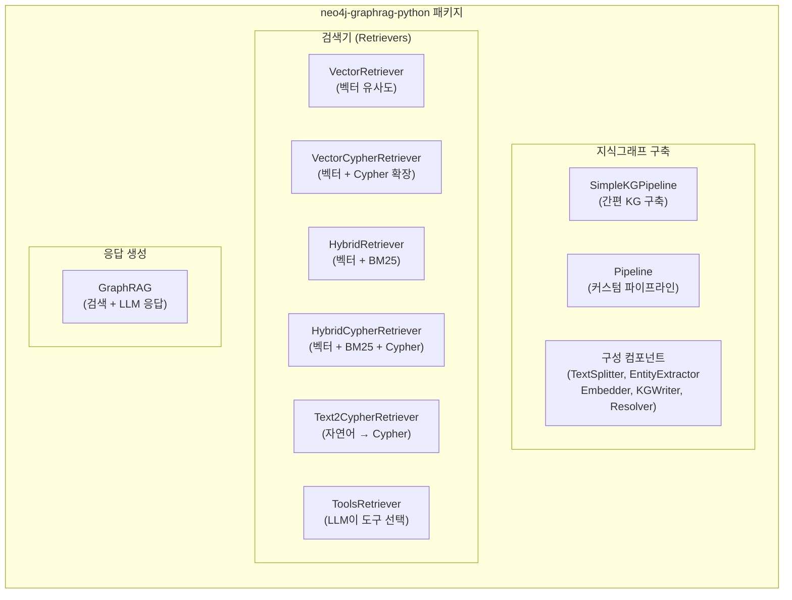
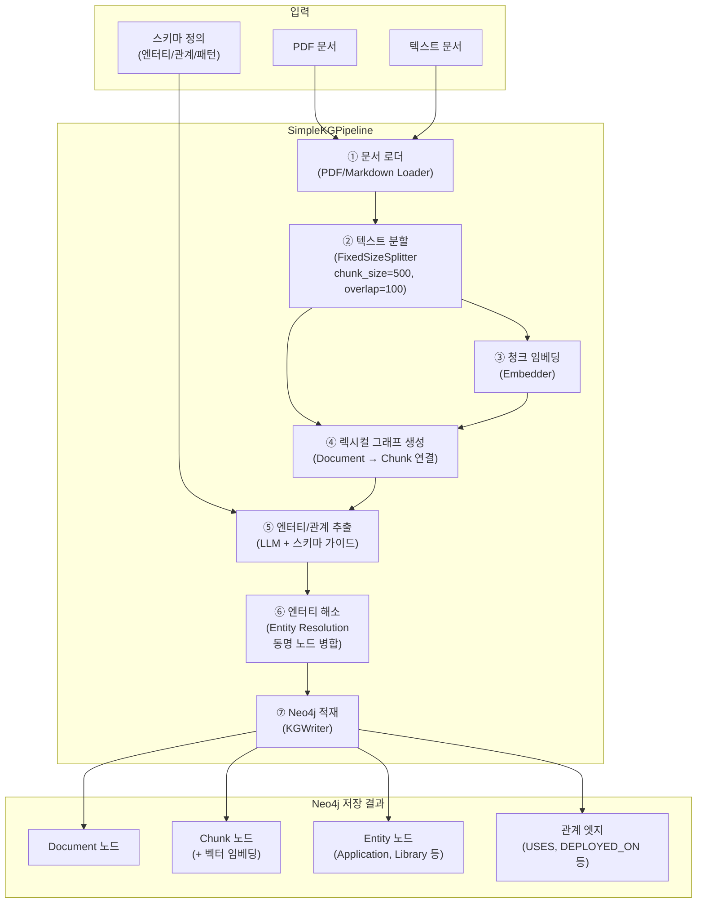
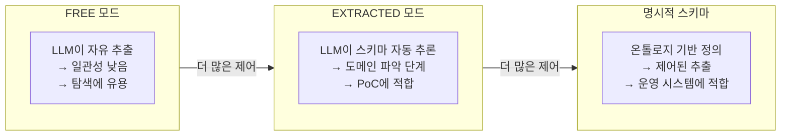
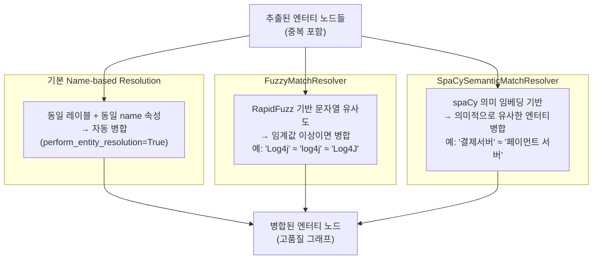
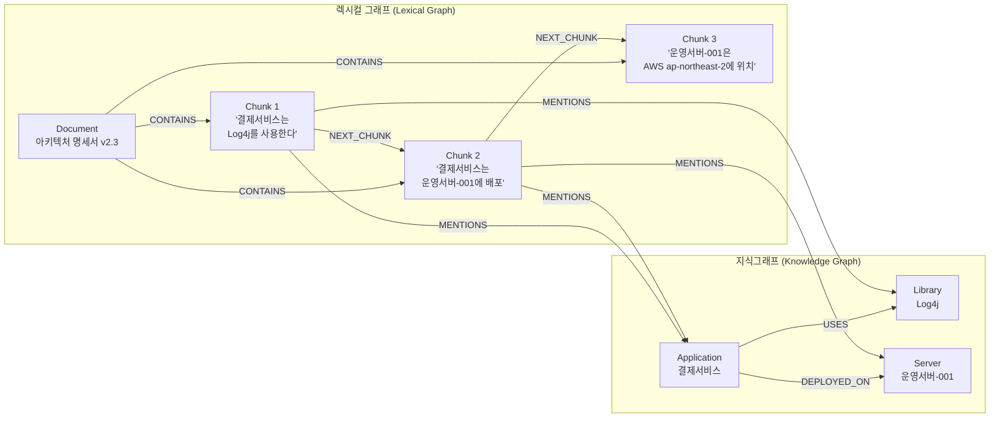
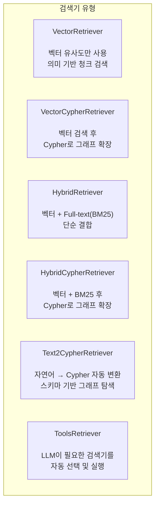
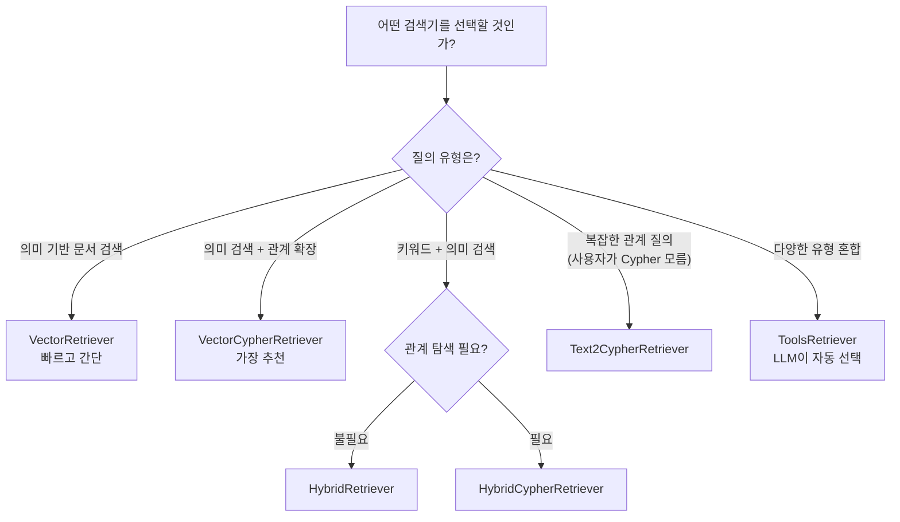
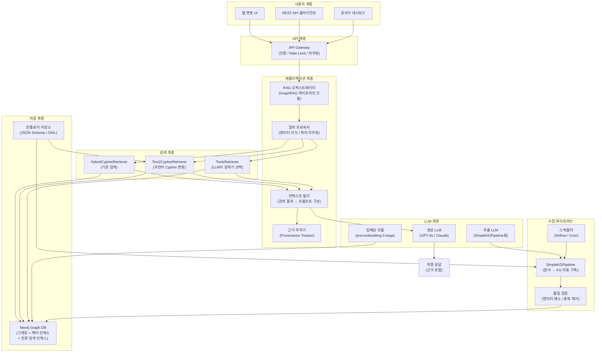
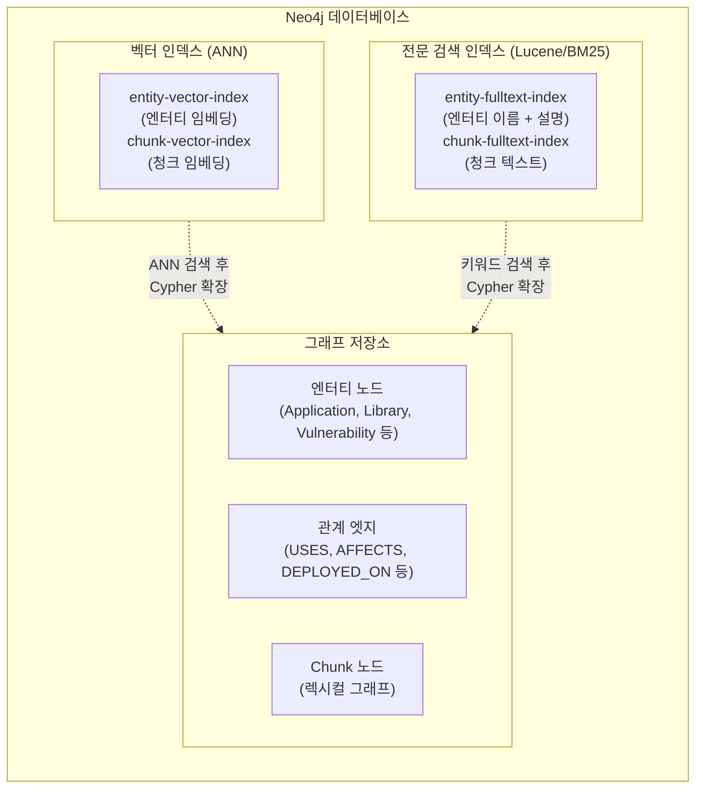

## 온톨로지 기반 지식그래프와 Neo4j를 활용한 정밀 관계 탐색

> **아키텍처팀 기술 세미나 — 보조 자료**  
> 원본 문서: Neo4j 기반 GraphRAG를 활용한 Hybrid RAG 시스템 구현  
> 작성일: 2026-05-11

---

## 관련글

- [**RAG 기술 아키텍처 세미나 - (1) Neo4j 기반 GraphRAG를 활용한 Hybrid RAG 시스템 구현**](https://k82022603.github.io/posts/rag-%EA%B8%B0%EC%88%A0-%EC%95%84%ED%82%A4%ED%85%8D%EC%B2%98-%EC%84%B8%EB%AF%B8%EB%82%98-(1)-neo4j-%EA%B8%B0%EB%B0%98-graphrag%EB%A5%BC-%ED%99%9C%EC%9A%A9%ED%95%9C-hybrid-rag-%EC%8B%9C%EC%8A%A4%ED%85%9C-%EA%B5%AC%ED%98%84/)
- [**RAG 기술 아키텍처 세미나 - (2) Index-based GraphRAG 심화 이해**](https://k82022603.github.io/posts/rag-%EA%B8%B0%EC%88%A0-%EC%95%84%ED%82%A4%ED%85%8D%EC%B2%98-%EC%84%B8%EB%AF%B8%EB%82%98-(2)-index-based-graphrag-%EC%8B%AC%ED%99%94-%EC%9D%B4%ED%95%B4/)
- **RAG 기술 아키텍처 세미나 - (3) Knowledge-based GraphRAG 심화 이해**
- [**RAG 기술 아키텍처 세미나 - (4) Index-based GraphRAG 기반 Neo4j Hybrid RAG 시스템 구현**](https://k82022603.github.io/posts/rag-%EA%B8%B0%EC%88%A0-%EC%95%84%ED%82%A4%ED%85%8D%EC%B2%98-%EC%84%B8%EB%AF%B8%EB%82%98-(4)-index-based-graphrag-%EA%B8%B0%EB%B0%98-neo4j-hybrid-rag-%EC%8B%9C%EC%8A%A4%ED%85%9C-%EA%B5%AC%ED%98%84/)
- [**RAG 기술 아키텍처 세미나 - (5) 엔터프라이즈 Hybrid RAG 지식 플랫폼 구축 전략**](https://k82022603.github.io/posts/rag-%EA%B8%B0%EC%88%A0-%EC%95%84%ED%82%A4%ED%85%8D%EC%B2%98-%EC%84%B8%EB%AF%B8%EB%82%98-(5)-%EC%97%94%ED%84%B0%ED%94%84%EB%9D%BC%EC%9D%B4%EC%A6%88-hybrid-rag-%EC%A7%80%EC%8B%9D-%ED%94%8C%EB%9E%AB%ED%8F%BC-%EA%B5%AC%EC%B6%95-%EC%A0%84%EB%9E%B5/)
- [**RAG 기술 아키텍처 세미나 - (6) 온톨로지로 Knowledge Graph 설계하기**](https://k82022603.github.io/posts/rag-%EA%B8%B0%EC%88%A0-%EC%95%84%ED%82%A4%ED%85%8D%EC%B2%98-%EC%84%B8%EB%AF%B8%EB%82%98-(6)-%EC%98%A8%ED%86%A8%EB%A1%9C%EC%A7%80%EB%A1%9C-knowledge-graph-%EC%84%A4%EA%B3%84%ED%95%98%EA%B8%B0/)
- [**RAG 기술 아키텍처 세미나 - (7) GraphRAG와 Neo4j로 만드는 지능형 지식 검색**](https://k82022603.github.io/posts/rag-%EA%B8%B0%EC%88%A0-%EC%95%84%ED%82%A4%ED%85%8D%EC%B2%98-%EC%84%B8%EB%AF%B8%EB%82%98-(7)-graphrag%EC%99%80-neo4j%EB%A1%9C-%EB%A7%8C%EB%93%9C%EB%8A%94-%EC%A7%80%EB%8A%A5%ED%98%95-%EC%A7%80%EC%8B%9D-%EA%B2%80%EC%83%89/)

---

## 목차

1. [Knowledge-based GraphRAG란 무엇인가](#1-knowledge-based-graphrag란-무엇인가)
2. [핵심 구성 스택 — Neo4j와 공식 Python 라이브러리](#2-핵심-구성-스택--neo4j와-공식-python-라이브러리)
3. [지식그래프 구축 파이프라인 — SimpleKGPipeline 중심](#3-지식그래프-구축-파이프라인--simpleKGPipeline-중심)
4. [스키마(Schema) 설계 — LLM 추출을 안내하는 청사진](#4-스키마schema-설계--llm-추출을-안내하는-청사진)
5. [엔터티 해소(Entity Resolution) — 그래프 품질의 핵심](#5-엔터티-해소entity-resolution--그래프-품질의-핵심)
6. [렉시컬 그래프(Lexical Graph) — 문서와 엔터티의 연결](#6-렉시컬-그래프lexical-graph--문서와-엔터티의-연결)
7. [검색기(Retriever) 유형과 선택 전략](#7-검색기retriever-유형과-선택-전략)
8. [Cypher — 관계 탐색의 질의 언어](#8-cypher--관계-탐색의-질의-언어)
9. [전체 SW 아키텍처 설계](#9-전체-sw-아키텍처-설계)
10. [실제 구현 예시 코드 — IT 시스템 도메인](#10-실제-구현-예시-코드--it-시스템-도메인)
11. [대규모 실사례 분석](#11-대규모-실사례-분석)
12. [한계와 주요 과제](#12-한계와-주요-과제)
13. [결론 — 정밀성과 설명 가능성의 GraphRAG](#13-결론--정밀성과-설명-가능성의-graphrag)

---

## 1. Knowledge-based GraphRAG란 무엇인가

### 1.1 정의

Knowledge-based GraphRAG는 특정 도메인에 대해 **온톨로지(Ontology) 또는 스키마(Schema)를 사전에 정의**하고, 그 구조에 따라 문서에서 엔터티와 관계를 추출하여 지식그래프를 구축한 뒤, 이 그래프를 탐색하여 LLM 응답을 생성하는 방식입니다.

이 접근법의 핵심 철학은 단순합니다. **"무엇을 알고 싶은지를 먼저 정의하고, 그에 맞게 지식을 구조화한다."** 무작위로 텍스트에서 정보를 추출하는 것이 아니라, 미리 설계한 청사진에 따라 일관된 방식으로 지식을 쌓아가는 것입니다.

앞선 세미나 자료에서 다룬 Index-based GraphRAG(Microsoft GraphRAG)와의 핵심 차이는 다음과 같습니다.

```
[Index-based GraphRAG]
문서 → LLM이 자유롭게 엔터티/관계 추출 → Leiden 알고리즘으로 커뮤니티 분류 → 커뮤니티 요약 생성 → 글로벌 질의 대응

[Knowledge-based GraphRAG]
온톨로지/스키마 설계 → 스키마 기반 LLM 추출 (제어된 추출) → Neo4j에 정형화된 그래프 구축 → Cypher 기반 정밀 관계 탐색 → 구체적 관계 질의 대응
```

### 1.2 왜 Knowledge-based인가

아키텍처팀이 일상적으로 마주하는 업무 질문들을 다시 생각해봅시다.

- "Log4j 2.14.1을 사용하는 애플리케이션이 배포된 서버 목록을 뽑아줘."
- "결제서비스가 의존하는 라이브러리 중 최근 3개월 내 취약점이 발견된 것은?"
- "운영팀 B가 관리하는 서비스들의 외부 노출 현황은?"

이런 질문들은 "어떤 문서에 관련 정보가 있는가?"가 아니라 "어떤 엔터티들이 어떤 관계로 연결되어 있는가?"를 묻습니다. 관계 구조가 명확하고, 답변도 정확해야 하며, 근거가 추적 가능해야 합니다.

이 세 가지 요구사항 — **정밀성, 정확성, 추적 가능성** — 이 Knowledge-based GraphRAG가 특히 강점을 발휘하는 영역입니다.

---

## 2. 핵심 구성 스택 — Neo4j와 공식 Python 라이브러리

### 2.1 Neo4j

Neo4j는 세계에서 가장 널리 사용되는 그래프 데이터베이스입니다. 노드(Node), 관계(Relationship), 속성(Property)으로 이루어진 프로퍼티 그래프(Property Graph) 모델을 기반으로 하며, Cypher라는 선언형 그래프 질의 언어를 제공합니다.

**Neo4j가 Knowledge-based GraphRAG에 적합한 이유는 다음과 같습니다.**

**네이티브 그래프 저장**: 노드와 관계를 인접 리스트(Adjacency List) 방식으로 저장하기 때문에, 관계 탐색이 테이블 조인 없이 포인터 추적만으로 이루어집니다. 그래프 탐색 성능이 관계형 DB에 비해 월등히 빠릅니다.

**벡터 인덱스 내장 (Neo4j 5.x 이후)**: 별도의 벡터 DB 없이 Neo4j 내부에서 벡터 유사도 검색을 수행할 수 있습니다. 그래프 탐색과 벡터 검색을 단일 쿼리에서 결합하는 것이 가능합니다.

**전문 검색 인덱스(Full-text Index)**: Lucene 기반 전문 검색 인덱스를 지원하여 BM25 스타일의 키워드 검색도 Neo4j 내에서 수행할 수 있습니다.

**Cypher 질의 언어**: 그래프 패턴 매칭에 최적화된 직관적인 질의 언어로, 복잡한 멀티홉 관계 탐색을 간결하게 표현할 수 있습니다.

### 2.2 neo4j-graphrag-python — 공식 Python 라이브러리

`neo4j-graphrag-python`은 Neo4j가 공식 지원하는 Python 라이브러리로, 지식그래프 구축(KG Builder)과 GraphRAG 검색(Retriever + Generator) 두 가지 핵심 기능을 제공합니다. 이전에 `neo4j-genai`라는 이름으로 배포되다가 `neo4j-graphrag`로 이름이 바뀌었습니다.



---

## 3. 지식그래프 구축 파이프라인 — SimpleKGPipeline 중심

### 3.1 전체 파이프라인 구조

지식그래프를 구축하는 파이프라인은 다음과 같은 단계로 구성됩니다.



### 3.2 각 단계 상세 설명

**① 문서 로더**: PDF, Markdown, 일반 텍스트 파일을 읽어 처리 가능한 형태로 변환합니다. neo4j-graphrag 라이브러리는 PDF와 Markdown에 대한 기본 로더를 제공하며, 커스텀 로더를 구현할 수도 있습니다.

**② 텍스트 분할(Text Splitting)**: 문서를 처리 가능한 크기의 청크로 나눕니다. `FixedSizeSplitter`는 `chunk_size`와 `chunk_overlap`을 파라미터로 받으며, `approximate=True` 설정 시 단어 중간에서 잘리지 않도록 조정합니다. LangChain의 `RecursiveCharacterTextSplitter`나 LlamaIndex 분할기도 어댑터를 통해 사용할 수 있습니다.

**③ 청크 임베딩**: 각 청크를 임베딩 모델로 벡터화합니다. 생성된 벡터는 청크 노드의 속성으로 저장되고, Neo4j 벡터 인덱스에 등록됩니다. OpenAI, VertexAI, SentenceTransformer 등 다양한 임베딩 모델을 지원합니다.

**④ 렉시컬 그래프 생성**: 청크와 원본 문서 간의 계층 관계를 그래프로 구성합니다. `Document → CONTAINS → Chunk`, `Chunk → NEXT_CHUNK → Chunk` 등의 관계로 문서 구조를 보존합니다. 이 구조가 나중에 엔터티와 원본 문서를 연결하는 역할을 합니다.

**⑤ 엔터티/관계 추출(Entity & Relation Extraction)**: 스키마(또는 온톨로지)를 참조하여 LLM이 각 청크에서 엔터티와 관계를 추출합니다. 스키마로 추출 대상을 제한하면 LLM이 무관한 정보를 추출하는 것을 방지하고 일관성을 높일 수 있습니다. OpenAI, VertexAI처럼 구조화 출력(Structured Output)을 지원하는 LLM을 사용하면 추출 품질이 더욱 향상됩니다.

**⑥ 엔터티 해소(Entity Resolution)**: 기본적으로 `SimpleKGPipeline`은 각 파이프라인 실행 후 동일한 레이블과 이름 속성을 가진 노드들을 자동으로 병합합니다. `perform_entity_resolution=True`가 기본값으로, 이를 통해 동일한 실세계 개체가 여러 청크에서 중복 추출되더라도 하나의 노드로 통합됩니다. 더 정밀한 해소가 필요하면 `FuzzyMatchResolver`(문자열 유사도 기반)나 `SpaCySemanticMatchResolver`(의미 기반)를 추가할 수 있습니다.

**⑦ Neo4j 적재**: 최종적으로 추출된 엔터티, 관계, 청크, 임베딩이 Neo4j 데이터베이스에 저장됩니다.

---

## 4. 스키마(Schema) 설계 — LLM 추출을 안내하는 청사진

### 4.1 스키마가 왜 중요한가

스키마 없이 LLM에게 "문서에서 엔터티와 관계를 추출하라"고 지시하면, LLM은 자신이 중요하다고 판단하는 것을 추출합니다. 이는 운영마다 결과가 달라지고, 동일한 개념이 서로 다른 방식으로 표현되며, 우리가 실제로 필요한 정보가 누락될 수 있다는 문제를 낳습니다.

스키마는 LLM에게 "이 도메인에서 무엇이 중요한 엔터티이고, 어떤 관계를 추출해야 하는가?"를 명시적으로 알려주는 청사진입니다. neo4j-graphrag-python에서 스키마는 세 가지 모드로 동작합니다.

| 스키마 모드 | 동작 방식 | 사용 시점 |
|---|---|---|
| `"FREE"` | 스키마 강제 없음. LLM이 자유롭게 추출 | 도메인이 불명확하거나 탐색적 분석 시 |
| `"EXTRACTED"` | LLM이 텍스트에서 스키마를 자동 추론 | 도메인 파악 단계, PoC 초기 |
| 명시적 딕셔너리 | `node_types`, `relationship_types`, `patterns` 직접 정의 | 도메인이 명확한 운영 시스템 |

### 4.2 IT 시스템 도메인 스키마 설계 예시

아키텍처팀 업무에 적합한 IT 시스템 도메인 스키마를 구체적으로 설계하면 다음과 같습니다.

```python
# IT 시스템 도메인 스키마 정의 예시
NODE_TYPES = [
    # 단순 레이블
    "Organization",
    
    # 설명 포함
    {
        "label": "Application",
        "description": "소프트웨어 애플리케이션 또는 서비스 컴포넌트"
    },
    {
        "label": "Library",
        "description": "애플리케이션이 의존하는 외부 소프트웨어 라이브러리 또는 프레임워크"
    },
    
    # 속성 포함
    {
        "label": "Vulnerability",
        "description": "알려진 보안 취약점 (CVE 등)",
        "properties": [
            {"name": "cve_id",    "type": "STRING", "required": True},
            {"name": "cvss_score","type": "FLOAT"},
            {"name": "severity",  "type": "STRING"},  # CRITICAL/HIGH/MEDIUM/LOW
        ]
    },
    {
        "label": "Server",
        "description": "애플리케이션이 배포된 물리/가상 서버 또는 컨테이너",
        "properties": [
            {"name": "hostname",    "type": "STRING", "required": True},
            {"name": "environment", "type": "STRING"},  # prod/stg/dev
            {"name": "region",      "type": "STRING"},
        ]
    },
    {
        "label": "Service",
        "description": "외부 또는 내부에 제공되는 API/서비스",
        "properties": [
            {"name": "exposure_type", "type": "STRING"},  # external/internal
            {"name": "protocol",      "type": "STRING"},  # HTTP/gRPC 등
        ]
    },
    {
        "label": "Team",
        "description": "서비스나 시스템을 운영하는 담당 조직 또는 팀"
    },
    {
        "label": "Version",
        "description": "라이브러리의 특정 버전",
        "properties": [
            {"name": "version_number",  "type": "STRING", "required": True},
            {"name": "is_deprecated",   "type": "BOOLEAN"},
            {"name": "is_patched",      "type": "BOOLEAN"},
        ]
    },
]

RELATIONSHIP_TYPES = [
    {"label": "USES",        "description": "애플리케이션이 특정 라이브러리를 사용함"},
    {"label": "HAS_VERSION", "description": "라이브러리가 특정 버전을 보유함"},
    {"label": "AFFECTS",     "description": "취약점이 특정 버전에 영향을 미침"},
    {"label": "DEPLOYED_ON", "description": "애플리케이션이 특정 서버에 배포됨"},
    {"label": "PROVIDES",    "description": "애플리케이션이 특정 서비스를 제공함"},
    {"label": "MANAGED_BY",  "description": "서비스가 특정 팀에 의해 관리됨"},
    {"label": "DEPENDS_ON",  "description": "애플리케이션이 다른 애플리케이션에 의존함"},
    {
        "label": "GOVERNED_BY",
        "description": "서비스가 특정 규정/정책의 적용을 받음",
        "properties": [{"name": "since_date", "type": "STRING"}]
    },
]

# 허용되는 관계 패턴 (Triple 형태)
PATTERNS = [
    ("Application", "USES",        "Library"),
    ("Library",     "HAS_VERSION", "Version"),
    ("Vulnerability","AFFECTS",    "Version"),
    ("Application", "DEPLOYED_ON", "Server"),
    ("Application", "PROVIDES",    "Service"),
    ("Service",     "MANAGED_BY",  "Team"),
    ("Application", "DEPENDS_ON",  "Application"),
    ("Service",     "GOVERNED_BY", "Regulation"),
]
```

### 4.3 스키마 모드별 동작 비교



---

## 5. 엔터티 해소(Entity Resolution) — 그래프 품질의 핵심

### 5.1 엔터티 중복 문제의 심각성

Knowledge-based GraphRAG에서 가장 흔하고 심각한 품질 이슈는 **엔터티 중복**입니다. 동일한 실세계 개체가 서로 다른 표현으로 여러 노드로 등록되면 그래프 탐색이 무너집니다.

예를 들어, 100개의 문서에서 "Log4j"를 추출했을 때 다음과 같은 노드들이 만들어질 수 있습니다.

```
- Log4j (Library)
- Apache Log4j (Library)
- log4j-core (Library)
- Log4j 2 (Library)
- log4j2 (Library)
```

이 다섯 개가 모두 별도 노드로 존재하면, "Log4j를 사용하는 애플리케이션"을 Cypher로 찾을 때 하나의 노드에만 연결된 엣지만 탐색되어 불완전한 결과가 나옵니다.

### 5.2 엔터티 해소 전략

neo4j-graphrag-python에서 제공하는 엔터티 해소 방법은 다음 세 가지입니다.



실무에서는 이 세 가지를 조합하여 사용하는 것이 효과적입니다. 먼저 Name-based Resolution으로 완전히 동일한 이름을 병합하고, 그다음 FuzzyMatchResolver로 표기 변형을 처리하며, 마지막으로 SpaCySemanticMatchResolver로 의미적 동의어를 처리합니다.

### 5.3 사전 정규화의 중요성

자동 해소 외에도, 데이터 적재 전에 **사전 정규화(Pre-normalization)** 를 수행하는 것이 좋습니다. 예를 들어 라이브러리 이름에 대한 정규화 사전을 만들어 LLM 추출 전에 표준 명칭으로 통일하거나, 추출 프롬프트에 "항상 'Apache Log4j'라는 공식 이름을 사용하라"는 지시를 포함하는 방식입니다.

---

## 6. 렉시컬 그래프(Lexical Graph) — 문서와 엔터티의 연결

렉시컬 그래프는 Knowledge-based GraphRAG에서 종종 간과되지만 매우 중요한 개념입니다. 지식그래프가 엔터티와 관계의 추상적 구조를 표현한다면, 렉시컬 그래프는 **그 추상적 지식이 어떤 원본 문서의 어느 청크에서 왔는지를 추적**합니다.



렉시컬 그래프가 있으면, 그래프 탐색 결과에 원본 문서의 근거 청크를 함께 반환할 수 있습니다. 이는 응답의 **근거 추적(Provenance Tracking)** 을 가능하게 하여, LLM이 "해당 내용은 '아키텍처 명세서 v2.3'의 3번 청크에 근거합니다"라는 식으로 출처를 명시할 수 있습니다.

---

## 7. 검색기(Retriever) 유형과 선택 전략

### 7.1 neo4j-graphrag-python의 검색기 종류

`neo4j-graphrag-python`은 다음 여섯 가지 검색기를 제공합니다. 각각의 특성을 정확히 이해하면 질의 유형에 맞는 최적의 검색기를 선택할 수 있습니다.



### 7.2 검색기별 상세 특성

**VectorRetriever**는 가장 단순한 형태로, 질의를 임베딩하여 코사인 유사도가 높은 청크를 반환합니다. 그래프 탐색이 없어 관계 추론은 불가능하지만, 의미 기반 문서 검색에는 충분히 효과적입니다. 빠르고 구현이 간단하여 시작점으로 적합합니다.

**VectorCypherRetriever**는 Knowledge-based GraphRAG의 핵심 검색기입니다. 먼저 벡터 유사도로 관련 청크나 엔터티를 찾은 다음, `retrieval_query` 파라미터로 지정한 Cypher 쿼리를 이용하여 그래프를 추가로 탐색합니다. 벡터 검색으로 진입점(entry point)을 찾고, Cypher로 인접 관계를 확장하는 방식입니다.

**HybridRetriever**는 벡터 인덱스와 전문 검색(Full-text) 인덱스를 동시에 사용하여 결과를 결합합니다. BM25 스타일의 키워드 검색 강점과 벡터 검색의 의미 기반 강점을 함께 활용합니다. 그래프 탐색은 포함되지 않습니다.

**HybridCypherRetriever**는 HybridRetriever에 Cypher 그래프 확장을 추가한 것입니다. 벡터와 키워드 검색으로 관련 노드를 찾은 후, Cypher로 그래프를 탐색하여 연결된 추가 정보를 수집합니다.

**Text2CypherRetriever**는 사용자가 자연어로 질의하면 LLM이 이를 Cypher 쿼리로 자동 변환하여 실행합니다. 그래프 스키마(Neo4j 스키마 정보)를 LLM에게 제공하면 더 정확한 Cypher를 생성합니다. 복잡한 관계 질의를 사용자가 Cypher를 몰라도 수행할 수 있다는 장점이 있지만, LLM이 생성한 Cypher가 항상 정확하지 않을 수 있다는 한계도 있습니다.

**ToolsRetriever**는 가장 최근에 추가된 검색기로, LLM이 주어진 검색기 도구 목록에서 질의에 맞는 도구를 자동으로 선택하고 실행합니다. 여러 검색기를 도구로 등록해두면, LLM이 질의 유형에 따라 VectorRetriever, Text2CypherRetriever 등을 동적으로 선택합니다.

### 7.3 검색기 선택 가이드



---

## 8. Cypher — 관계 탐색의 질의 언어

### 8.1 Cypher 기본 개념

Cypher는 Neo4j의 선언형 그래프 질의 언어입니다. 그래프의 패턴을 ASCII-art 스타일로 직관적으로 표현할 수 있어, SQL에 익숙한 개발자도 비교적 쉽게 배울 수 있습니다.

기본 문법 구조는 다음과 같습니다.

```cypher
-- 기본 패턴: (노드)-[관계]->(노드)
MATCH (n:Application {name: '결제서비스'})
RETURN n

-- 관계 탐색
MATCH (app:Application)-[:USES]->(lib:Library)
WHERE app.name = '결제서비스'
RETURN lib.name

-- 멀티홉 탐색 (2단계)
MATCH (app:Application)-[:USES]->(lib:Library)
      -[:HAS_VERSION]->(ver:Version)
WHERE app.name = '결제서비스'
RETURN lib.name, ver.version_number

-- 변수 길이 경로 탐색 (1~3홉)
MATCH (start:Application {name: '결제서비스'})-[*1..3]-(connected)
RETURN connected
```

### 8.2 VectorCypherRetriever에서 사용하는 Cypher 패턴

VectorCypherRetriever는 벡터 검색으로 찾은 청크나 엔터티를 `$node` 변수로 전달받아, 이를 기반으로 그래프를 확장하는 Cypher 쿼리를 실행합니다.

```python
# IT 시스템 도메인 예시: 취약 라이브러리 영향도 분석
retrieval_query = """
    -- 벡터 검색으로 찾은 Library 노드($node)에서 시작
    MATCH ($node)-[:HAS_VERSION]->(ver:Version)
          <-[:AFFECTS]-(vuln:Vulnerability)
    MATCH (app:Application)-[:USES]->($node)
    MATCH (app)-[:PROVIDES]->(svc:Service)
    MATCH (svc)-[:MANAGED_BY]->(team:Team)
    
    RETURN
        $node.name                      AS library,
        ver.version_number              AS version,
        vuln.cve_id                     AS cve,
        vuln.severity                   AS severity,
        app.name                        AS affected_application,
        svc.name                        AS affected_service,
        team.name                       AS responsible_team,
        $node.text                      AS chunk_text  -- 원본 청크 텍스트
"""

retriever = VectorCypherRetriever(
    driver=driver,
    index_name="library-vector-index",
    retrieval_query=retrieval_query,
    embedder=embedder,
)
```

### 8.3 실무에서 자주 사용되는 Cypher 패턴

```cypher
-- ① 특정 취약점의 영향 범위 전체 탐색
MATCH (vuln:Vulnerability {cve_id: 'CVE-2021-44228'})
      -[:AFFECTS]->(ver:Version)
      <-[:HAS_VERSION]-(lib:Library)
      <-[:USES]-(app:Application)
      -[:PROVIDES]->(svc:Service)
      -[:MANAGED_BY]->(team:Team)
RETURN
    lib.name      AS library,
    ver.version_number AS version,
    app.name      AS application,
    svc.name      AS service,
    svc.exposure_type AS exposure,
    team.name     AS team
ORDER BY svc.exposure_type DESC  -- 외부 노출 서비스 우선

-- ② 특정 서비스의 의존성 체인 역추적
MATCH (svc:Service {name: '외부결제 API'})
      <-[:PROVIDES]-(app:Application)
      -[:USES]->(lib:Library)
      -[:HAS_VERSION]->(ver:Version)
OPTIONAL MATCH (vuln:Vulnerability)-[:AFFECTS]->(ver)
RETURN
    app.name          AS application,
    lib.name          AS library,
    ver.version_number AS version,
    vuln.cve_id       AS vulnerability,
    vuln.severity     AS severity
ORDER BY vuln.cvss_score DESC

-- ③ 팀별 관리 서비스와 관련 취약점 현황
MATCH (team:Team {name: '결제개발팀'})
      <-[:MANAGED_BY]-(svc:Service)
      <-[:PROVIDES]-(app:Application)
      -[:USES]->(lib:Library)
      -[:HAS_VERSION]->(ver:Version {is_patched: false})
      <-[:AFFECTS]-(vuln:Vulnerability)
WHERE vuln.severity IN ['CRITICAL', 'HIGH']
RETURN
    team.name      AS team,
    svc.name       AS service,
    app.name       AS application,
    lib.name       AS library,
    ver.version_number AS version,
    vuln.cve_id    AS cve_id,
    vuln.cvss_score AS cvss
ORDER BY vuln.cvss_score DESC

-- ④ 특정 애플리케이션의 영향받는 하위 서비스 탐색 (가변 홉)
MATCH (app:Application {name: '인증서버'})
      -[:DEPENDS_ON*1..3]->(downstream:Application)
      -[:PROVIDES]->(svc:Service)
RETURN DISTINCT
    downstream.name AS dependent_application,
    svc.name        AS service,
    length(path)    AS hop_count
ORDER BY hop_count
```

---

## 9. 전체 SW 아키텍처 설계

### 9.1 컴포넌트 구성도



### 9.2 Neo4j 내부 인덱스 구성

Neo4j 단일 인스턴스 안에 세 종류의 인덱스가 구성됩니다.



---

## 10. 실제 구현 예시 코드 — IT 시스템 도메인

### 10.1 지식그래프 구축 (SimpleKGPipeline)

```python
import asyncio
from neo4j import GraphDatabase
from neo4j_graphrag.embeddings import OpenAIEmbeddings
from neo4j_graphrag.experimental.pipeline.kg_builder import SimpleKGPipeline
from neo4j_graphrag.llm import OpenAILLM
from neo4j_graphrag.experimental.components.text_splitters.fixed_size_splitter import (
    FixedSizeSplitter,
)

# Neo4j 연결
driver = GraphDatabase.driver(
    "neo4j://localhost:7687",
    auth=("neo4j", "password")
)

# LLM 및 임베더 설정
llm = OpenAILLM(
    model_name="gpt-4o",
    model_params={"temperature": 0, "max_tokens": 2000}
)
embedder = OpenAIEmbeddings(model="text-embedding-3-large")

# IT 도메인 스키마 (앞서 정의한 것 사용)
schema = {
    "node_types": NODE_TYPES,
    "relationship_types": RELATIONSHIP_TYPES,
    "patterns": PATTERNS,
}

# SimpleKGPipeline 구성
kg_builder = SimpleKGPipeline(
    llm=llm,
    driver=driver,
    embedder=embedder,
    schema=schema,
    text_splitter=FixedSizeSplitter(chunk_size=500, chunk_overlap=100),
    perform_entity_resolution=True,  # 기본 엔터티 해소 활성화
    from_file=True,
)

# 문서 일괄 처리
async def build_kg():
    doc_paths = [
        "docs/architecture_spec_v2.pdf",
        "docs/service_dependencies.md",
        "docs/vulnerability_report_2025.pdf",
    ]
    for path in doc_paths:
        print(f"처리 중: {path}")
        result = await kg_builder.run_async(
            file_path=path,
            document_metadata={"source": path, "processed_date": "2026-05-11"}
        )
        print(f"완료: {result}")

asyncio.run(build_kg())
```

### 10.2 GraphRAG 검색 (HybridCypherRetriever)

```python
from neo4j_graphrag.retrievers import HybridCypherRetriever
from neo4j_graphrag.generation import GraphRAG
from neo4j_graphrag.llm import OpenAILLM

# 취약점 영향도 분석용 Cypher 확장 쿼리
IMPACT_ANALYSIS_QUERY = """
    MATCH (node)  -- 벡터+BM25 검색으로 찾은 노드
    OPTIONAL MATCH (node)-[:HAS_VERSION]->(ver:Version)
                   <-[:AFFECTS]-(vuln:Vulnerability)
    OPTIONAL MATCH (app:Application)-[:USES]->(node)
    OPTIONAL MATCH (app)-[:PROVIDES]->(svc:Service)
                   -[:MANAGED_BY]->(team:Team)
    RETURN
        node.name            AS entity_name,
        labels(node)         AS entity_type,
        ver.version_number   AS version,
        vuln.cve_id          AS cve_id,
        vuln.severity        AS severity,
        app.name             AS application,
        svc.name             AS service,
        team.name            AS responsible_team,
        node.text            AS source_chunk
"""

# HybridCypherRetriever 설정
retriever = HybridCypherRetriever(
    driver=driver,
    vector_index_name="entity-vector-index",
    fulltext_index_name="entity-fulltext-index",
    retrieval_query=IMPACT_ANALYSIS_QUERY,
    embedder=embedder,
)

# GraphRAG 파이프라인 구성
gen_llm = OpenAILLM(model_name="gpt-4o", model_params={"temperature": 0})
rag = GraphRAG(retriever=retriever, llm=gen_llm)

# 질의 실행
result = rag.search(
    query_text="Log4j 취약점에 영향받는 서비스와 담당 팀을 알려줘",
    retriever_config={"top_k": 10}
)
print(result.answer)
```

### 10.3 Text2Cypher 검색

```python
from neo4j_graphrag.retrievers import Text2CypherRetriever

# Neo4j 스키마를 LLM에게 제공 (Cypher 생성 품질 향상)
NEO4J_SCHEMA = """
Node properties:
- Application {name: STRING, version: STRING, status: STRING}
- Library {name: STRING, language: STRING}
- Version {version_number: STRING, is_deprecated: BOOLEAN, is_patched: BOOLEAN}
- Vulnerability {cve_id: STRING, severity: STRING, cvss_score: FLOAT}
- Server {hostname: STRING, environment: STRING, region: STRING}
- Service {name: STRING, exposure_type: STRING}
- Team {name: STRING}

Relationships:
- (Application)-[:USES]->(Library)
- (Library)-[:HAS_VERSION]->(Version)
- (Vulnerability)-[:AFFECTS]->(Version)
- (Application)-[:DEPLOYED_ON]->(Server)
- (Application)-[:PROVIDES]->(Service)
- (Service)-[:MANAGED_BY]->(Team)
- (Application)-[:DEPENDS_ON]->(Application)
"""

t2c_retriever = Text2CypherRetriever(
    driver=driver,
    llm=llm,
    neo4j_schema=NEO4J_SCHEMA,
)

# 자연어 질의 → Cypher 자동 생성 및 실행
result = t2c_retriever.search(
    query_text="결제개발팀이 관리하는 서비스 중 외부에 노출된 것은?"
)
```

---

## 11. 대규모 실사례 분석

### 11.1 엔터프라이즈 데이터 플랫폼 사례

실제 엔터프라이즈 환경에서 Knowledge-based GraphRAG를 적용한 사례를 살펴보면, 한 도소매 유통 기업의 14개 데이터 소스를 통합한 플랫폼에서 Neo4j 지식그래프가 1,200만 개 노드와 8,900만 개 관계로 성장한 사례가 있습니다. 이 그래프는 고객, 주문, 제품, 부품, 공급업체 간의 복잡한 관계를 모델링했습니다.

이 시스템에서 GraphRAG는 전체 질의의 약 7%를 담당했습니다. 나머지 93%는 단순 문서 검색이나 키워드 매칭으로 충분히 처리할 수 있는 질의였습니다. GraphRAG가 담당한 7%는 "공급업체 X가 납품 불가 상황이 되면 어떤 고객이 영향을 받는가?"처럼 멀티홉 관계 추론이 필요한 질의들이었으며, 이는 순수 벡터 RAG로는 처리가 불가능한 영역이었습니다.

이 사례가 주는 중요한 시사점은 두 가지입니다. **첫째, Knowledge-based GraphRAG는 모든 질의를 처리하는 단독 시스템이 아니라, 전체 검색 스택의 일부로 통합될 때 효과적입니다.** 멀티홉 관계 질의가 아닌 일반적인 문서 검색은 기존 방식으로 처리하고, GraphRAG는 관계 탐색이 반드시 필요한 질의만 담당합니다. **둘째, 대규모 그래프에서도 Neo4j의 네이티브 그래프 저장은 충분한 성능을 발휘합니다.**

### 11.2 적정 규모 가이드라인

Knowledge-based GraphRAG를 처음 도입할 때 적정 규모와 점진적 확장 경로는 다음과 같습니다.

```mermaid
gantt
    title Knowledge-based GraphRAG 적정 규모 확장 경로
    dateFormat X
    axisFormat 단계 %s

    section 파일럿
    핵심 도메인 온톨로지 설계 (10~20개 엔터티/관계 유형)  :a1, 0, 1
    소규모 문서 (100~500개) 적재                           :a2, 1, 2
    기본 Cypher 질의 검증                                  :a3, 2, 3

    section 확장
    온톨로지 확장 (50개 이상 엔터티/관계 유형)             :b1, 3, 5
    중규모 문서 (1,000~10,000개) 적재                      :b2, 4, 6
    HybridCypherRetriever 통합                             :b3, 5, 6

    section 운영
    대규모 (100,000개+ 문서) 적재                          :c1, 6, 8
    자동화 갱신 파이프라인                                  :c2, 7, 8
    다중 도메인 온톨로지 관리                               :c3, 7, 8
```



---

## 12. 한계와 주요 과제

### 12.1 온톨로지 설계의 선행 비용

Knowledge-based GraphRAG는 도입 전에 도메인 전문가가 온톨로지를 설계해야 합니다. 이 작업은 단순한 기술적 과제가 아니라 **도메인 지식 정리의 과제**입니다. IT 시스템 도메인에서 어떤 엔터티와 관계가 중요한지를 결정하는 것은 기술 아키텍트와 비즈니스 도메인 전문가의 협업이 필요합니다.

이 과정을 단축하는 방법으로, `"EXTRACTED"` 스키마 모드로 소규모 문서 집합에 대해 LLM이 자동으로 스키마를 추론하게 한 다음, 그 결과를 사람이 검토하여 공식 스키마로 정제하는 방식을 권장합니다.

### 12.2 LLM 기반 추출의 불확실성

LLM이 텍스트에서 엔터티와 관계를 추출할 때, 항상 정확하지는 않습니다. 특히 암묵적 관계(문서에 명시되지 않고 추론해야 하는 관계)의 경우 추출 오류가 발생할 수 있습니다. 구조화 출력을 지원하는 LLM을 사용하고, 추출 결과에 대한 검증 단계를 파이프라인에 포함하는 것이 중요합니다.

### 12.3 Text2Cypher의 불안정성

Text2CypherRetriever는 사용 편의성이 높지만, LLM이 생성한 Cypher가 문법적으로 올바르지 않거나 의도와 다른 결과를 반환할 수 있습니다. 중요한 업무 질의에는 사전에 검증된 Cypher 템플릿을 직접 사용하는 VectorCypherRetriever나 HybridCypherRetriever가 더 신뢰할 수 있습니다.

### 12.4 그래프 갱신과 최신성

시스템이 변경될 때마다 그래프도 갱신되어야 합니다. 새 서버가 추가되거나, 라이브러리 버전이 업데이트되거나, 담당 팀이 바뀌는 경우 이를 자동으로 감지하여 그래프에 반영하는 파이프라인이 필요합니다. 이 갱신 지연(lag)이 발생하면 그래프 기반 응답의 정확성이 떨어질 수 있습니다.

### 12.5 한계 요약

| 한계 | 심각도 | 권장 대응 |
|---|---|---|
| 온톨로지 설계 선행 비용 | 높음 | "EXTRACTED" 모드로 초안 자동 생성 후 사람이 정제 |
| LLM 추출 오류 | 중간 | 구조화 출력 LLM 사용 + 추출 후 검증 단계 |
| 엔터티 중복 (해소 불완전) | 높음 | FuzzyMatchResolver + 사전 정규화 |
| Text2Cypher 불안정 | 중간 | 핵심 질의는 Cypher 템플릿 직접 작성 |
| 그래프 갱신 지연 | 중간 | 자동화 갱신 파이프라인 + 변경 감지 이벤트 |
| 운영 복잡도 | 중간 | 표준화된 DevOps 파이프라인 + 모니터링 |

---

## 13. 결론 — 정밀성과 설명 가능성의 GraphRAG

Knowledge-based GraphRAG는 Index-based GraphRAG가 "전체 데이터를 조망하는 능력"에서 강점을 가지는 것과 달리, **특정 관계를 정밀하게 탐색하고, 결과를 추적 가능하게 설명하는 능력**에서 독보적입니다.

아키텍처팀이 다루는 업무 — 시스템 영향도 분석, 보안 취약점 대응, 서비스 의존성 파악, 변경 관리 — 는 대부분 이 범주에 속합니다. "어떤 엔터티가 어떤 관계를 통해 어떤 결과를 만드는가?"라는 질문에 정확하고 추적 가능한 답변을 요구합니다.

Neo4j와 `neo4j-graphrag-python`은 이 요구사항을 충족하는 성숙한 기술 스택을 제공합니다. SimpleKGPipeline으로 지식그래프 구축을 자동화하고, 다양한 Retriever로 질의 유형에 맞는 검색 전략을 선택하며, Cypher로 정밀한 관계 탐색을 수행합니다.

핵심은 기술 도구에 있지 않습니다. **잘 설계된 온톨로지와 품질 높은 그래프 데이터**가 Knowledge-based GraphRAG의 성패를 가릅니다. 모델이 아무리 뛰어나도, 그래프의 엔터티와 관계가 부정확하거나 불완전하면 탐색 결과도 부정확합니다. 도메인 전문가와 기술 아키텍트가 함께 온톨로지를 설계하고, 지속적으로 그래프 품질을 관리하는 것이 장기적 성공의 열쇠입니다.

---

## 참고 자료

- Neo4j 공식 문서: `neo4j-graphrag-python` User Guide — Knowledge Graph Builder (2025)
- Neo4j 공식 문서: `neo4j-graphrag-python` User Guide — RAG (검색기 유형)
- Neo4j Blog: "Unleashing the Power of Schema: What's New in the Neo4j GraphRAG Package for Python" (August 2025)
- Neo4j Blog: "Effortless RAG with Text2CypherRetriever" (November 2024)
- deepsense.ai: "Ontology-Driven Knowledge Graph for GraphRAG" (April 2025)
- Particula Tech: "GraphRAG Implementation: What 12 Million Nodes Taught Us" (February 2026)
- Neo4j GraphRAG Python Package — PyPI (neo4j-graphrag)
- Neo4j NODES 2025: "Hands-On Hybrid Retrieval & RAG with Neo4j" Workshop

---

*작성일: 2026-05-11*  
*작성자: 아키텍처팀*  
*관련 문서: Neo4j 기반 GraphRAG를 활용한 Hybrid RAG 시스템 구현*  
*관련 문서: Index-based GraphRAG 심화 이해*
