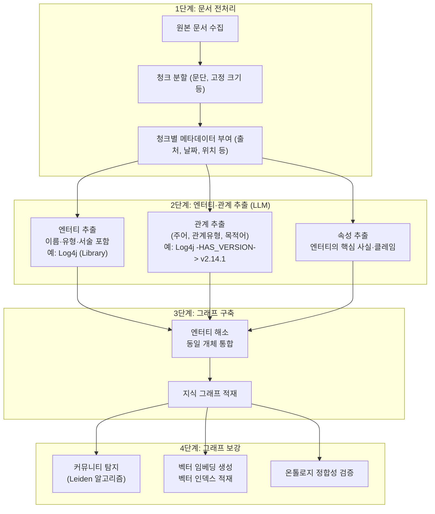
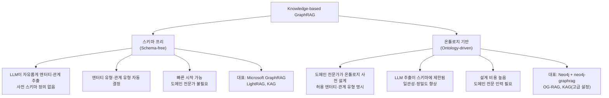
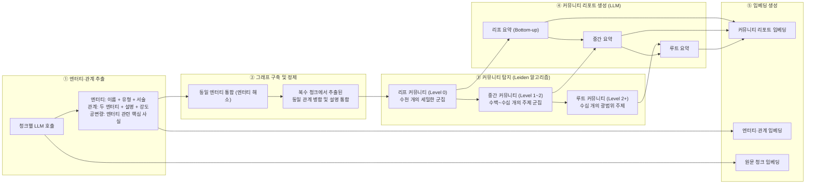
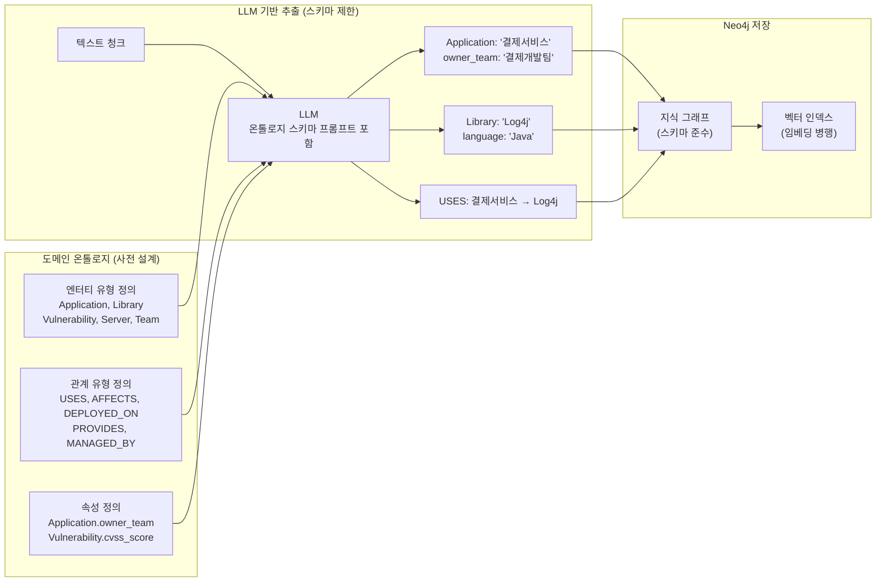
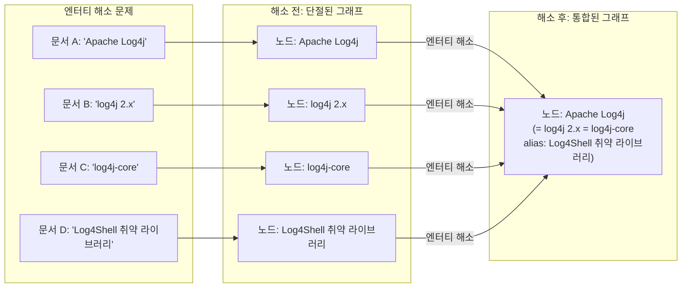
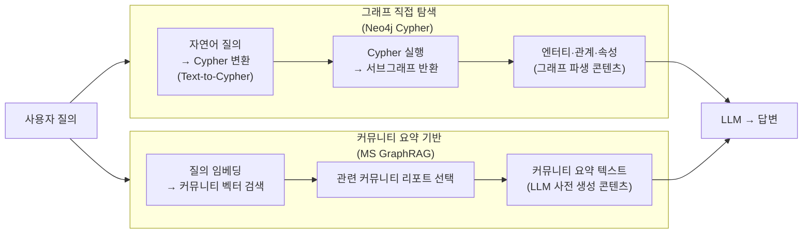
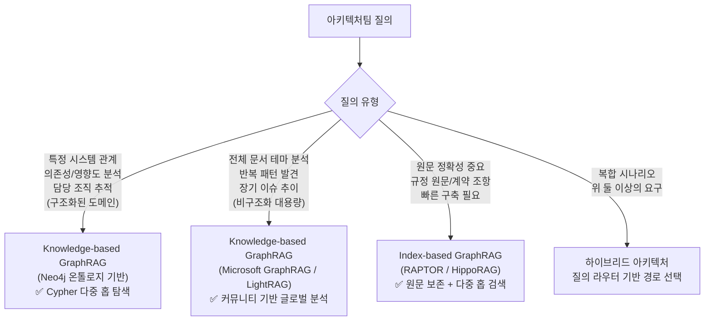

## 그래프를 지식 담체로 활용하는 접근법 — 스키마 프리부터 온톨로지 기반까지

> **아키텍처팀 기술 세미나 — 보조 자료**  
> 원본 문서: Neo4j 기반 GraphRAG를 활용한 Hybrid RAG 시스템 구현  
> 작성일: 2026-05-15

## 참고문서

[**Knowledge-based GraphRAG vs. Index-based GraphRAG**](https://k82022603.github.io/posts/knowledge-based-graphrag-vs.-index-based-graphrag/)

---

## 관련글

- [**RAG 기술 아키텍처 세미나 - (1) Neo4j 기반 GraphRAG를 활용한 Hybrid RAG 시스템 구현**](https://k82022603.github.io/posts/rag-기술-아키텍처-세미나-(1)/)
- [**RAG 기술 아키텍처 세미나 - (2) Index-based GraphRAG 심화 이해**](https://k82022603.github.io/posts/rag-기술-아키텍처-세미나-(2)/)
- **RAG 기술 아키텍처 세미나 - (3) Knowledge-based GraphRAG 심화 이해**
- [**RAG 기술 아키텍처 세미나 - (4) Index-based GraphRAG 기반 Neo4j Hybrid RAG 시스템 구현**](https://k82022603.github.io/posts/rag-기술-아키텍처-세미나-(4)/)
- [**RAG 기술 아키텍처 세미나 - (5) 엔터프라이즈 Hybrid RAG 지식 플랫폼 구축 전략**](https://k82022603.github.io/posts/rag-기술-아키텍처-세미나-(5)/)
- [**RAG 기술 아키텍처 세미나 - (6) 온톨로지로 Knowledge Graph 설계하기**](https://k82022603.github.io/posts/rag-기술-아키텍처-세미나-(6)/)
- [**RAG 기술 아키텍처 세미나 - (7) GraphRAG와 Neo4j로 만드는 지능형 지식 검색**](https://k82022603.github.io/posts/rag-기술-아키텍처-세미나-(7)/)

---

## 목차

1. [Knowledge-based GraphRAG란 무엇인가 — 정확한 정의](#1-knowledge-based-graphrag란-무엇인가--정확한-정의)
2. [핵심 철학 — 그래프가 지식 자체다](#2-핵심-철학--그래프가-지식-자체다)
3. [공통 인덱싱 파이프라인 — 텍스트에서 지식 그래프까지](#3-공통-인덱싱-파이프라인--텍스트에서-지식-그래프까지)
4. [Knowledge-based의 두 계열 — 스키마 프리 vs 온톨로지 기반](#4-knowledge-based의-두-계열--스키마-프리-vs-온톨로지-기반)
5. [대표 구현체 1: Microsoft GraphRAG — 스키마 프리 커뮤니티 탐지형](#5-대표-구현체-1-microsoft-graphrag--스키마-프리-커뮤니티-탐지형)
6. [대표 구현체 2: LightRAG — 이중 레벨 검색과 증분 업데이트 (EMNLP 2025)](#6-대표-구현체-2-lightrag--이중-레벨-검색과-증분-업데이트-emnlp-2025)
7. [대표 구현체 3: KAG — 전문 도메인 특화 (Ant Group, 2024)](#7-대표-구현체-3-kag--전문-도메인-특화-ant-group-2024)
8. [대표 구현체 4: Neo4j 기반 온톨로지 주도 GraphRAG](#8-대표-구현체-4-neo4j-기반-온톨로지-주도-graphrag)
9. [엔터티 추출의 핵심 과제 — LLM 기반 추출과 엔터티 해소](#9-엔터티-추출의-핵심-과제--llm-기반-추출과-엔터티-해소)
10. [검색 방식 비교 — 그래프 탐색 vs 커뮤니티 요약](#10-검색-방식-비교--그래프-탐색-vs-커뮤니티-요약)
11. [비용 구조 — 높은 초기 투자의 현실](#11-비용-구조--높은-초기-투자의-현실)
12. [Index-based GraphRAG와의 결정적 차이 재확인](#12-index-based-graphrag와의-결정적-차이-재확인)
13. [실제 적용 시나리오 — 아키텍처팀 관점](#13-실제-적용-시나리오--아키텍처팀-관점)
14. [한계와 고려사항](#14-한계와-고려사항)
15. [결론 — 지식 구조화의 힘과 비용](#15-결론--지식-구조화의-힘과-비용)

---

## 1. Knowledge-based GraphRAG란 무엇인가 — 정확한 정의

GraphRAG 방법론의 학술 분류를 제시한 서베이 논문(Zhang et al., arXiv:2501.13958, 2025년 1월)은 Knowledge-based GraphRAG를 다음과 같이 정의합니다.

> *"Knowledge-based GraphRAG focuses on transforming unstructured textual documents into explicit and structured Knowledge Graphs (KGs), where nodes represent domain concepts and edges capture semantic relationships between entities."*

이 정의에서 핵심은 **변환(transformation)** 입니다. 원문 텍스트를 그대로 보존하고 검색 인덱스만 추가하는 Index-based와 달리, Knowledge-based는 원문을 명시적인 지식 그래프로 **재구조화**합니다. 노드는 도메인 개념이나 엔터티를 표현하고, 엣지는 그 사이의 의미론적 관계를 포착합니다.

같은 논문이 설명하는 이 접근법의 목적은 다음과 같습니다.

> *"Knowledge-based GraphRAG aims to create a structured knowledge representation for a better understanding of complex relationships with graph-based reasoning capability."*

즉, 단순히 관련 문서를 찾는 것이 아니라, 엔터티 간의 복잡한 관계를 **추론**할 수 있는 구조화된 지식 표현을 만드는 것이 목적입니다.

---

## 2. 핵심 철학 — 그래프가 지식 자체다

Knowledge-based GraphRAG와 전통적 RAG, 그리고 Index-based GraphRAG의 차이는 **무엇을 LLM의 컨텍스트로 제공하는가**에서 가장 명확하게 드러납니다.

```mermaid
flowchart TB
    subgraph Traditional["전통적 벡터 RAG"]
        T1[사용자 질의] --> T2[벡터 유사도 검색]
        T2 --> T3["원문 청크 (상위 K개)\n질의와 유사한 텍스트 그대로"]
        T3 --> T4[LLM → 답변]
    end

    subgraph IndexBased["Index-based GraphRAG (2편 참조)"]
        I1[사용자 질의] --> I2[그래프 탐색으로 관련 청크 안내]
        I2 --> I3["원문 청크\n(그래프는 안내 역할만, 원문 보존)"]
        I3 --> I4[LLM → 답변]
    end

    subgraph KnowledgeBased["Knowledge-based GraphRAG (본 문서)"]
        K1[사용자 질의] --> K2[그래프 탐색 / 커뮤니티 조회]
        K2 --> K3["엔터티 서술 + 관계 설명\n+ 커뮤니티 요약 / 서브그래프\n(그래프에서 파생된 콘텐츠)"]
        K3 --> K4[LLM → 답변]
    end
```



전통적 RAG와 Index-based는 LLM에 **원문 텍스트**를 제공합니다. Knowledge-based는 LLM에 그래프에서 파생된 **구조화된 지식 표현**을 제공합니다. 그래프가 원문을 대체하거나 보완하는 새로운 지식 표현의 주된 형태가 됩니다.

이 철학 때문에 Knowledge-based는 다음과 같은 강점을 갖습니다. 하나의 사실이 여러 문서에 흩어져 있어도 그래프에서는 하나의 노드로 통합됩니다. 여러 관계를 연쇄적으로 따라가는 다중 홉 추론(multi-hop reasoning)이 Cypher 같은 그래프 쿼리로 명시적으로 표현됩니다. 어떤 관계 경로를 통해 답변이 도출되었는지 추적할 수 있어 설명가능성(explainability)이 높습니다.

---

## 3. 공통 인덱싱 파이프라인 — 텍스트에서 지식 그래프까지

구현 방식의 세부 사항은 다르지만, Knowledge-based GraphRAG의 인덱싱 파이프라인은 공통적인 단계를 공유합니다.



모든 Knowledge-based 구현체는 이 파이프라인을 거칩니다. **2단계가 가장 비용이 크고 품질에 결정적입니다.** 모든 청크에 LLM을 호출하여 엔터티와 관계를 추출하기 때문입니다.

---

## 4. Knowledge-based의 두 계열 — 스키마 프리 vs 온톨로지 기반

Knowledge-based GraphRAG는 엔터티와 관계를 추출할 때 사전 정의된 스키마(온톨로지)를 사용하는지 여부에 따라 두 가지 계열로 나뉩니다.



이 두 계열은 목적과 비용 구조가 다릅니다.

**스키마 프리 방식**은 도메인 전문가 없이도 빠르게 시작할 수 있다는 것이 가장 큰 장점입니다. 어떤 유형의 문서에도 적용 가능하며, LLM이 텍스트에서 스스로 중요한 개념과 관계를 발견합니다. 반면 추출 결과의 일관성을 보장하기 어렵고, 같은 개념이 다양한 이름으로 추출되는 엔터티 해소 문제가 발생하기 쉽습니다.

**온톨로지 기반 방식**은 사전에 어떤 엔터티 유형과 관계 유형만 추출할지를 정의합니다. 예를 들어 IT 시스템 도메인에서 `Application`, `Library`, `Vulnerability` 같은 엔터티 유형과 `USES`, `AFFECTS`, `DEPLOYED_ON` 같은 관계 유형만 허용하면, LLM은 이 범위 안에서만 추출합니다. 결과의 일관성이 높고 그래프 품질이 좋지만, 온톨로지를 설계하고 유지하는 데 상당한 도메인 전문성과 시간이 필요합니다.

---

## 5. 대표 구현체 1: Microsoft GraphRAG — 스키마 프리 커뮤니티 탐지형

### 5.1 개요

Microsoft Research가 2024년 4월 논문(Edge et al., arXiv:2404.16130)으로 발표하고 같은 해 7월 오픈소스화한 Microsoft GraphRAG는 Knowledge-based GraphRAG의 가장 영향력 있는 구현체입니다. 공식 GitHub 저장소(github.com/microsoft/graphrag)는 수만 개의 스타를 기록하고 있으며, Microsoft Discovery(Azure 기반 과학연구 에이전틱 플랫폼)에 통합되어 있습니다.

Microsoft GraphRAG가 기존 RAG와 다른 핵심 가치는 **글로벌 질의(global query)** 에 대한 대응입니다. 원논문은 이를 다음과 같이 제시합니다.

> *"RAG fails on global questions directed at an entire text corpus, such as 'What are the main themes in the dataset?', since this is inherently a query-focused summarization (QFS) task, rather than an explicit retrieval task."*

벡터 RAG는 전체 데이터셋을 아우르는 주제를 파악하는 질의에 응답할 수 없습니다. Microsoft GraphRAG는 이 문제를 **커뮤니티 기반 계층적 요약**으로 해결합니다.

### 5.2 인덱싱 파이프라인 상세

Microsoft GraphRAG의 인덱싱은 앞에서 설명한 공통 파이프라인 위에 커뮤니티 탐지와 요약 생성 단계를 추가합니다.



이 파이프라인에서 가장 중요한 특징은 두 가지입니다.

첫째, **LLM이 생성한 풍부한 서술형 텍스트가 노드에 담깁니다.** 전통적 지식 그래프가 `(Log4j, vulnerableIn, v2.14.1)` 같은 간결한 트리플을 사용하는 것과 달리, Microsoft GraphRAG의 엔터티 노드에는 LLM이 작성한 "Apache Log4j는 Java 애플리케이션에서 널리 사용되는 로깅 라이브러리로, 2021년 CVE-2021-44228로 알려진 심각한 원격 코드 실행 취약점이 발견됐다"와 같은 자연어 서술이 들어갑니다. 원논문은 이 점을 명시적으로 언급하며, 이것이 "전형적인 지식 그래프(typical knowledge graphs)"와 구별되는 특성이라고 설명합니다.

둘째, **Leiden 알고리즘**으로 계층적 커뮤니티를 탐지합니다. Leiden 알고리즘(Traag et al., 2019)은 그래프 내 모듈성(modularity)을 최대화하여 밀접하게 연결된 노드들을 같은 커뮤니티로 묶습니다. 이 과정은 LLM 없이 순수한 그래프 알고리즘으로 수행되므로 비용이 거의 들지 않습니다. 각 커뮤니티에 대해 LLM이 생성한 **커뮤니티 리포트(Community Report)** 가 글로벌 질의에 응답하는 핵심 재료가 됩니다.

### 5.3 Local Search와 Global Search

Microsoft GraphRAG는 두 가지 주된 검색 모드를 제공합니다.

**Local Search**는 특정 엔터티나 개념에 관한 질의에 적합합니다. 벡터 검색으로 관련 엔터티를 찾고, 그래프를 통해 인접 엔터티와 관계를 확장하며, 해당 엔터티들이 속한 커뮤니티의 요약으로 컨텍스트를 보강합니다. "Log4j의 주요 취약점과 영향받는 버전을 알려달라"와 같은 질의에 강합니다.

**Global Search**는 전체 데이터셋을 아우르는 통합적 이해가 필요한 질의에 적합합니다. 지정된 커뮤니티 계층의 모든 커뮤니티 리포트에 대해 LLM이 병렬로 부분 답변을 생성하고(Map), 이를 통합하여 최종 답변을 만드는(Reduce) **Map-Reduce** 패턴으로 동작합니다. "지난 5년간 장애 보고서 전체에서 반복되는 근본 원인의 패턴은 무엇인가?"와 같은 질의에 강합니다.

또한 2024년 10월 도입된 **DRIFT Search**는 Global Search의 포괄성과 Local Search의 정밀도를 결합한 방식으로, HyDE(Hypothetical Document Embeddings) 기법으로 질의를 확장한 뒤 커뮤니티 검색과 로컬 탐색을 반복하며 답변을 정교화합니다. 전체 커뮤니티를 일괄 처리하지 않으므로 Global Search보다 비용이 낮으면서도 더 넓은 컨텍스트를 활용합니다.

### 5.4 LazyGraphRAG — 비용 혁신

Microsoft GraphRAG의 최대 약점은 인덱싱 비용입니다. 2024년 11월 Microsoft Research가 발표한 **LazyGraphRAG**는 인덱싱 시점에 LLM을 거의 사용하지 않고 커뮤니티 요약 생성을 질의 시점으로 미루어, 인덱싱 비용을 기존 대비 약 0.1% 수준으로 대폭 절감합니다. Microsoft Research 벤치마크에 따르면 LazyGraphRAG는 Vector RAG 수준의 질의 비용으로 로컬 및 글로벌 질의 모두에서 기존 GraphRAG와 동등하거나 우수한 성능을 보입니다.

---

## 6. 대표 구현체 2: LightRAG — 이중 레벨 검색과 증분 업데이트 (EMNLP 2025)

### 6.1 개요

LightRAG(Guo et al., arXiv:2410.05779, EMNLP 2025)는 홍콩대학교(HKU) 데이터 과학 연구소 팀이 2024년 10월 발표한 Knowledge-based GraphRAG 구현체입니다. 공식 GitHub 저장소(github.com/HKUDS/LightRAG)는 매우 활발하게 개발 중입니다.

LightRAG가 Microsoft GraphRAG에 비해 가지는 두 가지 핵심 차별점은 **이중 레벨 검색(dual-level retrieval)** 과 **증분 업데이트(incremental update)** 입니다.

### 6.2 이중 레벨 검색

LightRAG는 검색을 두 수준에서 동시에 수행합니다.

**저수준(Low-level) 검색**은 특정 엔터티와 그 속성에 대한 구체적인 사실을 찾는 데 집중합니다. 키워드 매칭과 벡터 유사도를 결합하여 특정 개념에 관한 세부 정보를 검색합니다.

**고수준(High-level) 검색**은 여러 엔터티에 걸친 패턴, 테마, 관계 구조를 파악하는 데 집중합니다. 관계 그래프를 탐색하여 광범위한 맥락을 수집합니다.

두 레벨의 검색 결과를 통합하면, 구체적 사실과 넓은 맥락을 동시에 LLM에 제공할 수 있습니다. LightRAG는 이 두 레벨 검색을 `local`, `global`, `hybrid`, `naive` 네 가지 검색 모드로 조합하여 제공합니다.

### 6.3 증분 업데이트

Microsoft GraphRAG의 가장 큰 운영 문제 중 하나는 새로운 문서가 추가될 때 전체 재인덱싱이 필요하다는 점입니다. LightRAG는 이 문제를 **증분 업데이트 알고리즘**으로 해결합니다. 새로운 문서가 추가되면 해당 문서에서 추출한 새로운 엔터티와 관계를 기존 그래프에 병합합니다. 기존 노드와 동일한 개체라면 설명을 업데이트하고, 새로운 엔터티라면 노드를 추가합니다. 전체 그래프를 재구성하지 않아도 됩니다.

이 특성 덕분에 LightRAG는 지속적으로 문서가 추가되거나 갱신되는 환경에서 Microsoft GraphRAG보다 현실적인 선택입니다.

### 6.4 Neo4j 지원

LightRAG는 2024년 11월부터 Neo4j를 스토리지 백엔드로 공식 지원합니다. 기본 스토리지는 경량 벡터 DB와 파일 기반이지만, Neo4j를 선택하면 그래프 탐색 쿼리와 벡터 검색을 동시에 활용할 수 있습니다. LightRAG는 또한 MongoDB를 올인원 스토리지로 사용하는 옵션도 제공합니다(2025년 2월 추가).

---

## 7. 대표 구현체 3: KAG — 전문 도메인 특화 (Ant Group, 2024)

### 7.1 개요와 배경

KAG(Knowledge Augmented Generation, Liang et al., arXiv:2409.13731)는 알리바바 그룹의 핀테크 자회사인 Ant Group의 지식 그래프 팀이 저장대학교와 공동으로 2024년 9월 발표한 전문 도메인 특화 Knowledge-based GraphRAG 프레임워크입니다. 공식 오픈소스 KG 엔진인 OpenSPG(github.com/OpenSPG/openspg)를 기반으로 구현됩니다.

KAG의 출발점은 기존 RAG와 GraphRAG 모두에 공통적인 한계 인식입니다.

> *"RAG has limitations, including the gap between vector similarity and the relevance of knowledge reasoning, as well as insensitivity to knowledge logic, such as numerical values, temporal relations, expert rules."*

벡터 유사도 기반 검색은 의미가 유사한 문서를 찾는 데는 효과적이지만, "이 수치가 저 기준보다 큰가?", "A가 B보다 먼저 발생했는가?", "규정 X의 3항이 적용되려면 어떤 조건이 충족되어야 하는가?"와 같은 논리적 추론이 필요한 질의에는 근본적으로 취약합니다. KAG는 이 문제를 전문 도메인 지식 그래프와 논리적 추론 엔진의 결합으로 해결하려 합니다.

### 7.2 다섯 가지 핵심 개선사항

KAG는 일반 GraphRAG 대비 다섯 가지 핵심 개선을 제안합니다.

**① LLM 친화적 지식 표현(LLM-friendly Knowledge Representation)**: 전통적 지식 그래프의 간결한 트리플 외에 자연어 서술, 수치 속성, 시간 정보, 전문가 규칙을 LLM이 이해하기 쉬운 형태로 함께 표현합니다.

**② 지식 그래프와 원문 청크의 상호 인덱싱(Mutual-indexing)**: 그래프의 각 엔터티와 관계가 어떤 원문 청크에서 추출되었는지를 양방향으로 연결합니다. 이를 통해 그래프 탐색 결과를 원문으로 역추적할 수 있어 답변의 근거를 명확히 제시할 수 있습니다.

**③ 논리 형식 기반 하이브리드 추론 엔진(Logical-form-guided Hybrid Reasoning)**: 자연어 질의를 구조화된 논리 형식으로 변환하고, 이 논리 형식에 따라 그래프 탐색, 청크 검색, 규칙 기반 추론을 조합하여 단계적으로 답을 도출합니다. 단순 단일 쿼리가 아니라 복잡한 추론 체인을 처리합니다.

**④ 의미 추론 기반 지식 정렬(Knowledge Alignment via Semantic Reasoning)**: 여러 소스에서 추출된 지식이 일관성을 유지하도록 의미 추론을 통해 충돌을 탐지하고 정렬합니다.

**⑤ KAG 전용 모델(Model for KAG)**: 일반 LLM보다 지식 그래프 구축과 추론에 더 적합한 특화 모델을 학습합니다.

### 7.3 성능과 적용 사례

KAG는 다중 홉 질의응답 벤치마크에서 기존 방법 대비 HotpotQA F1 19.6%, 2WikiMultiHopQA F1 33.5%의 상대적 향상을 달성했습니다. Ant Group의 실제 업무인 전자정부 Q&A와 전자건강 Q&A에 적용하여 기존 RAG 대비 유의미한 전문성 향상을 보고했습니다(Liang et al., 2024). 의료, 법률, 금융처럼 정확성과 논리적 일관성이 중요한 전문 도메인에 특화되어 있습니다.

---

## 8. 대표 구현체 4: Neo4j 기반 온톨로지 주도 GraphRAG

### 8.1 개요

세미나 시리즈 (1)편에서 다룬 아키텍처팀의 목표 시스템이 바로 이 방식입니다. Neo4j와 `neo4j-graphrag-python` 라이브러리를 기반으로 하며, 사전 설계된 도메인 온톨로지를 LLM 추출의 스키마로 활용합니다.

Neo4j가 Knowledge-based GraphRAG의 그래프 저장소로 적합한 이유는 세 가지입니다.

**Cypher 질의 언어**: 그래프 패턴 매칭에 최적화된 선언적 언어로, 다중 홉 관계 탐색을 직관적으로 표현할 수 있습니다. LLM이 자연어 질의를 Cypher로 변환하는 Text-to-Cypher 파이프라인도 공식 지원됩니다.

**네이티브 그래프 저장(Index-free Adjacency)**: 노드와 관계를 포인터 기반으로 직접 연결하여, 관계형 DB의 조인 연산 없이 그래프 탐색이 포인터 추적만으로 이루어집니다. 복잡한 다중 홉 쿼리에서 성능 이점이 있습니다.

**벡터 인덱스 내장**: Neo4j 5.x부터 벡터 인덱스를 네이티브로 지원하여, Cypher 탐색과 벡터 유사도 검색을 단일 데이터베이스에서 결합할 수 있습니다.

### 8.2 온톨로지 기반 추출 파이프라인

온톨로지 주도 방식의 핵심은 LLM 추출 시 스키마를 제공하는 것입니다.



`neo4j-graphrag-python` 라이브러리는 RDF 온톨로지를 스키마로 직접 전달하는 방식을 공식 지원합니다. 온톨로지는 OWL/RDF 형식으로 Protégé 같은 도구로 작성하고, 이를 파이프라인에 주입하면 LLM이 정의된 범위 내에서만 엔터티와 관계를 추출합니다. deepsense.ai(2025)는 RDF 온톨로지를 `neo4j-graphrag-python`에 직접 연동하는 구체적인 구현 예시를 공개하고 있습니다.

### 8.3 Cypher를 통한 다중 홉 탐색

온톨로지 기반으로 잘 구축된 Neo4j 지식 그래프에서는 Cypher 쿼리 하나로 여러 관계를 연쇄 탐색할 수 있습니다.

```cypher
-- Log4j 취약점에 영향받는 서비스와 담당 팀 탐색 (6단계 다중 홉)
MATCH (lib:Library {name: 'Log4j'})
      -[:HAS_VERSION]->(ver:Version)
      <-[:AFFECTS]-(vuln:Vulnerability)
  , (app:Application)-[:USES]->(lib)
  , (app)-[:DEPLOYED_ON]->(server:Server)
  , (app)-[:PROVIDES]->(svc:Service)
  , (svc)-[:MANAGED_BY]->(team:Team)
WHERE ver.version_number IN ['2.14.1', '2.14.0', '2.13.3']
RETURN
  vuln.cve_id AS cve,
  app.name AS application,
  server.hostname AS server,
  svc.name AS service,
  team.name AS responsible_team
ORDER BY svc.name
```

이 쿼리는 Library → Version → Vulnerability → Application → Server → Service → Team으로 이어지는 6단계 관계를 단일 쿼리로 처리합니다. 동일한 결과를 벡터 기반 RAG로 얻으려면 여러 문서를 순서대로 검색하고 LLM이 이를 종합해야 하며, 정보가 문서에 체계적으로 기록되어 있지 않다면 불가능합니다.

---

## 9. 엔터티 추출의 핵심 과제 — LLM 기반 추출과 엔터티 해소

Knowledge-based GraphRAG의 품질은 엔터티 추출 단계에서 결정됩니다. 이 단계의 두 가지 핵심 과제를 살펴봅니다.

### 9.1 LLM 기반 추출의 특성

전통적 지식 그래프 구축은 도메인 전문가의 수작업 레이블링이 중심이었습니다. 2024~2025년을 거치며 LLM 기반 자동 추출이 생산 수준으로 성숙했고, 이것이 Knowledge-based GraphRAG 붐의 기반이 되었습니다.

LLM 기반 추출의 장점은 Open Information Extraction(OpenIE)—사전 정의된 관계 유형 없이 자유롭게 관계를 추출—과 온톨로지 주도 추출—스키마에 맞는 유형만 추출—을 모두 수행할 수 있다는 점입니다. 단, LLM의 특성상 동일 입력에 대해 항상 동일한 결과를 보장하지 않으며, 텍스트에서 암묵적으로 내포된 관계는 놓칠 수 있습니다.

Qdrant와 Neo4j의 공식 통합 가이드(2025)에서는 LLM 기반 지식 그래프 구축의 한계를 다음과 같이 정리합니다.

> *"Since the LLM is responsible for constructing the knowledge graph, there are risks such as inconsistencies, propagation of biases or errors, and lack of control over the ontology used."*

이 한계를 줄이기 위해 Few-shot 예시를 포함한 잘 설계된 프롬프트, 추출 후 검증 단계, 그리고 온톨로지를 통한 추출 범위 제한이 중요합니다.

### 9.2 엔터티 해소 (Entity Resolution)

Knowledge-based GraphRAG에서 가장 까다로운 실용적 문제는 **엔터티 해소(Entity Resolution)**, 즉 동일한 실세계 개체를 가리키는 서로 다른 표현들을 하나로 통합하는 작업입니다.



해소하지 않으면 그래프가 동일 개체를 가리키는 여러 단절된 노드로 분리되어, 그래프 탐색이 의도대로 동작하지 않습니다.

엔터티 해소의 주요 방법은 세 가지입니다. 첫째, **문자열 매칭**: 규칙 기반으로 대소문자 통일, 접두어·접미어 제거 등을 수행합니다. 단순하지만 변형이 많은 경우 한계가 있습니다. 둘째, **임베딩 유사도**: 두 엔터티 명칭을 임베딩하여 코사인 유사도가 임계값 이상이면 같은 개체로 판단합니다. HippoRAG가 이 방식을 사용합니다. 셋째, **LLM 기반 판단**: 두 엔터티 명칭과 컨텍스트를 LLM에 제공하여 동일 여부를 판단합니다. 가장 정확하지만 비용이 높습니다.

Zhang & Soh(2024)의 EDC(Extract-Define-Canonicalize) 프레임워크는 이 세 단계를 체계적으로 결합하는 파이프라인을 제안합니다.

---

## 10. 검색 방식 비교 — 그래프 탐색 vs 커뮤니티 요약

Knowledge-based GraphRAG의 검색은 구현체에 따라 크게 두 가지 방식으로 이루어집니다.

### 10.1 그래프 직접 탐색 (Neo4j 기반)

Cypher 쿼리 또는 LLM이 생성한 Cypher(Text-to-Cypher)로 그래프를 직접 탐색합니다. 특정 노드에서 출발하여 관계 유형과 방향을 따라 이웃 노드를 탐색합니다.

**장점:** 탐색 경로가 명시적이어서 결과의 근거를 정확히 추적할 수 있습니다. 관계 조건과 속성 필터를 조합한 정밀한 질의가 가능합니다. 단일 쿼리로 복잡한 다중 홉 추론이 가능합니다.

**단점:** LLM이 Cypher를 생성할 때 오류가 발생할 수 있습니다. 복잡한 자연어 질의를 정확한 Cypher로 변환하는 것이 어렵습니다. 온톨로지가 잘 설계되어 있을 때 효과적입니다.

### 10.2 커뮤니티 요약 기반 (Microsoft GraphRAG 방식)

커뮤니티 리포트를 벡터 검색으로 찾거나(Local Search) 전체 조회하여(Global Search) LLM에 제공합니다.

**장점:** 글로벌 질의에 강합니다. Cypher 오류 문제가 없습니다. 자연어 질의를 그대로 활용합니다.

**단점:** 커뮤니티 요약은 인덱싱 시점에 고정되어, 그래프 구조 변경 시 재생성이 필요합니다. 특정 노드와 노드 사이의 정밀한 관계 탐색보다 전체적 패턴 파악에 더 적합합니다.



---

## 11. 비용 구조 — 높은 초기 투자의 현실

Knowledge-based GraphRAG를 도입할 때 가장 현실적으로 검토해야 할 부분이 비용입니다.

### 11.1 단계별 비용 요소

| 비용 항목 | 발생 시점 | 크기 | 비고 |
|---|---|---|---|
| 온톨로지 설계 | 사전 (1회성) | 인건비 | 온톨로지 기반 방식만 해당 |
| 엔터티·관계 추출 LLM 호출 | 인덱싱 | 매우 큼 | 전체 비용의 약 70% |
| 커뮤니티 요약 생성 LLM 호출 | 인덱싱 | 큼 | MS GraphRAG 방식만 해당 (~20%) |
| 임베딩 생성 | 인덱싱 | 중간 | (~7%) |
| 그래프 알고리즘 실행 | 인덱싱 | 미미 | Leiden 알고리즘 (~3%) |
| 글로벌 검색 LLM 호출 | 질의 시마다 | 높음 | MS GraphRAG Global Search |
| 로컬 검색 / Cypher 탐색 | 질의 시마다 | 낮음 | Neo4j Cypher 등 |

Microsoft는 대규모 엔터프라이즈 데이터셋 인덱싱 비용이 수만 달러에 달할 수 있다고 보고했습니다. 3만 2천 단어 분량의 단일 문서 인덱싱에도 약 7달러가 소요됩니다.

### 11.2 방식별 비용 비교

| 방식 | 인덱싱 비용 | 글로벌 질의 비용 | 로컬 질의 비용 |
|---|---|---|---|
| 전통적 Vector RAG | 임베딩만 | 낮음 (기준) | 낮음 |
| Neo4j 온톨로지 기반 | 높음 (LLM 추출) | 해당 없음 | 매우 낮음 (Cypher) |
| Microsoft GraphRAG (Full) | 매우 높음 | 매우 높음 | 중간 |
| LightRAG | 높음 | 중간 | 낮음 |
| **LazyGraphRAG** | **Full의 0.1%** | 중간 | 낮음 |

---

## 12. Index-based GraphRAG와의 결정적 차이 재확인

이 시리즈를 통해 반복적으로 강조되는 핵심 구분선을 다시 한번 명확히 정리합니다.

| 비교 기준 | Knowledge-based GraphRAG | Index-based GraphRAG |
|---|---|---|
| **그래프의 역할** | 지식 담체 (지식 자체를 표현) | 검색 인덱스 (검색 경로 안내) |
| **LLM에 제공되는 것** | 엔터티 서술, 관계, 커뮤니티 요약 (그래프 파생) | 원문 텍스트 청크 (원문 그대로) |
| **원문 보존** | 추상화·변환됨 | 완전 보존 |
| **온톨로지 필요** | 선택적 (스키마 프리 가능) | 불필요 |
| **글로벌 질의 대응** | 강함 (커뮤니티 요약 활용) | 약함 |
| **다중 홉 추론** | 강함 (그래프 탐색) | 중간 (PPR 기반) |
| **원문 정확성** | 원문 손실 가능성 존재 | 원문 그대로 |
| **대표 구현체** | MS GraphRAG, LightRAG, KAG, Neo4j | RAPTOR, HippoRAG, KET-RAG |

**특별 주의사항**: Microsoft GraphRAG는 Knowledge-based입니다. 이전 세미나 자료(2)에서 Index-based로 잘못 분류했으나, 이는 사실과 다릅니다. Microsoft GraphRAG는 엔터티와 관계를 추출하여 지식 그래프를 구성하고, LLM에 원문 청크가 아닌 커뮤니티 요약을 제공하므로 Knowledge-based에 해당합니다.

---

## 13. 실제 적용 시나리오 — 아키텍처팀 관점

### 13.1 Knowledge-based가 유리한 상황

**시나리오 1: 시스템 의존성 영향도 분석**

"Log4j 2.14 버전을 사용하는 서비스 중 외부 노출된 것과 담당 팀은?"이라는 질의는 Library → Version → Vulnerability → Application → Service → Team으로 이어지는 다중 홉 추론이 필요합니다. Neo4j Cypher 탐색으로 이 경로를 명시적으로 추적할 수 있으며, 결과의 근거도 추적 가능합니다.

**시나리오 2: 규정 변경 영향도 분석**

"개인정보보호법 3조가 개정되면 어떤 서비스와 업무 절차가 영향을 받는가?"는 법령 → 서비스 → 업무 절차 → 담당 조직 간의 관계를 따라가는 구조적 탐색입니다. 온톨로지에 `GOVERNED_BY`, `APPLIES_TO` 같은 관계 유형이 정의되어 있다면 단일 Cypher 쿼리로 답변 가능합니다.

**시나리오 3: 비정형 문서의 전체적 주제 분석**

수백 건의 아키텍처 리뷰 문서나 장애 보고서 전체에서 "반복되는 아키텍처 문제의 패턴은 무엇인가?"를 파악하려면 Microsoft GraphRAG의 Global Search 방식이 적합합니다. 개별 문서 검색이 아닌 전체 코퍼스의 커뮤니티 요약을 통해 패턴을 발견합니다.

### 13.2 두 패러다임의 역할 분담



---

## 14. 한계와 고려사항

### 14.1 그래프 품질 의존성

Knowledge-based GraphRAG의 가장 근본적인 한계는 **답변 품질이 그래프 품질에 강하게 의존**한다는 점입니다. 아무리 뛰어난 LLM을 사용해도, 그래프에 잘못된 관계가 있거나 중요한 엔터티가 빠져 있으면 탐색 결과가 부정확해집니다. "모델 성능보다 지식 구조의 품질이 더 결정적"이라는 원칙은 실무에서 반드시 기억해야 합니다.

### 14.2 높은 인덱싱 비용

모든 청크에 LLM을 적용하므로 인덱싱 비용이 높습니다. LazyGraphRAG가 비용을 크게 줄였지만, 온톨로지 기반 방식에서 온톨로지 설계와 검수에 들어가는 인건비는 별도입니다. 소규모 PoC부터 시작하여 가치를 검증한 후 확장하는 전략이 현실적입니다.

### 14.3 데이터 최신성 유지

지식 그래프는 구축 시점의 정보를 담습니다. 시스템이 새로운 서버에 이전되거나, 담당 팀이 바뀌거나, 라이브러리 버전이 업데이트되면 그래프도 함께 갱신되어야 합니다. LightRAG는 증분 업데이트를 지원하지만, Neo4j 기반 온톨로지 방식에서는 별도의 갱신 파이프라인과 주기 정책이 필요합니다.

### 14.4 Text-to-Cypher 정확도

Neo4j 기반 방식에서 자연어 질의를 Cypher로 자동 변환하는 Text-to-Cypher는 간단한 질의에서는 잘 동작하지만, 복잡한 다중 조건이나 부정형 질의에서는 오류가 발생할 수 있습니다(Qdrant 공식 문서, 2025). 이를 줄이기 위해 충분한 Few-shot 예시, 오류 발생 시 재시도 로직, 그리고 생성된 Cypher의 문법 검증 단계가 필요합니다.

### 14.5 한계 요약

| 한계 | 영향도 | 완화 방안 |
|---|---|---|
| 그래프 품질에 강한 의존 | 높음 | 추출 검증 파이프라인 + 정기 감사 |
| 높은 인덱싱 비용 | 높음 | 소규모 시작 + LazyGraphRAG 활용 |
| 데이터 최신성 유지 | 중간 | 자동화된 갱신 파이프라인 구축 |
| 엔터티 해소 어려움 | 중간 | 임베딩 유사도 + LLM 판단 조합 |
| Text-to-Cypher 오류 | 중간 | Few-shot + 검증 + 재시도 로직 |
| 온톨로지 설계 부담 | 높음 (온톨로지 방식) | 소규모 핵심 도메인부터 시작 |

---

## 15. 결론 — 지식 구조화의 힘과 비용

Knowledge-based GraphRAG는 비구조적 텍스트를 명시적인 지식 그래프로 변환하여, 엔터티 간의 복잡한 관계를 구조적으로 탐색할 수 있게 합니다. 이 접근법의 핵심 가치는 세 가지입니다.

첫째, **다중 홉 추론**입니다. A → B → C → D로 이어지는 관계 연쇄를 단일 그래프 쿼리로 처리할 수 있습니다. 둘째, **전역 질의 대응**입니다. 전체 코퍼스를 아우르는 주제와 패턴을 커뮤니티 요약으로 파악할 수 있습니다. 셋째, **설명가능성**입니다. 어떤 노드와 관계 경로를 통해 답변이 도출되었는지 추적할 수 있어 신뢰도가 높습니다.

이 강점의 대가는 **높은 구축 비용과 데이터 품질 유지 부담**입니다. 온톨로지 설계, LLM 기반 추출, 엔터티 해소, 지속적 갱신 파이프라인은 모두 상당한 투자를 요구합니다.

구현체의 선택도 중요합니다. 아키텍처팀처럼 명확한 도메인 구조가 있고 정밀한 관계 탐색이 주된 목적이라면 **Neo4j 온톨로지 기반 방식**이 가장 정확한 결과를 제공합니다. 비구조화된 대용량 문서에서 전체적 패턴을 발견하려면 **Microsoft GraphRAG의 커뮤니티 탐지 방식**이 적합합니다. 지속적인 문서 추가가 있는 환경에서는 **LightRAG의 증분 업데이트**가 유리합니다. 전문 도메인의 논리적 추론이 중요하다면 **KAG** 접근법을 검토할 수 있습니다.

이 시리즈의 전체 흐름에서 Knowledge-based GraphRAG는 BM25, Vector Search와 함께 세 번째 검색 축을 형성합니다. 세 축이 결합될 때, 즉 키워드 정확도(BM25) + 의미 유사도(Vector) + 관계 구조(Knowledge Graph)가 함께 작동할 때 Hybrid RAG 시스템의 완성도가 가장 높아집니다. Knowledge-based GraphRAG는 이 중에서 관계 기반 추론이라는 고유한 영역을 담당합니다.

---

## 참고 자료

1. **Zhang, Q. et al.** (2025). *A Survey of Graph Retrieval-Augmented Generation for Customized Large Language Models.* arXiv:2501.13958. — **Knowledge-based GraphRAG 공식 정의 및 분류 체계.**

2. **Edge, D. et al.** (2024). *From Local to Global: A Graph RAG Approach to Query-Focused Summarization.* Microsoft Research. arXiv:2404.16130. — **Microsoft GraphRAG 원논문.**

3. **Microsoft Research Blog** (2024). *GraphRAG: New tool for complex data discovery now on GitHub.* — Microsoft GraphRAG 오픈소스 발표.

4. **Microsoft Research Blog** (2024). *LazyGraphRAG: Setting a New Standard for Quality and Cost.* — LazyGraphRAG 발표 (2024년 11월).

5. **Microsoft Research Blog** (2024). *Introducing DRIFT Search: Combining Global and Local Search Methods.* — DRIFT Search 발표 (2024년 10월).

6. **Guo, Z. et al.** (2024). *LightRAG: Simple and Fast Retrieval-Augmented Generation.* EMNLP 2025. arXiv:2410.05779. — **이중 레벨 검색 + 증분 업데이트.**

7. **Liang, L. et al.** (2024). *KAG: Boosting LLMs in Professional Domains via Knowledge Augmented Generation.* Ant Group / Zhejiang University. arXiv:2409.13731. — **전문 도메인 특화 Knowledge-based GraphRAG.**

8. **Neo4j.** *neo4j-graphrag-python User Guide.* https://neo4j.com/docs/neo4j-graphrag-python/ — Neo4j 공식 GraphRAG Python 라이브러리 문서.

9. **deepsense.ai** (2025). *Ontology-Driven Knowledge Graph for GraphRAG.* — RDF 온톨로지 기반 Neo4j KG 구축 구현 예시.

10. **Qdrant + Neo4j** (2025). *GraphRAG with Qdrant and Neo4j.* https://qdrant.tech/documentation/examples/graphrag-qdrant-neo4j/ — Qdrant·Neo4j 결합 GraphRAG 구현 가이드.

11. **Traag, V.A., Waltman, L., van Eck, N.J.** (2019). *From Louvain to Leiden: guaranteeing well-connected communities.* Scientific Reports. — **Leiden 알고리즘 원논문.**

12. **RAG vs. GraphRAG: A Systematic Evaluation and Key Insights** (2025). arXiv:2502.11371. — 구현체 간 체계적 비교 평가.

13. **GitHub.** *DEEP-PolyU/Awesome-GraphRAG.* https://github.com/DEEP-PolyU/Awesome-GraphRAG — GraphRAG 논문·프로젝트 목록.

14. **GitHub.** *HKUDS/LightRAG.* https://github.com/HKUDS/LightRAG — LightRAG 공식 구현체.

15. **GitHub.** *OpenSPG/openspg.* https://github.com/OpenSPG/openspg — KAG 기반 OpenSPG KG 엔진.

---

*작성일: 2026-05-15*  
*작성자: 아키텍처팀*  
*관련 문서: RAG 기술 아키텍처 세미나 시리즈*
