## Microsoft GraphRAG × Neo4j × BM25 통합 아키텍처

> **아키텍처팀 기술 세미나 — 보조 자료**  
> 원본 문서: Neo4j 기반 GraphRAG를 활용한 Hybrid RAG 시스템 구현  
> 참조 문서: Index-based GraphRAG 심화 이해  
> 작성일: 2026-05-11

---

## 목차

1. [이 문서의 목적 — Index-based + Neo4j의 결합](#1-이-문서의-목적--index-based--neo4j의-결합)
2. [전체 시스템 개념 지도](#2-전체-시스템-개념-지도)
3. [인덱싱 파이프라인 아키텍처](#3-인덱싱-파이프라인-아키텍처)
4. [Neo4j 내부 그래프 데이터 모델](#4-neo4j-내부-그래프-데이터-모델)
5. [질의 파이프라인 아키텍처 — 세 가지 탐색 방식](#5-질의-파이프라인-아키텍처--세-가지-탐색-방식)
6. [Hybrid RAG 통합 아키텍처 — BM25 + Vector + Community](#6-hybrid-rag-통합-아키텍처--bm25--vector--community)
7. [LazyGraphRAG 변형 아키텍처](#7-lazygraphrag-변형-아키텍처)
8. [질의 유형별 라우팅 설계](#8-질의-유형별-라우팅-설계)
9. [운영 아키텍처 설계](#9-운영-아키텍처-설계)
10. [단계별 구현 전략 — PoC에서 운영까지](#10-단계별-구현-전략--poc에서-운영까지)
11. [Knowledge-based GraphRAG와 병행 활용](#11-knowledge-based-graphrag와-병행-활용)
12. [결론](#12-결론)

---

## 1. 이 문서의 목적 — Index-based + Neo4j의 결합

### 1.1 왜 Index-based GraphRAG에 Neo4j를 더하는가

Microsoft GraphRAG는 기본적으로 결과물을 **Parquet 파일** 형태로 로컬 디스크에 저장합니다. 인덱싱이 끝나면 엔터티, 관계, 커뮤니티 리포트, 텍스트 청크 등이 모두 Parquet 파일 묶음으로 존재합니다. 이 상태에서도 Microsoft 제공 CLI로 질의를 실행할 수 있지만, 엔터프라이즈 환경에서 실제 운영 시스템으로 통합하려면 여러 한계가 있습니다.

- Parquet 파일 기반 저장은 **동시 접근, 분산 조회, 실시간 갱신**에 적합하지 않습니다.
- 그래프 구조의 **시각화 및 탐색** 도구가 제한됩니다.
- BM25나 벡터 검색 결과와 **통합하는 질의 계층**을 별도로 구성해야 합니다.
- 기존 애플리케이션과의 **API 통합**이 어렵습니다.

이 문제를 해결하는 것이 **MS GraphRAG 인덱싱 결과물을 Neo4j로 가져와 그래프 DB를 질의 백엔드로 활용**하는 방식입니다. Neo4j가 그래프 저장소, 벡터 인덱스, 전문 검색 인덱스를 모두 단일 플랫폼에서 제공하기 때문에 Hybrid RAG 통합 지점으로서 자연스럽게 기능합니다.

### 1.2 이 문서에서 다루는 시스템의 전체 정의

이 문서에서 구현하려는 시스템의 정의는 다음과 같습니다.

```
[Index-based GraphRAG 기반 Hybrid RAG 시스템]

= Microsoft GraphRAG 인덱싱 파이프라인
  (자유 엔터티 추출 → Leiden 커뮤니티 탐지 → 커뮤니티 요약 생성)

+ Neo4j 그래프 데이터베이스
  (그래프 저장소 + 벡터 인덱스 + 전문 검색 인덱스 통합)

+ BM25 키워드 검색
  (Neo4j Full-text Index 또는 Elasticsearch)

+ 질의 라우터
  (Local Search / Global Search / DRIFT Search / BM25 동적 선택)

+ LLM 응답 생성
  (커뮤니티 요약 + 그래프 탐색 결과 + 문서 청크 결합)
```

Knowledge-based GraphRAG(Neo4j 기반, 온톨로지 사전 설계)와 달리, 이 시스템은 **도메인 온톨로지 없이도 대규모 비정형 문서에서 커뮤니티 기반 지식 구조를 자동으로 추출**하는 것이 핵심입니다.

---

## 2. 전체 시스템 개념 지도

아래 다이어그램은 이 문서에서 다루는 전체 시스템을 한눈에 나타냅니다. 크게 **인덱싱 영역**과 **질의 영역**으로 구분되고, Neo4j가 두 영역을 연결하는 중앙 저장소 역할을 합니다.

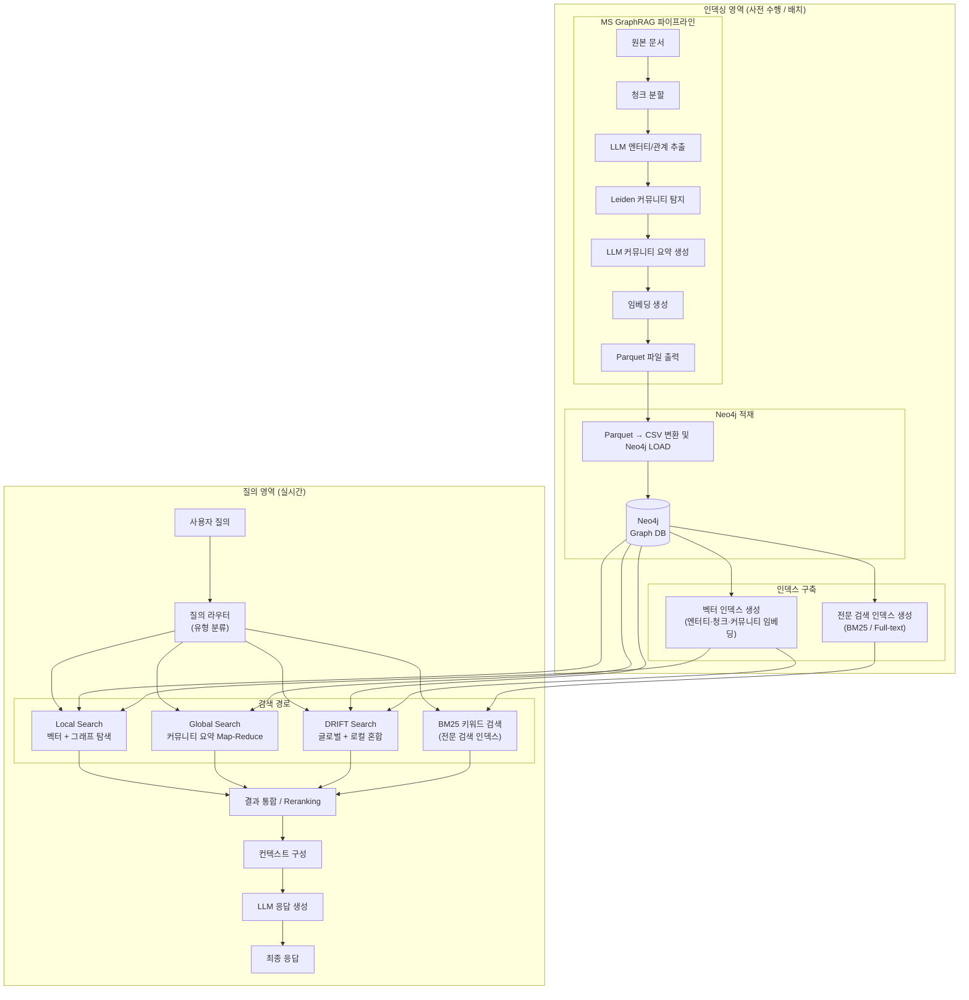
```mermaid
flowchart TB
    subgraph IndexingZone["인덱싱 영역 (사전 수행 / 배치)"]
        direction LR
        subgraph MSGraphRAG["MS GraphRAG 파이프라인"]
            DOCS["원본 문서"]
            CHUNK["청크 분할"]
            EXTRACT["LLM 엔터티/관계 추출"]
            LEIDEN["Leiden 커뮤니티 탐지"]
            SUMMARIZE["LLM 커뮤니티 요약 생성"]
            EMBED_IDX["임베딩 생성"]
            PARQUET["Parquet 파일 출력"]

            DOCS --> CHUNK --> EXTRACT --> LEIDEN --> SUMMARIZE --> EMBED_IDX --> PARQUET
        end

        subgraph Neo4jLoad["Neo4j 적재"]
            IMPORT["Parquet → CSV 변환 및 Neo4j LOAD"]
            NEO4J_STORE[("Neo4j\nGraph DB")]

            IMPORT --> NEO4J_STORE
        end

        subgraph IndexBuild["인덱스 구축"]
            VEC_IDX["벡터 인덱스 생성\n(엔터티·청크·커뮤니티 임베딩)"]
            FT_IDX["전문 검색 인덱스 생성\n(BM25 / Full-text)"]

            NEO4J_STORE --> VEC_IDX
            NEO4J_STORE --> FT_IDX
        end

        PARQUET --> IMPORT
    end

    subgraph QueryZone["질의 영역 (실시간)"]
        direction LR
        USER["사용자 질의"]
        ROUTER["질의 라우터\n(유형 분류)"]

        subgraph SearchPaths["검색 경로"]
            LOCAL["Local Search\n벡터 + 그래프 탐색"]
            GLOBAL["Global Search\n커뮤니티 요약 Map-Reduce"]
            DRIFT["DRIFT Search\n글로벌 + 로컬 혼합"]
            BM25_Q["BM25 키워드 검색\n(전문 검색 인덱스)"]
        end

        MERGE_Q["결과 통합 / Reranking"]
        CTX["컨텍스트 구성"]
        LLM_GEN["LLM 응답 생성"]
        ANSWER["최종 응답"]

        USER --> ROUTER
        ROUTER --> LOCAL
        ROUTER --> GLOBAL
        ROUTER --> DRIFT
        ROUTER --> BM25_Q

        LOCAL --> MERGE_Q
        GLOBAL --> MERGE_Q
        DRIFT --> MERGE_Q
        BM25_Q --> MERGE_Q

        MERGE_Q --> CTX --> LLM_GEN --> ANSWER
    end

    NEO4J_STORE --> LOCAL
    NEO4J_STORE --> GLOBAL
    NEO4J_STORE --> DRIFT
    FT_IDX --> BM25_Q
    VEC_IDX --> LOCAL
    VEC_IDX --> DRIFT
```

---

## 3. 인덱싱 파이프라인 아키텍처

인덱싱은 질의가 들어오기 전에 사전에 수행하는 배치 작업입니다. 이 단계의 품질이 이후 모든 검색 결과의 기반이 됩니다.

### 3.1 MS GraphRAG 인덱싱 단계 상세

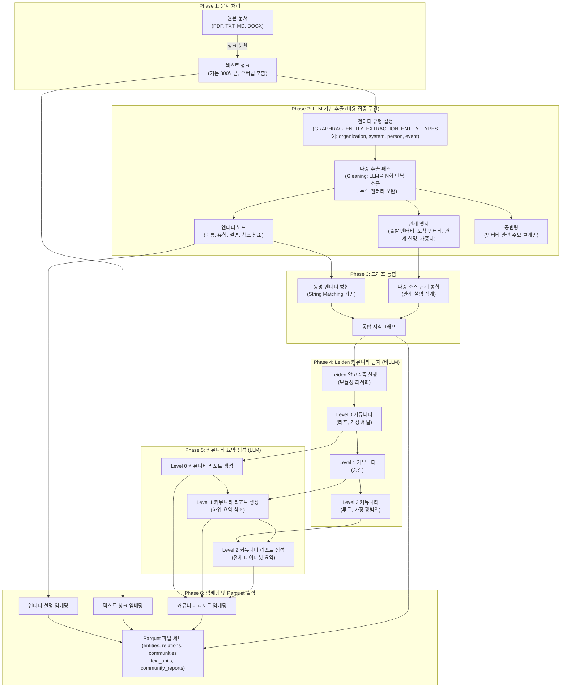
```mermaid
flowchart TB
    subgraph Phase1["Phase 1: 문서 처리"]
        D["원본 문서\n(PDF, TXT, MD, DOCX)"]
        C["텍스트 청크\n(기본 300토큰, 오버랩 포함)"]
        D --> |"청크 분할"| C
    end

    subgraph Phase2["Phase 2: LLM 기반 추출 (비용 집중 구간)"]
        direction TB
        E_TYPES["엔터티 유형 설정\n(GRAPHRAG_ENTITY_EXTRACTION_ENTITY_TYPES\n예: organization, system, person, event)"]
        GLEANING["다중 추출 패스\n(Gleaning: LLM을 N회 반복 호출\n→ 누락 엔터티 보완)"]
        ENT["엔터티 노드\n(이름, 유형, 설명, 청크 참조)"]
        REL["관계 엣지\n(출발 엔터티, 도착 엔터티, 관계 설명, 가중치)"]
        COV["공변량\n(엔터티 관련 주요 클레임)"]

        C --> E_TYPES
        E_TYPES --> GLEANING
        GLEANING --> ENT
        GLEANING --> REL
        GLEANING --> COV
    end

    subgraph Phase3["Phase 3: 그래프 통합"]
        MERGE_E["동명 엔터티 병합\n(String Matching 기반)"]
        MERGE_R["다중 소스 관계 통합\n(관계 설명 집계)"]
        KG["통합 지식그래프"]

        ENT --> MERGE_E --> KG
        REL --> MERGE_R --> KG
    end

    subgraph Phase4["Phase 4: Leiden 커뮤니티 탐지 (비LLM)"]
        LEIDEN_ALG["Leiden 알고리즘 실행\n(모듈성 최적화)"]
        L0["Level 0 커뮤니티\n(리프, 가장 세밀)"]
        L1["Level 1 커뮤니티\n(중간)"]
        L2["Level 2 커뮤니티\n(루트, 가장 광범위)"]

        KG --> LEIDEN_ALG
        LEIDEN_ALG --> L0 --> L1 --> L2
    end

    subgraph Phase5["Phase 5: 커뮤니티 요약 생성 (LLM)"]
        SUM_L0["Level 0 커뮤니티 리포트 생성"]
        SUM_L1["Level 1 커뮤니티 리포트 생성\n(하위 요약 참조)"]
        SUM_L2["Level 2 커뮤니티 리포트 생성\n(전체 데이터셋 요약)"]

        L0 --> SUM_L0
        L1 --> SUM_L1
        L2 --> SUM_L2
        SUM_L0 --> SUM_L1 --> SUM_L2
    end

    subgraph Phase6["Phase 6: 임베딩 및 Parquet 출력"]
        EMBED_E["엔터티 설명 임베딩"]
        EMBED_C["텍스트 청크 임베딩"]
        EMBED_CR["커뮤니티 리포트 임베딩"]
        PARQUET_OUT["Parquet 파일 세트\n(entities, relations, communities\ntext_units, community_reports)"]

        SUM_L0 --> EMBED_CR
        SUM_L1 --> EMBED_CR
        SUM_L2 --> EMBED_CR
        ENT --> EMBED_E
        C --> EMBED_C

        EMBED_E --> PARQUET_OUT
        EMBED_C --> PARQUET_OUT
        EMBED_CR --> PARQUET_OUT
        KG --> PARQUET_OUT
    end
```

### 3.2 비용 최적화 설정 포인트

인덱싱에서 비용이 집중되는 구간은 Phase 2(엔터티 추출)와 Phase 5(커뮤니티 요약)입니다. 이 두 단계의 비용을 제어하는 주요 설정값은 다음과 같습니다.

| 설정 항목 | 역할 | 권장 방향 |
|---|---|---|
| `chunk_size` | 청크 크기 (기본 300토큰) | 도메인에 따라 200~600 조정 |
| `chunk_overlap` | 청크 오버랩 | 보통 chunk_size의 10~30% |
| `entity_types` | 추출할 엔터티 유형 목록 | 도메인 특화 유형으로 좁힐수록 품질↑ 비용↓ |
| `max_gleanings` | 추출 반복 횟수 | 0이면 단일 패스, 클수록 품질↑ 비용↑ |
| `community_level` | 질의에 사용할 계층 (기본 2) | 낮을수록 광범위하고 저렴 |
| `extraction_model` | 추출에 사용할 LLM | gpt-4o-mini 등 저렴한 모델 권장 |
| `summarization_model` | 요약에 사용할 LLM | 추출보다 상위 모델 권장 |

### 3.3 Parquet → Neo4j 적재 흐름

MS GraphRAG 인덱싱 결과물인 Parquet 파일을 Neo4j에 적재하는 과정입니다.

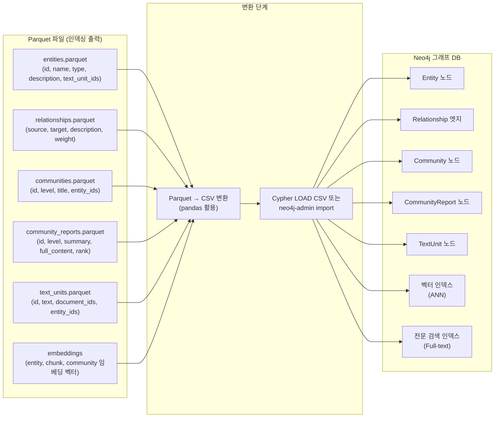
```mermaid
flowchart LR
    subgraph ParquetFiles["Parquet 파일 (인덱싱 출력)"]
        P1["entities.parquet\n(id, name, type, description, text_unit_ids)"]
        P2["relationships.parquet\n(source, target, description, weight)"]
        P3["communities.parquet\n(id, level, title, entity_ids)"]
        P4["community_reports.parquet\n(id, level, summary, full_content, rank)"]
        P5["text_units.parquet\n(id, text, document_ids, entity_ids)"]
        P6["embeddings\n(entity, chunk, community 임베딩 벡터)"]
    end

    subgraph Transform["변환 단계"]
        CSV["Parquet → CSV 변환\n(pandas 활용)"]
        CYPHER_LOAD["Cypher LOAD CSV 또는\nneo4j-admin import"]
    end

    subgraph Neo4jDB["Neo4j 그래프 DB"]
        N1["Entity 노드"]
        N2["Relationship 엣지"]
        N3["Community 노드"]
        N4["CommunityReport 노드"]
        N5["TextUnit 노드"]
        N6["벡터 인덱스\n(ANN)"]
        N7["전문 검색 인덱스\n(Full-text)"]
    end

    P1 --> CSV
    P2 --> CSV
    P3 --> CSV
    P4 --> CSV
    P5 --> CSV
    P6 --> CSV
    CSV --> CYPHER_LOAD

    CYPHER_LOAD --> N1
    CYPHER_LOAD --> N2
    CYPHER_LOAD --> N3
    CYPHER_LOAD --> N4
    CYPHER_LOAD --> N5
    CYPHER_LOAD --> N6
    CYPHER_LOAD --> N7
```

---

## 4. Neo4j 내부 그래프 데이터 모델

Index-based GraphRAG로 구축된 Neo4j 그래프의 노드와 관계 구조는 Knowledge-based GraphRAG와 다릅니다. 도메인 온톨로지 대신 MS GraphRAG의 고유 데이터 모델이 사용됩니다.

### 4.1 노드 유형 및 관계 구조

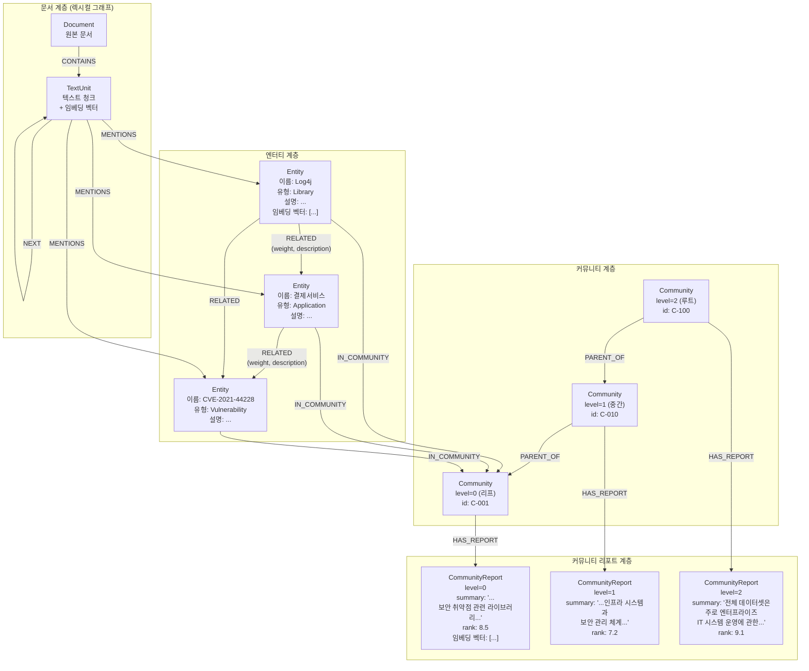
```mermaid
graph TD
    subgraph DocumentLayer["문서 계층 (렉시컬 그래프)"]
        DOC["Document\n원본 문서"]
        TU["TextUnit\n텍스트 청크\n+ 임베딩 벡터"]
        DOC --"CONTAINS"--> TU
        TU --"NEXT"--> TU
    end

    subgraph EntityLayer["엔터티 계층"]
        E1["Entity\n이름: Log4j\n유형: Library\n설명: ...\n임베딩 벡터: [...]"]
        E2["Entity\n이름: 결제서비스\n유형: Application\n설명: ..."]
        E3["Entity\n이름: CVE-2021-44228\n유형: Vulnerability\n설명: ..."]

        E1 --"RELATED\n(weight, description)"-->E2
        E2 --"RELATED\n(weight, description)"--> E3
        E1 --"RELATED"--> E3
    end

    subgraph CommunityLayer["커뮤니티 계층"]
        CL0["Community\nlevel=0 (리프)\nid: C-001"]
        CL1["Community\nlevel=1 (중간)\nid: C-010"]
        CL2["Community\nlevel=2 (루트)\nid: C-100"]

        CL2 --"PARENT_OF"--> CL1
        CL1 --"PARENT_OF"--> CL0
    end

    subgraph ReportLayer["커뮤니티 리포트 계층"]
        CR0["CommunityReport\nlevel=0\nsummary: '...\n보안 취약점 관련 라이브러리...'\nrank: 8.5\n임베딩 벡터: [...]"]
        CR1["CommunityReport\nlevel=1\nsummary: '...인프라 시스템과\n보안 관리 체계...'\nrank: 7.2"]
        CR2["CommunityReport\nlevel=2\nsummary: '전체 데이터셋은\n주로 엔터프라이즈\nIT 시스템 운영에 관한...'\nrank: 9.1"]

        CL0 --"HAS_REPORT"--> CR0
        CL1 --"HAS_REPORT"--> CR1
        CL2 --"HAS_REPORT"--> CR2
    end

    E1 --"IN_COMMUNITY"--> CL0
    E2 --"IN_COMMUNITY"--> CL0
    E3 --"IN_COMMUNITY"--> CL0

    TU --"MENTIONS"--> E1
    TU --"MENTIONS"--> E2
    TU --"MENTIONS"--> E3
```

### 4.2 인덱스 구성

Neo4j 내부에 세 종류의 인덱스가 구성됩니다.

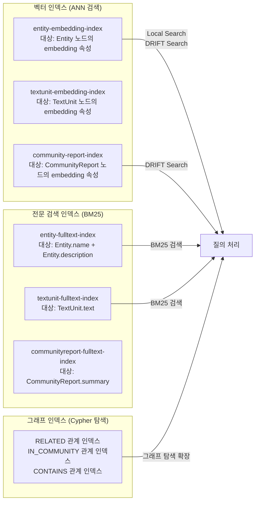
```mermaid
flowchart LR
    subgraph VectorIndexes["벡터 인덱스 (ANN 검색)"]
        VI_E["entity-embedding-index\n대상: Entity 노드의 embedding 속성"]
        VI_T["textunit-embedding-index\n대상: TextUnit 노드의 embedding 속성"]
        VI_C["community-report-index\n대상: CommunityReport 노드의 embedding 속성"]
    end

    subgraph FulltextIndexes["전문 검색 인덱스 (BM25)"]
        FT_E["entity-fulltext-index\n대상: Entity.name + Entity.description"]
        FT_T["textunit-fulltext-index\n대상: TextUnit.text"]
        FT_C["communityreport-fulltext-index\n대상: CommunityReport.summary"]
    end

    subgraph GraphIndex["그래프 인덱스 (Cypher 탐색)"]
        GI["RELATED 관계 인덱스\nIN_COMMUNITY 관계 인덱스\nCONTAINS 관계 인덱스"]
    end

    VI_E --> |"Local Search\nDRIFT Search"| QUERY["질의 처리"]
    VI_C --> |"DRIFT Search"| QUERY
    FT_E --> |"BM25 검색"| QUERY
    FT_T --> |"BM25 검색"| QUERY
    GI --> |"그래프 탐색 확장"| QUERY
```

### 4.3 커뮤니티 계층 구조 예시

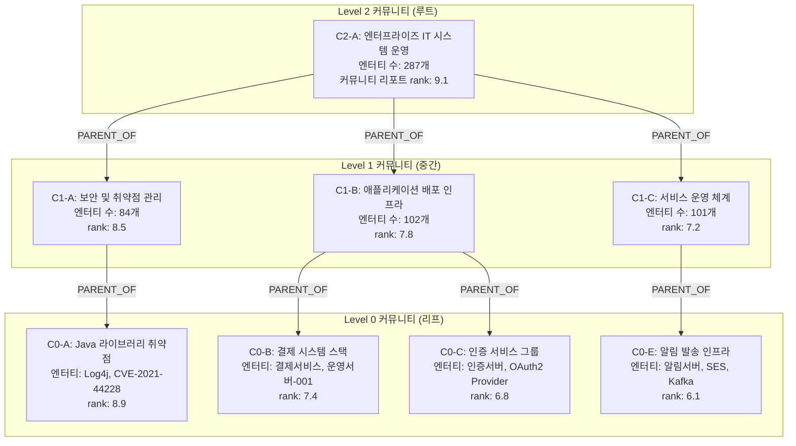
```mermaid
graph TB
    subgraph Level2["Level 2 커뮤니티 (루트)"]
        C2A["C2-A: 엔터프라이즈 IT 시스템 운영\n엔터티 수: 287개\n커뮤니티 리포트 rank: 9.1"]
    end

    subgraph Level1["Level 1 커뮤니티 (중간)"]
        C1A["C1-A: 보안 및 취약점 관리\n엔터티 수: 84개\nrank: 8.5"]
        C1B["C1-B: 애플리케이션 배포 인프라\n엔터티 수: 102개\nrank: 7.8"]
        C1C["C1-C: 서비스 운영 체계\n엔터티 수: 101개\nrank: 7.2"]
    end

    subgraph Level0["Level 0 커뮤니티 (리프)"]
        C0A["C0-A: Java 라이브러리 취약점\n엔터티: Log4j, CVE-2021-44228\nrank: 8.9"]
        C0B["C0-B: 결제 시스템 스택\n엔터티: 결제서비스, 운영서버-001\nrank: 7.4"]
        C0C["C0-C: 인증 서비스 그룹\n엔터티: 인증서버, OAuth2 Provider\nrank: 6.8"]
        C0D["C0-E: 알림 발송 인프라\n엔터티: 알림서버, SES, Kafka\nrank: 6.1"]
    end

    C2A --"PARENT_OF"--> C1A
    C2A --"PARENT_OF"--> C1B
    C2A --"PARENT_OF"--> C1C
    C1A --"PARENT_OF"--> C0A
    C1B --"PARENT_OF"--> C0B
    C1B --"PARENT_OF"--> C0C
    C1C --"PARENT_OF"--> C0D
```

---

## 5. 질의 파이프라인 아키텍처 — 세 가지 탐색 방식

### 5.1 Local Search 아키텍처 — 엔터티 중심 탐색

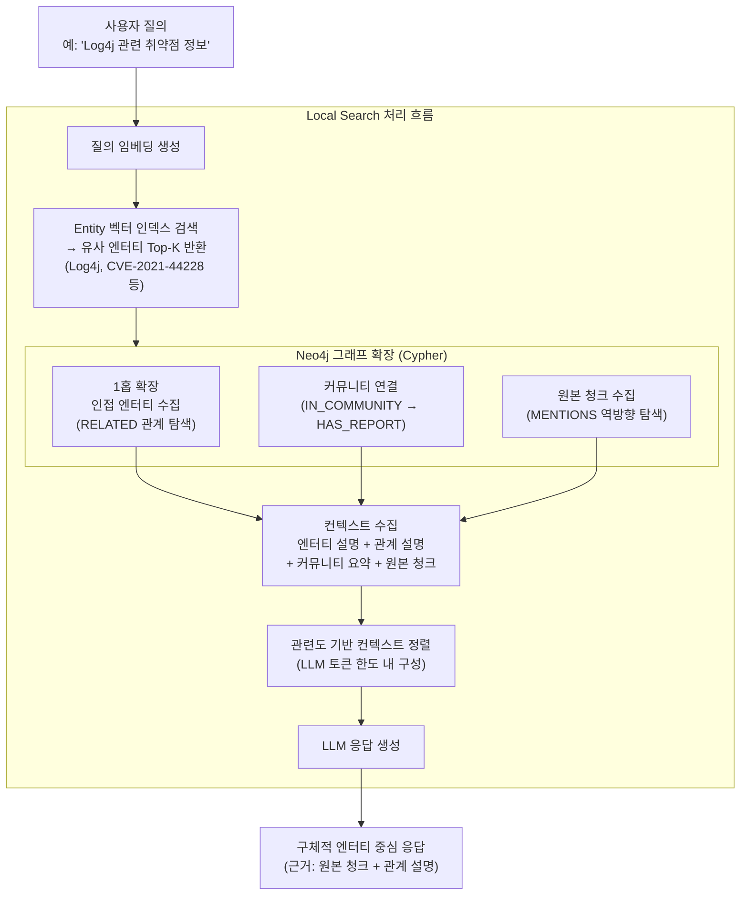
```mermaid
flowchart TB
    Q["사용자 질의\n예: 'Log4j 관련 취약점 정보'"]

    subgraph LocalSearch["Local Search 처리 흐름"]
        direction TB
        EMBED_Q["질의 임베딩 생성"]
        VEC_SEARCH["Entity 벡터 인덱스 검색\n→ 유사 엔터티 Top-K 반환\n(Log4j, CVE-2021-44228 등)"]

        subgraph GraphExpansion["Neo4j 그래프 확장 (Cypher)"]
            direction LR
            HOP1["1홉 확장\n인접 엔터티 수집\n(RELATED 관계 탐색)"]
            HOP2["커뮤니티 연결\n(IN_COMMUNITY → HAS_REPORT)"]
            CHUNKS["원본 청크 수집\n(MENTIONS 역방향 탐색)"]
        end

        GATHER["컨텍스트 수집\n엔터티 설명 + 관계 설명\n+ 커뮤니티 요약 + 원본 청크"]
        RANK_LOCAL["관련도 기반 컨텍스트 정렬\n(LLM 토큰 한도 내 구성)"]
        LLM_LOCAL["LLM 응답 생성"]

        EMBED_Q --> VEC_SEARCH --> GraphExpansion
        HOP1 --> GATHER
        HOP2 --> GATHER
        CHUNKS --> GATHER
        GATHER --> RANK_LOCAL --> LLM_LOCAL
    end

    Q --> EMBED_Q
    LLM_LOCAL --> ANS_LOCAL["구체적 엔터티 중심 응답\n(근거: 원본 청크 + 관계 설명)"]
```

**Local Search의 컨텍스트 구성 요소:**

| 컨텍스트 항목 | 출처 | 역할 |
|---|---|---|
| 엔터티 설명 | Entity.description | 핵심 개체 정보 |
| 관계 설명 | RELATED.description | 개체 간 연결 맥락 |
| 커뮤니티 요약 | CommunityReport.summary | 더 넓은 주제 맥락 |
| 원본 텍스트 청크 | TextUnit.text | 실제 근거 문장 |
| 공변량 정보 | Covariate | 엔터티 관련 클레임 |

### 5.2 Global Search 아키텍처 — Map-Reduce 패턴

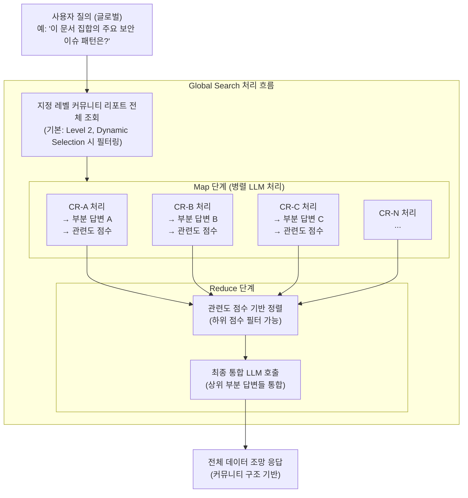
```mermaid
flowchart TB
    Q_G["사용자 질의 (글로벌)\n예: '이 문서 집합의 주요 보안 이슈 패턴은?'"]

    subgraph GlobalSearch["Global Search 처리 흐름"]
        direction TB

        FETCH_CR["지정 레벨 커뮤니티 리포트 전체 조회\n(기본: Level 2, Dynamic Selection 시 필터링)"]

        subgraph MapPhase["Map 단계 (병렬 LLM 처리)"]
            direction LR
            MAP1["CR-A 처리\n→ 부분 답변 A\n→ 관련도 점수"]
            MAP2["CR-B 처리\n→ 부분 답변 B\n→ 관련도 점수"]
            MAP3["CR-C 처리\n→ 부분 답변 C\n→ 관련도 점수"]
            MAPN["CR-N 처리\n..."]
        end

        subgraph ReducePhase["Reduce 단계"]
            SORT["관련도 점수 기반 정렬\n(하위 점수 필터 가능)"]
            REDUCE_LLM["최종 통합 LLM 호출\n(상위 부분 답변들 통합)"]
        end

        FETCH_CR --> MapPhase
        MAP1 --> SORT
        MAP2 --> SORT
        MAP3 --> SORT
        MAPN --> SORT
        SORT --> REDUCE_LLM
    end

    Q_G --> FETCH_CR
    REDUCE_LLM --> ANS_G["전체 데이터 조망 응답\n(커뮤니티 구조 기반)"]
```

**Dynamic Community Selection (동적 커뮤니티 선택)**

전체 커뮤니티 리포트를 모두 LLM에 통과시키는 기본 Global Search는 비용이 큽니다. 2025년 1월 도입된 Dynamic Community Selection은 이를 개선합니다.

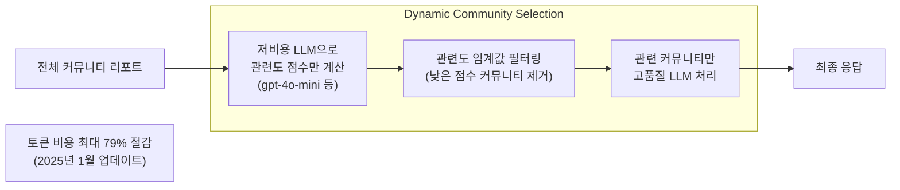
```mermaid
flowchart LR
    ALL_CR["전체 커뮤니티 리포트"]

    subgraph DCS["Dynamic Community Selection"]
        CHEAP_LLM["저비용 LLM으로\n관련도 점수만 계산\n(gpt-4o-mini 등)"]
        THRESHOLD["관련도 임계값 필터링\n(낮은 점수 커뮤니티 제거)"]
        MAIN_LLM["관련 커뮤니티만\n고품질 LLM 처리"]
    end

    ALL_CR --> CHEAP_LLM --> THRESHOLD --> MAIN_LLM --> FINAL["최종 응답"]

    NOTE["토큰 비용 최대 79% 절감\n(2025년 1월 업데이트)"]
```

### 5.3 DRIFT Search 아키텍처 — 글로벌과 로컬의 통합

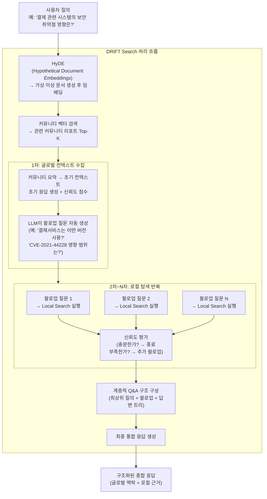
```mermaid
flowchart TB
    Q_D["사용자 질의\n예: '결제 관련 시스템의 보안 취약점 영향은?'"]

    subgraph DRIFTSearch["DRIFT Search 처리 흐름"]
        direction TB

        HYDE["HyDE\n(Hypothetical Document Embeddings)\n→ 가상 이상 문서 생성 후 임베딩"]

        VEC_COMM["커뮤니티 벡터 검색\n→ 관련 커뮤니티 리포트 Top-K"]

        subgraph Primer["1차: 글로벌 컨텍스트 수집"]
            COMM_CTX["커뮤니티 요약 → 초기 컨텍스트\n초기 응답 생성 + 신뢰도 점수"]
            FOLLOW_UP["LLM이 팔로업 질문 자동 생성\n(예: '결제서비스는 어떤 버전 사용?'\n'CVE-2021-44228 영향 범위는?')"]
        end

        subgraph Iteration["2차~N차: 로컬 탐색 반복"]
            direction LR
            LOCAL_1["팔로업 질문 1\n→ Local Search 실행"]
            LOCAL_2["팔로업 질문 2\n→ Local Search 실행"]
            LOCAL_N["팔로업 질문 N\n→ Local Search 실행"]
            CONF_CHECK["신뢰도 평가\n(충분한가? → 종료\n부족한가? → 추가 팔로업)"]
        end

        HIERARCHY["계층적 Q&A 구조 구성\n(최상위 질의 + 팔로업 + 답변 트리)"]
        FINAL_GEN["최종 통합 응답 생성"]

        HYDE --> VEC_COMM --> Primer
        COMM_CTX --> FOLLOW_UP --> Iteration
        LOCAL_1 --> CONF_CHECK
        LOCAL_2 --> CONF_CHECK
        LOCAL_N --> CONF_CHECK
        CONF_CHECK --> HIERARCHY --> FINAL_GEN
    end

    Q_D --> HYDE
    FINAL_GEN --> ANS_D["구조화된 종합 응답\n(글로벌 맥락 + 로컬 근거)"]
```

---

## 6. Hybrid RAG 통합 아키텍처 — BM25 + Vector + Community

세 가지 MS GraphRAG 탐색 방식에 BM25 키워드 검색을 더하면 완전한 Hybrid RAG 시스템이 됩니다. 각 검색 방식은 서로 다른 강점을 가지며 상호 보완합니다.

### 6.1 네 가지 검색 경로의 역할

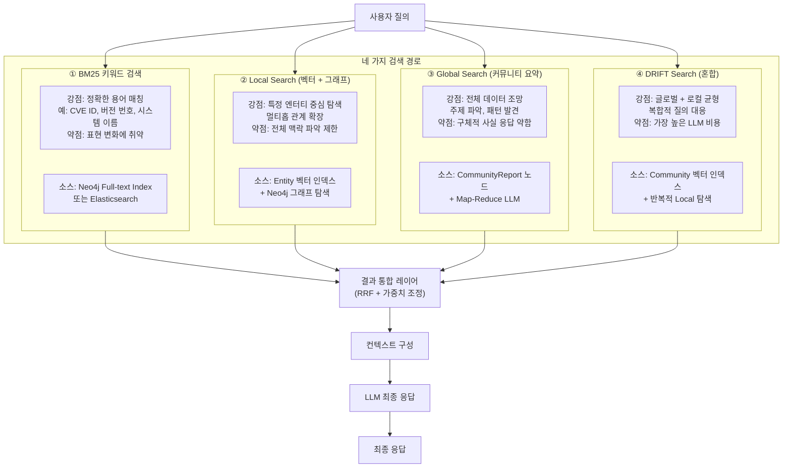
```mermaid
flowchart TB
    Q["사용자 질의"]

    subgraph FourPaths["네 가지 검색 경로"]
        direction TB

        subgraph P_BM25["① BM25 키워드 검색"]
            BM25_DESC["강점: 정확한 용어 매칭\n예: CVE ID, 버전 번호, 시스템 이름\n약점: 표현 변화에 취약"]
            BM25_SRC["소스: Neo4j Full-text Index\n또는 Elasticsearch"]
        end

        subgraph P_LOCAL["② Local Search (벡터 + 그래프)"]
            LOCAL_DESC["강점: 특정 엔터티 중심 탐색\n멀티홉 관계 확장\n약점: 전체 맥락 파악 제한"]
            LOCAL_SRC["소스: Entity 벡터 인덱스\n+ Neo4j 그래프 탐색"]
        end

        subgraph P_GLOBAL["③ Global Search (커뮤니티 요약)"]
            GLOBAL_DESC["강점: 전체 데이터 조망\n주제 파악, 패턴 발견\n약점: 구체적 사실 응답 약함"]
            GLOBAL_SRC["소스: CommunityReport 노드\n+ Map-Reduce LLM"]
        end

        subgraph P_DRIFT["④ DRIFT Search (혼합)"]
            DRIFT_DESC["강점: 글로벌 + 로컬 균형\n복합적 질의 대응\n약점: 가장 높은 LLM 비용"]
            DRIFT_SRC["소스: Community 벡터 인덱스\n+ 반복적 Local 탐색"]
        end
    end

    MERGE_ALL["결과 통합 레이어\n(RRF + 가중치 조정)"]
    CTX_BUILD["컨텍스트 구성"]
    LLM_FINAL["LLM 최종 응답"]

    Q --> P_BM25
    Q --> P_LOCAL
    Q --> P_GLOBAL
    Q --> P_DRIFT

    P_BM25 --> MERGE_ALL
    P_LOCAL --> MERGE_ALL
    P_GLOBAL --> MERGE_ALL
    P_DRIFT --> MERGE_ALL

    MERGE_ALL --> CTX_BUILD --> LLM_FINAL --> RESPONSE["최종 응답"]
```

### 6.2 질의 특성별 검색 경로 가중치

모든 질의에 네 가지 경로를 동일 비중으로 사용하는 것은 비효율적입니다. 질의 특성에 따라 가중치를 동적으로 조정합니다.

| 질의 유형 | BM25 | Local | Global | DRIFT | 예시 |
|---|---|---|---|---|---|
| 정확한 용어 기반 | **높음** | 중간 | 낮음 | 낮음 | "CVE-2021-44228 상세 정보" |
| 특정 엔터티 탐색 | 중간 | **높음** | 낮음 | 낮음 | "Log4j 사용 애플리케이션 목록" |
| 전체 패턴 분석 | 낮음 | 낮음 | **높음** | 중간 | "문서 전체의 보안 이슈 패턴" |
| 복합 관계 분석 | 낮음 | 중간 | 중간 | **높음** | "결제 시스템 보안 취약점 영향 전체" |

### 6.3 Hybrid RAG 통합 아키텍처 전체도

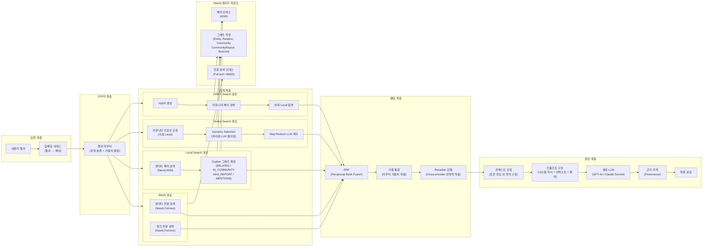
```mermaid
flowchart LR
    subgraph InputLayer["입력 계층"]
        USER_Q["사용자 질의"]
        EMBED_SVC["임베딩 서비스\n(질의 → 벡터)"]
        USER_Q --> EMBED_SVC
    end

    subgraph RouterLayer["라우터 계층"]
        QROUTER["질의 라우터\n(유형 분류 + 가중치 결정)"]
        EMBED_SVC --> QROUTER
    end

    subgraph RetrievalLayer["검색 계층"]
        subgraph BM25_PATH["BM25 경로"]
            BM25_E["엔터티 전문 검색\n(Neo4j Full-text)"]
            BM25_T["청크 전문 검색\n(Neo4j Full-text)"]
        end

        subgraph LOCAL_PATH["Local Search 경로"]
            VEC_E["엔터티 벡터 검색\n(Neo4j ANN)"]
            CYPHER_EXPAND["Cypher 그래프 확장\n(RELATED / IN_COMMUNITY\nHAS_REPORT / MENTIONS)"]
            VEC_E --> CYPHER_EXPAND
        end

        subgraph GLOBAL_PATH["Global Search 경로"]
            ALL_CR_FETCH["커뮤니티 리포트 조회\n(지정 Level)"]
            DYN_SEL["Dynamic Selection\n(저비용 LLM 필터링)"]
            MAP_REDUCE["Map-Reduce LLM 처리"]
            ALL_CR_FETCH --> DYN_SEL --> MAP_REDUCE
        end

        subgraph DRIFT_PATH["DRIFT Search 경로"]
            HYDE_GEN["HyDE 생성"]
            COMM_VEC["커뮤니티 벡터 검색"]
            ITER_LOCAL["반복 Local 탐색"]
            HYDE_GEN --> COMM_VEC --> ITER_LOCAL
        end

        QROUTER --> BM25_PATH
        QROUTER --> LOCAL_PATH
        QROUTER --> GLOBAL_PATH
        QROUTER --> DRIFT_PATH
    end

    subgraph FusionLayer["결합 계층"]
        RRF["RRF\n(Reciprocal Rank Fusion)"]
        WEIGHT["가중 통합\n(라우터 가중치 적용)"]
        RERANK["Reranker 모델\n(Cross-encoder 선택적 적용)"]

        BM25_E --> RRF
        BM25_T --> RRF
        CYPHER_EXPAND --> RRF
        MAP_REDUCE --> RRF
        ITER_LOCAL --> RRF
        RRF --> WEIGHT --> RERANK
    end

    subgraph GenerationLayer["생성 계층"]
        CTX_ASSEMBLE["컨텍스트 조립\n(토큰 한도 내 최적 구성)"]
        PROMPT_BUILD["프롬프트 구성\n(시스템 지시 + 컨텍스트 + 질의)"]
        GEN_LLM["생성 LLM\n(GPT-4o / Claude Sonnet)"]
        PROV["근거 추적\n(Provenance)"]

        RERANK --> CTX_ASSEMBLE --> PROMPT_BUILD --> GEN_LLM
        GEN_LLM --> PROV --> FINAL_ANS["최종 응답"]
    end

    subgraph Neo4jStorage["Neo4j 데이터 저장소"]
        GRAPH_STORE["그래프 저장\n(Entity, Relation, Community\nCommunityReport, TextUnit)"]
        VEC_STORE["벡터 인덱스\n(ANN)"]
        FT_STORE["전문 검색 인덱스\n(Full-text / BM25)"]
    end

    LOCAL_PATH --> GRAPH_STORE
    LOCAL_PATH --> VEC_STORE
    BM25_PATH --> FT_STORE
    GLOBAL_PATH --> GRAPH_STORE
    DRIFT_PATH --> VEC_STORE
    DRIFT_PATH --> GRAPH_STORE
```

---

## 7. LazyGraphRAG 변형 아키텍처

### 7.1 LazyGraphRAG가 인덱싱 단계를 어떻게 바꾸는가

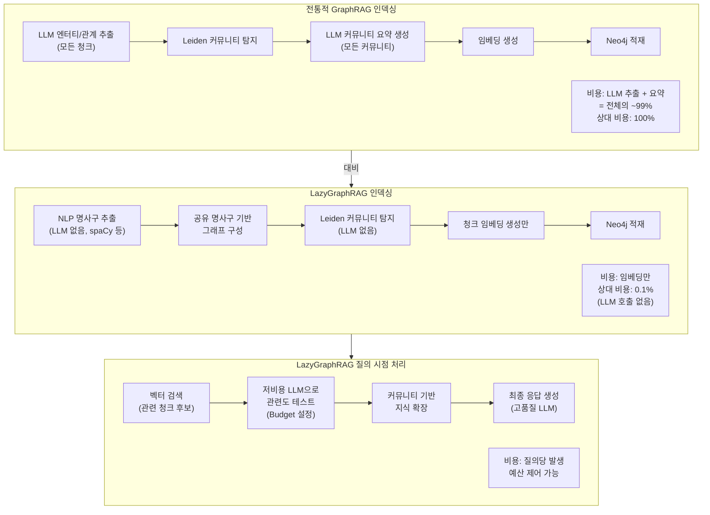
```mermaid
flowchart TB
    subgraph TraditionalIndexing["전통적 GraphRAG 인덱싱"]
        direction LR
        TI1["LLM 엔터티/관계 추출\n(모든 청크)"]
        TI2["Leiden 커뮤니티 탐지"]
        TI3["LLM 커뮤니티 요약 생성\n(모든 커뮤니티)"]
        TI4["임베딩 생성"]
        TI5["Neo4j 적재"]

        TI1 --> TI2 --> TI3 --> TI4 --> TI5

        COST1["비용: LLM 추출 + 요약\n= 전체의 ~99%\n상대 비용: 100%"]
    end

    subgraph LazyIndexing["LazyGraphRAG 인덱싱"]
        direction LR
        LI1["NLP 명사구 추출\n(LLM 없음, spaCy 등)"]
        LI2["공유 명사구 기반\n그래프 구성"]
        LI3["Leiden 커뮤니티 탐지\n(LLM 없음)"]
        LI4["청크 임베딩 생성만"]
        LI5["Neo4j 적재"]

        LI1 --> LI2 --> LI3 --> LI4 --> LI5

        COST2["비용: 임베딩만\n상대 비용: 0.1%\n(LLM 호출 없음)"]
    end

    subgraph LazyQuery["LazyGraphRAG 질의 시점 처리"]
        direction LR
        LQ1["벡터 검색\n(관련 청크 후보)"]
        LQ2["저비용 LLM으로\n관련도 테스트\n(Budget 설정)"]
        LQ3["커뮤니티 기반\n지식 확장"]
        LQ4["최종 응답 생성\n(고품질 LLM)"]

        LQ1 --> LQ2 --> LQ3 --> LQ4

        COST3["비용: 질의당 발생\n예산 제어 가능"]
    end

    TraditionalIndexing --> |"대비"| LazyIndexing
    LazyIndexing --> LazyQuery
```

### 7.2 LazyGraphRAG 적용 시 Neo4j 저장 구조 변화

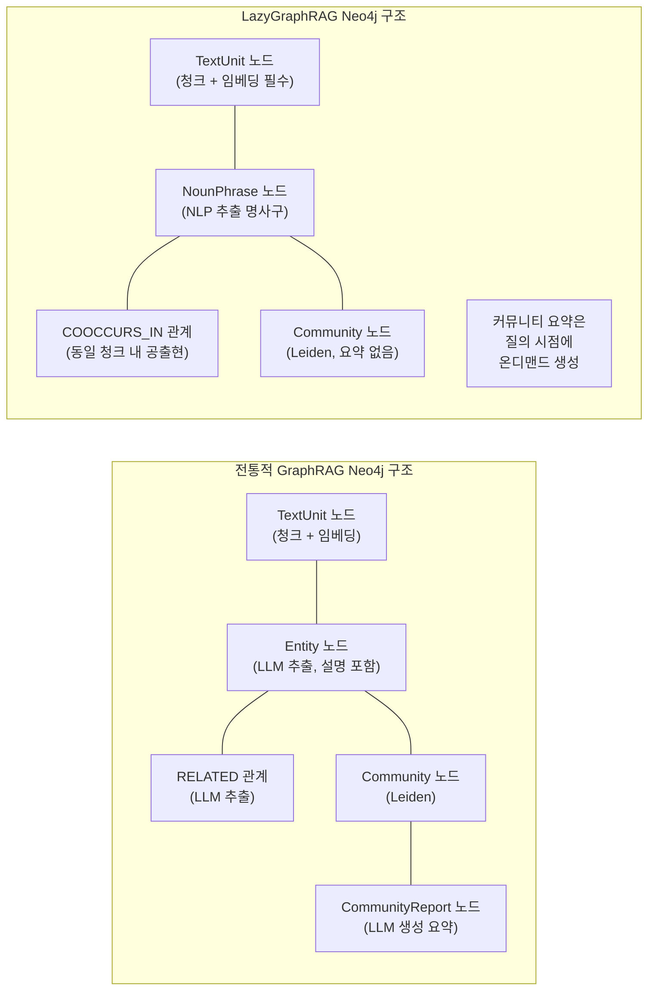
```mermaid
flowchart LR
    subgraph TraditionalNeo4j["전통적 GraphRAG Neo4j 구조"]
        T_ENT["Entity 노드\n(LLM 추출, 설명 포함)"]
        T_REL["RELATED 관계\n(LLM 추출)"]
        T_COMM["Community 노드\n(Leiden)"]
        T_RPT["CommunityReport 노드\n(LLM 생성 요약)"]
        T_TU["TextUnit 노드\n(청크 + 임베딩)"]
        T_ENT --- T_REL
        T_ENT --- T_COMM --- T_RPT
        T_TU --- T_ENT
    end

    subgraph LazyNeo4j["LazyGraphRAG Neo4j 구조"]
        L_NOUN["NounPhrase 노드\n(NLP 추출 명사구)"]
        L_CO["COOCCURS_IN 관계\n(동일 청크 내 공출현)"]
        L_COMM["Community 노드\n(Leiden, 요약 없음)"]
        L_TU["TextUnit 노드\n(청크 + 임베딩 필수)"]
        L_NOUN --- L_CO
        L_NOUN --- L_COMM
        L_TU --- L_NOUN

        NOTE_L["커뮤니티 요약은\n질의 시점에\n온디맨드 생성"]
    end
```

### 7.3 LazyGraphRAG 질의 파이프라인

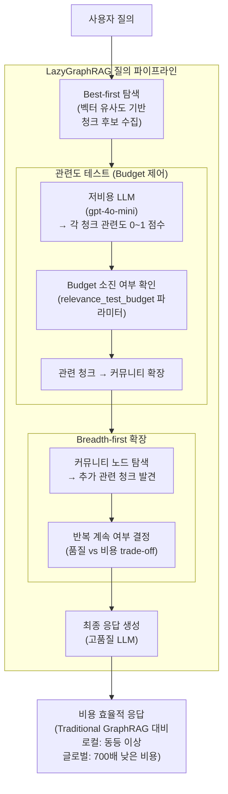
```mermaid
flowchart TB
    Q_LAZY["사용자 질의"]

    subgraph LazyQueryPipeline["LazyGraphRAG 질의 파이프라인"]
        direction TB

        BEST_FIRST["Best-first 탐색\n(벡터 유사도 기반\n청크 후보 수집)"]

        subgraph BudgetedTest["관련도 테스트 (Budget 제어)"]
            CHEAP["저비용 LLM\n(gpt-4o-mini)\n→ 각 청크 관련도 0~1 점수"]
            BUDGET_CHECK["Budget 소진 여부 확인\n(relevance_test_budget 파라미터)"]
            EXPAND["관련 청크 → 커뮤니티 확장"]

            CHEAP --> BUDGET_CHECK --> EXPAND
        end

        subgraph BreadthFirst["Breadth-first 확장"]
            COMM_EXPAND["커뮤니티 노드 탐색\n→ 추가 관련 청크 발견"]
            ITER_CHECK["반복 계속 여부 결정\n(품질 vs 비용 trade-off)"]
            COMM_EXPAND --> ITER_CHECK
        end

        FINAL_GEN["최종 응답 생성\n(고품질 LLM)"]

        BEST_FIRST --> BudgetedTest
        EXPAND --> BreadthFirst
        ITER_CHECK --> FINAL_GEN
    end

    Q_LAZY --> BEST_FIRST
    FINAL_GEN --> ANS_LAZY["비용 효율적 응답\n(Traditional GraphRAG 대비\n로컬: 동등 이상\n글로벌: 700배 낮은 비용)"]
```

---

## 8. 질의 유형별 라우팅 설계

### 8.1 라우터 판단 기준

질의 라우터는 들어오는 질의를 분석하여 최적의 검색 경로를 선택합니다. 분류는 두 가지 차원으로 이루어집니다.

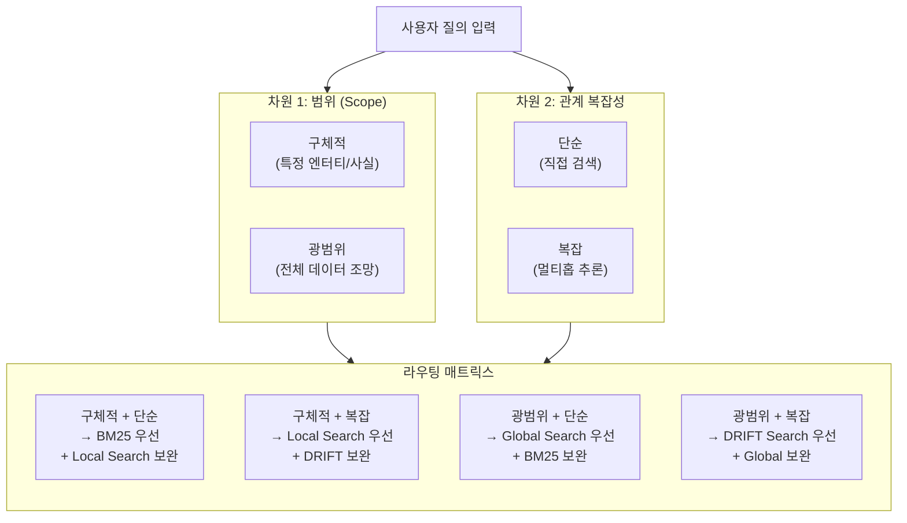
```mermaid
flowchart TB
    Q_INPUT["사용자 질의 입력"]

    subgraph Dim1["차원 1: 범위 (Scope)"]
        direction LR
        SPEC["구체적\n(특정 엔터티/사실)"]
        BROAD["광범위\n(전체 데이터 조망)"]
    end

    subgraph Dim2["차원 2: 관계 복잡성"]
        direction LR
        SIMPLE["단순\n(직접 검색)"]
        COMPLEX["복잡\n(멀티홉 추론)"]
    end

    subgraph RoutingMatrix["라우팅 매트릭스"]
        direction TB

        CELL_SS["구체적 + 단순\n→ BM25 우선\n+ Local Search 보완"]
        CELL_SC["구체적 + 복잡\n→ Local Search 우선\n+ DRIFT 보완"]
        CELL_BS["광범위 + 단순\n→ Global Search 우선\n+ BM25 보완"]
        CELL_BC["광범위 + 복잡\n→ DRIFT Search 우선\n+ Global 보완"]
    end

    Q_INPUT --> Dim1
    Q_INPUT --> Dim2
    Dim1 --> RoutingMatrix
    Dim2 --> RoutingMatrix
```

### 8.2 라우팅 판단 흐름도

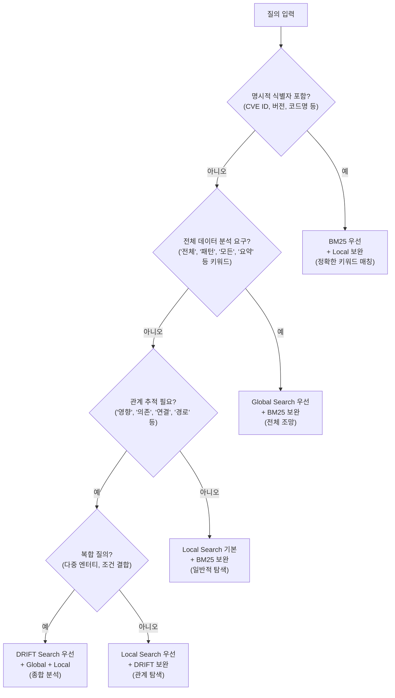
```mermaid
flowchart TD
    Q["질의 입력"]

    A{"명시적 식별자 포함?\n(CVE ID, 버전, 코드명 등)"}
    B{"전체 데이터 분석 요구?\n('전체', '패턴', '모든', '요약' 등 키워드)"}
    C{"관계 추적 필요?\n('영향', '의존', '연결', '경로' 등)"}
    D{"복합 질의?\n(다중 엔터티, 조건 결합)"}

    R1["BM25 우선\n+ Local 보완\n(정확한 키워드 매칭)"]
    R2["Global Search 우선\n+ BM25 보완\n(전체 조망)"]
    R3["Local Search 우선\n+ DRIFT 보완\n(관계 탐색)"]
    R4["DRIFT Search 우선\n+ Global + Local\n(종합 분석)"]
    R5["Local Search 기본\n+ BM25 보완\n(일반적 탐색)"]

    Q --> A
    A --> |"예"| R1
    A --> |"아니오"| B
    B --> |"예"| R2
    B --> |"아니오"| C
    C --> |"예"| D
    C --> |"아니오"| R5
    D --> |"예"| R4
    D --> |"아니오"| R3
```

### 8.3 라우팅 예시 — 아키텍처팀 실무 질의

| 질의 예시 | 분류 | 선택 경로 |
|---|---|---|
| "CVE-2021-44228 영향받는 버전은?" | 구체적+단순 | **BM25** → Local 보완 |
| "Log4j 사용 애플리케이션의 배포 서버는?" | 구체적+복잡 | **Local Search** → DRIFT 보완 |
| "장애 보고서 전체에서 반복되는 원인 패턴은?" | 광범위+단순 | **Global Search** |
| "결제 시스템과 연관된 보안 취약점의 전체 영향 범위는?" | 광범위+복잡 | **DRIFT Search** |
| "우리 아키텍처 문서의 주요 의존성 리스크는?" | 광범위+복잡 | **DRIFT Search** |

---

## 9. 운영 아키텍처 설계

### 9.1 전체 운영 컴포넌트 구성

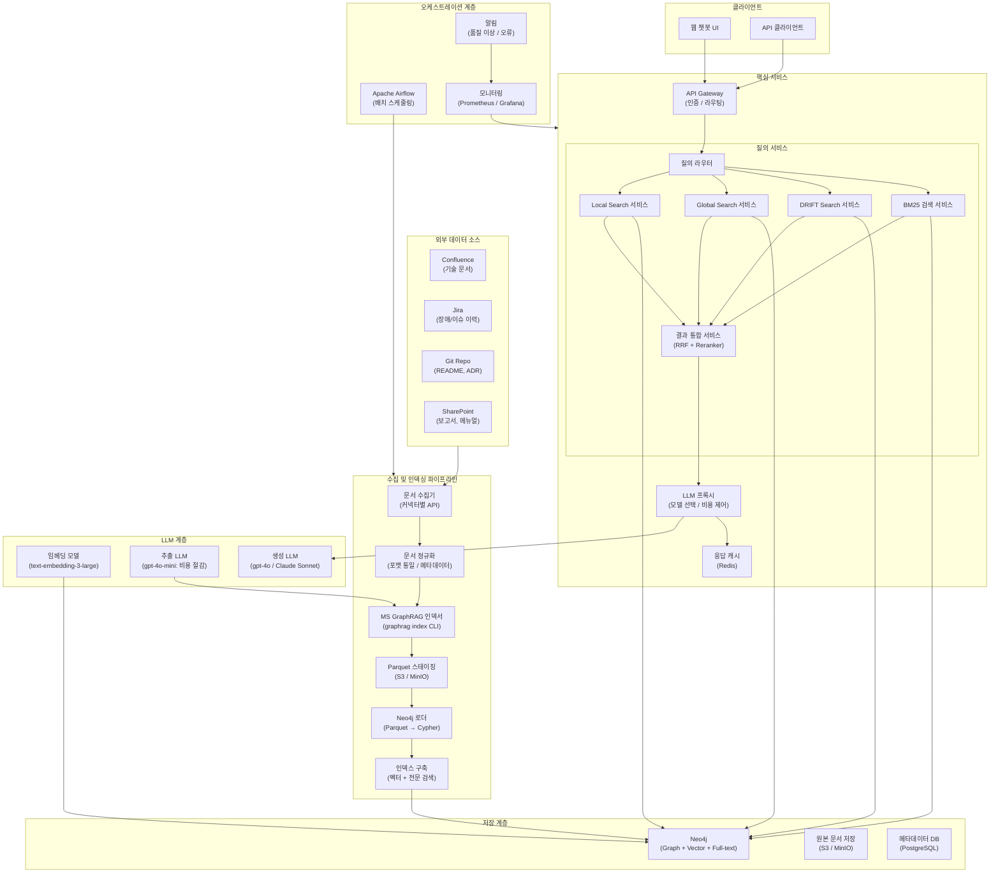
```mermaid
flowchart TB
    subgraph ExternalSystems["외부 데이터 소스"]
        direction LR
        CONFLU["Confluence\n(기술 문서)"]
        JIRA["Jira\n(장애/이슈 이력)"]
        GIT["Git Repo\n(README, ADR)"]
        SHARE["SharePoint\n(보고서, 메뉴얼)"]
    end

    subgraph IngestionPipeline["수집 및 인덱싱 파이프라인"]
        direction TB
        COLLECTOR["문서 수집기\n(커넥터별 API)"]
        NORMALIZER["문서 정규화\n(포맷 통일 / 메타데이터)"]
        MSRAG_RUNNER["MS GraphRAG 인덱서\n(graphrag index CLI)"]
        PARQUET_STAGE["Parquet 스테이징\n(S3 / MinIO)"]
        NEO4J_LOADER["Neo4j 로더\n(Parquet → Cypher)"]
        IDX_BUILDER["인덱스 구축\n(벡터 + 전문 검색)"]

        COLLECTOR --> NORMALIZER --> MSRAG_RUNNER --> PARQUET_STAGE --> NEO4J_LOADER --> IDX_BUILDER
    end

    subgraph OrchestrationLayer["오케스트레이션 계층"]
        AIRFLOW["Apache Airflow\n(배치 스케줄링)"]
        MONITOR["모니터링\n(Prometheus / Grafana)"]
        ALERT["알림\n(품질 이상 / 오류)"]
    end

    subgraph CoreServices["핵심 서비스"]
        direction TB
        API_GW["API Gateway\n(인증 / 라우팅)"]

        subgraph QueryService["질의 서비스"]
            Q_ROUTER["질의 라우터"]
            LOCAL_SVC["Local Search 서비스"]
            GLOBAL_SVC["Global Search 서비스"]
            DRIFT_SVC["DRIFT Search 서비스"]
            BM25_SVC["BM25 검색 서비스"]
            FUSION_SVC["결과 통합 서비스\n(RRF + Reranker)"]
        end

        LLM_PROXY["LLM 프록시\n(모델 선택 / 비용 제어)"]
        CACHE["응답 캐시\n(Redis)"]
    end

    subgraph StorageLayer["저장 계층"]
        NEO4J_PROD["Neo4j\n(Graph + Vector + Full-text)"]
        RAW_STORE["원본 문서 저장\n(S3 / MinIO)"]
        METADATA_DB["메타데이터 DB\n(PostgreSQL)"]
    end

    subgraph LLMLayer["LLM 계층"]
        EMBED_MODEL["임베딩 모델\n(text-embedding-3-large)"]
        EXT_MODEL["추출 LLM\n(gpt-4o-mini: 비용 절감)"]
        GEN_MODEL["생성 LLM\n(gpt-4o / Claude Sonnet)"]
    end

    subgraph ClientLayer["클라이언트"]
        WEB_UI["웹 챗봇 UI"]
        API_CLI["API 클라이언트"]
    end

    ExternalSystems --> COLLECTOR
    AIRFLOW --> IngestionPipeline
    IDX_BUILDER --> NEO4J_PROD

    WEB_UI --> API_GW
    API_CLI --> API_GW
    API_GW --> Q_ROUTER

    Q_ROUTER --> LOCAL_SVC
    Q_ROUTER --> GLOBAL_SVC
    Q_ROUTER --> DRIFT_SVC
    Q_ROUTER --> BM25_SVC

    LOCAL_SVC --> FUSION_SVC
    GLOBAL_SVC --> FUSION_SVC
    DRIFT_SVC --> FUSION_SVC
    BM25_SVC --> FUSION_SVC

    FUSION_SVC --> LLM_PROXY --> GEN_MODEL
    LOCAL_SVC --> NEO4J_PROD
    GLOBAL_SVC --> NEO4J_PROD
    DRIFT_SVC --> NEO4J_PROD
    BM25_SVC --> NEO4J_PROD

    EMBED_MODEL --> NEO4J_PROD
    EXT_MODEL --> MSRAG_RUNNER

    LLM_PROXY --> CACHE
    MONITOR --> CoreServices
    ALERT --> MONITOR
```

### 9.2 데이터 갱신 주기 설계

Index-based GraphRAG의 갱신 전략은 재인덱싱 비용을 고려하여 설계해야 합니다.

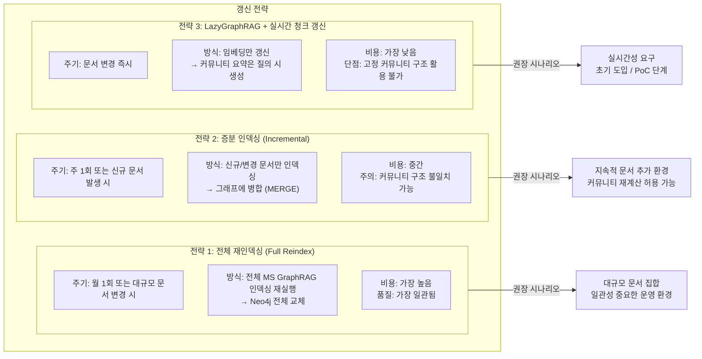
```mermaid
flowchart LR
    subgraph UpdateStrategy["갱신 전략"]
        direction TB

        subgraph Strategy1["전략 1: 전체 재인덱싱 (Full Reindex)"]
            FR_WHEN["주기: 월 1회 또는 대규모 문서 변경 시"]
            FR_HOW["방식: 전체 MS GraphRAG 인덱싱 재실행\n→ Neo4j 전체 교체"]
            FR_COST["비용: 가장 높음\n품질: 가장 일관됨"]
        end

        subgraph Strategy2["전략 2: 증분 인덱싱 (Incremental)"]
            INC_WHEN["주기: 주 1회 또는 신규 문서 발생 시"]
            INC_HOW["방식: 신규/변경 문서만 인덱싱\n→ 그래프에 병합 (MERGE)"]
            INC_COST["비용: 중간\n주의: 커뮤니티 구조 불일치 가능"]
        end

        subgraph Strategy3["전략 3: LazyGraphRAG + 실시간 청크 갱신"]
            LZ_WHEN["주기: 문서 변경 즉시"]
            LZ_HOW["방식: 임베딩만 갱신\n→ 커뮤니티 요약은 질의 시 생성"]
            LZ_COST["비용: 가장 낮음\n단점: 고정 커뮤니티 구조 활용 불가"]
        end
    end

    Strategy1 --> |"권장 시나리오"| S1_REC["대규모 문서 집합\n일관성 중요한 운영 환경"]
    Strategy2 --> |"권장 시나리오"| S2_REC["지속적 문서 추가 환경\n커뮤니티 재계산 허용 가능"]
    Strategy3 --> |"권장 시나리오"| S3_REC["실시간성 요구\n초기 도입 / PoC 단계"]
```

---

## 10. 단계별 구현 전략 — PoC에서 운영까지

### 10.1 4단계 구현 로드맵

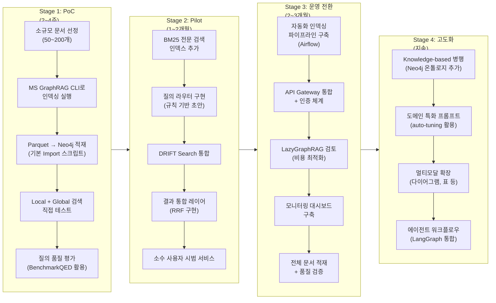
```mermaid
flowchart LR
    subgraph Stage1["Stage 1: PoC\n(2~4주)"]
        S1A["소규모 문서 선정\n(50~200개)"]
        S1B["MS GraphRAG CLI로\n인덱싱 실행"]
        S1C["Parquet → Neo4j 적재\n(기본 Import 스크립트)"]
        S1D["Local + Global 검색\n직접 테스트"]
        S1E["질의 품질 평가\n(BenchmarkQED 활용)"]
        S1A --> S1B --> S1C --> S1D --> S1E
    end

    subgraph Stage2["Stage 2: Pilot\n(1~2개월)"]
        S2A["BM25 전문 검색\n인덱스 추가"]
        S2B["질의 라우터 구현\n(규칙 기반 초안)"]
        S2C["DRIFT Search 통합"]
        S2D["결과 통합 레이어\n(RRF 구현)"]
        S2E["소수 사용자 시범 서비스"]
        S2A --> S2B --> S2C --> S2D --> S2E
    end

    subgraph Stage3["Stage 3: 운영 전환\n(2~3개월)"]
        S3A["자동화 인덱싱\n파이프라인 구축\n(Airflow)"]
        S3B["API Gateway 통합\n+ 인증 체계"]
        S3C["LazyGraphRAG 검토\n(비용 최적화)"]
        S3D["모니터링 대시보드\n구축"]
        S3E["전체 문서 적재\n+ 품질 검증"]
        S3A --> S3B --> S3C --> S3D --> S3E
    end

    subgraph Stage4["Stage 4: 고도화\n(지속)"]
        S4A["Knowledge-based 병행\n(Neo4j 온톨로지 추가)"]
        S4B["도메인 특화 프롬프트\n(auto-tuning 활용)"]
        S4C["멀티모달 확장\n(다이어그램, 표 등)"]
        S4D["에이전트 워크플로우\n(LangGraph 통합)"]
        S4A --> S4B --> S4C --> S4D
    end

    Stage1 --> Stage2 --> Stage3 --> Stage4
```

### 10.2 단계별 핵심 의사결정 포인트

```mermaid
flowchart TD
    D1{"LazyGraphRAG vs\n전통적 GraphRAG?"}
    D2{"Neo4j AuraDB(클라우드) vs\n자체 호스팅?"}
    D3{"엔터티 유형 설정\n자동 vs 수동?"}
    D4{"커뮤니티 레벨\n몇 단계까지?"}
    D5{"LLM 모델 선택\n추출 vs 생성 분리?"}

    D1 --> |"PoC / 비용 제약"| LAZY_CHOICE["LazyGraphRAG 선택\n인덱싱 비용 0.1%"]
    D1 --> |"품질 우선 / 예산 여유"| FULL_CHOICE["전통적 GraphRAG 선택\n더 풍부한 커뮤니티 요약"]

    D2 --> |"빠른 시작 / 소규모"| AURA["Neo4j AuraDB\n(관리형, 월정액)"]
    D2 --> |"대규모 / 보안 요구"| SELF["자체 Neo4j 클러스터\n(Kubernetes 권장)"]

    D3 --> |"도메인 불명확 / PoC"| AUTO_TYPES["자동 추론 (기본 유형 사용)\n나중에 도메인 특화로 정제"]
    D3 --> |"도메인 명확"| MANUAL_TYPES["수동 설정 권장\n(2~4시간 auto-tuning 활용)"]

    D4 --> |"소규모 문서"| L2["Level 2까지 (기본)\n속도 빠름 / 커뮤니티 수 적음"]
    D4 --> |"대규모 복잡 문서"| L3["Level 3+ 고려\n더 세밀한 커뮤니티 구조"]

    D5 --> |"비용 최적화"| SPLIT_MODEL["추출: gpt-4o-mini\n생성: gpt-4o 또는 Claude Sonnet\n비용 절감 효과 큼"]
    D5 --> |"단순 구성 선호"| SINGLE_MODEL["단일 모델 사용\n(gpt-4o / Claude Sonnet)"]
```

---

## 11. Knowledge-based GraphRAG와 병행 활용

Index-based와 Knowledge-based GraphRAG는 각자 잘하는 영역이 다릅니다. 두 방식을 Neo4j라는 단일 플랫폼에서 병행 운영하는 것이 이상적입니다.

### 11.1 같은 Neo4j에서 두 방식 공존

```mermaid
flowchart TB
    subgraph Neo4j["Neo4j 단일 인스턴스 (또는 클러스터)"]
        subgraph IndexGraph["Index-based 그래프\n(MS GraphRAG 산출물)"]
            I_ENT["Entity 노드\n(자유 추출)"]
            I_REL["RELATED 관계"]
            I_COMM["Community 노드"]
            I_RPT["CommunityReport 노드"]
            I_TU["TextUnit 노드"]
            I_ENT --- I_REL
            I_ENT --- I_COMM --- I_RPT
            I_TU --- I_ENT
        end

        subgraph KBGraph["Knowledge-based 그래프\n(온톨로지 기반)"]
            K_APP["Application 노드"]
            K_LIB["Library 노드"]
            K_VULN["Vulnerability 노드"]
            K_SRV["Server 노드"]
            K_SVC["Service 노드"]
            K_APP --"USES"--> K_LIB
            K_VULN --"AFFECTS"--> K_LIB
            K_APP --"DEPLOYED_ON"--> K_SRV
            K_APP --"PROVIDES"--> K_SVC
        end

        subgraph CrossLink["두 그래프 연결"]
            BRIDGE["SAME_AS 관계\n(엔터티 매핑)\n예: I_ENT(Log4j) SAME_AS K_LIB(Log4j)"]
        end

        I_ENT -.->|"SAME_AS"| K_LIB
    end

    QUERY_ROUTER["질의 라우터"]
    QUERY_ROUTER --> |"패턴 분석 / 글로벌 질의"| IndexGraph
    QUERY_ROUTER --> |"관계 탐색 / 영향도 분석"| KBGraph
    QUERY_ROUTER --> |"복합 질의"| CrossLink
```

### 11.2 두 방식의 역할 분담

```mermaid
flowchart LR
    subgraph Questions["질의 유형별 담당"]
        Q1["'이 문서 집합의 핵심 주제는?'"]
        Q2["'반복되는 장애 패턴은?'"]
        Q3["'Log4j 취약점 영향 서비스는?'"]
        Q4["'결제팀이 관리하는 외부 서비스는?'"]
        Q5["'보안 이슈 전반의 맥락과\n특정 시스템의 영향 범위는?'"]
    end

    IB["Index-based GraphRAG\n(글로벌 패턴, 테마 분석)"]
    KB["Knowledge-based GraphRAG\n(정밀 관계 탐색, 영향도 분석)"]
    HYBRID_Q["두 방식 결합\n(복합 질의)"]

    Q1 --> IB
    Q2 --> IB
    Q3 --> KB
    Q4 --> KB
    Q5 --> HYBRID_Q
```

---

## 12. 결론

### 12.1 이 시스템이 제공하는 가치

Index-based GraphRAG를 Neo4j와 통합하고 BM25를 추가한 Hybrid RAG 시스템은 기존 Vector RAG에서 출발하여 세 가지 방향으로 능력을 확장합니다.

**첫째, 전체 조망 능력.** 커뮤니티 기반 요약 색인을 활용하면 수천 개의 문서를 단일 Vector RAG로는 얻을 수 없는 방식으로 포괄적으로 이해할 수 있습니다. "이 문서 집합의 핵심 패턴은 무엇인가?"라는 질문에 전체 데이터를 조망하여 답할 수 있습니다.

**둘째, 관계 기반 탐색.** Neo4j의 그래프 저장 구조와 Cypher 탐색을 통해 엔터티 중심의 Local Search가 가능합니다. 특정 기술이나 시스템과 연결된 지식을 그래프를 따라가며 수집하는 능력이 Vector RAG를 초월합니다.

**셋째, 비용 유연성.** LazyGraphRAG 적용 시 인덱싱 비용을 전통적 GraphRAG 대비 0.1% 수준으로 낮출 수 있어, 대규모 문서 집합에서도 경제적으로 도입 가능합니다.

### 12.2 최종 아키텍처 결정 프레임

```mermaid
flowchart TD
    START["Index-based GraphRAG + Neo4j\nHybrid RAG 도입 결정"]

    C1{"도메인 명확한\n관계 질의 중심?"}
    C2{"전체 데이터 조망\n/ 패턴 분석 필요?"}
    C3{"인덱싱 비용\n허용 범위?"}
    C4{"실시간 갱신\n필요?"}

    R_KB["Knowledge-based 위주\n(온톨로지 + Neo4j)\n이 문서 참조"]

    R_FULL["전통적 GraphRAG\n(Full Indexing)\nGlobal 검색 최적화"]

    R_LAZY["LazyGraphRAG\n(인덱싱 최소화)\n질의 시점 처리"]

    R_BOTH["두 방식 병행\n(Index + Knowledge-based)\n최고 품질 달성"]

    C1 --> |"예"| R_KB
    C1 --> |"아니오"| C2
    C2 --> |"예"| C3
    C2 --> |"아니오"| R_KB
    C3 --> |"충분"| C4
    C3 --> |"제한적"| R_LAZY
    C4 --> |"필요"| R_LAZY
    C4 --> |"불필요"| R_FULL
    R_KB --> |"추가 발전"| R_BOTH
    R_FULL --> |"추가 발전"| R_BOTH
```

세 가지 문서 — 메인 세미나 자료, Index-based 심화, Knowledge-based 심화, 그리고 이 문서 — 는 각각 독립적으로 읽을 수 있지만, 함께 읽을 때 가장 완전한 그림을 그릴 수 있습니다. 이 문서는 Index-based 관점에서 Neo4j Hybrid RAG 시스템을 실제로 어떻게 설계하고 구현할 것인지를 아키텍처 중심으로 정리한 것입니다.

---

## 참고 자료

- Microsoft GraphRAG 공식 문서: https://microsoft.github.io/graphrag/
- Neo4j Blog: "Integrating Microsoft GraphRAG into Neo4j" (Tomaz Bratanic, 2024)
- Neo4j + GitHub: ms-graphrag-neo4j 공식 통합 레포지터리
- Microsoft Research Blog: "LazyGraphRAG: Setting a New Standard for Quality and Cost" (November 2024)
- Microsoft Research Blog: "BenchmarkQED: Automated Benchmarking of RAG Systems" (June 2025)
- Microsoft Research Blog: "GraphRAG: Improving Global Search via Dynamic Community Selection" (January 2025)
- Paperclipped.de: "Graph RAG in 2026: What Works in Production" (March 2026)
- Microsoft GraphRAG GitHub CLI Reference: `--community-level`, `--dynamic-community-selection` 파라미터
- Neo4j × Microsoft 공식 협력: Azure Marketplace AuraDB 통합

---

*작성일: 2026-05-11*  
*작성자: 아키텍처팀*  
*관련 문서: Neo4j 기반 GraphRAG를 활용한 Hybrid RAG 시스템 구현*  
*관련 문서: Index-based GraphRAG 심화 이해*  
*관련 문서: Knowledge-based GraphRAG 심화 이해*
