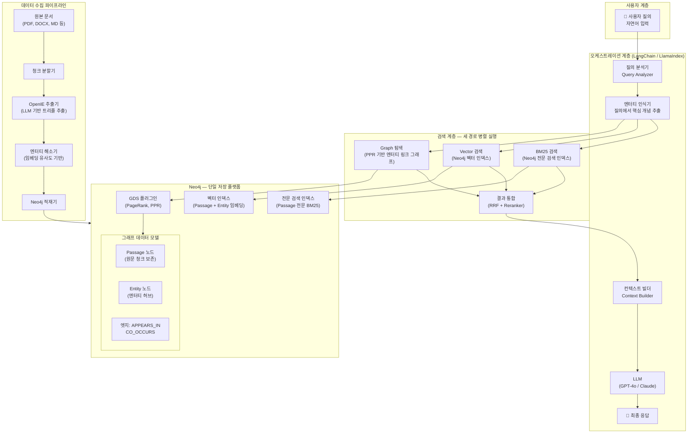
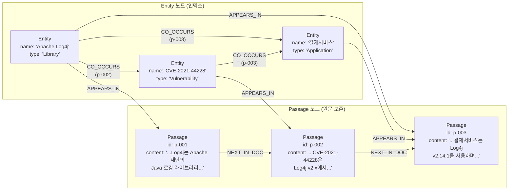
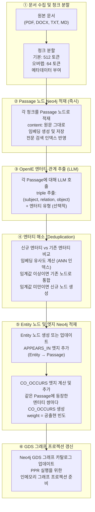
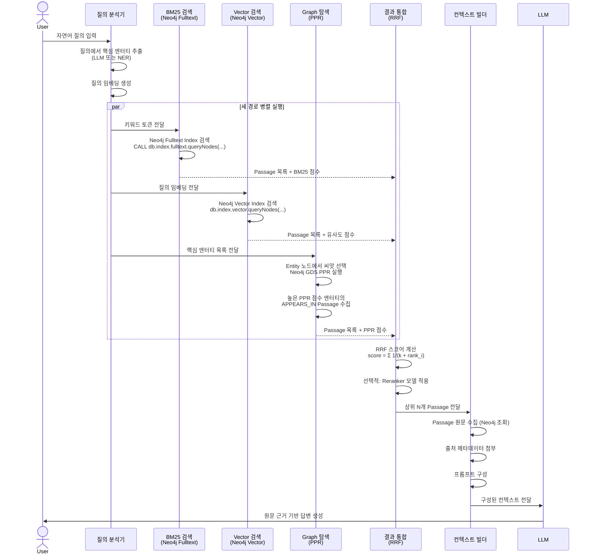
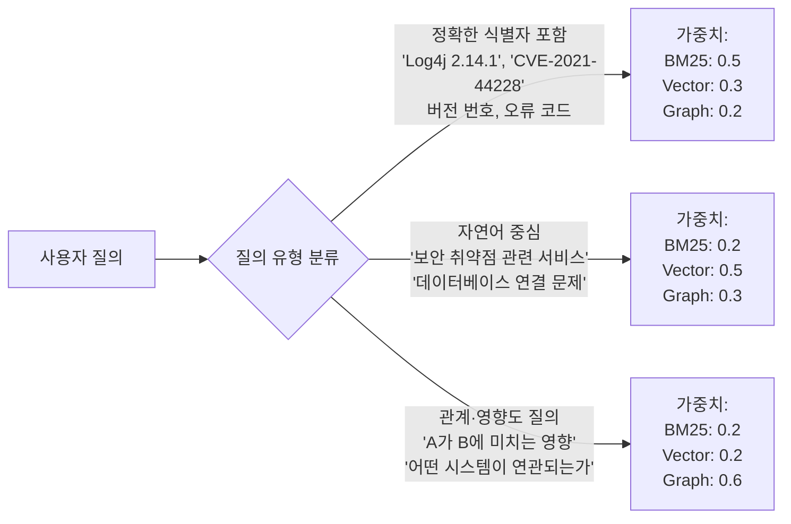
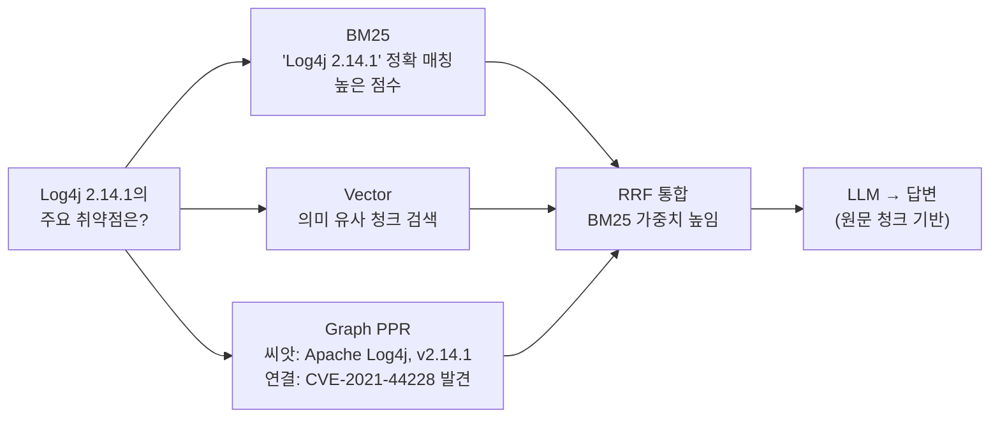
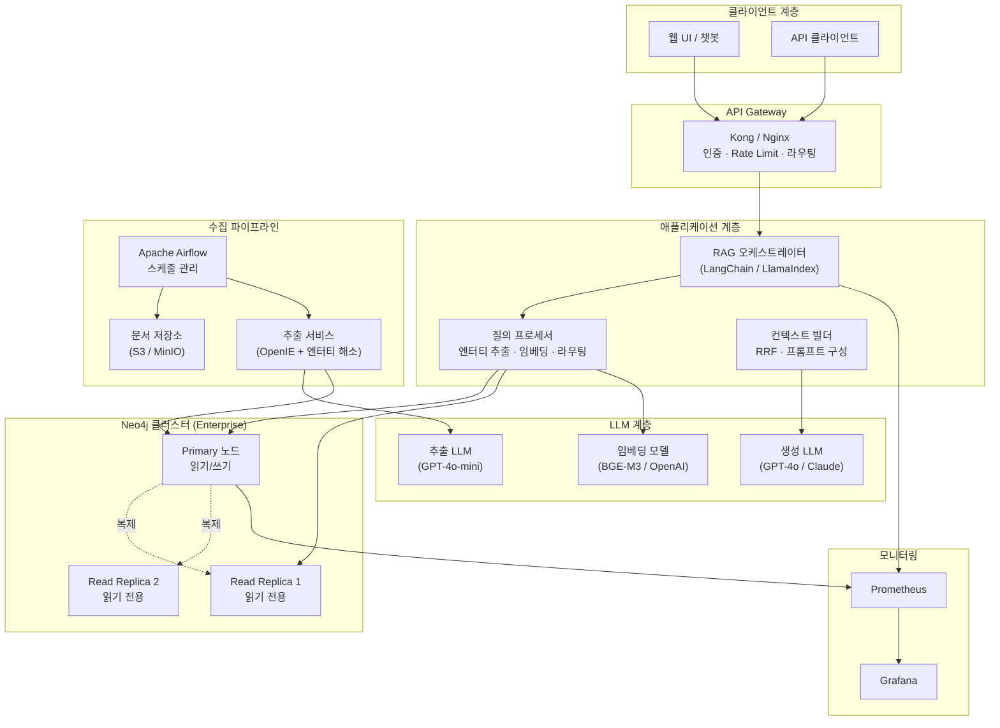
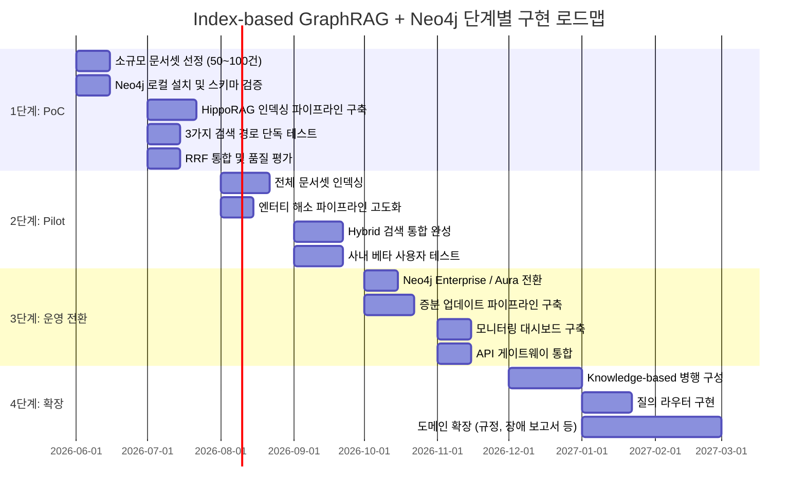
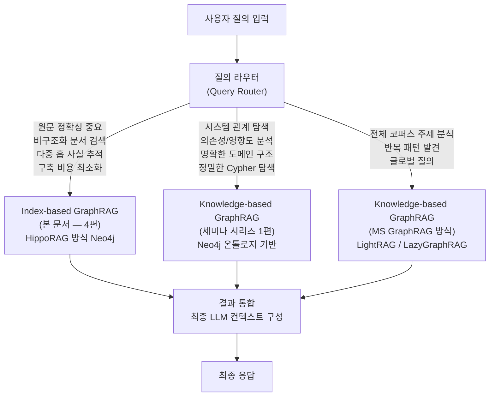

## HippoRAG 방식 엔터티 링크 그래프 × Neo4j × BM25 통합 아키텍처

> **아키텍처팀 기술 세미나 — 구현 가이드**  
> 선행 문서: (2) Index-based GraphRAG 심화 이해, (3) Knowledge-based GraphRAG 심화 이해  
> 작성일: 2026-05-15  
>
---

## 관련글

- [**RAG 기술 아키텍처 세미나 - (1) Neo4j 기반 GraphRAG를 활용한 Hybrid RAG 시스템 구현**](https://k82022603.github.io/posts/rag-기술-아키텍처-세미나-(1)/)
- [**RAG 기술 아키텍처 세미나 - (2) Index-based GraphRAG 심화 이해**](https://k82022603.github.io/posts/rag-기술-아키텍처-세미나-(2)/)
- [**RAG 기술 아키텍처 세미나 - (3) Knowledge-based GraphRAG 심화 이해**](https://k82022603.github.io/posts/rag-기술-아키텍처-세미나-(3)/)
- **RAG 기술 아키텍처 세미나 - (4) Index-based GraphRAG 기반 Neo4j Hybrid RAG 시스템 구현**
- [**RAG 기술 아키텍처 세미나 - (5) 엔터프라이즈 Hybrid RAG 지식 플랫폼 구축 전략**](https://k82022603.github.io/posts/rag-기술-아키텍처-세미나-(5)/)
- [**RAG 기술 아키텍처 세미나 - (6) 온톨로지로 Knowledge Graph 설계하기**](https://k82022603.github.io/posts/rag-기술-아키텍처-세미나-(6)/)
- [**RAG 기술 아키텍처 세미나 - (7) GraphRAG와 Neo4j로 만드는 지능형 지식 검색**](https://k82022603.github.io/posts/rag-기술-아키텍처-세미나-(7)/)

---

## 목차

1. [이 문서의 목적 — Index-based + Neo4j의 결합 이유](#1-이-문서의-목적--index-based--neo4j의-결합-이유)
2. [전체 시스템 개념 지도](#2-전체-시스템-개념-지도)
3. [Neo4j 그래프 데이터 모델 설계](#3-neo4j-그래프-데이터-모델-설계)
4. [인덱싱 파이프라인 — 문서에서 Neo4j 그래프까지](#4-인덱싱-파이프라인--문서에서-neo4j-그래프까지)
5. [질의 파이프라인 — 세 가지 검색 경로의 통합](#5-질의-파이프라인--세-가지-검색-경로의-통합)
6. [Neo4j GDS PageRank 기반 다중 홉 탐색](#6-neo4j-gds-pagerank-기반-다중-홉-탐색)
7. [BM25 + Vector + Graph 통합 — Hybrid Scoring](#7-bm25--vector--graph-통합--hybrid-scoring)
8. [구현 스택 및 핵심 코드 구조](#8-구현-스택-및-핵심-코드-구조)
9. [질의 유형별 동작 방식 상세](#9-질의-유형별-동작-방식-상세)
10. [운영 아키텍처 설계](#10-운영-아키텍처-설계)
11. [단계별 구현 전략 — PoC에서 운영까지](#11-단계별-구현-전략--poc에서-운영까지)
12. [Knowledge-based GraphRAG와의 병행 활용](#12-knowledge-based-graphrag와의-병행-활용)
13. [한계와 고려사항](#13-한계와-고려사항)
14. [결론](#14-결론)

---

## 1. 이 문서의 목적 — Index-based + Neo4j의 결합 이유

### 1.1 왜 Index-based GraphRAG에 Neo4j를 더하는가

세미나 시리즈 (2)편에서 설명한 것처럼, Index-based GraphRAG(RAPTOR, HippoRAG 계열)의 기본 구현체들은 대부분 **인메모리 그래프(NetworkX) 또는 경량 파일 기반 저장소**를 사용합니다. HippoRAG의 공식 오픈소스 구현(github.com/OSU-NLP-Group/HippoRAG)은 NetworkX 라이브러리로 그래프를 구성하고, Python 프로세스 메모리 안에서 Personalized PageRank(PPR)를 실행합니다.

이 방식은 연구용 프로토타입에서는 충분하지만, 엔터프라이즈 환경에서의 실제 운영 시스템으로 확장하려면 다음과 같은 구조적 한계에 부딪힙니다.

수만 개 이상의 청크와 수십만 개 이상의 엔터티를 인메모리로 처리하면 메모리 요구량이 급격히 증가하고, 서버 재시작마다 그래프를 다시 로드해야 합니다. 또한 여러 서비스 인스턴스에서 동시에 그래프를 조회하려면 별도의 공유 저장소가 필요합니다. BM25 검색 시스템, 벡터 DB, 그래프 저장소가 세 개의 별개 시스템으로 분리되면 운영 복잡도가 높아지고 질의 시점에 여러 시스템을 연계하는 오케스트레이션이 복잡해집니다.

Neo4j는 이 문제들을 하나의 플랫폼으로 해결합니다. 영속적인 그래프 저장(재시작 후에도 그래프 유지), 다중 클라이언트 동시 접근, 네이티브 벡터 인덱스(5.x 이후), 전문 검색 인덱스(BM25 호환), 그래프 알고리즘 라이브러리(GDS 플러그인)를 단일 DB에서 제공합니다.

### 1.2 이 문서에서 구현하는 시스템의 정의

이 문서에서 구현하는 시스템은 다음과 같이 정의됩니다.

```
Index-based GraphRAG 기반 Neo4j Hybrid RAG =
  [HippoRAG 방식 엔터티 링크 그래프 인덱스] (Neo4j 저장)
  + [원문 텍스트 청크 보존] (Neo4j 저장)
  + [벡터 유사도 검색] (Neo4j 벡터 인덱스)
  + [BM25 키워드 검색] (Neo4j 전문 검색 인덱스)
  + [PPR 기반 그래프 탐색] (Neo4j GDS PageRank)
  + [RRF 기반 결과 통합]
  + [LLM 컨텍스트 구성 및 답변 생성]
```

핵심을 강조하면, LLM에 제공되는 것은 **언제나 원문 텍스트 청크**입니다. 그래프(엔터티 링크 인덱스)는 어떤 청크를 가져올지 안내하는 역할만 합니다. 이것이 Knowledge-based GraphRAG와의 근본적 차이입니다.

### 1.3 HippoRAG 방식을 주요 구현 대상으로 선택한 이유

이 문서는 RAPTOR(계층적 트리)와 HippoRAG(엔터티 링크 그래프) 중 **HippoRAG 방식**을 중심 구현 대상으로 선택했습니다. 그 이유는 세 가지입니다.

**첫째**, Neo4j의 강점인 **그래프 탐색과 PageRank 알고리즘**을 가장 잘 활용하는 방식이 엔터티 링크 그래프 구조이기 때문입니다. RAPTOR의 계층적 트리는 Neo4j로 구현할 수 있지만, PostgreSQL + pgvector로도 충분히 구현 가능합니다. 반면 HippoRAG의 엔터티 링크 그래프와 PPR 기반 다중 홉 탐색은 Neo4j의 그래프 네이티브 아키텍처에서 특히 이점이 큽니다.

**둘째**, 아키텍처팀의 업무 특성상 원문의 정확한 표현(규정 원문, 시스템 명세)이 중요한데, HippoRAG는 원문 청크를 완전히 보존합니다.

**셋째**, (6)편에서 다루는 Knowledge-based GraphRAG의 Neo4j 온톨로지 기반 구현과 병행 운용 시, 두 시스템이 같은 Neo4j 인스턴스를 공유하는 구조가 가능하여 운영 효율이 높습니다.

---

## 2. 전체 시스템 개념 지도



전체 시스템은 **인덱싱 파이프라인**과 **질의 파이프라인**으로 나뉩니다. 인덱싱은 오프라인 배치 작업이고, 질의는 사용자 요청이 들어올 때마다 실시간으로 수행됩니다. Neo4j는 두 파이프라인 모두에서 단일 저장 플랫폼으로 기능합니다.

---

## 3. Neo4j 그래프 데이터 모델 설계

### 3.1 핵심 원칙: 원문 청크는 반드시 보존한다

Index-based GraphRAG의 본질적 특성에 따라, 모든 원문 텍스트 청크는 Neo4j 안에 온전히 보존됩니다. 엔터티 노드는 어떤 청크에 어떤 개체가 등장하는지를 연결하는 **인덱스 역할**만 합니다.

### 3.2 노드 유형

```
// Passage 노드 (원문 청크 - 핵심)
(:Passage {
    id: String,          // 청크 고유 ID
    content: String,     // 원문 텍스트 그대로
    source: String,      // 원본 문서명
    chunk_index: Integer,// 문서 내 청크 순번
    embedding: List<Float> // 벡터 임베딩
})

// Entity 노드 (엔터티 허브 - 인덱스)
(:Entity {
    id: String,          // 엔터티 고유 ID
    name: String,        // 정규화된 엔터티 명칭
    type: String,        // 유형 (선택적, 스키마 프리)
    embedding: List<Float> // 엔터티명 임베딩
})
```

### 3.3 엣지(관계) 유형

```
// 엔터티-청크 연결 (핵심 연결 엣지)
(:Entity)-[:APPEARS_IN {
    frequency: Integer,  // 해당 청크에서의 등장 횟수
    context: String      // 등장 맥락 (선택적)
}]->(:Passage)

// 엔터티-엔터티 공출현 연결 (PPR 탐색의 경로)
(:Entity)-[:CO_OCCURS {
    weight: Float,       // 공출현 강도 (빈도 기반)
    source_passages: List<String> // 공출현한 청크 ID 목록
}]->(:Entity)

// 청크-청크 순서 연결 (문서 내 연속성)
(:Passage)-[:NEXT_IN_DOC]->(:Passage)
```

### 3.4 전체 그래프 모델 시각화



이 구조에서 그래프 탐색의 흐름은 다음과 같습니다. 질의에서 "Log4j 취약점"이라는 키워드가 인식되면, "Apache Log4j"와 "CVE-2021-44228" 엔터티 노드가 씨앗(seed)으로 선택됩니다. PPR이 이 두 씨앗에서 출발하여 그래프를 따라 확산되면, CO_OCCURS 엣지를 통해 "결제서비스" 엔터티도 높은 점수를 받습니다. 마지막으로 높은 PPR 점수를 받은 엔터티들과 연결된 Passage 노드들이 수집되어 LLM에 **원문 텍스트 그대로** 제공됩니다.

### 3.5 Neo4j 인덱스 설계

Neo4j에서 성능을 보장하기 위해 다음 인덱스가 필요합니다.

```cypher
// 벡터 인덱스 (Passage 임베딩 — 시맨틱 검색용)
CREATE VECTOR INDEX passage_vector_index IF NOT EXISTS
FOR (p:Passage) ON (p.embedding)
OPTIONS {indexConfig: {
  `vector.dimensions`: 1536,
  `vector.similarity_function`: 'cosine'
}};

// 벡터 인덱스 (Entity 임베딩 — 엔터티 유사도 검색용)
CREATE VECTOR INDEX entity_vector_index IF NOT EXISTS
FOR (e:Entity) ON (e.embedding)
OPTIONS {indexConfig: {
  `vector.dimensions`: 1536,
  `vector.similarity_function`: 'cosine'
}};

// 전문 검색 인덱스 (BM25 스타일 키워드 검색)
CREATE FULLTEXT INDEX passage_fulltext_index IF NOT EXISTS
FOR (p:Passage) ON EACH [p.content];

// 범위 인덱스 (ID 기반 빠른 조회)
CREATE INDEX passage_id_index IF NOT EXISTS
FOR (p:Passage) ON (p.id);

CREATE INDEX entity_name_index IF NOT EXISTS
FOR (e:Entity) ON (e.name);
```

---

## 4. 인덱싱 파이프라인 — 문서에서 Neo4j 그래프까지

인덱싱 파이프라인은 전체 시스템에서 가장 비용이 많이 들고 시간이 오래 걸리는 단계입니다. 오프라인 배치로 수행되며, 일반적으로 새로운 문서가 대량으로 추가될 때 실행됩니다.



### 4.1 청크 분할 전략

청크 분할은 단순히 고정 크기로 자르는 것보다 의미 경계를 존중하는 것이 중요합니다. 실무에서 효과적인 전략은 **문단 기반 분할**입니다. 먼저 문단 경계(빈 줄, 헤더)에서 분리한 후, 512 토큰이 넘는 문단은 문장 경계에서 추가로 분리합니다. 이렇게 하면 청크 중간에서 문장이 잘리는 경우를 최소화할 수 있습니다.

또한 각 청크에는 원본 문서 경로, 문서 내 위치(섹션명, 페이지 번호), 생성 타임스탬프 같은 메타데이터를 함께 저장합니다. 이 메타데이터는 나중에 출처를 제시하거나 특정 문서만 검색할 때 필터 조건으로 활용됩니다.

### 4.2 OpenIE 기반 엔터티·관계 추출

각 청크에 대해 LLM에 다음과 같은 프롬프트로 트리플을 추출합니다.

```
[시스템 프롬프트]
당신은 텍스트에서 엔터티와 관계를 추출하는 전문가입니다.
아래 텍스트를 읽고, 명확한 개체들과 그 관계를 (주어, 관계, 목적어) 형태의
트리플로 추출하세요.

규칙:
- 트리플은 최대 {max_triples}개로 제한합니다
- 가장 정보가 풍부한 트리플을 우선 추출하세요
- 주어와 목적어는 구체적인 명사구여야 합니다
- 모호한 대명사(it, they 등)는 실제 개체명으로 대체하세요

출력 형식: JSON 배열
[{"subject": "...", "relation": "...", "object": "..."}]

[텍스트]
{chunk_content}
```

이 추출 방식은 HippoRAG 원논문에서 사용한 OpenIE 방식과 유사합니다. 도메인 온톨로지를 강제하지 않으므로 임의의 문서에 적용 가능합니다. 관계 유형이 자유 형식인 만큼, 추출 후에 관계 표현을 정규화하는 단계(예: "사용한다", "uses", "활용한다"를 모두 "USES"로)를 추가하면 그래프 품질이 높아집니다.

### 4.3 엔터티 해소 상세

엔터티 해소는 인덱싱 품질에 가장 결정적인 영향을 미치는 단계입니다. 다음과 같은 3단계 접근이 현실적입니다.

**1단계 — 정규화**: 대소문자를 통일하고, 전치사·조사를 제거하며, 약어를 확장합니다. "log4j", "Log4j", "LOG4J"를 모두 "Apache Log4j"로 통일하는 것이 이 단계입니다.

**2단계 — 임베딩 유사도**: 정규화된 엔터티명을 임베딩하고, 기존 Entity 노드들과 코사인 유사도를 계산합니다. 유사도가 0.92 이상(임계값은 도메인에 따라 조정)이면 기존 노드와 동일 개체로 판단하고 병합합니다.

**3단계 — LLM 최종 판단**: 2단계에서 0.85~0.92 사이의 애매한 케이스에 대해 LLM에게 두 엔터티명과 각각이 등장한 컨텍스트 문장을 제공하여 동일 여부를 판단합니다. 비용이 높으므로 경계 케이스에만 적용합니다.

### 4.4 증분 업데이트 처리

새로운 문서가 추가될 때는 전체 재인덱싱이 아니라 증분 업데이트가 효율적입니다. 새로운 Passage 노드는 즉시 추가하고, 신규 트리플에서 추출된 엔터티가 기존 Entity 노드와 매칭되면 `APPEARS_IN` 및 `CO_OCCURS` 엣지만 추가합니다. 완전히 새로운 엔터티라면 신규 Entity 노드를 생성합니다. LightRAG의 증분 업데이트 알고리즘(arXiv:2410.05779)이 이 접근 방식의 효율성을 검증한 바 있습니다.

---

## 5. 질의 파이프라인 — 세 가지 검색 경로의 통합

사용자 질의가 들어오면 세 가지 검색 경로가 **병렬로 실행**되고, 결과는 RRF(Reciprocal Rank Fusion)로 통합됩니다.



### 5.1 BM25 검색 경로

Neo4j의 전문 검색 인덱스는 Apache Lucene 기반으로 동작하며, BM25 스코어링을 지원합니다. 아래 Cypher 쿼리로 키워드 검색을 수행합니다.

```cypher
CALL db.index.fulltext.queryNodes(
    'passage_fulltext_index',
    $query_text
) YIELD node, score
WHERE score > 0.1
RETURN node.id AS passage_id,
       node.content AS content,
       node.source AS source,
       score AS bm25_score
ORDER BY score DESC
LIMIT 20
```

BM25 검색은 "Log4j 2.14.1", "CVE-2021-44228" 같이 정확한 식별자나 버전 번호가 포함된 질의에서 특히 효과적입니다. 벡터 유사도 검색이 놓칠 수 있는 정확한 키워드 매칭을 보완합니다.

### 5.2 Vector 검색 경로

Neo4j 5.x의 네이티브 벡터 인덱스를 활용하여 의미론적 유사도 기반 검색을 수행합니다.

```cypher
CALL db.index.vector.queryNodes(
    'passage_vector_index',
    20,              -- 상위 K개
    $query_embedding
) YIELD node, score
RETURN node.id AS passage_id,
       node.content AS content,
       node.source AS source,
       score AS vector_score
```

벡터 검색은 질의의 표현과 다르더라도 의미가 유사한 청크를 찾습니다. "데이터베이스 접속 문제"로 질의해도 "DB 연결 오류"가 담긴 청크를 검색합니다.

---

## 6. Neo4j GDS PageRank 기반 다중 홉 탐색

Graph 탐색 경로는 세 경로 중 가장 독특하며, Index-based GraphRAG의 핵심 가치를 제공합니다. HippoRAG의 Personalized PageRank를 Neo4j Graph Data Science(GDS) 플러그인으로 구현합니다.

### 6.1 GDS 그래프 프로젝션 생성

PPR을 실행하기 전에 Neo4j의 인메모리 그래프 카탈로그에 프로젝션을 만들어야 합니다.

```cypher
-- Entity-Entity CO_OCCURS 그래프 프로젝션 생성
CALL gds.graph.project(
    'entity_cooccurrence_graph',    -- 프로젝션 이름
    'Entity',                       -- 노드 레이블
    {
        CO_OCCURS: {
            type: 'CO_OCCURS',
            orientation: 'UNDIRECTED',
            properties: {weight: {defaultValue: 1.0}}
        }
    }
) YIELD graphName, nodeCount, relationshipCount;
```

이 프로젝션은 Entity 노드들과 CO_OCCURS 엣지만을 인메모리로 로드합니다. PPR은 이 프로젝션 위에서 실행됩니다.

### 6.2 Personalized PageRank 실행

```cypher
-- 씨앗 엔터티 목록을 기반으로 PPR 실행
CALL gds.pageRank.stream(
    'entity_cooccurrence_graph',
    {
        maxIterations: 20,
        dampingFactor: 0.85,
        sourceNodes: $seed_entity_ids,  -- 질의 관련 엔터티 노드 ID 목록
        relationshipWeightProperty: 'weight'
    }
) YIELD nodeId, score
ORDER BY score DESC
LIMIT 50  -- 상위 50개 엔터티
```

PPR에서 `sourceNodes`는 질의에서 식별된 핵심 엔터티들입니다. 이 씨앗 노드들에서 출발한 확률 질량이 CO_OCCURS 엣지를 따라 퍼져나가며, 씨앗과 직접 연결되거나 간접적으로 여러 경로로 연결된 엔터티들이 높은 점수를 받습니다. 이것이 단일 벡터 검색으로는 달성할 수 없는 **다중 홉 탐색**의 원리입니다.

### 6.3 PPR 결과에서 Passage 수집

높은 PPR 점수를 받은 엔터티들이 등장하는 Passage를 수집합니다.

```cypher
-- PPR 상위 엔터티들이 등장하는 Passage 수집
MATCH (e:Entity)-[:APPEARS_IN]->(p:Passage)
WHERE e.id IN $top_ppr_entity_ids
WITH p, count(distinct e) AS entity_coverage,
     sum(CASE WHEN e.id IN $seed_entity_ids THEN 2 ELSE 1 END) AS relevance_score
RETURN p.id AS passage_id,
       p.content AS content,   -- 원문 텍스트 그대로
       p.source AS source,
       relevance_score
ORDER BY relevance_score DESC
LIMIT 20
```

이 쿼리의 결과로 수집되는 것은 **원문 텍스트 청크**입니다. 그래프는 어느 청크를 가져올지 안내했고, 최종적으로 LLM에 제공되는 컨텍스트는 변환되지 않은 원문입니다.

### 6.4 씨앗 엔터티 선택 방법

PPR의 출발점이 되는 씨앗 엔터티 선택은 검색 품질에 큰 영향을 미칩니다. 두 가지 방식을 조합합니다.

**방식 1 — 벡터 유사도 기반 엔터티 선택**: 질의 임베딩과 Entity 노드의 임베딩을 비교하여 유사도 상위 엔터티를 씨앗으로 선택합니다.

```cypher
CALL db.index.vector.queryNodes(
    'entity_vector_index',
    10,
    $query_embedding
) YIELD node AS entity, score
RETURN entity.id AS entity_id, entity.name AS name, score
```

**방식 2 — 전문 검색 기반 엔터티 선택**: 질의 키워드와 정확히 일치하는 엔터티 이름을 검색합니다.

```cypher
MATCH (e:Entity)
WHERE toLower(e.name) CONTAINS toLower($keyword)
RETURN e.id AS entity_id, e.name AS name
LIMIT 10
```

두 방식의 결과를 합집합으로 취하면, 의미적으로 유사한 엔터티와 정확히 일치하는 엔터티를 모두 씨앗으로 활용할 수 있습니다. HippoRAG2(arXiv:2502.14802)는 이러한 밀집·희소 씨앗 혼합 방식이 단일 방식보다 다중 홉 추론에서 유의미하게 더 높은 성능을 보인다는 것을 검증했습니다.

---

## 7. BM25 + Vector + Graph 통합 — Hybrid Scoring

세 경로의 결과를 어떻게 통합할지가 전체 검색 품질을 결정합니다.

### 7.1 RRF (Reciprocal Rank Fusion)

RRF는 각 검색 결과 목록에서 항목의 순위(rank)를 기반으로 통합 점수를 계산합니다. 점수 스케일이 다른 여러 검색 방식의 결과를 통합할 때 특히 효과적입니다.

RRF 점수 계산식: `rrf_score(d) = Σ 1 / (k + rank_i(d))`

여기서 `k`는 상수(일반적으로 60), `rank_i(d)`는 i번째 검색 결과 목록에서 문서 d의 순위입니다.

```python
def reciprocal_rank_fusion(
    bm25_results: list[tuple[str, float]],
    vector_results: list[tuple[str, float]],
    graph_results: list[tuple[str, float]],
    k: int = 60,
    weights: dict = None
) -> list[tuple[str, float]]:
    """
    세 검색 결과를 RRF로 통합합니다.
    
    Args:
        bm25_results: [(passage_id, bm25_score), ...]
        vector_results: [(passage_id, vector_score), ...]
        graph_results: [(passage_id, graph_relevance_score), ...]
        k: RRF 상수 (기본값: 60)
        weights: 각 검색 방식의 가중치 (기본값: 균등)
    """
    if weights is None:
        weights = {'bm25': 1.0, 'vector': 1.0, 'graph': 1.0}
    
    rrf_scores = {}
    
    for result_list, weight_key in [
        (bm25_results, 'bm25'),
        (vector_results, 'vector'),
        (graph_results, 'graph')
    ]:
        w = weights[weight_key]
        for rank, (passage_id, _) in enumerate(result_list, 1):
            rrf_scores[passage_id] = rrf_scores.get(passage_id, 0)
            rrf_scores[passage_id] += w * (1.0 / (k + rank))
    
    return sorted(rrf_scores.items(), key=lambda x: x[1], reverse=True)
```

### 7.2 질의 유형별 가중치 조정

모든 질의에 동일한 가중치를 적용하기보다, 질의의 성격에 따라 가중치를 동적으로 조정하면 성능을 높일 수 있습니다.



### 7.3 Reranker 적용 (선택적)

RRF 통합 후 상위 20~30개 결과에 Cross-Encoder 기반 Reranker 모델을 적용하면 최종 순위의 정확도를 높일 수 있습니다. BGE-Reranker, Cohere Rerank API 등을 사용할 수 있습니다. 단, Reranker는 후보 각각에 대해 모델을 실행하므로 응답 지연이 증가합니다. 지연 허용 수준에 따라 적용 여부를 결정합니다.

---

## 8. 구현 스택 및 핵심 코드 구조

### 8.1 기술 스택

| 계층 | 컴포넌트 | 선택 이유 |
|---|---|---|
| 오케스트레이션 | LangChain 또는 LlamaIndex | Neo4j 공식 통합 지원, GraphRAG 패턴 내장 |
| 그래프 DB | Neo4j 5.x | 벡터 인덱스 + 전문 검색 + GDS 통합 |
| 그래프 알고리즘 | Neo4j GDS 플러그인 | PageRank, PPR 공식 지원 |
| 임베딩 모델 | text-embedding-3-small (OpenAI) 또는 BGE-M3 | 한국어 포함 다국어 지원 |
| 생성 LLM | GPT-4o 또는 Claude Sonnet | OpenIE 추출 및 답변 생성 |
| 모니터링 | Prometheus + Grafana | 검색 지연, 인덱싱 처리량 모니터링 |

### 8.2 LlamaIndex + Neo4j PropertyGraphIndex 기반 구현

LlamaIndex의 `PropertyGraphIndex`와 `Neo4jPropertyGraphStore`를 조합하면 엔터티 링크 그래프를 Neo4j에 구축하는 인덱싱 파이프라인을 빠르게 구성할 수 있습니다(LlamaIndex 공식 문서, 2025).

```python
from llama_index.core import SimpleDirectoryReader, PropertyGraphIndex
from llama_index.core.indices.property_graph import SimpleLLMPathExtractor
from llama_index.graph_stores.neo4j import Neo4jPropertyGraphStore
from llama_index.embeddings.openai import OpenAIEmbedding
from llama_index.llms.openai import OpenAI

# Neo4j 연결 설정
graph_store = Neo4jPropertyGraphStore(
    username="neo4j",
    password="your-password",
    url="bolt://localhost:7687",
)

# LLM 및 임베딩 모델 설정
llm = OpenAI(model="gpt-4o-mini", temperature=0)
embed_model = OpenAIEmbedding(model="text-embedding-3-small")

# 문서 로드 및 인덱싱
documents = SimpleDirectoryReader("./data/").load_data()

# 엔터티·관계 추출기 설정 (Index-based: 스키마 없음)
kg_extractor = SimpleLLMPathExtractor(
    llm=llm,
    max_paths_per_chunk=10,  # 청크당 최대 트리플 수
    num_workers=4,           # 병렬 처리 워커 수
)

# PropertyGraphIndex 구축 (Neo4j에 저장)
index = PropertyGraphIndex.from_documents(
    documents,
    kg_extractors=[kg_extractor],
    embed_model=embed_model,
    property_graph_store=graph_store,
    show_progress=True,
)
```

`PropertyGraphIndex`는 내부적으로 각 청크를 Neo4j에 Passage(청크 노드)로 저장하고, 추출된 엔터티와 관계를 Entity 노드와 엣지로 저장합니다. 임베딩은 Neo4j 벡터 인덱스에 자동으로 추가됩니다.

### 8.3 검색 파이프라인 구성

```python
from llama_index.core.retrievers import (
    VectorContextRetriever,
    TextToCypherRetriever,
)
from llama_index.core.query_engine import RetrieverQueryEngine

# 벡터 기반 검색 (Neo4j 벡터 인덱스 활용)
vector_retriever = VectorContextRetriever(
    index.property_graph_store,
    embed_model=embed_model,
    similarity_top_k=20,
    # 엔터티와 연결된 Passage까지 확장 검색
    path_depth=1,
)

# Cypher 기반 키워드/그래프 검색
cypher_retriever = TextToCypherRetriever(
    index.property_graph_store,
    llm=llm,
)

# 쿼리 엔진 구성 (두 retriever 조합)
from llama_index.core.retrievers import BaseRetriever
from llama_index.core import QueryBundle
from llama_index.core.schema import NodeWithScore

class HybridGraphRetriever(BaseRetriever):
    """BM25 + Vector + Graph PPR 통합 검색기"""
    def _retrieve(self, query_bundle: QueryBundle):
        # 1. 벡터 검색
        vector_nodes = vector_retriever.retrieve(query_bundle)
        
        # 2. Neo4j 전문 검색 (BM25)
        bm25_results = self._fulltext_search(
            query_bundle.query_str
        )
        
        # 3. Graph PPR 탐색 (씨앗 엔터티에서 출발)
        seed_entities = self._extract_seed_entities(
            query_bundle.query_str
        )
        graph_nodes = self._ppr_retrieval(seed_entities)
        
        # 4. RRF 통합
        return self._rrf_merge(
            vector_nodes, bm25_results, graph_nodes
        )
```

### 8.4 GDS PPR 직접 호출 (LangChain Neo4j 드라이버)

LlamaIndex 추상화 외에, Neo4j Python 드라이버로 GDS PPR을 직접 호출하는 방식도 가능합니다.

```python
from neo4j import GraphDatabase

class PPRRetriever:
    def __init__(self, uri, username, password):
        self.driver = GraphDatabase.driver(uri, auth=(username, password))
    
    def get_seed_entity_ids(self, query_embedding: list, top_k: int = 10):
        """질의 임베딩과 유사한 엔터티 노드 ID 반환"""
        with self.driver.session() as session:
            result = session.run("""
                CALL db.index.vector.queryNodes(
                    'entity_vector_index', $top_k, $embedding
                ) YIELD node, score
                WHERE score > 0.7
                RETURN node.id AS entity_id, node.name AS name, score
                """,
                top_k=top_k,
                embedding=query_embedding
            )
            return [record["entity_id"] for record in result]
    
    def run_ppr(self, seed_entity_ids: list, top_n: int = 50):
        """씨앗 엔터티에서 PPR 실행 후 상위 엔터티 반환"""
        with self.driver.session() as session:
            # 씨앗 노드 Neo4j 내부 ID 조회
            seed_nodes_result = session.run("""
                MATCH (e:Entity)
                WHERE e.id IN $seed_ids
                RETURN id(e) AS internal_id
                """, seed_ids=seed_entity_ids)
            seed_internal_ids = [r["internal_id"] for r in seed_nodes_result]
            
            if not seed_internal_ids:
                return []
            
            # PPR 실행
            ppr_result = session.run("""
                CALL gds.pageRank.stream(
                    'entity_cooccurrence_graph',
                    {
                        maxIterations: 20,
                        dampingFactor: 0.85,
                        sourceNodes: $source_nodes,
                        relationshipWeightProperty: 'weight'
                    }
                ) YIELD nodeId, score
                WITH gds.util.asNode(nodeId) AS entity, score
                WHERE score > 0.001
                RETURN entity.id AS entity_id, score
                ORDER BY score DESC
                LIMIT $top_n
                """,
                source_nodes=seed_internal_ids,
                top_n=top_n
            )
            return [(r["entity_id"], r["score"]) for r in ppr_result]
    
    def get_passages_by_entities(self, entity_ids: list, top_n: int = 20):
        """엔터티 ID 목록에서 관련 Passage(원문 청크) 수집"""
        with self.driver.session() as session:
            result = session.run("""
                MATCH (e:Entity)-[:APPEARS_IN]->(p:Passage)
                WHERE e.id IN $entity_ids
                WITH p,
                     count(distinct e) AS coverage,
                     collect(distinct e.name) AS entities_found
                RETURN p.id AS passage_id,
                       p.content AS content,    -- 원문 그대로
                       p.source AS source,
                       coverage,
                       entities_found
                ORDER BY coverage DESC
                LIMIT $top_n
                """,
                entity_ids=entity_ids,
                top_n=top_n
            )
            return [dict(r) for r in result]
```

---

## 9. 질의 유형별 동작 방식 상세

아키텍처팀 관점에서 자주 등장하는 질의 유형별로 시스템이 어떻게 동작하는지를 살펴봅니다.

### 9.1 단일 사실 질의 — "Log4j 2.14.1의 주요 취약점은?"



이 질의에서 BM25가 가장 효과적입니다. "Log4j 2.14.1"이라는 정확한 버전 번호가 원문에 등장하는 청크를 정확히 찾습니다. Graph PPR은 추가로 취약점 관련 청크를 보완합니다.

### 9.2 다중 홉 질의 — "Log4j 취약점에 영향받는 서비스의 담당 팀은?"

이 질의는 벡터 검색만으로는 답할 수 없습니다. "Log4j" + "담당 팀"이라는 두 주제를 연결하는 정보가 단일 청크에 없을 수 있기 때문입니다.

PPR이 이 상황에서 핵심 역할을 합니다. "Apache Log4j" 엔터티에서 출발한 확률이 CO_OCCURS 엣지를 따라 "결제서비스" 엔터티로 퍼지고, 다시 "결제개발팀" 엔터티로 전파됩니다. 결과적으로 "결제개발팀을 언급한 청크"까지 수집되어 LLM이 연결 고리를 완성할 수 있습니다. 단일 벡터 검색은 이 연쇄 탐색 경로를 따라가지 못하지만, 엔터티 링크 그래프의 PPR은 이를 자연스럽게 처리합니다.

### 9.3 비교 질의 — "장애 보고서에서 반복되는 근본 원인 패턴은?"

이 질의는 Index-based GraphRAG의 약점 영역입니다. 전체 코퍼스를 조망해야 하는 글로벌 질의이기 때문입니다.

이 경우에는 Graph 탐색 가중치를 높이되, PPR의 씨앗으로 질의에서 추출된 "장애 보고서", "근본 원인"과 같은 일반적 엔터티를 사용합니다. 여러 청크가 수집되고, LLM이 이 청크들을 종합하여 패턴을 발견하는 역할을 합니다. 단, 이 유형의 질의는 Knowledge-based GraphRAG(커뮤니티 요약 방식)가 근본적으로 더 적합합니다. 본 문서의 12절에서 두 방식의 병행 활용을 설명합니다.

---

## 10. 운영 아키텍처 설계

### 10.1 소프트웨어 컴포넌트 구성도



Neo4j Enterprise의 Read Replica 구성은 검색 질의(읽기)를 분산 처리하고, 인덱싱(쓰기)은 Primary 노드에서 수행합니다. Community Edition은 클러스터링을 지원하지 않으므로, 고가용성이 필요한 운영 환경에서는 Enterprise 또는 Neo4j Aura(클라우드 서비스)를 고려해야 합니다.

### 10.2 Neo4j Aura를 사용하는 경우

온프레미스 Neo4j 클러스터 운영이 부담스럽다면, Neo4j의 완전 관리형 클라우드 서비스인 **Neo4j Aura**를 대안으로 사용할 수 있습니다. Aura는 AWS, GCP, Azure를 지원하며, 벡터 인덱스와 GDS 기능을 포함합니다. LlamaIndex와 LangChain 모두 Aura에 대한 공식 연결 설정을 지원합니다.

### 10.3 모니터링 핵심 지표

운영 중 추적해야 할 핵심 지표는 다음과 같습니다.

| 지표 | 목표 기준 | 측정 방법 |
|---|---|---|
| 검색 응답 시간 (P95) | < 2초 | Prometheus histogram |
| PPR 실행 시간 | < 500ms | GDS 쿼리 시간 |
| BM25 검색 시간 | < 100ms | Neo4j 쿼리 시간 |
| 엔터티 해소 정확도 | > 95% | 샘플 수작업 검증 |
| Neo4j 메모리 사용률 | < 80% | JVM 힙 모니터링 |
| 인덱싱 처리량 | > 10 청크/분 | Airflow 태스크 메트릭 |

---

## 11. 단계별 구현 전략 — PoC에서 운영까지

한 번에 모든 것을 구축하려 하면 리스크가 커집니다. 작게 시작하여 가치를 검증하고 점진적으로 확장하는 전략이 현실적입니다.



### 1단계 PoC에서 검증해야 할 핵심 질문

PoC의 목표는 "Index-based GraphRAG + Neo4j 방식이 기존 벡터 RAG보다 실제로 더 나은 결과를 내는가?"를 소규모 데이터로 빠르게 검증하는 것입니다. 구체적인 성공 기준은 다음 세 가지입니다.

첫째, 다중 홉 질의에서 Graph PPR 탐색이 벡터 검색만 사용했을 때보다 더 관련성 높은 청크를 포함하는가를 확인합니다. 둘째, RRF 통합 결과가 단일 검색 방식보다 다양한 질의 유형에서 일관되게 더 좋은 성능을 보이는가를 확인합니다. 셋째, 엔터티 해소의 정확도가 수용 가능한 수준(95% 이상)인가를 확인합니다.

---

## 12. Knowledge-based GraphRAG와의 병행 활용

Index-based GraphRAG(원문 보존, 그래프는 인덱스)와 Knowledge-based GraphRAG(지식 그래프, 커뮤니티 요약)는 서로 다른 강점을 가지며, 아키텍처팀의 업무 환경에서는 두 방식을 병행하는 것이 이상적입니다.



같은 Neo4j 인스턴스 안에서 Index-based(Passage + Entity 노드)와 Knowledge-based(Application, Library, Vulnerability 등 온톨로지 노드)를 공존시킬 수 있습니다. 두 서브그래프는 서로 다른 노드 레이블과 관계 유형을 사용하여 독립적으로 운영되면서도, 필요할 때 연결할 수 있습니다. 예를 들어 Knowledge-based의 Application 노드와 Index-based의 Passage 노드를 `DESCRIBED_IN` 관계로 연결하면, 구조화된 시스템 정보와 비구조화 문서를 함께 검색하는 것이 가능합니다.

---

## 13. 한계와 고려사항

### 13.1 Neo4j GDS의 Enterprise 의존성

Neo4j GDS(Graph Data Science) 플러그인은 PPR을 포함한 고급 그래프 알고리즘을 제공합니다. 그러나 GDS의 일부 알고리즘은 **Neo4j Enterprise Edition에서만 전체 기능을 사용**할 수 있습니다. Community Edition에서는 알고리즘 사용이 제한되며, 운영 환경에 적합한 클러스터링(Read Replica) 기능도 Community에서는 지원되지 않습니다. 비용 계획 수립 시 Neo4j Enterprise 라이선스 비용을 반드시 고려해야 합니다. 대안으로 Neo4j Aura(클라우드 완전 관리형)는 GDS를 포함하여 제공합니다.

Community Edition에서 PPR을 사용하려면 Python의 NetworkX 라이브러리로 Neo4j에서 그래프를 읽어와 인메모리로 PPR을 계산하는 방식을 취할 수 있습니다. 규모가 크지 않은 PoC 단계에서는 이 방식으로 시작하고, 운영 전환 시 Enterprise로 업그레이드하는 전략이 현실적입니다.

### 13.2 엔터티 해소 품질의 지속적 관리

인덱싱이 진행될수록 그래프에 노드가 축적되며, 엔터티 해소의 복잡도도 증가합니다. "오래된 엔터티와 신규 추출 엔터티 사이의 해소"가 시간이 지날수록 어려워집니다. 정기적인 엔터티 해소 감사(Entity Resolution Audit)와 인간 검수 프로세스를 운영 체계에 포함해야 합니다.

### 13.3 글로벌 질의의 구조적 한계

앞서 언급한 바와 같이, Index-based GraphRAG는 전체 코퍼스를 아우르는 글로벌 질의에 구조적으로 취약합니다. 이 유형의 질의가 아키텍처팀 업무에서 빈번하게 발생한다면, 별도의 Knowledge-based GraphRAG(LightRAG 또는 LazyGraphRAG)를 함께 운영하는 하이브리드 구성을 고려해야 합니다.

### 13.4 한계 요약

| 한계 | 영향도 | 완화 방안 |
|---|---|---|
| GDS Enterprise 의존성 | 중간 | PoC는 NetworkX 인메모리, 운영은 Enterprise |
| 엔터티 해소 품질 관리 | 높음 | 정기 감사 + 인간 검수 프로세스 |
| 글로벌 질의 취약 | 중간 | Knowledge-based GraphRAG 병행 구성 |
| 인덱싱 LLM 비용 | 중간 | 핵심 문서 우선 인덱싱 + 증분 업데이트 |
| Neo4j 콜드 스타트 JVM | 낮음 | 컨테이너 준비 상태 점검 및 예열 |

---

## 14. 결론

이 문서에서 제안한 **Index-based GraphRAG 기반 Neo4j Hybrid RAG 시스템**은 세 가지 검색 경로(BM25 + Vector + Graph PPR)를 단일 Neo4j 플랫폼 위에 통합합니다.

이 접근법의 핵심 가치를 요약하면 다음과 같습니다.

**원문 보존**: LLM에 항상 원문 텍스트 청크를 제공합니다. 지식의 손실 없이 원문 그대로의 정보가 답변 생성에 활용됩니다.

**다중 홉 다중 문서 탐색**: 엔터티 링크 그래프와 PPR을 결합하여, 단일 문서 안에 담겨 있지 않더라도 여러 문서에 걸쳐 관계적으로 연결된 정보를 추적합니다.

**통합 플랫폼**: Neo4j 하나로 그래프 저장, 벡터 인덱스, 전문 검색 인덱스, 그래프 알고리즘을 모두 처리합니다. 여러 이종 시스템을 운영하는 복잡도를 줄입니다.

**점진적 구축 가능**: 소규모 PoC로 시작하여 가치를 검증하고, 데이터와 용량을 점진적으로 확장할 수 있는 구조입니다.

이 시스템은 완결된 솔루션이 아니라 **지속적으로 성장하는 지식 탐색 인프라의 시작점**입니다. 이 기반 위에 Knowledge-based GraphRAG를 추가하고, 도메인 온톨로지를 세밀하게 발전시키며, 새로운 문서를 지속적으로 인덱싱하면서 시스템의 지능이 함께 성장합니다.

---

## 참고 자료

1. **Gutiérrez, B.J. et al.** (2024). *HippoRAG: Neurobiologically Inspired Long-Term Memory for Large Language Models.* NeurIPS 2024. — **HippoRAG 원논문 (엔터티 링크 그래프 + PPR).**

2. **Gutiérrez, B.J. et al.** (2025). *From RAG to Memory: Non-Parametric Continual Learning for Large Language Models (HippoRAG2).* arXiv:2502.14802, ICML 2025. — **HippoRAG2: 밀집·희소 씨앗 혼합 방식.**

3. **GitHub.** *OSU-NLP-Group/HippoRAG.* https://github.com/osu-nlp-group/hipporag — HippoRAG 공식 오픈소스 구현체.

4. **Neo4j.** *neo4j-graphrag-python User Guide.* https://neo4j.com/docs/neo4j-graphrag-python/ — Neo4j GraphRAG Python 라이브러리.

5. **Neo4j Labs.** *LlamaIndex + Neo4j Integration.* https://neo4j.com/labs/genai-ecosystem/llamaindex/ — LlamaIndex PropertyGraphIndex + Neo4j 통합 가이드.

6. **LlamaIndex.** *GraphRAG Implementation with Neo4j - V2.* https://docs.llamaindex.ai/en/stable/examples/cookbooks/GraphRAG_v2/ — LlamaIndex + Neo4j GraphRAG 공식 예제.

7. **LlamaIndex.** *Neo4j Property Graph Index Guide.* https://developers.llamaindex.ai/python/framework/module_guides/indexing/lpg_index_guide/ — PropertyGraphIndex 공식 문서.

8. **Neo4j.** *Graph Data Science (GDS) Documentation.* https://neo4j.com/docs/graph-data-science/ — PageRank, PPR 알고리즘 공식 문서.

9. **Graphwise.** (2026). *From Retrieval to Reasoning: Enhancing HippoRAG with Graph-Based Semantics.* — PPR + 온톨로지 결합 실험 사례.

10. **Zhang, Q. et al.** (2025). *A Survey of Graph Retrieval-Augmented Generation for Customized Large Language Models.* arXiv:2501.13958. — Index-based GraphRAG 분류 기준.

11. **Sarthi, P. et al.** (2024). *RAPTOR: Recursive Abstractive Processing for Tree-Organized Retrieval.* ICLR 2024. arXiv:2401.18059. — RAPTOR 계층적 트리 인덱스 (비교 참조).

12. **Huang, Y. et al.** (2025). *KET-RAG: A Cost-Efficient Multi-Granular Indexing Framework for Graph-RAG.* ACM KDD 2025. arXiv:2502.09304.

---

*작성일: 2026-05-15*  
*작성자: 아키텍처팀*  
*관련 문서: RAG 기술 아키텍처 세미나 시리즈 (1)~(7)*
