## 4-Way Hybrid Search × Knowledge Graph × Triple-Store 아키텍처

> **아키텍처팀 기술 세미나**  
> 작성일: 2026-05-11  
> 대상: 아키텍처팀 전체 (시스템 구축을 위한 사전 이해 자료)

---

## 관련글

- [**RAG 기술 아키텍처 세미나 - (1) Neo4j 기반 GraphRAG를 활용한 Hybrid RAG 시스템 구현**](https://k82022603.github.io/posts/rag-%EA%B8%B0%EC%88%A0-%EC%95%84%ED%82%A4%ED%85%8D%EC%B2%98-%EC%84%B8%EB%AF%B8%EB%82%98-(1)-neo4j-%EA%B8%B0%EB%B0%98-graphrag%EB%A5%BC-%ED%99%9C%EC%9A%A9%ED%95%9C-hybrid-rag-%EC%8B%9C%EC%8A%A4%ED%85%9C-%EA%B5%AC%ED%98%84/)
- [**RAG 기술 아키텍처 세미나 - (2) Index-based GraphRAG 심화 이해**](https://k82022603.github.io/posts/rag-%EA%B8%B0%EC%88%A0-%EC%95%84%ED%82%A4%ED%85%8D%EC%B2%98-%EC%84%B8%EB%AF%B8%EB%82%98-(2)-index-based-graphrag-%EC%8B%AC%ED%99%94-%EC%9D%B4%ED%95%B4/)
- [**RAG 기술 아키텍처 세미나 - (3) Knowledge-based GraphRAG 심화 이해**](https://k82022603.github.io/posts/rag-%EA%B8%B0%EC%88%A0-%EC%95%84%ED%82%A4%ED%85%8D%EC%B2%98-%EC%84%B8%EB%AF%B8%EB%82%98-(3)-knowledge-based-graphrag-%EC%8B%AC%ED%99%94-%EC%9D%B4%ED%95%B4/)
- [**RAG 기술 아키텍처 세미나 - (4) Index-based GraphRAG 기반 Neo4j Hybrid RAG 시스템 구현**](https://k82022603.github.io/posts/rag-%EA%B8%B0%EC%88%A0-%EC%95%84%ED%82%A4%ED%85%8D%EC%B2%98-%EC%84%B8%EB%AF%B8%EB%82%98-(4)-index-based-graphrag-%EA%B8%B0%EB%B0%98-neo4j-hybrid-rag-%EC%8B%9C%EC%8A%A4%ED%85%9C-%EA%B5%AC%ED%98%84/)
- **RAG 기술 아키텍처 세미나 - (5) 엔터프라이즈 Hybrid RAG 지식 플랫폼 구축 전략**
- [**RAG 기술 아키텍처 세미나 - (6) 온톨로지로 Knowledge Graph 설계하기**](https://k82022603.github.io/posts/rag-%EA%B8%B0%EC%88%A0-%EC%95%84%ED%82%A4%ED%85%8D%EC%B2%98-%EC%84%B8%EB%AF%B8%EB%82%98-(6)-%EC%98%A8%ED%86%A8%EB%A1%9C%EC%A7%80%EB%A1%9C-knowledge-graph-%EC%84%A4%EA%B3%84%ED%95%98%EA%B8%B0/)
- [**RAG 기술 아키텍처 세미나 - (7) GraphRAG와 Neo4j로 만드는 지능형 지식 검색**](https://k82022603.github.io/posts/rag-%EA%B8%B0%EC%88%A0-%EC%95%84%ED%82%A4%ED%85%8D%EC%B2%98-%EC%84%B8%EB%AF%B8%EB%82%98-(7)-graphrag%EC%99%80-neo4j%EB%A1%9C-%EB%A7%8C%EB%93%9C%EB%8A%94-%EC%A7%80%EB%8A%A5%ED%98%95-%EC%A7%80%EC%8B%9D-%EA%B2%80%EC%83%89/)

---

## 목차

1. [왜 이 시스템이 필요한가 — 문제 정의](#1-왜-이-시스템이-필요한가--문제-정의)
2. [핵심 개념 지도 — 전체 구조 한눈에 보기](#2-핵심-개념-지도--전체-구조-한눈에-보기)
3. [4-Way Hybrid Search — 검색의 네 축](#3-4-way-hybrid-search--검색의-네-축)
4. [Triple-Store 아키텍처 — 세 저장소의 역할 분담](#4-triple-store-아키텍처--세-저장소의-역할-분담)
5. [3-Phase ETL 파이프라인 — 문서에서 지식으로](#5-3-phase-etl-파이프라인--문서에서-지식으로)
6. [Knowledge Graph 구축 전략](#6-knowledge-graph-구축-전략)
7. [검색 품질 측정 — RAGAS 평가 체계](#7-검색-품질-측정--ragas-평가-체계)
8. [LLM 비용 최적화 전략](#8-llm-비용-최적화-전략)
9. [SW 아키텍처 전체 설계](#9-sw-아키텍처-전체-설계)
10. [인프라 및 관측 가능성 설계](#10-인프라-및-관측-가능성-설계)
11. [단계별 구현 로드맵](#11-단계별-구현-로드맵)
12. [핵심 설계 결정 사항과 교훈](#12-핵심-설계-결정-사항과-교훈)
13. [결론](#13-결론)

---

## 1. 왜 이 시스템이 필요한가 — 문제 정의

### 1.1 현재 조직의 지식 관리 현황

대부분의 조직에서 내부 문서는 PDF, DOCX, HWP, 마크다운, 웹 페이지 등 다양한 형식으로 여러 시스템에 분산되어 있습니다. 직원이 특정 정보를 찾으려면 수십 개의 시스템을 순차적으로 검색해야 하고, 여러 문서를 읽어 직접 종합해야 합니다. 질문에 대한 답이 문서 A의 3페이지와 문서 B의 12페이지에 나뉘어 있다면, 이 정보를 연결하는 것은 전적으로 사람의 몫입니다.

이것이 조직이 체감하는 가장 흔한 지식 관리 문제입니다.

- 동일한 질문이 반복적으로 제기되고, 매번 처음부터 답을 찾아야 합니다.
- 문서는 존재하지만 찾을 수 없거나, 찾더라도 연결고리를 파악하기 어렵습니다.
- 퇴직이나 팀 이동으로 암묵지(tacit knowledge)가 조직에서 사라집니다.
- 문서 간의 관계와 의존성이 시각화되지 않아 영향도 분석이 어렵습니다.

### 1.2 단순 Vector RAG의 한계

1세대 RAG 시스템은 이 문제를 어느 정도 해결하지만, 여전히 구조적 한계를 가집니다.

```
[단순 Vector RAG 검색 흐름]

사용자 질의 → 임베딩 → 유사 청크 검색 → LLM 응답

한계:
① 한국어 형태소 분리 없이는 BM25 효과가 반감
② 의미는 비슷하지만 표현이 다른 문서를 놓침 (어휘 불일치)
③ 키워드가 정확해도 의미 검색이 약한 경우 발생
④ 문서 간 관계 (A가 B에 의존한다) 를 표현하지 못함
⑤ "어떤 시스템들이 영향받는가?" 같은 관계형 질의에 취약
```

이 다섯 가지 한계를 동시에 극복하기 위해 **4-Way Hybrid Search + Knowledge Graph + Triple-Store** 아키텍처가 필요합니다.

### 1.3 목표 시스템이 답해야 하는 질문

구축할 시스템은 다음 유형의 질의를 모두 처리할 수 있어야 합니다.

| 질의 유형 | 예시 | 기존 RAG 가능 여부 |
|---|---|---|
| 단순 사실 검색 | "A 시스템의 배포 환경은?" | 가능 |
| 의미 기반 탐색 | "성능 개선과 관련된 문서들" | 부분 가능 |
| 정확한 용어 검색 | "CVE-2021-44228 영향 범위" | 가능 (BM25) |
| 관계 기반 질의 | "A 기술이 B 프로젝트에 어떻게 쓰이는가?" | **불가능** |
| 멀티홉 추론 | "X가 Y를 통해 Z에 영향을 주는 경로는?" | **불가능** |
| 전체 조망 | "이 문서 집합의 주요 기술 스택 패턴은?" | 부분 가능 |

---

## 2. 핵심 개념 지도 — 전체 구조 한눈에 보기

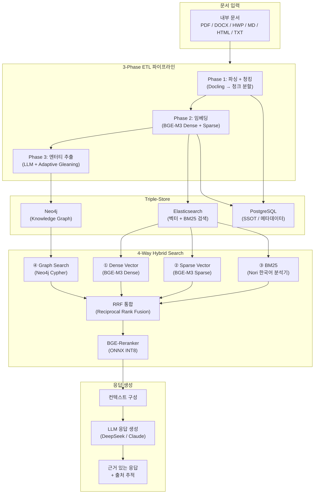
```mermaid
flowchart TB
    subgraph Input["문서 입력"]
        DOCS["내부 문서\nPDF / DOCX / HWP / MD / HTML / TXT"]
    end

    subgraph ETL["3-Phase ETL 파이프라인"]
        P1["Phase 1: 파싱 + 청킹\n(Docling → 청크 분할)"]
        P2["Phase 2: 임베딩\n(BGE-M3 Dense + Sparse)"]
        P3["Phase 3: 엔터티 추출\n(LLM + Adaptive Gleaning)"]
        P1 --> P2 --> P3
    end

    subgraph TripleStore["Triple-Store"]
        PG["PostgreSQL\n(SSOT / 메타데이터)"]
        ES["Elasticsearch\n(벡터 + BM25 검색)"]
        NEO["Neo4j\n(Knowledge Graph)"]
    end

    subgraph Search["4-Way Hybrid Search"]
        DENSE["① Dense Vector\n(BGE-M3 Dense)"]
        SPARSE["② Sparse Vector\n(BGE-M3 Sparse)"]
        BM25S["③ BM25\n(Nori 한국어 분석기)"]
        GRAPH["④ Graph Search\n(Neo4j Cypher)"]
        RRF["RRF 통합\n(Reciprocal Rank Fusion)"]
        RERANK["BGE-Reranker\n(ONNX INT8)"]

        DENSE --> RRF
        SPARSE --> RRF
        BM25S --> RRF
        GRAPH --> RRF
        RRF --> RERANK
    end

    subgraph Generation["응답 생성"]
        CTX["컨텍스트 구성"]
        LLM["LLM 응답 생성\n(DeepSeek / Claude)"]
        ANS["근거 있는 응답\n+ 출처 추적"]
    end

    DOCS --> ETL
    P2 --> ES
    P2 --> PG
    P3 --> NEO
    P1 --> PG

    ES --> DENSE
    ES --> SPARSE
    ES --> BM25S
    NEO --> GRAPH

    RERANK --> CTX --> LLM --> ANS
```

---

## 3. 4-Way Hybrid Search — 검색의 네 축

### 3.1 네 가지 검색 방식의 특성

단일 검색 방식은 각자 맹점을 가집니다. 네 방식이 서로의 약점을 보완할 때 시스템 전체의 검색 품질이 최대화됩니다.

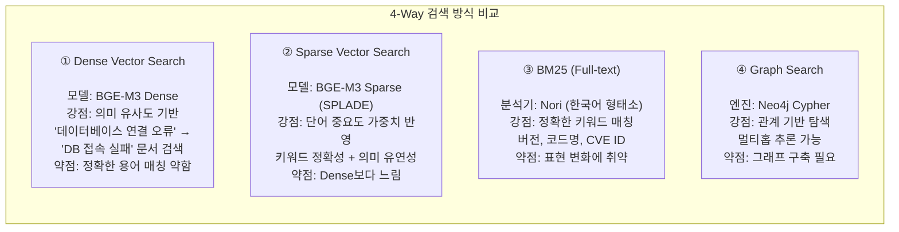
```mermaid
flowchart LR
    subgraph FourWay["4-Way 검색 방식 비교"]
        direction TB

        D["① Dense Vector Search\n\n모델: BGE-M3 Dense\n강점: 의미 유사도 기반\n'데이터베이스 연결 오류' →\n'DB 접속 실패' 문서 검색\n약점: 정확한 용어 매칭 약함"]

        S["② Sparse Vector Search\n\n모델: BGE-M3 Sparse (SPLADE)\n강점: 단어 중요도 가중치 반영\n키워드 정확성 + 의미 유연성\n약점: Dense보다 느림"]

        B["③ BM25 (Full-text)\n\n분석기: Nori (한국어 형태소)\n강점: 정확한 키워드 매칭\n버전, 코드명, CVE ID\n약점: 표현 변화에 취약"]

        G["④ Graph Search\n\n엔진: Neo4j Cypher\n강점: 관계 기반 탐색\n멀티홉 추론 가능\n약점: 그래프 구축 필요"]
    end
```

**왜 Sparse Vector가 필요한가?** BGE-M3는 Dense와 Sparse 임베딩을 동시에 지원하는 모델입니다. Dense는 고차원 밀집 벡터로 의미 유사도를 포착하고, Sparse는 SPLADE 방식으로 중요 단어에 가중치를 부여합니다. 두 방식을 함께 사용하면 Dense만으로는 잡히지 않는 키워드 정확성도 확보할 수 있습니다.

**왜 Nori 한국어 분석기가 반드시 필요한가?** 한국어는 형태소 분리 없이 BM25를 적용하면 검색 품질이 크게 저하됩니다. 예를 들어 "검색한다"와 "검색"이 매칭되지 않거나, "시스템의"와 "시스템"이 서로 다른 토큰으로 처리됩니다. Elasticsearch에 Nori 플러그인을 적용하면 이 문제를 해결할 수 있습니다. 이 설정을 빠뜨리면 BM25 경로가 사실상 무력화됩니다.

### 3.2 RRF (Reciprocal Rank Fusion) 통합

네 가지 검색 결과를 단순 점수 합산으로 통합하면 각 방식의 점수 척도가 달라서 왜곡이 발생합니다. RRF는 점수 대신 **순위(rank)** 를 기반으로 통합하므로 척도 불일치 문제를 해결합니다.

```
RRF 점수 = Σ (1 / (k + rank_i))     [k = 60, 기본값]

예시:
문서 A: Dense 1위, Sparse 3위, BM25 2위, Graph 미포함
→ RRF = 1/(60+1) + 1/(60+3) + 1/(60+2) = 0.0484

문서 B: Dense 미포함, Sparse 1위, BM25 1위, Graph 1위
→ RRF = 1/(60+1) + 1/(60+1) + 1/(60+1) = 0.0492
→ 문서 B 최종 상위
```

RRF 이후 **BGE-Reranker(Cross-encoder)** 로 최종 재순위를 수행합니다. Cross-encoder는 질의와 문서를 함께 입력받아 관련도를 계산하므로, bi-encoder(임베딩) 방식보다 정밀합니다. 단, 모든 후보에 적용하면 느리기 때문에 RRF로 좁힌 상위 후보(예: top-50)에만 적용하는 것이 효율적입니다.

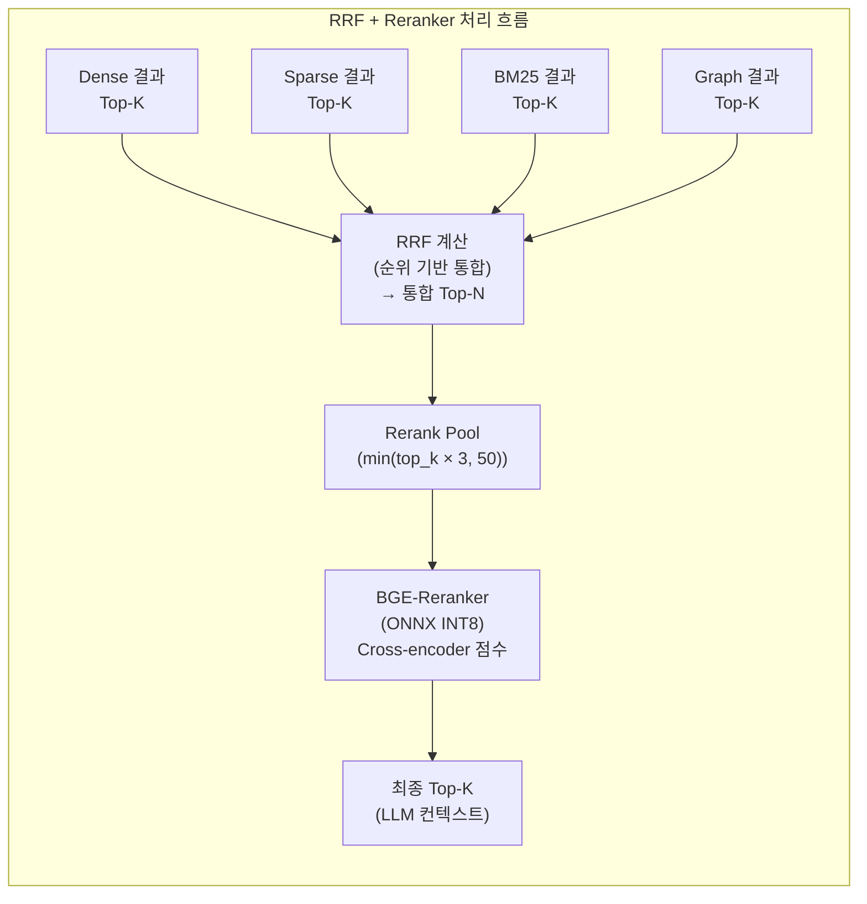
```mermaid
flowchart LR
    subgraph RRFProcess["RRF + Reranker 처리 흐름"]
        DENSE_R["Dense 결과\nTop-K"]
        SPARSE_R["Sparse 결과\nTop-K"]
        BM25_R["BM25 결과\nTop-K"]
        GRAPH_R["Graph 결과\nTop-K"]

        RRF_CALC["RRF 계산\n(순위 기반 통합)\n→ 통합 Top-N"]
        RERANK_POOL["Rerank Pool\n(min(top_k × 3, 50))"]
        RERANKER["BGE-Reranker\n(ONNX INT8)\nCross-encoder 점수"]
        FINAL["최종 Top-K\n(LLM 컨텍스트)"]

        DENSE_R --> RRF_CALC
        SPARSE_R --> RRF_CALC
        BM25_R --> RRF_CALC
        GRAPH_R --> RRF_CALC

        RRF_CALC --> RERANK_POOL --> RERANKER --> FINAL
    end
```

**실측 검증에서 얻은 Reranker 관련 중요 교훈**: Cross-encoder 2-Pass(재순위 → 재재순위)는 수학적으로 중복입니다. Cross-encoder가 이미 질의-문서 쌍의 절대적 관련도를 계산하므로, 동일 모델로 두 번 통과시켜도 순위가 바뀌지 않습니다. **1-Pass로 충분합니다.**

### 3.3 Graph Search의 역할

Graph Search는 나머지 세 방식이 처리하지 못하는 **관계 기반 질의**를 담당합니다.

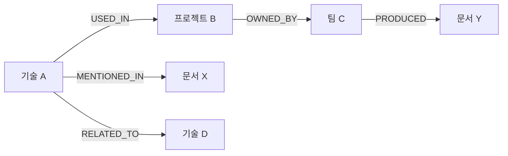
```mermaid
graph LR
    TECH["기술 A"]
    PROJ["프로젝트 B"]
    TEAM["팀 C"]
    DOC1["문서 X"]
    DOC2["문서 Y"]

    TECH --"USED_IN"--> PROJ
    TECH --"MENTIONED_IN"--> DOC1
    PROJ --"OWNED_BY"--> TEAM
    TEAM --"PRODUCED"--> DOC2
    TECH --"RELATED_TO"--> TECH2["기술 D"]
```

"기술 A가 프로젝트 B에서 어떻게 사용되며, 담당 팀은 어디인가?"라는 질의는 Cypher 그래프 탐색으로 직접 답할 수 있습니다. 이 정보가 문서 전반에 흩어져 있어도 그래프 경로를 따라가면 연결됩니다.

---

## 4. Triple-Store 아키텍처 — 세 저장소의 역할 분담

### 4.1 왜 세 개의 저장소가 필요한가

하나의 저장소로 모든 역할을 처리하려는 것은 자연스러운 단순화 욕구이지만, 각 저장소는 서로 다른 장점을 가집니다. Triple-Store는 각 저장소에 가장 잘하는 역할을 배분합니다.

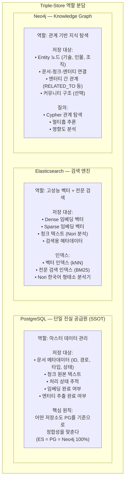
```mermaid
flowchart TB
    subgraph TripleStore["Triple-Store 역할 분담"]
        direction LR

        subgraph PG_ROLE["PostgreSQL — 단일 진실 공급원 (SSOT)"]
            PG_N["역할: 마스터 데이터 관리\n\n저장 대상:\n• 문서 메타데이터 (ID, 경로, 타입, 상태)\n• 청크 원본 텍스트\n• 처리 상태 추적\n• 임베딩 완료 여부\n• 엔터티 추출 완료 여부\n\n핵심 원칙:\n어떤 저장소도 PG를 기준으로\n정합성을 맞춘다\n(ES = PG = Neo4j 100%)"]
        end

        subgraph ES_ROLE["Elasticsearch — 검색 엔진"]
            ES_N["역할: 고성능 벡터 + 전문 검색\n\n저장 대상:\n• Dense 임베딩 벡터\n• Sparse 임베딩 벡터\n• 청크 텍스트 (Nori 분석)\n• 검색용 메타데이터\n\n인덱스:\n• 벡터 인덱스 (kNN)\n• 전문 검색 인덱스 (BM25)\n• Nori 한국어 형태소 분석기"]
        end

        subgraph NEO_ROLE["Neo4j — Knowledge Graph"]
            NEO_N["역할: 관계 기반 지식 탐색\n\n저장 대상:\n• Entity 노드 (기술, 인물, 조직)\n• 문서-청크-엔터티 연결\n• 엔터티 간 관계 (RELATED_TO 등)\n• 커뮤니티 구조 (선택)\n\n질의:\n• Cypher 관계 탐색\n• 멀티홉 추론\n• 영향도 분석"]
        end
    end
```

### 4.2 데이터 흐름과 정합성 관리

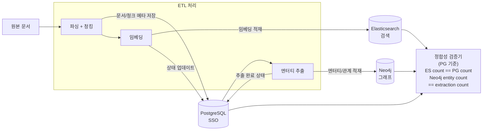
```mermaid
flowchart LR
    DOC["원본 문서"]

    subgraph ETL["ETL 처리"]
        PARSE["파싱 + 청킹"]
        EMBED["임베딩"]
        ENTITY["엔터티 추출"]
    end

    PG_DB[("PostgreSQL\nSSO")]
    ES_DB[("Elasticsearch\n검색")]
    NEO_DB[("Neo4j\n그래프")]

    CHECKER["정합성 검증기\n(PG 기준)\nES count == PG count\nNeo4j entity count\n== extraction count"]

    DOC --> PARSE
    PARSE --> |"문서/청크 메타 저장"| PG_DB
    PARSE --> EMBED
    EMBED --> |"임베딩 적재"| ES_DB
    EMBED --> |"상태 업데이트"| PG_DB
    PG_DB --> ENTITY
    ENTITY --> |"엔터티/관계 적재"| NEO_DB
    ENTITY --> |"추출 완료 상태"| PG_DB

    PG_DB --> CHECKER
    ES_DB --> CHECKER
    NEO_DB --> CHECKER
```

**정합성 원칙**: 어떤 작업이든 PostgreSQL 상태를 기준으로 진행합니다. ETL이 중단되거나 재시작되어도 PG의 처리 상태(pending/processing/done/failed)를 보고 미완료 항목만 재처리합니다. 이 원칙을 지키면 ETL 파이프라인의 멱등성(idempotency)이 보장됩니다.

---

## 5. 3-Phase ETL 파이프라인 — 문서에서 지식으로

### 5.1 왜 3단계로 분리하는가

단일 파이프라인으로 파싱부터 엔터티 추출까지 처리하면, 어느 한 단계의 오류가 전체를 중단시킵니다. 3-Phase 분리는 각 단계를 독립적으로 실행, 재시도, 병렬화할 수 있게 합니다.

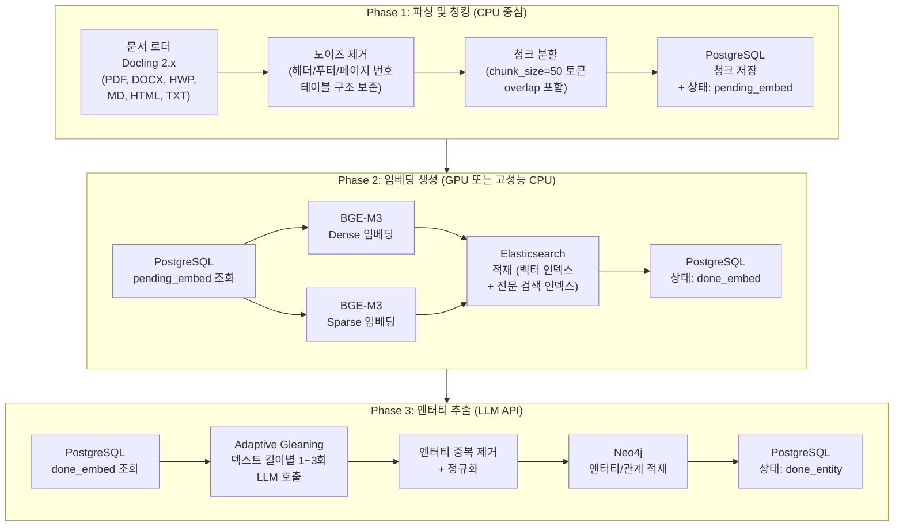
```mermaid
flowchart TB
    subgraph Phase1["Phase 1: 파싱 및 청킹 (CPU 중심)"]
        direction LR
        LOADER["문서 로더\nDocling 2.x\n(PDF, DOCX, HWP,\nMD, HTML, TXT)"]
        CLEAN["노이즈 제거\n(헤더/푸터/페이지 번호\n테이블 구조 보존)"]
        CHUNK["청크 분할\n(chunk_size=50 토큰\noverlap 포함)"]
        STORE_PG1["PostgreSQL\n청크 저장\n+ 상태: pending_embed"]

        LOADER --> CLEAN --> CHUNK --> STORE_PG1
    end

    subgraph Phase2["Phase 2: 임베딩 생성 (GPU 또는 고성능 CPU)"]
        direction LR
        READ_PG2["PostgreSQL\npending_embed 조회"]
        BGE_D["BGE-M3\nDense 임베딩"]
        BGE_S["BGE-M3\nSparse 임베딩"]
        STORE_ES["Elasticsearch\n적재 (벡터 인덱스\n+ 전문 검색 인덱스)"]
        UPDATE_PG2["PostgreSQL\n상태: done_embed"]

        READ_PG2 --> BGE_D
        READ_PG2 --> BGE_S
        BGE_D --> STORE_ES
        BGE_S --> STORE_ES
        STORE_ES --> UPDATE_PG2
    end

    subgraph Phase3["Phase 3: 엔터티 추출 (LLM API)"]
        direction LR
        READ_PG3["PostgreSQL\ndone_embed 조회"]
        GLEANING["Adaptive Gleaning\n텍스트 길이별 1~3회\nLLM 호출"]
        DEDUP["엔터티 중복 제거\n+ 정규화"]
        STORE_NEO["Neo4j\n엔터티/관계 적재"]
        UPDATE_PG3["PostgreSQL\n상태: done_entity"]

        READ_PG3 --> GLEANING --> DEDUP --> STORE_NEO --> UPDATE_PG3
    end

    Phase1 --> Phase2 --> Phase3
```

### 5.2 Docling — 한국어 문서 파싱의 핵심

Docling은 IBM에서 개발한 오픈소스 문서 파싱 라이브러리로, PDF의 레이아웃 분석, DOCX의 구조 인식, HWP 변환, 마크다운 등을 지원합니다. 특히 한국어 환경에서 HWP 파일을 처리해야 하는 경우 Docling이 사실상 유일한 오픈소스 선택지입니다.

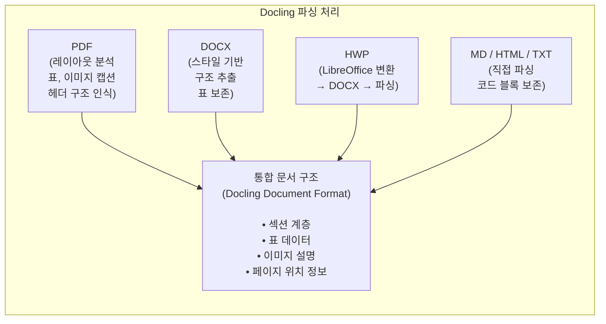
```mermaid
flowchart LR
    subgraph DoclingParsing["Docling 파싱 처리"]
        PDF["PDF\n(레이아웃 분석\n표, 이미지 캡션\n헤더 구조 인식)"]
        DOCX["DOCX\n(스타일 기반\n구조 추출\n표 보존)"]
        HWP["HWP\n(LibreOffice 변환\n→ DOCX → 파싱)"]
        MD["MD / HTML / TXT\n(직접 파싱\n코드 블록 보존)"]

        UNIFIED["통합 문서 구조\n(Docling Document Format)\n\n• 섹션 계층\n• 표 데이터\n• 이미지 설명\n• 페이지 위치 정보"]

        PDF --> UNIFIED
        DOCX --> UNIFIED
        HWP --> UNIFIED
        MD --> UNIFIED
    end
```

### 5.3 청크 크기 설정의 중요성

청크 크기는 검색 품질에 직접적인 영향을 미칩니다. 실측 실험에서 도출된 핵심 인사이트는 다음과 같습니다.

| 청크 크기 | 검색 품질 | LLM 컨텍스트 효율 | 비고 |
|---|---|---|---|
| 200 토큰 이상 | Context Recall 저하 | 컨텍스트 길어짐 | 너무 많은 정보가 한 청크에 |
| **50~100 토큰** | **최적** | 효율적 | 핵심 정보 집중 |
| 30 토큰 이하 | Context Precision 저하 | 청크 수 과다 | 맥락 단절 |

**50 토큰 청크**가 Context Precision과 Context Recall 모두에서 균형 잡힌 성능을 보이는 경우가 많지만, 문서 유형과 도메인에 따라 다를 수 있으므로 반드시 실측 검증이 필요합니다.

### 5.4 Adaptive Gleaning — 동적 엔터티 추출

LLM은 단일 추출 패스(1회 호출)로 문서 내 모든 엔터티를 추출하지 못합니다. 반복 추출(Gleaning)을 통해 누락된 엔터티를 보완할 수 있지만, 모든 청크에 동일한 횟수를 적용하면 비효율적입니다.

Adaptive Gleaning은 텍스트 길이에 따라 추출 횟수를 동적으로 결정합니다.

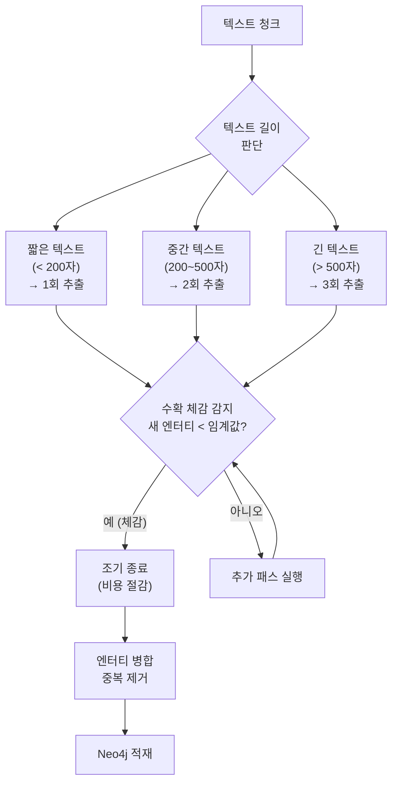
```mermaid
flowchart TD
    CHUNK_IN["텍스트 청크"]

    LENGTH_CHECK{"텍스트 길이\n판단"}

    SHORT["짧은 텍스트\n(< 200자)\n→ 1회 추출"]
    MEDIUM["중간 텍스트\n(200~500자)\n→ 2회 추출"]
    LONG["긴 텍스트\n(> 500자)\n→ 3회 추출"]

    DIMINISH_CHECK{"수확 체감 감지\n새 엔터티 < 임계값?"}
    EARLY_STOP["조기 종료\n(비용 절감)"]
    CONTINUE["추가 패스 실행"]

    MERGE["엔터티 병합\n중복 제거"]
    NEO4J_OUT["Neo4j 적재"]

    CHUNK_IN --> LENGTH_CHECK
    LENGTH_CHECK --> SHORT
    LENGTH_CHECK --> MEDIUM
    LENGTH_CHECK --> LONG

    SHORT --> DIMINISH_CHECK
    MEDIUM --> DIMINISH_CHECK
    LONG --> DIMINISH_CHECK

    DIMINISH_CHECK --> |"예 (체감)"| EARLY_STOP
    DIMINISH_CHECK --> |"아니오"| CONTINUE
    CONTINUE --> DIMINISH_CHECK

    EARLY_STOP --> MERGE
    MERGE --> NEO4J_OUT
```

---

## 6. Knowledge Graph 구축 전략

### 6.1 엔터티 유형 설계

Knowledge Graph의 품질은 엔터티 유형 설계에서 결정됩니다. 실무에서 유용한 최소 엔터티 유형 세트는 다음과 같습니다.

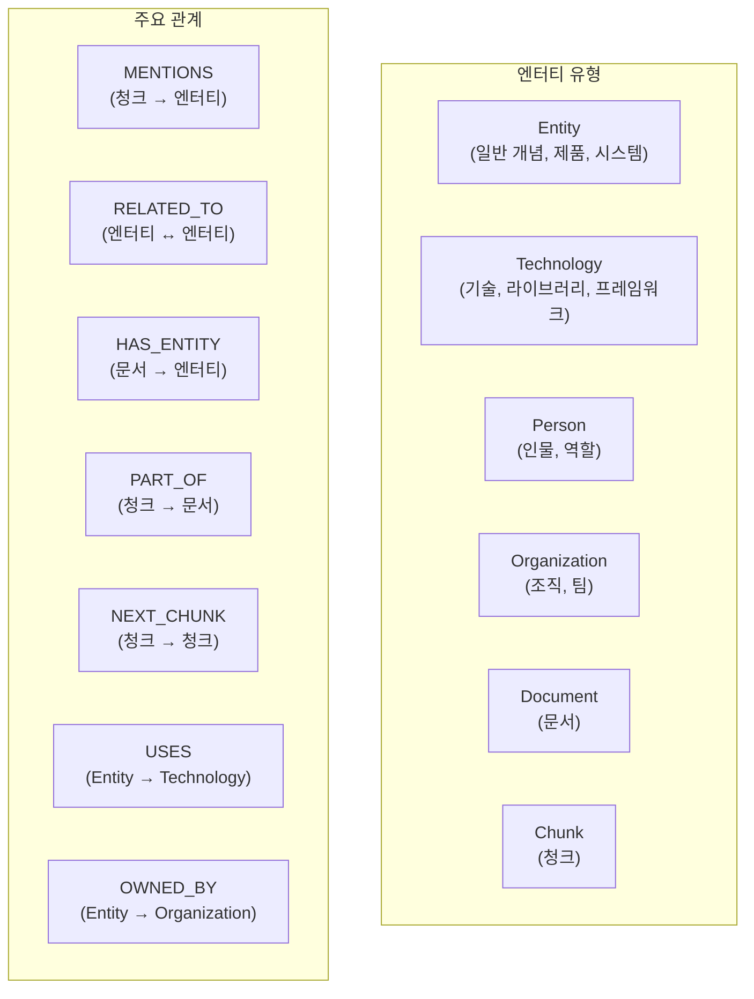
```mermaid
graph TD
    subgraph EntityTypes["엔터티 유형"]
        ENTITY["Entity\n(일반 개념, 제품, 시스템)"]
        TECH["Technology\n(기술, 라이브러리, 프레임워크)"]
        PERSON["Person\n(인물, 역할)"]
        ORG["Organization\n(조직, 팀)"]
        DOC_NODE["Document\n(문서)"]
        CHUNK_NODE["Chunk\n(청크)"]
    end

    subgraph Relations["주요 관계"]
        MENTIONS["MENTIONS\n(청크 → 엔터티)"]
        RELATED_TO["RELATED_TO\n(엔터티 ↔ 엔터티)"]
        HAS_ENTITY["HAS_ENTITY\n(문서 → 엔터티)"]
        PART_OF["PART_OF\n(청크 → 문서)"]
        NEXT_CHUNK["NEXT_CHUNK\n(청크 → 청크)"]
        USES["USES\n(Entity → Technology)"]
        OWNED_BY["OWNED_BY\n(Entity → Organization)"]
    end
```

### 6.2 Knowledge Graph 적재 후 구조 예시

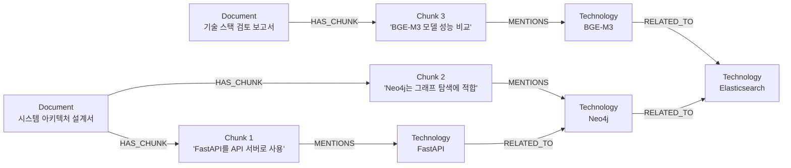
```mermaid
graph LR
    DOC1["Document\n시스템 아키텍처 설계서"]
    DOC2["Document\n기술 스택 검토 보고서"]

    C1["Chunk 1\n'FastAPI를 API 서버로 사용'"]
    C2["Chunk 2\n'Neo4j는 그래프 탐색에 적합'"]
    C3["Chunk 3\n'BGE-M3 모델 성능 비교'"]

    FASTAPI["Technology\nFastAPI"]
    NEO4J_E["Technology\nNeo4j"]
    BGEM3["Technology\nBGE-M3"]
    ELASTIC["Technology\nElasticsearch"]

    DOC1 --"HAS_CHUNK"--> C1
    DOC1 --"HAS_CHUNK"--> C2
    DOC2 --"HAS_CHUNK"--> C3

    C1 --"MENTIONS"--> FASTAPI
    C2 --"MENTIONS"--> NEO4J_E
    C3 --"MENTIONS"--> BGEM3

    FASTAPI --"RELATED_TO"--> NEO4J_E
    BGEM3 --"RELATED_TO"--> ELASTIC
    NEO4J_E --"RELATED_TO"--> ELASTIC
```

### 6.3 Graph Search와 Vector Search의 결합

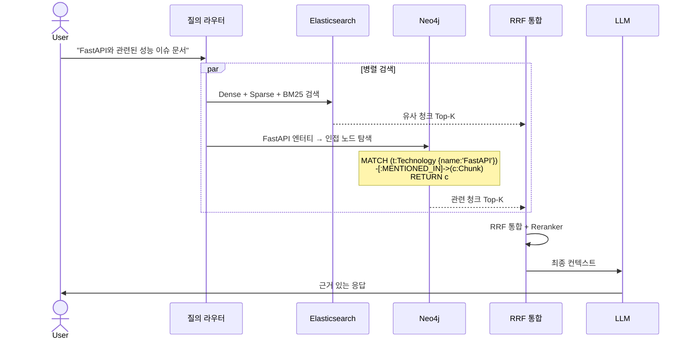
```mermaid
sequenceDiagram
    actor User
    participant Router as 질의 라우터
    participant ES as Elasticsearch
    participant Neo4j as Neo4j
    participant RRF as RRF 통합
    participant LLM as LLM

    User->>Router: "FastAPI와 관련된 성능 이슈 문서"

    par 병렬 검색
        Router->>ES: Dense + Sparse + BM25 검색
        ES-->>RRF: 유사 청크 Top-K

        Router->>Neo4j: FastAPI 엔터티 → 인접 노드 탐색
        Note over Neo4j: MATCH (t:Technology {name:'FastAPI'})<br/>-[:MENTIONED_IN]->(c:Chunk)<br/>RETURN c
        Neo4j-->>RRF: 관련 청크 Top-K
    end

    RRF->>RRF: RRF 통합 + Reranker
    RRF->>LLM: 최종 컨텍스트
    LLM->>User: 근거 있는 응답
```

---

## 7. 검색 품질 측정 — RAGAS 평가 체계

### 7.1 RAGAS란 무엇인가

RAGAS(RAG Assessment)는 RAG 시스템의 품질을 자동으로 측정하는 평가 프레임워크입니다. LLM이 평가자(Judge) 역할을 수행하여 응답의 다양한 측면을 점수화합니다.

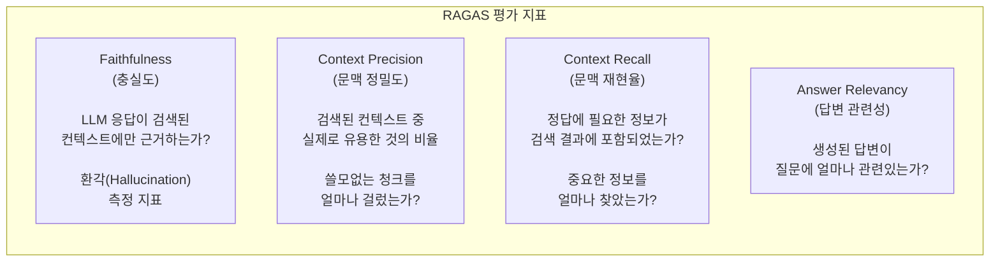
```mermaid
flowchart LR
    subgraph RAGASMetrics["RAGAS 평가 지표"]
        F["Faithfulness\n(충실도)\n\nLLM 응답이 검색된\n컨텍스트에만 근거하는가?\n\n환각(Hallucination)\n측정 지표"]

        CP["Context Precision\n(문맥 정밀도)\n\n검색된 컨텍스트 중\n실제로 유용한 것의 비율\n\n쓸모없는 청크를\n얼마나 걸렀는가?"]

        CR["Context Recall\n(문맥 재현율)\n\n정답에 필요한 정보가\n검색 결과에 포함되었는가?\n\n중요한 정보를\n얼마나 찾았는가?"]

        ART["Answer Relevancy\n(답변 관련성)\n\n생성된 답변이\n질문에 얼마나 관련있는가?"]
    end
```

### 7.2 반복 실험을 통한 품질 개선 방법론

RAGAS를 활용한 체계적 품질 개선은 **변수 격리 원칙**을 따릅니다. 한 번에 하나의 변수만 변경하고, 그 영향을 측정한 후 다음 변수를 조정합니다.

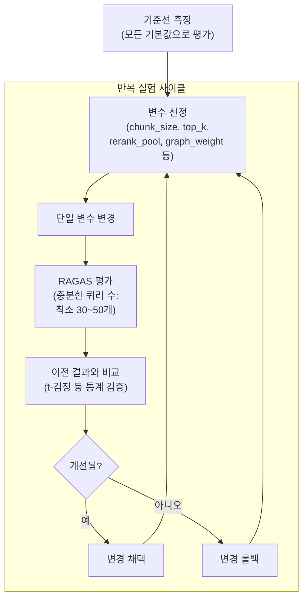
```mermaid
flowchart TD
    BASELINE["기준선 측정\n(모든 기본값으로 평가)"]

    subgraph ExperimentCycle["반복 실험 사이클"]
        direction LR
        SELECT["변수 선정\n(chunk_size, top_k,\nrerank_pool, graph_weight 등)"]
        CHANGE["단일 변수 변경"]
        EVAL["RAGAS 평가\n(충분한 쿼리 수:\n최소 30~50개)"]
        COMPARE["이전 결과와 비교\n(t-검정 등 통계 검증)"]
        DECIDE{"개선됨?"}
        ADOPT["변경 채택"]
        REVERT["변경 롤백"]
    end

    BASELINE --> SELECT
    SELECT --> CHANGE --> EVAL --> COMPARE --> DECIDE
    DECIDE --> |"예"| ADOPT --> SELECT
    DECIDE --> |"아니오"| REVERT --> SELECT
```

**중요**: RAGAS 평가에 사용하는 쿼리 세트를 충분히 다양하고 크게 구성해야 합니다. 쿼리 수가 너무 적으면 측정 노이즈가 커서 진짜 개선인지 우연인지 판단하기 어렵습니다.

### 7.3 주요 파라미터와 품질 영향

| 파라미터 | 설명 | 품질 영향 | 권장 시작점 |
|---|---|---|---|
| `chunk_size` | 청크 토큰 수 | Context Precision/Recall 균형 | 50~100 |
| `top_k` (검색 수) | 각 검색 방식 후보 수 | Recall vs 속도 | 10~20 |
| `graph_search_top_k` | Graph Search 후보 수 | Precision에 민감 | 10 |
| `rerank_pool` | Reranker 입력 후보 수 | `min(top_k×3, 50)` | 30~50 |
| `gleaning_rounds` | 엔터티 추출 반복 횟수 | Graph 품질 | Adaptive |

---

## 8. LLM 비용 최적화 전략

### 8.1 역할별 LLM 분리 원칙

모든 LLM 호출에 최고 성능 모델을 사용하면 비용이 기하급수적으로 증가합니다. 역할의 난이도에 따라 모델을 분리하는 것이 핵심입니다.

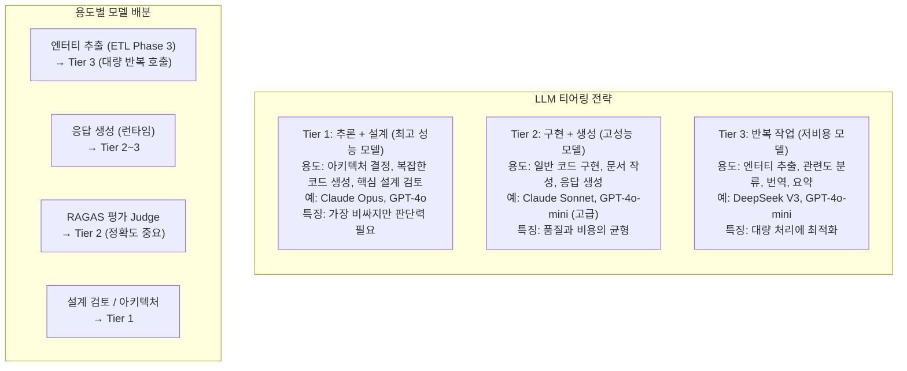
```mermaid
flowchart TD
    subgraph ModelTiering["LLM 티어링 전략"]
        direction TB

        T1["Tier 1: 추론 + 설계 (최고 성능 모델)\n용도: 아키텍처 결정, 복잡한 코드 생성, 핵심 설계 검토\n예: Claude Opus, GPT-4o\n특징: 가장 비싸지만 판단력 필요"]

        T2["Tier 2: 구현 + 생성 (고성능 모델)\n용도: 일반 코드 구현, 문서 작성, 응답 생성\n예: Claude Sonnet, GPT-4o-mini (고급)\n특징: 품질과 비용의 균형"]

        T3["Tier 3: 반복 작업 (저비용 모델)\n용도: 엔터티 추출, 관련도 분류, 번역, 요약\n예: DeepSeek V3, GPT-4o-mini\n특징: 대량 처리에 최적화"]
    end

    subgraph UseCases["용도별 모델 배분"]
        U1["엔터티 추출 (ETL Phase 3)\n→ Tier 3 (대량 반복 호출)"]
        U2["응답 생성 (런타임)\n→ Tier 2~3"]
        U3["RAGAS 평가 Judge\n→ Tier 2 (정확도 중요)"]
        U4["설계 검토 / 아키텍처\n→ Tier 1"]
    end
```

### 8.2 DeepSeek V3 계열의 비용 효율

한국어 엔터프라이즈 환경에서 엔터티 추출, 분류, 응답 생성 등 대량 호출이 발생하는 작업에 DeepSeek V3 계열을 적용하면 비용을 대폭 절감할 수 있습니다. GPT-4o급 품질을 약 1/15 비용으로 달성하는 것이 실측에서 확인됩니다.

| 모델 | 상대 비용 | 품질 | 권장 용도 |
|---|---|---|---|
| **DeepSeek V3.2** | **1x (기준)** | GPT-4o급 | ETL 엔터티 추출, 런타임 응답 |
| GPT-4o | ~15x | 매우 높음 | RAGAS Judge, 핵심 설계 |
| Claude Sonnet | ~20x | 매우 높음 | 아키텍처 설계, 코드 리뷰 |
| Claude Opus | ~100x | 최고 | 핵심 의사결정, 복잡한 추론 |

**임베딩 캐싱**은 또 다른 중요한 비용 절감 방법입니다. 동일한 텍스트에 대한 임베딩을 재계산하지 않고 캐시에서 반환하면 반복적인 처리에서 수십~수백 배의 속도 향상을 얻을 수 있습니다.

---

## 9. SW 아키텍처 전체 설계

### 9.1 컴포넌트 구성도

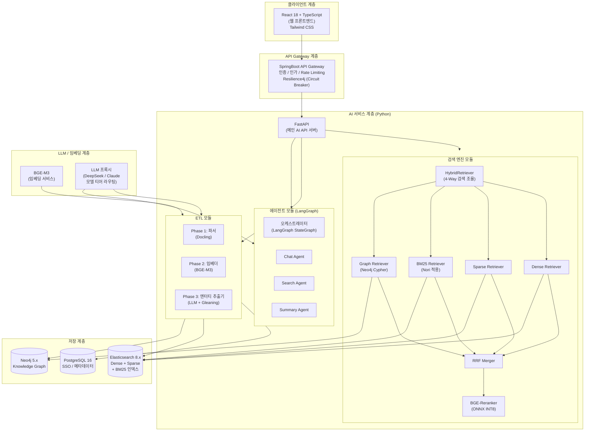
```mermaid
flowchart TB
    subgraph ClientLayer["클라이언트 계층"]
        REACT["React 18 + TypeScript\n(웹 프론트엔드)\nTailwind CSS"]
    end

    subgraph GatewayLayer["API Gateway 계층"]
        GW["SpringBoot API Gateway\n인증 / 인가 / Rate Limiting\nResilience4j (Circuit Breaker)"]
    end

    subgraph AIServiceLayer["AI 서비스 계층 (Python)"]
        FASTAPI["FastAPI\n(메인 AI API 서버)"]

        subgraph SearchEngine["검색 엔진 모듈"]
            HYBRID_RETRIEVER["HybridRetriever\n(4-Way 검색 조율)"]
            DENSE_R["Dense Retriever"]
            SPARSE_R["Sparse Retriever"]
            BM25_R["BM25 Retriever\n(Nori 적용)"]
            GRAPH_R["Graph Retriever\n(Neo4j Cypher)"]
            RRF_MERGER["RRF Merger"]
            RERANKER_SVC["BGE-Reranker\n(ONNX INT8)"]

            HYBRID_RETRIEVER --> DENSE_R
            HYBRID_RETRIEVER --> SPARSE_R
            HYBRID_RETRIEVER --> BM25_R
            HYBRID_RETRIEVER --> GRAPH_R
            DENSE_R --> RRF_MERGER
            SPARSE_R --> RRF_MERGER
            BM25_R --> RRF_MERGER
            GRAPH_R --> RRF_MERGER
            RRF_MERGER --> RERANKER_SVC
        end

        subgraph ETLModule["ETL 모듈"]
            ETL_P1["Phase 1: 파서\n(Docling)"]
            ETL_P2["Phase 2: 임베더\n(BGE-M3)"]
            ETL_P3["Phase 3: 엔터티 추출기\n(LLM + Gleaning)"]
        end

        subgraph AgentModule["에이전트 모듈 (LangGraph)"]
            ORCHESTRATOR["오케스트레이터\n(LangGraph StateGraph)"]
            CHAT_AGENT["Chat Agent"]
            SEARCH_AGENT["Search Agent"]
            SUMMARY_AGENT["Summary Agent"]
        end

        FASTAPI --> SearchEngine
        FASTAPI --> ETLModule
        FASTAPI --> AgentModule
    end

    subgraph StorageLayer["저장 계층"]
        PG_STORE[("PostgreSQL 16\nSSO / 메타데이터")]
        ES_STORE[("Elasticsearch 8.x\nDense + Sparse\n+ BM25 인덱스")]
        NEO_STORE[("Neo4j 5.x\nKnowledge Graph")]
    end

    subgraph LLMLayer["LLM / 임베딩 계층"]
        BGEM3_SVC["BGE-M3\n(임베딩 서비스)"]
        LLM_PROXY["LLM 프록시\n(DeepSeek / Claude\n모델 티어 라우팅)"]
    end

    REACT --> GW --> FASTAPI
    DENSE_R --> ES_STORE
    SPARSE_R --> ES_STORE
    BM25_R --> ES_STORE
    GRAPH_R --> NEO_STORE
    ETLModule --> PG_STORE
    ETLModule --> ES_STORE
    ETLModule --> NEO_STORE
    BGEM3_SVC --> ETLModule
    LLM_PROXY --> ETLModule
    LLM_PROXY --> AgentModule
```

### 9.2 LangGraph 기반 AI 에이전트 오케스트레이션

단순 질의-응답을 넘어 복잡한 작업(멀티스텝 검색, 요약 + 검색 결합 등)을 처리하려면 에이전트 오케스트레이션이 필요합니다. LangGraph는 상태 기계(StateGraph) 방식으로 에이전트 흐름을 정의합니다.

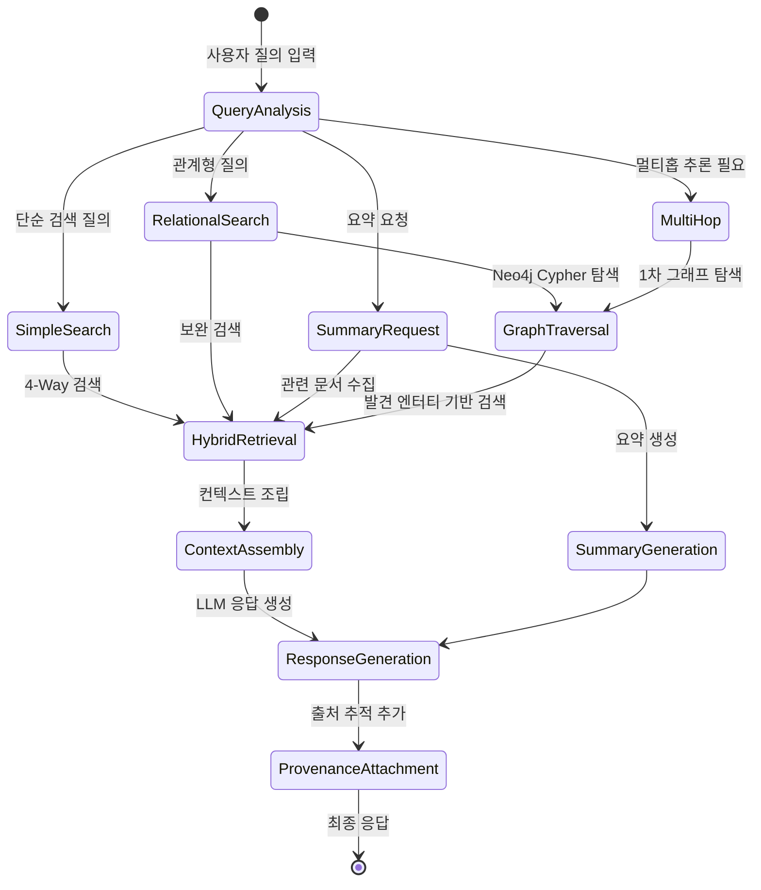
```mermaid
stateDiagram-v2
    [*] --> QueryAnalysis: 사용자 질의 입력

    QueryAnalysis --> SimpleSearch: 단순 검색 질의
    QueryAnalysis --> RelationalSearch: 관계형 질의
    QueryAnalysis --> SummaryRequest: 요약 요청
    QueryAnalysis --> MultiHop: 멀티홉 추론 필요

    SimpleSearch --> HybridRetrieval: 4-Way 검색
    RelationalSearch --> GraphTraversal: Neo4j Cypher 탐색
    RelationalSearch --> HybridRetrieval: 보완 검색

    SummaryRequest --> HybridRetrieval: 관련 문서 수집
    SummaryRequest --> SummaryGeneration: 요약 생성

    MultiHop --> GraphTraversal: 1차 그래프 탐색
    GraphTraversal --> HybridRetrieval: 발견 엔터티 기반 검색
    HybridRetrieval --> ContextAssembly: 컨텍스트 조립

    ContextAssembly --> ResponseGeneration: LLM 응답 생성
    SummaryGeneration --> ResponseGeneration
    ResponseGeneration --> ProvenanceAttachment: 출처 추적 추가
    ProvenanceAttachment --> [*]: 최종 응답
```

---

## 10. 인프라 및 관측 가능성 설계

### 10.1 Docker Compose 기반 컨테이너 구성

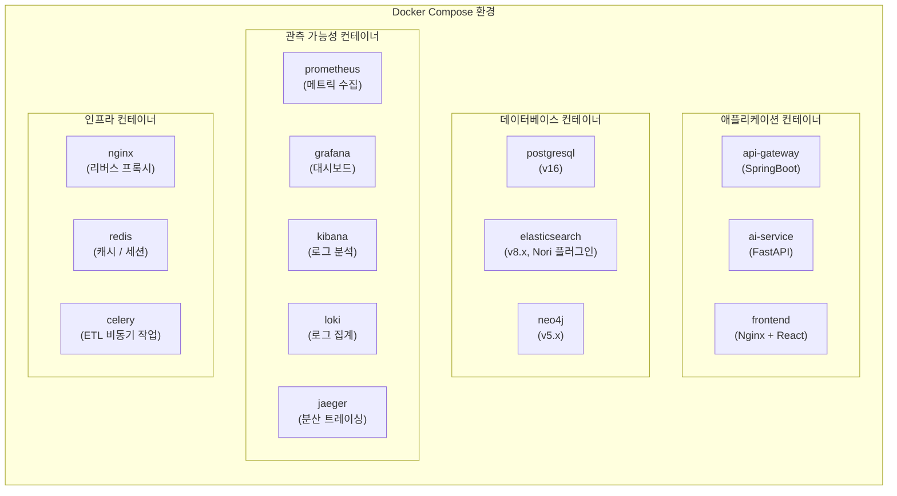
```mermaid
flowchart TB
    subgraph DockerCompose["Docker Compose 환경"]
        direction TB

        subgraph AppContainers["애플리케이션 컨테이너"]
            C_GW["api-gateway\n(SpringBoot)"]
            C_AI["ai-service\n(FastAPI)"]
            C_FE["frontend\n(Nginx + React)"]
        end

        subgraph DBContainers["데이터베이스 컨테이너"]
            C_PG["postgresql\n(v16)"]
            C_ES["elasticsearch\n(v8.x, Nori 플러그인)"]
            C_NEO["neo4j\n(v5.x)"]
        end

        subgraph ObsContainers["관측 가능성 컨테이너"]
            C_PROM["prometheus\n(메트릭 수집)"]
            C_GRAF["grafana\n(대시보드)"]
            C_KIBANA["kibana\n(로그 분석)"]
            C_LOKI["loki\n(로그 집계)"]
            C_JAEGER["jaeger\n(분산 트레이싱)"]
        end

        subgraph InfraContainers["인프라 컨테이너"]
            C_NGINX["nginx\n(리버스 프록시)"]
            C_REDIS["redis\n(캐시 / 세션)"]
            C_CELERY["celery\n(ETL 비동기 작업)"]
        end
    end
```

### 10.2 관측 가능성 (Observability) 설계

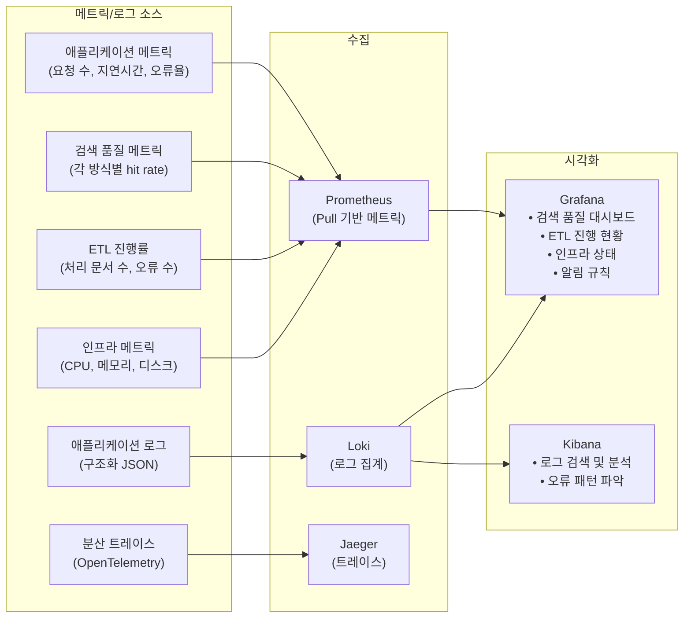
```mermaid
flowchart LR
    subgraph Sources["메트릭/로그 소스"]
        APP_M["애플리케이션 메트릭\n(요청 수, 지연시간, 오류율)"]
        SEARCH_M["검색 품질 메트릭\n(각 방식별 hit rate)"]
        ETL_M["ETL 진행률\n(처리 문서 수, 오류 수)"]
        INFRA_M["인프라 메트릭\n(CPU, 메모리, 디스크)"]
        LOGS["애플리케이션 로그\n(구조화 JSON)"]
        TRACES["분산 트레이스\n(OpenTelemetry)"]
    end

    subgraph Collection["수집"]
        PROM_S["Prometheus\n(Pull 기반 메트릭)"]
        LOKI_S["Loki\n(로그 집계)"]
        JAEGER_S["Jaeger\n(트레이스)"]
    end

    subgraph Visualization["시각화"]
        GRAFANA_V["Grafana\n• 검색 품질 대시보드\n• ETL 진행 현황\n• 인프라 상태\n• 알림 규칙"]
        KIBANA_V["Kibana\n• 로그 검색 및 분석\n• 오류 패턴 파악"]
    end

    APP_M --> PROM_S
    SEARCH_M --> PROM_S
    ETL_M --> PROM_S
    INFRA_M --> PROM_S
    LOGS --> LOKI_S
    TRACES --> JAEGER_S

    PROM_S --> GRAFANA_V
    LOKI_S --> GRAFANA_V
    LOKI_S --> KIBANA_V
```

**모니터링에서 반드시 추적해야 할 핵심 지표:**

| 지표 분류 | 항목 | 설명 |
|---|---|---|
| 검색 품질 | RAGAS 지표 (정기 측정) | Faithfulness, Precision, Recall |
| 검색 성능 | 각 검색 방식별 응답시간 | Dense/Sparse/BM25/Graph 각각 |
| ETL 상태 | PG 처리 상태별 count | pending/done/failed 분포 |
| LLM 비용 | 일일/주간 토큰 사용량 | 모델별, 용도별 분리 |
| 인프라 | ES/Neo4j/PG 메모리/CPU | 병목 감지 |

---

## 11. 단계별 구현 로드맵

### 11.1 4단계 구현 계획

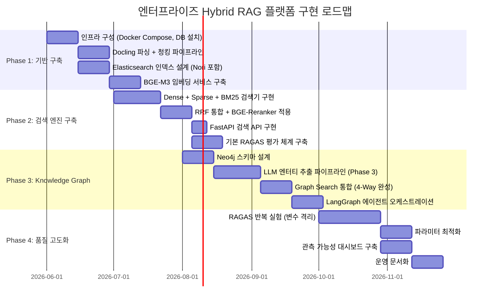
```mermaid
gantt
    title 엔터프라이즈 Hybrid RAG 플랫폼 구현 로드맵
    dateFormat YYYY-MM
    section Phase 1: 기반 구축
    인프라 구성 (Docker Compose, DB 설치)    :p1a, 2026-06, 2w
    Docling 파싱 + 청킹 파이프라인           :p1b, after p1a, 2w
    Elasticsearch 인덱스 설계 (Nori 포함)    :p1c, after p1a, 2w
    BGE-M3 임베딩 서비스 구축               :p1d, after p1b, 2w

    section Phase 2: 검색 엔진 구축
    Dense + Sparse + BM25 검색기 구현       :p2a, 2026-07, 3w
    RRF 통합 + BGE-Reranker 적용           :p2b, after p2a, 2w
    FastAPI 검색 API 구현                   :p2c, after p2b, 1w
    기본 RAGAS 평가 체계 구축              :p2d, after p2b, 2w

    section Phase 3: Knowledge Graph
    Neo4j 스키마 설계                       :p3a, 2026-08, 2w
    LLM 엔터티 추출 파이프라인 (Phase 3)    :p3b, after p3a, 3w
    Graph Search 통합 (4-Way 완성)          :p3c, after p3b, 2w
    LangGraph 에이전트 오케스트레이션       :p3d, after p3c, 2w

    section Phase 4: 품질 고도화
    RAGAS 반복 실험 (변수 격리)             :p4a, 2026-10, 4w
    파라미터 최적화                          :p4b, after p4a, 2w
    관측 가능성 대시보드 구축               :p4c, after p4a, 2w
    운영 문서화                              :p4d, after p4b, 2w
```

### 11.2 단계별 완성 기준 (Definition of Done)

```mermaid
flowchart LR
    subgraph Phase1_DOD["Phase 1 완료 기준"]
        P1D1["Docker Compose로\n전체 인프라 시작 가능"]
        P1D2["PDF/DOCX/HWP 파싱 성공\n(샘플 100개 문서)"]
        P1D3["ES Nori 인덱스\n검증 (형태소 분리 확인)"]
        P1D4["BGE-M3 임베딩\nAPI 응답 < 200ms"]
    end

    subgraph Phase2_DOD["Phase 2 완료 기준"]
        P2D1["4-Way 검색 API\n응답 < 2초"]
        P2D2["RAGAS 초기 점수\n측정 완료 (기준선)"]
        P2D3["단위 테스트\n핵심 모듈 70% 이상"]
    end

    subgraph Phase3_DOD["Phase 3 완료 기준"]
        P3D1["엔터티 추출\n완료율 100%"]
        P3D2["Graph Search\nRRF 통합 동작"]
        P3D3["ES = PG = Neo4j\n정합성 100%"]
    end

    subgraph Phase4_DOD["Phase 4 완료 기준"]
        P4D1["RAGAS Mean\n목표값 달성"]
        P4D2["k6 성능 테스트\n통과"]
        P4D3["운영 매뉴얼\n완성"]
    end
```

---

## 12. 핵심 설계 결정 사항과 교훈

실제 시스템 구축 과정에서 검증된 핵심 설계 결정들을 정리합니다. 이 결정들은 이론이 아닌 실측 데이터에 근거합니다.

### 12.1 반드시 해야 하는 것 (Must-Do)

**Nori 한국어 분석기 E2E 검증은 프로젝트 시작 직후에 수행해야 합니다.** Elasticsearch에 Nori 플러그인을 설치했다고 해서 실제로 적용되는지 보장되지 않습니다. 인덱스 생성 시 `analyzer` 설정을 명시적으로 지정하고, 실제 한국어 검색으로 형태소 분리가 작동하는지 확인해야 합니다. 이 검증을 늦게 하면 전체 ETL을 재실행해야 하는 상황이 발생할 수 있습니다.

**RAGAS 평가 쿼리 세트는 도메인 전문가와 함께 설계해야 합니다.** 자동 생성된 쿼리만으로는 실제 사용 패턴을 반영하지 못합니다. 최소 30개 이상의 대표적 쿼리를 도메인 전문가가 직접 작성하고, 정답(ground truth)도 함께 준비해야 RAGAS 측정이 의미 있습니다.

**PostgreSQL을 SSOT로 엄격히 관리해야 합니다.** ETL 어느 단계에서든 PG의 상태 컬럼을 기준으로 처리 여부를 결정해야 합니다. 이 원칙 없이는 부분 처리, 중복 처리, 일관성 문제가 발생합니다.

### 12.2 하지 말아야 하는 것 (Don't-Do)

**Reranker를 2회 이상 통과시키지 마세요.** Cross-encoder 기반 Reranker는 수학적으로 동일 입력에 동일 점수를 산출합니다. 2-Pass는 추가 비용만 발생하고 품질 개선이 없습니다. 1-Pass로 충분합니다.

**모든 청크에 동일한 Gleaning 횟수를 고정하지 마세요.** 짧은 텍스트에 3번 추출을 시도하면 비용만 낭비됩니다. Adaptive Gleaning으로 텍스트 길이에 따라 횟수를 조정하고, 수확 체감이 감지되면 조기 종료하세요.

**초기부터 완벽한 온톨로지를 설계하려 하지 마세요.** 처음에는 최소 엔터티 유형(Entity, Technology, Person 정도)으로 시작하고, 실제 데이터에서 유용한 패턴이 나타나면 점진적으로 확장하세요. 과도한 초기 설계는 프로젝트를 지연시킵니다.

### 12.3 데이터의 양이 아닌 구조화의 질

```mermaid
flowchart LR
    subgraph DataQuality["데이터 품질의 세 축"]
        Q1["청킹 품질\n\n쓰레기 청크 제거\n(헤더, 페이지 번호,\n의미 없는 단편)\n\n→ Context Precision 향상"]

        Q2["임베딩 품질\n\n도메인 적합 모델 선택\n한국어 특화 모델 검토\n\n→ Dense/Sparse 검색 품질"]

        Q3["엔터티 추출 품질\n\n중복 제거 철저\n관계 방향성 일관성\nGleaning 충분히\n\n→ Graph Search 정확도"]
    end

    Q1 --> TOTAL["전체 RAGAS 점수"]
    Q2 --> TOTAL
    Q3 --> TOTAL

    NOTE["핵심 교훈:\n문서를 더 많이 넣는 것보다\n기존 문서를 잘 구조화하는 것이\n검색 품질을 더 높입니다."]
```

---

## 13. 결론

### 13.1 이 시스템이 제공하는 핵심 가치

단순 키워드 검색이나 1세대 Vector RAG에서 출발하여 **4-Way Hybrid Search + Knowledge Graph**로 확장하면 다음 세 가지 능력이 획기적으로 향상됩니다.

**검색의 완전성**: Dense + Sparse + BM25 + Graph 네 경로가 서로의 맹점을 보완하여, 어떤 표현 방식의 질의도 놓치지 않습니다. 특히 한국어 형태소 분석(Nori)은 한국어 BM25 검색의 품질을 실제로 가르는 결정적 요소입니다.

**관계 기반 추론**: Knowledge Graph를 통해 "A 기술이 B 시스템에 어떻게 사용되며, 담당 조직은 어디인가?" 같은 관계형 질의를 구조적으로 처리할 수 있습니다. 이 능력은 단순 문서 검색으로는 원천적으로 불가능합니다.

**근거 있는 응답**: Triple-Store에 원본 청크와 메타데이터를 체계적으로 관리하면, LLM 응답에 출처를 명시적으로 연결할 수 있습니다. 환각(Hallucination)을 줄이고 신뢰성을 높입니다.

### 13.2 성공적 구축을 위한 우선순위

```mermaid
flowchart TD
    FIRST["1순위: 데이터 파이프라인 안정화\n(Docling 파싱 + Nori 검증 + PG SSOT)\n→ 이것 없으면 나머지가 무의미"]

    SECOND["2순위: 기본 검색 품질 측정\n(RAGAS 기준선 확보)\n→ 개선 방향을 데이터로 결정"]

    THIRD["3순위: 4-Way 통합 + Knowledge Graph\n(점진적 추가)\n→ Dense부터 시작, 나머지 순차 추가"]

    FOURTH["4순위: 파라미터 최적화 실험\n(변수 격리 원칙)\n→ 한 번에 하나씩 측정"]

    FIFTH["5순위: 관측 가능성 + 운영 체계\n(Prometheus/Grafana/Jaeger)\n→ 지속 운영을 위한 기반"]

    FIRST --> SECOND --> THIRD --> FOURTH --> FIFTH
```

데이터 구조화의 질이 모델 선택보다 검색 품질에 더 큰 영향을 미칩니다. 고가의 LLM을 사용하기 전에, 청킹 품질과 엔터티 추출 정확도를 먼저 높이는 것이 투자 대비 효과가 큽니다.

---

## 부록 — 기술 스택 요약

| 계층 | 기술 선택 | 선택 이유 |
|---|---|---|
| **문서 파싱** | Docling 2.x | HWP 지원 + 한국어 레이아웃 분석 |
| **임베딩** | BGE-M3 | Dense + Sparse 동시 지원 |
| **Reranker** | BGE-Reranker (ONNX INT8) | 속도-정확도 균형 |
| **벡터 + BM25** | Elasticsearch 8.x | 통합 검색 엔진 + Nori |
| **Graph DB** | Neo4j 5.x | 네이티브 그래프 + 벡터 인덱스 |
| **SSOT** | PostgreSQL 16 | 안정성 + 트랜잭션 |
| **AI 서비스** | FastAPI + Python 3.11 | 비동기 + AI 생태계 |
| **API Gateway** | SpringBoot 3.x | 인증/Circuit Breaker |
| **에이전트** | LangGraph + LangChain | 상태 기반 오케스트레이션 |
| **프론트엔드** | React 18 + TypeScript | 안정적 생태계 |
| **인프라** | Docker Compose | 재현 가능한 환경 |
| **관측** | Prometheus + Grafana + Jaeger + Loki | Full Observability |
| **LLM (런타임)** | DeepSeek V3.2 | 95% 비용 절감 |
| **LLM (개발/평가)** | Claude Sonnet/Opus | 고품질 설계 + 평가 |
| **평가** | RAGAS | 자동화된 RAG 품질 측정 |

---

*작성일: 2026-05-11*  
*아키텍처팀*

---

## 별첨 — 이 시스템의 GraphRAG는 어떤 종류인가

> GraphRAG에는 크게 두 가지 계열이 있습니다. 이 시스템이 어느 쪽을 채택하고 있는지, 그리고 왜 그 선택이 이루어졌는지를 상세히 설명합니다.

### 별첨 1. GraphRAG의 두 계열

GraphRAG라는 이름을 공유하지만 작동 방식이 근본적으로 다른 두 접근법이 있습니다.

```mermaid
flowchart TB
    subgraph KB["Knowledge-based GraphRAG"]
        KB1["온톨로지/스키마 사전 설계"]
        KB2["LLM으로 엔터티와 관계 추출\n(스키마가 추출 대상을 제한)"]
        KB3["Neo4j에 정형화된 그래프 구축"]
        KB4["Cypher로 정밀한 관계 탐색"]
        KB1 --> KB2 --> KB3 --> KB4
    end

    subgraph IB["Index-based GraphRAG\n(Microsoft GraphRAG)"]
        IB1["온톨로지 없음\n(자유 추출)"]
        IB2["LLM으로 전체 문서 처리\n(엔터티 + 관계 자유 추출)"]
        IB3["Leiden 알고리즘으로\n커뮤니티 자동 탐지"]
        IB4["커뮤니티 요약 생성\n(Map-Reduce 패턴)"]
        IB1 --> IB2 --> IB3 --> IB4
    end

    THIS["이 시스템\n(4-Way Hybrid Search)"]

    KB --> |"Graph Search 축으로 채택"| THIS
    IB --> |"채택하지 않음"| X["❌"]
```

### 별첨 2. 이 시스템은 Knowledge-based GraphRAG

이 시스템의 4-Way Hybrid Search에서 4번째 축인 **Graph Search(Neo4j Cypher)** 는 **Knowledge-based GraphRAG** 입니다. 다음 근거들이 이를 확인해줍니다.

| 판단 기준 | 이 시스템의 실제 동작 | 어느 계열인가 |
|---|---|---|
| 스키마/온톨로지 | `Person`, `Technology`, `Topic`, `Keyword` 등 사전 정의 | **Knowledge-based** |
| 엔터티 추출 방식 | LLM이 정해진 유형 목록 안에서만 추출 (제한적 추출) | **Knowledge-based** |
| 그래프 저장소 | Neo4j Property Graph | **Knowledge-based** |
| 검색 방식 | Cypher 쿼리로 관계 탐색 | **Knowledge-based** |
| Leiden 알고리즘 | **없음** | ~~Index-based~~ |
| 커뮤니티 탐지 | **없음** | ~~Index-based~~ |
| 커뮤니티 요약 생성 | **없음** | ~~Index-based~~ |
| Map-Reduce 패턴 | **없음** | ~~Index-based~~ |

### 별첨 3. 두 계열의 상세 비교

```mermaid
flowchart LR
    subgraph Compare["두 접근법 나란히 비교"]
        direction TB

        subgraph KBD["Knowledge-based (이 시스템)"]
            KBD1["① 온톨로지 설계\nPerson, Technology, Topic...\n관계: USES, MENTIONS..."]
            KBD2["② ETL Phase 3\nLLM이 스키마에 따라\n엔터티와 관계 추출"]
            KBD3["③ Neo4j 적재\n구조화된 그래프 구축"]
            KBD4["④ Cypher 탐색\n정밀한 관계 질의"]
            KBD1 --> KBD2 --> KBD3 --> KBD4
        end

        subgraph IBD["Index-based (MS GraphRAG, 미채택)"]
            IBD1["① 온톨로지 없음\n(또는 아주 느슨하게)"]
            IBD2["② 전체 문서 LLM 처리\n자유롭게 엔터티/관계 추출\n(비용 매우 높음)"]
            IBD3["③ Leiden 알고리즘\n커뮤니티 자동 탐지"]
            IBD4["④ 커뮤니티 요약\nMap-Reduce로\n글로벌 질의 처리"]
            IBD1 --> IBD2 --> IBD3 --> IBD4
        end
    end
```

### 별첨 4. 잘 답하는 질의 유형이 다르다

두 계열은 서로 다른 종류의 질의에 강합니다. 이 시스템이 Knowledge-based를 선택한 이유가 여기 있습니다.

```mermaid
flowchart TB
    subgraph KBQ["Knowledge-based가 잘 답하는 질의"]
        Q1["'FastAPI를 사용하는 서비스와\n담당자는 누구인가?'"]
        Q2["'홍길동과 관련된 기술 스택은?'"]
        Q3["'CVE-2021-44228에 영향받는\n서비스 목록은?'"]
        NOTE_KB["특정 엔터티 중심의\n관계 탐색\n→ Cypher로 정밀하게 답함"]
    end

    subgraph IBQ["Index-based가 잘 답하는 질의"]
        Q4["'이 문서 집합 전체의\n주요 기술 주제는?'"]
        Q5["'지난 1년 회의록에서\n반복된 이슈 패턴은?'"]
        Q6["'전체 보고서를 아우르는\n핵심 의사결정은?'"]
        NOTE_IB["전체 데이터 조망\n글로벌 패턴 발견\n→ 커뮤니티 요약으로 답함"]
    end

    KBQ --> |"이 시스템의 주요 질의 유형"| THIS_SYS["이 시스템이\nKnowledge-based를\n선택한 이유"]
```

내부 문서 기반 지식 플랫폼의 핵심 질의 유형은 대부분 **"특정 인물, 기술, 프로젝트 중심의 관계 탐색"** 입니다. "A가 B와 어떻게 연결되는가?", "이 기술이 어느 문서에서 어떤 맥락으로 쓰였는가?" 같은 질의가 빈번하며, 이것은 Knowledge-based GraphRAG의 강점입니다.

반면 Index-based GraphRAG가 잘하는 "전체 문서의 거시적 패턴 파악"은 이 시스템의 주된 용도가 아닙니다.

### 별첨 5. Index-based를 추가할 수 있는가

두 접근법은 경쟁이 아니라 **상호보완** 관계입니다. 향후 "전체 문서 조망" 유형의 질의가 필요해지면 Index-based GraphRAG를 같은 Neo4j에 별도 레이어로 추가할 수 있습니다.

```mermaid
flowchart TB
    subgraph CurrentSystem["현재 시스템\n(Knowledge-based 중심)"]
        PG_C[("PostgreSQL\nSSOT")]
        ES_C[("Elasticsearch\nDense + Sparse + BM25")]
        NEO_KB[("Neo4j\nKnowledge-based 그래프\n(Person, Tech, Topic...)")]
    end

    subgraph FutureExtension["향후 확장 가능 (선택)\nIndex-based 레이어 추가"]
        NEO_IB["Neo4j 내\nMS GraphRAG 산출물 추가 적재\n(Community, CommunityReport 노드)"]
        ROUTER["질의 라우터\n관계 탐색 → Knowledge-based\n전체 조망 → Index-based"]
    end

    CurrentSystem --> |"필요 시"| FutureExtension

    NOTE["두 방식이 같은 Neo4j에\n공존 가능\n(SAME_AS 관계로 연결)"]
```

| 구분 | 현재 | 향후 (선택) |
|---|---|---|
| **Graph Search** | Knowledge-based (Neo4j) | + Index-based (MS GraphRAG 추가) |
| **잘 답하는 질의** | 관계 탐색, 영향도 분석 | + 전체 패턴, 글로벌 요약 |
| **온톨로지 필요** | 필요 (설계 완료) | 불필요 (자동 탐지) |
| **구현 복잡도** | 현재 수준 | 인덱싱 비용 + 라우터 추가 |

### 별첨 6. 요약 한 줄

> **이 시스템의 GraphRAG는 Knowledge-based(Neo4j)입니다.**  
> 온톨로지로 `Person`, `Technology`, `Topic` 등을 사전 정의하고, LLM이 그 범위 안에서 엔터티와 관계를 추출하여 Neo4j에 적재합니다. 검색 시에는 Cypher로 그래프를 탐색하여 4-Way Hybrid Search의 네 번째 축을 담당합니다.

---

*작성일: 2026-05-11*  
*아키텍처팀*
