## — OWL이 왜 필요하고, Neo4j에 어떻게 연결되는가

> **아키텍처팀 기술 세미나 — 별첨 심화편**  
> 이전 자료: GraphRAG와 Neo4j로 만드는 지능형 지식 검색  
> 작성일: 2026-05-11  
> 대상: 이전 세미나를 들은 분들 (온톨로지 별첨의 심화 버전)

---

## 관련글

- [**RAG 기술 아키텍처 세미나 - (1) Neo4j 기반 GraphRAG를 활용한 Hybrid RAG 시스템 구현**](https://k82022603.github.io/posts/rag-%EA%B8%B0%EC%88%A0-%EC%95%84%ED%82%A4%ED%85%8D%EC%B2%98-%EC%84%B8%EB%AF%B8%EB%82%98-(1)-neo4j-%EA%B8%B0%EB%B0%98-graphrag%EB%A5%BC-%ED%99%9C%EC%9A%A9%ED%95%9C-hybrid-rag-%EC%8B%9C%EC%8A%A4%ED%85%9C-%EA%B5%AC%ED%98%84/)
- [**RAG 기술 아키텍처 세미나 - (2) Index-based GraphRAG 심화 이해**](https://k82022603.github.io/posts/rag-%EA%B8%B0%EC%88%A0-%EC%95%84%ED%82%A4%ED%85%8D%EC%B2%98-%EC%84%B8%EB%AF%B8%EB%82%98-(2)-index-based-graphrag-%EC%8B%AC%ED%99%94-%EC%9D%B4%ED%95%B4/)
- [**RAG 기술 아키텍처 세미나 - (3) Knowledge-based GraphRAG 심화 이해**](https://k82022603.github.io/posts/rag-%EA%B8%B0%EC%88%A0-%EC%95%84%ED%82%A4%ED%85%8D%EC%B2%98-%EC%84%B8%EB%AF%B8%EB%82%98-(3)-knowledge-based-graphrag-%EC%8B%AC%ED%99%94-%EC%9D%B4%ED%95%B4/)
- [**RAG 기술 아키텍처 세미나 - (4) Index-based GraphRAG 기반 Neo4j Hybrid RAG 시스템 구현**](https://k82022603.github.io/posts/rag-%EA%B8%B0%EC%88%A0-%EC%95%84%ED%82%A4%ED%85%8D%EC%B2%98-%EC%84%B8%EB%AF%B8%EB%82%98-(4)-index-based-graphrag-%EA%B8%B0%EB%B0%98-neo4j-hybrid-rag-%EC%8B%9C%EC%8A%A4%ED%85%9C-%EA%B5%AC%ED%98%84/)
- [**RAG 기술 아키텍처 세미나 - (5) 엔터프라이즈 Hybrid RAG 지식 플랫폼 구축 전략**](https://k82022603.github.io/posts/rag-%EA%B8%B0%EC%88%A0-%EC%95%84%ED%82%A4%ED%85%8D%EC%B2%98-%EC%84%B8%EB%AF%B8%EB%82%98-(5)-%EC%97%94%ED%84%B0%ED%94%84%EB%9D%BC%EC%9D%B4%EC%A6%88-hybrid-rag-%EC%A7%80%EC%8B%9D-%ED%94%8C%EB%9E%AB%ED%8F%BC-%EA%B5%AC%EC%B6%95-%EC%A0%84%EB%9E%B5/)
- **RAG 기술 아키텍처 세미나 - (6) 온톨로지로 Knowledge Graph 설계하기**
- [**RAG 기술 아키텍처 세미나 - (7) GraphRAG와 Neo4j로 만드는 지능형 지식 검색**](https://k82022603.github.io/posts/rag-%EA%B8%B0%EC%88%A0-%EC%95%84%ED%82%A4%ED%85%8D%EC%B2%98-%EC%84%B8%EB%AF%B8%EB%82%98-(7)-graphrag%EC%99%80-neo4j%EB%A1%9C-%EB%A7%8C%EB%93%9C%EB%8A%94-%EC%A7%80%EB%8A%A5%ED%98%95-%EC%A7%80%EC%8B%9D-%EA%B2%80%EC%83%89/)

---

## 이 문서의 위치

이전 세미나에서 우리는 GraphRAG와 Knowledge Graph의 개념을 살펴봤습니다. 그리고 별첨에서 **온톨로지**가 무엇인지, 왜 필요한지를 간략히 소개했습니다.

이 문서는 그 별첨의 심화편입니다. "그래서 온톨로지를 실제로 어떻게 설계하고, Neo4j에 어떻게 연결하는가?"라는 질문에 최대한 쉽게 답합니다.

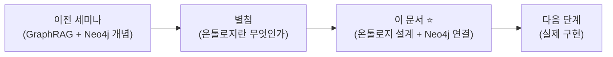

---

## 목차

1. [복습 — 온톨로지가 왜 필요했나](#1-복습--온톨로지가-왜-필요했나)
2. [OWL이란 무엇인가 — 온톨로지를 쓰는 표준 언어](#2-owl이란-무엇인가--온톨로지를-쓰는-표준-언어)
3. [OWL의 세 가지 구성 요소](#3-owl의-세-가지-구성-요소)
4. [DB 스키마 vs 온톨로지 — 무엇이 다른가](#4-db-스키마-vs-온톨로지--무엇이-다른가)
5. [Knowledge Graph를 위한 클래스 설계](#5-knowledge-graph를-위한-클래스-설계)
6. [관계(Property) 설계](#6-관계property-설계)
7. [논리 제약(Axiom) — 잘못된 것을 잡아내는 규칙](#7-논리-제약axiom--잘못된-것을-잡아내는-규칙)
8. [OWL → Neo4j 연결 방법](#8-owl--neo4j-연결-방법)
9. [추론 — 그래프에서 새로운 사실을 발견하는 방법](#9-추론--그래프에서-새로운-사실을-발견하는-방법)
10. [온톨로지 설계 실전 가이드](#10-온톨로지-설계-실전-가이드)
11. [결론](#11-결론)

---

## 1. 복습 — 온톨로지가 왜 필요했나

이전 세미나 별첨에서 이런 문제를 봤습니다.

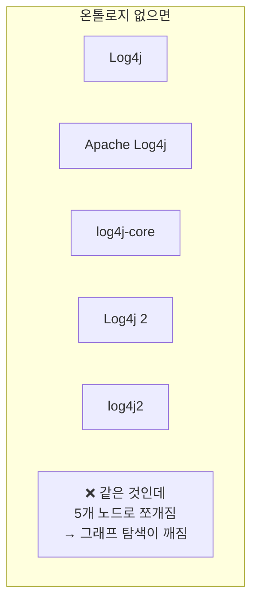

같은 실세계 개체가 서로 다른 표현으로 추출되면 그래프가 파편화됩니다. 온톨로지는 이 문제를 해결합니다. 즉, **"이 세계에 어떤 개념이 존재하고, 그 개념들이 서로 어떤 관계를 맺는가"** 를 미리 정의해두는 것입니다.

그런데 온톨로지를 어떤 형식으로 작성할까요? 사람이 이해할 수 있는 표로 그려도 되지만, 컴퓨터가 이해할 수 있는 **표준 언어**가 있다면 훨씬 더 강력하게 활용할 수 있습니다. 그것이 바로 **OWL**입니다.

---

## 2. OWL이란 무엇인가 — 온톨로지를 쓰는 표준 언어

OWL(Web Ontology Language)은 W3C가 2004년에 표준으로 발표한 **온톨로지 기술 언어**입니다. 쉽게 말하면, "이 세계에 어떤 것들이 존재하고 어떤 관계를 맺는지"를 컴퓨터가 이해할 수 있는 방식으로 적는 언어입니다.

### OWL은 왜 필요한가

엑셀 표나 그림으로 온톨로지를 설계해도 됩니다. 하지만 OWL을 쓰면 다음 것들이 가능해집니다.

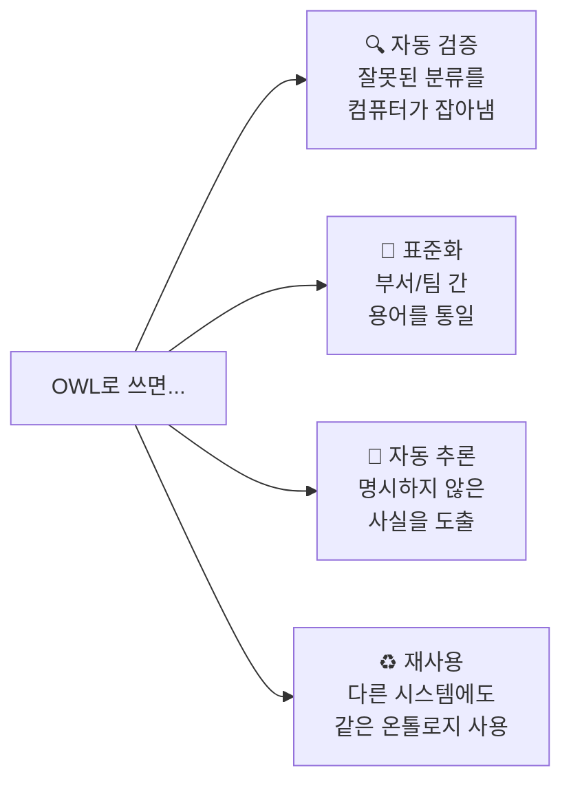

OWL로 작성한 온톨로지는 **Turtle(.ttl)** 이라는 텍스트 형식으로 저장합니다. 코드처럼 생겼지만, 알고 보면 매우 규칙적인 문장들입니다.

### Turtle 문법 — 딱 4가지 기호만

Turtle 문법에서 자주 나오는 기호 4개만 알면 됩니다.

| 기호 | 의미 | 자연어 비유 |
|---|---|---|
| `a` | "이것은 ~이다" (is-a) | "홍길동은 사람이다" |
| `;` | "그리고 같은 주어에서 계속" | 문장 이어쓰기 |
| `,` | "또한 이것도" (나열) | 쉼표 나열 |
| `.` | "이 문장 끝" | 마침표 |

예시를 보면 금방 이해됩니다.

```turtle
:Person a owl:Class .
```
→ "Person은 OWL Class다." (마침표로 문장 끝)

```turtle
:Engineer a owl:Class ;
          rdfs:subClassOf :Person .
```
→ "Engineer는 OWL Class다. **그리고(;)** Person의 하위 클래스다."

---

## 3. OWL의 세 가지 구성 요소

OWL로 온톨로지를 설계할 때는 딱 세 가지를 생각하면 됩니다.

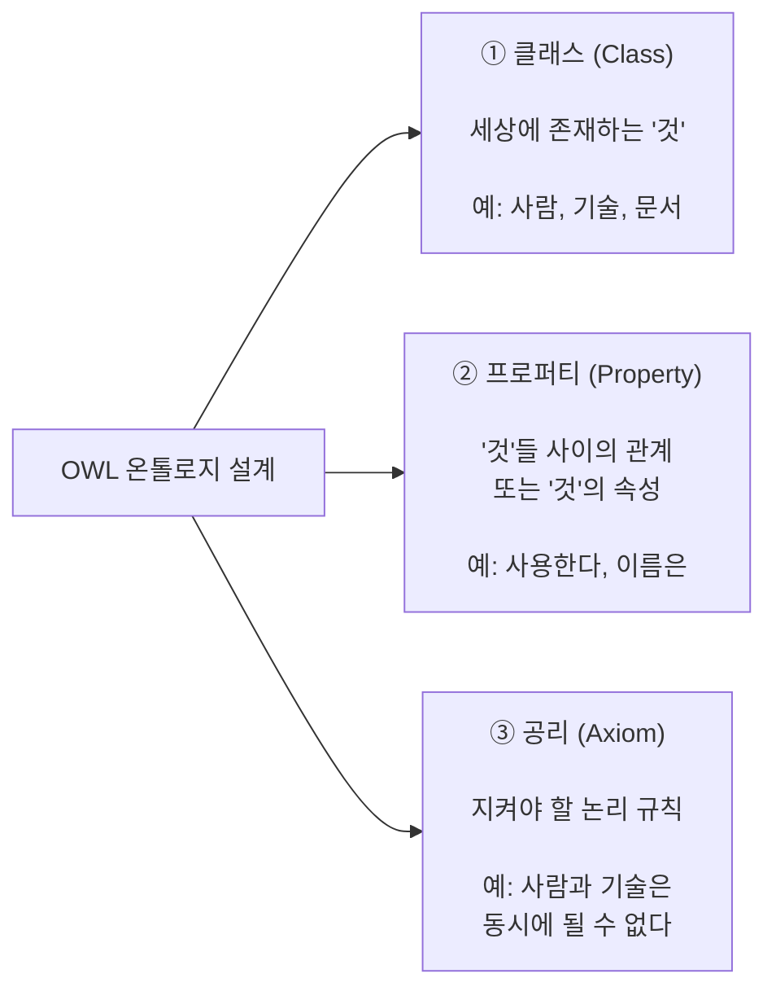

이 세 가지를 차례로 살펴봅시다.

---

## 4. DB 스키마 vs 온톨로지 — 무엇이 다른가

많은 분이 온톨로지와 데이터베이스 스키마를 헷갈려합니다. 비유로 설명하면 이렇습니다.

**DB 스키마**는 **창고 선반 배치도**입니다. "1번 선반에 A 모양 박스, 2번 선반에 B 모양 박스"처럼 **어떻게 저장할지**를 정의합니다.

**온톨로지**는 **백과사전의 분류 체계**입니다. "포유류는 동물이다. 고래는 포유류다. 그러므로 고래는 동물이다"처럼 **무엇이 무엇인지의 의미**를 정의합니다.

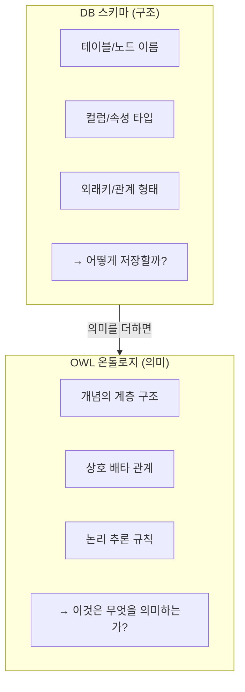

| 비교 | DB 스키마 | OWL 온톨로지 |
|---|---|---|
| 목적 | 저장과 조회를 위한 구조 | 의미의 정확한 정의 |
| 표현 | 테이블, 키, 인덱스 | 클래스 계층, 규칙, 제약 |
| 추론 가능? | ❌ 쿼리로만 | ✅ 규칙으로 새 사실 도출 |
| 재사용? | DB 종속적 | 표준 언어, 어디서나 읽힘 |

---

## 5. Knowledge Graph를 위한 클래스 설계

### 5.1 우리 도메인에서 무엇이 '존재'하는가

Knowledge Graph를 설계할 때 가장 먼저 할 일은 **"우리 세계에 어떤 종류의 것들이 있는가"** 를 정리하는 것입니다.

내부 문서 기반 지식 플랫폼을 예로 들면, 다음 것들이 존재합니다.

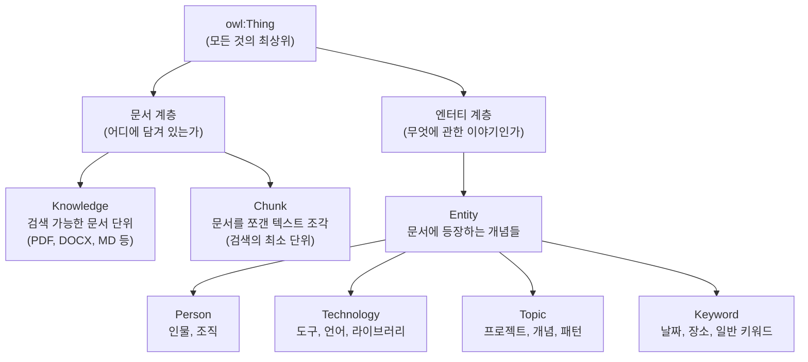

### 5.2 계층 구조가 주는 힘

클래스를 계층으로 설계하면 **"상위 클래스로 질의하면 하위 클래스도 함께 검색된다"** 는 이점이 생깁니다.

예를 들어, `Person`의 하위 클래스로 `Engineer`, `Manager`가 있다고 합시다.

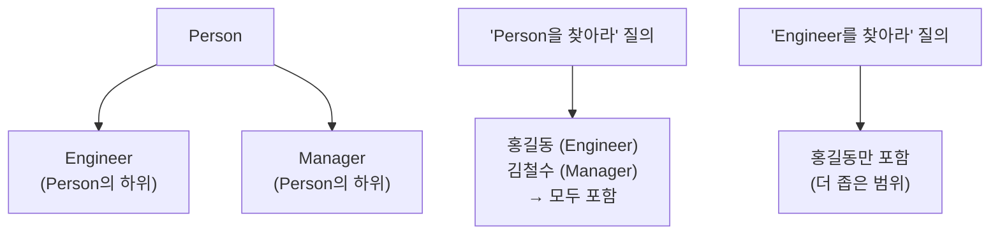

이 덕분에 넓은 범위로 검색할 수도, 좁은 범위로 검색할 수도 있습니다.

### 5.3 클래스 설계 시 핵심 질문

클래스를 설계할 때 스스로에게 이 질문들을 던져보세요.

- 이것은 독립적으로 존재하는 개념인가, 아니면 다른 것의 속성인가?
- 이 클래스의 인스턴스(예시)를 5개 이상 떠올릴 수 있는가?
- 이 클래스만을 위한 고유한 관계나 속성이 있는가?

세 질문 중 하나라도 "아니오"라면, 클래스보다는 속성으로 표현하는 것이 더 적합할 수 있습니다.

---

## 6. 관계(Property) 설계

### 6.1 두 종류의 관계

OWL에서 관계(Property)는 두 종류입니다.

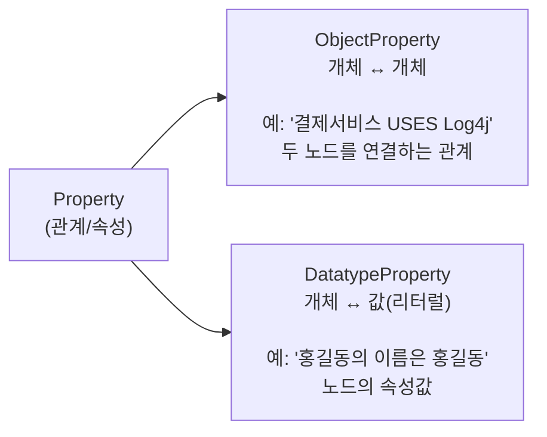

**ObjectProperty**는 Neo4j의 **관계(Relationship)** 가 됩니다.  
**DatatypeProperty**는 Neo4j 노드의 **속성(Property)** 이 됩니다.

### 6.2 주요 관계 예시

| 관계 이름 | 연결 방향 | 의미 | Neo4j 관계명 |
|---|---|---|---|
| `contains` | Knowledge → Chunk | 문서가 청크를 포함 | `[:CONTAINS]` |
| `mentions` | Chunk → Entity | 청크가 엔터티를 언급 | `[:MENTIONS]` |
| `mentionedIn` | Entity → Knowledge | 엔터티가 문서에 등장 | `[:MENTIONED_IN]` |
| `relatedTo` | Entity ↔ Entity | 두 엔터티가 관련됨 | `[:RELATED_TO]` |

### 6.3 역방향 관계 — 왜 양방향으로 저장하는가

`contains`와 `partOf`는 서로 역방향 관계입니다. OWL에서는 이것을 `owl:inverseOf`로 표현합니다.

```
Knowledge -[CONTAINS]→ Chunk
Chunk -[PART_OF]→ Knowledge
```

Neo4j에서는 두 방향 모두 저장하는 것이 검색 성능에 유리합니다. "이 청크가 어느 문서에 속하는가?"를 물을 때 역방향 관계를 탐색하는 것보다, `PART_OF` 관계를 직접 따라가는 것이 빠릅니다.

### 6.4 관계에도 속성을 붙일 수 있다

Neo4j의 관계는 속성을 가질 수 있습니다. 예를 들어 `RELATED_TO` 관계에 **가중치**와 **관계 유형**을 붙이면 검색의 정밀도가 높아집니다.

```
(홍길동)-[:RELATED_TO {type: "CREATED", weight: 0.9}]->(FastAPI)
(홍길동)-[:RELATED_TO {type: "USES", weight: 0.7}]->(Neo4j)
```

---

## 7. 논리 제약(Axiom) — 잘못된 것을 잡아내는 규칙

### 7.1 제약이 왜 필요한가

LLM이 엔터티를 추출할 때 실수를 합니다. "FastAPI"가 `Person`으로 분류되거나, "홍길동"이 `Technology`로 분류되는 일이 실제로 발생합니다. 논리 제약(Axiom)은 이런 오류를 자동으로 탐지하는 규칙입니다.

### 7.2 상호 배타(disjoint) 제약

가장 자주 쓰이는 제약은 **"A와 B는 동시에 될 수 없다"** 는 상호 배타 제약입니다.

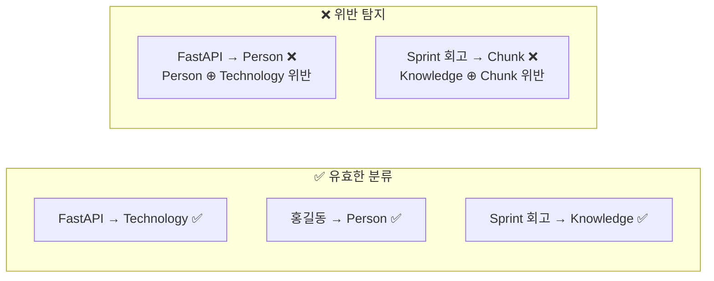

우리 시스템에서 적용할 상호 배타 규칙입니다.

| 제약 | 의미 |
|---|---|
| `Person ⊕ Technology` | 사람/조직과 기술은 동시에 될 수 없음 |
| `Person ⊕ Topic` | 사람/조직과 프로젝트/개념은 동시에 될 수 없음 |
| `Technology ⊕ Topic` | 기술과 프로젝트/개념은 동시에 될 수 없음 |
| `Knowledge ⊕ Chunk` | 문서 단위와 텍스트 조각은 동시에 될 수 없음 |
| `Knowledge ⊕ Entity` | 문서와 엔터티는 서로 다른 차원의 개념 |

### 7.3 카디널리티 제약

**"한 노드는 하나의 ID만 가질 수 있다"** 같은 규칙도 OWL로 표현합니다. 이것은 데이터베이스의 UNIQUE 제약과 같습니다.

```
knowledgeId → FunctionalProperty (= UNIQUE)
한 Knowledge 노드는 하나의 knowledge_id만 가질 수 있음
```

---

## 8. OWL → Neo4j 연결 방법

이제 가장 실용적인 부분입니다. OWL로 설계한 온톨로지를 Neo4j에 어떻게 적용하는가입니다. 이 섹션은 "OWL 파일을 보고 Neo4j에 무엇을 만들어야 하는지"를 단계별로 안내합니다.

### 8.1 큰 그림 — OWL 개념이 Neo4j의 무엇이 되는가

OWL의 각 구성 요소가 Neo4j에서 어떤 것으로 변환되는지 한눈에 봅니다.

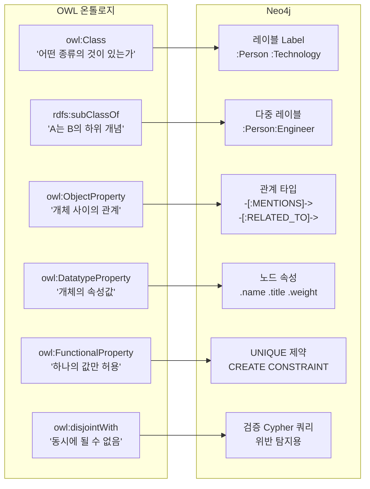

### 8.2 Step 1 — 클래스를 레이블로 만들기

OWL의 클래스(Class)는 Neo4j의 **레이블(Label)** 이 됩니다. 레이블은 노드에 이름표를 붙이는 것입니다.

**OWL에서 이렇게 정의했다면:**
```turtle
:Person      a owl:Class .
:Technology  a owl:Class .
:Topic       a owl:Class .
:Keyword     a owl:Class .
:Knowledge   a owl:Class .
:Chunk       a owl:Class .
```

**Neo4j에서는 이런 노드들이 만들어집니다:**

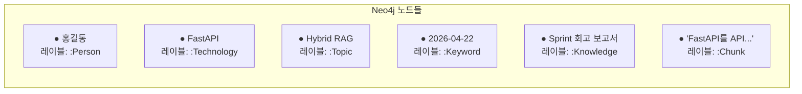

**Cypher로 노드를 만드는 방법:**

```cypher
-- Person 노드 생성
-- MERGE: 이미 있으면 그냥 쓰고, 없으면 새로 만든다
MERGE (p:Person {name: '홍길동'})
SET p.description = 'AI팀 시니어 엔지니어'

-- Technology 노드 생성
MERGE (t:Technology {name: 'FastAPI'})
SET t.description = 'Python 기반 고성능 API 프레임워크'

-- Knowledge 노드 생성 (문서)
MERGE (k:Knowledge {knowledge_id: 'k_001'})
SET k.title = 'Sprint 10 회고 보고서',
    k.document_type = '회고록'

-- Chunk 노드 생성 (문서의 텍스트 조각)
MERGE (c:Chunk {chunk_id: 'c_001_3'})
SET c.text = 'FastAPI를 API 서버로 채택하였으며...',
    c.knowledge_id = 'k_001'
```

> **MERGE vs CREATE 차이**: `CREATE`는 항상 새로 만듭니다. `MERGE`는 이미 있으면 찾고, 없을 때만 만듭니다. ETL에서는 보통 `MERGE`를 씁니다. 같은 문서를 두 번 처리해도 노드가 중복되지 않기 때문입니다.

### 8.3 Step 2 — 하위 클래스를 다중 레이블로 만들기

OWL에서 클래스 계층(`rdfs:subClassOf`)은 Neo4j에서 **다중 레이블**로 표현합니다. 노드에 레이블을 두 개 동시에 붙이는 방식입니다.

**왜 다중 레이블을 쓰는가?**

OWL에서 `Engineer`는 `Person`의 하위 클래스입니다. 즉, 엔지니어는 사람의 일종입니다. Neo4j에서 이를 표현하는 가장 간단한 방법은 두 레이블을 동시에 붙이는 것입니다.

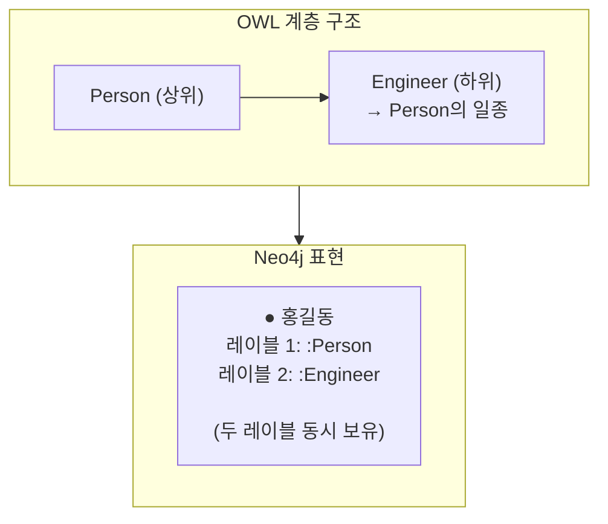

```cypher
-- 다중 레이블로 노드 생성
MERGE (p:Person:Engineer {name: '홍길동'})
SET p.title = '시니어 엔지니어'

-- 이제 두 가지 방식으로 찾을 수 있다
MATCH (p:Person)    -- 홍길동 포함 ✅ (Engineer도 Person이니까)
MATCH (p:Engineer)  -- 홍길동만 ✅ (더 좁은 범위)
```

**주의해야 할 함정:**

```cypher
-- ❌ 이렇게 하면 의도와 다른 결과
MATCH (p:Person) RETURN count(p)
-- → Engineer 포함해서 셈!
-- "순수 Person만 몇 명인가?"를 물은 거라면 틀린 답

-- ✅ 명확하게 작성
MATCH (p:Person) WHERE NOT p:Engineer RETURN count(p)
-- → Engineer를 제외한 Person 수
```

하위 클래스를 만들 때는 항상 "상위 클래스 질의에 하위가 포함되는 것을 의도했는가?"를 확인하세요.

### 8.4 Step 3 — ObjectProperty를 관계로 만들기

OWL의 `ObjectProperty`(개체-개체 관계)는 Neo4j의 **관계(Relationship)** 가 됩니다.

**OWL 정의:**
```turtle
:mentions    a owl:ObjectProperty ;
             rdfs:domain :Chunk ;    -- 출발점: Chunk
             rdfs:range  :Entity .   -- 도착점: Entity

:relatedTo   a owl:ObjectProperty ;
             rdfs:domain :Entity ;
             rdfs:range  :Entity .
```

**Neo4j에서 관계를 만드는 Cypher:**

```cypher
-- ① Chunk가 Entity를 MENTIONS (언급) 하는 관계
MATCH (c:Chunk {chunk_id: 'c_001_3'})
MATCH (t:Technology {name: 'FastAPI'})
MERGE (c)-[:MENTIONS]->(t)
-- 읽는 법: 청크 c_001_3이 FastAPI를 언급한다

-- ② Knowledge가 Chunk를 CONTAINS (포함) 하는 관계
MATCH (k:Knowledge {knowledge_id: 'k_001'})
MATCH (c:Chunk {chunk_id: 'c_001_3'})
MERGE (k)-[:CONTAINS]->(c)
-- 읽는 법: 문서 k_001이 청크 c_001_3을 포함한다

-- ③ Entity 사이의 RELATED_TO (연관) 관계
--    관계에 속성(weight, type)을 추가할 수 있다
MATCH (p:Person {name: '홍길동'})
MATCH (t:Technology {name: 'FastAPI'})
MERGE (p)-[r:RELATED_TO {type: 'USES'}]->(t)
SET r.weight = 0.9
-- 읽는 법: 홍길동은 FastAPI를 사용한다 (가중치 0.9)
```

**만들어진 그래프의 모습:**

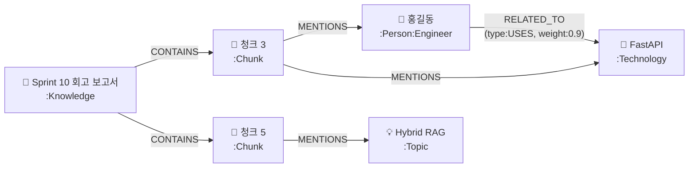

**역방향 관계도 함께 저장하는 이유:**

`MENTIONS`(Chunk → Entity)와 `MENTIONED_IN`(Entity → Knowledge)은 서로 역방향입니다. 이론적으로는 하나만 저장하고 역방향 탐색(`<-[:MENTIONS]-`)을 써도 됩니다. 그러나 실무에서는 양방향을 모두 저장하는 것이 **탐색 속도** 면에서 유리합니다.

```cypher
-- MENTIONED_IN 관계도 함께 저장 (검색 성능을 위해)
MATCH (k:Knowledge {knowledge_id: 'k_001'})
MATCH (t:Technology {name: 'FastAPI'})
MERGE (t)-[:MENTIONED_IN]->(k)
-- 읽는 법: FastAPI는 문서 k_001에 등장한다
```

### 8.5 Step 4 — DatatypeProperty를 노드 속성으로 만들기

OWL의 `DatatypeProperty`(개체-값 속성)는 Neo4j 노드의 **속성(Property)** 이 됩니다. SQL의 컬럼과 유사합니다.

| OWL DatatypeProperty | Neo4j 노드 속성 | 예시 값 |
|---|---|---|
| `:name` (Entity용) | `n.name` | `'홍길동'`, `'FastAPI'` |
| `:title` (Knowledge용) | `k.title` | `'Sprint 10 회고 보고서'` |
| `:documentType` | `k.document_type` | `'회고록'`, `'기술문서'` |
| `:knowledgeId` | `k.knowledge_id` | `'k_001'` |
| `:chunkId` | `c.chunk_id` | `'c_001_3'` |
| `:value` (Keyword용) | `kw.value` | `'2026-04-22'`, `'서울'` |

```cypher
-- 여러 속성을 한 번에 SET
MERGE (k:Knowledge {knowledge_id: 'k_001'})
SET k.title = 'Sprint 10 회고 보고서',
    k.document_type = '회고록',
    k.created_at = date('2026-04-22'),
    k.updated_at = datetime()

-- 속성 조회
MATCH (k:Knowledge {knowledge_id: 'k_001'})
RETURN k.title, k.document_type, k.created_at
```

### 8.6 Step 5 — FunctionalProperty를 UNIQUE 제약으로 만들기

OWL의 `FunctionalProperty`("하나의 값만 허용")는 Neo4j의 **UNIQUE 제약**이 됩니다. 이것은 데이터베이스의 고유 키(Primary Key)와 같은 역할을 합니다.

```cypher
-- ① Knowledge 노드의 knowledge_id는 유일해야 한다
CREATE CONSTRAINT knowledge_id_unique IF NOT EXISTS
FOR (k:Knowledge)
REQUIRE k.knowledge_id IS UNIQUE;

-- ② Chunk 노드의 chunk_id는 유일해야 한다
CREATE CONSTRAINT chunk_id_unique IF NOT EXISTS
FOR (c:Chunk)
REQUIRE c.chunk_id IS UNIQUE;

-- 제약이 걸린 상태에서 중복 생성 시도 → 오류 발생
CREATE (k:Knowledge {knowledge_id: 'k_001'})  -- ❌ 이미 있으면 오류
MERGE  (k:Knowledge {knowledge_id: 'k_001'})  -- ✅ MERGE는 찾아서 쓰므로 안전
```

UNIQUE 제약이 걸리면 **인덱스도 자동으로 생성**됩니다. 그래서 `knowledge_id`로 노드를 찾을 때 전체 검색 없이 빠르게 찾을 수 있습니다.

### 8.7 Step 6 — 검색용 인덱스 추가하기

UNIQUE 제약으로 자동 생성되는 인덱스 외에, 자주 검색하는 속성에는 **별도 인덱스**를 추가하면 검색 속도가 크게 향상됩니다.

```cypher
-- ① 이름으로 엔터티를 자주 찾는다면 → 일반 인덱스
CREATE INDEX entity_name_idx IF NOT EXISTS
FOR (n:Person)
ON (n.name);

-- 여러 레이블에 동시에 인덱스 (Neo4j 5.x)
CREATE INDEX tech_topic_name_idx IF NOT EXISTS
FOR (n:Technology|Topic)
ON (n.name);

-- ② 텍스트 포함 검색이 필요하다면 → 전문 검색(Full-text) 인덱스
--    "FastAPI"라는 단어가 포함된 모든 노드 찾기
CREATE FULLTEXT INDEX entity_fulltext_idx IF NOT EXISTS
FOR (n:Person|Technology|Topic|Keyword|Knowledge|Chunk)
ON EACH [n.name, n.value, n.title];

-- 전문 검색 사용 예시
CALL db.index.fulltext.queryNodes('entity_fulltext_idx', 'FastAPI')
YIELD node, score
RETURN node.name, labels(node), score
ORDER BY score DESC;
```

**일반 인덱스 vs 전문 검색 인덱스 비교:**

| 구분 | 일반 인덱스 | 전문 검색 인덱스 |
|---|---|---|
| 용도 | `name = 'FastAPI'` (정확한 일치) | `'FastAPI'` 포함 검색 |
| 속도 | 매우 빠름 | 빠름 |
| 유연성 | 낮음 (정확히 같아야) | 높음 (부분 포함 가능) |
| 언제 쓰나 | ID, 고유 이름 검색 | 자연어 검색, 키워드 포함 검색 |

### 8.8 Step 7 — LLM 추출 결과를 올바른 레이블로 연결하기

LLM이 문서에서 엔터티를 추출할 때 유형을 함께 반환합니다. 이 유형을 Neo4j 레이블로 변환하는 **매핑 테이블**이 필요합니다.

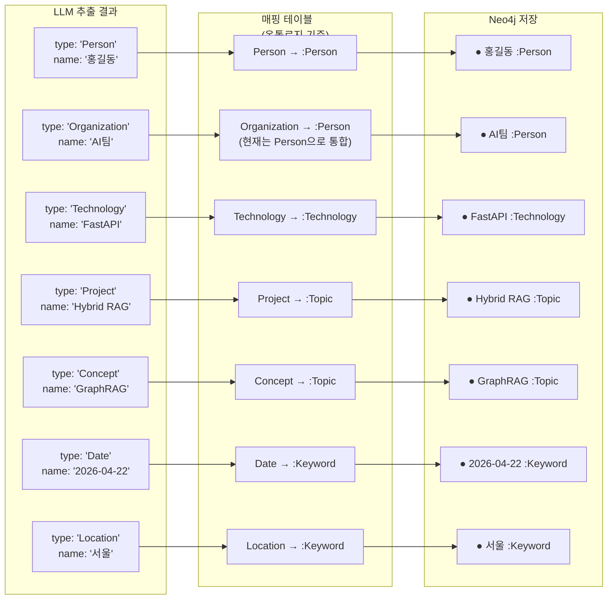

`Organization`을 `Person`으로 합치는 것은 현재 단계의 단순화입니다. 나중에 데이터가 쌓이고 필요성이 생기면 `:Organization` 레이블을 별도로 분리할 수 있습니다.

### 8.9 무결성 검사 — 제약을 자동으로 감시하기

OWL의 `disjointWith` 제약은 Neo4j에서 **검증 쿼리**로 구현합니다. 아래 쿼리들을 매일 자동으로 실행하면 데이터 품질을 지속적으로 감시할 수 있습니다.

```cypher
-- 검사 1: Person이면서 Technology인 노드 (있으면 안 됨)
-- 예: 'FastAPI'가 실수로 Person으로도 분류된 경우
MATCH (n:Person) WHERE n:Technology
RETURN n.name AS 위반_노드명, labels(n) AS 현재_레이블;
-- 결과가 0건이면 정상

-- 검사 2: Knowledge이면서 Chunk인 노드 (있으면 안 됨)
-- 예: 문서 노드에 실수로 Chunk 레이블이 붙은 경우
MATCH (n:Knowledge) WHERE n:Chunk
RETURN id(n) AS 노드ID, labels(n) AS 현재_레이블;

-- 검사 3: knowledge_id가 중복된 노드 (UNIQUE 위반)
-- 예: 같은 문서가 두 번 처리된 경우
MATCH (k:Knowledge)
WITH k.knowledge_id AS kid, count(*) AS cnt
WHERE cnt > 1
RETURN kid AS 중복된_ID, cnt AS 중복_개수;

-- 검사 4: 부모 없는 고아 Chunk (CONTAINS 관계가 없는 Chunk)
-- 예: 문서 적재 중 오류로 Knowledge-Chunk 연결이 끊긴 경우
MATCH (c:Chunk)
WHERE NOT (c)<-[:CONTAINS]-(:Knowledge)
RETURN c.chunk_id AS 고아_청크ID, c.text AS 내용_일부;
```

**자동화 방법**: 이 쿼리들을 하나의 배치 작업으로 묶어 매일 새벽에 실행하고, 위반 건수가 0이 아니면 슬랙 알림을 보내도록 구성합니다. 이렇게 하면 데이터 품질 문제를 사람이 주기적으로 확인하지 않아도 됩니다.

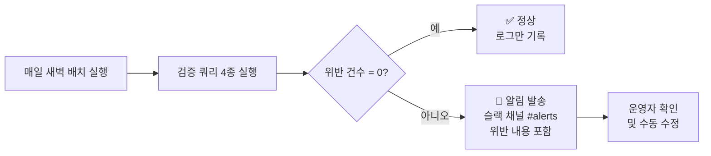

---

## 9. 추론 — 그래프에서 새로운 사실을 발견하는 방법

### 9.1 추론이란 무엇인가

추론(Reasoning)은 **직접 저장하지 않은 사실을 그래프 탐색으로 발견하는 것**입니다. 예를 들어, 우리가 다음 두 사실만 그래프에 저장했다고 합시다.

```
홍길동 → RELATED_TO → 김철수
김철수 → RELATED_TO → 이영희
```

"홍길동과 이영희는 연결된다"는 사실은 저장하지 않았습니다. 그러나 그래프를 따라가면 이 연결고리를 발견할 수 있습니다. 이것이 추론입니다.

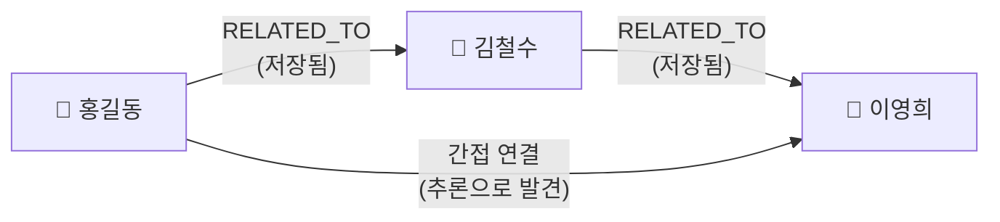

### 9.2 Cypher 기본 문법 — 읽는 법부터

추론 패턴을 이해하려면 Cypher의 기본 읽는 법을 알아야 합니다.

```cypher
-- Cypher의 기본 구조
MATCH  (노드A)-[관계]->(노드B)   -- 이런 패턴을 찾아라
WHERE  조건                       -- 이 조건을 만족하는 것만
RETURN 결과                       -- 이것을 돌려달라

-- 노드는 소괄호 ()
-- 관계는 대괄호 [] + 화살표 -->
-- 방향 없는 탐색은 -- (양쪽 모두)
```

**예시로 읽어보기:**

```cypher
-- "홍길동이 언급된 청크들을 찾아라"
MATCH (p:Person {name: '홍길동'})<-[:MENTIONS]-(c:Chunk)
RETURN c.text

-- 읽는 법:
-- (p:Person) = Person 레이블의 노드 p
-- {name: '홍길동'} = 이름이 홍길동인 것
-- <-[:MENTIONS]- = MENTIONS 관계가 들어오는 방향
-- (c:Chunk) = Chunk 레이블의 노드 c
-- → "홍길동이라는 Person을 MENTIONS하는 Chunk c를 찾아라"
```

### 9.3 추론 패턴 1 — 엔터티 중심 탐색

**"이 엔터티와 직접 연결된 것들은?"**

가장 기본적인 탐색입니다. 특정 노드에서 출발하여 인접한 노드들을 찾습니다.

```cypher
-- FastAPI와 직접 연결된 모든 엔터티 찾기
MATCH (t:Technology {name: 'FastAPI'})-[:RELATED_TO]-(other)
RETURN other.name AS 연관_엔터티,
       labels(other)[0] AS 엔터티_유형

-- 예상 결과:
-- 연관_엔터티    | 엔터티_유형
-- 홍길동        | Person
-- Python       | Technology
-- API 서버      | Topic
```

**방향을 지정하거나 열어두기:**

```cypher
-- 방향 있음: FastAPI가 언급한 것 (나가는 방향)
MATCH (t:Technology {name: 'FastAPI'})-[:RELATED_TO]->(other)

-- 방향 있음: FastAPI를 언급한 것 (들어오는 방향)
MATCH (t:Technology {name: 'FastAPI'})<-[:RELATED_TO]-(other)

-- 방향 없음: 양쪽 다 (가장 많이 씀)
MATCH (t:Technology {name: 'FastAPI'})-[:RELATED_TO]-(other)
```

### 9.4 추론 패턴 2 — 멀티홉 탐색

**"2단계, 3단계를 거쳐 연결된 것들은?"**

이것이 GraphRAG의 핵심 능력입니다. 관계를 여러 번 따라가며 간접 연결을 발견합니다.

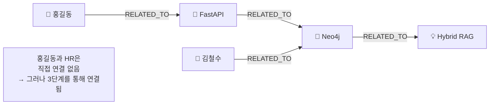

```cypher
-- 2단계 탐색: 홍길동과 2단계로 연결된 엔터티
MATCH (p:Person {name: '홍길동'})-[:RELATED_TO*2]-(second_hop)
RETURN second_hop.name AS 2단계_연결,
       labels(second_hop)[0] AS 유형

-- *2 = 정확히 2번 관계를 건너뜀

-- 1~3단계 사이 어디서든 연결된 것 (범위 지정)
MATCH (p:Person {name: '홍길동'})-[:RELATED_TO*1..3]-(connected)
WHERE connected <> p    -- 자기 자신 제외
RETURN DISTINCT connected.name AS 연결된_엔터티,
               labels(connected)[0] AS 유형
```

**가변 길이 탐색 시 주의점:**

```cypher
-- ⚠️ 범위를 너무 크게 하면 느려진다
MATCH (n)-[:RELATED_TO*1..10]-(m)  -- 1~10홉: 매우 느릴 수 있음

-- ✅ 실무에서는 보통 1~3홉이면 충분
MATCH (n)-[:RELATED_TO*1..3]-(m)   -- 적절한 범위
```

### 9.5 추론 패턴 3 — 공통 연결 발견

**"A와 B가 공통으로 관련된 것은?"**

두 엔터티를 모두 언급한 청크, 두 사람이 공통으로 관련된 기술 등을 찾습니다.

```cypher
-- 홍길동과 김철수가 함께 등장한 Knowledge(문서) 찾기
MATCH (p1:Person {name: '홍길동'})-[:MENTIONED_IN]->(k:Knowledge)
MATCH (p2:Person {name: '김철수'})-[:MENTIONED_IN]->(k)
RETURN k.title AS 공통_문서, k.document_type AS 문서_유형

-- 읽는 법:
-- 홍길동이 등장한 문서 k AND 김철수도 등장한 문서 k
-- → 두 MATCH를 같은 k 변수로 연결하면 교집합이 된다
```

```cypher
-- 홍길동과 김철수가 공통으로 관련된 기술 찾기
MATCH (p1:Person {name: '홍길동'})-[:RELATED_TO]->(t:Technology)
MATCH (p2:Person {name: '김철수'})-[:RELATED_TO]->(t)
RETURN t.name AS 공통_기술

-- 결과 예시: Neo4j, FastAPI 등 두 사람이 모두 관련된 기술
```

### 9.6 추론 패턴 4 — 같은 문서에 함께 등장하는 엔터티 클러스터

**"같은 문서에 자주 함께 등장하는 엔터티들은?"**

이 패턴은 서로 명시적 RELATED_TO 관계가 없어도 "함께 등장한다"는 사실만으로 연관성을 도출합니다.

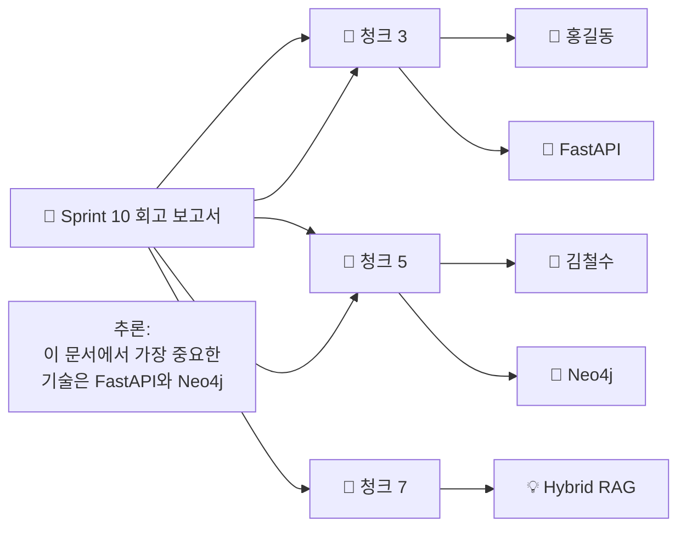

```cypher
-- 특정 문서에서 가장 많이 언급된 Technology TOP 5
MATCH (k:Knowledge {knowledge_id: 'k_001'})
      -[:CONTAINS]->(:Chunk)
      -[:MENTIONS]->(t:Technology)
RETURN t.name AS 기술명,
       count(*) AS 언급_횟수
ORDER BY 언급_횟수 DESC
LIMIT 5

-- 결과 예시:
-- 기술명    | 언급_횟수
-- FastAPI  | 8
-- Neo4j    | 6
-- BGE-M3   | 4
```

```cypher
-- 모든 기술 문서에서 반복 등장하는 Topic(프로젝트/개념) 찾기
MATCH (k:Knowledge {document_type: '기술문서'})
      -[:CONTAINS]->(:Chunk)
      -[:MENTIONS]->(tp:Topic)
RETURN tp.name AS 주제,
       count(DISTINCT k) AS 등장_문서_수
ORDER BY 등장_문서_수 DESC
LIMIT 10
-- → 어떤 주제가 기술 문서 전반에서 핵심인지 파악
```

### 9.7 추론 패턴 5 — 간접 연결 경로 찾기

**"A와 B는 어떤 경로로 연결되는가?"**

두 엔터티 사이의 연결 경로를 시각화할 때 유용합니다. "홍길동과 Hybrid RAG 프로젝트가 어떻게 연결되는가?"를 답할 수 있습니다.

```cypher
-- 홍길동과 'Hybrid RAG' 사이의 가장 짧은 경로
MATCH path = shortestPath(
    (p:Person {name: '홍길동'})
    -[:RELATED_TO|MENTIONS|MENTIONED_IN*..6]-
    (tp:Topic {name: 'Hybrid RAG'})
)
RETURN [n IN nodes(path) | coalesce(n.name, n.title, n.value)] AS 경로,
       length(path) AS 거리

-- 결과 예시:
-- 경로: ['홍길동', 'FastAPI', 'API 서버', 'Hybrid RAG']
-- 거리: 3
```

**여러 경로 모두 찾기 (Top 3):**

```cypher
-- shortestPath 대신 allShortestPaths로 여러 경로 확인
MATCH path = allShortestPaths(
    (p:Person {name: '홍길동'})
    -[:RELATED_TO*..5]-
    (tp:Topic {name: 'Hybrid RAG'})
)
RETURN [n IN nodes(path) | n.name] AS 경로
LIMIT 3
```

### 9.8 추론 패턴 6 — 영향도 분석

**"A가 바뀌면 무엇이 영향을 받는가?"**

아키텍처팀에서 가장 자주 필요한 패턴입니다. 특정 기술이나 문서가 변경될 때 영향 범위를 파악합니다.

```cypher
-- 'FastAPI'와 관련된 모든 인물, 문서, 주제 목록
MATCH (t:Technology {name: 'FastAPI'})-[:RELATED_TO|MENTIONED_IN*1..2]-(affected)
RETURN labels(affected)[0] AS 유형,
       coalesce(affected.name, affected.title) AS 이름,
       count(*) AS 연결_수
ORDER BY 유형, 연결_수 DESC

-- 결과 예시:
-- 유형         | 이름                  | 연결_수
-- Knowledge   | Sprint 10 회고 보고서 | 3
-- Person      | 홍길동                | 2
-- Topic       | Hybrid RAG           | 1
```

```cypher
-- 특정 문서가 삭제/변경될 때 영향받는 엔터티 목록
MATCH (k:Knowledge {knowledge_id: 'k_001'})
      -[:CONTAINS]->(:Chunk)
      -[:MENTIONS]->(e)
RETURN labels(e)[0] AS 유형,
       coalesce(e.name, e.value) AS 엔터티명
ORDER BY 유형

-- 이 문서에만 언급된 엔터티는 문서 삭제 시 고아가 될 수 있음
```

### 9.9 추론 패턴 7 — 전이적 연관 관계 발견

**"A-B-C로 간접 연결되는 새로운 관계를 도출한다"**

이 패턴은 명시적으로 저장된 관계에서 출발하여 **새로운 잠재적 관계**를 제안합니다.

```cypher
-- A와 B가 공통 관계를 통해 연결되면, A-B 간 잠재 관계 제안
-- "같이 일할 가능성이 높은 사람 쌍" 찾기
MATCH (p1:Person)-[:RELATED_TO]->(common)-[:RELATED_TO]-(p2:Person)
WHERE p1 <> p2
  AND NOT (p1)-[:RELATED_TO]-(p2)  -- 아직 직접 연결 안 된 쌍만
WITH p1, p2, collect(common.name) AS 공통_연결, count(*) AS 공통_수
WHERE 공통_수 >= 2                  -- 공통 연결이 2개 이상인 경우만
RETURN p1.name AS 인물A,
       p2.name AS 인물B,
       공통_연결,
       공통_수
ORDER BY 공통_수 DESC
LIMIT 10

-- 이 결과는 "이 두 사람은 연결해줄 만하다"는 추천 근거가 됨
```

```cypher
-- 같은 Topic에서 언급된 Technology들은 함께 쓰일 가능성이 높다
MATCH (t1:Technology)<-[:MENTIONS]-(:Chunk)-[:MENTIONS]->(tp:Topic {name: 'Hybrid RAG'})
MATCH (t2:Technology)<-[:MENTIONS]-(:Chunk)-[:MENTIONS]->(tp)
WHERE t1 <> t2
  AND NOT (t1)-[:RELATED_TO]-(t2)   -- 아직 명시적 관계 없는 것
WITH t1, t2, count(*) AS 공통_등장_수
WHERE 공통_등장_수 >= 3
RETURN t1.name AS 기술A,
       t2.name AS 기술B,
       공통_등장_수 AS 함께_등장한_청크_수

-- 결과: "FastAPI와 Neo4j는 Hybrid RAG 관련 청크에서 자주 함께 등장한다"
-- → 이 두 기술 사이에 RELATED_TO 관계를 추가할 근거
```

### 9.10 추론 패턴 요약 — 언제 어떤 패턴을 쓰는가

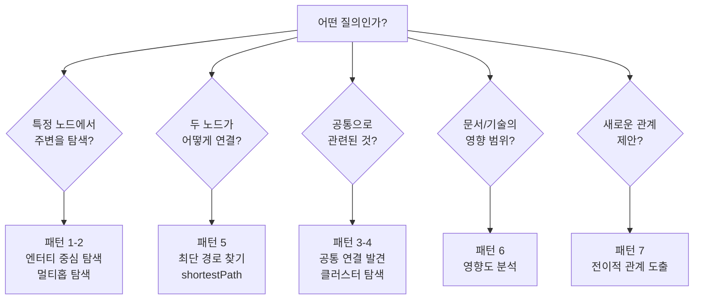

| 패턴 | 질의 유형 | Cypher 핵심 |
|---|---|---|
| 1. 직접 연결 탐색 | "이것과 연결된 것은?" | `(a)-[:관계]-(b)` |
| 2. 멀티홉 탐색 | "2~3단계 거쳐 연결된 것은?" | `(a)-[:관계*1..3]-(b)` |
| 3. 공통 연결 | "A와 B의 공통점은?" | 두 MATCH를 같은 변수로 연결 |
| 4. 클러스터링 | "자주 함께 등장하는 것은?" | `count(DISTINCT k)` |
| 5. 최단 경로 | "어떤 경로로 연결되나?" | `shortestPath(...)` |
| 6. 영향도 분석 | "변경 시 영향받는 것은?" | 가변 홉 + `labels()` |
| 7. 잠재 관계 | "새로운 관계 후보는?" | `NOT ()-[:관계]-()` 조건 |

---

## 10. 온톨로지 설계 실전 가이드

### 10.1 단계별 설계 절차

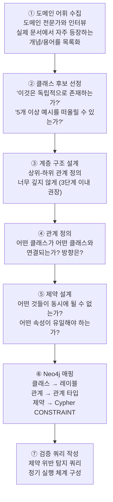

### 10.2 자주 하는 실수 3가지

**실수 1: 처음부터 완벽하게 설계하려 한다**

온톨로지 설계는 한 번에 완성되지 않습니다. 최소한의 클래스(4~6개)로 시작하고, 실제 데이터를 처리하면서 발견되는 패턴에 따라 점진적으로 확장하는 것이 훨씬 현실적입니다.

**실수 2: 클래스를 너무 세밀하게 쪼갠다**

처음에 `Person`과 `Organization`을 따로 설계하고 싶을 수 있습니다. 그러나 LLM이 인물과 조직을 항상 명확하게 구분하지 못합니다. 처음에는 `Person`으로 통합하고, 필요해질 때 하위 클래스로 분리하는 것이 좋습니다.

**실수 3: 관계의 방향을 나중에 바꾼다**

관계의 방향을 중간에 바꾸면 그래프 전체를 다시 처리해야 합니다. 설계 단계에서 "어떤 방향으로 탐색하는 질의가 더 많은가?"를 충분히 고민하세요.

### 10.3 온톨로지 변경 규칙 — "추가만, 삭제 안 함"

운영 중인 온톨로지를 변경할 때는 하위 호환성을 지켜야 합니다.

```mermaid
flowchart LR
    subgraph Safe["✅ 안전한 변경"]
        SA["새 클래스 추가\n기존 클래스에 영향 없음"]
        SB["새 관계 타입 추가\n기존 데이터 유지"]
        SC["새 속성 추가\n기존 노드에 선택적"]
    end

    subgraph Risky["⚠️ 신중히 할 변경"]
        RA["클래스 이름 변경\n기존 데이터 마이그레이션 필요"]
        RB["제약 강화\n기존 위반 데이터 정리 후"]
        RC["클래스 삭제\n절대 하지 말 것\n대신 deprecated 표시"]
    end
```

---

## 11. 결론

### 11.1 오늘 배운 것 정리

```mermaid
mindmap
    root((온톨로지\n설계))
        OWL 기초
            Turtle 문법 4가지 기호
            Class Property Axiom
            표준화된 온톨로지 언어
        클래스 설계
            도메인 어휘 수집
            계층 구조 Person → Engineer
            상호 배타 제약
        관계 설계
            ObjectProperty → 관계 타입
            DatatypeProperty → 노드 속성
            역방향 관계 양방향 저장
        Neo4j 연결
            클래스 → 레이블
            하위 클래스 → 다중 레이블
            제약 → Cypher CONSTRAINT
        추론
            명시 안 한 사실 도출
            Cypher 패턴으로 구현
            무결성 검사 자동화
```

### 11.2 이전 세미나와의 연결

이전 세미나에서 Knowledge Graph가 왜 필요한지, Neo4j가 무엇인지를 배웠습니다. 이번 문서에서는 그 Knowledge Graph를 **어떻게 체계적으로 설계하는가**를 다뤘습니다.

```mermaid
flowchart LR
    PREV["이전 세미나\n\n'왜 Knowledge Graph가 필요한가'\n'Neo4j가 무엇인가'\n'GraphRAG가 어떻게 동작하는가'"]

    THIS["이 문서\n\n'Knowledge Graph를\n어떻게 설계하는가'\n'OWL로 의미를 정의하고\nNeo4j에 연결하는 방법'"]

    NEXT["다음 단계\n\n실제 도메인 온톨로지 설계\n& Neo4j 구현"]

    PREV --> THIS --> NEXT
```

### 11.3 핵심 메시지 하나

온톨로지 설계의 핵심은 기술이 아닙니다. **"우리 조직에서 어떤 개념들이 어떤 관계를 맺고 있는가"** 를 명확하게 합의하는 과정이 핵심입니다. OWL과 Neo4j는 그 합의를 구현하는 도구입니다.

아무리 정교한 LLM을 써도, 이 합의가 없으면 Knowledge Graph는 파편화된 노드들의 집합에 불과합니다. 좋은 온톨로지가 좋은 Knowledge Graph를 만들고, 좋은 Knowledge Graph가 좋은 GraphRAG를 만듭니다.

---

## 참고 — 용어 정리

| 용어 | 설명 |
|---|---|
| **OWL** | Web Ontology Language. 온톨로지를 컴퓨터가 이해할 수 있게 쓰는 표준 언어 |
| **Turtle (.ttl)** | OWL 온톨로지를 저장하는 텍스트 파일 형식 |
| **Class** | OWL에서 개념의 종류를 정의 (Neo4j의 레이블에 대응) |
| **ObjectProperty** | 두 개체 사이의 관계 (Neo4j의 관계 타입에 대응) |
| **DatatypeProperty** | 개체의 속성값 (Neo4j 노드의 속성에 대응) |
| **Axiom** | 논리적 제약 규칙 (disjoint, cardinality 등) |
| **disjointWith** | "A와 B는 동시에 될 수 없다"는 제약 |
| **FunctionalProperty** | 하나의 값만 허용 (UNIQUE와 유사) |
| **subClassOf** | "A는 B의 하위 개념이다"라는 계층 관계 |
| **Reasoner** | OWL 규칙을 읽어 자동으로 추론하는 전용 엔진 |
| **Protégé** | OWL 온톨로지를 시각적으로 편집하는 무료 도구 (Stanford 개발) |
| **neosemantics (n10s)** | Neo4j에 OWL을 직접 가져올 수 있는 플러그인 |

---

*작성일: 2026-05-11*  
*아키텍처팀*

---

## 별첨 — Neo4j를 써야 하는 이유, 그리고 다른 선택지들

> GraphRAG와 Knowledge Graph 구축에 왜 Neo4j를 선택했는가? 그리고 다른 좋은 대안들은 무엇인가? 이 별첨은 그 질문에 답합니다.

### 별첨 1. 그래프 데이터베이스가 왜 일반 DB와 다른가

먼저 왜 그래프 데이터베이스가 별도로 필요한지부터 이해해야 합니다.

관계형 데이터베이스(MySQL, PostgreSQL)에서 "홍길동이 작성한 문서에서 언급된 기술 중, Hybrid RAG 프로젝트와 연관된 것은?"이라는 질의를 처리하려면 여러 테이블을 JOIN해야 합니다. 관계가 깊어질수록 JOIN이 늘어나고 성능이 급격히 떨어집니다.

```mermaid
flowchart LR
    subgraph RDB["관계형 DB — JOIN 지옥"]
        J1["Person 테이블"]
        J2["Document 테이블"]
        J3["Entity 테이블"]
        J4["Relation 테이블"]
        J5["Project 테이블"]

        JOIN["JOIN × 4회\n3홉 탐색 = 느리고 복잡"]
        J1 --> JOIN
        J2 --> JOIN
        J3 --> JOIN
        J4 --> JOIN
        J5 --> JOIN
    end

    subgraph GDB["그래프 DB — 포인터 추적"]
        N_HONG["홍길동 노드"]
        N_DOC["문서 노드"]
        N_TECH["기술 노드"]
        N_PROJ["프로젝트 노드"]

        N_HONG --"CREATED"--> N_DOC
        N_DOC --"MENTIONS"--> N_TECH
        N_TECH --"RELATED_TO"--> N_PROJ

        TRAV["포인터 직접 추적\n관계가 깊어도 빠름"]
    end
```

그래프 데이터베이스는 노드와 관계를 **포인터로 직접 연결**하기 때문에, 관계를 따라가는 탐색이 JOIN 없이 이루어집니다. 이것을 **"인덱스 없는 인접성(Index-free adjacency)"** 이라고 합니다. 탐색할 노드 수에 비례하여 성능이 결정되고, 전체 그래프 크기와 무관합니다.

### 별첨 2. Neo4j를 선택하는 6가지 이유

#### 이유 1 — 네이티브 그래프 저장 (Index-free Adjacency)

ArangoDB나 다른 멀티모델 DB는 그래프 탐색을 표준 데이터베이스 인덱스로 시뮬레이션합니다. 반면 Neo4j는 그래프를 위해 처음부터 설계된 **네이티브 그래프 저장** 구조를 가집니다. 멀티홉 관계 탐색에서 성능 차이가 두드러집니다.

#### 이유 2 — Cypher: 직관적인 그래프 질의 언어

```cypher
-- 홍길동이 언급된 문서를 통해 연관된 기술 찾기 (3홉)
MATCH (p:Person {name: '홍길동'})
      <-[:MENTIONS]-(c:Chunk)
      <-[:CONTAINS]-(k:Knowledge)
      -[:CONTAINS]->(c2:Chunk)
      -[:MENTIONS]->(t:Technology)
RETURN DISTINCT t.name AS 연관기술
```

Cypher는 `(노드)-[관계]->(노드)` 패턴으로 그래프를 그리듯 쿼리합니다. SQL을 알면 하루 이틀이면 기본을 익힐 수 있습니다. 반면 Gremlin(다른 그래프 DB의 쿼리 언어)은 함수형 체인 방식이라 훨씬 어렵습니다.

#### 이유 3 — 벡터 인덱스 내장 (Neo4j 5.x~)

Neo4j는 2025년 기준 vector-3.0 프로바이더를 지원하며, 코사인 유사도와 유클리드 거리 등 다양한 유사도 함수를 제공합니다. 그래프 탐색과 벡터 검색을 **단일 DB에서 한 쿼리로** 결합할 수 있습니다. 별도 벡터 DB(Elasticsearch, Qdrant)가 없어도 됩니다.

```cypher
-- 벡터 검색 + 그래프 탐색을 한 번에
CALL db.index.vector.queryNodes('entity-embedding-index', 10, $query_vector)
YIELD node AS entity, score
MATCH (entity)-[:RELATED_TO]-(connected)
RETURN entity.name, connected.name, score
ORDER BY score DESC
```

#### 이유 4 — GraphRAG 공식 생태계

Neo4j의 공식 GraphRAG Python 패키지(`neo4j-graphrag-python`)는 Neo4j가 직접 지원하는 1st-party 라이브러리로, 장기 지원과 유지보수가 보장됩니다.

이 패키지는 Vector Retriever, Vector Cypher Retriever, Hybrid Retriever, Hybrid Cypher Retriever, Text2Cypher 등 다양한 검색기를 제공합니다. 또한 LangChain, LlamaIndex, Microsoft GraphRAG와의 공식 통합도 지원합니다.

```mermaid
flowchart LR
    subgraph Ecosystem["Neo4j GraphRAG 생태계"]
        NEO["Neo4j"]
        PY["neo4j-graphrag-python\n(공식 1st-party)"]
        LC["LangChain\nNeo4j Retriever"]
        LI["LlamaIndex\nNeo4j Graph Store"]
        MS["Microsoft GraphRAG\nNeo4j Adapter"]
        BLOOM["Neo4j Bloom\n그래프 시각화"]

        NEO --> PY
        NEO --> LC
        NEO --> LI
        NEO --> MS
        NEO --> BLOOM
    end
```

#### 이유 5 — 검증된 엔터프라이즈 운영 기능

Neo4j는 가장 넓은 에코시스템을 제공합니다. RBAC(역할 기반 접근 제어), 클러스터링, 모니터링, 그리고 복잡한 집계 쿼리를 잘 처리하는 쿼리 옵티마이저를 갖추고 있습니다.

- **RBAC**: 사용자/역할 별로 어떤 노드와 관계에 접근할 수 있는지 제어
- **클러스터링**: 고가용성(HA) 구성 지원
- **Neo4j Browser / Bloom**: 그래프를 눈으로 탐색하는 시각화 도구
- **APOC**: 수백 가지 유틸리티 함수 라이브러리

#### 이유 6 — OWL/RDF 연동 (neosemantics 플러그인)

neo4j-labs의 `neosemantics(n10s)` 플러그인을 사용하면 OWL Turtle 파일을 Neo4j에 직접 import하고, 클래스 계층을 자동으로 레이블에 매핑할 수 있습니다. 온톨로지와 그래프 DB를 더 긴밀하게 연결할 수 있는 유일한 솔루션입니다.

### 별첨 3. 주요 대안 솔루션 비교

현재(2026년 기준) 주요 그래프 데이터베이스들을 비교합니다.

```mermaid
flowchart TB
    subgraph Category1["🚀 순수 그래프 DB"]
        NEO4J["Neo4j\n(추천 기준)"]
        FALKOR["FalkorDB\n(속도 최강)"]
        MEMGRAPH["Memgraph\n(메모리 효율)"]
        ARCADEDB["ArcadeDB\n(오픈소스 완전판)"]
    end

    subgraph Category2["🗂️ 멀티모델 DB"]
        ARANGO["ArangoDB\n(그래프+문서+KV)"]
    end

    subgraph Category3["☁️ 매니지드 클라우드"]
        NEPTUNE["Amazon Neptune\n(AWS 통합)"]
    end

    subgraph Category4["🧠 시맨틱/OWL 전문"]
        STARDOG["Stardog\n(엔터프라이즈 KG)"]
        GRAPHDB["GraphDB\n(RDF/OWL 네이티브)"]
    end
```

#### Neo4j

| 항목 | 내용 |
|---|---|
| **라이선스** | Community(무료/오픈소스) / Enterprise(유료) |
| **쿼리 언어** | Cypher |
| **강점** | 가장 넓은 생태계, GraphRAG 공식 지원, 벡터 인덱스 내장 |
| **약점** | Community 버전 기능 제한, Enterprise 비용 |
| **GraphRAG 준비도** | ⭐⭐⭐⭐⭐ (공식 라이브러리, LangChain 통합) |
| **추천 상황** | GraphRAG + Knowledge Graph를 처음 시작하는 팀 |

#### FalkorDB

FalkorDB는 최근 벤치마크에서 12개 쿼리 중 11개에서 1위를 차지하고, 초당 6,693 쿼리(QPS)를 처리했습니다. 콜드 스타트 시간은 1.1밀리초입니다.

FalkorDB는 Sparse Matrix Algebra를 사용해 그래프 알고리즘을 실행합니다. 전통적인 DB가 노드를 하나씩 탐색하는 반면, FalkorDB는 데이터를 수학적 행렬로 처리하여 관계를 계산합니다. GraphRAG-SDK도 제공하여 온톨로지 관리, 지식그래프 구축 및 쿼리, 멀티에이전트 시스템을 지원합니다.

FalkorDB는 Bolt 프로토콜을 실험적으로 지원하므로, Neo4j를 사용 중이라면 코드나 데이터 모델 변경 없이 FalkorDB로 전환할 수 있습니다.

| 항목 | 내용 |
|---|---|
| **라이선스** | Source-available (오픈소스 아님 주의) |
| **쿼리 언어** | Cypher (호환) |
| **강점** | 압도적 속도, 인메모리 처리, Neo4j 마이그레이션 용이 |
| **약점** | 비오픈소스 라이선스, 대규모 쓰기 workload 한계, 생태계 초기 단계 |
| **GraphRAG 준비도** | ⭐⭐⭐⭐ (GraphRAG-SDK 자체 제공) |
| **추천 상황** | 실시간 응답 속도가 최우선인 AI 서비스 |

#### Amazon Neptune

Amazon Neptune은 완전 관리형 클라우드 서비스로, RDF(SPARQL)와 LPG(Gremlin, openCypher)를 동시에 지원합니다. 그러나 Neptune에서 데이터를 마이그레이션하는 것은 악명높이 어렵습니다.

| 항목 | 내용 |
|---|---|
| **라이선스** | AWS 유료 서비스 |
| **쿼리 언어** | Gremlin, openCypher, SPARQL |
| **강점** | AWS 완전 관리형, 서버리스 옵션, IAM 통합 |
| **약점** | AWS 종속, 벤더 락인 심각, 비용 높음 |
| **GraphRAG 준비도** | ⭐⭐⭐ (LangChain 통합 있지만 생태계 얕음) |
| **추천 상황** | 이미 AWS 올인, 운영팀이 없는 경우 |

#### ArangoDB

ArangoDB는 그래프, 문서(JSON), 키-값 쌍을 단일 엔진에서 지원하는 네이티브 멀티모델 데이터베이스입니다. 순수 그래프 workload에서는 인덱스-프리 인접성을 사용하지 않아 그래프 탐색에 상당한 타협이 필요합니다.

ArangoDB는 2024년 라이선스를 Apache 2.0에서 BSL 1.1로 변경했으며, 무료 티어를 100GB로 제한했습니다.

| 항목 | 내용 |
|---|---|
| **라이선스** | BSL 1.1 (2024년 변경, 상업적 사용 제한) |
| **쿼리 언어** | AQL (독자 언어 — Cypher 미지원) |
| **강점** | 그래프+문서+KV 통합, 유연한 데이터 모델 |
| **약점** | 순수 그래프 성능 타협, Cypher 미지원, 라이선스 변경 |
| **GraphRAG 준비도** | ⭐⭐ (GraphRAG 생태계 미흡) |
| **추천 상황** | 그래프+문서를 통합 관리해야 하는 경우 (주의: 라이선스 확인 필수) |

#### Memgraph

Memgraph는 가장 메모리 효율적인 옵션입니다. 테스트에서 415MB만 사용했으며 Neo4j(2.7GB)보다 훨씬 적습니다.

Memgraph는 BSL 1.1 라이선스를 사용하며, 상업적 사용 시 연간 약 25,000달러의 비용이 발생합니다. 또한 안정성 문제가 보고된 바 있습니다.

| 항목 | 내용 |
|---|---|
| **라이선스** | BSL 1.1 (비오픈소스, 상업 비용 높음) |
| **쿼리 언어** | Cypher (호환) |
| **강점** | 메모리 효율 최고, 스트리밍 그래프 처리 특화 |
| **약점** | BSL 라이선스 + 안정성 이슈 보고, 생태계 얕음 |
| **GraphRAG 준비도** | ⭐⭐⭐ |
| **추천 상황** | 실시간 스트리밍 그래프 분석이 필요한 경우 |

#### Stardog / GraphDB (시맨틱 특화)

OWL 온톨로지와 RDF를 진지하게 다루는 시스템입니다. 온톨로지 추론(Reasoner)이 DB 내부에 내장되어 있습니다.

| 항목 | 내용 |
|---|---|
| **라이선스** | 상용 (Stardog), 커뮤니티+상용 (GraphDB) |
| **쿼리 언어** | SPARQL (+ Stardog는 Cypher도 지원) |
| **강점** | OWL 자동 추론 내장, RDF 완전 지원, 표준 준수 |
| **약점** | 비용 높음, GraphRAG 생태계 얕음, 러닝커브 높음 |
| **GraphRAG 준비도** | ⭐⭐ (LLM 통합 생태계 미흡) |
| **추천 상황** | 정부/의료처럼 OWL 표준 준수가 법적으로 요구되는 경우 |

#### ⚠️ KuzuDB — 2025년 10월 Apple이 인수, 개발 중단

KuzuDB는 2025년 10월 Apple에 인수된 후 GitHub 레포지터리가 보관(Archive)되었습니다. 개발이 중단된 상태이며, 커뮤니티 포크(LadybugDB)가 존재하지만 기업 지원과 지속성이 불확실합니다.

> **KuzuDB는 현재 신규 프로젝트에 권장하지 않습니다.**

### 별첨 4. 한눈에 보는 선택 기준

```mermaid
flowchart TD
    START["그래프 DB\n선택 시작"]

    Q1{"GraphRAG / LLM 통합이\n핵심 목적인가?"}
    Q2{"AWS 인프라에\n완전히 종속해도 되는가?"}
    Q3{"순수 속도가\n최우선인가?"}
    Q4{"OWL 추론이\n법적으로 요구되는가?"}
    Q5{"오픈소스 라이선스가\n필수인가?"}

    R_NEO["✅ Neo4j\n가장 넓은 생태계\n공식 GraphRAG 지원"]
    R_NEPTUNE["Amazon Neptune\nAWS 매니지드\n(락인 주의)"]
    R_FALKOR["FalkorDB\n속도 최강\n(라이선스 확인 필수)"]
    R_STARDOG["Stardog / GraphDB\nOWL 추론 내장\n(비용 높음)"]
    R_ARCADE["ArcadeDB\n완전 Apache 2.0\n(생태계는 얕음)"]

    START --> Q1
    Q1 --> |"예"| R_NEO
    Q1 --> |"아니오"| Q2
    Q2 --> |"예"| R_NEPTUNE
    Q2 --> |"아니오"| Q3
    Q3 --> |"예"| R_FALKOR
    Q3 --> |"아니오"| Q4
    Q4 --> |"예"| R_STARDOG
    Q4 --> |"아니오"| Q5
    Q5 --> |"예"| R_ARCADE
    Q5 --> |"아니오"| R_NEO
```

### 별첨 5. 솔루션별 종합 비교표

| 솔루션 | 속도 | 생태계 | GraphRAG | 라이선스 | 비용 | 추천 상황 |
|---|---|---|---|---|---|---|
| **Neo4j** | ⭐⭐⭐ | ⭐⭐⭐⭐⭐ | ⭐⭐⭐⭐⭐ | Community 무료 | 중간 | GraphRAG 구축 일반 |
| **FalkorDB** | ⭐⭐⭐⭐⭐ | ⭐⭐⭐ | ⭐⭐⭐⭐ | Source-available | 낮음 | 속도 최우선 AI 서비스 |
| **Amazon Neptune** | ⭐⭐⭐ | ⭐⭐⭐ | ⭐⭐⭐ | 유료 SaaS | 높음 | AWS 완전 종속 환경 |
| **ArangoDB** | ⭐⭐ | ⭐⭐⭐ | ⭐⭐ | BSL 1.1 ⚠️ | 중간 | 멀티모델 필요 시 |
| **Memgraph** | ⭐⭐⭐⭐ | ⭐⭐ | ⭐⭐⭐ | BSL 1.1 ⚠️ | 높음 | 스트리밍 그래프 |
| **Stardog/GraphDB** | ⭐⭐ | ⭐⭐ | ⭐⭐ | 상용 | 매우 높음 | OWL 표준 필수 |
| **ArcadeDB** | ⭐⭐⭐ | ⭐⭐ | ⭐⭐ | Apache 2.0 | 무료 | 오픈소스 필수 환경 |
| **KuzuDB** | — | — | — | 개발 중단 ❌ | — | **사용 금지** |

### 별첨 6. 결론 — 지금 Neo4j가 맞는 이유

이 시스템처럼 **Knowledge Graph + GraphRAG + 온톨로지**를 함께 구축하는 경우, 2026년 현재 Neo4j가 가장 적합한 선택입니다. 이유를 세 줄로 정리하면 이렇습니다.

**생태계**: GraphRAG Python 패키지, Vector Cypher Retriever, Hybrid Retriever 등 GraphRAG 구축에 필요한 모든 도구를 Neo4j가 직접 제공하고 유지보수합니다.

**통합**: 그래프 탐색, 벡터 검색, 전문 검색(BM25)을 단일 Neo4j 인스턴스에서 모두 처리할 수 있어 시스템 복잡도가 줄어듭니다.

**안전성**: Community 버전도 충분히 안정적이고, 향후 Enterprise로 업그레이드하거나 FalkorDB(Cypher 호환)로 마이그레이션하는 경로가 열려 있습니다.

단, 추후 응답 속도가 핵심 KPI가 되거나 대규모 실시간 처리가 필요해지면 **FalkorDB로의 전환을 검토**할 가치가 있습니다. Cypher가 호환되기 때문에 전환 비용이 비교적 낮습니다.
