## — 왜 우리는 더 나은 검색이 필요한가

> **아키텍처팀 기술 세미나**  
> 작성일: 2026-05-11  
> 대상: RAG 기술에 처음 입문하는 분들

---

## 목차

1. [우리의 지식은 지금 어디에 있는가](#1-우리의-지식은-지금-어디에-있는가)
2. [RAG란 무엇인가 — 검색과 생성의 결합](#2-rag란-무엇인가--검색과-생성의-결합)
3. [기존 RAG의 한계 — 무엇이 부족한가](#3-기존-rag의-한계--무엇이-부족한가)
4. [GraphRAG의 등장 — 관계를 이해하는 검색](#4-graphrag의-등장--관계를-이해하는-검색)
5. [Knowledge Graph와 Neo4j — 관계를 저장하는 방법](#5-knowledge-graph와-neo4j--관계를-저장하는-방법)
6. [Hybrid Search — 네 가지 검색의 협력](#6-hybrid-search--네-가지-검색의-협력)
7. [문서를 지식으로 — ETL 파이프라인 개요](#7-문서를-지식으로--etl-파이프라인-개요)
8. [전체 시스템 아키텍처](#8-전체-시스템-아키텍처)
9. [어디서부터 시작할 것인가](#9-어디서부터-시작할-것인가)
10. [결론 — 검색에서 지식 탐색으로](#10-결론--검색에서-지식-탐색으로)

**[별첨] 온톨로지 — 지식 구조를 정의하는 방법**

---

## 1. 우리의 지식은 지금 어디에 있는가

### 1.1 흩어진 문서들

조직 안에는 엄청난 양의 지식이 있습니다. 수년에 걸쳐 작성된 설계 문서, 회의록, 운영 매뉴얼, 장애 보고서, 기술 검토서가 여러 시스템에 분산되어 존재합니다. 문제는 그 지식이 **찾기 어렵고, 연결되지 않으며, 사라진다**는 것입니다.

어떤 규정이 어느 업무 절차와 연결되는지, 어떤 시스템이 어느 라이브러리에 의존하는지, 특정 기술이 어떤 프로젝트에서 어떻게 쓰였는지 — 이런 정보는 문서 속에 흩어져 있어 연결고리를 찾는 것 자체가 큰 일입니다.

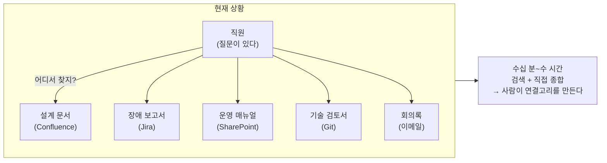

### 1.2 이런 질문에 바로 답할 수 있는가

다음 질문들에 지금 즉시 답할 수 있다면, 이 세미나가 필요 없을 수도 있습니다.

- "우리 시스템 중 Log4j를 사용하는 것이 어디어디이고, 담당 팀은 어디인가?"
- "A 규정이 개정되면 영향받는 업무 절차와 조직은 어디인가?"
- "지난 3년간 비슷한 유형의 장애가 반복됐다면, 공통 원인은 무엇인가?"
- "이 기술을 가장 잘 아는 사람이 팀을 떠났을 때, 그 지식은 어디에 있는가?"

이 질문들의 공통점은 **단순히 문서를 찾는 것**이 아니라 **문서 간의 관계를 따라가며 추론**해야 한다는 점입니다. 그것이 이 세미나의 출발점입니다.

---

## 2. RAG란 무엇인가 — 검색과 생성의 결합

### 2.1 LLM만 쓰면 어떤 문제가 생기는가

ChatGPT나 Claude 같은 LLM(Large Language Model)은 놀라운 능력을 가졌지만, 우리 조직 내부 문서는 알지 못합니다. 모델이 학습한 공개 데이터에 없는 정보를 물으면 **그럴듯하지만 틀린 답변**을 생성하는 환각(Hallucination) 현상이 발생합니다.

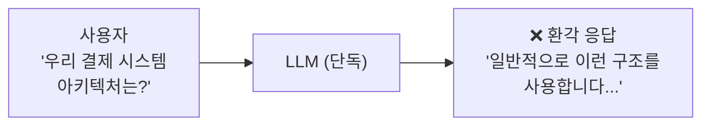

### 2.2 RAG의 발상 — 먼저 찾고, 그 다음 생성한다

RAG(Retrieval-Augmented Generation)는 2020년 Meta AI가 제안한 구조로, 이 문제를 우아하게 해결합니다. LLM이 직접 답을 생성하기 전에 **먼저 관련 문서를 검색**하고, 그 내용을 바탕으로 답변을 만들게 합니다.

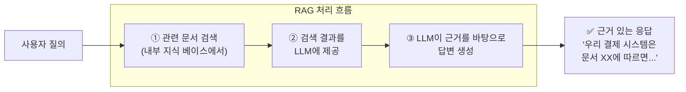

RAG는 LLM을 재학습하지 않고도 내부 문서에 근거한 정확한 답변을 만들 수 있습니다. 지식 베이스를 업데이트하면 최신 정보도 즉시 반영됩니다.

### 2.3 RAG의 기본 구성 요소

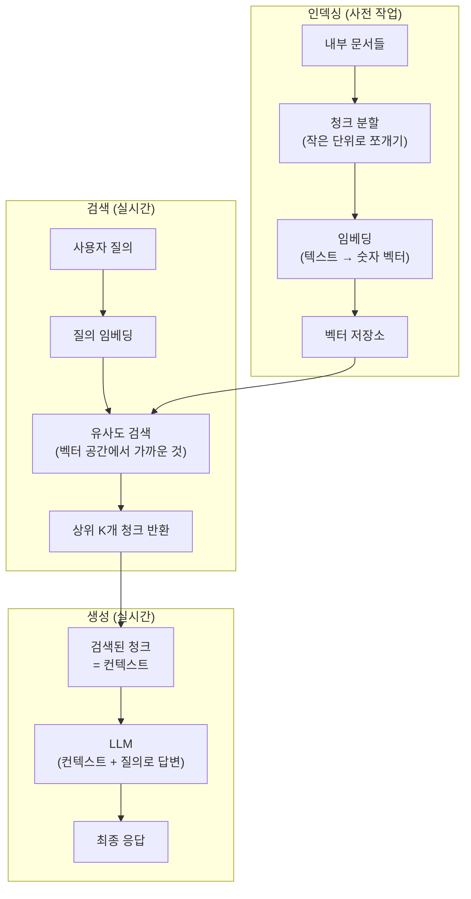

---

## 3. 기존 RAG의 한계 — 무엇이 부족한가

기본 RAG는 많은 문제를 해결하지만, 조직 내 지식 탐색이라는 맥락에서는 네 가지 구조적 한계를 드러냅니다.

### 3.1 어휘 불일치 문제

사용자가 "데이터베이스 연결 오류"라고 검색했는데, 문서에는 "DB 접속 실패"라고 적혀 있다면 벡터 검색은 이 문서를 찾을 수 있지만, 키워드 검색은 놓칩니다. 반대로 정확한 제품 버전이나 CVE 코드처럼 의미보다 정확한 표현이 중요한 경우 벡터 검색이 오히려 약합니다.

어떤 단일 검색 방식도 모든 상황에서 완벽하지 않습니다.

### 3.2 문서 간 관계를 모른다

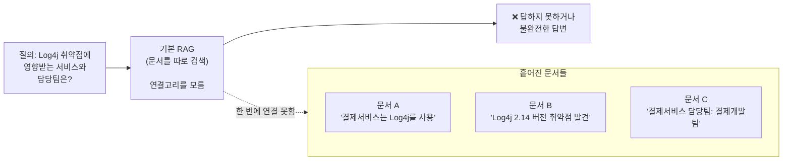

세 문서의 내용을 연결하면 명확한 답이 나오지만, 기본 RAG는 문서를 **독립적으로** 검색합니다. 정보가 여러 문서에 흩어져 있고, 그 사이의 관계를 따라가야 하는 질의는 구조적으로 취약합니다.

### 3.3 멀티홉 추론이 어렵다

멀티홉(Multi-hop) 질의란 답을 구하기 위해 여러 단계의 추론이 필요한 질의입니다.

```
예: "X 팀이 담당하는 서비스에서 사용하는 취약한 라이브러리 목록은?"

필요한 추론 경로:
X 팀 → 담당 서비스 목록 → 각 서비스의 라이브러리 → 취약점 연결

단계마다 정보를 찾고, 결과를 다음 단계 입력으로 연결해야 함
```

이런 질의는 단순 문서 검색으로는 완전하게 처리하기 어렵습니다.

### 3.4 한계 요약

| 한계 | 설명 | 영향 |
|---|---|---|
| 어휘 불일치 | 표현이 다르면 검색 누락 | 재현율(Recall) 저하 |
| 관계 부재 | 문서 간 연결고리 없음 | 복합 질의 불가 |
| 멀티홉 불가 | 단계적 추론 어려움 | 영향도 분석 불가 |
| 전체 조망 어려움 | 일부 문서만 샘플링 | 패턴 발견 한계 |

---

## 4. GraphRAG의 등장 — 관계를 이해하는 검색

### 4.1 핵심 아이디어

GraphRAG는 2024년 Microsoft Research가 제안한 접근법으로, 기존 RAG의 한계를 극복하기 위해 **지식그래프(Knowledge Graph)** 를 검색 과정에 결합합니다.

핵심 발상은 간단합니다. 문서를 그대로 검색하는 대신, 문서에서 **엔터티(Entity)** 와 그 사이의 **관계(Relation)** 를 추출하여 그래프로 구성하고, 질의 시 그래프를 탐색하여 연결된 지식을 확장합니다.

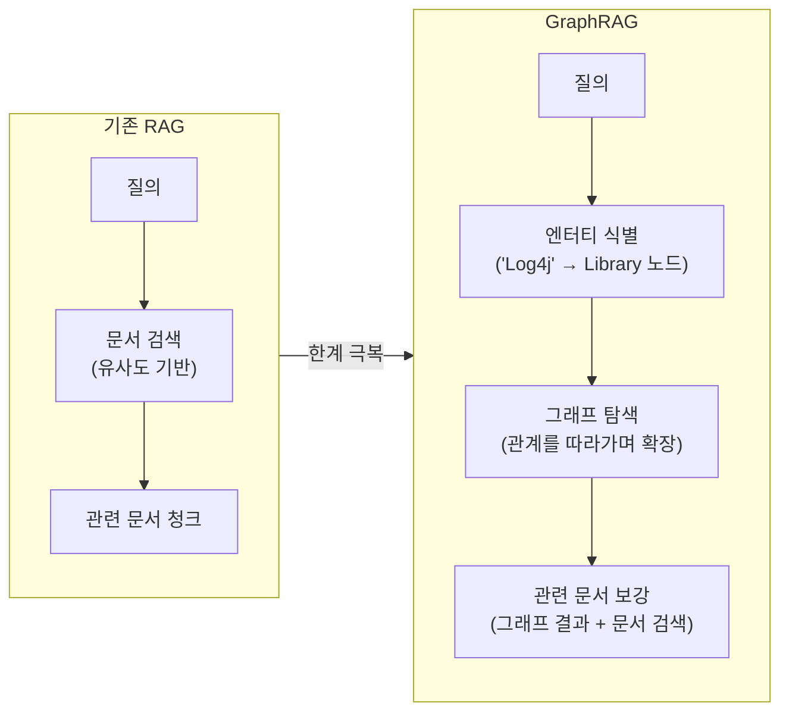

### 4.2 지식그래프란 무엇인가

지식그래프는 현실 세계의 개체(Entity)들과 그 사이의 관계(Relation)를 그래프 형태로 표현한 구조입니다. 가장 기본 단위는 **주어 — 관계 — 목적어** 형태의 트리플(Triple)입니다.

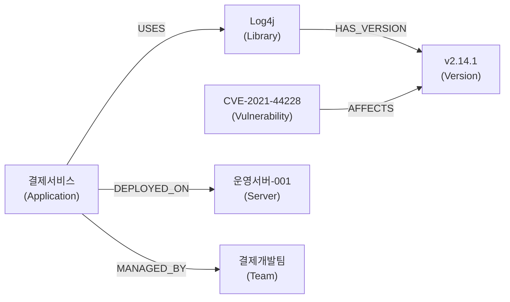

이 그래프가 있으면 "Log4j 취약점에 영향받는 서비스와 담당팀"을 그래프를 따라가며 한 번에 찾을 수 있습니다.

### 4.3 GraphRAG가 답하는 방식

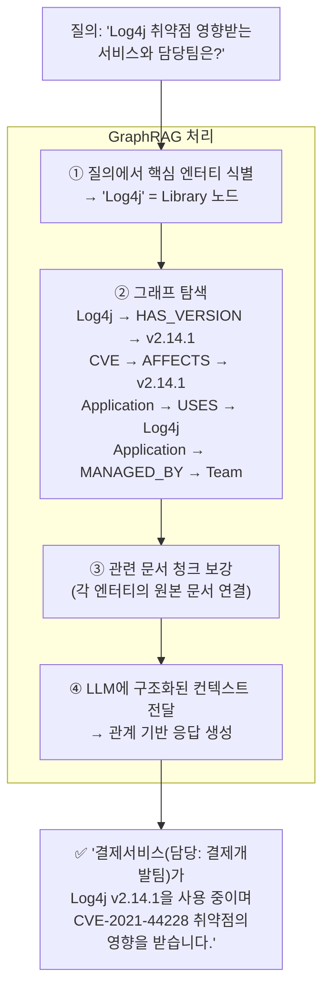

---

## 5. Knowledge Graph와 Neo4j — 관계를 저장하는 방법

### 5.1 왜 일반 데이터베이스로는 부족한가

관계형 데이터베이스(RDB)에서 관계를 표현하려면 조인(JOIN) 연산이 필요합니다. 관계가 복잡해질수록 조인이 깊어지고 성능이 급격히 저하됩니다. 3단계, 4단계 깊이의 관계 탐색은 RDB에서 매우 비효율적입니다.

반면 그래프 데이터베이스는 관계를 일등 시민(First-class citizen)으로 저장합니다. 노드에서 노드로 이동하는 것이 포인터 추적으로 이루어지기 때문에, 관계가 깊어져도 성능이 선형적으로 유지됩니다.

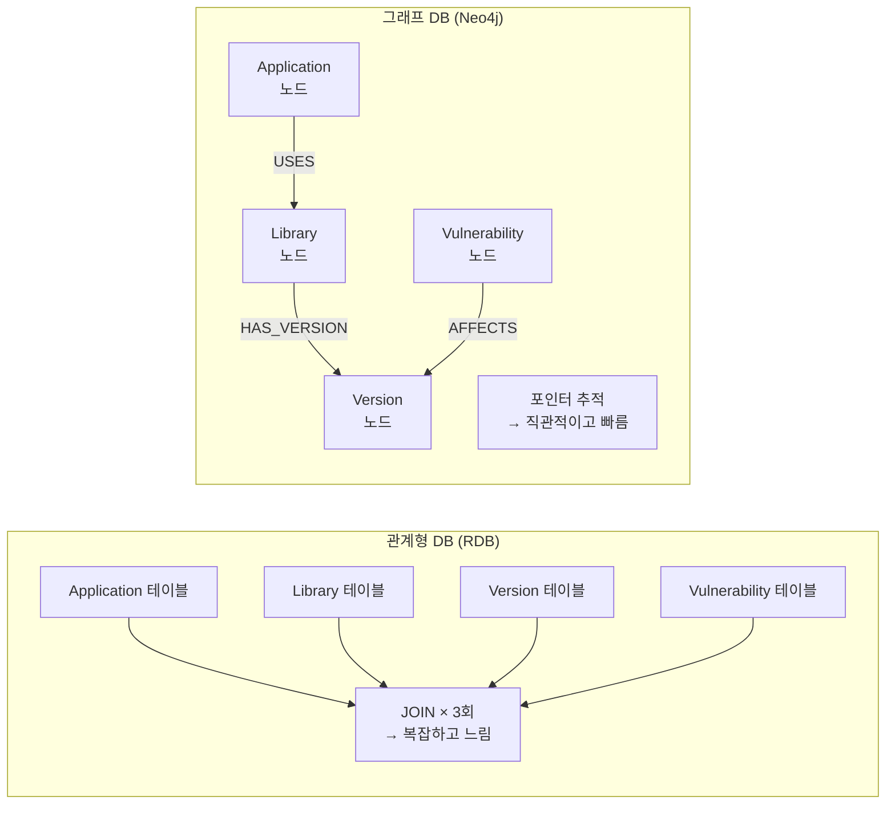

### 5.2 Neo4j 소개

Neo4j는 세계에서 가장 널리 사용되는 그래프 데이터베이스로, 2007년에 첫 출시 이후 지속적으로 발전해왔습니다. GraphRAG 구현에 특히 적합한 이유는 다음과 같습니다.

**Cypher 질의 언어**: 그래프 패턴을 ASCII-art 스타일로 직관적으로 표현합니다. SQL을 알면 비교적 쉽게 배울 수 있습니다.

**벡터 인덱스 내장 (v5.x~)**: 그래프 탐색과 벡터 유사도 검색을 단일 데이터베이스에서 동시에 수행할 수 있습니다.

**전문 검색 인덱스**: Lucene 기반 전문 검색(BM25)도 내부에서 지원합니다.

**풍부한 GraphRAG 생태계**: LangChain, LlamaIndex, neo4j-graphrag-python 공식 라이브러리 등과 잘 통합됩니다.

### 5.3 Cypher — 그래프를 질의하는 언어

```cypher
-- "Log4j를 사용하는 서비스와 담당팀 찾기"
MATCH (lib:Library {name: 'Log4j'})
      <-[:USES]-(app:Application)
      -[:MANAGED_BY]->(team:Team)
RETURN app.name AS 서비스, team.name AS 담당팀

-- "CVE-2021-44228에 영향받는 서비스 전체 탐색 (멀티홉)"
MATCH (vuln:Vulnerability {cve_id: 'CVE-2021-44228'})
      -[:AFFECTS]->(ver:Version)
      <-[:HAS_VERSION]-(lib:Library)
      <-[:USES]-(app:Application)
      -[:MANAGED_BY]->(team:Team)
RETURN app.name, team.name, ver.version_number
```

Cypher의 `(노드)-[관계]->(노드)` 패턴은 그래프를 마치 그림을 그리듯 표현합니다. 복잡한 멀티홉 탐색도 자연스럽게 작성할 수 있습니다.

### 5.4 Neo4j의 GraphRAG 데이터 모델

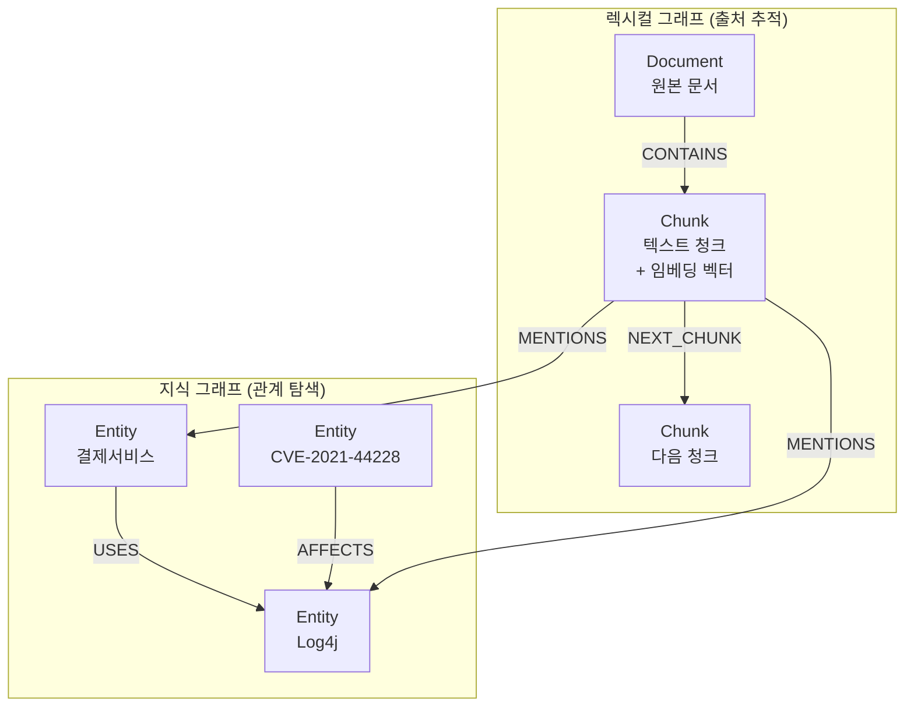

렉시컬 그래프는 청크와 원본 문서를 연결하여 근거 추적을 가능하게 하고, 지식 그래프는 엔터티 간 관계를 통해 탐색을 가능하게 합니다.

---

## 6. Hybrid Search — 네 가지 검색의 협력

### 6.1 왜 하나의 검색 방식으로는 부족한가

현실의 질의는 매우 다양합니다. 어떤 질의는 정확한 키워드 매칭이 중요하고, 어떤 질의는 의미적 유사성이 중요하며, 어떤 질의는 관계 탐색이 필요합니다. 단일 검색 방식은 각각의 맹점을 가집니다.

| 검색 방식 | 강점 | 약점 |
|---|---|---|
| BM25 (키워드) | 정확한 용어, 버전 번호, CVE ID | 표현이 달라지면 누락 |
| Dense Vector | 의미 유사도, 자연어 질의 | 정확한 키워드에서 약함 |
| Sparse Vector | 키워드 중요도 가중치 | 단독으로는 한계 |
| Graph Search | 관계 탐색, 멀티홉 추론 | 그래프 구축 필요 |

### 6.2 네 가지를 합치면

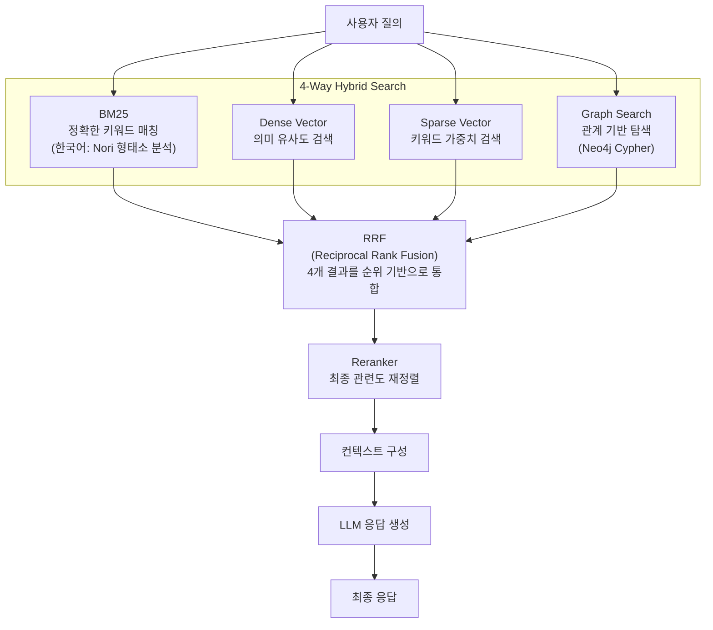

### 6.3 RRF란 무엇인가

RRF(Reciprocal Rank Fusion)는 서로 다른 검색 방식의 결과를 통합하는 알고리즘입니다. 각 방식의 점수 체계가 달라도, **순위(rank)** 를 기반으로 통합하기 때문에 편향 없이 결과를 합칠 수 있습니다.

```
아이디어: "여러 방식에서 공통으로 높은 순위를 차지하는 문서는
          진짜로 관련성이 높을 가능성이 크다."

RRF 점수 = Σ 1 / (60 + 각 방식에서의 순위)
```

어떤 문서가 BM25에서 1위, Dense에서 3위, Graph에서 2위를 차지했다면, 세 방식 모두에서 상위권인 만큼 최종 결과에서도 높은 순위를 얻습니다.

### 6.4 한국어 환경에서 BM25의 함정

한국어는 형태소 분리 없이 BM25를 적용하면 검색 품질이 크게 저하됩니다. "검색한다"와 "검색", "시스템의"와 "시스템"이 다른 토큰으로 처리되기 때문입니다.

Elasticsearch의 Nori 플러그인을 적용하면 한국어 형태소를 올바르게 분리하여 BM25의 효과를 온전히 얻을 수 있습니다. **Nori 설정은 인덱스 구성 시 명시적으로 확인해야 하는 항목**입니다.

---

## 7. 문서를 지식으로 — ETL 파이프라인 개요

### 7.1 전체 흐름

원본 문서에서 검색 가능한 지식 구조를 만드는 과정은 크게 세 단계로 구성됩니다.

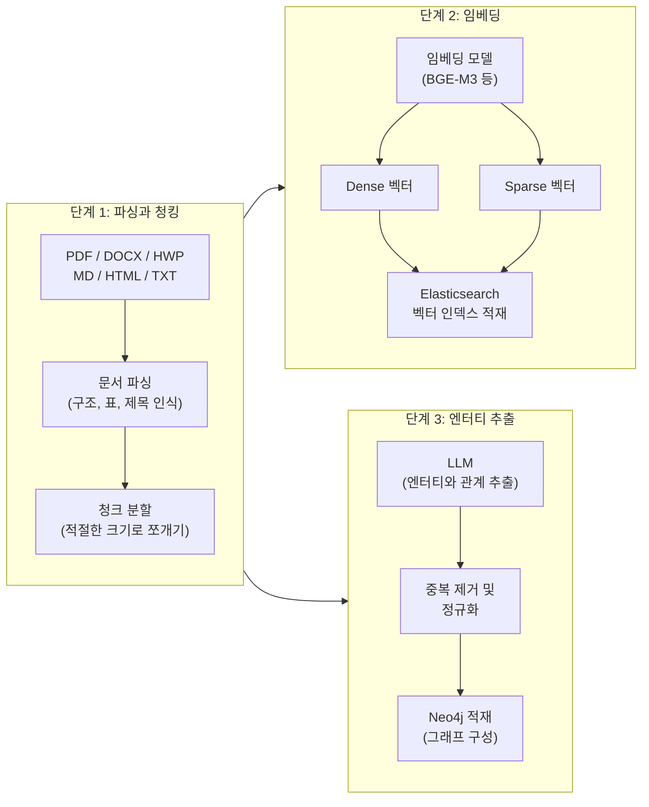

### 7.2 청크 크기가 중요한 이유

청크가 너무 크면 하나의 청크에 여러 주제가 섞여 검색 정밀도가 낮아집니다. 청크가 너무 작으면 맥락이 끊기고 청크 수가 너무 많아집니다. 적절한 청크 크기는 도메인과 문서 유형에 따라 달라지므로 실험을 통해 결정해야 합니다.

### 7.3 엔터티 추출에서 주의할 점

LLM을 이용한 엔터티 추출은 편리하지만, 동일한 실세계 개체가 다양한 표현으로 추출될 수 있습니다. "Log4j", "Apache Log4j", "log4j-core"가 모두 별개 노드로 등록되면 그래프 탐색이 의도대로 작동하지 않습니다. 추출 후 정규화와 중복 제거 단계가 반드시 필요합니다.

---

## 8. 전체 시스템 아키텍처

### 8.1 논리 아키텍처

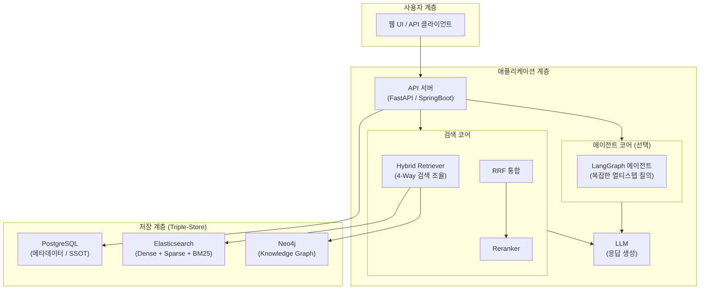

### 8.2 Triple-Store — 세 저장소가 필요한 이유

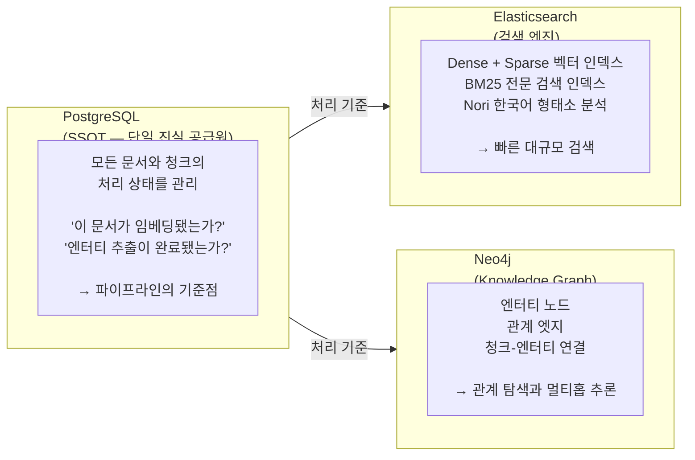

세 저장소가 각자의 역할에 최적화되어 있기 때문에 단일 저장소보다 전체 시스템 품질이 높아집니다. PostgreSQL이 SSOT 역할을 하면서 세 저장소의 데이터 정합성을 보장합니다.

### 8.3 질의 처리 전체 흐름

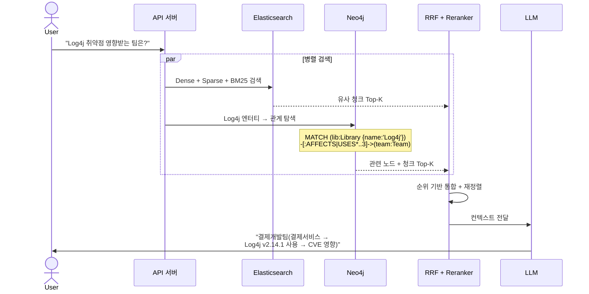

---

## 9. 어디서부터 시작할 것인가

### 9.1 단계적 접근 — 복잡성을 점진적으로 늘린다

한 번에 전체 시스템을 구축하려고 하면 실패하기 쉽습니다. 검색 품질을 측정하면서 단계적으로 기능을 추가하는 것이 안전합니다.

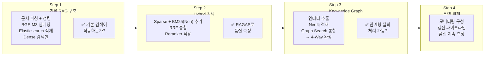

### 9.2 각 단계에서 반드시 확인할 것

**Step 1에서**: Nori 형태소 분석기가 실제로 작동하는지 인덱스 생성 직후 확인합니다. 설정만 하고 실제 적용이 안 된 경우가 발생할 수 있습니다. 한국어 단어로 직접 검색하여 형태소 분리가 되는지 눈으로 확인하세요.

**Step 2에서**: RAGAS 등 평가 지표로 기준선(baseline)을 먼저 측정합니다. 이후 파라미터를 변경할 때 한 번에 하나씩만 바꾸고 영향을 측정합니다. 여러 변수를 동시에 바꾸면 무엇이 효과가 있었는지 알 수 없습니다.

**Step 3에서**: 엔터티 추출 후 중복 여부를 반드시 검토합니다. 그래프의 품질은 엔터티 정규화에서 결정됩니다.

### 9.3 검색 품질은 데이터의 구조화 품질에서 결정된다

시스템 구축에서 자주 빠지는 함정은 더 좋은 LLM이나 더 많은 문서를 추가하면 품질이 올라갈 것이라고 기대하는 것입니다. 실제로는 **청크 품질, 임베딩 품질, 엔터티 추출 정확도** 가 검색 성능에 더 큰 영향을 미칩니다.

헤더, 페이지 번호, 의미 없는 텍스트 단편 같은 노이즈를 청크에서 제거하는 것만으로도 검색 품질이 눈에 띄게 향상되는 경우가 많습니다.

---

## 10. 결론 — 검색에서 지식 탐색으로

### 10.1 이 세미나에서 다룬 핵심 개념

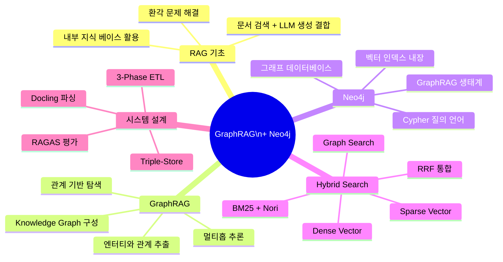

### 10.2 GraphRAG가 열어주는 가능성

기존 Vector RAG가 "관련 문서를 찾는" 시스템이라면, GraphRAG는 "지식을 탐색하는" 시스템입니다. 이 차이는 작아 보이지만 실무에서 처리할 수 있는 질의의 범위를 크게 확장합니다.

관계 기반 질의에 답할 수 있고, 문서 간 연결고리를 따라가며 영향도를 분석할 수 있으며, 전체 문서 집합에서 패턴을 발견할 수 있습니다. 이것이 GraphRAG + Neo4j 조합이 제공하는 핵심 가치입니다.

### 10.3 기술 스택 참고

| 역할 | 기술 선택 | 비고 |
|---|---|---|
| 문서 파싱 | Docling 2.x | HWP 포함 한국어 지원 |
| 임베딩 모델 | BGE-M3 | Dense + Sparse 동시 지원 |
| 벡터 + BM25 검색 | Elasticsearch 8.x | Nori 플러그인 필수 |
| Knowledge Graph | Neo4j 5.x | 벡터 인덱스 내장 |
| 메타데이터 관리 | PostgreSQL | SSOT 역할 |
| AI 서비스 | FastAPI + LangGraph | Python 에코시스템 |
| RAG 평가 | RAGAS | 자동화된 품질 측정 |

---

## 별첨 — 온톨로지: 지식 구조를 정의하는 방법

> 이 내용은 본 세미나의 심화 주제로, Knowledge Graph를 더 정밀하게 설계하고 싶을 때 참고합니다.

### 별첨 1. 온톨로지란 무엇인가

Knowledge Graph에서 단순히 노드와 엣지를 연결한다고 해서 유용한 시스템이 되는 것은 아닙니다. **어떤 개체를 엔터티로 볼 것인지, 어떤 관계를 정의할 것인지, 관계의 방향은 어떻게 통제할 것인지**를 사전에 명확히 정의해야 합니다. 이것이 온톨로지(Ontology)의 역할입니다.

온톨로지는 그리스어로 "존재에 관한 학문"을 뜻하며, 정보공학에서는 **특정 도메인의 개념, 관계, 제약 조건을 형식적으로 표현한 명세**를 의미합니다.

비유하면, 온톨로지는 데이터베이스의 스키마(Schema)와 유사하지만, 단순한 구조 정의를 넘어 **개념들 사이의 의미 있는 관계**까지 포함합니다.

### 별첨 2. 온톨로지가 없으면 어떤 문제가 생기는가

온톨로지 없이 LLM에게 자유롭게 엔터티를 추출하게 하면 다음 문제가 발생합니다.

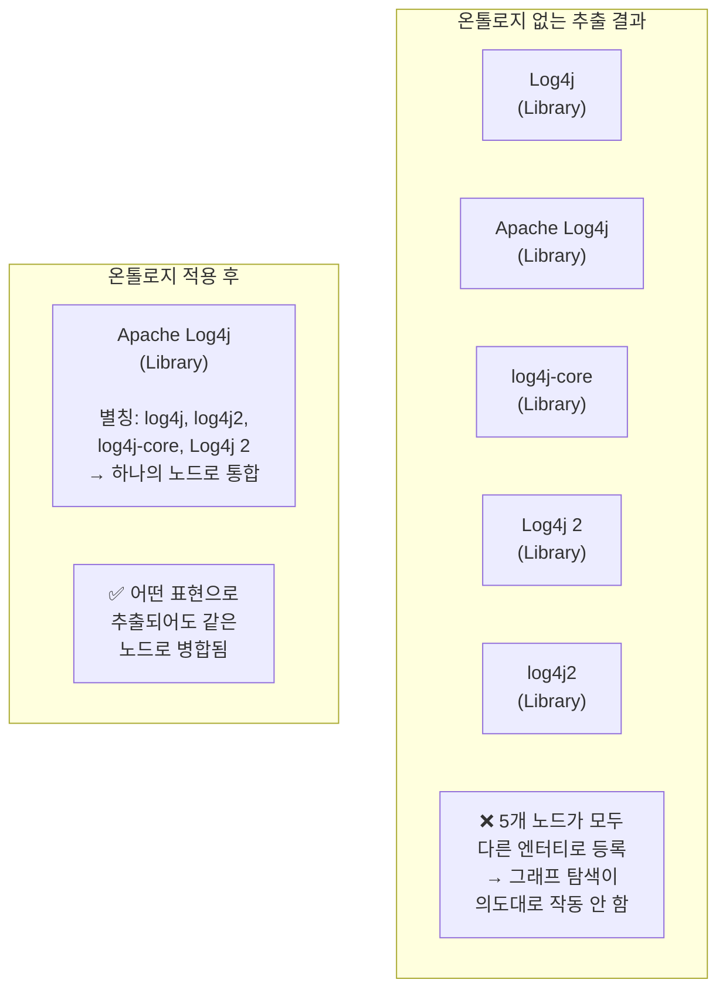

### 별첨 3. IT 시스템 도메인 온톨로지 예시

아키텍처팀 관점에서 IT 시스템 도메인에 적합한 최소한의 온톨로지 설계 예시입니다.

**엔터티 유형 (Node Types)**

| 유형 | 설명 | 예시 |
|---|---|---|
| `Application` | 소프트웨어 애플리케이션 | 결제서비스, 인증서버 |
| `Library` | 외부 라이브러리 / 프레임워크 | Log4j, Spring Boot |
| `Vulnerability` | 보안 취약점 | CVE-2021-44228 |
| `Server` | 서버 / 컨테이너 | 운영서버-001 |
| `Service` | 외부 제공 서비스 | 외부결제 API |
| `Team` | 담당 조직 / 팀 | 결제개발팀 |
| `Version` | 소프트웨어 버전 | Log4j v2.14.1 |
| `Regulation` | 규정 / 정책 | 개인정보보호법 제17조 |

**관계 유형 (Relation Types)**

| 관계 | 방향 | 의미 |
|---|---|---|
| `USES` | Application → Library | 라이브러리 사용 |
| `HAS_VERSION` | Library → Version | 버전 보유 |
| `AFFECTS` | Vulnerability → Version | 취약점 영향 |
| `DEPLOYED_ON` | Application → Server | 배포 위치 |
| `PROVIDES` | Application → Service | 서비스 제공 |
| `MANAGED_BY` | Service → Team | 담당 조직 |
| `DEPENDS_ON` | Application → Application | 서비스 간 의존성 |

### 별첨 4. 온톨로지와 자유 추출의 차이

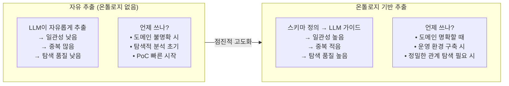

### 별첨 5. 온톨로지 설계 시 핵심 원칙

**최소한으로 시작하라**: 처음부터 완벽한 온톨로지를 설계하려 하면 프로젝트가 지연됩니다. Application, Library, Team, Service 정도의 최소 유형으로 시작하고, 실제 데이터에서 필요성이 확인될 때마다 확장합니다.

**용어를 정규화하라**: "Log4j", "Apache Log4j", "log4j2"처럼 같은 것을 가리키는 다양한 표현을 어떻게 통일할지 미리 정의합니다. LLM 추출 프롬프트에 "항상 공식 이름을 사용하라"는 지시를 포함하면 도움이 됩니다.

**관계의 방향성을 명확히 하라**: `USES(Application → Library)`와 `USED_BY(Library ← Application)`처럼 방향을 명확히 정의해야 Cypher 쿼리가 예측 가능하게 작동합니다.

**점진적으로 확장하라**: 초기 온톨로지는 완전할 수 없습니다. 새로운 도메인이 추가되거나 새로운 질의 유형이 필요해지면 온톨로지도 함께 발전시킵니다.

---

*작성일: 2026-05-11*  
*아키텍처팀*
