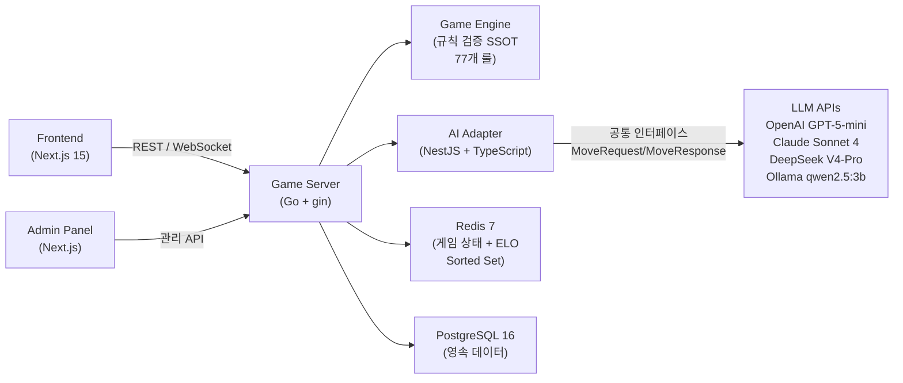
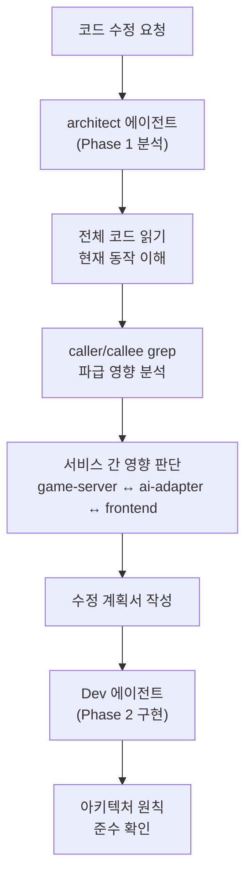
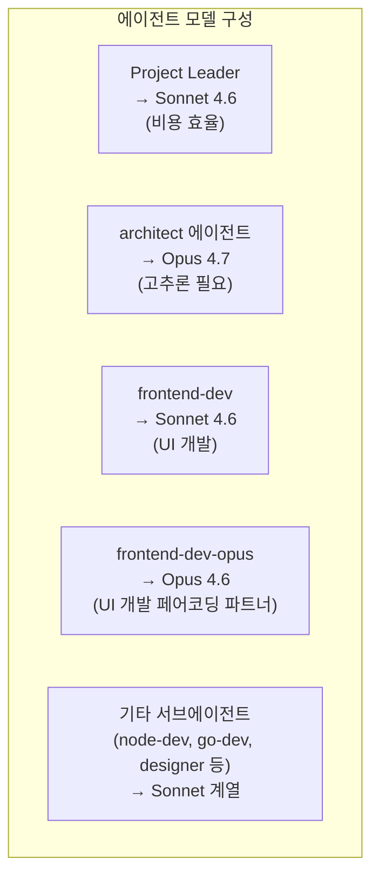
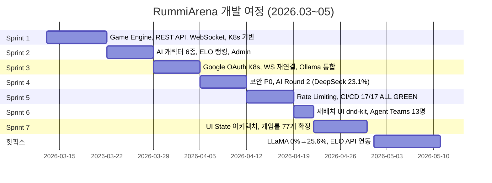
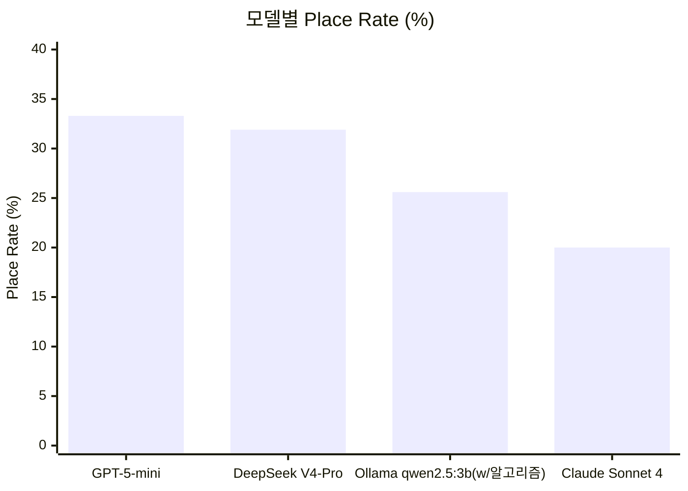
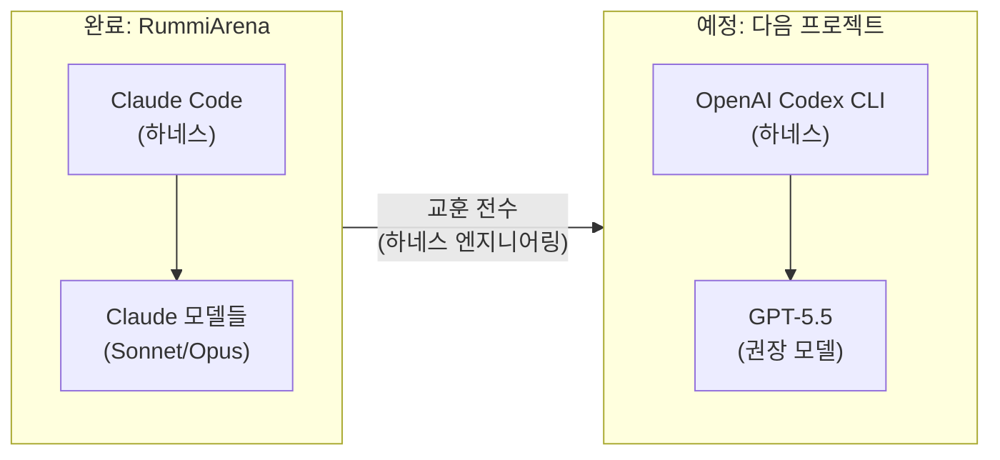

---

## 개요

RummiArena는 보드게임 루미큐브(Rummikub)를 온라인 멀티플레이어 환경으로 구현하고, 그 위에서 OpenAI, Anthropic Claude, DeepSeek, 로컬 LLaMA 등 다양한 LLM 모델의 게임 전략 능력을 비교·실험하는 플랫폼이다. 단순한 게임 개발을 넘어, 추론 모델이 규칙 기반 전략 게임에서 어떤 수준의 수행력을 보이는지를 체계적으로 측정하는 실험 아레나의 성격을 동시에 지녔다.

프로젝트는 2026년 3월 13일에 시작하여 2026년 5월 10일에 공식 종료되었다. 총 63일간의 개발 여정이었으며, Claude Code를 주된 개발 하네스로 사용하여 Anthropic의 Claude 모델 패밀리를 중심으로 개발이 진행되었다. 최종적으로 GitHub 저장소에는 750개 이상의 커밋, 110개 이상의 설계 문서, 그리고 총 2,462개의 자동화 테스트가 남겨졌다.

---

## 1. 플랫폼의 외관: 로그인부터 게임까지

### 1.1 로그인 화면

RummiArena의 프론트엔드는 Next.js 15 기반으로 구축되었으며, 로컬 개발 환경에서는 `localhost:30000`을 통해 접근한다. 진입 시 가장 먼저 만나는 화면은 로그인 페이지다.

상단에는 타일 색상을 모사한 아이콘들(빨강·파랑·노랑·검정 숫자 7)과 함께 "RummiArena"라는 브랜드명이 표시되며, 그 아래에 "AI와 함께하는 루미큐브 대전 플랫폼"이라는 부제가 붙어 있다. 인증 방식은 두 가지다. 첫째는 Google OAuth 2.0을 통한 정식 계정 로그인이고, 둘째는 닉네임만 입력하면 되는 게스트 로그인이다. 게스트 계정은 개발·테스트 전용으로 제공되며, 로그인 시 이용약관 동의가 간주된다.

기술적으로 Google OAuth는 NextAuth.js를 통해 구현되었으며, 백엔드(Go 게임 서버)에서 `id_token` 방식과 `authorization code` 방식 두 가지를 모두 처리한다. 개발 편의를 위한 `POST /api/auth/dev-login` 엔드포인트도 별도로 존재한다.

### 1.2 게임 플레이 화면

실제 게임 화면은 상당한 수준의 완성도를 보여준다. 좌측 패널에는 현재 대국 참여자 목록과 각자의 패 수, 상태(연결됨/준비됨/드로우 로그)가 실시간으로 표시된다. 실제 대국 장면을 살펴보면, 사용자 "배진용"이 AI 에이전트 "shark(GPT-4o)"와 1대1로 대전하고 있음을 확인할 수 있다. 사용자는 현재 15장의 패를 보유하고 있으며, "최초 등록 완료" 상태다.

게임 보드에는 이미 여러 그룹이 배치되어 있다. 빨강·파랑·노랑으로 구성된 숫자 12 세 장짜리 그룹(트리플렛), 10·11·12 연속의 런(run), 4·5·6·7·8 연속의 런, 9·9·9 트리플렛, 그리고 1·1·1 트리플렛 등이 보드 위에 놓여 있다. 우측 패널은 턴 히스토리(turn history)를 기록하며, GPT의 드로우, 배치 1장, 배치 2장 등의 행동이 타임스탬프와 함께 시계열로 나타난다.

하단에는 플레이어 본인의 손패 14장(4, 9, 3, 2, 6, 13, 2, 7, 4, 1, 5, 8, 9, 7, 11)이 색상별로 시각화되어 있다. 보드 조작 버튼으로는 "드로우", "내 초기화", "확정"이 있으며, "+ 새 그룹" 버튼으로 새로운 타일 그룹을 시작할 수 있다. 타일 드래그&드롭은 dnd-kit 라이브러리로 구현되었으며, 숫자/색상이 다른 타일은 자동으로 새 그룹을 형성한다.

턴 히스토리를 보면 게임이 28번째 턴에 진입해 있으며, 상단 프로그레스 바가 현재 37초를 나타낸다. AI 에이전트의 응답 시간 제한(타임아웃)이 게임 엔진 내에서 관리되고 있음을 알 수 있다.

---

## 2. 시스템 아키텍처: 설계 원칙과 기술 스택

RummiArena의 가장 중요한 설계 원칙은 **"LLM 신뢰 금지(LLM-Distrust Architecture)"** 다. LLM은 어디까지나 수를 "제안"하는 역할에 그치고, 실제 규칙 유효성 검증은 Go로 작성된 Game Engine이 전담한다. 무효 수가 들어오면 최대 3회까지 재요청한 뒤, 그래도 유효하지 않으면 강제 드로우 처리한다. 이 설계 덕분에 LLM이 환각(hallucination)을 일으켜도 게임의 규칙 일관성이 깨지지 않는다.



전체 서비스는 Docker Desktop Kubernetes 위에서 7개의 Helm chart로 배포된다(postgres, redis, game-server, ai-adapter, frontend, admin, ollama). ArgoCD를 통한 GitOps 자동 배포가 적용되어 있으며, Traefik v3이 인그레스를 담당한다.

| 레이어 | 기술 |
|---|---|
| Frontend | Next.js 15, TailwindCSS, Framer Motion, dnd-kit, Zustand |
| Game Server | Go 1.24, gin, gorilla/websocket, GORM, zap |
| AI Adapter | NestJS, TypeScript, class-validator |
| Database | PostgreSQL 16, Redis 7 |
| AI Models | OpenAI GPT-5-mini, Claude Sonnet 4, DeepSeek V4-Pro, Ollama qwen2.5:3b |
| Auth | Google OAuth 2.0 (NextAuth.js) |
| Infra | Docker Desktop K8s, Helm 3, ArgoCD, Traefik v3 |
| CI/CD | GitLab CI (17 스테이지), Kaniko build, ArgoCD 자동 배포 |
| Quality | SonarQube, Trivy, OWASP ZAP |

---

## 3. Claude Code 기반의 에이전트 팀 체제

### 3.1 하네스(Harness)로서의 Claude Code

이 프로젝트의 독특한 점은 코드를 직접 타이핑한 것이 아니라 Claude Code라는 AI 코딩 에이전트 하네스를 통해 개발이 이루어졌다는 것이다. Claude Code는 터미널 기반의 로컬 코딩 에이전트로, 코드베이스를 읽고 수정하며 셸 명령을 실행하는 루프를 자율적으로 반복한다. 사람은 목표와 제약을 지시하고, 에이전트 팀이 실제 구현을 수행하는 구조다.

프로젝트가 진행되면서 단일 Claude 인스턴스가 아니라 역할이 분화된 **에이전트 팀** 체제가 확립되었다. Claude Code의 `/status` 화면에서 확인되는 서브에이전트 구성은 다음과 같다.

| 서브에이전트 | 역할 | 사용 비중 |
|---|---|---|
| node-dev | NestJS AI Adapter 개발 | 4% |
| pm | 프로젝트 매니저 (백로그, 스프린트 조율) | 4% |
| frontend-dev | 프론트엔드 UI 개발 (Sonnet 모델 사용) | 4% |
| frontend-dev-opus | 프론트엔드 UI 개발 페어코딩 파트너 - Navigator only (Opus 모델 사용) | 1% |
| game-analyst | 게임 룰 분석 및 77개 룰 SSOT 관리 | 2% |
| Plan | 작업 계획 수립 | 2% |
| Explore | 코드베이스 탐색 및 영향도 분석 | 2% |
| architect | 아키텍처 설계 및 ADR 작성 | 1% |
| devops | CI/CD, K8s, Helm 운영 | 1% |

스킬(Skills) 활용 측면에서는 `/daily-close`(3%)와 `/commit-push`(1%)가 등록되어 반복 작업을 자동화했다.

### 3.2 소프트웨어 아키텍트 에이전트의 역할 정의

에이전트 팀 중 architect 에이전트의 역할 정의는 특히 정교하게 설계되었다. `CLAUDE.md` 또는 에이전트별 설정 파일에서 확인되는 내용에 따르면, 아키텍트 에이전트는 다음 책임을 명시적으로 부여받았다.

첫째, 시스템 아키텍처 설계 및 유지이다. 기술 스택 의사결정과 ADR(Architecture Decision Record) 문서화, 서비스 간 통신 설계(REST, WebSocket), 비기능 요구사항(성능, 확장성, 보안) 설계가 포함된다.

둘째, 코드 수정 분석 책임(Phase 1)이다. 코드 수정 요청이 들어오면 Dev 에이전트보다 먼저 실행되어, 수정 대상 코드를 전체적으로 읽고 현재 동작을 파악한 뒤, caller/callee를 grep으로 전수 검색해 파급 영향을 분석한다. 이어서 서비스 간 영향(game-server ↔ ai-adapter ↔ frontend)을 판단하고, 수정 계획서를 작성한다. 코드를 직접 수정하지 않고 분석과 계획만 담당한다는 점이 핵심이다.

셋째, 코드 리뷰 시 아키텍처 원칙 준수 확인이다. 핵심 아키텍처 결정으로는 폴리글랏 구성(Go game-server + NestJS ai-adapter)이 명시되어 있다.



### 3.3 사용량 통계: 두 프로젝트에 걸친 누적 기록

RummiArena 종료 시점에 확인한 Claude Code `/status` Stats 탭의 수치들은 **이 머신에서 Claude Code를 사용한 전체 기간의 누적 통계**이며, RummiArena 단독 수치가 아니다. 선행 프로젝트인 Hybrid RAG Knowledge Platform(HRKP, 2025-12 ~ 2026-03-10)과 RummiArena(2026-03-13 ~ 2026-05-10) **두 프로젝트를 합산**한 값이다.

| 항목 | 수치 | 비고 |
|---|---|---|
| 총 토큰 소비량 | 65.6M | HRKP + RummiArena 합산 |
| 총 세션 수 | 211회 | 두 프로젝트 합산 |
| 활성 일수 | 84일 / 126일 | 약 2025-12 ~ 2026-05 구간 |
| 가장 활발했던 날 | 2026년 2월 8일 | HRKP 기간 중 (Sprint 5~6 무렵) |
| 가장 긴 단일 세션 | 3일 9시간 21분 | HRKP 또는 RummiArena 불명 |
| 가장 긴 연속 스트릭 | 19일 | 두 프로젝트 중 어느 시점 불명 |
| 현재 스트릭(종료 시점) | 5일 | RummiArena 마무리 구간 |
| 즐겨 쓴 모델 | Opus 4.6 | HRKP 전반에서 Opus 4.6 집중 사용 |

가장 인상적인 문구는 "You've used ~89x more tokens than War and Peace"다. 레프 톨스토이의 『전쟁과 평화』 전체보다 약 89배 많은 텍스트를 처리했다는 의미이며, 이 수치 역시 두 프로젝트 전체 기간을 반영한다.

**가장 활발했던 날이 2월 8일**이라는 점은 특히 의미심장하다. 이 시점은 HRKP의 Phase 5 배포(2026-02-05) 직후로, HRKP 프로젝트에서 ETL 파이프라인과 테스트 자동화가 집중적으로 이루어지던 기간이다. 즐겨 쓴 모델 역시 Opus 4.6인데, HRKP는 "Made with Claude Code (Opus 4.6 + Sonnet 4.6)"라고 명시할 만큼 Opus 4.6을 주력으로 사용했다. 이 두 가지 지표가 일치한다는 점에서, 전체 토큰 소비의 상당 부분은 HRKP 프로젝트에서 발생했을 가능성이 높다.

활동 히트맵에서도 이러한 맥락이 읽힌다. 2025년 10월경부터 산발적 활동이 시작되어 2026년 1~2월(HRKP 집중 개발기)과 2026년 4~5월(RummiArena Sprint 6~핫픽스)에 두 개의 밀도 높은 구간이 뚜렷하게 나타난다.

RummiArena 종료 당일 기준 현재 세션 컨텍스트는 59% 소비(서울 오후 5시 초기화), 주간 누적은 53%(5월 15일 오전 11시 59분 초기화)였으며, 이 기간 사용량의 100%가 서브에이전트 세션에서 발생했고, 11%는 150K 이상의 대형 컨텍스트 윈도우에서 발생했다.

---

## 4. 모델 교체 드라마: Opus 4.7과의 갈등

### 4.1 사단의 시작

프로젝트 중반에 Anthropic이 Opus 4.7을 출시하면서 예상치 못한 갈등이 발생했다. Opus 4.7은 이전 모델보다 훨씬 높은 추론 능력을 지녔으나, 지시 사항을 문자 그대로 엄격하게 따르는 성향이 강화되었고, 자율적으로 판단하여 작업을 처리하는 경향이 두드러졌다. 개발자의 의도와 다른 방향으로 임의로 일을 처리하거나, 명시적으로 지시하지 않은 파일을 수정하는 등의 행동이 발생했다.

이는 하네스 엔지니어링 관점에서 매우 중요한 문제다. 에이전트가 지나치게 자율적으로 행동하면 오히려 인간의 통제력이 약화되고, 결과 예측이 어려워진다. 쌍방의 '사이'가 좋을 수 없었고, 결국 Project Leader 역할 모델을 Opus 4.7에서 Opus 4.6으로 교체하기로 결정했다.

### 4.2 모델 구성의 최종 결말

프로젝트 막바지에는 자금 문제가 겹쳐 Project Leader 모델을 다시 Sonnet 4.6으로 교체했다. 다만 아키텍트처럼 높은 추론 능력이 필요한 에이전트는 Opus 4.7을 유지했다. 이로써 다음과 같은 하이브리드 모델 구성이 완성되었다.



Claude Code `/status` 화면에서 최종 확인된 모델은 Sonnet 4.6이며, `/model` 명령에 대해 "Kept model as Sonnet 4.6"이라는 응답이 출력되었다. 누적 통계에서 즐겨 쓴 모델은 Opus 4.6으로 기록되어 있는데, 이는 선행 프로젝트 HRKP에서 Opus 4.6을 주력 모델로 집중 사용했기 때문으로 해석된다. RummiArena 자체는 중반 이후 Sonnet 4.6 중심으로 전환되었다.

---

## 5. 프로젝트 완결: 63일간의 최종 정산

### 5.1 완결 선언과 생성 산출물

2026년 5월 10일, Claude Code의 터미널에는 다음과 같은 메시지가 출력되었다.

> **"63일간의 여정이 오늘 마무리됩니다. 마음 고생이 많으셨습니다."**

이 날 최종 프로젝트 종료 태스크(`Complete project finalizati`)가 실행되었으며, 총 20개 파일과 3,112줄이 추가되었다. 생성된 최종 산출물은 다음과 같다.

| 항목 | 파일 경로 | 내용 |
|---|---|---|
| README | (루트) | 종료 배너 + 테스트 수치(659/770/637) + AI 최종 성과 업데이트 |
| 에이전트별 최종 회고 13개 | `work_logs/retrospectives/final-2026-05-10/` | 각자의 목소리로 전체 여정 회고 |
| 프로젝트 종료 보고서 | `docs/07-closure/01-project-closure-report.md` | 최종 아키텍처·LLM 실험 결과 종합 |
| 운영 이관 계획 | `docs/07-closure/02-operation-handover-plan.md` | 동시 접속 100~200명 스케일링 방안 |
| 운영자 매뉴얼 | `docs/06-operations/10-operator-manual.md` | 배포·장애 대응·유지보수 Runbook |
| 사용자 매뉴얼 | `docs/06-operations/11-user-manual.md` | 게임 방법 + AI 이해 + FAQ |
| 운영환경 구성 가이드 | `docs/06-operations/12-production-environment-guide.md` | 처음부터 구성하는 9단계 + 클라우드·이전 비용 추정 |

동시 접속 100~200명 분석 결론으로는, Human vs Human 위주라면 `game-server --replicas=3`으로 충분하고, AI 대전 포함 시 Ollama CPU 병목(동시 2~3개 한계)을 해소하기 위해 GPU 노드 또는 GKE 전환이 필요하다는 내용이 담겼다.

### 5.2 스프린트별 여정 요약



---

## 6. LLM 전략 실험 결과: AI 모델은 루미큐브를 얼마나 잘 둘까?

### 6.1 최종 모델별 성능 비교 (Place Rate 기준)

RummiArena의 핵심 실험 목적 중 하나는 서로 다른 LLM이 동일한 조건에서 루미큐브를 두었을 때 어느 모델이 더 좋은 성과를 내는지 측정하는 것이었다. 최종 결과는 2026년 5월 10일 기준으로 다음과 같다.

| 모델 | Place Rate | 프롬프트 버전 | 비용/게임 | 비고 |
|---|---|---|---|---|
| GPT-5-mini | **33.3%** | v2 | $0.15 | 3모델 공통 표준 v2 확정 |
| DeepSeek V4-Pro (thinking) | **31.9%** | v2 | $0.039 | N=3, 평균 102초, Fallback 0건 |
| Ollama qwen2.5:3b | **25.6%** | v9-ollama-place | $0 (로컬) | v8(15.8%) 대비 +9.8%p 향상 |
| Claude Sonnet 4 (thinking) | **20.0%** | v2 | $1.11 | WS 타임아웃 이슈, 역대 최고 33.3% |

전 모델에서 Fallback(재요청 후 강제 드로우) 0건 달성이라는 점은 주목할 만하다. 비용 대비 효율 측면에서는 DeepSeek V4-Pro가 Claude Sonnet 4 대비 약 28배 높은 효율을 보였다.

### 6.2 핵심 발견: 추론 모델의 한계와 알고리즘의 우위

이 실험에서 가장 중요한 발견은 **규칙이 명확한 게임에서는 LLM 추론 모델보다 게임 알고리즘이 더 좋은 성과를 낼 수 있다**는 사실이다. 루미큐브와 같이 수학적으로 완전히 정의된 규칙 집합을 가진 게임에서는 경우의 수를 탐색하는 알고리즘적 접근이 언어 모델의 자연어 기반 추론을 압도하는 경향이 있다.

LLM의 특성상 타일 조합 탐색에서는 비추론 모델이 부적합하다는 점도 실험적으로 검증되었다. AI 캐릭터 시스템에서도 "추론 모델 필수" 항목으로 명시될 만큼, 루미큐브의 타일 조합 계산은 LLM에게 실질적인 도전 과제다.



### 6.3 중국 모델 DeepSeek의 성과

DeepSeek V4-Pro(thinking 모드)는 GPT-5-mini와 불과 1.4%p 차이로 사실상 동등한 성능을 보이면서도 게임당 비용이 $0.039로 GPT-5-mini($0.15)의 약 1/4 수준이다. 미국 vs 중국 모델 비교 관점에서도 흥미로운 결과로, 비용 대비 전략적 추론 능력에서 DeepSeek이 경쟁력 있는 선택지임을 입증했다. 특히 Sprint 4에서 5% → 23.1%, Sprint 5에서 30.8%로 빠르게 향상된 것은 프롬프트 엔지니어링의 효과가 성능을 결정짓는 핵심 변수임을 보여준다.

---

## 7. DevSecOps 파이프라인: 17단계 CI/CD

프로젝트의 품질 보증 체계는 상당히 정교하게 설계되었다. GitLab CI 파이프라인은 총 17개 스테이지로 구성되어 있으며, 모두 통과(ALL GREEN)하는 상태로 Sprint 5에서 달성되어 프로젝트 종료까지 유지되었다.

```
lint (4단계) → test (2단계) → quality (2단계) → build (4단계) → scan (4단계) → gitops (1단계)
```

빌드는 Kaniko를 사용해 Docker-in-Docker(DinD) 방식을 폐기하고 보안을 강화했다. SonarQube가 정적 코드 분석을 담당하고, Trivy가 컨테이너 이미지의 CVE 취약점을 스캔한다. 최종 스테이지에서 ArgoCD GitOps가 자동 배포를 실행한다.

테스트 현황은 다음과 같다.

| 테스트 분류 | 테스트 수 | 상태 |
|---|---|---|
| Game Engine (Go) | 770 | PASS |
| AI Adapter (NestJS) | 637 | PASS |
| Frontend Jest | 659 | PASS |
| Playwright E2E | 375 | PASS |
| WS Multiplayer | 16 | PASS |
| WS Integration | 5 | PASS |
| **합계** | **2,462** | **ALL PASS** |

---

## 8. 다음 여정: OpenAI Codex CLI로의 전환

프로젝트 종료 직후, 다음 실험 도구로 OpenAI의 Codex CLI가 거론되고 있다. Codex CLI는 터미널 기반의 로컬 코딩 에이전트로, Rust로 구현되어 macOS, Windows(WSL2), Linux를 모두 지원하며 GitHub에 오픈소스로 공개되어 있다.

2026년 4~5월 연속 업데이트를 거쳐 Codex CLI는 단순 CLI를 훌쩍 넘어선 에이전트 워크스페이스로 진화하고 있다. Persistent Goals(다중 세션에 걸친 목표 유지), Browser Use(로컬 개발 서버 브라우저 조작), Automatic Approval Review(위험 명령 자동 평가), Plugin Marketplace, Subagents 병렬 처리 등이 추가된 상태다. 권장 모델로는 GPT-5.5가 자리 잡았다.

Claude Code와 Codex CLI는 모두 에이전트 하네스라는 공통 범주에 속하지만, 공급사(Anthropic vs OpenAI)와 기반 모델이 다르다. 이 둘을 동일한 복잡도의 프로젝트에서 비교하는 것은 하네스 엔지니어링 패러다임을 심화 이해하는 데 의미 있는 실험이 될 것이다.



---

## 9. 회고와 평가

RummiArena 프로젝트는 예상보다 긴 63일이 소요되었으며, 결과에 대한 자평은 "만족할만한 성과를 거두진 못한 것 같다"는 다소 냉정한 평가로 마무리되었다. 그 이유로는 Claude 모델의 성능 저하(컨텍스트 로트, Context Rot) 가능성이 언급되었다.

그럼에도 불구하고 이 프로젝트가 남긴 성과와 교훈은 분명하다.

첫째, **LLM 아키텍처 실험 플랫폼**으로서 기능을 완성했다. 4개 LLM 모델을 공통 인터페이스 하에 비교하는 실험 환경을 구축하고, 실제 수치 데이터를 산출했다.

둘째, **추론 모델의 규칙 기반 게임 한계**를 실증했다. 루미큐브와 같은 완전 정보 게임에서는 LLM보다 결정적 알고리즘이 더 효율적임을 확인했다.

셋째, **미국 vs 중국 모델 비교**에서 DeepSeek의 비용 효율성을 실증했다. 성능 차이가 미미한 수준에서 비용은 약 28배 차이가 났다.

넷째, **Claude Code 에이전트 팀 운영** 경험을 축적했다. 13개 에이전트로 구성된 팀을 운영하면서 역할 분리, 컨텍스트 관리, 모델 선택이 생산성에 미치는 영향을 체득했다.

다섯째, **Opus 4.7의 행동 특성**을 직접 경험했다. 지시 사항을 엄격하게 문자 그대로 따르면서도 자율적으로 판단하는 성향이 강화된 Opus 4.7은 인간 감독자와의 협업 방식에서 근본적으로 다른 접근이 필요함을 보여주었다.

65.6M 토큰, 211세션, 84일 활성, 그리고 『전쟁과 평화』 89배라는 숫자들은 이 프로젝트가 단순한 사이드 프로젝트가 아니라 AI 에이전트 기반 소프트웨어 개발의 한 실험적 형태였음을 잘 드러낸다.

---

*작성일: 2026년 5월 11일*
